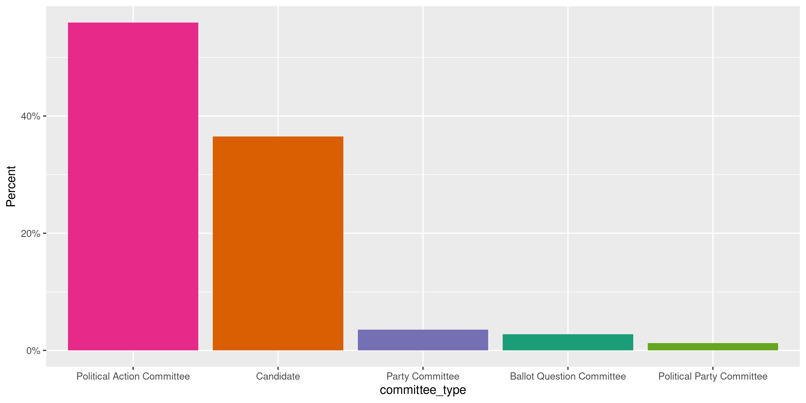
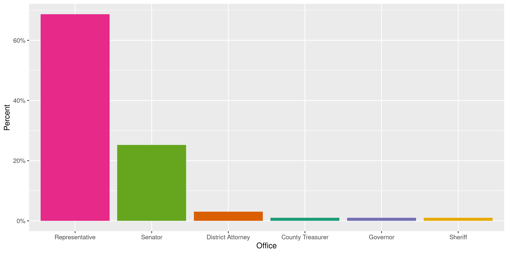
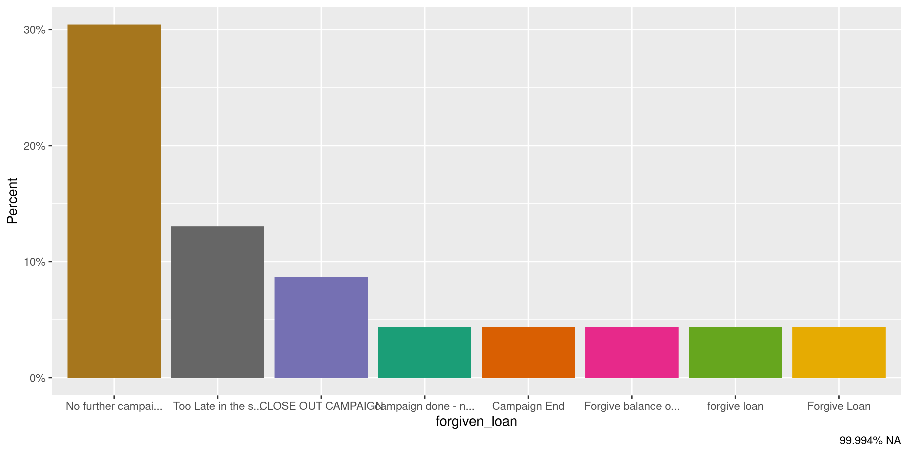
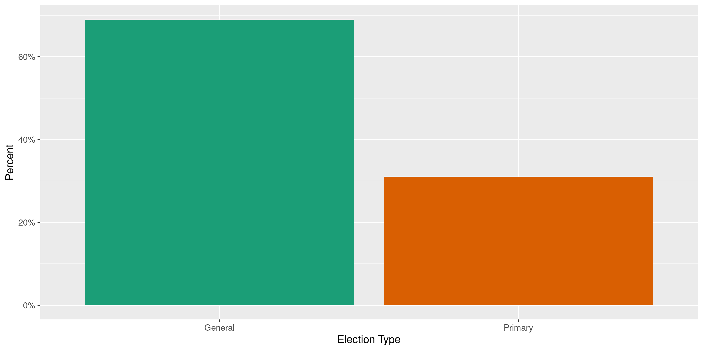
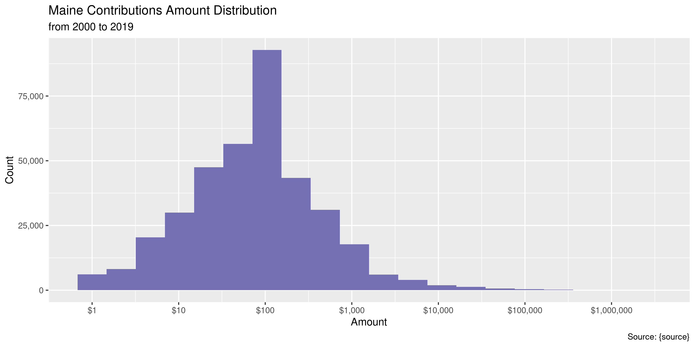
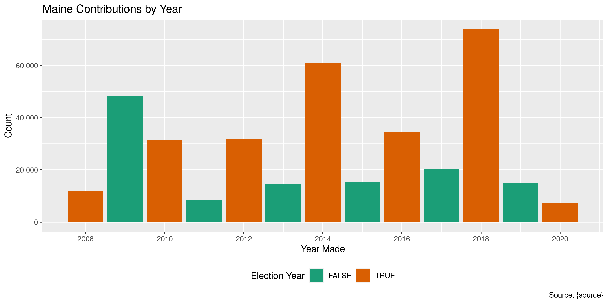
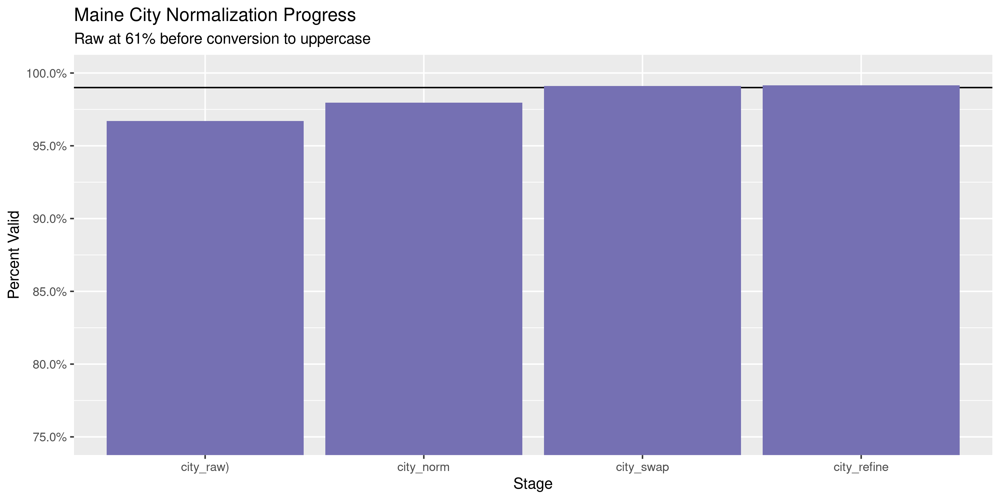
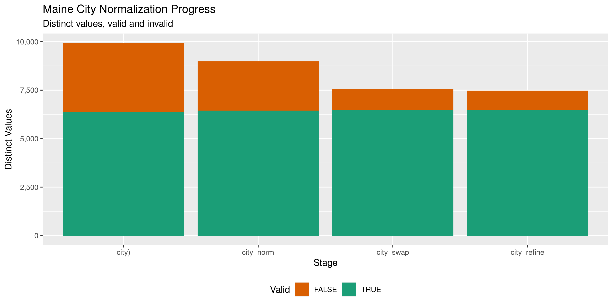

Maine Contributions
================
Kiernan Nicholls
2020-04-30 15:07:25

<!-- Place comments regarding knitting here -->

## Project

The Accountability Project is an effort to cut across data silos and
give journalists, policy professionals, activists, and the public at
large a simple way to search across huge volumes of public data about
people and organizations.

Our goal is to standardizing public data on a few key fields by thinking
of each dataset row as a transaction. For each transaction there should
be (at least) 3 variables:

1.  All **parties** to a transaction.
2.  The **date** of the transaction.
3.  The **amount** of money involved.

## Objectives

This document describes the process used to complete the following
objectives:

1.  How many records are in the database?
2.  Check for entirely duplicated records.
3.  Check ranges of continuous variables.
4.  Is there anything blank or missing?
5.  Check for consistency issues.
6.  Create a five-digit ZIP Code called `zip`.
7.  Create a `year` field from the transaction date.
8.  Make sure there is data on both parties to a transaction.

## Packages

The following packages are needed to collect, manipulate, visualize,
analyze, and communicate these results. The `pacman` package will
facilitate their installation and attachment.

The IRW’s `campfin` package will also have to be installed from GitHub.
This package contains functions custom made to help facilitate the
processing of campaign finance data.

``` r
if (!require("pacman")) install.packages("pacman")
pacman::p_load_gh("irworkshop/campfin")
pacman::p_load(
  tidyverse, # data manipulation
  lubridate, # datetime strings
  snakecase, # string convert
  gluedown, # print markdown
  magrittr, # pipe operators
  janitor, # dataframe clean
  batman, # parse logical
  refinr, # cluster and merge
  scales, # format strings
  knitr, # knit documents
  vroom, # read files fast
  rvest, # read html pages
  glue, # combine strings
  here, # relative storage
  fs # search storage 
)
```

This document should be run as part of the `R_campfin` project, which
lives as a sub-directory of the more general, language-agnostic
[`irworkshop/accountability_datacleaning`](https://github.com/irworkshop/accountability_datacleaning)
GitHub repository.

The `R_campfin` project uses the [RStudio
projects](https://support.rstudio.com/hc/en-us/articles/200526207-Using-Projects)
feature and should be run as such. The project also uses the dynamic
`here::here()` tool for file paths relative to *your* machine.

``` r
# where does this document knit?
here::here()
#> [1] "/home/kiernan/Code/accountability_datacleaning/R_campfin"
```

## Data

## Import

### Download

``` r
raw_dir <- dir_create(here("me", "contribs", "data", "raw"))
raw_info <- as_tibble(dir_info(raw_dir))
sum(raw_info$size)
#> 93.4M
raw_info %>% 
  select(path, size, modification_time) %>% 
  mutate(across(path, basename))
#> # A tibble: 13 x 3
#>    path                    size modification_time  
#>    <chr>            <fs::bytes> <dttm>             
#>  1 CON_2008.csv.csv       2.76M 2020-04-30 11:02:52
#>  2 CON_2009.csv.csv       13.5M 2020-04-30 11:03:02
#>  3 CON_2010.csv.csv       7.46M 2020-04-30 10:52:45
#>  4 CON_2011.csv.csv       2.15M 2020-04-30 10:52:50
#>  5 CON_2012.csv.csv          8M 2020-04-30 10:52:58
#>  6 CON_2013.csv.csv       3.58M 2020-04-30 10:53:08
#>  7 CON_2014.csv.csv      14.18M 2020-04-30 10:53:18
#>  8 CON_2015.csv.csv       3.83M 2020-04-30 10:53:24
#>  9 CON_2016.csv.csv       8.32M 2020-04-30 10:53:33
#> 10 CON_2017.csv.csv       4.89M 2020-04-30 10:53:39
#> 11 CON_2018.csv.csv       18.8M 2020-04-30 10:54:02
#> 12 CON_2019.csv.csv       3.97M 2020-04-30 10:54:18
#> 13 CON_2020.csv.csv       1.93M 2020-04-30 10:54:25
```

### Read

#### Fix

``` r
fix_dir <- dir_create(path(dirname(raw_dir), "fix"))
fix_eval <- length(dir_ls(fix_dir)) != nrow(raw_info)
```

``` r
# for old format files
for (f in raw_info$path[1:10]) {
  n <- path(fix_dir, str_c("FIX", basename(f), sep = "_"))
  x <- read_lines(f, skip = 1)
  for (i in rev(seq_along(x))) {
    y <- i - 1
    if (y == 0) {
      next() # skip first
    } else if (str_starts(x[i], "\"\\d+\",") | str_ends(x[y], "\"(Y|N)\"")) {
      next() # skip if good
    } else { # merge if bad
      x[y] <- str_c(x[y], x[i])
      x <- x[-i] # remove bad
    }
  }
  x <- str_remove(x, '(?<=")"(?!,)')
  write_lines(x, n)
  message(basename(n))
}
```

``` r
# new format files
for (f in raw_info$path[11:length(raw_info$path)]) {
  n <- path(fix_dir, str_c("FIX", basename(f), sep = "_"))
  x <- read_lines(f, skip = 1)
  for (i in rev(seq_along(x))) {
    if (str_starts(x[i], "\\d+,\\d+,")) {
      next() # skip if good
    } else { # merge if bad
      x[i - 1] <- str_c(x[i - 1], x[i])
      x <- x[-i] # remove bad
    }
  }
  write_lines(x, n)
  message(basename(n))
}
```

``` r
fix_info <- as_tibble(dir_info(fix_dir))
sum(fix_info$size)
#> 93M
fix_info %>% 
  select(path, size, modification_time) %>% 
  mutate(across(path, basename))
#> # A tibble: 13 x 3
#>    path                        size modification_time  
#>    <chr>                <fs::bytes> <dttm>             
#>  1 FIX_CON_2008.csv.csv       2.75M 2020-04-30 14:39:23
#>  2 FIX_CON_2009.csv.csv      13.45M 2020-04-30 14:39:26
#>  3 FIX_CON_2010.csv.csv       7.43M 2020-04-30 14:39:28
#>  4 FIX_CON_2011.csv.csv       2.15M 2020-04-30 14:39:29
#>  5 FIX_CON_2012.csv.csv       7.97M 2020-04-30 14:39:31
#>  6 FIX_CON_2013.csv.csv       3.57M 2020-04-30 14:39:32
#>  7 FIX_CON_2014.csv.csv      14.12M 2020-04-30 14:39:35
#>  8 FIX_CON_2015.csv.csv       3.82M 2020-04-30 14:39:36
#>  9 FIX_CON_2016.csv.csv       8.29M 2020-04-30 14:39:38
#> 10 FIX_CON_2017.csv.csv       4.87M 2020-04-30 14:39:39
#> 11 FIX_CON_2018.csv.csv      18.72M 2020-04-30 14:39:44
#> 12 FIX_CON_2019.csv.csv       3.96M 2020-04-30 14:39:45
#> 13 FIX_CON_2020.csv.csv       1.93M 2020-04-30 14:39:49
```

#### Compare

``` r
old_names <- read_names(path(raw_dir, "CON_2008.csv.csv"))
new_names <- read_names(path(raw_dir, "CON_2019.csv.csv"))
```

The files come in two structures. For files from 2008 to 2017, there are
`r length(me08)` variables. For the newer files, 2018 and 2019, there
are `r length(me19)`
    variables.

    #>  [1] "OrgID"                     "ReceiptAmount"             "ReceiptDate"              
    #>  [4] "LastName"                  "FirstName"                 "MI"                       
    #>  [7] "Suffix"                    "Address1"                  "Address2"                 
    #> [10] "City"                      "State"                     "Zip"                      
    #> [13] "ReceiptID"                 "FiledDate"                 "ReceiptType"              
    #> [16] "ReceiptSourceType"         "CommitteeType"             "CommitteeName"            
    #> [19] "CandidateName"             "Amended"                   "Description"              
    #> [22] "Employer"                  "Occupation"                "Occupation Comment"       
    #> [25] "Employment Info Requested"
    #>  [1] "OrgID"                            "LegacyID"                        
    #>  [3] "Committee Name"                   "Candidate Name"                  
    #>  [5] "Receipt Amount"                   "Receipt Date"                    
    #>  [7] "Office"                           "District"                        
    #>  [9] "Last Name"                        "First Name"                      
    #> [11] "Middle Name"                      "Suffix"                          
    #> [13] "Address1"                         "Address2"                        
    #> [15] "City"                             "State"                           
    #> [17] "Zip"                              "Description"                     
    #> [19] "Receipt ID"                       "Filed Date"                      
    #> [21] "Report Name"                      "Receipt Source Type"             
    #> [23] "Receipt Type"                     "Committee Type"                  
    #> [25] "Amended"                          "Employer"                        
    #> [27] "Occupation"                       "Occupation Comment"              
    #> [29] "Employment Information Requested" "Forgiven Loan"                   
    #> [31] "ElectionType"

``` r
old_names <- old_names %>% 
  str_replace("^MI$", "Middle Name") %>% 
  str_replace("\\bInfo\\b", "Information")
to_snake_case(old_names) %in% to_snake_case(new_names)
#>  [1] TRUE TRUE TRUE TRUE TRUE TRUE TRUE TRUE TRUE TRUE TRUE TRUE TRUE TRUE TRUE TRUE TRUE TRUE TRUE
#> [20] TRUE TRUE TRUE TRUE TRUE TRUE
```

We can read each type of file into a separate data frame and then
combine the two. Any of the new variables. There are 4 rows with a field
containing double quoation marks. This causes `readr::read_delim()` to
incorectly shift values right one column. We have no choice but to
filter out these 4 records or manually edit the text file.

``` r
me_old_format <- fix_info$path[1:10] %>% 
  map(
    read_delim,
    delim = ",",
    escape_backslash = FALSE,
    escape_double = FALSE,
    col_names = old_names,
    col_types = cols(
      .default = col_character(),
      ReceiptAmount = col_number(),
      ReceiptDate = col_date_usa(),
      FiledDate = col_date_usa()
    )
  ) %>% 
  bind_rows(.id = "id") %>% 
  clean_names() %>% 
  remove_empty("cols") %>% 
  left_join(
    tibble(
      id = as.character(1:10), 
      file = basename(fix_info$path[1:10])
    )
  ) %>% 
  select(-id)
```

``` r
x <- read_lines(fix_info$path[13])
write_lines(x[-344], fix_info$path[13])
```

``` r
me_new_format <- fix_info$path[11:13] %>% 
  map(
    read_delim,
    delim = ",",
    escape_backslash = FALSE,
    escape_double = TRUE,
    col_names = new_names,
    col_types = cols(
      .default = col_character(),
      `Receipt Amount` = col_number(),
      `Receipt Date` = col_date_usa(),
      `Filed Date` = col_date_usa()
    ) 
  ) %>% 
  bind_rows(.id = "id") %>% 
  clean_names() %>% 
  remove_empty("cols") %>% 
  left_join(
    tibble(
      id = as.character(1:3), 
      file = basename(fix_info$path[11:13])
    )
  ) %>% 
  select(-id)
```

``` r
mec <- 
  bind_rows(me_old_format, me_new_format) %>% 
  rename(emp_info_req = employment_information_requested) %>% 
  rename_all(str_remove, "receipt_") %>% 
  rename_all(str_remove, "_name") %>% 
  mutate_at(vars(emp_info_req, amended), to_logical) %>% 
  mutate_at(vars(file), basename) %>% 
  filter(!is.na(amended))
```

``` r
count(mec, emp_info_req)
#> # A tibble: 3 x 2
#>   emp_info_req      n
#>   <lgl>         <int>
#> 1 FALSE        273032
#> 2 TRUE           5638
#> 3 NA            94786
```

## Explore

``` r
glimpse(mec)
#> Rows: 373,456
#> Columns: 32
#> $ org_id             <chr> "3752", "3686", "3536", "3600", "3670", "3670", "3579", "3662", "3662…
#> $ amount             <dbl> 1147.22, 463.45, 100.00, 35.00, 100.00, 100.00, 250.00, 100.00, 100.0…
#> $ date               <date> 2008-01-01, 2008-01-01, 2008-01-01, 2008-01-01, 2008-01-01, 2008-01-…
#> $ last               <chr> NA, NA, "Lewis", NA, "Stevens", "Stevens", "Bryant", "Nadeau", "Marti…
#> $ first              <chr> NA, NA, "Brenda", NA, "Pat", "Win", "Bruce", "Jonathan", "Mary ", "Jo…
#> $ middle             <chr> NA, NA, NA, NA, NA, NA, "S", NA, NA, NA, NA, NA, NA, NA, NA, NA, NA, …
#> $ suffix             <chr> NA, NA, NA, NA, NA, NA, NA, NA, NA, NA, NA, NA, NA, NA, NA, NA, NA, N…
#> $ address1           <chr> NA, NA, "253 Mills Street", NA, "251 Nowell Rd", "251 Nowell Rd", "PO…
#> $ address2           <chr> NA, NA, NA, NA, NA, NA, NA, NA, NA, NA, NA, NA, NA, NA, NA, NA, NA, N…
#> $ city               <chr> NA, NA, "Whitelfield", NA, "Bangor", "Bangor", "Dixfield", "Fort Kent…
#> $ state              <chr> NA, NA, "ME", NA, "ME", "ME", "ME", "ME", "ME", "ME", "ME", "ME", "ME…
#> $ zip                <chr> NA, NA, "04353", NA, "04401", "04401", "04224-0643", "04743", "14743"…
#> $ id                 <chr> "12227", "24562", "13730", "26103", "24276", "24279", "27524", "13869…
#> $ filed_date         <date> 2008-05-30, 2008-08-06, 2008-04-25, 2008-10-28, 2008-07-22, 2008-07-…
#> $ type               <chr> "Monetary (Unitemized)", "Monetary (Unitemized)", "Monetary (Itemized…
#> $ source_type        <chr> "Transfer from Previous Campaign", "Transfer from Previous Campaign",…
#> $ committee_type     <chr> "Candidate", "Candidate", "Candidate", "Candidate", "Candidate", "Can…
#> $ committee          <chr> NA, NA, NA, NA, NA, NA, NA, NA, NA, NA, NA, NA, "MAINE COALITION TO S…
#> $ candidate          <chr> "Representative Christopher R Barstow", "Representative Richard D Bla…
#> $ amended            <lgl> FALSE, FALSE, FALSE, FALSE, FALSE, FALSE, FALSE, FALSE, FALSE, FALSE,…
#> $ description        <chr> NA, NA, NA, NA, NA, NA, NA, NA, NA, NA, NA, NA, NA, NA, NA, NA, NA, N…
#> $ employer           <chr> NA, NA, "State of Maine", NA, "State of Maine", "Rudman & Winchell", …
#> $ occupation         <chr> NA, NA, "Nurse", NA, "lawyer", "lawyer", "Boiler Operator", "Self Emp…
#> $ occupation_comment <chr> NA, NA, "Nurse", NA, "lawyer", "lawyer", "Boiler Operator", "Self Emp…
#> $ emp_info_req       <lgl> FALSE, FALSE, FALSE, FALSE, FALSE, FALSE, FALSE, FALSE, FALSE, FALSE,…
#> $ file               <chr> "FIX_CON_2008.csv.csv", "FIX_CON_2008.csv.csv", "FIX_CON_2008.csv.csv…
#> $ legacy_id          <chr> NA, NA, NA, NA, NA, NA, NA, NA, NA, NA, NA, NA, NA, NA, NA, NA, NA, N…
#> $ office             <chr> NA, NA, NA, NA, NA, NA, NA, NA, NA, NA, NA, NA, NA, NA, NA, NA, NA, N…
#> $ district           <chr> NA, NA, NA, NA, NA, NA, NA, NA, NA, NA, NA, NA, NA, NA, NA, NA, NA, N…
#> $ report             <chr> NA, NA, NA, NA, NA, NA, NA, NA, NA, NA, NA, NA, NA, NA, NA, NA, NA, N…
#> $ forgiven_loan      <chr> NA, NA, NA, NA, NA, NA, NA, NA, NA, NA, NA, NA, NA, NA, NA, NA, NA, N…
#> $ election_type      <chr> NA, NA, NA, NA, NA, NA, NA, NA, NA, NA, NA, NA, NA, NA, NA, NA, NA, N…
tail(mec)
#> # A tibble: 6 x 32
#>   org_id amount date       last  first middle suffix address1 address2 city  state zip   id   
#>   <chr>   <dbl> <date>     <chr> <chr> <chr>  <chr>  <chr>    <chr>    <chr> <chr> <chr> <chr>
#> 1 364016    100 2020-04-11 Umph… Robe… <NA>   <NA>   47 Seco… <NA>     Pres… ME    "047… 6934…
#> 2 364016   1400 2020-03-24 Tran… <NA>  <NA>   <NA>   <NA>     <NA>     <NA>  ME     <NA> 6746…
#> 3 364356     25 2020-03-30 Nade… Cathy r      <NA>   943 Chi… <NA>     Wins… ME    "049… 6896…
#> 4 364511     25 2020-04-07 Flem… Anne  Chalm… <NA>   41 BEEC… <NA>     YARM… ME    "040… 6936…
#> 5 370916     67 2020-03-16 Fect… Just… <NA>   <NA>   7 DAVIS… <NA>     AUGU… ME    "043… 6936…
#> 6 370916    500 2020-04-20 Samp… Heidi <NA>   <NA>   465 Ken… <NA>     ALFR… ME    "040… 6936…
#> # … with 19 more variables: filed_date <date>, type <chr>, source_type <chr>,
#> #   committee_type <chr>, committee <chr>, candidate <chr>, amended <lgl>, description <chr>,
#> #   employer <chr>, occupation <chr>, occupation_comment <chr>, emp_info_req <lgl>, file <chr>,
#> #   legacy_id <chr>, office <chr>, district <chr>, report <chr>, forgiven_loan <chr>,
#> #   election_type <chr>
```

### Missing

``` r
mec_missing <- col_stats(mec, count_na)
#> # A tibble: 32 x 4
#>    col                class       n          p
#>    <chr>              <chr>   <int>      <dbl>
#>  1 org_id             <chr>       1 0.00000268
#>  2 amount             <dbl>       1 0.00000268
#>  3 date               <date>      0 0         
#>  4 last               <chr>   20991 0.0562    
#>  5 first              <chr>   79893 0.214     
#>  6 middle             <chr>  334260 0.895     
#>  7 suffix             <chr>  371740 0.995     
#>  8 address1           <chr>   26180 0.0701    
#>  9 address2           <chr>  366080 0.980     
#> 10 city               <chr>   25980 0.0696    
#> 11 state              <chr>   13214 0.0354    
#> 12 zip                <chr>   26604 0.0712    
#> 13 id                 <chr>       0 0         
#> 14 filed_date         <date>     30 0.0000803 
#> 15 type               <chr>       0 0         
#> 16 source_type        <chr>    3225 0.00864   
#> 17 committee_type     <chr>       1 0.00000268
#> 18 committee          <chr>  120294 0.322     
#> 19 candidate          <chr>  237819 0.637     
#> 20 amended            <lgl>       0 0         
#> 21 description        <chr>  330379 0.885     
#> 22 employer           <chr>   93872 0.251     
#> 23 occupation         <chr>   86904 0.233     
#> 24 occupation_comment <chr>  157728 0.422     
#> 25 emp_info_req       <lgl>   94786 0.254     
#> 26 file               <chr>       0 0         
#> 27 legacy_id          <chr>  277406 0.743     
#> 28 office             <chr>  373357 1.00      
#> 29 district           <chr>  373360 1.00      
#> 30 report             <chr>  277482 0.743     
#> 31 forgiven_loan      <chr>  373434 1.00      
#> 32 election_type      <chr>  326825 0.875
```

Recipients are divided into committees and candidates. To better flag
records missing *either* type, we will `coalesce()` the two into a
single variable. We can also `unite()` the four contributor name
columns.

``` r
mec <- mec %>% 
  mutate(recipient = coalesce(candidate, committee)) %>% 
  unite(
    col = contributor,
    first, middle, last, suffix,
    sep = " ",
    na.rm = TRUE,
    remove = FALSE
  ) %>% 
  mutate(across(is.character, na_if, ""))
```

After uniting and coalescing the contributor and recipient columns, only
0 records are missing a name, date, or ammount.

``` r
mec <- mec %>% flag_na(date, contributor, amount, recipient)
sum(mec$na_flag)
#> [1] 20779
```

### Duplicates

If we ignore the supposedly (quasi) unique `id` variable, there are a
number of otherwise completely duplicated records. We can flag them with
`campfin::flag_na()`

``` r
mec <- flag_dupes(mec, -id)
percent(mean(mec$dupe_flag), 0.01)
#> [1] "2.45%"
```

``` r
mec %>% 
  filter(dupe_flag) %>% 
  select(date, contributor, amount, recipient)
#> # A tibble: 9,132 x 4
#>    date       contributor amount recipient                
#>    <date>     <chr>        <dbl> <chr>                    
#>  1 2008-01-11 <NA>            25 Ms. Denise Anne Tepler   
#>  2 2008-01-11 <NA>            50 Ms. Denise Anne Tepler   
#>  3 2008-01-11 <NA>            25 Ms. Denise Anne Tepler   
#>  4 2008-01-11 <NA>            50 Ms. Denise Anne Tepler   
#>  5 2008-01-11 <NA>            25 Ms. Denise Anne Tepler   
#>  6 2008-01-20 <NA>            50 Ms. Denise Anne Tepler   
#>  7 2008-01-20 <NA>            50 Ms. Denise Anne Tepler   
#>  8 2008-01-27 <NA>            25 Mr. Ronald J McAllister  
#>  9 2008-01-27 <NA>            25 Mr. Ronald J McAllister  
#> 10 2008-01-29 <NA>            50 Senator Philip L Bartlett
#> # … with 9,122 more rows
```

### Categorical

``` r
col_stats(mec, n_distinct)
#> # A tibble: 36 x 4
#>    col                class       n          p
#>    <chr>              <chr>   <int>      <dbl>
#>  1 org_id             <chr>    3487 0.00934   
#>  2 amount             <dbl>   15159 0.0406    
#>  3 date               <date>   4426 0.0119    
#>  4 contributor        <chr>  173647 0.465     
#>  5 last               <chr>   97265 0.260     
#>  6 first              <chr>   18706 0.0501    
#>  7 middle             <chr>     645 0.00173   
#>  8 suffix             <chr>      27 0.0000723 
#>  9 address1           <chr>  153309 0.411     
#> 10 address2           <chr>    2378 0.00637   
#> 11 city               <chr>   13745 0.0368    
#> 12 state              <chr>     117 0.000313  
#> 13 zip                <chr>   29490 0.0790    
#> 14 id                 <chr>  356092 0.954     
#> 15 filed_date         <date>   2244 0.00601   
#> 16 type               <chr>      12 0.0000321 
#> 17 source_type        <chr>      33 0.0000884 
#> 18 committee_type     <chr>       6 0.0000161 
#> 19 committee          <chr>     773 0.00207   
#> 20 candidate          <chr>    2924 0.00783   
#> 21 amended            <lgl>       2 0.00000536
#> 22 description        <chr>   15529 0.0416    
#> 23 employer           <chr>   56017 0.150     
#> 24 occupation         <chr>   15468 0.0414    
#> 25 occupation_comment <chr>   25044 0.0671    
#> 26 emp_info_req       <lgl>       3 0.00000803
#> 27 file               <chr>      13 0.0000348 
#> 28 legacy_id          <chr>     656 0.00176   
#> 29 office             <chr>       7 0.0000187 
#> 30 district           <chr>      49 0.000131  
#> 31 report             <chr>      45 0.000120  
#> 32 forgiven_loan      <chr>      14 0.0000375 
#> 33 election_type      <chr>       3 0.00000803
#> 34 recipient          <chr>    3648 0.00977   
#> 35 na_flag            <lgl>       2 0.00000536
#> 36 dupe_flag          <lgl>       2 0.00000536
```

``` r
explore_plot(mec, committee_type)
```

<!-- -->

``` r
explore_plot(mec, office)
```

<!-- -->

``` r
explore_plot(mec, forgiven_loan) + 
  scale_x_discrete(label = function(x) str_trunc(x, 20)) +
  labs(caption = paste(percent(prop_na(mec$forgiven_loan), 0.001), "NA"))
```

<!-- -->

``` r
explore_plot(mec, election_type)
```

<!-- -->

### Continuous

#### Amounts

``` r
summary(mec$amount)
#>      Min.   1st Qu.    Median      Mean   3rd Qu.      Max.      NA's 
#> -508237.3      25.0     100.0     824.4     245.7 2500000.0         1
percent(mean(mec$amount <= 0, na.rm = TRUE), 0.01)
#> [1] "0.96%"
```

<!-- -->

#### Dates

We can add the calendar year from the `date` column with
`lubridate::year()`.

``` r
mec <- mutate(mec, year = year(date))
```

The new `year` and `date` columns are very clean.

``` r
min(mec$date)
#> [1] "2008-01-01"
sum(mec$year < 2000)
#> [1] 0
max(mec$date)
#> [1] "2020-04-22"
sum(mec$date > today())
#> [1] 0
```

<!-- -->

## Wrangle

To improve the searchability of the database, we will perform some
consistent, confident string normalization. For geographic variables
like city names and ZIP codes, the corresponding `campfin::normal_*()`
functions are tailor made to facilitate this process.

### Address

For the street `addresss` variable, the `campfin::normal_address()`
function will force consistence case, remove punctuation, and abbreviate
official USPS suffixes.

``` r
mec <- mec %>% 
  unite(
    col = address_full,
    starts_with("address"),
    sep = " ",
    remove = FALSE,
    na.rm = TRUE
  ) %>% 
  mutate(
    address_norm = normal_address(
      address = address_full,
      abbs = usps_street,
      na_rep = TRUE
    )
  ) %>% 
  select(-address_full)
```

``` r
mec %>% 
  select(contains("address")) %>% 
  distinct() %>% 
  sample_n(10)
#> # A tibble: 10 x 3
#>    address1               address2          address_norm                  
#>    <chr>                  <chr>             <chr>                         
#>  1 710 S PETERSON WAY     <NA>              710 S PETERSON WAY            
#>  2 23 VILLA RD.           <NA>              23 VILLA RD                   
#>  3 69 Lamoine Beach Rd    <NA>              69 LAMOINE BCH RD             
#>  4 SEAPORT BANKING CENTER ONE HARBOR STREET SEAPORT BANKING CTR ONE HBR ST
#>  5 91 WESTERN AVE         <NA>              91 WESTERN AVE                
#>  6 113 Kings Hwy          <NA>              113 KINGS HWY                 
#>  7 ROUTE 102              <NA>              RTE 102                       
#>  8 766 Stillwater Ave     PO Box 920        766 STILLWATER AVE PO BOX 920 
#>  9 8501 E TOURMALINE DR   <NA>              8501 E TOURMALINE DR          
#> 10 14 Edwards St          <NA>              14 EDWARDS ST
```

### ZIP

For ZIP codes, the `campfin::normal_zip()` function will attempt to
create valid *five* digit codes by removing the ZIP+4 suffix and
returning leading zeroes dropped by other programs like Microsoft Excel.

``` r
mec <- mec %>% 
  mutate(
    zip_norm = normal_zip(
      zip = zip,
      na_rep = TRUE
    )
  )
```

``` r
progress_table(
  mec$zip,
  mec$zip_norm,
  compare = valid_zip
)
#> # A tibble: 2 x 6
#>   stage    prop_in n_distinct prop_na  n_out n_diff
#>   <chr>      <dbl>      <dbl>   <dbl>  <dbl>  <dbl>
#> 1 zip        0.624      29490  0.0712 130337  18667
#> 2 zip_norm   0.993      12990  0.0730   2332    536
```

### State

Valid two digit state abbreviations can be made using the
`campfin::normal_state()` function.

``` r
mec <- mec %>% 
  mutate(
    state_norm = normal_state(
      state = state,
      abbreviate = TRUE,
      na_rep = TRUE,
      valid = valid_state
    )
  )
```

``` r
mec %>% 
  filter(state != state_norm) %>% 
  count(state, state_norm, sort = TRUE)
#> # A tibble: 35 x 3
#>    state state_norm     n
#>    <chr> <chr>      <int>
#>  1 Me    ME            41
#>  2 me    ME            21
#>  3 Ma    MA            17
#>  4 Va    VA            10
#>  5 Fl    FL             9
#>  6 ma    MA             7
#>  7 Ct    CT             6
#>  8 dC    DC             5
#>  9 Pa    PA             5
#> 10 Ca    CA             4
#> # … with 25 more rows
```

``` r
progress_table(
  mec$state,
  mec$state_norm,
  compare = valid_state
)
#> # A tibble: 2 x 6
#>   stage      prop_in n_distinct prop_na n_out n_diff
#>   <chr>        <dbl>      <dbl>   <dbl> <dbl>  <dbl>
#> 1 state        0.999        117  0.0354   452     58
#> 2 state_norm   1             59  0.0362     0      1
```

### City

Cities are the most difficult geographic variable to normalize, simply
due to the wide variety of valid cities and formats.

#### Normal

The `campfin::normal_city()` function is a good start, again converting
case, removing punctuation, but *expanding* USPS abbreviations. We can
also remove `invalid_city` values.

``` r
mec <- mec %>% 
  mutate(
    city_norm = normal_city(
      city = city, 
      abbs = usps_city,
      states = c("ME", "DC", "MAINE"),
      na = invalid_city,
      na_rep = TRUE
    )
  )
```

#### Swap

We can further improve normalization by comparing our normalized value
against the *expected* value for that record’s state abbreviation and
ZIP code. If the normalized value is either an abbreviation for or very
similar to the expected value, we can confidently swap those two.

``` r
mec <- mec %>% 
  rename(city_raw = city) %>% 
  left_join(
    y = zipcodes,
    by = c(
      "state_norm" = "state",
      "zip_norm" = "zip"
    )
  ) %>% 
  rename(city_match = city) %>% 
  mutate(
    match_abb = is_abbrev(city_norm, city_match),
    match_dist = str_dist(city_norm, city_match),
    city_swap = if_else(
      condition = !is.na(match_dist) & (match_abb | match_dist == 1),
      true = city_match,
      false = city_norm
    )
  ) %>% 
  select(
    -city_match,
    -match_dist,
    -match_abb
  )
```

#### Refine

The \[OpenRefine\] algorithms can be used to group similar strings and
replace the less common versions with their most common counterpart.
This can greatly reduce inconsistency, but with low confidence; we will
only keep any refined strings that have a valid city/state/zip
combination.

``` r
good_refine <- mec %>% 
  mutate(
    city_refine = city_swap %>% 
      key_collision_merge() %>% 
      n_gram_merge(numgram = 1)
  ) %>% 
  filter(city_refine != city_swap) %>% 
  inner_join(
    y = zipcodes,
    by = c(
      "city_refine" = "city",
      "state_norm" = "state",
      "zip_norm" = "zip"
    )
  )
```

    #> [1] 126
    #> # A tibble: 68 x 5
    #>    state_norm zip_norm city_swap              city_refine       n
    #>    <chr>      <chr>    <chr>                  <chr>         <int>
    #>  1 AP         96319    APO AP                 APO              12
    #>  2 NY         11733    SETAUKET               EAST SETAUKET    11
    #>  3 NY         11201    BROOKLYN NY            BROOKLYN          8
    #>  4 ME         04928    CORRINA                CORINNA           6
    #>  5 OH         45206    CINCINATTI             CINCINNATI        6
    #>  6 ME         04046    KENNEBUNUNKPORT        KENNEBUNKPORT     5
    #>  7 ME         04074    SCAROBOURGH            SCARBOROUGH       4
    #>  8 MI         48640    MIDLAND MI             MIDLAND           3
    #>  9 NY         11733    SETAUKET EAST SETAUKET EAST SETAUKET     3
    #> 10 AZ         85027    PHONIEX                PHOENIX           2
    #> # … with 58 more rows

Then we can join the refined values back to the database.

``` r
mec <- mec %>% 
  left_join(good_refine) %>% 
  mutate(city_refine = coalesce(city_refine, city_swap))
```

#### Progress

``` r
many_city <- c(valid_city, extra_city)
mec %>% 
  filter(city_refine %out% many_city) %>% 
  count(city_refine, state_norm, sort = TRUE)
#> # A tibble: 1,034 x 3
#>    city_refine         state_norm     n
#>    <chr>               <chr>      <int>
#>  1 <NA>                <NA>       13285
#>  2 <NA>                ME         13059
#>  3 ARROWSIC            ME           400
#>  4 WEST BATH           ME           285
#>  5 VEAZIE              ME           242
#>  6 WESTPORT ISLAND     ME           147
#>  7 CARRABASSETT VALLEY ME           106
#>  8 ABBOTT PARK         IL            91
#>  9 CHINA VILLAGE       ME            83
#> 10 OTISFIELD           ME            80
#> # … with 1,024 more rows
```

``` r
many_city <- c(many_city, "ARROWSIC", "WEST BATH", "VEAZIE")
```

| stage        | prop\_in | n\_distinct | prop\_na | n\_out | n\_diff |
| :----------- | -------: | ----------: | -------: | -----: | ------: |
| city\_raw)   |    0.967 |        9742 |    0.070 |  11451 |    3393 |
| city\_norm   |    0.980 |        8837 |    0.071 |   7108 |    2433 |
| city\_swap   |    0.991 |        7449 |    0.071 |   3071 |    1022 |
| city\_refine |    0.991 |        7390 |    0.071 |   2953 |     966 |

You can see how the percentage of valid values increased with each
stage.

<!-- -->

More importantly, the number of distinct values decreased each stage. We
were able to confidently change many distinct invalid values to their
valid equivalent.

<!-- -->

## Conclude

``` r
mec <- mec %>% 
  select(
    -city_norm,
    -city_swap,
    city_clean = city_refine
  ) %>% 
  rename_all(~str_replace(., "_norm", "_clean")) %>% 
  rename_all(~str_remove(., "_raw"))
```

``` r
glimpse(sample_n(mec, 20))
#> Rows: 20
#> Columns: 41
#> $ org_id             <chr> "4384", "4061", "2081", "3152", "6553", "351972", "3765", "5664", "86…
#> $ amount             <dbl> 120, 100, 25, 10, 29, 100, 4144, 10, 15, 45020, 50, 50, 300, 100, 150…
#> $ date               <date> 2010-04-16, 2008-03-29, 2019-09-05, 2016-05-21, 2014-01-01, 2019-03-…
#> $ contributor        <chr> "Michael Nee", "Laura  Ragland", "THOMAS HARNETT", "JAMES J WACHTER",…
#> $ last               <chr> "Nee", "Ragland", "HARNETT", "WACHTER", "RICHARDSON", "Jellison", NA,…
#> $ first              <chr> "Michael", "Laura ", "THOMAS", "JAMES J", "TIMOTHY", "Linda", NA, NA,…
#> $ middle             <chr> NA, NA, NA, NA, "J", NA, NA, NA, "R", NA, NA, NA, "M", NA, NA, NA, NA…
#> $ suffix             <chr> NA, NA, NA, NA, NA, NA, NA, NA, NA, NA, NA, NA, NA, NA, NA, NA, NA, N…
#> $ address1           <chr> "194 Clinton Street", "6 Lake Ave", "52 MARSTON ROAD", "216 FURBEE DR…
#> $ address2           <chr> NA, NA, NA, NA, NA, NA, NA, NA, NA, NA, "APT 5", NA, NA, NA, NA, NA, …
#> $ city               <chr> "Portland", "Windham", "GARDINER", "MASON", "HALLOWELL", "hermon", NA…
#> $ state              <chr> "ME", "ME", "ME", "OH", "ME", "ME", NA, "ME", "MA", "FL", "ME", "ME",…
#> $ zip                <chr> "04103", "04062", "04345  ", "45040", "04347", "04402  ", NA, NA, "02…
#> $ id                 <chr> "60181", "13483", "652608", "297656", "165058", "638281", "23913", "9…
#> $ filed_date         <date> 2010-05-27, 2008-04-11, 2019-10-02, 2016-06-01, 2014-04-29, 2019-04-…
#> $ type               <chr> "Monetary (Itemized)", "Monetary (Itemized)", "Monetary (Itemized)", …
#> $ source_type        <chr> "Individual", "Individual", "Individual", "Individual", "Individual",…
#> $ committee_type     <chr> "Candidate", "Candidate", "Political Action Committee", "Political Ac…
#> $ committee          <chr> NA, NA, "ACTBLUE MAINE", "ACTBLUE MAINE", NA, NA, NA, NA, NA, "HORSER…
#> $ candidate          <chr> "Mr. Bruce L Poliquin", "Mr. Michael Shaughnessy", NA, NA, "MICHAEL H…
#> $ amended            <lgl> FALSE, FALSE, FALSE, FALSE, FALSE, FALSE, FALSE, FALSE, FALSE, FALSE,…
#> $ description        <chr> NA, NA, NA, NA, NA, "Check", NA, NA, NA, "CONTRIBUTION", "PAC DONATIO…
#> $ employer           <chr> "SMMC", NA, "STATE OF MAINE", "NOT EMPLOYED", "DEPT. OF VETERANS AFFA…
#> $ occupation         <chr> "Webmaster", "retired", "Other", "Other", "Other", "Retail Sales", NA…
#> $ occupation_comment <chr> "Webmaster", "retired", "ATTORNEY", "NOT EMPLOYED", "PHYSICIAN", NA, …
#> $ emp_info_req       <lgl> FALSE, FALSE, NA, FALSE, FALSE, NA, FALSE, FALSE, FALSE, FALSE, NA, F…
#> $ file               <chr> "FIX_CON_2010.csv.csv", "FIX_CON_2008.csv.csv", "FIX_CON_2019.csv.csv…
#> $ legacy_id          <chr> NA, NA, "3152", NA, NA, "0", NA, NA, NA, NA, "652", NA, "10067", NA, …
#> $ office             <chr> NA, NA, NA, NA, NA, NA, NA, NA, NA, NA, NA, NA, NA, NA, NA, NA, NA, N…
#> $ district           <chr> NA, NA, NA, NA, NA, NA, NA, NA, NA, NA, NA, NA, NA, NA, NA, NA, NA, N…
#> $ report             <chr> NA, NA, "October Quarterly Report", NA, NA, "42-Day Post-General Repo…
#> $ forgiven_loan      <chr> NA, NA, NA, NA, NA, NA, NA, NA, NA, NA, NA, NA, NA, NA, NA, NA, NA, N…
#> $ election_type      <chr> NA, NA, NA, NA, NA, "General", NA, NA, NA, NA, "General", NA, "Primar…
#> $ recipient          <chr> "Mr. Bruce L Poliquin", "Mr. Michael Shaughnessy", "ACTBLUE MAINE", "…
#> $ na_flag            <lgl> FALSE, FALSE, FALSE, FALSE, FALSE, FALSE, TRUE, TRUE, FALSE, FALSE, F…
#> $ dupe_flag          <lgl> FALSE, FALSE, FALSE, FALSE, FALSE, FALSE, FALSE, FALSE, FALSE, FALSE,…
#> $ year               <dbl> 2010, 2008, 2019, 2016, 2014, 2019, 2008, 2012, 2016, 2015, 2018, 201…
#> $ address_clean      <chr> "194 CLINTON ST", "6 LK AVE", "52 MARSTON RD", "216 FURBEE DR E", "2 …
#> $ zip_clean          <chr> "04103", "04062", "04345", "45040", "04347", "04402", NA, NA, "02043"…
#> $ state_clean        <chr> "ME", "ME", "ME", "OH", "ME", "ME", NA, "ME", "MA", "FL", "ME", "ME",…
#> $ city_clean         <chr> "PORTLAND", "WINDHAM", "GARDINER", "MASON", "HALLOWELL", "HERMON", NA…
```

1.  There are 373,456 records in the database.
2.  There are 9,132 duplicate records in the database.
3.  The range and distribution of `amount` and `date` seem reasonable.
4.  There are 20,779 records missing ….
5.  Consistency in geographic data has been improved with
    `campfin::normal_*()`.
6.  The 4-digit `year` variable has been created with
    `lubridate::year()`.

## Export

``` r
clean_dir <- dir_create(here("me", "contribs", "data", "clean"))
clean_path <- path(clean_dir, "me_contribs_clean.csv")
write_csv(mec, clean_path, na = "")
file_size(clean_path)
#> 124M
guess_encoding(clean_path)
#> # A tibble: 11 x 3
#>    encoding   language confidence
#>    <chr>      <chr>         <dbl>
#>  1 ISO-8859-2 "ro"           0.44
#>  2 ISO-8859-1 "fr"           0.41
#>  3 ISO-8859-9 "tr"           0.26
#>  4 UTF-8      ""             0.15
#>  5 UTF-16BE   ""             0.1 
#>  6 UTF-16LE   ""             0.1 
#>  7 Shift_JIS  "ja"           0.1 
#>  8 GB18030    "zh"           0.1 
#>  9 EUC-JP     "ja"           0.1 
#> 10 EUC-KR     "ko"           0.1 
#> 11 Big5       "zh"           0.1
```

``` r
enc <- system2("file", args = paste("-i", clean_path), stdout = TRUE)
str_replace_all(enc, clean_path, basename)
#> [1] "me_contribs_clean.csv: application/csv; charset=us-ascii"
```

## Dictionary

| Column               | Type        | Definition                             |
| :------------------- | :---------- | :------------------------------------- |
| `org_id`             | `character` | Recipient unique ID                    |
| `amount`             | `double`    | Contribution amount                    |
| `date`               | `double`    | Date contribution was made             |
| `contributor`        | `character` | Contributor full name                  |
| `last`               | `character` | Contributor first name                 |
| `first`              | `character` | Contributor middle name                |
| `middle`             | `character` | Contributor last name                  |
| `suffix`             | `character` | Contributor name suffix                |
| `address1`           | `character` | Contributor street address             |
| `address2`           | `character` | Contributor secondary address          |
| `city`               | `character` | Contributor city name                  |
| `state`              | `character` | Contributor 2-digit state abbreviation |
| `zip`                | `character` | Contributor ZIP+4 code                 |
| `id`                 | `character` | Contribution unique ID                 |
| `filed_date`         | `double`    | Date contribution filed                |
| `type`               | `character` | Contribution type                      |
| `source_type`        | `character` | Contribution source                    |
| `committee_type`     | `character` | Recipient committee type               |
| `committee`          | `character` | Recipient commttee name                |
| `candidate`          | `character` | Recipient candidate name               |
| `amended`            | `logical`   | Contribution amended                   |
| `description`        | `character` | Contribution description               |
| `employer`           | `character` | Contributor employer name              |
| `occupation`         | `character` | Contributor occupation                 |
| `occupation_comment` | `character` | Occupation comment                     |
| `emp_info_req`       | `logical`   | Employer information requested         |
| `file`               | `character` | Source file name                       |
| `legacy_id`          | `character` | Legacy recipient ID                    |
| `office`             | `character` | Recipient office sought                |
| `district`           | `character` | Recipient district election            |
| `report`             | `character` | Report contribution listed on          |
| `forgiven_loan`      | `character` | Forgiven loan reason                   |
| `election_type`      | `character` | Election type                          |
| `recipient`          | `character` | Combined type recipient name           |
| `na_flag`            | `logical`   | Flag for missing date, amount, or name |
| `dupe_flag`          | `logical`   | Flag for completely duplicated record  |
| `year`               | `double`    | Calendar year of contribution date     |
| `address_clean`      | `character` | Normalized combined street address     |
| `zip_clean`          | `character` | Normalized 5-digit ZIP code            |
| `state_clean`        | `character` | Normalized 2-digit state abbreviation  |
| `city_clean`         | `character` | Normalized city name                   |

``` r
write_lines(
  x = c("# Maine Contributions Data Dictionary\n", dict_md),
  path = here("me", "contribs", "me_contribs_dict.md"),
)
```
