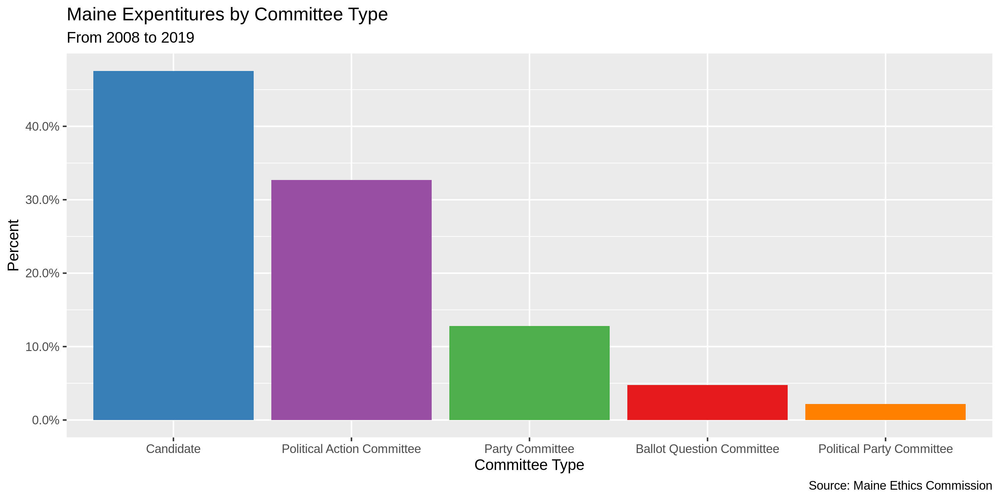
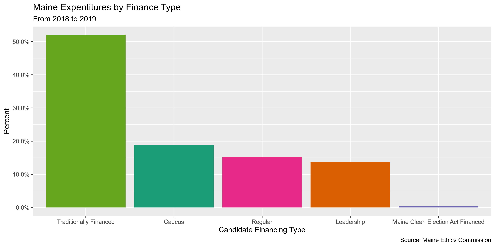
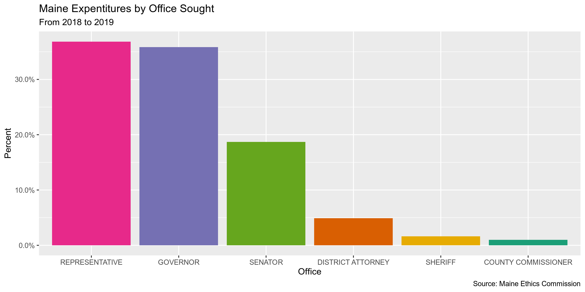
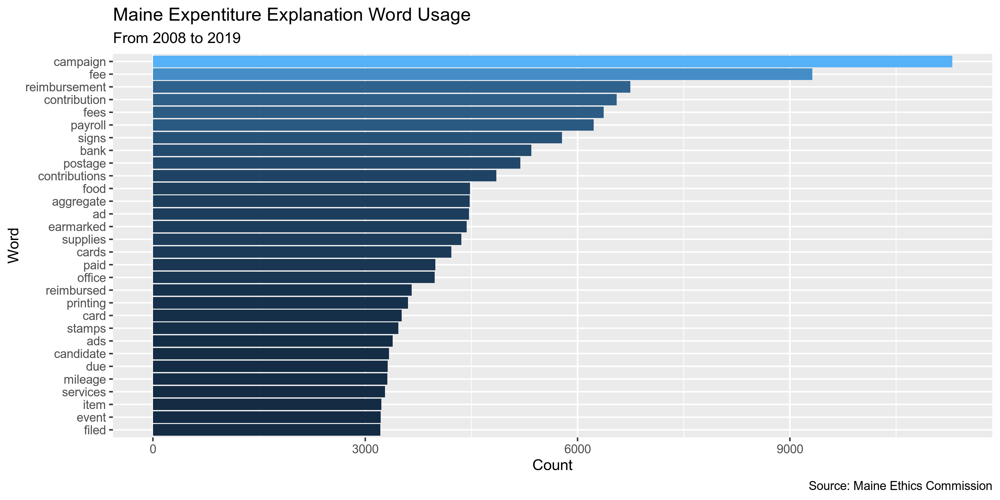
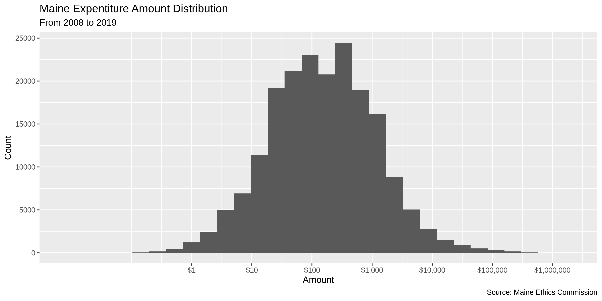
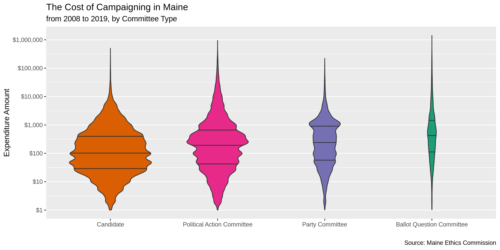

Maine Expenditures
================
Kiernan Nicholls
2019-09-30 13:07:30

  - [Project](#project)
  - [Objectives](#objectives)
  - [Packages](#packages)
  - [Data](#data)
  - [Read](#read)
  - [Explore](#explore)
  - [Wrangle](#wrangle)
  - [Conclude](#conclude)
  - [Export](#export)
  - [Lookup](#lookup)

## Project

The Accountability Project is an effort to cut across data silos and
give journalists, policy professionals, activists, and the public at
large a simple way to search across huge volumes of public data about
people and organizations.

Our goal is to standardizing public data on a few key fields by thinking
of each dataset row as a transaction. For each transaction there should
be (at least) 3 variables:

1.  All **parties** to a transaction
2.  The **date** of the transaction
3.  The **amount** of money involved

## Objectives

This document describes the process used to complete the following
objectives:

1.  How many records are in the database?
2.  Check for duplicates
3.  Check ranges
4.  Is there anything blank or missing?
5.  Check for consistency issues
6.  Create a five-digit ZIP Code called `ZIP5`
7.  Create a `YEAR` field from the transaction date
8.  Make sure there is data on both parties to a transaction

## Packages

The following packages are needed to collect, manipulate, visualize,
analyze, and communicate these results. The `pacman` package will
facilitate their installation and attachment.

The IRW’s `campfin` package will also have to be installed from GitHub.
This package contains functions custom made to help facilitate the
processing of campaign finance data.

``` r
if (!require("pacman")) install.packages("pacman")
pacman::p_load_gh("irworkshop/campfin")
pacman::p_load(
  stringdist, # levenshtein value
  snakecase, # change string case
  RSelenium, # remote browser
  tidyverse, # data manipulation
  lubridate, # datetime strings
  tidytext, # text analysis
  magrittr, # pipe opperators
  janitor, # dataframe clean
  batman, # rep(NA, 8) Batman!
  refinr, # cluster and merge
  scales, # format strings
  knitr, # knit documents
  vroom, # read files fast
  glue, # combine strings
  here, # relative storage
  fs # search storage 
)
```

This document should be run as part of the `R_campfin` project, which
lives as a sub-directory of the more general, language-agnostic
[`irworkshop/accountability_datacleaning`](https://github.com/irworkshop/accountability_datacleaning "TAP repo")
GitHub repository.

The `R_campfin` project uses the [RStudio
projects](https://support.rstudio.com/hc/en-us/articles/200526207-Using-Projects "Rproj")
feature and should be run as such. The project also uses the dynamic
`here::here()` tool for file paths relative to *your* machine.

``` r
# where dfs this document knit?
here::here()
#> [1] "/home/kiernan/R/accountability_datacleaning/R_campfin"
```

## Data

Data is obtained from the [Maine Ethics
Commission](https://mainecampaignfinance.com/#/index)

> This page provides comma separated value (CSV) downloads of
> contribution, expenditure, and loan data for each reporting year in a
> zipped file format. These files can be downloaded and imported into
> other applications (Microsoft Excel, Microsoft Access, etc.) This data
> is extracted from the Maine Ethics Commission database as it existed
> as of 08/12/2019 12:34 PM

The Ethics Commission also provides a [PDF file layout
key](https://mainecampaignfinance.com/Template/KeyDownloads/ME%20Expenditures%20File%20Layout.pdf)
that can be used to identify the role of each variable.

  - `ORG ID` is the unique ID of the paying candidate or committee
  - `LEGACY ID` is the unique ID of the recipient candidate of
    committee, for candidates or committees that existed prior to
    7/1/2018 (Old System prior to 7/1/2018)
  - `LAST NAME` is the Last Name of Payee (entity paid), if an
    individual person. If not an individual, the entity full name will
    be in LAST NAME field.

### Download

Expenditures data is separated into annual files. The files can only be
downloaded by clicking on the Data Download link.

``` r
raw_dir <- here("me", "expends", "data", "raw")
dir_create(raw_dir)
```

``` r
# open the driver with auto download options
remote_driver <- rsDriver(
  port = 4444L,
  browser = "firefox",
  extraCapabilities = makeFirefoxProfile(
    list(
      browser.download.dir = raw_dir,
      browser.download.folderList = 2L,
      browser.helperApps.neverAsk.saveToDisk = "text/csv"
    )
  )
)

# navigate to the download site
remote_browser <- remote_driver$client
remote_browser$navigate("https://mainecampaignfinance.com/index.html#/dataDownload")

rows_xpath <- str_c(
  "/html/body/section/div[2]/div[2]/div/div/div[8]/div/div/dir-pagination-controls",
  "/div/div[1]/table/tbody/tr/td[2]/div/select/option[3]"
)

remote_browser$findElement("xpath", rows_xpath)$clickElement()

children <- seq(from = 2, to = 28, by = 2)
selectors <- glue("tr.ng-scope:nth-child({children}) > td:nth-child(3) > a:nth-child(1)")

for (css in selectors) {
  remote_browser$findElement("css", css)$clickElement()
}

# close the browser and driver
remote_browser$close()
remote_driver$server$stop()
```

## Read

``` r
me08 <- scan(file = glue("{raw_dir}/EXP_2008.csv.csv"), sep = ",", what = "", nmax = 21)
me19 <- scan(file = glue("{raw_dir}/EXP_2019.csv.csv"), sep = ",", what = "", nmax = 39)
```

The files come in two structures. For files from 2008 to 2017, there are
21 variables. For the newer files, 2018 and 2019, there are 39
variables.

    #>  [1] "OrgID"             "ExpenditureAmount" "ExpenditureDate"   "LastName"         
    #>  [5] "FirstName"         "MI"                "Suffix"            "Address1"         
    #>  [9] "Address2"          "City"              "State"             "Zip"              
    #> [13] "Explanation"       "ExpenditureID"     "FiledDate"         "Purpose"          
    #> [17] "ExpenditureType"   "CommitteeType"     "CommitteeName"     "CandidateName"    
    #> [21] "Amended"
    #>  [1] "OrgID"                                   "LegacyID"                               
    #>  [3] "Committee Type"                          "Committee Name"                         
    #>  [5] "Candidate Name"                          "Candidate Office"                       
    #>  [7] "Candidate District"                      "Candidate Party"                        
    #>  [9] "Candidate Financing Type"                "Expenditure Amount"                     
    #> [11] "Expenditure Date"                        "Office"                                 
    #> [13] "District"                                "Last Name"                              
    #> [15] "First Name"                              "Middle Name"                            
    #> [17] "Suffix"                                  "Address1"                               
    #> [19] "Address2"                                "City"                                   
    #> [21] "State"                                   "Zip"                                    
    #> [23] "Explanation"                             "Expenditure ID"                         
    #> [25] "Filed Date"                              "Report Name"                            
    #> [27] "Purpose"                                 "Expenditure Type"                       
    #> [29] "Amended"                                 "Support/Oppose Ballot Question"         
    #> [31] "Support/Oppose Candidate"                "Ballot Question Number"                 
    #> [33] "Ballot Question Description/Title"       "Support Oppose CandidateLegacyID"       
    #> [35] "Support/Oppose CandidateName"            "Support/Oppose Candidate Office"        
    #> [37] "Support/Oppose Candidate District"       "Support/Oppose Candidate Party"         
    #> [39] "Support/Oppose Candidate Financing Type"

``` r
to_snake_case(str_replace(me08, "MI", "Middle Name")) %in% to_snake_case(me19)
```

    #>  [1] TRUE TRUE TRUE TRUE TRUE TRUE TRUE TRUE TRUE TRUE TRUE TRUE TRUE TRUE TRUE TRUE TRUE TRUE TRUE
    #> [20] TRUE TRUE

We can read each type of file into a separate data frame and then
combine the two. Any of the new variables. There are 4 rows with a field
containing double quoation marks. This causes `readr::read_delim()` to
incorectly shift values right one column. We have no choice but to
filter out these 4 records or manually edit the text file.

``` r
me_old_format <- 
  dir_ls(raw_dir) %>% 
  extract(1:10) %>% 
  map(
    read_delim,
    delim = ",",
    escape_backslash = FALSE,
    escape_double = FALSE,
    col_types = cols(
      .default = col_character(),
      ExpenditureAmount = col_number(),
      ExpenditureDate = col_date_usa(),
      FiledDate = col_date_usa()
    )
  ) %>% 
  bind_rows() %>% 
  clean_names() %>% 
  remove_empty("cols") %>% 
  rename(middle_name = mi)

me_new_format <- 
  dir_ls(raw_dir) %>% 
  extract(11:12) %>% 
  map(
    read_delim,
    delim = ",",
    escape_backslash = FALSE,
    escape_double = TRUE,
    col_types = cols(
      .default = col_character(),
      `Expenditure Amount` = col_number(),
      `Expenditure Date` = col_date_usa(),
      `Filed Date` = col_date_usa()
    ) 
  ) %>% 
  bind_rows() %>% 
  clean_names() %>% 
  remove_empty("cols") %>% 
  select(seq(-30, -39))

me <- 
  bind_rows(me_old_format, me_new_format) %>% 
  mutate(amended = to_logical(amended)) %>% 
  filter(!is.na(amended))
```

## Explore

``` r
head(me)
```

    #> # A tibble: 6 x 29
    #>   org_id expenditure_amo… expenditure_date last_name first_name middle_name suffix address1
    #>   <chr>             <dbl> <date>           <chr>     <chr>      <chr>       <chr>  <chr>   
    #> 1 1187              600   2008-01-02       Hale & H… <NA>       <NA>        <NA>   4 State…
    #> 2 3512              750   2008-01-02       BLUME     LYDIA      <NA>        <NA>   P.O. BO…
    #> 3 3512              900   2008-01-02       King Rea… <NA>       <NA>        <NA>   198 Sac…
    #> 4 3512               75   2008-01-02       Secretat… <NA>       <NA>        <NA>   123 Mai…
    #> 5 3533               15.7 2008-01-03       Marden's  <NA>       <NA>        <NA>   <NA>    
    #> 6 3533               13.1 2008-01-03       Staples   <NA>       <NA>        <NA>   <NA>    
    #> # … with 21 more variables: address2 <chr>, city <chr>, state <chr>, zip <chr>, explanation <chr>,
    #> #   expenditure_id <chr>, filed_date <date>, purpose <chr>, expenditure_type <chr>,
    #> #   committee_type <chr>, committee_name <chr>, candidate_name <chr>, amended <lgl>,
    #> #   legacy_id <chr>, candidate_office <chr>, candidate_district <chr>, candidate_party <chr>,
    #> #   candidate_financing_type <chr>, office <chr>, district <chr>, report_name <chr>

``` r
tail(me)
```

    #> # A tibble: 6 x 29
    #>   org_id expenditure_amo… expenditure_date last_name first_name middle_name suffix address1
    #>   <chr>             <dbl> <date>           <chr>     <chr>      <chr>       <chr>  <chr>   
    #> 1 354179             36.0 2019-07-11       Conley    Carroll    <NA>        <NA>   23 Mars…
    #> 2 354179             75.0 2019-07-18       Amazon    <NA>       <NA>        <NA>   410 Ter…
    #> 3 354179             98.3 2019-07-22       Conley    Carroll    <NA>        <NA>   23 Mars…
    #> 4 354179            111.  2019-07-18       McClellan Michael    <NA>        <NA>   27 Pism…
    #> 5 354179            146.  2019-06-29       McClellan Michael    <NA>        <NA>   27 Pism…
    #> 6 354179            149.  2019-06-29       Conley    Carroll    <NA>        <NA>   23 Mars…
    #> # … with 21 more variables: address2 <chr>, city <chr>, state <chr>, zip <chr>, explanation <chr>,
    #> #   expenditure_id <chr>, filed_date <date>, purpose <chr>, expenditure_type <chr>,
    #> #   committee_type <chr>, committee_name <chr>, candidate_name <chr>, amended <lgl>,
    #> #   legacy_id <chr>, candidate_office <chr>, candidate_district <chr>, candidate_party <chr>,
    #> #   candidate_financing_type <chr>, office <chr>, district <chr>, report_name <chr>

``` r
glimpse(sample_frac(me))
```

    #> Observations: 195,512
    #> Variables: 29
    #> $ org_id                   <chr> "3751", "5628", "4738", "3152", "5641", "9311", "3275", "5257",…
    #> $ expenditure_amount       <dbl> 320.25, 74.00, 9.90, 24.01, 400.00, 100.00, 2000.00, 65.00, 135…
    #> $ expenditure_date         <date> 2008-10-20, 2017-05-30, 2010-04-21, 2015-03-22, 2018-09-18, 20…
    #> $ last_name                <chr> "Dale Rand", "HALLOWELL POSTMASTER, USPS", "Hill", "Oxford Coun…
    #> $ first_name               <chr> NA, NA, "Dawn", NA, NA, "NANCY", "Amanda ", "Christopher", NA, …
    #> $ middle_name              <chr> NA, NA, NA, NA, NA, "C", NA, NA, NA, NA, NA, NA, NA, NA, NA, NA…
    #> $ suffix                   <chr> NA, NA, NA, NA, NA, NA, NA, NA, NA, NA, NA, NA, NA, NA, NA, NA,…
    #> $ address1                 <chr> NA, "95 SECOND ST", NA, "PO Box 187", "54 BOWDOIN PINES ROAD", …
    #> $ address2                 <chr> NA, NA, NA, NA, NA, NA, NA, NA, NA, NA, NA, NA, NA, NA, NA, NA,…
    #> $ city                     <chr> NA, "HALLOWELL", NA, "Greenwood", "BOWDOIN", "AUGUSTA", "Lawren…
    #> $ state                    <chr> NA, "ME", NA, "ME", "ME", "ME", "ME", "ME", NA, "ME", "ME", "ME…
    #> $ zip                      <chr> NA, "04347", NA, "04255", "04287", "04330", "01841", "04345", N…
    #> $ explanation              <chr> "Clincher post card", "MAIL BOX FEE", "Money order fee; reimbur…
    #> $ expenditure_id           <chr> "16062", "459089", "50615", "126815", "637913", "164933", "3178…
    #> $ filed_date               <date> 2008-10-24, 2018-04-01, 2010-07-20, 2015-04-02, 2018-10-26, 20…
    #> $ purpose                  <chr> "Campaign literature (printing and graphics)", "Postage for U.S…
    #> $ expenditure_type         <chr> "Monetary (Itemized)", "Monetary (Itemized)", "Monetary (Itemiz…
    #> $ committee_type           <chr> "Candidate", "Candidate", "Candidate", "Political Action Commit…
    #> $ committee_name           <chr> NA, "Sweet for Governor", NA, "ACTBLUE MAINE", "Richmond Republ…
    #> $ candidate_name           <chr> "Representative David C Webster", NA, "Senator Dawn Hill", NA, …
    #> $ amended                  <lgl> FALSE, FALSE, FALSE, FALSE, FALSE, FALSE, FALSE, FALSE, FALSE, …
    #> $ legacy_id                <chr> NA, "10106", NA, NA, "10134", NA, NA, NA, NA, NA, NA, "638", NA…
    #> $ candidate_office         <chr> NA, NA, NA, NA, NA, NA, NA, NA, NA, NA, NA, NA, NA, NA, NA, NA,…
    #> $ candidate_district       <chr> NA, NA, NA, NA, NA, NA, NA, NA, NA, NA, NA, NA, NA, NA, NA, NA,…
    #> $ candidate_party          <chr> NA, NA, NA, NA, NA, NA, NA, NA, NA, NA, NA, NA, NA, NA, NA, NA,…
    #> $ candidate_financing_type <chr> NA, NA, NA, NA, NA, NA, NA, NA, NA, NA, NA, NA, NA, NA, NA, NA,…
    #> $ office                   <chr> NA, "GOVERNOR", NA, NA, NA, NA, NA, NA, NA, NA, NA, NA, NA, NA,…
    #> $ district                 <chr> NA, NA, NA, NA, NA, NA, NA, NA, NA, NA, NA, NA, NA, NA, NA, NA,…
    #> $ report_name              <chr> NA, "2017 JULY SEMIANNUAL REPORT", NA, NA, "11-DAY PRE-GENERAL …

### Missing

``` r
glimpse_fun(me, count_na)
```

    #> # A tibble: 29 x 4
    #>    col                      type       n          p
    #>    <chr>                    <chr>  <dbl>      <dbl>
    #>  1 org_id                   chr        0 0         
    #>  2 expenditure_amount       dbl        0 0         
    #>  3 expenditure_date         date       0 0         
    #>  4 last_name                chr       19 0.0000972 
    #>  5 first_name               chr   156082 0.798     
    #>  6 middle_name              chr   187276 0.958     
    #>  7 suffix                   chr   195154 0.998     
    #>  8 address1                 chr    43235 0.221     
    #>  9 address2                 chr   187023 0.957     
    #> 10 city                     chr    42439 0.217     
    #> 11 state                    chr    40388 0.207     
    #> 12 zip                      chr    45357 0.232     
    #> 13 explanation              chr    33307 0.170     
    #> 14 expenditure_id           chr        0 0         
    #> 15 filed_date               date       1 0.00000511
    #> 16 purpose                  chr      285 0.00146   
    #> 17 expenditure_type         chr        0 0         
    #> 18 committee_type           chr        0 0         
    #> 19 committee_name           chr    87100 0.445     
    #> 20 candidate_name           chr   120904 0.618     
    #> 21 amended                  lgl        0 0         
    #> 22 legacy_id                chr   162447 0.831     
    #> 23 candidate_office         chr   194747 0.996     
    #> 24 candidate_district       chr   194796 0.996     
    #> 25 candidate_party          chr   194747 0.996     
    #> 26 candidate_financing_type chr   194049 0.993     
    #> 27 office                   chr   176409 0.902     
    #> 28 district                 chr   183762 0.940     
    #> 29 report_name              chr   162965 0.834

We can use `campfin::flag_na()` to create a new `na_flag` variable to
flag any record missing a variable needed to identify the parties to a
transaction.

``` r
me <- me %>% 
  mutate(expender_name = coalesce(committee_name, candidate_name)) %>% 
  flag_na(
  expenditure_amount, 
  expenditure_date,
  last_name,
  expender_name
)

sum(me$na_flag)
#> [1] 13276
percent(mean(me$na_flag))
#> [1] "6.79%"
```

The *vast* majority of records flagged with `na_flag` are from 2018,
where 42.8% of that year’s records are missing some variable needed to
identify the transaction.

``` r
me %>% 
  group_by(year = year(expenditure_date)) %>% 
  summarize(
    rows = n(), 
    na = sum(na_flag), 
    prop_na = na/rows
  )
```

    #> # A tibble: 12 x 4
    #>     year  rows    na   prop_na
    #>    <dbl> <int> <int>     <dbl>
    #>  1  2008 18690     2 0.000107 
    #>  2  2009  7937     0 0        
    #>  3  2010 25569     3 0.000117 
    #>  4  2011  5410     2 0.000370 
    #>  5  2012 24413     3 0.000123 
    #>  6  2013  6057     4 0.000660 
    #>  7  2014 29689     0 0        
    #>  8  2015  7873     0 0        
    #>  9  2016 28545     1 0.0000350
    #> 10  2017 10253   706 0.0689   
    #> 11  2018 28730 12290 0.428    
    #> 12  2019  2346   265 0.113

### Duplicates

If we ignore the (supposedly) unique `expenditure_id` variable, there
are a number of duplicated records. We can flag every duplicate record
(after the first) with a new `dupe_flag` variable.

``` r
me <- flag_dupes(me, -expenditure_id)
sum(me$dupe_flag)
#> [1] 5551
```

    #> # A tibble: 5,551 x 32
    #>    org_id expenditure_amo… expenditure_date last_name first_name middle_name suffix address1
    #>    <chr>             <dbl> <date>           <chr>     <chr>      <chr>       <chr>  <chr>   
    #>  1 639                50.6 2008-01-07       Vonage    <NA>       <NA>        <NA>   www.von…
    #>  2 639                50.6 2008-02-06       Vonage    <NA>       <NA>        <NA>   www.von…
    #>  3 1308               25   2008-03-03       Eapps     <NA>       <NA>        <NA>   3850 Ho…
    #>  4 639                50.6 2008-04-07       Vonage    <NA>       <NA>        <NA>   www.von…
    #>  5 639                78.7 2008-04-07       Staples   <NA>       <NA>        <NA>   Civic C…
    #>  6 638               550   2008-05-01       Maine De… <NA>       <NA>        <NA>   PO Box …
    #>  7 3987                5   2008-05-03       Tobey's … <NA>       <NA>        <NA>   <NA>    
    #>  8 2257               10.5 2008-05-28       Printing  Atkins     <NA>        <NA>   155 Mai…
    #>  9 2257               10.5 2008-05-28       Printing  Atkins     <NA>        <NA>   155 Mai…
    #> 10 3993               31.5 2008-05-28       Rite Aid  <NA>       <NA>        <NA>   <NA>    
    #> # … with 5,541 more rows, and 24 more variables: address2 <chr>, city <chr>, state <chr>,
    #> #   zip <chr>, explanation <chr>, expenditure_id <chr>, filed_date <date>, purpose <chr>,
    #> #   expenditure_type <chr>, committee_type <chr>, committee_name <chr>, candidate_name <chr>,
    #> #   amended <lgl>, legacy_id <chr>, candidate_office <chr>, candidate_district <chr>,
    #> #   candidate_party <chr>, candidate_financing_type <chr>, office <chr>, district <chr>,
    #> #   report_name <chr>, expender_name <chr>, na_flag <lgl>, dupe_flag <lgl>

Duplicate records are not clearly isolated to a single expenditure year.

``` r
me %>% 
  group_by(year = year(expenditure_date)) %>% 
  summarize(dupes = sum(dupe_flag))
```

    #> # A tibble: 12 x 2
    #>     year dupes
    #>    <dbl> <int>
    #>  1  2008   356
    #>  2  2009   157
    #>  3  2010   453
    #>  4  2011    99
    #>  5  2012  1080
    #>  6  2013    75
    #>  7  2014  1258
    #>  8  2015    48
    #>  9  2016  1610
    #> 10  2017    88
    #> 11  2018   303
    #> 12  2019    24

### Categorical

``` r
glimpse_fun(me, n_distinct)
```

    #> # A tibble: 32 x 4
    #>    col                      type       n         p
    #>    <chr>                    <chr>  <dbl>     <dbl>
    #>  1 org_id                   chr     3258 0.0167   
    #>  2 expenditure_amount       dbl    49839 0.255    
    #>  3 expenditure_date         date    4179 0.0214   
    #>  4 last_name                chr    30643 0.157    
    #>  5 first_name               chr     3022 0.0155   
    #>  6 middle_name              chr      142 0.000726 
    #>  7 suffix                   chr        9 0.0000460
    #>  8 address1                 chr    25738 0.132    
    #>  9 address2                 chr     1150 0.00588  
    #> 10 city                     chr     3151 0.0161   
    #> 11 state                    chr       95 0.000486 
    #> 12 zip                      chr     3169 0.0162   
    #> 13 explanation              chr    62329 0.319    
    #> 14 expenditure_id           chr   195512 1        
    #> 15 filed_date               date    2325 0.0119   
    #> 16 purpose                  chr       48 0.000246 
    #> 17 expenditure_type         chr        5 0.0000256
    #> 18 committee_type           chr        5 0.0000256
    #> 19 committee_name           chr      749 0.00383  
    #> 20 candidate_name           chr     2462 0.0126   
    #> 21 amended                  lgl        2 0.0000102
    #> 22 legacy_id                chr      643 0.00329  
    #> 23 candidate_office         chr       10 0.0000511
    #> 24 candidate_district       chr      111 0.000568 
    #> 25 candidate_party          chr        6 0.0000307
    #> 26 candidate_financing_type chr        6 0.0000307
    #> 27 office                   chr       12 0.0000614
    #> 28 district                 chr      167 0.000854 
    #> 29 report_name              chr       37 0.000189 
    #> 30 expender_name            chr     3038 0.0155   
    #> 31 na_flag                  lgl        2 0.0000102
    #> 32 dupe_flag                lgl        2 0.0000102

<!-- -->

<!-- -->

<!-- -->

<!-- -->

### Continuous

For continuous variables, we should check both the range and
distribution of values for plausability.

#### Amounts

``` r
summary(me$expenditure_amount)
#>       Min.    1st Qu.     Median       Mean    3rd Qu.       Max. 
#> -1418350.0       33.6      142.4     1379.3      539.0  1418350.0
sum(me$expenditure_amount < 0)
#> [1] 3908
percent(mean(me$expenditure_amount < 0))
#> [1] "2.00%"
```

From this summary, we can see a suspicious similarity between the
minimum expenditure value of `r dollar(min(me$expenditure_amount))` and
the maximum value of `r dollar(max(me$expenditure_amount))`. We can see
that the Mainers for Responsible Gun Ownership Fund committee had to
file an amended report with the `explanation` “Offset due to deletion of
filed item.” The correction is properly flagged with the `amended` value
of `TRUE`. This is a good indication that the `expenditutre_amount`
ranges are reasonable.

``` r
me %>%
  select(
    date = expenditure_date,
    amount = expenditure_amount,
    amended,
    explanation,
    payee = last_name,
    expender = committee_name
  ) %>% 
  filter(
    or(
      amount == min(amount), 
      amount == max(amount)
    )
  )
#> # A tibble: 3 x 6
#>   date         amount amended explanation               payee           expender                   
#>   <date>        <dbl> <lgl>   <chr>                     <chr>           <chr>                      
#> 1 2016-05-31  1418350 TRUE    TV MEDIA AD BUY           GUM SPIRITS PR… Mainers for Responsible Gu…
#> 2 2016-05-31  1418350 FALSE   TV MEDIA AD BUY           GUM SPIRITS PR… Mainers for Responsible Gu…
#> 3 2016-05-31 -1418350 FALSE   Offset due to deletion o… GUM SPIRITS PR… Mainers for Responsible Gu…
```

<!-- -->

<!-- -->

#### Dates

To better explore the distribution of `expenditure_date` values, we can
create a new `expenditure_year` variable using `lubridate::year()`.

``` r
me <- mutate(me, expenditure_year = year(expenditure_date))
```

The `expenditure_date` value is very clean, with 0 records from before
2008-01-02 and 0 records after 2019-08-09.

``` r
prop_na(me$expenditure_date)
#> [1] 0
min(me$expenditure_date)
#> [1] "2008-01-02"
sum(me$expenditure_year < 2000)
#> [1] 0
max(me$expenditure_date)
#> [1] "2019-08-09"
sum(me$expenditure_date > today())
#> [1] 0
```

## Wrangle

To improve the searchability of the database, we will perform some
programatic normalization of geographic data. This is done largely with
the `campfin::normal_*()` functions, wich wrap around a few different
`stringr::str_*()` functions.

### Address

``` r
me <- me %>% 
  unite(
    starts_with("address"),
    col = address_combine,
    sep = " ",
    remove = FALSE,
    na.rm = TRUE
  ) %>% 
  mutate(
    address_norm = normal_address(
      address = address_combine,
      add_abbs = usps_street,
      na_rep = TRUE
    )
  )
```

    #> # A tibble: 10 x 4
    #>    address_combine            address1                   address2 address_norm                 
    #>    <chr>                      <chr>                      <chr>    <chr>                        
    #>  1 6 ASSELYN DR               6 ASSELYN DR               <NA>     6 ASSELYN DRIVE              
    #>  2 116 MILLS RD.              116 MILLS RD.              <NA>     116 MILLS ROAD               
    #>  3 P.O. BOX 15124             P.O. BOX 15124             <NA>     PO BOX 15124                 
    #>  4 21 LIMEROCK ST             21 LIMEROCK ST             <NA>     21 LIMEROCK STREET           
    #>  5 565 CONGRESS ST, SUITE 200 565 CONGRESS ST, SUITE 200 <NA>     565 CONGRESS STREET SUITE 200
    #>  6 243 WESTERN AVE            243 WESTERN AVE            <NA>     243 WESTERN AVENUE           
    #>  7 ""                         <NA>                       <NA>     <NA>                         
    #>  8 www.staples.com            www.staples.com            <NA>     WWWSTAPLESCOM                
    #>  9 45 GOSLING RD              45 GOSLING RD              <NA>     45 GOSLING ROAD              
    #> 10 1600 AMPHITHEATRE PKWY     1600 AMPHITHEATRE PKWY     <NA>     1600 AMPHITHEATRE PARKWAY

### ZIP

``` r
n_distinct(me$zip)
#> [1] 3169
prop_na(me$zip)
#> [1] 0.2319909
prop_in(me$zip, valid_zip)
#> [1] 0.9406147
length(setdiff(me$zip, valid_zip))
#> [1] 917
```

``` r
me <- me %>% 
  mutate(
    zip_norm = normal_zip(
      zip = zip,
      na_rep = TRUE
    )
  )
```

``` r
n_distinct(me$zip_norm)
#> [1] 2505
prop_na(me$zip_norm)
#> [1] 0.2391618
prop_in(me$zip_norm, valid_zip)
#> [1] 0.994622
length(setdiff(me$zip_norm, valid_zip))
#> [1] 198
```

There are still some `zip_norm` values that are invalid. We will leave
these unchanged for now.

``` r
sample(unique(me$zip[which(me$zip_norm %out% valid_zip)]), 20)
#>  [1] "04641"      "V6E 4A2"    "04486"      "04517"      "04542"      "83508"      "00000-4005"
#>  [8] "999999"     "00413"      "04277"      "40605"      "04704"      "98714"      "04340"     
#> [15] "04130"      "04384"      "0410"       "3000"       "04804"      "90425"
```

### State

``` r
n_distinct(me$state)
#> [1] 95
prop_na(me$state)
#> [1] 0.2065756
prop_in(me$state, valid_state)
#> [1] 0.9794616
length(setdiff(me$state, valid_state))
#> [1] 42
setdiff(me$state, valid_state)
#>  [1] NA   "  " "ns" "ON" "Me" "Ca" "Mn" "me" "md" "Va" "BC" "Ma" "PQ" "mE" "Cu" "UK" "ma" "m " "nh"
#> [20] "In" "IF" "M " "na" ". " "NB" "mA" "Fl" "id" "on" "Il" "Dc" "dc" "ut" "XX" "Ta" "AB" "NS" "PE"
#> [39] "NT" "QC" "AU" "SP"
```

``` r
me <- me %>% 
  mutate(
    state_norm = normal_state(
      state = str_replace(state, "^M$", "ME"),
      abbreviate = FALSE,
      na_rep = TRUE,
      na = c("", "NA"),
      valid = valid_state
    )
  )
```

``` r
n_distinct(me$state_norm)
#> [1] 53
prop_na(me$state)
#> [1] 0.2065756
prop_in(me$state_norm, valid_state, na.rm = TRUE)
#> [1] 1
length(setdiff(me$state_norm, valid_state))
#> [1] 1
```

### City

``` r
n_distinct(me$city)
#> [1] 3151
prop_in(me$city, valid_city, na.rm = TRUE)
#> [1] 0.6082784
length(setdiff(me$city, valid_city))
#> [1] 2114
```

#### Normalize

``` r
me <- me %>% 
  mutate(
    city_norm = normal_city(
      city = city, 
      geo_abbs = usps_city,
      st_abbs = c("ME", "DC", "MAINE"),
      na = invalid_city,
      na_rep = TRUE
    )
  )
```

``` r
n_distinct(me$city_norm)
#> [1] 1966
prop_in(me$city_norm, valid_city, na.rm = TRUE)
#> [1] 0.9780086
length(setdiff(me$city_norm, valid_city))
#> [1] 640
```

#### Swap

``` r
me <- me %>% 
  rename(city_raw = city) %>% 
  left_join(
    y = zipcodes,
    by = c(
      "state_norm" = "state",
      "zip_norm" = "zip"
    )
  ) %>% 
  rename(city_match = city) %>% 
  mutate(
    match_dist = stringdist(city_norm, city_match),
    city_swap = if_else(
      condition = equals(match_dist, 1),
      true = city_match,
      false = city_norm
    )
  )
```

    #> # A tibble: 3 x 4
    #>   step  n_distinct prop_in unique_bad
    #>   <chr>      <int>   <dbl>      <int>
    #> 1 raw         3151   0.608       2114
    #> 2 norm        1966   0.978        640
    #> 3 swap        1534   0.991        244

## Conclude

1.  There are 195512 records in the database.
2.  There are 5551 (2.84%) duplicate records in the database, flagged
    with `dupe_flag`.
3.  The range and distribution of `expenditure_amount` and
    `expenditure_date` seem reasonable.
4.  There are 13276 (6.79%) records missing either the amount, date,
    payee, or expender. Most from 2018.
5.  Consistency in goegraphic data has been improved with
    `campfin::normal_*()`.
6.  The 5-digit `zip_norm` variable has been created with
    `campfin::normal_zip(me$zip)`.
7.  The 4-digit `expenditure_year` variable has been created with
    `lubridate::year(me$expenditure_date)`.

## Export

``` r
proc_dir <- here("me", "expends", "data", "processed")
dir_create(proc_dir)
```

``` r
me <- me %>% 
  select(
    -city_match,
    -city_norm,
  )
```

## Lookup

``` r
lookup <- read_csv("me/expends/data/me_city_lookup.csv") %>% select(1:2)
me <- left_join(me, lookup, by = c("city_swap" = "CITY_SWAP"))

progress_table(
  me$city_swap, 
  me$CITY_CLEAN, 
  compare = valid_city
)
```

    #> # A tibble: 2 x 6
    #>   stage      prop_in n_distinct prop_na n_out n_diff
    #>   <chr>        <dbl>      <dbl>   <dbl> <dbl>  <dbl>
    #> 1 city_swap    0.991       1534   0.250  1315    244
    #> 2 CITY_CLEAN   0.994       1456   0.251   907    165

``` r
write_csv(
  x = me,
  path = glue("{proc_dir}/me_expends_clean.csv"),
  na = ""
)
```
