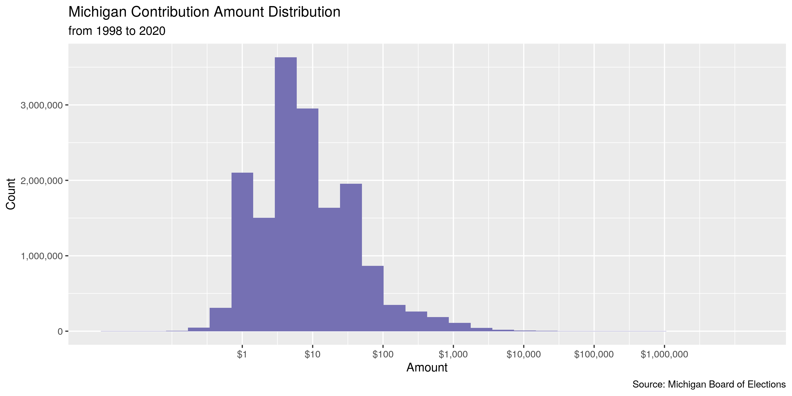
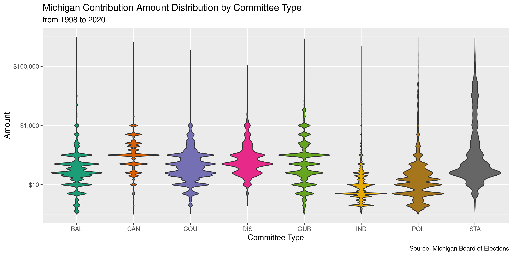
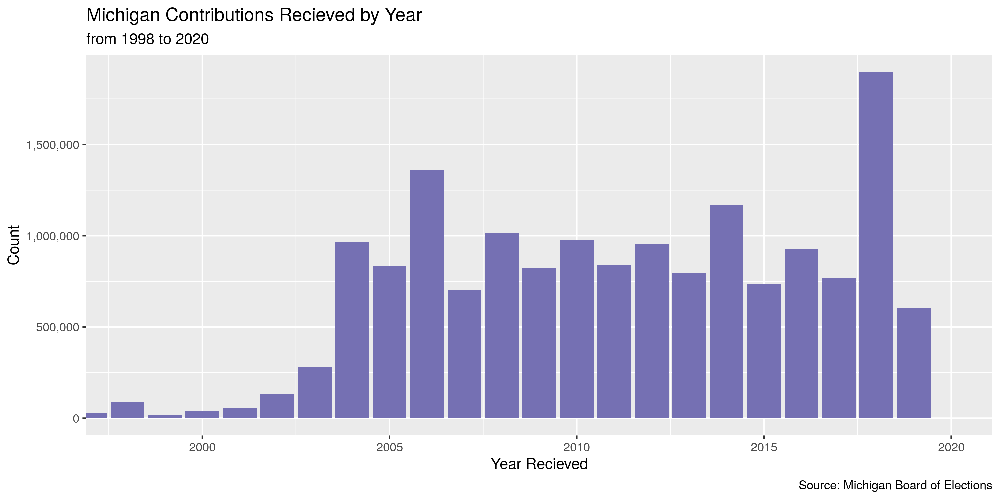
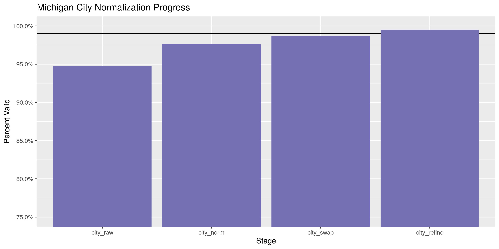

Michigan Contributions
================
Kiernan Nicholls
2020-04-14 12:44:01

  - [Project](#project)
  - [Objectives](#objectives)
  - [Packages](#packages)
  - [Data](#data)
  - [Import](#import)
  - [Explore](#explore)
  - [Wrangle](#wrangle)
  - [Conclude](#conclude)
  - [Export](#export)

<!-- Place comments regarding knitting here -->

## Project

The Accountability Project is an effort to cut across data silos and
give journalists, policy professionals, activists, and the public at
large a simple way to search across huge volumes of public data about
people and organizations.

Our goal is to standardizing public data on a few key fields by thinking
of each dataset row as a transaction. For each transaction there should
be (at least) 3 variables:

1.  All **parties** to a transaction
2.  The **date** of the transaction
3.  The **amount** of money involved

## Objectives

This document describes the process used to complete the following
objectives:

1.  How many records are in the database?
2.  Check for duplicates
3.  Check ranges
4.  Is there anything blank or missing?
5.  Check for consistency issues
6.  Create a five-digit ZIP Code called `zip`
7.  Create a `year` field from the transaction date
8.  Make sure there is data on both parties to a transaction

## Packages

The following packages are needed to collect, manipulate, visualize,
analyze, and communicate these results. The `pacman` package will
facilitate their installation and attachment.

The IRW’s `campfin` package will also have to be installed from GitHub.
This package contains functions custom made to help facilitate the
processing of campaign finance data.

``` r
if (!require("pacman")) install.packages("pacman")
pacman::p_load_gh("irworkshop/campfin")
pacman::p_load(
  tidyverse, # data manipulation
  lubridate, # datetime strings
  magrittr, # pipe opperators
  gluedown, # printing markdown
  janitor, # dataframe clean
  refinr, # cluster and merge
  scales, # format strings
  knitr, # knit documents
  rvest, # read html pages
  vroom, # read files fast
  glue, # combine strings
  here, # relative storage
  fs # search storage 
)
```

This document should be run as part of the `R_campfin` project, which
lives as a sub-directory of the more general, language-agnostic
[`irworkshop/accountability_datacleaning`](https://github.com/irworkshop/accountability_datacleaning)
GitHub repository.

The `R_campfin` project uses the [RStudio
projects](https://support.rstudio.com/hc/en-us/articles/200526207-Using-Projects)
feature and should be run as such. The project also uses the dynamic
`here::here()` tool for file paths relative to *your* machine.

``` r
# where does this document knit?
here::here()
#> [1] "/home/kiernan/Code/accountability_datacleaning/R_campfin"
```

## Data

This data is obtained from the Michigan [Board of Elections
(BOE)](https://www.michigan.gov/sos/0,4670,7-127-1633---,00.html)
[Campaign Finance Reporting
(CFR)](https://www.michigan.gov/sos/0,4670,7-127-1633_8723---,00.html)
system. The data is provided as [annual ZIP archive
files](https://miboecfr.nictusa.com/cfr/dumpall/cfrdetail/) for the
years 1998 through 2020. These files are updated nightly.

The CFR also provides a README file with a record layout.

> Record layout of contributions. Files are named by statement year.
> Larger files are split and numbered to make them easier to work with.
> In these cases the column header row will only exist in the first (00)
> file.

| Variable          | Description                                                                             |
| :---------------- | :-------------------------------------------------------------------------------------- |
| `doc_seq_no`      | Unique BOE document sequence number of the filed campaign statement                     |
| `page_no`         | If filed on paper, the physical page number the transaction appears on, otherwise zero  |
| `contribution_id` | Unique number of the transaction, within the campaign statement and amendments          |
| `cont_detail_id`  | Unique number used to further break down some types of transactions with supplemental … |
| `doc_stmnt_year`  | The calendar year that this statement was required by the BOE                           |
| `doc_type_desc`   | The type of statement that this contribution is attached to                             |
| `com_legal_name`  | Legal Name of the committee receiving the contribution                                  |
| `common_name`     | Commonly known shorter name of the committee. May be deprecated in the future.          |
| `cfr_com_id`      | Unique committee ID\# of the receiving committee in the BOE database                    |
| `com_type`        | Type of committee receiving the contribution                                            |
| `can_first_name`  | First name of the candidate (if applicable) benefitting from the contribution           |
| `can_last_name`   | Last name of the candidate (if applicable) benefitting from the contribution            |
| `contribtype`     | Type of contribution received                                                           |
| `f_name`          | First name of the individual contributor                                                |
| `l_name`          | Last name of the contributor OR the name of the organization that made the contribution |
| `address`         | Street address of the contributor                                                       |
| `city`            | City of the contributor                                                                 |
| `state`           | State of the contributor                                                                |
| `zip`             | Zipcode of the contributor                                                              |
| `occupation`      | Occupation of the contributor                                                           |
| `employer`        | Employer of the contributor                                                             |
| `received_date`   | Date the contribution was received                                                      |
| `amount`          | Dollar amount or value of the contribution                                              |
| `aggregate`       | Cumulative dollar amount of contributions made to this committee during this period u…  |
| `extra_desc`      | Extra descriptive information for the transaction                                       |
| `RUNTIME`         | Indicates the time these transactions were exported from the BOE database. Header only. |

## Import

To import the data for processing, we will have to download each archive
file and read them together into a single data frame object.

### Download

We will scrape the download page for every archive link, then
downloading each to a local directory.

``` r
raw_dir <- dir_create(here("mi", "contribs", "data", "raw"))
raw_base <- "https://miboecfr.nictusa.com/cfr/dumpall/cfrdetail"
raw_page <- read_html(raw_base)
raw_urls <- raw_page %>% 
  html_node("table") %>% 
  html_nodes("a") %>% 
  html_attr("href") %>% 
  str_subset("contributions") %>% 
  str_c(raw_base, ., sep = "/")
raw_paths <- path(raw_dir, basename(raw_urls))
if (!all(this_file_new(raw_paths))) {
  for (i in seq_along(raw_paths)) {
    if (file_exists(raw_paths[i])) {
      skip(); message("file exists")
    } else {
      download.file(raw_urls[i], raw_paths[i])
    }
  }
}
```

### Read

Since the larger files are split with the column header only in the
first, we will have to read these headers separately. The last column
only records the time the files are downloaded.

``` r
mic_names <- str_split(read_lines(raw_paths[1])[1], "\t")[[1]]
mic_names <- mic_names[-length(mic_names)]
mic_names[1:3] <- c("doc_id", "page_no", "cont_id")
mic_names[length(mic_names)] <- "runtime"
```

Using `vroom::vroom()`, we can read all 47 archive files at once.

``` r
mic <- vroom(
  file = raw_paths,
  delim = "\t",
  skip = 1,
  col_names = mic_names,
  col_types = cols(
    .default = col_character(),
    page_no = col_integer(),
    doc_stmnt_year = col_integer(),
    received_date = col_date_usa(),
    amount = col_double(),
    aggregate = col_double(),
    runtime = col_skip()
  )
)
```

Some of the columns have an inconsistent number of spacing, which we can
trim.

``` r
mic <- mutate_if(mic, is_character, str_trim)
```

## Explore

``` r
head(mic)
#> # A tibble: 6 x 25
#>   doc_id page_no cont_id cont_detail_id doc_stmnt_year doc_type_desc com_legal_name common_name
#>   <chr>    <int> <chr>   <chr>                   <int> <chr>         <chr>          <chr>      
#> 1 148736       1 1       0                        1998 ANNUAL CS     COMMITTEE TO … COMM TO EL…
#> 2 148736       1 2       0                        1998 ANNUAL CS     COMMITTEE TO … COMM TO EL…
#> 3 148736       1 3       0                        1998 ANNUAL CS     COMMITTEE TO … COMM TO EL…
#> 4 148736       1 4       0                        1998 ANNUAL CS     COMMITTEE TO … COMM TO EL…
#> 5 148736       2 1       0                        1998 ANNUAL CS     COMMITTEE TO … COMM TO EL…
#> 6 148736       2 2       0                        1998 ANNUAL CS     COMMITTEE TO … COMM TO EL…
#> # … with 17 more variables: cfr_com_id <chr>, com_type <chr>, can_first_name <chr>,
#> #   can_last_name <chr>, contribtype <chr>, f_name <chr>, l_name_or_org <chr>, address <chr>,
#> #   city <chr>, state <chr>, zip <chr>, occupation <chr>, employer <chr>, received_date <date>,
#> #   amount <dbl>, aggregate <dbl>, extra_desc <chr>
tail(mic)
#> # A tibble: 6 x 25
#>   doc_id page_no cont_id cont_detail_id doc_stmnt_year doc_type_desc com_legal_name common_name
#>   <chr>    <int> <chr>   <chr>                   <int> <chr>         <chr>          <chr>      
#> 1 492595       0 248623… 0                        2020 AMENDED ANNU… COMMITTEE TO … COMMITTEE …
#> 2 492596       0 6754    0                        2020 APRIL QUARTE… WASHTENAW COU… WASHTENAW …
#> 3 492622       0 4119    0                        2020 APRIL QUARTE… STATE POLICE … MSP COA    
#> 4 492622       0 4120    0                        2020 APRIL QUARTE… STATE POLICE … MSP COA    
#> 5 492630       0 4127    0                        2020 APRIL QUARTE… SECOND CONGRE… SECOND CON…
#> 6 492630       0 4128    0                        2020 APRIL QUARTE… SECOND CONGRE… SECOND CON…
#> # … with 17 more variables: cfr_com_id <chr>, com_type <chr>, can_first_name <chr>,
#> #   can_last_name <chr>, contribtype <chr>, f_name <chr>, l_name_or_org <chr>, address <chr>,
#> #   city <chr>, state <chr>, zip <chr>, occupation <chr>, employer <chr>, received_date <date>,
#> #   amount <dbl>, aggregate <dbl>, extra_desc <chr>
glimpse(mic)
#> Rows: 16,521,043
#> Columns: 25
#> $ doc_id         <chr> "148736", "148736", "148736", "148736", "148736", "148736", "148736", "14…
#> $ page_no        <int> 1, 1, 1, 1, 2, 2, 2, 2, 3, 3, 3, 3, 4, 4, 4, 5, 5, 5, 5, 6, 6, 6, 1, 1, 1…
#> $ cont_id        <chr> "1", "2", "3", "4", "1", "2", "3", "4", "1", "2", "3", "4", "1", "2", "3"…
#> $ cont_detail_id <chr> "0", "0", "0", "0", "0", "0", "0", "0", "0", "0", "0", "0", "0", "0", "0"…
#> $ doc_stmnt_year <int> 1998, 1998, 1998, 1998, 1998, 1998, 1998, 1998, 1998, 1998, 1998, 1998, 1…
#> $ doc_type_desc  <chr> "ANNUAL CS", "ANNUAL CS", "ANNUAL CS", "ANNUAL CS", "ANNUAL CS", "ANNUAL …
#> $ com_legal_name <chr> "COMMITTEE TO ELECT JUD GILBERT", "COMMITTEE TO ELECT JUD GILBERT", "COMM…
#> $ common_name    <chr> "COMM TO ELECT JUD GILBERT", "COMM TO ELECT JUD GILBERT", "COMM TO ELECT …
#> $ cfr_com_id     <chr> "506799", "506799", "506799", "506799", "506799", "506799", "506799", "50…
#> $ com_type       <chr> "CAN", "CAN", "CAN", "CAN", "CAN", "CAN", "CAN", "CAN", "CAN", "CAN", "CA…
#> $ can_first_name <chr> "JUDSON", "JUDSON", "JUDSON", "JUDSON", "JUDSON", "JUDSON", "JUDSON", "JU…
#> $ can_last_name  <chr> "GILBERT II", "GILBERT II", "GILBERT II", "GILBERT II", "GILBERT II", "GI…
#> $ contribtype    <chr> "DIRECT", "DIRECT", "DIRECT", "DIRECT", "DIRECT", "LOAN FROM A PERSON", "…
#> $ f_name         <chr> "JUDSON", "MARY", NA, "DAN", "RAY", "JUDSON S", "GILBERT", "JOHN R", "LEE…
#> $ l_name_or_org  <chr> "GILBERT", "GILBERT", "MICHIGAN FUNERAL DIRECTORS ASSOC", "MORE", "GILBER…
#> $ address        <chr> "1405 ST CLAIR RIVER DR", "1405 ST CLAIR RIVER DR", "PO BO 27158", "9780 …
#> $ city           <chr> "ALGONAC", "ALGONAC", "LASNING", "PEARL BEACH", "CHINA", "ALGONAC", "ROYA…
#> $ state          <chr> "MI", "MI", "MI", "MI", "MI", "MI", "MI", "MI", "MI", "MI", "MI", "MI", "…
#> $ zip            <chr> "48001", "48001", "48909", "48001", "48054", "48001", "48067", "48001", "…
#> $ occupation     <chr> "FUNERAL DIRECTOR", "RETIRED", NA, "RETIRED", NA, "FUNERAL DIRECTOR", "RE…
#> $ employer       <chr> "GILBERT FUNERAL HOME INC", NA, NA, NA, NA, "GILBERT FUNERAL HOME INC", N…
#> $ received_date  <date> 1997-07-17, 1997-07-17, 1997-08-29, 1997-09-08, 1997-09-07, 1997-09-09, …
#> $ amount         <dbl> 500, 500, 1000, 500, 500, 3500, 100, 500, 500, 100, 100, 100, 100, 250, 1…
#> $ aggregate      <dbl> 500, 500, 1000, 500, 500, 3500, 100, 500, 500, 100, 200, 100, 100, 250, 1…
#> $ extra_desc     <chr> NA, NA, NA, NA, NA, NA, NA, NA, NA, NA, NA, NA, NA, NA, NA, NA, NA, NA, N…
```

``` r
summary(mic$amount)
#>    Min. 1st Qu.  Median    Mean 3rd Qu.    Max.    NA's 
#> -195000       3       6      93      20 9175000    4636
```

<!-- -->

``` r
mic %>% 
  filter(amount > 1, amount < 1000000) %>% 
  ggplot(aes(x = com_type, y = amount, fill = com_type)) +
  geom_violin(draw_quantiles = TRUE, scale = "width", ) +
  scale_y_continuous(labels = dollar, trans = "log10") +
  scale_fill_brewer(palette = "Dark2", guide = FALSE) +
  labs(
    title = "Michigan Contribution Amount Distribution by Committee Type",
    subtitle = "from 1998 to 2020",
    caption = "Source: Michigan Board of Elections",
    x = "Committee Type",
    y = "Amount"
  )
```

<!-- -->

We can add a new `received_year` variable using `lubridate::year()`.

``` r
mic <- mutate(mic, received_year = year(received_date))
```

Since we know the records cover the years 1998 through 2020, we will
have to do some fixing to dates from the distant past or future.

``` r
# view file name dates
unique(str_extract(dir_ls(raw_dir), "\\d{4}"))
#>  [1] "1998" "1999" "2000" "2001" "2002" "2003" "2004" "2005" "2006" "2007" "2008" "2009" "2010"
#> [14] "2011" "2012" "2013" "2014" "2015" "2016" "2017" "2018" "2019" "2020"
# count and fix old dates
min(mic$received_date, na.rm = TRUE)
#> [1] "999-01-14"
sum(mic$received_year < 1998, na.rm = TRUE)
#> [1] 27478
which_old <- which(mic$received_year < 1990)
fix_old <- mic$received_year[which_old] %>% 
  str_replace("\\d(?=\\d{1}$)", "9") %>% 
  str_pad(width = 4, side = "left", pad = "1") %>% 
  as.numeric()
mic$received_year[which_old] <- fix_old

# count and fix future dates
max(mic$received_date, na.rm = TRUE)
#> [1] "2206-06-01"
sum(mic$received_date > today(), na.rm = TRUE)
#> [1] 4
mic$received_year[which(mic$received_year > 2020)] <- c(2011, 2006)
```

<!-- -->

## Wrangle

To improve the consistency and searchability of the database, we will
have to do some text normalization. The `campfin::normal_*()` functions
help us make consistent strings.

### Address

The `address` variable can be cleaned with `campfin::normal_address()`,
which will force consistent case, remove punctuation, and replace street
suffix variations with the official USPS abbreviation.

``` r
mic <- mutate(
  .data = mic,
  address_norm = normal_address(
    address = address,
    abbs = usps_street,
    na = invalid_city,
    na_rep = TRUE
  )
)
```

    #> # A tibble: 10 x 2
    #>    address              address_norm        
    #>    <chr>                <chr>               
    #>  1 6450 HIGHLAND        6450 HIGHLAND       
    #>  2 N607 COUNTY ROAD 15C N 607 COUNTY RD 15 C
    #>  3 18589 LUMPKIN        18589 LUMPKIN       
    #>  4 13868 LACHENE        13868 LACHENE       
    #>  5 201 BROOKSIDE DRIVE  201 BROOKSIDE DR    
    #>  6 123 60TH ST SE       123 60 TH ST SE     
    #>  7 13846 FOX TRAIL DR   13846 FOX TRL DR    
    #>  8 5061 WATERS RD       5061 WATERS RD      
    #>  9 8085 N EVERETT RD    8085 N EVERETT RD   
    #> 10 2715 VERONICA        2715 VERONICA

This process also automatically removed a number of invalid values.

``` r
prop_na(mic$address)
#> [1] 0.0009724568
prop_na(mic$address_norm)
#> [1] 0.001389924
mic %>% 
  select(contains("address")) %>% 
  filter(!is.na(address), is.na(address_norm)) %>% 
  count(address, sort = TRUE)
#> # A tibble: 71 x 2
#>    address                   n
#>    <chr>                 <int>
#>  1 NOT KNOWN              2789
#>  2 UNKNOWN                2320
#>  3 NULL                    719
#>  4 INFORMATION REQUESTED   249
#>  5 P.O. BOX                146
#>  6 REQUESTED               129
#>  7 PO BOX                   86
#>  8 N/A                      73
#>  9 NONE                     38
#> 10 XXXXXX                   38
#> # … with 61 more rows
```

### ZIP

Similarly, we can use the `campfin::normal_zip()` function to try and
repair some common problems with ZIP codes, primarily removing any ZIP+4
suffixes.

``` r
sample(mic$zip, 5)
#> [1] "48111-0000" "49007-4942" "48030-0000" "15236-0000" "48182-0000"
mic <- mutate(
  .data = mic,
  zip_norm = normal_zip(
    zip = zip,
    na_rep = TRUE
  )
)
```

``` r
progress_table(
  mic$zip,
  mic$zip_norm,
  compare = valid_zip
)
#> # A tibble: 2 x 6
#>   stage    prop_in n_distinct prop_na    n_out n_diff
#>   <chr>      <dbl>      <dbl>   <dbl>    <dbl>  <dbl>
#> 1 zip      0.00732     491123 0.00155 16374598 488967
#> 2 zip_norm 0.998        27206 0.00160    40494   2152
```

### State

The `campfin::normal_state()` function will make valid 2-digit USPS
state abbreviations.

``` r
mic <- mutate(mic, state_norm = state)
# state is first 2 of zip from MI
state_zip <- mic$state_norm == str_sub(mic$zip_norm, end = 2)
mi_zip <- mic$zip_norm %in% zipcodes$zip[zipcodes$state == "MI"]
mic$state_norm[which(state_zip & mi_zip)] <- "MI"
# state is invalid but close to MI
ends_mi <- str_detect(mic$state_norm, "(^M|I$)")
out_state <- mic$state_norm %out% c(valid_state, "MX", "MB")
mic$state_norm[which(out_state & ends_mi)] <- "MI"
```

``` r
mic <- mutate(
  .data = mic,
  state_norm = normal_state(
    state = state_norm,
    abbreviate = TRUE,
    na_rep = TRUE,
    valid = valid_state
  )
)
```

``` r
progress_table(
  mic$state,
  mic$state_norm,
  compare = valid_state
)
#> # A tibble: 2 x 6
#>   stage      prop_in n_distinct prop_na n_out n_diff
#>   <chr>        <dbl>      <dbl>   <dbl> <dbl>  <dbl>
#> 1 state         1.00        128 0.00104  5037     69
#> 2 state_norm    1            59 0.00134     0      1
```

### City

Cities are the most difficult variable to normalize due to the number
and variety of valid values.

#### Normalize

The `campfin::normal_city()` function first forces consistent
capitalization, removes punctuation, and expands common abbreviations.

``` r
mic <- mutate(
  .data = mic,
  city_norm = normal_city(
    city = city, 
    abbs = usps_city,
    states = c("MI", "DC", "MICHIGAN"),
    na = invalid_city,
    na_rep = TRUE
  )
)
```

    #> # A tibble: 10 x 2
    #>    city                city_norm          
    #>    <chr>               <chr>              
    #>  1 WINDZOR ONT  N9A6W9 WINDZOR ONT NAW    
    #>  2 SECHELT BC 3A4 VON  SECHELT BC A VON   
    #>  3 MT.  PLEASANT       MOUNT PLEASANT     
    #>  4 UNIVERSITY HTS      UNIVERSITY HEIGHTS 
    #>  5 ROYAL PLM BCH       ROYAL PLM BEACH    
    #>  6 S. CLAIR SHORES     SOUTH CLAIR SHORES 
    #>  7 AUGUSTA TWP         AUGUSTA TOWNSHIP   
    #>  8 CLNTON TWP          CLNTON TOWNSHIP    
    #>  9 CARROLLTON TWP.     CARROLLTON TOWNSHIP
    #> 10 ST. MICHAELS        SAINT MICHAELS

#### Swap

We can further reduce these inconsistencies by comparing our normalized
value to the *expected* value for that record’s (normalized) state and
ZIP code. Using `campfin::is_abbrev()` and `campfin::str_dist()`, we can
test whether the expected value is either an abbreviation for or within
one character of our normalized value.

``` r
mic <- mic %>% 
  rename(city_raw = city) %>% 
  left_join(
    y = zipcodes,
    by = c(
      "state_norm" = "state",
      "zip_norm" = "zip"
    )
  ) %>% 
  rename(city_match = city) %>% 
  mutate(
    match_abb = is_abbrev(city_norm, city_match),
    match_dist = str_dist(city_norm, city_match),
    city_swap = if_else(
      condition = !is.na(city_match) & (match_abb | match_dist == 1),
      true = city_match,
      false = city_norm
    )
  ) %>% 
  select(
    -match_abb,
    -match_dist,
    -city_match
  )
```

#### Refine

Additionally, we can pass these swapped `city_swap` values to the
OpenRefine cluster and merge algorithms. These two algorithms cluster
similar values and replace infrequent values with their more common
counterparts. This process can be harmful by making *incorrect* changes.
We will only keep changes where the state, ZIP code, *and* new city
value all match a valid combination.

``` r
good_refine <- mic %>% 
  mutate(
    city_refine = city_swap %>% 
      key_collision_merge() %>% 
      n_gram_merge(numgram = 1)
  ) %>% 
  filter(city_refine != city_swap) %>% 
  inner_join(
    y = zipcodes,
    by = c(
      "city_refine" = "city",
      "state_norm" = "state",
      "zip_norm" = "zip"
    )
  )
```

    #> # A tibble: 410 x 5
    #>    state_norm zip_norm city_swap          city_refine         n
    #>    <chr>      <chr>    <chr>              <chr>           <int>
    #>  1 MI         48094    WASHINGTON TOWNSHI WASHINGTON        740
    #>  2 MI         48021    EAST POINT         EASTPOINTE        506
    #>  3 MD         20910    SLIVER SPRINGS     SILVER SPRING     180
    #>  4 MI         48879    SAINT JOHNSON      SAINT JOHNS       159
    #>  5 WI         54151    NIARAGA            NIAGARA           104
    #>  6 MI         48094    WASHINGTON TOWNS   WASHINGTON         98
    #>  7 MI         48095    WASHINGTON TOWNSHI WASHINGTON         78
    #>  8 MI         48027    GOODLES            GOODELLS           69
    #>  9 MI         48324    WEST BLOOMFIELD TW WEST BLOOMFIELD    68
    #> 10 MI         48322    WEST BLOOMFIELD TO WEST BLOOMFIELD    62
    #> # … with 400 more rows

We can join these good refined values back to the original data and use
them over their incorrect `city_swap` counterparts in a new
`city_refine` variable.

``` r
mic <- mic %>% 
  left_join(good_refine) %>% 
  mutate(city_refine = coalesce(city_refine, city_swap))
```

#### Check

We can use the `campfin::check_city()` function to pass the remaining
unknown `city_refine` values (and their `state_norm`) to the Google
Geocode API. The function returns the name of the city or locality which
most associated with those values.

This is an easy way to both check for typos and check whether an unknown
`city_refine` value is actually a completely acceptable neighborhood,
census designated place, or some other locality not found in our
`valid_city` vector from our `zipcodes` database.

First, we’ll filter out any known valid city and aggregate the remaining
records by their city and state. Then, we will only query those unknown
cities which appear at least ten times.

``` r
mic_out <- mic %>% 
  filter(city_refine %out% c(valid_city, extra_city)) %>% 
  count(city_refine, state_norm, sort = TRUE) %>% 
  drop_na() %>% 
  filter(n > 1)
```

Passing these values to `campfin::check_city()` with `purrr::pmap_dfr()`
will return a single tibble of the rows returned by each city/state
combination.

First, we’ll check to see if the API query has already been done and a
file exist on disk. If such a file exists, we can read it using
`readr::read_csv()`. If not, the query will be sent and the file will be
written using `readr::write_csv()`.

``` r
check_file <- here("mi", "contribs", "data", "api_check.csv")
if (file_exists(check_file)) {
  check <- read_csv(
    file = check_file
  )
} else {
  check <- pmap_dfr(
    .l = list(
      mic_out$city_refine, 
      mic_out$state_norm
    ), 
    .f = check_city, 
    key = Sys.getenv("GEOCODE_KEY"), 
    guess = TRUE
  ) %>% 
    mutate(guess = coalesce(guess_city, guess_place)) %>% 
    select(-guess_city, -guess_place)
  write_csv(
    x = check,
    path = check_file
  )
}
```

Any city/state combination with a `check_city_flag` equal to `TRUE`
returned a matching city string from the API, indicating this
combination is valid enough to be ignored.

``` r
valid_locality <- check$guess[check$check_city_flag]
```

Then we can perform some simple comparisons between the queried city and
the returned city. If they are extremely similar, we can accept those
returned locality strings and add them to our list of accepted
additional localities.

``` r
valid_locality <- check %>% 
  filter(!check_city_flag) %>% 
  mutate(
    abb = is_abbrev(original_city, guess),
    dist = str_dist(original_city, guess)
  ) %>%
  filter(abb | dist <= 3) %>% 
  pull(guess) %>% 
  c(valid_locality)
```

#### Progress

``` r
many_city <- c(valid_city, extra_city, valid_locality)
mic$city_refine <- str_remove(mic$city_refine, "\\sTOWNSHIP$")
mic %>% 
  filter(city_refine %out% many_city) %>% 
  count(city_refine, sort = TRUE)
#> # A tibble: 5,114 x 2
#>    city_refine               n
#>    <chr>                 <int>
#>  1 FARMINGTON HILLS     143903
#>  2 GROSSE POINTE WOODS   26523
#>  3 GROSSE POINTE FARMS   25082
#>  4 GROSSE POINTE PARK    23562
#>  5 ORCHARD LAKE           6622
#>  6 GROSSE POINTE SHORES   4786
#>  7 FRMGTN HILLS           4544
#>  8 GROSSE POINTE FARM     3422
#>  9 GROSSE POINTE WOOD     3330
#> 10 GROSSE PTE WOODS       3250
#> # … with 5,104 more rows
```

| stage        | prop\_in | n\_distinct | prop\_na |  n\_out | n\_diff |
| :----------- | -------: | ----------: | -------: | ------: | ------: |
| city\_raw    |    0.932 |       27592 |    0.001 | 1116767 |   15058 |
| city\_norm   |    0.957 |       25584 |    0.001 |  701748 |   13006 |
| city\_swap   |    0.968 |       18283 |    0.001 |  522856 |    5676 |
| city\_refine |    0.980 |       17686 |    0.001 |  333091 |    5114 |

You can see how the percentage of valid values increased with each
stage.

<!-- -->

More importantly, the number of distinct values decreased each stage. We
were able to confidently change many distinct invalid values to their
valid equivalent.

``` r
progress %>% 
  select(
    stage, 
    all = n_distinct,
    bad = n_diff
  ) %>% 
  mutate(good = all - bad) %>% 
  pivot_longer(c("good", "bad")) %>% 
  mutate(name = name == "good") %>% 
  ggplot(aes(x = stage, y = value)) +
  geom_col(aes(fill = name)) +
  scale_fill_brewer(palette = "Dark2") +
  scale_y_continuous(labels = comma) +
  theme(legend.position = "bottom") +
  labs(
    title = "Michigan City Normalization Progress",
    subtitle = "Distinct values, valid and invalid",
    x = "Stage",
    y = "Percent Valid",
    fill = "Valid"
  )
```

<!-- -->

## Conclude

1.  There are `comma(nrow(mic))` records in the database.
2.  There are `comma(sum(mic$dupe_flag))` duplicate records in the
    database.
3.  The range and distribution of `amount` and `date` seem reasonable.
4.  There are `comma(sum(mic$na_flag))` records missing a key variable.
5.  Consistency in geographic data was improved with
    `campfin::normal_*()`.
6.  The 5-digit `zip_norm` variable was created with
    `campfin::normal_zip()`.
7.  The 4-digit `year` variable was created with `lubridate::year()`.

## Export

``` r
clean_dir <- dir_create(here("mi", "contribs", "data", "clean"))
clean_path <- path(clean_dir, "mi_contribs_clean.csv")
write_csv(mic, clean_path, na = "")
file_size(clean_path)
#> 4.48G
guess_encoding(clean_path)
#> # A tibble: 11 x 3
#>    encoding   language confidence
#>    <chr>      <chr>         <dbl>
#>  1 ISO-8859-2 "ro"           0.44
#>  2 ISO-8859-1 "fr"           0.35
#>  3 ISO-8859-9 "tr"           0.26
#>  4 UTF-8      ""             0.15
#>  5 UTF-16BE   ""             0.1 
#>  6 UTF-16LE   ""             0.1 
#>  7 Shift_JIS  "ja"           0.1 
#>  8 GB18030    "zh"           0.1 
#>  9 EUC-JP     "ja"           0.1 
#> 10 EUC-KR     "ko"           0.1 
#> 11 Big5       "zh"           0.1
```
