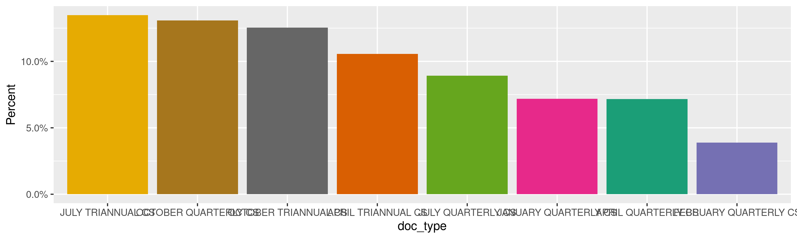
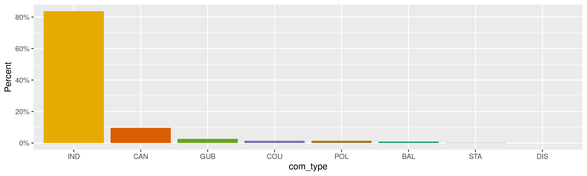
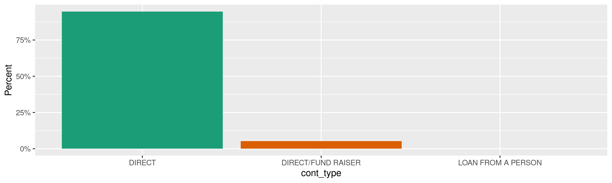
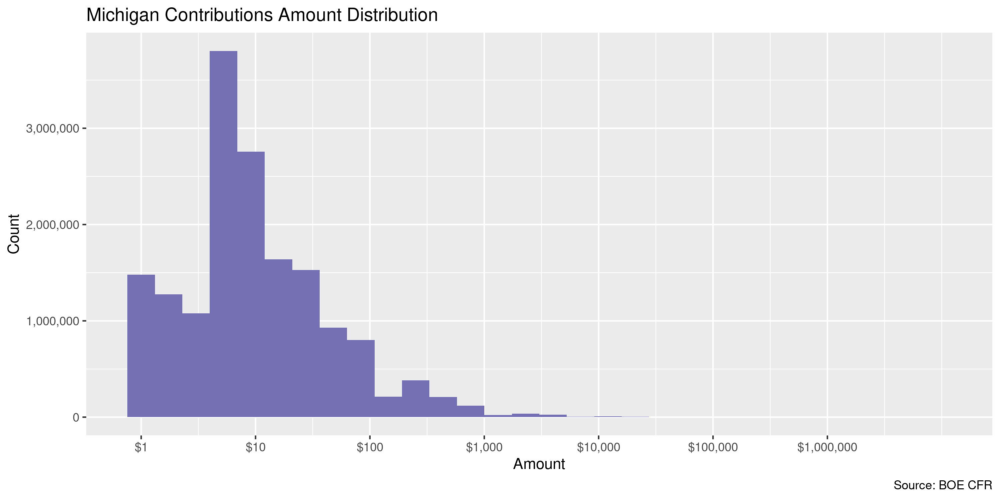
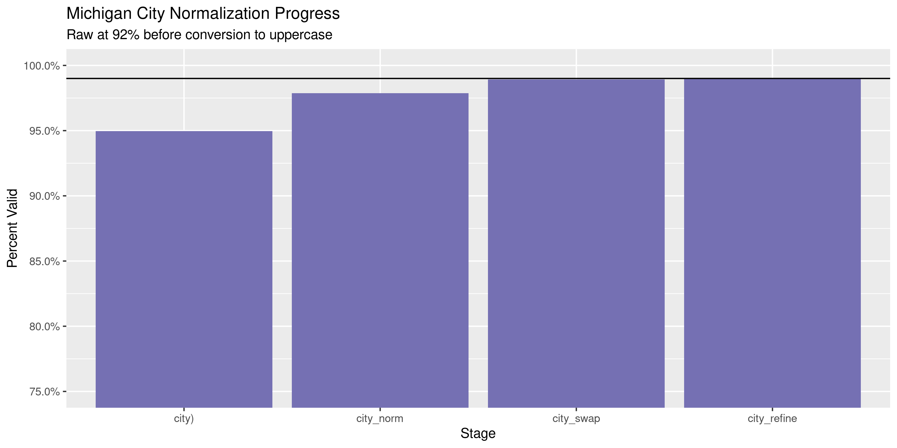

Michigan Contributions
================
Kiernan Nicholls
Wed Jan 6 12:36:09 2021

  - [Project](#project)
  - [Objectives](#objectives)
  - [Packages](#packages)
  - [Data](#data)
  - [Download](#download)
  - [Read](#read)
  - [Explore](#explore)
      - [Missing](#missing)
      - [Duplicates](#duplicates)
      - [Categorical](#categorical)
      - [Amounts](#amounts)
      - [Dates](#dates)
  - [Wrangle](#wrangle)
      - [Address](#address)
      - [ZIP](#zip)
      - [State](#state)
      - [City](#city)
  - [Conclude](#conclude)
  - [Export](#export)
  - [Upload](#upload)

<!-- Place comments regarding knitting here -->

## Project

The Accountability Project is an effort to cut across data silos and
give journalists, policy professionals, activists, and the public at
large a simple way to search across huge volumes of public data about
people and organizations.

Our goal is to standardizing public data on a few key fields by thinking
of each dataset row as a transaction. For each transaction there should
be (at least) 3 variables:

1.  All **parties** to a transaction.
2.  The **date** of the transaction.
3.  The **amount** of money involved.

## Objectives

This document describes the process used to complete the following
objectives:

1.  How many records are in the database?
2.  Check for entirely duplicated records.
3.  Check ranges of continuous variables.
4.  Is there anything blank or missing?
5.  Check for consistency issues.
6.  Create a five-digit ZIP Code called `zip`.
7.  Create a `year` field from the transaction date.
8.  Make sure there is data on both parties to a transaction.

## Packages

The following packages are needed to collect, manipulate, visualize,
analyze, and communicate these results. The `pacman` package will
facilitate their installation and attachment.

``` r
if (!require("pacman")) {
  install.packages("pacman")
}
pacman::p_load(
  tidyverse, # data manipulation
  lubridate, # datetime strings
  gluedown, # printing markdown
  janitor, # clean data frames
  campfin, # custom irw tools
  aws.s3, # aws cloud storage
  refinr, # cluster & merge
  scales, # format strings
  knitr, # knit documents
  vroom, # fast reading
  rvest, # scrape html
  glue, # code strings
  here, # project paths
  httr, # http requests
  fs # local storage 
)
```

This document should be run as part of the `R_campfin` project, which
lives as a sub-directory of the more general, language-agnostic
[`irworkshop/accountability_datacleaning`](https://github.com/irworkshop/accountability_datacleaning)
GitHub repository.

The `R_campfin` project uses the [RStudio
projects](https://support.rstudio.com/hc/en-us/articles/200526207-Using-Projects)
feature and should be run as such. The project also uses the dynamic
`here::here()` tool for file paths relative to *your* machine.

``` r
# where does this document knit?
here::i_am("mi/contribs/docs/mi_contribs_diary.Rmd")
```

## Data

This data is obtained from the Michigan [Board of Elections
(BOE)](https://www.michigan.gov/sos/0,4670,7-127-1633---,00.html)
[Campaign Finance Reporting
(CFR)](https://www.michigan.gov/sos/0,4670,7-127-1633_8723---,00.html)
system. The data is provided as [annual ZIP archive
files](https://miboecfr.nictusa.com/cfr/dumpall/cfrdetail/) for the
years 1998 through 2020. These files are updated nightly.

The CFR also provides a README file with a record layout.

> Record layout of contributions. Files are named by statement year.
> Larger files are split and numbered to make them easier to work with.
> In these cases the column header row will only exist in the first (00)
> file.

> 
> 
> | Variable          | Description                                                                                        |
> | :---------------- | :------------------------------------------------------------------------------------------------- |
> | `doc_seq_no`      | Unique BOE document sequence number of the filed campaign statement                                |
> | `page_no`         | If filed on paper, the physical page number the transaction appears on, otherwise zero             |
> | `contribution_id` | Unique number of the transaction, within the campaign statement and amendments                     |
> | `cont_detail_id`  | Unique number used to further break down some types of transactions with supplemental information… |
> | `doc_stmnt_year`  | The calendar year that this statement was required by the BOE                                      |
> | `doc_type_desc`   | The type of statement that this contribution is attached to                                        |
> | `com_legal_name`  | Legal Name of the committee receiving the contribution                                             |
> | `common_name`     | Commonly known shorter name of the committee. May be deprecated in the future.                     |
> | `cfr_com_id`      | Unique committee ID\# of the receiving committee in the BOE database                               |
> | `com_type`        | Type of committee receiving the contribution                                                       |
> | `can_first_name`  | First name of the candidate (if applicable) benefitting from the contribution                      |
> | `can_last_name`   | Last name of the candidate (if applicable) benefitting from the contribution                       |
> | `contribtype`     | Type of contribution received                                                                      |
> | `f_name`          | First name of the individual contributor                                                           |
> | `l_name`          | Last name of the contributor OR the name of the organization that made the contribution            |
> | `address`         | Street address of the contributor                                                                  |
> | `city`            | City of the contributor                                                                            |
> | `state`           | State of the contributor                                                                           |
> | `zip`             | Zipcode of the contributor                                                                         |
> | `occupation`      | Occupation of the contributor                                                                      |
> | `employer`        | Employer of the contributor                                                                        |
> | `received_date`   | Date the contribution was received                                                                 |
> | `amount`          | Dollar amount or value of the contribution                                                         |
> | `aggregate`       | Cumulative dollar amount of contributions made to this committee during this period up to the dat… |
> | `extra_desc`      | Extra descriptive information for the transaction                                                  |
> | `RUNTIME`         | Indicates the time these transactions were exported from the BOE database. Header only.            |
> 

## Download

To import the data for processing, we will have to download each archive
file and read them together into a single data frame object.

We will scrape the download page for every archive link, then
downloading each to a local directory.

``` r
raw_dir <- dir_create(here("mi", "contribs", "data", "raw"))
raw_page <- read_html(raw_base)
```

``` r
raw_urls <- raw_page %>% 
  html_node("table") %>% 
  html_nodes("a") %>% 
  html_attr("href") %>% 
  str_subset("contributions") %>% 
  str_c(raw_base, ., sep = "/")
```

``` r
raw_paths <- path(raw_dir, basename(raw_urls))
```

``` r
for (i in seq_along(raw_paths)) {
  if (!file_exists(raw_paths[i])) {
    download.file(
      url = raw_urls[i], 
      destfile = raw_paths[i]
    )
  }
}
```

## Read

Since the larger files are split with the column header only in the
first, we will have to read these headers separately. The last column
only records the time the files are downloaded.

``` r
mic_names <- str_split(read_lines(raw_paths[1])[1], "\t")[[1]]
mic_names <- mic_names[-length(mic_names)]
mic_names[length(mic_names)] <- "runtime"
```

Using `vroom::vroom()`, we can read all 50 archive files at once.

``` r
mic <- vroom(
  file = raw_paths,
  delim = "\t",
  skip = 1, # header
  col_names = mic_names,
  col_types = cols(
    .default = col_character(),
    page_no = col_integer(),
    doc_stmnt_year = col_integer(),
    received_date = col_date_usa(),
    amount = col_double(),
    aggregate = col_double(),
    runtime = col_skip()
  )
)
```

Some of the columns have an inconsistent number of spacing, which we can
trim.

``` r
mic <- mutate(mic, across(where(is_character), str_trim))
```

``` r
mic <- rename(
  .data = mic,
  doc_id = doc_seq_no,
  cont_id = contribution_id,
  cont_detail = cont_detail_id,
  doc_year = doc_stmnt_year,
  doc_type = doc_type_desc,
  com_name = com_legal_name,
  com_aka = common_name,
  com_id = cfr_com_id,
  com_type = com_type,
  can_f_name = can_first_name,
  can_l_name = can_last_name,
  cont_type = contribtype,
  l_name = l_name_or_org,
  date = received_date
)
```

## Explore

There are 17,528,892 rows of 25 columns. Each record represents a single
monetary or in-kind contribution made to a committee or candidate by an
individual or some other business entity.

``` r
glimpse(mic)
#> Rows: 17,528,892
#> Columns: 25
#> $ doc_id      <chr> "148736", "148736", "148736", "148736", "148736", "148736", "148736", "148736", "148736", "148736…
#> $ page_no     <int> 1, 1, 1, 1, 2, 2, 2, 2, 3, 3, 3, 3, 4, 4, 4, 5, 5, 5, 5, 6, 6, 6, 1, 1, 1, 1, 2, 2, 2, 2, 3, 3, 3…
#> $ cont_id     <chr> "1", "2", "3", "4", "1", "2", "3", "4", "1", "2", "3", "4", "1", "2", "3", "1", "2", "3", "4", "1…
#> $ cont_detail <chr> "0", "0", "0", "0", "0", "0", "0", "0", "0", "0", "0", "0", "0", "0", "0", "0", "0", "0", "0", "0…
#> $ doc_year    <int> 1998, 1998, 1998, 1998, 1998, 1998, 1998, 1998, 1998, 1998, 1998, 1998, 1998, 1998, 1998, 1998, 1…
#> $ doc_type    <chr> "ANNUAL CS", "ANNUAL CS", "ANNUAL CS", "ANNUAL CS", "ANNUAL CS", "ANNUAL CS", "ANNUAL CS", "ANNUA…
#> $ com_name    <chr> "COMMITTEE TO ELECT JUD GILBERT", "COMMITTEE TO ELECT JUD GILBERT", "COMMITTEE TO ELECT JUD GILBE…
#> $ com_aka     <chr> "COMM TO ELECT JUD GILBERT", "COMM TO ELECT JUD GILBERT", "COMM TO ELECT JUD GILBERT", "COMM TO E…
#> $ com_id      <chr> "506799", "506799", "506799", "506799", "506799", "506799", "506799", "506799", "506799", "506799…
#> $ com_type    <chr> "CAN", "CAN", "CAN", "CAN", "CAN", "CAN", "CAN", "CAN", "CAN", "CAN", "CAN", "CAN", "CAN", "CAN",…
#> $ can_f_name  <chr> "JUDSON", "JUDSON", "JUDSON", "JUDSON", "JUDSON", "JUDSON", "JUDSON", "JUDSON", "JUDSON", "JUDSON…
#> $ can_l_name  <chr> "GILBERT II", "GILBERT II", "GILBERT II", "GILBERT II", "GILBERT II", "GILBERT II", "GILBERT II",…
#> $ cont_type   <chr> "DIRECT", "DIRECT", "DIRECT", "DIRECT", "DIRECT", "LOAN FROM A PERSON", "DIRECT", "DIRECT", "DIRE…
#> $ f_name      <chr> "JUDSON", "MARY", NA, "DAN", "RAY", "JUDSON S", "GILBERT", "JOHN R", "LEE", "DUNCAN", "DUNCAN", "…
#> $ l_name      <chr> "GILBERT", "GILBERT", "MICHIGAN FUNERAL DIRECTORS ASSOC", "MORE", "GILBERT", "GILBERT", "ROGERS",…
#> $ address     <chr> "1405 ST CLAIR RIVER DR", "1405 ST CLAIR RIVER DR", "PO BO 27158", "9780 ST JOHN DR", "5874 KING …
#> $ city        <chr> "ALGONAC", "ALGONAC", "LASNING", "PEARL BEACH", "CHINA", "ALGONAC", "ROYAL OAK", "ALGONAC", "ALGO…
#> $ state       <chr> "MI", "MI", "MI", "MI", "MI", "MI", "MI", "MI", "MI", "MI", "MI", "MI", "MI", "MI", "MI", "MI", "…
#> $ zip         <chr> "48001", "48001", "48909", "48001", "48054", "48001", "48067", "48001", "48001", "48331", "48331"…
#> $ occupation  <chr> "FUNERAL DIRECTOR", "RETIRED", NA, "RETIRED", NA, "FUNERAL DIRECTOR", "RETIRED", NA, "RETIRED", "…
#> $ employer    <chr> "GILBERT FUNERAL HOME INC", NA, NA, NA, NA, "GILBERT FUNERAL HOME INC", NA, NA, NA, "ELECTRONIC D…
#> $ date        <date> 1997-07-17, 1997-07-17, 1997-08-29, 1997-09-08, 1997-09-07, 1997-09-09, 1997-09-15, 1997-09-30, …
#> $ amount      <dbl> 500, 500, 1000, 500, 500, 3500, 100, 500, 500, 100, 100, 100, 100, 250, 100, 100, 100, 100, 750, …
#> $ aggregate   <dbl> 500, 500, 1000, 500, 500, 3500, 100, 500, 500, 100, 200, 100, 100, 250, 100, 100, 100, 100, 4250,…
#> $ extra_desc  <chr> NA, NA, NA, NA, NA, NA, NA, NA, NA, NA, NA, NA, NA, NA, NA, NA, NA, NA, NA, NA, NA, NA, NA, NA, N…
tail(mic)
#> # A tibble: 6 x 25
#>   doc_id page_no cont_id cont_detail doc_year doc_type com_name com_aka com_id com_type can_f_name can_l_name cont_type
#>   <chr>    <int> <chr>   <chr>          <int> <chr>    <chr>    <chr>   <chr>  <chr>    <chr>      <chr>      <chr>    
#> 1 504726       0 9436    0               2021 ANNUAL … UNLOCK … UNLOCK… 519796 BAL      <NA>       <NA>       DIRECT   
#> 2 504726       0 9443    0               2021 ANNUAL … UNLOCK … UNLOCK… 519796 BAL      <NA>       <NA>       DIRECT   
#> 3 504726       0 9446    0               2021 ANNUAL … UNLOCK … UNLOCK… 519796 BAL      <NA>       <NA>       DIRECT   
#> 4 504726       0 9448    0               2021 ANNUAL … UNLOCK … UNLOCK… 519796 BAL      <NA>       <NA>       DIRECT   
#> 5 504726       0 9454    0               2021 ANNUAL … UNLOCK … UNLOCK… 519796 BAL      <NA>       <NA>       DIRECT   
#> 6 504730       0 7490    0               2021 ANNUAL … MICHIGA… MICHIG… 513425 BAL      <NA>       <NA>       DIRECT   
#> # … with 12 more variables: f_name <chr>, l_name <chr>, address <chr>, city <chr>, state <chr>, zip <chr>,
#> #   occupation <chr>, employer <chr>, date <date>, amount <dbl>, aggregate <dbl>, extra_desc <chr>
```

### Missing

Columns vary in their degree of missing values.

``` r
col_stats(mic, count_na)
#> # A tibble: 25 x 4
#>    col         class         n          p
#>    <chr>       <chr>     <int>      <dbl>
#>  1 doc_id      <chr>         0 0         
#>  2 page_no     <int>         0 0         
#>  3 cont_id     <chr>         0 0         
#>  4 cont_detail <chr>         0 0         
#>  5 doc_year    <int>         0 0         
#>  6 doc_type    <chr>         0 0         
#>  7 com_name    <chr>         0 0         
#>  8 com_aka     <chr>         0 0         
#>  9 com_id      <chr>         0 0         
#> 10 com_type    <chr>         0 0         
#> 11 can_f_name  <chr>  15373630 0.877     
#> 12 can_l_name  <chr>  15373630 0.877     
#> 13 cont_type   <chr>       103 0.00000588
#> 14 f_name      <chr>    523815 0.0299    
#> 15 l_name      <chr>      5039 0.000287  
#> 16 address     <chr>     18965 0.00108   
#> 17 city        <chr>     18924 0.00108   
#> 18 state       <chr>     19555 0.00112   
#> 19 zip         <chr>     28420 0.00162   
#> 20 occupation  <chr>  13074756 0.746     
#> 21 employer    <chr>  11176823 0.638     
#> 22 date        <date>     1606 0.0000916 
#> 23 amount      <dbl>      4651 0.000265  
#> 24 aggregate   <dbl>     19888 0.00113   
#> 25 extra_desc  <chr>  17528154 1.00
```

We can flag any record missing a key variable needed to identify a
transaction.

``` r
key_vars <- c("date", "l_name", "amount", "com_name")
mic <- flag_na(mic, all_of(key_vars))
mean(mic$na_flag)
#> [1] 0.000643452
```

11,279 records are missing some key variable.

``` r
mic %>% 
  filter(na_flag) %>% 
  select(all_of(key_vars)) %>% 
  sample_frac()
#> # A tibble: 11,279 x 4
#>    date       l_name                     amount com_name                                                                
#>    <date>     <chr>                       <dbl> <chr>                                                                   
#>  1 2020-07-15 <NA>                          1   AFT MICHIGAN                                                            
#>  2 2003-08-05 <NA>                          4.5 NATIONAL ASSOCIATION OF SOCIAL WORKERS MICHIGAN POLITICAL ACTION FOR CAN
#>  3 2007-08-15 RICHARDS                     NA   AUTOMOBILE CLUB OF MICHIGAN POLITICAL ACTION COMMITTEE                  
#>  4 2003-08-05 <NA>                          4.5 NATIONAL ASSOCIATION OF SOCIAL WORKERS MICHIGAN POLITICAL ACTION FOR CAN
#>  5 2005-06-04 <NA>                          4.5 NATIONAL ASSOCIATION OF SOCIAL WORKERS MICHIGAN POLITICAL ACTION FOR CAN
#>  6 2007-11-30 BARTA                        NA   AUTOMOBILE CLUB OF MICHIGAN POLITICAL ACTION COMMITTEE                  
#>  7 NA         WILHELM                      30   CITIZENS FOR STATE SENATOR BILL BULLARD JR                              
#>  8 2005-11-30 DENISON                      NA   AUTOMOBILE CLUB OF MICHIGAN POLITICAL ACTION COMMITTEE                  
#>  9 2005-06-04 <NA>                          4.5 NATIONAL ASSOCIATION OF SOCIAL WORKERS MICHIGAN POLITICAL ACTION FOR CAN
#> 10 NA         MILLWRIGHTS LOCAL 1102 PAC  200   BEWERSDORFF FOR STATE SENATE                                            
#> # … with 11,269 more rows
```

Of those records, no single key variable is overwhelmingly missing.

``` r
mic %>% 
  filter(na_flag) %>% 
  select(all_of(key_vars)) %>% 
  col_stats(count_na)
#> # A tibble: 4 x 4
#>   col      class      n     p
#>   <chr>    <chr>  <int> <dbl>
#> 1 date     <date>  1606 0.142
#> 2 l_name   <chr>   5039 0.447
#> 3 amount   <dbl>   4651 0.412
#> 4 com_name <chr>      0 0
```

### Duplicates

We can also flag any record completely duplicated across every column.

First, we need to create a unique ID for each contribution by combining
the document, page, and line numbers.

``` r
id_vars <- c("doc_id", "page_no", "cont_id", "cont_detail")
mic <- mutate(mic, tx = paste(doc_id, page_no, cont_id, cont_detail, sep = "-"))
prop_distinct(mic$tx)
#> [1] 1
```

``` r
dupe_file <- here("mi", "contribs", "dupes.tsv.xz")
```

``` r
if (!file_exists(dupe_file)) {
  file_create(dupe_file)
  mis <- mic %>% 
    # remove identifying variables
    select(-doc_id, -page_no, -cont_id, -cont_detail, -tx) %>% 
    # split by document year
    group_split(doc_year)
  split_id <- split(mic$tx, mic$doc_year)
  pb <- txtProgressBar(max = length(mis), style = 3)
  # check each year contribs for duplicates
  for (i in seq_along(mis)) {
    d1 <- duplicated(mis[[i]], fromLast = FALSE)
    if (any(d1)) {
      # append dupes by tx id to file
      d2 <- duplicated(mis[[i]], fromLast = TRUE)
      dupes <- tibble(tx = split_id[[i]], dupe_flag = d1 | d2)
      dupes <- filter(dupes, dupe_flag == TRUE)
      vroom_write(dupes, xzfile(dupe_file), append = TRUE)
      rm(d2, dupes)
    }
    rm(d1)
    mis[i] <- NA
    flush_memory(1)
    setTxtProgressBar(pb, i)
  }
  rm(mis)
}
```

``` r
file_size(dupe_file)
#> 86.1K
dupes <- read_tsv(
  file = xzfile(dupe_file),
  col_names = c("tx", "dupe_flag"),
  col_types = cols(
    tx = col_character(),
    dupe_flag = col_logical()
  )
)
dupes <- distinct(dupes)
```

``` r
nrow_pre <- nrow(mic)
mic <- left_join(mic, dupes, by = "tx")
mic <- mutate(mic, dupe_flag = !is.na(dupe_flag))
sum(mic$dupe_flag)
#> [1] 128550
nrow(mic) == nrow_pre
#> [1] TRUE
```

We can see that, despite supposedly unique IDs, there are duplicate
voters.

``` r
mic %>% 
  filter(dupe_flag) %>% 
  select(all_of(id_vars), all_of(key_vars)) %>% 
  arrange(l_name)
#> # A tibble: 128,550 x 8
#>    doc_id page_no cont_id   cont_detail date       l_name                   amount com_name                             
#>    <chr>    <int> <chr>     <chr>       <date>     <chr>                     <dbl> <chr>                                
#>  1 500532       0 44616     0           2020-10-15 314 ACTION VICTORY FUND 1050    JULIA PULVER FOR STATE REPRESENTATIVE
#>  2 500535       0 44616     0           2020-10-15 314 ACTION VICTORY FUND 1050    JULIA PULVER FOR STATE REPRESENTATIVE
#>  3 472430       0 217580744 0           2018-10-23 AALSBURG                   1.25 DAYNA POLEHANKI FOR STATE SENATE     
#>  4 472430       0 217631203 0           2018-10-23 AALSBURG                   1.25 DAYNA POLEHANKI FOR STATE SENATE     
#>  5 500532       0 28232     0           2020-10-05 AARDEN                   100    JULIA PULVER FOR STATE REPRESENTATIVE
#>  6 500535       0 28232     0           2020-10-05 AARDEN                   100    JULIA PULVER FOR STATE REPRESENTATIVE
#>  7 500532       0 17213     0           2020-09-16 AARNIO-PETERSON            2.5  JULIA PULVER FOR STATE REPRESENTATIVE
#>  8 500535       0 17213     0           2020-09-16 AARNIO-PETERSON            2.5  JULIA PULVER FOR STATE REPRESENTATIVE
#>  9 237308       0 211131129 0           2004-01-13 AARON                      8    MICHIGAN LABORERS POLITICAL LEAGUE   
#> 10 237308       0 211131139 0           2004-01-13 AARON                      8    MICHIGAN LABORERS POLITICAL LEAGUE   
#> # … with 128,540 more rows
```

### Categorical

``` r
col_stats(mic, n_distinct)
#> # A tibble: 28 x 4
#>    col         class         n           p
#>    <chr>       <chr>     <int>       <dbl>
#>  1 doc_id      <chr>     59006 0.00337    
#>  2 page_no     <int>      1663 0.0000949  
#>  3 cont_id     <chr>   7245097 0.413      
#>  4 cont_detail <chr>      9141 0.000521   
#>  5 doc_year    <int>        24 0.00000137 
#>  6 doc_type    <chr>        57 0.00000325 
#>  7 com_name    <chr>      6076 0.000347   
#>  8 com_aka     <chr>      6079 0.000347   
#>  9 com_id      <chr>      6191 0.000353   
#> 10 com_type    <chr>         8 0.000000456
#> 11 can_f_name  <chr>      1004 0.0000573  
#> 12 can_l_name  <chr>      2821 0.000161   
#> 13 cont_type   <chr>         4 0.000000228
#> 14 f_name      <chr>    222495 0.0127     
#> 15 l_name      <chr>    418944 0.0239     
#> 16 address     <chr>   2050689 0.117      
#> 17 city        <chr>     29406 0.00168    
#> 18 state       <chr>       141 0.00000804 
#> 19 zip         <chr>    568961 0.0325     
#> 20 occupation  <chr>     65708 0.00375    
#> 21 employer    <chr>    179475 0.0102     
#> 22 date        <date>     8809 0.000503   
#> 23 amount      <dbl>     28785 0.00164    
#> 24 aggregate   <dbl>    114345 0.00652    
#> 25 extra_desc  <chr>       211 0.0000120  
#> 26 na_flag     <lgl>         2 0.000000114
#> 27 tx          <chr>  17528892 1          
#> 28 dupe_flag   <lgl>         2 0.000000114
```

<!-- --><!-- --><!-- -->

### Amounts

``` r
summary(mic$amount)
#>    Min. 1st Qu.  Median    Mean 3rd Qu.    Max.    NA's 
#> -195000       3       7      93      20 9175000    4651
mean(mic$amount <= 0, na.rm = TRUE)
#> [1] 0.0006200554
```

These are the records with the minimum and maximum amounts.

``` r
glimpse(mic[c(which.max(mic$amount), which.min(mic$amount)), ])
#> Rows: 2
#> Columns: 28
#> $ doc_id      <chr> "367248", "370592"
#> $ page_no     <int> 0, 0
#> $ cont_id     <chr> "4344", "4119"
#> $ cont_detail <chr> "0", "0"
#> $ doc_year    <int> 2012, 2013
#> $ doc_type    <chr> "AMENDED PRE-GENERAL CS", "FEBRUARY QUARTERLY CS"
#> $ com_name    <chr> "THE PEOPLE SHOULD DECIDE", "WORKING FOR MICHIGAN (SUPERPAC)"
#> $ com_aka     <chr> "THE PEOPLE SHOULD DECIDE", "WORKING FOR MICHIGAN (SUPERPAC)"
#> $ com_id      <chr> "515899", "516268"
#> $ com_type    <chr> "BAL", "POL"
#> $ can_f_name  <chr> NA, NA
#> $ can_l_name  <chr> NA, NA
#> $ cont_type   <chr> "DIRECT", "DIRECT"
#> $ f_name      <chr> NA, NA
#> $ l_name      <chr> "DIBC HOLDINGS INC", "UAW EDUCATIONAL FUND"
#> $ address     <chr> "12225 STEPHENS ROAD", "8000 EAST JEFFERSON STREET"
#> $ city        <chr> "WARREN", "DETROIT"
#> $ state       <chr> "MI", "MI"
#> $ zip         <chr> "48089-0000", "48214-0000"
#> $ occupation  <chr> NA, NA
#> $ employer    <chr> NA, NA
#> $ date        <date> 2012-10-31, 2012-11-09
#> $ amount      <dbl> 9175000, -195000
#> $ aggregate   <dbl> 33389560, 380000
#> $ extra_desc  <chr> NA, NA
#> $ na_flag     <lgl> FALSE, FALSE
#> $ tx          <chr> "367248-0-4344-0", "370592-0-4119-0"
#> $ dupe_flag   <lgl> FALSE, FALSE
```

<!-- -->

### Dates

We can add a new `year` variable using `lubridate::year(date)`.

``` r
mic <- mutate(mic, year = year(date))
```

``` r
# view file name dates
unique(str_extract(dir_ls(raw_dir), "\\d{4}"))
#>  [1] "1998" "1999" "2000" "2001" "2002" "2003" "2004" "2005" "2006" "2007" "2008" "2009" "2010" "2011" "2012" "2013"
#> [17] "2014" "2015" "2016" "2017" "2018" "2019" "2020" "2021"
# count and fix old dates
min(mic$date, na.rm = TRUE)
#> [1] "999-01-14"
sum(mic$year < 1998, na.rm = TRUE)
#> [1] 27478
which_old <- which(mic$year < 1990)
fix_old <- mic$year[which_old] %>% 
    str_replace("\\d(?=\\d{1}$)", "9") %>% 
    str_pad(width = 4, side = "left", pad = "1") %>% 
    as.numeric()
mic$year[which_old] <- fix_old

# count and fix future dates
max(mic$date, na.rm = TRUE)
#> [1] "2206-06-01"
sum(mic$date > today(), na.rm = TRUE)
#> [1] 2
mic$doc_year[which(mic$year > 2020)]
#> [1] 2002 2006
mic$year[which(mic$year > 2020)] <- c(2002, 2006)
```

``` r
min(mic$date, na.rm = TRUE)
#> [1] "999-01-14"
sum(mic$year < min(mic$doc_year) - 1, na.rm = TRUE)
#> [1] 98
max(mic$date, na.rm = TRUE)
#> [1] "2206-06-01"
sum(mic$date > today(), na.rm = TRUE)
#> [1] 2
```

<!-- -->

## Wrangle

To improve the searchability of the database, we will perform some
consistent, confident string normalization. For geographic variables
like city names and ZIP codes, the corresponding `campfin::normal_*()`
functions are tailor made to facilitate this process.

### Address

For the street `addresss` variable, the `campfin::normal_address()`
function will force consistence case, remove punctuation, and abbreviate
official USPS suffixes.

``` r
addr_norm <- mic %>% 
  distinct(address) %>% 
  mutate(
    address_norm = normal_address(
      address = address,
      abbs = usps_street,
      na_rep = TRUE
    )
  )
```

``` r
addr_norm
#> # A tibble: 2,050,689 x 2
#>    address                address_norm        
#>    <chr>                  <chr>               
#>  1 1405 ST CLAIR RIVER DR 1405 ST CLAIR RIV DR
#>  2 PO BO 27158            PO BO 27158         
#>  3 9780 ST JOHN DR        9780 ST JOHN DR     
#>  4 5874 KING RD           5874 KING RD        
#>  5 9882 N RIVER RD        9882 N RIV RD       
#>  6 2931 N BLAIR           2931 N BLAIR        
#>  7 1616 ST CLAIR RIVER DR 1616 ST CLAIR RIV DR
#>  8 112 LOCKHAVEN          112 LOCKHAVEN       
#>  9 39067 SPRING LANE      39067 SPG LN        
#> 10 34157 RAMBLE HILLS DR  34157 RAMBLE HLS DR 
#> # … with 2,050,679 more rows
```

``` r
mic <- left_join(mic, addr_norm)
```

### ZIP

For ZIP codes, the `campfin::normal_zip()` function will attempt to
create valid *five* digit codes by removing the ZIP+4 suffix and
returning leading zeroes dropped by other programs like Microsoft Excel.

``` r
zip_norm <- mic %>% 
  distinct(zip) %>% 
  mutate(
    zip_norm = normal_zip(
      zip = zip,
      na_rep = TRUE
    )
  )
```

``` r
mic <- left_join(mic, zip_norm, by = "zip")
```

``` r
progress_table(
  mic$zip,
  mic$zip_norm,
  compare = valid_zip
)
#> # A tibble: 2 x 6
#>   stage    prop_in n_distinct prop_na    n_out n_diff
#>   <chr>      <dbl>      <dbl>   <dbl>    <dbl>  <dbl>
#> 1 zip      0.00690     568961 0.00162 17379690 566805
#> 2 zip_norm 0.998        28907 0.00218    33835   2393
```

### State

Valid two digit state abbreviations can be made using the
`campfin::normal_state()` function.

``` r
can_prov <- c("ON", "QC", "NS", "NB", "MB", "BC", "PE", "SK", "AB", "NL")
state_norm <- mic %>% 
  distinct(state) %>% 
  mutate(
    state_norm = normal_state(
      state = state,
      abbreviate = TRUE,
      na_rep = TRUE,
      valid = c(valid_state, can_prov)
    )
  )
```

``` r
mic <- left_join(mic, state_norm, by = "state")
```

``` r
mic %>% 
  filter(state != state_norm) %>% 
  count(state, state_norm, sort = TRUE)
#> # A tibble: 1 x 3
#>   state      state_norm     n
#>   <chr>      <chr>      <int>
#> 1 WASHINGTON WA             4
```

``` r
progress_table(
  mic$state,
  mic$state_norm,
  compare = valid_state
)
#> # A tibble: 2 x 6
#>   stage      prop_in n_distinct prop_na n_out n_diff
#>   <chr>        <dbl>      <dbl>   <dbl> <dbl>  <dbl>
#> 1 state         1.00        141 0.00112  5653     82
#> 2 state_norm    1.00         68 0.00126  3212     10
```

### City

Cities are the most difficult geographic variable to normalize, simply
due to the wide variety of valid cities and formats.

#### Normal

The `campfin::normal_city()` function is a good start, again converting
case, removing punctuation, but *expanding* USPS abbreviations. We can
also remove `invalid_city` values.

``` r
norm_city <- mic %>% 
  distinct(city, state_norm, zip_norm) %>% 
  mutate(
    city_norm = normal_city(
      city = city, 
      abbs = usps_city,
      states = c("MI", "DC", "MICHIGAN"),
      na = invalid_city,
      na_rep = TRUE
    )
  )
```

#### Swap

We can further improve normalization by comparing our normalized value
against the *expected* value for that record’s state abbreviation and
ZIP code. If the normalized value is either an abbreviation for or very
similar to the expected value, we can confidently swap those two.

``` r
norm_city <- norm_city %>% 
  rename(city_raw = city) %>% 
  left_join(
    y = zipcodes,
    by = c(
      "state_norm" = "state",
      "zip_norm" = "zip"
    )
  ) %>% 
  rename(city_match = city) %>% 
  mutate(
    match_abb = is_abbrev(city_norm, city_match),
    match_dist = str_dist(city_norm, city_match),
    city_swap = if_else(
      condition = !is.na(match_dist) & (match_abb | match_dist == 1),
      true = city_match,
      false = city_norm
    )
  ) %>% 
  select(
    -city_match,
    -match_dist,
    -match_abb
  )
```

``` r
mic <- left_join(
  x = mic,
  y = norm_city,
  by = c(
    "city" = "city_raw", 
    "state_norm", 
    "zip_norm"
  )
)
```

#### Refine

The [OpenRefine](https://openrefine.org/) algorithms can be used to
group similar strings and replace the less common versions with their
most common counterpart. This can greatly reduce inconsistency, but with
low confidence; we will only keep any refined strings that have a valid
city/state/zip combination.

``` r
good_refine <- mic %>% 
  mutate(
    city_refine = city_swap %>% 
      key_collision_merge() %>% 
      n_gram_merge(numgram = 1)
  ) %>% 
  filter(city_refine != city_swap) %>% 
  inner_join(
    y = zipcodes,
    by = c(
      "city_refine" = "city",
      "state_norm" = "state",
      "zip_norm" = "zip"
    )
  )
```

    #> # A tibble: 458 x 5
    #>    state_norm zip_norm city_swap          city_refine         n
    #>    <chr>      <chr>    <chr>              <chr>           <int>
    #>  1 MI         48094    WASHINGTON TOWNSHI WASHINGTON        747
    #>  2 MI         48021    EAST POINT         EASTPOINTE        516
    #>  3 MD         20910    SLIVER SPRINGS     SILVER SPRING     180
    #>  4 MI         48879    SAINT JOHNSON      SAINT JOHNS       180
    #>  5 WI         54151    NIARAGA            NIAGARA           113
    #>  6 MI         48094    WASHINGTON TOWNS   WASHINGTON        107
    #>  7 MI         48095    WASHINGTON TOWNSHI WASHINGTON         81
    #>  8 MI         48322    WEST BLOOMFIELD TO WEST BLOOMFIELD    79
    #>  9 MI         48324    WEST BLOOMFIELD TW WEST BLOOMFIELD    70
    #> 10 MI         48027    GOODLES            GOODELLS           69
    #> # … with 448 more rows

Then we can join the refined values back to the database.

``` r
mic <- mic %>% 
  left_join(good_refine) %>% 
  mutate(city_refine = coalesce(city_refine, city_swap))
```

#### Progress

Our goal for normalization was to increase the proportion of city values
known to be valid and reduce the total distinct values by correcting
misspellings.

``` r
many_city <- c(valid_city, extra_city)
mic %>% 
  filter(city_refine %out% many_city) %>% 
  count(city_refine, sort = TRUE)
#> # A tibble: 5,786 x 2
#>    city_refine                n
#>    <chr>                  <int>
#>  1 FARMINGTON HILLS      150859
#>  2 SHELBY TOWNSHIP       100495
#>  3 MACOMB TOWNSHIP        30579
#>  4 GROSSE POINTE WOODS    27993
#>  5 <NA>                   26534
#>  6 GROSSE POINTE FARMS    26497
#>  7 GROSSE POINTE PARK     24873
#>  8 CHESTERFIELD TOWNSHIP  10288
#>  9 BROWNSTOWN TOWNSHIP     9935
#> 10 OAKLAND TOWNSHIP        7058
#> # … with 5,776 more rows
```

``` r
many_city <- c(
  many_city,
  "FARMINGTON HILLS",
  "SHELBY TOWNSHIP",
  "MACOMB TOWNSHIP",
  "GROSSE POINTE WOODS",
  "GROSSE POINTE FARMS",
  "GROSSE POINTE PARK"
)
```

| stage        | prop\_in | n\_distinct | prop\_na | n\_out | n\_diff |
| :----------- | -------: | ----------: | -------: | -----: | ------: |
| city)        |    0.950 |       29406 |    0.001 | 881064 |   16167 |
| city\_norm   |    0.979 |       27273 |    0.002 | 373318 |   13982 |
| city\_swap   |    0.989 |       19462 |    0.002 | 187239 |    6148 |
| city\_refine |    0.990 |       19093 |    0.002 | 183762 |    5780 |

You can see how the percentage of valid values increased with each
stage.

<!-- -->

More importantly, the number of distinct values decreased each stage. We
were able to confidently change many distinct invalid values to their
valid equivalent.

<!-- -->

## Conclude

Before exporting, we can remove the intermediary normalization columns
and rename all added variables with the `_clean` suffix.

``` r
mic <- mic %>% 
  select(
    -city_norm,
    -city_swap,
    city_clean = city_refine
  ) %>% 
  rename_all(~str_replace(., "_norm", "_clean")) %>% 
  rename_all(~str_remove(., "_raw")) %>% 
  relocate(state_clean, zip_clean, .after = city_clean)
```

``` r
glimpse(sample_n(mic, 50))
#> Rows: 50
#> Columns: 33
#> $ doc_id        <chr> "281648", "281580", "409866", "289542", "491133", "355592", "409354", "395804", "260347", "3175…
#> $ page_no       <int> 0, 0, 0, 0, 0, 0, 0, 0, 0, 0, 0, 0, 0, 0, 0, 0, 0, 0, 0, 0, 0, 0, 0, 0, 0, 0, 0, 0, 0, 0, 0, 0,…
#> $ cont_id       <chr> "8832", "8526", "12206", "268301", "829745", "47315", "6575", "47566000", "96856", "12839", "21…
#> $ cont_detail   <chr> "0", "0", "0", "0", "0", "0", "0", "0", "0", "0", "0", "0", "0", "0", "0", "0", "0", "0", "0", …
#> $ doc_year      <int> 2006, 2006, 2015, 2007, 2020, 2012, 2015, 2014, 2005, 2009, 2007, 2006, 2010, 2004, 2020, 2005,…
#> $ doc_type      <chr> "POST-GENERAL CS", "POST-GENERAL CS", "JULY QUARTERLY CS", "JULY TRIANNUAL CS", "JANUARY QUARTE…
#> $ com_name      <chr> "FRIENDS OF JOHN MOOLENAAR", "AMOS WILLIAMS 4 AG", "REBEKAH WARREN FOR STATE SENATE", "MICHIGAN…
#> $ com_aka       <chr> "FRIENDS OF JOHN MOOLENAAR", "AMOS WILLIAMS 4 AG", "REBEKAH WARREN FOR STATE SENATE", "MICHIGAN…
#> $ com_id        <chr> "510339", "512722", "514476", "745", "508347", "507677", "507879", "514347", "646", "3397", "50…
#> $ com_type      <chr> "CAN", "CAN", "CAN", "IND", "IND", "IND", "IND", "GUB", "IND", "IND", "IND", "IND", "CAN", "IND…
#> $ can_f_name    <chr> "JOHN", "AMOS", "REBEKAH", NA, NA, NA, NA, "RICHARD", NA, NA, NA, NA, "DENNIS", NA, NA, NA, NA,…
#> $ can_l_name    <chr> "MOOLENAAR", "WILLIAMS", "WARREN", NA, NA, NA, NA, "SNYDER", NA, NA, NA, NA, "DENNO", NA, NA, N…
#> $ cont_type     <chr> "DIRECT", "DIRECT", "DIRECT/FUND RAISER", "DIRECT", "DIRECT", "DIRECT", "DIRECT", "DIRECT", "DI…
#> $ f_name        <chr> NA, NA, NA, "COURTNEY", "DOUGLAS W", "MICHELLE", "STEPHEN", "WILLIAM J", "DAN", "ADRIAN", "JEFF…
#> $ l_name        <chr> "23 IS ENOUGH PAC", "MDP JUSTICE CAUCUS PAC", "HEALTH ALLIANCE PLAN PAC", "SZABO", "FISHER", "B…
#> $ address       <chr> "161 OTTAWA AVE. NW SUITE 411-F", "4732 SECOND AVE.", "PO BOX 75000", "5152 MORRISH ROAD APT 37…
#> $ city          <chr> "GRAND RAPIDS", "DETROIT", "DETROIT", "SWARTZ CREEK", "TECUMSEH", "DETROIT", "GALESBURG", "CASS…
#> $ state         <chr> "MI", "MI", "MI", "MI", "MI", "MI", "MI", "MI", "MI", "MI", "MI", "MI", "DC", "MI", "MI", "MI",…
#> $ zip           <chr> "49503-0000", "48201-0000", "48275-0000", "48473-0000", "49286-1517", "48214-0000", "49053-0000…
#> $ occupation    <chr> NA, NA, NA, NA, NA, NA, NA, NA, "MGR  ASSOC DESIGN", NA, NA, "FACTORY WORKER", NA, NA, NA, NA, …
#> $ employer      <chr> NA, NA, NA, NA, NA, NA, NA, NA, "MEIJER", NA, NA, "GENERAL MOTORS - 598", NA, NA, NA, NA, "UNIT…
#> $ date          <date> 2006-10-31, 2006-11-04, 2015-03-05, 2007-03-20, 2019-12-20, 2011-10-22, 2015-05-01, 2014-10-08…
#> $ amount        <dbl> 500.00, 500.00, 500.00, 5.00, 1.00, 3.00, 5.00, 50.00, 2.00, 9.00, 2.78, 10.00, 50.00, 5.00, 9.…
#> $ aggregate     <dbl> 500.00, 500.00, 500.00, 5.00, 2.00, 15.00, 5.00, 50.00, 84.00, 9.00, 5.23, 395.00, 50.00, 40.00…
#> $ extra_desc    <chr> NA, NA, NA, NA, NA, NA, NA, NA, NA, NA, NA, NA, NA, NA, NA, NA, NA, NA, NA, NA, NA, NA, NA, NA,…
#> $ na_flag       <lgl> FALSE, FALSE, FALSE, FALSE, FALSE, FALSE, FALSE, FALSE, FALSE, FALSE, FALSE, FALSE, FALSE, FALS…
#> $ tx            <chr> "281648-0-8832-0", "281580-0-8526-0", "409866-0-12206-0", "289542-0-268301-0", "491133-0-829745…
#> $ dupe_flag     <lgl> FALSE, FALSE, FALSE, FALSE, FALSE, FALSE, FALSE, FALSE, FALSE, FALSE, FALSE, FALSE, FALSE, FALS…
#> $ year          <dbl> 2006, 2006, 2015, 2007, 2019, 2011, 2015, 2014, 2005, 2009, 2007, 2006, 2010, 2004, 2019, 2005,…
#> $ address_clean <chr> "161 OTTAWA AVE NW STE 411 F", "4732 SECOND AVE", "PO BOX 75000", "5152 MORRISH RD APT 37", "10…
#> $ city_clean    <chr> "GRAND RAPIDS", "DETROIT", "DETROIT", "SWARTZ CREEK", "TECUMSEH", "DETROIT", "GALESBURG", "CASS…
#> $ state_clean   <chr> "MI", "MI", "MI", "MI", "MI", "MI", "MI", "MI", "MI", "MI", "MI", "MI", "DC", "MI", "MI", "MI",…
#> $ zip_clean     <chr> "49503", "48201", "48275", "48473", "49286", "48214", "49053", "48726", "49534", "49504", "4817…
```

1.  There are 17,528,892 records in the database.
2.  There are 128,550 duplicate records in the database.
3.  The range and distribution of `amount` and `date` seem reasonable.
4.  There are 11,279 records missing key variables.
5.  Consistency in geographic data has been improved with
    `campfin::normal_*()`.
6.  The 4-digit `year` variable has been created with
    `lubridate::year()`.

## Export

Now the file can be saved on disk for upload to the Accountability
server.

``` r
clean_dir <- dir_create(here("mi", "contribs", "data", "clean"))
clean_path <- path(clean_dir, "mi_contribs_clean.csv")
write_csv(mic, clean_path, na = "")
(clean_size <- file_size(clean_path))
#> 4.92G
file_encoding(clean_path) %>% 
  mutate(across(path, path.abbrev))
#> # A tibble: 1 x 3
#>   path                                                                          mime            charset 
#>   <fs::path>                                                                    <chr>           <chr>   
#> 1 /home/kiernan/Code/tap/R_campfin/mi/contribs/data/clean/mi_contribs_clean.csv application/csv us-ascii
```

## Upload

We can use the `aws.s3::put_object()` to upload the text file to the IRW
server.

``` r
aws_path <- path("csv", basename(clean_path))
if (!object_exists(aws_path, "publicaccountability")) {
  put_object(
    file = clean_path,
    object = aws_path, 
    bucket = "publicaccountability",
    acl = "public-read",
    show_progress = TRUE,
    multipart = TRUE
  )
}
aws_head <- head_object(aws_path, "publicaccountability")
(aws_size <- as_fs_bytes(attr(aws_head, "content-length")))
unname(aws_size == clean_size)
```
