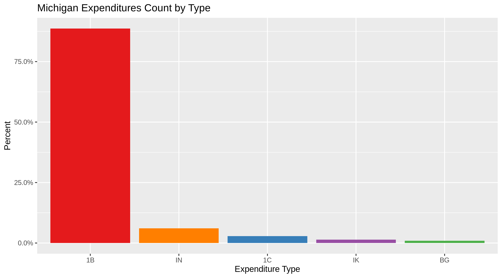
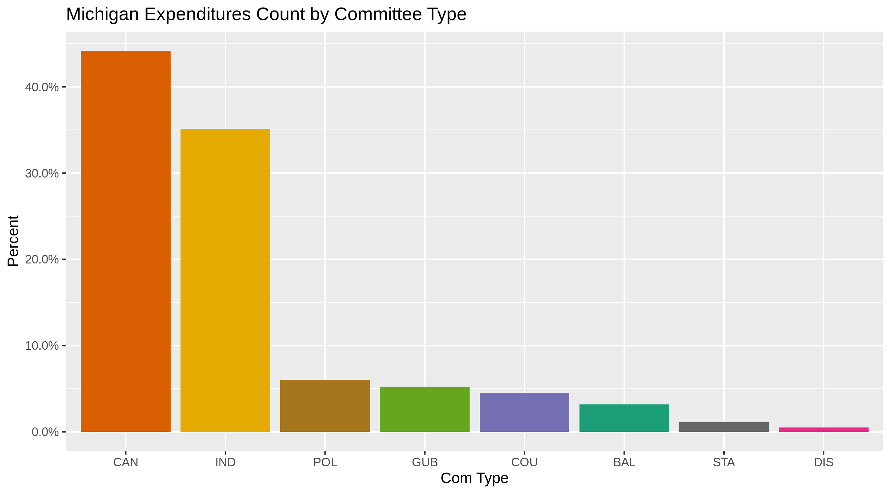
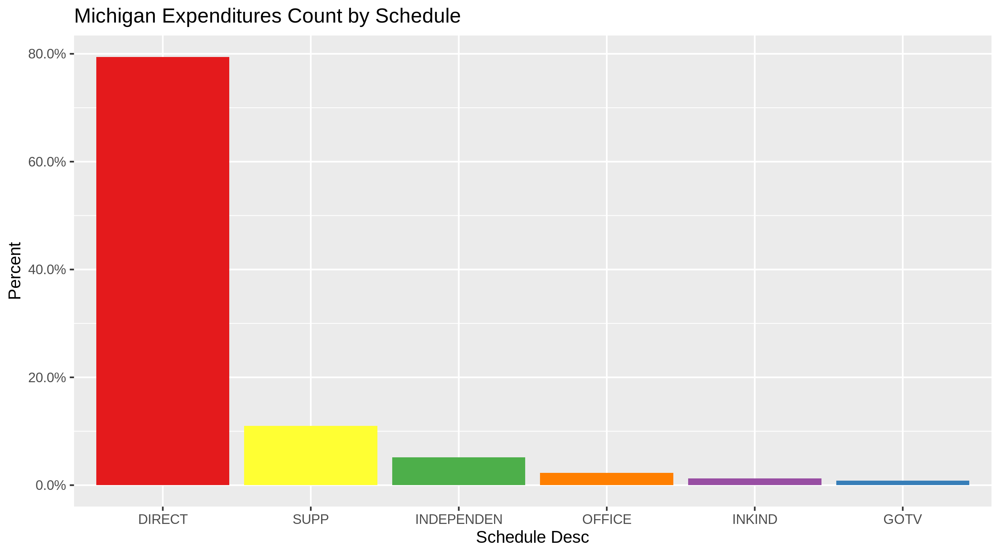
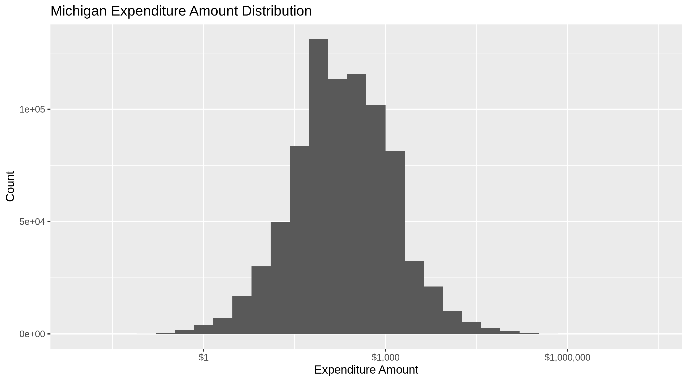
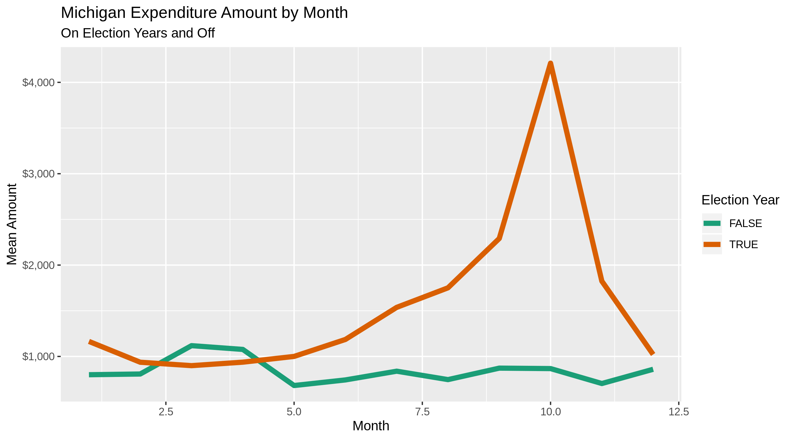
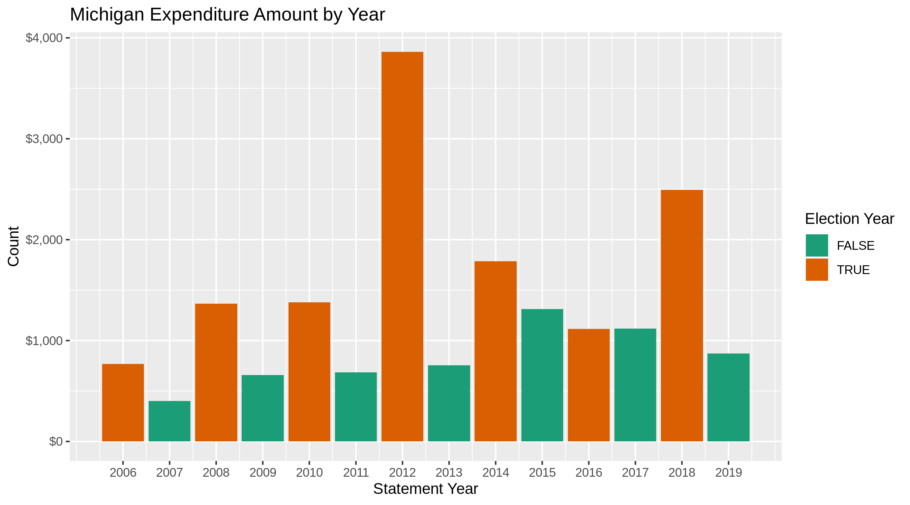

Michigan Expenditures
================
Kiernan Nicholls
2019-07-30 15:47:36

  - [Project](#project)
  - [Objectives](#objectives)
  - [Packages](#packages)
  - [Data](#data)
  - [Import](#import)
  - [Explore](#explore)
  - [Wrangle](#wrangle)
  - [Conclude](#conclude)
  - [Export](#export)

## Project

The Accountability Project is an effort to cut across data silos and
give journalists, policy professionals, activists, and the public at
large a simple way to search across huge volumes of public data about
people and organizations.

Our goal is to standardizing public data on a few key fields by thinking
of each dataset row as a transaction. For each transaction there should
be (at least) 3 variables:

1.  All **parties** to a transaction
2.  The **date** of the transaction
3.  The **amount** of money involved

## Objectives

This document describes the process used to complete the following
objectives:

1.  How many records are in the database?
2.  Check for duplicates
3.  Check ranges
4.  Is there anything blank or missing?
5.  Check for consistency issues
6.  Create a five-digit ZIP Code called `ZIP5`
7.  Create a `YEAR` field from the transaction date
8.  Make sure there is data on both parties to a transaction

## Packages

The following packages are needed to collect, manipulate, visualize,
analyze, and communicate these results. The `pacman` package will
facilitate their installation and attachment.

``` r
if (!require("pacman")) install.packages("pacman")
pacman::p_load(
  stringdist, # levenshtein value
  tidyverse, # data manipulation
  lubridate, # datetime strings
  tidytext, # text analysis
  magrittr, # pipe opperators
  janitor, # dataframe clean
  zipcode, # clean & database
  scales, # format values
  knitr, # knit documents
  rvest, # scrape internet
  glue, # glue strings
  here, # relative storage
  fs # search storage 
)
```

The IRW’s `campfin` package will also have to be installed from GitHub.
This package contains functions custom made to help facilitate the
processing of campaign finance data.

``` r
pacman::p_load_current_gh("kiernann/campfin")
```

This document should be run as part of the `R_campfin` project, which
lives as a sub-directory of the more general, language-agnostic
[`irworkshop/accountability_datacleaning`](https://github.com/irworkshop/accountability_datacleaning "TAP repo")
GitHub repository.

The `R_campfin` project uses the [RStudio
projects](https://support.rstudio.com/hc/en-us/articles/200526207-Using-Projects "Rproj")
feature and should be run as such. The project also uses the dynamic
`here::here()` tool for file paths relative to *your* machine.

``` r
# where dfs this document knit?
here::here()
#> [1] "/home/ubuntu/R/accountability_datacleaning/R_campfin"
```

## Data

The data is obtained from the [Michigan Secretary of State’s
website](https://miboecfr.nictusa.com/cfr/dumpall/cfrdetail/).

### Variables

The
[`cfrdetail/ReadMe_EXPENDITURES.html`](https://miboecfr.nictusa.com/cfr/dumpall/cfrdetail/ReadMe_EXPENDITURES.html)
file provides a table of variable descriptions.

| Variable           | Description                                                                                                                                                           |
| :----------------- | :-------------------------------------------------------------------------------------------------------------------------------------------------------------------- |
| `doc_seq_no`       | Unique BOE document sequence number of the filed campaign statement                                                                                                   |
| `expenditure_type` | Type of expenditure: DIRECT,OFFICE,GOTV,INKIND,INDEPENDENT                                                                                                            |
| `gub_account_type` | If expended by a gubernatorial committee, 1=Private, 2=Public account                                                                                                 |
| `gub_elec_type`    | If expended by a gubernatorial committee, 1=Primary, 2=General, 3=Convention election                                                                                 |
| `page_no`          | If filed on paper, the physical page number the transaction appears on, otherwise zero                                                                                |
| `expense_id`       | Unique number of the transaction, within the campaign statement and amendments                                                                                        |
| `detail_id`        | Unique number used to further break down some types of transactions with supplemental information. If \>0, related transactions will have the same expense\_id value. |
| `doc_stmnt_year`   | The calendar year that this statement was required by the BOE                                                                                                         |
| `doc_type_desc`    | The type of statement that this expenditure is attached to                                                                                                            |
| `com_legal_name`   | Legal Name of the committee making the expenditure                                                                                                                    |
| `common_name`      | Commonly known shorter name of the committee. May be deprecated in the future.                                                                                        |
| `cfr_com_id`       | Unique committee ID\# of the expending committee in the BOE database                                                                                                  |
| `com_type`         | Type of committee making the expenditure                                                                                                                              |
| `schedule_desc`    | Description of the schedule the expenditure is reported on                                                                                                            |
| `exp_desc`         | Further description of the expenditure                                                                                                                                |
| `purpose`          | Purpose of the expenditure                                                                                                                                            |
| `extra_desc`       | Further details of the expenditure, if provided                                                                                                                       |
| `f_name`           | First name of the individual receiving the expenditure                                                                                                                |
| `l_name`           | Last name of the individual OR the organization name receiving the expenditure                                                                                        |
| `address`          | Street address of the payee                                                                                                                                           |
| `city`             | City of the payee                                                                                                                                                     |
| `state`            | State of the payee                                                                                                                                                    |
| `zip`              | Zipcode of the payee                                                                                                                                                  |
| `exp_date`         | Date of the expenditure                                                                                                                                               |
| `amount`           | Dollar amount or value of the expenditure, depending on the expenditure type                                                                                          |
| `state_loc`        | Statewide or local office or ballot issue                                                                                                                             |
| `supp_opp`         | 1=Supporting, 2=Opposing the office or ballot issue                                                                                                                   |
| `can_or_ballot`    | Candidate/Ballot Issue Supported or Opposed                                                                                                                           |
| `county`           | County of office or ballot issue, if county level                                                                                                                     |
| `debt_payment`     | ‘X’ if payment on a debt                                                                                                                                              |
| `vend_name`        | Name of vendor                                                                                                                                                        |
| `vend_addr`        | Address of vendor                                                                                                                                                     |
| `vend_city`        | City of vendor                                                                                                                                                        |
| `vend_state`       | State of vendor                                                                                                                                                       |
| `vend_zip`         | Zipcode of vendor                                                                                                                                                     |
| `gotv_ink_ind`     | 1=INKIND, 2=INDEPENDENT GOTV expenditure                                                                                                                              |
| `fundraiser`       | ‘X’ if related to a fundraiser                                                                                                                                        |
| `RUNTIME`          | Indicates the time these transactions were exported from the BOE database. Header only.                                                                               |

## Import

As the
[`cfrdetail/ReadMe_EXPENDITURES.html`](https://miboecfr.nictusa.com/cfr/dumpall/cfrdetail/ReadMe_EXPENDITURES.html)
file also explains:

> Record layout of expenditures. Files are named by statement year.
> Larger files are split and numbered to make them easier to work with.
> In these cases the column header row will only exist in the first (00)
> file.

No expenditure files are large enough to be split, so we can simply
create a vector of URLs by `glue()`-ing the standard format with each
year.

``` r
urls <- glue("https://miboecfr.nictusa.com/cfr/dumpall/cfrdetail/{2008:2019}_mi_cfr_expenditures.zip")
```

### Download

Then, if the files haven’t already been downloaded we can download each
file to the raw directory.

``` r
raw_dir <- here("mi", "expends", "data", "raw")
dir_create(raw_dir)
```

``` r
if (!all_files_new(raw_dir, "*.zip$")) {
  for (year_url in urls) {
    download.file(
      url = year_url,
      destfile = glue("{raw_dir}/{basename(year_url)}")
    ) 
  }
}
```

### Read

Since the `readr::read_delim()` function can read ZIP files, we don’t
need to unzip. We can read each file into a list using `purrr::map()`
and then bind them into a single list after removing empty columns.

``` r
mi <-
  # list all files
  dir_ls(raw_dir) %>% 
  # read each into a list
  map(
    read_tsv,
    col_type = cols(
      .default = col_character(),
      doc_stmnt_year = col_integer(),
      exp_date = col_date("%m/%d/%Y"),
      amount = col_double()
    )
  ) %>% 
  # in each, remove RUNTIME col
  map(remove_empty, "cols") %>% 
  # bind list into a data frame
  bind_rows()
```

## Explore

``` r
head(mi)
```

    #> # A tibble: 6 x 37
    #>   doc_seq_no expenditure_type gub_account_type gub_elec_type page_no expense_id detail_id
    #>   <chr>      <chr>            <chr>            <chr>         <chr>   <chr>      <chr>    
    #> 1 275251     1B               <NA>             <NA>          0       4404       0        
    #> 2 275251     1B               <NA>             <NA>          0       4438       0        
    #> 3 275251     1B               <NA>             <NA>          0       4441       0        
    #> 4 275251     1B               <NA>             <NA>          0       4444       0        
    #> 5 275251     1B               <NA>             <NA>          0       4445       0        
    #> 6 275251     1B               <NA>             <NA>          0       4448       0        
    #> # … with 30 more variables: doc_stmnt_year <int>, doc_type_desc <chr>, com_legal_name <chr>,
    #> #   common_name <chr>, cfr_com_id <chr>, com_type <chr>, schedule_desc <chr>, exp_desc <chr>,
    #> #   purpose <chr>, f_name <chr>, lname_or_org <chr>, address <chr>, city <chr>, state <chr>,
    #> #   zip <chr>, exp_date <date>, amount <dbl>, state_loc <chr>, supp_opp <chr>,
    #> #   can_or_ballot <chr>, X29 <chr>, county <chr>, debt_payment <chr>, vend_name <chr>,
    #> #   vend_addr <chr>, vend_city <chr>, vend_state <chr>, vend_zip <chr>, gotv_ink_ind <chr>,
    #> #   fundraiser <chr>

``` r
tail(mi)
```

    #> # A tibble: 6 x 37
    #>   doc_seq_no expenditure_type gub_account_type gub_elec_type page_no expense_id detail_id
    #>   <chr>      <chr>            <chr>            <chr>         <chr>   <chr>      <chr>    
    #> 1 484092     1B               <NA>             <NA>          0       11094      0        
    #> 2 484092     1B               <NA>             <NA>          0       11096      0        
    #> 3 484092     1B               <NA>             <NA>          0       11097      0        
    #> 4 484092     1B               <NA>             <NA>          0       11100      0        
    #> 5 484092     1B               <NA>             <NA>          0       11107      0        
    #> 6 484092     1B               <NA>             <NA>          0       11108      0        
    #> # … with 30 more variables: doc_stmnt_year <int>, doc_type_desc <chr>, com_legal_name <chr>,
    #> #   common_name <chr>, cfr_com_id <chr>, com_type <chr>, schedule_desc <chr>, exp_desc <chr>,
    #> #   purpose <chr>, f_name <chr>, lname_or_org <chr>, address <chr>, city <chr>, state <chr>,
    #> #   zip <chr>, exp_date <date>, amount <dbl>, state_loc <chr>, supp_opp <chr>,
    #> #   can_or_ballot <chr>, X29 <chr>, county <chr>, debt_payment <chr>, vend_name <chr>,
    #> #   vend_addr <chr>, vend_city <chr>, vend_state <chr>, vend_zip <chr>, gotv_ink_ind <chr>,
    #> #   fundraiser <chr>

``` r
glimpse(sample_frac(mi))
```

    #> Observations: 811,844
    #> Variables: 37
    #> $ doc_seq_no       <chr> "306316", "402163", "350915", "335943", "355258", "453384", "416396", "…
    #> $ expenditure_type <chr> "1B", "1B", "1B", "1B", "1B", "1B", "1B", "1B", "1B", "1B", "1B", "1B",…
    #> $ gub_account_type <chr> NA, NA, NA, NA, NA, "1", NA, NA, NA, NA, NA, NA, NA, NA, NA, NA, NA, NA…
    #> $ gub_elec_type    <chr> NA, NA, NA, NA, NA, "1", NA, NA, NA, NA, NA, NA, NA, NA, NA, NA, NA, NA…
    #> $ page_no          <chr> "0", "0", "0", "0", "0", "0", "0", "0", "0", "0", "0", "0", "0", "0", "…
    #> $ expense_id       <chr> "6622", "5615", "6321", "11979", "34663075", "34130", "7245", "7844", "…
    #> $ detail_id        <chr> "0", "0", "0", "0", "0", "34214", "0", "7845", "0", "21243", "0", "0", …
    #> $ doc_stmnt_year   <int> 2008, 2015, 2012, 2010, 2012, 2018, 2016, 2015, 2012, 2010, 2011, 2012,…
    #> $ doc_type_desc    <chr> "PRE-GENERAL CS", "ANNUAL CS", "ANNUAL CS", "OCTOBER TRIANNUAL CS", "AP…
    #> $ com_legal_name   <chr> "FRIENDS OF ROBERT DEAN", "MIKE MCCREADY FOR STATE REP", "CTE HAROLD L …
    #> $ common_name      <chr> "FRIENDS OF ROBERT DEAN", "MIKE MCCREADY FOR STATE REP", "CTE HAROLD L …
    #> $ cfr_com_id       <chr> "512750", "515922", "513714", "506549", "330", "518014", "510354", "516…
    #> $ com_type         <chr> "CAN", "CAN", "CAN", "IND", "IND", "GUB", "IND", "CAN", "CAN", "CAN", "…
    #> $ schedule_desc    <chr> "DIRECT", "DIRECT", "DIRECT", "DIRECT", "DIRECT", "SUPP", "DIRECT", "SU…
    #> $ exp_desc         <chr> NA, "INDEPENDENT CONTRACTORS", NA, "DIRECT CONTRIBUTIONS", "BANK CHARGE…
    #> $ purpose          <chr> "CAMPAIGN WORK", "BOOKKEEPING", "FUNDRAISER TICKETS", "DIRECT CANDIDIAT…
    #> $ f_name           <chr> NA, NA, NA, NA, NA, "KRISTOPHER", NA, NA, NA, NA, NA, NA, NA, "RICK", N…
    #> $ lname_or_org     <chr> "DAWANDA BRANDON", "CAMPAIGN FINANCE SOLUTIONS", "CTE MARTHA SCOTT", "G…
    #> $ address          <chr> "1174 JEFFERSON AVE SE", "1731 BLUE GRASS ROAD", "75 RHODE ISLAND", "34…
    #> $ city             <chr> "GRAND RAPIDS", "LANSING", "HIGHLAND PARK", "WESTLAND", "OKEMOS", "LANS…
    #> $ state            <chr> "MI", "MI", "MI", "MI", "MI", "MI", "MI", "MI", "MI", "MI", "MI", "MI",…
    #> $ zip              <chr> "49507-0000", "48906-0000", "48203-0000", "48185-0000", "48864-0000", "…
    #> $ exp_date         <date> 2008-10-15, 2014-11-30, 2011-07-14, 2010-10-12, 2012-04-20, 2017-11-15…
    #> $ amount           <dbl> 600.00, 250.00, 100.00, 1500.00, 35.95, 38.15, 500.00, 84.32, 2300.58, …
    #> $ state_loc        <chr> NA, NA, NA, NA, NA, NA, NA, NA, NA, NA, NA, NA, NA, NA, NA, NA, NA, NA,…
    #> $ supp_opp         <chr> NA, NA, NA, NA, NA, NA, NA, NA, NA, NA, NA, NA, NA, NA, NA, NA, NA, NA,…
    #> $ can_or_ballot    <chr> NA, NA, NA, NA, NA, NA, "AMANDA PRICE", NA, NA, NA, NA, "JON HARMON", "…
    #> $ X29              <chr> NA, NA, NA, NA, NA, NA, "STATE REPRESENTATIVE 89", NA, NA, NA, NA, "TOW…
    #> $ county           <chr> NA, NA, NA, NA, NA, NA, "OTTAWA", NA, NA, NA, NA, "INGHAM", ".", NA, NA…
    #> $ debt_payment     <chr> NA, NA, NA, NA, NA, NA, NA, NA, NA, NA, NA, NA, NA, NA, NA, NA, NA, NA,…
    #> $ vend_name        <chr> NA, NA, NA, NA, NA, NA, NA, NA, NA, NA, NA, NA, NA, NA, NA, NA, NA, NA,…
    #> $ vend_addr        <chr> NA, NA, NA, NA, NA, NA, NA, NA, NA, NA, NA, NA, NA, NA, NA, NA, NA, NA,…
    #> $ vend_city        <chr> NA, NA, NA, NA, NA, NA, NA, NA, NA, NA, NA, NA, NA, NA, NA, NA, NA, NA,…
    #> $ vend_state       <chr> NA, NA, NA, NA, NA, NA, NA, NA, NA, NA, NA, NA, NA, NA, NA, NA, NA, NA,…
    #> $ vend_zip         <chr> NA, NA, NA, NA, NA, NA, NA, NA, NA, NA, NA, NA, NA, NA, NA, NA, NA, NA,…
    #> $ gotv_ink_ind     <chr> NA, NA, NA, NA, NA, NA, NA, NA, NA, NA, NA, NA, NA, NA, NA, NA, NA, NA,…
    #> $ fundraiser       <chr> NA, NA, NA, NA, NA, NA, NA, NA, NA, NA, NA, NA, NA, NA, NA, NA, NA, NA,…

### Missing

As we know from the README, the `com_legal_name` variable represents who
is making the expenditure and has 0% missing values. The `l_name`
variable represents the “Last name of the individual OR the organization
name receiving the expenditure;” this variable, on the other hand, is
0.0638% missing (518 records).

``` r
glimpse_fun(mi, count_na)
```

    #> # A tibble: 37 x 4
    #>    var              type       n        p
    #>    <chr>            <chr>  <int>    <dbl>
    #>  1 doc_seq_no       chr        0 0       
    #>  2 expenditure_type chr        0 0       
    #>  3 gub_account_type chr   785031 0.967   
    #>  4 gub_elec_type    chr   785031 0.967   
    #>  5 page_no          chr        0 0       
    #>  6 expense_id       chr        0 0       
    #>  7 detail_id        chr        0 0       
    #>  8 doc_stmnt_year   int        0 0       
    #>  9 doc_type_desc    chr        0 0       
    #> 10 com_legal_name   chr        0 0       
    #> 11 common_name      chr        0 0       
    #> 12 cfr_com_id       chr        0 0       
    #> 13 com_type         chr        0 0       
    #> 14 schedule_desc    chr        0 0       
    #> 15 exp_desc         chr   277442 0.342   
    #> 16 purpose          chr     5148 0.00634 
    #> 17 f_name           chr   687818 0.847   
    #> 18 lname_or_org     chr      518 0.000638
    #> 19 address          chr     5236 0.00645 
    #> 20 city             chr     3597 0.00443 
    #> 21 state            chr     3343 0.00412 
    #> 22 zip              chr     5780 0.00712 
    #> 23 exp_date         date     118 0.000145
    #> 24 amount           dbl      118 0.000145
    #> 25 state_loc        chr   778072 0.958   
    #> 26 supp_opp         chr   739693 0.911   
    #> 27 can_or_ballot    chr   593339 0.731   
    #> 28 X29              chr   600972 0.740   
    #> 29 county           chr   613004 0.755   
    #> 30 debt_payment     chr   801236 0.987   
    #> 31 vend_name        chr   803772 0.990   
    #> 32 vend_addr        chr   806836 0.994   
    #> 33 vend_city        chr   806798 0.994   
    #> 34 vend_state       chr   806795 0.994   
    #> 35 vend_zip         chr   806885 0.994   
    #> 36 gotv_ink_ind     chr   810921 0.999   
    #> 37 fundraiser       chr   781658 0.963

Any record missing the variables needed to identify both parties of the
transaction can be flagged with a new `na_flag` variable.

``` r
mi <- mutate(mi, na_flag = is.na(com_legal_name) | is.na(lname_or_org) | is.na(amount))
sum(mi$na_flag)
#> [1] 620
```

### Duplicates

While there are zero completely duplicated records, there are a number
that are duplicated save for the `expense_id` variable.

``` r
nrow(mi) - nrow(distinct(select(mi, -expense_id)))
```

    #> [1] 7284

### Categorical

For categorical variables, we can explore the degree of distinctness and
the distribution of these variables.

``` r
glimpse_fun(mi, n_distinct)
```

    #> # A tibble: 38 x 4
    #>    var              type       n          p
    #>    <chr>            <chr>  <int>      <dbl>
    #>  1 doc_seq_no       chr    43900 0.0541    
    #>  2 expenditure_type chr        5 0.00000616
    #>  3 gub_account_type chr        3 0.00000370
    #>  4 gub_elec_type    chr        4 0.00000493
    #>  5 page_no          chr        1 0.00000123
    #>  6 expense_id       chr   203270 0.250     
    #>  7 detail_id        chr    39299 0.0484    
    #>  8 doc_stmnt_year   int       12 0.0000148 
    #>  9 doc_type_desc    chr       55 0.0000677 
    #> 10 com_legal_name   chr     4200 0.00517   
    #> 11 common_name      chr     4198 0.00517   
    #> 12 cfr_com_id       chr     4258 0.00524   
    #> 13 com_type         chr        8 0.00000985
    #> 14 schedule_desc    chr        6 0.00000739
    #> 15 exp_desc         chr       62 0.0000764 
    #> 16 purpose          chr   123468 0.152     
    #> 17 f_name           chr     8307 0.0102    
    #> 18 lname_or_org     chr   114057 0.140     
    #> 19 address          chr   137883 0.170     
    #> 20 city             chr     6306 0.00777   
    #> 21 state            chr      126 0.000155  
    #> 22 zip              chr    22222 0.0274    
    #> 23 exp_date         date    4746 0.00585   
    #> 24 amount           dbl    96403 0.119     
    #> 25 state_loc        chr       30 0.0000370 
    #> 26 supp_opp         chr        6 0.00000739
    #> 27 can_or_ballot    chr    16986 0.0209    
    #> 28 X29              chr    10238 0.0126    
    #> 29 county           chr      729 0.000898  
    #> 30 debt_payment     chr       26 0.0000320 
    #> 31 vend_name        chr     1008 0.00124   
    #> 32 vend_addr        chr     1086 0.00134   
    #> 33 vend_city        chr      285 0.000351  
    #> 34 vend_state       chr       29 0.0000357 
    #> 35 vend_zip         chr      472 0.000581  
    #> 36 gotv_ink_ind     chr        4 0.00000493
    #> 37 fundraiser       chr        3 0.00000370
    #> 38 na_flag          lgl        2 0.00000246

<!-- -->

<!-- -->

<!-- -->

<!-- -->

### Continuous

For continuous variables, we can explore the range and distribution of
values.

#### Amounts

``` r
summary(mi$amount)
```

    #>     Min.  1st Qu.   Median     Mean  3rd Qu.     Max.     NA's 
    #>   -24000       58      200     1675      510 14157242      118

<!-- -->

<!-- -->

#### Dates

From the minimum and maximum, we can see that the `date` variable is not
exactly clean.

``` r
min(mi$exp_date, na.rm = TRUE)
#> [1] "1989-11-05"
max(mi$exp_date, na.rm = TRUE)
#> [1] "2907-09-01"
```

We can create a `exp_year` variable from `exp_date` using
`lubridate::year()`.

``` r
mi <- mutate(mi, exp_year = year(exp_date))
sum(mi$exp_year < 2006, na.rm = TRUE)
#> [1] 23
sum(mi$exp_date > today(), na.rm = TRUE)
#> [1] 8
```

We can nullify these few invalid dates in a new `date_clean` variable
and flag those changed records with `data_flag`

``` r
mi <- mi %>% 
  mutate(
    date_clean = if_else(
      condition = exp_year > 2019 | exp_year < 2006,
      true = as.Date("1970-01-01"),
      false = exp_date
    ) %>% na_if("1970-01-01")
  )

sum(is.na(mi$exp_date))
#> [1] 118
sum(is.na(mi$date_clean))
#> [1] 149
```

Then we’ll have to go back and fix the `exp_year`.

``` r
mi <- mutate(mi, exp_year = year(date_clean))
```

There is a `doc_stmnt_year` variable, which lists “The calendar year
that this statement was required by the BOE.”

<!-- -->

Most of the time, these are the same but they can’t be equated.

``` r
mean(mi$doc_stmnt_year == mi$exp_year, na.rm = TRUE)
#> [1] 0.7774607
```

We can also use `date_clean` to explore the intersection of `amount` and
time.

``` r
mi %>% 
  mutate(
    month = month(date_clean),
    on_year = is_even(exp_year)
  ) %>% 
  group_by(month, on_year) %>% 
  summarize(mean = mean(amount)) %>% 
  drop_na() %>% 
  ggplot(aes(month, mean)) +
  geom_line(aes(color = on_year), size = 2) +
  scale_y_continuous(labels = dollar) +
  scale_color_brewer(type = "qual", palette = "Dark2") +
  labs(
    title = "Michigan Expenditure Amount by Month",
    subtitle = "On Election Years and Off",
    x      = "Month",
    y      = "Mean Amount",
    color  = "Election Year"
  )
```

<!-- -->

<!-- -->

<!-- -->

## Wrangle

### Address

``` r
mi <- mi %>% 
  mutate(
    address_norm = normal_address(
      address = address,
      add_abbs = usps,
      na_rep = TRUE
    )
  )
```

    #> # A tibble: 10 x 2
    #>    address                  address_norm               
    #>    <chr>                    <chr>                      
    #>  1 54 COURTLAND DR NE STE F 54 COURTLAND DRIVE NE STE F
    #>  2 307 W. SIX               307 W SIX                  
    #>  3 15855 19 MILE            15855 19 MILE              
    #>  4 30606 WOODWARD AVE       30606 WOODWARD AVENUE      
    #>  5 PO BOX 2024              PO BOX 2024                
    #>  6 1345 DIVISION LOFT 302   1345 DIVISION LOFT 302     
    #>  7 PO BOX 630900            PO BOX 630900              
    #>  8 5550 CARMODY RD          5550 CARMODY ROAD          
    #>  9 4191 HILTON AVE          4191 HILTON AVENUE         
    #> 10 108 N ST                 108 N STREET

### ZIP

``` r
n_distinct(mi$zip)
#> [1] 22222
prop_in(mi$zip, geo$zip, na.rm = TRUE)
#> [1] 0
sample(mi$zip, 10)
#>  [1] "49076-0000" "55401-0000" "48176-1666" "49286-0000" "94025-1452" "49037-0000" "48153-0000"
#>  [8] NA           "49686-0000" "48933-0000"
```

``` r
mi <- mi %>% 
  mutate(
    zip_norm = normal_zip(
      zip = zip,
      na_rep = TRUE
    )
  )
```

``` r
n_distinct(mi$zip_norm)
#> [1] 7686
prop_in(mi$zip_norm, geo$zip, na.rm = TRUE)
#> [1] 0.9969443
sum(unique(mi$zip_norm) %out% geo$zip)
#> [1] 568
```

### State

``` r
n_distinct(mi$state)
#> [1] 126
prop_in(mi$state, geo$state, na.rm = TRUE)
#> [1] 0.9995646
setdiff(mi$state, geo$state)
#>  [1] NA                    "ZZ"                  "YT"                  "GR"                 
#>  [5] "WARREN"              "LANSING"             "UK"                  "DETROIT"            
#>  [9] "BLOOMFIELD HILLS"    "REFORD"              "ROYAL OAK"           "HOLLAND"            
#> [13] "WATERFORD"           "OKEMOS"              "BATTLE CREEK"        "AUBURN HILLS"       
#> [17] "YPSILANTI"           "<O"                  "AU"                  "WO"                 
#> [21] "EAST LANSING"        "LAPEER"              "NORTHPORT"           "PAW PAW"            
#> [25] "WOLVERINE"           "MANTON"              "CLARE"               "LUDINGTON"          
#> [29] "LAMBERTVILLE"        "MT PLEASANT"         "TRENTON"             "OWOSSO"             
#> [33] "ALPENA"              "TAWAS CITY"          "MIKADO"              "CHEBOYGAN"          
#> [37] "SOUTHFILED"          "CANTON"              "FARMINGTON HILLS"    "MONTAGUE"           
#> [41] "WALLED LAKE"         "IMLAY CITY"          "GROSSE POINTE FARMS" "SOUTH HAVEN"        
#> [45] "TECUMSEH"            "33"                  "WASHINGTON TWP"      "ST CLAIR SHORES"    
#> [49] "GRAND LEDGE"         "PORT HURON"          "ROCHESTER HILLS"     "LINCOLN PARK"       
#> [53] "ANN ARBOR"           "CLARKSTON"           "GRAND RAPIDS"        "MONROE"             
#> [57] "WESTLAND"            "CLLINTON"            "LIVONIA"             "MM"                 
#> [61] "N/"                  "STURGIS"             "M"                   "4803"
length(setdiff(mi$state, geo$state))
#> [1] 64
```

``` r
mi <- mi %>% 
  mutate(
    state_norm = normal_state(
      state = state,
      na_rep = TRUE,
      valid = geo$state
    )
  )
```

``` r
# changes made
sum(mi$state != str_replace_na(mi$state_norm), na.rm = T)
#> [1] 354
n_distinct(mi$state_norm)
#> [1] 62
# only NA remains
prop_in(mi$state_norm, geo$state, na.rm = TRUE)
#> [1] 1
sum(unique(mi$state_norm) %out% geo$state)
#> [1] 1
```

### City

#### Normalize

``` r
n_distinct(mi$city)
#> [1] 6306
prop_in(mi$city, geo$city, na.rm = TRUE)
#> [1] 0.9350817
length(setdiff(mi$city, geo$city))
#> [1] 3039
```

``` r
mi <- mi %>% 
  mutate(
    city_norm = normal_city(
      city = str_replace(city, "\\bTWP\\b", "TOWNSHIP"),
      geo_abbs = usps_city,
      st_abbs = c("MI", "MICHIGAN", "DC"),
      na = na_city,
      na_rep = TRUE
    )
  )
```

    #> # A tibble: 26,164 x 2
    #>    city             city_norm        
    #>    <chr>            <chr>            
    #>  1 ORION TWP        ORION TOWNSHIP   
    #>  2 MT. CLEMENS      MOUNT CLEMENS    
    #>  3 SAULT STE. MARIE SAULT STE MARIE  
    #>  4 REDFORD TWP.     REDFORD TOWNSHIP 
    #>  5 ST. JOSEPH       SAINT JOSEPH     
    #>  6 HARRISON TWP.    HARRISON TOWNSHIP
    #>  7 ST. JOHNS        SAINT JOHNS      
    #>  8 MT. PLEASANT     MOUNT PLEASANT   
    #>  9 MT. CLEMENS      MOUNT CLEMENS    
    #> 10 ST. CLAIR        SAINT CLAIR      
    #> # … with 26,154 more rows

``` r
n_distinct(mi$city_norm)
#> [1] 5942
prop_in(mi$city_norm, geo$city, na.rm = TRUE)
#> [1] 0.9620526
length(setdiff(mi$city_norm, geo$city))
#> [1] 2664
```

#### Swap

``` r
mi <- mi %>% 
  rename(city_raw = city) %>% 
  left_join(
    y = geo,
    by = c(
      "state_norm" = "state",
      "zip_norm" = "zip"
    )
  ) %>% 
  rename(city_match = city) %>% 
  mutate(
    match_dist = stringdist(city_raw, city_match),
    city_swap = if_else(
      condition = match_dist == 1,
      true = city_match,
      false = city_norm
    )
  )
```

``` r
mean(mi$match_dist == 0, na.rm = TRUE)
#> [1] 0.9097622
sum(mi$match_dist == 1, na.rm = TRUE)
#> [1] 6930
```

``` r
n_distinct(mi$city_swap)
#> [1] 4305
prop_in(mi$city_swap, geo$city, na.rm = TRUE)
#> [1] 0.9708187
length(setdiff(mi$city_swap, geo$city))
#> [1] 1076
```

#### Reivew

``` r
mi %>% 
  filter(city_swap %out% geo$city) %>% 
  count(state_norm, city_swap, sort = TRUE)
```

    #> # A tibble: 1,136 x 3
    #>    state_norm city_swap               n
    #>    <chr>      <chr>               <int>
    #>  1 MI         <NA>                 6844
    #>  2 <NA>       <NA>                 3697
    #>  3 MI         FARMINGTON HILLS     3381
    #>  4 MI         SHELBY TOWNSHIP      2445
    #>  5 MI         ROCHESTER HILLS      2222
    #>  6 OH         SYMMES TOWNSHIP       967
    #>  7 MI         GROSSE POINTE FARMS   847
    #>  8 MI         LATHRUP VILLAGE       806
    #>  9 MI         SAULT STE MARIE       772
    #> 10 MI         BINGHAM FARMS         767
    #> # … with 1,126 more rows

## Conclude

1.  There are 811844 records in the database.
2.  There are duplicate records in the database, ignoring `expense_id`.
3.  The range and distribution of `amount` and `date` seem reasonable.
4.  There are 620 records missing either recipient or date.
5.  Consistency in goegraphic data has been improved with
    `campfin::normal_*()`.
6.  The 5-digit `zip_norm` variable has been created with
    `campfin::normal_zip(mi$zip)`.
7.  The 4-digit `exp_year` variable has been created with
    `lubridate::year(mi$date_clean)`.

## Export

``` r
proc_dir <- here("mi", "expends", "data", "processed")
dir_create(proc_dir)
```

``` r
mi %>% 
  select(
    -exp_date,
    -address,
    -state,
    -city_raw,
    -zip,
    -city_match,
    -city_norm,
    -match_dist
  ) %>% 
  write_csv(
    path = glue("{proc_dir}/mi_expends_clean.csv"),
    na = ""
  )
```
