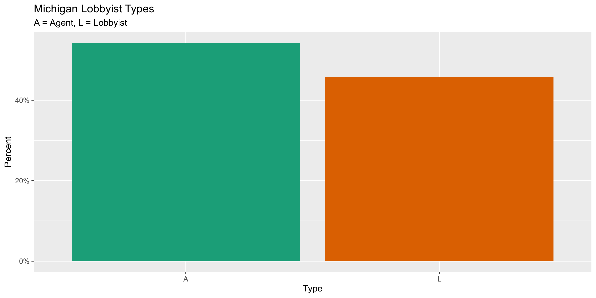
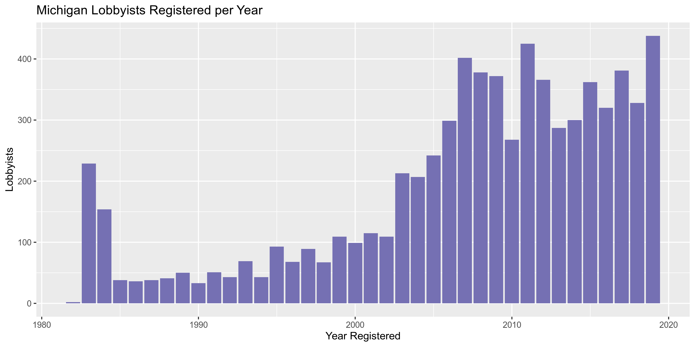

Michigan Lobbyists
================
Kiernan Nicholls
2020-01-21 16:03:02

  - [Project](#project)
  - [Objectives](#objectives)
  - [Packages](#packages)
  - [Data](#data)
  - [Import](#import)
  - [Explore](#explore)
  - [Wrangle](#wrangle)
  - [Export](#export)

<!-- Place comments regarding knitting here -->

## Project

The Accountability Project is an effort to cut across data silos and
give journalists, policy professionals, activists, and the public at
large a simple way to search across huge volumes of public data about
people and organizations.

Our goal is to standardizing public data on a few key fields by thinking
of each dataset row as a transaction. For each transaction there should
be (at least) 3 variables:

1.  All **parties** to a transaction
2.  The **date** of the transaction
3.  The **amount** of money involved

## Objectives

This document describes the process used to complete the following
objectives:

1.  How many records are in the database?
2.  Check for duplicates
3.  Check ranges
4.  Is there anything blank or missing?
5.  Check for consistency issues
6.  Create a five-digit ZIP Code called `ZIP5`
7.  Create a `YEAR` field from the transaction date
8.  Make sure there is data on both parties to a transaction

## Packages

The following packages are needed to collect, manipulate, visualize,
analyze, and communicate these results. The `pacman` package will
facilitate their installation and attachment.

The IRW’s `campfin` package will also have to be installed from GitHub.
This package contains functions custom made to help facilitate the
processing of campaign finance data.

``` r
if (!require("pacman")) install.packages("pacman")
pacman::p_load_gh("irworkshop/campfin")
pacman::p_load(
  tidyverse, # data manipulation
  lubridate, # datetime strings
  magrittr, # pipe opperators
  janitor, # dataframe clean
  refinr, # cluster and merge
  scales, # format strings
  knitr, # knit documents
  vroom, # read files fast
  glue, # combine strings
  here, # relative storage
  fs # search storage 
)
```

This document should be run as part of the `R_campfin` project, which
lives as a sub-directory of the more general, language-agnostic
[`irworkshop/accountability_datacleaning`](https://github.com/irworkshop/accountability_datacleaning "TAP repo")
GitHub repository.

The `R_campfin` project uses the [RStudio
projects](https://support.rstudio.com/hc/en-us/articles/200526207-Using-Projects "Rproj")
feature and should be run as such. The project also uses the dynamic
`here::here()` tool for file paths relative to *your* machine.

``` r
# where does this document knit?
here::here()
#> [1] "/home/kiernan/R/accountability_datacleaning/R_campfin"
```

## Data

Data is obtained from the [Michigan Secretary of
State](https://www.michigan.gov/sos/). The data is provided by NICUSA,
Inc., which provides information technology services for the SOS.

> Use this page to search for information concerning individuals and
> organizations registered under the Michigan Lobby Registration Act, as
> well as expenditures disclosed by these registrants on required
> financial reports. The record for each registrant will also include a
> listing of any reported employees compensated by each registrant for
> lobbying, as well as employers who report the registrant as an
> employee compensated for lobbying on behalf of the employer.
> 
> You may download the entire list of Michigan registrants by clicking
> on the Spreadsheet Format box and following the instructions provided.

The website certificates are out of date, so we can only obtain the file
by using `curl` with the `--insecure` option.

``` r
raw_dir <- here("mi", "lobby", "data", "raw")
dir_create(raw_dir)
```

``` r
# changes from time to time
lob_url <- "https://miboecfr.nictusa.com/cfr/dumpdata/aaa51aybN/mi_lobby.sh"
lob_path <- url2path(lob_url, raw_dir)
if (!file_exists(lob_path)) {
  download.file(
    url = lob_url,
    destfile = lob_path,
    method = "curl",
    extra = "--insecure"
  )
}
```

## Import

As described on the [data
website](https://miboecfr.nicusa.com/cgi-bin/cfr/lobby_srch_res.cgi):

> #### Other Notes:…
> 
> The file is TAB delimited and NO quotes surround string text.
> 
> The first record DOES contain the field names.
> 
> The second record is a ‘dummy’ record used primarily to clue database
> programs like Access in as to how to import the data, as well as some
> other useful information. You may want to delete this record AND the
> record(s) at the end of the file containing counts once you have
> gotten any use from them.
> 
> When saving the mi\_lobby.sh file, you may want to rename it with an
> extension of .txt, so that certain database programs will import it
> correctly. The Bureau of Elections makes every effort to provide
> accurate information to the public. However, any data taken from the
> database should be verified against the actual report filed by the
> lobby. The information provided here is deemed reliable but not
> guaranteed.

We can use this information to define the parameters of
`readr::read_delim()`.

``` r
milr <- read_delim(
  file = lob_path,
  delim = "\t",
  skip = 2,
  col_names = c(
    "id", "type", "last", "first", "mi", "sig", "addr", 
    "city", "state", "zip", "phone", "reg", "term"
  ),
  col_types = cols(
    .default = col_character(),
    type = col_factor(),
    reg = col_date_usa(),
    term = col_date_usa()
  )
)
```

## Explore

``` r
head(milr)
#> # A tibble: 6 x 13
#>   id     type  last     first mi    sig    addr       city  state zip   phone reg        term      
#>   <chr>  <fct> <chr>    <chr> <chr> <chr>  <chr>      <chr> <chr> <chr> <chr> <date>     <date>    
#> 1 014673 A     (RADKE)… JODI  L     <NA>   PO BOX 784 LOVE… CO    80539 9702… 2019-09-12 NA        
#> 2 009995 L     2630 FE… <NA>  <NA>  RICHA… 721 NORTH… LANS… MI    4890… 5173… 2006-09-01 2008-11-30
#> 3 011388 L     3 CLICK… <NA>  <NA>  A EDW… 805 15TH … WASH… DC    20005 2026… 2010-07-12 2010-12-31
#> 4 012438 L     3 REASO… <NA>  <NA>  RENAE… 201 TOWNS… LANS… MI    48933 5173… 2013-05-15 2014-07-31
#> 5 009088 L     3M COMP… <NA>  <NA>  DAVID… 515 KING … ALEX… VA    22314 7036… 2003-01-01 NA        
#> 6 010670 L     3M ELEC… <NA>  <NA>  DAVID… 1838 GUNN… ODES… FL    33556 8137… 2008-06-09 2014-10-20
tail(milr)
#> # A tibble: 6 x 13
#>   id     type  last   first  mi     sig      addr     city  state zip   phone reg        term      
#>   <chr>  <fct> <chr>  <chr>  <chr>  <chr>    <chr>    <chr> <chr> <chr> <chr> <date>     <date>    
#> 1 000151 A     ZURVA… DAVID  S      <NA>     620 S C… LANS… MI    4890… 5174… 1983-10-17 2009-01-30
#> 2 012240 A     ZWART  STEVEN J      <NA>     PO BOX … BAY … MI    4870… 9896… 2012-09-18 2013-12-31
#> 3 009589 A     ZWARTZ ROBERT <NA>   <NA>     175 W J… CHIC… IL    60604 3124… 2005-06-21 2010-08-05
#> 4 006811 A     ZYBLE  DAVID  A      <NA>     1 CORPO… LANS… MI    48951 5173… 1996-12-09 NA        
#> 5 <NA>   <NA>  <NA>   <NA>   End o… 6,916 t… <NA>     <NA>  <NA>  <NA>  <NA>  NA         NA        
#> 6 <NA>   <NA>  <NA>   <NA>   <NA>   <NA>     <NA>     <NA>  <NA>  <NA>  <NA>  NA         NA
glimpse(sample_frac(milr))
#> Observations: 6,918
#> Variables: 13
#> $ id    <chr> "013020", "012165", "011903", "009133", "009545", "013733", "010804", "009122", "0…
#> $ type  <fct> A, A, A, A, A, A, A, A, A, A, A, A, A, A, L, A, A, A, A, A, L, A, L, A, A, A, A, A…
#> $ last  <chr> "CRITCHFIELD", "NEWMAN", "TRUSCOTT ROSSMAN GROUP LLC", "FEDEWA", "BRADY", "OBRIEN"…
#> $ first <chr> "BROOK", "DAVID", NA, "JANICE", "MICHAEL", "MICHAEL", "JOSEPH", "ANITA", "MICHAEL"…
#> $ mi    <chr> "A", "L", NA, "M", NA, "G", NA, NA, "J", NA, NA, "C", "C", NA, NA, "J", NA, NA, NA…
#> $ sig   <chr> NA, NA, "ELLEN MONTI", NA, NA, NA, NA, NA, NA, NA, NA, NA, NA, NA, "PETER J JASKOS…
#> $ addr  <chr> "135 S LASALLE ST IL4-135-07-43", "41650 GARDENBROOK RD, STE 175", "124 W ALLEGAN,…
#> $ city  <chr> "CHICAGO", "NOVI", "LANSING", "LANSING", "NORTHVILLE", "LANSING", "MILWAUKEE", "LA…
#> $ state <chr> "IL", "MI", "MI", "MI", "MI", "MI", "WI", "MI", "MI", "MI", "CA", "MI", "MI", "DC"…
#> $ zip   <chr> "60603", "483751320", "48933", "489121270", "48167", "48933", "53201", "48933", "4…
#> $ phone <chr> "3128284902", "2485961006", "5174879320", "5173727770", "2482334837", "5173671242"…
#> $ reg   <date> 2015-04-01, 2012-07-02, 2011-11-04, 2004-03-10, 2005-04-29, 2017-05-15, 2008-11-0…
#> $ term  <date> 2015-12-31, 2017-08-07, NA, 2007-08-15, NA, NA, 2014-12-31, 2008-11-30, NA, NA, 2…
```

As we can see from `tail()`, the last two rows still need to be removed.

The `id` variable is unique to each lobbyist, so we can use it to remove
the invalid rows.

``` r
col_stats(milr, n_distinct)
#> # A tibble: 13 x 4
#>    col   class      n        p
#>    <chr> <chr>  <int>    <dbl>
#>  1 id    <chr>   6917 1.00    
#>  2 type  <fct>      3 0.000434
#>  3 last  <chr>   5911 0.854   
#>  4 first <chr>    884 0.128   
#>  5 mi    <chr>    184 0.0266  
#>  6 sig   <chr>   2534 0.366   
#>  7 addr  <chr>   4396 0.635   
#>  8 city  <chr>    710 0.103   
#>  9 state <chr>     44 0.00636 
#> 10 zip   <chr>   1324 0.191   
#> 11 phone <chr>   3650 0.528   
#> 12 reg   <date>  3464 0.501   
#> 13 term  <date>  1186 0.171
```

``` r
milr <- filter(milr, !is.na(id))
```

Now, there are no rows missing the key information needed to identify
lobbyists.

``` r
col_stats(milr, count_na)
#> # A tibble: 13 x 4
#>    col   class      n        p
#>    <chr> <chr>  <int>    <dbl>
#>  1 id    <chr>      0 0       
#>  2 type  <fct>      0 0       
#>  3 last  <chr>      0 0       
#>  4 first <chr>   3380 0.489   
#>  5 mi    <chr>   5325 0.770   
#>  6 sig   <chr>   3539 0.512   
#>  7 addr  <chr>      0 0       
#>  8 city  <chr>      0 0       
#>  9 state <chr>     20 0.00289 
#> 10 zip   <chr>     17 0.00246 
#> 11 phone <chr>    481 0.0695  
#> 12 reg   <date>     2 0.000289
#> 13 term  <date>  3024 0.437
```

There are no duplicate rows in the database.

``` r
sum(duplicated(milr))
#> [1] 0
```

The database contains both outside lobbyist and lobbying agents.

<!-- -->

44% of lobbyists in the database have a termination date, meaning only
56% of the records identify active lobbyists.

``` r
prop_na(milr$term)
#> [1] 0.437247
```

We can add the registration year using `lubridate::year()` on the date
column.

``` r
milr <- mutate(milr, year = year(reg))
```

<!-- -->

## Wrangle

To improve the searchability and consistency of the database, we can
perform some very basic and confident text normalization.

### Phone

We can convert the phone numbers into a standard charatcer (i.e.,
non-numeric) format.

``` r
milr <- mutate(milr, phone_norm = normal_phone(phone))
```

    #> # A tibble: 3,650 x 2
    #>    phone      phone_norm    
    #>    <chr>      <chr>         
    #>  1 6147925703 (614) 792-5703
    #>  2 8028603933 (802) 860-3933
    #>  3 2484510324 (248) 451-0324
    #>  4 5172678934 (517) 267-8934
    #>  5 2485122501 (248) 512-2501
    #>  6 3134967521 (313) 496-7521
    #>  7 7035548511 (703) 554-8511
    #>  8 5174822896 (517) 482-2896
    #>  9 6163366750 (616) 336-6750
    #> 10 5172855195 (517) 285-5195
    #> # … with 3,640 more rows

### Address

We can use `campfin::normal_address()` to improve the consistency in the
`addr` variable.

``` r
milr <- mutate(milr, addr_norm = normal_address(addr, abbs = usps_street))
```

    #> # A tibble: 4,395 x 2
    #>    addr                                    addr_norm                             
    #>    <chr>                                   <chr>                                 
    #>  1 171 MONROE AVE NW SUITE 410             171 MONROE AVE NW STE 410             
    #>  2 901 44TH ST SE GH-4C-02                 901 44TH ST SE GH 4C 02               
    #>  3 504 SPRUCE ST % RIO TINTO               504 SPRUCE ST RIO TINTO               
    #>  4 430 W ALLEGAN ST                        430 W ALLEGAN ST                      
    #>  5 208 N CAPITOL AVE 1ST FLOOR             208 N CAPITOL AVE 1ST FL              
    #>  6 727 AIRPORT BOULEVARD                   727 AIRPORT BLVD                      
    #>  7 600 S WAGNER RD                         600 S WAGNER RD                       
    #>  8 ONE AMERICAN RD RM 630-E5 FORD MOTOR CO ONE AMERICAN RD RM 630 E5 FRD MOTOR CO
    #>  9 29777 TELEGRAPH RD STE 4400             29777 TELEGRAPH RD STE 4400           
    #> 10 PO BOX 26416                            PO BOX 26416                          
    #> # … with 4,385 more rows

### ZIP

``` r
milr <- mutate(milr, zip_norm = normal_zip(zip, na_rep = TRUE))
```

    #> # A tibble: 1,324 x 2
    #>    zip       zip_norm
    #>    <chr>     <chr>   
    #>  1 48075     48075   
    #>  2 49401     49401   
    #>  3 80301     80301   
    #>  4 20035     20035   
    #>  5 78733     78733   
    #>  6 05401     05401   
    #>  7 945830716 94583   
    #>  8 60064     60064   
    #>  9 10080     10080   
    #> 10 49032     49032   
    #> # … with 1,314 more rows

``` r
progress_table(
  milr$zip,
  milr$zip_norm,
  compare = valid_zip
)
#> # A tibble: 2 x 6
#>   stage    prop_in n_distinct prop_na n_out n_diff
#>   <chr>      <dbl>      <dbl>   <dbl> <dbl>  <dbl>
#> 1 zip        0.922       1324 0.00246   535    286
#> 2 zip_norm   0.999       1090 0.00304     8      8
```

### State

The `state` variable does not need to be cleaned.

``` r
prop_in(milr$state, valid_state)
#> [1] 1
```

### City

``` r
milr <- mutate(milr, city_norm = normal_city(city, abbs = usps_city, na = invalid_city))
```

``` r
milr <- milr %>% 
  rename(city_raw = city) %>% 
  left_join(
    y = zipcodes,
    by = c(
      "state" = "state",
      "zip_norm" = "zip"
    )
  ) %>% 
  rename(city_match = city) %>% 
  mutate(
    match_abb = is_abbrev(city_norm, city_match),
    match_dist = str_dist(city_norm, city_match),
    city_swap = if_else(
      condition = match_abb | match_dist == 1,
      true = city_match,
      false = city_norm
    )
  )
```

``` r
out <- milr %>% 
  filter(city_swap %out% valid_city) %>% 
  count(city_swap, state, sort = TRUE) %>% 
  drop_na()
```

``` r
check_file <- here("mi", "lobby", "data", "api_check.csv")
if (file_exists(check_file)) {
  check <- read_csv(
    file = check_file
  )
} else {
  check <- pmap_dfr(
    .l = list(
      out$city_swap, 
      out$state
    ), 
    .f = check_city, 
    key = Sys.getenv("GEOCODE_KEY"), 
    guess = TRUE
  ) %>% 
    mutate(guess = coalesce(guess_city, guess_place)) %>% 
    select(-guess_city, -guess_place)
  write_csv(
    x = check,
    path = check_file
  )
}
```

``` r
valid_locality <- check$guess[check$check_city_flag]
```

``` r
valid_locality <- check %>% 
  filter(!check_city_flag) %>% 
  mutate(
    abb = is_abbrev(original_city, guess),
    dist = str_dist(original_city, guess)
  ) %>%
  filter(abb | dist <= 3) %>% 
  pull(guess) %>% 
  c(valid_locality)
```

``` r
many_city <- c(valid_city, extra_city, valid_locality)
```

| stage      | prop\_in | n\_distinct | prop\_na | n\_out | n\_diff |
| :--------- | -------: | ----------: | -------: | -----: | ------: |
| city\_raw  |    0.977 |         709 |    0.000 |    160 |      65 |
| city\_norm |    0.951 |         699 |    0.000 |    340 |     142 |
| city\_swap |    0.997 |         669 |    0.005 |     18 |      13 |

## Export

``` r
proc_dir <- here("mi", "lobby", "data", "processed")
dir_create(proc_dir)
```

``` r
write_csv(
  x = milr,
  path = glue("{proc_dir}/mi_lobby_reg.csv"),
  na = ""
)
```
