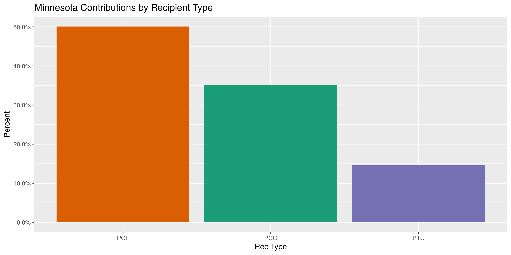
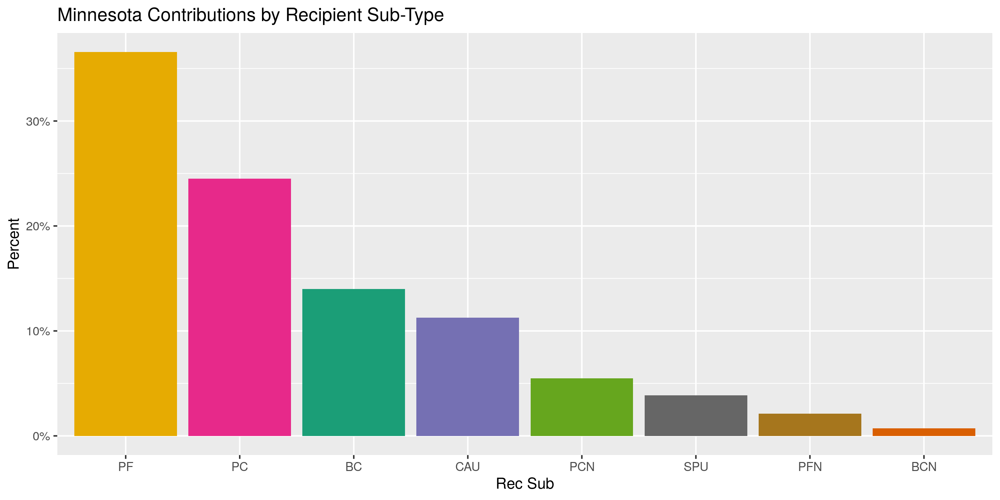
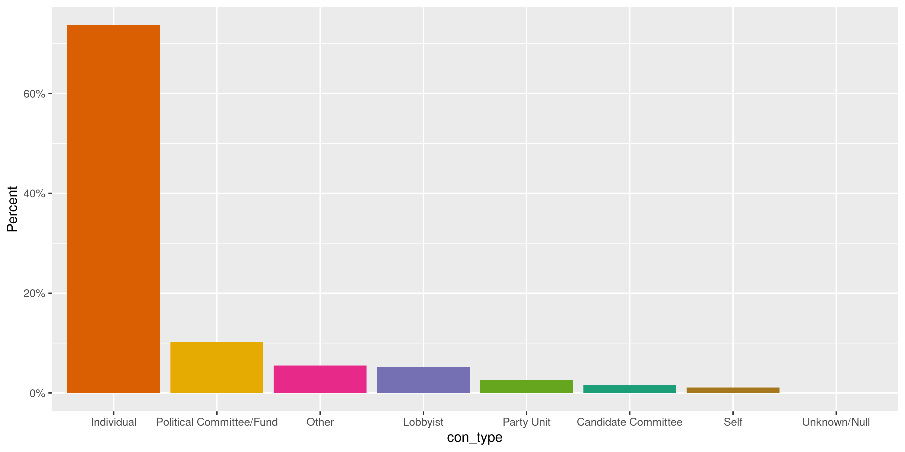
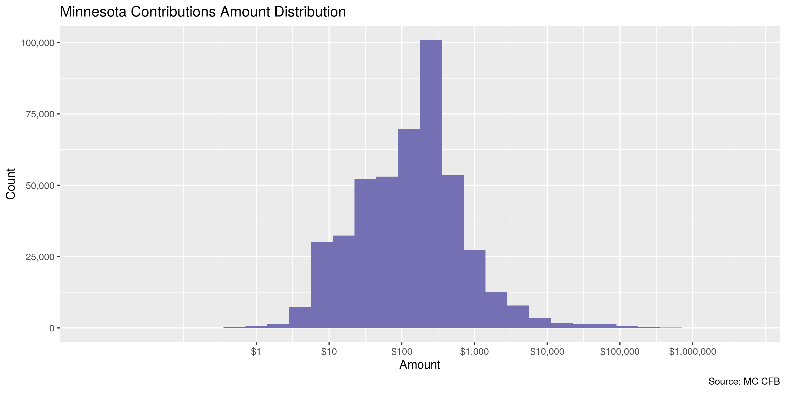
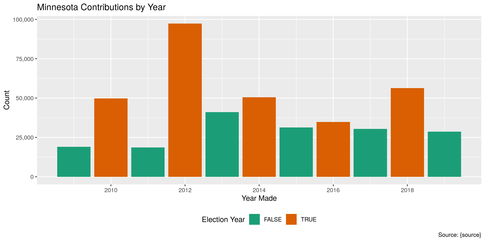

Minnesota Contributions
================
Kiernan Nicholls
2020-02-13 14:12:17

  - [Project](#project)
  - [Objectives](#objectives)
  - [Packages](#packages)
  - [Data](#data)
  - [Import](#import)
  - [Explore](#explore)
  - [Wrangle](#wrangle)
  - [Conclude](#conclude)
  - [Export](#export)

<!-- Place comments regarding knitting here -->

## Project

The Accountability Project is an effort to cut across data silos and
give journalists, policy professionals, activists, and the public at
large a simple way to search across huge volumes of public data about
people and organizations.

Our goal is to standardizing public data on a few key fields by thinking
of each dataset row as a transaction. For each transaction there should
be (at least) 3 variables:

1.  All **parties** to a transaction.
2.  The **date** of the transaction.
3.  The **amount** of money involved.

## Objectives

This document describes the process used to complete the following
objectives:

1.  How many records are in the database?
2.  Check for entirely duplicated records.
3.  Check ranges of continuous variables.
4.  Is there anything blank or missing?
5.  Check for consistency issues.
6.  Create a five-digit ZIP Code called `zip`.
7.  Create a `year` field from the transaction date.
8.  Make sure there is data on both parties to a transaction.

## Packages

The following packages are needed to collect, manipulate, visualize,
analyze, and communicate these results. The `pacman` package will
facilitate their installation and attachment.

The IRW’s `campfin` package will also have to be installed from GitHub.
This package contains functions custom made to help facilitate the
processing of campaign finance data.

``` r
if (!require("pacman")) install.packages("pacman")
pacman::p_load_gh("irworkshop/campfin")
pacman::p_load(
  tidyverse, # data manipulation
  lubridate, # datetime strings
  magrittr, # pipe operators
  janitor, # dataframe clean
  refinr, # cluster and merge
  scales, # format strings
  knitr, # knit documents
  vroom, # read files fast
  httr, # http requests
  glue, # combine strings
  here, # relative storage
  fs # search storage 
)
```

This document should be run as part of the `R_campfin` project, which
lives as a sub-directory of the more general, language-agnostic
[`irworkshop/accountability_datacleaning`](https://github.com/irworkshop/accountability_datacleaning)
GitHub repository.

The `R_campfin` project uses the [RStudio
projects](https://support.rstudio.com/hc/en-us/articles/200526207-Using-Projects)
feature and should be run as such. The project also uses the dynamic
`here::here()` tool for file paths relative to *your* machine.

``` r
# where does this document knit?
here::here()
#> [1] "/home/kiernan/Code/accountability_datacleaning/R_campfin"
```

## Data

The data is obtained from the [Minnesota Campaign Finance Board
(CFB)](https://cfb.mn.gov/).

> The Campaign Finance and Public Disclosure Board was established by
> the state legislature in 1974 and is charged with the administration
> of Minnesota Statutes, Chapter 10A, the Campaign Finance and Public
> Disclosure Act, as well as portions of Chapter 211B, the Fair Campaign
> Practices act.

> The Board’s four major programs are campaign finance registration and
> disclosure, public subsidy administration, lobbyist registration and
> disclosure, and economic interest disclosure by public officials. The
> Board has six members, appointed by the Governor on a bi-partisan
> basis for staggered four-year terms. The appointments must be
> confirmed by a three-fifths vote of the members of each house of the
> legislature.

The CFB provides [direct data
download](https://cfb.mn.gov/reports-and-data/self-help/data-downloads/campaign-finance/)
for all campaign finance data.

## Import

To import the file for processing, we will first have save the file
locally and then read the flat file.

### Download

We can download the file to disk with the `httr::GET()` and
`httr::write_disk()` functions. These functions make the HTTP requests
one would make when clicking on the download link on the CFB page.

``` r
raw_dir <- dir_create(here("mn", "contribs", "data", "raw"))
raw_file <- path(raw_dir, "all_contribs.csv")
if (!file_exists(raw_file)) {
  GET(
    url = "https://cfb.mn.gov/",
    path = c("reports-and-data", "self-help", "data-downloads", "campaign-finance"),
    query = list(download = -2113865252),
    write_disk(raw_file, overwrite = TRUE),
  )
}
```

### Read

We can read this flat file with the `vroom::vroom()` function.

``` r
mnc <- vroom(
  file = raw_file,
  .name_repair = make_clean_names,
  col_types = cols(
    .default = col_character(),
    `Recipient reg num` = col_integer(),
    Amount = col_double(),
    `Receipt date` = col_date_usa(),
    Year = col_integer(),
    `Contributor ID` = col_integer(),
    `Contrib Reg Num` = col_integer(),
    `Contrib employer ID` = col_integer()
  )
)
```

## Explore

The file has 458,113 records of 16 variables.

``` r
head(mnc)
#> # A tibble: 6 x 16
#>   rec_num rec_name rec_type rec_sub amount date        year con_name con_id con_reg con_type
#>     <int> <chr>    <chr>    <chr>    <dbl> <date>     <int> <chr>     <int>   <int> <chr>   
#> 1   10054 Kahn, P… PCC      <NA>       500 2016-02-01  2016 Educati…   7024   30558 Politic…
#> 2   10054 Kahn, P… PCC      <NA>       250 2016-06-17  2016 Redmond…  11667    3548 Lobbyist
#> 3   10054 Kahn, P… PCC      <NA>       250 2016-07-04  2016 Johnson…  81470      NA Individ…
#> 4   10054 Kahn, P… PCC      <NA>       200 2010-01-09  2010 Saint P…   6858   30192 Politic…
#> 5   10054 Kahn, P… PCC      <NA>       500 2010-07-12  2010 Committ…   7320   40045 Politic…
#> 6   10054 Kahn, P… PCC      <NA>       250 2010-07-10  2010 Educati…   7024   30558 Politic…
#> # … with 5 more variables: receipt <chr>, in_kind <lgl>, in_kind_desc <chr>, con_zip <chr>,
#> #   con_emp_name <chr>
tail(mnc)
#> # A tibble: 6 x 16
#>   rec_num rec_name rec_type rec_sub amount date        year con_name con_id con_reg con_type
#>     <int> <chr>    <chr>    <chr>    <dbl> <date>     <int> <chr>     <int>   <int> <chr>   
#> 1   80032 MN Alli… PCF      PFN         20 2019-08-02  2019 Hoehn, …  96641      NA Individ…
#> 2   80032 MN Alli… PCF      PFN         20 2019-10-02  2019 Hoehn, …  96641      NA Individ…
#> 3   80032 MN Alli… PCF      PFN         20 2019-11-02  2019 Hoehn, …  96641      NA Individ…
#> 4   80032 MN Alli… PCF      PFN         20 2019-12-02  2019 Hoehn, …  96641      NA Individ…
#> 5   80032 MN Alli… PCF      PFN         20 2019-12-10  2019 Hoehn, …  96641      NA Individ…
#> 6   80032 MN Alli… PCF      PFN        250 2019-04-13  2019 Larson,… 149618      NA Individ…
#> # … with 5 more variables: receipt <chr>, in_kind <lgl>, in_kind_desc <chr>, con_zip <chr>,
#> #   con_emp_name <chr>
glimpse(sample_n(mnc, 20))
#> Observations: 20
#> Variables: 16
#> $ rec_num      <int> 17719, 16246, 20006, 16920, 30677, 60054, 20006, 17313, 30599, 30331, 18165…
#> $ rec_name     <chr> "Rutzick, Ryan L House Committee", "Carlson, James A Senate Committee", "DF…
#> $ rec_type     <chr> "PCC", "PCC", "PTU", "PCC", "PCF", "PCF", "PTU", "PCC", "PCF", "PCF", "PCC"…
#> $ rec_sub      <chr> NA, NA, "CAU", NA, "IEF", "BC", "CAU", NA, "PF", "PF", NA, "PC", "CAU", "PF…
#> $ amount       <dbl> 200.00, 24.96, 25.00, 500.00, 1000.00, 200.00, 25.00, 250.00, 360.00, 1805.…
#> $ date         <date> 2014-10-14, 2010-07-11, 2018-09-28, 2009-10-26, 2018-06-25, 2012-09-10, 20…
#> $ year         <int> 2014, 2010, 2018, 2009, 2018, 2012, 2015, 2015, 2011, 2015, 2017, 2013, 201…
#> $ con_name     <chr> "Santrach, Peter T", "Shumer, Susan", "Lagaard, Steven", "Cerkvenik, Gary E…
#> $ con_id       <int> 64611, 35871, 144528, 13769, 76640, 52523, 64500, 6862, 93678, 81106, 13050…
#> $ con_reg      <int> NA, 0, NA, 9166, NA, NA, NA, 30195, NA, NA, NA, NA, 30591, NA, NA, NA, NA, …
#> $ con_type     <chr> "Individual", "Individual", "Individual", "Lobbyist", "Other", "Individual"…
#> $ receipt      <chr> "Contribution", "Contribution", "Contribution", "Contribution", "Contributi…
#> $ in_kind      <lgl> FALSE, FALSE, FALSE, FALSE, FALSE, FALSE, FALSE, FALSE, FALSE, FALSE, FALSE…
#> $ in_kind_desc <chr> NA, NA, NA, NA, NA, NA, NA, NA, NA, NA, NA, NA, NA, NA, NA, NA, NA, NA, NA,…
#> $ con_zip      <chr> "55127", "55121", "55423", "55710", "55125", "55110", "55442", "55101", "55…
#> $ con_emp_name <chr> "Yada Systems", "Metropolitan State University", "self-Guardian   Trustee",…
```

### Missing

We should flag any variable missing the key variables needed to identify
a unique contribution.

``` r
col_stats(mnc, count_na)
#> # A tibble: 16 x 4
#>    col          class       n        p
#>    <chr>        <chr>   <int>    <dbl>
#>  1 rec_num      <int>       0 0       
#>  2 rec_name     <chr>       0 0       
#>  3 rec_type     <chr>       0 0       
#>  4 rec_sub      <chr>  187815 0.410   
#>  5 amount       <dbl>       0 0       
#>  6 date         <date>      0 0       
#>  7 year         <int>       0 0       
#>  8 con_name     <chr>     124 0.000271
#>  9 con_id       <int>     124 0.000271
#> 10 con_reg      <int>  346488 0.756   
#> 11 con_type     <chr>     111 0.000242
#> 12 receipt      <chr>       0 0       
#> 13 in_kind      <lgl>       0 0       
#> 14 in_kind_desc <chr>  449676 0.982   
#> 15 con_zip      <chr>    2968 0.00648 
#> 16 con_emp_name <chr>   93029 0.203
```

``` r
mnc <- mnc %>% flag_na(rec_name, con_name, date, amount)
sum(mnc$na_flag)
#> [1] 124
```

``` r
mnc %>% 
  filter(na_flag) %>% 
  select(rec_name, con_name, date, amount) %>% 
  sample_frac()
#> # A tibble: 124 x 4
#>    rec_name                                con_name date       amount
#>    <chr>                                   <chr>    <date>      <dbl>
#>  1 IBEW Local 292 Political Education Fund <NA>     2019-04-14   37.9
#>  2 IBEW Local 292 Political Education Fund <NA>     2019-01-31   98.6
#>  3 IBEW Local 292 Political Education Fund <NA>     2019-07-16  463. 
#>  4 IBEW Local 292 Political Education Fund <NA>     2019-06-06   35.2
#>  5 IBEW Local 292 Political Education Fund <NA>     2019-02-28  101. 
#>  6 IBEW Local 292 Political Education Fund <NA>     2019-01-10   34.8
#>  7 IBEW Local 292 Political Education Fund <NA>     2019-04-04   14.3
#>  8 IBEW Local 292 Political Education Fund <NA>     2019-12-02 9717. 
#>  9 IBEW Local 292 Political Education Fund <NA>     2019-01-07   70.2
#> 10 IBEW Local 292 Political Education Fund <NA>     2019-07-29   98.7
#> # … with 114 more rows
```

### Duplicates

Similarly, we can flag all records that are duplicated at least one
other time.

``` r
mnc <- flag_dupes(mnc, everything())
sum(mnc$dupe_flag)
#> [1] 20233
```

``` r
mnc %>% 
  filter(dupe_flag) %>% 
  select(rec_name, con_name, date, amount)
#> # A tibble: 20,233 x 4
#>    rec_name                          con_name                            date       amount
#>    <chr>                             <chr>                               <date>      <dbl>
#>  1 Kahn, Phyllis House Committee     IUPAT District Council 82 PAC       2016-03-07    500
#>  2 Kahn, Phyllis House Committee     IUPAT District Council 82 PAC       2016-03-07    500
#>  3 Carlson, Lyndon R House Committee ACEC/MN Political Action Committee  2012-08-30    250
#>  4 Carlson, Lyndon R House Committee ACEC/MN Political Action Committee  2012-08-30    250
#>  5 Carlson, Lyndon R House Committee North Central States Carpenters PAC 2013-10-16    250
#>  6 Carlson, Lyndon R House Committee North Central States Carpenters PAC 2013-10-16    250
#>  7 Carlson, Lyndon R House Committee North Central States Carpenters PAC 2015-09-30    250
#>  8 Carlson, Lyndon R House Committee North Central States Carpenters PAC 2015-09-30    250
#>  9 Carlson, Lyndon R House Committee North Central States Carpenters PAC 2014-08-27    250
#> 10 Carlson, Lyndon R House Committee North Central States Carpenters PAC 2014-08-27    250
#> # … with 20,223 more rows
```

### Categorical

We can explore the distribution of categorical variables.

``` r
col_stats(mnc, n_distinct)
#> # A tibble: 18 x 4
#>    col          class      n          p
#>    <chr>        <chr>  <int>      <dbl>
#>  1 rec_num      <int>   2597 0.00567   
#>  2 rec_name     <chr>   2553 0.00557   
#>  3 rec_type     <chr>      3 0.00000655
#>  4 rec_sub      <chr>     13 0.0000284 
#>  5 amount       <dbl>  19968 0.0436    
#>  6 date         <date>  4008 0.00875   
#>  7 year         <int>     11 0.0000240 
#>  8 con_name     <chr>  82178 0.179     
#>  9 con_id       <int>  86769 0.189     
#> 10 con_reg      <int>   2821 0.00616   
#> 11 con_type     <chr>     10 0.0000218 
#> 12 receipt      <chr>      5 0.0000109 
#> 13 in_kind      <lgl>      2 0.00000437
#> 14 in_kind_desc <chr>   5482 0.0120    
#> 15 con_zip      <chr>   5905 0.0129    
#> 16 con_emp_name <chr>  42063 0.0918    
#> 17 na_flag      <lgl>      2 0.00000437
#> 18 dupe_flag    <lgl>      2 0.00000437
```

<!-- -->

<!-- -->

<!-- -->

    #> # A tibble: 5 x 2
    #>   receipt                   n
    #>   <chr>                 <int>
    #> 1 Contribution         456222
    #> 2 Loan Payable            208
    #> 3 Loan Receivable           5
    #> 4 Miscellaneous Income   1652
    #> 5 MiscellaneousIncome      26
    #> # A tibble: 2 x 2
    #>   in_kind      n
    #>   <lgl>    <int>
    #> 1 FALSE   443990
    #> 2 TRUE     14123

### Continuous

The range of continuous variables should be checked to identify any
egregious outliers or strange distributions.

#### Amounts

The range of the `amount` variable is reasonable, with very few
contributions at or less than zero dollars.

``` r
summary(mnc$amount)
#>    Min. 1st Qu.  Median    Mean 3rd Qu.    Max. 
#>    -350      38     125    1177     300 5020781
sum(mnc$amount <= 0)
#> [1] 100
```

As we’d expect, the contribution `amount` are log-normally distributed
around the median value of $125.26.

<!-- -->

#### Dates

Since the `year` variable already exists, there is no need to create
one. Any of these which do not match seems to fall near begining of the
year.

``` r
mean(mnc$year == year(mnc$date))
#> [1] 0.999343
mnc %>% 
  filter(year != year(date)) %>% 
  count(month = month(date))
#> # A tibble: 5 x 2
#>   month     n
#>   <dbl> <int>
#> 1     1   167
#> 2     2   103
#> 3     3    26
#> 4     4     2
#> 5    12     3
```

No further cleaning of the date variable is needed.

``` r
min(mnc$date)
#> [1] "2009-01-01"
sum(mnc$year < 2000)
#> [1] 0
max(mnc$date)
#> [1] "2019-12-31"
sum(mnc$date > today())
#> [1] 0
```

<!-- -->

## Wrangle

The database does *not* contain the full range of geographic variables
we’d expect. There is only a ZIP code. We can use this `zip` variable to
add the `city` and `state` variables, but not an `address`. These
variables will *not* be accurate to the data provided by the state.

``` r
mnc <- mnc %>% 
  left_join(zipcodes, by = c("con_zip" = "zip")) %>% 
  rename_at(vars(19:20), ~str_replace(., "(.*)$", "cont_\\1_match"))
```

## Conclude

``` r
glimpse(sample_n(mnc, 20))
#> Observations: 20
#> Variables: 20
#> $ rec_num          <int> 16072, 40940, 30331, 16261, 41123, 18432, 15969, 70005, 15589, 20011, 1…
#> $ rec_name         <chr> "Garofalo, Patrick House Committee", "MOHPA PAC", "IBEW - COPE", "Kelle…
#> $ rec_type         <chr> "PCC", "PCF", "PCF", "PCC", "PCF", "PCC", "PCC", "PCF", "PCC", "PTU", "…
#> $ rec_sub          <chr> NA, "PC", "PF", NA, "IEC", NA, NA, "PCN", NA, "CAU", NA, NA, NA, NA, NA…
#> $ amount           <dbl> 250.00, 1000.00, 20.00, 25.00, 50000.00, 250.00, 250.00, 250.00, 50.00,…
#> $ date             <date> 2010-07-18, 2014-06-19, 2014-06-06, 2009-06-26, 2016-10-05, 2019-10-07…
#> $ year             <int> 2010, 2014, 2014, 2009, 2016, 2019, 2012, 2012, 2012, 2011, 2018, 2016,…
#> $ con_name         <chr> "Rowen, Vernon", "Gesme, Dean", "Local Union 81", "Adams, Donna K", "De…
#> $ con_id           <int> 81817, 46789, 79266, 112117, 75324, 150579, 47331, 67518, 31593, 41331,…
#> $ con_reg          <int> 0, NA, NA, 0, NA, NA, 0, NA, 0, NA, NA, NA, NA, NA, NA, NA, 0, NA, 1758…
#> $ con_type         <chr> "Individual", "Individual", "Other", "Individual", "Other", "Individual…
#> $ receipt          <chr> "Contribution", "Contribution", "Contribution", "Contribution", "Contri…
#> $ in_kind          <lgl> FALSE, FALSE, FALSE, FALSE, FALSE, FALSE, FALSE, FALSE, FALSE, FALSE, F…
#> $ in_kind_desc     <chr> NA, NA, NA, NA, NA, NA, NA, NA, NA, NA, NA, NA, NA, NA, NA, NA, NA, "Se…
#> $ con_zip          <chr> "55024", "55114", "18503", "55305", "20005", "55119", "56267", "55415",…
#> $ con_emp_name     <chr> "Express Scripts", "Minnesota Oncology Hematology, P.A.", NA, "Hopkins …
#> $ na_flag          <lgl> FALSE, FALSE, FALSE, FALSE, FALSE, FALSE, FALSE, FALSE, FALSE, FALSE, F…
#> $ dupe_flag        <lgl> FALSE, FALSE, FALSE, FALSE, FALSE, FALSE, FALSE, FALSE, FALSE, FALSE, F…
#> $ cont_city_match  <chr> "FARMINGTON", "SAINT PAUL", "SCRANTON", "HOPKINS", "WASHINGTON", "SAINT…
#> $ cont_state_match <chr> "MN", "MN", "PA", "MN", "DC", "MN", "MN", "MN", "MN", "MN", "MN", "MN",…
```

1.  There are 458,113 records in the database.
2.  There are 20,233 duplicate records in the database.
3.  The range and distribution of `amount` and `date` seem reasonable.
4.  There are 124 records missing ….
5.  Consistency in geographic data has been improved with
    `campfin::normal_*()`.
6.  The 4-digit `year` variable has been created with
    `lubridate::year()`.

## Export

``` r
clean_dir <- dir_create(here("mn", "contribs", "data", "clean"))
```

``` r
write_csv(
  x = mnc,
  path = path(clean_dir, "mn_contribs_clean.csv"),
  na = ""
)
```
