State Data
================
First Last
2019-08-06 17:24:16

  - [Project](#project)
  - [Objectives](#objectives)
  - [Packages](#packages)
  - [Data](#data)
  - [Import](#import)
  - [Explore](#explore)
  - [Wrangle](#wrangle)
  - [Conclude](#conclude)
  - [Export](#export)

## Project

The Accountability Project is an effort to cut across data silos and
give journalists, policy professionals, activists, and the public at
large a simple way to search across huge volumes of public data about
people and organizations.

Our goal is to standardizing public data on a few key fields by thinking
of each dataset row as a transaction. For each transaction there should
be (at least) 3 variables:

1.  All **parties** to a transaction
2.  The **date** of the transaction
3.  The **amount** of money involved

## Objectives

This document describes the process used to complete the following
objectives:

1.  How many records are in the database?
2.  Check for duplicates
3.  Check ranges
4.  Is there anything blank or missing?
5.  Check for consistency issues
6.  Create a five-digit ZIP Code called `ZIP5`
7.  Create a `YEAR` field from the transaction date
8.  Make sure there is data on both parties to a transaction

## Packages

The following packages are needed to collect, manipulate, visualize,
analyze, and communicate these results. The `pacman` package will
facilitate their installation and attachment.

The IRW’s `campfin` package will also have to be installed from GitHub.
This package contains functions custom made to help facilitate the
processing of campaign finance data.

``` r
if (!require("pacman")) install.packages("pacman")
pacman::p_load_current_gh("kiernann/campfin")
pacman::p_load(
  stringdist, # levenshtein value
  tidyverse, # data manipulation
  lubridate, # datetime strings
  magrittr, # pipe opperators
  tidytext, # text analysis
  janitor, # dataframe clean
  batman, # parse logical
  refinr, # cluster and merge
  scales, # format strings
  rvest, # read html files
  knitr, # knit documents
  vroom, # read files fast
  glue, # combine strings
  here, # relative storage
  fs # search storage 
)
```

This document should be run as part of the `R_campfin` project, which
lives as a sub-directory of the more general, language-agnostic
[`irworkshop/accountability_datacleaning`](https://github.com/irworkshop/accountability_datacleaning "TAP repo")
GitHub repository.

The `R_campfin` project uses the [RStudio
projects](https://support.rstudio.com/hc/en-us/articles/200526207-Using-Projects "Rproj")
feature and should be run as such. The project also uses the dynamic
`here::here()` tool for file paths relative to *your* machine.

``` r
# where does this document knit?
here::here()
#> [1] "/home/ubuntu/R/accountability_datacleaning/R_campfin"
```

## Data

Data is obtained from the [Minnestoa Campaign Finance Board
(CFB)](https://cfb.mn.gov/ "cfb_home").

The [CFB’s
mission](https://cfb.mn.gov/citizen-resources/the-board/more-about-the-board/mission/ "cfb_mission")
is to regulating [campaign
finance](https://cfb.mn.gov/citizen-resources/board-programs/overview/campaign-finance/ "cfb_cf"),
among other things.

> The Campaign Finance and Public Disclosure Board was established by
> the state legislature in 1974 and is charged with the administration
> of Minnesota Statutes, Chapter 10A, the Campaign Finance and Public
> Disclosure Act, as well as portions of Chapter 211B, the Fair Campaign
> Practices act.

> The Board’s mission is to promote public confidence in state
> government decision-making through development, administration, and
> enforcement of disclosure and public financing programs which will
> ensure public access to and understanding of information filed with
> the Board.

> The Board is responsible for administration of statutes governing the
> financial operations of associations that seek to influence Minnesota
> state elections. The Board’s jurisdiction is established by Minnesota
> Statutes Chapter 10A. The Board does not have jurisdiction over
> federal elections, which are regulated by the Federal Election
> Commission, nor does the Board have jurisdiction over local elections.

We can go to the Minnesota Statutes, Chapter 10A, to see the exact scope
of the data collection we will be wrangling.

> [Subd. 9. Campaign
> expenditure](https://www.revisor.mn.gov/statutes/cite/10A.01#stat.10A.01.9 "mn_10a.1.9").
> “Campaign expenditure” or “expenditure” means a purchase or payment of
> money or anything of value, or an advance of credit, made or incurred
> for the purpose of influencing the nomination or election of a
> candidate or for the purpose of promoting or defeating a ballot
> question. An expenditure is considered to be made in the year in which
> the candidate made the purchase of goods or services or incurred an
> obligation to pay for goods or services. An expenditure made for the
> purpose of defeating a candidate is considered made for the purpose of
> influencing the nomination or election of that candidate or any
> opponent of that candidate… “Expenditure” does not include:  
> (1) noncampaign disbursements as defined in subdivision 26;  
> (2) services provided without compensation by an individual
> volunteering personal time on behalf of a candidate, ballot question,
> political committee, political fund, principal campaign committee, or
> party unit;  
> (3) the publishing or broadcasting of news items or editorial comments
> by the news media; or  
> (4) an individual’s unreimbursed personal use of an automobile owned
> by the individual and used by the individual while volunteering
> personal time.

On the CFB [Self-Help Data Download
page](https://cfb.mn.gov/reports-and-data/self-help/data-downloads/campaign-finance/ "cf_dl"),
there are three types of files listed:

1.  Contributions received
2.  Expenditures and contributions made
3.  Independent expenditures

For each type of file, there is a table listing the 8 types of files
that can be downloaded. Here is the table for Expenditures and
contributions made:

| Download Name                                | Data Included                                                                                                                          | Download Data                                                                                                   |
| :------------------------------------------- | :------------------------------------------------------------------------------------------------------------------------------------- | :-------------------------------------------------------------------------------------------------------------- |
| All                                          | Expenditures, including contributions made, by all entities - 2009 to present                                                          | [Download](https://cfb.mn.gov/reports-and-data/self-help/data-downloads/campaign-finance/?download=-1890073264) |
| Candidates                                   | Expenditures, including contributions made, by all candidates - 2009 to present                                                        | [Download](https://cfb.mn.gov/reports-and-data/self-help/data-downloads/campaign-finance/?download=-1315784544) |
| Party units                                  | Expenditures, including contributions made, by all party units - 2009 to present                                                       | [Download](https://cfb.mn.gov/reports-and-data/self-help/data-downloads/campaign-finance/?download=452957533)   |
| State party units                            | Expenditures, including contributions made, by state party units - 2009 to present                                                     | [Download](https://cfb.mn.gov/reports-and-data/self-help/data-downloads/campaign-finance/?download=-897202306)  |
| Party unit caucus committees                 | Expenditures, including contributions made, by state party caucus committees only - 2009 to present                                    | [Download](https://cfb.mn.gov/reports-and-data/self-help/data-downloads/campaign-finance/?download=941425475)   |
| Local party units                            | Expenditures, including contributions made, by local party units only - 2009 to present (excludes state parties and caucus committees) | [Download](https://cfb.mn.gov/reports-and-data/self-help/data-downloads/campaign-finance/?download=935202885)   |
| Committees and funds                         | Expenditures, including contributions made, by all committees and funds - 2009 to present (excludes candidates and party units)        | [Download](https://cfb.mn.gov/reports-and-data/self-help/data-downloads/campaign-finance/?download=1606012724)  |
| Independent expenditure committees and funds | Expenditures by independent expenditure committees and funds units only - 2009 to present                                              | [Download](https://cfb.mn.gov/reports-and-data/self-help/data-downloads/campaign-finance/?download=1002650125)  |

## Import

We will be processing the “All” file under “Expenditures and
contributions made.”

### Download

We can download a copy of the file in question to the `/raw` directory.

``` r
raw_dir  <- here("mn", "expends", "data", "raw")
exp_file <- glue("{raw_dir}/all_expenditures_contributions_made.csv")
dir_create(raw_dir)

if (!all_files_new(raw_dir)) {
  download.file(
    url = download_urls[1],
    destfile = exp_file
  )
}
```

### Read

``` r
mn <- 
  vroom(
    file = exp_file,
    .name_repair = make_clean_names,
    col_types = cols(
      .default = col_character(),
      Amount = col_double(),
      `Unpaid amount` = col_double(),
      Date = col_date("%m/%d/%Y"),
      Year = col_integer()
    )
  ) %>% 
  mutate(in_kind = to_logical(in_kind)) %>% 
  filter(!str_detect(purpose, "PRINTING AND PHOTOCOPYING")) %>%  
  mutate_if(is_character, str_to_upper)
```

## Explore

The database has 141847 records of 21 variables. The file appears to
have been properly read into R as a data frame.

``` r
head(mn)
```

    #> # A tibble: 6 x 21
    #>   committee_reg_n… committee_name entity_type entity_sub_type vendor_name vendor_name_mas…
    #>   <chr>            <chr>          <chr>       <chr>           <chr>       <chr>           
    #> 1 10054            KAHN, PHYLLIS… PCC         <NA>            CLARK, KAR… 34              
    #> 2 10054            KAHN, PHYLLIS… PCC         <NA>            CLARK, KAR… 34              
    #> 3 10054            KAHN, PHYLLIS… PCC         <NA>            CLARK, KAR… 34              
    #> 4 10054            KAHN, PHYLLIS… PCC         <NA>            MN DEPARTM… 105323          
    #> 5 10054            KAHN, PHYLLIS… PCC         <NA>            CLARK, KAR… 34              
    #> 6 10054            KAHN, PHYLLIS… PCC         <NA>            MOLZAHN, M… 72047           
    #> # … with 15 more variables: vendor_address_1 <chr>, vendor_address_2 <chr>, vendor_city <chr>,
    #> #   vendor_state <chr>, vendor_zip <chr>, amount <dbl>, unpaid_amount <dbl>, date <date>,
    #> #   purpose <chr>, year <int>, type <chr>, in_kind_descr <chr>, in_kind <lgl>,
    #> #   affected_committee_name <chr>, affected_committee_reg_num <chr>

``` r
tail(mn)
```

    #> # A tibble: 6 x 21
    #>   committee_reg_n… committee_name entity_type entity_sub_type vendor_name vendor_name_mas…
    #>   <chr>            <chr>          <chr>       <chr>           <chr>       <chr>           
    #> 1 80032            MN ALLIANCE F… PCF         PFN             RALLYORG    75864           
    #> 2 80032            MN ALLIANCE F… PCF         PFN             RALLYORG    75864           
    #> 3 80032            MN ALLIANCE F… PCF         PFN             RALLYORG    75864           
    #> 4 80032            MN ALLIANCE F… PCF         PFN             RALLYORG    75864           
    #> 5 80032            MN ALLIANCE F… PCF         PFN             RALLYORG    75864           
    #> 6 80032            MN ALLIANCE F… PCF         PFN             RALLYORG    75864           
    #> # … with 15 more variables: vendor_address_1 <chr>, vendor_address_2 <chr>, vendor_city <chr>,
    #> #   vendor_state <chr>, vendor_zip <chr>, amount <dbl>, unpaid_amount <dbl>, date <date>,
    #> #   purpose <chr>, year <int>, type <chr>, in_kind_descr <chr>, in_kind <lgl>,
    #> #   affected_committee_name <chr>, affected_committee_reg_num <chr>

``` r
glimpse(sample_frac(mn))
```

    #> Observations: 141,847
    #> Variables: 21
    #> $ committee_reg_num          <chr> "17898", "17438", "20010", "20843", "17878", "20178", "18011"…
    #> $ committee_name             <chr> "LAINE, CAROLYN SENATE COMMITTEE", "WARD, JOANN HOUSE COMMITT…
    #> $ entity_type                <chr> "PCC", "PCC", "PTU", "PTU", "PCC", "PTU", "PCC", "PCF", "PTU"…
    #> $ entity_sub_type            <chr> NA, NA, "CAU", NA, NA, NA, NA, "IEC", "CAU", "PF", NA, NA, "I…
    #> $ vendor_name                <chr> "MICRO CENTER", "WARD, JOANN", "ISAAC SCHULTZ", "OFFICE DEPOT…
    #> $ vendor_name_master_name_id <chr> "78774", "3211", "87861", "136291", "102204", "80256", "14616…
    #> $ vendor_address_1           <chr> "3710 HIGHWAY 100 SOUTH", "7817 SOMERSET CIR", NA, "3001 NICO…
    #> $ vendor_address_2           <chr> NA, NA, "6871 APOLLO RD", NA, NA, NA, NA, NA, NA, NA, NA, NA,…
    #> $ vendor_city                <chr> "ST. LOUIS PARK", "WOODBURY", "SWANVILLE", "MINNEAPOLIS", "BL…
    #> $ vendor_state               <chr> "MN", "MN", "MN", "MN", "MN", "MN", "MN", "MN", "CA", "MN", "…
    #> $ vendor_zip                 <chr> "55416", "55125", "56382", "55408", "55449", "56258", "55113"…
    #> $ amount                     <dbl> 90.07, 2500.00, 760.45, 346.93, 350.00, 300.00, 357.98, 5.65,…
    #> $ unpaid_amount              <dbl> 0, 0, 0, 0, 0, 0, 0, 0, 0, 0, 0, 0, 0, 0, 0, 0, 0, 0, 0, 0, 0…
    #> $ date                       <date> 2016-07-16, 2018-07-13, 2016-10-14, 2018-01-19, 2016-11-08, …
    #> $ purpose                    <chr> "SUPPLIES: PRINTER INK", "LOAN PAYMENTS - PRINCIPAL: REPAYMEN…
    #> $ year                       <int> 2016, 2018, 2016, 2018, 2016, 2016, 2018, 2018, 2018, 2016, 2…
    #> $ type                       <chr> "CAMPAIGN EXPENDITURE", "NON-CAMPAIGN DISBURSEMENT", "GENERAL…
    #> $ in_kind_descr              <chr> NA, NA, NA, NA, NA, NA, NA, "RENTAL VEHICLE", NA, NA, "OTHER …
    #> $ in_kind                    <lgl> FALSE, FALSE, FALSE, FALSE, FALSE, FALSE, FALSE, TRUE, FALSE,…
    #> $ affected_committee_name    <chr> NA, NA, NA, NA, NA, NA, NA, NA, NA, NA, NA, NA, NA, NA, NA, N…
    #> $ affected_committee_reg_num <chr> NA, NA, NA, NA, NA, NA, NA, NA, NA, NA, NA, NA, NA, NA, NA, N…

### Missing

First, we need to ensure that each record contains a value for both
parties to the expenditure (`committee_name` makes the expenditure to
`vendor_name`), as well as a `date` and `amount`.

``` r
glimpse_fun(mn, count_na)
```

    #> # A tibble: 21 x 4
    #>    var                        type       n         p
    #>    <chr>                      <chr>  <int>     <dbl>
    #>  1 committee_reg_num          chr        0 0        
    #>  2 committee_name             chr        0 0        
    #>  3 entity_type                chr        0 0        
    #>  4 entity_sub_type            chr    89457 0.631    
    #>  5 vendor_name                chr       10 0.0000705
    #>  6 vendor_name_master_name_id chr       10 0.0000705
    #>  7 vendor_address_1           chr    11544 0.0814   
    #>  8 vendor_address_2           chr   131146 0.925    
    #>  9 vendor_city                chr    10952 0.0772   
    #> 10 vendor_state               chr    10946 0.0772   
    #> 11 vendor_zip                 chr    12437 0.0877   
    #> 12 amount                     dbl        0 0        
    #> 13 unpaid_amount              dbl        0 0        
    #> 14 date                       date       0 0        
    #> 15 purpose                    chr        0 0        
    #> 16 year                       int        0 0        
    #> 17 type                       chr        0 0        
    #> 18 in_kind_descr              chr   128459 0.906    
    #> 19 in_kind                    lgl        0 0        
    #> 20 affected_committee_name    chr   141179 0.995    
    #> 21 affected_committee_reg_num chr   141179 0.995

There are 10 records missing a `vendor_name` value thay will be flagged.

``` r
mn <- mn %>% 
  mutate(na_flag = is.na(vendor_name) | is.na(committee_name) | is.na(date) | is.na(amount))

sum(mn$na_flag)
#> [1] 10
```

It’s important to note that 7.72% of values are missing a
`vendor_state`, `vendor_state`, and `vendor_zip` value. From the bar
chart below, we can see that 89.1% of expenditures with a `type` value
of “CONTRIBUTION.” are missing the geographic vendor data like
`vendor_city`. However, only 0.490% of expenditures have `type`
“CONTRIBUTION.”

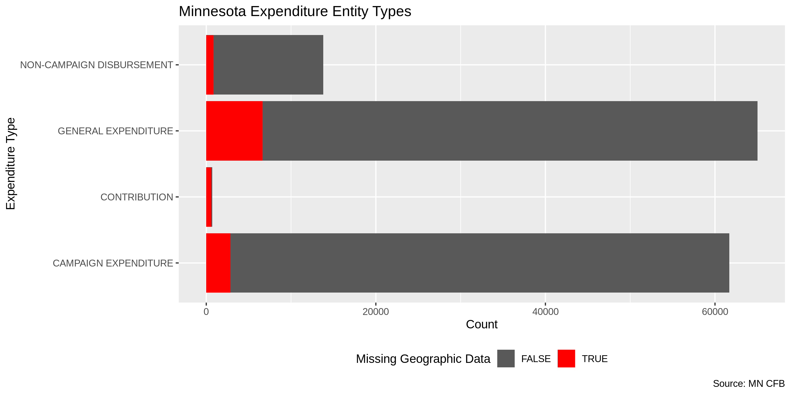<!-- -->

### Duplicates

``` r
mn <- flag_dupes(mn)
sum(mn$dupe_flag)
#> [1] 5880
percent(mean(mn$dupe_flag))
#> [1] "4.15%"
```

### Categorical

``` r
glimpse_fun(mn, n_distinct)
```

    #> # A tibble: 23 x 4
    #>    var                        type      n         p
    #>    <chr>                      <chr> <int>     <dbl>
    #>  1 committee_reg_num          chr    1692 0.0119   
    #>  2 committee_name             chr    1682 0.0119   
    #>  3 entity_type                chr       3 0.0000211
    #>  4 entity_sub_type            chr      12 0.0000846
    #>  5 vendor_name                chr   21712 0.153    
    #>  6 vendor_name_master_name_id chr   22976 0.162    
    #>  7 vendor_address_1           chr   20679 0.146    
    #>  8 vendor_address_2           chr    1459 0.0103   
    #>  9 vendor_city                chr    2557 0.0180   
    #> 10 vendor_state               chr      63 0.000444 
    #> 11 vendor_zip                 chr    3161 0.0223   
    #> 12 amount                     dbl   43165 0.304    
    #> 13 unpaid_amount              dbl     660 0.00465  
    #> 14 date                       date   1960 0.0138   
    #> 15 purpose                    chr   43291 0.305    
    #> 16 year                       int      10 0.0000705
    #> 17 type                       chr       6 0.0000423
    #> 18 in_kind_descr              chr    2982 0.0210   
    #> 19 in_kind                    lgl       2 0.0000141
    #> 20 affected_committee_name    chr     365 0.00257  
    #> 21 affected_committee_reg_num chr     368 0.00259  
    #> 22 na_flag                    lgl       2 0.0000141
    #> 23 dupe_flag                  lgl       2 0.0000141

For categorical data, we can explore the distribution of values using
`ggplot::geom_col()`.

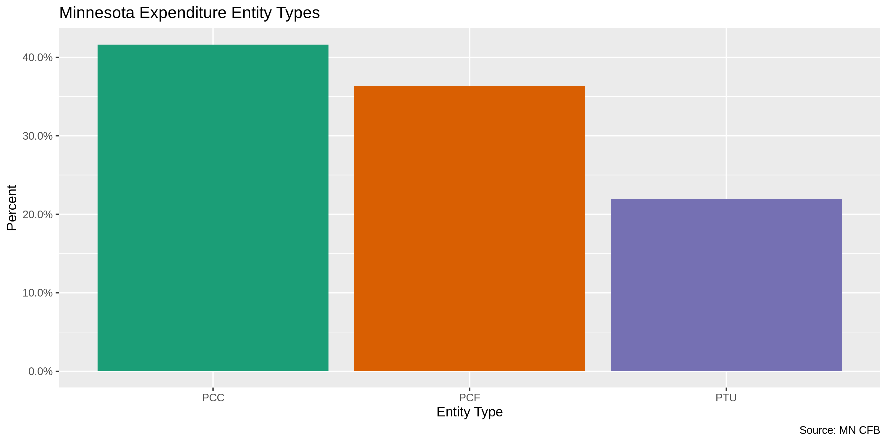<!-- -->

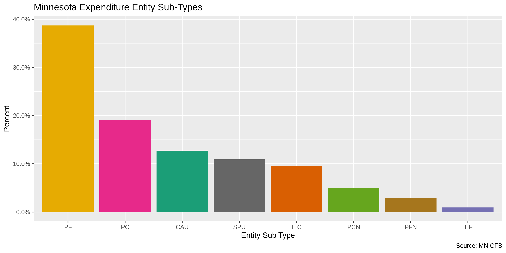<!-- -->

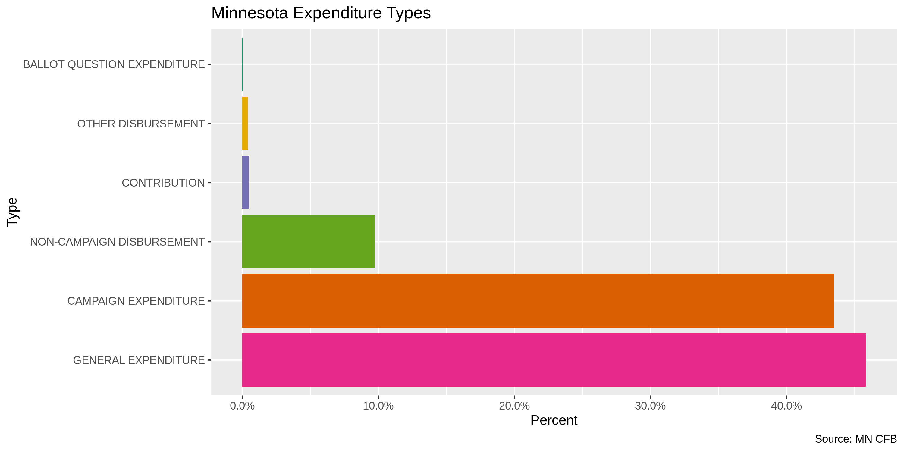<!-- -->

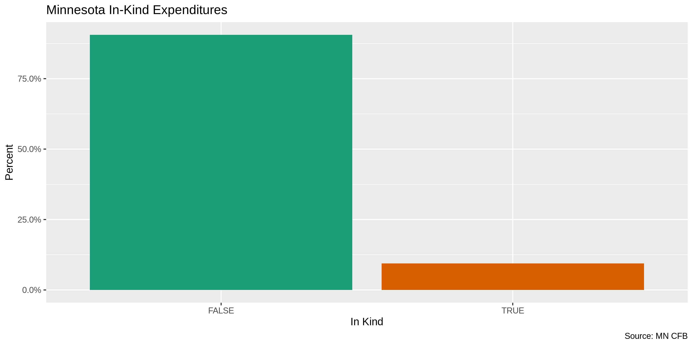<!-- -->

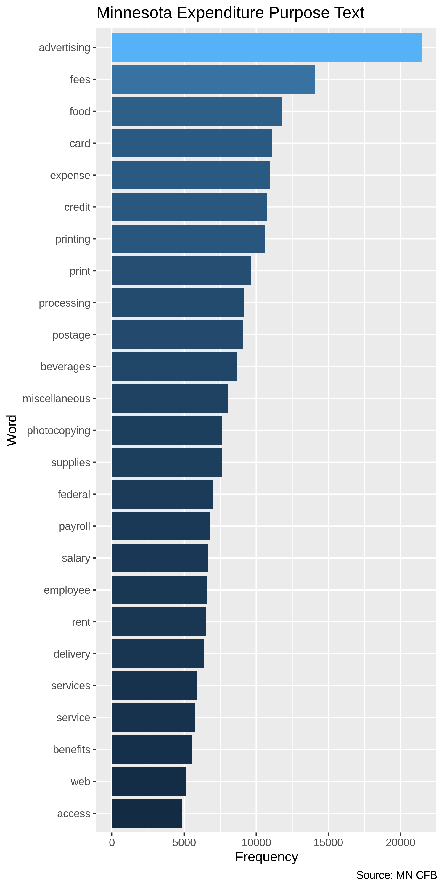<!-- -->

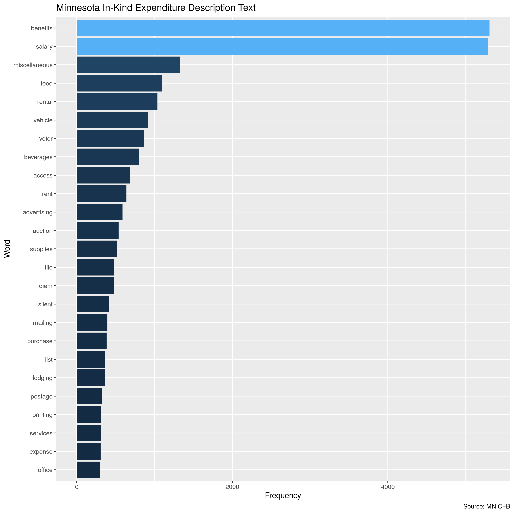<!-- -->

### Continuous

For continuous variables, we should explore the ranges and distribution
of values.

#### Amounts

``` r
summary(mn$amount)
#>      Min.   1st Qu.    Median      Mean   3rd Qu.      Max. 
#>    -962.1      55.0     236.3    1255.5     719.7 3000000.0
sum(mn$amount <= 0)
#> [1] 41
```

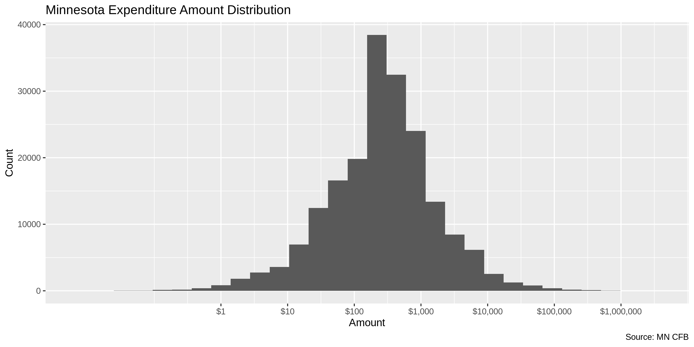<!-- -->

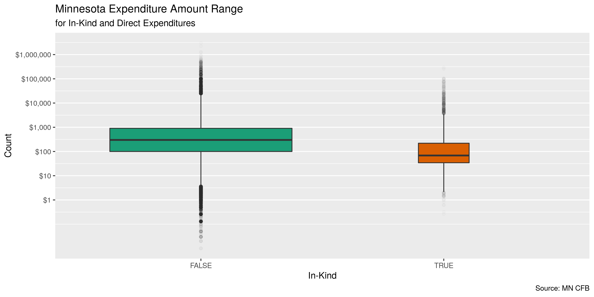<!-- -->

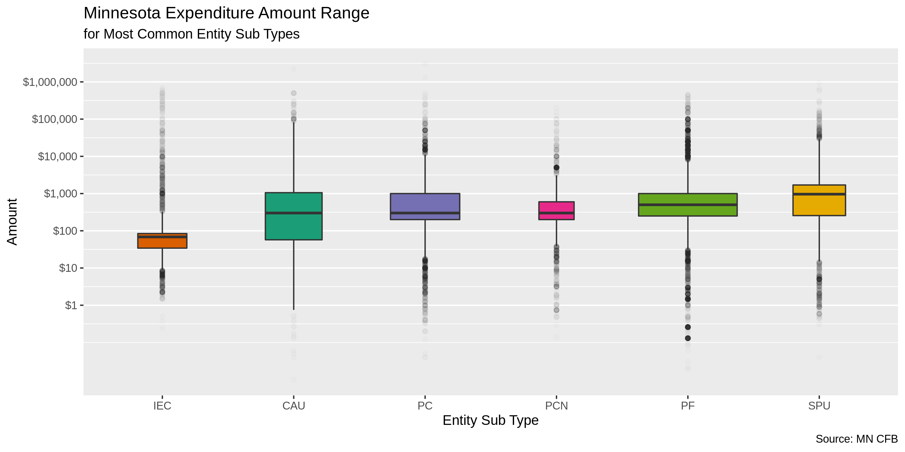<!-- -->

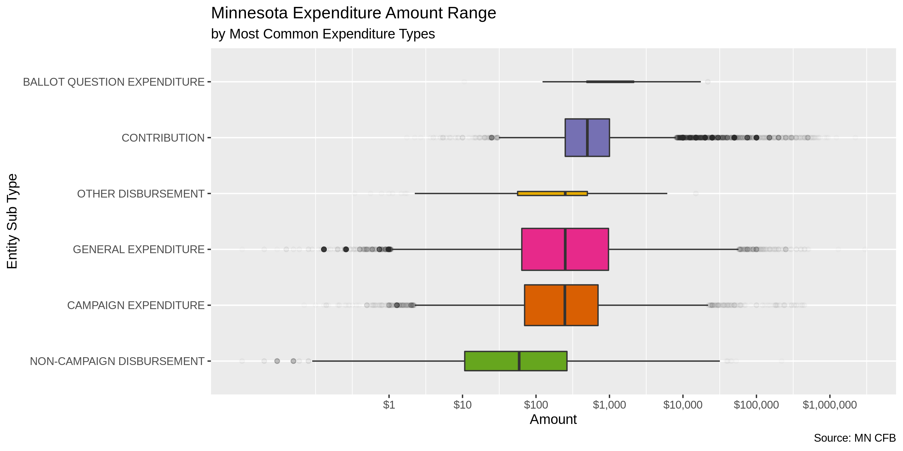<!-- -->

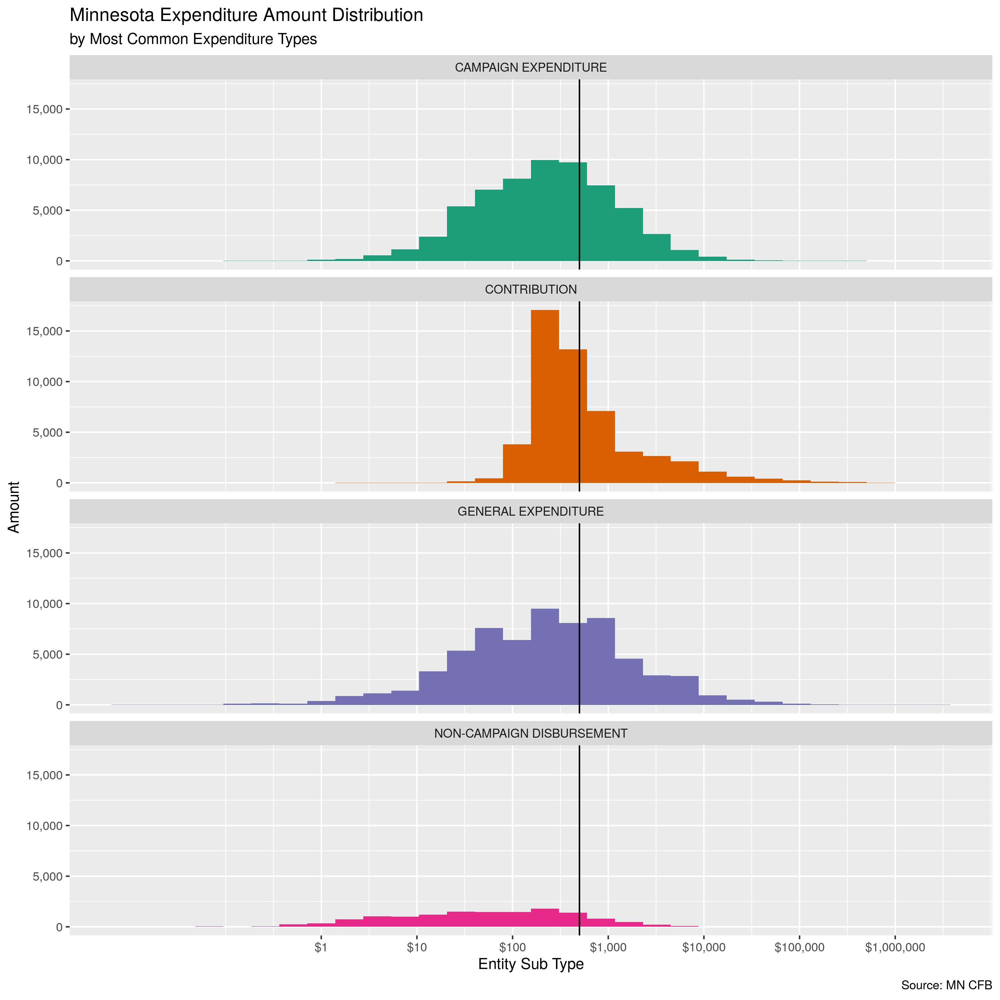<!-- -->

#### Dates

The range of `date` is very good, there are 0 dates beyond `today()`.

``` r
min(mn$date)
```

    #> [1] "2010-03-06"

``` r
max(mn$date)
```

    #> [1] "2019-04-03"

``` r
sum(mn$date > today())
```

    #> [1] 0

We do not need to create a 4-digit year variable, as one already exists.

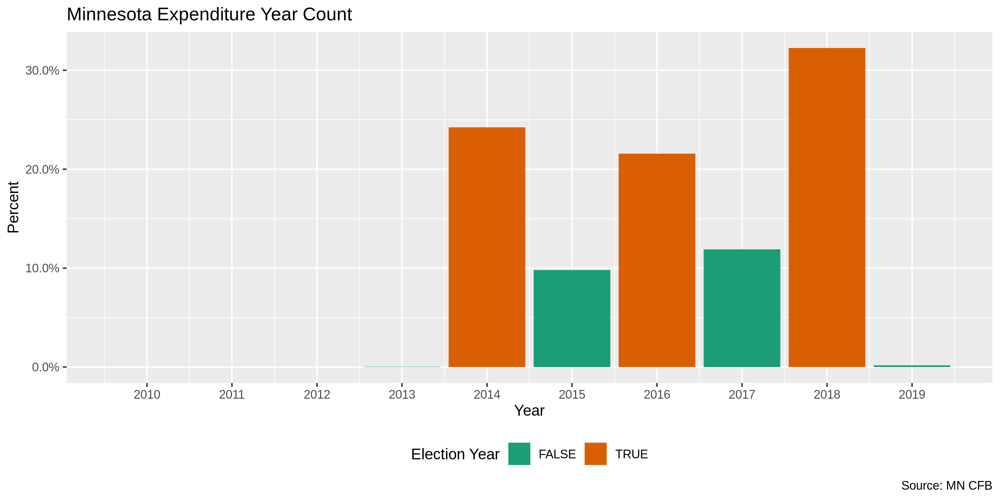<!-- -->

<!-- -->

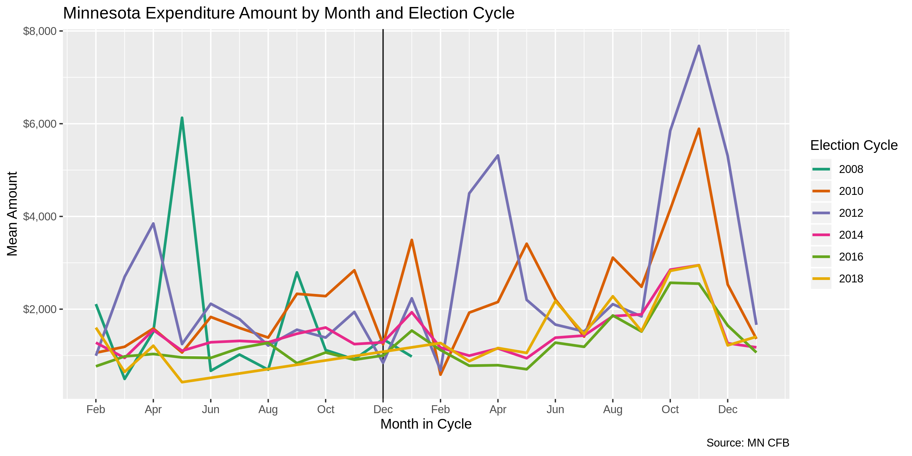<!-- -->

## Wrangle

### Address

``` r
mn <- mn %>% 
  unite(
    col = vendor_address_full,
    starts_with("vendor_address"),
    sep = " ",
    remove = FALSE,
    na.rm = TRUE
  ) %>% 
  mutate(
    address_norm = normal_address(
      address = vendor_address_full,
      add_abbs = usps,
      na_rep = TRUE
    )
  )
```

    #> # A tibble: 10,457 x 3
    #>    vendor_address_1          vendor_address_2         address_norm                                 
    #>    <chr>                     <chr>                    <chr>                                        
    #>  1 4750 E. 53RD ST.          SUITE 206                4750 E 53RD STREET SUITE 206                 
    #>  2 1678 CHARLES AVE          #2                       1678 CHARLES AVENUE 2                        
    #>  3 706 N. 1ST. STREET        110                      706 N 1ST STREET 110                         
    #>  4 BULK RATE CENTER          3145 LEXINGTON AVE S     BULK RATE CENTER 3145 LEXINGTON AVENUE S     
    #>  5 1400 RAND TOWER           527 MARQUETTE AVE. SO.   1400 RAND TOWER 527 MARQUETTE AVENUE SO      
    #>  6 70 BLANCHARD RD           3RD FLOOR                70 BLANCHARD ROAD 3RD FLOOR                  
    #>  7 310 SECOND STREET         PO BOX 208               310 SECOND STREET PO BOX 208                 
    #>  8 MINNETONKA COMMUNITY CEN… 14600 MINNETONKA BOULEV… MINNETONKA COMMUNITY CENTER 14600 MINNETONKA…
    #>  9 PO BOX 709                608 MAIN ST              PO BOX 709 608 MAIN STREET                   
    #> 10 8500 GOVERNORS HILL DRIVE 38 FOUNTAIN SQUARE PLAZA 8500 GOVERNORS HILL DRIVE 38 FOUNTAIN SQUARE…
    #> # … with 10,447 more rows

### ZIP

We do not need to do much zip to normalize the zip code.

``` r
n_distinct(mn$vendor_zip)
#> [1] 3161
prop_in(mn$vendor_zip, geo$zip, na.rm = TRUE)
#> [1] 0.9978518
length(setdiff(mn$vendor_zip, geo$zip))
#> [1] 67
setdiff(mn$vendor_zip, geo$zip)
#>  [1] "47646" "02182" "55023" "99999" "56810" "55461" "00000" "55900" "55649" "26248" "76224"
#> [12] "29043" "55147" "55141" "65131" "52082" "01142" "11038" "55209" "55132" "55035" "55937"
#> [23] "55891" "55739" "55242" "56404" "99162" "55729" "55610" "56092" "56305" "55097" "64162"
#> [34] "56203" "55186" "55499" "11014" "55531" "55400" "20917" "55278" "56268" "55100" "56607"
#> [45] "56530" "55464" "56204" "53869" "55948" "55822" "55198" "55913" "56107" "13884" "55048"
#> [56] "91154" "20000" "55477" "48546" "47105" "53302" "55727" "55269" "55221" "94113" "32045"
#> [67] "55821"
```

``` r
mn <- mutate(mn, zip_norm = vendor_zip %>% na_if("99999") %>% na_if("00000"))
```

### State

``` r
n_distinct(mn$vendor_state)
#> [1] 63
prop_in(mn$vendor_state, geo$state, na.rm = TRUE)
#> [1] 0.9997937
length(setdiff(mn$vendor_state, geo$state))
#> [1] 6
setdiff(mn$vendor_state, geo$state)
#> [1] NA   "M"  "FO" "GR" "MM" "LW"
```

``` r
mn <- mn %>% 
  mutate(
    state_norm = normal_state(
      state = vendor_state %>% 
        str_replace("M", "MN") %>% 
        str_replace("MM", "MN"),
      abbreviate = TRUE,
      na_rep = TRUE,
      valid = geo$state
    )
  )
```

``` r
n_distinct(mn$state_norm)
#> [1] 48
prop_in(mn$state_norm, geo$state, na.rm = TRUE)
#> [1] 1
length(setdiff(mn$state_norm, geo$state))
#> [1] 1
```

### City

``` r
n_distinct(mn$vendor_city)
#> [1] 2557
prop_in(mn$vendor_city, geo$city, na.rm = TRUE)
#> [1] 0.7936514
length(setdiff(mn$vendor_city, geo$city))
#> [1] 835
```

#### Normalize

``` r
mn <- mn %>% 
  mutate(
    city_norm = normal_city(
      city = vendor_city, 
      geo_abbs = usps_city,
      st_abbs = c("MN", "DC", "MINNESOTA"),
      na = na_city,
      na_rep = TRUE
    )
  )
```

``` r
n_distinct(mn$city_norm)
#> [1] 2220
prop_in(mn$city_norm, geo$city, na.rm = TRUE)
#> [1] 0.9252311
length(setdiff(mn$city_norm, geo$city))
#> [1] 465
```

#### Swap

``` r
mn <- mn %>% 
  left_join(
    y = geo,
    by = c(
      "state_norm" = "state",
      "zip_norm" = "zip"
    )
  ) %>% 
  rename(city_match = city) %>% 
  mutate(
    match_dist = stringdist(vendor_city, city_norm),
    city_swap = if_else(
      condition = equals(match_dist, 1),
      true = city_match,
      false = city_norm
    )
  )
```

``` r
summary(mn$match_dist)
#>    Min. 1st Qu.  Median    Mean 3rd Qu.    Max.    NA's 
#>   0.000   0.000   0.000   0.468   0.000  15.000   10977
mean(mn$match_dist == 0, na.rm = TRUE)
#> [1] 0.852089
n_distinct(mn$city_swap)
#> [1] 2187
prop_in(mn$city_swap, geo$city, na.rm = TRUE)
#> [1] 0.9276358
length(setdiff(mn$city_swap, geo$city))
#> [1] 436
```

There are still cities which are registered as invalid.

    #> # A tibble: 663 x 4
    #>    state_norm vendor_city      city_swap            n
    #>    <chr>      <chr>            <chr>            <int>
    #>  1 <NA>       <NA>             <NA>             10946
    #>  2 <NA>       MAPLE GROVE      MAPLE GROVE        847
    #>  3 <NA>       BROOKLYN PARK    BROOKLYN PARK      768
    #>  4 <NA>       SHOREVIEW        SHOREVIEW          637
    #>  5 <NA>       MENDOTA HEIGHTS  MENDOTA HEIGHTS    604
    #>  6 <NA>       WHITE BEAR LAKE  WHITE BEAR LAKE    459
    #>  7 <NA>       ST LOUIS PARK    SAINT LOUIS PARK   444
    #>  8 <NA>       SAINT LOUIS PARK SAINT LOUIS PARK   382
    #>  9 <NA>       NORTH ST. PAUL   NORTH SAINT PAUL   263
    #> 10 <NA>       ST. LOUIS PARK   SAINT LOUIS PARK   231
    #> # … with 653 more rows

#### Refine

## Conclude

1.  There are 141880 records in the database.
2.  There are 5880 duplicate records in the database.
3.  The range and distribution of `amount` and `date` seem reasonable.
4.  There are 10 records missing a `vendor_name` variable.
5.  Consistency in goegraphic data has been improved with
    `campfin::normal_*()`.
6.  The database already contained a 5-digit `vendor_zip` and 4-digit
    `year` variable.

## Export

``` r
proc_dir <- here("mn", "expends", "data", "processed")
dir_create(proc_dir)
```

``` r
date()
#> [1] "Tue Aug  6 17:25:12 2019"
mn %>% 
  select(
    everything()
  ) %>% 
  write_csv(
    na = "",
    path = glue("{proc_dir}/mn_expends_processed.csv")
  )
```
