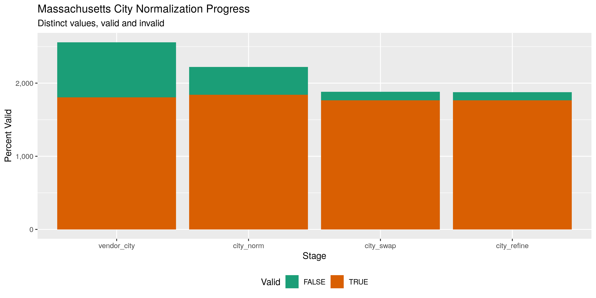

State Data
================
First Last
2019-11-14 13:17:40

## Project

The Accountability Project is an effort to cut across data silos and
give journalists, policy professionals, activists, and the public at
large a simple way to search across huge volumes of public data about
people and organizations.

Our goal is to standardizing public data on a few key fields by thinking
of each dataset row as a transaction. For each transaction there should
be (at least) 3 variables:

1.  All **parties** to a transaction
2.  The **date** of the transaction
3.  The **amount** of money involved

## Objectives

This document describes the process used to complete the following
objectives:

1.  How many records are in the database?
2.  Check for duplicates
3.  Check ranges
4.  Is there anything blank or missing?
5.  Check for consistency issues
6.  Create a five-digit ZIP Code called `ZIP5`
7.  Create a `YEAR` field from the transaction date
8.  Make sure there is data on both parties to a transaction

## Packages

The following packages are needed to collect, manipulate, visualize,
analyze, and communicate these results. The `pacman` package will
facilitate their installation and attachment.

The IRW’s `campfin` package will also have to be installed from GitHub.
This package contains functions custom made to help facilitate the
processing of campaign finance data.

``` r
if (!require("pacman")) install.packages("pacman")
pacman::p_load_gh("irworkshop/campfin")
pacman::p_load(
  tidyverse, # data manipulation
  lubridate, # datetime strings
  magrittr, # pipe opperators
  tidytext, # text analysis
  janitor, # dataframe clean
  batman, # parse logical
  refinr, # cluster and merge
  scales, # format strings
  rvest, # read html files
  knitr, # knit documents
  vroom, # read files fast
  glue, # combine strings
  here, # relative storage
  fs # search storage 
)
```

This document should be run as part of the `R_campfin` project, which
lives as a sub-directory of the more general, language-agnostic
[`irworkshop/accountability_datacleaning`](https://github.com/irworkshop/accountability_datacleaning "TAP repo")
GitHub repository.

The `R_campfin` project uses the [RStudio
projects](https://support.rstudio.com/hc/en-us/articles/200526207-Using-Projects "Rproj")
feature and should be run as such. The project also uses the dynamic
`here::here()` tool for file paths relative to *your* machine.

``` r
# where does this document knit?
here::here()
#> [1] "/home/kiernan/R/accountability_datacleaning/R_campfin"
```

## Data

Data is obtained from the [Minnestoa Campaign Finance Board
(CFB)](https://cfb.mn.gov/ "cfb_home").

The [CFB’s
mission](https://cfb.mn.gov/citizen-resources/the-board/more-about-the-board/mission/ "cfb_mission")
is to regulating [campaign
finance](https://cfb.mn.gov/citizen-resources/board-programs/overview/campaign-finance/ "cfb_cf"),
among other things.

> The Campaign Finance and Public Disclosure Board was established by
> the state legislature in 1974 and is charged with the administration
> of Minnesota Statutes, Chapter 10A, the Campaign Finance and Public
> Disclosure Act, as well as portions of Chapter 211B, the Fair Campaign
> Practices act.

> The Board’s mission is to promote public confidence in state
> government decision-making through development, administration, and
> enforcement of disclosure and public financing programs which will
> ensure public access to and understanding of information filed with
> the Board.

> The Board is responsible for administration of statutes governing the
> financial operations of associations that seek to influence Minnesota
> state elections. The Board’s jurisdiction is established by Minnesota
> Statutes Chapter 10A. The Board does not have jurisdiction over
> federal elections, which are regulated by the Federal Election
> Commission, nor does the Board have jurisdiction over local elections.

We can go to the Minnesota Statutes, Chapter 10A, to see the exact scope
of the data collection we will be wrangling.

> [Subd. 9. Campaign
> expenditure](https://www.revisor.mn.gov/statutes/cite/10A.01#stat.10A.01.9 "mn_10a.1.9").
> “Campaign expenditure” or “expenditure” means a purchase or payment of
> money or anything of value, or an advance of credit, made or incurred
> for the purpose of influencing the nomination or election of a
> candidate or for the purpose of promoting or defeating a ballot
> question. An expenditure is considered to be made in the year in which
> the candidate made the purchase of goods or services or incurred an
> obligation to pay for goods or services. An expenditure made for the
> purpose of defeating a candidate is considered made for the purpose of
> influencing the nomination or election of that candidate or any
> opponent of that candidate… “Expenditure” does not include:  
> (1) noncampaign disbursements as defined in subdivision 26;  
> (2) services provided without compensation by an individual
> volunteering personal time on behalf of a candidate, ballot question,
> political committee, political fund, principal campaign committee, or
> party unit;  
> (3) the publishing or broadcasting of news items or editorial comments
> by the news media; or  
> (4) an individual’s unreimbursed personal use of an automobile owned
> by the individual and used by the individual while volunteering
> personal time.

On the CFB [Self-Help Data Download
page](https://cfb.mn.gov/reports-and-data/self-help/data-downloads/campaign-finance/ "cf_dl"),
there are three types of files listed:

1.  Contributions received
2.  Expenditures and contributions made
3.  Independent expenditures

For each type of file, there is a table listing the 8 types of files
that can be downloaded. Here is the table for Expenditures and
contributions
made:

| Download Name                                | Data Included                                                                                                                          | Download Data                                                                                                   |
| :------------------------------------------- | :------------------------------------------------------------------------------------------------------------------------------------- | :-------------------------------------------------------------------------------------------------------------- |
| All                                          | Expenditures, including contributions made, by all entities - 2009 to present                                                          | [Download](https://cfb.mn.gov/reports-and-data/self-help/data-downloads/campaign-finance/?download=-1890073264) |
| Candidates                                   | Expenditures, including contributions made, by all candidates - 2009 to present                                                        | [Download](https://cfb.mn.gov/reports-and-data/self-help/data-downloads/campaign-finance/?download=-1315784544) |
| Party units                                  | Expenditures, including contributions made, by all party units - 2009 to present                                                       | [Download](https://cfb.mn.gov/reports-and-data/self-help/data-downloads/campaign-finance/?download=452957533)   |
| State party units                            | Expenditures, including contributions made, by state party units - 2009 to present                                                     | [Download](https://cfb.mn.gov/reports-and-data/self-help/data-downloads/campaign-finance/?download=-897202306)  |
| Party unit caucus committees                 | Expenditures, including contributions made, by state party caucus committees only - 2009 to present                                    | [Download](https://cfb.mn.gov/reports-and-data/self-help/data-downloads/campaign-finance/?download=941425475)   |
| Local party units                            | Expenditures, including contributions made, by local party units only - 2009 to present (excludes state parties and caucus committees) | [Download](https://cfb.mn.gov/reports-and-data/self-help/data-downloads/campaign-finance/?download=935202885)   |
| Committees and funds                         | Expenditures, including contributions made, by all committees and funds - 2009 to present (excludes candidates and party units)        | [Download](https://cfb.mn.gov/reports-and-data/self-help/data-downloads/campaign-finance/?download=1606012724)  |
| Independent expenditure committees and funds | Expenditures by independent expenditure committees and funds units only - 2009 to present                                              | [Download](https://cfb.mn.gov/reports-and-data/self-help/data-downloads/campaign-finance/?download=1002650125)  |

## Import

We will be processing the “All” file under “Expenditures and
contributions made.”

### Download

We can download a copy of the file in question to the `/raw` directory.

``` r
raw_dir  <- here("mn", "expends", "data", "raw")
exp_file <- glue("{raw_dir}/all_expenditures_contributions_made.csv")
dir_create(raw_dir)

if (!all_files_new(raw_dir)) {
  download.file(
    url = download_urls[1],
    destfile = exp_file
  )
}
```

### Read

``` r
mn <- 
  vroom(
    file = exp_file,
    .name_repair = make_clean_names,
    col_types = cols(
      .default = col_character(),
      Amount = col_double(),
      `Unpaid amount` = col_double(),
      Date = col_date("%m/%d/%Y"),
      Year = col_integer()
    )
  )
mn <- mutate(mn, in_kind = to_logical(in_kind))
mn <- mutate_if(mn, is_character, toupper)
```

## Explore

The database has 194302 records of 21 variables. The file appears to
have been properly read into R as a data frame.

``` r
head(mn)
```

    #> # A tibble: 6 x 21
    #>   committee_reg_n… committee_name entity_type entity_sub_type vendor_name vendor_name_mas…
    #>   <chr>            <chr>          <chr>       <chr>           <chr>       <chr>           
    #> 1 10054            KAHN, PHYLLIS… PCC         <NA>            CLARK, KAR… 34              
    #> 2 10054            KAHN, PHYLLIS… PCC         <NA>            CLARK, KAR… 34              
    #> 3 10054            KAHN, PHYLLIS… PCC         <NA>            CLARK, KAR… 34              
    #> 4 10054            KAHN, PHYLLIS… PCC         <NA>            MN DEPARTM… 105323          
    #> 5 10054            KAHN, PHYLLIS… PCC         <NA>            CLARK, KAR… 34              
    #> 6 10054            KAHN, PHYLLIS… PCC         <NA>            MOLZAHN, M… 72047           
    #> # … with 15 more variables: vendor_address_1 <chr>, vendor_address_2 <chr>, vendor_city <chr>,
    #> #   vendor_state <chr>, vendor_zip <chr>, amount <dbl>, unpaid_amount <dbl>, date <date>,
    #> #   purpose <chr>, year <int>, type <chr>, in_kind_descr <chr>, in_kind <lgl>,
    #> #   affected_committee_name <chr>, affected_committee_reg_num <chr>

``` r
tail(mn)
```

    #> # A tibble: 6 x 21
    #>   committee_reg_n… committee_name entity_type entity_sub_type vendor_name vendor_name_mas…
    #>   <chr>            <chr>          <chr>       <chr>           <chr>       <chr>           
    #> 1 80032            MN ALLIANCE F… PCF         PFN             ABELER, JI… 4678            
    #> 2 80032            MN ALLIANCE F… PCF         PFN             FRANSON, M… 1923            
    #> 3 80032            MN ALLIANCE F… PCF         PFN             SCHOMACKER… 82409           
    #> 4 80032            MN ALLIANCE F… PCF         PFN             ALBRIGHT T… 89317           
    #> 5 80032            MN ALLIANCE F… PCF         PFN             FRANSON, M… 1923            
    #> 6 80032            MN ALLIANCE F… PCF         PFN             BENSON, MI… 1996            
    #> # … with 15 more variables: vendor_address_1 <chr>, vendor_address_2 <chr>, vendor_city <chr>,
    #> #   vendor_state <chr>, vendor_zip <chr>, amount <dbl>, unpaid_amount <dbl>, date <date>,
    #> #   purpose <chr>, year <int>, type <chr>, in_kind_descr <chr>, in_kind <lgl>,
    #> #   affected_committee_name <chr>, affected_committee_reg_num <chr>

``` r
glimpse(sample_frac(mn))
```

    #> Observations: 194,302
    #> Variables: 21
    #> $ committee_reg_num          <chr> "17813", "17361", "20006", "20219", "30608", "17776", "20013"…
    #> $ committee_name             <chr> "FREMLING, WADE K HOUSE COMMITTEE", "RADINOVICH, JOSEPH (JOE)…
    #> $ entity_type                <chr> "PCC", "PCC", "PTU", "PTU", "PCF", "PCC", "PTU", "PCC", "PCF"…
    #> $ entity_sub_type            <chr> NA, NA, "CAU", NA, "PF", NA, "CAU", NA, "PF", "SPU", "PC", NA…
    #> $ vendor_name                <chr> "SCREEN GRAPHICS", "RADINOVICH, JOE", "UNITED STATES POSTAL S…
    #> $ vendor_name_master_name_id <chr> "75567", "6491", "129044", "30376", "97062", "76083", "88105"…
    #> $ vendor_address_1           <chr> "1327 BANKS AVE", "PO BOX 235", "RIVERVIEW STATION", "11432 1…
    #> $ vendor_address_2           <chr> NA, NA, NA, NA, NA, NA, NA, NA, NA, NA, NA, NA, NA, NA, NA, N…
    #> $ vendor_city                <chr> "SUPERIOR", "CROSBY", "SAINT PAUL", "LITTLE FALLS", NA, "APPL…
    #> $ vendor_state               <chr> "WI", "MN", "MN", "MN", NA, "MN", "MO", "MN", NA, "MN", NA, "…
    #> $ vendor_zip                 <chr> "54880", "56441", "55107", "56345", NA, "55124", "63179", "56…
    #> $ amount                     <dbl> 239.49, 1774.93, 392.00, 280.83, 250.00, 105.00, 108.98, 1974…
    #> $ unpaid_amount              <dbl> 0, 0, 0, 0, 0, 0, 0, 0, 0, 0, 0, 0, 0, 0, 0, 0, 0, 0, 0, 0, 0…
    #> $ date                       <date> 2014-07-20, 2014-11-21, 2018-01-05, 2015-06-17, 2011-06-07, …
    #> $ purpose                    <chr> "ADVERTISING - PRINT: TSHIRTS", "AUTOMOBILE EXPENSE: CONSTITU…
    #> $ year                       <int> 2014, 2014, 2018, 2015, 2011, 2014, 2017, 2016, 2017, 2018, 2…
    #> $ type                       <chr> "CAMPAIGN EXPENDITURE", "NON-CAMPAIGN DISBURSEMENT", "GENERAL…
    #> $ in_kind_descr              <chr> NA, NA, NA, NA, NA, NA, NA, NA, NA, NA, NA, NA, NA, NA, NA, "…
    #> $ in_kind                    <lgl> FALSE, FALSE, FALSE, FALSE, FALSE, FALSE, FALSE, FALSE, FALSE…
    #> $ affected_committee_name    <chr> NA, NA, NA, NA, "DFL HOUSE CAUCUS", NA, NA, NA, "HRCC", NA, "…
    #> $ affected_committee_reg_num <chr> NA, NA, NA, NA, "20006", NA, NA, NA, "20010", NA, "20347", NA…

### Missing

First, we need to ensure that each record contains a value for both
parties to the expenditure (`committee_name` makes the expenditure to
`vendor_name`), as well as a `date` and `amount`.

``` r
glimpse_fun(mn, count_na)
```

    #> # A tibble: 21 x 4
    #>    col                        type        n         p
    #>    <chr>                      <chr>   <dbl>     <dbl>
    #>  1 committee_reg_num          <chr>       0 0        
    #>  2 committee_name             <chr>       0 0        
    #>  3 entity_type                <chr>       0 0        
    #>  4 entity_sub_type            <chr>  101699 0.523    
    #>  5 vendor_name                <chr>      10 0.0000515
    #>  6 vendor_name_master_name_id <chr>      10 0.0000515
    #>  7 vendor_address_1           <chr>   63735 0.328    
    #>  8 vendor_address_2           <chr>  183604 0.945    
    #>  9 vendor_city                <chr>   63140 0.325    
    #> 10 vendor_state               <chr>   63118 0.325    
    #> 11 vendor_zip                 <chr>   64630 0.333    
    #> 12 amount                     <dbl>       0 0        
    #> 13 unpaid_amount              <dbl>       0 0        
    #> 14 date                       <date>      0 0        
    #> 15 purpose                    <chr>   52412 0.270    
    #> 16 year                       <int>       0 0        
    #> 17 type                       <chr>       0 0        
    #> 18 in_kind_descr              <chr>  180903 0.931    
    #> 19 in_kind                    <lgl>       0 0        
    #> 20 affected_committee_name    <chr>  141680 0.729    
    #> 21 affected_committee_reg_num <chr>  141677 0.729

There are 10 records missing a `vendor_name` value thay will be flagged.

``` r
mn <- mn %>% flag_na(vendor_name, committee_name, date, amount)
sum(mn$na_flag)
#> [1] 10
```

It’s important to note that 32.5% of values are missing a
`vendor_state`, `vendor_state`, and `vendor_zip` value. From the bar
chart below, we can see that 99.9% of expenditures with a `type` value
of “CONTRIBUTION.” are missing the geographic vendor data like
`vendor_city`. However, only 27.1% of expenditures have `type`
“CONTRIBUTION.”

<!-- -->

### Duplicates

``` r
mn <- flag_dupes(mn, everything())
sum(mn$dupe_flag)
#> [1] 6118
percent(mean(mn$dupe_flag))
#> [1] "3.15%"
```

### Categorical

``` r
glimpse_fun(mn, n_distinct)
```

    #> # A tibble: 23 x 4
    #>    col                        type       n         p
    #>    <chr>                      <chr>  <dbl>     <dbl>
    #>  1 committee_reg_num          <chr>   2374 0.0122   
    #>  2 committee_name             <chr>   2326 0.0120   
    #>  3 entity_type                <chr>      3 0.0000154
    #>  4 entity_sub_type            <chr>     13 0.0000669
    #>  5 vendor_name                <chr>  24399 0.126    
    #>  6 vendor_name_master_name_id <chr>  25677 0.132    
    #>  7 vendor_address_1           <chr>  20772 0.107    
    #>  8 vendor_address_2           <chr>   1459 0.00751  
    #>  9 vendor_city                <chr>   2559 0.0132   
    #> 10 vendor_state               <chr>     63 0.000324 
    #> 11 vendor_zip                 <chr>   3170 0.0163   
    #> 12 amount                     <dbl>  44903 0.231    
    #> 13 unpaid_amount              <dbl>    676 0.00348  
    #> 14 date                       <date>  3465 0.0178   
    #> 15 purpose                    <chr>  43313 0.223    
    #> 16 year                       <int>     11 0.0000566
    #> 17 type                       <chr>      6 0.0000309
    #> 18 in_kind_descr              <chr>   2986 0.0154   
    #> 19 in_kind                    <lgl>      2 0.0000103
    #> 20 affected_committee_name    <chr>   1743 0.00897  
    #> 21 affected_committee_reg_num <chr>   1778 0.00915  
    #> 22 na_flag                    <lgl>      2 0.0000103
    #> 23 dupe_flag                  <lgl>      2 0.0000103

For categorical data, we can explore the distribution of values using
`ggplot::geom_col()`.

<!-- -->

<!-- -->

<!-- -->

<!-- -->

<!-- -->

<!-- -->

### Continuous

For continuous variables, we should explore the ranges and distribution
of values.

#### Amounts

``` r
summary(mn$amount)
#>      Min.   1st Qu.    Median      Mean   3rd Qu.      Max. 
#>    -962.1      88.6     276.6    1849.8     800.4 3000000.0
sum(mn$amount <= 0)
#> [1] 428
```

<!-- -->

<!-- -->

<!-- -->

<!-- -->

<!-- -->

#### Dates

The range of `date` is very good, there are 0 dates beyond `today()`.

``` r
min(mn$date)
```

    #> [1] "2009-01-01"

``` r
max(mn$date)
```

    #> [1] "2019-04-03"

``` r
sum(mn$date > today())
```

    #> [1] 0

We do not need to create a 4-digit year variable, as one already exists.

<!-- -->

<!-- -->

<!-- -->

## Wrangle

### Address

To improve searcability of payees, we will unite the `vendor_address_1`
and `vendor_address_2`. Then we can normalize the combined address with
`campfin::normal_address()`.

``` r
mn <- mn %>% 
  unite(
    col = vendor_address_full,
    starts_with("vendor_address"),
    sep = " ",
    remove = FALSE,
    na.rm = TRUE
  ) %>% 
  mutate(
    address_norm = normal_address(
      address = vendor_address_full,
      add_abbs = usps_street,
      na_rep = TRUE
    )
  )
```

Here, we see the type of changes that are made.

    #> # A tibble: 10,454 x 3
    #>    vendor_address_1        vendor_address_2 address_norm                          
    #>    <chr>                   <chr>            <chr>                                 
    #>  1 1405 LILAC DRIVE N      #121             1405 LILAC DRIVE NORTH 121            
    #>  2 1355 MARKET STREET      SUITE 900        1355 MARKET STREET SUITE 900          
    #>  3 151 SAINT ANDREWS COURT SUITE 710        151 SAINT ANDREWS COURT SUITE 710     
    #>  4 12375 OAK PARK BLVD     APT. 316         12375 OAK PARK BOULEVARD APARTMENT 316
    #>  5 4004 GRAND AVE          APT 302          4004 GRAND AVENUE APARTMENT 302       
    #>  6 1410 ENERGY PARK        SUITE 9          1410 ENERGY PARK SUITE 9              
    #>  7 3535 GRAND AVE S        APT 2017         3535 GRAND AVENUE SOUTH APARTMENT 2017
    #>  8 3001 BROADWAY NE        ROOM B100        3001 BROADWAY NORTHEAST ROOM B100     
    #>  9 1101 EAST 78TH STREET   SUITE 200        1101 EAST 78TH STREET SUITE 200       
    #> 10 JEFF JANECHEK           963 MOONLIGHT DR JEFF JANECHEK 963 MOONLIGHT DRIVE     
    #> # … with 10,444 more rows

### ZIP

We do not need to do much zip to normalize the `vendor_zip`.

``` r
mn <- mutate(mn, zip_norm = normal_zip(vendor_zip, na_rep = TRUE))
```

``` r
progress_table(
  mn$vendor_zip,
  mn$zip_norm,
  compare = valid_zip
)
```

    #> # A tibble: 2 x 6
    #>   stage      prop_in n_distinct prop_na n_out n_diff
    #>   <chr>        <dbl>      <dbl>   <dbl> <dbl>  <dbl>
    #> 1 vendor_zip   0.998       3170   0.333   279     68
    #> 2 zip_norm     0.998       3165   0.333   237     66

### State

The `vendor_state` value is also very clean.

``` r
mn <- mn %>% 
  mutate(
    state_norm = vendor_state %>% 
      str_replace("^M$", "MN") %>% 
      str_replace("^MM$", "MN") %>% 
      str_replace("^FO$", "FL") %>% 
      normal_state() %>% 
      na_if("GR") %>% 
      na_if("LW")
  )
```

``` r
progress_table(
  mn$vendor_state,
  mn$state_norm,
  compare = valid_abb
)
```

    #> # A tibble: 2 x 6
    #>   stage        prop_in n_distinct prop_na n_out n_diff
    #>   <chr>          <dbl>      <dbl>   <dbl> <dbl>  <dbl>
    #> 1 vendor_state   1.000         63   0.325    65     10
    #> 2 state_norm     1.000         58   0.325    38      5

### City

To clean the `vendor_city`, we will use a three step process that makes
only simple normalization and confident automatic changes.

1.  Normalize with `campfin::normal_city()` (capitalization,
    punctuation, abbreviations)
2.  Swap cities with their expected value (for that state and ZIP) if
    the strings are very similar

#### Normalize

``` r
mn <- mn %>% 
  mutate(
    city_norm = normal_city(
      city = vendor_city, 
      geo_abbs = usps_city,
      st_abbs = c("MN", "DC", "MINNESOTA"),
      na = invalid_city,
      na_rep = TRUE
    )
  )
```

#### Swap

``` r
mn <- mn %>% 
  left_join(
    y = zipcodes,
    by = c(
      "state_norm" = "state",
      "zip_norm" = "zip"
    )
  ) %>% 
  rename(city_match = city) %>% 
  mutate(
    match_abb = is_abbrev(city_norm, city_match),
    match_dist = str_dist(city_norm, city_match),
    city_swap = if_else(
      condition = match_dist == 1 | match_abb,
      true = city_match,
      false = city_norm
    )
  )
```

There are still cities which are registered as invalid.

    #> # A tibble: 620 x 4
    #>    state_norm vendor_city      city_swap            n
    #>    <chr>      <chr>            <chr>            <int>
    #>  1 <NA>       <NA>             <NA>             63059
    #>  2 MN         MAPLE GROVE      MAPLE GROVE        848
    #>  3 MN         BROOKLYN PARK    BROOKLYN PARK      766
    #>  4 MN         SHOREVIEW        SHOREVIEW          641
    #>  5 MN         MENDOTA HEIGHTS  MENDOTA HEIGHTS    604
    #>  6 MN         WHITE BEAR LAKE  WHITE BEAR LAKE    457
    #>  7 MN         ST LOUIS PARK    SAINT LOUIS PARK   443
    #>  8 MN         SAINT LOUIS PARK SAINT LOUIS PARK   382
    #>  9 MN         NORTH ST. PAUL   NORTH SAINT PAUL   263
    #> 10 MN         ST. LOUIS PARK   SAINT LOUIS PARK   231
    #> # … with 610 more rows

#### Refine

``` r
good_refine <- mn %>% 
  filter(state_norm == "MN") %>% 
  mutate(
    city_refine = city_swap %>% 
      key_collision_merge() %>% 
      n_gram_merge(numgram = 1)
  ) %>% 
  filter(city_swap != city_refine) %>% 
  inner_join(
    y = zipcodes,
    by = c(
      "city_refine" = "city",
      "state_norm" = "state",
      "zip_norm" = "zip"
    )
  )
```

Obviously, this wasn’t worth the effort, but I’ve already done it.

    #> # A tibble: 4 x 4
    #>   state_norm city_swap    city_refine     n
    #>   <chr>      <chr>        <chr>       <int>
    #> 1 MN         STAIN PAUL   SAINT PAUL      5
    #> 2 MN         NO MANKATO   MANKATO         4
    #> 3 MN         FARMINGINTON FARMINGTON      3
    #> 4 MN         SAINT COULD  SAINT CLOUD     1

Then we can join theses good refines back to the original database and
combine them with the unchanged `city_swap`.

``` r
mn <- mn %>% 
  left_join(good_refine) %>% 
  mutate(city_refine = coalesce(city_refine, city_swap))
```

## Check

We can use the `check_city()` function to pass the remaining unknown
`city_refine` values (and their `state_norm`) to the Google Geocode API.
The function returns the name of the city or locality which most
associated with those values.

This is an easy way to both check for typos and check whether an unknown
`city_refine` value is actually a completely acceptable neighborhood,
census designated place, or some other locality not found in our
`valid_city` vector from our `zipcodes` database.

First, we’ll filter out any known valid city and aggregate the remaining
records by their city and state. Then, we will only query those unknown
cities which appear at least ten times.

``` r
mn_out <- mn %>% 
  filter(city_refine %out% valid_city) %>% 
  count(city_refine, state_norm, sort = TRUE) %>% 
  drop_na() %>% 
  filter(n > 10)
```

Passing these values to `check_city()` with `purrr::pmap_dfr()` will
return a single tibble of the rows returned by each city/state
combination.

First, we’ll check to see if the API query has already been done and a
file exist on disk. If such a file exists, we can read it using
`readr::read_csv()`. If not, the query will be sent and the file will be
written using `readr::write_csv()`.

``` r
check_file <- here("mn", "expends", "data", "api_check.csv")
if (file_exists(check_file)) {
  check <- read_csv(
    file = check_file
  )
} else {
  check <- pmap_dfr(
    .l = list(
      mn_out$city_refine, 
      mn_out$state_norm
    ), 
    .f = check_city, 
    key = Sys.getenv("GEOCODE_KEY"), 
    guess = TRUE
  ) %>% 
    mutate(guess = coalesce(guess_city, guess_place)) %>% 
    select(-guess_city, -guess_place)
  write_csv(
    x = check,
    path = check_file
  )
}
```

Any city/state combination with a `check_city_flag` equal to `TRUE`
returned a matching city string from the API, indicating this
combination is valid enough to be ignored.

``` r
valid_locality <- check$guess[check$check_city_flag]
```

Then we can perform some simple comparisons between the queried city and
the returned city. If they are extremelly similar, we can accept those
returned locality strings and add them to our list of accepted
additional localities.

``` r
valid_locality <- check %>% 
  filter(!check_city_flag) %>% 
  mutate(
    abb = is_abbrev(original_city, guess),
    dist = str_dist(original_city, guess)
  ) %>%
  filter(abb | dist <= 3) %>% 
  pull(guess) %>% 
  c(valid_locality)
```

This list of acceptable localities can be added with our `valid_city`
and `extra_city` vectors from the `campfin` package. The cities checked
will eventually be added to `extra_city`.

``` r
many_city <- c(valid_city, extra_city, valid_locality)
```

``` r
percent(prop_in(mn$city_refine, valid_city))
```

    #> [1] "93.7%"

``` r
percent(prop_in(mn$city_refine, many_city))
```

    #> [1] "99.5%"

| stage        | prop\_in | n\_distinct | prop\_na | n\_out | n\_diff |
| :----------- | -------: | ----------: | -------: | -----: | ------: |
| vendor\_city |    0.840 |        2559 |    0.325 |  20929 |     754 |
| city\_norm   |    0.983 |        2222 |    0.325 |   2245 |     380 |
| city\_swap   |    0.995 |        1881 |    0.336 |    631 |     116 |
| city\_refine |    0.995 |        1877 |    0.336 |    618 |     112 |

You can see how the percentage of valid values increased with each
stage.

<!-- -->

More importantly, the number of distinct values decreased each stage. We
were able to confidently change many distinct invalid values to their
valid equivilent.

``` r
progress %>% 
  select(
    stage, 
    all = n_distinct,
    bad = n_diff
  ) %>% 
  mutate(good = all - bad) %>% 
  pivot_longer(c("good", "bad")) %>% 
  mutate(name = name == "good") %>% 
  ggplot(aes(x = stage, y = value)) +
  geom_col(aes(fill = name)) +
  scale_fill_brewer(palette = "Dark2") +
  scale_y_continuous(labels = comma) +
  theme(legend.position = "bottom") +
  labs(
    title = "Massachusetts City Normalization Progress",
    subtitle = "Distinct values, valid and invalid",
    x = "Stage",
    y = "Percent Valid",
    fill = "Valid"
  )
```

<!-- -->

## Conclude

1.  There are 194302 records in the database.
2.  There are 6118 duplicate records in the database.
3.  The range and distribution of `amount` and `date` seem reasonable.
4.  There are 10 records missing a `vendor_name` variable.
5.  Consistency in goegraphic data has been improved with
    `campfin::normal_*()`.
6.  The database already contained a 5-digit `vendor_zip` and 4-digit
    `year` variable.

## Export

``` r
proc_dir <- here("mn", "expends", "data", "processed")
dir_create(proc_dir)
```

``` r
date()
#> [1] "Thu Nov 14 13:18:35 2019"
mn %>% 
  select(
    -city_norm,
    -city_match,
    -match_dist,
    -city_swap,
    -city_refine
  ) %>% 
  write_csv(
    na = "",
    path = glue("{proc_dir}/mn_expends_processed.csv")
  )
```
