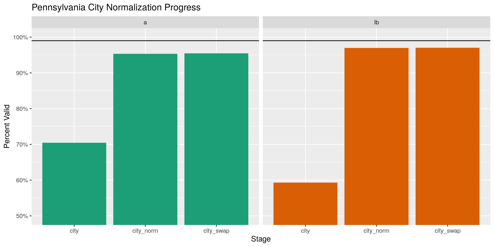
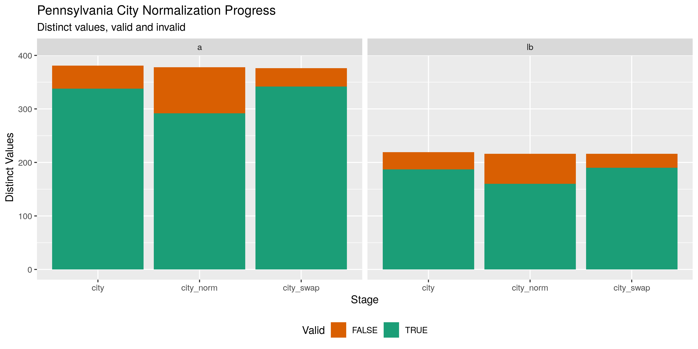
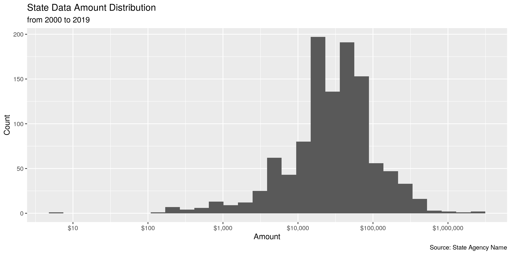

Minnesota Lobbyists
================
Kiernan Nicholls
2020-01-21 16:16:18

  - [Project](#project)
  - [Objectives](#objectives)
  - [Packages](#packages)
  - [Registration](#registration)
      - [Data](#data)
      - [Import](#import)
      - [Explore](#explore)
      - [Wrangle](#wrangle)
      - [Export](#export)
  - [Expenditures](#expenditures)

<!-- Place comments regarding knitting here -->

## Project

The Accountability Project is an effort to cut across data silos and
give journalists, policy professionals, activists, and the public at
large a simple way to search across huge volumes of public data about
people and organizations.

Our goal is to standardizing public data on a few key fields by thinking
of each dataset row as a transaction. For each transaction there should
be (at least) 3 variables:

1.  All **parties** to a transaction
2.  The **date** of the transaction
3.  The **amount** of money involved

## Objectives

This document describes the process used to complete the following
objectives:

1.  How many records are in the database?
2.  Check for duplicates
3.  Check ranges
4.  Is there anything blank or missing?
5.  Check for consistency issues
6.  Create a five-digit state Code called `ZIP5`
7.  Create a `YEAR` field from the transaction date
8.  Make sure there is data on both parties to a transaction

## Packages

The following packages are needed to collect, manipulate, visualize,
analyze, and communicate these results. The `pacman` package will
facilitate their installation and attachment.

The IRW’s `campfin` package will also have to be installed from GitHub.
This package contains functions custom made to help facilitate the
processing of campaign finance data.

``` r
if (!require("pacman")) install.packages("pacman")
pacman::p_load_gh("irworkshop/campfin")
pacman::p_load(
  tidyverse, # data manipulation
  lubridate, # datetime strings
  magrittr, # pipe opperators
  janitor, # dataframe clean
  refinr, # cluster and merge
  scales, # format strings
  knitr, # knit documents
  vroom, # read files fast
  glue, # combine strings
  here, # relative storage
  fs # search storage 
)
```

This document should be run as part of the `R_campfin` project, which
lives as a sub-directory of the more general, language-agnostic
[`irworkshop/accountability_datacleaning`](https://github.com/irworkshop/accountability_datacleaning "TAP repo")
GitHub repository.

The `R_campfin` project uses the [RStudio
projects](https://support.rstudio.com/hc/en-us/articles/200526207-Using-Projects "Rproj")
feature and should be run as such. The project also uses the dynamic
`here::here()` tool for file paths relative to *your* machine.

``` r
# where does this document knit?
here::here()
#> [1] "/home/kiernan/R/accountability_datacleaning/R_campfin"
```

# Registration

## Data

Data is obtained from the [Campaign Finance Public Disclosure Board
(CFPB)](https://cfb.mn.gov/)

> The Board’s four major programs are campaign finance registration and
> disclosure, public subsidy administration, **lobbyist registration and
> disclosure**, and economic interest disclosure by public officials.
> The Board has six members, appointed by the Governor on a bi-partisan
> basis for staggered four-year terms. The appointments must be
> confirmed by a three-fifths vote of the members of each house of the
> legislature.

The CFPB provides an index of lobbyists in alphabetical order as well as
a similar list for associations who have hired lobbyists. Each letter of
the alphabet has a corresponding page listing all the registered
lobbyists (or associations) that start with that letter. Each name is
linked to their own page, on which the address is listed alongside a
table of represented associations (or lobbyists).

I have written a separate script that goes through the complicated
process of scraping each individual lobbyist page, connecting that
lobbyist to all their represented associations, and combining these
relationships into a single data frame. We can run that script now if
needed.

``` r
raw_dir <- dir_create(here("mn", "lobby", "data", "raw"))
scrape_file <- dir_ls(raw_dir, glob = "*lob_scrape.csv$")
scrape_script <- here("mn", "lobby", "code", "scrape_mn_lobby.R")
if (!file_exists(path = scrape_file)) {
  source(file = scrape_script, local = TRUE)
}
```

## Import

``` r
mnlr <- read_csv(
  file = scrape_file,
  col_types = cols(
    .default = col_character(),
    start = col_date(),
    end = col_date(),
    designated = col_logical()
  )
)
```

## Explore

``` r
head(mnlr)
#> # A tibble: 6 x 21
#>   lb_id lb_name lb_tel lb_email lb_company lb_street lb_city lb_state lb_zip a_name a_id 
#>   <chr> <chr>   <chr>  <chr>    <chr>      <chr>     <chr>   <chr>    <chr>  <chr>  <chr>
#> 1 1733  Aafedt… (612)… daafedt… Winthrop … 225 S 6t… Minnea… MN       55402… Baxte… 4547 
#> 2 1733  Aafedt… (612)… daafedt… Winthrop … 225 S 6t… Minnea… MN       55402… Cente… 518  
#> 3 1733  Aafedt… (612)… daafedt… Winthrop … 225 S 6t… Minnea… MN       55402… Colon… 6801 
#> 4 1733  Aafedt… (612)… daafedt… Winthrop … 225 S 6t… Minnea… MN       55402… Emily… 6622 
#> 5 1733  Aafedt… (612)… daafedt… Winthrop … 225 S 6t… Minnea… MN       55402… Intl … 6532 
#> 6 1733  Aafedt… (612)… daafedt… Winthrop … 225 S 6t… Minnea… MN       55402… Merid… 6721 
#> # … with 10 more variables: start <date>, end <date>, type <chr>, designated <lgl>,
#> #   a_website <chr>, a_contact <chr>, a_street <chr>, a_city <chr>, a_state <chr>, a_zip <chr>
tail(mnlr)
#> # A tibble: 6 x 21
#>   lb_id lb_name lb_tel lb_email lb_company lb_street lb_city lb_state lb_zip a_name a_id 
#>   <chr> <chr>   <chr>  <chr>    <chr>      <chr>     <chr>   <chr>    <chr>  <chr>  <chr>
#> 1 3711  Zlajic… (312)… Susan.z… <NA>       1 S Dear… Chicago IL       60603  Arcel… 6235 
#> 2 3510  Zoelln… (651)… azoelln… Planned P… 671 Vand… St Paul MN       55114  Plann… 5869 
#> 3 3039  Zomer,… (612)… patrick… Moss & Ba… 150 S 5t… Minnea… MN       55402  Otter… 685  
#> 4 3039  Zomer,… (612)… patrick… Moss & Ba… 150 S 5t… Minnea… MN       55402  Xcel … 660  
#> 5 3534  Zweber… (651)… Roxanne… Assn of M… 145 Univ… St Paul MN       55103  Assn … 59   
#> 6 2238  Zylla,… (612)… ezylla@… LPaC Alli… 33 S 6th… Minnea… MN       55402  MN Sa… 5981 
#> # … with 10 more variables: start <date>, end <date>, type <chr>, designated <lgl>,
#> #   a_website <chr>, a_contact <chr>, a_street <chr>, a_city <chr>, a_state <chr>, a_zip <chr>
glimpse(sample_frac(mnlr))
#> Observations: 5,464
#> Variables: 21
#> $ lb_id      <chr> "9032", "9483", "8993", "1204", "8692", "1436", "141", "3520", "9078", "7668"…
#> $ lb_name    <chr> "Dooley Jr, William L Jr", "Munyon, Sherry", "Thrane, Peter H", "Frenette, Li…
#> $ lb_tel     <chr> "(612)961-3144", "(612)723-4245", "(612)335-1779", "(651)785-5202", "(651)223…
#> $ lb_email   <chr> "bdooley09@gmail.com", "smunyon@capitolaccess.us", "peter.thrane@stinson.com"…
#> $ lb_company <chr> NA, "Capitol Access", "Stinson Leonard Street LLP", NA, NA, "Management Guida…
#> $ lb_street  <chr> "5653 James Ave S", "2680 2nd St N", "150 S 5th St Ste 2300", "1734 Blair Ave…
#> $ lb_city    <chr> "Minneapolis", "North St Paul", "Minneapolis", "St Paul", "St Paul", "Mendota…
#> $ lb_state   <chr> "MN", "MN", "MN", "MN", "MN", "MN", "MN", "ND", "MN", "MN", "MN", "MN", "MN",…
#> $ lb_zip     <chr> "55419", "55109", "55402", "55104-1702", "55102", "55120", "55413", "58103", …
#> $ a_name     <chr> "Transit for Livable Communities", "Suburban Transit Assn", "AXA Equitable Li…
#> $ a_id       <chr> "5045", "4321", "6893", "6907", "410", "2430", "309", "7140", "3187", "875", …
#> $ start      <date> 2017-02-10, 2009-09-30, 2014-11-20, 2017-03-01, 2009-04-01, 2004-11-29, 1997…
#> $ end        <date> 2017-04-30, NA, 2015-12-31, NA, 2016-12-31, NA, NA, NA, NA, NA, NA, NA, NA, …
#> $ type       <chr> "Leg/Adm/Metro", "Leg/Adm/Metro", NA, "Leg", NA, "Leg/Adm/Metro", "Leg/Adm", …
#> $ designated <lgl> NA, NA, NA, NA, NA, NA, NA, TRUE, TRUE, NA, NA, TRUE, TRUE, NA, TRUE, TRUE, T…
#> $ a_website  <chr> "www.tlcminnesota.org", "www.mvta.com/Suburban_Transit_Association.html", "ht…
#> $ a_contact  <chr> "Jessica Treat, Director", "Jeff Wosje, Chairman", "Robert Negron, Lead Direc…
#> $ a_street   <chr> "2356 University Ave W Ste 403", "525 Park St Ste 130", "1290 Avenue of the A…
#> $ a_city     <chr> "St Paul", "St Paul", "New York", "Inver Grove Heights", "Minneapolis", "Mend…
#> $ a_state    <chr> "MN", "MN", "NY", "MN", "MN", "MN", "MN", "ND", "MN", "MN", "VA", "MN", "MN",…
#> $ a_zip      <chr> "55114", "55103-2044", "10104", "55077-1733", "55414-1053", "55120", "55474",…
```

Very few records are missing the kind of values needed to identify the
lobbyist relationships.

``` r
col_stats(mnlr, count_na)
#> # A tibble: 21 x 4
#>    col        class      n        p
#>    <chr>      <chr>  <int>    <dbl>
#>  1 lb_id      <chr>      0 0       
#>  2 lb_name    <chr>      0 0       
#>  3 lb_tel     <chr>      4 0.000732
#>  4 lb_email   <chr>      1 0.000183
#>  5 lb_company <chr>   1328 0.243   
#>  6 lb_street  <chr>      0 0       
#>  7 lb_city    <chr>      0 0       
#>  8 lb_state   <chr>      1 0.000183
#>  9 lb_zip     <chr>      2 0.000366
#> 10 a_name     <chr>      0 0       
#> 11 a_id       <chr>      0 0       
#> 12 start      <date>     0 0       
#> 13 end        <date>  3736 0.684   
#> 14 type       <chr>   1555 0.285   
#> 15 designated <lgl>   4076 0.746   
#> 16 a_website  <chr>     28 0.00512 
#> 17 a_contact  <chr>     34 0.00622 
#> 18 a_street   <chr>     34 0.00622 
#> 19 a_city     <chr>     34 0.00622 
#> 20 a_state    <chr>     34 0.00622 
#> 21 a_zip      <chr>     34 0.00622
```

## Wrangle

To improve the consistency and searchability of the database, we can
perform some simple and confident text normalization.

### Phone

``` r
mnlr <- mutate(
  .data = mnlr,
  lb_tel_norm = normal_phone(lb_tel)
)
```

    #> # A tibble: 1,509 x 2
    #>    lb_tel        lb_tel_norm   
    #>    <chr>         <chr>         
    #>  1 (612)242-7848 (612) 242-7848
    #>  2 (651)224-5445 (651) 224-5445
    #>  3 (202)830-2038 (202) 830-2038
    #>  4 (612)676-3393 (612) 676-3393
    #>  5 (651)215-4000 (651) 215-4000
    #>  6 (952)229-7779 (952) 229-7779
    #>  7 (952)405-2017 (952) 405-2017
    #>  8 (507)451-1136 (507) 451-1136
    #>  9 (612)335-1577 (612) 335-1577
    #> 10 (651)493-5780 (651) 493-5780
    #> # … with 1,499 more rows

### Address

``` r
mnlr <- mutate_at(
  .tbl = mnlr,
  .vars = vars(ends_with("street")),
  .funs = list(norm = normal_address),
  abbs = usps_street
)
```

    #> # A tibble: 3,354 x 4
    #>    lb_street            a_street                     lb_street_norm       a_street_norm            
    #>    <chr>                <chr>                        <chr>                <chr>                    
    #>  1 100 Empire Dr Ste 2… 100 Empire Dr Ste 202        100 EMPIRE DR STE 2… 100 EMPIRE DR STE 202    
    #>  2 750 Otto Ave #2549   17025 Hwy 12 NE              750 OTTO AVE 2549    17025 HWY 12 NE          
    #>  3 525 Park St Ste 210  901 Marquette Ave 7th Flr    525 PARK ST STE 210  901 MARQUETTE AVE 7TH FLR
    #>  4 4525 Douglas Ave     2355 Hwy 36 West Ste 400     4525 DOUGLAS AVE     2355 HWY 36 W STE 400    
    #>  5 90 S 7th St #2200 W… 4248 Park Glen Rd            90 S 7TH ST 2200 WFC 4248 PARK GLN RD         
    #>  6 701 City Center Dr   720 City Center Dr           701 CITY CTR DR      720 CITY CTR DR          
    #>  7 168 6th St E Unit 3… 4111 E 37th St N             168 6TH ST E UNIT 3… 4111 E 37TH ST N         
    #>  8 6965 Oakbrook St SE  10710 Midlothian Turnpike S… 6965 OAKBROOK ST SE  10710 MIDLOTHIAN TPKE ST…
    #>  9 17444 Park Ave SE    8170 33rd Ave S MS 21106R    17444 PARK AVE SE    8170 33RD AVE S MS 21106R
    #> 10 114 Mackubin St Ste… 2400 W 64th St               114 MACKUBIN ST STE… 2400 W 64TH ST           
    #> # … with 3,344 more rows

### ZIP

``` r
mnlr <- mutate_at(
  .tbl = mnlr,
  .vars = vars(ends_with("zip")),
  .funs = list(norm = normal_zip),
  na_rep = TRUE
)
```

    #> # A tibble: 2,634 x 4
    #>    lb_zip a_zip      lb_zip_norm a_zip_norm
    #>    <chr>  <chr>      <chr>       <chr>     
    #>  1 55402  55403      55402       55403     
    #>  2 55074  56007      55074       56007     
    #>  3 55710  55734      55710       55734     
    #>  4 55402  55487-0235 55402       55487     
    #>  5 55407  55407-2102 55407       55407     
    #>  6 55103  53593      55103       53593     
    #>  7 15317  15317      15317       15317     
    #>  8 55125  60053      55125       60053     
    #>  9 55125  55103      55125       55103     
    #> 10 55441  55415-1829 55441       55415     
    #> # … with 2,624 more rows

    #> # A tibble: 4 x 6
    #>   stage       prop_in n_distinct  prop_na n_out n_diff
    #>   <chr>         <dbl>      <dbl>    <dbl> <dbl>  <dbl>
    #> 1 lb_zip        0.886        405 0.000366   622    102
    #> 2 lb_zip_norm   0.999        320 0.000366     3      4
    #> 3 a_zip         0.823        711 0.00622    962    201
    #> 4 a_zip_norm    0.997        558 0.00622     19      5

### State

``` r
prop_in(mnlr$lb_state, valid_state)
#> [1] 0.999817
mnlr$lb_state <- na_out(mnlr$lb_state, valid_state)
prop_in(mnlr$a_state, valid_state)
#> [1] 1
```

### City

``` r
mnlr <- mutate_at(
  .tbl = mnlr,
  .vars = vars(ends_with("city")),
  .funs = list(norm = normal_city),
  abbs = usps_city,
  state = c("MN", "DC", "MINNESOTA"),
  na = invalid_city,
  na_rep = TRUE
)
```

``` r
mnlr <- mnlr %>%
  left_join(
    y = zipcodes,
    by = c(
      "lb_state" = "state",
      "lb_zip_norm" = "zip"
    )
  ) %>% 
  rename(lb_city_match = city) %>% 
  mutate(
    lb_match_abb = is_abbrev(lb_city_norm, lb_city_match),
    lb_match_dist = str_dist(lb_city_norm, lb_city_match),
    lb_city_swap = if_else(
      condition = lb_match_abb | lb_match_dist == 1,
      true = lb_city_match,
      false = lb_city_norm
    )
  ) %>% 
  select(
    -lb_match_abb,
    -lb_match_dist,
    -lb_city_match
  )

# repeat for associations
mnlr <- mnlr %>% 
  left_join(
    y = zipcodes,
    by = c(
      "a_state" = "state",
      "a_zip_norm" = "zip"
    )
  ) %>% 
  rename(a_city_match = city) %>% 
  mutate(
    a_match_abb = is_abbrev(a_city_norm, a_city_match),
    a_match_dist = str_dist(a_city_norm, a_city_match),
    a_city_swap = if_else(
      condition = a_match_abb | a_match_dist == 1,
      true = a_city_match,
      false = a_city_norm
    )
  ) %>% 
  select(
    -a_match_abb,
    -a_match_dist,
    -a_city_match
  )
```

``` r
progress <- 
  progress_table(
    str_to_upper(mnlr$lb_city),
    mnlr$lb_city_norm,
    mnlr$lb_city_swap,
    str_to_upper(mnlr$a_city),
    mnlr$a_city_norm,
    mnlr$a_city_swap,
    compare = valid_city
  ) %>%
  separate(
    col = stage, 
    into = c("type", "stage"), 
    sep = "_", 
    extra = "merge"
  ) %>% 
  mutate(stage = str_remove(as_factor(stage), "\\)$")) %>% 
  group_by(stage) 
```

``` r
kable(progress, digits = 3)
```

| type | stage      | prop\_in | n\_distinct | prop\_na | n\_out | n\_diff |
| :--: | :--------- | -------: | ----------: | -------: | -----: | ------: |
|  lb  | city       |    0.593 |         219 |    0.000 |   2223 |      32 |
|  lb  | city\_norm |    0.575 |         216 |    0.000 |   2321 |      56 |
|  lb  | city\_swap |    0.963 |         216 |    0.001 |    203 |      26 |
|  a   | city       |    0.704 |         381 |    0.006 |   1605 |      43 |
|  a   | city\_norm |    0.652 |         378 |    0.006 |   1887 |      86 |
|  a   | city\_swap |    0.943 |         376 |    0.011 |    306 |      34 |

<!-- -->

<!-- -->

## Export

``` r
proc_dir <- dir_create(here("mn", "lobby", "data", "processed"))
write_csv(
  x = mnlr,
  path = glue("{proc_dir}/mn_lobbyists.csv"),
  na = ""
)
```

# Expenditures

We can also obtain a report of lobbying expenditures made by the
principal associations.

``` r
exp_url <- "https://cfb.mn.gov/reports-and-data/self-help/data-downloads/lobbying/?download=102614850"
mnle <- read_csv(
  file = exp_url,
  col_types = cols(
    Principal = col_character(),
    `Entity ID` = col_character(),
    `Report Year` = col_double(),
    `General lobbying amount` = col_double(),
    `PUC lobbying amount` = col_double(),
    `Total spent` = col_double()
  )
)

mnle <- mnle %>% 
  rename(
    a_name  = `Principal`,
    a_id  = `Entity ID`,
    year  = `Report Year`,
    gen_amount  = `General lobbying amount`,
    lob_amount  = `PUC lobbying amount`,
    total_amount  = `Total spent`
  )
```

``` r
mnle %>% 
  filter(total_amount > 1) %>% 
  ggplot(aes(x = total_amount)) +
  geom_histogram() +
  scale_x_continuous(
    breaks = c(1 %o% 10^(0:6)),
    labels = dollar,
    trans = "log10"
  ) +
  labs(
    title = "State Data Amount Distribution",
    subtitle = "from 2000 to 2019",
    caption = "Source: State Agency Name",
    x = "Amount",
    y = "Count"
  )
```

<!-- -->

Since this database will be uploaded separately from the lobbyist
registration containing the phone number and addresses of principal
clients, we will have to add these columns so that the expenditure
records will show up when this information is searched.

``` r
a_info <- mnlr %>% 
  select(starts_with("a_")) %>% 
  select(a_id, a_website, a_contact, a_street_norm, a_city_norm, a_state, a_zip_norm)
mnle <- left_join(mnle, a_info, by = "a_id")
```

``` r
col_stats(mnle, count_na)
#> # A tibble: 12 x 4
#>    col           class     n        p
#>    <chr>         <chr> <int>    <dbl>
#>  1 a_name        <chr>     0 0       
#>  2 a_id          <chr>     0 0       
#>  3 year          <dbl>     0 0       
#>  4 gen_amount    <dbl>    12 0.00254 
#>  5 lob_amount    <dbl>    12 0.00254 
#>  6 total_amount  <dbl>    12 0.00254 
#>  7 a_website     <chr>     4 0.000847
#>  8 a_contact     <chr>    20 0.00424 
#>  9 a_street_norm <chr>    20 0.00424 
#> 10 a_city_norm   <chr>    20 0.00424 
#> 11 a_state       <chr>    20 0.00424 
#> 12 a_zip_norm    <chr>    20 0.00424
```

``` r
write_csv(
  x = mnle,
  path = glue("{proc_dir}/mn_lobby_expend.csv"),
  na = ""
)
```
