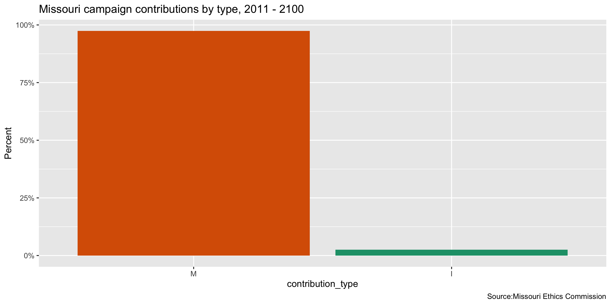
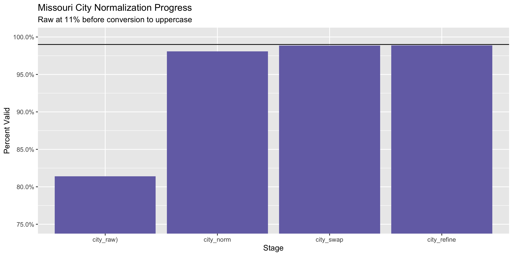

Missouri Contributions Data Diary
================
Yanqi Xu
2020-11-20 21:24:27

  - [Project](#project)
  - [Objectives](#objectives)
  - [Packages](#packages)
  - [Data](#data)
  - [Download](#download)
  - [Read](#read)
  - [Explore](#explore)
      - [Missing](#missing)
      - [Duplicates](#duplicates)
      - [Dates](#dates)
      - [Categorical](#categorical)
      - [Amounts](#amounts)
  - [Wrangle](#wrangle)
      - [Address](#address)
      - [ZIP](#zip)
      - [State](#state)
      - [City](#city)
  - [Conclude](#conclude)
  - [Export](#export)
  - [Upload](#upload)

<!-- Place comments regarding knitting here -->

## Project

The Accountability Project is an effort to cut across data silos and
give journalists, policy professionals, activists, and the public at
large a simple way to search across huge volumes of public data about
people and organizations.

Our goal is to standardizing public data on a few key fields by thinking
of each dataset row as a transaction. For each transaction there should
be (at least) 3 variables:

1.  All **parties** to a transaction.
2.  The **date** of the transaction.
3.  The **amount** of money involved.

## Objectives

This document describes the process used to complete the following
objectives:

1.  How many records are in the database?
2.  Check for entirely duplicated records.
3.  Check ranges of continuous variables.
4.  Is there anything blank or missing?
5.  Check for consistency issues.
6.  Create a five-digit ZIP Code called `zip`.
7.  Create a `year` field from the transaction date.
8.  Make sure there is data on both parties to a transaction.

## Packages

The following packages are needed to collect, manipulate, visualize,
analyze, and communicate these results. The `pacman` package will
facilitate their installation and attachment.

The IRW’s `campfin` package will also have to be installed from GitHub.
This package contains functions custom made to help facilitate the
processing of campaign finance data.

``` r
if (!require("pacman")) install.packages("pacman")
pacman::p_load_gh("irworkshop/campfin")
pacman::p_load(
  tidyverse, # data manipulation
  lubridate, # datetime strings
  gluedown, # printing markdown
  magrittr, # pipe operators
  janitor, # clean data frames
  aws.s3, # upload to aws s3
  refinr, # cluster and merge
  scales, # format strings
  knitr, # knit documents
  vroom, # read files fast
  rvest, # html scraping
  glue, # combine strings
  here, # relative paths
  httr, # http requests
  fs # local storage 
)
```

This document should be run as part of the `R_campfin` project, which
lives as a sub-directory of the more general, language-agnostic
[`irworkshop/accountability_datacleaning`](https://github.com/irworkshop/accountability_datacleaning)
GitHub repository.

The `R_campfin` project uses the [RStudio
projects](https://support.rstudio.com/hc/en-us/articles/200526207-Using-Projects)
feature and should be run as such. The project also uses the dynamic
`here::here()` tool for file paths relative to *your* machine.

``` r
# where does this document knit?
here::here()
#> [1] "/Users/yanqixu/code/accountability_datacleaning/R_campfin"
```

## Data

The contribution data can be obtained from the [Missouri Ethics
Commission](https://www.mec.mo.gov/MEC/Campaign_Finance/CF_ContrCSV.aspx).
We are interested in downloading contributions received by committees,
so here we select the Itemized Contributions Received - Form CD1 A. This
data is downloaded on Nov. 20, 2020

## Download

``` r
raw_dir <- dir_create(here("mo", "contribs", "data", "raw"))
source <- "Missouri Ethics Commission"
```

We can download all the data files from 2011 to 2020.

## Read

``` r
moc <- map_df(dir_ls(raw_dir),read_delim, delim = ",")

moc <- moc %>% clean_names()
```

## Explore

There are 1,200,709 rows of 18 columns.

``` r
glimpse(moc)
#> Rows: 1,200,709
#> Columns: 18
#> $ cd1_a_id          <dbl> 2380, 2445, 2450, 2451, 2452, 2453, 2454, 2455, 2456, 2457, 2458, 2459…
#> $ mecid             <chr> "C091243", "c101169", "C061024", "C031264", "C101334", "C101334", "C10…
#> $ committee_name    <chr> "FRIENDS TO ELECT BILL LANT", "COMMITTEE TO ELECT JEANETTE 'JENNY' ALL…
#> $ committee         <chr> "AT&T Missouri", NA, NA, "AT&T Missouri Employee PAC", NA, NA, "AT & T…
#> $ company           <chr> NA, NA, NA, NA, "CAPE COUNTY REPUBLICAN WOMEN'S CLUB", "BNSF RAILWAY C…
#> $ first_name        <chr> NA, "Larry and Jeanette", "Neal ", NA, NA, NA, NA, "Craig", "Bill", "N…
#> $ last_name         <chr> NA, "Allen", "Ethridge", NA, NA, NA, NA, "McNeese", "Hill", "Sealine",…
#> $ address_1         <chr> "One AT&T Center", "13645 State Highway P", "5246 S.Applecross", "One …
#> $ address_2         <chr> NA, NA, NA, NA, NA, "AOB-3", NA, NA, NA, NA, NA, NA, NA, NA, NA, NA, "…
#> $ city              <chr> "StLouis", "Potosi", "Springfield", "St Louis", "JACKSON", "FORT WORTH…
#> $ state             <chr> "MO", "MO", "MO", "MO", "MO", "TX", "MO", "MO", "MO", "MO", "MO", "AR"…
#> $ zip               <chr> "63101", "63664", "65809", "63101", "63755", "76131", "63101", "64456"…
#> $ employer          <chr> NA, NA, "Self", NA, NA, NA, NA, "Self Employed ", NA, NA, "Sara Lee", …
#> $ occupation        <chr> NA, "Self ", NA, NA, NA, NA, NA, NA, "Retired", "Farmer", NA, NA, NA, …
#> $ date              <chr> "12/9/2010 12:00:00 AM", "12/10/2010 12:00:00 AM", "12/19/2010 12:00:0…
#> $ amount            <dbl> 150.00, 346.31, 120.00, 200.00, 250.00, 500.00, 150.00, 200.00, 30.00,…
#> $ contribution_type <chr> "M", "M", "M", "M", "M", "M", "M", "M", "M", "M", "M", "M", "M", "M", …
#> $ report            <chr> "January Quarterly Report", "January Quarterly Report", "January Quart…
tail(moc)
#> # A tibble: 6 x 18
#>   cd1_a_id mecid committee_name committee company first_name last_name address_1 address_2 city 
#>      <dbl> <chr> <chr>          <chr>     <chr>   <chr>      <chr>     <chr>     <chr>     <chr>
#> 1  1542677 C180… Kiehne For Mi… <NA>      <NA>    Tim        "Coles "  123 Vall… <NA>      Laba…
#> 2  1542680 C000… Local 41 Poli… DRIVE Co… <NA>    <NA>        <NA>     25 Louis… <NA>      Wash…
#> 3  1542690 C201… Elect Raymond… <NA>      <NA>    Pam        "Scrudde… 20718 S.… <NA>      Plea…
#> 4  1542691 C201… Elect Raymond… <NA>      <NA>    Jane       "Hull"    710 Lacy… <NA>      Belt…
#> 5  1542692 C201… Elect Raymond… <NA>      Bates … <NA>        <NA>     800 E Nu… <NA>      Butl…
#> 6  1542708 C000… GREATER KC BL… <NA>      Greate… <NA>        <NA>     400 S. M… <NA>      Inde…
#> # … with 8 more variables: state <chr>, zip <chr>, employer <chr>, occupation <chr>, date <chr>,
#> #   amount <dbl>, contribution_type <chr>, report <chr>
```

### Missing

Columns vary in their degree of missing values.

``` r
col_stats(moc, count_na)
#> # A tibble: 18 x 4
#>    col               class       n          p
#>    <chr>             <chr>   <int>      <dbl>
#>  1 cd1_a_id          <dbl>       0 0         
#>  2 mecid             <chr>       0 0         
#>  3 committee_name    <chr>       0 0         
#>  4 committee         <chr> 1072593 0.893     
#>  5 company           <chr> 1036177 0.863     
#>  6 first_name        <chr>  287320 0.239     
#>  7 last_name         <chr>  271363 0.226     
#>  8 address_1         <chr>       3 0.00000250
#>  9 address_2         <chr> 1093017 0.910     
#> 10 city              <chr>       0 0         
#> 11 state             <chr>      48 0.0000400 
#> 12 zip               <chr>    6690 0.00557   
#> 13 employer          <chr>  369399 0.308     
#> 14 occupation        <chr>  450043 0.375     
#> 15 date              <chr>       0 0         
#> 16 amount            <dbl>       0 0         
#> 17 contribution_type <chr>       0 0         
#> 18 report            <chr>       0 0
```

We can flag any record missing a key variable needed to identify a
transaction.

``` r
moc <- moc %>% flag_na(date, last_name, amount, committee,address_1)
sum(moc$na_flag)
#> [1] 1193708
```

``` r
moc %>% 
  filter(na_flag) %>% 
  select(date, last_name, amount, committee,address_1)
#> # A tibble: 1,193,708 x 5
#>    date               last_name amount committee                                 address_1         
#>    <chr>              <chr>      <dbl> <chr>                                     <chr>             
#>  1 12/9/2010 12:00:0… <NA>        150  AT&T Missouri                             One AT&T Center   
#>  2 12/10/2010 12:00:… Allen       346. <NA>                                      13645 State Highw…
#>  3 12/19/2010 12:00:… Ethridge    120  <NA>                                      5246 S.Applecross 
#>  4 12/6/2010 12:00:0… <NA>        200  AT&T Missouri Employee PAC                One AT&T Center   
#>  5 12/8/2010 12:00:0… <NA>        250  <NA>                                      145 ARBOR CIRCLE  
#>  6 12/20/2010 12:00:… <NA>        500  <NA>                                      2500 LOU MENK DRI…
#>  7 12/23/2010 12:00:… <NA>        150  AT & T MISSOURI EMPLOYEE POLITICAL ACTIO… ONE AT&T CENTER   
#>  8 12/18/2010 12:00:… McNeese     200  <NA>                                      1 Golf Tee Lane   
#>  9 12/18/2010 12:00:… Hill         30  <NA>                                      157 NE Coal Ln    
#> 10 12/31/2010 12:00:… Sealine     100  <NA>                                      RR 3 Box 106A     
#> # … with 1,193,698 more rows
```

### Duplicates

We can also flag any record completely duplicated across every column.

``` r
moc <- flag_dupes(moc, -cd1_a_id)
sum(moc$dupe_flag)
#> [1] 9060
```

``` r
moc %>% 
  filter(dupe_flag) %>% 
  select(date, last_name, amount, committee,address_1)
#> # A tibble: 9,060 x 5
#>    date                   last_name amount committee address_1               
#>    <chr>                  <chr>      <dbl> <chr>     <chr>                   
#>  1 10/28/2010 12:00:00 AM <NA>         160 <NA>      300 S St Charles St     
#>  2 10/28/2010 12:00:00 AM <NA>         160 <NA>      300 S St Charles St     
#>  3 12/29/2010 12:00:00 AM McDonnell   3000 <NA>      4909 Sunset Dr.         
#>  4 12/29/2010 12:00:00 AM McDonnell   3000 <NA>      4909 Sunset Dr.         
#>  5 12/29/2010 12:00:00 AM McDonnell   3000 <NA>      4909 Sunset Dr.         
#>  6 12/29/2010 12:00:00 AM McDonnell   3000 <NA>      4909 Sunset Dr.         
#>  7 12/15/2010 12:00:00 AM Kubic        600 <NA>      4012 N Walrond Avenue   
#>  8 12/15/2010 12:00:00 AM Kubic        600 <NA>      4012 N Walrond Avenue   
#>  9 10/4/2010 12:00:00 AM  Palmer        50 <NA>      205 Park Central E. #511
#> 10 10/4/2010 12:00:00 AM  Palmer        50 <NA>      205 Park Central E. #511
#> # … with 9,050 more rows
```

### Dates

We can add the calendar year from `date` with `lubridate::year()`

``` r
moc <- moc %>% mutate(date = as.Date(date, format = "%m/%d/%Y"),
  year = year(date))
```

``` r
min(moc$date)
#> [1] "1917-06-18"
sum(moc$year < 2000)
#> [1] 1
max(moc$date)
#> [1] "2100-03-14"
sum(moc$date > today())
#> [1] 1
```

<!-- -->

### Categorical

``` r
col_stats(moc, n_distinct)
#> # A tibble: 21 x 4
#>    col               class        n          p
#>    <chr>             <chr>    <int>      <dbl>
#>  1 cd1_a_id          <dbl>  1200709 1         
#>  2 mecid             <chr>     8012 0.00667   
#>  3 committee_name    <chr>     8549 0.00712   
#>  4 committee         <chr>    29664 0.0247    
#>  5 company           <chr>    70991 0.0591    
#>  6 first_name        <chr>    51702 0.0431    
#>  7 last_name         <chr>    74832 0.0623    
#>  8 address_1         <chr>   359507 0.299     
#>  9 address_2         <chr>    22297 0.0186    
#> 10 city              <chr>    15996 0.0133    
#> 11 state             <chr>      134 0.000112  
#> 12 zip               <chr>    51800 0.0431    
#> 13 employer          <chr>    91422 0.0761    
#> 14 occupation        <chr>    42070 0.0350    
#> 15 date              <date>    3796 0.00316   
#> 16 amount            <dbl>    23662 0.0197    
#> 17 contribution_type <chr>        2 0.00000167
#> 18 report            <chr>      407 0.000339  
#> 19 na_flag           <lgl>        2 0.00000167
#> 20 dupe_flag         <lgl>        2 0.00000167
#> 21 year              <dbl>       21 0.0000175
```

<!-- -->

### Amounts

``` r
summary(moc$amount)
#>    Min. 1st Qu.  Median    Mean 3rd Qu.    Max. 
#>   -2500      21      80     768     250 4000000
mean(moc$amount <= 0)
#> [1] 0.0004489014
```

These are the records with the minimum and maximum amounts.

``` r
glimpse(moc[c(which.max(moc$amount), which.min(moc$amount)), ])
#> Rows: 2
#> Columns: 21
#> $ cd1_a_id          <dbl> 771656, 66375
#> $ mecid             <chr> "C161011", "C001135"
#> $ committee_name    <chr> "REPUBLICAN GOVERNORS ASSOCIATION - MISSOURI", "JAY NIXON FOR MISSOURI"
#> $ committee         <chr> NA, "National Health Corporation PAC State No. 1093"
#> $ company           <chr> "REPUBLICAN GOVERNORS ASSOCIATION", NA
#> $ first_name        <chr> NA, NA
#> $ last_name         <chr> NA, NA
#> $ address_1         <chr> "1747 PENNSYLVANIA AVE. NW STE 250", "100 Vine Street"
#> $ address_2         <chr> NA, NA
#> $ city              <chr> "WASHINGTON", "Murfreesboro"
#> $ state             <chr> "DC", "TN"
#> $ zip               <chr> "20006", "37130"
#> $ employer          <chr> NA, NA
#> $ occupation        <chr> NA, NA
#> $ date              <date> 2016-10-13, 2011-04-14
#> $ amount            <dbl> 4000000, -2500
#> $ contribution_type <chr> "M", "M"
#> $ report            <chr> "8 Day Before General Election-11/8/2016", "July Quarterly Report"
#> $ na_flag           <lgl> TRUE, TRUE
#> $ dupe_flag         <lgl> FALSE, FALSE
#> $ year              <dbl> 2016, 2011
```

<!-- -->

## Wrangle

To improve the searchability of the database, we will perform some
consistent, confident string normalization. For geographic variables
like city names and ZIP codes, the corresponding `campfin::normal_*()`
functions are tailor made to facilitate this process.

### Address

For the street `addresss` variable, the `campfin::normal_address()`
function will force consistence case, remove punctuation, and abbreviate
official USPS suffixes.

``` r
moc <- moc %>% 
  unite(
    col = address_full,
    starts_with("address"),
    sep = " ",
    remove = FALSE,
    na.rm = TRUE
  ) %>% 
  mutate(
    address_norm = normal_address(
      address = address_full,
      abbs = usps_street,
      na_rep = TRUE
    )
  ) %>% 
  select(-address_full)
```

``` r
moc %>% 
  select(contains("address")) %>% 
  distinct() %>% 
  sample_n(10)
#> # A tibble: 10 x 3
#>    address_1            address_2            address_norm                        
#>    <chr>                <chr>                <chr>                               
#>  1 4207 N. MAIN STREET  <NA>                 4207 N MAIN ST                      
#>  2 6131 kingsbury ave   <NA>                 6131 KINGSBURY AVE                  
#>  3 5508 Kensington Pl N <NA>                 5508 KENSINGTON PL N                
#>  4 236 Planeview        426 S Jefferson      236 PLANEVIEW 426 S JEFFERSON       
#>  5 117a W Main          <NA>                 117 A W MAIN                        
#>  6 316 harbins road nw  <NA>                 316 HARBINS RD NW                   
#>  7 3620 CONNECTICUT     <NA>                 3620 CONNECTICUT                    
#>  8 600 E 103rd St       6320 NE Woodstock Dr 600 E 103 RD ST 6320 NE WOODSTOCK DR
#>  9 6306 Alamo Ave.      <NA>                 6306 ALAMO AVE                      
#> 10 1103 Hillcrest Dr    <NA>                 1103 HILLCREST DR
```

### ZIP

For ZIP codes, the `campfin::normal_zip()` function will attempt to
create valid *five* digit codes by removing the ZIP+4 suffix and
returning leading zeroes dropped by other programs like Microsoft Excel.

``` r
moc <- moc %>% 
  mutate(
    zip_norm = normal_zip(
      zip = zip,
      na_rep = TRUE
    )
  )
```

``` r
progress_table(
  moc$zip,
  moc$zip_norm,
  compare = valid_zip
)
#> # A tibble: 2 x 6
#>   stage    prop_in n_distinct prop_na  n_out n_diff
#>   <chr>      <dbl>      <dbl>   <dbl>  <dbl>  <dbl>
#> 1 zip        0.795      51800 0.00557 244563  40504
#> 2 zip_norm   0.998      13849 0.00572   2889   1210
```

### State

Valid two digit state abbreviations can be made using the
`campfin::normal_state()` function.

``` r
moc <- moc %>% 
  mutate(
    state_norm = normal_state(
      state = state,
      abbreviate = TRUE,
      na_rep = TRUE,
      valid = valid_state
    )
  )
```

``` r
moc %>% 
  filter(state != state_norm) %>% 
  count(state, state_norm, sort = TRUE)
#> # A tibble: 36 x 3
#>    state state_norm     n
#>    <chr> <chr>      <int>
#>  1 Mo    MO          3986
#>  2 mo    MO           523
#>  3 Il    IL            25
#>  4 Ks    KS            21
#>  5 Fl    FL            13
#>  6 ks    KS             9
#>  7 mO    MO             9
#>  8 Ca    CA             7
#>  9 Oh    OH             5
#> 10 Pa    PA             5
#> # … with 26 more rows
```

``` r
progress_table(
  moc$state,
  moc$state_norm,
  compare = valid_state
)
#> # A tibble: 2 x 6
#>   stage      prop_in n_distinct   prop_na n_out n_diff
#>   <chr>        <dbl>      <dbl>     <dbl> <dbl>  <dbl>
#> 1 state        0.996        134 0.0000400  4837     75
#> 2 state_norm   1             59 0.000197      0      1
```

### City

Cities are the most difficult geographic variable to normalize, simply
due to the wide variety of valid cities and formats.

#### Normal

The `campfin::normal_city()` function is a good start, again converting
case, removing punctuation, but *expanding* USPS abbreviations. We can
also remove `invalid_city` values.

``` r
moc <- moc %>% 
  mutate(
    city_norm = normal_city(
      city = city, 
      abbs = usps_city,
      states = c("MO", "DC", "MISSOURI"),
      na = invalid_city,
      na_rep = TRUE
    )
  )
```

#### Swap

We can further improve normalization by comparing our normalized value
against the *expected* value for that record’s state abbreviation and
ZIP code. If the normalized value is either an abbreviation for or very
similar to the expected value, we can confidently swap those two.

``` r
moc <- moc %>% 
  rename(city_raw = city) %>% 
  left_join(
    y = zipcodes,
    by = c(
      "state_norm" = "state",
      "zip_norm" = "zip"
    )
  ) %>% 
  rename(city_match = city) %>% 
  mutate(
    match_abb = is_abbrev(city_norm, city_match),
    match_dist = str_dist(city_norm, city_match),
    city_swap = if_else(
      condition = !is.na(match_dist) & (match_abb | match_dist == 1),
      true = city_match,
      false = city_norm
    )
  ) %>% 
  select(
    -city_match,
    -match_dist,
    -match_abb
  )
```

#### Refine

The [OpenRefine](https://openrefine.org/) algorithms can be used to
group similar strings and replace the less common versions with their
most common counterpart. This can greatly reduce inconsistency, but with
low confidence; we will only keep any refined strings that have a valid
city/state/zip combination.

``` r
good_refine <- moc %>% 
  mutate(
    city_refine = city_swap %>% 
      key_collision_merge() %>% 
      n_gram_merge(numgram = 1)
  ) %>% 
  filter(city_refine != city_swap) %>% 
  inner_join(
    y = zipcodes,
    by = c(
      "city_refine" = "city",
      "state_norm" = "state",
      "zip_norm" = "zip"
    )
  )
```

    #> # A tibble: 279 x 5
    #>    state_norm zip_norm city_swap     city_refine      n
    #>    <chr>      <chr>    <chr>         <chr>        <int>
    #>  1 MO         63031    FLORRISANT    FLORISSANT      32
    #>  2 MA         01002    AMHERST MA    AMHERST         23
    #>  3 VA         22042    CHURCH FALLS  FALLS CHURCH    21
    #>  4 MO         65737    REED SPRINGS  REEDS SPRING    19
    #>  5 OH         45206    CINCINATTI    CINCINNATI      14
    #>  6 MO         63033    FLORRISANT    FLORISSANT      12
    #>  7 MO         63034    FLORRISANT    FLORISSANT      10
    #>  8 MO         65201    COLUMBIA `    COLUMBIA         6
    #>  9 MO         65807    SPRIRINGFIELD SPRINGFIELD      5
    #> 10 IA         50021    AKENKY        ANKENY           4
    #> # … with 269 more rows

Then we can join the refined values back to the database.

``` r
moc <- moc %>% 
  left_join(good_refine) %>% 
  mutate(city_refine = coalesce(city_refine, city_swap))
```

#### Progress

Our goal for normalization was to increase the proportion of city values
known to be valid and reduce the total distinct values by correcting
misspellings.

| stage        | prop\_in | n\_distinct | prop\_na | n\_out | n\_diff |
| :----------- | -------: | ----------: | -------: | -----: | ------: |
| city\_raw)   |    0.814 |       12204 |        0 | 223400 |    6071 |
| city\_norm   |    0.981 |        9831 |        0 |  23178 |    3627 |
| city\_swap   |    0.988 |        7665 |        0 |  13867 |    1487 |
| city\_refine |    0.989 |        7481 |        0 |  13403 |    1304 |

You can see how the percentage of valid values increased with each
stage.

<!-- -->

More importantly, the number of distinct values decreased each stage. We
were able to confidently change many distinct invalid values to their
valid equivalent.

<!-- -->

## Conclude

Before exporting, we can remove the intermediary normalization columns
and rename all added variables with the `_clean` suffix.

``` r
moc <- moc %>% 
  select(
    -city_norm,
    -city_swap,
    city_clean = city_refine
  ) %>% 
  rename_all(~str_replace(., "_norm", "_clean")) %>% 
  rename_all(~str_remove(., "_raw"))
```

``` r
glimpse(sample_n(moc, 50))
#> Rows: 50
#> Columns: 25
#> $ cd1_a_id          <dbl> 221239, 765392, 155404, 713116, 461134, 143257, 661575, 625882, 113979…
#> $ mecid             <chr> "C121140", "C151132", "C071012", "A161272", "C141128", "C111110", "C00…
#> $ committee_name    <chr> "CITIZENS TO ELECT EHRESMAN", "HAWLEY FOR MISSOURI", "KANDER FOR MISSO…
#> $ committee         <chr> NA, NA, NA, NA, NA, NA, NA, NA, NA, NA, NA, NA, NA, NA, NA, NA, NA, NA…
#> $ company           <chr> NA, NA, NA, NA, NA, NA, NA, NA, NA, NA, NA, "Cheyenne International LL…
#> $ first_name        <chr> "Phyllis and Gerald", " Julius", "Elaine", "Ted", "CHRISTOPHER", "L.J.…
#> $ last_name         <chr> "Nolan", "Wall", "Eppright", "Ehney", "GAHAGAN", "Kissick", "Brandenbu…
#> $ address_1         <chr> "1918 Compton Hill Pl", "PO Box 226", "8410 Rosehill Rd", "PO Box 9015…
#> $ address_2         <chr> NA, NA, NA, NA, "1024 W 54TH ST", NA, NA, NA, NA, NA, NA, NA, NA, NA, …
#> $ city              <chr> "St Louis", "Clinton", "Lenexa", "Kansas City ", "KANSAS CITY", "Kansa…
#> $ state             <chr> "MO", "MO", "KS", "MO", "MO", "MO", "MO", "MO", "MO", "MO", "MO", "NC"…
#> $ zip               <chr> "63104", "64735", "66215-2836", "64190", "64158", "64132", "63141", "6…
#> $ employer          <chr> "retired", "Retired", "The Eppright Law Office, LLC", "Kansas Downtown…
#> $ occupation        <chr> NA, " Retired", "Attorney", NA, NA, "President", "Attorney at Law", NA…
#> $ date              <date> 2012-08-04, 2016-10-17, 2012-03-30, 2016-07-11, 2014-07-31, 2012-03-0…
#> $ amount            <dbl> 200.00, 1500.00, 100.00, 50.00, 250.00, 250.00, 12.50, 35.00, 100.00, …
#> $ contribution_type <chr> "M", "M", "M", "M", "M", "M", "M", "M", "M", "M", "M", "M", "M", "M", …
#> $ report            <chr> "30 Day After Primary Election-8/7/2012", "8 Day Before General Electi…
#> $ na_flag           <lgl> TRUE, TRUE, TRUE, TRUE, TRUE, TRUE, TRUE, TRUE, TRUE, TRUE, TRUE, TRUE…
#> $ dupe_flag         <lgl> FALSE, FALSE, FALSE, FALSE, FALSE, FALSE, FALSE, FALSE, FALSE, FALSE, …
#> $ year              <dbl> 2012, 2016, 2012, 2016, 2014, 2012, 2016, 2015, 2019, 2020, 2016, 2017…
#> $ address_clean     <chr> "1918 COMPTON HL PL", "PO BOX 226", "8410 ROSEHILL RD", "PO BOX 901554…
#> $ zip_clean         <chr> "63104", "64735", "66215", "64190", "64158", "64132", "63141", "63122"…
#> $ state_clean       <chr> "MO", "MO", "KS", "MO", "MO", "MO", "MO", "MO", "MO", "MO", "MO", "NC"…
#> $ city_clean        <chr> "SAINT LOUIS", "CLINTON", "LENEXA", "KANSAS CITY", "KANSAS CITY", "KAN…
```

1.  There are 1,200,709 records in the database.
2.  There are 9,060 duplicate records in the database.
3.  The range and distribution of `amount` and `date` seem reasonable.
4.  There are 1,193,708 records missing key variables.
5.  Consistency in geographic data has been improved with
    `campfin::normal_*()`.
6.  The 4-digit `year` variable has been created with
    `lubridate::year()`.

## Export

Now the file can be saved on disk for upload to the Accountability
server.

``` r
clean_dir <- dir_create(here("mo", "contribs", "data", "clean"))
clean_path <- path(clean_dir, "mo_contribs_clean.csv")
write_csv(moc, clean_path, na = "")
(clean_size <- file_size(clean_path))
#> 258M
file_encoding(clean_path) %>% 
  mutate(across(path, path.abbrev))
#> # A tibble: 1 x 3
#>   path                                           mime  charset
#>   <chr>                                          <chr> <chr>  
#> 1 ~/mo/contribs/data/clean/mo_contribs_clean.csv <NA>  <NA>
```

## Upload

We can use the `aws.s3::put_object()` to upload the text file to the IRW
server.

``` r
s3_path <- path("csv", basename(clean_path))
if (!object_exists(s3_path, "publicaccountability")) {
  put_object(
    file = clean_path,
    object = s3_path, 
    bucket = "publicaccountability",
    acl = "public-read",
    show_progress = TRUE,
    multipart = TRUE
  )
}
s3_head <- head_object(s3_path, "publicaccountability")
(s3_size <- as_fs_bytes(attr(s3_head, "content-length")))
unname(s3_size == clean_size)
```
