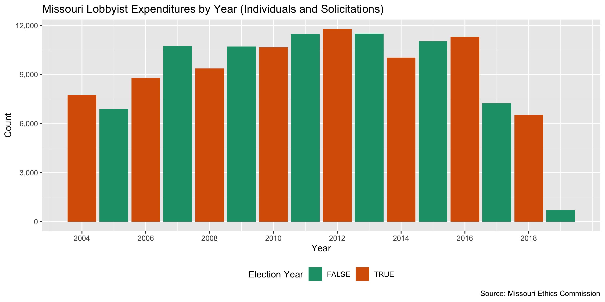
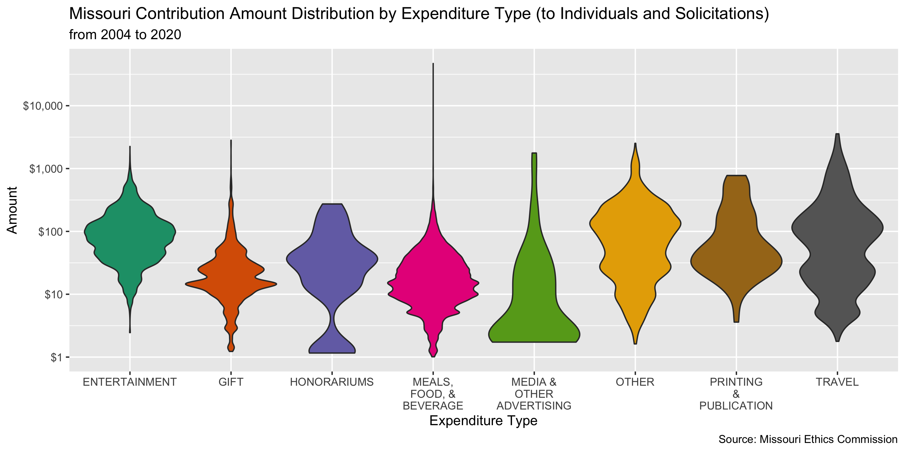
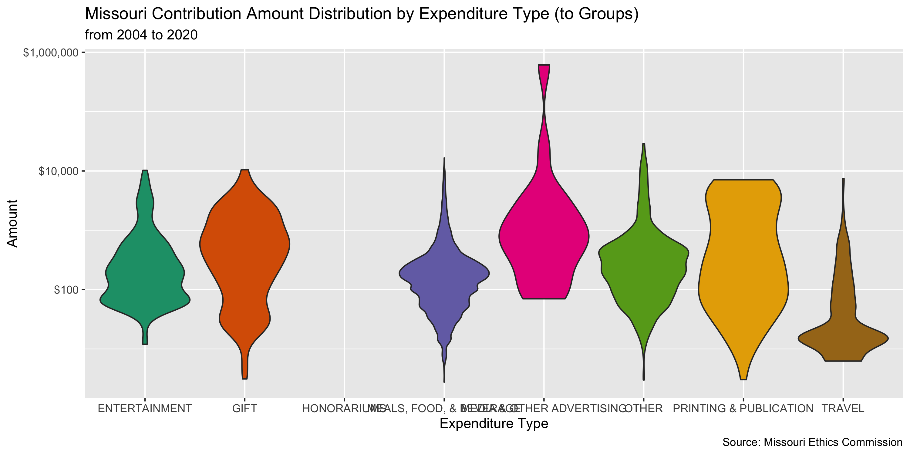
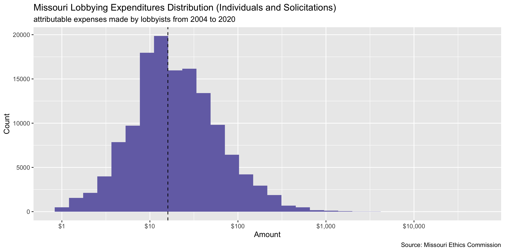

Missouri Lobbying Expenditure Diary
================
Yanqi Xu
2020-05-20 17:01:04

  - [Project](#project)
  - [Objectives](#objectives)
  - [Packages](#packages)
  - [Data](#data)
  - [Import](#import)
  - [Explore](#explore)
  - [Conclude](#conclude)
  - [Export](#export)

<!-- Place comments regarding knitting here -->

## Project

The Accountability Project is an effort to cut across data silos and
give journalists, policy professionals, activists, and the public at
large a simple way to search across huge volumes of public data about
people and organizations.

Our goal is to standardizing public data on a few key fields by thinking
of each dataset row as a transaction. For each transaction there should
be (at least) 3 variables:

1.  All **parties** to a transaction.
2.  The **date** of the transaction.
3.  The **amount** of money involved.

## Objectives

This document describes the process used to complete the following
objectives:

1.  How many records are in the database?
2.  Check for entirely duplicated records.
3.  Check ranges of continuous variables.
4.  Is there anything blank or missing?
5.  Check for consistency issues.
6.  Create a five-digit ZIP Code called `zip`.
7.  Create a `year` field from the transaction date.
8.  Make sure there is data on both parties to a transaction.

## Packages

The following packages are needed to collect, manipulate, visualize,
analyze, and communicate these results. The `pacman` package will
facilitate their installation and attachment.

The IRW’s `campfin` package will also have to be installed from GitHub.
This package contains functions custom made to help facilitate the
processing of campaign finance data.

``` r
if (!require("pacman")) install.packages("pacman")
pacman::p_load_gh("irworkshop/campfin")
pacman::p_load(
  readxl, #read excel files
  rvest, # used to scrape website and get html elements
  tidyverse, # data manipulation
  stringdist, # calculate distances between strings
  lubridate, # datetime strings
  magrittr, # pipe opperators
  janitor, # dataframe clean
  refinr, # cluster and merge
  scales, # format strings
  knitr, # knit documents
  vroom, # read files fast
  httr, # http queries
  glue, # combine strings
  here, # relative storage
  fs # search storage 
)
```

This document should be run as part of the `R_campfin` project, which
lives as a sub-directory of the more general, language-agnostic
[`irworkshop/accountability_datacleaning`](https://github.com/irworkshop/accountability_datacleaning)
GitHub repository.

The `R_campfin` project uses the [Rstudio
projects](https://support.rstudio.com/hc/en-us/articles/200526207-Using-Projects "Rproj")
feature and should be run as such. The project also uses the dynamic
`here::here()` tool for file paths relative to *your* machine.

``` r
# where does this document knit?
here::here()
#> [1] "/Users/yanqixu/code/accountability_datacleaning/R_campfin"
```

## Data

The [Missouri Ethics
Commission](https://www.mec.mo.gov/mec/Lobbying/Lob_ExpSrch.aspx) makes
lobbyist expenditure data from 2004 to 2020 available for download. Note
that data for 2019 onward exists in a separate search. The 2018 data and
prior year’s data exist in two separate files.

The `mo_lob_exp` data captures expenditures reported by a lobbyist made
on behalf of any group or individual including a state public official,
their employee/ staff, spouse/child, a department head and their staff,
and a local elected official in a municipality with a budget over $10
million.

According to the Ethics Commission, the recipient field is always the
person who received the gift. If that person is an
employee/staff/spouse/child of a public official the actual recipient is
listed in the recipient field and the name of the associated public
official is listed in the public official field. If the recipient of the
gift is the public official their name is then listed in the recipient
field only.

## Import

### Setting up Raw Data Directory

``` r
raw_dir <- dir_create(here("mo", "lobby", "data", "raw","exp"))
```

### Read

The `xlsx` files we obtained actually contain two tabs, one for
`individual/solicitation` and the other for `group`. The columns are
slightly dififerent, and we will read them separately.

``` r
mo_lob_exp <- dir_ls(raw_dir) %>% str_subset("200.|201[^9]")  %>% map_dfr(read_xlsx, sheet = 1) %>% clean_names() %>% mutate_if(is.character, str_to_upper)
mo_lob_grp <- dir_ls(raw_dir) %>% str_subset("200.|201[^9]") %>% map_dfr(read_xlsx, sheet = 2) %>% clean_names() %>% mutate_if(is.character, str_to_upper)

mo_lob_19 <- dir_ls(raw_dir) %>% str_subset("2019") %>% map_dfr(read_xlsx) %>% clean_names() %>% mutate_if(is.character, str_to_upper)
```

According to the Missouri Ethics Commission,

> The recipient field is always the person who received the gift. If
> that person is an employee/staff/spouse/child of a public official the
> actual recipient is listed in the recipient field and the name of the
> associated public official is listed in the public official field. If
> the recipient of the gift is the public official their name is then
> listed in the recipient field only.

## Explore

``` r
head(mo_lob_exp)
#> # A tibble: 6 x 15
#>   lob_id lob_first_name lob_last_name report              public_official recipient
#>   <chr>  <chr>          <chr>         <dttm>              <chr>           <chr>    
#> 1 L0017… CONNIE J.      CIERPIOT      2004-01-01 00:00:00 <NA>            REINHART…
#> 2 L0006… GREGORY        TAYLOR        2004-01-01 00:00:00 <NA>            HAMPTON,…
#> 3 L0006… GREGORY        TAYLOR        2004-01-01 00:00:00 <NA>            WARD, DA…
#> 4 L0006… GREGORY        TAYLOR        2004-01-01 00:00:00 <NA>            HUNTER, …
#> 5 L0006… GREGORY        TAYLOR        2004-01-01 00:00:00 <NA>            DEMPSEY,…
#> 6 L0006… GREGORY        TAYLOR        2004-01-01 00:00:00 <NA>            ANGST, R…
#> # … with 9 more variables: date <dttm>, type <chr>, description <chr>, amount <dbl>,
#> #   principal <chr>, amend_reason <chr>, ind_id <dbl>, amend_ind_id <dbl>, expenditure_type <chr>
tail(mo_lob_exp)
#> # A tibble: 6 x 15
#>   lob_id lob_first_name lob_last_name report              public_official recipient
#>   <chr>  <chr>          <chr>         <dttm>              <chr>           <chr>    
#> 1 L0029… BRAD           BATES         2018-05-01 00:00:00 DOORMAN - PUBL… JOHN SCH…
#> 2 L0005… MARK J         RHOADS        2018-11-01 00:00:00 RICHARD, RON  … MRS. PAT…
#> 3 L0029… BRAD           BATES         2018-05-01 00:00:00 DOORMAN - PUBL… J.O. RAC…
#> 4 L0029… BRAD           BATES         2018-05-01 00:00:00 DOORMAN - PUBL… GAIL JON…
#> 5 L0005… MARK J         RHOADS        2018-09-01 00:00:00 <NA>            RICHARD,…
#> 6 L0005… MARK J         RHOADS        2018-11-01 00:00:00 <NA>            RICHARD,…
#> # … with 9 more variables: date <dttm>, type <chr>, description <chr>, amount <dbl>,
#> #   principal <chr>, amend_reason <chr>, ind_id <dbl>, amend_ind_id <dbl>, expenditure_type <chr>
glimpse(sample_n(mo_lob_exp, 20))
#> Rows: 20
#> Columns: 15
#> $ lob_id           <chr> "L000523", "L000299", "L000159", "L000349", "L001075C", "L001839A", "L0…
#> $ lob_first_name   <chr> "D SCOTT", "WILLIAM A", "TERRY W", "STEVE", "DONALD C", "SHARON GEUEA",…
#> $ lob_last_name    <chr> "PENMAN", "GAMBLE", "BRIGGS", "JACKSON", "OTTO JR", "JONES", "BURCH", "…
#> $ report           <dttm> 2015-01-01, 2006-04-01, 2009-10-01, 2011-07-01, 2012-02-01, 2010-03-01…
#> $ public_official  <chr> NA, NA, NA, NA, "GUEST - PUBLIC OFFICIAL", NA, "FAITH, SALLY A. - REPRE…
#> $ recipient        <chr> "LAFAVER, JEREMY  - REPRESENTATIVE", "KLINDT, DAVID - SENATOR", "LEMBKE…
#> $ date             <dttm> 2015-01-28, 2006-04-23, 2009-10-27, 2011-07-24, 2012-02-28, 2010-03-03…
#> $ type             <chr> "MEALS, FOOD, & BEVERAGE", "MEALS, FOOD, & BEVERAGE", "MEALS, FOOD, & B…
#> $ description      <chr> "DINNER MEETING", "NULL", "LUNCH", "THE CITY ADMINISTRATOR OF MY CLIENT…
#> $ amount           <dbl> 26.05, 16.00, 9.75, 2.48, 2.00, 40.56, 13.29, 46.00, 40.00, 39.00, -57.…
#> $ principal        <chr> "PENMAN & WINTON CONSULTING", "MISSOURI BEVERAGE ASSOCIATION", "SITE IM…
#> $ amend_reason     <chr> NA, "NULL", "NULL", NA, NA, NA, "NULL", NA, NA, NA, "NOT INDIVIDUAL CHA…
#> $ ind_id           <dbl> 49445, 3534, 8712, 16596, 21641, 3893, 2966, 37825, 8556, 13273, 2446, …
#> $ amend_ind_id     <dbl> 0, 0, 0, 0, 0, 0, 0, 0, 0, 0, 1957, 0, 0, 0, 0, 0, 0, 0, 0, 0
#> $ expenditure_type <chr> "INDIVIDUAL", "INDIVIDUAL", "INDIVIDUAL", "INDIVIDUAL", "INDIVIDUAL", "…

head(mo_lob_grp)
#> # A tibble: 6 x 13
#>   lob_id lob_first_name lob_last_name report              group date                type 
#>   <chr>  <chr>          <chr>         <dttm>              <chr> <dttm>              <chr>
#> 1 L0005… RANDY J        SCHERR        2004-07-01 00:00:00 ENTI… 2004-07-27 00:00:00 MEAL…
#> 2 L0005… RANDY J        SCHERR        2004-07-01 00:00:00 ENTI… 2004-07-27 00:00:00 MEAL…
#> 3 L0005… RANDY J        SCHERR        2004-07-01 00:00:00 ENTI… 2004-07-27 00:00:00 MEAL…
#> 4 L0005… RANDY J        SCHERR        2004-07-01 00:00:00 ENTI… 2004-07-27 00:00:00 MEAL…
#> 5 L0017… GARY           MARBLE        2004-07-01 00:00:00 HOUS… 2004-07-27 00:00:00 MEAL…
#> 6 L0005… JIM            RUSSELL       2004-01-01 00:00:00 WEST… 2004-01-27 00:00:00 MEAL…
#> # … with 6 more variables: description <chr>, amount <dbl>, principal <chr>, amend_reason <chr>,
#> #   gro_id <dbl>, amend_gro_id <dbl>
tail(mo_lob_grp)
#> # A tibble: 6 x 13
#>   lob_id lob_first_name lob_last_name report              group date                type 
#>   <chr>  <chr>          <chr>         <dttm>              <chr> <dttm>              <chr>
#> 1 L0036… JOHN E         JUNGMANN      2018-12-01 00:00:00 ENTI… 2018-12-11 00:00:00 MEAL…
#> 2 L0018… JEWELL D. H.   PATEK         2018-12-01 00:00:00 ENTI… 2018-12-01 00:00:00 MEAL…
#> 3 L0005… JENNIFER       DURHAM        2018-12-01 00:00:00 ENTI… 2018-12-04 00:00:00 MEAL…
#> 4 L0016… JAMES M.       FOLEY         2018-11-01 00:00:00 ENTI… 2018-11-27 00:00:00 ENTE…
#> 5 L0039… BJ             TANKSLEY      2018-12-01 00:00:00 ENTI… 2018-12-02 00:00:00 MEAL…
#> 6 L0039… BJ             TANKSLEY      2018-12-01 00:00:00 ENTI… 2018-12-03 00:00:00 MEAL…
#> # … with 6 more variables: description <chr>, amount <dbl>, principal <chr>, amend_reason <chr>,
#> #   gro_id <dbl>, amend_gro_id <dbl>
glimpse(sample_n(mo_lob_grp, 20))
#> Rows: 20
#> Columns: 13
#> $ lob_id         <chr> "L000127", "L000580", "L003084", "L002248A", "L000299", "L001096", "L0005…
#> $ lob_first_name <chr> "SAM", "JORGEN", "SUSAN HENDERSON", "CHARLES G", "WILLIAM A", "BETH M", "…
#> $ lob_last_name  <chr> "BARBEE", "SCHLEMEIER", "MOORE", "SIMINO", "GAMBLE", "WHEELER", "SCRUGGS"…
#> $ report         <dttm> 2005-01-01, 2010-01-01, 2013-05-01, 2014-02-01, 2010-04-01, 2006-03-01, …
#> $ group          <chr> "DEMOCRAT FRESHMAN CAUCUS", "JOB CREATION AND ECONOMIC DEVELOPMENT, STAND…
#> $ date           <dttm> 2005-01-05, 2010-01-19, 2013-05-09, 2014-02-11, 2010-04-21, 2006-03-28, …
#> $ type           <chr> "MEALS, FOOD, & BEVERAGE", "MEALS, FOOD, & BEVERAGE", "GIFT", "MEALS, FOO…
#> $ description    <chr> "NULL", "DINNER", "MOTHER'S DAY FLOWERS SENT TO THE CAPITOL FOR FEMALE ME…
#> $ amount         <dbl> 112.50, 114.09, 23.80, 322.10, 62.76, 144.00, 200.00, 58.48, 186.27, 36.1…
#> $ principal      <chr> "MISSOURI AUTOMOBILE DEALERS ASSOCIATION", "MISSOURI RAILROAD ASSOCIATION…
#> $ amend_reason   <chr> "NULL", "NULL", "NULL", "NULL", "NULL", "NULL", "NULL", "NULL", "NULL", "…
#> $ gro_id         <dbl> 191, 49, 6603, 7159, 768, 734, 839, 4820, 7176, 2268, 882, 7922, 1095, 70…
#> $ amend_gro_id   <dbl> 0, 0, 0, 0, 0, 0, 0, 0, 0, 0, 0, 0, 0, 0, 0, 0, 0, 0, 0, 0
```

### Missing

Not many fields have missing records. However, we can convert the `NULL`
entries to *NAs*.

``` r
col_stats(mo_lob_exp, count_na)
#> # A tibble: 15 x 4
#>    col              class      n     p
#>    <chr>            <chr>  <int> <dbl>
#>  1 lob_id           <chr>      0 0    
#>  2 lob_first_name   <chr>      0 0    
#>  3 lob_last_name    <chr>      0 0    
#>  4 report           <dttm>     0 0    
#>  5 public_official  <chr>  95891 0.658
#>  6 recipient        <chr>      0 0    
#>  7 date             <dttm>     0 0    
#>  8 type             <chr>      0 0    
#>  9 description      <chr>  40827 0.280
#> 10 amount           <dbl>      0 0    
#> 11 principal        <chr>      0 0    
#> 12 amend_reason     <chr>  76441 0.524
#> 13 ind_id           <dbl>      0 0    
#> 14 amend_ind_id     <dbl>      0 0    
#> 15 expenditure_type <chr>      0 0
col_stats(mo_lob_grp, count_na)
#> # A tibble: 13 x 4
#>    col            class      n        p
#>    <chr>          <chr>  <int>    <dbl>
#>  1 lob_id         <chr>      0 0       
#>  2 lob_first_name <chr>      0 0       
#>  3 lob_last_name  <chr>      0 0       
#>  4 report         <dttm>     0 0       
#>  5 group          <chr>     21 0.000844
#>  6 date           <dttm>     0 0       
#>  7 type           <chr>      0 0       
#>  8 description    <chr>   2888 0.116   
#>  9 amount         <dbl>      0 0       
#> 10 principal      <chr>      0 0       
#> 11 amend_reason   <chr>      0 0       
#> 12 gro_id         <dbl>      0 0       
#> 13 amend_gro_id   <dbl>      0 0

mo_lob_grp <- mo_lob_grp %>% 
  mutate(amend_reason = na_if(amend_reason, "NULL"),
         description = na_if(description, "NULL"))

mo_lob_exp <- mo_lob_exp %>% 
  mutate(amend_reason = na_if(amend_reason, "NULL"),
         description = na_if(description, "NULL"))

mo_lob_19 <- mo_lob_19 %>% 
  mutate_if(is.character, na_if, "NULL") %>% 
  mutate_if(is.character, na_if, "N/A")
```

### Categorical

First, we will create a `year` variable.

``` r
mo_lob_exp <- mo_lob_exp %>% 
  mutate(date = as.Date(date, format = "%m/%d/%Y"),
         year = year(date))

mo_lob_grp <- mo_lob_grp %>% 
  mutate(date = as.Date(date, format = "%m/%d/%Y"),
         year = year(date))

mo_lob_19 <- mo_lob_19 %>% 
  mutate(year = year(expenditure_date))
```

#### No. of expenditures

Visualize number of expenses each year. We can see that some of the year
variable is not valid, with values greater than 2200. We will manually
filter these entries out before visualizing the data.
<!-- -->

``` r
 mo_lob_grp %>% 
  count(year) %>% 
  filter(year > 2003 & year < 2020) %>% 
    bind_rows(mo_lob_19 %>% filter(expenditure_type == "GROUP") %>% count(year)) %>% 
  mutate(even = is_even(year)) %>% 
  ggplot(aes(x = year, y = n)) +
  geom_col(aes(fill = even)) + 
  scale_fill_brewer(palette = "Dark2") +
  scale_y_continuous(labels = comma) +
  scale_x_continuous(breaks = seq(2004, 2019, by = 2)) +
  theme(legend.position = "bottom") +
  labs(
    title = "Missouri Lobbyist Expenditures by Year (Groups)",
    caption = "Source: Missouri Ethics Commission",
    fill = "Election Year",
    x = "Year",
    y = "Count"
  )
```

<!-- -->

#### Expenditure Type

<!-- -->

<!-- -->

<!-- -->

<!-- -->

<!-- -->

### Continuous

First, let’s take a look at the distribution of the amount by
expenditure type

<!-- -->

<!-- -->

<!-- -->

<!-- --> \#\#\# Separate recipient
name and title

``` r

mo_lob_19 <- mo_lob_19 %>% 
  separate(col = recipient, into = c("recipient_name","recipient_title"), sep = " - ", remove = FALSE) %>% 
  mutate_at(.vars = c("recipient_name","recipient_title"), .funs = trimws) %>% 
  rename(principal_name = p_name) %>% 
  separate(col = public_official, into = c("public_official_name","public_official_title"), sep = " - ", remove = FALSE) %>% 
  mutate_at(.vars = c("public_official_name","public_official_title"), .funs = trimws)

mo_lob_exp <- mo_lob_exp %>% 
  mutate(recipient_name = str_extract(recipient,"^.+(?=\\s-\\s)"),
         recipient_title = str_remove(recipient, "^.+\\s-\\s")) %>% 
  mutate(public_official_name = str_extract(public_official,"^.+(?=\\s-\\s)"),
         public_official_title = str_remove(public_official, "^.+\\s-\\s")) %>% 
  mutate_at(.vars = c("recipient_name","recipient_title"), .funs = trimws) %>% 
  mutate_at(.vars = c("public_official_name","public_official_title"), .funs = trimws)
```

Then we’ll reshape the early data and combine them into one.

``` r
mo_lob_exp_rs <- mo_lob_exp %>% 
  rename(expenditure_date = date, expenditure_category = type) %>% 
  add_column(group= rep(NA_character_,nrow(.)), .after = "recipient_title") %>% 
  add_column(gro_id= rep(NA_integer_,nrow(.)), .after = "group") %>% 
  add_column(amend_gro_id= rep(NA_integer_,nrow(.)), .after = "gro_id")

grp_add <- setdiff(names(mo_lob_exp), names(mo_lob_grp))


mo_lob_grp_rs <- mo_lob_grp %>% 
    rename(expenditure_category = type,
         expenditure_date = date) %>% 
  add_column(public_official = rep(NA_character_,nrow(.)), .before = "group") %>% 
  add_column(recipient = rep(NA_character_,nrow(.)), .before = "group") %>% 
  add_column(ind_id = rep(NA_character_,nrow(.)), .before = "gro_id") %>% 
  add_column(amend_ind_id = rep(NA_character_,nrow(.)), .before = "gro_id") %>% 
  add_column(recipient_name = rep(NA_character_,nrow(.)), .before = "year") %>% 
  add_column(recipient_title = rep(NA_character_,nrow(.)), .before = "year") %>% 
  add_column(public_official_name = rep(NA_character_,nrow(.)), .before = "year") %>% 
  add_column(public_official_title = rep(NA_character_,nrow(.)), .before = "year") %>% 
  add_column(expenditure_type= rep("GROUP",nrow(.)), .after = "expenditure_date")
  #mutate(gro_id = as.character(gro_id))
  
mo_lob_combine <- mo_lob_exp_rs %>% bind_rows(mo_lob_grp_rs)

mo_lob_combine <- mo_lob_combine %>% rename(principal_name = principal,
                                            prin_amount = amount)
```

Rename and create new columns for 2019

``` r
mo_lob_19_rs <- mo_lob_19 %>% 
  add_column(ind_id = rep(NA_character_,nrow(.)), .after = "amend_reason") %>% 
  add_column(amend_ind_id = rep(NA_character_,nrow(.)), .after = "ind_id") %>% 
  add_column(gro_id = rep(NA_character_,nrow(.)), .after = "amend_reason") %>% 
  add_column(amend_gro_id = rep(NA_character_,nrow(.)), .after = "gro_id") %>% 
  mutate(expenditure_date = as.Date(expenditure_date))

mo_lob_final <- mo_lob_combine %>% bind_rows(mo_lob_19_rs)
```

### Duplicates

Running the following commands shows that there are over a thousand
entries with totally identical information. Since each of them contain
`total_compensation` and `total_reimbursed` for a certain period, there
should be only one such entry for each corresponding time period. We
will note that in the `dupe_flag` column.

``` r
mo_lob_final <- flag_dupes(mo_lob_final, dplyr::everything())
sum(mo_lob_final$dupe_flag)
#> [1] 518
```

## Conclude

``` r
glimpse(sample_n(mo_lob_final, 20))
#> Rows: 20
#> Columns: 25
#> $ lob_id                <chr> "L001855", "L000299", "L001988", "L000993", "L001708", "L000404", …
#> $ lob_first_name        <chr> "STEPHEN C.", "WILLIAM A", "NIKKI R", "JAMES P", "CHRIS", "CHRISTI…
#> $ lob_last_name         <chr> "KNORR", "GAMBLE", "STRONG", "BROWN", "LIESE", "LEPPER", "HOWARD",…
#> $ report                <dttm> 2006-04-01, 2012-01-01, 2015-05-01, 2013-05-01, 2015-07-01, 2005-…
#> $ public_official       <chr> NA, NA, "EGGLESTON, J - REPRESENTATIVE", NA, "GOSEN, DON  - REPRES…
#> $ recipient             <chr> "PRATT, BRYAN - REPRESENTATIVE", "SCHARNHORST, DWIGHT D. - REPRESE…
#> $ expenditure_date      <date> 2006-04-11, 2012-01-24, 2015-05-05, 2013-05-06, 2015-07-09, 2005-…
#> $ expenditure_category  <chr> "MEALS, FOOD, & BEVERAGE", "MEALS, FOOD, & BEVERAGE", "MEALS, FOOD…
#> $ description           <chr> NA, "NON-ALCOHOLIC BEVERAGES", "END OF SESSION MEAL", NA, NA, NA, …
#> $ prin_amount           <dbl> 35.65, 26.00, 11.87, 30.15, 103.41, 338.99, 10.00, 18.75, 72.00, 7…
#> $ principal_name        <chr> "UNIVERSITY OF MISSOURI", "MISSOURI BEVERAGE ASSOCIATION", "MISSOU…
#> $ amend_reason          <chr> NA, NA, NA, NA, "NEW ENTRY", NA, NA, NA, NA, NA, NA, NA, NA, NA, N…
#> $ ind_id                <dbl> 3066, 19753, 54992, 36239, 57400, NA, 49425, 40, 1535, 75248, 1384…
#> $ amend_ind_id          <dbl> 0, 0, 0, 0, 0, NA, 0, 0, 0, 0, 0, NA, 0, 0, 0, NA, 0, 0, NA, 0
#> $ expenditure_type      <chr> "INDIVIDUAL", "INDIVIDUAL", "INDIVIDUAL", "INDIVIDUAL", "INDIVIDUA…
#> $ year                  <dbl> 2006, 2012, 2015, 2013, 2015, 2005, 2015, 2006, 2004, 2017, 2007, …
#> $ recipient_name        <chr> "PRATT, BRYAN", "SCHARNHORST, DWIGHT D.", "CATHIE EGGLESTON", "PAC…
#> $ recipient_title       <chr> "REPRESENTATIVE", "REPRESENTATIVE", "SPOUSE OR CHILD", "REPRESENTA…
#> $ group                 <chr> NA, NA, NA, NA, NA, "FINANCIAL INSTITUTIONS, STANDING", NA, NA, NA…
#> $ gro_id                <dbl> NA, NA, NA, NA, NA, 1610, NA, NA, NA, NA, NA, 1559, NA, NA, NA, 93…
#> $ amend_gro_id          <dbl> NA, NA, NA, NA, NA, 0, NA, NA, NA, NA, NA, 0, NA, NA, NA, 0, NA, N…
#> $ public_official_name  <chr> NA, NA, "EGGLESTON, J", NA, "GOSEN, DON", NA, NA, NA, "SENATOR CAL…
#> $ public_official_title <chr> NA, NA, "REPRESENTATIVE", NA, "REPRESENTATIVE", NA, NA, NA, "PUBLI…
#> $ report_group_id       <dbl> NA, NA, NA, NA, NA, NA, NA, NA, NA, NA, NA, NA, NA, NA, NA, NA, NA…
#> $ dupe_flag             <lgl> FALSE, FALSE, FALSE, FALSE, FALSE, FALSE, FALSE, FALSE, FALSE, FAL…
```

1.  There are 145776 records in the individual/solicitation database,
    and 24882 in the group database.
2.  There are 0 duplicate records in the individual/solicitation
    database, and 0 in the group database.
3.  The range and distribution of `amount` and `date` seem reasonable
    with a few anomalies.
4.  There are 0 records missing recipient, principal, amount or date,
    and 0 records missing group, principal, amount or date.
5.  The 4-digit `YEAR` variable has been created with
    `lubridate::year()`.

## Export

``` r
clean_dir <- dir_create(here("mo", "lobby", "data", "processed","exp"))
```

``` r
write_csv(
  x = mo_lob_final,
  path = path(clean_dir, "mo_lob_exp_combined_clean.csv"),
  na = ""
)
```
