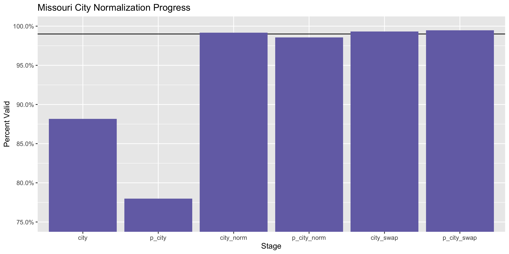
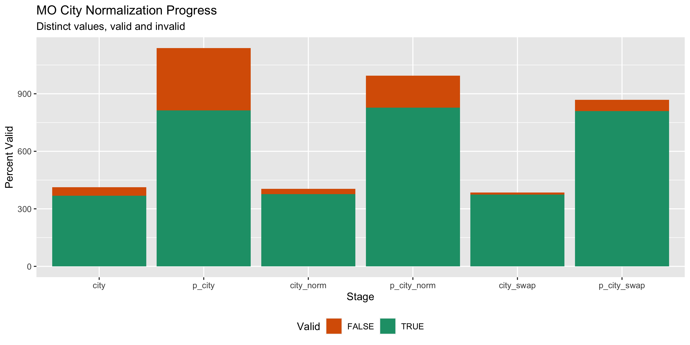

Missouri Lobbying Registration Diary
================
Yanqi Xu
2020-02-25 17:09:06

-   [Project](#project)
-   [Objectives](#objectives)
-   [Packages](#packages)
-   [Data](#data)
-   [Import](#import)
-   [Explore](#explore)
-   [Wrangle](#wrangle)
-   [Conclude](#conclude)
-   [Export](#export)

<!-- Place comments regarding knitting here -->
Project
-------

The Accountability Project is an effort to cut across data silos and give journalists, policy professionals, activists, and the public at large a simple way to search across huge volumes of public data about people and organizations.

Our goal is to standardizing public data on a few key fields by thinking of each dataset row as a transaction. For each transaction there should be (at least) 3 variables:

1.  All **parties** to a transaction.
2.  The **date** of the transaction.
3.  The **amount** of money involved.

Objectives
----------

This document describes the process used to complete the following objectives:

1.  How many records are in the database?
2.  Check for entirely duplicated records.
3.  Check ranges of continuous variables.
4.  Is there anything blank or missing?
5.  Check for consistency issues.
6.  Create a five-digit ZIP Code called `zip`.
7.  Create a `year` field from the transaction date.
8.  Make sure there is data on both parties to a transaction.

Packages
--------

The following packages are needed to collect, manipulate, visualize, analyze, and communicate these results. The `pacman` package will facilitate their installation and attachment.

The IRW's `campfin` package will also have to be installed from GitHub. This package contains functions custom made to help facilitate the processing of campaign finance data.

``` r
if (!require("pacman")) install.packages("pacman")
pacman::p_load_gh("irworkshop/campfin")
pacman::p_load(
  readxl, # read excel files
  rvest, # used to scrape website and get html elements
  tidyverse, # data manipulation
  stringdist, # calculate distances between strings
  lubridate, # datetime strings
  magrittr, # pipe opperators
  janitor, # dataframe clean
  refinr, # cluster and merge
  scales, # format strings
  knitr, # knit documents
  vroom, # read files fast
  httr, # http queries
  glue, # combine strings
  here, # relative storage
  fs # search storage 
)
```

This document should be run as part of the `R_campfin` project, which lives as a sub-directory of the more general, language-agnostic [`irworkshop/accountability_datacleaning`](https://github.com/irworkshop/accountability_datacleaning) GitHub repository.

The `R_campfin` project uses the [Rstudio projects](https://support.rstudio.com/hc/en-us/articles/200526207-Using-Projects "Rproj") feature and should be run as such. The project also uses the dynamic `here::here()` tool for file paths relative to *your* machine.

``` r
# where does this document knit?
here::here()
#> [1] "/Users/soc/accountability/accountability_datacleaning/R_campfin"
```

Data
----

The workshop obtained the MO lobbying registration data through a Sunshine Request to the Missouri Ethics Commission. The data is as current as Feb. 14, 2020. Note that the file structure changed in 2019, since which a table of all current lobbyists is available, so we will process these two datasets separately.

Import
------

### Setting up Raw Data Directory

``` r
raw_dir <- dir_create(here("mo", "lobby", "data", "raw", "reg"))
```

### Read

``` r
mo_lob <- read_xlsx(
  path = dir_ls(raw_dir, regexp = "Data.xlsx")
) %>% clean_names() %>% mutate_if(is.character, str_conv, encoding = "UTF-8") %>% mutate_if(is.character, str_to_upper)

mo_prin <- read_xlsx(
  path = dir_ls(raw_dir, regexp = "Data.xlsx"), sheet = 3
) %>% clean_names() %>% mutate_if(is.character, str_conv, encoding = "UTF-8") %>% mutate_if(is.character, str_to_upper)

mo_prin_new <- read_xlsx(
  path = dir_ls(raw_dir) %>% str_subset("2019"), sheet = 2
) %>% clean_names() %>% mutate_if(is.character, str_conv, encoding = "UTF-8") %>% mutate_if(is.character, str_to_upper)

mo_lob_new <- read_xlsx(
  path = dir_ls(raw_dir) %>% str_subset("2019")
) %>% clean_names() %>% mutate_if(is.character, str_conv, encoding = "UTF-8") %>% mutate_if(is.character, str_to_upper)
```

#### Year

Sometimes in the current lobbyist list, there will be 2019 and 2020 registrations while everything else is the same. We can safely flag the earlier ones as duplicates and go with the new registration when joining it with the principal data.

``` r
mo_lob_reg <- mo_prin %>% 
  left_join(mo_lob, by = "lob_id")

mo_lob_reg <- mo_lob_reg %>% 
  mutate(year = year(rec_date))

mo_lob_reg$year %>% tabyl()
#> # A tibble: 27 x 3
#>        .     n   percent
#>    <dbl> <dbl>     <dbl>
#>  1  1991    36 0.00150  
#>  2  1993     1 0.0000417
#>  3  1994  3719 0.155    
#>  4  1995   757 0.0316   
#>  5  1996  1245 0.0520   
#>  6  1997  1026 0.0428   
#>  7  1998   304 0.0127   
#>  8  1999   426 0.0178   
#>  9  2000   685 0.0286   
#> 10  2001  1733 0.0723   
#> # … with 17 more rows
```

### Join

For years prior to 2019, we can see that each `lob_id` responds to one lobbyist, so it's a unique id, which we can use to join the `mo_lob` and `mo_prin` dataframes.

``` r
mo_prin_new <- mo_prin_new %>% 
  mutate(year = year(relationship_from))

mo_prin_new <- mo_prin_new %>% 
  rename_at(.vars = vars(-c(mecid_l, p_name)), .funs = ~ str_c("p_",.))
```

From 2019 onward, however, each `mecid_l` can correspond to multiple years, for which we'll just aggregate with the earliest year. Note that some lobbyists terminate their status and re-register within a year as well.

``` r
mo_min_date <- mo_lob_new %>% group_by(mecid_l) %>% summarize(date_min = min(date_registration))

mo_lob_new <- mo_lob_new %>% 
  left_join(mo_min_date, by = "mecid_l")

mo_lob_filter <- mo_lob_new %>% 
  filter(date_registration == date_min) %>% 
  select(-date_min)
```

We can see that one record `mecid_l` "L200260" doesn't have a corresponding record in the principal dataframe. As a result, we will just left join the `mo_lob_filter` with the `mo_prin_new` dataframe.

``` r
mo_lob_reg_new <- mo_lob_filter %>% 
  left_join(mo_prin_new, by = "mecid_l")
```

### Column Specs

We can see that the `rec_date` and `ent_date` are date columns, while `term_date` is read as character. We'll convert it to POSIXct objects (dates). We can see that the date is formatted in Excel and we need to use `excel_numeric_to_date`

``` r
mo_lob_reg <- mo_lob_reg %>% 
  mutate(term_date = na_if(term_date, "NULL") %>% as.numeric() %>% excel_numeric_to_date(date_system = "modern"))

mo_lob_reg_new <- mo_lob_reg_new %>% 
  mutate(date_terminated = na_if(date_terminated, "NULL") %>% as.numeric() %>% excel_numeric_to_date(date_system = "modern"))
```

``` r
mo_lob_reg <- mo_lob_reg %>% 
  mutate_if(is.character, na_if, "NULL")

mo_lob_reg_new <- mo_lob_reg_new %>% 
  mutate_if(is.character, na_if, "NULL")
```

Explore
-------

``` r
head(mo_lob_reg)
#> # A tibble: 6 x 27
#>   lob_id p_name p_address p_address2 p_city p_state p_zip add_date            delete_date f_name
#>   <chr>  <chr>  <chr>     <chr>      <chr>  <chr>   <chr> <dttm>              <chr>       <chr> 
#> 1 L0001… MISSO… 400 EAST… <NA>       KANSA… MO      64131 2000-11-01 09:13:04 37437.4735… DAVID…
#> 2 L0001… INSTI… 4590 SOU… <NA>       ST. L… MO      63127 2001-11-11 10:59:51 37531.6181… DAVID…
#> 3 L0001… ABSHE… POST OFF… <NA>       JEFFE… MO      65110 2002-10-02 14:49:50 <NA>        DAVID…
#> 4 L0001… HEART… P.O. BOX… <NA>       KANSA… MO      64113 2000-12-28 17:13:57 <NA>        SAMUEL
#> 5 L0001… BUILD… P.O. BOX… <NA>       KANSA… MO      64188 2014-05-21 14:18:49 <NA>        SAMUEL
#> 6 L0001… MISSO… 3337 EME… <NA>       JEFFE… MO      65109 2017-04-26 16:52:03 43081.8973… DALE  
#> # … with 17 more variables: l_name <chr>, address <chr>, address2 <chr>, city <chr>, state <chr>,
#> #   zip <chr>, zip4 <chr>, exec_branch <dbl>, gen_branch <dbl>, jud_branch <dbl>, all3 <dbl>,
#> #   elec_loc <dbl>, state_emp <dbl>, rec_date <dttm>, ent_date <dttm>, term_date <date>,
#> #   year <dbl>
tail(mo_lob_reg)
#> # A tibble: 6 x 27
#>   lob_id p_name p_address p_address2 p_city p_state p_zip add_date            delete_date f_name
#>   <chr>  <chr>  <chr>     <chr>      <chr>  <chr>   <chr> <dttm>              <chr>       <chr> 
#> 1 L0043… UNIVE… 227 UNIV… <NA>       COLUM… MO      65211 2018-12-12 11:18:55 <NA>        SHERYL
#> 2 L0043… MISSO… 200 E MC… <NA>       JEFFE… MO      65101 2018-12-12 11:27:58 <NA>        TRAVIS
#> 3 L0043… MISSO… 230 S BE… <NA>       CLAYT… MO      63105 2018-12-12 11:30:59 <NA>        JEFF  
#> 4 L0043… THE M… PO BOX 1… <NA>       JEFFE… MO      65102 2018-12-12 11:39:42 <NA>        MEGHAN
#> 5 L0043… INSTI… 901 N GL… <NA>       ARLIN… VA      22203 2018-12-17 11:29:07 <NA>        RACHE…
#> 6 L0043… COLUM… 300 S PR… <NA>       COLUM… MO      65205 2018-12-27 13:20:41 <NA>        NICHO…
#> # … with 17 more variables: l_name <chr>, address <chr>, address2 <chr>, city <chr>, state <chr>,
#> #   zip <chr>, zip4 <chr>, exec_branch <dbl>, gen_branch <dbl>, jud_branch <dbl>, all3 <dbl>,
#> #   elec_loc <dbl>, state_emp <dbl>, rec_date <dttm>, ent_date <dttm>, term_date <date>,
#> #   year <dbl>
glimpse(sample_n(mo_lob_reg, 20))
#> Observations: 20
#> Variables: 27
#> $ lob_id      <chr> "L001758", "L001705", "L002808", "L000863", "L001759", "L000299", "L003115",…
#> $ p_name      <chr> "MISSOURI ASSOCIATION OF NURSE ANESTHETISTS", "GAMBLE & SCHLEMEIER", "GARDNE…
#> $ p_address   <chr> "1753 WALTERS WAY", "PO BOX 1865", "1414 E PRIMROSE, SUITE 100", "415 E HIGH…
#> $ p_address2  <chr> NA, NA, NA, NA, NA, NA, NA, NA, NA, "SUITE 870", NA, NA, NA, "PO BOX 1336", …
#> $ p_city      <chr> "ST. CHARLES", "JEFFERSON CITY", "SPRINGFIELD,", "JEFFERSON CITY", "WASHINGT…
#> $ p_state     <chr> "MO", "MO", "MO", "MO", "DC", "MO", "MO", "OH", "MO", "DC", "NV", "MO", "MO"…
#> $ p_zip       <chr> "63303", "65102", "66804", "65101", "20036", "63119", "65101", "45201", "641…
#> $ add_date    <dttm> 2003-01-17 20:24:06, 2003-01-08 12:40:16, 2014-09-26 11:07:46, 2004-01-04 1…
#> $ delete_date <chr> "38707.943506944444", "37629.581157407411", "42514.659467592595", "37990.519…
#> $ f_name      <chr> "LANA LADD", "MARGIE", "MARK F", "TOM", "FRED J.", "WILLIAM A", "ANDREW", "T…
#> $ l_name      <chr> "BAKER", "WILSON", "HABBAS", "POWELL", "DREILING", "GAMBLE", "FOLEY", "BROWN…
#> $ address     <chr> "1220 BLUEBIRD LANE", "GAMBLE & SCHLEMEIER", "115 MCMENAMY RD", "415 EAST HI…
#> $ address2    <chr> NA, "PO BOX 1865", NA, "PO BOX 1708", NA, "PO BOX 1865", NA, NA, NA, NA, "PO…
#> $ city        <chr> "COLUMBIA", "JEFFERSON CITY", "ST PETERS", "JEFFERSON CITY", "KANSAS CITY", …
#> $ state       <chr> "MO", "MO", "MO", "MO", "MO", "MO", "MO", "MO", "MO", "MO", "MO", "MO", "MO"…
#> $ zip         <chr> "65201", "65102", "63376", "65102", "64114", "65102", "65101", "63117", "640…
#> $ zip4        <chr> NA, "1865", "1515", NA, NA, "1865", NA, NA, NA, NA, NA, NA, NA, NA, NA, NA, …
#> $ exec_branch <dbl> 0, 1, 1, 1, 1, 1, 1, 0, 0, 0, 0, 0, 0, 0, 1, 0, 0, 0, 0, 1
#> $ gen_branch  <dbl> 0, 1, 1, 1, 1, 1, 1, 0, 0, 0, 0, 0, 0, 0, 1, 0, 0, 0, 0, 1
#> $ jud_branch  <dbl> 0, 0, 0, 0, 0, 0, 0, 0, 0, 0, 0, 0, 0, 0, 0, 0, 0, 0, 0, 0
#> $ all3        <dbl> 1, 0, 0, 0, 0, 0, 0, 1, 1, 1, 1, 1, 1, 1, 0, 1, 1, 0, 1, 0
#> $ elec_loc    <dbl> 0, 1, 0, 0, 1, 1, 1, 0, 0, 0, 0, 0, 0, 0, 0, 0, 1, 0, 1, 0
#> $ state_emp   <dbl> 0, 0, 0, 0, 0, 0, 0, 0, 0, 0, 0, 0, 0, 0, 0, 0, 0, 1, 0, 0
#> $ rec_date    <dttm> 2003-01-14, 2002-12-09, 2009-01-01, 1994-01-12, 2003-01-14, 1994-01-10, 201…
#> $ ent_date    <dttm> 2003-01-15, 2002-12-10, 2009-01-01, 1994-01-12, 2003-01-15, 1994-01-10, 201…
#> $ term_date   <date> NA, 2010-03-12, NA, 2009-12-23, NA, NA, NA, NA, NA, NA, NA, NA, 2003-07-12,…
#> $ year        <dbl> 2003, 2002, 2009, 1994, 2003, 1994, 2011, 1998, 2007, 2011, 1994, 2007, 2003…

head(mo_lob_reg_new)
#> # A tibble: 6 x 29
#>   mecid_l first_name middle_name nickname last_name company_name address1 address2 city  state
#>   <chr>   <chr>      <chr>       <chr>    <chr>     <chr>        <chr>    <chr>    <chr> <chr>
#> 1 L001674 DAVID      PAUL        <NA>     ABERNATHY SPIRE, INC.  700 MAR… <NA>     ST. … MO   
#> 2 L001674 DAVID      PAUL        <NA>     ABERNATHY SPIRE, INC.  700 MAR… <NA>     ST. … MO   
#> 3 L003881 JEFFREY    P           <NA>     ABOUSSIE  REGIONAL ST… 18502 R… <NA>     WILD… MO   
#> 4 L003881 JEFFREY    P           <NA>     ABOUSSIE  REGIONAL ST… 18502 R… <NA>     WILD… MO   
#> 5 L003881 JEFFREY    P           <NA>     ABOUSSIE  REGIONAL ST… 18502 R… <NA>     WILD… MO   
#> 6 L003881 JEFFREY    P           <NA>     ABOUSSIE  REGIONAL ST… 18502 R… <NA>     WILD… MO   
#> # … with 19 more variables: zip <chr>, is_executive <dbl>, is_legislative <dbl>,
#> #   is_judicial <dbl>, is_local <dbl>, is_state_emp <dbl>, date_lob_began <dttm>,
#> #   registration_year <dbl>, date_registration <dttm>, date_terminated <date>, p_name <chr>,
#> #   p_address1 <chr>, p_address2 <chr>, p_city <chr>, p_state <chr>, p_zip <chr>,
#> #   p_relationship_from <dttm>, p_relationship_to <chr>, p_year <dbl>
tail(mo_lob_reg_new)
#> # A tibble: 6 x 29
#>   mecid_l first_name middle_name nickname last_name company_name address1 address2 city  state
#>   <chr>   <chr>      <chr>       <chr>    <chr>     <chr>        <chr>    <chr>    <chr> <chr>
#> 1 L003258 JASON      MATTHEW     <NA>     ZAMKUS    ZAMKUS & AS… 1320 EL… <NA>     JEFF… MO   
#> 2 L003258 JASON      MATTHEW     <NA>     ZAMKUS    ZAMKUS & AS… 1320 EL… <NA>     JEFF… MO   
#> 3 L190188 BRADLEY    D.          <NA>     ZIMMERMAN CARMODY MAC… 120 S. … SUITE 1… ST. … MO   
#> 4 L190188 BRADLEY    D.          <NA>     ZIMMERMAN CARMODY MAC… 120 S. … SUITE 1… ST. … MO   
#> 5 L003085 MARTIN     A           <NA>     ZUNIGA    MISSOURI LO… P.O. BO… <NA>     JEFF… MO   
#> 6 L003085 MARTIN     A           <NA>     ZUNIGA    MISSOURI LO… P.O. BO… <NA>     JEFF… MO   
#> # … with 19 more variables: zip <chr>, is_executive <dbl>, is_legislative <dbl>,
#> #   is_judicial <dbl>, is_local <dbl>, is_state_emp <dbl>, date_lob_began <dttm>,
#> #   registration_year <dbl>, date_registration <dttm>, date_terminated <date>, p_name <chr>,
#> #   p_address1 <chr>, p_address2 <chr>, p_city <chr>, p_state <chr>, p_zip <chr>,
#> #   p_relationship_from <dttm>, p_relationship_to <chr>, p_year <dbl>
glimpse(sample_n(mo_lob_reg_new, 20))
#> Observations: 20
#> Variables: 29
#> $ mecid_l             <chr> "L000723", "L004137", "L003963", "L002244", "L000535", "L003748", "L…
#> $ first_name          <chr> "KYNA", "MATTHEW", "TONY", "JEAN PAUL", "THOMAS", "KELLI", "JEFFREY"…
#> $ middle_name         <chr> NA, "J", NA, NA, "P", NA, "MICHAEL", NA, "THOMAS", NA, NA, NA, NA, N…
#> $ nickname            <chr> NA, NA, NA, NA, "TOM'", NA, NA, NA, NA, NA, NA, NA, NA, NA, NA, NA, …
#> $ last_name           <chr> "IMAN", "COBURN", "DUGGER", "BRADSHAW", "RACKERS", "RICHARDSON", "KI…
#> $ company_name        <chr> "KYNA IMAN, LLC", "BANK OF NEW YORK MELLON", "BURTON-LIESE LLC", "LA…
#> $ address1            <chr> "P.O. BOX 1483", "135 SANTILLI HWY", "730 W. MAIN ST.", "314 E HIGH …
#> $ address2            <chr> NA, NA, NA, NA, NA, NA, NA, NA, NA, NA, NA, "SUITE 100", NA, NA, NA,…
#> $ city                <chr> "JEFFERSON CITY", "EVERETT", "JEFFERSON CITY", "JEFFERSON CITY", "JE…
#> $ state               <chr> "MO", "MA", "MO", "MO", "MO", "MO", "IL", "MO", "MO", "MO", "MO", "M…
#> $ zip                 <chr> "65102", "02149", "65101", "65101", "65109", "65101", "62298", "6510…
#> $ is_executive        <dbl> 1, 1, 1, 1, 1, 1, 1, 1, 1, 1, 1, 1, 1, 1, 1, 1, 1, 1, 1, 1
#> $ is_legislative      <dbl> 1, 0, 1, 1, 1, 1, 1, 1, 1, 1, 1, 1, 1, 1, 1, 1, 1, 1, 1, 1
#> $ is_judicial         <dbl> 0, 0, 0, 0, 0, 1, 0, 1, 0, 0, 1, 0, 0, 1, 0, 1, 0, 0, 0, 0
#> $ is_local            <dbl> 0, 0, 0, 1, 0, 0, 0, 1, 1, 1, 1, 0, 1, 0, 0, 1, 1, 0, 1, 1
#> $ is_state_emp        <dbl> 0, 0, 0, 0, 0, 0, 0, 0, 0, 0, 0, 0, 0, 0, 0, 0, 0, 0, 0, 0
#> $ date_lob_began      <dttm> 1994-01-26, 2017-08-11, 2016-11-07, 2006-04-05, 1995-12-27, 2015-05…
#> $ registration_year   <dbl> 2019, 2019, 2019, 2019, 2019, 2019, 2019, 2019, 2019, 2019, 2019, 20…
#> $ date_registration   <dttm> 2018-12-18 16:38:32, 2018-12-20 07:16:38, 2019-01-07 15:40:10, 2018…
#> $ date_terminated     <date> NA, NA, NA, 2019-01-10, NA, NA, NA, NA, NA, NA, NA, NA, NA, NA, NA,…
#> $ p_name              <chr> "CREVE COEUR FIRE PROTECTION DISTRICT", "MOSERS", "THE FIREMEN'S RET…
#> $ p_address1          <chr> "11221 OLIVE BOULEVARD", "PO BOX 209", "1601 S BROADWAY", "2345 GRAN…
#> $ p_address2          <chr> NA, NA, NA, NA, NA, NA, NA, NA, "SUITE 400", NA, NA, "#110", NA, NA,…
#> $ p_city              <chr> "ST. LOUIS", "JEFFERSON CITY", "ST. LOUIS", "KANSAS CITY", "COLUMBIA…
#> $ p_state             <chr> "MO", "MO", "MO", "MO", "MO", "MO", "CA", "MO", "UT", "VA", "MI", "M…
#> $ p_zip               <chr> "63141", "65102", "63104", "64108", "65202", "65301", "94558", "6310…
#> $ p_relationship_from <dttm> 2010-03-07 15:06:55, 2018-12-20 07:16:38, 2017-01-09 00:00:00, 2018…
#> $ p_relationship_to   <chr> NA, NA, NA, "43475", NA, NA, NA, NA, NA, NA, NA, "43755", NA, NA, NA…
#> $ p_year              <dbl> 2010, 2018, 2017, 2018, 2018, 2018, 2019, 2016, 2019, 2019, 2019, 20…
```

### Missing

``` r
col_stats(mo_lob_reg, count_na)
#> # A tibble: 27 x 4
#>    col         class      n        p
#>    <chr>       <chr>  <int>    <dbl>
#>  1 lob_id      <chr>      0 0       
#>  2 p_name      <chr>     12 0.000501
#>  3 p_address   <chr>    786 0.0328  
#>  4 p_address2  <chr>  20271 0.846   
#>  5 p_city      <chr>    783 0.0327  
#>  6 p_state     <chr>    782 0.0326  
#>  7 p_zip       <chr>    790 0.0330  
#>  8 add_date    <dttm>     0 0       
#>  9 delete_date <chr>  11314 0.472   
#> 10 f_name      <chr>      0 0       
#> 11 l_name      <chr>      0 0       
#> 12 address     <chr>      0 0       
#> 13 address2    <chr>   9462 0.395   
#> 14 city        <chr>      0 0       
#> 15 state       <chr>      0 0       
#> 16 zip         <chr>      4 0.000167
#> 17 zip4        <chr>  14812 0.618   
#> 18 exec_branch <dbl>      0 0       
#> 19 gen_branch  <dbl>      0 0       
#> 20 jud_branch  <dbl>      0 0       
#> 21 all3        <dbl>      0 0       
#> 22 elec_loc    <dbl>      0 0       
#> 23 state_emp   <dbl>      0 0       
#> 24 rec_date    <dttm>     0 0       
#> 25 ent_date    <dttm>     0 0       
#> 26 term_date   <date> 13550 0.566   
#> 27 year        <dbl>      0 0
col_stats(mo_lob_reg_new, count_na)
#> # A tibble: 29 x 4
#>    col                 class      n        p
#>    <chr>               <chr>  <int>    <dbl>
#>  1 mecid_l             <chr>      0 0       
#>  2 first_name          <chr>      0 0       
#>  3 middle_name         <chr>   5862 0.658   
#>  4 nickname            <chr>   7891 0.886   
#>  5 last_name           <chr>      0 0       
#>  6 company_name        <chr>   1006 0.113   
#>  7 address1            <chr>      0 0       
#>  8 address2            <chr>   6623 0.744   
#>  9 city                <chr>      0 0       
#> 10 state               <chr>      0 0       
#> 11 zip                 <chr>      0 0       
#> 12 is_executive        <dbl>      0 0       
#> 13 is_legislative      <dbl>      0 0       
#> 14 is_judicial         <dbl>      0 0       
#> 15 is_local            <dbl>      0 0       
#> 16 is_state_emp        <dbl>      0 0       
#> 17 date_lob_began      <dttm>     0 0       
#> 18 registration_year   <dbl>      0 0       
#> 19 date_registration   <dttm>     0 0       
#> 20 date_terminated     <date>  8185 0.919   
#> 21 p_name              <chr>      1 0.000112
#> 22 p_address1          <chr>      1 0.000112
#> 23 p_address2          <chr>   7168 0.805   
#> 24 p_city              <chr>      1 0.000112
#> 25 p_state             <chr>      1 0.000112
#> 26 p_zip               <chr>      1 0.000112
#> 27 p_relationship_from <dttm>     1 0.000112
#> 28 p_relationship_to   <chr>   7345 0.825   
#> 29 p_year              <dbl>      1 0.000112
```

``` r
mo_lob_reg <- mo_lob_reg %>% flag_na(p_name, p_address)
sum(mo_lob_reg$na_flag)
#> [1] 786
```

### Duplicates

We can see there's no duplicate entry.

``` r
mo_lob_reg <- flag_dupes(mo_lob_reg, dplyr::everything())
sum(mo_lob_reg$dupe_flag)
#> [1] 0

mo_prin_new<- flag_dupes(mo_prin_new, dplyr::everything())
mo_prin_new$dupe_flag %>% tabyl()
#> # A tibble: 2 x 3
#>   .         n percent
#>   <lgl> <dbl>   <dbl>
#> 1 FALSE  8035  0.903 
#> 2 TRUE    868  0.0975
```

### Categorical

``` r
col_stats(mo_lob_reg, n_distinct)
#> # A tibble: 28 x 4
#>    col         class      n         p
#>    <chr>       <chr>  <int>     <dbl>
#>  1 lob_id      <chr>   4525 0.189    
#>  2 p_name      <chr>   9335 0.390    
#>  3 p_address   <chr>   9524 0.397    
#>  4 p_address2  <chr>   1539 0.0642   
#>  5 p_city      <chr>   1138 0.0475   
#>  6 p_state     <chr>     77 0.00321  
#>  7 p_zip       <chr>   2081 0.0868   
#>  8 add_date    <dttm> 23950 1.00     
#>  9 delete_date <chr>  12637 0.527    
#> 10 f_name      <chr>   2352 0.0982   
#> 11 l_name      <chr>   2829 0.118    
#> 12 address     <chr>   2870 0.120    
#> 13 address2    <chr>   1492 0.0623   
#> 14 city        <chr>    413 0.0172   
#> 15 state       <chr>     45 0.00188  
#> 16 zip         <chr>    664 0.0277   
#> 17 zip4        <chr>    527 0.0220   
#> 18 exec_branch <dbl>      2 0.0000835
#> 19 gen_branch  <dbl>      2 0.0000835
#> 20 jud_branch  <dbl>      2 0.0000835
#> 21 all3        <dbl>      2 0.0000835
#> 22 elec_loc    <dbl>      2 0.0000835
#> 23 state_emp   <dbl>      2 0.0000835
#> 24 rec_date    <dttm>  2263 0.0944   
#> 25 ent_date    <dttm>  1744 0.0728   
#> 26 term_date   <date>  1673 0.0698   
#> 27 year        <dbl>     27 0.00113  
#> 28 na_flag     <lgl>      2 0.0000835
col_stats(mo_lob_reg_new, n_distinct)
#> # A tibble: 29 x 4
#>    col                 class      n        p
#>    <chr>               <chr>  <int>    <dbl>
#>  1 mecid_l             <chr>   1156 0.130   
#>  2 first_name          <chr>    517 0.0581  
#>  3 middle_name         <chr>    203 0.0228  
#>  4 nickname            <chr>     82 0.00921 
#>  5 last_name           <chr>    954 0.107   
#>  6 company_name        <chr>    625 0.0702  
#>  7 address1            <chr>    823 0.0924  
#>  8 address2            <chr>    171 0.0192  
#>  9 city                <chr>    189 0.0212  
#> 10 state               <chr>     31 0.00348 
#> 11 zip                 <chr>    306 0.0344  
#> 12 is_executive        <dbl>      2 0.000225
#> 13 is_legislative      <dbl>      2 0.000225
#> 14 is_judicial         <dbl>      2 0.000225
#> 15 is_local            <dbl>      2 0.000225
#> 16 is_state_emp        <dbl>      2 0.000225
#> 17 date_lob_began      <dttm>   791 0.0888  
#> 18 registration_year   <dbl>      2 0.000225
#> 19 date_registration   <dttm>  1155 0.130   
#> 20 date_terminated     <date>    98 0.0110  
#> 21 p_name              <chr>   2408 0.270   
#> 22 p_address1          <chr>   2212 0.248   
#> 23 p_address2          <chr>    337 0.0378  
#> 24 p_city              <chr>    471 0.0529  
#> 25 p_state             <chr>     46 0.00517 
#> 26 p_zip               <chr>    829 0.0931  
#> 27 p_relationship_from <dttm>  3999 0.449   
#> 28 p_relationship_to   <chr>    342 0.0384  
#> 29 p_year              <dbl>     23 0.00258
```

It was not until 2007 that lobbyist were required to register every year. Prior to that a lobbyist could register and never have to register again.

#### Dates

``` r
min(mo_lob_reg$rec_date)
#> [1] "1991-07-15 UTC"
max(mo_lob_reg$rec_date)
#> [1] "2018-12-19 UTC"
min(mo_lob_reg$term_date, na.rm = T)
#> [1] "1988-08-08"
max(mo_lob_reg$term_date, na.rm = T)
#> [1] "2019-09-02"

min(mo_lob_reg_new$date_registration)
#> [1] "2018-12-18 08:05:38 UTC"
max(mo_lob_reg_new$date_registration)
#> [1] "2020-02-20 13:01:26 UTC"
min(mo_lob_reg_new$date_terminated, na.rm = T)
#> [1] "2019-01-10"
max(mo_lob_reg_new$date_terminated, na.rm = T)
#> [1] "2020-01-07"
```

Wrangle
-------

To improve the searchability of the database, we will perform some consistent, confident string normalization. For geographic variables like city names and ZIP codes, the corresponding `campfin::normal_*()` functions are taylor made to facilitate this process.

### Address

For the street `addresss` variable, the `campfin::normal_address()` function will force consistence case, remove punctuation, and abbreviation official USPS suffixes.

``` r
mo_lob_reg <- mo_lob_reg %>% 
    # combine street addr
  unite(
    col = p_address_full,
    c(p_address, p_address2),
    sep = " ",
    remove = FALSE,
    na.rm = TRUE
  ) %>% 
    unite(
    col = address_full,
    starts_with("address"),
    sep = " ",
    remove = FALSE,
    na.rm = TRUE
  ) %>% 
  # normalize combined addr
    mutate_at(.vars = vars(ends_with('full')), .funs = list(norm = ~ normal_address(.,abbs = usps_street,
      na_rep = TRUE))) %>% 
  select(-ends_with("address"))

mo_lob_reg_new <- mo_lob_reg_new %>% 
    # combine street addr
  unite(
    col = p_address_full,
    c(p_address1, p_address2),
    sep = " ",
    remove = FALSE,
    na.rm = TRUE
  ) %>% 
    unite(
    col = address_full,
    starts_with("address"),
    sep = " ",
    remove = FALSE,
    na.rm = TRUE
  ) %>% 
  # normalize combined addr
    mutate_at(.vars = vars(ends_with('full')), .funs = list(norm = ~ normal_address(.,abbs = usps_street,
      na_rep = TRUE))) %>% 
  select(-ends_with("address"))
```

``` r
mo_lob_reg %>% 
  select(contains("address")) %>% 
  distinct() %>% 
  sample_n(10)
#> # A tibble: 10 x 6
#>    p_address_full    p_address2 address_full      address2   p_address_full_no… address_full_norm  
#>    <chr>             <chr>      <chr>             <chr>      <chr>              <chr>              
#>  1 "602 S. JOPLIN A… <NA>       121 MADISON STRE… GALLERY L… 602 S JOPLIN AVE   121 MADISON ST GAL…
#>  2 "205 JEFFERSON S… PO BOX 480 VOCATIONAL REHAB… 3024 DUPO… 205 JEFFERSON ST … VOCATIONAL REHABIL…
#>  3 "47 W DIVISION #… <NA>       47 WEST DIVISION… <NA>       47 W DIVISION 234  47 W DIVISION ST 2…
#>  4 "450 NORTH NEW B… <NA>       2453 CAMZIE DRIVE <NA>       450 N NEW BALLAS … 2453 CAMZIE DR     
#>  5 "4111 EAST 37TH … <NA>       GAMBLE & SCHLEME… PO BOX 18… 4111 E 37 TH ST N  GAMBLE AND SCHLEME…
#>  6 "101 WEST HIGH S… <NA>       2635 KENWOOD DR   <NA>       101 W HIGH ST      2635 KENWOOD DR    
#>  7 "2555 GRAND BLVD" <NA>       SHOOK,HARDY & BA… 2555 GRAN… 2555 GRAND BLVD    SHOOKHARDY AND BAC…
#>  8 "391 ST. JUDE IN… <NA>       1251 NW BRIARCLI… SUITE 85   391 ST JUDE INDUS… 1251 NW BRIARCLIFF…
#>  9 ""                <NA>       CAMERON INSURANC… 214 MCELW… <NA>               CAMERON INSURANCE …
#> 10 "419 RIDGE RD., … <NA>       PO BOX 1543 101 … 101 EAST … 419 RDG RD STE C   PO BOX 1543 101 E …

mo_lob_reg_new %>% 
  select(contains("address")) %>% 
  distinct() %>% 
  sample_n(10)
#> # A tibble: 10 x 8
#>    address_full address1 address2 p_address_full p_address1 p_address2 address_full_no…
#>    <chr>        <chr>    <chr>    <chr>          <chr>      <chr>      <chr>           
#>  1 3550 AMAZON… 3550 AM… <NA>     900 W 48TH ST… 900 W 48T… <NA>       3550 AMAZONAS DR
#>  2 3337 EMERAL… 3337 EM… <NA>     21 BINGHAM     21 BINGHAM <NA>       3337 EMERALD LN 
#>  3 730 W. MAIN… 730 W. … <NA>     3550 AMAZONAS… 3550 AMAZ… <NA>       730 W MAIN ST   
#>  4 115 E. HIGH… 115 E. … <NA>     121 SOUTH MER… 121 SOUTH… FIRST FLO… 115 E HIGH SREET
#>  5 221 BOLIVAR… 221 BOL… SUITE 3… 25 MASSACHUSE… 25 MASSAC… SUITE 400  221 BOLIVAR ST …
#>  6 2903 SW 13T… 2903 SW… <NA>     1401 WEST 13T… 1401 WEST… <NA>       2903 SW 13 TH T…
#>  7 3432 W. TRU… 3432 W.… SUITE 2… 1166 AVENUE O… 1166 AVEN… <NA>       3432 W TRUMAN B…
#>  8 PO BOX 7143  PO BOX … <NA>     645 5TH AVENUE 645 5TH A… <NA>       PO BOX 7143     
#>  9 115 E. HIGH… 115 E. … <NA>     1400 16TH STR… 1400 16TH… <NA>       115 E HIGH ST   
#> 10 7700 FORSYT… 7700 FO… SUITE 1… 1677 COUNTRY … 1677 COUN… <NA>       7700 FORSYTH BL…
#> # … with 1 more variable: p_address_full_norm <chr>
```

### ZIP

For ZIP codes, the `campfin::normal_zip()` function will attempt to create valied *five* digit codes by removing the ZIP+4 suffix and returning leading zeroes dropped by other programs like Microsoft Excel.

``` r
mo_lob_reg <- mo_lob_reg %>% 
  mutate(
    zip5 = normal_zip(
      zip = zip,
      na_rep = TRUE
    ),
    p_zip5 = normal_zip(
      zip = p_zip,
      na_rep = TRUE
    )
  )

mo_lob_reg_new <- mo_lob_reg_new %>% 
  mutate(
    zip5 = normal_zip(
      zip = zip,
      na_rep = TRUE
    ),
    p_zip5 = normal_zip(
      zip = p_zip,
      na_rep = TRUE
    )
  )
```

``` r
progress_table(
  mo_lob_reg$zip,
  mo_lob_reg$zip5,
  mo_lob_reg$p_zip,
  mo_lob_reg$p_zip5,
  compare = valid_zip
)
#> # A tibble: 4 x 6
#>   stage  prop_in n_distinct  prop_na n_out n_diff
#>   <chr>    <dbl>      <dbl>    <dbl> <dbl>  <dbl>
#> 1 zip      0.993        664 0.000167   166     41
#> 2 zip5     0.999        655 0.000167    12      7
#> 3 p_zip    0.925       2081 0.0330    1740    697
#> 4 p_zip5   0.995       1605 0.0336     111     67

progress_table(
  mo_lob_reg_new$zip,
  mo_lob_reg_new$zip5,
  mo_lob_reg_new$p_zip,
  mo_lob_reg_new$p_zip5,
  compare = valid_zip
)
#> # A tibble: 4 x 6
#>   stage  prop_in n_distinct  prop_na n_out n_diff
#>   <chr>    <dbl>      <dbl>    <dbl> <dbl>  <dbl>
#> 1 zip      0.991        306 0           80     22
#> 2 zip5     1.00         290 0            1      1
#> 3 p_zip    0.933        829 0.000112   595    128
#> 4 p_zip5   0.995        774 0.000112    44     13
```

### State

Valid two digit state abbreviations can be made using the `campfin::normal_state()` function.

``` r
prop_in(mo_lob_reg$state, valid_state, na.rm = T)
#> [1] 0.9997913
prop_in(mo_lob_reg$p_state, valid_state, na.rm = T)
#> [1] 0.9970663
prop_in(mo_lob_reg_new$state, valid_state, na.rm = T)
#> [1] 1
prop_in(mo_lob_reg_new$p_state, valid_state, na.rm = T)
#> [1] 1
```

We can see that the state fields in the new dataframe are clean and don't need extra cleaning.

``` r
mo_lob_reg <- mo_lob_reg %>% 
  mutate_at(.vars = vars(ends_with('state')), .funs = list(norm = ~ normal_state(., na_rep = T)))
```

``` r
mo_lob_reg %>% 
  filter(state != state_norm) %>% 
  count(state, sort = TRUE)
#> # A tibble: 0 x 2
#> # … with 2 variables: state <chr>, n <int>
```

``` r
mo_lob_reg %>% 
  filter(p_state != p_state_norm) %>% 
  count(p_state, sort = TRUE)
#> # A tibble: 2 x 2
#>   p_state     n
#>   <chr>   <int>
#> 1 M0          5
#> 2 M)          1
```

We can see that the "M)" in `p_state` should be MO based on the full address and city. We can manually change it.

``` r
mo_lob_reg$p_state_norm <- mo_lob_reg$p_state_norm %>% 
  str_replace("^M\\)$", "MO")
```

``` r
progress_table(
  mo_lob_reg$state,
  mo_lob_reg$state_norm,
  compare = valid_state
)
#> # A tibble: 2 x 6
#>   stage      prop_in n_distinct   prop_na n_out n_diff
#>   <chr>        <dbl>      <dbl>     <dbl> <dbl>  <dbl>
#> 1 state         1.00         45 0             5      4
#> 2 state_norm    1.00         44 0.0000835     3      3
```

### city

Cities are the most difficult geographic variable to normalize, simply due to the wide variety of valid cities and formats.

#### Normal

The `campfin::normal_city()` function is a good mo\_lob\_regart, again converting case, removing punctuation, but *expanding* USPS abbreviations. We can also remove `invalid_city` values.

``` r
prop_in(mo_lob_reg$p_city, valid_city, na.rm = T)
#> [1] 0.7557166
prop_in(mo_lob_reg$city, valid_city, na.rm = T)
#> [1] 0.8757982

prop_in(mo_lob_reg_new$p_city, valid_city, na.rm = T)
#> [1] 0.7652477
prop_in(mo_lob_reg_new$city, valid_city, na.rm = T)
#> [1] 0.9127358

mo_lob_reg <- mo_lob_reg %>% 
  mutate_at(.vars = vars(ends_with('city')), .funs = list(norm = ~ normal_city(.,abbs = usps_city,
                                                                               states = usps_state,
                                                                               na = invalid_city,
                                                                               na_rep = TRUE)))
mo_lob_reg_new <- mo_lob_reg_new %>% 
  mutate_at(.vars = vars(ends_with('city')), .funs = list(norm = ~ normal_city(.,abbs = usps_city,
                                                                               states = usps_state,
                                                                               na = invalid_city,
                                                                               na_rep = TRUE)))

prop_in(mo_lob_reg$p_city_norm, valid_city, na.rm = T)
#> [1] 0.9570134
prop_in(mo_lob_reg$city_norm, valid_city, na.rm = T)
#> [1] 0.9841409
prop_in(mo_lob_reg_new$p_city_norm, valid_city, na.rm = T)
#> [1] 0.9527126
prop_in(mo_lob_reg_new$city_norm, valid_city, na.rm = T)
#> [1] 0.9862983
```

#### Swap

We can further improve normalization by comparing our normalized value against the *expected* value for that record's state abbreviation and ZIP code. If the normalized value is either an abbreviation for or very similar to the expected value, we can confidently swap those two.

``` r
mo_lob_reg <- mo_lob_reg %>% 
  left_join(
    y = zipcodes,
    by = c(
      "state_norm" = "state",
      "zip5" = "zip"
    )
  ) %>% 
 rename(city_match = city.y,
         city = city.x) %>% 
  mutate(
    match_abb = is_abbrev(city_norm, city_match),
    match_dist = str_dist(city_norm, city_match),
    city_swap = if_else(
      condition = match_abb | match_dist == 1 | is.na(match_dist),
      true = city_match,
      false = city_norm
    )
  ) %>% 
  select(
    -city_match,
    -match_dist,
    -match_abb
  )
```

``` r
mo_lob_reg_new <- mo_lob_reg_new %>% 
  left_join(
    y = zipcodes,
    by = c(
      "state" = "state",
      "zip5" = "zip"
    )
  ) %>% 
 rename(city_match = city.y,
         city = city.x) %>% 
  mutate(
    match_abb = is_abbrev(city_norm, city_match),
    match_dist = str_dist(city_norm, city_match),
    city_swap = if_else(
      condition = match_abb | match_dist == 1 | is.na(match_dist),
      true = city_match,
      false = city_norm
    )
  ) %>% 
  select(
    -city_match,
    -match_dist,
    -match_abb
  )
```

``` r
mo_lob_reg <- mo_lob_reg %>% 
  left_join(
    y = zipcodes,
    by = c(
      "p_state_norm" = "state",
      "p_zip5" = "zip"
    )
  ) %>% 
  rename(p_city_match = city.y,
         city = city.x) %>% 
  mutate(
    match_abb = is_abbrev(p_city_norm, p_city_match),
    match_dist = str_dist(p_city_norm, p_city_match),
    p_city_swap = if_else(
      condition = !is.na(match_dist) & match_abb | match_dist == 1,
      true = p_city_match,
      false =p_city_norm
    )
  ) %>% 
  select(
    -p_city_match,
    -match_dist,
    -match_abb
  )
```

``` r
mo_lob_reg_new <- mo_lob_reg_new %>% 
  left_join(
    y = zipcodes,
    by = c(
      "p_state" = "state",
      "p_zip5" = "zip"
    )
  ) %>% 
  rename(p_city_match = city.y,
         city = city.x) %>% 
  mutate(
    match_abb = is_abbrev(p_city_norm, p_city_match),
    match_dist = str_dist(p_city_norm, p_city_match),
    p_city_swap = if_else(
      condition = !is.na(match_dist) & match_abb | match_dist == 1,
      true = p_city_match,
      false =p_city_norm
    )
  ) %>% 
  select(
    -p_city_match,
    -match_dist,
    -match_abb
  )
```

After the two normalization steps, the percentage of valid cities is close to 100%.

#### Progress

We can see the city normalization progress for

| stage         |  prop\_in|  n\_distinct|  prop\_na|  n\_out|  n\_diff|
|:--------------|---------:|------------:|---------:|-------:|--------:|
| city          |     0.882|          413|     0.000|    2834|       45|
| p\_city       |     0.780|         1138|     0.033|    5101|      325|
| city\_norm    |     0.992|          404|     0.000|     200|       27|
| p\_city\_norm |     0.986|          995|     0.033|     331|      167|
| city\_swap    |     0.993|          385|     0.001|     163|       11|
| p\_city\_swap |     0.995|          868|     0.043|     124|       58|

For the new data from 2019 onward.

| stage         |   prop\_in|  n\_distinct|   prop\_na|  n\_out|  n\_diff|
|:--------------|----------:|------------:|----------:|-------:|--------:|
| city          |  0.9198113|          189|  0.0000000|     714|       25|
| p\_city       |  0.7945636|          471|  0.0001123|    1829|       33|
| city\_norm    |  0.9940476|          179|  0.0000000|      53|       12|
| p\_city\_norm |  0.9909019|          461|  0.0001123|      81|       13|
| city\_swap    |  0.9949404|          173|  0.0011231|      45|       10|
| p\_city\_swap |  0.9984111|          454|  0.0104447|      14|        9|

You can see how the percentage of valid values increased with each stage.



More importantly, the number of distinct values decreased each stage. We were able to confidently change many distinct invalid values to their valid equivalent.

``` r
progress %>% 
  select(
    stage, 
    all = n_distinct,
    bad = n_diff
  ) %>% 
  mutate(good = all - bad) %>% 
  pivot_longer(c("good", "bad")) %>% 
  mutate(name = name == "good") %>% 
  ggplot(aes(x = stage, y = value)) +
  geom_col(aes(fill = name)) +
  scale_fill_brewer(palette = "Dark2", direction = -1) +
  scale_y_continuous(labels = comma) +
  theme(legend.position = "bottom") +
  labs(
    title = "MO City Normalization Progress",
    subtitle = "Distinct values, valid and invalid",
    x = "Stage",
    y = "Percent Valid",
    fill = "Valid"
  )
```



Conclude
--------

``` r
glimpse(sample_n(mo_lob_reg, 20))
#> Observations: 20
#> Variables: 38
#> $ lob_id              <chr> "L003194", "L001642A", "L000231", "L002591", "L002918", "L000830", "…
#> $ p_name              <chr> "THE DOE RUN COMPANY", "MISSOURI BEER WHOLESALERS ASSOCIATION", "GEN…
#> $ p_address_full      <chr> "1801 PARK 270 DRIVE, SUITE 300", "11116 S. TOWNE SQUARE, SUITE 306"…
#> $ p_address2          <chr> NA, NA, "300 RENAISSANCE CENTER", NA, NA, NA, NA, NA, NA, NA, NA, NA…
#> $ p_city              <chr> "ST. LOUIS", "ST. LOUIS", "DETROIT", "COLUMBIA", "ST. LOUIS", "LEE'S…
#> $ p_state             <chr> "MO", "MO", "MI", "MO", "MO", "MO", "MO", "IA", "MO", "MO", "MO", "M…
#> $ p_zip               <chr> "63146", "63123", "48265", "65201", "63103", "64063", "65102", "5030…
#> $ add_date            <dttm> 2013-09-10 12:04:47, 2006-05-01 08:00:11, 2009-12-16 08:54:10, 2007…
#> $ delete_date         <chr> "41645.439571759256", "38867.429282407407", "40806.609710648147", "4…
#> $ f_name              <chr> "RODNEY R", "TRENT", "MICHAEL A", "CARL", "ZACHARY", "JAMES L", "KYN…
#> $ l_name              <chr> "HUBBARD", "WATSON", "DALLMEYER", "BEARDEN", "BRUNNERT", "DURHAM", "…
#> $ address_full        <chr> "4579 LACLEDE AVE", "PO BOX 2221 112 E HIGH ST", "DALLMEYER LAW OFFI…
#> $ address2            <chr> NA, "112 E HIGH ST", "716 EAST HIGH STREET", NA, "PO BOX 2051", "415…
#> $ city                <chr> "ST LOUIS", "JEFFERSON CITY", "JEFFERSON CITY", "ST CHARLES", "JEFFE…
#> $ state               <chr> "MO", "MO", "MO", "MO", "MO", "MO", "MO", "MO", "MO", "MO", "MO", "M…
#> $ zip                 <chr> "63108", "65102", "65101", "63302", "65102", "65102", "65102", "6510…
#> $ zip4                <chr> NA, NA, "1069", NA, NA, NA, NA, "1865", "5861", NA, NA, "2503", "177…
#> $ exec_branch         <dbl> 1, 1, 0, 0, 0, 1, 1, 1, 1, 1, 0, 1, 1, 0, 1, 1, 1, 1, 1, 1
#> $ gen_branch          <dbl> 1, 1, 0, 0, 0, 1, 1, 1, 1, 1, 1, 1, 1, 0, 1, 1, 1, 1, 1, 1
#> $ jud_branch          <dbl> 0, 0, 0, 0, 0, 0, 0, 0, 0, 0, 0, 0, 0, 0, 0, 0, 0, 0, 0, 0
#> $ all3                <dbl> 0, 0, 1, 1, 1, 0, 0, 0, 0, 0, 0, 0, 0, 1, 0, 0, 0, 0, 0, 0
#> $ elec_loc            <dbl> 1, 0, 1, 0, 1, 1, 0, 1, 0, 1, 0, 1, 0, 0, 1, 0, 0, 0, 1, 1
#> $ state_emp           <dbl> 0, 0, 0, 0, 0, 0, 0, 0, 0, 0, 0, 0, 0, 0, 0, 0, 0, 0, 0, 0
#> $ rec_date            <dttm> 2011-04-06, 2005-12-30, 1994-01-14, 2007-07-17, 2009-04-03, 1998-01…
#> $ ent_date            <dttm> 2011-04-07, 2006-01-03, 1994-01-14, 2007-07-19, 2009-04-03, 1998-01…
#> $ term_date           <date> NA, NA, 2013-12-19, NA, NA, NA, NA, 2010-03-12, NA, NA, 2011-06-10,…
#> $ year                <dbl> 2011, 2005, 1994, 2007, 2009, 1998, 2001, 2002, 2000, 2010, 2008, 20…
#> $ na_flag             <lgl> FALSE, FALSE, FALSE, FALSE, FALSE, FALSE, FALSE, FALSE, FALSE, FALSE…
#> $ p_address_full_norm <chr> "1801 PARK 270 DR STE 300", "11116 S TOWNE SQ STE 306", "MAIL CODE 4…
#> $ address_full_norm   <chr> "4579 LACLEDE AVE", "PO BOX 2221 112 E HIGH ST", "DALLMEYER LAW OFC …
#> $ zip5                <chr> "63108", "65102", "65101", "63302", "65102", "65102", "65102", "6510…
#> $ p_zip5              <chr> "63146", "63123", "48265", "65201", "63103", "64063", "65102", "5030…
#> $ p_state_norm        <chr> "MO", "MO", "MI", "MO", "MO", "MO", "MO", "IA", "MO", "MO", "MO", "M…
#> $ state_norm          <chr> "MO", "MO", "MO", "MO", "MO", "MO", "MO", "MO", "MO", "MO", "MO", "M…
#> $ p_city_norm         <chr> "SAINT LOUIS", "SAINT LOUIS", "DETROIT", "COLUMBIA", "SAINT LOUIS", …
#> $ city_norm           <chr> "SAINT LOUIS", "JEFFERSON CITY", "JEFFERSON CITY", "SAINT CHARLES", …
#> $ city_swap           <chr> "SAINT LOUIS", "JEFFERSON CITY", "JEFFERSON CITY", "SAINT CHARLES", …
#> $ p_city_swap         <chr> "SAINT LOUIS", "SAINT LOUIS", "DETROIT", "COLUMBIA", "SAINT LOUIS", …
```

1.  There are 23961 records in the database.
2.  There are 0 duplicate records in the database.
3.  The range and distribution of `amount` and `date` seem reasonable.
4.  There are 786 records missing either recipient or date.
5.  Consistency in goegraphic data has been improved with `campfin::normal_*()`.
6.  The 4-digit `year` variable has been created with `lubridate::year()`.

Export
------

``` r
clean_dir <- dir_create(here("mo", "lobby", "data", "processed", "reg","clean"))

mo_lob_reg <- mo_lob_reg %>% 
  select(-c(p_city_norm,
            city_norm
            )) %>% 
  rename(city_clean = city_swap,
            p_city_clean = p_city_swap)

mo_lob_reg_new <- mo_lob_reg_new %>% 
  select(-c(p_city_norm,
            city_norm
            )) %>% 
  rename(city_clean = city_swap,
            p_city_clean = p_city_swap)
```

``` r
write_csv(
  x = mo_lob_reg,
  path = path(clean_dir, "mo_lob_reg_before2019.csv"),
  na = ""
)

write_csv(
  x = mo_lob_reg_new,
  path = path(clean_dir, "mo_lob_reg_after2019.csv"),
  na = ""
)
```
