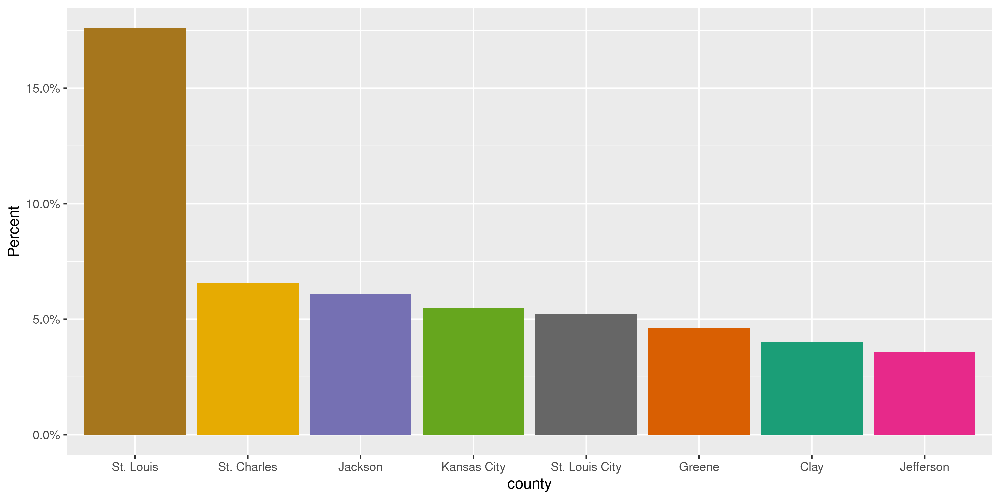
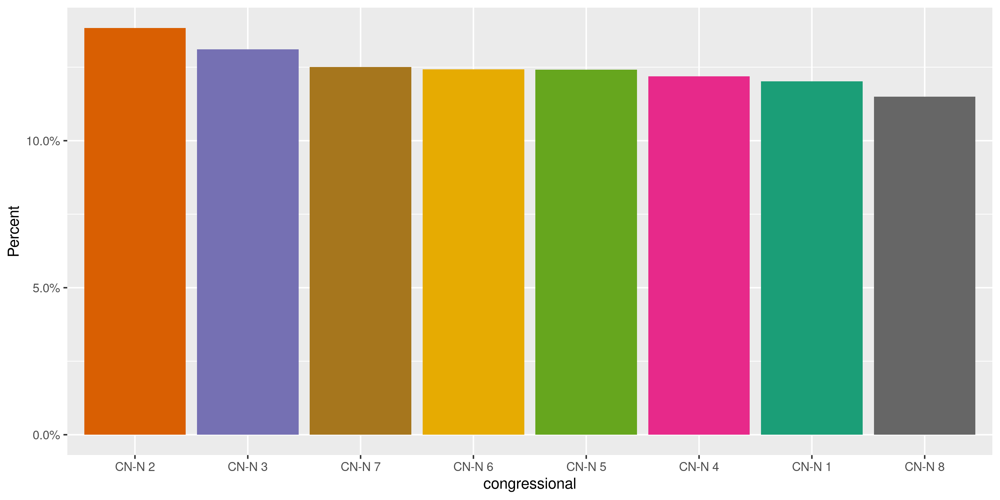
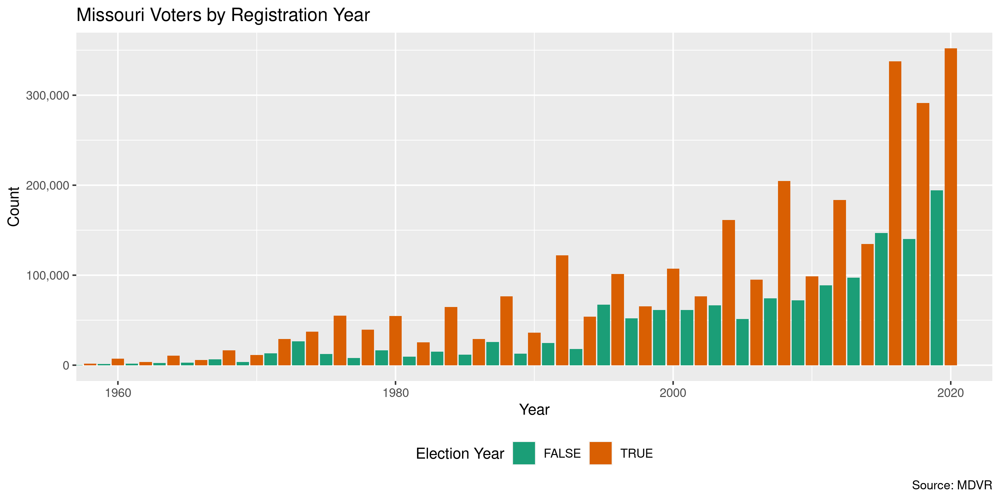

Missouri Voters
================
Kiernan Nicholls
2020-10-23 12:38:14

  - [Project](#project)
  - [Objectives](#objectives)
  - [Packages](#packages)
  - [Data](#data)
  - [Read](#read)
  - [Explore](#explore)
      - [Missing](#missing)
      - [Duplicates](#duplicates)
      - [Categorical](#categorical)
      - [Dates](#dates)
  - [Wrangle](#wrangle)
      - [Address](#address)
      - [ZIP](#zip)
      - [State](#state)
      - [City](#city)
  - [Conclude](#conclude)
  - [Export](#export)
  - [Upload](#upload)
  - [Dictionary](#dictionary)

<!-- Place comments regarding knitting here -->

## Project

The Accountability Project is an effort to cut across data silos and
give journalists, policy professionals, activists, and the public at
large a simple way to search across huge volumes of public data about
people and organizations.

Our goal is to standardizing public data on a few key fields by thinking
of each dataset row as a transaction. For each transaction there should
be (at least) 3 variables:

1.  All **parties** to a transaction.
2.  The **date** of the transaction.
3.  The **amount** of money involved.

## Objectives

This document describes the process used to complete the following
objectives:

1.  How many records are in the database?
2.  Check for entirely duplicated records.
3.  Check ranges of continuous variables.
4.  Is there anything blank or missing?
5.  Check for consistency issues.
6.  Create a five-digit ZIP Code called `zip`.
7.  Create a `year` field from the transaction date.
8.  Make sure there is data on both parties to a transaction.

## Packages

The following packages are needed to collect, manipulate, visualize,
analyze, and communicate these results. The `pacman` package will
facilitate their installation and attachment.

The IRW’s `campfin` package will also have to be installed from GitHub.
This package contains functions custom made to help facilitate the
processing of campaign finance data.

``` r
if (!require("pacman")) install.packages("pacman")
pacman::p_load_gh("irworkshop/campfin")
pacman::p_load(
  tidyverse, # data manipulation
  lubridate, # datetime strings
  gluedown, # printing markdown
  magrittr, # pipe operators
  janitor, # clean data frames
  aws.s3, # upload to aws s3
  refinr, # cluster and merge
  scales, # format strings
  knitr, # knit documents
  vroom, # read files fast
  rvest, # html scraping
  glue, # combine strings
  here, # relative paths
  httr, # http requests
  fs # local storage 
)
```

This document should be run as part of the `R_campfin` project, which
lives as a sub-directory of the more general, language-agnostic
[`irworkshop/accountability_datacleaning`](https://github.com/irworkshop/accountability_datacleaning)
GitHub repository.

The `R_campfin` project uses the [RStudio
projects](https://support.rstudio.com/hc/en-us/articles/200526207-Using-Projects)
feature and should be run as such. The project also uses the dynamic
`here::here()` tool for file paths relative to *your* machine.

``` r
# where does this document knit?
here::here()
#> [1] "/home/kiernan/Code/tap/R_campfin"
```

## Data

Missouri Centralized Voter Registration (MCVR) data was obtained as an
open record pursuant to Section 115.157, RSMo. from the Elections
Division, Office of Secretary of State.

The MCVR data was provided as a ZIP archive through a file sharing site.

``` r
raw_dir <- dir_create(here("mo", "voters", "data", "raw"))
raw_zip <- path(raw_dir, "Files.zip")
raw_out <- as_fs_path(unzip(raw_zip, exdir = raw_dir))
```

The archive contains a README file to explain the data:

> State law requires that certain statewide voter registration data be
> made available to the public. To avoid requiring that recipients of
> this data have specific software, the data is provided in
> tab-delimited text format. Tab-delimited data is readily importable to
> applications that provide data manipulation capabilities (such as
> database software). Due to the size of the file a simple text editor
> such as Notepad may not be able to open the file.

The README also contains a disclaimer:

> This file contains voter registration information inputted by the
> local election authorities in the state of Missouri. While the
> Missouri Secretary of State’s office makes all reasonable efforts to
> ensure the accuracy of information contained in this file, it is
> dependent on information provided by local election authorities.

And a record layout describing the columns of the file:

``` r
readme[31:83] %>% 
  str_replace("(?<=\\d)  ", "\t") %>% 
  str_replace("\t{2,}", "\t") %>% 
  read_tsv(col_names = c("Position", "Name", "Description")) %>% 
  mutate(across(Name, md_code)) %>% 
  select(-Position) %>% 
  kable()
```

| Name                   | Description                                                                |
| :--------------------- | :------------------------------------------------------------------------- |
| `County`               | Local Jurisdiction Name                                                    |
| `Voter ID`             | Identification Number                                                      |
| `First Name`           | First Name                                                                 |
| `Middle Name`          | Middle Name                                                                |
| `Last Name`            | Last Name                                                                  |
| `Suffix`               | Name Suffix (e.g. Jr. III, etc.)                                           |
| `House Number`         | Residence Address House Number                                             |
| `House Suffix`         | Residence Address House Number Suffix (e.g. 1/2, A, etc.)                  |
| `Pre Direction`        | Residence Address Street Direction (e.g. the “E” in E Main St)             |
| `Street Name`          | Residence Address Street                                                   |
| `Street Type`          | Residence Address Type of Street (e.g. Ave, Blvd, etc.)                    |
| `Post Direction`       | Residence Address Street Post Dir. (e.g. the “NE” in Main St NE)           |
| `Unit Type`            | Residence Address Type of Unit (e.g. Apt, Suite, Lot, etc.)                |
| `Unit Number`          | Residence Address Unit Number (e.g. the “6” in Apt 6)                      |
| `Non Standard Address` | Used if Residence Address is not regular format (e.g. Rural Route)         |
| `Residential City`     | Residence Address City                                                     |
| `Residential State`    | Residential Address State                                                  |
| `Residential ZipCode`  | Residence Address Zip Code                                                 |
| `Mailing Address`      | Mailing Address (P.O. Box, etc.)                                           |
| `Mailing City`         | Mailing City                                                               |
| `Mailing State`        | Mailing State                                                              |
| `Mailing ZipCode`      | Mailing ZipCode                                                            |
| `Birthdate`            | Birthdate                                                                  |
| `Registration Date`    | Date Voter Registered in the Current County                                |
| `Precinct`             | Precinct Identifier                                                        |
| `Precinct Name`        | Full Name of the Precinct                                                  |
| `Split`                | Split code (the specific combination of districts that include this voter) |
| `Township`             | Township                                                                   |
| `Ward`                 | Ward                                                                       |
| `Congressional - New`  | Congressional District Code after 2011 Redistricting                       |
| `Legislative - New`    | State House District Code after 2011 Redistricting                         |
| `State Senate - New`   | State Senate District Code after 2011 Redistricting                        |
| `Status`               | Voter Status                                                               |
| `Voter History 1`      | Voter History (most recently voted-in Election Date and Election Name)     |
| `Voter History 2`      | Voter History (next most recent Election Date and Election Name)           |
| `Voter History 3`      | Voter History (Election Date and Election Name)                            |
| `Voter History 4`      | Voter History (Election Date and Election Name)                            |
| `Voter History 5`      | Voter History (Election Date and Election Name)                            |
| `Voter History 6`      | Voter History (Election Date and Election Name)                            |
| `Voter History 7`      | Voter History (Election Date and Election Name)                            |
| `Voter History 8`      | Voter History (Election Date and Election Name)                            |
| `Voter History 9`      | Voter History (Election Date and Election Name)                            |
| `Voter History 10`     | Voter History (Election Date and Election Name)                            |
| `Voter History 11`     | Voter History (Election Date and Election Name)                            |
| `Voter History 12`     | Voter History (Election Date and Election Name)                            |
| `Voter History 13`     | Voter History (Election Date and Election Name)                            |
| `Voter History 14`     | Voter History (Election Date and Election Name)                            |
| `Voter History 15`     | Voter History (Election Date and Election Name)                            |
| `Voter History 16`     | Voter History (Election Date and Election Name)                            |
| `Voter History 17`     | Voter History (Election Date and Election Name)                            |
| `Voter History 18`     | Voter History (Election Date and Election Name)                            |
| `Voter History 19`     | Voter History (Election Date and Election Name)                            |
| `Voter History 20`     | Voter History (Election Date and Election Name)                            |

## Read

We can read the tab-delimited file as a dataframe.

``` r
mov <- read_delim(
  file = raw_out[1],
  delim = "\t",
  escape_backslash = FALSE,
  escape_double = FALSE,
  na = c("", "NA", "XXXXX"),
  col_types = cols(
    .default = col_character(),
    Birthdate = col_date_usa(),
    `Registration Date` = col_date_usa()
  )
)
```

There are 20 columns at the end of the dataframe containing all of the
past elections in which each person has voted. We are going to keep the
most recent election and then save all the columns as a separate data
frame. This data frame will be kept in a *long* format, with a row for
every election.

``` r
hist_file <- path(dirname(raw_dir), "vote_history.csv")
if (file_exists(hist_file)) {
  vote_hist <- vroom(
    file = hist_file,
    col_types = cols(
      voter_id = col_character(),
      order = col_integer(),
      date = col_date(),
      election = col_character()
    )
  )
} else {
  vote_hist <- select(mov, `Voter ID`, starts_with("Voter History"))
  vote_hist <- pivot_longer(
    data = vote_hist,
    cols = starts_with("Voter History"),
    names_to = "order",
    values_to = "election"
  )
  vote_hist <- vote_hist %>% 
    clean_names("snake") %>% 
    filter(!is.na(election))
  vote_hist <- separate(
    data = vote_hist,
    col = election,
    sep = "(?<=\\d)\\s",
    into = c("date", "election")
  )
  vote_hist <- mutate(
    .data = vote_hist,
    order = as.integer(str_extract(order, "\\d+")),
    date = parse_date(date, "%m/%d/%Y")
  )
  write_csv(
    x = vote_hist,
    path = hist_file
  )
}
```

We can then remove the election columns.

``` r
mov <- rename(mov, `Last Election` = `Voter History 1`)
mov <- select(mov, -starts_with("Voter History"))
```

``` r
mov <- clean_names(mov, "snake")
```

``` r
mov <- mov %>% 
  rename_all(str_remove, "residential_") %>% 
  rename_all(str_remove, "_new") %>% 
  rename(
    zip = zip_code,
    birth_date = birthdate,
    reg_date = registration_date
  )
```

## Explore

There are 4,287,158 rows of 34 columns.

``` r
glimpse(mov)
#> Rows: 4,287,158
#> Columns: 34
#> $ county               <chr> "Adair", "Adair", "Adair", "Adair", "Adair", "Adair", "Adair", "Ada…
#> $ voter_id             <chr> "751417626", "460039164", "23351760", "750155978", "23351765", "750…
#> $ first_name           <chr> "CHRISTIAN", "MIRANDA", "DIANA", "TRACY", "ROBIN", "LEONNA", "ROGER…
#> $ middle_name          <chr> "MESHACK", "KAY", "L", "LYNN", "M", "R", "L", "BETH", "AVERY", "MAR…
#> $ last_name            <chr> "HATALA", "ABERNATHY", "REYNOLDS", "REYNOLDS", "SACK", "ALTER", "CA…
#> $ suffix               <chr> NA, NA, NA, NA, NA, NA, NA, NA, NA, NA, NA, NA, NA, NA, NA, NA, NA,…
#> $ house_number         <chr> "906", "304", "24183", "24183", "24294", "1512", "1512", "9", "9", …
#> $ house_suffix         <chr> NA, NA, NA, NA, NA, NA, NA, NA, NA, NA, NA, NA, NA, NA, NA, NA, NA,…
#> $ pre_direction        <chr> "E", "E", NA, NA, NA, NA, NA, NA, NA, NA, NA, NA, NA, NA, "S", NA, …
#> $ street_name          <chr> "WASHINGTON", "BURTON", "STATE HWY 3", "STATE HWY 3", "STATE HWY V"…
#> $ street_type          <chr> "ST", "ST", NA, NA, NA, "DR", "DR", NA, NA, NA, NA, NA, "TRL", "DR"…
#> $ post_direction       <chr> NA, NA, NA, NA, NA, NA, NA, NA, NA, NA, NA, NA, NA, NA, NA, NA, NA,…
#> $ unit_type            <chr> NA, NA, NA, NA, NA, NA, NA, NA, NA, NA, NA, NA, NA, NA, NA, NA, NA,…
#> $ unit_number          <chr> NA, NA, NA, NA, NA, NA, NA, NA, NA, NA, NA, NA, NA, NA, NA, NA, NA,…
#> $ non_standard_address <chr> NA, NA, NA, NA, NA, NA, NA, NA, NA, NA, NA, NA, NA, NA, NA, NA, NA,…
#> $ city                 <chr> "KIRKSVILLE", "KIRKSVILLE", "KIRKSVILLE", "KIRKSVILLE", "BRASHEAR",…
#> $ state                <chr> "MO", "MO", "MO", "MO", "MO", "MO", "MO", "MO", "MO", "MO", "MO", "…
#> $ zip                  <chr> "63501", "63501", "63501", "63501", "63533", "63501", "63501", "635…
#> $ mailing_address      <chr> NA, NA, NA, "1200 SANTA LUCIA RD", NA, NA, NA, NA, NA, NA, NA, NA, …
#> $ mailing_city         <chr> NA, NA, NA, "CHULA VISTA", NA, NA, NA, NA, NA, NA, NA, NA, NA, NA, …
#> $ mailing_state        <chr> NA, NA, NA, "CA", NA, NA, NA, NA, NA, NA, NA, NA, NA, NA, NA, "MO",…
#> $ mailing_zip_code     <chr> NA, NA, NA, "91913", NA, NA, NA, NA, NA, NA, NA, NA, NA, NA, NA, "6…
#> $ birth_date           <date> 1996-08-28, 1985-11-24, 1946-10-13, 1976-12-16, 1955-03-09, 1958-0…
#> $ reg_date             <date> 2015-12-14, 2006-03-08, 1980-04-21, 2007-07-10, 1990-10-15, 2010-0…
#> $ precinct             <chr> "104", "105", "108", "108", "809", "102", "102", "102", "102", "102…
#> $ precinct_name        <chr> "NORTHEAST FOUR/BENTON", "NORTHEAST FIVE/BENTON", "RURAL BENTON/BEN…
#> $ split                <chr> "01", "01", "04", "04", "01", "01", "01", "01", "01", "01", "01", "…
#> $ township             <chr> "BENTON TOWNSHIP", "BENTON TOWNSHIP", "BENTON TOWNSHIP", "BENTON TO…
#> $ ward                 <chr> NA, NA, NA, NA, NA, NA, NA, NA, NA, NA, NA, NA, NA, NA, NA, NA, NA,…
#> $ congressional        <chr> "CN-N 6", "CN-N 6", "CN-N 6", "CN-N 6", "CN-N 6", "CN-N 6", "CN-N 6…
#> $ legislative          <chr> "LE-N 003", "LE-N 003", "LE-N 004", "LE-N 004", "LE-N 004", "LE-N 0…
#> $ state_senate         <chr> "SE-N 18", "SE-N 18", "SE-N 18", "SE-N 18", "SE-N 18", "SE-N 18", "…
#> $ voter_status         <chr> "Active", "Active", "Active", "Inactive", "Active", "Active", "Acti…
#> $ last_election        <chr> "08/04/2020 Primary", "11/06/2018 General", "08/04/2020 Primary", "…
tail(mov)
#> # A tibble: 6 x 34
#>   county voter_id first_name middle_name last_name suffix house_number house_suffix pre_direction
#>   <chr>  <chr>    <chr>      <chr>       <chr>     <chr>  <chr>        <chr>        <chr>        
#> 1 Wright 7509164… KELLIS     JAMES       PARKER    <NA>   7630         <NA>         <NA>         
#> 2 Wright 7509423… CALLIE     ANNETTE     PARKER    <NA>   7630         <NA>         <NA>         
#> 3 Wright 7508389… BRITTANY   D           GRAVES    <NA>   10003        <NA>         <NA>         
#> 4 Wright 7520673… MARTHA     <NA>        RILEY     <NA>   2603         <NA>         <NA>         
#> 5 Wright 7520733… ELIZABETH  ANN         DANIS     <NA>   2603         <NA>         <NA>         
#> 6 Wright 37896817 BRIAN      MICHAEL     JARRETT   <NA>   1169         <NA>         N            
#> # … with 25 more variables: street_name <chr>, street_type <chr>, post_direction <chr>,
#> #   unit_type <chr>, unit_number <chr>, non_standard_address <chr>, city <chr>, state <chr>,
#> #   zip <chr>, mailing_address <chr>, mailing_city <chr>, mailing_state <chr>,
#> #   mailing_zip_code <chr>, birth_date <date>, reg_date <date>, precinct <chr>,
#> #   precinct_name <chr>, split <chr>, township <chr>, ward <chr>, congressional <chr>,
#> #   legislative <chr>, state_senate <chr>, voter_status <chr>, last_election <chr>
```

### Missing

Columns vary in their degree of missing values.

``` r
col_stats(mov, count_na)
#> # A tibble: 34 x 4
#>    col                  class        n           p
#>    <chr>                <chr>    <int>       <dbl>
#>  1 county               <chr>        0 0          
#>  2 voter_id             <chr>        0 0          
#>  3 first_name           <chr>       39 0.00000910 
#>  4 middle_name          <chr>   396044 0.0924     
#>  5 last_name            <chr>        8 0.00000187 
#>  6 suffix               <chr>  4131626 0.964      
#>  7 house_number         <chr>    48649 0.0113     
#>  8 house_suffix         <chr>  4274838 0.997      
#>  9 pre_direction        <chr>  2992154 0.698      
#> 10 street_name          <chr>    48674 0.0114     
#> 11 street_type          <chr>   564690 0.132      
#> 12 post_direction       <chr>  4253027 0.992      
#> 13 unit_type            <chr>  3888491 0.907      
#> 14 unit_number          <chr>  3888505 0.907      
#> 15 non_standard_address <chr>  4237847 0.988      
#> 16 city                 <chr>      917 0.000214   
#> 17 state                <chr>      934 0.000218   
#> 18 zip                  <chr>      917 0.000214   
#> 19 mailing_address      <chr>  4027217 0.939      
#> 20 mailing_city         <chr>  4032480 0.941      
#> 21 mailing_state        <chr>  4032670 0.941      
#> 22 mailing_zip_code     <chr>  4032656 0.941      
#> 23 birth_date           <date>       2 0.000000467
#> 24 reg_date             <date>       0 0          
#> 25 precinct             <chr>      917 0.000214   
#> 26 precinct_name        <chr>      917 0.000214   
#> 27 split                <chr>      917 0.000214   
#> 28 township             <chr>   932651 0.218      
#> 29 ward                 <chr>  1786234 0.417      
#> 30 congressional        <chr>        2 0.000000467
#> 31 legislative          <chr>       15 0.00000350 
#> 32 state_senate         <chr>       10 0.00000233 
#> 33 voter_status         <chr>        0 0          
#> 34 last_election        <chr>   746449 0.174
```

No records are missing a name or registration date.

### Duplicates

We can also flag any record completely duplicated across every column.

``` r
voter_ids <- mov$voter_id
mov <- select(mov, -voter_id)
d1 <- duplicated(mov, fromLast = FALSE)
d2 <- duplicated(mov, fromLast = TRUE)
mov <- mov %>% 
  mutate(voter_id = voter_ids, .before = first_name) %>% 
  mutate(dupe_flag = d1 | d2)
```

``` r
percent(mean(mov$dupe_flag), 0.001)
#> [1] "0.001%"
mov %>% 
  filter(dupe_flag) %>% 
  select(voter_id, first_name, last_name, birth_date, reg_date)
#> # A tibble: 63 x 5
#>    voter_id  first_name last_name birth_date reg_date  
#>    <chr>     <chr>      <chr>     <date>     <date>    
#>  1 750534633 TREISHA    STRINGER  1990-12-06 2020-02-18
#>  2 752044678 TREISHA    STRINGER  1990-12-06 2020-02-18
#>  3 752173868 ETINOSA    OMOROGBE  1998-10-21 2020-09-21
#>  4 752173869 ETINOSA    OMOROGBE  1998-10-21 2020-09-21
#>  5 752033376 TERI       TURNBULL  1961-01-11 2020-02-10
#>  6 752033377 TERI       TURNBULL  1961-01-11 2020-02-10
#>  7 752125335 JANESSA    STEWART   1999-10-10 2020-08-07
#>  8 752125334 JANESSA    STEWART   1999-10-10 2020-08-07
#>  9 752140371 NATHANIEL  SKOW      1977-11-03 2020-08-21
#> 10 752140368 NATHANIEL  SKOW      1977-11-03 2020-08-21
#> # … with 53 more rows
```

### Categorical

``` r
col_stats(mov, n_distinct)
#> # A tibble: 35 x 4
#>    col                  class        n           p
#>    <chr>                <chr>    <int>       <dbl>
#>  1 county               <chr>      116 0.0000271  
#>  2 voter_id             <chr>  4287158 1          
#>  3 first_name           <chr>   137322 0.0320     
#>  4 middle_name          <chr>   122506 0.0286     
#>  5 last_name            <chr>   223886 0.0522     
#>  6 suffix               <chr>     1089 0.000254   
#>  7 house_number         <chr>    41870 0.00977    
#>  8 house_suffix         <chr>      127 0.0000296  
#>  9 pre_direction        <chr>        9 0.00000210 
#> 10 street_name          <chr>    55301 0.0129     
#> 11 street_type          <chr>      114 0.0000266  
#> 12 post_direction       <chr>        9 0.00000210 
#> 13 unit_type            <chr>       32 0.00000746 
#> 14 unit_number          <chr>    15776 0.00368    
#> 15 non_standard_address <chr>    33471 0.00781    
#> 16 city                 <chr>      997 0.000233   
#> 17 state                <chr>        3 0.000000700
#> 18 zip                  <chr>    78023 0.0182     
#> 19 mailing_address      <chr>   114502 0.0267     
#> 20 mailing_city         <chr>     3824 0.000892   
#> 21 mailing_state        <chr>       61 0.0000142  
#> 22 mailing_zip_code     <chr>     5691 0.00133    
#> 23 birth_date           <date>   31480 0.00734    
#> 24 reg_date             <date>   23609 0.00551    
#> 25 precinct             <chr>      903 0.000211   
#> 26 precinct_name        <chr>     2758 0.000643   
#> 27 split                <chr>     1817 0.000424   
#> 28 township             <chr>     1123 0.000262   
#> 29 ward                 <chr>      960 0.000224   
#> 30 congressional        <chr>       10 0.00000233 
#> 31 legislative          <chr>      165 0.0000385  
#> 32 state_senate         <chr>       36 0.00000840 
#> 33 voter_status         <chr>        3 0.000000700
#> 34 last_election        <chr>      551 0.000129   
#> 35 dupe_flag            <lgl>        2 0.000000467
```

<!-- --><!-- --><!-- --><!-- -->

### Dates

We can add the calendar year from `date` with `lubridate::year()`

``` r
mov <- mutate(mov, reg_year = year(reg_date))
```

``` r
min(mov$reg_date)
#> [1] "101-07-16"
sum(mov$reg_year < 2000)
#> [1] 1252084
max(mov$reg_date)
#> [1] "2020-10-05"
sum(mov$reg_date > today())
#> [1] 0
```

<!-- -->

## Wrangle

To improve the searchability of the database, we will perform some
consistent, confident string normalization. For geographic variables
like city names and ZIP codes, the corresponding `campfin::normal_*()`
functions are tailor made to facilitate this process.

### Address

We can create a single, unified normalized address field.

``` r
mov <- mov %>% 
  unite(
    col = address_norm,
    house_number:non_standard_address,
    sep = " ",
    na.rm = TRUE,
    remove = FALSE
  ) %>% 
  relocate(address_norm, .after = last_col())
```

``` r
mov %>% 
  select(house_number:non_standard_address, address_norm) %>% 
  sample_n(20) %>% 
  remove_empty("cols")
#> # A tibble: 20 x 7
#>    house_number pre_direction street_name     street_type unit_type unit_number address_norm       
#>    <chr>        <chr>         <chr>           <chr>       <chr>     <chr>       <chr>              
#>  1 5414         <NA>          VILLAGE COURTW… LN          <NA>      <NA>        5414 VILLAGE COURT…
#>  2 3962         <NA>          HIGHWAY JJ      <NA>        <NA>      <NA>        3962 HIGHWAY JJ    
#>  3 4105         <NA>          DERBY RIDGE     DR          <NA>      <NA>        4105 DERBY RIDGE DR
#>  4 3582         <NA>          LAKEVIEW HEIGH… DR          <NA>      <NA>        3582 LAKEVIEW HEIG…
#>  5 625          <NA>          CHELSEA         AVE         <NA>      <NA>        625 CHELSEA AVE    
#>  6 901          E             PEAR            AVE         <NA>      <NA>        901 E PEAR AVE     
#>  7 1901         <NA>          CAIRO           DR          <NA>      <NA>        1901 CAIRO DR      
#>  8 9231         <NA>          OLD BONHOMME    RD          <NA>      <NA>        9231 OLD BONHOMME …
#>  9 704          <NA>          HEDGEWOOD       CT          <NA>      <NA>        704 HEDGEWOOD CT   
#> 10 2407         S             OVERTON         AVE         <NA>      <NA>        2407 S OVERTON AVE 
#> 11 904          <NA>          MASON           ST          <NA>      <NA>        904 MASON ST       
#> 12 2404         E             MECHANIC        ST          APT       31          2404 E MECHANIC ST…
#> 13 5919         <NA>          PAMPLIN         PL          <NA>      <NA>        5919 PAMPLIN PL    
#> 14 2334         SW            RIVER TRAIL     RD          <NA>      <NA>        2334 SW RIVER TRAI…
#> 15 13720        <NA>          MASON GREEN     CT          <NA>      <NA>        13720 MASON GREEN …
#> 16 519          <NA>          TIMBER          DR          APT       B           519 TIMBER DR APT B
#> 17 1407         <NA>          HIGHWAY 19      <NA>        <NA>      <NA>        1407 HIGHWAY 19    
#> 18 3510         <NA>          BROWNING        AVE         <NA>      <NA>        3510 BROWNING AVE  
#> 19 16037        E             828             RD          <NA>      <NA>        16037 E 828 RD     
#> 20 1109         <NA>          ELSDON          DR          <NA>      <NA>        1109 ELSDON DR
```

### ZIP

For ZIP codes, the `campfin::normal_zip()` function will attempt to
create valid *five* digit codes by removing the ZIP+4 suffix and
returning leading zeroes dropped by other programs like Microsoft Excel.

``` r
mov <- mov %>% 
  mutate(
    zip_norm = normal_zip(
      zip = zip,
      na_rep = TRUE
    )
  )
```

``` r
progress_table(
  mov$zip,
  mov$zip_norm,
  compare = valid_zip
)
#> # A tibble: 2 x 6
#>   stage    prop_in n_distinct  prop_na  n_out n_diff
#>   <chr>      <dbl>      <dbl>    <dbl>  <dbl>  <dbl>
#> 1 zip        0.922      78023 0.000214 333636  76967
#> 2 zip_norm   1.00        1060 0.000215    477      4
```

### State

As we would expect, all the Missouri voters live in Missouri.

``` r
count(mov, state, sort = TRUE)
#> # A tibble: 3 x 2
#>   state          n
#>   <chr>      <int>
#> 1 MO       4286223
#> 2 <NA>         934
#> 3 O FALLON       1
```

### City

Cities are the most difficult geographic variable to normalize, simply
due to the wide variety of valid cities and formats.

#### Normal

The `campfin::normal_city()` function is a good start, again converting
case, removing punctuation, but *expanding* USPS abbreviations. We can
also remove `invalid_city` values.

``` r
mov <- mov %>% 
  mutate(
    city_norm = normal_city(
      city = city, 
      abbs = usps_city,
      states = c("MO", "DC", "MISSOURI"),
      na = invalid_city,
      na_rep = TRUE
    )
  )
```

#### Swap

We can further improve normalization by comparing our normalized value
against the *expected* value for that record’s state abbreviation and
ZIP code. If the normalized value is either an abbreviation for or very
similar to the expected value, we can confidently swap those two.

``` r
mov <- mov %>% 
  rename(city_raw = city) %>% 
  left_join(
    y = zipcodes,
    by = c("state", "zip_norm" = "zip")
  ) %>% 
  rename(city_match = city) %>% 
  mutate(
    match_abb = is_abbrev(city_norm, city_match),
    match_dist = str_dist(city_norm, city_match),
    city_swap = if_else(
      condition = !is.na(match_dist) & (match_abb | match_dist == 1),
      true = city_match,
      false = city_norm
    )
  ) %>% 
  select(
    -city_match,
    -match_dist,
    -match_abb
  )
```

#### Refine

The [OpenRefine](https://openrefine.org/) algorithms can be used to
group similar strings and replace the less common versions with their
most common counterpart. This can greatly reduce inconsistency, but with
low confidence; we will only keep any refined strings that have a valid
city/state/zip combination.

``` r
good_refine <- mov %>% 
  mutate(
    city_refine = city_swap %>% 
      key_collision_merge() %>% 
      n_gram_merge(numgram = 1)
  ) %>% 
  filter(city_refine != city_swap) %>% 
  inner_join(
    y = zipcodes,
    by = c(
      "city_refine" = "city",
      "state",
      "zip_norm" = "zip"
    )
  )
```

    #> # A tibble: 0 x 5
    #> # … with 5 variables: state <chr>, zip_norm <chr>, city_swap <chr>, city_refine <chr>, n <int>

Then we can join the refined values back to the database.

``` r
mov <- mov %>% 
  left_join(good_refine) %>% 
  mutate(city_refine = coalesce(city_refine, city_swap))
```

#### Progress

Our goal for normalization was to increase the proportion of city values
known to be valid and reduce the total distinct values by correcting
misspellings.

| stage        | prop\_in | n\_distinct | prop\_na | n\_out | n\_diff |
| :----------- | -------: | ----------: | -------: | -----: | ------: |
| city\_raw)   |    0.778 |         997 |        0 | 950839 |      56 |
| city\_norm   |    0.996 |         997 |        0 |  17850 |      40 |
| city\_swap   |    0.998 |         995 |        0 |   9204 |      35 |
| city\_refine |    0.998 |         995 |        0 |   9204 |      35 |

You can see how the percentage of valid values increased with each
stage.

<!-- -->

More importantly, the number of distinct values decreased each stage. We
were able to confidently change many distinct invalid values to their
valid equivalent.

<!-- -->

## Conclude

Before exporting, we can remove the intermediary normalization columns
and rename all added variables with the `_clean` suffix.

``` r
mov <- mov %>% 
  select(
    -city_norm,
    -city_swap,
    city_clean = city_refine
  ) %>% 
  rename_all(~str_replace(., "_norm", "_clean")) %>% 
  rename_all(~str_remove(., "_raw"))
```

``` r
glimpse(sample_n(mov, 50))
#> Rows: 50
#> Columns: 39
#> $ county               <chr> "Jefferson", "Boone", "Pettis", "Gentry", "St. Louis City", "Greene…
#> $ voter_id             <chr> "13134337", "4628917", "15544030", "750441438", "751358182", "75058…
#> $ first_name           <chr> "KACI", "JOHNNY", "JULIE", "CINDY", "TAYLOR", "RACHEAL", "JONATHAN"…
#> $ middle_name          <chr> "JEAN", NA, "A", "S", "ANISE", "LEAH", "S", "JOE", NA, "P", "L", "F…
#> $ last_name            <chr> "DIXON", "WILLIAMS", "WASSON", "COCHRAN", "BAKER", "BEASLEY", "DAVI…
#> $ suffix               <chr> NA, NA, NA, NA, NA, NA, NA, NA, NA, NA, "JR", NA, NA, NA, NA, "MS",…
#> $ house_number         <chr> "1824", NA, "1205", "307", "3032", "1717", "5039", "1026", "423", "…
#> $ house_suffix         <chr> NA, NA, NA, NA, NA, NA, NA, NA, NA, NA, NA, NA, NA, NA, NA, NA, NA,…
#> $ pre_direction        <chr> NA, NA, NA, NA, NA, "E", NA, NA, "W", NA, NA, "S", NA, "E", NA, NA,…
#> $ street_name          <chr> "WEST", NA, "ELM HILLS", "3 RD.ST", "W NORWOOD", "PRIMROSE", "DURAN…
#> $ street_type          <chr> "DR", NA, "BLVD", NA, "DR", "ST", "AVE", "DR", "ST", "ST", "PL", "A…
#> $ post_direction       <chr> NA, NA, NA, NA, NA, NA, NA, NA, NA, NA, NA, NA, NA, NA, NA, NA, NA,…
#> $ unit_type            <chr> NA, NA, NA, NA, NA, "APT", NA, NA, NA, NA, "APT", NA, NA, NA, NA, N…
#> $ unit_number          <chr> NA, NA, NA, NA, NA, "F-109", NA, NA, NA, NA, "A", NA, NA, NA, NA, N…
#> $ non_standard_address <chr> NA, "901 WILKES BLVD", NA, NA, NA, NA, NA, NA, NA, NA, NA, NA, NA, …
#> $ city                 <chr> "HIGH RIDGE", "COLUMBIA", "SEDALIA", "KING CITY", "ST LOUIS", "SPRI…
#> $ state                <chr> "MO", "MO", "MO", "MO", "MO", "MO", "MO", "MO", "MO", "MO", "MO", "…
#> $ zip                  <chr> "63049", "65201-0", "65301", "64463", "63115", "65804", "63115", "6…
#> $ mailing_address      <chr> NA, "PO BOX 10065", NA, NA, NA, NA, NA, NA, NA, NA, NA, NA, NA, NA,…
#> $ mailing_city         <chr> NA, "COLUMBIA", NA, NA, NA, NA, NA, NA, NA, NA, NA, NA, NA, NA, NA,…
#> $ mailing_state        <chr> NA, "MO", NA, NA, NA, NA, NA, NA, NA, NA, NA, NA, NA, NA, NA, NA, N…
#> $ mailing_zip_code     <chr> NA, "65205", NA, NA, NA, NA, NA, NA, NA, NA, NA, NA, NA, NA, NA, NA…
#> $ birth_date           <date> 1975-06-29, 1957-05-31, 1968-12-27, 1962-05-25, 1997-06-09, 1991-0…
#> $ reg_date             <date> 2004-09-01, 2007-03-27, 2000-07-17, 2008-10-08, 2015-06-09, 2016-0…
#> $ precinct             <chr> "71.A", "1A", "47", "9", "01", "411", "01", "5B", "03", "14", "04",…
#> $ precinct_name        <chr> "71.A Brennan", "1A", "SEDALIA WEST", "JACKSON EAST", "WARD 01", "4…
#> $ split                <chr> "01", "1A3", "03", "01", "02", "01", "03", "01", "01", "06", "06", …
#> $ township             <chr> "Rock Township", "MISSOURI", "SEDALIA WEST", "JACKSON TOWNSHIP", NA…
#> $ ward                 <chr> NA, "WD 01", NA, "KCEW", "0001", "ZN 4", "0001", "WD 05", NA, "0014…
#> $ congressional        <chr> "CN-N 2", "CN-N 4", "CN-N 4", "CN-N 6", "CN-N 1", "CN-N 7", "CN-N 1…
#> $ legislative          <chr> "LE-N 097", "LE-N 045", "LE-N 052", "LE-N 002", "LE-N 076", "LE-N 1…
#> $ state_senate         <chr> "SE-N 22", "SE-N 19", "SE-N 28", "SE-N 12", "SE-N 04", "SE-N 30", "…
#> $ voter_status         <chr> "Active", "Inactive", "Active", "Active", "Active", "Inactive", "Ac…
#> $ last_election        <chr> "11/06/2018 General", NA, "08/04/2020 Primary", "08/04/2020 Primary…
#> $ dupe_flag            <lgl> FALSE, FALSE, FALSE, FALSE, FALSE, FALSE, FALSE, FALSE, FALSE, FALS…
#> $ reg_year             <dbl> 2004, 2007, 2000, 2008, 2015, 2016, 2016, 1986, 1999, 2014, 2012, 2…
#> $ address_clean        <chr> "1824 WEST DR", "901 WILKES BLVD", "1205 ELM HILLS BLVD", "307 3 RD…
#> $ zip_clean            <chr> "63049", "65201", "65301", "64463", "63115", "65804", "63115", "637…
#> $ city_clean           <chr> "HIGH RIDGE", "COLUMBIA", "SEDALIA", "KING CITY", "SAINT LOUIS", "S…
```

1.  There are 4,287,158 records in the database.
2.  There are 63 duplicate records in the database.
3.  The range and distribution of `amount` and `date` seem reasonable.
4.  There are 0 records missing key variables.
5.  Consistency in geographic data has been improved with
    `campfin::normal_*()`.
6.  The 4-digit `year` variable has been created with
    `lubridate::year()`.

## Export

Now the file can be saved on disk for upload to the Accountability
server.

``` r
clean_dir <- dir_create(here("mo", "voters", "data", "clean"))
clean_path <- path(clean_dir, "mo_voters.csv")
write_csv(mov, clean_path, na = "")
(clean_size <- file_size(clean_path))
#> 981M
file_encoding(clean_path) %>% 
  mutate(across(path, path.abbrev))
#> # A tibble: 1 x 3
#>   path                                 mime            charset
#>   <chr>                                <chr>           <chr>  
#> 1 ~/mo/voters/data/clean/mo_voters.csv application/csv utf-8
```

## Upload

We can use the `aws.s3::put_object()` to upload the text file to the IRW
server.

``` r
aws_path <- path("csv", basename(clean_path))
if (!object_exists(aws_path, "publicaccountability")) {
  put_object(
    file = clean_path,
    object = aws_path, 
    bucket = "publicaccountability",
    acl = "public-read",
    show_progress = TRUE,
    multipart = TRUE
  )
}
aws_head <- head_object(aws_path, "publicaccountability")
(aws_size <- as_fs_bytes(attr(aws_head, "content-length")))
unname(aws_size == clean_size)
```

## Dictionary

The following table describes the variables in our final exported file:

| Column                 | Type        | Definition                       |
| :--------------------- | :---------- | :------------------------------- |
| `county`               | `character` | Voter county registered in       |
| `voter_id`             | `character` | **Unique** Voter ID              |
| `first_name`           | `character` | Voter first name                 |
| `middle_name`          | `character` | Voter middle name                |
| `last_name`            | `character` | Voter last name                  |
| `suffix`               | `character` | Voter name suffix                |
| `house_number`         | `character` | House number on street           |
| `house_suffix`         | `character` | House number suffix (letter)     |
| `pre_direction`        | `character` | Address direction prefix         |
| `street_name`          | `character` | Address street name              |
| `street_type`          | `character` | Address street type              |
| `post_direction`       | `character` | Address direction suffix         |
| `unit_type`            | `character` | Address unit type                |
| `unit_number`          | `character` | Address unit number              |
| `non_standard_address` | `character` | Non-standard full address        |
| `city`                 | `character` | Voter residential city           |
| `state`                | `character` | Voter residential state          |
| `zip`                  | `character` | Voter residential ZIP code       |
| `mailing_address`      | `character` | Mailing address full             |
| `mailing_city`         | `character` | Mailing city                     |
| `mailing_state`        | `character` | Mailing state                    |
| `mailing_zip_code`     | `character` | Mailing ZIP code                 |
| `birth_date`           | `double`    | Voter date of birth              |
| `reg_date`             | `double`    | Voter date registered            |
| `precinct`             | `character` | Precinct number                  |
| `precinct_name`        | `character` | Precinct name                    |
| `split`                | `character` | Precinct split                   |
| `township`             | `character` | Township level name              |
| `ward`                 | `character` | Ward number                      |
| `congressional`        | `character` | Congressional district           |
| `legislative`          | `character` | State legislative district       |
| `state_senate`         | `character` | State senate district            |
| `voter_status`         | `character` | Voter status (active, inactive)  |
| `last_election`        | `character` | Last election voted in           |
| `dupe_flag`            | `logical`   | Flag indicating duplicate record |
| `reg_year`             | `double`    | Year registered to vote          |
| `address_clean`        | `character` | Normalized combined address      |
| `zip_clean`            | `character` | Normalized 5-digit ZIP code      |
| `city_clean`           | `character` | Normalized city name             |
