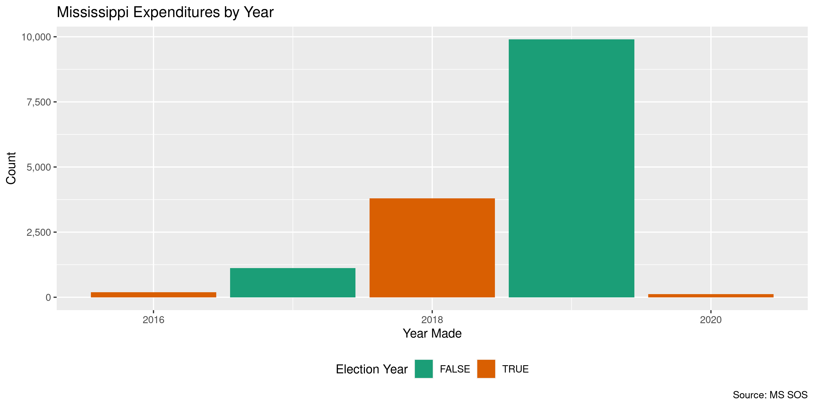

Mississippi Expenditures
================
Kiernan Nicholls
2020-08-03 10:41:43

  - [Project](#project)
  - [Objectives](#objectives)
  - [Packages](#packages)
  - [Data](#data)
  - [Download](#download)
  - [Read](#read)
  - [Explore](#explore)
  - [Conclude](#conclude)
  - [Export](#export)
  - [Upload](#upload)
  - [Dictionary](#dictionary)

<!-- Place comments regarding knitting here -->

## Project

The Accountability Project is an effort to cut across data silos and
give journalists, policy professionals, activists, and the public at
large a simple way to search across huge volumes of public data about
people and organizations.

Our goal is to standardizing public data on a few key fields by thinking
of each dataset row as a transaction. For each transaction there should
be (at least) 3 variables:

1.  All **parties** to a transaction.
2.  The **date** of the transaction.
3.  The **amount** of money involved.

## Objectives

This document describes the process used to complete the following
objectives:

1.  How many records are in the database?
2.  Check for entirely duplicated records.
3.  Check ranges of continuous variables.
4.  Is there anything blank or missing?
5.  Check for consistency issues.
6.  Create a five-digit ZIP Code called `zip`.
7.  Create a `year` field from the transaction date.
8.  Make sure there is data on both parties to a transaction.

## Packages

The following packages are needed to collect, manipulate, visualize,
analyze, and communicate these results. The `pacman` package will
facilitate their installation and attachment.

The IRW’s `campfin` package will also have to be installed from GitHub.
This package contains functions custom made to help facilitate the
processing of campaign finance data.

``` r
if (!require("pacman")) install.packages("pacman")
pacman::p_load_gh("irworkshop/campfin")
pacman::p_load(
  tidyverse, # data manipulation
  lubridate, # datetime strings
  gluedown, # printing markdown
  magrittr, # pipe operators
  janitor, # clean data frames
  readxl, # read excel files
  refinr, # cluster and merge
  scales, # format strings
  knitr, # knit documents
  vroom, # read files fast
  rvest, # html scraping
  glue, # combine strings
  here, # relative paths
  httr, # http requests
  fs # local storage 
)
```

This document should be run as part of the `R_campfin` project, which
lives as a sub-directory of the more general, language-agnostic
[`irworkshop/accountability_datacleaning`](https://github.com/irworkshop/accountability_datacleaning)
GitHub repository.

The `R_campfin` project uses the [RStudio
projects](https://support.rstudio.com/hc/en-us/articles/200526207-Using-Projects)
feature and should be run as such. The project also uses the dynamic
`here::here()` tool for file paths relative to *your* machine.

``` r
# where does this document knit?
here::here()
#> [1] "/home/kiernan/Code/tap/R_campfin"
```

## Data

Expenditure data is retrieving from the Mississippi Secretary of State’s
campaign finance portal. The portal only contains records from October
2016 and onwards.

> (Disclosures submitted prior to 10/1/2016 are located on the
> [Secretary of State’s Campaign Finance Filings
> Search](http://www.sos.ms.gov/Elections-Voting/Pages/Campaign-Finance-Search.aspx).)

## Download

We can run an empty search using the start date and current dates and
use the portal’s export feature to save a Microsoft Excel file.

``` r
raw_dir <- dir_create(here("ms", "expends", "data", "raw"))
```

``` r
ms_post <- POST(
  url = "https://cfportal.sos.ms.gov/online/portal/cf/page/cf-search/Portal.aspx",
  encode = "json",
  body = list(
    AmountPaid = "",
    BeginDate = "10/1/2016",
    CandidateName = "",
    CommitteeName = "",
    Description = "",
    EndDate = format(today(), "%m/%d/%Y"),
    EntityName = ""
  )
)
```

``` r
raw_path <- path(raw_dir, "MS_Expenditures.xlsx")
```

## Read

The Excel file can be read with `readr::read_excel()`.

``` r
mse <- read_excel(
  path = raw_path, skip = 1,
  col_names = c("filer", "payee", "date", "report", "amount"),
  col_types = c("text", "text", "date", "text", "numeric")
)
```

``` r
mse <- mse %>% 
  relocate(report, .after = last_col()) %>% 
  mutate(across(date, as_date))
```

## Explore

``` r
glimpse(mse)
#> Rows: 15,124
#> Columns: 5
#> $ filer  <chr> "Friends of Abe Hudson, Jr.", "Committee to Elect Mark Maples", "Committee to Ele…
#> $ payee  <chr> "Coalesce", "Facebook Ads", "Facebook Ads", "Facebook Ads", "SCOTT LEES", "Tiffan…
#> $ date   <date> 2019-06-06, 2018-11-05, 2018-11-06, 2018-11-29, 2017-09-06, 2019-04-28, 2019-04-…
#> $ amount <dbl> 100.00, 200.00, 200.00, 148.40, 1200.00, 400.00, 400.00, 299.23, 130.62, 226.48, …
#> $ report <chr> "Friends of Abe Hudson, Jr. State/District 7/10/2019 Periodic Report", "Committee…
tail(mse)
#> # A tibble: 6 x 5
#>   filer               payee         date       amount report                                       
#>   <chr>               <chr>         <date>      <dbl> <chr>                                        
#> 1 Mississippi Leader… Zintzo Consu… 2019-08-06   1530 Mississippi Leadership Fund 8/20/2019 Primar…
#> 2 Mississippi Leader… Zintzo Consu… 2019-08-06   1530 Mississippi Leadership Fund State/District 1…
#> 3 Mississippi Leader… Zintzo Consu… 2019-09-13    510 Mississippi Leadership Fund State/District 1…
#> 4 Mississippi Leader… Zintzo Consu… 2019-09-13    510 Mississippi Leadership Fund State/District 1…
#> 5 Mississippi Leader… Zintzo Consu… 2019-11-15   1050 Mississippi Leadership Fund 12/6/2019 Termin…
#> 6 Committee to Elect… Zykimbreia F… 2019-10-01   1000 Committee to Elect Brandon Rue State/Distric…
```

### Missing

There are no missing values.

``` r
col_stats(mse, count_na)
#> # A tibble: 5 x 4
#>   col    class      n     p
#>   <chr>  <chr>  <int> <dbl>
#> 1 filer  <chr>      0     0
#> 2 payee  <chr>      0     0
#> 3 date   <date>     0     0
#> 4 amount <dbl>      0     0
#> 5 report <chr>      0     0
```

### Duplicates

Duplicate values can be flagged.

``` r
mse <- flag_dupes(mse, everything())
sum(mse$dupe_flag)
#> [1] 390
```

There are 390

``` r
mse %>% 
  filter(dupe_flag) %>% 
  select(date, filer, amount, payee)
#> # A tibble: 390 x 4
#>    date       filer                      amount payee            
#>    <date>     <chr>                       <dbl> <chr>            
#>  1 2019-09-16 Friends of Abe Hudson, Jr.    50  Abe Hudson       
#>  2 2019-09-16 Friends of Abe Hudson, Jr.    50  Abe Hudson       
#>  3 2019-10-03 Philip Gunn Campaign          70  AMERICAN AIRLINES
#>  4 2019-10-03 Philip Gunn Campaign          70  AMERICAN AIRLINES
#>  5 2018-10-12 Ottowa E. Carter, Jr.        508. Ashley Carter    
#>  6 2018-10-12 Ottowa E. Carter, Jr.        508. Ashley Carter    
#>  7 2019-05-17 Friends of Joel Bomgar       894. Avignon LLC      
#>  8 2019-05-17 Friends of Joel Bomgar       894. Avignon LLC      
#>  9 2019-10-04 Friends of Joel Bomgar       894. Avignon LLC      
#> 10 2019-10-04 Friends of Joel Bomgar       894. Avignon LLC      
#> # … with 380 more rows
```

### Amounts

``` r
summary(mse$amount)
#>    Min. 1st Qu.  Median    Mean 3rd Qu.    Max. 
#>       0     100     350    2298    1000 1250000
percent(mean(mse$amount <= 0), 0.01)
#> [1] "0.05%"
```

<!-- -->

### Dates

We can add the calendar year from `date` with `lubridate::year()`

``` r
mse <- mutate(mse, year = year(date))
```

``` r
min(mse$date)
#> [1] "2016-10-01"
sum(mse$year < 2000)
#> [1] 0
max(mse$date)
#> [1] "2020-07-09"
sum(mse$date > today())
#> [1] 0
```

<!-- -->

## Conclude

``` r
glimpse(sample_n(mse, 50))
#> Rows: 50
#> Columns: 7
#> $ filer     <chr> "Trey Bowman", "Ottowa E. Carter, Jr.", "Robert Dambrino", "Mississippi Poultr…
#> $ payee     <chr> "TeleSouth Media", "Shounder Jenkins", "Premium Consulting Group", "Carl Micke…
#> $ date      <date> 2019-07-15, 2018-11-06, 2019-03-11, 2019-07-09, 2018-12-06, 2019-05-29, 2019-…
#> $ amount    <dbl> 588.00, 100.00, 470.00, 500.00, 92.47, 250.00, 95.92, 12.00, 2500.00, 76.77, 1…
#> $ report    <chr> "Trey Bowman 7/30/2019 Primary Pre-Election Form Filing", "Ottowa E. Carter, J…
#> $ dupe_flag <lgl> FALSE, FALSE, FALSE, FALSE, FALSE, FALSE, TRUE, FALSE, FALSE, FALSE, TRUE, FAL…
#> $ year      <dbl> 2019, 2018, 2019, 2019, 2018, 2019, 2019, 2019, 2019, 2016, 2018, 2019, 2018, …
```

1.  There are 15,124 records in the database.
2.  There are 390 duplicate records in the database.
3.  The range and distribution of `amount` and `date` seem reasonable.
4.  There are 0 records missing key variables.
5.  There are no geographic variables.
6.  The 4-digit `year` variable has been created with
    `lubridate::year()`.

## Export

Now the file can be saved on disk for upload to the Accountability
server.

``` r
clean_dir <- dir_create(here("ms", "expends", "data", "clean"))
clean_path <- path(clean_dir, "ms_expends_clean.csv")
write_csv(mse, clean_path, na = "")
file_size(clean_path)
#> 1.97M
file_encoding(clean_path) %>% 
  mutate(across(path, path.abbrev))
#> # A tibble: 1 x 3
#>   path                                         mime            charset 
#>   <chr>                                        <chr>           <chr>   
#> 1 ~/ms/expends/data/clean/ms_expends_clean.csv application/csv us-ascii
```

## Upload

Using the [duckr](https://github.com/kiernann/duckr) R package, we can
wrap around the [duck](https://duck.sh/) command line tool to upload the
file to the IRW server.

``` r
# remotes::install_github("kiernann/duckr")
s3_dir <- "s3:/publicaccountability/csv/"
s3_path <- path(s3_dir, basename(clean_path))
if (require(duckr)) {
  duckr::duck_upload(clean_path, s3_path)
}
```

## Dictionary

The following table describes the variables in our final exported file:

| Column      | Type        | Definition                       |
| :---------- | :---------- | :------------------------------- |
| `filer`     | `character` | Filer committee name             |
| `payee`     | `character` | Receiving payee name             |
| `date`      | `double`    | Expenditure date                 |
| `amount`    | `double`    | Expenditure amount               |
| `report`    | `character` | Report name                      |
| `dupe_flag` | `logical`   | Flag indicating duplicate record |
| `year`      | `double`    | Calendar year of date            |
