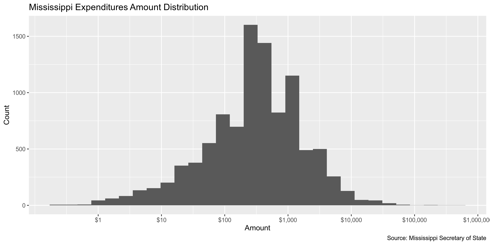

State Data
================
First Last
2019-09-16 12:13:07

  - [Project](#project)
  - [Objectives](#objectives)
  - [Packages](#packages)
  - [Data](#data)
  - [Import](#import)
  - [Explore](#explore)
  - [Wrangle](#wrangle)
  - [Conclude](#conclude)
  - [Export](#export)

<!-- Place comments regarding knitting here -->

## Project

The Accountability Project is an effort to cut across data silos and
give journalists, policy professionals, activists, and the public at
large a simple way to search across huge volumes of public data about
people and organizations.

Our goal is to standardizing public data on a few key fields by thinking
of each dataset row as a transaction. For each transaction there should
be (at least) 3 variables:

1.  All **parties** to a transaction
2.  The **date** of the transaction
3.  The **amount** of money involved

## Objectives

This document describes the process used to complete the following
objectives:

1.  How many records are in the database?
2.  Check for duplicates
3.  Check ranges
4.  Is there anything blank or missing?
5.  Check for consistency issues
6.  Create a five-digit ZIP Code called `ZIP5`
7.  Create a `YEAR` field from the transaction date
8.  Make sure there is data on both parties to a transaction

## Packages

The following packages are needed to collect, manipulate, visualize,
analyze, and communicate these results. The `pacman` package will
facilitate their installation and attachment.

The IRW’s `campfin` package will also have to be installed from GitHub.
This package contains functions custom made to help facilitate the
processing of campaign finance data.

``` r
if (!require("pacman")) install.packages("pacman")
pacman::p_load_gh("kiernann/campfin")
pacman::p_load(
  stringdist, # levenshtein value
  RSelenium, # remote browser
  tidyverse, # data manipulation
  lubridate, # datetime strings
  magrittr, # pipe opperators
  janitor, # dataframe clean
  refinr, # cluster and merge
  scales, # format strings
  readxl, # read excel file
  knitr, # knit documents
  vroom, # read files fast
  glue, # combine strings
  here, # relative storage
  fs # search storage 
)
```

This document should be run as part of the `R_campfin` project, which
lives as a sub-directory of the more general, language-agnostic
[`irworkshop/accountability_datacleaning`](https://github.com/irworkshop/accountability_datacleaning "TAP repo")
GitHub repository.

The `R_campfin` project uses the [RStudio
projects](https://support.rstudio.com/hc/en-us/articles/200526207-Using-Projects "Rproj")
feature and should be run as such. The project also uses the dynamic
`here::here()` tool for file paths relative to *your* machine.

``` r
# where dfs this document knit?
here::here()
#> [1] "/home/ubuntu/R/accountability_datacleaning/R_campfin"
```

## Data

### About

### Variables

## Import

### Download

``` r
raw_dir <- here("ms", "expends", "data", "raw")
dir_create(raw_dir)
```

### Read

``` r
ms <- read_excel(
  path = dir_ls(raw_dir),
  .name_repair = make_clean_names,
  col_types = c("text", "text", "date", "text", "numeric")
)
```

## Explore

``` r
head(ms)
#> # A tibble: 6 x 5
#>   filer           paid_to           date_received       report_type                          amount
#>   <chr>           <chr>             <dttm>              <chr>                                 <dbl>
#> 1 Friends of Abe… Coalesce          2019-06-06 00:00:00 Friends of Abe Hudson, Jr. State/Di…   100 
#> 2 Committee to E… Facebook Ads      2018-11-05 00:00:00 Committee to Elect Mark Maples Judi…   200 
#> 3 Committee to E… Facebook Ads      2018-11-06 00:00:00 Committee to Elect Mark Maples Judi…   200 
#> 4 Committee to E… Facebook Ads      2018-11-29 00:00:00 Committee to Elect Mark Maples Judi…   148.
#> 5 Forward Missis… SCOTT LEES        2017-09-06 00:00:00 Forward Mississippi PAC State/Distr…  1200 
#> 6 Friends of Abe… Tiffany Robinson… 2019-04-28 00:00:00 Friends of Abe Hudson, Jr. State/Di…   400
tail(ms)
#> # A tibble: 6 x 5
#>   filer            paid_to       date_received       report_type                             amount
#>   <chr>            <chr>         <dttm>              <chr>                                    <dbl>
#> 1 Friends of Cher… Zack Ball     2019-07-27 00:00:00 Friends of Cheramie (Mitchell) 8/8/201…  250  
#> 2 Cassandra Welch… Zavien Magee  2019-07-10 00:00:00 Cassandra Welchlin 7/30/2019 Primary P…   90  
#> 3 Cassandra Welch… Zavien Magee  2019-07-19 00:00:00 Cassandra Welchlin 7/30/2019 Primary P…  200  
#> 4 David Lee Brewer Zazzle.com    2018-02-24 00:00:00 David Lee Brewer Judicial 5/10/2018 Pe…   30.9
#> 5 Friends of Abe … Zeminski Dot… 2019-08-15 00:00:00 Friends of Abe Hudson, Jr. 7/30/2019 P…  101. 
#> 6 Mississippi Lea… Zintzo Consu… 2019-08-06 00:00:00 Mississippi Leadership Fund 8/20/2019 … 1530
glimpse(sample_frac(ms))
#> Observations: 10,002
#> Variables: 5
#> $ filer         <chr> "Delbert Hosemann", "Friends to Elect Jimmy McClure", "Philip Gunn Campaig…
#> $ paid_to       <chr> "Copey Grantham", "North MS Herald", "CLINTON CHAMBER", "FRIENDS TO ELECT …
#> $ date_received <dttm> 2019-05-01, 2018-11-05, 2018-02-01, 2019-06-23, 2018-10-12, 2016-08-25, 2…
#> $ report_type   <chr> "Delbert Hosemann State/District 6/10/2019 Periodic Report", "Friends to E…
#> $ amount        <dbl> 1500.00, 1052.50, 600.00, 9.38, 14353.72, 25.00, 166.75, 250.00, 31.34, 25…
```

### Missing

``` r
glimpse_fun(ms, count_na)
#> # A tibble: 5 x 4
#>   col           type      n     p
#>   <chr>         <chr> <dbl> <dbl>
#> 1 filer         chr       0     0
#> 2 paid_to       chr       0     0
#> 3 date_received dttm      0     0
#> 4 report_type   chr       0     0
#> 5 amount        dbl       0     0
```

``` r
ms <- flag_na(ms, everything())
sum(ms$na_flag)
#> [1] 0
```

### Duplicates

``` r
ms <- flag_dupes(ms, everything())
sum(ms$dupe_flag)
#> [1] 95
```

### Categorical

``` r
glimpse_fun(ms, n_distinct)
#> # A tibble: 7 x 4
#>   col           type      n         p
#>   <chr>         <chr> <dbl>     <dbl>
#> 1 filer         chr     287 0.0287   
#> 2 paid_to       chr    3420 0.342    
#> 3 date_received dttm   1048 0.105    
#> 4 report_type   chr     989 0.0989   
#> 5 amount        dbl    3755 0.375    
#> 6 na_flag       lgl       1 0.0001000
#> 7 dupe_flag     lgl       2 0.000200
```

### Continuous

#### Amounts

``` r
summary(ms$amount)
#>     Min.  1st Qu.   Median     Mean  3rd Qu.     Max. 
#>      0.0    100.0    313.3   1237.5   1000.0 450000.0
sum(ms$amount <= 0)
#> [1] 7
```

<!-- -->

#### Dates

``` r
ms <- mutate(ms, year_received = year(date_received))
```

``` r
min(ms$date_received)
#> [1] "2008-07-16 UTC"
max(ms$date_received)
#> [1] "3016-03-30 UTC"
sum(ms$date_received > today())
#> [1] 7
```

``` r
ms <- mutate(ms, date_clean = date_received)
ms$date_clean[which(ms$date_received > today() | ms$year_received < 2016)] <- NA
ms <- mutate(ms, year_received = year(date_clean))
```

<!-- -->

## Wrangle

``` r
ms <- as_tibble(map_if(ms, is_character, str_to_upper))
```

## Conclude

1.  There are 10002 records in the database.
2.  There are 95 duplicate records.
3.  There are 0 records missing a value.
4.  The range and distribution of the `amount` variable seems
    reasonable.
5.  The `date_clean` variable has been created by removing 7 values from
    the future.
6.  The database does not contain geographic data.
7.  The 4-digit `year` variable has been created with
    `lubridate::year()`.

## Export

``` r
proc_dir <- here("ms", "expends", "data", "processed")
dir_create(proc_dir)
```

``` r
write_csv(
  x = ms, 
  path = glue("{proc_dir}/ms_expends_clean.csv"),
  na = ""
)
```
