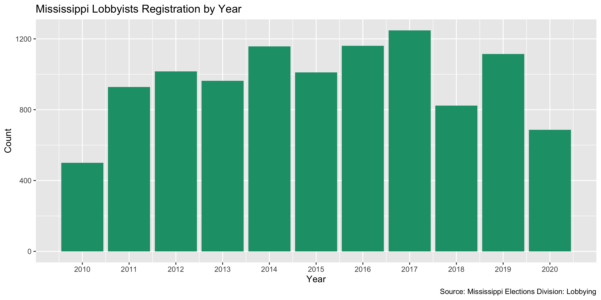

Mississippi Lobbying Regostration Data Diary
================
Yanqi Xu
2019-12-16 15:40:00

-   [Project](#project)
-   [Objectives](#objectives)
-   [Packages](#packages)
-   [Download](#download)
-   [Reading](#reading)
-   [Explore](#explore)
-   [Wrangling](#wrangling)
-   [Join](#join)
-   [Export](#export)

Project
-------

The Accountability Project is an effort to cut across data silos and give journalists, policy professionals, activists, and the public at large a simple way to search across huge volumes of public data about people and organizations.

Our goal is to standardizing public data on a few key fields by thinking of each dataset row as a transaction. For each transaction there should be (at least) 3 variables:

1.  All **parties** to a transaction
2.  The **date** of the transaction
3.  The **amount** of money involved

Objectives
----------

This document describes the process used to complete the following objectives:

1.  How many records are in the database?
2.  Check for duplicates
3.  Check ranges
4.  Is there anything blank or missing?
5.  Check for consistency issues
6.  Create a five-digit ZIP Code called `ZIP5`
7.  Create a `YEAR` field from the transaction date
8.  Make sure there is data on both parties to a transaction

Packages
--------

The following packages are needed to collect, manipulate, visualize, analyze, and communicate these results. The `pacman` package will facilitate their installation and attachment.

``` r
if (!require("pacman")) install.packages("pacman")
pacman::p_load_current_gh("irworkshop/campfin")
pacman::p_load(
  rvest, # read html tables
  stringdist, # levenshtein value
  tidyverse, # data manipulation
  lubridate, # datetime strings
  tidytext, # string analysis
  magrittr, # pipe opperators
  janitor, # dataframe clean
  refinr, # cluster and merge
  knitr, # knit documents
  glue, # combine strings
  scales, #format strings
  here, # relative storage
  fs, # search storage 
  vroom, #read deliminated files
  readxl #read excel files
)
```

This document should be run as part of the `R_campfin` project, which lives as a sub-directory of the more general, language-agnostic \[`irworkshop/accountability_datacleaning`\]\[01\] GitHub repository.

The `R_campfin` project uses the \[RStudio projects\]\[02\] feature and should be run as such. The project also uses the dynamic `here::here()` tool for file paths relative to *your* machine.

Download
--------

Set the download directory first.

``` r
# create a directory for the raw data
raw_dir <- here("ms", "lobby", "data", "raw","reg")

dir_create(raw_dir)
```

According to [The Secretary of State’s Office](https://www.sos.ms.gov/Elections-Voting/Documents/2019%20Lobbying%20Guide.pdf),

> Mississippi law defines “lobbying” as:  influencing or attempting to influence legislative or executive action through oral or written communication;  solicitation of others to influence legislative or executive action;  paying or promising to pay anything of value directly or indirectly related to legislative or executive action. (Miss. Code Ann. § 5-8-3(k)).

> Mississippi law defines a “lobbyist’s client” as:  an entity or person in whose behalf the lobbyist influences or attempts to influence legislative or executive action.

> Mississippi law defines a “lobbyist” as an individual who:  is employed and receives payments, or who contracts for economic consideration, including reimbursement for reasonable travel and living expenses, for the purpose of lobbying;  represents a legislative or public official or public employee, or who represents a person, organization, association or other group, for the purpose of lobbying; or is a sole proprietor, owner, part owner, or shareholder in a business, who has a pecuniary interest in legislative or executive action, who engages in lobbying activities. (Miss. Code Ann. § 5-8-3(l)).

> Mississippi law excludes certain individuals from the definition of “lobbyist” and “lobbyist’s client” who are exempt from the registration and reporting requirements of the Lobbying Law Reform Act of 1994. See, Miss. Code Ann. § 5-8-7 at Appendix D for further information.

This Rmd file documents the MS registration data only, whereas the expenditure data is wrangled in a separate data diary.

``` r

ms_url_1 <- glue("https://sos.ms.gov/elec/Config/Mississippi/Elections/Handlers/Export{c('Client','Lobbyist')}")
ms_url_2 <- glue("DirectoryToExcel.ashx?type=1&year={2009:2019}&lastName=&firstName=&clientName=, ")

ms_url <- ms_url_1 %>% map(str_c,ms_url_2) %>% unlist()

dest_file <- glue("{raw_dir}/ms_lobby_{c('cl','lb')}") %>% map(glue,"_{2009:2019}.xls") %>% unlist()

if (!all_files_new(raw_dir)) {
    download.file(
      url = ms_url,
      destfile = dest_file)
  Sys.sleep(1)
}
```

Then, we'll merge each dataset into a master dataset. Note that there is no date or year field in the individual databases, and we will need to create such fields. [Miss. Code Ann. §§ 5-8-1, et seq.](https://www.sos.ms.gov/Elections-Voting/Documents/2019%20Lobbying%20Guide.pdf) regulates lobbyists registration as such.

> Current lobbying reporting processes applicable to all lobbyists and their respective clients in the State of Mississippi are the result of the Lobbying Law Reform Act of 1994. (Miss. Code Ann. §§ 5-8-1, et seq.). Unless excepted from the statutory definition of “lobbyist,” every lobbyist and lobbyist’s client must file a registration statement with the Secretary of State’s Office within five (5) calendar days after becoming a lobbyist or lobbyist’s client, or beginning to lobby on behalf of a new client.
> The Mississippi lobbying cycle begins on January 1 and ends on December 31 of each calendar year and registration is required each calendar year. All lobbying reports for the cycle are filed electronically with the Secretary of State’s Office. Mississippi statute requires all registered lobbyists to file three (3) reports during the lobbying cycle:
> - Legislative Mid-Session Report due on February 25th
> - Legislative End-of-Session Report due within ten (10) days after sine die
> - Annual Report of Expenditures due no later than January 30th
> (Miss. Code Ann. § 5-8-11(5)(6)).
> Registered lobbyists’ clients file one (1) report, the Annual Report, with the Secretary of State’s Office during the lobbying cycle.

Reading
-------

We discovered that the xls files are actually structured as html tables. We'll use the `rvest` package to read these files.

``` r
ms_cl_files <- list.files(raw_dir, pattern = "ms_lobby_cl.*", recursive = TRUE, full.names = TRUE)
ms_lb_files <- list.files(raw_dir, pattern = "ms_lobby_lb.*", recursive = TRUE, full.names = TRUE)
# Create function to read a html table
read_web_tb <- function(file){
  df <- read_html(file) %>% html_node("table") %>% html_table(header = T)
  return(df)
}

ms_lobby_cl <- ms_cl_files %>% map(read_web_tb) %>% 
                   bind_rows() %>% 
                   clean_names()


ms_lobby_lb <- ms_lb_files %>% map(read_web_tb) %>% 
                   bind_rows() %>% 
                   clean_names()
```

Explore
-------

### Duplicates

We'll use the `flag_dupes()` function to see if there are records identical to one another and flag the duplicates. A new variable `dupe_flag` will be created.

``` r
ms_lobby_lb <- flag_dupes(ms_lobby_lb, dplyr::everything())
ms_lobby_cl <- flag_dupes(ms_lobby_cl, dplyr::everything())
```

### Year

``` r
ms_lobby_lb <- ms_lobby_lb %>% mutate (date = registration_date %>% as.Date(format = "%b %d %Y %I:%M%p"),
                                       year = year(date))
```

``` r
ms_lobby_lb %>% 
  group_by(year) %>% 
  ggplot(aes(year)) +
  scale_x_continuous(breaks = 2010:2019) +
  geom_bar(fill = RColorBrewer::brewer.pal(3, "Dark2")[1]) +
  labs(
    title = "Mississippi Lobbyists Registration by Year",
    caption = "Source: Mississippi Elections Division: Lobbying",
    x = "Year",
    y = "Count"
  )
```

 \#\#\# Missing There's almost no empty fields in the two data frames.

``` r
ms_lobby_cl  %>% col_stats(count_na)
#> # A tibble: 12 x 4
#>    col                  class     n     p
#>    <chr>                <chr> <int> <dbl>
#>  1 client_name          <chr>     0     0
#>  2 telephone            <chr>     0     0
#>  3 fax                  <chr>     0     0
#>  4 address_line1        <chr>     0     0
#>  5 address_line2        <chr>     0     0
#>  6 city                 <chr>     0     0
#>  7 state                <chr>     0     0
#>  8 postal_code          <chr>     0     0
#>  9 registration_date    <chr>     0     0
#> 10 certification_number <chr>     0     0
#> 11 description          <chr>     0     0
#> 12 dupe_flag            <lgl>     0     0
ms_lobby_lb  %>% col_stats(count_na)
#> # A tibble: 14 x 4
#>    col                  class      n        p
#>    <chr>                <chr>  <int>    <dbl>
#>  1 first_name           <chr>      0 0       
#>  2 last_name            <chr>      0 0       
#>  3 registration_date    <chr>      0 0       
#>  4 certification_number <chr>      0 0       
#>  5 client_name          <chr>      0 0       
#>  6 address_line1        <chr>      0 0       
#>  7 address_line2        <chr>      1 0.000388
#>  8 city                 <chr>      0 0       
#>  9 state                <chr>      0 0       
#> 10 postal_code          <chr>      0 0       
#> 11 telephone            <chr>      0 0       
#> 12 dupe_flag            <lgl>      0 0       
#> 13 date                 <date>     0 0       
#> 14 year                 <dbl>      0 0
```

Few values are missing from the lobbyists database.

Wrangling
---------

We'll wrangle the two datasets to extract information such as address, city, ZIP, state, phone for both lobbyists and their clients, as well as authorization date. The lobbyists registry has the one-to-one relationship between lobbyists and clients, so we will use `ms_lobby_lb` as the main data frame and join the clients' information from the `ms_lobby_cl` data frame.

### Phone

``` r
ms_lobby_cl <- ms_lobby_cl %>% mutate(telephone_norm = normal_phone(telephone))
ms_lobby_lb  <- ms_lobby_lb  %>% mutate(telephone_norm = normal_phone(telephone))
```

### Address

``` r
ms_lobby_lb <- ms_lobby_lb %>% 
  mutate(address_norm = normal_address(address = str_c(address_line1, address_line2, sep = " "),
      abbs = usps_city,
      na_rep = TRUE))

ms_lobby_cl <- ms_lobby_cl %>% 
  mutate(address_norm = normal_address(address = str_c(address_line1, address_line2, sep = " "),
      abbs = usps_city,
      na_rep = TRUE))
```

### ZIP

The ZIP code fields need a little bit cleaning.

``` r
prop_in(ms_lobby_lb$postal_code, valid_zip, na.rm = TRUE) %>% percent()
#> [1] "39%"

ms_lobby_lb <- ms_lobby_lb %>% 
  mutate(zip5 = normal_zip(postal_code))
  
ms_lobby_cl <- ms_lobby_cl %>% 
  mutate(zip5 = normal_zip(postal_code))
```

### State

Running the following commands tells us the state fields are clean.

``` r
prop_in(ms_lobby_cl$state, valid_state, na.rm = TRUE) %>% percent()
#> [1] "100%"
prop_in(ms_lobby_lb$state, valid_state, na.rm = TRUE) %>% percent()
#> [1] "100%"
```

### City

The city fields in both data frames use upper-case letters and lower-case letters inconsistently. We'll convert everything to upper case.

``` r
prop_in(ms_lobby_cl$city, valid_city, na.rm = TRUE) %>% percent()
#> [1] "40%"
prop_in(ms_lobby_lb$city, valid_city, na.rm = TRUE) %>% percent()
#> [1] "59%"
```

#### Normalize

``` r
ms_lobby_lb <- ms_lobby_lb %>% mutate(city_norm = normal_city(city = city,
                                            abbs = usps_city,
                                            states = c(valid_state),
                                            na = invalid_city,
                                            na_rep = TRUE))
n_distinct(ms_lobby_lb$city)
#> [1] 120
n_distinct(ms_lobby_lb$city_norm)
#> [1] 95

prop_in(ms_lobby_lb$city, valid_city, na.rm = TRUE)
#> [1] 0.5899225
prop_in(ms_lobby_lb$city_norm, valid_city, na.rm = TRUE)
#> [1] 0.9647287
```

``` r
ms_lobby_cl <- ms_lobby_cl %>% mutate(city_norm = normal_city(city = city,
                                            abbs = usps_city,
                                            states = c(valid_state),
                                            na = invalid_city,
                                            na_rep = TRUE))
n_distinct(ms_lobby_cl$city)
#> [1] 201
n_distinct(ms_lobby_cl$city_norm)
#> [1] 170

prop_in(ms_lobby_cl$city, valid_city, na.rm = TRUE)
#> [1] 0.4033742
prop_in(ms_lobby_cl$city_norm, valid_city, na.rm = TRUE)
#> [1] 0.9624233
```

#### Swap

Then, we will compare these normalized `city_norm` values to the *expected* city value for that vendor's ZIP code. If the [levenshtein distance](https://en.wikipedia.org/wiki/Levenshtein_distance) is less than 3, we can confidently swap these two values.

``` r
ms_lobby_cl <- ms_lobby_cl %>% 
  left_join(
    y = zipcodes,
    by = c(
      "state" = "state",
      "zip5" = "zip"
    )
  ) %>% 
  rename(city_match = city.y,
         city = city.x) %>% 
  mutate(
    match_abb = is_abbrev(city_norm, city_match),
    match_dist = str_dist(city_norm, city_match),
    city_swap = if_else(
      condition = match_abb | match_dist == 1,
      true = city_match,
      false = city_norm
    )
  ) %>% 
  select(
    -city_match,
    -match_dist,
    -match_abb
  )

prop_in(ms_lobby_cl$city_swap, valid_city, na.rm = TRUE) %>% percent()
#> [1] "96%"
```

``` r
ms_lobby_lb <- ms_lobby_lb %>% 
  left_join(
    y = zipcodes,
    by = c(
      "state" = "state",
      "zip5" = "zip"
    )
  ) %>% 
  rename(city_match = city.y,
         city = city.x) %>% 
  mutate(
    match_abb = is_abbrev(city_norm, city_match),
    match_dist = str_dist(city_norm, city_match),
    city_swap = if_else(
      condition = match_abb | match_dist == 1,
      true = city_match,
      false = city_norm
    )
  ) %>% 
  select(
    -city_match,
    -match_dist,
    -match_abb
  )

prop_in(ms_lobby_lb$city_swap, valid_city, na.rm = TRUE) %>% percent()
#> [1] "97%"
```

Besides the `valid_city` vector, there is another vector of `extra_city` that contains other locales. We'll incorporate that in our comparison.

``` r
valid_place <- c(valid_city, extra_city) %>% unique()

progress_table(
  ms_lobby_cl$city,
  ms_lobby_cl$city_norm,
  ms_lobby_cl$city_swap,
  compare = valid_place
)
#> # A tibble: 3 x 6
#>   stage     prop_in n_distinct prop_na n_out n_diff
#>   <chr>       <dbl>      <dbl>   <dbl> <dbl>  <dbl>
#> 1 city        0.411        201 0        1537    121
#> 2 city_norm   0.994        170 0          15      3
#> 3 city_swap   0.997        171 0.00652     9      2

progress_table(
  ms_lobby_lb$city,
  ms_lobby_lb$city_norm,
  ms_lobby_lb$city_swap,
  compare = valid_place
)
#> # A tibble: 3 x 6
#>   stage     prop_in n_distinct  prop_na n_out n_diff
#>   <chr>       <dbl>      <dbl>    <dbl> <dbl>  <dbl>
#> 1 city        0.598        120 0         1037     75
#> 2 city_norm   0.999         95 0            2      1
#> 3 city_swap   1             96 0.000775     0      1
```

This is a very fast way to increase the valid proportion in the lobbyist data frame to 3% and reduce the number of distinct *invalid* values from 1 to only 1

Similarly, the valid proportion in the clients data frame was bumped up to 3% and reduce the number of distinct *invalid* values from 3 to only 2

Join
----

We'll join the two data frames together. Since there're no duplicate columns, we will delete the `dupe_flag` columns and add suffixes to each dataset's column names.

``` r
ms_lobby_lb$dupe_flag %>% tabyl()
#> # A tibble: 1 x 3
#>   .         n percent
#>   <lgl> <dbl>   <dbl>
#> 1 FALSE  2580       1
ms_lobby_cl$dupe_flag %>% tabyl()
#> # A tibble: 1 x 3
#>   .         n percent
#>   <lgl> <dbl>   <dbl>
#> 1 FALSE  2608       1

ms_lobby_cl <- ms_lobby_cl %>% 
  select(-c(dupe_flag,
            city_norm)) %>% 
  rename(city_clean = city_swap) %>% 
  rename_at(.vars = vars(-(starts_with("client"))),
    .funs = ~str_c("client_",.))
```

``` r
ms_lobby_reg <- ms_lobby_cl %>% 
  right_join(ms_lobby_lb,
            by = c("client_name" = "client_name",
            "client_certification_number" = "certification_number",
            "client_registration_date" = "registration_date"))
```

Export
------

``` r
clean_dir <- here("ms", "lobby", "data", "processed","reg")
dir_create(clean_dir)
ms_lobby_reg %>% 
  select(-c(dupe_flag,
            city_norm)) %>% 
  mutate_if(is.character, str_to_upper) %>% 
  rename(city_clean = city_swap) %>% 
  write_csv(
    path = glue("{clean_dir}/ms_lobby_reg.csv"),
    na = ""
  )
```
