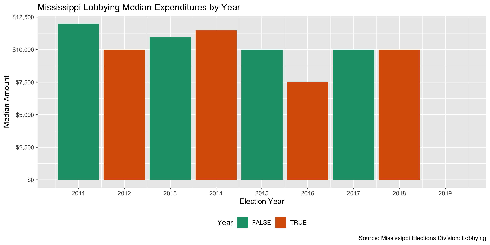

Mississippi Lobbying Expenditure Data Diary
================
Yanqi Xu
2019-12-16 17:08:10

-   [Project](#project)
-   [Objectives](#objectives)
-   [Packages](#packages)
-   [Download](#download)
-   [Reading](#reading)
-   [Explore](#explore)
-   [Join](#join)
-   [Export](#export)

Project
-------

The Accountability Project is an effort to cut across data silos and give journalists, policy professionals, activists, and the public at large a simple way to search across huge volumes of public data about people and organizations.

Our goal is to standardizing public data on a few key fields by thinking of each dataset row as a transaction. For each transaction there should be (at least) 3 variables:

1.  All **parties** to a transaction
2.  The **date** of the transaction
3.  The **amount** of money involved

Objectives
----------

This document describes the process used to complete the following objectives:

1.  How many records are in the database?
2.  Check for duplicates
3.  Check ranges
4.  Is there anything blank or missing?
5.  Check for consistency issues
6.  Create a five-digit ZIP Code called `ZIP5`
7.  Create a `YEAR` field from the transaction date
8.  Make sure there is data on both parties to a transaction

Packages
--------

The following packages are needed to collect, manipulate, visualize, analyze, and communicate these results. The `pacman` package will facilitate their installation and attachment.

``` r
if (!require("pacman")) install.packages("pacman")
pacman::p_load_current_gh("irworkshop/campfin")
pacman::p_load(
  rvest, # read html tables
  stringdist, # levenshtein value
  tidyverse, # data manipulation
  lubridate, # datetime strings
  tidytext, # string analysis
  magrittr, # pipe opperators
  janitor, # dataframe clean
  refinr, # cluster and merge
  knitr, # knit documents
  glue, # combine strings
  scales, #format strings
  here, # relative storage
  fs, # search storage 
  vroom, #read deliminated files
  readxl #read excel files
)
```

This document should be run as part of the `R_campfin` project, which lives as a sub-directory of the more general, language-agnostic \[`irworkshop/accountability_datacleaning`\]\[01\] GitHub repository.

The `R_campfin` project uses the \[RStudio projects\]\[02\] feature and should be run as such. The project also uses the dynamic `here::here()` tool for file paths relative to *your* machine.

Download
--------

Set the download directory first.

``` r
# create a directory for the raw data
raw_dir <- here("ms", "lobby", "data", "raw","exp")

dir_create(raw_dir)
```

According to [The Secretary of State’s Office](https://www.sos.ms.gov/Elections-Voting/Documents/2019%20Lobbying%20Guide.pdf),

> Mississippi law defines “lobbying” as:  influencing or attempting to influence legislative or executive action through oral or written communication;  solicitation of others to influence legislative or executive action;  paying or promising to pay anything of value directly or indirectly related to legislative or executive action. (Miss. Code Ann. § 5-8-3(k)).

> Mississippi law defines a “lobbyist’s client” as:  an entity or person in whose behalf the lobbyist influences or attempts to influence legislative or executive action.

> Mississippi law defines a “lobbyist” as an individual who:  is employed and receives payments, or who contracts for economic consideration, including reimbursement for reasonable travel and living expenses, for the purpose of lobbying;  represents a legislative or public official or public employee, or who represents a person, organization, association or other group, for the purpose of lobbying; or is a sole proprietor, owner, part owner, or shareholder in a business, who has a pecuniary interest in legislative or executive action, who engages in lobbying activities. (Miss. Code Ann. § 5-8-3(l)).

> Mississippi law excludes certain individuals from the definition of “lobbyist” and “lobbyist’s client” who are exempt from the registration and reporting requirements of the Lobbying Law Reform Act of 1994. See, Miss. Code Ann. § 5-8-7 at Appendix D for further information.

After inespecting the client reports and lobbyist reports, we discovered that the client reports are cleaner without empty columns ("N/A" lobbyists and $0.00 expenses). Thus, we'll join the client reports to the registry.

``` r

ms_url<- glue("https://sos.ms.gov/elec/Config/Mississippi/Elections/Handlers/ExportClientReportsToExcel.ashx?type=5&year={2009:2019}&firstName=&lastName=&clientName=&salaryBeginRange=&salaryEndRange=,")

dest_file <- glue("{raw_dir}/ms_lobby_exp_{2009:2019}.xls")

if (!all_files_new(raw_dir)) {
    download.file(
      url = ms_url,
      destfile = dest_file)
  Sys.sleep(1)
}
```

Then, we'll merge each dataset into a master dataset. Note that there's actually no data available in csv prior to 2011. [Miss. Code Ann. §§ 5-8-1, et seq.](https://www.sos.ms.gov/Elections-Voting/Documents/2019%20Lobbying%20Guide.pdf) regulates lobbyists registration as such.

> Current lobbying reporting processes applicable to all lobbyists and their respective clients in the State of Mississippi are the result of the Lobbying Law Reform Act of 1994. (Miss. Code Ann. §§ 5-8-1, et seq.). Unless excepted from the statutory definition of “lobbyist,” every lobbyist and lobbyist’s client must file a registration statement with the Secretary of State’s Office within five (5) calendar days after becoming a lobbyist or lobbyist’s client, or beginning to lobby on behalf of a new client.
> The Mississippi lobbying cycle begins on January 1 and ends on December 31 of each calendar year and registration is required each calendar year. All lobbying reports for the cycle are filed electronically with the Secretary of State’s Office. Mississippi statute requires all registered lobbyists to file three (3) reports during the lobbying cycle:
> - Legislative Mid-Session Report due on February 25th
> - Legislative End-of-Session Report due within ten (10) days after sine die
> - Annual Report of Expenditures due no later than January 30th
> (Miss. Code Ann. § 5-8-11(5)(6)).
> Registered lobbyists’ clients file one (1) report, the Annual Report, with the Secretary of State’s Office during the lobbying cycle.

Reading
-------

We discovered that the xls files are actually structured as html tables. We'll use the `rvest` package to read these files.

``` r
ms_exp_files <- list.files(raw_dir, pattern = "ms_lobby_exp.*", recursive = TRUE, full.names = TRUE)
# Create function to read a html table
read_web_tb <- function(file){
  df <- read_html(file) %>% html_node("table") %>% html_table(header = T)
  return(df)
}

ms_lobby_exp <- ms_exp_files %>% map(read_web_tb) %>% 
                   bind_rows() %>% 
                   clean_names()

ms_lobby_exp <- ms_lobby_exp %>% 
  mutate(filed = as.Date(filed, format = '%m/%d/%Y'),
         compensation = as.numeric(compensation %>% str_remove("\\$") %>% str_remove(","))) %>% 
  mutate_if(is.character, str_to_upper)
```

Explore
-------

### Duplicates

We'll use the `flag_dupes()` function to see if there are records identical to one another and flag the duplicates. A new variable `dupe_flag` will be created.

``` r
ms_lobby_exp <- flag_dupes(ms_lobby_exp, dplyr::everything())
tabyl(ms_lobby_exp$dupe_flag)
#> # A tibble: 2 x 3
#>   `ms_lobby_exp$dupe_flag`     n percent
#>   <lgl>                    <dbl>   <dbl>
#> 1 FALSE                     8578 0.995  
#> 2 TRUE                        39 0.00453
```

### Year




### Missing

There's no empty fields in the two data frames.

``` r
ms_lobby_exp  %>% col_stats(count_na)
#> # A tibble: 8 x 4
#>   col          class      n     p
#>   <chr>        <chr>  <int> <dbl>
#> 1 file_number  <chr>      0     0
#> 2 report_type  <chr>      0     0
#> 3 cycle_year   <int>      0     0
#> 4 entity_name  <chr>      0     0
#> 5 lobbyist     <chr>      0     0
#> 6 compensation <dbl>      0     0
#> 7 filed        <date>     0     0
#> 8 dupe_flag    <lgl>      0     0
```

Join
----

We'll join the expenditure data with the registration data frame that we cleaned before.

``` r
reg_dir <- here("ms", "lobby", "data", "processed","reg")
ms_lobby_reg <- read_csv(glue("{reg_dir}/ms_lobby_reg.csv"))
```

We'll also clean up the lobbyist names to get rid of titles.

``` r
ms_lobby_exp <- ms_lobby_exp %>% 
  mutate(lobbyist = lobbyist %>% str_remove("^MR.\\s|^MRS.\\s|^MS.\\s|^HON.\\s|"))
```

``` r
  ms_lobby_reg <-  ms_lobby_reg %>% 
  select(client_name,
         client_telephone_norm,
         client_fax,
         client_address_norm,
         client_city_clean,
         client_state,
         client_zip5,
         client_certification_number,
         client_description,
         first_name,
         last_name,
         address_norm,
         city_clean,
         state,
         zip5,
         year) %>% 
  mutate(lobbyist = str_match( ms_lobby_reg$client_description, "LOBBYIST: (.+) ;")[,2] %>% 
           str_remove("^MR.\\s|^MRS.\\s|^MS.\\s|^HON.\\s|"))

ms_lobby_reg <- ms_lobby_reg %>% 
  flag_dupes(year, client_name, lobbyist) 

ms_lobby_exp_clean <- ms_lobby_exp %>% 
  left_join(ms_lobby_reg %>% filter(!dupe_flag),
            by = c("entity_name" = "client_name",
            "lobbyist" = "lobbyist",
            "cycle_year" = "year"))
```

Export
------

``` r
clean_dir <- here("ms", "lobby", "data", "processed","exp")
dir_create(clean_dir)

ms_lobby_reg %>% 
  select(-dupe_flag) %>% 
  write_csv(
    path = glue("{clean_dir}/ms_lobby_exp_clean.csv"),
    na = ""
  )
```
