Mississippi PPP Breakdown
================
Kiernan Nicholls
Thu Dec 17 10:44:36 2020

  - [Data](#data)
  - [Prep](#prep)
  - [Explore](#explore)
  - [Jobs](#jobs)
  - [Amounts](#amounts)
  - [Businesses](#businesses)
      - [Duplicate Names](#duplicate-names)
      - [Duplicate Addresses](#duplicate-addresses)
  - [Business Type](#business-type)
  - [Business Industry](#business-industry)
  - [Business Ownership](#business-ownership)
      - [Race & Ethnicity](#race-ethnicity)
      - [Gender](#gender)
      - [Veteran](#veteran)
      - [Non-Profit](#non-profit)
  - [Dates](#dates)
  - [Lenders](#lenders)

<!-- Place comments regarding knitting here -->

## Data

This is an analysis of Paycheck Protection Program loans in Mississippi.

On December 1, 2020 the Small Business Administration was ordered by the
court to release more detailed data on loans made through the Paycheck
Protection Program (PPP), a major facet of the 2020 CARES Act to provide
stimulus funding during the ongoing COVID-19 pandemic. This detailed
release came after the SBA initially refused to publish any database,
then released only partial data on the largest loan recipients. The full
database now contains all recipient names, addresses, and exact loan
amounts.

> #### PPP Is A Delegated Loan Making Process
> 
> PPP loans are not made by SBA. PPP loans are made by lending
> institutions and then guaranteed by SBA. Accordingly, borrowers apply
> to lenders and self-certify that they are eligible for PPP loans. The
> self- certification includes a good faith certification that the
> borrower has economic need requiring the loan and that the borrower
> has applied the affiliation rules and is a small business. The lender
> then reviews the borrower’s application, and if all the paperwork is
> in order, approves the loan and submits it to SBA…

> #### Cancelled Loans Do Not Appear In The PPP Loan Data
> 
> The public PPP data includes only active loans. Loans that were
> cancelled for any reason are not included in the public data release.

## Prep

We can read the normalized PPP data from the IRW S3 server.

``` r
ppp_dir <- here("us", "covid", "ppp")
ppp_file <- path(ppp_dir, "data", "clean", "sba_ppp_full.csv")
```

``` r
if (!file_exists(ppp_file)) {
  save_object(
    object = "csv/sba_ppp_full.csv",
    bucket = "publicaccountability",
    file = ppp_file
  )
}
```

``` r
ppp <- vroom(
  file = ppp_file,
  col_types = cols(
    naics_code = col_character(),
    zip = col_character()
  )
)
```

We can add additional variables to identify which records are in
Mississippi.

``` r
ppp <- ppp %>% 
  mutate(
    is_ms = !is.na(state) & state == "MS",
    ms_lab = ifelse(is_ms, "Miss.", "Other")
  )
```

And then create a separate table of Mississippi loans only.

``` r
ms_ppp <- filter(ppp, is_ms)
```

## Explore

There are 48,010 loans with 22 columns.

Mississippi accounts for 0.9% of the total PPP loans, and 0.6% of the
total amount disbursed. This is close to the 0.9% of the US population
that lives in the state.

## Jobs

We can also explore the number of *jobs* reportedly retained. These
numbers were self reported and a significant amount of applications
reported zero jobs or omitted a number altogether, although the number
of missing jobs reportedly saved was smaller in Mississippi than the
country at large.

    #> # A tibble: 2 x 3
    #>   ms_lab no_job zero_jobs
    #>   <chr>   <dbl>     <dbl>
    #> 1 Miss.  0.0239    0.0817
    #> 2 Other  0.0656    0.124

These loans, with missing or invalid jobs reported, does not appear to
be tied to the time the loan was approved and probably isn’t related to
confusion.

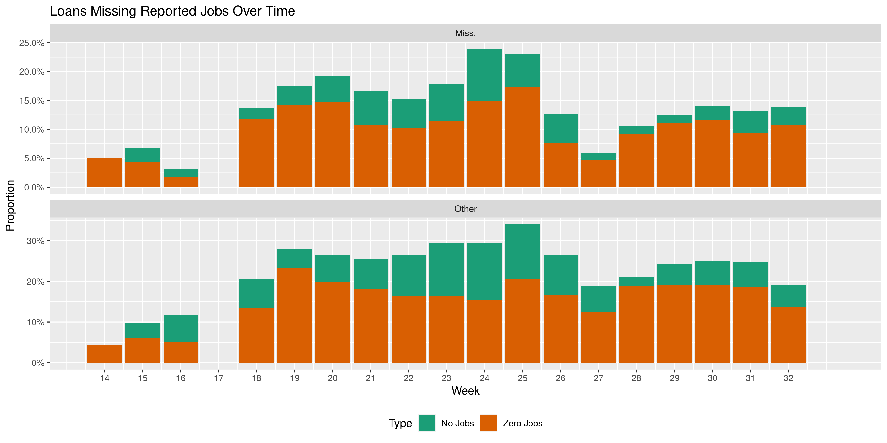<!-- -->

The loans missing job data seem to be tied to the lending bank. In
Mississippi, **100%** of loans from Wells Fargo were missing job
information while **0%** of those from PriorityOne Bank were.

Here are the top ten banks with the greatest and least proportion of
their loans missing job information.

| sort | Lending Bank                           | \# Loans | % w/out Jobs |
| :--- | :------------------------------------- | :------- | :----------- |
| head | Magnolia State Bank                    | 280      | 100%         |
| head | Wells Fargo Bank, National Association | 219      | 100%         |
| head | Southern Bancorp Bank                  | 270      | 87%          |
| head | Regions Bank                           | 2,286    | 79%          |
| head | Celtic Bank Corporation                | 540      | 74%          |
| head | The Peoples Bank                       | 554      | 63%          |
| head | Bank of Franklin                       | 155      | 42%          |
| head | Cross River Bank                       | 573      | 24%          |
| head | First Security Bank                    | 493      | 23%          |
| head | Bank of Forest                         | 126      | 17%          |
| tail | Sycamore Bank                          | 209      | 0%           |
| tail | First Southern Bank                    | 191      | 0%           |
| tail | Great Southern Bank                    | 191      | 0%           |
| tail | Mechanics Bank                         | 191      | 0%           |
| tail | CB\&S Bank                             | 186      | 0%           |
| tail | Bank of Kilmichael                     | 173      | 0%           |
| tail | Members Exchange CU                    | 170      | 0%           |
| tail | Home Bank, National Association        | 155      | 0%           |
| tail | Concordia Bank & Trust Company         | 153      | 0%           |
| tail | Bank of America, National Association  | 105      | 0%           |

If we ignore this missing data, we can continue to breakdown the
reported jobs.

Most loans did go to small businesses saving less than **25** jobs. This
was true in both Mississippi and the rest of the country.

``` r
ppp %>% 
  group_by(is_ms) %>% 
  summarise(small_jobs = mean(jobs < 25, na.rm = TRUE))
#> # A tibble: 2 x 2
#>   is_ms small_jobs
#>   <lgl>      <dbl>
#> 1 FALSE      0.911
#> 2 TRUE       0.930
```

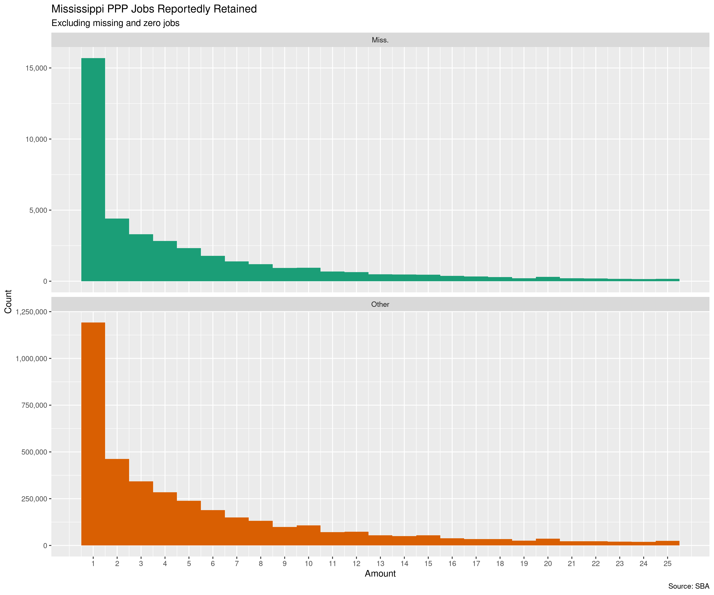<!-- -->

33 businesses in Mississippi reportedly retained the max of 500 jobs.

| Lending Bank                              | Amount      | Jobs | Business Name                   | Business Address                                 |
| :---------------------------------------- | :---------- | ---: | :------------------------------ | :----------------------------------------------- |
| Hancock Whitney Bank                      | $10,000,000 |  500 | STAFF PRO LLC                   | 238 COURTHOUSE RD, GULFPORT MS 39507             |
| BancorpSouth Bank                         | $7,006,242  |  500 | FRANKLIN CORPORATION            | 600 FRANKLIN DR, HOUSTON MS 38851                |
| Home Bank, National Association           | $6,431,200  |  500 | MID RIVER RESTAURANTS, LLC      | 296 HIGHLAND BLVD, NATCHEZ MS 39122              |
| Community Bank of Mississippi             | $6,164,700  |  500 | HOL-MAC CORPORATION             | 2730 HWY 15, BAY SPRINGS MS 39422                |
| BancorpSouth Bank                         | $5,931,285  |  500 | WISE STAFFING SERVICES, INC.    | 432 MAGAZINE ST, TUPELO MS 38804                 |
| Synovus Bank                              | $5,719,790  |  500 | THE RETZER GROUP INC            | 1215 S MAIN ST, GREENVILLE MS 38701              |
| BancorpSouth Bank                         | $5,155,488  |  500 | MAX HOME, LLC                   | 101 MAX PL, FULTON MS 38843                      |
| Community Bank of Mississippi             | $4,923,600  |  500 | SOUTHERN HENS, INC.             | 329 MOSELLE SEMINARY RD, MOSELLE MS 39459        |
| BancorpSouth Bank                         | $4,699,302  |  500 | LABOR SOURCE, L.L.C.            | 432 MAGAZINE ST, TUPELO MS 38804                 |
| Synovus Bank                              | $4,490,722  |  500 | RETZER RESOURCES, INC.          | 1215 MAIN ST, GREENVILLE MS 38701                |
| Planters Bank & Trust Company             | $4,300,000  |  500 | NORTH SUNFLOWER MEDICAL CENTER  | 840 N OAK AVE, RULEVILLE MS 38771                |
| First State Bank                          | $3,973,318  |  500 | WEST QUALITY FOOD SERVICE INC   | 220 N 16 TH AVE, LAUREL MS 39440                 |
| The First, A National Banking Association | $3,899,821  |  500 | ROBERTS COMPANY, INC.           | 1612 ADELINE ST, HATTIESBURG MS 39401            |
| BancorpSouth Bank                         | $3,356,395  |  500 | VERITAS HEALTHCARE GROUP LLC    | 6858 SWINNEA RD, SOUTHAVEN MS 38671              |
| Regions Bank                              | $3,002,700  |  500 | EMI STAFFING, INC.              | 142 S MAIN ST, GRENADA MS 38901                  |
| Synovus Bank                              | $2,778,178  |  500 | CENTURY2 LLC                    | 1215 S MAIN ST, GREENVILLE MS 38701              |
| Renasant Bank                             | $2,659,000  |  500 | UNIVERSITY MANAGEMENT, INC      | PO BOX 1368, COLUMBUS MS 39703                   |
| Trustmark National Bank                   | $2,637,749  |  500 | D G FOODS LLC                   | 1095 INDUSTRIAL DR, HAZLEHURST MS 39083          |
| The Citizens Bank of Philadelphia         | $2,473,611  |  500 | TRIPLE V INC.                   | 820 HWY 35, FOREST MS 39074                      |
| Trustmark National Bank                   | $2,386,360  |  500 | NEWCO DINING LLC                | 2680 CRANE RDG DR, JACKSON MS 39216              |
| Wallis Bank                               | $2,251,300  |  500 | SWEETWATER FRANCHISE GROUP LLC  | 211 BALL AVE, TYLERTOWN MS 39667                 |
| First Horizon Bank                        | $2,250,000  |  500 | RPM PIZZA MIDWEST, LLC          | 15384 5 TH ST, GULFPORT MS 39503                 |
| United Mississippi Bank                   | $2,186,600  |  500 | RIVER ROAD RESTAURANTS, LLC     | 296 HIGHLAND BLVD PO BOX 18939, NATCHEZ MS 39122 |
| Home Bank, National Association           | $2,142,200  |  500 | SOUTHERN RIVER RESTAURANTS, LLC | 296 HIGHLAND BLVD, NATCHEZ MS 39122              |
| Renasant Bank                             | $1,977,300  |  500 | SHIFFLETT ENTERPRISES, INC      | PO BOX 236, OLIVE BRANCH MS 38654                |
| Bank of Yazoo City                        | $1,754,891  |  500 | FIRST CHOICE HOME CARE, LLC     | 823 CALHOUN AVE, YAZOO CITY MS 39194             |
| First Horizon Bank                        | $1,300,000  |  500 | RPM PIZZA BATON ROUGE, LLC      | 15384 5 TH ST, GULFPORT MS 39503                 |
| Synovus Bank                              | $1,279,832  |  500 | RETZER LLC                      | 1215 S MAIN ST, GREENVILLE MS 38701              |
| First Horizon Bank                        | $1,250,000  |  500 | TTT PIZZA LLC                   | 15384 5 TH ST, GULFPORT MS 39503                 |
| The Citizens National Bank of Meridian    | $451,305    |  500 | CPI-WS, LLC                     | 112 5 TH ST, COLUMBUS MS 39701                   |
| Hope Enterprise Corporation               | $59,037     |  500 | P & E TRUCKING, INC.            | 4651 SUNSET RD, NESBIT MS 38651                  |
| PriorityOne Bank                          | $34,395     |  500 | SERVICE-ALL REPAIR SERVICE, LLC | 10 PIEDMONT RD, PETAL MS 39465                   |
| Celtic Bank Corporation                   | $2,253      |  500 | SHERAH MOSS                     | 415 FILLMORE, CORINTH MS 38834                   |

From this list, we can see an incredible range of loan amounts for the
same 500 jobs retained, from $2,253 to $10,000,000.

This leads us to investigate the dollars spent to save each job. There
are some businesses in Mississippi which took hundreds of thousands to
save one or two jobs and others which took only a couple thousand to
save over a hundred jobs.

These are the businesses which received the most and least money per job
reportedly retained.

| Lending Bank                          | Amount     | Jobs | Cost     | Business Name                      | Business Address                        |
| :------------------------------------ | :--------- | ---: | :------- | :--------------------------------- | :-------------------------------------- |
| Hope Enterprise Corporation           | $263,750   |    1 | $263,750 | J\&W TRANSPORT LLC                 | 147 FLAG CHAPEL CIR, JACKSON MS 39213   |
| Bank of America, National Association | $230,787   |    1 | $230,787 | HEATH BRYAN COLEMAN, DDS OF MISS…  | 1168 CROSS CRK DR, SALTILLO MS 38866    |
| First National Bank of Picayune       | $187,200   |    1 | $187,200 | TST\&E, LLC                        | 92 BURGE TOWN RD, CARRIERE MS 39426     |
| BBVA USA                              | $164,600   |    1 | $164,600 | DEAN MCCRARY IMPORTS, LLC          | 603 BROADWAY DR, HATTIESBURG MS 39401   |
| BankPlus                              | $142,000   |    1 | $142,000 | COVINGTON ELECTRIC LLC             | 122 E BUSINESS PARK, BRANDON MS 39042   |
| First National Bank of Picayune       | $127,200   |    1 | $127,200 | MJW TRUCKING LLC                   | 151 CYPRESS PT, PICAYUNE MS 39466       |
| Century Bank                          | $112,303   |    1 | $112,303 | COASTAL PROTECTIVE COATING LLC     | 132 HOLLY LN, LUCEDALE MS 39452         |
| BankPlus                              | $106,400   |    1 | $106,400 | LANE C MURRAY                      | 1755 LELIA DR, JACKSON MS 39216         |
| Regions Bank                          | $1,050,700 |   10 | $105,070 | PRIME CARE NURSING INC             | 222 ARNOLD AVE, GREENVILLE MS 38701     |
| The Commercial Bank                   | $300,992   |    3 | $100,331 | PLANTATION THINNING SPECIALIST LLC | 12810 HWY 16 E, PHILADELPHIA MS 39350   |
| BankPlus                              | $6,900     |  137 | $50      | TOMMY KIRKPATRICK LLC              | 1841 DEVINE ST, JACKSON MS 39202        |
| The Cleveland State Bank              | $1,200     |   24 | $50      | PREMIER SPORTS MS, LLC             | 205 S SHARPE AVE, CLEVELAND MS 38732    |
| Celtic Bank Corporation               | $3,683     |   75 | $49      | VARNELL FRAMING CONTRACTOR INC     | 261 HARRELL RD, PELAHATCHIE MS 39145    |
| Community Bank of Mississippi         | $600       |   15 | $40      | RIKKI DAILEY                       | 1109 ADAMS ST, WAVELAND MS 39576        |
| Trustmark National Bank               | $1,188     |   35 | $34      | HILTON PROPERTIES, INC             | 152 SILOAM CHURCH RD, MAGEE MS 39111    |
| The Cleveland State Bank              | $600       |   18 | $33      | GREG JACKSON                       | 847 MCKNIGHT RD, CLEVELAND MS 38732     |
| BNA Bank                              | $500       |   16 | $31      | EVA OWEN                           | 1021 COUNTY RD 368, NEW ALBANY MS 38652 |
| BankPlus                              | $5,300     |  170 | $31      | QUALITY SURFACE SOLUTIONS, LLC     | 811 OAKWOOD DR, CLINTON MS 39056        |
| Bank of Winona                        | $2,159     |  164 | $13      | CHRISTOPHER CALDWELL               | 205 S STATE ST, DUCK HILL MS 38925      |
| Community Bank of Mississippi         | $2,500     |  194 | $13      | SHELBY S DENTON                    | 1490 GOVERNMENT ST, BRANDON MS 39042    |

Some of these businesses with small loans and high jobs are sole
proprietorship or self employed, which questions whether the job numbers
are accurate.

| Lending Bank                              | Amount  | Jobs | Cost | Business Name                  | Business Type                  |
| :---------------------------------------- | :------ | ---: | :--- | :----------------------------- | :----------------------------- |
| Hancock Whitney Bank                      | $38,100 |  397 | $96  | TRIPLE R. FARMS                | Limited Liability Company(LLC) |
| Merchants & Marine Bank                   | $2,868  |   30 | $96  | DUST BUNNY JANITORIAL SERVICES | Sole Proprietorship            |
| Trustmark National Bank                   | $2,742  |   29 | $95  | LISTER HOME BUILDERS           | Limited Liability Company(LLC) |
| BankPlus                                  | $1,600  |   17 | $94  | GEORGE ANNA GRIFFIN            | Sole Proprietorship            |
| BankPlus                                  | $1,400  |   16 | $88  | THE WIMBERLEY LEGACY LLC       | Limited Liability Partnership  |
| The First, A National Banking Association | $1,347  |   17 | $79  | JOHN R HOFER                   | Sole Proprietorship            |
| The Citizens National Bank of Meridian    | $1,005  |   14 | $72  | HARLEY RAE BOUTIQUE LLC        | Limited Liability Company(LLC) |
| BankPlus                                  | $11,900 |  170 | $70  | CHARLOTTE CALENDAR             | Self-Employed Individuals      |
| Community Bank of Mississippi             | $900    |   14 | $64  | RYAN BRADLEY KNIGHT            | Sole Proprietorship            |
| BankPlus                                  | $10,900 |  170 | $64  | JASCO I-55 LLC                 | Limited Liability Company(LLC) |
| BankPlus                                  | $1,000  |   16 | $62  | RIA’S SENIOR CARE              | Sole Proprietorship            |
| The Cleveland State Bank                  | $2,200  |   39 | $56  | TED’S INCOME TAX               | Sole Proprietorship            |
| The Cleveland State Bank                  | $900    |   17 | $53  | LARA BARKLEY                   | Sole Proprietorship            |
| BankPlus                                  | $900    |   17 | $53  | SKILLS TRAINING ACADEMY, LLC   | Limited Liability Company(LLC) |
| Guaranty Bank & Trust Company             | $12,200 |  238 | $51  | MIKE WOODS ENTERPRISES, INC.   | Subchapter S Corporation       |
| BankPlus                                  | $6,900  |  137 | $50  | TOMMY KIRKPATRICK LLC          | Limited Liability Company(LLC) |
| The Cleveland State Bank                  | $1,200  |   24 | $50  | PREMIER SPORTS MS, LLC         | Limited Liability Company(LLC) |
| Celtic Bank Corporation                   | $3,683  |   75 | $49  | VARNELL FRAMING CONTRACTOR INC | Corporation                    |
| Community Bank of Mississippi             | $600    |   15 | $40  | RIKKI DAILEY                   | Independent Contractors        |
| Trustmark National Bank                   | $1,188  |   35 | $34  | HILTON PROPERTIES, INC         | Subchapter S Corporation       |
| The Cleveland State Bank                  | $600    |   18 | $33  | GREG JACKSON                   | Independent Contractors        |
| BNA Bank                                  | $500    |   16 | $31  | EVA OWEN                       | Sole Proprietorship            |
| BankPlus                                  | $5,300  |  170 | $31  | QUALITY SURFACE SOLUTIONS, LLC | Limited Liability Company(LLC) |
| Bank of Winona                            | $2,159  |  164 | $13  | CHRISTOPHER CALDWELL           | Sole Proprietorship            |
| Community Bank of Mississippi             | $2,500  |  194 | $13  | SHELBY S DENTON                | Sole Proprietorship            |

There are “Self-Employed Individual” businesses which took thousands of
dollars to retain dozens of jobs.

| Lending Bank              | Amount                                    | Jobs    | Cost | Business Name | Business Type          |
| :------------------------ | :---------------------------------------- | :------ | ---: | :------------ | :--------------------- |
| Self-Employed Individuals | BankPlus                                  | $11,900 |  170 | $70           | CHARLOTTE CALENDAR     |
| Self-Employed Individuals | BankPlus                                  | $7,600  |   28 | $271          | JINNIE T BOYD CPA      |
| Self-Employed Individuals | Kabbage, Inc.                             | $85,957 |   24 | $3,582        | CONNER SOLUTION        |
| Self-Employed Individuals | Kabbage, Inc.                             | $36,873 |   20 | $1,844        | V LOUNGE LLC           |
| Self-Employed Individuals | The Peoples Bank                          | $5,000  |   17 | $294          | JAKE ROGERS            |
| Self-Employed Individuals | Community Bank of Mississippi             | $2,600  |   17 | $153          | TRAVIS UNRUH           |
| Self-Employed Individuals | BankPlus                                  | $14,400 |   16 | $900          | MONTEL C THOMPSON      |
| Self-Employed Individuals | Community Bank of Mississippi             | $15,300 |   16 | $956          | WILLIAM H. WALKER, JR. |
| Self-Employed Individuals | The First, A National Banking Association | $8,543  |   16 | $534          | DONA J DECKER          |
| Self-Employed Individuals | BankPlus                                  | $4,500  |   16 | $281          | DUANE ODOM             |

The distribution of loan amount per job retained is similar for both
Mississippi and the United States, both with a spike of loans at $21,000
per job.

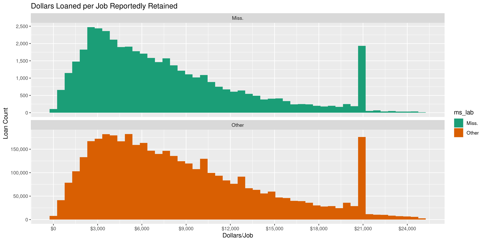<!-- -->

The maximum amount forgivable by single people is $20,833:

> In addition to the specific caps described below, the amount of loan
> forgiveness requested for owner-employees and
> self-employedindividuals’ payroll compensation is capped at $20,833
> per individual in total across allbusinesses in which he or she has an
> ownership stake.

## Amounts

``` r
summary(ms_ppp$amount)
#>     Min.  1st Qu.   Median     Mean  3rd Qu.     Max. 
#>      100     7649    18750    66507    44929 10000000
```

These are the records with the minimum and maximum amounts.

``` r
ms_ppp %>% 
  filter(
    amount == min(amount) | amount == max(amount)
  ) %>% 
  select(all_of(id_vars))
#> # A tibble: 2 x 9
#>   date       lender                 amount  jobs business               address           city     state zip  
#>   <date>     <chr>                   <dbl> <dbl> <chr>                  <chr>             <chr>    <chr> <chr>
#> 1 2020-04-27 Hancock Whitney Bank 10000000   500 STAFF PRO LLC          238 COURTHOUSE RD GULFPORT MS    39507
#> 2 2020-07-14 Navy FCU                  100     0 BIG STALL TRUCKING LLC PO BOX 3902       GULFPORT MS    39505
```

Overall, Mississippi has a similar loan amount distribution to the
United States at large.

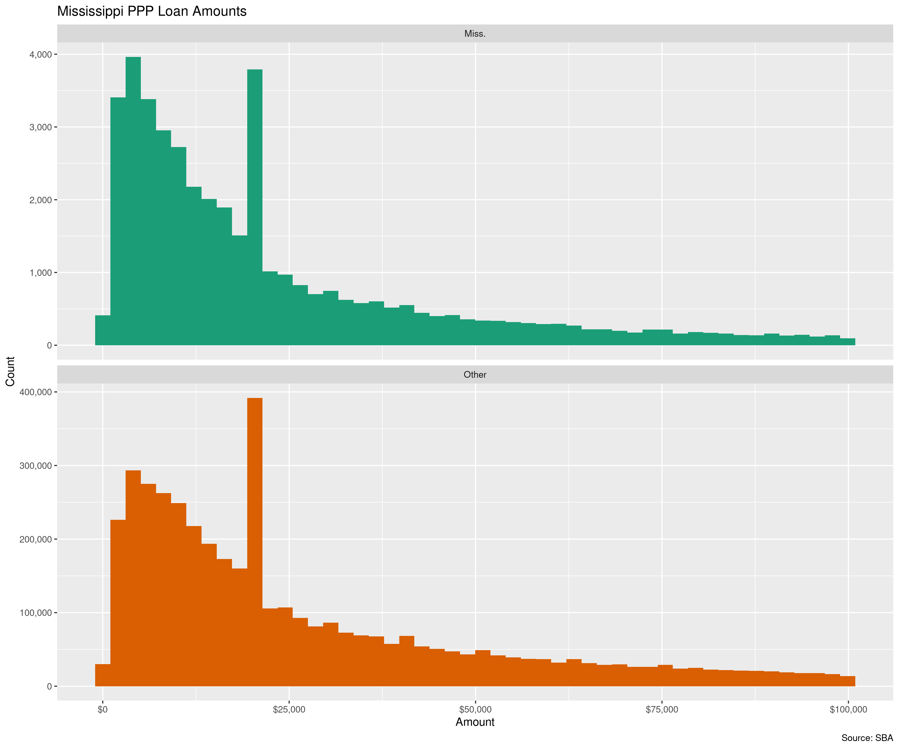<!-- -->

These are the 20 largest loans in the state:

| Lending Bank                              | $ Mil. | Jobs | Business Name                                | Business Type                                 |
| :---------------------------------------- | :----- | ---: | :------------------------------------------- | :-------------------------------------------- |
| Hancock Whitney Bank                      | $10.00 |  500 | STAFF PRO LLC                                | 238 COURTHOUSE RD, GULFPORT MS 39507          |
| Regions Bank                              | $8.64  |  486 | BUTLER SNOW, LLP                             | 1020 HIGHLAND COLONY PKWY, RIDGELAND MS 39157 |
| Renasant Bank                             | $7.03  |  465 | SOUTHERN ELECTRIC CORPORATION OF MISSISSIPPI | 4374 A MANGUM DR, FLOWOOD MS 39232            |
| BancorpSouth Bank                         | $7.01  |  500 | FRANKLIN CORPORATION                         | 600 FRANKLIN DR, HOUSTON MS 38851             |
| Trustmark National Bank                   | $6.90  |  354 | NEEL SCHAFFER, INC                           | 125 S CONGRESS ST STE 1100, JACKSON MS 39201  |
| Community Bank of Mississippi             | $6.50  |  132 | PILGRIM CONSTRUCTION CO LLC                  | 2419 HWY 528, HEIDELBERG MS 39439             |
| Home Bank, National Association           | $6.43  |  500 | MID RIVER RESTAURANTS, LLC                   | 296 HIGHLAND BLVD, NATCHEZ MS 39122           |
| Community Bank of Mississippi             | $6.16  |  500 | HOL-MAC CORPORATION                          | 2730 HWY 15, BAY SPRINGS MS 39422             |
| BancorpSouth Bank                         | $5.93  |  500 | WISE STAFFING SERVICES, INC.                 | 432 MAGAZINE ST, TUPELO MS 38804              |
| Synovus Bank                              | $5.72  |  500 | THE RETZER GROUP INC                         | 1215 S MAIN ST, GREENVILLE MS 38701           |
| Trustmark National Bank                   | $5.52  |  496 | SOUTHERN TIRE MART LLC                       | 800 HWY 98 BYP, COLUMBIA MS 39429             |
| The First, A National Banking Association | $5.48  |  250 | PUCKETT MACHINERY COMPANY                    | 100 CATERPILLAR DR, FLOWOOD MS 39232          |
| BancorpSouth Bank                         | $5.36  |  484 | F. L. CRANE & SONS, INC.                     | 508 S SPG ST, FULTON MS 38843                 |
| BankPlus                                  | $5.23  |  295 | B & B ELECTRICAL & UTILITY CONTRACTORS       | 530 SOLDIER COLONY RD, CANTON MS 39046        |
| BancorpSouth Bank                         | $5.16  |  500 | MAX HOME, LLC                                | 101 MAX PL, FULTON MS 38843                   |
| Zions Bank, A Division of                 | $5.08  |  285 | JINDAL TUBULAR USA LLC                       | 13092 SEA PLANE RD, BAY SAINT LOUIS MS 39520  |
| Trustmark National Bank                   | $5.00  |  356 | GASTROINTESTINAL ASSOCIATES, PA              | 2510 LAKELAND DR, FLOWOOD MS 39232            |
| Renasant Bank                             | $4.98  |  357 | STRIBLING EQUIPMENT, LLC                     | 415 HWY 49 S, RICHLAND MS 39218               |
| Community Bank of Mississippi             | $4.92  |  500 | SOUTHERN HENS, INC.                          | 329 MOSELLE SEMINARY RD, MOSELLE MS 39459     |
| The Citizens Bank of Philadelphia         | $4.82  |  471 | NESHOBA COUNTY GENERAL HOSPITAL              | 1001 HOLLAND AVE, PHILADELPHIA MS 39350       |

## Businesses

There are 47,749 business names in the 48,010 Mississippi PPP loans.

### Duplicate Names

There are a number of businesses which apparently relieved multiple
loans.

| Lending Bank                | $ Mil.    | Jobs | Business Name        | Business Type             | Business Address                    |
| :-------------------------- | :-------- | ---: | :------------------- | :------------------------ | :---------------------------------- |
| Hope Enterprise Corporation | $17,400   |    1 | MICHAEL TRESTER      | Sole Proprietorship       | 514 S HICKORY ST, ABERDEEN MS 39730 |
| Hope Enterprise Corporation | $14,300   |    1 | MICHAEL TRESTER      | Sole Proprietorship       | 514 S HICKORY ST, ABERDEEN MS 39730 |
| Trustmark National Bank     | $17,485   |    1 | MICHAEL TRESTER      | Sole Proprietorship       | 514 S HICKORY ST, ABERDEEN MS 39730 |
| Kabbage, Inc.               | $9,225.00 |   11 | ANGELICA JACKSON     | Self-Employed Individuals | 136 BRADLEY ST, JACKSON MS 39209    |
| Fundbox, Inc.               | $3,479.80 |   NA | ANGELICA JACKSON     | Sole Proprietorship       | 136 BRADLEY ST, JACKSON MS 39209    |
| Bank of Kilmichael          | $6,200    |    5 | BOX LOGGING          | Partnership               | 115 WHITES RD, FRENCH CAMP MS 39745 |
| Regions Bank                | $7,500    |    0 | BOX LOGGING          | Sole Proprietorship       | 115 WHITES RD, FRENCH CAMP MS 39745 |
| Regions Bank                | $18,800   |    0 | CAIN APPRAISALS LLC  | Sole Proprietorship       | 2455 SOUTHWOOD RD, JACKSON MS 39211 |
| Cross River Bank            | $14,854   |    1 | CAIN APPRAISALS LLC  | Self-Employed Individuals | 2455 SOUTHWOOD RD, JACKSON MS 39211 |
| Kabbage, Inc.               | $17,981   |    1 | CE CE EVENT PLANNING | Self-Employed Individuals | 400 MISSION 66, VICKSBURG MS 39183  |
| Hope Enterprise Corporation | $16,483   |    1 | CE CE EVENT PLANNING | Sole Proprietorship       | 400 MISSION 66, VICKSBURG MS 39183  |

This could be in line with [earlier
reporting](https://www.nbcnews.com/business/business-news/ppp-loan-program-accidentally-paid-some-small-business-owners-twice-n1224061)
that some small businesses had received multiple PPP loans.

> The issue stems from the hectic early weeks of the program, when
> funding ran out quickly and borrowers were not hearing back from their
> banks, industry sources told NBC News. Although businesses must
> certify they are only applying for one loan, some small-business
> owners applied at more than one bank to ensure they could secure a
> financial lifeline amid the economic shutdown.

Some of these duplicate loans appear to be similar in value, but none of
them are exactly the same and some are in fact from the same bank. A
text file with these repeated businesses has been created.

### Duplicate Addresses

There are thousands of loans issued to duplicate addresses. This isn’t
unusual in and of itself but we can explore them nonetheless.

``` r
ms_geo <- ms_ppp %>% 
  select(all_of(id_vars), type) %>% 
  group_by(address, city, state, zip) %>% 
  mutate(num_loans = n(), group = cur_group_id(), .before = 1) %>% 
  arrange(desc(num_loans)) %>% 
  filter(num_loans > 1)
```

Loans under the Paycheck Protection Program had a maximum value of $10
million, but we can see that some of business at some of these addresses
received more than that.

    #> # A tibble: 3,393 x 3
    #>    group num_loans mil_loan
    #>    <int>     <int>    <dbl>
    #>  1 29323         7    17.6 
    #>  2 11555        10    10.2 
    #>  3  6931         4    10.1 
    #>  4  1515         2     8.80
    #>  5 22496         2     8.57
    #>  6 34299         3     7.89
    #>  7 29042        30     5.98
    #>  8 41871         3     5.60
    #>  9 31759         2     5.45
    #> 10 34612         3     5.44
    #> # … with 3,383 more rows

This address appears to be home to multiple staffing businesses, which
received a combined $17.6 million.

| Date       | Lending Bank      | Amount     | Jobs | Business Name                | Business Address                 |
| :--------- | :---------------- | :--------- | ---: | :--------------------------- | :------------------------------- |
| 2020-04-13 | BancorpSouth Bank | $1,644,812 |  351 | ONESOURCE STAFFING, L.L.C.   | 432 MAGAZINE ST, TUPELO MS 38804 |
| 2020-04-14 | BancorpSouth Bank | $1,838,822 |  273 | DAY-HELP, L.L.C.             | 432 MAGAZINE ST, TUPELO MS 38804 |
| 2020-04-14 | BancorpSouth Bank | $1,467,400 |  245 | EPSCO, INC.                  | 432 MAGAZINE ST, TUPELO MS 38804 |
| 2020-04-15 | BancorpSouth Bank | $5,931,285 |  500 | WISE STAFFING SERVICES, INC. | 432 MAGAZINE ST, TUPELO MS 38804 |
| 2020-04-15 | BancorpSouth Bank | $4,699,302 |  500 | LABOR SOURCE, L.L.C.         | 432 MAGAZINE ST, TUPELO MS 38804 |
| 2020-04-15 | BancorpSouth Bank | $2,038,312 |  492 | WISE MEDICAL STAFFING, INC.  | 432 MAGAZINE ST, TUPELO MS 38804 |
| 2020-04-29 | BancorpSouth Bank | $9,545     |    1 | A - SQUARED ENTERPRISES, LLC | 432 MAGAZINE ST, TUPELO MS 38804 |

It seems common in the data for separate franchises or subsidiaries to
receive their own loans. Dozens of BUMPER’S DRIVE-IN restaurants all
incorporated at the same address but operating in different locations
received their own loans.

| Date       | Lending Bank                  | Amount   | Jobs | Business Name                        | Business Address                 |
| :--------- | :---------------------------- | :------- | ---: | :----------------------------------- | :------------------------------- |
| 2020-04-13 | BankPlus                      | $142,100 |   49 | LODGING AMERICA AT STARKVILLE        | 1554 W PEACE ST, CANTON MS 39046 |
| 2020-04-13 | BankPlus                      | $108,400 |   47 | LODGING AMERICA AT GUIN LLC          | 1554 W PEACE ST, CANTON MS 39046 |
| 2020-04-13 | BankPlus                      | $106,000 |   49 | TRILOGY HOSPITALITY AT COLUMBUS, LLC | 1554 W PEACE ST, CANTON MS 39046 |
| 2020-04-13 | BankPlus                      | $76,900  |   32 | LODGING AMERICA AT NEW ALBANY, LLC   | 1554 W PEACE ST, CANTON MS 39046 |
| 2020-04-13 | BankPlus                      | $69,400  |   33 | LODGING AMERICA AT BROOKHAVEN LLC    | 1554 W PEACE ST, CANTON MS 39046 |
| 2020-04-13 | BankPlus                      | $67,800  |   20 | LODGING AMERICA AT LUCEDALE, LLC     | 1554 W PEACE ST, CANTON MS 39046 |
| 2020-04-13 | BankPlus                      | $61,100  |   27 | LODGING AMERICA AT WIGGINS, LLC      | 1554 W PEACE ST, CANTON MS 39046 |
| 2020-04-13 | Community Bank of Mississippi | $48,800  |   20 | BDI BROOKHAVEN LLC                   | 1554 W PEACE ST, CANTON MS 39046 |
| 2020-04-13 | Community Bank of Mississippi | $42,300  |   17 | BDI PHILADELPHIA                     | 1554 W PEACE ST, CANTON MS 39046 |
| 2020-04-13 | Community Bank of Mississippi | $31,800  |   15 | BDI CHARLESTON                       | 1554 W PEACE ST, CANTON MS 39046 |
| 2020-04-13 | Community Bank of Mississippi | $31,300  |   21 | BDI HAZELHURST                       | 1554 W PEACE ST, CANTON MS 39046 |
| 2020-04-13 | Community Bank of Mississippi | $30,700  |   19 | BDI PHILADELPHIA 2                   | 1554 W PEACE ST, CANTON MS 39046 |
| 2020-04-13 | Community Bank of Mississippi | $30,000  |    9 | BDI LAUREL                           | 1554 W PEACE ST, CANTON MS 39046 |
| 2020-04-13 | Community Bank of Mississippi | $28,000  |   11 | BDI MENDENHALL                       | 1554 W PEACE ST, CANTON MS 39046 |
| 2020-04-13 | Community Bank of Mississippi | $27,900  |   12 | BDI CANTON 1 LLC                     | 1554 W PEACE ST, CANTON MS 39046 |
| 2020-04-13 | Community Bank of Mississippi | $26,900  |   17 | BDI PRENTISS LLC                     | 1554 W PEACE ST, CANTON MS 39046 |
| 2020-04-13 | Community Bank of Mississippi | $26,300  |    8 | BDI GLUCKSTADT                       | 1554 W PEACE ST, CANTON MS 39046 |
| 2020-04-13 | Community Bank of Mississippi | $24,500  |   10 | BDI MADISON COUNTY                   | 1554 W PEACE ST, CANTON MS 39046 |
| 2020-04-13 | Community Bank of Mississippi | $23,700  |   13 | BDI OF HOLLY BUSH RD                 | 1554 W PEACE ST, CANTON MS 39046 |
| 2020-04-13 | Community Bank of Mississippi | $23,100  |   17 | BDI LOUISVILLE LLC                   | 1554 W PEACE ST, CANTON MS 39046 |
| 2020-04-13 | Community Bank of Mississippi | $22,600  |   13 | BDI MARKS                            | 1554 W PEACE ST, CANTON MS 39046 |
| 2020-04-13 | Community Bank of Mississippi | $22,300  |   11 | BDI PEARSON RD                       | 1554 W PEACE ST, CANTON MS 39046 |
| 2020-04-14 | Community Bank of Mississippi | $117,700 |   17 | BUMPER’S DRIVE-IN OF AMERICA INC     | 1554 W PEACE ST, CANTON MS 39046 |
| 2020-04-14 | Community Bank of Mississippi | $66,500  |   26 | BDI ROLLINGFORK                      | 1554 W PEACE ST, CANTON MS 39046 |
| 2020-04-14 | Community Bank of Mississippi | $43,700  |   13 | FRESH MARKET CAFE                    | 1554 W PEACE ST, CANTON MS 39046 |
| 2020-04-14 | Community Bank of Mississippi | $40,500  |   29 | BDI QUITMAN                          | 1554 W PEACE ST, CANTON MS 39046 |
| 2020-04-14 | Community Bank of Mississippi | $30,500  |   15 | BUMPERS DRIVE IN OF BELZONI LLC      | 1554 W PEACE ST, CANTON MS 39046 |
| 2020-04-14 | Community Bank of Mississippi | $30,100  |   11 | SMITHVILLE BUMPERS DRIVE IN          | 1554 W PEACE ST, CANTON MS 39046 |
| 2020-04-14 | Community Bank of Mississippi | $27,600  |   13 | BUMPERS DRIVE-IN OF RULEVILLE LLC    | 1554 W PEACE ST, CANTON MS 39046 |
| 2020-04-14 | Community Bank of Mississippi | $25,300  |   11 | BDI VICKSBURG                        | 1554 W PEACE ST, CANTON MS 39046 |
| 2020-04-14 | Community Bank of Mississippi | $21,700  |   12 | BDI TERRY ROAD                       | 1554 W PEACE ST, CANTON MS 39046 |
| 2020-04-14 | Community Bank of Mississippi | $20,800  |    4 | C & C EQUIPMENT                      | 1554 W PEACE ST, CANTON MS 39046 |
| 2020-04-15 | Community Bank of Mississippi | $41,300  |   19 | YAZOO BUMPERS DRIVE IN               | 1554 W PEACE ST, CANTON MS 39046 |
| 2020-04-16 | Community Bank of Mississippi | $74,200  |   31 | SIMPLY SOUTHERN AT FLOWOOD LLC       | 1554 W PEACE ST, CANTON MS 39046 |
| 2020-04-16 | Community Bank of Mississippi | $35,100  |   31 | SIMPLY SOUTHERN AT GRENADA LLC       | 1554 W PEACE ST, CANTON MS 39046 |
| 2020-04-16 | Community Bank of Mississippi | $31,700  |   16 | MACON BUMPERS LLC                    | 1554 W PEACE ST, CANTON MS 39046 |
| 2020-04-16 | Community Bank of Mississippi | $28,100  |   16 | BDI FLORA LLC                        | 1554 W PEACE ST, CANTON MS 39046 |
| 2020-04-16 | Community Bank of Mississippi | $25,600  |   16 | BUMPERS DRIVE IN OF BALDWYN, LLC     | 1554 W PEACE ST, CANTON MS 39046 |

This address in Gulfport is also the location of incorporation for nine
Domino’s Pizza franchises, *three* of which reportedly retained the
*maximum* 500 jobs and took a combined $10.2 million in PPP loans, which
exceeds the maximum loan amount for any single business entity. All of
these loans were issued by the same bank and all but one were issued on
the same day. Weirdly enough, most of these businesses seem to cover
regions outside Mississippi.

| Date       | Lending Bank       | Amount     | Jobs | Business Name                      | Business Address                 |
| :--------- | :----------------- | :--------- | ---: | :--------------------------------- | :------------------------------- |
| 2020-04-09 | First Horizon Bank | $2,250,000 |  500 | RPM PIZZA MIDWEST, LLC             | 15384 5 TH ST, GULFPORT MS 39503 |
| 2020-04-08 | First Horizon Bank | $1,300,000 |  500 | RPM PIZZA BATON ROUGE, LLC         | 15384 5 TH ST, GULFPORT MS 39503 |
| 2020-04-08 | First Horizon Bank | $1,250,000 |  500 | TTT PIZZA LLC                      | 15384 5 TH ST, GULFPORT MS 39503 |
| 2020-04-08 | First Horizon Bank | $1,250,000 |  387 | RPM PIZZA-NOLA, LLC                | 15384 5 TH ST, GULFPORT MS 39503 |
| 2020-04-08 | First Horizon Bank | $1,150,000 |  388 | RPM PIZZA GREATER NEW ORLEANS, LLC | 15384 5 TH ST, GULFPORT MS 39503 |
| 2020-04-08 | First Horizon Bank | $950,000   |  452 | RPM PIZZA CENTRAL MS, LLC          | 15384 5 TH ST, GULFPORT MS 39503 |
| 2020-04-08 | First Horizon Bank | $900,000   |  414 | RPM PIZZA ACADIANA, LLC            | 15384 5 TH ST, GULFPORT MS 39503 |
| 2020-04-08 | First Horizon Bank | $900,000   |  369 | RPM PIZZA NORTHWEST LOUISIANA, LLC | 15384 5 TH ST, GULFPORT MS 39503 |
| 2020-04-12 | BancorpSouth Bank  | $189,638   |   49 | BIG DADDY PIZZA, LLC               | 15384 5 TH ST, GULFPORT MS 39503 |
| 2020-04-14 | BancorpSouth Bank  | $67,957    |    5 | HMS BROKERAGE, LLC                 | 15384 5 TH ST, GULFPORT MS 39503 |

## Business Type

There are 18 different kinds of business types.

The PPP was ostensibly designed to help small businesses, but we can see
that most loans nationwide were given to Corporations. In Mississippi, a
greater percentage of loans were given to LLC’s and sole proprietorship.

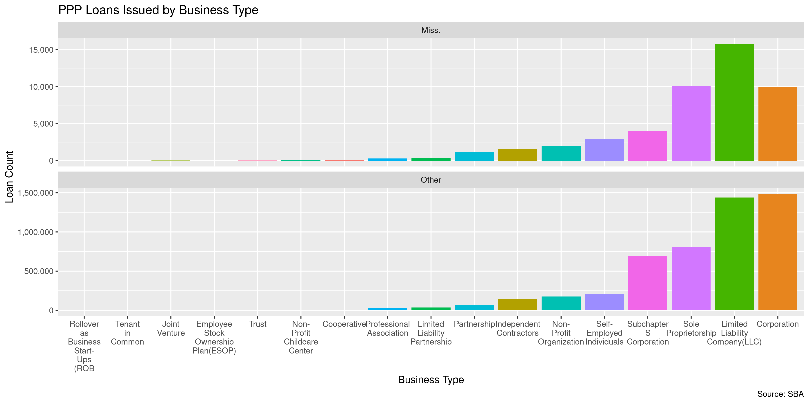<!-- -->

The distribution of loan amounts by business type is roughly similar
between loans to businesses in Mississippi and the country at large. The
only major discrepancies come from the business types with very few
loans in the state.

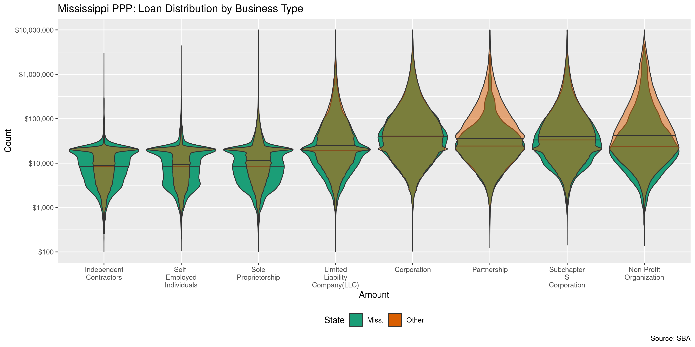<!-- -->

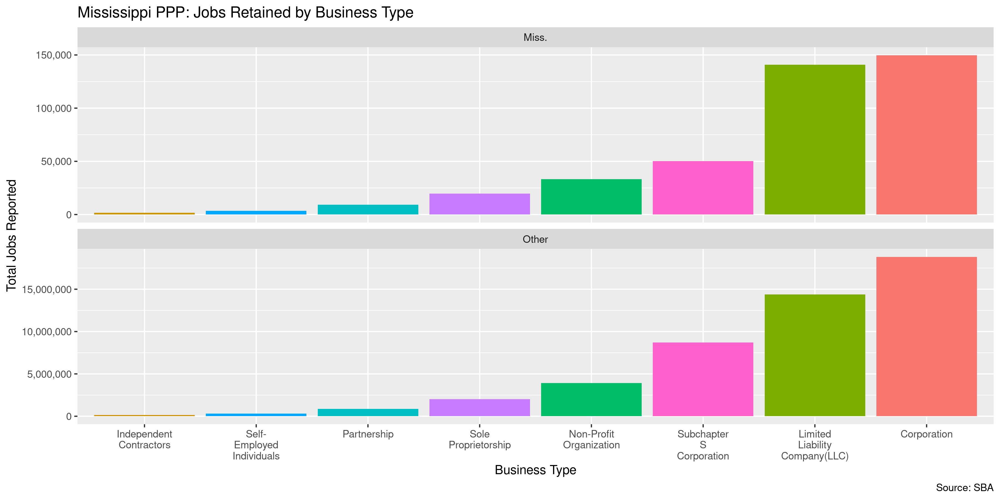<!-- -->

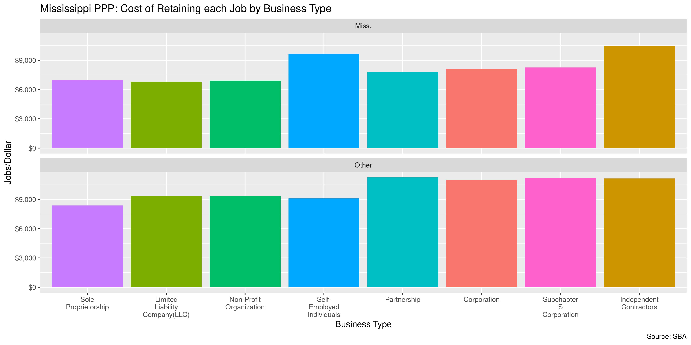<!-- -->

## Business Industry

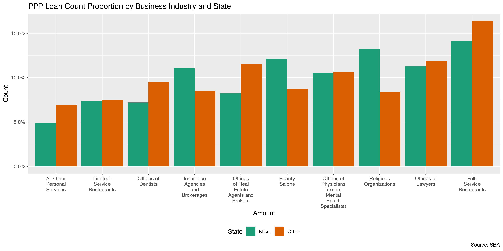<!-- -->

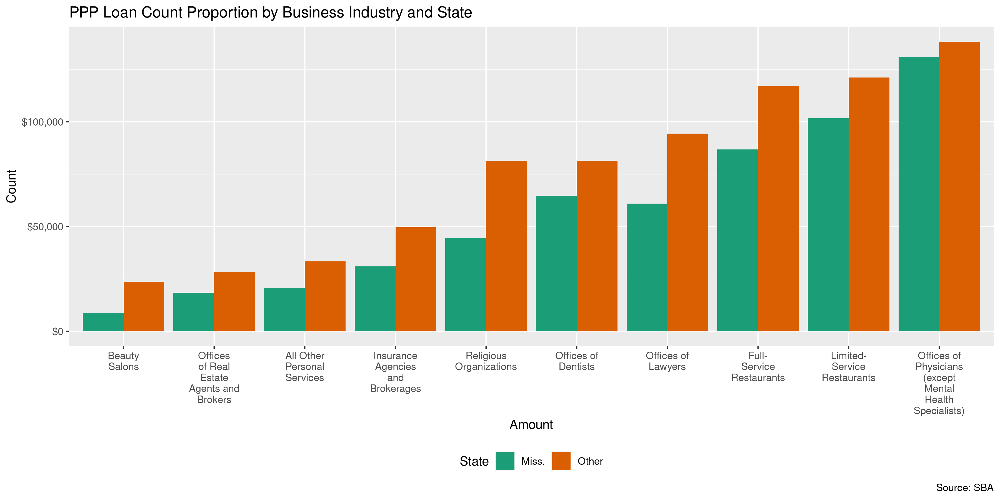<!-- -->

## Business Ownership

There are four variables in the data describing the ownership of the
businesses.

1.  The race and ethnicity
2.  Gender
3.  Veteran status
4.  Non-profit status

Most loans did not report this information.

``` r
ppp %>% 
  group_by(is_ms) %>% 
  summarise(
    no_race = mean(race == "Unanswered", na.rm = TRUE),
    no_gender = mean(gender == "Unanswered", na.rm = TRUE),
    no_vet = mean(veteran == "Unanswered", na.rm = TRUE)
  )
#> # A tibble: 2 x 4
#>   is_ms no_race no_gender no_vet
#>   <lgl>   <dbl>     <dbl>  <dbl>
#> 1 FALSE   0.897     0.787  0.854
#> 2 TRUE    0.751     0.658  0.806
```

The degree of missing race data, for example, does not seem correlated
with a particular type of business.

``` r
ms_ppp %>% 
  group_by(type) %>% 
  summarise(
    n = n(),
    no_race = mean(race == "Unanswered", na.rm = TRUE)
  ) %>% 
  arrange(desc(n))
#> # A tibble: 16 x 3
#>    type                                    n no_race
#>    <chr>                               <int>   <dbl>
#>  1 Limited  Liability Company(LLC)     15764   0.745
#>  2 Sole Proprietorship                 10057   0.762
#>  3 Corporation                          9899   0.717
#>  4 Subchapter S Corporation             3964   0.701
#>  5 Self-Employed Individuals            2895   0.815
#>  6 Non-Profit Organization              1999   0.872
#>  7 Independent Contractors              1530   0.828
#>  8 Partnership                          1127   0.730
#>  9 Limited Liability Partnership         312   0.779
#> 10 Professional Association              303   0.726
#> 11 Cooperative                            81   0.765
#> 12 Non-Profit Childcare Center            60   0.833
#> 13 Joint Venture                           8   0.375
#> 14 Trust                                   8   0.875
#> 15 Employee Stock Ownership Plan(ESOP)     2   1    
#> 16 Tenant in Common                        1   0
```

### Race & Ethnicity

| Race                             | US Count  |       | MS Count |       |
| :------------------------------- | :-------- | :---- | :------- | :---- |
| Unanswered                       | 4,584,921 |       | 36,071   |       |
| White                            | 405,503   | 77.4% | 9,891    | 82.8% |
| Asian                            | 57,974    | 11.1% | 607      | 5.1%  |
| Hispanic                         | 41,475    | 7.9%  | 216      | 1.8%  |
| Black or African American        | 15,966    | 3.0%  | 1,184    | 9.9%  |
| American Indian or Alaska Native | 2,828     | 0.5%  | 41       | 0.3%  |
| Puerto Rican                     | 158       | 0.0%  |          |       |
| Multi Group                      | 10        | 0.0%  |          |       |
| Eskimo & Aleut                   | 5         | 0.0%  |          |       |

### Gender

| Gender       | US Count  |       | MS Count |       |
| :----------- | :-------- | :---- | :------- | :---- |
| Unanswered   | 4,021,530 |       | 31,612   |       |
| Male Owned   | 838,070   | 77.1% | 12,339   | 75.2% |
| Female Owned | 249,240   | 22.9% | 4,059    | 24.8% |

### Veteran

| Veteran     | US Count  |       | MS Count |       |
| :---------- | :-------- | :---- | :------- | :---- |
| Unanswered  | 4,365,201 |       | 38,688   |       |
| Non-Veteran | 709,757   | 95.4% | 8,977    | 96.3% |
| Veteran     | 33,882    | 4.6%  | 345      | 3.7%  |

### Non-Profit

| Non-Profit | US Count  |       | MS Count |       |
| :--------- | :-------- | :---- | :------- | :---- |
| FALSE      | 4,929,776 | 96.5% | 45,951   | 95.7% |
| TRUE       | 179,064   | 3.5%  | 2,059    | 4.3%  |

## Dates

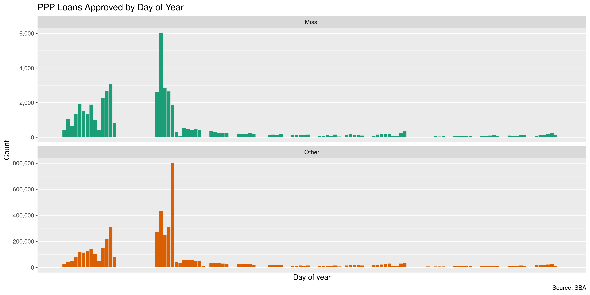<!-- -->

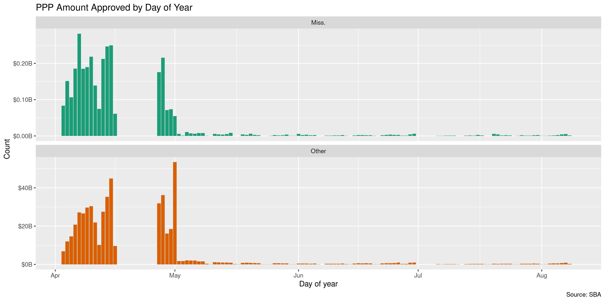<!-- -->

## Lenders

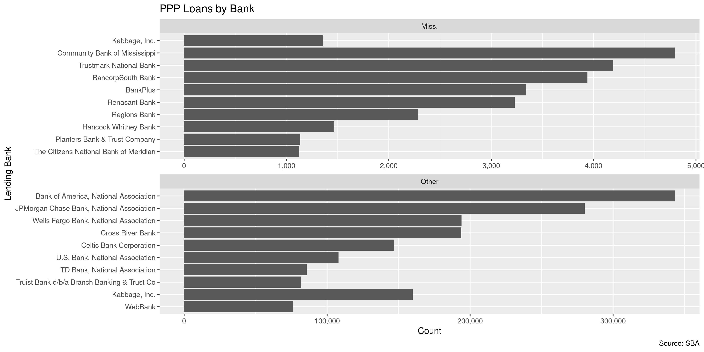<!-- -->

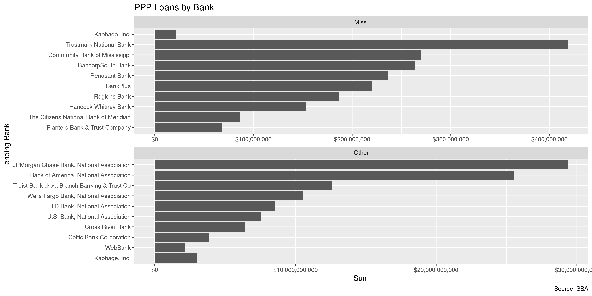<!-- -->
