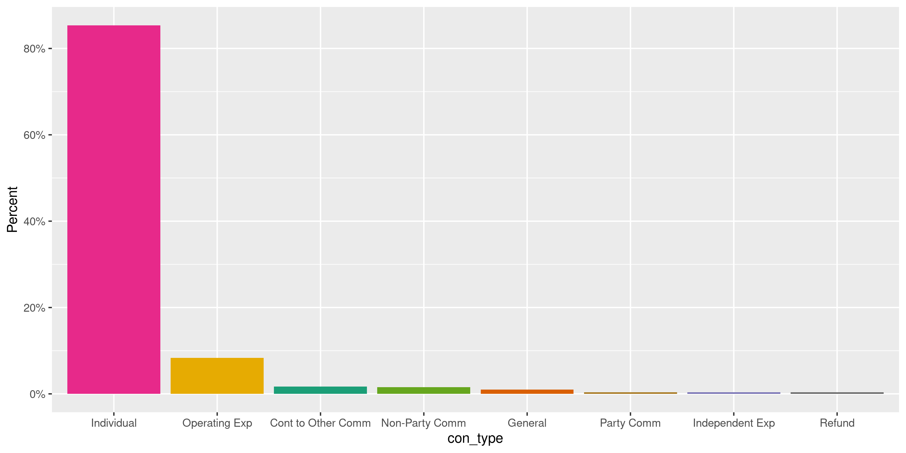
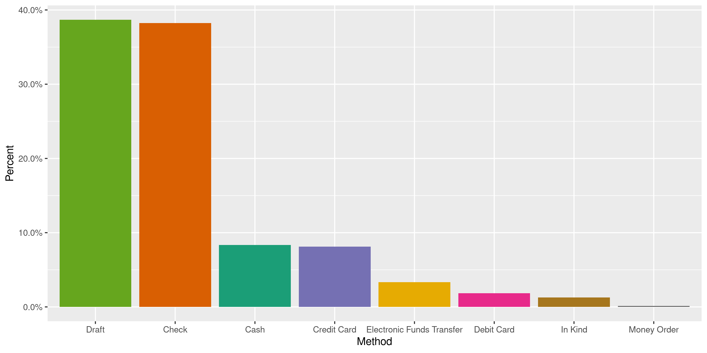
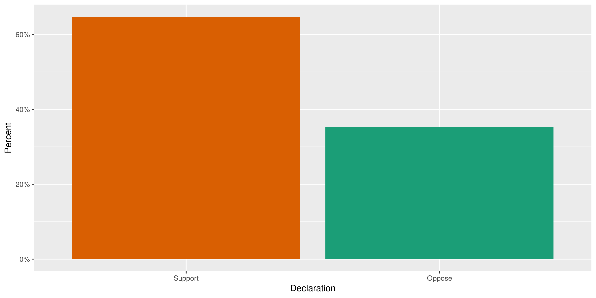
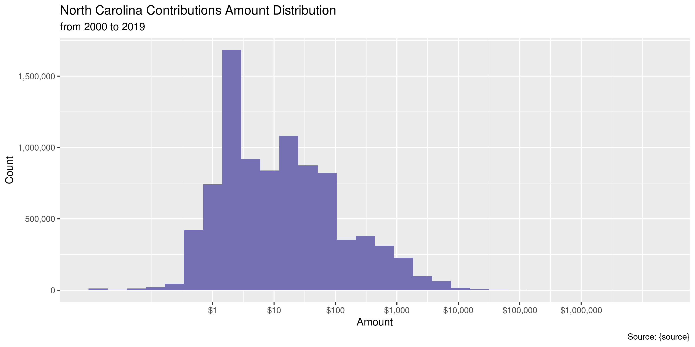
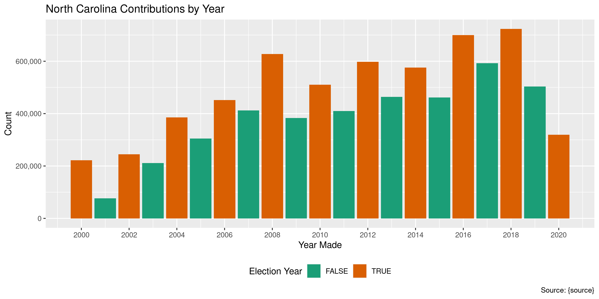
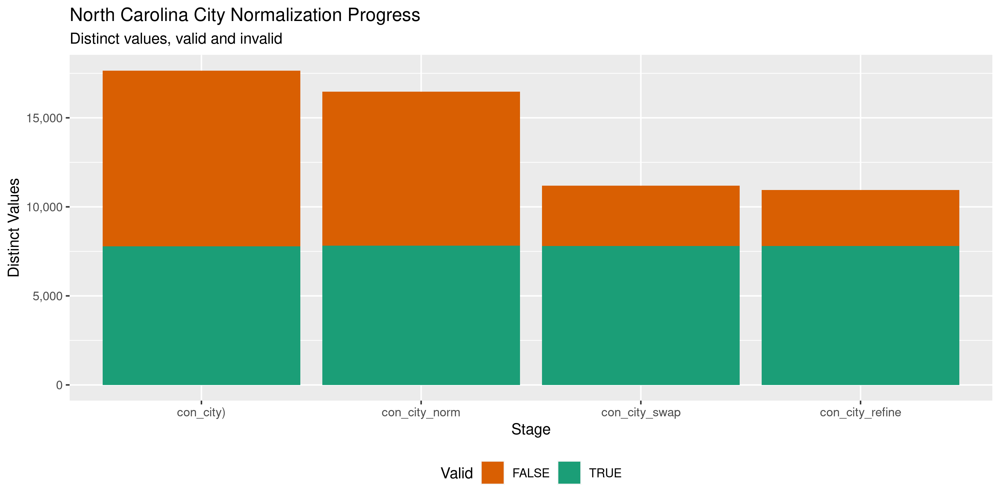

North Carolina Contributions
================
Kiernan Nicholls
2020-07-20 10:48:39

  - [Project](#project)
  - [Objectives](#objectives)
  - [Packages](#packages)
  - [Data](#data)
  - [Download](#download)
  - [Read](#read)
  - [Explore](#explore)
  - [Wrangle](#wrangle)
  - [Export](#export)
  - [Dictionary](#dictionary)

<!-- Place comments regarding knitting here -->

## Project

The Accountability Project is an effort to cut across data silos and
give journalists, policy professionals, activists, and the public at
large a simple way to search across huge volumes of public data about
people and organizations.

Our goal is to standardizing public data on a few key fields by thinking
of each data set row as a transaction. For each transaction there should
be (at least) 3 variables:

1.  All **parties** to a transaction.
2.  The **date** of the transaction.
3.  The **amount** of money involved.

## Objectives

This document describes the process used to complete the following
objectives:

1.  How many records are in the database?
2.  Check for entirely duplicated records.
3.  Check ranges of continuous variables.
4.  Is there anything blank or missing?
5.  Check for consistency issues.
6.  Create a five-digit ZIP Code called `zip`.
7.  Create a `year` field from the transaction date.
8.  Make sure there is data on both parties to a transaction.

## Packages

The following packages are needed to collect, manipulate, visualize,
analyze, and communicate these results. The `pacman` package will
facilitate their installation and attachment.

The IRW’s `campfin` package will also have to be installed from GitHub.
This package contains functions custom made to help facilitate the
processing of campaign finance data.

``` r
if (!require("pacman")) install.packages("pacman")
pacman::p_load_gh("irworkshop/campfin")
pacman::p_load(
  tidyverse, # data manipulation
  lubridate, # datetime strings
  gluedown, # print markdown
  gluedown, # printing markdown
  magrittr, # pipe operators
  janitor, # dataframe clean
  refinr, # cluster and merge
  scales, # format strings
  knitr, # knit documents
  vroom, # read files fast
  glue, # combine strings
  here, # relative storage
  httr, # http requests
  fs # search storage 
)
```

This document should be run as part of the `R_campfin` project, which
lives as a sub-directory of the more general, language-agnostic
[`irworkshop/accountability_datacleaning`](https://github.com/irworkshop/accountability_datacleaning)
GitHub repository.

The `R_campfin` project uses the [RStudio
projects](https://support.rstudio.com/hc/en-us/articles/200526207-Using-Projects)
feature and should be run as such. The project also uses the dynamic
`here::here()` tool for file paths relative to *your* machine.

``` r
# where does this document knit?
here::here()
#> [1] "/home/kiernan/Code/tap/R_campfin"
```

## Data

North Carolina contributions data is obtained from the [North Carolina
State Board of Elections (NCSBE)](https://www.ncsbe.gov/index.html)

> The State Board of Elections (State Board) is the state agency charged
> with the administration of the elections process and campaign finance
> disclosure and compliance.

Each record reflects a single contribution (receipt) made to a candidate
or committee.

## Download

To download the data, we must run searches on the [NCSBE search
portal](https://cf.ncsbe.gov/CFTxnLkup/AdvancedSearch/). Searching for
all records at once returns an error, but we can ask for all
contributions from a given calendar year and export annual files.

``` r
# does not work
date_from <- "01/01/2000"
param_file <- here("nc", "contribs", "ncsbe_param.txt")
raw_param <- glue::glue(readr::read_lines(param_file))
raw_url <- "https://cf.ncsbe.gov/CFTxnLkup/ExportResults/"
raw_export <- paste(raw_url, raw_param, sep = "?")
for (y in 2000:2020) {
  date_to <- sprintf("12/31%s", y)
  raw_path <- path(raw_dir, glue("transinq_results-{y}.csv"))
  if (file.exists(raw_path)) next()
  POST(raw_export, write_disk(raw_path, overwrite = TRUE))
  message(y)
}
```

``` r
raw_dir <- dir_create(here("nc", "contribs", "data", "raw"))
raw_files <- as_tibble(dir_info(raw_dir))
raw_files %>% 
  select(path, size, modification_time) %>% 
  mutate_at(vars(path), basename)
#> # A tibble: 21 x 3
#>    path                             size modification_time  
#>    <chr>                     <fs::bytes> <dttm>             
#>  1 transinq_results-2000.csv         51M 2020-04-23 18:35:36
#>  2 transinq_results-2001.csv       18.2M 2020-04-23 18:52:56
#>  3 transinq_results-2002.csv       55.5M 2020-04-23 18:54:33
#>  4 transinq_results-2003.csv         49M 2020-04-23 18:55:29
#>  5 transinq_results-2004.csv       86.7M 2020-04-23 18:59:23
#>  6 transinq_results-2005.csv       69.3M 2020-04-23 19:00:42
#>  7 transinq_results-2006.csv      101.3M 2020-04-23 19:02:29
#>  8 transinq_results-2007.csv       94.7M 2020-04-23 19:03:41
#>  9 transinq_results-2008.csv      141.2M 2020-04-23 19:05:51
#> 10 transinq_results-2009.csv       88.1M 2020-04-23 19:07:08
#> # … with 11 more rows
```

## Read

The annual files can be read into a single data frame with
`vroom::vroom().`

``` r
# 9,178,441
ncc <- vroom(
  file = raw_files$path,
  delim = ",",
  escape_double = FALSE,
  escape_backslash = FALSE,
  na = c("", "NA", "Not Available"),
  col_types = cols(
    .default = col_character(),
    `Date Occured` = col_date_usa(),
    `Amount` = col_double()
  )
)
```

We can check the number of distinct values in a discrete variables to
ensure the file was properly read into memory.

``` r
count(ncc, `Form of Payment`)
#> # A tibble: 9 x 2
#>   `Form of Payment`               n
#>   <chr>                       <int>
#> 1 Cash                       636073
#> 2 Check                     2913021
#> 3 Credit Card                708548
#> 4 Debit Card                 141092
#> 5 Draft                     2960577
#> 6 Electronic Funds Transfer  263512
#> 7 In Kind                     98725
#> 8 Money Order                  9907
#> 9 <NA>                      1446986
```

For conveyance we will rename the variables.

``` r
raw_names <- names(ncc)
ncc <- ncc %>% 
  rename(
    con_name = `Name`,
    con_addr1 = `Street Line 1`,
    con_addr2 = `Street Line 2`,
    con_city = `City`,
    con_state = `State`,
    con_zip = `Zip Code`,
    con_job = `Profession/Job Title`,
    con_emp = `Employer's Name/Specific Field`,
    con_type = `Transction Type`,
    rec_name = `Committee Name`,
    rec_id = `Committee SBoE ID`,
    rec_addr1 = `Committee Street 1`,
    rec_addr2 = `Committee Street 2`,
    rec_city = `Committee City`,
    rec_state = `Committee State`,
    rec_zip = `Committee Zip Code`,
    report = `Report Name`,
    date = `Date Occured`,
    account = `Account Code`,
    method = `Form of Payment`,
    candidate = `Candidate/Referendum Name`
  ) %>% 
  clean_names("snake") %>% 
  remove_empty("cols")
```

## Explore

Since the empty searches returned the yearly contributions in
alphabetical order, the top of each file has empty name records. We will
sort this single data frame chronologically.

``` r
ncc <- arrange(ncc, date)
```

``` r
glimpse(ncc)
#> Rows: 9,178,441
#> Columns: 23
#> $ con_name    <chr> "Aggregated Individual Contribution", "Aggregated Individual Contribution", …
#> $ con_addr1   <chr> NA, NA, NA, NA, NA, "BOX 75670", "PO BOX 10805", "1924 WILTON CIR", "6804 SP…
#> $ con_addr2   <chr> NA, NA, NA, NA, NA, NA, NA, NA, NA, NA, NA, NA, NA, NA, NA, NA, NA, NA, NA, …
#> $ con_city    <chr> NA, NA, NA, NA, NA, "CHARLOTTE", "RALEIGH", "RALEIGH", "RALEIGH", "RALEIGH",…
#> $ con_state   <chr> NA, NA, NA, NA, NA, "NC", "NC", "NC", "NC", "NC", "NC", "NC", "NC", "NC", "N…
#> $ con_zip     <chr> NA, NA, NA, NA, NA, "28275", "27605", "27615", "27615", "27615", "27511", "2…
#> $ con_job     <chr> NA, NA, NA, NA, NA, NA, "PRESIDENT", NA, "RETIRED", "RETIRED", "ATTORNEY", N…
#> $ con_emp     <chr> NA, NA, NA, NA, NA, NA, "NC STATE AFL CIO", NA, "RETIRED", "RETIRED", "BARRI…
#> $ con_type    <chr> "Individual", "Individual", "Individual", "Individual", "Individual", "Opera…
#> $ rec_name    <chr> "KEEP MIKE MORGAN ON DIST CT COMM", "COMM TO RE-ELECT JIM WEBB", "COMM TO EL…
#> $ rec_id      <chr> "STA-C2615N-C-001", "STA-C2466N-C-001", "STA-C1106N-C-001", "STA-C2399N-C-00…
#> $ rec_addr1   <chr> "701 CALLOWAY DR", "PO BOX 1137", "137 STONE CREST DR", "PO BOX 21029", "136…
#> $ rec_addr2   <chr> NA, NA, NA, NA, NA, NA, "LOBBYIST", NA, NA, NA, NA, NA, NA, NA, NA, NA, NA, …
#> $ rec_city    <chr> "RALEIGH", "SOUTHERN PINES", "ASHEVILLE", "WINSTON SALEM", "BEULAVILLE", "FA…
#> $ rec_state   <chr> "NC", "NC", "NC", "NC", "NC", "NC", "NC", "NC", "NC", "NC", "NC", "NC", "NC"…
#> $ rec_zip     <chr> "27610", "28388", "28803", "27120", "28518", "28305", "27605", "28540", "276…
#> $ report      <chr> "2000 First Quarter", "2000 First Quarter", "2007 Year End Semi-Annual", "19…
#> $ date        <date> 2000-01-01, 2000-01-01, 2000-01-01, 2000-01-01, 2000-01-01, 2000-01-01, 200…
#> $ amount      <dbl> 50.00, 50.00, 50.00, 150.00, 375.00, 935.85, 250.00, 250.00, 42.00, 30.00, 2…
#> $ method      <chr> NA, NA, "Check", NA, NA, NA, NA, NA, NA, NA, NA, NA, NA, NA, NA, NA, NA, NA,…
#> $ purpose     <chr> NA, NA, NA, NA, NA, "FOOD FOR POLITICAL FUNCTION", NA, "NEWSLETTER/GRAPHIC P…
#> $ candidate   <chr> NA, NA, NA, NA, NA, NA, NA, NA, NA, NA, NA, NA, NA, NA, NA, NA, NA, NA, NA, …
#> $ declaration <chr> NA, NA, NA, NA, NA, NA, NA, NA, NA, NA, NA, NA, NA, NA, NA, NA, NA, NA, NA, …
tail(ncc)
#> # A tibble: 6 x 23
#>   con_name con_addr1 con_addr2 con_city con_state con_zip con_job con_emp con_type rec_name rec_id
#>   <chr>    <chr>     <chr>     <chr>    <chr>     <chr>   <chr>   <chr>   <chr>    <chr>    <chr> 
#> 1 SEND SP… <NA>      <NA>      <NA>     <NA>      <NA>    <NA>    <NA>    <NA>     <NA>     <NA>  
#> 2 <NA>     <NA>      <NA>      <NA>     <NA>      <NA>    <NA>    <NA>    <NA>     <NA>     <NA>  
#> 3 PAPER    <NA>      <NA>      <NA>     <NA>      <NA>    <NA>    <NA>    <NA>     <NA>     <NA>  
#> 4 CARTRID… <NA>      <NA>      <NA>     <NA>      <NA>    <NA>    <NA>    <NA>     <NA>     <NA>  
#> 5 THUMB D… <NA>      <NA>      <NA>     <NA>      <NA>    <NA>    <NA>    <NA>     <NA>     <NA>  
#> 6 Paid By… <NA>      <NA>      <NA>     <NA>      <NA>    <NA>    <NA>    <NA>     <NA>     <NA>  
#> # … with 12 more variables: rec_addr1 <chr>, rec_addr2 <chr>, rec_city <chr>, rec_state <chr>,
#> #   rec_zip <chr>, report <chr>, date <date>, amount <dbl>, method <chr>, purpose <chr>,
#> #   candidate <chr>, declaration <chr>
```

### Missing

The first thing we notice are the high number of missing records.

``` r
col_stats(ncc, count_na)
#> # A tibble: 23 x 4
#>    col         class        n        p
#>    <chr>       <chr>    <int>    <dbl>
#>  1 con_name    <chr>     3073 0.000335
#>  2 con_addr1   <chr>  4355632 0.475   
#>  3 con_addr2   <chr>  8931110 0.973   
#>  4 con_city    <chr>  4326723 0.471   
#>  5 con_state   <chr>  4096410 0.446   
#>  6 con_zip     <chr>  4370817 0.476   
#>  7 con_job     <chr>  5569516 0.607   
#>  8 con_emp     <chr>  5674726 0.618   
#>  9 con_type    <chr>     1150 0.000125
#> 10 rec_name    <chr>     1150 0.000125
#> 11 rec_id      <chr>     1150 0.000125
#> 12 rec_addr1   <chr>     3777 0.000412
#> 13 rec_addr2   <chr>  7546546 0.822   
#> 14 rec_city    <chr>     1150 0.000125
#> 15 rec_state   <chr>     1150 0.000125
#> 16 rec_zip     <chr>     1151 0.000125
#> 17 report      <chr>     1150 0.000125
#> 18 date        <date>    1150 0.000125
#> 19 amount      <dbl>     1167 0.000127
#> 20 method      <chr>  1446986 0.158   
#> 21 purpose     <chr>  8247041 0.899   
#> 22 candidate   <chr>  9147129 0.997   
#> 23 declaration <chr>  9147154 0.997
```

This is likely due to the lack of individual information for those
contributions reported as aggrigates.

``` r
ncc %>% 
  filter(is.na(con_state)) %>% 
  select(con_name, con_state) %>% 
  count(con_name, sort = TRUE) %>% 
  mutate(p = n/sum(n))
#> # A tibble: 15,857 x 3
#>    con_name                                 n         p
#>    <chr>                                <int>     <dbl>
#>  1 Aggregated Individual Contribution 3927685 0.959    
#>  2 Aggregated Non-Media Expenditure    133064 0.0325   
#>  3 <NA>                                  2969 0.000725 
#>  4 BB&T                                   380 0.0000928
#>  5 AGGREGATED NON-MEDIA EXPENDITURE       302 0.0000737
#>  6 AIC                                    203 0.0000496
#>  7 AGGREGATED NON-MEDIA EXPENDITURES      201 0.0000491
#>  8 PAYPAL                                 179 0.0000437
#>  9 US POSTAL SERVICE                      171 0.0000417
#> 10 BANK OF AMERICA                        164 0.0000400
#> # … with 15,847 more rows
```

We can flag any kind of non-aggrigate record missing a name or number.

``` r
ncc <- ncc %>% flag_na(date, con_name, amount, rec_name)
percent(mean(ncc$na_flag), 0.001)
#> [1] "0.041%"
```

### Duplicates

We can also flag any entirely duplicate rows. To keep memory usage low
with such a large data frame, we will split our data into a list and
check each element of the list. For each chunk, we will write the
duplicate row positions to a local file.

``` r
dupe_file <- here("nc", "contribs", "dupes.txt")
if (!file_exists(dupe_file)) {
  file_create(dupe_file)
  n <- 1e5 # rows per chunk
  nr <- nrow(ncc)
  # split file into chunks
  ncs <- split(ncc, rep(1:ceiling(nr/n), each = n, length.out = nr))
  for (i in seq_along(ncs)) {
    # check dupes from both ends
    d1 <- duplicated(ncs[[i]], fromLast = FALSE)
    d2 <- duplicated(ncs[[i]], fromLast = TRUE)
    # append to disk
    write_lines(d1 | d2, dupe_file, append = TRUE)
    rm(d1, d2)
    ncs[[i]] <- NA
    message(percent(i/length(ncs)))
    Sys.sleep(10)
    gc(reset = TRUE, full = TRUE)
  }
  rm(ncs)
}
```

Then we can read this file as a logical vector and add it as a variable.

``` r
dupe_vec <- as.logical(read_lines(dupe_file))
ncc <- mutate(ncc, dupe_flag = dupe_vec)
rm(dupe_vec)
gc(reset = TRUE, full = TRUE)
#>             used   (Mb) gc trigger   (Mb)  max used   (Mb)
#> Ncells   3606432  192.7   10603034  566.3   3606432  192.7
#> Vcells 232867238 1776.7  676098998 5158.3 232867238 1776.7
```

A *huge* percentage of the overall records in this database are
duplicates. This stems from the use of aggregated records reported
millions of timnes by a handful of recipients.

``` r
percent(mean(ncc$dupe_flag))
#> [1] "41%"
ncc %>% 
  filter(dupe_flag) %>% 
  count(date, con_name, amount, rec_name, rec_id, report, sort = TRUE)
#> # A tibble: 254,633 x 7
#>    date       con_name             amount rec_name             rec_id     report                  n
#>    <date>     <chr>                 <dbl> <chr>                <chr>      <chr>               <int>
#>  1 2014-02-10 Aggregated Individu…      2 EMPLOYEES POLITICAL… STA-C3404… 2014 First Quarter   9238
#>  2 2014-01-07 Aggregated Individu…      2 EMPLOYEES POLITICAL… STA-C3404… 2014 First Quarter   9226
#>  3 2014-05-09 Aggregated Individu…      2 EMPLOYEES POLITICAL… STA-C3404… 2014 Second Quarter  9207
#>  4 2014-03-06 Aggregated Individu…      2 EMPLOYEES POLITICAL… STA-C3404… 2014 First Quarter   9204
#>  5 2014-06-04 Aggregated Individu…      2 EMPLOYEES POLITICAL… STA-C3404… 2014 Second Quarter  9182
#>  6 2014-04-04 Aggregated Individu…      2 EMPLOYEES POLITICAL… STA-C3404… 2014 First Quarter   9151
#>  7 2014-06-30 Aggregated Individu…      2 EMPLOYEES POLITICAL… STA-C3404… 2014 Second Quarter  9070
#>  8 2013-12-05 Aggregated Individu…      2 EMPLOYEES POLITICAL… STA-C3404… 2013 Year End Semi…  9005
#>  9 2014-08-05 Aggregated Individu…      2 EMPLOYEES POLITICAL… STA-C3404… 2014 Third Quarter   8932
#> 10 2013-11-05 Aggregated Individu…      2 EMPLOYEES POLITICAL… STA-C3404… 2013 Year End Semi…  8854
#> # … with 254,623 more rows
```

### Categorical

``` r
col_stats(ncc, n_distinct)
#> # A tibble: 25 x 4
#>    col         class       n           p
#>    <chr>       <chr>   <int>       <dbl>
#>  1 con_name    <chr>  880278 0.0959     
#>  2 con_addr1   <chr>  800779 0.0872     
#>  3 con_addr2   <chr>   30952 0.00337    
#>  4 con_city    <chr>   23230 0.00253    
#>  5 con_state   <chr>     164 0.0000179  
#>  6 con_zip     <chr>  155625 0.0170     
#>  7 con_job     <chr>  103736 0.0113     
#>  8 con_emp     <chr>  252563 0.0275     
#>  9 con_type    <chr>      24 0.00000261 
#> 10 rec_name    <chr>    6356 0.000692   
#> 11 rec_id      <chr>    6430 0.000701   
#> 12 rec_addr1   <chr>    5686 0.000619   
#> 13 rec_addr2   <chr>     252 0.0000275  
#> 14 rec_city    <chr>     729 0.0000794  
#> 15 rec_state   <chr>      43 0.00000468 
#> 16 rec_zip     <chr>    1291 0.000141   
#> 17 report      <chr>     503 0.0000548  
#> 18 date        <date>   7492 0.000816   
#> 19 amount      <dbl>  115315 0.0126     
#> 20 method      <chr>       9 0.000000981
#> 21 purpose     <chr>  221451 0.0241     
#> 22 candidate   <chr>     420 0.0000458  
#> 23 declaration <chr>       3 0.000000327
#> 24 na_flag     <lgl>       2 0.000000218
#> 25 dupe_flag   <lgl>       2 0.000000218
```

<!-- --><!-- --><!-- -->

### Continuous

#### Amounts

``` r
summary(ncc$amount)
#>     Min.  1st Qu.   Median     Mean  3rd Qu.     Max.     NA's 
#>  -200000        2       10      279       60 10222018     1167
mean(ncc$amount <= 0, na.rm = TRUE)
#> [1] 0.0008457849
mean(ncc$amount <= 5, na.rm = TRUE) # itemized
#> [1] 0.4281291
```

<!-- -->

#### Dates

We can add the 4-digit calendar year from the `date` with
`lubridate::year()`.

``` r
ncc <- mutate(ncc, year = year(date))
```

Aside from a handful of missing values, the range of dates is clean.

``` r
prop_na(ncc$date)
#> [1] 0.0001252936
min(ncc$date, na.rm = TRUE)
#> [1] "2000-01-01"
sum(ncc$year < 2000, na.rm = TRUE)
#> [1] 0
max(ncc$date, na.rm = TRUE)
#> [1] "2020-07-20"
sum(ncc$date > today(), na.rm = TRUE)
#> [1] 0
```

<!-- -->

## Wrangle

To improve the searchability of the database, we will perform some
consistent, confident string normalization. For geographic variables
like city names and ZIP codes, the corresponding `campfin::normal_*()`
functions are tailor made to facilitate this process.

### Address

For the street `addresss` variable, the `campfin::normal_address()`
function will force consistence case, remove punctuation, and abbreviate
official USPS suffixes.

``` r
ncc <- ncc %>% 
  unite(
    col = con_addr_norm,
    starts_with("con_addr"),
    sep = " ",
    remove = FALSE,
    na.rm = TRUE
  ) %>% 
  unite(
    col = rec_addr_norm,
    starts_with("rec_addr"),
    sep = " ",
    remove = FALSE,
    na.rm = TRUE
  )
```

``` r
ncc <- mutate_at(
  .tbl = ncc,
  .vars = vars(ends_with("addr_norm")),
  .funs = normal_address,
  abbs = usps_street,
  na = invalid_city,
  na_rep = TRUE
)
```

``` r
ncc <- relocate(ncc, ends_with("addr_norm"), .after = last_col())
```

``` r
ncc %>% 
  select(starts_with("con_addr")) %>% 
  distinct() %>% 
  sample_n(10)
#> # A tibble: 10 x 3
#>    con_addr1                   con_addr2 con_addr_norm            
#>    <chr>                       <chr>     <chr>                    
#>  1 321 E TENTH ST              <NA>      321 E TENTH ST           
#>  2 718 W. TRADE ST. UNIT 711   <NA>      718 W TRADE ST UNIT 711  
#>  3 201 E Center St. Apt  250   <NA>      201 E CTR ST APT 250     
#>  4 1249 GOVERNOR RD.           <NA>      1249 GOVERNOR RD         
#>  5 7777 HARPER LN              <NA>      7777 HARPER LN           
#>  6 1415 S. Old Franklin Road   <NA>      1415 S OLD FRANKLIN RD   
#>  7 5241 SHIPMAST WAY           <NA>      5241 SHIPMAST WAY        
#>  8 340 WINNER CIR N.           <NA>      340 WINNER CIR N         
#>  9 31 Hanover Rd               <NA>      31 HANOVER RD            
#> 10 395 SO CROW CREEK UNIT 2307 <NA>      395 SO CROW CRK UNIT 2307
```

### ZIP

For ZIP codes, the `campfin::normal_zip()` function will attempt to
create valid *five* digit codes by removing the ZIP+4 suffix and
returning leading zeroes dropped by other programs like Microsoft Excel.

``` r
ncc <- mutate_at(
  .tbl = ncc,
  .vars = vars(ends_with("zip")),
  .funs = list(norm = normal_zip),
  na_rep = TRUE
)
```

``` r
progress_table(
  ncc$con_zip,
  ncc$con_zip_norm,
  ncc$rec_zip,
  ncc$rec_zip_norm,
  compare = valid_zip
)
#> # A tibble: 4 x 6
#>   stage        prop_in n_distinct  prop_na   n_out n_diff
#>   <chr>          <dbl>      <dbl>    <dbl>   <dbl>  <dbl>
#> 1 con_zip        0.700     155625 0.476    1442602 141513
#> 2 con_zip_norm   0.997      20328 0.477      15114   3175
#> 3 rec_zip        0.801       1291 0.000125 1823186    396
#> 4 rec_zip_norm   0.993        946 0.000203   62978     20
```

### State

Valid two digit state abbreviations can be made using the
`campfin::normal_state()` function.

``` r
ncc <- mutate_at(
  .tbl = ncc,
  .vars = vars(ends_with("state")),
  .funs = list(norm = normal_state),
  valid = valid_state,
  na_rep = TRUE
)
```

``` r
ncc %>% 
  filter(con_state != con_state_norm) %>% 
  count(con_state, con_state_norm, sort = TRUE)
#> # A tibble: 15 x 3
#>    con_state con_state_norm     n
#>    <chr>     <chr>          <int>
#>  1 nc        NC               370
#>  2 Fl        FL               325
#>  3 Nc        NC               237
#>  4 Va        VA                28
#>  5 Sc        SC                14
#>  6 Ga        GA                 9
#>  7 Ne        NE                 9
#>  8 Ca        CA                 3
#>  9 Ar        AR                 2
#> 10 Co        CO                 2
#> 11 Tx        TX                 2
#> 12 Vi        VI                 2
#> 13 Al        AL                 1
#> 14 Gu        GU                 1
#> 15 nC        NC                 1
```

``` r
progress_table(
  ncc$con_state,
  ncc$con_state_norm,
  ncc$rec_state,
  ncc$rec_state_norm,
  compare = valid_state
)
#> # A tibble: 4 x 6
#>   stage          prop_in n_distinct  prop_na n_out n_diff
#>   <chr>            <dbl>      <dbl>    <dbl> <dbl>  <dbl>
#> 1 con_state         1.00        164 0.446     1725    102
#> 2 con_state_norm    1            62 0.446        0      1
#> 3 rec_state         1            43 0.000125     0      1
#> 4 rec_state_norm    1            43 0.000125     0      1
```

### City

Cities are the most difficult geographic variable to normalize, simply
due to the wide variety of valid cities and formats.

#### Normal

The `campfin::normal_city()` function is a good start, again converting
case, removing punctuation, but *expanding* USPS abbreviations. We can
also remove `invalid_city` values.

``` r
ncc <- mutate_at(
  .tbl = ncc,
  .vars = vars(ends_with("city")),
  .funs = list(norm = normal_city),
  abbs = usps_city,
  states = c("NC", "DC", "NORTH CAROLINA"),
  na = invalid_city,
  na_rep = TRUE
)
```

#### Swap

We can further improve normalization by comparing our normalized value
against the *expected* value for that record’s state abbreviation and
ZIP code. If the normalized value is either an abbreviation for or very
similar to the expected value, we can confidently swap those two.

``` r
ncc <- ncc %>% 
  left_join(
    y = zipcodes,
    by = c(
      "con_state_norm" = "state",
      "con_zip_norm" = "zip"
    )
  ) %>% 
  rename(city_match = city) %>% 
  mutate(
    match_abb = is_abbrev(con_city_norm, city_match),
    match_dist = str_dist(con_city_norm, city_match),
    con_city_swap = if_else(
      condition = !is.na(match_dist) & (match_abb | match_dist == 1),
      true = city_match,
      false = con_city_norm
    )
  ) %>% 
  select(
    -city_match,
    -match_dist,
    -match_abb
  )
```

#### Refine

The \[OpenRefine\] algorithms can be used to group similar strings and
replace the less common versions with their most common counterpart.
This can greatly reduce inconsistency, but with low confidence; we will
only keep any refined strings that have a valid city/state/zip
combination.

``` r
good_refine <- ncc %>% 
  mutate(
    con_city_refine = con_city_swap %>% 
      key_collision_merge() %>% 
      n_gram_merge(numgram = 1)
  ) %>% 
  filter(con_city_refine != con_city_swap) %>% 
  inner_join(
    y = zipcodes,
    by = c(
      "con_city_refine" = "city",
      "con_state_norm" = "state",
      "con_zip_norm" = "zip"
    )
  )
```

    #> [1] 760
    #> # A tibble: 312 x 5
    #>    con_state_norm con_zip_norm con_city_swap con_city_refine     n
    #>    <chr>          <chr>        <chr>         <chr>           <int>
    #>  1 NC             27526        FUQAUYVARINA  FUQUAY VARINA      49
    #>  2 NC             27214        BROWN SUMMITT BROWNS SUMMIT      33
    #>  3 NC             27522        CREEDMORE     CREEDMOOR          25
    #>  4 CA             95825        SACRAMANETO   SACRAMENTO         23
    #>  5 CA             94025        MANELO PARK   MENLO PARK         18
    #>  6 NC             28349        KEANESVILLE   KENANSVILLE        18
    #>  7 TX             76039        USLESS        EULESS             16
    #>  8 NC             28117        MORRISVILLE   MOORESVILLE        14
    #>  9 NC             28303        FAYETEVIILE   FAYETTEVILLE       13
    #> 10 IL             60197        CORAL STREAM  CAROL STREAM       11
    #> # … with 302 more rows

Then we can join the refined values back to the database.

``` r
ncc <- ncc %>% 
  left_join(good_refine) %>% 
  mutate(con_city_refine = coalesce(con_city_refine, con_city_swap))
```

#### Progress

| stage             | prop\_in | n\_distinct | prop\_na | n\_out | n\_diff |
| :---------------- | -------: | ----------: | -------: | -----: | ------: |
| con\_city)        |    0.974 |       17880 |    0.471 | 126480 |    9990 |
| con\_city\_norm   |    0.978 |       16672 |    0.472 | 104315 |    8747 |
| con\_city\_swap   |    0.995 |       11343 |    0.472 |  22172 |    3424 |
| con\_city\_refine |    0.996 |       11103 |    0.472 |  21400 |    3189 |

You can see how the percentage of valid values increased with each
stage.

<!-- -->

More importantly, the number of distinct values decreased each stage. We
were able to confidently change many distinct invalid values to their
valid equivalent.

<!-- -->

## Export

``` r
ncc <- ncc %>% 
  select(-con_city_norm, -con_city_swap) %>% 
  rename_all(~str_replace(., "_(norm|refine|swap)", "_clean"))
```

``` r
glimpse(sample_n(ncc, 20))
#> Rows: 20
#> Columns: 34
#> $ con_name        <chr> "Aggregated Individual Contribution", "Aggregated Individual Contributio…
#> $ con_addr1       <chr> NA, NA, "10709 Cheltonham Court", "5514 Gordonvale Pl", NA, NA, NA, "120…
#> $ con_addr2       <chr> NA, NA, NA, NA, NA, NA, NA, NA, NA, "apt. 2B", NA, NA, NA, NA, NA, NA, N…
#> $ con_city        <chr> NA, NA, "Raleigh", "Charlotte", NA, NA, NA, "Raleigh", "RALEIGH", "High …
#> $ con_state       <chr> NA, NA, "NC", "NC", NA, NA, NA, "NC", "NC", "NC", "NC", "NC", NA, NA, "N…
#> $ con_zip         <chr> NA, NA, "27614", "28226-4349", NA, NA, NA, "27609-5424", "27602", "27265…
#> $ con_job         <chr> NA, NA, "Mgr-Res & Com Sales", "President", NA, NA, NA, "Management", "A…
#> $ con_emp         <chr> NA, NA, "PSNC Energy", "O'SULLIVAN WRIGHT", NA, NA, NA, "PTE, Inc", "NOR…
#> $ con_type        <chr> "Individual", "Individual", "Individual", "Individual", "Individual", "I…
#> $ rec_name        <chr> "TRUIST (BRANCH BANKING & TRUST COMP OF NC PAC)", "EMPLOYEES POLITICAL A…
#> $ rec_id          <chr> "STA-C3191N-C-001", "STA-C3404N-C-001", "STA-C3344N-C-001", "STA-AIYGP3-…
#> $ rec_addr1       <chr> "1001 SEMMES AVENUE", "1621 MIDTOWN PLACE", "1312  Annapolis Dr, Ste 200…
#> $ rec_addr2       <chr> "5TH FLOOR", NA, "LOBBYIST", NA, NA, NA, NA, NA, NA, NA, NA, NA, NA, "5T…
#> $ rec_city        <chr> "RICHMOND", "RALEIGH", "RALEIGH", "CHARLOTTE", "RALEIGH", "RALEIGH", "RA…
#> $ rec_state       <chr> "VA", "NC", "NC", "NC", "NC", "NC", "NC", "NC", "NC", "NC", "NC", "NC", …
#> $ rec_zip         <chr> "23224", "27609-7727", "27608", "28203", "27601", "27611", "27601", "282…
#> $ report          <chr> "2014 Second Quarter", "2017 Mid Year Semi-Annual", "2015 Mid Year Semi-…
#> $ date            <date> 2014-06-30, 2017-06-29, 2015-04-10, 2008-08-27, 2017-11-22, 2002-11-18,…
#> $ amount          <dbl> 1.25, 2.00, 20.00, 100.00, 0.50, 40.00, 1.33, 100.00, 30.00, 5.00, 1.67,…
#> $ method          <chr> "Draft", "Draft", "Draft", "Check", "Check", NA, "Draft", "Credit Card",…
#> $ purpose         <chr> NA, NA, NA, NA, NA, NA, NA, NA, NA, NA, NA, NA, "CHECK PRINTING", NA, NA…
#> $ candidate       <chr> NA, NA, NA, NA, NA, NA, NA, NA, NA, NA, NA, NA, NA, NA, NA, NA, NA, NA, …
#> $ declaration     <chr> NA, NA, NA, NA, NA, NA, NA, NA, NA, NA, NA, NA, NA, NA, NA, NA, NA, NA, …
#> $ na_flag         <lgl> FALSE, FALSE, FALSE, FALSE, FALSE, FALSE, FALSE, FALSE, FALSE, FALSE, FA…
#> $ dupe_flag       <lgl> TRUE, TRUE, FALSE, FALSE, TRUE, TRUE, TRUE, FALSE, FALSE, FALSE, TRUE, F…
#> $ year            <dbl> 2014, 2017, 2015, 2008, 2017, 2002, 2017, 2016, 2016, 2010, 2013, 2002, …
#> $ con_addr_clean  <chr> NA, NA, "10709 CHELTONHAM CT", "5514 GORDONVALE PL", NA, NA, NA, "1209 C…
#> $ rec_addr_clean  <chr> "1001 SEMMES AVE 5 TH FL", "1621 MIDTOWN PLACE", "1312 ANNAPOLIS DR STE …
#> $ con_zip_clean   <chr> NA, NA, "27614", "28226", NA, NA, NA, "27609", "27602", "27265", "27217"…
#> $ rec_zip_clean   <chr> "23224", "27609", "27608", "28203", "27601", "27611", "27601", "28203", …
#> $ con_state_clean <chr> NA, NA, "NC", "NC", NA, NA, NA, "NC", "NC", "NC", "NC", "NC", NA, NA, "N…
#> $ rec_state_clean <chr> "VA", "NC", "NC", "NC", "NC", "NC", "NC", "NC", "NC", "NC", "NC", "NC", …
#> $ rec_city_clean  <chr> "RICHMOND", "RALEIGH", "RALEIGH", "CHARLOTTE", "RALEIGH", "RALEIGH", "RA…
#> $ con_city_clean  <chr> NA, NA, "RALEIGH", "CHARLOTTE", NA, NA, NA, "RALEIGH", "RALEIGH", "HIGH …
```

1.  There are 9,178,501 records in the database.
2.  There are 3,746,335 duplicate records in the database.
3.  The range and distribution of `amount` and `date` seem reasonable.
4.  There are 3,761 records missing ….
5.  Consistency in geographic data has been improved with
    `campfin::normal_*()`.
6.  The 4-digit `year` variable has been created with
    `lubridate::year()`.

<!-- end list -->

``` r
clean_dir <- dir_create(here("nc", "contribs", "data", "clean"))
clean_path <- path(clean_dir, "nc_contribs_clean.csv")
write_csv(ncc, clean_path, na = "")
file_size(clean_path)
#> 2.44G
guess_encoding(clean_path)
#> # A tibble: 1 x 2
#>   encoding confidence
#>   <chr>         <dbl>
#> 1 ASCII             1
```

## Dictionary

| Column            | Type     | Definition                                        |
| :---------------- | :------- | :------------------------------------------------ |
| `con_name`        | `<chr>`  | Contributor full name                             |
| `con_addr1`       | `<chr>`  | Contributor street address                        |
| `con_addr2`       | `<chr>`  | Contributor secondary address                     |
| `con_city`        | `<chr>`  | Contributor city name                             |
| `con_state`       | `<chr>`  | Contributor 2-digit state abbreviation            |
| `con_zip`         | `<chr>`  | Contributor ZIP+4 code                            |
| `con_job`         | `<chr>`  | Contributor occupation                            |
| `con_emp`         | `<chr>`  | Contributor employer name                         |
| `con_type`        | `<chr>`  | Contributor type                                  |
| `rec_name`        | `<chr>`  | Recipient committee name                          |
| `rec_id`          | `<chr>`  | Recipient unique ID                               |
| `rec_addr1`       | `<chr>`  | Recipient street address                          |
| `rec_addr2`       | `<chr>`  | Recipient secondary address                       |
| `rec_city`        | `<chr>`  | Recipient city name                               |
| `rec_state`       | `<chr>`  | Recipient 2-digit state abbreviation              |
| `rec_zip`         | `<chr>`  | Recipient ZIP+4 code                              |
| `report`          | `<chr>`  | Election contribution reported for                |
| `date`            | `<date>` | Date contribution was made                        |
| `amount`          | `<dbl>`  | Contribution amount or correction                 |
| `method`          | `<chr>`  | Contribution method                               |
| `purpose`         | `<chr>`  | Contribution purpose                              |
| `candidate`       | `<chr>`  | Recipient candidate or referendum                 |
| `declaration`     | `<chr>`  | Support or oppose declaration                     |
| `na_flag`         | `<lgl>`  | Flag for missing date, amount, or name            |
| `dupe_flag`       | `<lgl>`  | Flag for completely duplicated record             |
| `year`            | `<dbl>`  | Calendar year of contribution date                |
| `con_addr_clean`  | `<chr>`  | Normalized contributor street address             |
| `rec_addr_clean`  | `<chr>`  | Normalized recipient street address               |
| `con_zip_clean`   | `<chr>`  | Normalized contributor 5-digit ZIP code           |
| `rec_zip_clean`   | `<chr>`  | Normalized recipient 5-digit ZIP code             |
| `con_state_clean` | `<chr>`  | Normalized contributor 2-digit state abbreviation |
| `rec_state_clean` | `<chr>`  | Normalized recipient 2-digit state abbreviation   |
| `rec_city_clean`  | `<chr>`  | Normalized recipient city name                    |
| `con_city_clean`  | `<chr>`  | Normalized contributor city name                  |
