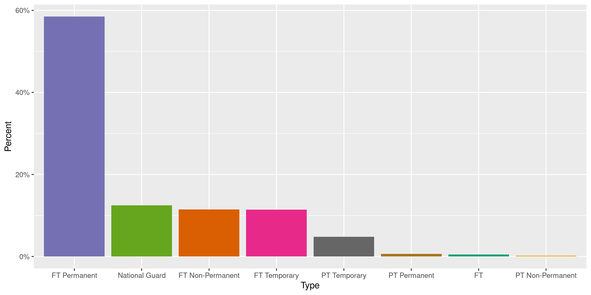
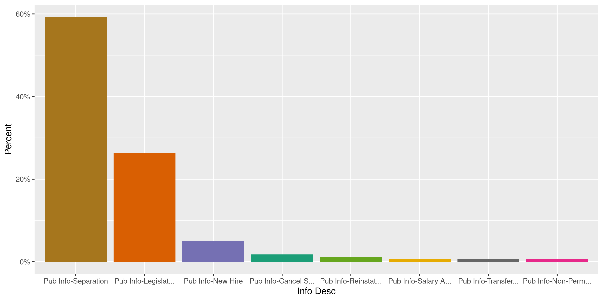
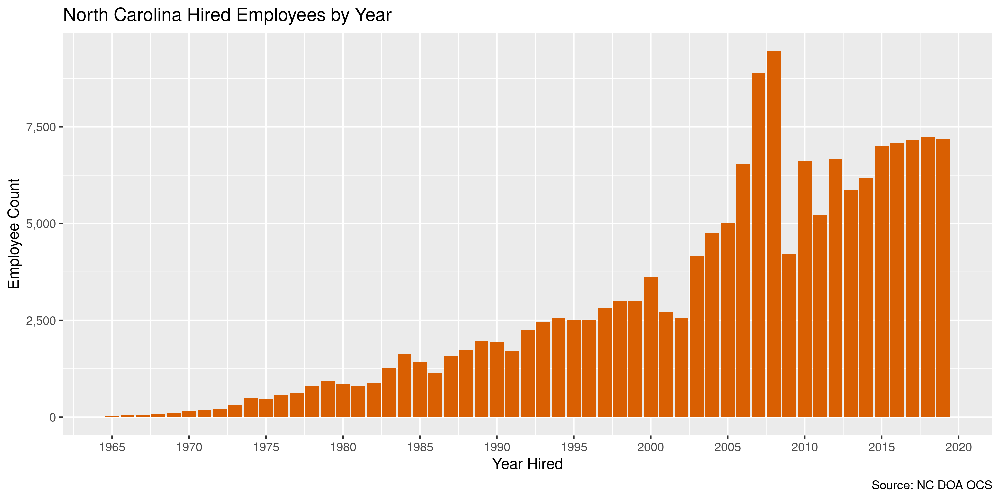

North Carolina Salaries
================
Kiernan Nicholls
2020-06-02 12:51:59

  - [Project](#project)
  - [Objectives](#objectives)
  - [Packages](#packages)
  - [Data](#data)
  - [Download](#download)
  - [Extract](#extract)
  - [Read](#read)
  - [Explore](#explore)
  - [Wrangle](#wrangle)
  - [Conclude](#conclude)
  - [Export](#export)
  - [Upload](#upload)

<!-- Place comments regarding knitting here -->

## Project

The Accountability Project is an effort to cut across data silos and
give journalists, policy professionals, activists, and the public at
large a simple way to search across huge volumes of public data about
people and organizations.

Our goal is to standardizing public data on a few key fields by thinking
of each dataset row as a transaction. For each transaction there should
be (at least) 3 variables:

1.  All **parties** to a transaction.
2.  The **date** of the transaction.
3.  The **amount** of money involved.

## Objectives

This document describes the process used to complete the following
objectives:

1.  How many records are in the database?
2.  Check for entirely duplicated records.
3.  Check ranges of continuous variables.
4.  Is there anything blank or missing?
5.  Check for consistency issues.
6.  Create a five-digit ZIP Code called `zip`.
7.  Create a `year` field from the transaction date.
8.  Make sure there is data on both parties to a transaction.

## Packages

The following packages are needed to collect, manipulate, visualize,
analyze, and communicate these results. The `pacman` package will
facilitate their installation and attachment.

The IRW’s `campfin` package will also have to be installed from GitHub.
This package contains functions custom made to help facilitate the
processing of campaign finance data.

``` r
if (!require("pacman")) install.packages("pacman")
pacman::p_load_gh("irworkshop/campfin")
pacman::p_load(
  docxtractr, # read docx tables
  tidyverse, # data manipulation
  lubridate, # datetime strings
  gluedown, # printing markdown
  magrittr, # pipe operators
  janitor, # clean data frames
  refinr, # cluster and merge
  readxl, # read excel files
  scales, # format strings
  knitr, # knit documents
  vroom, # read files fast
  rvest, # html scraping
  glue, # combine strings
  here, # relative paths
  httr, # http requests
  fs # local storage 
)
```

This document should be run as part of the `R_campfin` project, which
lives as a sub-directory of the more general, language-agnostic
[`irworkshop/accountability_datacleaning`](https://github.com/irworkshop/accountability_datacleaning)
GitHub repository.

The `R_campfin` project uses the [RStudio
projects](https://support.rstudio.com/hc/en-us/articles/200526207-Using-Projects)
feature and should be run as such. The project also uses the dynamic
`here::here()` tool for file paths relative to *your* machine.

``` r
# where does this document knit?
here::here()
#> [1] "/home/kiernan/Code/accountability_datacleaning/R_campfin"
```

## Data

Salary data for the state of North Carolina was obtained via an records
request from the [Office of the State
Controller](https://www.osc.nc.gov/) in the [Division of
Administration](https://ncadmin.nc.gov/). The data was provided via an
expiring download link to a ZIP archive. A record layout and county code
book was also provided as separate attachments.

## Download

We can download the cloud-hosted archive, but this link will likely be
dead in the future. IRW can provide the underlying data upon request.

``` r
raw_dir <- dir_create(here("nc", "salary", "data", "raw"))
raw_url <- "https://osc.cloud.nc.gov/PublicInformation/PIR-20-71.zip"
raw_zip <- path(raw_dir, basename(raw_url))
if (!file_exists(raw_zip)) {
  download.file(raw_url, raw_zip)
}
```

## Extract

The ZIP archive itself contains a number of subsequent ZIP archives.

``` r
(zip_files <- raw_zip %>% 
  unzip(list = TRUE) %>% 
  as_tibble(.name_repair = tolower) %>% 
  mutate(across(length, as_fs_bytes)) %>% 
  mutate(across(name, as_fs_path)))
#> # A tibble: 11 x 3
#>    name                                length date               
#>    <fs::path>                     <fs::bytes> <dttm>             
#>  1 2019/2-4-19 Pub_Info.zip             8.97M 2019-02-05 15:02:00
#>  2 2019/4-30-19_Public_Info.zip         9.09M 2019-05-01 10:16:00
#>  3 2019/6-2-19_Public_Info.zip          9.12M 2019-06-03 11:30:00
#>  4 2019/Pub_Info_3-31-19.zip            9.05M 2019-04-01 09:43:00
#>  5 2019/PUBINFO20190630.zip              9.2M 2019-07-01 11:43:00
#>  6 2019/PUBINFO9-30-2019.zip            9.24M 2019-10-01 09:36:00
#>  7 2019/Public_Info_110-31-19.zip       8.48M 2019-11-01 09:15:00
#>  8 2019/Public_Info_2-28-19.zip         8.99M 2019-03-01 10:59:00
#>  9 2019/Public_Info_7-31-19.zip         9.26M 2019-08-01 10:58:00
#> 10 2019/Public_Info_9-8-19.zip          9.27M 2019-09-09 15:21:00
#> 11 2019/PublicInfo_12-1-19.zip          8.53M 2019-12-02 11:19:00
```

We can extract only the file containing the latest salary data.

``` r
raw_path <- unzip(
  zipfile = raw_zip, 
  files = zip_files$name[11], 
  exdir = raw_dir,
  junkpaths = TRUE
)
```

This file itself is another ZIP archive containing a single text file.
We do not need to unzip this file, as the contents can be read directly.

``` r
raw_path %>% 
  unzip(list = TRUE) %>% 
  as_tibble(.name_repair = tolower) %>% 
  mutate(across(length, as_fs_bytes)) %>% 
  mutate(across(name, as_fs_path))
#> # A tibble: 1 x 3
#>   name                     length date               
#>   <fs::path>          <fs::bytes> <dttm>             
#> 1 PUBINFO20191201.txt       89.4M 2019-12-02 02:43:00
```

## Read

The text file containing salaries is a fixed-width file (FWF) with each
column found at unique line position. We can use the record layout Word
document provided by the OSC to define the columns and their positions.

``` r
doc_path <- dir_ls(here("nc", "salary"), regexp = "docx")
layout <- docx_extract_all_tbls(read_docx(doc_path))[[1]]
(layout <- layout %>% 
  select(start = 1, end = 3, field = 4, length = 5, desciption = 6) %>% 
  map_df(parse_guess))
#> # A tibble: 16 x 5
#>    start   end field              length desciption                                                
#>    <dbl> <dbl> <chr>              <chr>  <chr>                                                     
#>  1     1    40 Personnel Area     40     Personnel area Name                                       
#>  2    41    80 Employee Name      40     Full Name – First, MI, Last                               
#>  3    81   110 Appointment Type   30     Values: PT PermanentFT PermanentPT TemporaryFT TemporaryF…
#>  4   111   112 Age                02     Convert to age based on current date.                     
#>  5   113   122 Original Hire date 10     MMDDCCYY with two spaces on the end   (Not valid for temp…
#>  6   123   132 Agency Hire Date   10     MMDDCCYY with two spaces on the end   (Not valid for temp…
#>  7   133   140 Current Position … 08     Most recent position number.  The will be spaces if the e…
#>  8   141   180 Current Position … 40     Working Title / Position Title (HRP1000)                  
#>  9   181   220 Current Job Title  40     Title assigned to the Job (HRP1000)                       
#> 10   221   230 Last public info … 10     PA0000 MMDDCCYY with two spaces on the end.   This can be…
#> 11   231   290 Last public info … 60     Last Public info action description.                      
#> 12   291   300 Last Salary Incre… 10     Date on which salary was last changed by an Action        
#> 13   301   360 Last Salary Incre… 10     Description of the action that last increased the employe…
#> 14   361   375 Last Salary chang… 15     Salary change amount is calculated as (salary at time of …
#> 15   376   390 Current Salary / … 15     The salary will be current salary or in the case of a sep…
#> 16   391   393 Position County    3      Not available on Separated employees.
```

We can use this information in `readr::read_fwf()` to parse the text
file as a data frame for exploration.

``` r
ncs <- read_fwf(
  file = raw_path,
  col_positions = fwf_cols(
    area = c(1, 40),
    name = c(41, 80),
    type = c(81, 110),
    age = c(111, 112),
    date = c(113, 122),
    agency_date = c(123, 132),
    pos_id = c(133, 140),
    pos_title = c(141, 180),
    job_title = c(181, 220),
    info_date = c(221, 230),
    info_desc = c(231, 290),
    raise_date = c(291, 300),
    raise_desc = c(301, 360),
    raise_change = c(361, 375),
    salary = c(376, 390),
    county_code = c(391, 393)
  ),
  na = c("00000000", "", "NA"),
  col_types = cols(
    .default = col_character(),
    age = col_integer(), # two with * digit
    date = col_date("%m%d%Y"),
    agency_date = col_date("%m%d%Y"),
    info_date = col_date("%m%d%Y"),
    raise_date = col_date("%m%d%Y"),
    salary = col_double()
  )
)
```

The `last_salary_change` column has a number of negative change values
with the negative symbol at the end of the string, preventing them from
being initially parsed as negative numbers with `col_double()`. We can
use regular expressions to manipulate the column and then properly
parse.

``` r
head(str_subset(ncs$raise_change, "-$"))
#> [1] "8840.00-"  "15499.00-" "180.00-"   "7815.00-"  "19516.00-" "5883.60-"
mean(str_detect(ncs$raise_change, "-$"), na.rm = TRUE)
#> [1] 0.03357718
ncs$raise_change %>% 
  str_replace("(.*)(-)$", "\\2\\1") %>% 
  parse_number() -> ncs$raise_change
mean(ncs$raise_change < 0, na.rm = TRUE)
#> [1] 0.03357718
```

We can also use the county codes excel file to get the county names
associated with the county codes found in the salaries data. First, we
need to read the excel sheet as a data frame.

``` r
code_path <- dir_ls(here("nc", "salary"), regexp = "xls")
codes <- read_excel(
  path = code_path,
  col_names = c("county_name", "county_code", "source"),
  col_types = "text",
  .name_repair = make_clean_names
)
codes <- select(codes, 1:2)
codes$county_code <- str_pad(
  string = codes$county_code,
  width = 3, 
  side = "left", 
  pad = "0"
)
```

Then join the two tables together.

``` r
ncs <- left_join(ncs, codes)
```

## Explore

Here we have the top and bottom of the data frame, it appears as though
the entire file has been properly read.

``` r
glimpse(ncs)
#> Rows: 216,472
#> Columns: 17
#> $ area         <chr> "Administration", "Administration", "Administration", "Administration", "Ad…
#> $ name         <chr> "David Brown", "Orville J Hatfield", "Latesha Jones Middleton", "Christophe…
#> $ type         <chr> "FT Permanent", "PT Temporary", "FT Permanent", "FT Permanent", "FT Permane…
#> $ age          <int> 49, 79, 42, 55, 39, 59, 34, 60, 31, 31, 54, 62, 55, 48, 42, 31, 68, 49, 44,…
#> $ date         <date> 2003-01-01, 1994-02-21, 2004-04-01, 2017-09-18, 2001-08-01, 2019-06-01, 20…
#> $ agency_date  <date> 2003-01-01, 2008-09-12, 2004-04-01, 2017-09-18, 2008-06-02, 2019-06-01, 20…
#> $ pos_id       <chr> NA, NA, NA, "60014845", "60014388", "60014383", NA, NA, NA, "65026707", "60…
#> $ pos_title    <chr> NA, NA, NA, "Grounds Worker I", "Administrative Associate I", "Administrati…
#> $ job_title    <chr> "Vehicle/Equipment Repair Technician", "Veterans Service Officer", NA, "Gro…
#> $ info_date    <date> 2008-03-08, 2009-07-30, 2017-09-10, 2019-09-01, 2019-07-01, 2019-07-01, 20…
#> $ info_desc    <chr> "Pub Info-Separation", "Pub Info-Separation", "Pub Info-Cancel Sep Pay Cont…
#> $ raise_date   <date> NA, NA, 2014-07-01, 2019-07-01, 2019-07-01, 2019-07-01, NA, 2012-07-01, NA…
#> $ raise_desc   <chr> NA, NA, "Pub Info-Legislative Increase", "Pub Info-Legislative Increase", "…
#> $ raise_change <dbl> NA, NA, 1000, 780, 780, 780, NA, 438, NA, 888, 918, 854, 1150, 780, NA, NA,…
#> $ salary       <dbl> 35072.00, 17.50, 27780.00, 31980.00, 31980.00, 31980.00, 8.25, 36938.00, 8.…
#> $ county_code  <chr> NA, NA, NA, "092", "092", "092", NA, NA, NA, "092", "092", "092", "092", "0…
#> $ county_name  <chr> NA, NA, NA, "Wake", "Wake", "Wake", NA, NA, NA, "Wake", "Wake", "Wake", "Wa…
tail(ncs)
#> # A tibble: 6 x 17
#>   area  name  type    age date       agency_date pos_id pos_title job_title info_date  info_desc
#>   <chr> <chr> <chr> <int> <date>     <date>      <chr>  <chr>     <chr>     <date>     <chr>    
#> 1 Wild… Stef… FT P…    30 2018-05-07 2018-05-07  60033… Conserva… Wildlife… 2019-07-01 Pub Info…
#> 2 Wild… Jaco… FT P…    41 2005-09-01 2005-09-01  60033… Coldwate… Conserva… 2019-07-01 Pub Info…
#> 3 Wild… Rond… FT P…    53 2002-04-01 2002-04-01  <NA>   <NA>      <NA>      2010-10-01 Pub Info…
#> 4 Wild… Todd… FT P…    50 1996-06-01 1996-06-01  60033… Wildlife… Conserva… 2019-07-01 Pub Info…
#> 5 Wild… Thom… FT P…    35 2015-01-26 2015-01-26  <NA>   <NA>      Conserva… 2018-07-07 Pub Info…
#> 6 Tota… tion… <NA>     NA NA         NA          <NA>   <NA>      <NA>      NA         <NA>     
#> # … with 6 more variables: raise_date <date>, raise_desc <chr>, raise_change <dbl>, salary <dbl>,
#> #   county_code <chr>, county_name <chr>
```

### Missing

Most columns are missing some amount of values; we can flag any records
missing one of the key variables needed to identify a transaction.

``` r
col_stats(ncs, count_na)
#> # A tibble: 17 x 4
#>    col          class       n         p
#>    <chr>        <chr>   <int>     <dbl>
#>  1 area         <chr>       0 0        
#>  2 name         <chr>       0 0        
#>  3 type         <chr>    2615 0.0121   
#>  4 age          <int>       3 0.0000139
#>  5 date         <date>  55072 0.254    
#>  6 agency_date  <date>  55187 0.255    
#>  7 pos_id       <chr>  130969 0.605    
#>  8 pos_title    <chr>  130969 0.605    
#>  9 job_title    <chr>    9448 0.0436   
#> 10 info_date    <date>    794 0.00367  
#> 11 info_desc    <chr>     794 0.00367  
#> 12 raise_date   <date>  67501 0.312    
#> 13 raise_desc   <chr>   69157 0.319    
#> 14 raise_change <dbl>   67472 0.312    
#> 15 salary       <dbl>     443 0.00205  
#> 16 county_code  <chr>  130969 0.605    
#> 17 county_name  <chr>  130969 0.605
```

``` r
ncs <- mutate(ncs, job_pos = coalesce(job_title, pos_title))
ncs <- ncs %>% flag_na(date, name, salary, area, job_pos)
mean(ncs$na_flag)
#> [1] 0.2963478
```

``` r
ncs %>% 
  filter(na_flag) %>% 
  select(date, name, salary, area, job_pos)
#> # A tibble: 64,151 x 5
#>    date       name                       salary area           job_pos      
#>    <date>     <chr>                       <dbl> <chr>          <chr>        
#>  1 2004-04-01 Latesha Jones Middleton  27780    Administration <NA>         
#>  2 NA         Christina H Cuthrell         8.25 Administration Summer Intern
#>  3 2010-10-13 Katrine Fowler Middleton 37444    Administration <NA>         
#>  4 2007-01-01 Kephas Nyakwara Matoke      NA    Administration <NA>         
#>  5 NA         William Foye                11.4  Administration Mail Clerk II
#>  6 1973-12-17 Peggie H Anderson           15.0  Administration <NA>         
#>  7 1998-05-01 Kay H Burnette           27375    Administration <NA>         
#>  8 2007-08-06 Michael Allan Shirley       NA    Administration <NA>         
#>  9 NA         Mary Johnson                11.6  Administration <NA>         
#> 10 NA         Courtney Graham              8.5  Administration <NA>         
#> # … with 64,141 more rows
```

41% of these records missing a hire date, name, salary, area, or
job/position title belong to National Guard members, but it’s not
entirely contained in a single employee type.

``` r
ncs %>% 
  filter(na_flag) %>% 
  count(type, sort = TRUE) %>% 
  add_prop()
#> # A tibble: 11 x 3
#>    type                 n         p
#>    <chr>            <int>     <dbl>
#>  1 National Guard   26246 0.409    
#>  2 FT Temporary     20637 0.322    
#>  3 PT Temporary      8498 0.132    
#>  4 FT Permanent      7543 0.118    
#>  5 FT Non-Permanent   895 0.0140   
#>  6 PT Permanent       112 0.00175  
#>  7 FT                 111 0.00173  
#>  8 Fire Fighter        74 0.00115  
#>  9 PT Non-Permanent    23 0.000359 
#> 10 <NA>                 9 0.000140 
#> 11 PT                   3 0.0000468
```

### Duplicates

There are only a handful of entirely duplicated records.

``` r
ncs <- flag_dupes(ncs, everything())
sum(ncs$dupe_flag)
#> [1] 2
```

``` r
ncs %>% 
  filter(dupe_flag) %>% 
  select(date, name, salary, area, job_pos)
#> # A tibble: 2 x 5
#>   date       name                salary area                         job_pos                       
#>   <date>     <chr>                <dbl> <chr>                        <chr>                         
#> 1 NA         Hollie Alisha Adams      1 Crime Control & Public Safe… Military Administrative Offic…
#> 2 NA         Hollie Alisha Adams      1 Crime Control & Public Safe… Military Administrative Offic…
```

### Categorical

``` r
col_stats(ncs, n_distinct)
#> # A tibble: 20 x 4
#>    col          class       n          p
#>    <chr>        <chr>   <int>      <dbl>
#>  1 area         <chr>      48 0.000222  
#>  2 name         <chr>  215560 0.996     
#>  3 type         <chr>      11 0.0000508 
#>  4 age          <int>      86 0.000397  
#>  5 date         <date>  11993 0.0554    
#>  6 agency_date  <date>  10048 0.0464    
#>  7 pos_id       <chr>   84767 0.392     
#>  8 pos_title    <chr>    6638 0.0307    
#>  9 job_title    <chr>    3326 0.0154    
#> 10 info_date    <date>   4450 0.0206    
#> 11 info_desc    <chr>      74 0.000342  
#> 12 raise_date   <date>   2951 0.0136    
#> 13 raise_desc   <chr>      77 0.000356  
#> 14 raise_change <dbl>   11788 0.0545    
#> 15 salary       <dbl>   42787 0.198     
#> 16 county_code  <chr>     102 0.000471  
#> 17 county_name  <chr>     102 0.000471  
#> 18 job_pos      <chr>    3326 0.0154    
#> 19 na_flag      <lgl>       2 0.00000924
#> 20 dupe_flag    <lgl>       2 0.00000924
```

<!-- --><!-- --><!-- -->

### Amounts

A significant amount of employees have a current salary less than or
equal to $1.

``` r
summary(ncs$salary)
#>     Min.  1st Qu.   Median     Mean  3rd Qu.     Max.     NA's 
#>      0.0     17.8  34000.0  33663.7  47195.0 387081.0      443
mean(ncs$salary <= 1, na.rm = TRUE)
#> [1] 0.1357318
```

Here is the employee with the highest salary.

``` r
ncs[which.max(ncs$salary), ] %>% 
  mutate(across(salary, dollar)) %>% 
  glimpse()
#> Rows: 1
#> Columns: 20
#> $ area         <chr> "State Treasurer"
#> $ name         <chr> "Kevin Walter SigRist"
#> $ type         <chr> "FT Permanent"
#> $ age          <int> 58
#> $ date         <date> 2013-01-14
#> $ agency_date  <date> 2013-01-14
#> $ pos_id       <chr> NA
#> $ pos_title    <chr> NA
#> $ job_title    <chr> "DST Chief Investment Officer"
#> $ info_date    <date> 2017-07-29
#> $ info_desc    <chr> "Pub Info-Separation"
#> $ raise_date   <date> 2017-07-01
#> $ raise_desc   <chr> "Pub Info-Legislative Increase"
#> $ raise_change <dbl> 1000
#> $ salary       <chr> "$387,081"
#> $ county_code  <chr> NA
#> $ county_name  <chr> NA
#> $ job_pos      <chr> "DST Chief Investment Officer"
#> $ na_flag      <lgl> FALSE
#> $ dupe_flag    <lgl> FALSE
```

<!-- -->

### Dates

Over 25% of all hire `date` values are missing. Again, most of these
missing values belong to members of the National Guard or temporary
employees,

``` r
ncs %>% 
  filter(is.na(date)) %>% 
  count(type, sort = TRUE) %>% 
  add_prop() %>% 
  mutate(c = cumsum(p))
#> # A tibble: 9 x 4
#>   type                 n         p     c
#>   <chr>            <int>     <dbl> <dbl>
#> 1 National Guard   26246 0.477     0.477
#> 2 FT Temporary     20296 0.369     0.845
#> 3 PT Temporary      8249 0.150     0.995
#> 4 FT Permanent       106 0.00192   0.997
#> 5 FT Non-Permanent    93 0.00169   0.999
#> 6 Fire Fighter        74 0.00134   1.00 
#> 7 <NA>                 4 0.0000726 1.00 
#> 8 PT Non-Permanent     2 0.0000363 1.00 
#> 9 PT Permanent         2 0.0000363 1
```

We can add the calendar year from `date` with `lubridate::year()`

``` r
ncs <- mutate(ncs, year = year(date))
```

``` r
min(ncs$date, na.rm = TRUE)
#> [1] "1949-09-29"
sum(ncs$year < 2000, na.rm = TRUE)
#> [1] 43183
max(ncs$date, na.rm = TRUE)
#> [1] "2217-06-12"
sum(ncs$date > today(), na.rm = TRUE)
#> [1] 1
```

State employees have hire dates going back to 1949-09-29.

<!-- -->

## Wrangle

Before exporting, we will add the 2-letter state abbreviation.

``` r
ncs <- mutate(ncs, state = "NC", .before = area)
```

## Conclude

1.  There are 216,472 records in the database.
2.  There are 2 duplicate records in the database.
3.  The range and distribution of `salary` and `date` seem reasonable,
    aside from the $1 salaries.
4.  There are 64,151 records missing key variables.
5.  There are no geographic variables in need of normalization.
6.  The 4-digit `year` variable has been created with
    `lubridate::year()`.

## Export

Now the file can be saved on disk for upload to the Accountability
server.

``` r
clean_dir <- dir_create(here("nc", "salary", "data", "clean"))
clean_path <- path(clean_dir, "nc_salary_clean.csv")
write_csv(ncs, clean_path, na = "")
file_size(clean_path)
#> 48M
mutate(file_encoding(clean_path), across(path, path.abbrev))
#> # A tibble: 1 x 3
#>   path                                       mime            charset 
#>   <chr>                                      <chr>           <chr>   
#> 1 ~/nc/salary/data/clean/nc_salary_clean.csv application/csv us-ascii
```

## Upload

Using the [duckr](https://github.com/kiernann/duckr) R package, we can
wrap around the [duck](https://duck.sh/) command line tool to upload the
file to the IRW server.

``` r
# remotes::install_github("kiernann/duckr")
s3_dir <- "s3:/publicaccountability/csv/"
s3_path <- path(s3_dir, basename(clean_path))
if (require(duckr)) {
  duckr::duck_upload(clean_path, s3_path)
}
```
