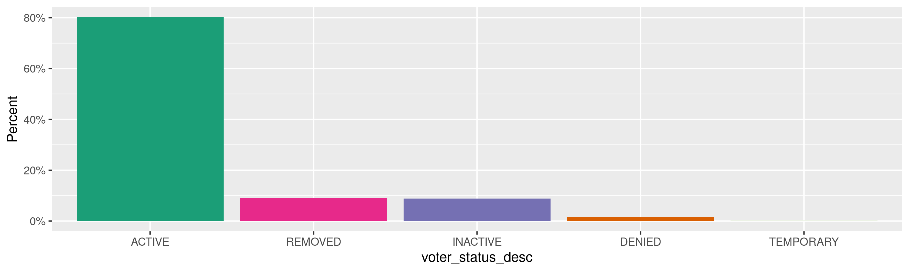
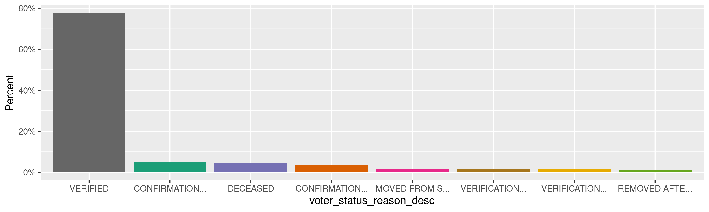
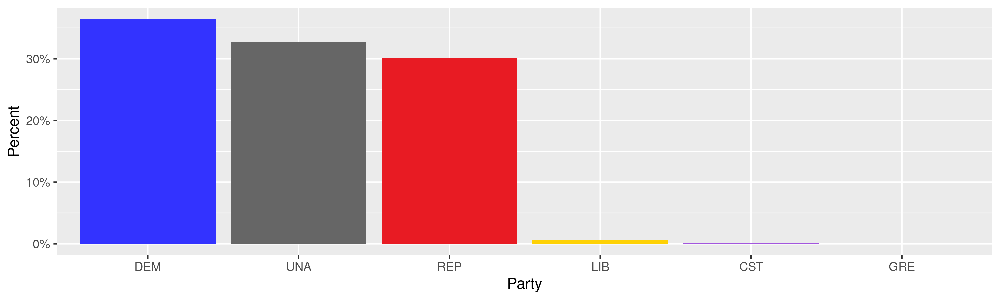
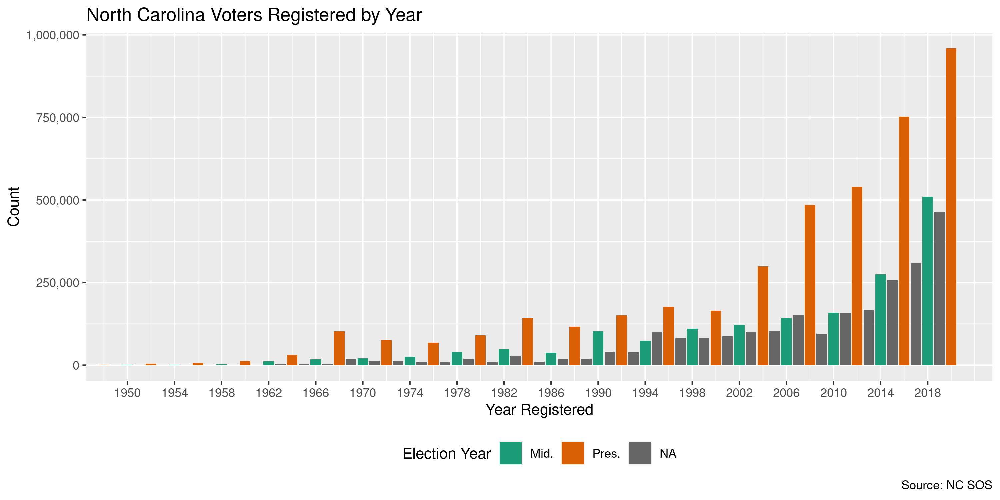
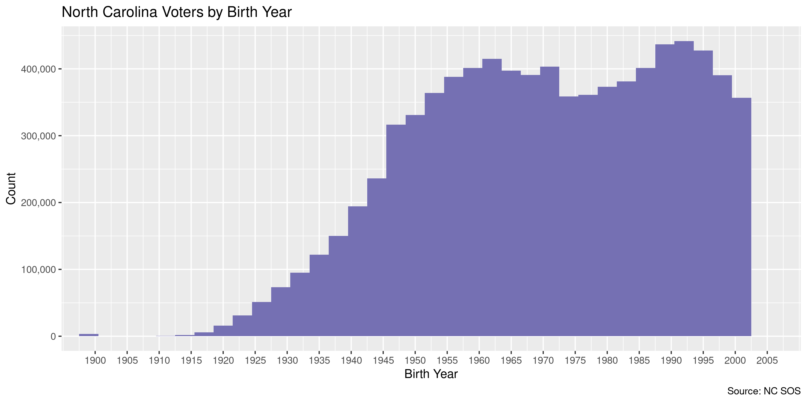

North Carolina Voters
================
Kiernan Nicholls
Wed Dec 23 13:36:36 2020

  - [Project](#project)
  - [Objectives](#objectives)
  - [Packages](#packages)
  - [Data](#data)
      - [About](#about)
  - [Download](#download)
  - [Read](#read)
  - [Explore](#explore)
      - [Missing](#missing)
      - [Duplicates](#duplicates)
      - [Categorical](#categorical)
      - [Dates](#dates)
  - [Wrangle](#wrangle)
  - [Conclude](#conclude)
  - [Export](#export)
  - [Upload](#upload)

<!-- Place comments regarding knitting here -->

## Project

The Accountability Project is an effort to cut across data silos and
give journalists, policy professionals, activists, and the public at
large a simple way to search across huge volumes of public data about
people and organizations.

Our goal is to standardizing public data on a few key fields by thinking
of each dataset row as a transaction. For each transaction there should
be (at least) 3 variables:

1.  All **parties** to a transaction.
2.  The **date** of the transaction.
3.  The **amount** of money involved.

## Objectives

This document describes the process used to complete the following
objectives:

1.  How many records are in the database?
2.  Check for entirely duplicated records.
3.  Check ranges of continuous variables.
4.  Is there anything blank or missing?
5.  Check for consistency issues.
6.  Create a five-digit ZIP Code called `zip`.
7.  Create a `year` field from the transaction date.
8.  Make sure there is data on both parties to a transaction.

## Packages

The following packages are needed to collect, manipulate, visualize,
analyze, and communicate these results. The `pacman` package will
facilitate their installation and attachment.

``` r
if (!require("pacman")) {
  install.packages("pacman")
}
pacman::p_load(
  tidyverse, # data manipulation
  lubridate, # datetime strings
  gluedown, # printing markdown
  janitor, # clean data frames
  campfin, # custom irw tools
  aws.s3, # aws cloud storage
  batman, # na and lgl parse
  refinr, # cluster & merge
  scales, # format strings
  knitr, # knit documents
  vroom, # fast reading
  rvest, # scrape html
  glue, # code strings
  here, # project paths
  httr, # http requests
  fs # local storage 
)
```

This document should be run as part of the `R_campfin` project, which
lives as a sub-directory of the more general, language-agnostic
[`irworkshop/accountability_datacleaning`](https://github.com/irworkshop/accountability_datacleaning)
GitHub repository.

The `R_campfin` project uses the [RStudio
projects](https://support.rstudio.com/hc/en-us/articles/200526207-Using-Projects)
feature and should be run as such. The project also uses the dynamic
`here::here()` tool for file paths relative to *your* machine.

``` r
# where does this document knit?
here::i_am("nc/voters/docs/nc_voters_diary.Rmd")
```

## Data

North Carolina [voter
registration](https://www.ncsbe.gov/results-data/voter-registration-data)
data can be downloaded\] from the AWS S3 [file transfer
page](https://dl.ncsbe.gov/?prefix=data/) of the [State Board of
Elections](https://www.ncsbe.gov/).

> Access various types of North Carolina voter registration data on this
> page. View current voter-level registration records or snapshots of
> voter registration records across 15+ years. You may also view current
> group-level voter demographic counts or election-specific voter
> demographic counts over the last 20+ years.

> The **“ncvoter”** files below contain the most up-to-date publicly
> available information for individuals registered, pre-registered, or
> formerly registered to vote in North Carolina, as well as individuals
> who have attempted to register or have steps left uncompleted in the
> registration or preregistration process.

> **What’s included?** Voter registration status (e.g., active,
> inactive) and reason are included. Voter demographics, birth state,
> address(es), and phone number (when available) are included. Voter
> county, precinct, and district information (e.g., NC Senate and House,
> judicial) are included. When applicable, county commissioner and
> additional local districts (e.g. sanitation, school) are included. See
> file layout for full list of variables.

> **What’s not included?** Voter birthdate, Social Security number, and
> driver’s license number are confidential under state law and are not
> included. Voter history is not included; but Voter Registration Data
> files are linkable to Voter History Data files via NCID or county and
> voter registration number.

> **When are the files updated?** The files are updated weekly on
> Saturday mornings. After each election, it may take multiple weeks for
> all 100 counties to finalize their voter registration.

### About

The NCSBE file transfer page has a public data disclosure and file
layout key.

``` r
readme_public_data <- s3read_using(
  FUN = read_lines,
  object = "data/ReadMe_PUBLIC_DATA.txt",
  bucket = "dl.ncsbe.gov"
)
```

> 
> 
>     /* *******************************************************************************
>     * name:     ReadMe_PUBLIC_DATA.txt
>     * purpose:  Notification to the public, media, and interested parties.  
>     *           The data and documents contained within this publicly accessible site 
>     *           and all subforders herein provided by the NC State Board of Elections 
>     *           are considered public information per NC General Statutes. 
>     * URL:      https://dl.ncsbe.gov/list.html
>     * updated:  09/16/2020
>     ******************************************************************************* */
>     
>     Citations:
>     
>     § 132-1. Public Records.
>     https://www.ncleg.gov/EnactedLegislation/Statutes/PDF/BySection/Chapter_132/GS_132-1.pdf
>     
>     § 163-82.10.  Official record of voter registration.
>     https://www.ncleg.gov/EnactedLegislation/Statutes/PDF/BySection/Chapter_163/GS_163-82.10.pdf

``` r
layout_ncvoter <- s3read_using(
  FUN = read_lines,
  object = "data/layout_ncvoter.txt",
  bucket = "dl.ncsbe.gov"
)
```

> 
> 
>     /***********************************************************************************
>     * name:     layout_ncvoter.txt
>     * purpose:  Contains all legally available voter specific information. Personally 
>     *           identifying information (PII) such as birth date and drivers license are
>     *           not included. Voter registrations with a voter_status_reason_desc of 
>     *           Removed are omitted whenever the most recent last voted date is greater 
>     *           than 10 years.
>     *           This is a weekly point-in-time snapshot current per file date/time stamp. 
>     * updated:  09/09/2020
>     * format:   tab delimited
>     * instructions: 
>     *            1) extract using a file archiving and compression program (eg. WinZip)
>     *            2) data can be linked to ncvhis file by ncid
>     ***********************************************************************************/

#### Layout

The column layout table tells us what columns are included and what type
of data they contain.

``` r
raw_layout <- read_fwf(
  file = layout_ncvoter[19:89],
  col_positions = fwf_positions(
    start = c(1, 25, 44),
    end = c(24, 43, NA),
    col_names = c("name", "data type", "description")
  )
)
```

| name                       | type    | length | description                                                                  |
| :------------------------- | :------ | -----: | :--------------------------------------------------------------------------- |
| `county_id`                | `<int>` |     NA | County identification number                                                 |
| `county_desc`              | `<chr>` |     15 | County name                                                                  |
| `voter_reg_num`            | `<fct>` |     12 | Voter registration number (unique to county)                                 |
| `status_cd`                | `<fct>` |      2 | Registration status code                                                     |
| `voter_status_desc`        | `<chr>` |     25 | Registration status description                                              |
| `reason_cd`                | `<chr>` |      2 | Registration status reason code                                              |
| `voter_status_reason_desc` | `<chr>` |     60 | Registration status reason description                                       |
| `absent_ind`               | `<fct>` |      1 | NOT USED                                                                     |
| `name_prefx_cd`            | `<fct>` |      4 | NOT USED                                                                     |
| `last_name`                | `<chr>` |     25 | Voter last name                                                              |
| `first_name`               | `<chr>` |     20 | Voter first name                                                             |
| `middle_name`              | `<chr>` |     20 | Voter middle name                                                            |
| `name_suffix_lbl`          | `<fct>` |      3 | Voter suffix name (JR, III, etc.)                                            |
| `res_street_address`       | `<chr>` |     65 | Residential street address                                                   |
| `res_city_desc`            | `<chr>` |     60 | Residential city name                                                        |
| `state_cd`                 | `<chr>` |      2 | Residential address state code                                               |
| `zip_code`                 | `<fct>` |      9 | Residential address zip code                                                 |
| `mail_addr1`               | `<chr>` |     40 | Mailing address line 1                                                       |
| `mail_addr2`               | `<chr>` |     40 | Mailing address line 2                                                       |
| `mail_addr3`               | `<chr>` |     40 | Mailing address line 3                                                       |
| `mail_addr4`               | `<chr>` |     40 | Mailing address line 4                                                       |
| `mail_city`                | `<chr>` |      3 | Mailing address city name                                                    |
| `mail_state`               | `<chr>` |      2 | Mailing address city code                                                    |
| `mail_zipcode`             | `<fct>` |      9 | Mailing address zip code                                                     |
| `full_phone_number`        | `<chr>` |     12 | Full phone number including area code                                        |
| `race_code`                | `<fct>` |      3 | Race code                                                                    |
| `ethnic_code`              | `<fct>` |      3 | Ethnicity code                                                               |
| `party_cd`                 | `<fct>` |      3 | Regisered party code                                                         |
| `gender_code`              | `<fct>` |      1 | Gender/sex code                                                              |
| `birth_age`                | `<int>` |     NA | End of year age                                                              |
| `birth_state`              | `<chr>` |      2 | Birth state                                                                  |
| `drivers_lic`              | `<lgl>` |      1 | Drivers license (Y/N)                                                        |
| `registr_dt`               | `<fct>` |     10 | Registration date                                                            |
| `precinct_abbrv`           | `<chr>` |      6 | Precinct abbreviation                                                        |
| `precinct_desc`            | `<chr>` |     60 | Precinct name                                                                |
| `municipality_abbrv`       | `<chr>` |      6 | Municipality jurisdiction abbreviation                                       |
| `municipality_desc`        | `<chr>` |     60 | Municipality jurisdiction name                                               |
| `ward_abbrv`               | `<chr>` |      6 | Ward jurisdiction abbreviation                                               |
| `ward_desc`                | `<chr>` |     60 | Ward jurisdiction name                                                       |
| `cong_dist_abbrv`          | `<chr>` |      6 | Congressional district abbreviation                                          |
| `super_court_abbrv`        | `<chr>` |      6 | Superior court jurisdiction abbreviation                                     |
| `judic_dist_abbrv`         | `<chr>` |      6 | Judicial district abbreviation                                               |
| `nc_senate_abbrv`          | `<chr>` |      6 | NC Senate jurisdiction abbreviation                                          |
| `nc_house_abbrv`           | `<chr>` |      6 | NC House jurisdiction abbreviation                                           |
| `county_commiss_abbrv`     | `<chr>` |      6 | County commisioner jurisdiction abbreviation                                 |
| `county_commiss_desc`      | `<chr>` |     60 | County commisioner jurisdiction name                                         |
| `township_abbrv`           | `<chr>` |      6 | Township jurisdiction abbreviation                                           |
| `township_desc`            | `<chr>` |     60 | Township jurisdiction name                                                   |
| `school_dist_abbrv`        | `<chr>` |      6 | School district abbreviation                                                 |
| `school_dist_desc`         | `<chr>` |     60 | School district abbreviation                                                 |
| `fire_dist_abbrv`          | `<chr>` |      6 | Fire district abbreviation                                                   |
| `fire_dist_desc`           | `<chr>` |     60 | Fir district name                                                            |
| `water_dist_abbrv`         | `<chr>` |      6 | Water district abbreviation                                                  |
| `water_dist_desc`          | `<chr>` |     60 | Water district name                                                          |
| `sewer_dist_abbrv`         | `<chr>` |      6 | Sewer district abbreviation                                                  |
| `sewer_dist_desc`          | `<chr>` |     60 | Sewer district name                                                          |
| `sanit_dist_abbrv`         | `<chr>` |      6 | Sanitation district abbreviation                                             |
| `sanit_dist_desc`          | `<chr>` |     60 | Sanitation district name                                                     |
| `rescue_dist_abbrv`        | `<chr>` |      6 | Rescue district abbreviation                                                 |
| `rescue_dist_desc`         | `<chr>` |     60 | Rescue district name                                                         |
| `munic_dist_abbrv`         | `<chr>` |      6 | Municpal district abbreviation                                               |
| `munic_dist_desc`          | `<chr>` |     60 | Municipal district name                                                      |
| `dist_1_abbrv`             | `<chr>` |      6 | Presecutorial district abbreviation                                          |
| `dist_1_desc`              | `<chr>` |     60 | Presecutorial district name                                                  |
| `dist_2_abbrv`             | `<chr>` |      6 | NOT USED                                                                     |
| `dist_2_desc`              | `<chr>` |     60 | NOT USED                                                                     |
| `confidential_ind`         | `<fct>` |      1 | Confidential ind (certain data is confidential for this registration record) |
| `birth_year`               | `<fct>` |      4 | Year of birth                                                                |
| `ncid`                     | `<fct>` |     12 | North Carolina identification (NCID) number                                  |
| `vtd_abbrv`                | `<chr>` |      6 | Voter tabulation district abbreviation                                       |
| `vtd_desc`                 | `<chr>` |     60 | Voter tabulation district name                                               |

#### Codes

There are four additional tables describing the codes found in the data.

``` r
read_layout <- function(string, first, last, col_types = "cc") {
  string <- str_trim(string)
  read_fwf(
    file = string[seq(first, last)],
    col_types = col_types,
    col_positions = fwf_positions(
      start = c(1, 20),
      end = c(19, NA),
      col_names = str_split(
        string = string[first - 2],
        pattern = "\\s{2,}",
        simplify = TRUE
      )
    )
  )
}
```

##### Status

There are five codes for voter status.

| status | description                                     |
| :----- | :---------------------------------------------- |
| A      | ACTIVE                                          |
| D      | DENIED                                          |
| I      | INACTIVE                                        |
| R      | REMOVED                                         |
| S      | TEMPORARY (APPLICABLE TO MILITARY AND OVERSEAS) |

##### Race and Ethnicity

There are eight codes for the voter’s race and three codes for
ethnicity.

| race | description                         |
| :--- | :---------------------------------- |
| A    | ASIAN                               |
| B    | BLACK or AFRICAN AMERICAN           |
| I    | AMERICAN INDIAN or ALASKA NATIVE    |
| M    | TWO or MORE RACES                   |
| O    | OTHER                               |
| P    | NATIVE HAWAIIAN or PACIFIC ISLANDER |
| U    | UNDESIGNATED                        |
| W    | WHITE                               |

| ethnicity | description                |
| :-------- | :------------------------- |
| HL        | HISPANIC or LATINO         |
| NL        | NOT HISPANIC or NOT LATINO |
| UN        | UNDESIGNATED               |

##### County

There are 100 counties in North Carolina, each with a numeric code.

    #> # A tibble: 100 x 2
    #>    county    county_id
    #>    <chr>         <int>
    #>  1 ALAMANCE          1
    #>  2 ALEXANDER         2
    #>  3 ALLEGHANY         3
    #>  4 ANSON             4
    #>  5 ASHE              5
    #>  6 AVERY             6
    #>  7 BEAUFORT          7
    #>  8 BERTIE            8
    #>  9 BLADEN            9
    #> 10 BRUNSWICK        10
    #> # … with 90 more rows

## Download

The `data/ncvoter_Statewide.zip` object can be downloaded and extracted
locally.

``` r
raw_dir <- dir_create(here("nc", "voters", "data", "raw"))
raw_obj <- "ncvoter_Statewide.zip"
raw_zip <- path(raw_dir, raw_obj)
```

``` r
if (!file_exists(raw_zip)) {
  save_object(
    object = path("data", raw_obj),
    bucket = "dl.ncsbe.gov",
    file = raw_zip,
    show_progress = TRUE
  )
}
```

``` r
raw_txt <- path(raw_dir, unzip(raw_zip, list = TRUE)$Name)
if (!file_exists(raw_txt)) {
  unzip(raw_zip, exdir = raw_dir)
}
```

## Read

Using the column layout file, we can read this text file as a data
frame.

``` r
ncv <- vroom(
  file = raw_txt,
  delim = "\t",
  na = c("", " "),
  escape_backslash = FALSE,
  escape_double = FALSE,
  col_types = cols(
    .default = col_character(),
    county_id = col_integer(),
    absent_ind = col_skip(),
    name_prefx_cd = col_skip(),
    birth_age = col_integer(),
    registr_dt = col_date("%m/%d/%Y"),
    dist_2_abbrv = col_skip(),
    dist_2_desc = col_skip(),
    birth_year = col_integer()
  )
)
```

``` r
unique(ncv$drivers_lic)
#> [1] "N" "Y"
ncv <- mutate(ncv, across(drivers_lic, to_logical))
ncv <- mutate(ncv, across(res_street_address, str_squish))
```

## Explore

There are 8,315,727 rows of 67 columns. Each record represents a single
voter once registered in the state of North Carolina, represented by the
unique `ncid` variable.

``` r
prop_distinct(ncv$ncid)
#> [1] 1
glimpse(ncv)
#> Rows: 8,315,727
#> Columns: 67
#> $ county_id                <int> 1, 1, 1, 1, 1, 1, 1, 1, 1, 1, 1, 1, 1, 1, 1, 1, 1, 1, 1, 1, 1, 1, 1, 1, 1, 1, 1, 1, …
#> $ county_desc              <chr> "ALAMANCE", "ALAMANCE", "ALAMANCE", "ALAMANCE", "ALAMANCE", "ALAMANCE", "ALAMANCE", …
#> $ voter_reg_num            <chr> "000009005990", "000009178574", "000009205561", "000009048723", "000009019674", "000…
#> $ status_cd                <chr> "A", "A", "A", "A", "A", "A", "A", "A", "A", "A", "A", "A", "A", "A", "A", "A", "A",…
#> $ voter_status_desc        <chr> "ACTIVE", "ACTIVE", "ACTIVE", "ACTIVE", "ACTIVE", "ACTIVE", "ACTIVE", "ACTIVE", "ACT…
#> $ reason_cd                <chr> "AV", "AV", "AV", "AV", "AV", "AV", "AV", "AV", "AV", "AV", "AV", "AV", "AV", "AV", …
#> $ voter_status_reason_desc <chr> "VERIFIED", "VERIFIED", "VERIFIED", "VERIFIED", "VERIFIED", "VERIFIED", "VERIFIED", …
#> $ last_name                <chr> "AABEL", "AARDEN", "AARMSTRONG", "AARON", "AARON", "AARON", "AARON", "AARON", "AARON…
#> $ first_name               <chr> "RUTH", "JONI", "TIMOTHY", "CHRISTINA", "CLAUDIA", "JAMES", "KIMBERLY", "NATHAN", "R…
#> $ middle_name              <chr> "EVELYN", "AUTUMN", "DUANE", "CASTAGNA", "HAYDEN", "MICHAEL", "GREEN", "EDWARD", "BR…
#> $ name_suffix_lbl          <chr> NA, NA, NA, NA, NA, NA, NA, NA, NA, NA, NA, NA, NA, NA, NA, "JR", NA, NA, NA, NA, NA…
#> $ res_street_address       <chr> "4430 E GREENSBORO-CHAPEL HILL RD", "117 W CLAY ST", "3670 COVINGTON TRL", "421 WHIT…
#> $ res_city_desc            <chr> "GRAHAM", "MEBANE", "MEBANE", "BURLINGTON", "BURLINGTON", "GRAHAM", "BURLINGTON", "B…
#> $ state_cd                 <chr> "NC", "NC", "NC", "NC", "NC", "NC", "NC", "NC", "NC", "NC", "NC", "NC", "NC", "NC", …
#> $ zip_code                 <chr> "27253", "27302", "27302", "27215", "27215", "27253", "27215", "27215", "27215", "27…
#> $ mail_addr1               <chr> "4430 E GREENSBORO-CHAPEL HILL RD", "117 W CLAY ST", "3670 COVINGTON TRL", "421 WHIT…
#> $ mail_addr2               <chr> NA, NA, NA, NA, NA, NA, NA, NA, NA, NA, NA, NA, NA, NA, NA, NA, NA, NA, NA, NA, NA, …
#> $ mail_addr3               <chr> NA, NA, NA, NA, NA, NA, NA, NA, NA, NA, NA, NA, NA, NA, NA, NA, NA, NA, NA, NA, NA, …
#> $ mail_addr4               <chr> NA, NA, NA, NA, NA, NA, NA, NA, NA, NA, NA, NA, NA, NA, NA, NA, NA, NA, NA, NA, NA, …
#> $ mail_city                <chr> "GRAHAM", "MEBANE", "MEBANE", "BURLINGTON", "BURLINGTON", "SAXAPAHAW", "BURLINGTON",…
#> $ mail_state               <chr> "NC", "NC", "NC", "NC", "NC", "NC", "NC", "NC", "NC", "NC", "NC", "NC", "NC", "NC", …
#> $ mail_zipcode             <chr> "27253", "27302", "27302", "27215", "27215", "27340", "27215", "27215", "27215", "27…
#> $ full_phone_number        <chr> NA, "2024710419", NA, "3362291110", "2228834", "2027443411", "2529408167", "33622911…
#> $ race_code                <chr> "W", "W", "W", "W", "W", "W", "B", "W", "W", "W", "W", "W", "W", "U", "W", "W", "W",…
#> $ ethnic_code              <chr> "NL", "UN", "UN", "UN", "NL", "UN", "NL", "UN", "UN", "HL", "NL", "NL", "NL", "UN", …
#> $ party_cd                 <chr> "UNA", "UNA", "REP", "UNA", "UNA", "DEM", "DEM", "UNA", "UNA", "UNA", "REP", "REP", …
#> $ gender_code              <chr> "F", "F", "M", "F", "F", "M", "F", "M", "M", "F", "M", "F", "M", "U", "M", "M", "F",…
#> $ birth_age                <int> 85, 42, 54, 44, 75, 72, 54, 44, 48, 45, 76, 48, 58, 33, 60, 34, 69, 61, 31, 27, 30, …
#> $ birth_state              <chr> "NY", "DC", "AL", "NC", "VA", "MA", "NC", "NC", "VA", NA, "VA", "NC", "WI", NA, "LA"…
#> $ drivers_lic              <lgl> FALSE, TRUE, FALSE, TRUE, TRUE, FALSE, TRUE, TRUE, TRUE, FALSE, TRUE, TRUE, TRUE, TR…
#> $ registr_dt               <date> 1984-10-01, 2018-02-23, 2020-10-31, 1996-03-26, 1989-08-15, 2012-03-07, 2020-06-01,…
#> $ precinct_abbrv           <chr> "08N", "10N", "103", "03S", "124", "08N", "03S", "03S", "124", "124", "124", "13", "…
#> $ precinct_desc            <chr> "NORTH NEWLIN", "NORTH MELVILLE", "MELVILLE 3", "SOUTH BOONE", "BURLINGTON 4", "NORT…
#> $ municipality_abbrv       <chr> NA, "MEB", NA, "BUR", "BUR", NA, "BUR", "BUR", "BUR", "BUR", "BUR", "HAW", "HAW", "G…
#> $ municipality_desc        <chr> NA, "MEBANE", NA, "BURLINGTON", "BURLINGTON", NA, "BURLINGTON", "BURLINGTON", "BURLI…
#> $ ward_abbrv               <chr> NA, NA, NA, NA, NA, NA, NA, NA, NA, NA, NA, NA, NA, NA, NA, NA, NA, NA, NA, NA, NA, …
#> $ ward_desc                <chr> NA, NA, NA, NA, NA, NA, NA, NA, NA, NA, NA, NA, NA, NA, NA, NA, NA, NA, NA, NA, NA, …
#> $ cong_dist_abbrv          <chr> "13", "13", "13", "13", "13", "13", "13", "13", "13", "13", "13", "13", "13", "13", …
#> $ super_court_abbrv        <chr> "15A", "15A", "15A", "15A", "15A", "15A", "15A", "15A", "15A", "15A", "15A", "15A", …
#> $ judic_dist_abbrv         <chr> "15A", "15A", "15A", "15A", "15A", "15A", "15A", "15A", "15A", "15A", "15A", "15A", …
#> $ nc_senate_abbrv          <chr> "24", "24", "24", "24", "24", "24", "24", "24", "24", "24", "24", "24", "24", "24", …
#> $ nc_house_abbrv           <chr> "064", "063", "063", "064", "063", "064", "064", "064", "063", "063", "063", "063", …
#> $ county_commiss_abbrv     <chr> NA, NA, NA, NA, NA, NA, NA, NA, NA, NA, NA, NA, NA, NA, NA, NA, NA, NA, NA, NA, NA, …
#> $ county_commiss_desc      <chr> NA, NA, NA, NA, NA, NA, NA, NA, NA, NA, NA, NA, NA, NA, NA, NA, NA, NA, NA, NA, NA, …
#> $ township_abbrv           <chr> NA, NA, NA, NA, NA, NA, NA, NA, NA, NA, NA, NA, NA, NA, NA, NA, NA, NA, NA, NA, NA, …
#> $ township_desc            <chr> NA, NA, NA, NA, NA, NA, NA, NA, NA, NA, NA, NA, NA, NA, NA, NA, NA, NA, NA, NA, NA, …
#> $ school_dist_abbrv        <chr> NA, NA, NA, NA, NA, NA, NA, NA, NA, NA, NA, NA, NA, NA, NA, NA, NA, NA, NA, NA, NA, …
#> $ school_dist_desc         <chr> NA, NA, NA, NA, NA, NA, NA, NA, NA, NA, NA, NA, NA, NA, NA, NA, NA, NA, NA, NA, NA, …
#> $ fire_dist_abbrv          <chr> NA, NA, NA, NA, NA, NA, NA, NA, NA, NA, NA, NA, NA, NA, NA, NA, NA, NA, NA, NA, NA, …
#> $ fire_dist_desc           <chr> NA, NA, NA, NA, NA, NA, NA, NA, NA, NA, NA, NA, NA, NA, NA, NA, NA, NA, NA, NA, NA, …
#> $ water_dist_abbrv         <chr> NA, NA, NA, NA, NA, NA, NA, NA, NA, NA, NA, NA, NA, NA, NA, NA, NA, NA, NA, NA, NA, …
#> $ water_dist_desc          <chr> NA, NA, NA, NA, NA, NA, NA, NA, NA, NA, NA, NA, NA, NA, NA, NA, NA, NA, NA, NA, NA, …
#> $ sewer_dist_abbrv         <chr> NA, NA, NA, NA, NA, NA, NA, NA, NA, NA, NA, NA, NA, NA, NA, NA, NA, NA, NA, NA, NA, …
#> $ sewer_dist_desc          <chr> NA, NA, NA, NA, NA, NA, NA, NA, NA, NA, NA, NA, NA, NA, NA, NA, NA, NA, NA, NA, NA, …
#> $ sanit_dist_abbrv         <chr> NA, NA, NA, NA, NA, NA, NA, NA, NA, NA, NA, NA, NA, NA, NA, NA, NA, NA, NA, NA, NA, …
#> $ sanit_dist_desc          <chr> NA, NA, NA, NA, NA, NA, NA, NA, NA, NA, NA, NA, NA, NA, NA, NA, NA, NA, NA, NA, NA, …
#> $ rescue_dist_abbrv        <chr> NA, NA, NA, NA, NA, NA, NA, NA, NA, NA, NA, NA, NA, NA, NA, NA, NA, NA, NA, NA, NA, …
#> $ rescue_dist_desc         <chr> NA, NA, NA, NA, NA, NA, NA, NA, NA, NA, NA, NA, NA, NA, NA, NA, NA, NA, NA, NA, NA, …
#> $ munic_dist_abbrv         <chr> NA, "MEB", NA, "BUR", "BUR", NA, "BUR", "BUR", "BUR", "BUR", "BUR", "HAW", "HAW", "G…
#> $ munic_dist_desc          <chr> NA, "MEBANE", NA, "BURLINGTON", "BURLINGTON", NA, "BURLINGTON", "BURLINGTON", "BURLI…
#> $ dist_1_abbrv             <chr> "17", "17", "17", "17", "17", "17", "17", "17", "17", "17", "17", "17", "17", "17", …
#> $ dist_1_desc              <chr> "17TH PROSECUTORIAL", "17TH PROSECUTORIAL", "17TH PROSECUTORIAL", "17TH PROSECUTORIA…
#> $ confidential_ind         <chr> "N", "N", "N", "N", "N", "N", "N", "N", "N", "N", "N", "N", "N", "N", "N", "N", "N",…
#> $ birth_year               <int> 1935, 1978, 1966, 1976, 1945, 1948, 1966, 1976, 1972, 1975, 1944, 1972, 1962, 1987, …
#> $ ncid                     <chr> "AA56273", "AA201627", "AA216996", "AA98377", "AA69747", "AA170513", "BM49306", "AA9…
#> $ vtd_abbrv                <chr> "08N", "10N", "103", "03S", "124", "08N", "03S", "03S", "124", "124", "124", "13", "…
#> $ vtd_desc                 <chr> "08N", "10N", "103", "03S", "124", "08N", "03S", "03S", "124", "124", "124", "13", "…
tail(ncv)
#> # A tibble: 6 x 67
#>   county_id county_desc voter_reg_num status_cd voter_status_de… reason_cd voter_status_re… last_name first_name
#>       <int> <chr>       <chr>         <chr>     <chr>            <chr>     <chr>            <chr>     <chr>     
#> 1       100 YANCEY      000000026095  A         ACTIVE           AV        VERIFIED         ZITNEY    MICHELLE  
#> 2       100 YANCEY      000000015223  A         ACTIVE           AV        VERIFIED         ZITNEY    VICTORIA  
#> 3       100 YANCEY      000000026014  A         ACTIVE           AV        VERIFIED         ZULICK    DAWN      
#> 4       100 YANCEY      000000026085  A         ACTIVE           AV        VERIFIED         ZULLINGER PAMELA    
#> 5       100 YANCEY      000000030180  A         ACTIVE           AV        VERIFIED         ZURAWSKI  ELAINE    
#> 6       100 YANCEY      000000027386  I         INACTIVE         IN        CONFIRMATION NO… ZYNDA     PAULA     
#> # … with 58 more variables: middle_name <chr>, name_suffix_lbl <chr>, res_street_address <chr>, res_city_desc <chr>,
#> #   state_cd <chr>, zip_code <chr>, mail_addr1 <chr>, mail_addr2 <chr>, mail_addr3 <chr>, mail_addr4 <chr>,
#> #   mail_city <chr>, mail_state <chr>, mail_zipcode <chr>, full_phone_number <chr>, race_code <chr>, ethnic_code <chr>,
#> #   party_cd <chr>, gender_code <chr>, birth_age <int>, birth_state <chr>, drivers_lic <lgl>, registr_dt <date>,
#> #   precinct_abbrv <chr>, precinct_desc <chr>, municipality_abbrv <chr>, municipality_desc <chr>, ward_abbrv <chr>,
#> #   ward_desc <chr>, cong_dist_abbrv <chr>, super_court_abbrv <chr>, judic_dist_abbrv <chr>, nc_senate_abbrv <chr>,
#> #   nc_house_abbrv <chr>, county_commiss_abbrv <chr>, county_commiss_desc <chr>, township_abbrv <chr>,
#> #   township_desc <chr>, school_dist_abbrv <chr>, school_dist_desc <chr>, fire_dist_abbrv <chr>, fire_dist_desc <chr>,
#> #   water_dist_abbrv <chr>, water_dist_desc <chr>, sewer_dist_abbrv <chr>, sewer_dist_desc <chr>,
#> #   sanit_dist_abbrv <chr>, sanit_dist_desc <chr>, rescue_dist_abbrv <chr>, rescue_dist_desc <chr>,
#> #   munic_dist_abbrv <chr>, munic_dist_desc <chr>, dist_1_abbrv <chr>, dist_1_desc <chr>, confidential_ind <chr>,
#> #   birth_year <int>, ncid <chr>, vtd_abbrv <chr>, vtd_desc <chr>
```

### Missing

Columns vary in their degree of missing values.

``` r
col_stats(ncv, count_na)
#> # A tibble: 67 x 4
#>    col                      class        n           p
#>    <chr>                    <chr>    <int>       <dbl>
#>  1 county_id                <int>        0 0          
#>  2 county_desc              <chr>        0 0          
#>  3 voter_reg_num            <chr>        0 0          
#>  4 status_cd                <chr>        0 0          
#>  5 voter_status_desc        <chr>        0 0          
#>  6 reason_cd                <chr>        1 0.000000120
#>  7 voter_status_reason_desc <chr>        1 0.000000120
#>  8 last_name                <chr>        0 0          
#>  9 first_name               <chr>      116 0.0000139  
#> 10 middle_name              <chr>   597247 0.0718     
#> 11 name_suffix_lbl          <chr>  7902641 0.950      
#> 12 res_street_address       <chr>        0 0          
#> 13 res_city_desc            <chr>   758910 0.0913     
#> 14 state_cd                 <chr>   758670 0.0912     
#> 15 zip_code                 <chr>   759011 0.0913     
#> 16 mail_addr1               <chr>   758859 0.0913     
#> 17 mail_addr2               <chr>  8263201 0.994      
#> 18 mail_addr3               <chr>  8311327 0.999      
#> 19 mail_addr4               <chr>  8312277 1.00       
#> 20 mail_city                <chr>   758858 0.0913     
#> 21 mail_state               <chr>   758664 0.0912     
#> 22 mail_zipcode             <chr>   758946 0.0913     
#> 23 full_phone_number        <chr>  4860520 0.584      
#> 24 race_code                <chr>        3 0.000000361
#> 25 ethnic_code              <chr>        0 0          
#> 26 party_cd                 <chr>        0 0          
#> 27 gender_code              <chr>        8 0.000000962
#> 28 birth_age                <int>        0 0          
#> 29 birth_state              <chr>  1622929 0.195      
#> 30 drivers_lic              <lgl>        0 0          
#> 31 registr_dt               <date>       0 0          
#> 32 precinct_abbrv           <chr>   898335 0.108      
#> 33 precinct_desc            <chr>   898335 0.108      
#> 34 municipality_abbrv       <chr>  3703334 0.445      
#> 35 municipality_desc        <chr>  3703334 0.445      
#> 36 ward_abbrv               <chr>  5815940 0.699      
#> 37 ward_desc                <chr>  5815940 0.699      
#> 38 cong_dist_abbrv          <chr>   898335 0.108      
#> 39 super_court_abbrv        <chr>   898335 0.108      
#> 40 judic_dist_abbrv         <chr>   898335 0.108      
#> 41 nc_senate_abbrv          <chr>   898335 0.108      
#> 42 nc_house_abbrv           <chr>   898335 0.108      
#> 43 county_commiss_abbrv     <chr>  3530012 0.424      
#> 44 county_commiss_desc      <chr>  3530012 0.424      
#> 45 township_abbrv           <chr>  7355567 0.885      
#> 46 township_desc            <chr>  7355567 0.885      
#> 47 school_dist_abbrv        <chr>  2455788 0.295      
#> 48 school_dist_desc         <chr>  2455788 0.295      
#> 49 fire_dist_abbrv          <chr>  7972086 0.959      
#> 50 fire_dist_desc           <chr>  7972086 0.959      
#> 51 water_dist_abbrv         <chr>  8179100 0.984      
#> 52 water_dist_desc          <chr>  8179100 0.984      
#> 53 sewer_dist_abbrv         <chr>  8294522 0.997      
#> 54 sewer_dist_desc          <chr>  8294522 0.997      
#> 55 sanit_dist_abbrv         <chr>  8209207 0.987      
#> 56 sanit_dist_desc          <chr>  8209207 0.987      
#> 57 rescue_dist_abbrv        <chr>  8261266 0.993      
#> 58 rescue_dist_desc         <chr>  8261266 0.993      
#> 59 munic_dist_abbrv         <chr>  3703334 0.445      
#> 60 munic_dist_desc          <chr>  3703334 0.445      
#> 61 dist_1_abbrv             <chr>   898335 0.108      
#> 62 dist_1_desc              <chr>   898335 0.108      
#> 63 confidential_ind         <chr>        0 0          
#> 64 birth_year               <int>        0 0          
#> 65 ncid                     <chr>        0 0          
#> 66 vtd_abbrv                <chr>   898335 0.108      
#> 67 vtd_desc                 <chr>   898335 0.108
```

We can flag any record missing a key variable needed to identify a
transaction.

``` r
key_vars <- c("registr_dt", "first_name", "last_name", "birth_year")
ncv <- flag_na(ncv, all_of(key_vars))
sum(ncv$na_flag)
#> [1] 116
```

``` r
ncv %>% 
  filter(na_flag) %>% 
  select(all_of(key_vars))
#> # A tibble: 116 x 4
#>    registr_dt first_name last_name birth_year
#>    <date>     <chr>      <chr>          <int>
#>  1 1968-03-15 <NA>       RUFTY           1931
#>  2 2016-06-17 <NA>       ALDEN           1978
#>  3 2012-10-23 <NA>       BENNETT         1992
#>  4 2020-10-30 <NA>       DILLOW          1982
#>  5 2020-10-15 <NA>       GADDY           1983
#>  6 2020-10-16 <NA>       SHAVER          1981
#>  7 2008-09-16 <NA>       POWELL          1990
#>  8 2012-10-22 <NA>       SYKES           1990
#>  9 2020-11-05 <NA>       LEAKE           1965
#> 10 2020-11-05 <NA>       NIEVES          1984
#> # … with 106 more rows
```

``` r
ncv %>% 
  filter(na_flag) %>% 
  select(all_of(key_vars)) %>% 
  col_stats(count_na)
#> # A tibble: 4 x 4
#>   col        class      n     p
#>   <chr>      <chr>  <int> <dbl>
#> 1 registr_dt <date>     0     0
#> 2 first_name <chr>    116     1
#> 3 last_name  <chr>      0     0
#> 4 birth_year <int>      0     0
```

### Duplicates

We can also flag any record completely duplicated across every column.

``` r
dupe_file <- here("nc", "voters", "dupes.tsv.xz")
```

``` r
if (!file_exists(dupe_file)) {
  file_create(dupe_file)
  ncs <- ncv %>% 
    select(-ncid, -voter_reg_num) %>% 
    group_split(county_id)
  split_id <- split(ncv$ncid, ncv$county_id)
  pb <- txtProgressBar(max = length(ncs), style = 3)
  for (i in seq_along(ncs)) {
    d1 <- duplicated(ncs[[i]], fromLast = FALSE)
    if (any(d1)) {
      d2 <- duplicated(ncs[[i]], fromLast = TRUE)
      dupes <- tibble(ncid = split_id[[i]], dupe_flag = d1 | d2)
      dupes <- filter(dupes, dupe_flag == TRUE)
      vroom_write(dupes, xzfile(dupe_file), append = TRUE)
      rm(d2, dupes)
    }
    rm(d1)
    flush_memory(1)
    setTxtProgressBar(pb, i)
  }
  rm(ohs)
}
```

``` r
file_size(dupe_file)
#> 2.26K
dupes <- read_tsv(
  file = xzfile(dupe_file),
  col_names = c("ncid", "dupe_flag"),
  col_types = cols(
    ncid = col_character(),
    dupe_flag = col_logical()
  )
)
dupes <- distinct(dupes)
```

``` r
nrow(ncv)
#> [1] 8315727
ncv <- left_join(ncv, dupes, by = "ncid")
ncv <- mutate(ncv, dupe_flag = !is.na(dupe_flag))
sum(ncv$dupe_flag)
#> [1] 183
```

We can see that, despite unique IDs, there *are* duplicate voters.

``` r
ncv %>% 
  filter(dupe_flag) %>% 
  select(ncid, all_of(key_vars), zip_code) %>% 
  arrange(last_name)
#> # A tibble: 183 x 6
#>    ncid     registr_dt first_name last_name birth_year zip_code
#>    <chr>    <date>     <chr>      <chr>          <int> <chr>   
#>  1 BZ71067  2019-12-10 HUNTER     ADAMS           2001 27870   
#>  2 BZ71068  2019-12-10 HUNTER     ADAMS           2001 27870   
#>  3 BY747745 2020-08-16 CYNTHIA    ALLEN           1969 27282   
#>  4 BY747746 2020-08-16 CYNTHIA    ALLEN           1969 27282   
#>  5 BE473943 2020-12-16 KATHERINE  ATHERTON        2002 28304   
#>  6 BE473944 2020-12-16 KATHERINE  ATHERTON        2002 28304   
#>  7 CN101111 2020-09-29 DAVID      BALOK           2000 28037   
#>  8 CN101112 2020-09-29 DAVID      BALOK           2000 28037   
#>  9 BY476570 2020-07-24 TIA        BARILE          1987 27455   
#> 10 BY746488 2020-07-24 TIA        BARILE          1987 27455   
#> # … with 173 more rows
```

### Categorical

``` r
col_stats(ncv, n_distinct)
#> # A tibble: 69 x 4
#>    col                      class        n           p
#>    <chr>                    <chr>    <int>       <dbl>
#>  1 county_id                <int>      100 0.0000120  
#>  2 county_desc              <chr>      100 0.0000120  
#>  3 voter_reg_num            <chr>  4161825 0.500      
#>  4 status_cd                <chr>        5 0.000000601
#>  5 voter_status_desc        <chr>        5 0.000000601
#>  6 reason_cd                <chr>       29 0.00000349 
#>  7 voter_status_reason_desc <chr>       27 0.00000325 
#>  8 last_name                <chr>   437316 0.0526     
#>  9 first_name               <chr>   301130 0.0362     
#> 10 middle_name              <chr>   420386 0.0506     
#> 11 name_suffix_lbl          <chr>       18 0.00000216 
#> 12 res_street_address       <chr>  3783921 0.455      
#> 13 res_city_desc            <chr>      774 0.0000931  
#> 14 state_cd                 <chr>        4 0.000000481
#> 15 zip_code                 <chr>      860 0.000103   
#> 16 mail_addr1               <chr>  3780054 0.455      
#> 17 mail_addr2               <chr>    22706 0.00273    
#> 18 mail_addr3               <chr>     3356 0.000404   
#> 19 mail_addr4               <chr>      605 0.0000728  
#> 20 mail_city                <chr>     7212 0.000867   
#> 21 mail_state               <chr>       92 0.0000111  
#> 22 mail_zipcode             <chr>   137416 0.0165     
#> 23 full_phone_number        <chr>  3059041 0.368      
#> 24 race_code                <chr>        9 0.00000108 
#> 25 ethnic_code              <chr>        3 0.000000361
#> 26 party_cd                 <chr>        6 0.000000722
#> 27 gender_code              <chr>        4 0.000000481
#> 28 birth_age                <int>      119 0.0000143  
#> 29 birth_state              <chr>       59 0.00000709 
#> 30 drivers_lic              <lgl>        2 0.000000241
#> 31 registr_dt               <date>   23113 0.00278    
#> 32 precinct_abbrv           <chr>     1893 0.000228   
#> 33 precinct_desc            <chr>     2533 0.000305   
#> 34 municipality_abbrv       <chr>      447 0.0000538  
#> 35 municipality_desc        <chr>      572 0.0000688  
#> 36 ward_abbrv               <chr>      207 0.0000249  
#> 37 ward_desc                <chr>      269 0.0000323  
#> 38 cong_dist_abbrv          <chr>       14 0.00000168 
#> 39 super_court_abbrv        <chr>       74 0.00000890 
#> 40 judic_dist_abbrv         <chr>       49 0.00000589 
#> 41 nc_senate_abbrv          <chr>       51 0.00000613 
#> 42 nc_house_abbrv           <chr>      121 0.0000146  
#> 43 county_commiss_abbrv     <chr>      123 0.0000148  
#> 44 county_commiss_desc      <chr>      143 0.0000172  
#> 45 township_abbrv           <chr>       84 0.0000101  
#> 46 township_desc            <chr>      124 0.0000149  
#> 47 school_dist_abbrv        <chr>      150 0.0000180  
#> 48 school_dist_desc         <chr>      175 0.0000210  
#> 49 fire_dist_abbrv          <chr>      129 0.0000155  
#> 50 fire_dist_desc           <chr>      147 0.0000177  
#> 51 water_dist_abbrv         <chr>       23 0.00000277 
#> 52 water_dist_desc          <chr>       21 0.00000253 
#> 53 sewer_dist_abbrv         <chr>        9 0.00000108 
#> 54 sewer_dist_desc          <chr>        9 0.00000108 
#> 55 sanit_dist_abbrv         <chr>       32 0.00000385 
#> 56 sanit_dist_desc          <chr>       32 0.00000385 
#> 57 rescue_dist_abbrv        <chr>       11 0.00000132 
#> 58 rescue_dist_desc         <chr>       11 0.00000132 
#> 59 munic_dist_abbrv         <chr>      447 0.0000538  
#> 60 munic_dist_desc          <chr>      572 0.0000688  
#> 61 dist_1_abbrv             <chr>       44 0.00000529 
#> 62 dist_1_desc              <chr>       45 0.00000541 
#> 63 confidential_ind         <chr>        3 0.000000361
#> 64 birth_year               <int>      119 0.0000143  
#> 65 ncid                     <chr>  8315727 1          
#> 66 vtd_abbrv                <chr>     1806 0.000217   
#> 67 vtd_desc                 <chr>     1808 0.000217   
#> 68 na_flag                  <lgl>        2 0.000000241
#> 69 dupe_flag                <lgl>        2 0.000000241
```

<!-- --><!-- --><!-- --><!-- --><!-- --><!-- -->

### Dates

There are thousands of voters with a registration date of January 1,
1900. These should be `NA` values, not real dates.

``` r
count_na(ncv$registr_dt)
#> [1] 0
min(ncv$registr_dt, na.rm = TRUE)
#> [1] "1812-07-01"
sum(ncv$registr_dt == "1900-01-01", na.rm = TRUE)
#> [1] 10242
ncv$registr_dt[which(ncv$registr_dt == "1900-01-01")] <- NA
```

``` r
max(ncv$registr_dt, na.rm = TRUE)
#> [1] "2020-12-18"
sum(ncv$registr_dt > today(), na.rm = TRUE)
#> [1] 0
```

We can add the calendar year from `date` with `lubridate::year()`

``` r
ncv <- mutate(ncv, registr_yr = year(registr_dt))
```

<!-- -->

<!-- -->

## Wrangle

To improve the searchability of the database, we will perform some
consistent, confident string normalization. For geographic variables
like city names and ZIP codes, the corresponding `campfin::normal_*()`
functions are tailor made to facilitate this process.

The `state_cd` and `zip_code` variables are already pretty normal, as we
would expect. Although there is a significant amount of missing values
from each.

``` r
prop_in(ncv$zip_code, valid_zip)
#> [1] 0.9999989
prop_na(ncv$zip_code)
#> [1] 0.09127416
```

``` r
ncv %>% 
  count(state_cd, sort = TRUE) %>% 
  add_prop()
#> # A tibble: 4 x 3
#>   state_cd       n           p
#>   <chr>      <int>       <dbl>
#> 1 NC       7557039 0.909      
#> 2 <NA>      758670 0.0912     
#> 3 GA            12 0.00000144 
#> 4 VA             6 0.000000722
```

All of these voters missing `state_cd` or `zip_code` are also missing
the city name and have the `res_street_address` of “REMOVED”.

``` r
geo_vars <- c("res_street_address", "res_city_desc", "state_cd", "zip_code")
```

``` r
ncv %>% 
  select(all_of(key_vars), all_of(geo_vars)) %>% 
  filter(is.na(state_cd))
#> # A tibble: 758,670 x 8
#>    registr_dt first_name last_name   birth_year res_street_address res_city_desc state_cd zip_code
#>    <date>     <chr>      <chr>            <int> <chr>              <chr>         <chr>    <chr>   
#>  1 2014-02-20 DEREK      ABBOTT            1968 REMOVED            <NA>          <NA>     <NA>    
#>  2 2002-11-05 GLADYS     ABBOTT            1952 REMOVED            <NA>          <NA>     <NA>    
#>  3 1990-09-24 JOYCE      ABBOTT            1947 REMOVED            <NA>          <NA>     <NA>    
#>  4 2012-03-26 KLAY       ABELE             1986 REMOVED            <NA>          <NA>     <NA>    
#>  5 1964-05-02 JACQUELINE ABERCROMBIE       1939 REMOVED            <NA>          <NA>     <NA>    
#>  6 1968-10-26 ALICE      ABERNATHY         1921 REMOVED            <NA>          <NA>     <NA>    
#>  7 1982-10-04 BARBARA    ABERNATHY         1947 REMOVED            <NA>          <NA>     <NA>    
#>  8 1972-01-15 PAUL       ABERNATHY         1944 REMOVED            <NA>          <NA>     <NA>    
#>  9 1964-10-24 NELL       ABERNETHY         1921 REMOVED            <NA>          <NA>     <NA>    
#> 10 1964-10-26 PAUL       ABERNETHY         1921 REMOVED            <NA>          <NA>     <NA>    
#> # … with 758,660 more rows
```

Almost all of these voters have a `voter_status_desc` of “REMOVED” which
must result in their address also being removed.

``` r
ncv %>% 
  group_by(no_state = is.na(state_cd)) %>% 
  count(voter_status_desc, sort = TRUE) %>% 
  mutate(p = prop.table(n)) %>% 
  group_split() %>% 
  as.list()
#> [[1]]
#> # A tibble: 4 x 4
#>   no_state voter_status_desc       n       p
#>   <lgl>    <chr>               <int>   <dbl>
#> 1 FALSE    ACTIVE            6673114 0.883  
#> 2 FALSE    INACTIVE           735279 0.0973 
#> 3 FALSE    DENIED             139020 0.0184 
#> 4 FALSE    TEMPORARY            9644 0.00128
#> 
#> [[2]]
#> # A tibble: 4 x 4
#>   no_state voter_status_desc      n         p
#>   <lgl>    <chr>              <int>     <dbl>
#> 1 TRUE     REMOVED           758396 1.00     
#> 2 TRUE     ACTIVE               243 0.000320 
#> 3 TRUE     INACTIVE              18 0.0000237
#> 4 TRUE     DENIED                13 0.0000171
```

We can makes these values `NA`.

``` r
ncv <- mutate(ncv, across(res_street_address, na_if, "REMOVED"))
```

Aside from this, no additional normalization needs to be done. The
addresses are already in proper USPS format.

``` r
count(ncv, res_street_address, sort = TRUE)
#> # A tibble: 3,783,921 x 2
#>    res_street_address                 n
#>    <chr>                          <int>
#>  1 <NA>                          758380
#>  2 1 DUKE UNIVERSITY WEST CAMPUS   3883
#>  3 1801 FAYETTEVILLE ST            3483
#>  4 1 DUKE UNIVERSITY EAST CAMPUS   2191
#>  5 0 WFU                           1965
#>  6 0 WSSU                          1939
#>  7 209 RIDGE RD                    1850
#>  8 9201 UNIVERSITY CITY BLVD       1742
#>  9 701 W MONROE ST                 1581
#> 10 1 A ST                          1266
#> # … with 3,783,911 more rows
```

The `res_city_desc` is also extremely clean, already above our 99%
threshold.

``` r
many_city <- c(valid_city, extra_city, "ELON", "WINSTON-SALEM")
prop_in(ncv$res_city_desc, many_city)
#> [1] 0.9907956
```

## Conclude

``` r
glimpse(sample_n(ncv, 50))
#> Rows: 50
#> Columns: 70
#> $ county_id                <int> 59, 47, 60, 35, 74, 92, 4, 49, 43, 17, 81, 26, 66, 95, 65, 68, 92, 44, 73, 60, 90, 4…
#> $ county_desc              <chr> "MCDOWELL", "HOKE", "MECKLENBURG", "FRANKLIN", "PITT", "WAKE", "ANSON", "IREDELL", "…
#> $ voter_reg_num            <chr> "000000083426", "000000051264", "001000365071", "000000058582", "000030182835", "000…
#> $ status_cd                <chr> "I", "A", "A", "A", "A", "R", "R", "A", "A", "A", "A", "A", "A", "R", "A", "A", "A",…
#> $ voter_status_desc        <chr> "INACTIVE", "ACTIVE", "ACTIVE", "ACTIVE", "ACTIVE", "REMOVED", "REMOVED", "ACTIVE", …
#> $ reason_cd                <chr> "IN", "AV", "AV", "AV", "AV", "RL", "RD", "AV", "AV", "AV", "AV", "AV", "AV", "RL", …
#> $ voter_status_reason_desc <chr> "CONFIRMATION NOT RETURNED", "VERIFIED", "VERIFIED", "VERIFIED", "VERIFIED", "MOVED …
#> $ last_name                <chr> "MCGINNIS", "KENNINGS", "NEWSOME", "ROEDER", "MENDENHALL", "REYNOLDS", "GEFFERS", "E…
#> $ first_name               <chr> "REX", "CAROLYN", "STEPHANIE", "SUSAN", "JAMES", "LONNIE", "DAVID", "JONATHAN", "CAS…
#> $ middle_name              <chr> "TERRY", "EVERETT", "RENEE", "M", "ROBERT", "AUSTIN", "EUGENE", "MICHAEL", "NICOLE",…
#> $ name_suffix_lbl          <chr> NA, NA, NA, NA, NA, NA, NA, NA, NA, NA, NA, NA, NA, NA, NA, NA, NA, NA, NA, NA, NA, …
#> $ res_street_address       <chr> "52 BRANSON CREEK DR", "197 BROWNSTONE DR", "9308 AYLESBURY LN", "214 NORTH POINTE D…
#> $ res_city_desc            <chr> "OLD FORT", "RAEFORD", "CHARLOTTE", "LOUISBURG", "STOKES", NA, NA, "STATESVILLE", "D…
#> $ state_cd                 <chr> "NC", "NC", "NC", "NC", "NC", NA, NA, "NC", "NC", "NC", "NC", "NC", "NC", NA, "NC", …
#> $ zip_code                 <chr> "28762", "28376", "28227", "27549", "27884", NA, NA, "28677", "28334", "27212", "281…
#> $ mail_addr1               <chr> "PO BOX 37", "197 BROWNSTONE DR", "9308 AYLESBURY LN", "214 NORTH POINTE DR", "3190 …
#> $ mail_addr2               <chr> NA, NA, NA, NA, NA, NA, NA, NA, NA, NA, NA, NA, NA, NA, NA, NA, NA, NA, NA, NA, NA, …
#> $ mail_addr3               <chr> NA, NA, NA, NA, NA, NA, NA, NA, NA, NA, NA, NA, NA, NA, NA, NA, NA, NA, NA, NA, NA, …
#> $ mail_addr4               <chr> NA, NA, NA, NA, NA, NA, NA, NA, NA, NA, NA, NA, NA, NA, NA, NA, NA, NA, NA, NA, NA, …
#> $ mail_city                <chr> "OLD FORT", "RAEFORD", "CHARLOTTE", "LOUISBURG", "STOKES", NA, NA, "STATESVILLE", "D…
#> $ mail_state               <chr> "NC", "NC", "NC", "NC", "NC", NA, NA, "NC", "NC", "NC", "NC", "NC", "NC", NA, "NC", …
#> $ mail_zipcode             <chr> "28762", "28376", "28227", "27549", "27884", NA, NA, "28677", "28334", "27212", "281…
#> $ full_phone_number        <chr> NA, "9105833118", "8435130067", NA, "2522179333", NA, NA, NA, NA, NA, "8289190044", …
#> $ race_code                <chr> "W", "B", "W", "W", "W", "W", "W", "W", "U", "B", "W", "I", "B", "W", "W", "W", "W",…
#> $ ethnic_code              <chr> "NL", "NL", "NL", "UN", "NL", "NL", "UN", "NL", "UN", "NL", "NL", "NL", "NL", "NL", …
#> $ party_cd                 <chr> "REP", "DEM", "UNA", "REP", "REP", "UNA", "DEM", "UNA", "REP", "DEM", "UNA", "REP", …
#> $ gender_code              <chr> "M", "F", "F", "F", "M", "M", "M", "M", "U", "M", "F", "M", "F", "M", "M", "F", "M",…
#> $ birth_age                <int> 69, 67, 46, 64, 44, 71, 69, 28, 27, 76, 24, 29, 58, 30, 37, 60, 31, 70, 28, 35, 45, …
#> $ birth_state              <chr> "NC", "NC", "VA", "UT", "NC", "NC", "NC", "NC", NA, "NC", "NC", "NY", "NJ", NA, "NC"…
#> $ drivers_lic              <lgl> FALSE, TRUE, TRUE, TRUE, TRUE, TRUE, TRUE, TRUE, TRUE, TRUE, TRUE, TRUE, TRUE, FALSE…
#> $ registr_dt               <date> 2012-10-02, 2014-03-31, 2016-10-27, 2008-10-10, 2019-09-12, 2013-10-11, 2008-10-27,…
#> $ precinct_abbrv           <chr> "CCREEK", "15", "234", "06", "0501", NA, NA, "ST2", "PR26", "MILT", "28", "G2C-2", "…
#> $ precinct_desc            <chr> "CROOKED CREEK", "PHILIPPI", "PCT 234", "BUNN", "CAROLINA", NA, NA, "STATESVILLE #2"…
#> $ municipality_abbrv       <chr> NA, NA, "MH", NA, NA, NA, NA, "STI", "ER", NA, NA, "FAY", NA, NA, NA, NA, "RAL", NA,…
#> $ municipality_desc        <chr> NA, NA, "MINT HILL", NA, NA, NA, NA, "CITY OF STATESVILLE", "ERWIN", NA, NA, "FAYETT…
#> $ ward_abbrv               <chr> NA, NA, NA, NA, NA, NA, NA, "STI2", "ER05", NA, NA, "1ST", NA, NA, NA, NA, "R-A", NA…
#> $ ward_desc                <chr> NA, NA, NA, NA, NA, NA, NA, "STATESVILLE WARD#2", "WARD #5 - ERWIN", NA, NA, "1ST", …
#> $ cong_dist_abbrv          <chr> "11", "09", "12", "04", "01", NA, NA, "10", "07", "13", "11", "08", "01", NA, "07", …
#> $ super_court_abbrv        <chr> "29A", "19D", "26A", "09", "03A", NA, NA, "22A", "11A", "17A", "29A", "12C", "06B", …
#> $ judic_dist_abbrv         <chr> "29A", "19D", "26", "09", "03A", NA, NA, "22A", "11", "17A", "29A", "12", "06", NA, …
#> $ nc_senate_abbrv          <chr> "47", "21", "40", "18", "05", NA, NA, "34", "12", "30", "47", "21", "03", NA, "09", …
#> $ nc_house_abbrv           <chr> "085", "048", "099", "007", "008", NA, NA, "084", "053", "050", "112", "042", "027",…
#> $ county_commiss_abbrv     <chr> NA, NA, "6", "CC01", "02/A", NA, NA, NA, "CM03", "CM03", "5", "COM2", "02", NA, NA, …
#> $ county_commiss_desc      <chr> NA, NA, "BOARD OF COMMISSIONERS DISTRICT 6", "DISTRICT 1 SEAT 1", "COMMISSIONER #2  …
#> $ township_abbrv           <chr> NA, "04", NA, NA, NA, NA, NA, "ST", "DUKE", NA, NA, NA, "RICH", NA, NA, "CG", NA, NA…
#> $ township_desc            <chr> NA, "TOWNSHIP #04", NA, NA, NA, NA, NA, "STATESVILLE", "DUKE TOWNSHIP", NA, NA, NA, …
#> $ school_dist_abbrv        <chr> NA, NA, "6", "SB01", "3", NA, NA, "3", "SC02", "SCH3", "01", "SCH5", NA, NA, NA, "OR…
#> $ school_dist_desc         <chr> NA, NA, "SCHOOL BOARD DIST 6", "SB DISTRICT 1 SEAT 1", "SCHOOL 3", NA, NA, "SCHOOL #…
#> $ fire_dist_abbrv          <chr> NA, "02", NA, NA, NA, NA, NA, NA, NA, NA, "7", NA, NA, NA, NA, NA, NA, NA, NA, NA, N…
#> $ fire_dist_desc           <chr> NA, "FIRE #02", NA, NA, NA, NA, NA, NA, NA, NA, "HUDLOW", NA, NA, NA, NA, NA, NA, NA…
#> $ water_dist_abbrv         <chr> NA, NA, NA, NA, NA, NA, NA, NA, NA, NA, NA, NA, NA, NA, NA, NA, NA, NA, NA, NA, NA, …
#> $ water_dist_desc          <chr> NA, NA, NA, NA, NA, NA, NA, NA, NA, NA, NA, NA, NA, NA, NA, NA, NA, NA, NA, NA, NA, …
#> $ sewer_dist_abbrv         <chr> NA, NA, NA, NA, NA, NA, NA, NA, NA, NA, NA, NA, NA, NA, NA, NA, NA, NA, NA, NA, NA, …
#> $ sewer_dist_desc          <chr> NA, NA, NA, NA, NA, NA, NA, NA, NA, NA, NA, NA, NA, NA, NA, NA, NA, NA, NA, NA, NA, …
#> $ sanit_dist_abbrv         <chr> NA, NA, NA, NA, NA, NA, NA, NA, NA, NA, NA, NA, NA, NA, NA, NA, NA, NA, NA, NA, NA, …
#> $ sanit_dist_desc          <chr> NA, NA, NA, NA, NA, NA, NA, NA, NA, NA, NA, NA, NA, NA, NA, NA, NA, NA, NA, NA, NA, …
#> $ rescue_dist_abbrv        <chr> NA, NA, NA, NA, NA, NA, NA, NA, NA, NA, NA, NA, NA, NA, NA, NA, NA, NA, NA, NA, NA, …
#> $ rescue_dist_desc         <chr> NA, NA, NA, NA, NA, NA, NA, NA, NA, NA, NA, NA, NA, NA, NA, NA, NA, NA, NA, NA, NA, …
#> $ munic_dist_abbrv         <chr> NA, NA, "MH", NA, NA, NA, NA, "STI", "ER", NA, NA, "FAY", NA, NA, NA, NA, "RAL", NA,…
#> $ munic_dist_desc          <chr> NA, NA, "MINT HILL", NA, NA, NA, NA, "CITY OF STATESVILLE", "ERWIN", NA, NA, "FAYETT…
#> $ dist_1_abbrv             <chr> "41", "29", "26", "11", "03", NA, NA, "32", "12", "22", "41", "14", "07", NA, "06", …
#> $ dist_1_desc              <chr> "41ST PROSECUTORIAL", "29TH PROSECUTORIAL", "26TH PROSECUTORIAL", "11TH PROSECUTORIA…
#> $ confidential_ind         <chr> "N", "N", "N", "N", "N", "N", "N", "N", "N", "N", "N", "N", "N", "N", "N", "N", "N",…
#> $ birth_year               <int> 1951, 1953, 1974, 1956, 1976, 1949, 1951, 1992, 1993, 1944, 1996, 1991, 1962, 1990, …
#> $ ncid                     <chr> "CT49824", "BE111833", "CW1165441", "BP51338", "DL274116", "AK76658", "AD26612", "DT…
#> $ vtd_abbrv                <chr> "CCREEK", "06", "234", "06", "0501", NA, NA, "ST2", "PR26", "MILT", "28", "G2", "RIC…
#> $ vtd_desc                 <chr> "CCREEK", "06", "234", "06", "0501", NA, NA, "ST2", "PR26", "MILT", "28", "G2", "RIC…
#> $ na_flag                  <lgl> FALSE, FALSE, FALSE, FALSE, FALSE, FALSE, FALSE, FALSE, FALSE, FALSE, FALSE, FALSE, …
#> $ dupe_flag                <lgl> FALSE, FALSE, FALSE, FALSE, FALSE, FALSE, FALSE, FALSE, FALSE, FALSE, FALSE, FALSE, …
#> $ registr_yr               <dbl> 2012, 2014, 2016, 2008, 2019, 2013, 2008, 2016, 2020, 1969, 2014, 2016, 2000, 2016, …
```

1.  There are 8,315,727 records in the database.
2.  There are 183 duplicate records in the database.
3.  The range and distribution of `amount` and `date` seem reasonable.
4.  There are 116 records missing key variables.
5.  Geographic variables are already sufficiently normalized.
6.  The 4-digit `registr_yr` variable has been created with
    `lubridate::year()`.

## Export

Now the file can be saved on disk for upload to the Accountability
server.

``` r
clean_dir <- dir_create(here("nc", "voters", "data", "clean"))
clean_path <- path(clean_dir, "nc_voters_clean.csv")
write_csv(ncv, clean_path, na = "")
(clean_size <- file_size(clean_path))
#> 2.62G
```

## Upload

We can use the `aws.s3::put_object()` to upload the text file to the IRW
server.

``` r
aws_path <- path("csv", basename(clean_path))
if (!object_exists(aws_path, "publicaccountability")) {
  put_object(
    file = clean_path,
    object = aws_path, 
    bucket = "publicaccountability",
    acl = "public-read",
    show_progress = TRUE,
    multipart = TRUE
  )
}
aws_head <- head_object(aws_path, "publicaccountability")
(aws_size <- as_fs_bytes(attr(aws_head, "content-length")))
unname(aws_size == clean_size)
```
