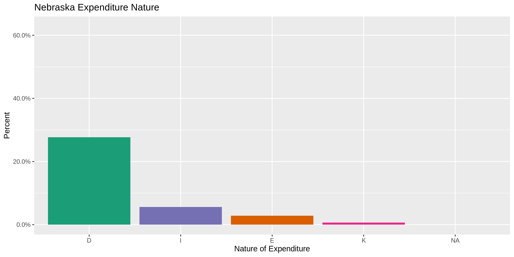
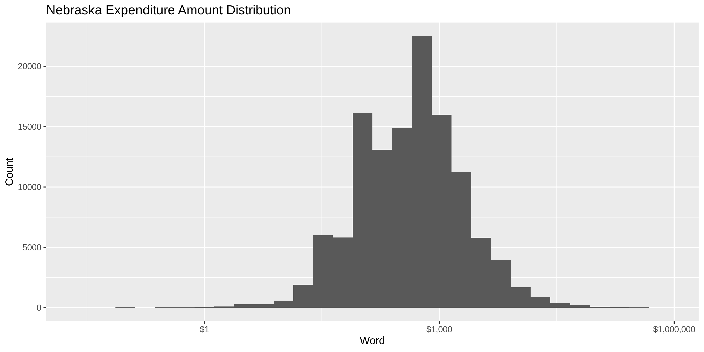

Nebraska Expenditures
================
Kiernan Nicholls
2019-08-06 11:05:07

  - [Project](#project)
  - [Objectives](#objectives)
  - [Packages](#packages)
  - [Data](#data)
  - [Import](#import)
  - [Explore](#explore)
  - [Wrangle](#wrangle)
  - [Conclude](#conclude)
  - [Export](#export)

## Project

The Accountability Project is an effort to cut across data silos and
give journalists, policy professionals, activists, and the public at
large a simple way to search across huge volumes of public data about
people and organizations.

Our goal is to standardizing public data on a few key fields by thinking
of each dataset row as a transaction. For each transaction there should
be (at least) 3 variables:

1.  All **parties** to a transaction
2.  The **date** of the transaction
3.  The **amount** of money involved

## Objectives

This document describes the process used to complete the following
objectives:

1.  How many records are in the database?
2.  Check for duplicates
3.  Check ranges
4.  Is there anything blank or missing?
5.  Check for consistency issues
6.  Create a five-digit ZIP Code called `ZIP5`
7.  Create a `YEAR` field from the transaction date
8.  Make sure there is data on both parties to a transaction

## Packages

The following packages are needed to collect, manipulate, visualize,
analyze, and communicate these results. The `pacman` package will
facilitate their installation and attachment.

The IRW’s `campfin` package will also have to be installed from GitHub.
This package contains functions custom made to help facilitate the
processing of campaign finance data.

``` r
if (!require("pacman")) install.packages("pacman")
pacman::p_load_current_gh("kiernann/campfin")
pacman::p_load(
  stringdist, # levenshtein value
  RSelenium, # remote browser
  tidyverse, # data manipulation
  lubridate, # datetime strings
  tidytext, # text analysis
  tidytext, # text analysis
  magrittr, # pipe opperators
  janitor, # dataframe clean
  refinr, # cluster and merge
  scales, # format strings
  knitr, # knit documents
  vroom, # read files fast
  glue, # combine strings
  here, # relative storage
  fs # search storage 
)
```

This document should be run as part of the `R_campfin` project, which
lives as a sub-directory of the more general, language-agnostic
[`irworkshop/accountability_datacleaning`](https://github.com/irworkshop/accountability_datacleaning "tap")
GitHub repository.

The `R_campfin` project uses the [RStudio
projects](https://support.rstudio.com/hc/en-us/articles/200526207-Using-Projects "rproj")
feature and should be run as such. The project also uses the dynamic
`here::here()` tool for file paths relative to *your* machine.

``` r
# where dfs this document knit?
here::here()
#> [1] "/home/ubuntu/R/accountability_datacleaning/R_campfin"
```

## Data

Data is obtained by from the Nebraska Accountability and Disclosure
Commission’s (NADC) [Open Data
portal](http://www.nebraska.gov/government/open-data/ "portal"). From
this portal, we will download the [Campaign Statements
Data](http://www.nadc.nebraska.gov/index.html "nadc").

> A weekly export of the campaign filings based upon the paper records
> filed with the Nebraska Accountability and Disclosure Commission.

The [NADC home](http://www.nadc.nebraska.gov/index.html "nadc") page
explains the role and resources provided by the Commission.

> This site includes the campaign statements filed with the Commission
> by candidates for state and local offices, political action committees
> or PACs, political parties, and ballot question committees. Campaign
> statements disclose the amount and sources of contributions to the
> committee and the amount purposes of expenditures by the committee.
> The site also includes Reports of Contributions filed with the
> Commission by corporations, unions, limited liability companies,
> limited partnerships, and by industry, trade or professional
> associations. Reports of Contributions disclose contributions and
> expenditures made to support or oppose candidates or ballot questions.
> Forms, instructional materials and a list of committees may be
> accessed through this site. To access the information described in
> this paragraph, click on the tab above marked CAMPAIGN FINANCE.

Navigating to the [campaign finance section of the
website](http://www.nadc.nebraska.gov/cf/index.html "nadc_cf"), the
exact filing requirements are layed out.

> Candidates for state and local office are subject to the campaign
> finance provisions of the Nebraska Political Accountability and
> Disclosure Act (NPADA). Those seeking election to federal office are
> not subject to the NPADA. Once a candidate raises, receives or expends
> $5,000 or more in a calendar year, he or she is required to register
> the committee with the Commission by filing a Statement of
> Organization and paying a filing fee of $100. Once the candidate
> committee is formed, the committee must file periodic campaign
> statements.

specifically, there are **three** kinds of filings that must be made by
general candidates:

1.  > Statement of Organization - This document registers the Committee
    > with the Commission. It discloses the name of the committee, the
    > name of the candidate, the office sought and the name of the
    > treasurer.

2.  > Campaign Statement - this document provides a summary of the
    > financial activity of the committee. It discloses the name of
    > contributors of more than $250 and the amounts of the
    > contributions. It discloses expenditures of more than $250.

3.  > Report of Late Contributions - this document discloses
    > contributions of $1,000 or more received by the committee during
    > 14 days immediately preceding the election. Information reported
    > as late contributions are also reported on subsequent campaign
    > statements.

Aside from general candidates, the NADC also explains that political
committees must also file.

> There are **two** types of committees that are commonly referred to as
> political action committees or PACs. One type of PAC is a political
> committee sponsored by a corporation, union or other type of
> organization. Another type of PAC is a political committee which is
> not sponsored by another group. PACs are required to register with the
> Commission and file periodic campaign statements disclosing receipts
> and expenditures.

1.  > State and county political party committees with certain levels of
    > financial activity, register with the Commission and file periodic
    > campaign statements.

2.  > A ballot question committee is a political committee formed for
    > the purpose of supporting or opposing the qualification, passage
    > or defeat of a ballot question. The committee must register with
    > the Commission within 10 days after raising, receiving or
    > expending $5,000 or more in a calendar year. Once registered,
    > ballot questions committees file periodic campaign statements
    > disclosing receipts and expenditures.

Finally, regarding the specific data in question, the NADC identifies
the source:

> The campaign filings displayed on this website are based upon the
> paper records filed with the Nebraska Accountability and Disclosure
> Commission. While every effort has been made to ensure accurate data
> input, errors may occur. Anyone noting an error is encouraged to
> contact this office.

In any discrepancy between the information displayed on this website and
the official records on file with the Commission, the official records
of the Commission take precedence.

## Import

The campaign statements data is provided as a series of text files
organized in a relational database management system (DRMS).

### Download

The data is provided as a ZIP file, which can be downloaded locally.

``` r
raw_dir <- here("ne", "expends", "data", "raw")
dir_create(raw_dir)
```

``` r
zip_url <- "http://www.nebraska.gov/nadc_data/nadc_data.zip"
zip_file <- str_c(raw_dir, basename(zip_url), sep = "/")
download.file(
  url = zip_url,
  destfile = zip_file
)
```

There are 64 files contained in a single folder (`/nadc_data`) inside
the ZIP archive.

  - nadc\_data/
  - nadc\_data/forma1cand.txt
  - nadc\_data/nadc\_tables.rtf
  - nadc\_data/forma1.txt
  - nadc\_data/formcfla4.txt
  - nadc\_data/formb73.txt
  - nadc\_data/formb1c.txt
  - nadc\_data/formb4a.txt
  - nadc\_data/loblatefile.txt
  - nadc\_data/formb7.txt
  - nadc\_data/formcfla8.txt
  - nadc\_data/formb4b1.txt
  - nadc\_data/formb1ab.txt
  - nadc\_data/formb2b.txt
  - nadc\_data/formb10exp.txt
  - nadc\_data/corplatefile.txt
  - nadc\_data/formb1c2.txt
  - nadc\_data/commlatefile.txt
  - nadc\_data/formc1prop.txt
  - nadc\_data/formb6.txt
  - nadc\_data/formb4b3.txt
  - nadc\_data/formb4b2.txt
  - nadc\_data/formb6cont.txt
  - nadc\_data/lformcc.txt
  - nadc\_data/formb2.txt
  - nadc\_data/formb10.txt
  - nadc\_data/formb2a.txt
  - nadc\_data/lforme.txt
  - nadc\_data/formb1d.txt
  - nadc\_data/formb11.txt
  - nadc\_data/formb9b.txt
  - nadc\_data/formb1.txt
  - nadc\_data/formcfla8c.txt
  - nadc\_data/formb9a.txt
  - nadc\_data/lformf.txt
  - nadc\_data/formcfla9ex.txt
  - nadc\_data/formb5.txt
  - nadc\_data/lforma.txt
  - nadc\_data/formcfla8a.txt
  - nadc\_data/formb4.txt
  - nadc\_data/lformd.txt
  - nadc\_data/formcfla3.txt
  - nadc\_data/formcfla2.txt
  - nadc\_data/formcfla9.txt
  - nadc\_data/formb1d2.txt
  - nadc\_data/lformbb.txt
  - nadc\_data/formcfla5.txt
  - nadc\_data/formb4c.txt
  - nadc\_data/lformb.txt
  - nadc\_data/formb9.txt
  - nadc\_data/lformc.txt
  - nadc\_data/formcfla6.txt
  - nadc\_data/formb6expend.txt
  - nadc\_data/formc1.txt
  - nadc\_data/formcfla7.txt
  - nadc\_data/lformar.txt
  - nadc\_data/formcfla8b.txt
  - nadc\_data/formb3.txt
  - nadc\_data/formcfla1.txt
  - nadc\_data/forma1misc.txt
  - nadc\_data/formc1inc.txt
  - nadc\_data/formb72.txt
  - nadc\_data/formc2.txt
  - nadc\_data/DATE\_UPDATED.TXT

We can then unzip the archive to the same `/raw` directory.

``` r
unzip(
  zipfile = zip_file,
  exdir = raw_dir
)
```

The archive contains a single folder, inside which are the many TXT
files we need.

``` r
nadc_dir <- here("ne", "expends", "data", "raw", "nadc_data")
```

### Read

The first file in the folder, `DATE_UPDATED.TXT` contains the time the
files were last updated.

``` r
read_lines(file = glue("{nadc_dir}/DATE_UPDATED.TXT")) %>% 
  str_remove_all("[:alpha:]") %>% 
  as_datetime() %>% 
  subtract(now())
#> Time difference of -1.503543 days
```

To work with the relational database managment system, we are going to
read every text file into a single list comprised of separate data
frames by using `purrr::map()` and `readr::read_delim()`.

``` r
ne <- 
  dir_ls(
    path = nadc_dir,
    type = "file",
    glob = "*.txt$"
  ) %>% 
  map(
    read_delim,
    delim = "|",
    escape_double = FALSE,
    escape_backslash = FALSE,
    col_types = cols(.default = "c")
  ) %>% 
  map(clean_names)

# set names equal to form
names(ne) <- tools::file_path_sans_ext(basename(names(ne)))
```

Before we can prepare the file for indexing, we need to locate the exact
data we’re interested in. The content, structure, and relationship of
each file is described in the `/nadc_data/nadc_tables.rtf` rich text
file. The files correspond to the *forms* through which candidates and
committees report their contributions, expenditures, etc. Each type of
filter uses a different form, so all expenditures are split among a few
files (corresponding to a few forms). Each form typically also has a
section (schedule) where *expenditures* are reported.

#### Form B-1

[Form B-1](http://www.nadc.nebraska.gov/docs/B-1-2018.doc "b-1") covers
Candiate and Ballot Question Committees, where Section 1 of Schedule D
asks the candidate/committee to:

> List all payees who were paid more than $250 during this reporting
> period. If multiple payments to the same payee totaled more than $250
> throughout this reporting period, those expenditures must be listed.
> Reporting period refers to your entry on Page 1 under Item 4.
> Expenditures to the same payee over separate reporting periods should
> not be accumulated. Expenditures to the same payee must be listed
> under the same name. If the committee reimburses the candidate or
> engages the services of an advertising agency or another agent of the
> committee for expenses they incurred on behalf of the committee, list
> the payments the committee made to the candidate or agent and also
> list the payments which were made by the candidate or agent on behalf
> of the committee. (E.g., If the candidate makes payments to a
> newspaper for advertising and is reimbursed by the committee, report
> the payments made to the candidate but also list the payments made by
> the candidate to the newspaper. Include the name of the newspaper, and
> the date of each of the expenditures by the candidate and list the
> amount only in the “purpose” box along with the description of the
> expenditure.)

The form also defines the NADC conception of expenditure:

> Expenditure: A payment, donation, loan, pledge, or promise of payment
> of money or anything of ascertainable monetary value for goods,
> materials, services, or facilities in assistance of, or in opposition
> to, the nomination or election of a candidate, or the qualification,
> passage, or defeat of a ballot question. (An offer or tender of an
> expenditure is not an expenditure if expressly and unconditionally
> rejected or returned.) Expenditure shall include a contribution or a
> transfer of anything of ascertainable monetary value for purposes of
> influencing the nomination or election of any candidate or the
> qualification, passage or defeat of a ballot question.

``` r
glimpse(ne$formb1d)
```

    #> Observations: 79,172
    #> Variables: 9
    #> $ committee_name      <chr> "NEBRASKANS FOR TERM LIMITS (DISSOLVED)", "NEBRASKANS FOR TERM LIMIT…
    #> $ committee_id        <chr> "99BQC00006", "99BQC00006", "99BQC00006", "99BQC00006", "99BQC00006"…
    #> $ date_received       <chr> "06/30/2000", "06/30/2000", "06/30/2000", "06/30/2000", "06/30/2000"…
    #> $ payee_name          <chr> "SMITH, LES                    ", "SUTTON, CAROLYN               ", …
    #> $ payee_address       <chr> "RT 1 BOX 266, PALMYRA NE 68418          ", "904 S 153RD ST, OMAHA N…
    #> $ expenditure_purpose <chr> NA, NA, NA, NA, NA, NA, NA, NA, NA, NA, NA, NA, NA, NA, NA, "SETTLEM…
    #> $ expenditure_date    <chr> "06/13/2000", "06/13/2000", "06/13/2000", "06/13/2000", "06/13/2000"…
    #> $ amount              <chr> "139", "490", "60", "151", "190.5", "13.8", "575", "501", "0", "0", …
    #> $ in_kind             <chr> "0", "0", "0", "0", "0", "0", "0", "0", "10000", "20000", "12452.86"…

#### Form B-2

[form B-2](http://www.nadc.nebraska.gov/docs/B-2-2018.doc "b-2") covers
Political Party Committees, where Item 5 of that form asks the party to:

> List expenditures of any amount which were made to or for the benefit
> of candidates or ballot questions. If your committee made multiple
> contributions in support or opposition to the same candidate or ballot
> question committee, also list the total accumulated contributions
> given for the election. Expenditures made in support of more than one
> candidate or ballot question committee must be allocated (E.g. the
> purchase of a newspaper ad advocating support or opposition to more
> than one candidate or ballot question).

``` r
glimpse(ne$formb2b)
```

    #> Observations: 5,479
    #> Variables: 11
    #> $ committee_id                      <chr> "99PPC00024", "99PPC00024", "99PPC00024", "99PPC00024"…
    #> $ date_received                     <chr> "11/23/2000", "11/23/2000", "11/23/2000", "11/23/2000"…
    #> $ committee_id_expenditure_is_for   <chr> "99CAC00286", "99CAC00255", "99CAC00255", "99CAC00169"…
    #> $ support_oppose                    <chr> "0", "0", "0", "0", "0", "0", "0", "0", "0", "0", "0",…
    #> $ nature_of_expenditure             <chr> "I", "K", "I", "I", "I", "I", "I", "K", "I", "I", "K",…
    #> $ expenditure_date                  <chr> "10/01/2000", "10/20/2000", "10/01/2000", "10/01/2000"…
    #> $ amount                            <chr> "46.88", "5", "46.88", "46.88", "46.9", "46.88", "46.8…
    #> $ description                       <chr> NA, NA, NA, NA, NA, NA, NA, NA, NA, NA, NA, NA, NA, NA…
    #> $ line_id                           <chr> "014", "022", "026", "016", "006", "027", "017", "025"…
    #> $ report_id                         <chr> "FRIENDS OF DREW MILLER", "DUDA FOR COUNTY BOARD", "DU…
    #> $ committee_name_expenditure_is_for <chr> NA, NA, NA, NA, NA, NA, NA, NA, NA, NA, NA, NA, NA, NA…

#### Form B-4

[form B-4](http://www.nadc.nebraska.gov/docs/B-4-2018.doc "b-4") covers
Independent Committees, where Section 1 of Schedule B asks the committee
to:

> Indicate the total amount of expenditures, for or against each
> Nebraska candidate or ballot question (B.Q.) or other allowed
> committee (including a political party), during this reporting period
> and the total for the calendar year to date. An expenditure made in
> support of more than one candidate or ballot question must be
> apportioned reasonably among the candidates or ballot questions
> supported or opposed. “Expenditure” for the purpose of this schedule
> includes direct and in-kind contributions, loans, independent
> expenditures, and all other disbursements of funds made in support of
> or in opposition to Nebraska state and local candidates and ballot
> questions.

``` r
glimpse(ne$formb4b1)
```

    #> Observations: 41,369
    #> Variables: 11
    #> $ form_id_number             <chr> "127", "128", "129", "130", "131", "132", "133", "134", "135"…
    #> $ committee_id               <chr> "99PAC00016", "99PAC00016", "99PAC00016", "99PAC00016", "99PA…
    #> $ date_received              <chr> "01/24/2000", "01/24/2000", "01/24/2000", "01/24/2000", "01/2…
    #> $ committee_expenditure_id   <chr> "99CAC00276", "99CAC00284", "99CAC00178", "99CAC00384", "99CA…
    #> $ support_oppose             <chr> "0", "0", "0", "0", "0", "0", "0", "0", "0", "0", "0", "0", "…
    #> $ nature_of_expenditure      <chr> "D", "D", "D", "D", "D", "D", "D", "D", "D", "D", "D", "D", "…
    #> $ expenditure_date           <chr> "11/16/1999", "11/16/1999", "10/20/1999", "10/15/1999", "02/2…
    #> $ amount                     <chr> "1000", "500", "600", "1000", "100", "500", "100", "200", "50…
    #> $ expense_category           <chr> "026", "026", "026", "026", "026", "026", "026", "026", "026"…
    #> $ report_id                  <chr> "KRISTENSEN FOR LEGISLATURE", "MATZKE FOR LEGISLATURE", "PEOP…
    #> $ expenditure_committee_name <chr> NA, NA, NA, NA, NA, NA, NA, NA, NA, NA, NA, NA, NA, NA, NA, N…

#### Bind

We can bind these three data frames together to create a single data
frame of expenditures by candidates, ballot committees, political
committees, and party committees. Then we can clean and parse this
combined data frame.

Before we bind these tables together, we need to rename some variables
and add additional information from other forms so we can identify the
parties on both sides of each expenditure.

``` r
fixed_b1d <- ne$formb1d %>% 
  # add from b1
  select(-committee_name) %>% 
  map_dfr(str_trim)
```

``` r
fixed_b2b <- ne$formb2b %>%
  remove_empty("cols") %>% 
  rename(
    committee_payee_id = committee_id_expenditure_is_for,
    # this file has last cols shifted left
    committee_payee_name = report_id,
  ) %>% 
  left_join(
    ne$forma1 %>% select(starts_with("committee")), 
    by = c("committee_payee_id" = "committee_id_number")
  ) %>% 
  select(-committee_name)
```

``` r
fixed_b4b1 <- ne$formb4b1 %>%
  remove_empty("cols") %>% 
  rename(
    committee_payee_id = committee_expenditure_id,
    # this file has last cols shifted left
    committee_payee_name = report_id,
  ) %>%
  # add committee geo info
  left_join(
    ne$forma1 %>% select(starts_with("committee")), 
    by = c("committee_payee_id" = "committee_id_number")
  ) %>% 
  select(
    -committee_name,
    -form_id_number
  )
```

``` r
ne_exp <- 
  bind_rows(
    fixed_b1d, 
    fixed_b2b, 
    fixed_b4b1
  ) %>% 
  na_if("0") %>% 
  mutate(
    date_received = parse_date(date_received, "%m/%d/%Y"),
    expenditure_date = parse_date(expenditure_date, "%m/%d/%Y"),
    oppose_clean = parse_logical(support_oppose),
    amount_clean = parse_number(coalesce(amount, in_kind)),
    inkind_clean = !is.na(in_kind),
    payee_name_clean = coalesce(payee_name, committee_payee_name)
  )
```

## Explore

``` r
head(ne_exp)
```

    #> # A tibble: 6 x 24
    #>   committee_id date_received payee_name payee_address expenditure_pur… expenditure_date amount
    #>   <chr>        <date>        <chr>      <chr>         <chr>            <date>           <chr> 
    #> 1 99BQC00006   2000-06-30    SMITH, LES RT 1 BOX 266… <NA>             2000-06-13       139   
    #> 2 99BQC00006   2000-06-30    SUTTON, C… 904 S 153RD … <NA>             2000-06-13       490   
    #> 3 99BQC00006   2000-06-30    TERRELL, … 5209 S 8TH P… <NA>             2000-06-13       60    
    #> 4 99BQC00006   2000-06-30    TIPPERY, … 2000 NORTHRI… <NA>             2000-06-13       151   
    #> 5 99BQC00006   2000-06-30    VON RIEUT… 4221 MARY CI… <NA>             2000-06-13       190.5 
    #> 6 99BQC00006   2000-06-30    WILSON, R… 3825 SWIFT #… <NA>             2000-06-13       13.8  
    #> # … with 17 more variables: in_kind <chr>, committee_payee_id <chr>, support_oppose <chr>,
    #> #   nature_of_expenditure <chr>, description <chr>, line_id <chr>, committee_payee_name <chr>,
    #> #   committee_address <chr>, committee_city <chr>, committee_state <chr>, committee_zip <chr>,
    #> #   committee_type <chr>, expense_category <chr>, oppose_clean <lgl>, amount_clean <dbl>,
    #> #   inkind_clean <lgl>, payee_name_clean <chr>

``` r
tail(ne_exp)
```

    #> # A tibble: 6 x 24
    #>   committee_id date_received payee_name payee_address expenditure_pur… expenditure_date amount
    #>   <chr>        <date>        <chr>      <chr>         <chr>            <date>           <chr> 
    #> 1 99PAC00069   2019-01-15    <NA>       <NA>          <NA>             2018-12-12       100   
    #> 2 99PAC00069   2019-01-15    <NA>       <NA>          <NA>             2018-12-17       2500  
    #> 3 99PAC00069   2019-01-15    <NA>       <NA>          <NA>             2018-11-08       238.63
    #> 4 99PAC00069   2019-01-15    <NA>       <NA>          <NA>             2018-11-15       296.57
    #> 5 99PAC00023   2018-04-16    <NA>       <NA>          <NA>             2017-07-17       1200  
    #> 6 13PAC00171   2017-04-27    <NA>       <NA>          <NA>             2017-03-31       100   
    #> # … with 17 more variables: in_kind <chr>, committee_payee_id <chr>, support_oppose <chr>,
    #> #   nature_of_expenditure <chr>, description <chr>, line_id <chr>, committee_payee_name <chr>,
    #> #   committee_address <chr>, committee_city <chr>, committee_state <chr>, committee_zip <chr>,
    #> #   committee_type <chr>, expense_category <chr>, oppose_clean <lgl>, amount_clean <dbl>,
    #> #   inkind_clean <lgl>, payee_name_clean <chr>

``` r
glimpse(sample_frac(ne_exp))
```

    #> Observations: 126,030
    #> Variables: 24
    #> $ committee_id          <chr> "99PAC00020", "07CAC01052", "15CAC02071", "16CAC02122", "99PAC0009…
    #> $ date_received         <date> 2014-04-08, 2011-01-31, 2016-02-01, 2017-01-17, 2010-01-12, 2004-…
    #> $ payee_name            <chr> NA, "GLOOR, MIKE", "ADELLE BURKE", "BICKEL, TAYLOR", NA, NA, "WNAX…
    #> $ payee_address         <chr> NA, "3115 BRENTWOOD CIRCLE, GRAND ISLAND, NE", NA, "781016 CALIFOR…
    #> $ expenditure_purpose   <chr> NA, "MILEAGE", "CONSULTING", "CONSULTING", NA, NA, "RADIO AD", NA,…
    #> $ expenditure_date      <date> 2014-02-04, 2010-12-31, 2015-09-18, 2016-11-16, 2009-11-25, 2004-…
    #> $ amount                <chr> "100", "1040.55", "600", "1999", "1000", "10000", "506", "500", "5…
    #> $ in_kind               <chr> NA, NA, NA, NA, NA, NA, NA, NA, NA, "34.12", NA, NA, NA, NA, NA, N…
    #> $ committee_payee_id    <chr> "14CAC01858", NA, NA, NA, "05CAC00757", "99PPC00003", NA, "07CAC01…
    #> $ support_oppose        <chr> NA, NA, NA, NA, NA, NA, NA, NA, NA, NA, NA, NA, NA, NA, NA, NA, NA…
    #> $ nature_of_expenditure <chr> "D", NA, NA, NA, "D", "D", NA, "D", NA, NA, "I", NA, "E", "D", NA,…
    #> $ description           <chr> NA, NA, NA, NA, NA, NA, NA, NA, NA, NA, "GOLDENROD PRINTING - MAIL…
    #> $ line_id               <chr> NA, NA, NA, NA, NA, NA, NA, NA, NA, NA, NA, NA, NA, NA, NA, NA, NA…
    #> $ committee_payee_name  <chr> "STINNER FOR LEGISLATURE", NA, NA, NA, "WIGHTMAN FOR LEGISLATURE (…
    #> $ committee_address     <chr> "1510 BROADWAY", NA, NA, NA, "PO BOX 100", "201 N 8TH ST STE 210",…
    #> $ committee_city        <chr> "SCOTTSBLUFF", NA, NA, NA, "LEXINGTON", "LINCOLN", NA, "OMAHA", NA…
    #> $ committee_state       <chr> "NE", NA, NA, NA, "NE", "NE", NA, "NE", NA, NA, "NE", NA, "NE", "N…
    #> $ committee_zip         <chr> "69361", NA, NA, NA, "68850", "68508", NA, "68112", NA, NA, "68028…
    #> $ committee_type        <chr> "C", NA, NA, NA, "C", "T", NA, "C", NA, NA, "C", NA, "C", "C", NA,…
    #> $ expense_category      <chr> "026", NA, NA, NA, "026", "028", NA, "026", NA, NA, NA, NA, "026",…
    #> $ oppose_clean          <lgl> NA, NA, NA, NA, NA, NA, NA, NA, NA, NA, NA, NA, NA, NA, NA, NA, NA…
    #> $ amount_clean          <dbl> 100.00, 1040.55, 600.00, 1999.00, 1000.00, 10000.00, 506.00, 500.0…
    #> $ inkind_clean          <lgl> FALSE, FALSE, FALSE, FALSE, FALSE, FALSE, FALSE, FALSE, FALSE, TRU…
    #> $ payee_name_clean      <chr> "STINNER FOR LEGISLATURE", "GLOOR, MIKE", "ADELLE BURKE", "BICKEL,…

### Missing

``` r
glimpse_fun(ne_exp, count_na)
```

    #> # A tibble: 24 x 4
    #>    var                   type       n        p
    #>    <chr>                 <chr>  <int>    <dbl>
    #>  1 committee_id          chr        0 0       
    #>  2 date_received         date       0 0       
    #>  3 payee_name            chr    46914 0.372   
    #>  4 payee_address         chr    58807 0.467   
    #>  5 expenditure_purpose   chr    49685 0.394   
    #>  6 expenditure_date      date       0 0       
    #>  7 amount                chr    14050 0.111   
    #>  8 in_kind               chr   115174 0.914   
    #>  9 committee_payee_id    chr    79172 0.628   
    #> 10 support_oppose        chr   124166 0.985   
    #> 11 nature_of_expenditure chr    79187 0.628   
    #> 12 description           chr   122366 0.971   
    #> 13 line_id               chr   125616 0.997   
    #> 14 committee_payee_name  chr    79173 0.628   
    #> 15 committee_address     chr    79412 0.630   
    #> 16 committee_city        chr    79779 0.633   
    #> 17 committee_state       chr    79779 0.633   
    #> 18 committee_zip         chr    79200 0.628   
    #> 19 committee_type        chr    79200 0.628   
    #> 20 expense_category      chr    84728 0.672   
    #> 21 oppose_clean          lgl   124166 0.985   
    #> 22 amount_clean          dbl     3420 0.0271  
    #> 23 inkind_clean          lgl        0 0       
    #> 24 payee_name_clean      chr       57 0.000452

Since the combined data frame comes from three different sources, it’s
difficult to identify what are expected missing values and those that
should be flagged. `na_flag` will equal `TRUE` when a record has either
(1) no `amount_clean` (`amount` or `in_kind`) *or* (2) no
`payee_name_clean` (`payee_name` for individuals or
`payee_committee_name` for others).

``` r
sum(is.na(ne_exp$payee_name) & is.na(ne_exp$committee_payee_name))
#> [1] 57

ne_exp <- ne_exp %>% 
  mutate(na_flag = is.na(amount_clean) | is.na(payee_name_clean))

sum(ne_exp$na_flag)
#> [1] 3465
percent(mean(ne_exp$na_flag))
#> [1] "2.75%"
```

### Duplicates

We can use `campfin::flag_dupes()` to create a new `dupe_flag` logical
variable, identifying every duplicate row *after* the initial occurance.

``` r
ne_exp <- flag_dupes(ne_exp)
sum(ne_exp$dupe_flag)
#> [1] 648
```

``` r
filter(ne_exp, dupe_flag)
```

    #> # A tibble: 648 x 26
    #>    committee_id date_received payee_name payee_address expenditure_pur… expenditure_date amount
    #>    <chr>        <date>        <chr>      <chr>         <chr>            <date>           <chr> 
    #>  1 99BQC00032   1999-07-01    AMERICANS… 504 E. MADIS… <NA>             1999-06-01       <NA>  
    #>  2 99BQC00032   1999-07-01    AMERICANS… 504 E. MADIS… <NA>             1999-06-03       <NA>  
    #>  3 99BQC00032   1999-07-01    AMERICANS… 811 SOUTH 13… <NA>             1999-06-29       <NA>  
    #>  4 99BQC00032   1999-07-01    COALITION… BOX 587,      <NA>             1999-06-03       <NA>  
    #>  5 99BQC00032   1999-07-01    COALITION… BOX 587,      <NA>             1999-06-07       <NA>  
    #>  6 99BQC00032   1999-10-05    AMERICANS… 811 SOUTH 13… <NA>             1999-09-13       <NA>  
    #>  7 99BQC00038   2000-04-11    BARNHART … 2600 Farnam … <NA>             2000-03-20       <NA>  
    #>  8 99BQC00038   2000-04-11    BASS & AS… 2027 DODGE S… <NA>             2000-03-01       <NA>  
    #>  9 99BQC00038   2000-04-11    COX JOHNS… 440 REGENCY … <NA>             2000-03-23       <NA>  
    #> 10 99BQC00038   2000-04-11    DAYSPRING… 8982 J ST, O… <NA>             2000-03-16       <NA>  
    #> # … with 638 more rows, and 19 more variables: in_kind <chr>, committee_payee_id <chr>,
    #> #   support_oppose <chr>, nature_of_expenditure <chr>, description <chr>, line_id <chr>,
    #> #   committee_payee_name <chr>, committee_address <chr>, committee_city <chr>,
    #> #   committee_state <chr>, committee_zip <chr>, committee_type <chr>, expense_category <chr>,
    #> #   oppose_clean <lgl>, amount_clean <dbl>, inkind_clean <lgl>, payee_name_clean <chr>,
    #> #   na_flag <lgl>, dupe_flag <lgl>

### Categorical

``` r
glimpse_fun(ne_exp, n_distinct)
```

    #> # A tibble: 26 x 4
    #>    var                   type      n         p
    #>    <chr>                 <chr> <int>     <dbl>
    #>  1 committee_id          chr    1713 0.0136   
    #>  2 date_received         date   2315 0.0184   
    #>  3 payee_name            chr   19832 0.157    
    #>  4 payee_address         chr   28462 0.226    
    #>  5 expenditure_purpose   chr   26593 0.211    
    #>  6 expenditure_date      date   7330 0.0582   
    #>  7 amount                chr   35529 0.282    
    #>  8 in_kind               chr    4616 0.0366   
    #>  9 committee_payee_id    chr    1933 0.0153   
    #> 10 support_oppose        chr       2 0.0000159
    #> 11 nature_of_expenditure chr       8 0.0000635
    #> 12 description           chr     482 0.00382  
    #> 13 line_id               chr      33 0.000262 
    #> 14 committee_payee_name  chr    1928 0.0153   
    #> 15 committee_address     chr    1248 0.00990  
    #> 16 committee_city        chr     191 0.00152  
    #> 17 committee_state       chr       7 0.0000555
    #> 18 committee_zip         chr     295 0.00234  
    #> 19 committee_type        chr       8 0.0000635
    #> 20 expense_category      chr       6 0.0000476
    #> 21 oppose_clean          lgl       2 0.0000159
    #> 22 amount_clean          dbl   37971 0.301    
    #> 23 inkind_clean          lgl       2 0.0000159
    #> 24 payee_name_clean      chr   21607 0.171    
    #> 25 na_flag               lgl       2 0.0000159
    #> 26 dupe_flag             lgl       2 0.0000159

<!-- -->

<!-- -->

### Continuous

#### Amounts

``` r
summary(ne$amount)
#> Length  Class   Mode 
#>      0   NULL   NULL
sum(ne$amount < 0, na.rm = TRUE)
#> [1] 0
```

``` r
ne_exp %>% 
  ggplot(aes(amount_clean)) +
  geom_histogram() +
  scale_x_continuous(
    trans = "log10",
    labels = dollar
  ) +
  labs(
    title = "Nebraska Expenditure Amount Distribution",
    x = "Word",
    y = "Count"
  )
```

<!-- -->

#### Dates

``` r
ne_exp <- mutate(ne_exp, expenditure_year = year(expenditure_date))
```

``` r
min(ne_exp$expenditure_date)
#> [1] "15-04-07"
sum(ne_exp$expenditure_year < 1999)
#> [1] 352
max(ne_exp$expenditure_date)
#> [1] "9915-12-31"
sum(ne_exp$expenditure_date > today())
#> [1] 34
```

``` r
ne_exp <- ne_exp %>% 
  mutate(
    date_flag = or(expenditure_year < 1999, expenditure_year > 2019),
    date_clean = as_date(ifelse(date_flag, NA, expenditure_date)),
    year_clean = year(date_clean)
  )

sum(ne_exp$date_flag)
#> [1] 375
```

## Wrangle

### Address

There is very little consistency in the format of `payee_address`.

``` r
# Mon Aug  5 17:19:45 2019 ------------------------------
sample(
  x = na.omit(ne_exp$payee_address),
  size = 20
)
```

    #>  [1] "10031 MAPLE STREET, OMAHA NE 68134"      "1602 STONE ST FALLS CITY, NE 68355"     
    #>  [3] "1850 M ST., NW  WASHINGTON, DC"          "P.O. BOX 80009 LINCOLN, NE"             
    #>  [5] "700 R ST., LINCOLN NE 68508"             "LINCOLN NE 68502"                       
    #>  [7] "514 UNIVERSITY"                          "5865 GRAND PAVILION WAY #302, VA"       
    #>  [9] "1310 HARVEY STREET OMAHA NE 68102"       "P.O. BOX 8169"                          
    #> [11] "1480 CO RD J OAKLAND,NE 68045"           "OMNI SHOREHAM HOTEL, WASHINGTON, DC"    
    #> [13] "9746 CADY AVE, OMAHA, NE"                "1919 S. 40TH, STE 302, Lincoln NE 68506"
    #> [15] "13467 CHANDLER RD, Omaha NE 68138"       "2907 S 186 PLAZA #702 OMAHA NE 68130"   
    #> [17] "5200 SW 30 DAVENPORT IA 52802"           "3940 CRNHSKR HWY STE 400 LINCOLN 68504" 
    #> [19] "5620 V ST., OMAHA, NE"                   "1013 W 75TH ST OMAHA, NE 68114"

``` r
ne_exp <- ne_exp %>% 
  mutate(
    zip_clean = payee_address %>% 
      str_extract(rx_zip) %>% 
      normal_zip(na_rep = TRUE)
  )
```

``` r
ne_exp <- ne_exp %>% 
  mutate(
    state_clean = payee_address %>% 
      str_extract(rx_state) %>%
      normal_state(
        abbreviate = TRUE,
        na = na_city,
        na_rep = TRUE,
        valid = geo$state
      )
  )
```

## Conclude

## Export

``` r
work_dir <- here("ne", "expends", "data", "working")
dir_create(work_dir)
```

``` r
ne_exp %>% 
  write_csv(
    na = "",
    path = glue("{work_dir}/ne_expends_working.csv")
  )
```
