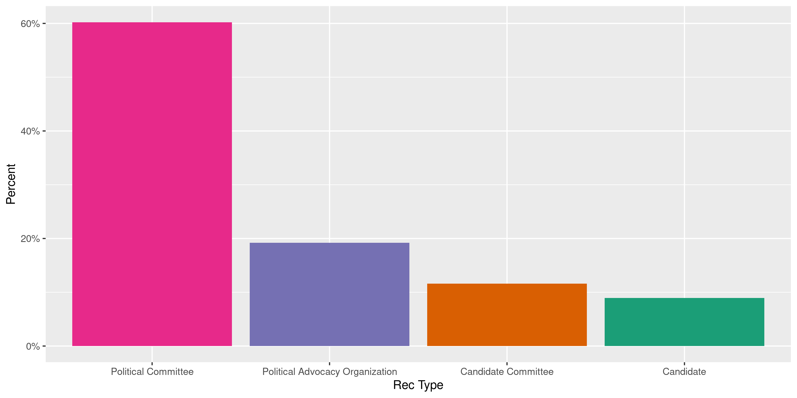
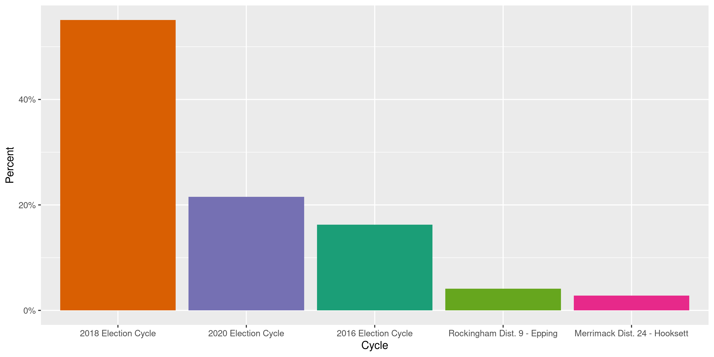
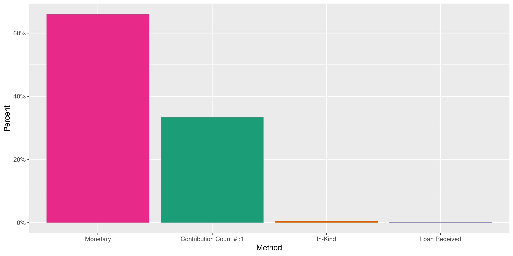
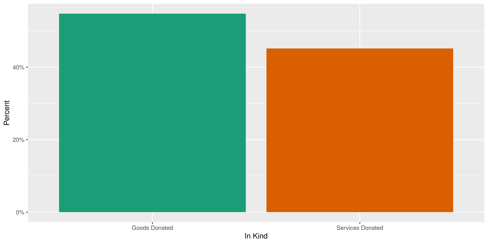
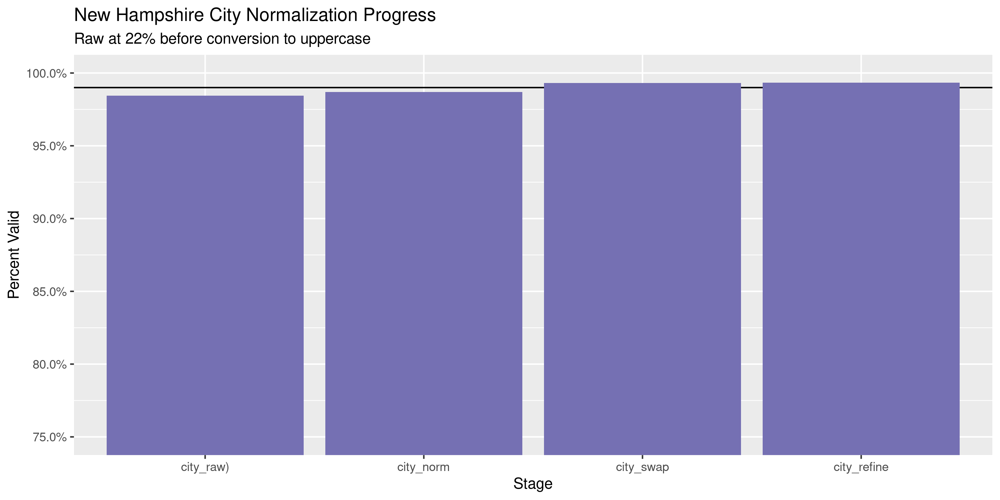

New Hampshire Contributions
================
Kiernan Nicholls
2020-05-01 13:10:43

  - [Project](#project)
  - [Objectives](#objectives)
  - [Packages](#packages)
  - [Data](#data)
  - [Download](#download)
  - [Read](#read)
  - [Explore](#explore)
      - [Missing](#missing)
      - [Duplicates](#duplicates)
      - [Categorical](#categorical)
      - [Amounts](#amounts)
      - [Dates](#dates)
  - [Wrangle](#wrangle)
      - [Address](#address)
      - [ZIP](#zip)
      - [State](#state)
      - [City](#city)
  - [Conclude](#conclude)
  - [Export](#export)
  - [Dictionary](#dictionary)

<!-- Place comments regarding knitting here -->

## Project

The Accountability Project is an effort to cut across data silos and
give journalists, policy professionals, activists, and the public at
large a simple way to search across huge volumes of public data about
people and organizations.

Our goal is to standardizing public data on a few key fields by thinking
of each dataset row as a transaction. For each transaction there should
be (at least) 3 variables:

1.  All **parties** to a transaction.
2.  The **date** of the transaction.
3.  The **amount** of money involved.

## Objectives

This document describes the process used to complete the following
objectives:

1.  How many records are in the database?
2.  Check for entirely duplicated records.
3.  Check ranges of continuous variables.
4.  Is there anything blank or missing?
5.  Check for consistency issues.
6.  Create a five-digit ZIP Code called `zip`.
7.  Create a `year` field from the transaction date.
8.  Make sure there is data on both parties to a transaction.

## Packages

The following packages are needed to collect, manipulate, visualize,
analyze, and communicate these results. The `pacman` package will
facilitate their installation and attachment.

The IRW’s `campfin` package will also have to be installed from GitHub.
This package contains functions custom made to help facilitate the
processing of campaign finance data.

``` r
if (!require("pacman")) install.packages("pacman")
pacman::p_load_gh("irworkshop/campfin")
pacman::p_load(
  tidyverse, # data manipulation
  lubridate, # datetime strings
  gluedown, # printing markdown
  magrittr, # pipe operators
  janitor, # clean data frames
  refinr, # cluster and merge
  scales, # format strings
  knitr, # knit documents
  vroom, # read files fast
  rvest, # html scraping
  glue, # combine strings
  here, # relative paths
  httr, # http requests
  fs # local storage 
)
```

This document should be run as part of the `R_campfin` project, which
lives as a sub-directory of the more general, language-agnostic
[`irworkshop/accountability_datacleaning`](https://github.com/irworkshop/accountability_datacleaning)
GitHub repository.

The `R_campfin` project uses the [RStudio
projects](https://support.rstudio.com/hc/en-us/articles/200526207-Using-Projects)
feature and should be run as such. The project also uses the dynamic
`here::here()` tool for file paths relative to *your* machine.

``` r
# where does this document knit?
here::here()
#> [1] "/home/kiernan/Code/accountability_datacleaning/R_campfin"
```

## Data

Contribution data can be obtained from the New Hampshire Secreyary of
State’s [Campaign Finance System](https://cfs.sos.nh.gov/). Each record
represents a single monetary contribution or correction reported by the
recieving committee or candidate.

Importantly, it seems as though not all contributions can be obtained
from this online portal:

> NOTE: Use of the CFS is not mandatory; therefor, reports filed by
> candidates and committees who have not registered and filed on the CFS
> are not searchable. You may; however, search the “reports” and view
> them in pdf format.

## Download

To download the file, we will have to run an empty search on the CFS
search portal for all contributions from 2000 to 2020-05-01. This can be
done manually or with the an `httr::POST()` (provided you have the right
cookies).

> Search for receipts reported on all campaign finance reports filed
> with the Secretary of State, who have registered and filed their
> reports using the Campaign Finance System (CFS).

> Search results are returned in a grid view and can be sorted within
> each column by using the arrow at the top of the column or exported to
> your local computer in Excel or CSV format, by clicking on the
> appropriate button in the lower right hand corner of the grid.

``` r
raw_dir <- dir_create(here("nh", "contribs", "data", "raw"))
raw_path <- path(raw_dir, "ViewContributionsList.csv")
raw_gone <- !file_exists(raw_path)
```

``` r
POST(
  url = "https://cfs.sos.nh.gov/Public/ViewReceipts",
  write_disk(raw_path, overwrite = FALSE),
  query = list(
    ContributorType = "",
    ContributionType = "",
    ContributorName = "",
    FirstName = "",
    Employer = "",
    FilingPeriodName = "",
    OccupationTitle = "",
    GabId = "",
    OfficeTypeCode = "",
    DistrictID = "",
    OfficeID = "",
    StartDate = "1/1/2000",
    EndDate = format(Sys.Date(), "%m/%d/%Y"),
    AmountRangeFrom = "",
    AmountRangeTo = "",
    OutOfState = "on",
    MemberId = "",
    PageIndex = "1",
    Election = "",
    AggAmountRangeFrom = "",
    CFID = "",
    AggAmountRangeTo = ""
  )
```

## Read

There are a handful of issues with the raw text file which can be fixed
using regular expressions.

``` r
# read lines as vector
nhl <- read_lines(raw_path)
# remove trailing comma from every line
nhl <- str_remove(nhl, ",$")
# add empty field for some ID at start
no_id <- str_starts(nhl, "\\d{1,2}/\\d{1,2}/\\d{4}")
nhl[no_id] <- str_replace(nhl[no_id], "^(.*)?$", ",\\1")
# collapse split line
nhl[53100] <- str_c(nhl[53100], nhl[53101])
nhl[53101] <- NA
# save to temp file
fix_path <- file_temp(ext = "csv")
write_lines(na.omit(nhl), fix_path)
```

Then this fixed temp file can be read and parsed into R.

``` r
# 73,717
nhc <- read_delim(
  file = fix_path,
  delim = ",",
  escape_backslash = FALSE,
  escape_double = FALSE,
  col_types = cols(
    .default = col_character(),
    `Transaction Date` = col_date("%m/%d/%Y %H:%M:%S %p"),
    `Amount` = col_double(),
    `Reporting Period` = col_date("%m/%d/%Y %H:%M:%S %p"),
    `Total Contribution Amount` = col_double()
  )
)
```

For convenience, the column names will be shorted and converted to snake
case.

``` r
raw_names <- names(nhc)
nhc <- nhc %>% 
  rename(
    date = `Transaction Date`,
    con_type = `Contributor Type`,
    contributor = `Contributor Name`,
    geo_full = `Contributor Address`,
    recipient = `Receiving Registrant`,
    rec_type = `Receiving Registrant Type`,
    cycle = `Election Cycle`,
    period = `Reporting Period`,
    method = `Contribution Type`,
    total = `Total Contribution Amount`,
    in_kind = `In-kind Sub Category`,
    city_old = `Town/City`,
    state_old = `Town State`,
    occupation = `Occupation`,
    employer = `Employer Name`
  ) %>% 
  clean_names("snake")
```

We can also remove all excess white space from character variables.

``` r
nhc <- mutate(nhc, across(is.character, str_squish))
```

## Explore

``` r
glimpse(nhc)
#> Rows: 73,717
#> Columns: 20
#> $ cf_id       <chr> "03004273", "05000248", "03004342", "03004342", "03004342", "03004273", "050…
#> $ date        <date> 2019-06-03, 2019-06-03, 2019-06-03, 2019-06-03, 2019-06-03, 2019-06-03, 201…
#> $ con_type    <chr> "Total of Contributions $25.00 or less", "Individual", "Total of Contributio…
#> $ contributor <chr> "UnItemized", "Folsom, Keith", "UnItemized", "UnItemized", "Dame, Elaine M."…
#> $ geo_full    <chr> "UnItemized", "14 Bedford St. , Bedford, NH 03110", "UnItemized", "UnItemize…
#> $ recipient   <chr> "ActBlue New Hampshire", "Professional Fire Fighters of New Hampshire PAC", …
#> $ rec_type    <chr> "Political Committee", "Political Advocacy Organization", "Political Committ…
#> $ office      <chr> NA, NA, NA, NA, NA, NA, NA, NA, NA, NA, NA, NA, NA, NA, NA, NA, NA, NA, NA, …
#> $ county      <chr> NA, NA, NA, NA, NA, NA, NA, NA, NA, NA, NA, NA, NA, NA, NA, NA, NA, NA, NA, …
#> $ cycle       <chr> "2020 Election Cycle", "2020 Election Cycle", "2020 Election Cycle", "2020 E…
#> $ period      <date> 2019-06-05, 2019-06-05, 2019-06-05, 2019-06-05, 2019-06-05, 2019-06-05, 201…
#> $ method      <chr> "Contribution Count # :1", "Monetary", "Contribution Count # :1", "Contribut…
#> $ amount      <dbl> 1.00, 2.00, 2.00, 2.00, 3.00, 4.00, 5.00, 5.00, 5.00, 6.00, 8.00, 10.00, 10.…
#> $ total       <dbl> 1.00, 44.00, 2.00, 2.00, 64.50, 4.00, 270.00, 5.00, 5.00, 162.00, 104.00, 13…
#> $ comments    <chr> NA, NA, NA, NA, NA, NA, NA, NA, NA, NA, NA, NA, NA, NA, NA, NA, NA, NA, NA, …
#> $ in_kind     <chr> NA, NA, NA, NA, NA, NA, NA, NA, NA, NA, NA, NA, NA, NA, NA, NA, NA, NA, NA, …
#> $ city_old    <chr> NA, NA, NA, NA, NA, NA, NA, NA, NA, NA, NA, NA, NA, NA, NA, NA, NA, NA, NA, …
#> $ state_old   <chr> NA, NA, NA, NA, NA, NA, NA, NA, NA, NA, NA, NA, NA, NA, NA, NA, NA, NA, NA, …
#> $ occupation  <chr> "NOT EMPLOYED", "Firefighter", NA, NA, NA, "NOT EMPLOYED", "Firefighter", "D…
#> $ employer    <chr> "NOT EMPLOYED", "Bedford", NA, NA, NA, "NOT EMPLOYED", "Windham", "U.S. PHAR…
tail(nhc)
#> # A tibble: 6 x 20
#>   cf_id date       con_type contributor geo_full recipient rec_type office county cycle period    
#>   <chr> <date>     <chr>    <chr>       <chr>    <chr>     <chr>    <chr>  <chr>  <chr> <date>    
#> 1 0300… 2017-05-06 Individ… Shuman, Br… 1 Chase… New Hamp… Politic… <NA>   <NA>   2016… 2017-05-08
#> 2 0300… 2017-05-06 Individ… Lenk, Jason 12 Math… New Hamp… Politic… <NA>   <NA>   2016… 2017-05-08
#> 3 0300… 2017-05-06 Individ… Butterfiel… 8B High… New Hamp… Politic… <NA>   <NA>   2016… 2017-05-08
#> 4 0300… 2017-05-06 Individ… Jones, Ash… 25 Coun… New Hamp… Politic… <NA>   <NA>   2016… 2017-05-08
#> 5 0300… 2017-05-06 Individ… Vachon, Je… 57 Webs… New Hamp… Politic… <NA>   <NA>   2016… 2017-05-08
#> 6 0300… 2018-11-06 Individ… Barrien, S… 7 Coach… Democrat… Politic… <NA>   <NA>   2016… 2018-11-08
#> # … with 9 more variables: method <chr>, amount <dbl>, total <dbl>, comments <chr>, in_kind <chr>,
#> #   city_old <chr>, state_old <chr>, occupation <chr>, employer <chr>
```

### Missing

``` r
col_stats(nhc, count_na)
#> # A tibble: 20 x 4
#>    col         class      n         p
#>    <chr>       <chr>  <int>     <dbl>
#>  1 cf_id       <chr>    222 0.00301  
#>  2 date        <date>     0 0        
#>  3 con_type    <chr>      0 0        
#>  4 contributor <chr>      2 0.0000271
#>  5 geo_full    <chr>    717 0.00973  
#>  6 recipient   <chr>      0 0        
#>  7 rec_type    <chr>      0 0        
#>  8 office      <chr>  58557 0.794    
#>  9 county      <chr>  66368 0.900    
#> 10 cycle       <chr>      0 0        
#> 11 period      <date>     0 0        
#> 12 method      <chr>      0 0        
#> 13 amount      <dbl>      0 0        
#> 14 total       <dbl>      0 0        
#> 15 comments    <chr>  68458 0.929    
#> 16 in_kind     <chr>  73290 0.994    
#> 17 city_old    <chr>  73462 0.997    
#> 18 state_old   <chr>  73461 0.997    
#> 19 occupation  <chr>  34556 0.469    
#> 20 employer    <chr>  35737 0.485
```

*Very* few records are missing a name, date, or amount.

``` r
nhc <- nhc %>% flag_na(date, contributor, amount, recipient)
sum(nhc$na_flag)
#> [1] 2
```

``` r
nhc %>% 
  filter(na_flag) %>% 
  select(date, contributor, amount, recipient)
#> # A tibble: 2 x 4
#>   date       contributor amount recipient                          
#>   <date>     <chr>        <dbl> <chr>                              
#> 1 2019-06-03 <NA>           150 New Hampshire Young Republicans PAC
#> 2 2018-10-15 <NA>            60 Abbott, Betty Ann
```

### Duplicates

There are however a large number of duplicate records. We can flag every
record that has duplicate values across every column.

``` r
nhc <- flag_dupes(nhc, everything())
percent(mean(nhc$dupe_flag), 0.01)
#> [1] "53.46%"
```

``` r
nhc %>% 
  filter(dupe_flag) %>% 
  select(date, contributor, amount, recipient) %>% 
  arrange(date, contributor)
#> # A tibble: 39,409 x 4
#>    date       contributor           amount recipient                                               
#>    <date>     <chr>                  <dbl> <chr>                                                   
#>  1 2016-06-20 Archambault               20 REALTOR Political Action Committee                      
#>  2 2016-06-20 Archambault               20 REALTOR Political Action Committee                      
#>  3 2016-06-20 Balsama                   20 REALTOR Political Action Committee                      
#>  4 2016-06-20 Balsama                   20 REALTOR Political Action Committee                      
#>  5 2016-06-20 Balsama                   20 REALTOR Political Action Committee                      
#>  6 2016-06-20 Balsama                   20 REALTOR Political Action Committee                      
#>  7 2016-06-20 Bancewicz, Stephen        25 New Hampshire Credit Union League Political Action Comm…
#>  8 2016-06-20 Bancewicz, Stephen        25 New Hampshire Credit Union League Political Action Comm…
#>  9 2016-06-20 Bank of New Hampshire   2000 New Hampshire Bankers Association State BankPAC         
#> 10 2016-06-20 Bank of New Hampshire   2000 New Hampshire Bankers Association State BankPAC         
#> # … with 39,399 more rows
```

If we count the contributor and recipient names, we see most of these
duplicates are unitemized contributions handled through a PAC or service
like ActBlue.

``` r
nhc %>% 
  filter(dupe_flag) %>% 
  count(contributor, recipient, sort = TRUE) %>% 
  mutate(p = n/sum(n))
#> # A tibble: 2,046 x 4
#>    contributor recipient                                             n      p
#>    <chr>       <chr>                                             <int>  <dbl>
#>  1 Unitemized  DLCC New Hampshire                                 7002 0.178 
#>  2 UnItemized  EversourcePAC-NH                                   4927 0.125 
#>  3 UnItemized  REALTOR Political Action Committee                 3432 0.0871
#>  4 UnItemized  DLCC New Hampshire                                 2295 0.0582
#>  5 UnItemized  ActBlue New Hampshire                              2050 0.0520
#>  6 UnItemized  Opportunity & Renewal PAC Blue Wave                1228 0.0312
#>  7 UnItemized  Volinsky for Executive Council                     1225 0.0311
#>  8 UnItemized  EMILY's List NH                                    1060 0.0269
#>  9 UnItemized  Democrat, Republican, Independent Voter Education   916 0.0232
#> 10 UnItemized  MacKenzie, Mark S                                   431 0.0109
#> # … with 2,036 more rows
```

### Categorical

``` r
col_stats(nhc, n_distinct)
#> # A tibble: 22 x 4
#>    col         class      n         p
#>    <chr>       <chr>  <int>     <dbl>
#>  1 cf_id       <chr>    465 0.00631  
#>  2 date        <date>    44 0.000597 
#>  3 con_type    <chr>      7 0.0000950
#>  4 contributor <chr>  19417 0.263    
#>  5 geo_full    <chr>  19973 0.271    
#>  6 recipient   <chr>    452 0.00613  
#>  7 rec_type    <chr>      4 0.0000543
#>  8 office      <chr>     74 0.00100  
#>  9 county      <chr>     11 0.000149 
#> 10 cycle       <chr>      9 0.000122 
#> 11 period      <date>    45 0.000610 
#> 12 method      <chr>      4 0.0000543
#> 13 amount      <dbl>   1405 0.0191   
#> 14 total       <dbl>   1454 0.0197   
#> 15 comments    <chr>   2274 0.0308   
#> 16 in_kind     <chr>      3 0.0000407
#> 17 city_old    <chr>     65 0.000882 
#> 18 state_old   <chr>      3 0.0000407
#> 19 occupation  <chr>   3761 0.0510   
#> 20 employer    <chr>   6549 0.0888   
#> 21 na_flag     <lgl>      2 0.0000271
#> 22 dupe_flag   <lgl>      2 0.0000271
```

``` r
explore_plot(nhc, con_type)
```

<!-- -->

``` r
explore_plot(nhc, rec_type)
```

<!-- -->

``` r
explore_plot(nhc, cycle, nbar = 5)
```

<!-- -->

``` r
explore_plot(nhc, method)
```

<!-- -->

``` r
explore_plot(nhc, in_kind)
```

<!-- -->

### Amounts

``` r
summary(nhc$amount)
#>      Min.   1st Qu.    Median      Mean   3rd Qu.      Max. 
#>       0.0       6.0      20.0     305.2      50.0 2500000.0
sum(nhc$amount <= 0.01)
#> [1] 4
```

<!-- -->

### Dates

We can add the calendar year from `date` with `lubridate::year()`

``` r
nhc <- mutate(nhc, year = year(date))
```

``` r
min(nhc$date)
#> [1] "2016-06-20"
sum(nhc$year < 2000)
#> [1] 0
max(nhc$date)
#> [1] "2020-03-16"
sum(nhc$date > today())
#> [1] 0
```

<!-- -->

## Wrangle

To improve the searchability of the database, we will perform some
consistent, confident string normalization. For geographic variables
like city names and ZIP codes, the corresponding `campfin::normal_*()`
functions are tailor made to facilitate this process.

First, we notice that the vast majority of the existing `city_old` and
`state_old` variables are missing.

``` r
prop_na(nhc$city_old)
#> [1] 0.9965408
prop_na(nhc$state_old)
#> [1] 0.9965273
nhc %>% 
  select(geo_full, city_old, state_old) %>% 
  filter(!is.na(city_old) & !is.na(state_old))
#> # A tibble: 255 x 3
#>    geo_full                                    city_old   state_old
#>    <chr>                                       <chr>      <chr>    
#>  1 PO Box 3, Plainfield, NH 03781              Plainfield NH       
#>  2 14 Revolutionary Ln, Nottingham, NH 03290   Nottingham NH       
#>  3 216 Daniel Webster Hwy, Boscawen, NH 03303  Boscawen   NH       
#>  4 PO Box 911, Atkinson, NH 03811              Atkinson   NH       
#>  5 16 Tibbetts Rd, Fremont, NH 03044           Fremont    NH       
#>  6 14 Revolutionary Ln, Nottingham, NH 03290   Nottingham NH       
#>  7 14 Revolutionary Ln, Nottingham, NH 03290   Nottingham NH       
#>  8 UnItemized                                  Hollis     NH       
#>  9 158 Halls Hill Road, Gilmanton IW, NH 03837 Gilmanton  NH       
#> 10 757 Penaccok Rd, Hopkinton, NH 03229        Hopkinton  NH       
#> # … with 245 more rows
```

However, the city and state values are present in the full contributor
address line, which can be split into it’s components with
`tidyr::separate()`.

``` r
nhc <- nhc %>% 
  mutate(across(geo_full, na_in, c("UnItemized", "Unitemized"))) %>% 
  separate(
    col = geo_full,
    into = c(glue("addr{1:10}"), "city", "state_zip"),
    sep = "\\s?,\\s",
    remove = FALSE,
    fill = "left",
    extra = "merge"
  ) %>% 
  unite(
    col = addr,
    starts_with("addr"),
    sep = " ",
    remove = TRUE,
    na.rm = TRUE
  ) %>% 
  mutate(across(addr, na_if, "")) %>% 
  separate(
    col = state_zip,
    into = c("state", "zip"),
    sep = "\\s(?=\\d)",
    remove = TRUE
  ) %>% 
  mutate(
    city = coalesce(city, city_old),
    state = coalesce(state, state_old)
  )
```

``` r
nhc %>% 
  select(geo_full, addr, city, state, zip) %>% 
  distinct() %>% 
  sample_n(20)
#> # A tibble: 20 x 5
#>    geo_full                                     addr                  city           state zip     
#>    <chr>                                        <chr>                 <chr>          <chr> <chr>   
#>  1 175 Columbia Heights,#3F, Brooklyn, NY 11201 175 Columbia Heights… Brooklyn       NY    11201   
#>  2 490 Hanover Port Lane, Fort Walton Beach, F… 490 Hanover Port Lane Fort Walton B… FL    32547   
#>  3 46 Pine Meadows, Exeter, NH 03249            46 Pine Meadows       Exeter         NH    03249   
#>  4 124 E Colonial St., Philadelphia, PA 19120   124 E Colonial St.    Philadelphia   PA    19120   
#>  5 851 River Mews Ct, Apt 302, Minneapolis, MN… 851 River Mews Ct Ap… Minneapolis    MN    55414-3…
#>  6 16 MATHES HILL DRIVE, DOVER, NH 03820        16 MATHES HILL DRIVE  DOVER          NH    03820   
#>  7 19 Oak Meadow Rd., Lincoln, MA 01773         19 Oak Meadow Rd.     Lincoln        MA    01773   
#>  8 106 North Rd, Fremont, NH 03044-3100         106 North Rd          Fremont        NH    03044-3…
#>  9 5125 AUBURN VALLEY LN, ANN ARBOR, MI 48105   5125 AUBURN VALLEY LN ANN ARBOR      MI    48105   
#> 10 55 Kent Ln, Apt H114, Nashua, NH 03062-2826  55 Kent Ln Apt H114   Nashua         NH    03062-2…
#> 11 270 N Hidden Lake Rd, Stoddard, NH 03464     270 N Hidden Lake Rd  Stoddard       NH    03464   
#> 12 23 Dwinell Dr, Concord, NH 03301             23 Dwinell Dr         Concord        NH    03301   
#> 13 25 Country Club Rd, Gilford, NH 03249-6972   25 Country Club Rd    Gilford        NH    03249-6…
#> 14 799 Greenwich St, Apt 1N, New York, NY 1001… 799 Greenwich St Apt… New York       NY    10014-1…
#> 15 19 Wrentham St., Dorchester Center, MA 02124 19 Wrentham St.       Dorchester Ce… MA    02124   
#> 16 911 E Hancock St, Appleton, WI 54911-5249    911 E Hancock St      Appleton       WI    54911-5…
#> 17 8 Wildwood Drive , West Lebanon, NH 03784    8 Wildwood Drive      West Lebanon   NH    03784   
#> 18 137 ROMA COURT, MARINA DEL REY, CA 90292     137 ROMA COURT        MARINA DEL REY CA    90292   
#> 19 1173 Long St, Webster, NH 03033              1173 Long St          Webster        NH    03033   
#> 20 P. O. Box 776, Hampstead, NH 03841           P. O. Box 776         Hampstead      NH    03841
```

### Address

For the street `addresss` variable, the `campfin::normal_address()`
function will force consistence case, remove punctuation, and abbreviate
official USPS suffixes.

``` r
nhc <- nhc %>% 
  mutate(
    addr_norm = normal_address(
      address = addr,
      abbs = usps_street,
      na_rep = TRUE
    )
  )
```

``` r
nhc %>% 
  select(starts_with("addr")) %>% 
  distinct() %>% 
  sample_n(10)
#> # A tibble: 10 x 2
#>    addr                    addr_norm             
#>    <chr>                   <chr>                 
#>  1 5 DOROTHY'S WAY         5 DOROTHYS WAY        
#>  2 19 Sandtrap Cir         19 SANDTRAP CIR       
#>  3 6817 SE Pine Ct         6817 SE PNE CT        
#>  4 2 McDaniels Drive       2 MCDANIELS DR        
#>  5 10 Ogden Drive          10 OGDEN DR           
#>  6 24 LEXINGTON ST         24 LEXINGTON ST       
#>  7 5 Dane Street           5 DANE ST             
#>  8 222 COLLEGE RD          222 COLLEGE RD        
#>  9 53 Church St            53 CHURCH ST          
#> 10 307 WEST 83RD ST APT 2B 307 W 83 RD ST APT 2 B
```

### ZIP

For ZIP codes, the `campfin::normal_zip()` function will attempt to
create valid *five* digit codes by removing the ZIP+4 suffix and
returning leading zeroes dropped by other programs like Microsoft Excel.

``` r
nhc <- nhc %>% 
  mutate(
    zip_norm = normal_zip(
      zip = zip,
      na_rep = TRUE
    )
  )
```

``` r
progress_table(
  nhc$zip,
  nhc$zip_norm,
  compare = valid_zip
)
#> # A tibble: 2 x 6
#>   stage    prop_in n_distinct prop_na n_out n_diff
#>   <chr>      <dbl>      <dbl>   <dbl> <dbl>  <dbl>
#> 1 zip        0.687       7231   0.343 15172   3674
#> 2 zip_norm   0.991       4272   0.343   450     79
```

### State

Valid two digit state abbreviations can be made using the
`campfin::normal_state()` function.

``` r
nhc <- nhc %>% 
  mutate(
    state_norm = normal_state(
      state = state,
      abbreviate = TRUE,
      na_rep = TRUE,
      valid = valid_state
    )
  )
```

``` r
nhc %>% 
  filter(state != state_norm) %>% 
  count(state, state_norm, sort = TRUE)
#> # A tibble: 3 x 3
#>   state state_norm     n
#>   <chr> <chr>      <int>
#> 1 ma    MA             1
#> 2 md    MD             1
#> 3 nh    NH             1
```

``` r
progress_table(
  nhc$state,
  nhc$state_norm,
  compare = valid_state
)
#> # A tibble: 2 x 6
#>   stage      prop_in n_distinct prop_na n_out n_diff
#>   <chr>        <dbl>      <dbl>   <dbl> <dbl>  <dbl>
#> 1 state         1.00         56   0.343     3      4
#> 2 state_norm    1            53   0.343     0      1
```

### City

Cities are the most difficult geographic variable to normalize, simply
due to the wide variety of valid cities and formats.

#### Normal

The `campfin::normal_city()` function is a good start, again converting
case, removing punctuation, but *expanding* USPS abbreviations. We can
also remove `invalid_city` values.

``` r
nhc <- nhc %>% 
  mutate(
    city_norm = normal_city(
      city = city, 
      abbs = usps_city,
      states = c("NH", "DC", "NEW HAMPSHIRE"),
      na = invalid_city,
      na_rep = TRUE
    )
  )
```

#### Swap

We can further improve normalization by comparing our normalized value
against the *expected* value for that record’s state abbreviation and
ZIP code. If the normalized value is either an abbreviation for or very
similar to the expected value, we can confidently swap those two.

``` r
nhc <- nhc %>% 
  rename(city_raw = city) %>% 
  left_join(
    y = zipcodes,
    by = c(
      "state_norm" = "state",
      "zip_norm" = "zip"
    )
  ) %>% 
  rename(city_match = city) %>% 
  mutate(
    match_abb = is_abbrev(city_norm, city_match),
    match_dist = str_dist(city_norm, city_match),
    city_swap = if_else(
      condition = !is.na(match_dist) & (match_abb | match_dist == 1),
      true = city_match,
      false = city_norm
    )
  ) %>% 
  select(
    -city_match,
    -match_dist,
    -match_abb
  )
```

#### Refine

The \[OpenRefine\] algorithms can be used to group similar strings and
replace the less common versions with their most common counterpart.
This can greatly reduce inconsistency, but with low confidence; we will
only keep any refined strings that have a valid city/state/zip
combination.

``` r
good_refine <- nhc %>% 
  mutate(
    city_refine = city_swap %>% 
      key_collision_merge() %>% 
      n_gram_merge(numgram = 1)
  ) %>% 
  filter(city_refine != city_swap) %>% 
  inner_join(
    y = zipcodes,
    by = c(
      "city_refine" = "city",
      "state_norm" = "state",
      "zip_norm" = "zip"
    )
  )
```

    #> # A tibble: 9 x 5
    #>   state_norm zip_norm city_swap      city_refine       n
    #>   <chr>      <chr>    <chr>          <chr>         <int>
    #> 1 NH         03810    AALTON BAYLTON ALTON BAY         2
    #> 2 OH         45209    CINCINATTI     CINCINNATI        2
    #> 3 NH         03031    AMEREHRST      AMHERST           1
    #> 4 NH         03102    MANHCESTERE    MANCHESTER        1
    #> 5 NH         03278    WARREN         WARNER            1
    #> 6 NY         10970    PONOMA         POMONA            1
    #> 7 NY         11733    SETAUKET       EAST SETAUKET     1
    #> 8 OH         43231    COLOMUBUS      COLUMBUS          1
    #> 9 VA         22042    CHURCH FALLS   FALLS CHURCH      1

Then we can join the refined values back to the database.

``` r
nhc <- nhc %>% 
  left_join(good_refine) %>% 
  mutate(city_refine = coalesce(city_refine, city_swap))
```

#### Progress

| stage        | prop\_in | n\_distinct | prop\_na | n\_out | n\_diff |
| :----------- | -------: | ----------: | -------: | -----: | ------: |
| city\_raw)   |    0.984 |        2814 |    0.343 |    759 |     365 |
| city\_norm   |    0.987 |        2752 |    0.343 |    633 |     279 |
| city\_swap   |    0.993 |        2593 |    0.343 |    334 |     106 |
| city\_refine |    0.993 |        2585 |    0.343 |    324 |      98 |

You can see how the percentage of valid values increased with each
stage.

<!-- -->

More importantly, the number of distinct values decreased each stage. We
were able to confidently change many distinct invalid values to their
valid equivalent.

<!-- -->

## Conclude

Before exporting, we can remove the intermediary normalization columns
and rename all added variables with the `_clean` suffix.

``` r
nhc <- nhc %>% 
  select(
    -city_norm,
    -city_swap,
    city_clean = city_refine
  ) %>% 
  rename_all(~str_replace(., "_norm", "_clean")) %>% 
  rename_all(~str_remove(., "_raw")) %>% 
  select(-addr, -city, -state, -zip)
```

``` r
glimpse(sample_frac(nhc))
#> Rows: 73,717
#> Columns: 27
#> $ cf_id       <chr> "03004273", "03004273", "05000045", "03004342", "03004342", "03004342", "030…
#> $ date        <date> 2020-02-17, 2019-12-02, 2016-06-20, 2018-10-15, 2019-06-03, 2017-12-04, 201…
#> $ con_type    <chr> "Total of Contributions $25.00 or less", "Individual", "Total of Contributio…
#> $ contributor <chr> "UnItemized", "ERICKSON, BERIT", "UnItemized", "UnItemized", "UnItemized", "…
#> $ geo_full    <chr> NA, "404 PARK PL, APT 2, BROOKLYN, NY 11238", NA, NA, NA, "13 Huntee Loop Rd…
#> $ recipient   <chr> "ActBlue New Hampshire", "ActBlue New Hampshire", "REALTOR Political Action …
#> $ rec_type    <chr> "Political Committee", "Political Committee", "Political Advocacy Organizati…
#> $ office      <chr> NA, NA, NA, NA, NA, NA, NA, NA, NA, "State Representative - 2", NA, "Executi…
#> $ county      <chr> NA, NA, NA, NA, NA, NA, NA, NA, NA, "Rockingham", NA, NA, NA, NA, NA, NA, NA…
#> $ cycle       <chr> "Merrimack Dist. 24 - Hooksett", "2020 Election Cycle", "2016 Election Cycle…
#> $ period      <date> 2020-02-19, 2019-12-04, 2016-06-22, 2018-10-17, 2019-06-05, 2017-12-06, 201…
#> $ method      <chr> "Contribution Count # :1", "Monetary", "Contribution Count # :1", "Contribut…
#> $ amount      <dbl> 25.00, 75.00, 20.00, 5.00, 5.00, 5.00, 25.00, 2.00, 5.00, 75.00, 5.00, 500.0…
#> $ total       <dbl> 25.00, 75.00, 20.00, 5.00, 5.00, 120.00, 112.00, 48.00, 5.00, 150.00, 5.00, …
#> $ comments    <chr> NA, NA, NA, NA, NA, NA, NA, NA, NA, NA, NA, NA, NA, NA, NA, NA, NA, NA, NA, …
#> $ in_kind     <chr> NA, NA, NA, NA, NA, NA, NA, NA, NA, NA, NA, NA, NA, NA, NA, NA, NA, NA, NA, …
#> $ city_old    <chr> NA, NA, NA, NA, NA, NA, NA, NA, NA, NA, NA, NA, NA, NA, NA, NA, NA, NA, NA, …
#> $ state_old   <chr> NA, NA, NA, NA, NA, NA, NA, NA, NA, NA, NA, NA, NA, NA, NA, NA, NA, NA, NA, …
#> $ occupation  <chr> "NOT EMPLOYED", "NURSE PRACTITIONER", NA, "REPRESENTATIVE, BUSINESS CUSTOMER…
#> $ employer    <chr> "NOT EMPLOYED", "ADVANTAGECARE PHYSICIANS", NA, "61 Eversource Energy Servic…
#> $ na_flag     <lgl> FALSE, FALSE, FALSE, FALSE, FALSE, FALSE, FALSE, FALSE, FALSE, FALSE, FALSE,…
#> $ dupe_flag   <lgl> TRUE, FALSE, TRUE, TRUE, TRUE, TRUE, FALSE, TRUE, TRUE, TRUE, TRUE, FALSE, F…
#> $ year        <dbl> 2020, 2019, 2016, 2018, 2019, 2017, 2019, 2017, 2019, 2016, 2018, 2018, 2018…
#> $ addr_clean  <chr> NA, "404 PARK PL APT 2", NA, NA, NA, "13 HUNTEE LOOP RD", "5 TYLER DR", "866…
#> $ zip_clean   <chr> NA, "11238", NA, NA, NA, "03071", "03053", "03104", NA, "03108", NA, "03457"…
#> $ state_clean <chr> NA, "NY", NA, NA, NA, "NH", "NH", "NH", NA, "NH", NA, "NH", "CA", NA, "NH", …
#> $ city_clean  <chr> NA, "BROOKLYN", NA, NA, NA, "NEW IPSWICH", "LONDONDERRY", "MANCHESTER", NA, …
```

1.  There are 73,717 records in the database.
2.  There are 39,409 duplicate records in the database.
3.  The range and distribution of `amount` and `date` seem reasonable.
4.  There are 2 records missing key variables.
5.  Consistency in geographic data has been improved with
    `campfin::normal_*()`.
6.  The 4-digit `year` variable has been created with
    `lubridate::year()`.

## Export

Now the file can be saved on disk for upload to the Accountability
server.

``` r
clean_dir <- dir_create(here("nh", "contribs", "data", "clean"))
clean_path <- path(clean_dir, "nh_contribs_clean.csv")
write_csv(nhc, clean_path, na = "")
file_size(clean_path)
#> 17.6M
```

The encoding of the exported file should be UTF-8 or ASCII.

``` r
enc <- system2("file", args = paste("-i", clean_path), stdout = TRUE)
str_replace_all(enc, clean_path, basename)
#> [1] "nh_contribs_clean.csv: application/csv; charset=utf-8"
```

## Dictionary

The following table describes the variables in our final exported file:

| Column        | Type        | Definition                                     |
| :------------ | :---------- | :--------------------------------------------- |
| `cf_id`       | `character` | Recipient unique ID                            |
| `date`        | `double`    | Date contribution was made                     |
| `con_type`    | `character` | Contributor type                               |
| `contributor` | `character` | Contributor name                               |
| `geo_full`    | `character` | Contributor full address                       |
| `recipient`   | `character` | Recipient committee name                       |
| `rec_type`    | `character` | Recipient type                                 |
| `office`      | `character` | Recipient office sought                        |
| `county`      | `character` | Election county                                |
| `cycle`       | `character` | Election cycle                                 |
| `period`      | `double`    | Contribution period reported                   |
| `method`      | `character` | Contribution method                            |
| `amount`      | `double`    | Contribution amount or correction              |
| `total`       | `double`    | Total ammount contributor given                |
| `comments`    | `character` | Contribution comments                          |
| `in_kind`     | `character` | Contribution In-Kind category                  |
| `city_old`    | `character` | Original contributor city                      |
| `state_old`   | `character` | Original contributor state                     |
| `occupation`  | `character` | Contributor occupation                         |
| `employer`    | `character` | Contributor employer name                      |
| `na_flag`     | `logical`   | Flag for missing date, amount, or name         |
| `dupe_flag`   | `logical`   | Flag for completely duplicated record          |
| `year`        | `double`    | Calendar year of contribution date             |
| `addr_clean`  | `character` | Separated & normalized combined street address |
| `zip_clean`   | `character` | Separated & normalized 5-digit ZIP code        |
| `state_clean` | `character` | Separated & normalized state abbreviation      |
| `city_clean`  | `character` | Separated & normalized city name               |

``` r
write_lines(
  x = c("# New Hampshire Contributions Data Dictionary\n", dict_md),
  path = here("nh", "contribs", "nh_contribs_dict.md"),
)
```
