New Hampshire Expenditures
================
Kiernan Nicholls
2019-07-15 15:46:02

  - [Project](#project)
  - [Objectives](#objectives)
  - [Packages](#packages)
  - [Data](#data)
  - [Import](#import)
  - [Explore](#explore)
  - [Wrangle](#wrangle)
  - [Conclude](#conclude)
  - [Export](#export)

## Project

The Accountability Project is an effort to cut across data silos and
give journalists, policy professionals, activists, and the public at
large a simple way to search across huge volumes of public data about
people and organizations.

Our goal is to standardizing public data on a few key fields by thinking
of each dataset row as a transaction. For each transaction there should
be (at least) 3 variables:

1.  All **parties** to a transaction
2.  The **date** of the transaction
3.  The **amount** of money involved

## Objectives

This document describes the process used to complete the following
objectives:

1.  How many records are in the database?
2.  Check for duplicates
3.  Check ranges
4.  Is there anything blank or missing?
5.  Check for consistency issues
6.  Create a five-digit ZIP Code called `ZIP5`
7.  Create a `YEAR` field from the transaction date
8.  Make sure there is data on both parties to a transaction

## Packages

The following packages are needed to collect, manipulate, visualize,
analyze, and communicate these results. The `pacman` package will
facilitate their installation and attachment.

``` r
if (!require("pacman")) install.packages("pacman")
pacman::p_load(
  stringdist, # levenshtein value
  RSelenium, # remote browser
  tidyverse, # data manipulation
  lubridate, # datetime strings
  magrittr, # pipe opperators
  janitor, # dataframe clean
  zipcode, # clean & database
  glue, # combine strings
  here, # relative storage
  fs # search storage 
)
```

This document should be run as part of the `R_campfin` project, which
lives as a sub-directory of the more general, language-agnostic
[`irworkshop/accountability_datacleaning`](https://github.com/irworkshop/accountability_datacleaning "TAP repo")
GitHub repository.

The `R_campfin` project uses the [RStudio
projects](https://support.rstudio.com/hc/en-us/articles/200526207-Using-Projects "Rproj")
feature and should be run as such. The project also uses the dynamic
`here::here()` tool for file paths relative to *your* machine.

``` r
# where dfs this document knit?
here::here()
#> [1] "/home/ubuntu/R/accountability_datacleaning/R_campfin"
```

## Data

New Hampshire campaign finance data from before 2016 can only be
ontained in hand-written PDF format. Data from after 2016 can be
obtained from the [NH Campaign Finance System
(CFS)](https://cfs.sos.nh.gov/ "source").

### About

The [CFS FAQ page](https://cfs.sos.nh.gov/Public/FAQ#Expenditures "FAQ")
defines the data we will be downloading:

> RSA 664:2, IX defines “expenditure” as follows: the disbursement of
> money or thing of value or the making of a legally binding commitment
> to make such a disbursement in the future or the transfer of funds by
> a political committee to another political committee or to a candidate
> for the purpose of promoting the success or defeat of a candidate or
> candidates or measure or measures. “Expenditures” includes
> disbursement constituting independent expenditures, as defined in
> paragraph XI. It dos not include: (a) the candidate’s filing fee or
> his/her expenses for personal travel and subsistence; (b) activity
> designed to encourage individuals to register to vote or to vote, if
> that activity or communication does not mention a clearly identified
> candidate; (c) any communication by any membership organization or
> corporation to its members or stockholders, if the primary purpose of
> that membership organization or corporation is not for the purpose of
> promoting the success or defeat of a candidate or candidate and
> measure or measures; or (d) any communication by a political committee
> member that is not made for the purpose of promoting the success or
> defeat of a candidate or candidates or measure or measures.

> **What is an independent expenditure?**  
> RSA 664:2, XI defines “Independent Expenditures” as follows:
> Expenditure that pay for the development and distribution of a
> communication that expressly advocates the election or defeat of a
> clearly identified candidate or candidates or the success or defeat of
> a measure or measures, which are made without cooperation or
> consultation with any candidate, or any authorized committee or agent
> of such candidate, and which are not made in concert with, or at the
> request or suggestion of, any candidates, or any authorized committee
> or agent of such candidate…
> 
> **Is there a separate independent expenditure report?**
> 
> There is no specific form. The information submitted must be in
> accordance with RSA 664:6, IV-a. Any political committee whose
> independent expenditure, in aggregate, exceeds $500, shall file an
> itemized statement which shall be received by the Secretary of State
> not later than 48 hours after such expenditure is made. NOTE: In
> addition to this 48 hour notification, the independent expenditure
> will be reported on the next report of receipts and expenditures that
> is due.

## Import

To download the bulk data format, one needs to navigate to the
[Expenditures search page](https://cfs.sos.nh.gov/Public/ExpensesList).
From there, remove “2020 General Election” from the “Election Cycle”
drop down menu. Enter “01/01/2010” in the “Transaction Date Range” input
box. After searching with these parameters, download the file by
clicking the “CSV” button at the bottom of the page.

We will automate this using the `RSelenium` package.

``` r
raw_dir <- here("nh", "expends", "data", "raw")
dir_create(raw_dir)
```

``` r
remote_driver <- rsDriver(
  port = 4444L,
  browser = "firefox",
  extraCapabilities = makeFirefoxProfile(
    list(
      browser.download.dir = raw_dir,
      browser.download.folderList = 2L,
      browser.helperApps.neverAsk.saveToDisk = "text/csv"
    )
  )
)

# navigate to the FL DOE download site
remote_browser <- remote_driver$client
remote_browser$navigate("https://cfs.sos.nh.gov/Public/ExpensesList")

# chose "All" from elections list
cycle_menu <- "/html/body/div[1]/div[3]/table/tbody/tr/td[4]/div[2]/table[1]/tbody/tr[3]/td/table/tbody/tr[6]/td[2]/select/option[1]"
remote_browser$findElement("xpath", cycle_menu)$clickElement()

# enter Jan 1 2008 as start date
remote_browser$findElement("css", "#dtStartDate")$sendKeysToElement(list("01/01/2008"))
remote_browser$findElement("css", "#dtEndDate")$sendKeysToElement(list(format(today(), "%m/%d/%Y")))

# click search button
remote_browser$findElement("css", "#btnSearch")$clickElement()

csv_button <- "html body#bodyPulic.innerbg0.leftnavbg2 div.wrapper div.container_inner table#data_container1 tbody tr td.contentpadding div#divExpensesListDetails table tbody tr td#tdExpenses.boxbg div#divExpensesGrid table.borderFooter tbody tr td.bgfooter a img"
remote_browser$findElement("css", csv_button)$clickElement()

# close the browser and driver
remote_browser$close()
remote_driver$server$stop()
```

``` r
nh <- 
  read_csv(
    file = glue("{raw_dir}/ViewExpenditureList.csv"),
    col_types = cols(
      .default = col_character(),
      `Transaction Date` = col_date("%m/%d/%Y %H:%M:%S %p"),
      `Expenditure Amount` = col_double()
    )
  )
```

We will remove completely empty rows, clean names, uppcercase characters
variables, and separate some columns into their true underlying
variables.

``` r
nh <- nh %>%
  remove_empty("rows") %>% 
  clean_names() %>% 
  mutate_if(is_character, str_to_upper) %>% 
  separate(
    col = reporting_period, 
    remove = FALSE,
    into = c("reporting_date", "reporting_type"), 
    sep = "\\s-\\s"
  ) %>% 
  mutate(reporting_date = parse_date(reporting_date, "%m/%d/%Y")) %>% 
  separate(
    col = office,
    remove = FALSE,
    into = c("office_clean", "district_clean"),
    sep = "\\s-\\s",
    convert = TRUE
  )
```

## Explore

There are records of 1 variables in the full database.

``` r
head(nh)
```

    #> # A tibble: 6 x 19
    #>   transaction_date cf_id payee_type payee_name payee_address registrant_name registrant_type office
    #>   <date>           <chr> <chr>      <chr>      <chr>         <chr>           <chr>           <chr> 
    #> 1 2018-10-18       0500… INDIVIDUAL GAGYI, PE… 817 CROSS CO… NEW HAMPSHIRE … POLITICAL ADVO… <NA>  
    #> 2 2018-10-18       0500… INDIVIDUAL DILORENZO… 193 SOUTH MA… NEW HAMPSHIRE … POLITICAL ADVO… <NA>  
    #> 3 2018-10-18       0500… INDIVIDUAL TERRIO, R… 130 SOUTH CY… NEW HAMPSHIRE … POLITICAL ADVO… <NA>  
    #> 4 2018-11-06       0300… POLITICAL… BARNSTEAD… 13 HARTSHORN… ACTBLUE NEW HA… POLITICAL COMM… <NA>  
    #> 5 2018-11-06       0300… POLITICAL… BELKNAP C… 24 OAK ISLAN… ACTBLUE NEW HA… POLITICAL COMM… <NA>  
    #> 6 2018-11-06       0300… POLITICAL… NASHUA DE… PO BOX 632, … ACTBLUE NEW HA… POLITICAL COMM… <NA>  
    #> # … with 11 more variables: office_clean <chr>, district_clean <int>, county <chr>,
    #> #   election_cycle <chr>, reporting_period <chr>, reporting_date <date>, reporting_type <chr>,
    #> #   expenditure_type <chr>, expenditure_purpose <chr>, expenditure_amount <dbl>, comments <chr>

``` r
tail(nh)
```

    #> # A tibble: 6 x 19
    #>   transaction_date cf_id payee_type payee_name payee_address registrant_name registrant_type office
    #>   <date>           <chr> <chr>      <chr>      <chr>         <chr>           <chr>           <chr> 
    #> 1 2018-12-31       0900… BUSINESS/… SQUARESPA… 225 VARICK S… WEEKS FOR NH    CANDIDATE COMM… EXECU…
    #> 2 2019-05-07       0900… BUSINESS/… NH WOMEN'… 18 LOW AVE S… WEEKS FOR NH    CANDIDATE COMM… EXECU…
    #> 3 2019-05-07       0900… BUSINESS/… OPEN DEMO… 4 PARK ST #3… WEEKS FOR NH    CANDIDATE COMM… EXECU…
    #> 4 2019-05-07       0900… BUSINESS/… NEW HAMPS… 105 N STATE … WEEKS FOR NH    CANDIDATE COMM… EXECU…
    #> 5 2019-05-07       0900… CANDIDATE… FRIENDS O… PO BOX 623, … WEEKS FOR NH    CANDIDATE COMM… EXECU…
    #> 6 2019-05-07       0900… BUSINESS/… *NOTE ON … NA, NA, NH 0… WEEKS FOR NH    CANDIDATE COMM… EXECU…
    #> # … with 11 more variables: office_clean <chr>, district_clean <int>, county <chr>,
    #> #   election_cycle <chr>, reporting_period <chr>, reporting_date <date>, reporting_type <chr>,
    #> #   expenditure_type <chr>, expenditure_purpose <chr>, expenditure_amount <dbl>, comments <chr>

``` r
glimpse(sample_frac(nh))
```

    #> Observations: 11,751
    #> Variables: 19
    #> $ transaction_date    <date> 2016-10-25, 2018-08-15, 2018-08-22, 2018-10-12, 2019-01-24, 2018-11…
    #> $ cf_id               <chr> "03004111", "09000875", "01001161", "01001210", "03004454", "0300427…
    #> $ payee_type          <chr> "BUSINESS/GROUP/ORGANIZATION", "BUSINESS/GROUP/ORGANIZATION", "INDIV…
    #> $ payee_name          <chr> "MISSION CONTROL, INC.", "HP INC.", "LINTNER, JAMES", "MR. COPY", "A…
    #> $ payee_address       <chr> "624 HEBRON AVE., BLDG 3 SUITE 200, GLASTONBURY, CT 06033", "1501 PA…
    #> $ registrant_name     <chr> "NEW HAMPSHIRE EVERYTOWN FOR GUN SAFETY VICTORY FUND", "COMMITTEE TO…
    #> $ registrant_type     <chr> "POLITICAL COMMITTEE", "CANDIDATE COMMITTEE", "CANDIDATE", "CANDIDAT…
    #> $ office              <chr> NA, "STATE REPRESENTATIVE - 26", "STATE REPRESENTATIVE - 3", "STATE …
    #> $ office_clean        <chr> NA, "STATE REPRESENTATIVE", "STATE REPRESENTATIVE", "STATE REPRESENT…
    #> $ district_clean      <int> NA, 26, 3, 19, NA, NA, 5, 11, 5, NA, NA, 17, 6, 12, NA, NA, 8, NA, N…
    #> $ county              <chr> NA, "MERRIMACK", "MERRIMACK", "ROCKINGHAM", NA, NA, NA, NA, NA, NA, …
    #> $ election_cycle      <chr> "2016 ELECTION CYCLE", "2018 ELECTION CYCLE", "2018 ELECTION CYCLE",…
    #> $ reporting_period    <chr> "11/02/2016 - GENERAL", "08/22/2018 - PRIMARY", "09/05/2018 - PRIMAR…
    #> $ reporting_date      <date> 2016-11-02, 2018-08-22, 2018-09-05, 2018-10-17, 2019-05-06, 2019-06…
    #> $ reporting_type      <chr> "GENERAL", "PRIMARY", "PRIMARY", "GENERAL", "6 MONTH REPORT AFTER GE…
    #> $ expenditure_type    <chr> "INDEPENDENT EXPENDITURE", "MONETARY", "MONETARY", "MONETARY", "MONE…
    #> $ expenditure_purpose <chr> "MEDIA - POSTCARDS", "PRINTING - COPIES", "MEDIA - YARD SIGNS", "MED…
    #> $ expenditure_amount  <dbl> 9912.76, 20.99, 250.00, 179.00, 8.73, 9.60, 500.00, 59.44, 100.00, 1…
    #> $ comments            <chr> NA, NA, "PAID FOR YARD SIGNS (POLITICAL ADVERTISING) WITH BOTH OUR N…

### Distinct

The variables range in their degree of distinctness.

``` r
nh %>% glimpse_fun(n_distinct)
```

    #> # A tibble: 19 x 4
    #>    var                 type      n        p
    #>    <chr>               <chr> <int>    <dbl>
    #>  1 transaction_date    date   1119 0.0952  
    #>  2 cf_id               chr     470 0.0400  
    #>  3 payee_type          chr       6 0.000511
    #>  4 payee_name          chr    3129 0.266   
    #>  5 payee_address       chr    3828 0.326   
    #>  6 registrant_name     chr     447 0.0380  
    #>  7 registrant_type     chr       4 0.000340
    #>  8 office              chr      75 0.00638 
    #>  9 office_clean        chr       9 0.000766
    #> 10 district_clean      int      45 0.00383 
    #> 11 county              chr      11 0.000936
    #> 12 election_cycle      chr       7 0.000596
    #> 13 reporting_period    chr      33 0.00281 
    #> 14 reporting_date      date     33 0.00281 
    #> 15 reporting_type      chr       3 0.000255
    #> 16 expenditure_type    chr       6 0.000511
    #> 17 expenditure_purpose chr      82 0.00698 
    #> 18 expenditure_amount  dbl    4302 0.366   
    #> 19 comments            chr    2039 0.174

<!-- -->

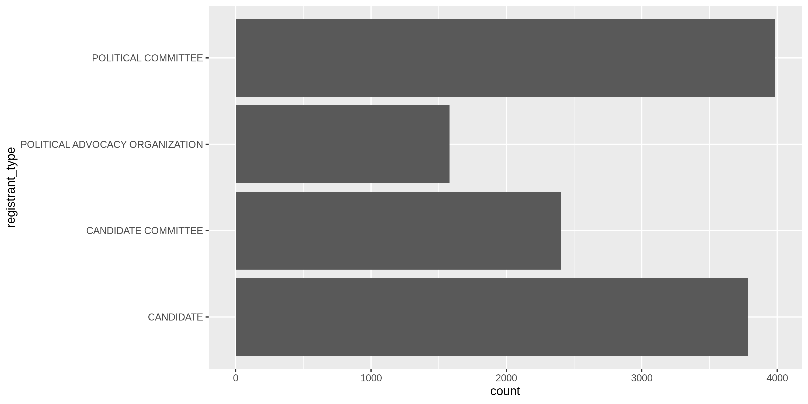<!-- -->

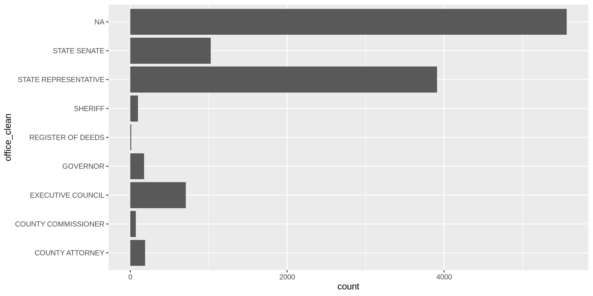<!-- -->

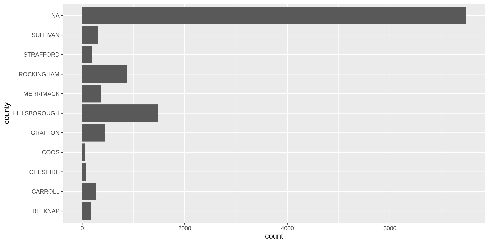<!-- -->

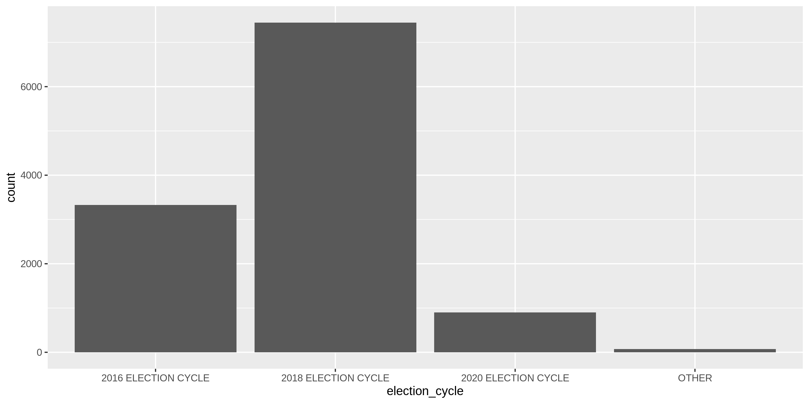<!-- -->

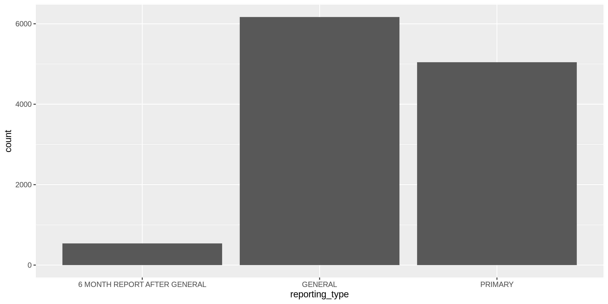<!-- -->

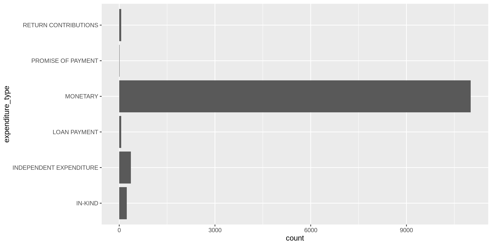<!-- -->

### Missing

The variables also vary in their degree of values that are `NA`
(missing).

``` r
nh %>% glimpse_fun(count_na)
```

    #> # A tibble: 19 x 4
    #>    var                 type      n       p
    #>    <chr>               <chr> <int>   <dbl>
    #>  1 transaction_date    date      0 0      
    #>  2 cf_id               chr       0 0      
    #>  3 payee_type          chr       0 0      
    #>  4 payee_name          chr      52 0.00443
    #>  5 payee_address       chr       0 0      
    #>  6 registrant_name     chr       0 0      
    #>  7 registrant_type     chr       0 0      
    #>  8 office              chr    5563 0.473  
    #>  9 office_clean        chr    5563 0.473  
    #> 10 district_clean      int    6038 0.514  
    #> 11 county              chr    7484 0.637  
    #> 12 election_cycle      chr       0 0      
    #> 13 reporting_period    chr       0 0      
    #> 14 reporting_date      date      0 0      
    #> 15 reporting_type      chr       0 0      
    #> 16 expenditure_type    chr       0 0      
    #> 17 expenditure_purpose chr       0 0      
    #> 18 expenditure_amount  dbl       0 0      
    #> 19 comments            chr    7073 0.602

We will flag any records with missing values in the key variables used
to identify an expenditure.

``` r
nh <- nh %>% mutate(na_flag = is.na(payee_name))
```

### Duplicates

``` r
nh_dupes <- distinct(get_dupes(nh))
nrow(nh_dupes)
#> [1] 78
sum(nh_dupes$dupe_count)
#> [1] 221
```

``` r
nh <- nh %>% 
  left_join(nh_dupes) %>% 
  mutate(dupe_flag = !is.na(dupe_count))
```

### Ranges

#### Amounts

``` r
summary(nh$expenditure_amount)
```

    #>      Min.   1st Qu.    Median      Mean   3rd Qu.      Max. 
    #>       0.0      27.8     100.0    1904.6     340.1 1656456.7

``` r
sum(nh$expenditure_amount < 0)
```

    #> [1] 0

``` r
nh %>% 
  ggplot(aes(expenditure_amount)) +
  geom_histogram() +
  scale_y_log10() +
  scale_x_continuous(labels = scales::dollar)
```

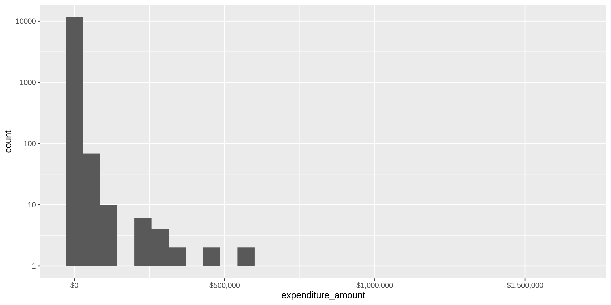<!-- -->

``` r
nh %>% 
  ggplot(aes(payee_type, expenditure_amount)) +
  geom_boxplot(varwidth = TRUE) +
  scale_y_continuous(labels = scales::dollar, trans = "log10") +
  coord_flip()
```

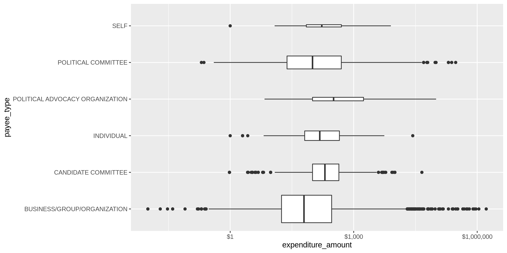<!-- -->

``` r
nh %>% 
  ggplot(aes(registrant_type, expenditure_amount)) +
  geom_boxplot(varwidth = TRUE) +
  scale_y_continuous(labels = scales::dollar, trans = "log10") +
  coord_flip()
```

<!-- -->

``` r
nh %>% 
  ggplot(aes(expenditure_type, expenditure_amount)) +
  geom_boxplot(varwidth = TRUE) +
  scale_y_continuous(labels = scales::dollar, trans = "log10") +
  coord_flip()
```

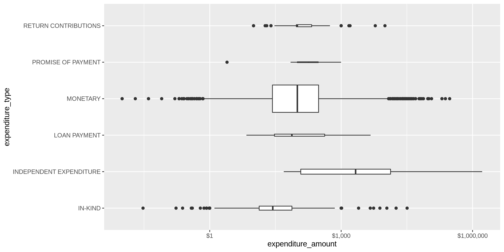<!-- -->

### Dates

``` r
summary(nh$transaction_date)
#>         Min.      1st Qu.       Median         Mean      3rd Qu.         Max. 
#> "2014-06-16" "2016-11-03" "2018-08-03" "2018-01-20" "2018-10-14" "2019-06-12"
sum(nh$transaction_date > today())
#> [1] 0
```

``` r
nh %>% 
  ggplot(aes(year(transaction_date))) +
  geom_bar()
```

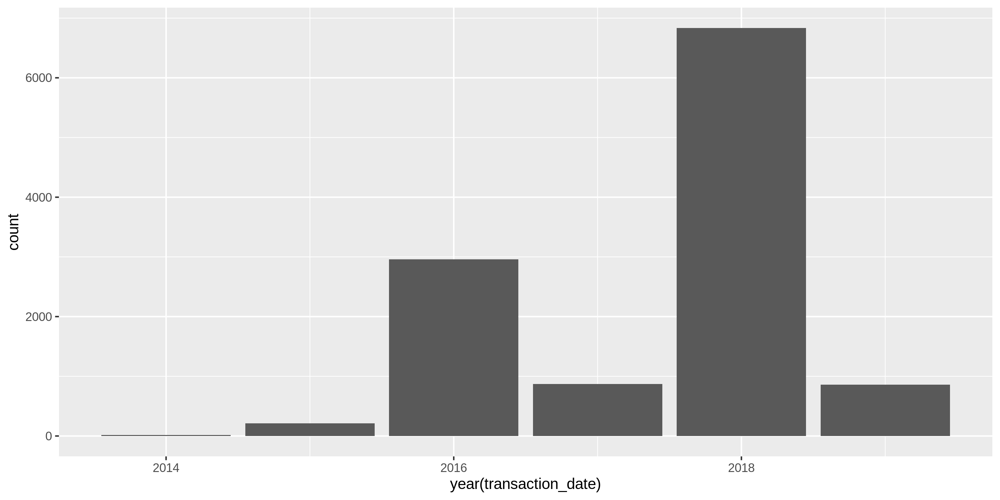<!-- -->

``` r
nh %>% 
  group_by(month = month(transaction_date)) %>% 
  summarise(median_amount = median(expenditure_amount)) %>% 
  ggplot(aes(x = month, y = median_amount)) +
  geom_line(size = 2)
```

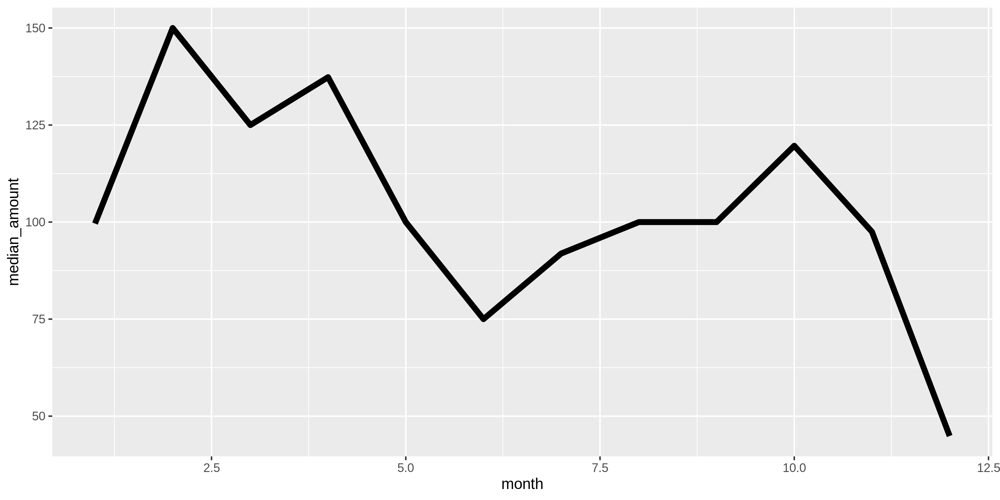<!-- -->

## Wrangle

### Year

Add a `transaction_year` variable from `transaction_date` using
`lubridate::year()`.

``` r
nh <- nh %>% mutate(transaction_year = year(transaction_date))
```

### Address

We need to extract the ZIP code and state abbreviation from the
`payee_address` string.

``` r
sample(nh$payee_address, 10) %>% cat(sep = "\n")
```

    #> 198 WHITTEMORE POINT ROAD SOUTH, BRIDGEWATER, NH 03222
    #> 150 N MICHIGAN AVE, CHICAGO, NH 60601
    #> 10 WATER STREET, CONCORD, NH 03301
    #> 940 SUNCOOK VALLEY HIWAY #17, EPSOM, NH 03234
    #> 63A MAIN ST, RAYMOND, NH 03077
    #> 204 STATE HOUSE, CONCORD, NH 03301
    #> 232 SOUTH MAIN STREET, FRANKLIN, NH 03235
    #> 1 FACEBOOK WAY, MENLO PARK, CA 94025
    #> PO BOX 267, HARRISVILLE, NH 03450
    #> P.O. BOX 91, ALTON, NH 03809

First, we will extract the ZIP digits from the end of the `address`
string.

``` r
nh <- nh %>% 
  mutate(
    zip_clean = payee_address %>% 
      str_extract("\\d{5}(?:-\\d{4})?$") %>% 
      normalize_zip(na_rep = TRUE)
  )

sample(nh$zip_clean, 10)
#>  [1] "22313" "03226" "03833" "03220" "93301" "70810" "94025" "03302" "02421" "03841"
```

Then we can get the two digit state abbreviation preceding those digits.

``` r
nh <- nh %>% 
  mutate(
    state_clean = payee_address %>% 
      str_extract("[:alpha:]+(?=[:space:]+[:digit:]{5}(?:-[:digit:]{4})?$)") %>%
      normalize_state(
        na = c(""), 
        expand = TRUE
      )
  )

n_distinct(nh$state_clean)
#> [1] 44
sample(nh$state_clean, 10)
#>  [1] "NH" "NH" "NH" "NH" "MA" "NH" "NH" "CA" "NH" "WA"
mean(na.omit(nh$state_clean) %in% geo$state)
#> [1] 1
```

## Conclude

``` r
min_amount <- scales::dollar(min(nh$expenditure_amount, na.rm = TRUE))
max_amount <- scales::dollar(max(nh$expenditure_amount, na.rm = TRUE))

min_date <- as.character(min(nh$transaction_date, na.rm = TRUE))
max_date <- as.character(max(nh$transaction_date, na.rm = TRUE))
```

1.  There are 11751 records in the database
2.  There are 221 records with duplicate rows(flagged with `dupe_flag`)
3.  The `expenditure_amount` values range from $0.01 to $1,656,457; the
    `transaction_date` values range from 2014-06-16 to 2019-06-12
4.  Consistency has been improved with `stringr` package and custom
    `normalize_*()` functions
5.  The ZIP code and state abbreviation have been extracted fromt the
    `address` variable
6.  The `transaction_year` variable has been created with
    `lubridate::year()`
7.  There are 52 records with missing `payee_name` values

## Export

``` r
dir_proc <- here("nh", "expends", "data", "processed")
dir_create(dir_proc)

write_csv(
  x = nh,
  path = glue("{dir_proc}/nh_expends_clean.csv"),
  na = ""
)
```
