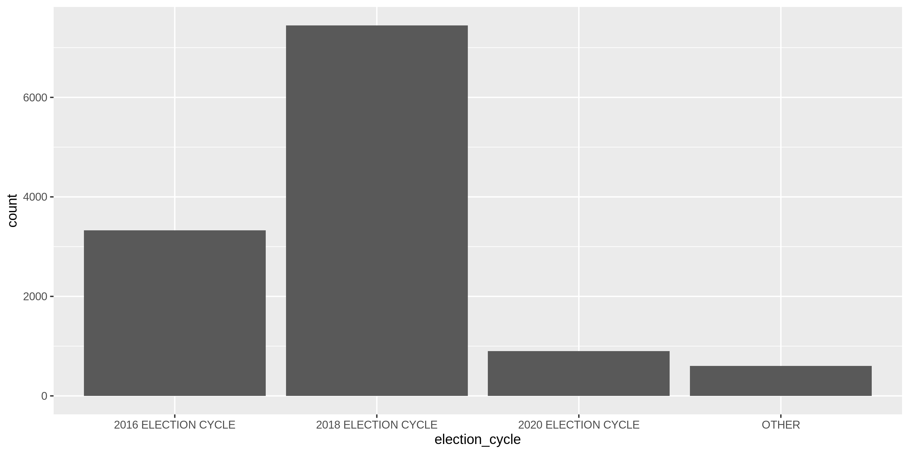
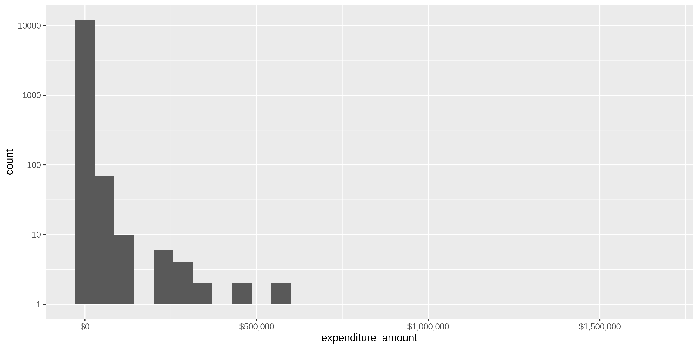
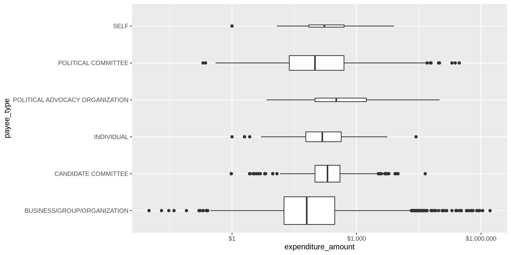
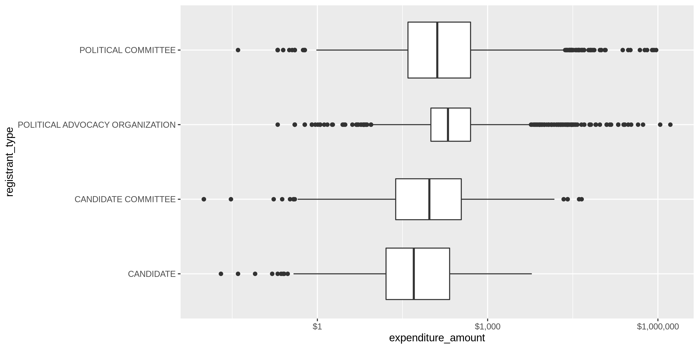
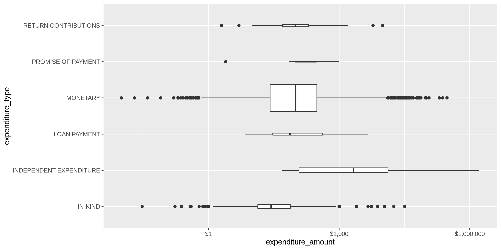
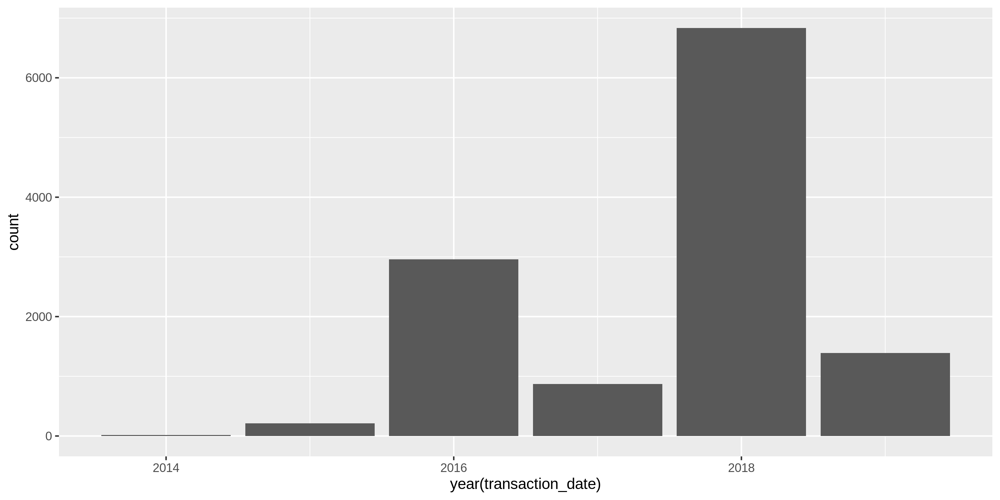

New Hampshire Expenditures
================
Kiernan Nicholls
2019-10-24 11:55:48

## Project

The Accountability Project is an effort to cut across data silos and
give journalists, policy professionals, activists, and the public at
large a simple way to search across huge volumes of public data about
people and organizations.

Our goal is to standardizing public data on a few key fields by thinking
of each dataset row as a transaction. For each transaction there should
be (at least) 3 variables:

1.  All **parties** to a transaction
2.  The **date** of the transaction
3.  The **amount** of money involved

## Objectives

This document describes the process used to complete the following
objectives:

1.  How many records are in the database?
2.  Check for duplicates
3.  Check ranges
4.  Is there anything blank or missing?
5.  Check for consistency issues
6.  Create a five-digit ZIP Code called `ZIP5`
7.  Create a `YEAR` field from the transaction date
8.  Make sure there is data on both parties to a transaction

## Packages

The following packages are needed to collect, manipulate, visualize,
analyze, and communicate these results. The `pacman` package will
facilitate their installation and attachment.

``` r
if (!require("pacman")) install.packages("pacman")
pacman::p_load_gh("irworkshop/campfin")
pacman::p_load(
  snakecase, # change string case
  RSelenium, # remote browser
  tidyverse, # data manipulation
  lubridate, # datetime strings
  magrittr, # pipe opperators
  janitor, # dataframe clean
  batman, # rep(NA, 8) Batman!
  refinr, # cluster and merge
  scales, # format strings
  knitr, # knit documents
  vroom, # read files fast
  glue, # combine strings
  here, # relative storage
  httr, # http query
  fs # search storage 
)
```

This document should be run as part of the `R_campfin` project, which
lives as a sub-directory of the more general, language-agnostic
[`irworkshop/accountability_datacleaning`](https://github.com/irworkshop/accountability_datacleaning "TAP repo")
GitHub repository.

The `R_campfin` project uses the [RStudio
projects](https://support.rstudio.com/hc/en-us/articles/200526207-Using-Projects "Rproj")
feature and should be run as such. The project also uses the dynamic
`here::here()` tool for file paths relative to *your* machine.

``` r
# where dfs this document knit?
here::here()
#> [1] "/home/kiernan/R/accountability_datacleaning/R_campfin"
```

## Data

New Hampshire campaign finance data from before 2016 can only be
ontained in hand-written PDF format. Data from after 2016 can be
obtained from the [NH Campaign Finance System
(CFS)](https://cfs.sos.nh.gov/ "source").

### About

The [CFS FAQ page](https://cfs.sos.nh.gov/Public/FAQ#Expenditures "FAQ")
defines the data we will be downloading:

> RSA 664:2, IX defines “expenditure” as follows: the disbursement of
> money or thing of value or the making of a legally binding commitment
> to make such a disbursement in the future or the transfer of funds by
> a political committee to another political committee or to a candidate
> for the purpose of promoting the success or defeat of a candidate or
> candidates or measure or measures. “Expenditures” includes
> disbursement constituting independent expenditures, as defined in
> paragraph XI. It dos not include: (a) the candidate’s filing fee or
> his/her expenses for personal travel and subsistence; (b) activity
> designed to encourage individuals to register to vote or to vote, if
> that activity or communication does not mention a clearly identified
> candidate; (c) any communication by any membership organization or
> corporation to its members or stockholders, if the primary purpose of
> that membership organization or corporation is not for the purpose of
> promoting the success or defeat of a candidate or candidate and
> measure or measures; or (d) any communication by a political committee
> member that is not made for the purpose of promoting the success or
> defeat of a candidate or candidates or measure or measures.

> **What is an independent expenditure?**  
> RSA 664:2, XI defines “Independent Expenditures” as follows:
> Expenditure that pay for the development and distribution of a
> communication that expressly advocates the election or defeat of a
> clearly identified candidate or candidates or the success or defeat of
> a measure or measures, which are made without cooperation or
> consultation with any candidate, or any authorized committee or agent
> of such candidate, and which are not made in concert with, or at the
> request or suggestion of, any candidates, or any authorized committee
> or agent of such candidate…
> 
> **Is there a separate independent expenditure report?**
> 
> There is no specific form. The information submitted must be in
> accordance with RSA 664:6, IV-a. Any political committee whose
> independent expenditure, in aggregate, exceeds $500, shall file an
> itemized statement which shall be received by the Secretary of State
> not later than 48 hours after such expenditure is made. NOTE: In
> addition to this 48 hour notification, the independent expenditure
> will be reported on the next report of receipts and expenditures that
> is due.

## Import

To download the bulk data format, one needs to navigate to the
[Expenditures search page](https://cfs.sos.nh.gov/Public/ExpensesList).
From there, remove “2020 General Election” from the “Election Cycle”
drop down menu. Enter “01/01/2010” in the “Transaction Date Range” input
box. After searching with these parameters, download the file by
clicking the “CSV” button at the bottom of the page.

We will automate this using the `RSelenium` package.

``` r
raw_dir <- here("nh", "expends", "data", "raw")
dir_create(raw_dir)
```

``` r
remote_driver <- rsDriver(
  port = 4444L,
  browser = "firefox",
  extraCapabilities = makeFirefoxProfile(
    list(
      browser.download.dir = raw_dir,
      browser.download.folderList = 2L,
      browser.helperApps.neverAsk.saveToDisk = "text/csv"
    )
  )
)

# navigate to the NH download site
remote_browser <- remote_driver$client
remote_browser$navigate("https://cfs.sos.nh.gov/Public/ExpensesList")

# chose "All" from elections list
cycle_menu <- "/html/body/div[1]/div[3]/table/tbody/tr/td[4]/div[2]/table[1]/tbody/tr[3]/td/table/tbody/tr[6]/td[2]/select/option[1]"
remote_browser$findElement("xpath", cycle_menu)$clickElement()

# enter Jan 1 2008 as start date
remote_browser$findElement("css", "#dtStartDate")$sendKeysToElement(list("01/01/2008"))
remote_browser$findElement("css", "#dtEndDate")$sendKeysToElement(list(format(today(), "%m/%d/%Y")))

# click search button
remote_browser$findElement("css", "#btnSearch")$clickElement()

csv_button <- "td.bgfooter:nth-child(2) > a:nth-child(2)"
remote_browser$findElement("css", csv_button)$clickElement()

# close the browser and driver
remote_browser$close()
remote_driver$server$stop()
```

``` r
nh <- 
  read_csv(
    file = glue("{raw_dir}/ViewExpenditureList.csv"),
    col_types = cols(
      .default = col_character(),
      `Transaction Date` = col_date("%m/%d/%Y %H:%M:%S %p"),
      `Expenditure Amount` = col_double()
    )
  )
```

``` r
problems(nh) %>% 
  filter(expected != "15 columns") %>% 
  distinct()
```

    #> # A tibble: 10 x 5
    #>      row col        expected          actual                 file                                  
    #>    <int> <chr>      <chr>             <chr>                  <chr>                                 
    #>  1  1575 Transacti… date like %m/%d/… Additional Candidate:… '/home/kiernan/R/accountability_datac…
    #>  2  2883 Comments   delimiter or quo… D                      '/home/kiernan/R/accountability_datac…
    #>  3  2883 Comments   delimiter or quo… 1                      '/home/kiernan/R/accountability_datac…
    #>  4  2972 Comments   delimiter or quo… V                      '/home/kiernan/R/accountability_datac…
    #>  5  2972 Comments   delimiter or quo… 3                      '/home/kiernan/R/accountability_datac…
    #>  6  3650 Transacti… date like %m/%d/… Printing of palm card… '/home/kiernan/R/accountability_datac…
    #>  7  3979 Comments   delimiter or quo… B                      '/home/kiernan/R/accountability_datac…
    #>  8  3979 Comments   delimiter or quo… F                      '/home/kiernan/R/accountability_datac…
    #>  9 11338 Comments   delimiter or quo… C                      '/home/kiernan/R/accountability_datac…
    #> 10 11338 Comments   delimiter or quo… 2                      '/home/kiernan/R/accountability_datac…

We will remove completely empty rows, clean names, uppcercase characters
variables, and separate some columns into their true underlying
variables.

``` r
nh <- nh %>%
  remove_empty("rows") %>% 
  clean_names() %>% 
  mutate_if(is_character, str_to_upper) %>% 
  separate(
    col = reporting_period, 
    remove = FALSE,
    into = c("reporting_date", "reporting_type"), 
    sep = "\\s-\\s"
  ) %>% 
  mutate(reporting_date = parse_date(reporting_date, "%m/%d/%Y")) %>% 
  separate(
    col = office,
    remove = FALSE,
    into = c("office_clean", "district_clean"),
    sep = "\\s-\\s",
    convert = TRUE
  )
```

## Explore

There are 12278 records of 19 variables in the full database.

``` r
head(nh)
```

    #> # A tibble: 6 x 19
    #>   transaction_date cf_id payee_type payee_name payee_address registrant_name registrant_type office
    #>   <date>           <chr> <chr>      <chr>      <chr>         <chr>           <chr>           <chr> 
    #> 1 2018-10-18       0500… INDIVIDUAL GAGYI, PE… 817 CROSS CO… NEW HAMPSHIRE … POLITICAL ADVO… <NA>  
    #> 2 2018-10-18       0500… INDIVIDUAL DILORENZO… 193 SOUTH MA… NEW HAMPSHIRE … POLITICAL ADVO… <NA>  
    #> 3 2018-10-18       0500… INDIVIDUAL TERRIO, R… 130 SOUTH CY… NEW HAMPSHIRE … POLITICAL ADVO… <NA>  
    #> 4 2018-11-06       0300… POLITICAL… BARNSTEAD… 13 HARTSHORN… ACTBLUE NEW HA… POLITICAL COMM… <NA>  
    #> 5 2018-11-06       0300… POLITICAL… BELKNAP C… 24 OAK ISLAN… ACTBLUE NEW HA… POLITICAL COMM… <NA>  
    #> 6 2018-11-06       0300… POLITICAL… NASHUA DE… PO BOX 632, … ACTBLUE NEW HA… POLITICAL COMM… <NA>  
    #> # … with 11 more variables: office_clean <chr>, district_clean <int>, county <chr>,
    #> #   election_cycle <chr>, reporting_period <chr>, reporting_date <date>, reporting_type <chr>,
    #> #   expenditure_type <chr>, expenditure_purpose <chr>, expenditure_amount <dbl>, comments <chr>

``` r
tail(nh)
```

    #> # A tibble: 6 x 19
    #>   transaction_date cf_id payee_type payee_name payee_address registrant_name registrant_type office
    #>   <date>           <chr> <chr>      <chr>      <chr>         <chr>           <chr>           <chr> 
    #> 1 2018-12-31       0900… BUSINESS/… SQUARESPA… 225 VARICK S… WEEKS FOR NH    CANDIDATE COMM… EXECU…
    #> 2 2019-05-07       0900… BUSINESS/… NH WOMEN'… 18 LOW AVE S… WEEKS FOR NH    CANDIDATE COMM… EXECU…
    #> 3 2019-05-07       0900… BUSINESS/… OPEN DEMO… 4 PARK ST #3… WEEKS FOR NH    CANDIDATE COMM… EXECU…
    #> 4 2019-05-07       0900… BUSINESS/… NEW HAMPS… 105 N STATE … WEEKS FOR NH    CANDIDATE COMM… EXECU…
    #> 5 2019-05-07       0900… CANDIDATE… FRIENDS O… PO BOX 623, … WEEKS FOR NH    CANDIDATE COMM… EXECU…
    #> 6 2019-05-07       0900… BUSINESS/… *NOTE ON … NA, NA, NH 0… WEEKS FOR NH    CANDIDATE COMM… EXECU…
    #> # … with 11 more variables: office_clean <chr>, district_clean <int>, county <chr>,
    #> #   election_cycle <chr>, reporting_period <chr>, reporting_date <date>, reporting_type <chr>,
    #> #   expenditure_type <chr>, expenditure_purpose <chr>, expenditure_amount <dbl>, comments <chr>

``` r
glimpse(sample_frac(nh))
```

    #> Observations: 12,278
    #> Variables: 19
    #> $ transaction_date    <date> 2018-07-30, 2018-07-26, 2018-08-21, 2018-08-05, 2018-10-31, 2015-03…
    #> $ cf_id               <chr> "01000967", "09000768", "01001494", "03004273", "01001018", "0500004…
    #> $ payee_type          <chr> "BUSINESS/GROUP/ORGANIZATION", "BUSINESS/GROUP/ORGANIZATION", "BUSIN…
    #> $ payee_name          <chr> "VISTAPRINT NORTH AMERICA", "GOOGLE", "SUPER CHEAP SIGNS", "HILLSBOR…
    #> $ payee_address       <chr> "95 HAYDEN AVE, LEXINGTON, MA 02421", "355 MAIN ST, CAMBRIDGE, MA 02…
    #> $ registrant_name     <chr> "MURRAY, MEGAN A", "COMMITTEE TO ELECT TOM FALTER", "WHITTEMORE, JAM…
    #> $ registrant_type     <chr> "CANDIDATE", "CANDIDATE COMMITTEE", "CANDIDATE", "POLITICAL COMMITTE…
    #> $ office              <chr> "STATE REPRESENTATIVE - 22", "STATE SENATE - 12", "STATE REPRESENTAT…
    #> $ office_clean        <chr> "STATE REPRESENTATIVE", "STATE SENATE", "STATE REPRESENTATIVE", NA, …
    #> $ district_clean      <int> 22, 12, 37, NA, 4, NA, NA, 24, NA, NA, NA, 41, NA, 4, NA, 2, NA, 10,…
    #> $ county              <chr> "HILLSBOROUGH", NA, "HILLSBOROUGH", NA, "BELKNAP", NA, NA, "ROCKINGH…
    #> $ election_cycle      <chr> "2018 ELECTION CYCLE", "2018 ELECTION CYCLE", "2018 ELECTION CYCLE",…
    #> $ reporting_period    <chr> "08/22/2018 - PRIMARY", "08/22/2018 - PRIMARY", "10/17/2018 - GENERA…
    #> $ reporting_date      <date> 2018-08-22, 2018-08-22, 2018-10-17, 2018-08-22, 2018-11-14, 2016-06…
    #> $ reporting_type      <chr> "PRIMARY", "PRIMARY", "GENERAL", "PRIMARY", "GENERAL", "PRIMARY", "G…
    #> $ expenditure_type    <chr> "MONETARY", "MONETARY", "MONETARY", "MONETARY", "MONETARY", "MONETAR…
    #> $ expenditure_purpose <chr> "MEDIA - POSTCARDS", "OTHER", "YARD SIGNS", "OTHER", "MEDIA - NEWSPA…
    #> $ expenditure_amount  <dbl> 55.57, 1.99, 324.99, 96.05, 440.00, 4900.50, 9.60, 26.15, 9676.00, 1…
    #> $ comments            <chr> NA, "GOOGLE MONTHLY FEE FOR EMAIL", "BULK YARD SIGNS, H WIRES AND SH…

### Distinct

The variables range in their degree of distinctness.

``` r
glimpse_fun(nh, n_distinct)
```

    #> # A tibble: 19 x 4
    #>    col                 type      n        p
    #>    <chr>               <chr> <dbl>    <dbl>
    #>  1 transaction_date    date   1166 0.0950  
    #>  2 cf_id               chr     473 0.0385  
    #>  3 payee_type          chr       6 0.000489
    #>  4 payee_name          chr    3168 0.258   
    #>  5 payee_address       chr    3874 0.316   
    #>  6 registrant_name     chr     448 0.0365  
    #>  7 registrant_type     chr       4 0.000326
    #>  8 office              chr      75 0.00611 
    #>  9 office_clean        chr       9 0.000733
    #> 10 district_clean      int      45 0.00367 
    #> 11 county              chr      11 0.000896
    #> 12 election_cycle      chr       8 0.000652
    #> 13 reporting_period    chr      39 0.00318 
    #> 14 reporting_date      date     39 0.00318 
    #> 15 reporting_type      chr       3 0.000244
    #> 16 expenditure_type    chr       6 0.000489
    #> 17 expenditure_purpose chr      82 0.00668 
    #> 18 expenditure_amount  dbl    4478 0.365   
    #> 19 comments            chr    2045 0.167

<!-- -->

<!-- -->

<!-- -->

<!-- -->

<!-- -->

<!-- -->

<!-- -->

### Missing

The variables also vary in their degree of values that are `NA`
(missing).

``` r
glimpse_fun(nh, count_na)
```

    #> # A tibble: 19 x 4
    #>    col                 type      n       p
    #>    <chr>               <chr> <dbl>   <dbl>
    #>  1 transaction_date    date      0 0      
    #>  2 cf_id               chr       0 0      
    #>  3 payee_type          chr       0 0      
    #>  4 payee_name          chr      69 0.00562
    #>  5 payee_address       chr       0 0      
    #>  6 registrant_name     chr       0 0      
    #>  7 registrant_type     chr       0 0      
    #>  8 office              chr    6075 0.495  
    #>  9 office_clean        chr    6075 0.495  
    #> 10 district_clean      int    6550 0.533  
    #> 11 county              chr    7996 0.651  
    #> 12 election_cycle      chr       0 0      
    #> 13 reporting_period    chr       0 0      
    #> 14 reporting_date      date      0 0      
    #> 15 reporting_type      chr       0 0      
    #> 16 expenditure_type    chr       0 0      
    #> 17 expenditure_purpose chr       0 0      
    #> 18 expenditure_amount  dbl       0 0      
    #> 19 comments            chr    7107 0.579

We will flag any records with missing values in the key variables used
to identify an expenditure.

``` r
nh <- flag_na(nh, payee_name)
sum(nh$na_flag)
```

    #> [1] 69

### Duplicates

``` r
nh <- flag_dupes(nh, everything())
sum(nh$dupe_flag)
#> [1] 144
```

### Ranges

#### Amounts

``` r
summary(nh$expenditure_amount)
```

    #>    Min. 1st Qu.  Median    Mean 3rd Qu.    Max. 
    #>       0      27     100    1840     340 1656457

``` r
sum(nh$expenditure_amount <= 0)
```

    #> [1] 0

``` r
nh %>% 
  ggplot(aes(expenditure_amount)) +
  geom_histogram() +
  scale_y_log10() +
  scale_x_continuous(labels = scales::dollar)
```

<!-- -->

``` r
nh %>% 
  ggplot(aes(payee_type, expenditure_amount)) +
  geom_boxplot(varwidth = TRUE) +
  scale_y_continuous(labels = scales::dollar, trans = "log10") +
  coord_flip()
```

<!-- -->

``` r
nh %>% 
  ggplot(aes(registrant_type, expenditure_amount)) +
  geom_boxplot(varwidth = TRUE) +
  scale_y_continuous(labels = scales::dollar, trans = "log10") +
  coord_flip()
```

<!-- -->

``` r
nh %>% 
  ggplot(aes(expenditure_type, expenditure_amount)) +
  geom_boxplot(varwidth = TRUE) +
  scale_y_continuous(labels = scales::dollar, trans = "log10") +
  coord_flip()
```

<!-- -->

### Dates

``` r
summary(nh$transaction_date)
#>         Min.      1st Qu.       Median         Mean      3rd Qu.         Max. 
#> "2014-06-16" "2016-11-08" "2018-08-11" "2018-02-14" "2018-10-18" "2019-10-08"
sum(nh$transaction_date > today())
#> [1] 0
```

``` r
nh %>% 
  ggplot(aes(year(transaction_date))) +
  geom_bar()
```

<!-- -->

``` r
nh %>% 
  group_by(month = month(transaction_date)) %>% 
  summarise(median_amount = median(expenditure_amount)) %>% 
  ggplot(aes(x = month, y = median_amount)) +
  geom_line(size = 2)
```

<!-- -->

## Wrangle

### Year

Add a `transaction_year` variable from `transaction_date` using
`lubridate::year()`.

``` r
nh <- nh %>% mutate(transaction_year = year(transaction_date))
```

<!-- -->

### Separate

The `payee_address` string contains the street address, city name, state
abbreviation, and ZIP code.

``` r
sample(nh$payee_address, 10) %>% cat(sep = "\n")
```

    #> 45 RANDALL STREET, MANCHESTER, NH 03103
    #> 41 NASHUA RD, LONDONDERRY, NH 03053
    #> PO BOX 1240, PORTSMOUTH, NH 03802-1240
    #> 18 SWART TERRACE, NASHUA, NH 03064
    #> 126 DEPOT  STREET , HOLLIS, NH 03049
    #> 94 PRIMROSE DRIVE NORTH , LACONIA, NH 03246
    #> 13 FORD DR, BARRINGTON, NH 03825
    #> 105 N. STATE ST., CONCORD, NH 03301
    #> PO BOX 632, NASHUA, NH 03061
    #> 20 PORTSMOUTH AVE, STRATHAM, NH 03885

We can use a combination of `tidyr::separate()` and `tidyr::unite()` to
split this address into four distinct columns:

1.  `payee_address_sep`
2.  `payee_city_sep`
3.  `payee_state_sep`
4.  `payee_zip_sep`

<!-- end list -->

``` r
nh <- nh %>% 
  separate(
    col = payee_address,
    into = c(glue("payee_split_address{1:10}"), "payee_city_sep", "payee_state_zip_sep"),
    sep = ",\\s",
    remove = FALSE,
    extra = "merge",
    fill = "left"
  ) %>% 
  unite(
    starts_with("payee_split_address"),
    col = payee_address_sep,
    sep = " ",
    remove = TRUE,
    na.rm = TRUE
  ) %>% 
  separate(
    col = payee_state_zip_sep,
    into = c("payee_state_sep", "payee_zip_sep"),
    sep = "\\s(?=\\d)",
    remove = TRUE,
    convert = FALSE
  )
```

### Address

``` r
nh <- nh %>% 
  mutate(
    payee_address_norm = normal_address(
      address = payee_address_sep,
      add_abbs = usps_street,
      na_rep = TRUE
    )
  )
```

``` r
nh %>% 
  select(payee_address_sep, payee_address_norm)
```

    #> # A tibble: 12,278 x 2
    #>    payee_address_sep         payee_address_norm               
    #>    <chr>                     <chr>                            
    #>  1 817 CROSS COUNTRY ROAD    817 CROSS COUNTRY ROAD           
    #>  2 193 SOUTH MAIN ST. APT. 6 193 SOUTH MAIN STREET APARTMENT 6
    #>  3 130 SOUTH CYPRESS ST.     130 SOUTH CYPRESS STREET         
    #>  4 13 HARTSHORN ROAD         13 HARTSHORN ROAD                
    #>  5 24 OAK ISLAND ROAD        24 OAK ISLAND ROAD               
    #>  6 PO BOX 632                PO BOX 632                       
    #>  7 PO BOX 1107               PO BOX 1107                      
    #>  8 332 ST. JAMES AVENUE      332 STREET JAMES AVENUE          
    #>  9 195 PLYMOUTH ST SUITE 204 195 PLYMOUTH STREET SUITE 204    
    #> 10 PO BOX 1292               PO BOX 1292                      
    #> # … with 12,268 more rows

### ZIP Code

``` r
nh <- nh %>% 
  mutate(
    payee_zip_norm = normal_zip(
      zip = payee_zip_sep,
      na_rep = TRUE
    )
  )
```

``` r
progress_table(
  nh$payee_zip_sep,
  nh$payee_zip_norm,
  compare = valid_zip
)
```

    #> # A tibble: 2 x 6
    #>   stage          prop_in n_distinct prop_na n_out n_diff
    #>   <chr>            <dbl>      <dbl>   <dbl> <dbl>  <dbl>
    #> 1 payee_zip_sep    0.934        859 0.00244   810    240
    #> 2 payee_zip_norm   0.983        672 0.00652   211     30

### State

``` r
nh <- nh %>% 
  mutate(
    payee_state_norm = normal_state(
      state = payee_state_sep,
      abbreviate = TRUE,
      na_rep = TRUE,
      valid = NULL
    )
  )
```

No changes were made.

``` r
progress_table(
  nh$payee_state_sep,
  nh$payee_state_norm,
  compare = valid_state
)
```

    #> # A tibble: 2 x 6
    #>   stage            prop_in n_distinct prop_na n_out n_diff
    #>   <chr>              <dbl>      <dbl>   <dbl> <dbl>  <dbl>
    #> 1 payee_state_sep    0.998         48       0    21      4
    #> 2 payee_state_norm   0.998         48       0    21      4

### City

``` r
nh <- nh %>% 
  mutate(
    payee_city_norm = normal_city(
      city = payee_city_sep,
      geo_abbs = usps_city,
      st_abbs = c("NH", "DC"),
      na_rep = TRUE
    )
  ) %>% 
  left_join(
    y = zipcodes,
    by = c(
      "payee_state_norm" = "state",
      "payee_zip_norm" = "zip"
    )
  ) %>% 
  rename(
    payee_city_match = city
  ) %>% 
  mutate(
    match_abb = is_abbrev(payee_city_norm, payee_city_match),
    match_dist = str_dist(payee_city_norm, payee_city_match),
    payee_city_swap = if_else(
      condition = match_abb | match_dist == 1,
      true = payee_city_match,
      false = payee_city_norm
    )
  )
```

``` r
progress_table(
  nh$payee_city_sep,
  nh$payee_city_norm,
  nh$payee_city_swap,
  compare = valid_city
)
```

    #> # A tibble: 3 x 6
    #>   stage           prop_in n_distinct prop_na n_out n_diff
    #>   <chr>             <dbl>      <dbl>   <dbl> <dbl>  <dbl>
    #> 1 payee_city_sep    0.948        648 0         640    199
    #> 2 payee_city_norm   0.971        571 0.00138   360    103
    #> 3 payee_city_swap   0.985        489 0.0323    182     31

## Conclude

``` r
min_amount <- scales::dollar(min(nh$expenditure_amount, na.rm = TRUE))
max_amount <- scales::dollar(max(nh$expenditure_amount, na.rm = TRUE))

min_date <- as.character(min(nh$transaction_date, na.rm = TRUE))
max_date <- as.character(max(nh$transaction_date, na.rm = TRUE))
```

1.  There are 12278 records in the database
2.  There are 144 records with duplicate rows(flagged with `dupe_flag`)
3.  The `expenditure_amount` values range from $0.01 to $1,656,457; the
    `transaction_date` values range from 2014-06-16 to 2019-10-08
4.  Consistency has been improved with `stringr` package and custom
    `normalize_*()` functions
5.  The ZIP code and state abbreviation have been extracted fromt the
    `address` variable
6.  The `transaction_year` variable has been created with
    `lubridate::year()`
7.  There are 69 records with missing `payee_name` values

## Export

``` r
dir_proc <- here("nh", "expends", "data", "processed")
dir_create(dir_proc)

write_csv(
  x = nh,
  path = glue("{dir_proc}/nh_expends_clean.csv"),
  na = ""
)
```
