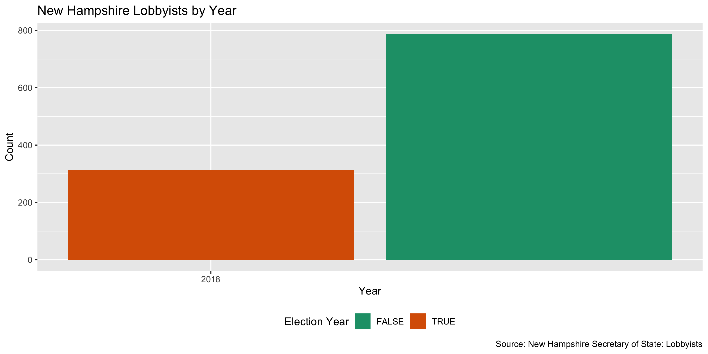
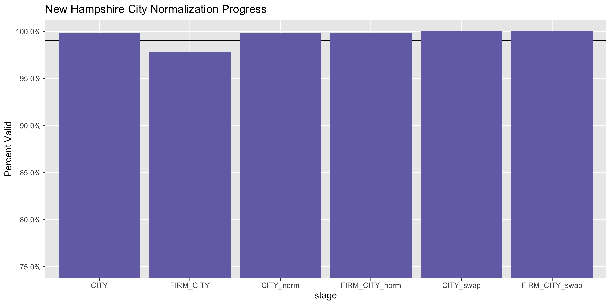
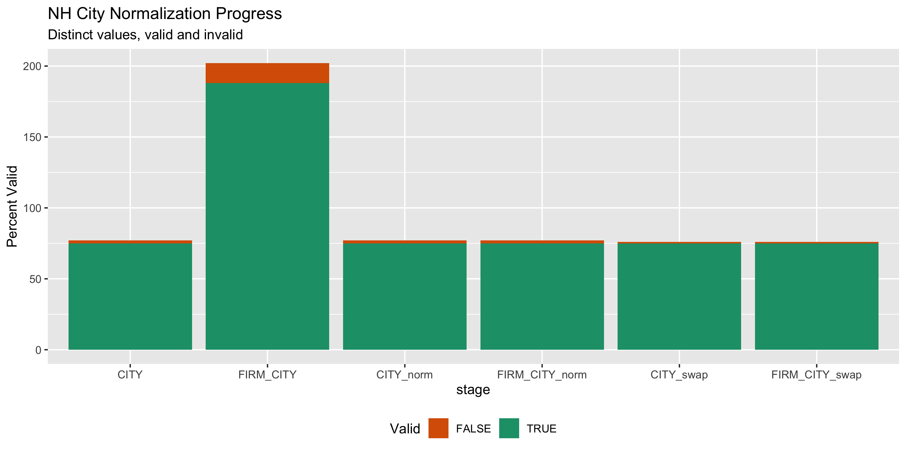

New Hampshire Lobbying Registration Diary
================
Yanqi Xu
2020-02-10 18:37:09

<!-- Place comments regarding knitting here -->

## Project

The Accountability Project is an effort to cut across data silos and
give journalists, policy professionals, activists, and the public at
large a simple way to search across huge volumes of public data about
people and organizations.

Our goal is to standardizing public data on a few key fields by thinking
of each dataset row as a transaction. For each transaction there should
be (at least) 3 variables:

1.  All **parties** to a transaction.
2.  The **date** of the transaction.
3.  The **amount** of money involved.

## Objectives

This document describes the process used to complete the following
objectives:

1.  How many records are in the database?
2.  Check for entirely duplicated records.
3.  Check ranges of continuous variables.
4.  Is there anything blank or missing?
5.  Check for consistency issues.
6.  Create a five-digit ZIP Code called `zip`.
7.  Create a `year` field from the transaction date.
8.  Make sure there is data on both parties to a transaction.

## Packages

The following packages are needed to collect, manipulate, visualize,
analyze, and communicate these results. The `pacman` package will
facilitate their installation and attachment.

The IRW’s `campfin` package will also have to be installed from GitHub.
This package contains functions custom made to help facilitate the
processing of campaign finance data.

``` r
if (!require("pacman")) install.packages("pacman")
pacman::p_load_gh("irworkshop/campfin")
pacman::p_load(
  readxl, #read excek files
  rvest, # used to scrape website and get html elements
  tidyverse, # data manipulation
  stringdist, # calculate distances between strings
  lubridate, # datetime strings
  magrittr, # pipe opperators
  janitor, # dataframe clean
  refinr, # cluster and merge
  scales, # format strings
  knitr, # knit documents
  vroom, # read files fast
  httr, # http queries
  glue, # combine strings
  here, # relative storage
  fs # search storage 
)
```

This document should be run as part of the `R_campfin` project, which
lives as a sub-directory of the more general, language-agnostic
[`irworkshop/accountability_datacleaning`](https://github.com/irworkshop/accountability_datacleaning)
GitHub repository.

The `R_campfin` project uses the [Rstudio
projects](https://support.rstudio.com/hc/en-us/articles/200526207-Using-Projects "Rproj")
feature and should be run as such. The project also uses the dynamic
`here::here()` tool for file paths relative to *your* machine.

``` r
# where does this document knit?
here::here()
#> [1] "/Users/enjoytina/Data-Viz-18/accountability_datacleaning/R_campfin"
```

## Data

The lobbying registration data of New Hampshire is obtained by a class
of Computer-Assisted-Reporting students at the Missouri School of
Journalism supervised by Prof. David Herzog. The class contributed to
sourcing data for the Accountability Project by direct download or
public records request. The dataset is as current as 2019. \#\# Import

### Setting up Raw Data Directory

``` r
raw_dir <- dir_create(here("nh", "lobby", "data", "raw"))
```

### Read

We can see that the date is formatted in Excel and we need to use
`excel_numeric_to_date`

``` r
nh_lob_reg <- read_excel(
  path = dir_ls(raw_dir), skip = 1
)

nh_lob_reg <- nh_lob_reg %>% mutate(DATE = excel_numeric_to_date(nh_lob_reg$DATE, date_system = "modern"))
```

## Explore

``` r
head(nh_lob_reg)
#> # A tibble: 6 x 9
#>   NAME    EMPLOYERNAME     ADDRESS   FIRMNAME     CSZ     FIRMADDR  DATE       PHONE      FIRMCSZ  
#>   <chr>   <chr>            <chr>     <chr>        <chr>   <chr>     <date>     <chr>      <chr>    
#> 1 GARY A… THE ASSOCIATED … 48 GRAND… THE ASSOCIA… BOW,  … 48 GRAND… 2018-12-31 E-gabbott… BOW,  NH…
#> 2 WILL  … SOCIETY FOR THE… 54 PORTS… SOCIETY FOR… CONCOR… 54 PORTS… 2018-12-13 E-wabbott… CONCORD,…
#> 3 STEVE … NEW HAMPSHIRE H… 125 AIRP… NEW HAMPSHI… CONCOR… 125 AIRP… 2018-12-20 E-sahnen@… CONCORD,…
#> 4 SARAH … COMMUNITY BRIDG… 70 PEMBR… COMMUNITY B… CONCOR… 70 PEMBR… 2019-01-07 E-saiken@… CONCORD,…
#> 5 WALTER… CONSUMER TECHNO… 1919 SOU… CONSUMER TE… ARLING… 1919 SOU… 2019-02-11 E-walcom@… ARLINGTO…
#> 6 DANIEL… SIGMA CONSULTAN… 1 ESSEY … EXELON CORP  BOW,  … 300 EXEL… 2019-04-24 E-dallesr… KENNETT …
tail(nh_lob_reg)
#> # A tibble: 6 x 9
#>   NAME    EMPLOYERNAME     ADDRESS    FIRMNAME     CSZ    FIRMADDR    DATE       PHONE     FIRMCSZ 
#>   <chr>   <chr>            <chr>      <chr>        <chr>  <chr>       <date>     <chr>     <chr>   
#> 1 HEATHE… COMMUNITY SUPPO… 10 FERRY … COMMUNITY S… CONCO… 10 FERRY S… 2019-01-22 E-hyoung… CONCORD…
#> 2 GERALD… DRUMMOND WOODSUM 501 ISLIN… NEW HAMPSHI… PORTS… 25 TRIANGL… 2019-07-18 E-gmzeli… CONCORD…
#> 3 FRED  … APPLE INC        28 LIBERT… APPLE INC    SAUSA… c/o POLITI… 2018-12-14 E-report… SAUSALI…
#> 4 C. OLI… OPEN DEMOCRACY … 4 PARK ST… OPEN DEMOCR… CONCO… 4 PARK ST … 2019-01-10 E-olivia… CONCORD…
#> 5 DANIEL… ALZHEIMER'S ASS… 309 WAVER… ALZHEIMER'S… WALTH… 309 WAVERL… 2019-02-07 E-dzotos… WALTHAM…
#> 6 STEVEN… BROOKFIELD RENE… 200 LIBER… BROOKFIELD … NEW Y… 200 LIBERT… 2019-01-22 E-steven… NEW YOR…
glimpse(sample_n(nh_lob_reg, 20))
#> Observations: 20
#> Variables: 9
#> $ NAME         <chr> "DANIEL  COLLINS", "GINA R.  POWERS", "HENRY G.  VEILLEUX", "JAMES  DEMERS"…
#> $ EMPLOYERNAME <chr> "NEW ENGLAND POWER GENERATORS ASSOC", "RYP GRANITE STRATEGIES", "SHEEHAN PH…
#> $ ADDRESS      <chr> "33 BROAD ST 7TH FLOOR", "PO BOX 1500", "2 EAGLE SQ", "72 NORTH MAIN ST  ST…
#> $ FIRMNAME     <chr> "NEW ENGLAND POWER GENERATORS ASSOC", "AMERICAN PETROLEUM INSTITUTE", "NH C…
#> $ CSZ          <chr> "BOSTON,  MA   02109-", "CONCORD,  NH   03302-1500", "CONCORD,  NH   03301-…
#> $ FIRMADDR     <chr> "33 BROAD ST  7TH FLOOR", "60 WEST ST  STE 403", "HAMPSHIRE SERVICES CORP  …
#> $ DATE         <date> 2018-12-18, 2019-01-04, 2018-12-31, 2019-02-08, 2019-01-10, 2019-04-25, 20…
#> $ PHONE        <chr> "E-dcollins@nepga.org W-(617) 902-2344", "E-grp@rypgranite.com W-(603) 410-…
#> $ FIRMCSZ      <chr> "BOSTON,  MA   02109-", "ANNAPOLIX,  MD   21401-", "MANCHESTER,  NH   03108…
```

### Missing

``` r
col_stats(nh_lob_reg, count_na)
#> # A tibble: 9 x 4
#>   col          class      n       p
#>   <chr>        <chr>  <int>   <dbl>
#> 1 NAME         <chr>      0 0      
#> 2 EMPLOYERNAME <chr>     10 0.00909
#> 3 ADDRESS      <chr>      0 0      
#> 4 FIRMNAME     <chr>      0 0      
#> 5 CSZ          <chr>      0 0      
#> 6 FIRMADDR     <chr>      2 0.00182
#> 7 DATE         <date>     0 0      
#> 8 PHONE        <chr>      0 0      
#> 9 FIRMCSZ      <chr>      0 0
```

``` r
nh_lob_reg <- nh_lob_reg %>% flag_na(EMPLOYERNAME, FIRMADDR)
sum(nh_lob_reg$na_flag)
#> [1] 12
```

### Duplicates

``` r
nh_lob_reg <- flag_dupes(nh_lob_reg, dplyr::everything())
sum(nh_lob_reg$dupe_flag)
#> [1] 1
```

### Categorical

``` r
col_stats(nh_lob_reg, n_distinct)
#> # A tibble: 11 x 4
#>    col          class      n       p
#>    <chr>        <chr>  <int>   <dbl>
#>  1 NAME         <chr>    418 0.38   
#>  2 EMPLOYERNAME <chr>    289 0.263  
#>  3 ADDRESS      <chr>    284 0.258  
#>  4 FIRMNAME     <chr>    590 0.536  
#>  5 CSZ          <chr>    129 0.117  
#>  6 FIRMADDR     <chr>    607 0.552  
#>  7 DATE         <date>   113 0.103  
#>  8 PHONE        <chr>    432 0.393  
#>  9 FIRMCSZ      <chr>    291 0.265  
#> 10 na_flag      <lgl>      2 0.00182
#> 11 dupe_flag    <lgl>      2 0.00182
```

Visualize number of lobbyists registered each year.

``` r
nh_lob_reg <- nh_lob_reg %>% 
  mutate(YEAR = year(DATE))

nh_lob_reg$YEAR %>% tabyl()
#> # A tibble: 2 x 3
#>       .     n percent
#>   <dbl> <dbl>   <dbl>
#> 1  2018   313   0.285
#> 2  2019   787   0.715
```

We can see that most of the data is from 2019.

#### Dates

``` r
min(nh_lob_reg$DATE)
#> [1] "2018-11-09"
max(nh_lob_reg$DATE)
#> [1] "2019-09-10"
```

``` r
nh_lob_reg %>% 
  count(YEAR) %>% 
  mutate(even = is_even(YEAR)) %>% 
  ggplot(aes(x = YEAR, y = n)) +
  geom_col(aes(fill = even)) + 
  scale_fill_brewer(palette = "Dark2") +
  scale_y_continuous(labels = comma) +
  scale_x_continuous(breaks = seq(2000, 2020, by = 2)) +
  theme(legend.position = "bottom") +
  labs(
    title = "New Hampshire Lobbyists by Year",
    caption = "Source: New Hampshire Secretary of State: Lobbyists",
    fill = "Election Year",
    x = "Year",
    y = "Count"
  )
```

<!-- -->

## Wrangle

To improve the searchability of the database, we will perform some
consistent, confident string normalization. For geographic variables
like city names and ZIP codes, the corresponding `campfin::normal_*()`
functions are taylor made to facilitate this process. \#\#\# Phone We
can see that for both lobbyists and clients, the `PHONE` column actually
contains both phones and emails. We separate them here using regex. The
result yields no `NA` fields.

``` r
nh_lob_reg <-  nh_lob_reg %>% 
  mutate(EMAIL_clean = str_match(PHONE, "^E-(.+)\\sW-")[,2],         PHONE_clean = str_match(PHONE, "\\sW-(.+)$")[,2] %>% normal_phone()
         )
```

First, we will separate the columns `CSZ` into three: `CITY`, `STATE`
and `ZIP`, which will be normalized in the following steps

``` r
nh_lob_reg <-  nh_lob_reg %>% 
  mutate(CITY = str_match(CSZ, "^(\\D+),\\s")[,2],
         STATE = str_match(CSZ, ",  (\\w{2})   ")[,2] %>% str_trim(),
         ZIP = str_match(CSZ, "   (.+$)")[,2]
         )
```

``` r
nh_lob_reg <-  nh_lob_reg %>% 
  mutate(FIRM_CITY = str_match(FIRMCSZ, "^(\\D+),\\s")[,2],
         FIRM_STATE = str_match(FIRMCSZ, ",  (\\w{2})   ")[,2] %>% str_trim(),
         FIRM_ZIP = str_match(FIRMCSZ, "   (.+$)")[,2]
         )

col_stats(nh_lob_reg, count_na)
#> # A tibble: 20 x 4
#>    col          class      n       p
#>    <chr>        <chr>  <int>   <dbl>
#>  1 NAME         <chr>      0 0      
#>  2 EMPLOYERNAME <chr>     10 0.00909
#>  3 ADDRESS      <chr>      0 0      
#>  4 FIRMNAME     <chr>      0 0      
#>  5 CSZ          <chr>      0 0      
#>  6 FIRMADDR     <chr>      2 0.00182
#>  7 DATE         <date>     0 0      
#>  8 PHONE        <chr>      0 0      
#>  9 FIRMCSZ      <chr>      0 0      
#> 10 na_flag      <lgl>      0 0      
#> 11 dupe_flag    <lgl>      0 0      
#> 12 YEAR         <dbl>      0 0      
#> 13 EMAIL_clean  <chr>      0 0      
#> 14 PHONE_clean  <chr>      0 0      
#> 15 CITY         <chr>      0 0      
#> 16 STATE        <chr>      0 0      
#> 17 ZIP          <chr>      0 0      
#> 18 FIRM_CITY    <chr>      0 0      
#> 19 FIRM_STATE   <chr>      0 0      
#> 20 FIRM_ZIP     <chr>      0 0
```

Running the `count_na`commands show that every cell in the three columns
inherited from `CSZ` is accounted for.

### Address

For the street `addresss` variable, the `campfin::normal_address()`
function will force consistence case, remove punctuation, and
abbreviation official USPS suffixes.

``` r
nh_lob_reg <- nh_lob_reg %>% 
  # normalize combined addr
  mutate(
    ADDRESS_norm = normal_address(
      address = ADDRESS,
      abbs = usps_street,
      na_rep = TRUE
    ),
      FIRM_ADDRESS_norm = normal_address(
      address = FIRMADDR,
      abbs = usps_street,
      na_rep = TRUE
    )
  )
```

``` r
nh_lob_reg %>% 
  select(contains("ADDR")) %>% 
  distinct() %>% 
  sample_n(10)
#> # A tibble: 10 x 4
#>    ADDRESS                FIRMADDR                ADDRESS_norm            FIRM_ADDRESS_norm        
#>    <chr>                  <chr>                   <chr>                   <chr>                    
#>  1 1152 15TH STREET NW    125 SUMMER STREET  STE… 1152 15TH STREET NORTH… 125 SUMMER STREET SUITE …
#>  2 37 PLEASANT ST         37 PLEASANT ST          37 PLEASANT STREET      37 PLEASANT STREET       
#>  3 17 DEPOT ST            518 TRUDEAU RD          17 DEPOT STREET         518 TRUDEAU ROAD         
#>  4 7 WALL ST              7 WALL ST               7 WALL STREET           7 WALL STREET            
#>  5 18 CENTRE ST           25 TRIANGLE PARK STE 1… 18 CENTER STREET        25 TRIANGLE PARK SUITE 1…
#>  6 PO BOX 233             695 GRASSMERE PARK      PO BOX 233              695 GRASSMERE PARK       
#>  7 84 SILK FARM RD        84 SILK FARM RD         84 SILK FARM ROAD       84 SILK FARM ROAD        
#>  8 No Longer Lobbying 7/… No Longer Lobbying 7/1… NO LONGER LOBBYING 7 1… NO LONGER LOBBYING 7 10 …
#>  9 705 MOUNT AUBURN ST    11 SOUTH MAIN ST        705 MOUNT AUBURN STREET 11 SOUTH MAIN STREET     
#> 10 2 EAGLE SQ             100 ARBORETUM DR  STE … 2 EAGLE SQUARE          100 ARBORETUM DRIVE SUIT…
```

### ZIP

For ZIP codes, the `campfin::normal_zip()` function will attempt to
create valied *five* digit codes by removing the ZIP+4 suffix and
returning leading zeroes dropped by other programs like Microsoft Excel.

``` r
nh_lob_reg <- nh_lob_reg %>% 
  mutate(
    ZIP5 = normal_zip(
      zip = ZIP,
      na_rep = TRUE
    ),
    FIRM_ZIP5 = normal_zip(
      zip = FIRM_ZIP,
      na_rep = TRUE
    )
  )
```

``` r
progress_table(
  nh_lob_reg$ZIP,
  nh_lob_reg$ZIP5,
  nh_lob_reg$FIRM_ZIP,
  nh_lob_reg$FIRM_ZIP5,
  compare = valid_zip
)
#> # A tibble: 4 x 6
#>   stage     prop_in n_distinct prop_na n_out n_diff
#>   <chr>       <dbl>      <dbl>   <dbl> <dbl>  <dbl>
#> 1 ZIP         0            126       0  1100    126
#> 2 ZIP5        1            109       0     0      0
#> 3 FIRM_ZIP    0            272       0  1100    272
#> 4 FIRM_ZIP5   0.995        251       0     6      5
```

### state

Valid two digit state abbreviations can be made using the
`campfin::normal_state()` function.

``` r
nh_lob_reg <- nh_lob_reg %>% 
  mutate(
    STATE_norm = normal_state(
      state = STATE,
      abbreviate = TRUE,
      na_rep = TRUE,
      valid = valid_state
    ),
    FIRM_STATE_norm =  normal_state(
      state = FIRM_STATE,
      abbreviate = TRUE,
      na_rep = TRUE,
      valid = valid_state
    )
  )
```

``` r
nh_lob_reg %>% 
  filter(STATE != STATE_norm) %>% 
  count(STATE, sort = TRUE)
#> # A tibble: 0 x 2
#> # … with 2 variables: STATE <chr>, n <int>
```

``` r
nh_lob_reg %>% 
  filter(FIRM_STATE != FIRM_STATE_norm) %>% 
  count(FIRM_STATE, sort = TRUE)
#> # A tibble: 0 x 2
#> # … with 2 variables: FIRM_STATE <chr>, n <int>
```

``` r
progress_table(
  nh_lob_reg$STATE,
  nh_lob_reg$STATE_norm,
  compare = valid_state
)
#> # A tibble: 2 x 6
#>   stage      prop_in n_distinct prop_na n_out n_diff
#>   <chr>        <dbl>      <dbl>   <dbl> <dbl>  <dbl>
#> 1 STATE            1         22       0     0      0
#> 2 STATE_norm       1         22       0     0      0
```

### City

Cities are the most difficult geographic variable to normalize, simply
due to the wide variety of valid cities and formats.

#### Normal

The `campfin::normal_city()` function is a good nh\_lob\_regart, again
converting case, removing punctuation, but *expanding* USPS
abbreviations. We can also remove `invalid_city` values.

``` r
nh_lob_reg <- nh_lob_reg %>% 
  mutate(
    CITY_norm = normal_city(
      city = CITY, 
      abbs = usps_city,
      states = usps_state,
      na = invalid_city,
      na_rep = TRUE
    ),
      FIRM_CITY_norm = normal_city(
      city = CITY, 
      abbs = usps_city,
      states = usps_state,
      na = invalid_city,
      na_rep = TRUE
    )
  )
```

#### Swap

We can further improve normalization by comparing our normalized value
against the *expected* value for that record’s state abbreviation and
ZIP code. If the normalized value is either an abbreviation for or very
similar to the expected value, we can confidently swap those two.

``` r
nh_lob_reg <- nh_lob_reg %>% 
  left_join(
    y = zipcodes,
    by = c(
      "STATE_norm" = "state",
      "ZIP5" = "zip"
    )
  ) %>% 
  rename(CITY_match = city) %>% 
  mutate(
    match_abb = is_abbrev(CITY_norm, CITY_match),
    match_dist = str_dist(CITY_norm, CITY_match),
    CITY_swap = if_else(
      condition = !is.na(match_dist) & match_abb | match_dist == 1,
      true = CITY_match,
      false = CITY_norm
    )
  ) %>% 
  select(
    -CITY_match,
    -match_dist,
    -match_abb
  )
```

``` r
nh_lob_reg <- nh_lob_reg %>% 
  left_join(
    y = zipcodes,
    by = c(
      "FIRM_STATE_norm" = "state",
      "FIRM_ZIP5" = "zip"
    )
  ) %>% 
  rename(FIRM_CITY_match = city) %>% 
  mutate(
    match_abb = is_abbrev(FIRM_CITY_norm, FIRM_CITY_match),
    match_dist = str_dist(FIRM_CITY_norm, FIRM_CITY_match),
    FIRM_CITY_swap = if_else(
      condition = !is.na(match_dist) & match_abb | match_dist == 1,
      true = FIRM_CITY_match,
      false =FIRM_CITY_norm
    )
  ) %>% 
  select(
    -FIRM_CITY_match,
    -match_dist,
    -match_abb
  )
```

After the two normalization steps, the percentage of valid cities is at
100%. \#\#\#\#
Progress

| stage            | prop\_in | n\_distinct | prop\_na | n\_out | n\_diff |
| :--------------- | -------: | ----------: | -------: | -----: | ------: |
| CITY             |    0.998 |          77 |    0.000 |      2 |       2 |
| FIRM\_CITY       |    0.978 |         202 |    0.000 |     24 |      14 |
| CITY\_norm       |    0.998 |          77 |    0.000 |      2 |       2 |
| FIRM\_CITY\_norm |    0.998 |          77 |    0.000 |      2 |       2 |
| CITY\_swap       |    1.000 |          76 |    0.001 |      0 |       1 |
| FIRM\_CITY\_swap |    1.000 |          76 |    0.008 |      0 |       1 |

You can see how the percentage of valid values increased with each
stage.

<!-- -->

More importantly, the number of distinct values decreased each stage. We
were able to confidently change many distinct invalid values to their
valid equivalent.

``` r
progress %>% 
  select(
    stage, 
    all = n_distinct,
    bad = n_diff
  ) %>% 
  mutate(good = all - bad) %>% 
  pivot_longer(c("good", "bad")) %>% 
  mutate(name = name == "good") %>% 
  ggplot(aes(x = stage, y = value)) +
  geom_col(aes(fill = name)) +
  scale_fill_brewer(palette = "Dark2", direction = -1) +
  scale_y_continuous(labels = comma) +
  theme(legend.position = "bottom") +
  labs(
    title = "NH City Normalization Progress",
    subtitle = "Distinct values, valid and invalid",
    x = "stage",
    y = "Percent Valid",
    fill = "Valid"
  )
```

<!-- -->

## Conclude

``` r
glimpse(sample_n(nh_lob_reg, 20))
#> Observations: 20
#> Variables: 30
#> $ NAME              <chr> "DAVID A.  JUVET", "BRUCE A.  BERKE", "JAMES  DEMERS", "KYLE  BAKER", …
#> $ EMPLOYERNAME      <chr> "BUSINESS AND INDUSTRY ASSOC OF NH", "SHEEHAN PHINNEY CAPITOL GROUP", …
#> $ ADDRESS           <chr> "122 N MAIN ST", "2 EAGLE SQ", "72 NORTH MAIN ST  STE 301", "PO BOX 15…
#> $ FIRMNAME          <chr> "BUSINESS AND INDUSTRY ASSOC OF NH", "SKI NEW HAMPSHIRE INC", "AMERICA…
#> $ CSZ               <chr> "CONCORD,  NH   03301-", "CONCORD,  NH   03301-", "CONCORD,  NH   0330…
#> $ FIRMADDR          <chr> "122 N MAIN ST", "PO BOX 521", "353 NORTH CIARD ST  STE 1400", "801 PE…
#> $ DATE              <date> 2018-12-14, 2018-12-31, 2019-01-10, 2019-01-04, 2019-01-04, 2018-12-2…
#> $ PHONE             <chr> "E-djuvet@biaofnh.com W-(603) 224-5388", "E-bberke@sheehan.com W-(603)…
#> $ FIRMCSZ           <chr> "CONCORD,  NH   03301-", "CANOWAY,  NH   03818-", "CHICAGO,  IL   6065…
#> $ na_flag           <lgl> FALSE, FALSE, FALSE, FALSE, FALSE, FALSE, FALSE, FALSE, FALSE, FALSE, …
#> $ dupe_flag         <lgl> FALSE, FALSE, FALSE, FALSE, FALSE, FALSE, FALSE, FALSE, FALSE, FALSE, …
#> $ YEAR              <dbl> 2018, 2018, 2019, 2019, 2019, 2018, 2018, 2018, 2018, 2019, 2019, 2019…
#> $ EMAIL_clean       <chr> "djuvet@biaofnh.com", "bberke@sheehan.com", "james.demers@demers-blais…
#> $ PHONE_clean       <chr> "(603) 224-5388", "(603) 228-2370", "(603) 228-1498", "(603) 410-4320"…
#> $ CITY              <chr> "CONCORD", "CONCORD", "CONCORD", "CONCORD", "CONCORD", "MANCHESTER", "…
#> $ STATE             <chr> "NH", "NH", "NH", "NH", "NH", "NH", "NH", "NH", "NH", "NH", "NH", "NH"…
#> $ ZIP               <chr> "03301-", "03301-", "03301-", "03302-1500", "03302-1500", "03105-", "0…
#> $ FIRM_CITY         <chr> "CONCORD", "CANOWAY", "CHICAGO", "WASHINGTON", "MANCHESTER", "MANCHEST…
#> $ FIRM_STATE        <chr> "NH", "NH", "IL", "DC", "NH", "NH", "WI", "NC", "NH", "NH", "VA", "MA"…
#> $ FIRM_ZIP          <chr> "03301-", "03818-", "60654-", "20004-", "03105-", "03105-", "53201-", …
#> $ ADDRESS_norm      <chr> "122 NORTH MAIN STREET", "2 EAGLE SQUARE", "72 NORTH MAIN STREET SUITE…
#> $ FIRM_ADDRESS_norm <chr> "122 NORTH MAIN STREET", "PO BOX 521", "353 NORTH CIARD STREET SUITE 1…
#> $ ZIP5              <chr> "03301", "03301", "03301", "03302", "03302", "03105", "03301", "03301"…
#> $ FIRM_ZIP5         <chr> "03301", "03818", "60654", "20004", "03105", "03105", "53201", "27834"…
#> $ STATE_norm        <chr> "NH", "NH", "NH", "NH", "NH", "NH", "NH", "NH", "NH", "NH", "NH", "NH"…
#> $ FIRM_STATE_norm   <chr> "NH", "NH", "IL", "DC", "NH", "NH", "WI", "NC", "NH", "NH", "VA", "MA"…
#> $ CITY_norm         <chr> "CONCORD", "CONCORD", "CONCORD", "CONCORD", "CONCORD", "MANCHESTER", "…
#> $ FIRM_CITY_norm    <chr> "CONCORD", "CONCORD", "CONCORD", "CONCORD", "CONCORD", "MANCHESTER", "…
#> $ CITY_swap         <chr> "CONCORD", "CONCORD", "CONCORD", "CONCORD", "CONCORD", "MANCHESTER", "…
#> $ FIRM_CITY_swap    <chr> "CONCORD", "CONCORD", "CONCORD", "CONCORD", "CONCORD", "MANCHESTER", "…
```

1.  There are 1100 records in the database.
2.  There are 1 duplicate records in the database.
3.  The range and distribution of `amount` and `date` seem reasonable.
4.  There are 12 records missing either recipient or date.
5.  Consistency in goegraphic data has been improved with
    `campfin::normal_*()`.
6.  The 4-digit `YEAR` variable has been created with
    `lubridate::year()`.

## Export

``` r
clean_dir <- dir_create(here("nh", "lobby", "data", "reg","clean"))
```

``` r
write_csv(
  x = nh_lob_reg %>% rename(CITY_clean = CITY_swap) %>% rename( FIRM_CITY_clean = FIRM_CITY_swap),
  path = path(clean_dir, "nh_lob_reg_clean.csv"),
  na = ""
)
```
