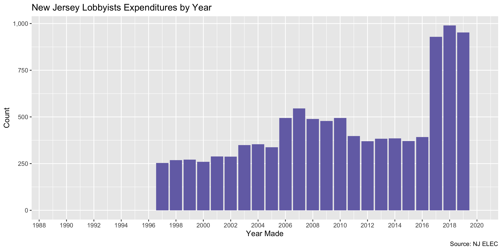

New Jersey Lobbyists
================
Kiernan Nicholls
2020-06-16 14:26:06

  - [Project](#project)
  - [Objectives](#objectives)
  - [Packages](#packages)
  - [Data](#data)
  - [Read](#read)
  - [Explore](#explore)
  - [Wrangle](#wrangle)
  - [Conclude](#conclude)
  - [Export](#export)
  - [Upload](#upload)
  - [Dictionary](#dictionary)

<!-- Place comments regarding knitting here -->

## Project

The Accountability Project is an effort to cut across data silos and
give journalists, policy professionals, activists, and the public at
large a simple way to search across huge volumes of public data about
people and organizations.

Our goal is to standardizing public data on a few key fields by thinking
of each dataset row as a transaction. For each transaction there should
be (at least) 3 variables:

1.  All **parties** to a transaction.
2.  The **date** of the transaction.
3.  The **amount** of money involved.

## Objectives

This document describes the process used to complete the following
objectives:

1.  How many records are in the database?
2.  Check for entirely duplicated records.
3.  Check ranges of continuous variables.
4.  Is there anything blank or missing?
5.  Check for consistency issues.
6.  Create a five-digit ZIP Code called `zip`.
7.  Create a `year` field from the transaction date.
8.  Make sure there is data on both parties to a transaction.

## Packages

The following packages are needed to collect, manipulate, visualize,
analyze, and communicate these results. The `pacman` package will
facilitate their installation and attachment.

The IRW’s `campfin` package will also have to be installed from GitHub.
This package contains functions custom made to help facilitate the
processing of campaign finance data.

``` r
if (!require("pacman")) install.packages("pacman")
pacman::p_load_gh("irworkshop/campfin")
pacman::p_load(
  tidyverse, # data manipulation
  lubridate, # datetime strings
  gluedown, # printing markdown
  magrittr, # pipe operators
  janitor, # clean data frames
  refinr, # cluster and merge
  scales, # format strings
  knitr, # knit documents
  vroom, # read files fast
  rvest, # html scraping
  glue, # combine strings
  here, # relative paths
  httr, # http requests
  fs # local storage 
)
```

This document should be run as part of the `R_campfin` project, which
lives as a sub-directory of the more general, language-agnostic
[`irworkshop/accountability_datacleaning`](https://github.com/irworkshop/accountability_datacleaning)
GitHub repository.

The `R_campfin` project uses the [RStudio
projects](https://support.rstudio.com/hc/en-us/articles/200526207-Using-Projects)
feature and should be run as such. The project also uses the dynamic
`here::here()` tool for file paths relative to *your* machine.

``` r
# where does this document knit?
here::here()
#> [1] "/home/kiernan/Code/accountability_datacleaning/R_campfin"
```

## Data

Lobbying data is obtained from the [Election Law Enforcement
Commission](https://www.elec.state.nj.us/).

> The Election Law Enforcement Commission (ELEC) is dedicated to
> administering “The New Jersey Campaign Contributions and Expenditures
> Reporting Act‚” “The Gubernatorial‚ Legislative Disclosure Statement
> Act‚” “Legislative and Governmental Process Activities Disclosure
> Act‚” and parts of several other laws.

ELEC [provides a
portal](https://www3-elec.mwg.state.nj.us/ELEC_AGAA/EntitySearch.aspx)
where users can search for information on lobbyist as well as their
firms and clients. From the portal, we can run empty searches on five
different categories to return all results and export them:

1.  `Agent.csv` for lobbyist names and addresses.
2.  `BillSearch.csv` for lobbying activity on certain bills.
3.  `Client.csv` for client names.
4.  `Firm.csv` for firm names and addresses.
5.  `IndexClient.csv` for agent, firm, client relationships.

## Read

The results data was manually exported to the `data/raw/` directory.

``` r
raw_dir <- dir_create(here("nj", "lobby", "data", "raw"))
raw_info <- as_tibble(dir_info(raw_dir))
raw_info %>% 
  select(path, size, modification_time) %>% 
  mutate(across(path, path.abbrev))
#> # A tibble: 5 x 3
#>   path                                       size modification_time  
#>   <chr>                               <fs::bytes> <dttm>             
#> 1 ~/nj/lobby/data/raw/Agent.csv            716.9K 2020-06-16 11:38:52
#> 2 ~/nj/lobby/data/raw/BillSearch.csv        10.2M 2020-06-16 11:40:39
#> 3 ~/nj/lobby/data/raw/Client.csv           314.4K 2020-06-16 11:39:19
#> 4 ~/nj/lobby/data/raw/Firm.csv             179.8K 2020-06-16 11:39:06
#> 5 ~/nj/lobby/data/raw/IndexClient.csv       18.1M 2020-06-16 11:21:31
```

First, we will read the `IndexClient.csv` file containing the
relationships between lobbying agents, their firms, and the client
entities they represent.

``` r
njl <- vroom(
  file = path(raw_dir, "IndexClient.csv"),
  delim = ",",
  .name_repair = make_clean_names,
  col_types = cols(
    .default = col_character(),
    Active_Date = col_date_usa()
  )
)
```

We can confirm the file was read properly by counting the distinct
values of a discrete variable.

``` r
count(njl, agent_status)
#> # A tibble: 2 x 2
#>   agent_status     n
#>   <chr>        <int>
#> 1 A            27551
#> 2 T            51876
```

Next, we’ll want to read the file containing additional information
regarding the lobbying agents.

``` r
agents <- vroom(
  file = path(raw_dir, "Agent.csv"),
  delim = ",",
  .name_repair = make_clean_names,
  col_types = cols(
    .default = col_character(),
    active_date = col_date_usa(),
    agent_term_date = col_date_usa(),
    Agent_eff_term_date = col_date_usa()
  )
)
```

To prepare to join the files together, we need to adjust some variable
names.

``` r
agents <- rename(
  .data = agents,
  agent_last = last_name,
  agent_id = agent_firm_id,
  firm_addr = address,
  firm_city = city,
  firm_state = state,
  firm_zip = zip,
  agent_term = agent_term_date,
  agent_eff = agent_eff_term_date
)
```

Then the two data frames can be joined together.

``` r
mean(agents$agent_name %in% njl$agent_name)
#> [1] 1
njl <- left_join(njl, agents)
```

## Explore

``` r
glimpse(njl)
#> Rows: 79,427
#> Columns: 17
#> $ agent_name    <chr> "Goldfarb, David", "Goldfarb, David", "Goldfarb, David", "Ballezzi, Thomas…
#> $ firm_id       <chr> "1", "1", "1", "2", "2", "2", "2", "2", "2", "2", "2", "2", "2", "2", "2",…
#> $ firm_name     <chr> "Katz Martin & Co", "Katz Martin & Co", "Katz Martin & Co", "Casino Associ…
#> $ agent_status  <chr> "T", "T", "T", "T", "T", "T", "T", "T", "T", "T", "T", "T", "T", "T", "T",…
#> $ active_date   <date> 1999-03-15, 1999-03-15, 1999-03-15, 1994-01-11, 1994-01-11, 1994-01-11, 1…
#> $ badge_number  <chr> "1-1", "1-1", "1-1", "2-5", "2-5", "2-5", "2-5", "2-1", "2-1", "2-1", "2-1…
#> $ firm_phone    <chr> "609-393-7799", "609-393-7799", "609-393-7799", NA, NA, NA, NA, NA, NA, NA…
#> $ client_name   <chr> "Allstate Insurance Co", "General Electric Co", "Tobacco & Candy Dist Asso…
#> $ firm_fullname <chr> "Katz Martin & Co<br/>196 W State St    Trenton,NJ 08608", "Katz Martin & …
#> $ agent_last    <chr> "Goldfarb", "Goldfarb", "Goldfarb", "Ballezzi", "Ballezzi", "Ballezzi", "B…
#> $ agent_id      <chr> "4790", "4790", "4790", "4590", "4590", "4590", "4590", "4594", "4594", "4…
#> $ firm_addr     <chr> "196 W State St", "196 W State St", "196 W State St", NA, NA, NA, NA, NA, …
#> $ firm_city     <chr> "Trenton", "Trenton", "Trenton", NA, NA, NA, NA, NA, NA, NA, NA, NA, NA, N…
#> $ firm_state    <chr> "NJ", "NJ", "NJ", NA, NA, NA, NA, NA, NA, NA, NA, NA, NA, NA, NA, NA, NA, …
#> $ firm_zip      <chr> "08608", "08608", "08608", NA, NA, NA, NA, NA, NA, NA, NA, NA, NA, NA, NA,…
#> $ agent_term    <date> 2001-02-01, 2001-02-01, 2001-02-01, 1995-01-03, 1995-01-03, 1995-01-03, 1…
#> $ agent_eff     <date> NA, NA, NA, 1994-01-04, 1994-01-04, 1994-01-04, 1994-01-04, 1994-01-01, 1…
tail(njl)
#> # A tibble: 6 x 17
#>   agent_name firm_id firm_name agent_status active_date badge_number firm_phone client_name
#>   <chr>      <chr>   <chr>     <chr>        <date>      <chr>        <chr>      <chr>      
#> 1 Kovach, S… 2502    Health P… A            2020-03-20  2502-3       215-991-4… Health Par…
#> 2 Pritchett… 2502    Health P… A            2020-03-13  2502-2       215-991-4… Health Par…
#> 3 Osborne, … 2503    Deloitte… A            2020-03-11  2503-1       215-405-7… Deloitte S…
#> 4 Dick, And… 2504    Electrif… A            2020-05-26  2504-1       <NA>       Electrify …
#> 5 Head, Rob… 2505    Lockheed… A            2020-05-14  2505-2       <NA>       Lockheed M…
#> 6 Marrone, … 2505    Lockheed… A            2020-05-14  2505-1       <NA>       Lockheed M…
#> # … with 9 more variables: firm_fullname <chr>, agent_last <chr>, agent_id <chr>, firm_addr <chr>,
#> #   firm_city <chr>, firm_state <chr>, firm_zip <chr>, agent_term <date>, agent_eff <date>
```

### Missing

``` r
col_stats(njl, count_na)
#> # A tibble: 17 x 4
#>    col           class      n        p
#>    <chr>         <chr>  <int>    <dbl>
#>  1 agent_name    <chr>      0 0       
#>  2 firm_id       <chr>      0 0       
#>  3 firm_name     <chr>      0 0       
#>  4 agent_status  <chr>      0 0       
#>  5 active_date   <date>     0 0       
#>  6 badge_number  <chr>      0 0       
#>  7 firm_phone    <chr>   4826 0.0608  
#>  8 client_name   <chr>     26 0.000327
#>  9 firm_fullname <chr>     36 0.000453
#> 10 agent_last    <chr>      0 0       
#> 11 agent_id      <chr>      0 0       
#> 12 firm_addr     <chr>     34 0.000428
#> 13 firm_city     <chr>     33 0.000415
#> 14 firm_state    <chr>     34 0.000428
#> 15 firm_zip      <chr>     36 0.000453
#> 16 agent_term    <date> 27551 0.347   
#> 17 agent_eff     <date> 44431 0.559
```

``` r
njl <- njl %>% flag_na(active_date, agent_name, firm_name, client_name)
sum(njl$na_flag)
#> [1] 26
```

``` r
njl %>% 
  filter(na_flag) %>% 
  select(active_date, agent_name, firm_name, client_name)
#> # A tibble: 26 x 4
#>    active_date agent_name                   firm_name                    client_name
#>    <date>      <chr>                        <chr>                        <chr>      
#>  1 2017-10-16  Beatty, Steve                NJ Education Association     <NA>       
#>  2 1990-01-01  Bilheimer, Robert W          Robert W Bilheimer           <NA>       
#>  3 1990-12-30  Damant, Brian D              Brian D Damant               <NA>       
#>  4 1994-08-17  Howland, Susan               Susan Howland                <NA>       
#>  5 1992-09-30  Piccolo, Frank A  Esq        Frank A Piccolo              <NA>       
#>  6 1990-01-01  Whnen Baeckler, Virginia Van Virginia Van  Whnen Baeckler <NA>       
#>  7 1992-12-02  O'Day, Maureen               Maureen  O'Day               <NA>       
#>  8 1990-01-01  Lynch, Jeffrey R             Jeffrey R Lynch              <NA>       
#>  9 1990-12-28  Nord, Hans H                 Hans H Nord                  <NA>       
#> 10 1992-11-16  Gavan, Henry F               Henry F Gavan                <NA>       
#> # … with 16 more rows
```

### Duplicates

There are no duplicate records.

``` r
njl <- flag_dupes(njl, everything())
#> Warning in flag_dupes(njl, everything()): no duplicate rows, column not created
```

### Categorical

``` r
col_stats(njl, n_distinct)
#> # A tibble: 18 x 4
#>    col           class      n         p
#>    <chr>         <chr>  <int>     <dbl>
#>  1 agent_name    <chr>   4385 0.0552   
#>  2 firm_id       <chr>   2227 0.0280   
#>  3 firm_name     <chr>   1953 0.0246   
#>  4 agent_status  <chr>      2 0.0000252
#>  5 active_date   <date>  2770 0.0349   
#>  6 badge_number  <chr>   5188 0.0653   
#>  7 firm_phone    <chr>   1751 0.0220   
#>  8 client_name   <chr>   8500 0.107    
#>  9 firm_fullname <chr>   2186 0.0275   
#> 10 agent_last    <chr>   3168 0.0399   
#> 11 agent_id      <chr>   5188 0.0653   
#> 12 firm_addr     <chr>   2003 0.0252   
#> 13 firm_city     <chr>    550 0.00692  
#> 14 firm_state    <chr>     39 0.000491 
#> 15 firm_zip      <chr>    846 0.0107   
#> 16 agent_term    <date>  2207 0.0278   
#> 17 agent_eff     <date>  1111 0.0140   
#> 18 na_flag       <lgl>      2 0.0000252
```

### Dates

We can add the calendar year from `date` with `lubridate::year()`

``` r
njl <- mutate(njl, year = year(active_date))
```

``` r
min(njl$active_date)
#> [1] "1981-05-22"
max(njl$active_date)
#> [1] "2020-06-15"
sum(njl$active_date > today())
#> [1] 0
```

<!-- -->

## Wrangle

To improve the searchability of the database, we will perform some
consistent, confident string normalization. For geographic variables
like city names and ZIP codes, the corresponding `campfin::normal_*()`
functions are tailor made to facilitate this process.

### Address

For the street `addresss` variable, the `campfin::normal_address()`
function will force consistence case, remove punctuation, and abbreviate
official USPS suffixes.

``` r
njl <- mutate(
   .data = njl,
   firm_addr_norm = normal_address(
     address = firm_addr,
     abbs = usps_street,
     na = invalid_city
   )
 )
```

``` r
njl %>% 
  select(contains("addr")) %>% 
  distinct() %>% 
  sample_n(10)
#> # A tibble: 10 x 2
#>    firm_addr                      firm_addr_norm                
#>    <chr>                          <chr>                         
#>  1 511 Sea Girt Ave               511 SEA GIRT AVE              
#>  2 162 West State Street          162 W STATE ST                
#>  3 449 Sergeantsville Rd          449 SERGEANTSVILLE RD         
#>  4 1204 Whitney Ave Apt 503       1204 WHITNEY AVE APT 503      
#>  5 3126 Cloverly Dr               3126 CLOVERLY DR              
#>  6 1 Glen Eagles Dr               1 GLN EAGLES DR               
#>  7 3000 Arthur St NE              3000 ARTHUR ST NE             
#>  8 2211 Whitehorse Mercerville Rd 2211 WHITEHORSE MERCERVILLE RD
#>  9 1901 North Olden Ave  Ste 8    1901 N OLDEN AVE STE 8        
#> 10 200 North Glebe Rd Ste 730     200 N GLEBE RD STE 730
```

### ZIP

For ZIP codes, the `campfin::normal_zip()` function will attempt to
create valid *five* digit codes by removing the ZIP+4 suffix and
returning leading zeroes dropped by other programs like Microsoft Excel.

``` r
njl <- mutate(
  .data = njl,
  firm_zip_norm = normal_zip(
    zip = firm_zip,
    na_rep = TRUE
  )
)
```

``` r
progress_table(
  njl$firm_zip,
  njl$firm_zip_norm,
  compare = valid_zip
)
#> # A tibble: 2 x 6
#>   stage         prop_in n_distinct  prop_na n_out n_diff
#>   <chr>           <dbl>      <dbl>    <dbl> <dbl>  <dbl>
#> 1 firm_zip        0.835        846 0.000453 13067    212
#> 2 firm_zip_norm   1.00         688 0.000453    12      9
```

### State

Valid two digit state abbreviations can be made using the
`campfin::normal_state()` function.

``` r
njl <- njl %>% 
  mutate(
    firm_state_norm = normal_state(
      state = firm_state,
      abbreviate = TRUE,
      na_rep = TRUE,
      valid = valid_state
    )
  )
```

``` r
njl %>% 
  filter(firm_state != firm_state_norm) %>% 
  count(firm_state, firm_state_norm, sort = TRUE)
#> # A tibble: 5 x 3
#>   firm_state firm_state_norm     n
#>   <chr>      <chr>           <int>
#> 1 Va         VA                  7
#> 2 De         DE                  3
#> 3 Ca         CA                  1
#> 4 Pa         PA                  1
#> 5 Tx         TX                  1
```

``` r
progress_table(
  njl$firm_state,
  njl$firm_state_norm,
  compare = valid_state
)
#> # A tibble: 2 x 6
#>   stage           prop_in n_distinct  prop_na n_out n_diff
#>   <chr>             <dbl>      <dbl>    <dbl> <dbl>  <dbl>
#> 1 firm_state         1.00         39 0.000428    13      6
#> 2 firm_state_norm    1            34 0.000428     0      1
```

### City

Cities are the most difficult geographic variable to normalize, simply
due to the wide variety of valid cities and formats.

#### Normal

The `campfin::normal_city()` function is a good start, again converting
case, removing punctuation, but *expanding* USPS abbreviations. We can
also remove `invalid_city` values.

``` r
njl <- njl %>% 
  mutate(
    firm_city_norm = normal_city(
      city = firm_city, 
      abbs = usps_city,
      states = c("NJ", "DC", "NEW JERSEY"),
      na = invalid_city,
      na_rep = TRUE
    )
  )
```

#### Progress

| stage            | prop\_in | n\_distinct | prop\_na | n\_out | n\_diff |
| :--------------- | -------: | ----------: | -------: | -----: | ------: |
| firm\_city)      |    0.996 |         547 |        0 |    355 |      46 |
| firm\_city\_norm |    0.996 |         540 |        0 |    330 |      36 |

## Conclude

Before exporting, we can remove the intermediary normalization columns
and rename all added variables with the `_clean` suffix.

``` r
njl <- njl %>% 
  rename_all(~str_replace(., "_norm", "_clean")) %>% 
  rename_all(~str_remove(., "_raw"))
```

``` r
glimpse(sample_n(njl, 20))
#> Rows: 20
#> Columns: 23
#> $ agent_name       <chr> "Maer, William J", "Parlett, Elizabeth", "Fennessy, Conor", "Ryou, Patr…
#> $ firm_id          <chr> "433", "551", "2114", "939", "721", "365", "1247", "1247", "1553", "75"…
#> $ firm_name        <chr> "Public Strategies Impact LLC", "MWW Group", "Mercury Public Affairs", …
#> $ agent_status     <chr> "A", "T", "A", "T", "T", "A", "T", "T", "T", "T", "A", "A", "A", "A", "…
#> $ active_date      <date> 2003-09-26, 2004-09-07, 2014-10-01, 2006-05-24, 1991-09-12, 2003-09-10…
#> $ badge_number     <chr> "433-18", "551-41", "2114-1", "939-30", "721-1", "365-18", "1247-10", "…
#> $ firm_phone       <chr> "609-393-7799", NA, NA, "201-928-1100", "609-392-3100", "609-396-8838",…
#> $ client_name      <chr> "University of Medicine and Dentistry of NJ", "NJ CURE/NJ PURE", "Carei…
#> $ firm_fullname    <chr> "Public Strategies Impact LLC<br/>414 River View Plz  Trenton,NJ 08611-…
#> $ agent_last       <chr> "Maer", "Parlett", "Fennessy", "Ryou", "Martin", "Gaburo", "Hodes", "Fr…
#> $ agent_id         <chr> "2963", "2796", "4028", "6204", "3051", "2887", "5982", "5987", "6040",…
#> $ firm_addr        <chr> "414 River View Plz", "222 West State St Suite 306", "222 W State St Su…
#> $ firm_city        <chr> "Trenton", "Trenton", "Trenton", "Paramus", "Trenton", "Trenton", "Tren…
#> $ firm_state       <chr> "NJ", "NJ", "NJ", "NJ", "NJ", "NJ", "NJ", "NJ", "NJ", "NJ", "NJ", "NJ",…
#> $ firm_zip         <chr> "08611-3420", "08608", "08608", "07652", "08608", "08608", "08611", "08…
#> $ agent_term       <date> NA, 2005-07-19, NA, 2009-11-12, 2018-04-23, NA, 2003-09-17, 2003-07-10…
#> $ agent_eff        <date> NA, 2005-07-01, NA, 2009-11-03, 2017-12-31, NA, NA, NA, 2007-11-16, NA…
#> $ na_flag          <lgl> FALSE, FALSE, FALSE, FALSE, FALSE, FALSE, FALSE, FALSE, FALSE, FALSE, F…
#> $ year             <dbl> 2003, 2004, 2014, 2006, 1991, 2003, 2001, 2001, 2006, 1994, 2016, 2003,…
#> $ firm_addr_clean  <chr> "414 RIV VW PLZ", "222 W STATE ST STE 306", "222 W STATE ST STE 301", "…
#> $ firm_zip_clean   <chr> "08611", "08608", "08608", "07652", "08608", "08608", "08611", "08611",…
#> $ firm_state_clean <chr> "NJ", "NJ", "NJ", "NJ", "NJ", "NJ", "NJ", "NJ", "NJ", "NJ", "NJ", "NJ",…
#> $ firm_city_clean  <chr> "TRENTON", "TRENTON", "TRENTON", "PARAMUS", "TRENTON", "TRENTON", "TREN…
```

1.  There are 79,427 records in the database.
2.  There are 0 duplicate records in the database.
3.  The range and distribution of `amount` and `date` seem reasonable.
4.  There are 26 records missing key variables.
5.  Consistency in geographic data has been improved with
    `campfin::normal_*()`.
6.  The 4-digit `year` variable has been created with
    `lubridate::year()`.

## Export

Now the file can be saved on disk for upload to the Accountability
server.

``` r
clean_dir <- dir_create(here("nj", "lobby", "data", "clean"))
clean_path <- path(clean_dir, "nj_lobby_clean.csv")
write_csv(njl, clean_path, na = "")
file_size(clean_path)
#> 22.3M
file_encoding(clean_path) %>% 
  mutate(across(path, path.abbrev))
#> # A tibble: 1 x 3
#>   path                                     mime            charset 
#>   <chr>                                    <chr>           <chr>   
#> 1 ~/nj/lobby/data/clean/nj_lobby_clean.csv application/csv us-ascii
```

## Upload

Using the [duckr](https://github.com/kiernann/duckr) R package, we can
wrap around the [duck](https://duck.sh/) command line tool to upload the
file to the IRW server.

``` r
# remotes::install_github("kiernann/duckr")
s3_dir <- "s3:/publicaccountability/csv/"
s3_path <- path(s3_dir, basename(clean_path))
if (require(duckr)) {
  duckr::duck_upload(clean_path, s3_path)
}
```

## Dictionary

The following table describes the variables in our final exported file:

| Column             | Type        | Definition                        |
| :----------------- | :---------- | :-------------------------------- |
| `agent_name`       | `character` | Lobbyist full name                |
| `firm_id`          | `character` | Unique firm ID                    |
| `firm_name`        | `character` | Firm name                         |
| `agent_status`     | `character` | A = active, T = terminated        |
| `active_date`      | `double`    | Date lobbyist became active       |
| `badge_number`     | `character` | Lobbyist badge number             |
| `firm_phone`       | `character` | Firm telephone number             |
| `client_name`      | `character` | Client entity name                |
| `firm_fullname`    | `character` | Firm full name (w/ address)       |
| `agent_last`       | `character` | Agent last name                   |
| `agent_id`         | `character` | Unique agent ID                   |
| `firm_addr`        | `character` | Firm business address             |
| `firm_city`        | `character` | Firm business city                |
| `firm_state`       | `character` | Firm business state               |
| `firm_zip`         | `character` | Firm business ZIP code            |
| `agent_term`       | `double`    | Agent date terminated             |
| `agent_eff`        | `double`    | Agent termination effective       |
| `na_flag`          | `logical`   | Flag indicating missing variable  |
| `year`             | `double`    | Calendar year lobbyist active     |
| `firm_addr_clean`  | `character` | Normalized firm business address  |
| `firm_zip_clean`   | `character` | Normalized firm business city     |
| `firm_state_clean` | `character` | Normalized firm business state    |
| `firm_city_clean`  | `character` | Normalized firm business ZIP code |
