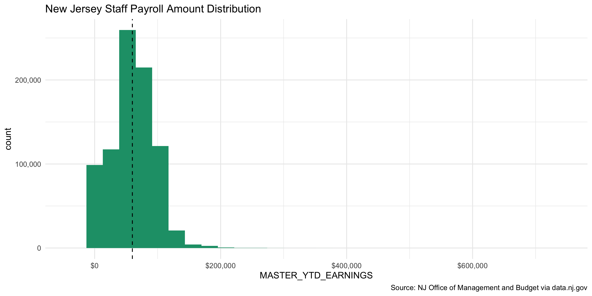

New Jersey Payroll Data Diary
================
Yanqi Xu
2020-04-07 18:28:33

  - [Project](#project)
  - [Objectives](#objectives)
  - [Packages](#packages)
  - [Registration](#registration)
  - [Wrangle](#wrangle)
  - [Conclude](#conclude)

<!-- Place comments regarding knitting here -->

## Project

The Accountability Project is an effort to cut across data silos and
give journalists, policy professionals, activists, and the public at
large a simple way to search across huge volumes of public data about
people and organizations.

Our goal is to standardizing public data on a few key fields by thinking
of each dataset row as a transaction. For each transaction there should
be (at least) 3 variables:

1.  All **parties** to a transaction
2.  The \*\*\*\* of the transaction
3.  The **amount** of money involved

## Objectives

This document describes the process used to complete the following
objectives:

1.  How many records are in the database?
2.  Check for duplicates
3.  Check ranges
4.  Is there anything blank or missing?
5.  Check for consistency issues
6.  Create a five-digit ZIP Code called `ZIP5`
7.  Create a `YEAR` field from the transaction
8.  Make sure there is data on both parties to a transaction

## Packages

The following packages are needed to collect, manipulate, visualize,
analyze, and communicate these results. The `pacman` package will
facilitate their installation and attachment.

The IRW’s `campfin` package will also have to be installed from GitHub.
This package contains functions custom made to help facilitate the
processing of campaign finance data.

``` r
if (!require("pacman")) install.packages("pacman")
pacman::p_load_gh("irworkshop/campfin")
pacman::p_load(
  pdftools, # wrangle PDFs
  readxl, # read excel files
  tidyverse, # data manipulation
  lubri, # datetime strings
  gluedown, # printing markdown
  magrittr, # pipe opperators
  janitor, # dataframe clean
  refinr, # cluster and merge
  scales, # format strings
  knitr, # knit documents
  vroom, # read files fast
  glue, # combine strings
  here, # relative storage
  fs # search storage 
)
```

This document should be run as part of the `R_campfin` project, which
lives as a sub-directory of the more general, language-agnostic
[`irworkshop/accountability_datacleaning`](https://github.com/irworkshop/accountability_datacleaning "TAP repo")
GitHub repository.

The `R_campfin` project uses the [RStudio
projects](https://support.rstudio.com/hc/en-us/articles/200526207-Using-Projects "Rproj")
feature and should be run as such. The project also uses the dynamic
`here::here()` tool for file paths relative to *your* machine.

``` r
# where does this document knit?
here::here()
#> [1] "/Users/yanqixu/code/accountability_datacleaning/R_campfin"
```

## Registration

Data is obtained from the [State of New Jersey’s data
portal](https://data.nj.gov/Government-Finance/YourMoney-Agency-Payroll/iqwc-r2w7).
According to the website, the data was created Created July 11, 2014 and
Last Updated on February 4, 2020. It comes from the NJ Office of Management
and Budget. Note that the office has not confirmed the validity of the
data.

> This dataset contains data for State employees paid through the
> Centralized Payroll System. The data reflects payroll payments made to
> the employee for the calendar year through the date indicated. There
> are two types of records: MASTER and DETAIL. There is at least one
> MASTER and one DETAIL record per employee. Multiple DETAIL records for
> an employee will appear in the file for a specific year if the
> employee is paid by more than one department/agency or by more than
> one section during that calendar year. The sums for all of the
> departments/agencies appear in the columns with prefix “MASTER”.
> Additional information is in the attached dataset summary PDF
> (available on the \[About\] tab under “Attachments”).

> This payroll data for public employees is updated quarterly and
> displayed by calendar year. It includes Executive Branch departments,
> the Legislature, the Judiciary and independent authorities. Employees
> on leave are also listed, though they may not have received State or
> authority pay during all or part of the year.

According to the website, there’re two additional query tools, [Agency
Payroll Explorer](https://data.nj.gov/payroll_explorer) and [Authority
Payroll Explorer](https://data.nj.gov/authority_explorer).

For Agency Payroll:

> This data is for employees paid by Departments and Agencies through
> the State’s Central Payroll System. All employees will have a master
> record and one or more detail records. The master record aggregates
> detail records that represent multiple payroll types and payments to
> the same employee by multiple agencies. It is updated quarterly.

For Authoritative Payroll: \> This data is for employees paid by
independent Authorities. There is one record per employee per authority.
If an employee has worked or works for two or more authorities in the
same calendar year, there will be two or more independent records for
that employee. It is updated quarterly.

``` r
# raw_dir stores the raw data file
raw_dir <- dir_create(here("nj", "payroll", "data", "raw"))
# data dir is a level up from raw_dir, I used it to store dictionary and temp files like fixed.txt
data_dir <- here("nj", "payroll", "data")
```

### Import

Besides the raw data, the portal also makes [column specifications
available for download in
PDF](https://data.nj.gov/api/views/iqwc-r2w7/files/zr33DGJd7cSZPfDBXdG_aW0npV_6Bl7w-3_HQxiDx1I?download=true&filename=AgencyPayrollDatasetSummary.pdf).

``` r
dict_url <- 'https://data.nj.gov/api/views/iqwc-r2w7/files/zr33DGJd7cSZPfDBXdG_aW0npV_6Bl7w-3_HQxiDx1I?download=true&filename=AgencyPayrollDatasetSummary.pdf'
# extract the name of the dictionary file
dict_fs <- str_extract(dict_url, "(?<=filename=).*")
# download dictionary file to data_dir
nj_dict <- download.file(dict_url, destfile = path(data_dir, dict_fs))
```

``` r
dict_pdf <- dir_ls(data_dir, glob = "*.pdf")

dict_lines <- pdf_text(dict_pdf) %>% read_lines()
# find the index of rows where "Column Name" show up
start_index <- which(str_detect(dict_lines, "Column Name"))
#21 45 93
# extra lines to get rid of, 4 lines at a time, plus the last line
to_elim <- c(start_index-3, start_index-2, start_index-1,start_index)
dict_lines <- dict_lines[-to_elim]
# get rid of all lines before the first valid line, here it's supposed to be start_index [1] + 1, but remember we removed 4 lines
dict_lines <- dict_lines[(start_index[1]-3):(length(dict_lines)-1)]
# Separate the lines into a dataframe of two columns
dict <- dict_lines %>% read_fwf(fwf_widths(c(29,100), 
                                           c("Column Name", "Column Description")
                                           ))
# This syntax works for all dataframes with rows spanning multiple columns, it's basically a group_by and summarize function with lambda 
dict <- dict %>% 
  fill(`Column Name`) %>% group_by(`Column Name`) %>% summarise_all(list(~ paste(., collapse = " ")))
```

| Column Name                       | Column Description                                                                                                                                                                                                                                                                                                                                                                                                          |
| :-------------------------------- | :-------------------------------------------------------------------------------------------------------------------------------------------------------------------------------------------------------------------------------------------------------------------------------------------------------------------------------------------------------------------------------------------------------------------------- |
| AS\_OF\_DATE                      | The last day of the quarter of data represented in this dataset.                                                                                                                                                                                                                                                                                                                                                            |
| CALENDAR\_QUARTER                 | Payroll data will be published quarterly. The single digit calendar quarter represents the end of the period that the data spans and not the actual quarter that the payment was made. For example, when calendar quarter is set to ‘2’, the data would include payments made from January through June for the given calendar year. Calendar year and calendar quarter together represent the end of the reporting period. |
| CALENDAR\_YEAR                    | Four digit year representing the twelve month period starting with January and ending with December. Indicates the calendar year in which payments were actually made to the employee. Calendar year and calendar quarter together represent the end of the reporting period.                                                                                                                                               |
| CASH\_IN\_LIEU\_OF\_MAINTENANCE   | Contractual biweekly payment for State Police Employee Relations Groups.                                                                                                                                                                                                                                                                                                                                                    |
| CLOTHING\_UNIFORM\_PAYMENTS       | Wages paid to eligible employees for clothing and uniform purchase and maintenance.                                                                                                                                                                                                                                                                                                                                         |
| COMPENSATION\_METHOD              | Identifies the basis by which an employee’s regular pay will be calculated. This is the compensation method associated with the employee at the end of the reporting period.                                                                                                                                                                                                                                                |
| EMPLOYEE\_RELATIONS\_GROUP        | Classification indicating whether employee is aligned or not aligned with a union and what type of work that unit performs. This grouping determines what salary and benefits the employee receives. This is the employee relations group associated with the employee at the end of the reporting period.                                                                                                                  |
| FIRST\_NAME                       | First name of the employee at the end of the reporting period. The literal ‘none’ has been used when there is no first name on record.                                                                                                                                                                                                                                                                                      |
| FULL\_NAME                        | Full name of the employee at the end of the reporting period.                                                                                                                                                                                                                                                                                                                                                               |
| LAST\_NAME                        | Last name of the employee at the end of the reporting period.                                                                                                                                                                                                                                                                                                                                                               |
| LEGISLATOR\_OR\_BACK\_PAY         | Wages paid to an employee as determined by the Merit System Board or other legal decision. Also used for Legislators and Legislative Aides pay.                                                                                                                                                                                                                                                                             |
| LUMP\_SUM\_PAY                    | Wages paid to an employee upon retirement for any unused sick leave accrued. The maximum payout is $15,000 per employee.                                                                                                                                                                                                                                                                                                    |
| MASTER\_DEPARTMENT\_AGENCY\_DESC  | Discrete organization within the State of New Jersey associated with the employee at the end of the reporting period.                                                                                                                                                                                                                                                                                                       |
| MASTER\_SECTION\_DESC             | The area of the department to which the employee is assigned at the end of the reporting period.                                                                                                                                                                                                                                                                                                                            |
| MASTER\_TITLE\_DESC               | The title is a descriptive name that identifies a position or group of positions with similar duties, responsibilities and qualifications. This is the title associated with the employee at the end of the reporting period.                                                                                                                                                                                               |
| MASTER\_YTD\_ALL\_OTHER\_PAYMENTS | The sum of wages for one or more departments/agencies that are earned by an employee not listed under regular pay or overtime payments during the reporting period.                                                                                                                                                                                                                                                         |
| MASTER\_YTD\_EARNINGS             | Sum of all payments for the employee during the reporting period; that is, the sum of the previous three columns.                                                                                                                                                                                                                                                                                                           |
| MASTER\_YTD\_OVERTIME\_PAYMENTS   | The sum of overtime wages for one or more departments/agencies by an employee during the reporting period.                                                                                                                                                                                                                                                                                                                  |
| MASTER\_YTD\_REGULAR\_PAY         | The sum of wages for one or more departments/agencies that are earned by an employee for working a predetermined number of hours or days in a week as dictated by the employee’s title during the reporting period.                                                                                                                                                                                                         |
| MIDDLE\_INITIAL                   | Middle initial of the employee at the end of the reporting period.                                                                                                                                                                                                                                                                                                                                                          |
| ONE\_TIME\_PAYMENTS               | Wages paid as bonus and one-time payments or shift differential for employees working night or evening shifts.                                                                                                                                                                                                                                                                                                              |
| OVERTIME\_PAYMENTS                | Overtime wages.                                                                                                                                                                                                                                                                                                                                                                                                             |
| PAID\_DEPARTMENT\_AGENCY\_DESC    | Discrete organization within the State of New Jersey that made payments to the employee.                                                                                                                                                                                                                                                                                                                                    |
| PAID\_SECTION\_DESC               | The area of the paid department that made payment to the employee.                                                                                                                                                                                                                                                                                                                                                          |
| PAYROLL\_ID                       | Randomly generated number that helps pair a master record with its detail record(s).                                                                                                                                                                                                                                                                                                                                        |
| RECORD\_TYPE                      | Identifies master or detail record for an employee.                                                                                                                                                                                                                                                                                                                                                                         |
| REGULAR\_PAY                      | Wages earned by an employee for working a predetermined number of hours or days in a week as dictated by the employee’s title.                                                                                                                                                                                                                                                                                              |
| RETROACTIVE\_PAY                  | Wages paid to an employee for a salary adjustment with a prior effective date.                                                                                                                                                                                                                                                                                                                                              |
| SALARY\_HOURLY\_RATE              | Depending on the value in the column Compensation Method, the value in this column is either the annual salary, hourly rate or a daily rate for the employee at the end of the reporting period. When the compensation method is ‘Part Time’ the salary listed has been adjusted to represent the part time percentage.                                                                                                     |
| SUPPLEMENTAL\_PAY                 | Wages paid to an employee that were not included in regular pay. In some existing state contracts, supplemental payments for overtime are required. Includes lump sum payments of unused vacation leave, compensatory time, and personal leave bank time.                                                                                                                                                                   |
| YTD\_EARNINGS                     | Sum of all payments for the employee by paid\_department\_agency\_desc and paid\_section\_desc during the reporting period.                                                                                                                                                                                                                                                                                                 |

We can set column specifications according to the record layout as such.

``` r
njp <- dir_ls(raw_dir) %>% read_csv()
njp <- njp %>% 
  # replace "null" records with NAs
   na_if("null") %>% 
  mutate(
    # the format of date and time in R can be found here https://statistics.berkeley.edu/computing/r-dates-times
    AS_OF_DATE = as.Date(AS_OF_DATE, format = "%b %d %Y"),
    # December 31 2019 is spelled out full month[space]date[space]four-digit year
    # ORIGINAL_EMPLOYMENT_DTE's format is different, e.g. 2/6/2006
    ORIGINAL_EMPLOYMENT_DTE = as.Date(ORIGINAL_EMPLOYMENT_DTE, format = "%m/%d/%Y")) %>% 
  mutate_at(.vars = vars(c(
    SALARY_HOURLY_RATE, 
    REGULAR_PAY,
    SUPPLEMENTAL_PAY,
    ONE_TIME_PAYMENTS,
    LEGISLATOR_OR_BACK_PAY,
    OVERTIME_PAYMENTS,
    CLOTHING_UNIFORM_PAYMENTS,
    RETROACTIVE_PAY,
    LUMP_SUM_PAY,
    YTD_EARNINGS,
    CASH_IN_LIEU_MAINTENANCE)),
    .funs = as.numeric
  )
```

### Explore

``` r
head(njp)
#> # A tibble: 6 x 32
#>   CALENDAR_YEAR CALENDAR_QUARTER AS_OF_DATE PAYROLL_ID LAST_NAME FIRST_NAME MIDDLE_INITIAL
#>           <dbl>            <dbl> <date>          <dbl> <chr>     <chr>      <chr>         
#> 1          2019                4 2019-12-31          1 REBER     FREDERICK  <NA>          
#> 2          2019                4 2019-12-31          1 REBER     FREDERICK  <NA>          
#> 3          2019                4 2019-12-31          2 PRICHETT  GEORGE     O             
#> 4          2019                4 2019-12-31          2 PRICHETT  GEORGE     O             
#> 5          2019                4 2019-12-31          5 MORGAN    DEBRA      B             
#> 6          2019                4 2019-12-31          5 MORGAN    DEBRA      B             
#> # … with 25 more variables: FULL_NAME <chr>, ORIGINAL_EMPLOYMENT_DTE <date>,
#> #   SALARY_HOURLY_RATE <dbl>, MASTER_DEPARTMENT_AGENCY_DESC <chr>, MASTER_SECTION_DESC <chr>,
#> #   MASTER_TITLE_DESC <chr>, EMPLOYEE_RELATIONS_GROUP <chr>, COMPENSATION_METHOD <chr>,
#> #   MASTER_YTD_REGULAR_PAY <dbl>, MASTER_YTD_OVERTIME_PAYMENTS <dbl>,
#> #   MASTER_YTD_ALL_OTHER_PAYMENTS <dbl>, MASTER_YTD_EARNINGS <dbl>,
#> #   PAID_DEPARTMENT_AGENCY_DESC <chr>, PAID_SECTION_DESC <chr>, REGULAR_PAY <dbl>,
#> #   SUPPLEMENTAL_PAY <dbl>, ONE_TIME_PAYMENTS <dbl>, LEGISLATOR_OR_BACK_PAY <dbl>,
#> #   OVERTIME_PAYMENTS <dbl>, CLOTHING_UNIFORM_PAYMENTS <dbl>, RETROACTIVE_PAY <dbl>,
#> #   LUMP_SUM_PAY <dbl>, CASH_IN_LIEU_MAINTENANCE <dbl>, YTD_EARNINGS <dbl>, RECORD_TYPE <chr>
tail(njp)
#> # A tibble: 6 x 32
#>   CALENDAR_YEAR CALENDAR_QUARTER AS_OF_DATE PAYROLL_ID LAST_NAME FIRST_NAME MIDDLE_INITIAL
#>           <dbl>            <dbl> <date>          <dbl> <chr>     <chr>      <chr>         
#> 1          2010                4 2010-12-31     108947 PEREZ     JESSICA    <NA>          
#> 2          2010                4 2010-12-31     108947 PEREZ     JESSICA    <NA>          
#> 3          2010                4 2010-12-31     108948 VOLAR     ELTON      S             
#> 4          2010                4 2010-12-31     108948 VOLAR     ELTON      S             
#> 5          2010                4 2010-12-31     108949 JEAN      PIERRE     <NA>          
#> 6          2010                4 2010-12-31     108949 JEAN      PIERRE     <NA>          
#> # … with 25 more variables: FULL_NAME <chr>, ORIGINAL_EMPLOYMENT_DTE <date>,
#> #   SALARY_HOURLY_RATE <dbl>, MASTER_DEPARTMENT_AGENCY_DESC <chr>, MASTER_SECTION_DESC <chr>,
#> #   MASTER_TITLE_DESC <chr>, EMPLOYEE_RELATIONS_GROUP <chr>, COMPENSATION_METHOD <chr>,
#> #   MASTER_YTD_REGULAR_PAY <dbl>, MASTER_YTD_OVERTIME_PAYMENTS <dbl>,
#> #   MASTER_YTD_ALL_OTHER_PAYMENTS <dbl>, MASTER_YTD_EARNINGS <dbl>,
#> #   PAID_DEPARTMENT_AGENCY_DESC <chr>, PAID_SECTION_DESC <chr>, REGULAR_PAY <dbl>,
#> #   SUPPLEMENTAL_PAY <dbl>, ONE_TIME_PAYMENTS <dbl>, LEGISLATOR_OR_BACK_PAY <dbl>,
#> #   OVERTIME_PAYMENTS <dbl>, CLOTHING_UNIFORM_PAYMENTS <dbl>, RETROACTIVE_PAY <dbl>,
#> #   LUMP_SUM_PAY <dbl>, CASH_IN_LIEU_MAINTENANCE <dbl>, YTD_EARNINGS <dbl>, RECORD_TYPE <chr>
glimpse(sample_frac(njp))
#> Rows: 1,736,048
#> Columns: 32
#> $ CALENDAR_YEAR                 <dbl> 2019, 2010, 2015, 2016, 2011, 2018, 2010, 2012, 2013, 2018…
#> $ CALENDAR_QUARTER              <dbl> 4, 4, 4, 4, 4, 4, 4, 4, 4, 4, 4, 4, 4, 4, 4, 4, 4, 4, 4, 4…
#> $ AS_OF_DATE                    <date> 2019-12-31, 2010-12-31, 2015-12-31, 2016-12-31, 2011-12-3…
#> $ PAYROLL_ID                    <dbl> 125752, 23205, 30033, 68692, 67813, 3733, 58932, 124015, 2…
#> $ LAST_NAME                     <chr> "COX", "CARTER-WILLIAMS", "CHANEY", "MINIERI", "LIAO", "CO…
#> $ FIRST_NAME                    <chr> "MELISSA", "R", "ARLEATHA", "ANGELA", "KENNETH", "AMANDA",…
#> $ MIDDLE_INITIAL                <chr> NA, "M", NA, "J", "H", "I", NA, "A", NA, "M", "A", "S", NA…
#> $ FULL_NAME                     <chr> "COX, MELISSA", "CARTER-WILLIAMS, R M", "CHANEY, ARLEATHA"…
#> $ ORIGINAL_EMPLOYMENT_DTE       <date> NA, NA, NA, NA, NA, NA, NA, NA, NA, NA, NA, NA, NA, NA, N…
#> $ SALARY_HOURLY_RATE            <dbl> NA, NA, NA, 62831.11, 71380.30, 46351.93, NA, 52458.55, 95…
#> $ MASTER_DEPARTMENT_AGENCY_DESC <chr> "ENVIRONMENTAL PROTECTION", "HUMAN SERVICES", "MILITARY AN…
#> $ MASTER_SECTION_DESC           <chr> "PARKS & FORESTRY - FORESTRY FIRELINE", "CENTRAL OFFICE", …
#> $ MASTER_TITLE_DESC             <chr> "Not Reported", "SECRETARIAL ASSISTANT 1", "SENIOR FOOD SE…
#> $ EMPLOYEE_RELATIONS_GROUP      <chr> "N/A", "ADMINISTRATIVE AND CLERICAL SERVICES (CWA) - UNIT …
#> $ COMPENSATION_METHOD           <chr> "None Listed", "ANNUAL SALARY", "ANNUAL SALARY", "ANNUAL S…
#> $ MASTER_YTD_REGULAR_PAY        <dbl> NA, NA, NA, 63016.46, 68133.41, 29647.49, NA, 6052.92, 956…
#> $ MASTER_YTD_OVERTIME_PAYMENTS  <dbl> NA, NA, NA, 0.00, 0.00, 534.88, NA, 0.00, 0.00, NA, NA, 45…
#> $ MASTER_YTD_ALL_OTHER_PAYMENTS <dbl> NA, NA, NA, 0.00, 2881.00, 0.00, NA, 0.00, 0.00, NA, NA, 5…
#> $ MASTER_YTD_EARNINGS           <dbl> NA, NA, NA, 63016.46, 71014.41, 30182.37, NA, 6052.92, 956…
#> $ PAID_DEPARTMENT_AGENCY_DESC   <chr> "ENVIRONMENTAL PROTECTION", "HUMAN SERVICES", "MILITARY AN…
#> $ PAID_SECTION_DESC             <chr> "PARKS & FORESTRY - FORESTRY FIRELINE", "CENTRAL OFFICE", …
#> $ REGULAR_PAY                   <dbl> 0.00, 62842.81, 35481.58, NA, NA, NA, 21733.38, NA, NA, 49…
#> $ SUPPLEMENTAL_PAY              <dbl> 110.00, 0.00, 0.00, NA, NA, NA, 231.38, NA, NA, 0.00, 0.00…
#> $ ONE_TIME_PAYMENTS             <dbl> 0.00, 0.00, 464.21, NA, NA, NA, 704.73, NA, NA, 0.00, 0.00…
#> $ LEGISLATOR_OR_BACK_PAY        <dbl> 0, 0, 0, NA, NA, NA, 0, NA, NA, 0, 0, NA, 0, NA, NA, NA, N…
#> $ OVERTIME_PAYMENTS             <dbl> 0.00, 0.00, 2612.41, NA, NA, NA, 1476.64, NA, NA, 0.00, 39…
#> $ CLOTHING_UNIFORM_PAYMENTS     <dbl> 0, 0, 0, NA, NA, NA, 560, NA, NA, 0, 700, NA, 0, NA, NA, N…
#> $ RETROACTIVE_PAY               <dbl> 0, 0, 0, NA, NA, NA, 0, NA, NA, 0, 0, NA, 0, NA, NA, NA, N…
#> $ LUMP_SUM_PAY                  <dbl> 0, 0, 0, NA, NA, NA, 0, NA, NA, 0, 0, NA, 0, NA, NA, NA, N…
#> $ CASH_IN_LIEU_MAINTENANCE      <dbl> 0, 0, 0, NA, NA, NA, 0, NA, NA, 0, 0, NA, 0, NA, NA, NA, N…
#> $ YTD_EARNINGS                  <dbl> 110.00, 62842.81, 38558.20, NA, NA, NA, 24706.13, NA, NA, …
#> $ RECORD_TYPE                   <chr> "DETAIL", "DETAIL", "DETAIL", "MASTER", "MASTER", "MASTER"…
```

Then we can take a look at the *NA* fields and number of distinct values
for each column.

``` r
col_stats(njp, count_na)
#> # A tibble: 32 x 4
#>    col                           class        n         p
#>    <chr>                         <chr>    <int>     <dbl>
#>  1 CALENDAR_YEAR                 <dbl>        0 0        
#>  2 CALENDAR_QUARTER              <dbl>        0 0        
#>  3 AS_OF_DATE                    <date>       0 0        
#>  4 PAYROLL_ID                    <dbl>        0 0        
#>  5 LAST_NAME                     <chr>        0 0        
#>  6 FIRST_NAME                    <chr>       26 0.0000150
#>  7 MIDDLE_INITIAL                <chr>   639967 0.369    
#>  8 FULL_NAME                     <chr>        0 0        
#>  9 ORIGINAL_EMPLOYMENT_DTE       <date> 1665087 0.959    
#> 10 SALARY_HOURLY_RATE            <dbl>   895561 0.516    
#> 11 MASTER_DEPARTMENT_AGENCY_DESC <chr>    51441 0.0296   
#> 12 MASTER_SECTION_DESC           <chr>        0 0        
#> 13 MASTER_TITLE_DESC             <chr>        0 0        
#> 14 EMPLOYEE_RELATIONS_GROUP      <chr>    17929 0.0103   
#> 15 COMPENSATION_METHOD           <chr>        0 0        
#> 16 MASTER_YTD_REGULAR_PAY        <dbl>   895561 0.516    
#> 17 MASTER_YTD_OVERTIME_PAYMENTS  <dbl>   895561 0.516    
#> 18 MASTER_YTD_ALL_OTHER_PAYMENTS <dbl>   895561 0.516    
#> 19 MASTER_YTD_EARNINGS           <dbl>   895561 0.516    
#> 20 PAID_DEPARTMENT_AGENCY_DESC   <chr>   863198 0.497    
#> 21 PAID_SECTION_DESC             <chr>   863889 0.498    
#> 22 REGULAR_PAY                   <dbl>   840487 0.484    
#> 23 SUPPLEMENTAL_PAY              <dbl>   840487 0.484    
#> 24 ONE_TIME_PAYMENTS             <dbl>   840487 0.484    
#> 25 LEGISLATOR_OR_BACK_PAY        <dbl>   840487 0.484    
#> 26 OVERTIME_PAYMENTS             <dbl>   840487 0.484    
#> 27 CLOTHING_UNIFORM_PAYMENTS     <dbl>   840487 0.484    
#> 28 RETROACTIVE_PAY               <dbl>   840487 0.484    
#> 29 LUMP_SUM_PAY                  <dbl>   840487 0.484    
#> 30 CASH_IN_LIEU_MAINTENANCE      <dbl>   840487 0.484    
#> 31 YTD_EARNINGS                  <dbl>   840487 0.484    
#> 32 RECORD_TYPE                   <chr>        0 0
col_stats(njp, n_distinct) 
#> # A tibble: 32 x 4
#>    col                           class       n           p
#>    <chr>                         <chr>   <int>       <dbl>
#>  1 CALENDAR_YEAR                 <dbl>      10 0.00000576 
#>  2 CALENDAR_QUARTER              <dbl>       1 0.000000576
#>  3 AS_OF_DATE                    <date>     10 0.00000576 
#>  4 PAYROLL_ID                    <dbl>  147987 0.0852     
#>  5 LAST_NAME                     <chr>   51131 0.0295     
#>  6 FIRST_NAME                    <chr>   20789 0.0120     
#>  7 MIDDLE_INITIAL                <chr>      30 0.0000173  
#>  8 FULL_NAME                     <chr>  153245 0.0883     
#>  9 ORIGINAL_EMPLOYMENT_DTE       <date>   5539 0.00319    
#> 10 SALARY_HOURLY_RATE            <dbl>   39702 0.0229     
#> 11 MASTER_DEPARTMENT_AGENCY_DESC <chr>      42 0.0000242  
#> 12 MASTER_SECTION_DESC           <chr>     262 0.000151   
#> 13 MASTER_TITLE_DESC             <chr>    3081 0.00177    
#> 14 EMPLOYEE_RELATIONS_GROUP      <chr>      40 0.0000230  
#> 15 COMPENSATION_METHOD           <chr>       5 0.00000288 
#> 16 MASTER_YTD_REGULAR_PAY        <dbl>  367259 0.212      
#> 17 MASTER_YTD_OVERTIME_PAYMENTS  <dbl>  249947 0.144      
#> 18 MASTER_YTD_ALL_OTHER_PAYMENTS <dbl>  159786 0.0920     
#> 19 MASTER_YTD_EARNINGS           <dbl>  547333 0.315      
#> 20 PAID_DEPARTMENT_AGENCY_DESC   <chr>      42 0.0000242  
#> 21 PAID_SECTION_DESC             <chr>     264 0.000152   
#> 22 REGULAR_PAY                   <dbl>  387889 0.223      
#> 23 SUPPLEMENTAL_PAY              <dbl>   76640 0.0441     
#> 24 ONE_TIME_PAYMENTS             <dbl>   46530 0.0268     
#> 25 LEGISLATOR_OR_BACK_PAY        <dbl>    4672 0.00269    
#> 26 OVERTIME_PAYMENTS             <dbl>  255371 0.147      
#> 27 CLOTHING_UNIFORM_PAYMENTS     <dbl>     213 0.000123   
#> 28 RETROACTIVE_PAY               <dbl>   43841 0.0253     
#> 29 LUMP_SUM_PAY                  <dbl>   10159 0.00585    
#> 30 CASH_IN_LIEU_MAINTENANCE      <dbl>     781 0.000450   
#> 31 YTD_EARNINGS                  <dbl>  575630 0.332      
#> 32 RECORD_TYPE                   <chr>       2 0.00000115
```

#### Categorical

<!-- -->

#### Continuous

We’ll only include the `MASTER_YTD_EARNINGS` as the total continuous
variable, because this column is the most comprehensive and represents
the true gross earnings.

``` r
njp %>% 
  ggplot(aes(MASTER_YTD_EARNINGS)) + 
  geom_histogram(na.rm = TRUE, fill = RColorBrewer::brewer.pal(3, "Dark2")[1]) +
  geom_vline(xintercept =  median(njp$MASTER_YTD_EARNINGS[njp$MASTER_YTD_EARNINGS != 0], na.rm = TRUE), linetype = 2) +
  theme_minimal() +
  scale_y_continuous(labels = comma) +
  scale_x_continuous(labels = dollar) +
    labs(
    title = "New Jersey Staff Payroll Amount Distribution",
    y = "count",
    caption = "Source: NJ Office of Management and Budget via data.nj.gov"
  )
```

<!-- -->

## Wrangle

### State

We can add the state column.

``` r
njp <- njp %>% 
  mutate(state = "NJ")
```

## Conclude

``` r
glimpse(sample_n(njp, 20))
#> Rows: 20
#> Columns: 33
#> $ CALENDAR_YEAR                 <dbl> 2016, 2019, 2015, 2015, 2017, 2011, 2019, 2018, 2014, 2015…
#> $ CALENDAR_QUARTER              <dbl> 4, 4, 4, 4, 4, 4, 4, 4, 4, 4, 4, 4, 4, 4, 4, 4, 4, 4, 4, 4
#> $ AS_OF_DATE                    <date> 2016-12-31, 2019-12-31, 2015-12-31, 2015-12-31, 2017-12-3…
#> $ PAYROLL_ID                    <dbl> 126351, 16637, 83198, 6693, 61451, 48639, 160169, 142598, …
#> $ LAST_NAME                     <chr> "STRELETZ", "COTTON", "ONORATI", "GBOGI", "HUTCHINSON", "M…
#> $ FIRST_NAME                    <chr> "STEPHANIE", "DENISE", "DENISE", "JULIE", "KELLY", "EVADNE…
#> $ MIDDLE_INITIAL                <chr> "A", NA, NA, NA, NA, "P", "C", "R", "A", "D", NA, "A", "W"…
#> $ FULL_NAME                     <chr> "STRELETZ, STEPHANIE A", "COTTON, DENISE", "ONORATI, DENIS…
#> $ ORIGINAL_EMPLOYMENT_DTE       <date> NA, 1993-02-16, NA, NA, NA, NA, 2018-11-19, NA, NA, NA, N…
#> $ SALARY_HOURLY_RATE            <dbl> NA, 88933.02, 76393.06, NA, 73993.68, 39043.44, 40000.00, …
#> $ MASTER_DEPARTMENT_AGENCY_DESC <chr> "HUMAN SERVICES", "TREASURY", "HUMAN SERVICES", "HUMAN SER…
#> $ MASTER_SECTION_DESC           <chr> "CENTRAL OFFICE", "DIVISION OF TAXATION", "DIVISION OF AGI…
#> $ MASTER_TITLE_DESC             <chr> "QUALITY ASSURANCE SPECIALIST, HEALTH SERVICES", "TAXPAYER…
#> $ EMPLOYEE_RELATIONS_GROUP      <chr> "PROFESSIONAL UNIT (CWA) - UNIT P", "PRIMARY LEVEL SUPERVI…
#> $ COMPENSATION_METHOD           <chr> "ANNUAL SALARY", "ANNUAL SALARY", "ANNUAL SALARY", "ANNUAL…
#> $ MASTER_YTD_REGULAR_PAY        <dbl> NA, 87189.18, 78882.17, NA, 71758.71, 31196.72, 38201.18, …
#> $ MASTER_YTD_OVERTIME_PAYMENTS  <dbl> NA, 0.00, 0.00, NA, 0.00, 5379.82, 2355.36, NA, NA, NA, NA…
#> $ MASTER_YTD_ALL_OTHER_PAYMENTS <dbl> NA, 0.00, 0.00, NA, 284.59, 409.05, 0.00, NA, NA, NA, NA, …
#> $ MASTER_YTD_EARNINGS           <dbl> NA, 87189.18, 78882.17, NA, 72043.30, 36985.59, 40556.54, …
#> $ PAID_DEPARTMENT_AGENCY_DESC   <chr> "HUMAN SERVICES", NA, NA, "HUMAN SERVICES", NA, NA, NA, "E…
#> $ PAID_SECTION_DESC             <chr> "CENTRAL OFFICE", NA, NA, "GREYSTONE PARK PSYCHIATRIC HOSP…
#> $ REGULAR_PAY                   <dbl> 64306.32, NA, NA, 78619.75, NA, NA, NA, 49020.94, 52246.47…
#> $ SUPPLEMENTAL_PAY              <dbl> 0.00, NA, NA, 0.00, NA, NA, NA, 0.00, 0.00, 0.00, 0.00, NA…
#> $ ONE_TIME_PAYMENTS             <dbl> 0.00, NA, NA, 561.77, NA, NA, NA, 0.00, 579.63, 0.00, 450.…
#> $ LEGISLATOR_OR_BACK_PAY        <dbl> 0, NA, NA, 0, NA, NA, NA, 0, 0, 0, 0, NA, NA, NA, NA, 0, 0…
#> $ OVERTIME_PAYMENTS             <dbl> 0.00, NA, NA, 8210.94, NA, NA, NA, 0.00, 11606.84, 1382.72…
#> $ CLOTHING_UNIFORM_PAYMENTS     <dbl> 0, NA, NA, 0, NA, NA, NA, 1100, 550, 0, 0, NA, NA, NA, NA,…
#> $ RETROACTIVE_PAY               <dbl> 0.0, NA, NA, 0.0, NA, NA, NA, 1255.6, 0.0, 0.0, 0.0, NA, N…
#> $ LUMP_SUM_PAY                  <dbl> 0, NA, NA, 0, NA, NA, NA, 0, 0, 0, 0, NA, NA, NA, NA, 0, 0…
#> $ CASH_IN_LIEU_MAINTENANCE      <dbl> 0, NA, NA, 0, NA, NA, NA, 0, 0, 0, 0, NA, NA, NA, NA, 0, 0…
#> $ YTD_EARNINGS                  <dbl> 64306.32, NA, NA, 87392.46, NA, NA, NA, 51376.54, 64982.94…
#> $ RECORD_TYPE                   <chr> "DETAIL", "MASTER", "MASTER", "DETAIL", "MASTER", "MASTER"…
#> $ state                         <chr> "NJ", "NJ", "NJ", "NJ", "NJ", "NJ", "NJ", "NJ", "NJ", "NJ"…
```

1.  There are 1736048 records in the database.
2.  There are 0 duplicate records in the database.
3.  The range and distribution of `year` seems mostly reasonable except
    for a few entries.
4.  There are 0 records missing either recipient or .
5.  Consistency in goegraphic data has been improved with
    `campfin::normal_*()`.

We can plot the distribution of total compensations by different
departments.

### Export

``` r
proc_dir <- dir_create(here("nj", "payroll", "data", "processed"))
```

``` r
write_csv(
  x = njp,
  path = path(proc_dir, "nj_salaries_clean.csv"),
  na = ""
)
```
