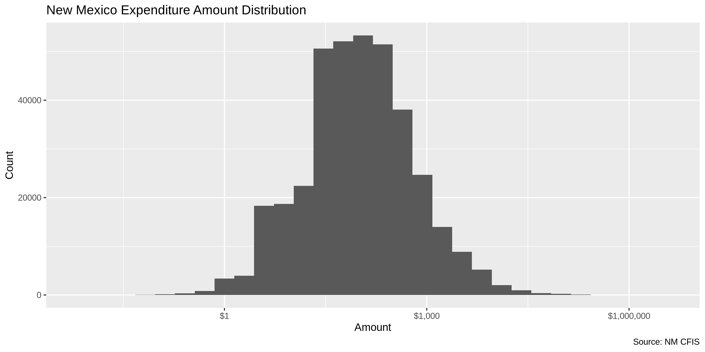
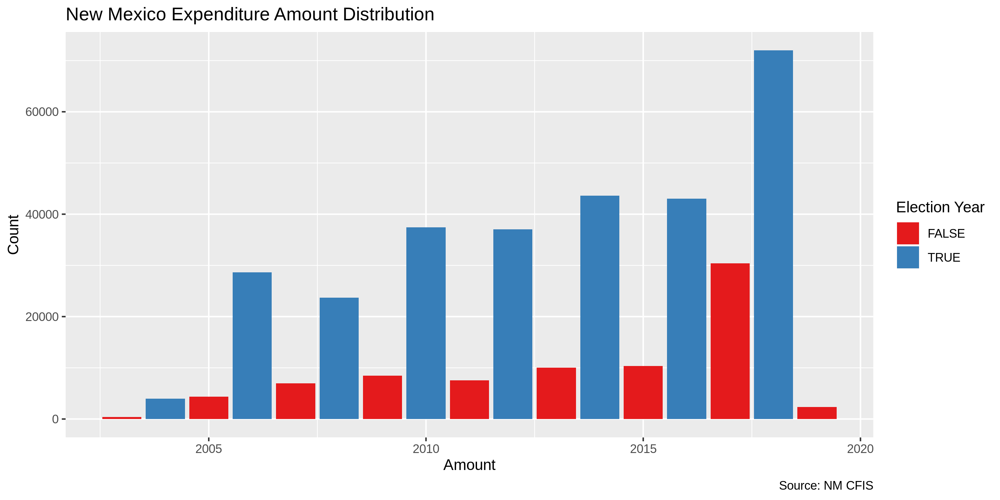

New Mexico Expenditures
================
Kiernan Nicholls
2019-07-30 17:19:26

  - [Project](#project)
  - [Objectives](#objectives)
  - [Packages](#packages)
  - [Data](#data)
  - [Read](#read)
  - [Explore](#explore)

## Project

The Accountability Project is an effort to cut across data silos and
give journalists, policy professionals, activists, and the public at
large a simple way to search across huge volumes of public data about
people and organizations.

Our goal is to standardizing public data on a few key fields by thinking
of each dataset row as a transaction. For each transaction there should
be (at least) 3 variables:

1.  All **parties** to a transaction
2.  The **date** of the transaction
3.  The **amount** of money involved

## Objectives

This document describes the process used to complete the following
objectives:

1.  How many records are in the database?
2.  Check for duplicates
3.  Check ranges
4.  Is there anything blank or missing?
5.  Check for consistency issues
6.  Create a five-digit ZIP Code called `ZIP5`
7.  Create a `YEAR` field from the transaction date
8.  Make sure there is data on both parties to a transaction

## Packages

The following packages are needed to collect, manipulate, visualize,
analyze, and communicate these results. The `pacman` package will
facilitate their installation and attachment.

``` r
if (!require("pacman")) install.packages("pacman")
pacman::p_load(
  stringdist, # levenshtein value
  RSelenium, # remote browser
  tidyverse, # data manipulation
  lubridate, # datetime strings
  magrittr, # pipe opperators
  janitor, # dataframe clean
  scales, # format strings
  knitr, # knit documents
  vroom, # read files fast
  glue, # combine strings
  here, # relative storage
  fs # search storage 
)
```

The IRW’s `campfin` package will also have to be installed from GitHub.
This package contains functions custom made to help facilitate the
processing of campaign finance data.

``` r
pacman::p_load_current_gh("kiernann/campfin")
```

This document should be run as part of the `R_campfin` project, which
lives as a sub-directory of the more general, language-agnostic
[`irworkshop/accountability_datacleaning`](https://github.com/irworkshop/accountability_datacleaning "TAP repo")
GitHub repository.

The `R_campfin` project uses the [RStudio
projects](https://support.rstudio.com/hc/en-us/articles/200526207-Using-Projects "Rproj")
feature and should be run as such. The project also uses the dynamic
`here::here()` tool for file paths relative to *your* machine.

``` r
# where dfs this document knit?
here::here()
#> [1] "/home/ubuntu/R/accountability_datacleaning/R_campfin"
```

## Data

Data is obtained from the [New Mexico Campaign Finance Information
System (CFIS)](https://www.cfis.state.nm.us/).

From the [CFIS Data Download
page](https://www.cfis.state.nm.us/media/CFIS_Data_Download.aspx), we
can retrieve bulk data.

> The files available will be downloaded in a CSV file format. To
> download a file, select the type of CFIS data and corresponding
> filters and click Download Data. The file will be downloaded and
> should appear in the lower left corner of your browser window. If you
> do not see the file, please check your browser’s pop-up blocker
> settings.

The transaction files are not separated by contribution or expenditure.

> Download a listing of all contributions and expenditures for one or
> all filing periods for candidates, PACs, and Lobbyists. The CFIS data
> available for download is updated daily at 12:00AM and 12:00PM MST.

### Download

The form on the data download page must be manually filled out to
download a file. We can automate this process with the RSelenium
package.

``` r
raw_dir <- here("nm", "data", "raw")
dir_create(raw_dir)
```

``` r
# open the driver with auto download options
remote_driver <- rsDriver(
  port = 4444L,
  browser = "firefox",
  extraCapabilities = makeFirefoxProfile(
    list(
      browser.download.dir = raw_dir,
      browser.download.folderList = 2L,
      browser.helperApps.neverAsk.saveToDisk = "text/csv"
    )
  )
)

# navigate to the FL DOE download site
remote_browser <- remote_driver$client
remote_browser$navigate("https://www.cfis.state.nm.us/media/CFIS_Data_Download.aspx")

# chose "All" from elections list
type_menu <- "/html/body/form/div[3]/div[2]/div[2]/select/option[3]"
remote_browser$findElement("xpath", type_menu)$clickElement()

# find download button
download_button <- '//*[@id="ctl00_ContentPlaceHolder1_header1_Button1"]'

# download candidate trans
cand_menu <- "/html/body/form/div[3]/div[2]/div[2]/div[2]/table/tbody/tr/td[2]/select/option[2]"
remote_browser$findElement("xpath", cand_menu)$clickElement()
remote_browser$findElement("xpath", download_button)$clickElement()

# download committee trans
comm_menu <- "/html/body/form/div[3]/div[2]/div[2]/div[2]/table/tbody/tr/td[2]/select/option[3]"
remote_browser$findElement("xpath", comm_menu)$clickElement()
remote_browser$findElement("xpath", download_button)$clickElement()

# close the browser and driver
remote_browser$close()
remote_driver$server$stop()
```

## Read

We can read in both the files for Candidates and Committee transactions
separated.

``` r
nm_cands <- vroom(
  file = glue("{raw_dir}/CandidateTransactions.csv"),
  .name_repair = make_clean_names,
  col_types = cols(
    .default = col_character(),
    IsContribution = col_logical(),
    IsAnonymous = col_logical(),
    Amount = col_double(),
    `Date Contribution` = col_datetime(),
    `Date Added` = col_datetime()
  )
) %>% rename(
  cand_first = first_name,
  cand_last = last_name
)
```

``` r
nm_comms <- vroom(
  file = glue("{raw_dir}/PACTransactions.csv"),
  .name_repair = make_clean_names,
  col_types = cols(
    .default = col_character(),
    IsContribution = col_logical(),
    IsAnonymous = col_logical(),
    Amount = col_double(),
    `Date Contribution` = col_datetime(),
    `Date Added` = col_datetime()
  )
)
```

The data frames can then be joined together and contributions can be
removed.

``` r
nm <- 
  bind_rows(
    nm_cands,
    nm_comms
  ) %>% 
  filter(!is_contribution) %>% 
  mutate_if(is_character, str_to_upper) %>% 
  rename(type = description)

names(nm) <- str_remove(names(nm), "contrib_expenditure_")
```

## Explore

``` r
head(nm)
```

    #> # A tibble: 6 x 22
    #>   cand_first cand_last type  is_contribution is_anonymous amount date_contribution   memo 
    #>   <chr>      <chr>     <chr> <lgl>           <lgl>         <dbl> <dttm>              <chr>
    #> 1 BILLIE     HELEAN    MONE… FALSE           FALSE           1.5 2019-03-29 00:00:00 <NA> 
    #> 2 BILLIE     HELEAN    MONE… FALSE           FALSE          15   2019-03-21 00:00:00 <NA> 
    #> 3 BILLIE     HELEAN    MONE… FALSE           FALSE         100   2019-03-14 00:00:00 <NA> 
    #> 4 BILLIE     HELEAN    MONE… FALSE           FALSE          21.3 2019-03-08 00:00:00 <NA> 
    #> 5 BILLIE     HELEAN    MONE… FALSE           FALSE          15   2019-02-21 00:00:00 <NA> 
    #> 6 BILLIE     HELEAN    MONE… FALSE           FALSE         100   2019-02-16 00:00:00 <NA> 
    #> # … with 14 more variables: description <chr>, first_name <chr>, middle_name <chr>,
    #> #   last_name <chr>, suffix <chr>, company_name <chr>, address <chr>, city <chr>, state <chr>,
    #> #   zip <chr>, occupation <chr>, filing_period <chr>, date_added <dttm>, pac_name <chr>

``` r
tail(nm)
```

    #> # A tibble: 6 x 22
    #>   cand_first cand_last type  is_contribution is_anonymous amount date_contribution   memo 
    #>   <chr>      <chr>     <chr> <lgl>           <lgl>         <dbl> <dttm>              <chr>
    #> 1 <NA>       <NA>      MONE… FALSE           FALSE         2743  2009-06-08 00:00:00 <NA> 
    #> 2 <NA>       <NA>      MONE… FALSE           FALSE          702. 2009-06-15 00:00:00 <NA> 
    #> 3 <NA>       <NA>      MONE… FALSE           FALSE          200  2009-06-24 00:00:00 <NA> 
    #> 4 <NA>       <NA>      MONE… FALSE           FALSE          267. 2009-08-01 00:00:00 <NA> 
    #> 5 <NA>       <NA>      MONE… FALSE           FALSE         2000  2009-08-17 00:00:00 <NA> 
    #> 6 <NA>       <NA>      MONE… FALSE           FALSE         2000  2009-09-23 00:00:00 <NA> 
    #> # … with 14 more variables: description <chr>, first_name <chr>, middle_name <chr>,
    #> #   last_name <chr>, suffix <chr>, company_name <chr>, address <chr>, city <chr>, state <chr>,
    #> #   zip <chr>, occupation <chr>, filing_period <chr>, date_added <dttm>, pac_name <chr>

``` r
glimpse(sample_frac(nm))
```

    #> Observations: 370,295
    #> Variables: 22
    #> $ cand_first        <chr> NA, NA, "DOMINGO", NA, "JEFF", NA, "CLAYTON", "VALERIE", "FRANCIS", "D…
    #> $ cand_last         <chr> NA, NA, "MARTINEZ", NA, "APODACA", NA, "KIESLING", "ESPINOZA", "HIGGIN…
    #> $ type              <chr> "MONETARY EXPENDITURE", "MONETARY EXPENDITURE", "MONETARY EXPENDITURE"…
    #> $ is_contribution   <lgl> FALSE, FALSE, FALSE, FALSE, FALSE, FALSE, FALSE, FALSE, FALSE, FALSE, …
    #> $ is_anonymous      <lgl> FALSE, FALSE, FALSE, FALSE, FALSE, FALSE, FALSE, FALSE, FALSE, FALSE, …
    #> $ amount            <dbl> 10.00, 25.00, 2932.60, 5.00, 71.78, 1846.77, 225.00, 45.00, 145.55, 10…
    #> $ date_contribution <dttm> 2017-03-05, 2018-11-04, 2005-09-06, 2017-10-25, 2018-05-16, 2009-04-1…
    #> $ memo              <chr> NA, NA, NA, NA, NA, NA, NA, NA, NA, "MARIAELENA JOHNSON RUNNING FOR", …
    #> $ description       <chr> "EARMARK: HILDA HUNTER", "EARMARK: MARK MCDONALD", NA, "EARMARK: CHRIS…
    #> $ first_name        <chr> NA, NA, NA, NA, NA, "DEBORAH", NA, NA, NA, "MARIAELENA", "MARCI", NA, …
    #> $ middle_name       <chr> NA, NA, NA, NA, NA, "R.", NA, NA, NA, NA, NA, NA, NA, NA, NA, "J", NA,…
    #> $ last_name         <chr> NA, NA, NA, NA, NA, "LUNDY", NA, NA, NA, "JOHNSON", "BLAZE", NA, NA, N…
    #> $ suffix            <chr> NA, NA, "NULL", NA, NA, "NULL", NA, NA, "NULL", NA, NA, NA, "NULL", NA…
    #> $ company_name      <chr> "NEW MEXICANS FOR MICHELLE", "CAMPAIGN TO ELECT BILLIE HELEAN", "PAPER…
    #> $ address           <chr> "611 PENNSYLVANIA AVENUE SE SUITE 143", "2003 SOUTHERN BLVD SE SUITE 1…
    #> $ city              <chr> "WASHINGTON", "RIO RANCHO", "SANTA FE", "WASHINGTON", "ALBUQUERQUE", "…
    #> $ state             <chr> "DC", "NM", "NM", "DC", "NM", "NM", "NM", "NM", "NM", "NM", "NM", "NM"…
    #> $ zip               <chr> "20003", "87124", "87505", "20003", "87109", "87113", "87113", "87501"…
    #> $ occupation        <chr> "POLITICAL COMMITTEE", "POLITICAL COMMITTEE", "NULL", "POLITICAL COMMI…
    #> $ filing_period     <chr> "2017 FIRST BIANNUAL", "2018 FOURTH GENERAL", "FIRST PRIMARY", "2018 F…
    #> $ date_added        <dttm> 2017-04-17 14:43:01, 2018-12-06 08:18:11, 2010-01-01 00:00:00, 2018-0…
    #> $ pac_name          <chr> "ACTBLUE NEW MEXICO", "ACTBLUE NEW MEXICO", NA, "ACTBLUE NEW MEXICO", …

### Missing

There are zero records without both a payer (either `cand_last` or
`pac_name`), a date, *and* an amount.

``` r
glimpse_fun(nm, count_na)
```

    #> # A tibble: 22 x 4
    #>    var               type       n        p
    #>    <chr>             <chr>  <int>    <dbl>
    #>  1 cand_first        chr   161062 0.435   
    #>  2 cand_last         chr   161062 0.435   
    #>  3 type              chr        0 0       
    #>  4 is_contribution   lgl        0 0       
    #>  5 is_anonymous      lgl        0 0       
    #>  6 amount            dbl        0 0       
    #>  7 date_contribution dttm       0 0       
    #>  8 memo              chr   348378 0.941   
    #>  9 description       chr    72532 0.196   
    #> 10 first_name        chr   313455 0.847   
    #> 11 middle_name       chr   361870 0.977   
    #> 12 last_name         chr   313493 0.847   
    #> 13 suffix            chr   296264 0.800   
    #> 14 company_name      chr    54210 0.146   
    #> 15 address           chr       80 0.000216
    #> 16 city              chr      128 0.000346
    #> 17 state             chr      158 0.000427
    #> 18 zip               chr       70 0.000189
    #> 19 occupation        chr   161948 0.437   
    #> 20 filing_period     chr     3849 0.0104  
    #> 21 date_added        dttm       0 0       
    #> 22 pac_name          chr   209233 0.565

### Duplicates

A huge number of records in this database are complete duplicates. We
can find them using `janitor::get_dupes()`.

``` r
nm_dupes <- distinct(get_dupes(nm))
```

We will have to flag them in the original database with `dupe_flag`.

``` r
nm <- nm %>% 
  left_join(nm_dupes) %>% 
  mutate(dupe_flag = !is.na(dupe_count))

sum(nm$dupe_flag)
```

    #> [1] 15928

``` r
percent(mean(nm$dupe_flag))
```

    #> [1] "4.30%"

### Categorical

For categorical variables, we should explore the distribution of
distinct/frequent values.

``` r
glimpse_fun(nm, n_distinct)
```

    #> # A tibble: 24 x 4
    #>    var               type       n          p
    #>    <chr>             <chr>  <int>      <dbl>
    #>  1 cand_first        chr     1148 0.00310   
    #>  2 cand_last         chr     1642 0.00443   
    #>  3 type              chr        1 0.00000270
    #>  4 is_contribution   lgl        1 0.00000270
    #>  5 is_anonymous      lgl        1 0.00000270
    #>  6 amount            dbl    59735 0.161     
    #>  7 date_contribution dttm    5719 0.0154    
    #>  8 memo              chr    13602 0.0367    
    #>  9 description       chr    72026 0.195     
    #> 10 first_name        chr     4110 0.0111    
    #> 11 middle_name       chr      374 0.00101   
    #> 12 last_name         chr     6287 0.0170    
    #> 13 suffix            chr       35 0.0000945 
    #> 14 company_name      chr    45550 0.123     
    #> 15 address           chr    69529 0.188     
    #> 16 city              chr     3403 0.00919   
    #> 17 state             chr      203 0.000548  
    #> 18 zip               chr     6337 0.0171    
    #> 19 occupation        chr     6028 0.0163    
    #> 20 filing_period     chr       89 0.000240  
    #> 21 date_added        dttm  167880 0.453     
    #> 22 pac_name          chr      526 0.00142   
    #> 23 dupe_count        int       42 0.000113  
    #> 24 dupe_flag         lgl        2 0.00000540

From this, we can see that our database only contains “MONETARY
EXPENDITURE” records. There is no completely distinct unique identifier.

### Continuous

For continuous variables, we should explore the range and distribution
of the values.

#### Amounts

``` r
summary(nm$amount)
#>    Min. 1st Qu.  Median    Mean 3rd Qu.    Max. 
#>   -1166      25     100     739     328 3269132
sum(nm$amount <= 0)
#> [1] 6
```

There are very few negative values (typically corrections). We can also
see that the largest “expenditure” is really simply a transfer of funds.

``` r
nm %>% 
  filter(amount == max(amount)) %>% 
  glimpse()
```

    #> Observations: 1
    #> Variables: 24
    #> $ cand_first        <chr> "SUSANA"
    #> $ cand_last         <chr> "MARTINEZ"
    #> $ type              <chr> "MONETARY EXPENDITURE"
    #> $ is_contribution   <lgl> FALSE
    #> $ is_anonymous      <lgl> FALSE
    #> $ amount            <dbl> 3269132
    #> $ date_contribution <dttm> 2014-02-20
    #> $ memo              <chr> "TRANSFER OF FUNDS TO 2014 CAMP"
    #> $ description       <chr> "TRANSFER OF FUNDS TO 2014 CAMPAIGN"
    #> $ first_name        <chr> "SUSANA"
    #> $ middle_name       <chr> NA
    #> $ last_name         <chr> "MARTINEZ"
    #> $ suffix            <chr> NA
    #> $ company_name      <chr> NA
    #> $ address           <chr> "P.O. BOX 15117"
    #> $ city              <chr> "LAS CRUCES"
    #> $ state             <chr> "NM"
    #> $ zip               <chr> "88004-5117"
    #> $ occupation        <chr> "NULL"
    #> $ filing_period     <chr> "2014 FIRST BIANNUAL"
    #> $ date_added        <dttm> 2014-04-04 10:53:21
    #> $ pac_name          <chr> NA
    #> $ dupe_count        <int> NA
    #> $ dupe_flag         <lgl> FALSE

<!-- -->

#### Dates

``` r
min(nm$date_contribution)
#> [1] "1913-11-19 UTC"
max(nm$date_contribution)
#> [1] "2106-06-21 UTC"
sum(nm$date_contribution > today())
#> [1] 1
```

``` r
nm <- mutate(nm, year = year(date_contribution))
```

``` r
print(count(nm, year), n = 26)
```

    #> # A tibble: 26 x 2
    #>     year     n
    #>    <dbl> <int>
    #>  1  1913     2
    #>  2  1914     1
    #>  3  1931     1
    #>  4  1973     1
    #>  5  1997     1
    #>  6  2000     3
    #>  7  2001     5
    #>  8  2002     6
    #>  9  2003   411
    #> 10  2004  3967
    #> 11  2005  4364
    #> 12  2006 28649
    #> 13  2007  6950
    #> 14  2008 23679
    #> 15  2009  8441
    #> 16  2010 37413
    #> 17  2011  7582
    #> 18  2012 37038
    #> 19  2013 10059
    #> 20  2014 43615
    #> 21  2015 10358
    #> 22  2016 43029
    #> 23  2017 30387
    #> 24  2018 72001
    #> 25  2019  2331
    #> 26  2106     1

``` r
nm <- mutate(nm, date_clean = date_contribution)
nm$date_clean[which(nm$date_clean > today() | nm$year < 2003)] <- NA
nm <- mutate(nm, year = year(date_clean))
```

<!-- -->
