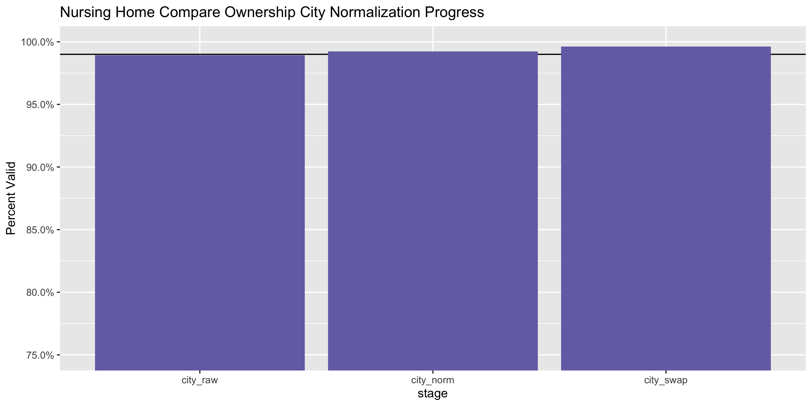
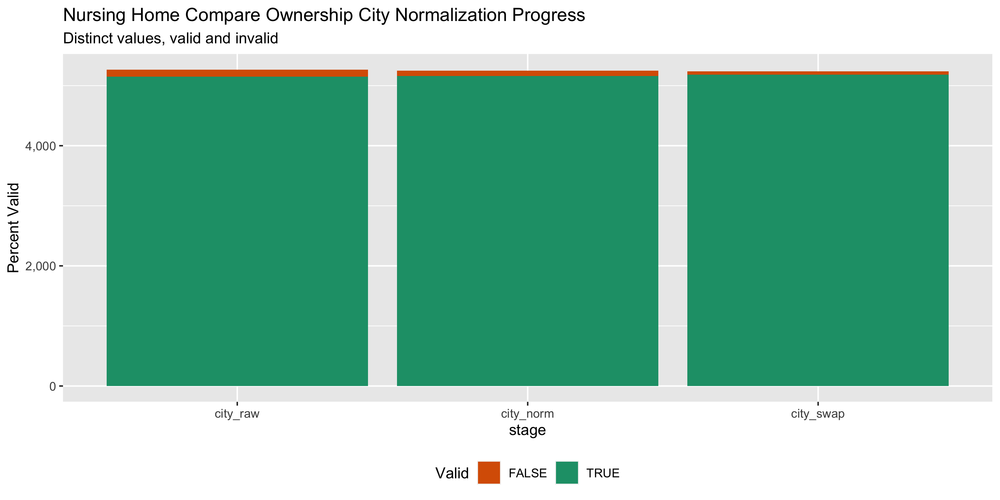

Nursing Home Compare Data Diary
================
Yanqi Xu
2020-03-16 17:55:45

<!-- Place comments regarding knitting here -->

## Project

The Accountability Project is an effort to cut across data silos and
give journalists, policy professionals, activists, and the public at
large a simple way to search across huge volumes of public data about
people and organizations.

Our goal is to standardizing public data on a few key fields by thinking
of each dataset row as a transaction. For each transaction there should
be (at least) 3 variables:

1.  All **parties** to a transaction
2.  The **date** of the transaction
3.  The **amount** of money involved

## Objectives

This document describes the process used to complete the following
objectives:

1.  How many records are in the database?
2.  Check for duplicates
3.  Check ranges
4.  Is there anything blank or missing?
5.  Check for consistency issues
6.  Create a five-digit ZIP Code called `ZIP5`
7.  Create a `YEAR` field from the transaction date
8.  Make sure there is data on both parties to a transaction

## Packages

The following packages are needed to collect, manipulate, visualize,
analyze, and communicate these results. The `pacman` package will
facilitate their installation and attachment.

The IRW’s `campfin` package will also have to be installed from GitHub.
This package contains functions custom made to help facilitate the
processing of campaign finance data.

``` r
if (!require("pacman")) install.packages("pacman")
pacman::p_load_gh("irworkshop/campfin")
pacman::p_load(
  readxl, # read excel
  tidyverse, # data manipulation
  lubridate, # datetime strings
  magrittr, # pipe opperators
  janitor, # dataframe clean
  refinr, # cluster and merge
  scales, # format strings
  knitr, # knit documents
  vroom, # read files fast
  glue, # combine strings
  here, # relative storage
  fs # search storage 
)
```

This document should be run as part of the `R_campfin` project, which
lives as a sub-directory of the more general, language-agnostic
[`irworkshop/accountability_datacleaning`](https://github.com/irworkshop/accountability_datacleaning "TAP repo")
GitHub repository.

The `R_campfin` project uses the [RStudio
projects](https://support.rstudio.com/hc/en-us/articles/200526207-Using-Projects "Rproj")
feature and should be run as such. The project also uses the dynamic
`here::here()` tool for file paths relative to *your* machine.

``` r
# where does this document knit?
here::here()
#> [1] "/Users/yanqixu/code/accountability_datacleaning/R_campfin"
```

## Data

The master flat file is obtained from the
[Medicare.gov](https://www.medicare.gov/nursinghomecompare/Data/About.html).
The data is as current as March 16,
2020.

``` r
raw_dir <- dir_create(here("nursing_home","data"))
```

``` r
landing_url <- 'https://data.medicare.gov/views/bg9k-emty/files/6ef81c64-2ebd-4ece-93af-8e462427939a?content_type=&filename=NursingHomeCompare_Revised_Flatfiles.zip'

zip_path <- path(raw_dir,str_extract(landing_url,"(?<=filename\\=).+"))

if (!all_files_new(raw_dir)) {
   download.file(url = landing_url, destfile = zip_path)
}
```

``` r
zip_contents <- 
  unzip(zip_path, list = TRUE) %>% 
  as_tibble() %>% 
  clean_names()

zip_data <- str_subset(zip_contents$name, "csv")

zip_others <- setdiff(zip_contents$name, zip_data)

if (not(all(file_exists(path(raw_dir, zip_data))))) {
  unzip(
    zipfile = zip_path,
    files = zip_data,
    exdir = raw_dir
  )
}

if (not(all(file_exists(path(docs, zip_others))))) {
  unzip(
    zipfile = zip_path,
    files = zip_others,
    exdir = docs
  )
}
```

The abbreiviation information is stored in
`NHC_DataDictionary_SNFQRP.pdf` and the record layouts are contained in
`DataMedicareGov_MetadataAllTabs_v23.xlsx`.

First, we will read the ownership data. We can also view the record
layout from the `Ownership` sheet
`DataMedicareGov_MetadataAllTabs_v23.xlsx`.

``` r
owner <- read_csv(str_subset(path(raw_dir, zip_data),"Owner.+")) %>% clean_names()
```

``` r
owner_dict <- read_xlsx(str_subset(path(docs, zip_others),"DataMedicareGov"),
                        sheet = "Ownership")

kable(owner_dict)
```

| Variable Name (column headers on ACCESS tables and CSV Downloadable files) | Label (column headers on CSV Display files) | Description                                                                | Format / Values                                                                                                                                                                                                                  |
| :------------------------------------------------------------------------- | :------------------------------------------ | :------------------------------------------------------------------------- | :------------------------------------------------------------------------------------------------------------------------------------------------------------------------------------------------------------------------------- |
| PROVNUM                                                                    | Federal Provider Number                     | Federal Provider Number                                                    | 6 alphanumeric characters                                                                                                                                                                                                        |
| PROVNAME                                                                   | Provider Name                               | Provider Name                                                              | text                                                                                                                                                                                                                             |
| address                                                                    | Provider Address                            | Provider Address                                                           | text                                                                                                                                                                                                                             |
| CITY                                                                       | Provider City                               | Provider City                                                              | text                                                                                                                                                                                                                             |
| STATE                                                                      | Provider State                              | Provider State                                                             | 2-character postal abbreviation                                                                                                                                                                                                  |
| ZIP                                                                        | Provider Zip Code                           | Provider Zip Code                                                          | 5-digit zip code                                                                                                                                                                                                                 |
| ROLE\_DESC                                                                 | Role played by Owner or Manager in Facility | Role Description                                                           | text; values are:                                                                                                                                                                                                                |
|                                                                            |                                             |                                                                            | 5% OR GREATER DIRECT OWNERSHIP INTEREST                                                                                                                                                                                          |
|                                                                            |                                             |                                                                            | 5% OR GREATER INDIRECT OWNERSHIP INTEREST                                                                                                                                                                                        |
|                                                                            |                                             |                                                                            | 5% OR GREATER MORTGAGE INTEREST                                                                                                                                                                                                  |
|                                                                            |                                             |                                                                            | 5% OR GREATER SECURITY INTEREST                                                                                                                                                                                                  |
|                                                                            |                                             |                                                                            | DIRECTOR                                                                                                                                                                                                                         |
|                                                                            |                                             |                                                                            | MANAGING EMPLOYEE                                                                                                                                                                                                                |
|                                                                            |                                             |                                                                            | OFFICER                                                                                                                                                                                                                          |
|                                                                            |                                             |                                                                            | OPERATIONAL/MANAGERIAL CONTROL                                                                                                                                                                                                   |
|                                                                            |                                             |                                                                            | PARTNERSHIP INTEREST                                                                                                                                                                                                             |
|                                                                            |                                             |                                                                            | if there is no ownership data available for this PROVNUM, Role Description = “Ownership Data Not Available” and other ownership fields will be blank (null)                                                                      |
| OWNER\_TYPE                                                                | Owner Type                                  | Indicates if owner is an individual or organization                        | “Individual” or “Organization”                                                                                                                                                                                                   |
| OWNER\_NAME                                                                | Owner Name                                  | Name of Owner                                                              | text: name of organization, or, if an individual, formatted as “LastName, FirstName”                                                                                                                                             |
| OWNER\_PERCENTAGE                                                          | Ownership Percentage                        | Last Name                                                                  | text: NN% or “No Percentage Provided”; value provided only for owners with ROLE\_DESC of “5% OR GREATER DIRECT OWNERSHIP INTEREST” or “5% OR GREATER INDIRECT OWNERSHIP INTEREST”; for other ROLE\_DESC values, “Not Applicable” |
| ASSOCIATION\_DATE                                                          | Association Date                            | Date when given owner/manager became associated with provider in this role | text: “since MM/DD/YYYY” or “No Date Provided”                                                                                                                                                                                   |
| LOCATION                                                                   | Location                                    | Location of facility                                                       | only on displayed version of file; renders as latitude and longitude                                                                                                                                                             |
| FILEDATE                                                                   | Processing Date                             | Date the data were retrieved                                               | date                                                                                                                                                                                                                             |

### Missing

``` r
col_stats(owner, count_na)
#> # A tibble: 12 x 4
#>    col              class      n       p
#>    <chr>            <chr>  <int>   <dbl>
#>  1 provnum          <chr>      0 0      
#>  2 provname         <chr>      0 0      
#>  3 address          <chr>      0 0      
#>  4 city             <chr>      0 0      
#>  5 state            <chr>      0 0      
#>  6 zip              <dbl>      0 0      
#>  7 role_desc        <chr>      0 0      
#>  8 owner_type       <chr>    738 0.00445
#>  9 owner_name       <chr>    738 0.00445
#> 10 owner_percentage <chr>    738 0.00445
#> 11 association_date <chr>    738 0.00445
#> 12 filedate         <date>     0 0
```

We’ll flag the records without any owner name (0 entries).

``` r
owner <- owner %>% flag_na(owner_name)
```

### Duplicates

We can see there’s no duplicate entry.

``` r
owner <- flag_dupes(owner, dplyr::everything())
```

## Wrangle

To improve the searchability of the database, we will perform some
consistent, confident string normalization. For geographic variables
like city names and ZIP codes, the corresponding `campfin::normal_*()`
functions are taylor made to facilitate this process. \#\#\# Date From
the record layout, we can see that we can clean the
`association_date`with either an `NA` or an acutal date without the word
“wince”.

``` r
owner <- owner %>% 
  mutate(association_date_clean = na_if(association_date, "No Date Provided") %>% 
           str_remove("since\\s") %>% 
           as.Date("%m/%d/%Y"))
```

### Percentage

We can also clean the `owner_percentage` field.

``` r
owner <- owner %>% 
  mutate(owner_percentage_clean = owner_percentage %>% 
           na_if("NOT APPLICABLE") %>% 
           na_if("NO PERCENTAGE PROVIDED") %>% 
           str_remove("%") %>% 
           as.numeric())
```

### Address

For the street `addresss` variable, the `campfin::normal_address()`
function will force consistence case, remove punctuation, and
abbreviation official USPS suffixes.

``` r
owner <- owner %>% 
    mutate(address_norm = normal_address(address,abbs = usps_street,
      na_rep = TRUE))
```

### ZIP

For ZIP codes, the `campfin::normal_zip()` function will attempt to
create valied *five* digit codes by removing the ZIP+4 suffix and
returning leading zeroes dropped by other programs like Microsoft Excel.

``` r
prop_in(owner$zip, valid_zip, na.rm = T)
#> [1] 0.9186872

owner <- owner %>% 
    mutate(zip5 = normal_zip(zip, na_rep = T))

prop_in(owner$zip5, valid_zip, na.rm = T)
#> [1] 0.9996987
```

### State

The two digit state abbreviations are all valid.

``` r
prop_in(owner$state, valid_state, na.rm = T)
#> [1] 1
```

### City

Cities are the most difficult geographic variable to normalize, simply
due to the wide variety of valid cities and formats. \#\#\#\# Normal

The `campfin::normal_city()` function is a good ownerart, again
converting case, removing punctuation, but *expanding* USPS
abbreviations. We can also remove `invalid_city` values.

``` r
owner <- owner %>% 
      mutate(city_norm = normal_city(city,abbs = usps_city,
      states = usps_state,
      na = invalid_city,
      na_rep = TRUE))

prop_in(owner$city_norm, valid_city, na.rm = T)
#> [1] 0.9735063
```

#### Swap

We can further improve normalization by comparing our normalized value
against the *expected* value for that record’s state abbreviation and
ZIP code. If the normalized value is either an abbreviation for or very
similar to the expected value, we can confidently swap those two.

``` r
owner <- owner %>% 
  rename(city_raw = city) %>% 
  left_join(
    y = zipcodes,
    by = c(
      "state" = "state",
      "zip5" = "zip"
    )
  ) %>% 
  rename(city_match = city) %>% 
  mutate(
    match_abb = is_abbrev(city_norm, city_match),
    match_dist = str_dist(city_norm, city_match),
    city_swap = if_else(
      condition = !is.na(match_dist) & match_abb | match_dist == 1,
      true = city_match,
      false = city_norm
    )
  ) %>% 
  select(
    -city_match,
    -match_dist,
    -match_abb
  )
```

After the two normalization steps, the percentage of valid cities is at
100%. \#\#\#\# Progress

| stage      | prop\_in | n\_distinct | prop\_na | n\_out | n\_diff |
| :--------- | -------: | ----------: | -------: | -----: | ------: |
| city\_raw  |    0.989 |        5264 |    0.000 |   1764 |     113 |
| city\_norm |    0.992 |        5248 |    0.000 |   1270 |      87 |
| city\_swap |    0.996 |        5239 |    0.001 |    640 |      55 |

You can see how the percentage of valid values increased with each
stage.

<!-- -->

More importantly, the number of distinct values decreased each stage. We
were able to confidently change many distinct invalid values to their
valid equivalent.

``` r
progress %>% 
  select(
    stage, 
    all = n_distinct,
    bad = n_diff
  ) %>% 
  mutate(good = all - bad) %>% 
  pivot_longer(c("good", "bad")) %>% 
  mutate(name = name == "good") %>% 
  ggplot(aes(x = stage, y = value)) +
  geom_col(aes(fill = name)) +
  scale_fill_brewer(palette = "Dark2", direction = -1) +
  scale_y_continuous(labels = comma) +
  theme(legend.position = "bottom") +
  labs(
    title = "Nursing Home Compare Ownership City Normalization Progress",
    subtitle = "Distinct values, valid and invalid",
    x = "stage",
    y = "Percent Valid",
    fill = "Valid"
  )
```

<!-- -->

## Explore

### Categorical

#### Year

We can see that the data is pretty up to date. However, there’re some
fileds indicating the annual registration was recorded in `2055`, which
is presumably a human error.

``` r
owner <- owner %>% 
  mutate(year = year(association_date_clean))
tabyl(owner$year)
#> # A tibble: 75 x 4
#>    `owner$year`     n    percent valid_percent
#>           <dbl> <dbl>      <dbl>         <dbl>
#>  1         1942     1 0.00000603    0.00000605
#>  2         1943     1 0.00000603    0.00000605
#>  3         1945     1 0.00000603    0.00000605
#>  4         1947     1 0.00000603    0.00000605
#>  5         1948     2 0.0000121     0.0000121 
#>  6         1950     3 0.0000181     0.0000182 
#>  7         1952     4 0.0000241     0.0000242 
#>  8         1953     1 0.00000603    0.00000605
#>  9         1954     2 0.0000121     0.0000121 
#> 10         1955     3 0.0000181     0.0000182 
#> # … with 65 more rows
```

## Conclude

``` r
glimpse(sample_n(owner, 20))
#> Observations: 20
#> Variables: 20
#> $ provnum                <chr> "365853", "105178", "185171", "245279", "676143", "265310", "1955…
#> $ provname               <chr> "GREENBRIAR CENTER", "HERITAGE HEALTHCARE & REHABILITATION CENTER…
#> $ address                <chr> "8064 SOUTH AVENUE", "777 9TH ST N", "544 LONE OAK ROAD", "3815 W…
#> $ city_raw               <chr> "BOARDMAN", "NAPLES", "PADUCAH", "ROBBINSDALE", "MANSFIELD", "SAI…
#> $ state                  <chr> "OH", "FL", "KY", "MN", "TX", "MO", "LA", "IA", "WA", "NY", "MD",…
#> $ zip                    <dbl> 44512, 33940, 42003, 55422, 76063, 63128, 71323, 50112, 99218, 13…
#> $ role_desc              <chr> "5% OR GREATER DIRECT OWNERSHIP INTEREST", "5% OR GREATER INDIREC…
#> $ owner_type             <chr> "Organization", "Organization", "Individual", "Individual", "Indi…
#> $ owner_name             <chr> "OMG LS LEASING CO., LLC", "MCP LAVIE, LLC", "THURMOND, JOAN", "P…
#> $ owner_percentage       <chr> "100%", "NO PERCENTAGE PROVIDED", "NOT APPLICABLE", "NOT APPLICAB…
#> $ association_date       <chr> "since 04/01/2008", "since 02/01/2012", "since 09/21/2000", "sinc…
#> $ filedate               <date> 2020-02-01, 2020-02-01, 2020-02-01, 2020-02-01, 2020-02-01, 2020…
#> $ na_flag                <lgl> FALSE, FALSE, FALSE, FALSE, FALSE, FALSE, FALSE, FALSE, FALSE, FA…
#> $ association_date_clean <date> 2008-04-01, 2012-02-01, 2000-09-21, 2017-06-21, 2017-09-01, 1987…
#> $ owner_percentage_clean <dbl> 100, NA, NA, NA, NA, NA, NA, NA, NA, NA, NA, NA, NA, NA, NA, NA, …
#> $ address_norm           <chr> "8064 S AVE", "777 9 TH ST N", "544 LONE OAK RD", "3815 W BROADWA…
#> $ zip5                   <chr> "44512", "33940", "42003", "55422", "76063", "63128", "71323", "5…
#> $ city_norm              <chr> "BOARDMAN", "NAPLES", "PADUCAH", "ROBBINSDALE", "MANSFIELD", "SAI…
#> $ city_swap              <chr> "BOARDMAN", NA, "PADUCAH", "ROBBINSDALE", "MANSFIELD", "SAINT LOU…
#> $ year                   <dbl> 2008, 2012, 2000, 2017, 2017, 1987, 1993, 2015, 2015, 2009, 2013,…
```

1.  There are 165964 records in the database.
2.  There are 0 duplicate records in the database.
3.  The range and distribution of `year` seems mostly reasonable except
    for a few entries.
4.  There are 738 records missing either recipient or date.
5.  Consistency in goegraphic data has been improved with
    `campfin::normal_*()`.
6.  The 4-digit `year` variable has been created with
    `lubridate::year()`.

## Export

``` r
clean_dir <- dir_create(path(raw_dir, "processed"))
```

``` r
write_csv(
  x = owner %>% 
    mutate_if(is.character, str_to_upper) %>% 
    select(-city_norm) %>% 
    rename(city_clean = city_swap),
  path = path(clean_dir, "nursing_owner_clean.csv"),
  na = ""
)
```
