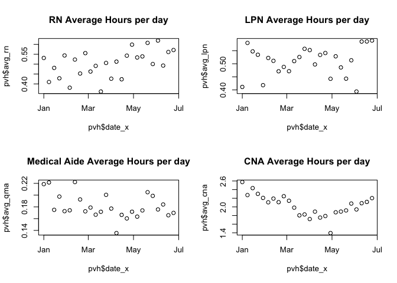
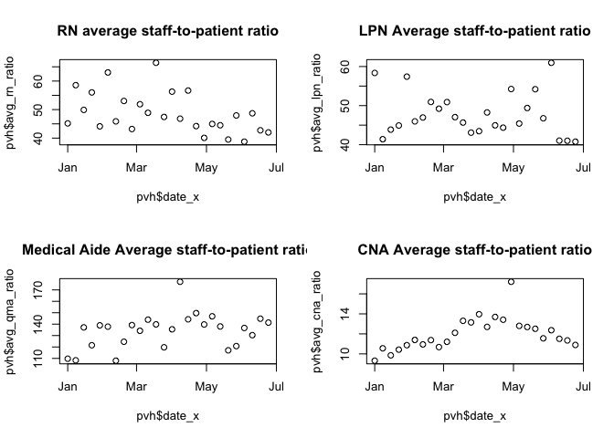
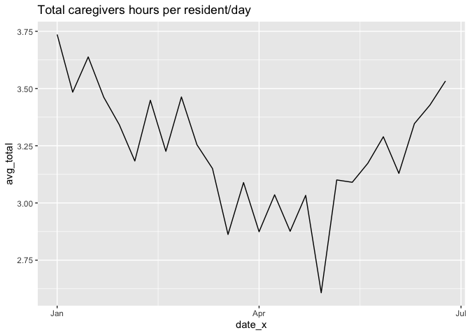

PBJ PVH
================
Yanqi Xu
2020-12-03 20:47:28

``` r
library(tidyverse)
pvh_q2 <- read_csv(file = "pvh_PBJ_Daily_Nurse_Staffing_CY_2020Q2.csv")
pvh_q1 <- read_csv(file = "pvh_PBJ_Daily_Nurse_Staffing_CY_2020Q1.csv")
```

``` r
# filter out the irrelevant facility in NE
pvh_q1 <- pvh_q1 %>% filter(STATE == "IN")
pvh_q2 <- pvh_q2 %>% filter(STATE == "IN")
```

``` r
# combine q1 and q2
pvh_combined <- pvh_q1 %>% bind_rows(pvh_q2)

pvh_combined <- pvh_combined %>% 
  #tranform WorkDate column to a date column
  mutate(WorkDate = WorkDate %>% as.character() %>% as.Date(format = "%Y%m%d"),
  # Divide hours by census so we can get hours per patient on a daily basis 
         avg_rn = Hrs_RN/MDScensus,
         avg_cna = Hrs_CNA/MDScensus,
         avg_lpn = Hrs_LPN/MDScensus,
         avg_qma = Hrs_MedAide/MDScensus)
# date_x is the first day of this week, for graphical purposes
pvh_combined <- pvh_combined %>% mutate(week = lubridate::week(WorkDate))

par(mfrow = c(2, 2))
plot(pvh_combined$WorkDate, pvh_combined$avg_rn, main = "RN Average Hours by day")
plot(pvh_combined$WorkDate, pvh_combined$avg_lpn, main = "LPN Average Hours by day")
plot(pvh_combined$WorkDate, pvh_combined$avg_qma, main = "Medical Aide Average Hours by day")
plot(pvh_combined$WorkDate, pvh_combined$avg_cna, main = "CNA Average Hours by day")
```

<!-- -->

## Weekly average

Since the hours reported during the week and weekend are usually
different, we sum up the weekly total and get a weekly average.

``` r
pvh <- pvh_combined %>% group_by(week) %>% 
  # weekly average census per day
  summarize(week_census = sum(MDScensus)/7,
  # number of hours per resident per day (weekly average)
            avg_rn = sum(Hrs_RN)/week_census/7,
            avg_lpn = sum(Hrs_LPN)/week_census/7,
            avg_cna = sum(Hrs_CNA)/week_census/7,
            avg_qma = sum(Hrs_MedAide)/week_census/7,
            date_x = min(WorkDate),
  # caculate total hours and then divide by weekly average census gives us the overall staffing average
            avg_total = sum(Hrs_RN + Hrs_CNA + Hrs_LPN + Hrs_MedAide)/week_census/7
            )
```

## Average hours per day per patient (weekly average)

``` r
par(mfrow = c(2, 2))
plot(pvh$date_x, pvh$avg_rn, main = "RN Average Hours per day")
plot(pvh$date_x, pvh$avg_lpn, main = "LPN Average Hours per day")
plot(pvh$date_x, pvh$avg_qma, main = "Medical Aide Average Hours per day")
plot(pvh$date_x, pvh$avg_cna, main = "CNA Average Hours per day")
```

<!-- --> \#\#\# Staff-to-patient

``` r
calc_ratio <- function(x) {
# hours per day divided by 24 gives us hours per hour (how much time each patient gets every hour)
   y = x/24
   # if a patient gets 0.1 of care each hour, that means a staff-to-patient ratio of 10:1, the reciprocal of y is the staff-to-patient ratio
  return(1/y)
}

# get the staff-to-patient ratio based on all the avg hours each patient gets each day
pvh <- pvh %>% mutate(across(.cols = starts_with("avg"), 
                      .fns = calc_ratio,
                      .names = "{.col}_ratio"))
par(mfrow = c(2, 2))
plot(pvh$date_x, pvh$avg_rn_ratio, main = "RN average staff-to-patient ratio")
plot(pvh$date_x, pvh$avg_lpn_ratio, main = "LPN Average staff-to-patient ratio")
plot(pvh$date_x, pvh$avg_qma_ratio, main = "Medical Aide Average staff-to-patient ratio")
plot(pvh$date_x, pvh$avg_cna_ratio, main = "CNA Average staff-to-patient ratio")
```

<!-- -->

# total average staffing hours per resident day

It looks like that staffing decreased in April and ticked up again in
May.

``` r
ggplot(pvh) + geom_line( aes(x = date_x, y = avg_total)) +
  labs(title = "Overall average caregivers hours per resident/day")
```

<!-- -->
