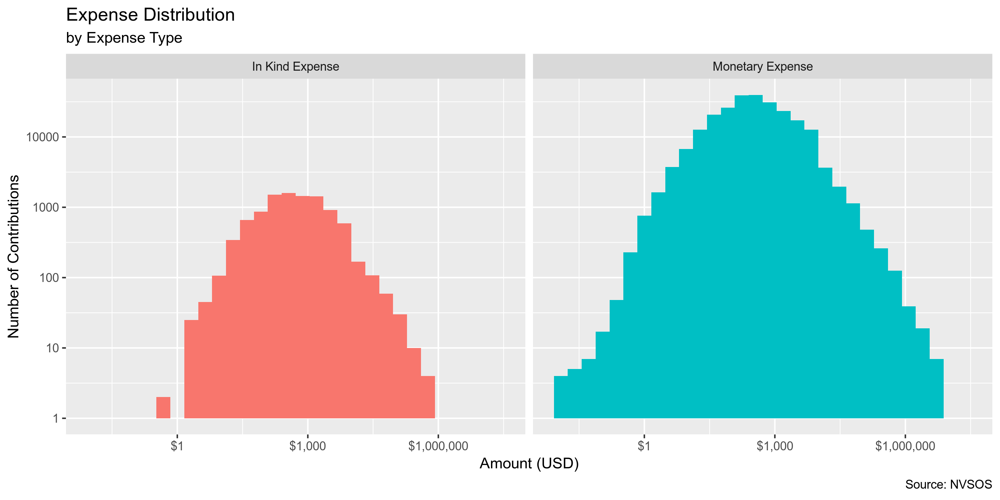
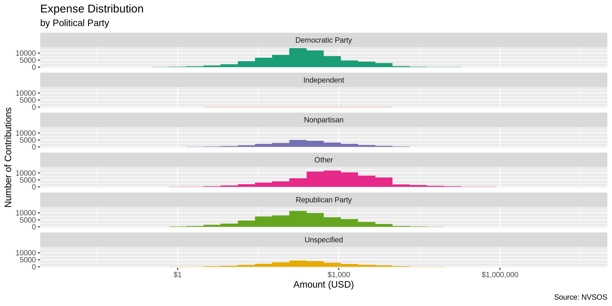
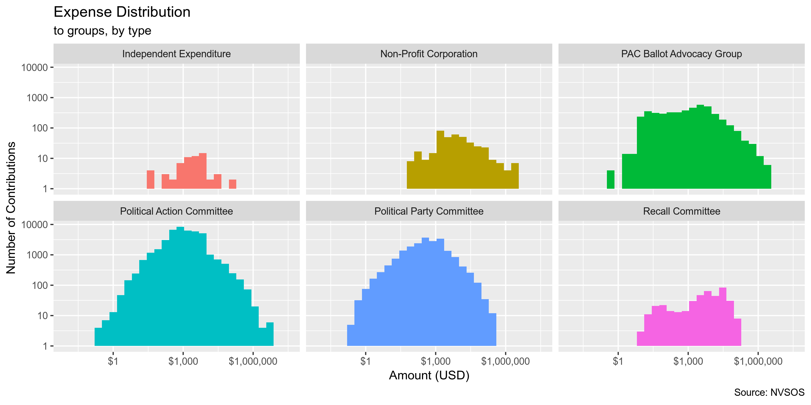

## Objectives

1. How many records are in the database?
1. Check for duplicates
1. Check ranges
1. Is there anything blank or missing?
1. Check for consistency issues
1. Create a five-digit ZIP Code called ZIP5
1. Create a YEAR field from the transaction date
1. For campaign donation data, make sure there is both a donor AND recipient

## Packages

The following packages are needed to collect, manipulate, visualize, analyze, and communicate
these results. The `pacman` package will facilitate their installation and attachment.


```r
# install.packages("pacman")
pacman::p_load(
  tidyverse, # data manipulation
  magrittr, # pipe opperators
  janitor, # data cleaning
  refinr, # cluster and merge
  vroom, # read files fast
  rvest, # scrape web pages
  knitr, # knit documents
  here, # navigate local storage
  fs # search local storage 
)
```

## Data

The Nevada Secretary of State (NVSOS) office requires that one register for an account to access 
"[bulk data download](https://www.nvsos.gov/sos/online-services/data-download)" service page.

The process for downloaded a report is [outlined here](https://www.nvsos.gov/SoSServices/AnonymousAccess/HelpGuides/DataDownloadUserGuide.aspx):

In brief, we will be downloading a "Full Unabridged Database Dump" of "Campaign Finance" data.

> This report will expose Contributions and Expenses report data filed within our “Aurora” Campaign
Financial Disclosure system. This would not include data filed in a Financial Disclosure report.
This bulk data report tool here should be used to pull the entire database or slightly smaller
subsets of data such as all contributions filed after 1/1/2016 by groups of type “PAC”...

The site allows users to define the format for their data download. The site generated the
following summary of our data format:

> Your report will generate 6 "," delimited ASCII text file(s) compressed into one Zip file named
in the format "CampaignFinance.43993.<Today's Date>.zip"*. The first row in each file will contain
the column names, not actual data. Any field capable of containing a non-numeric character (data
types char, varchar, or datetime), will be enclosed in double quotes (") so that if the field
contains your delimiter you may identify it as being contained within the field and not an actual
delimiter. Any double quotes contained within these fields will be replaced by 2 consecutive double
quotes ("") so that the end of the field's data is not erroneously identified...

The above information provides the information needed to correctly parse each file using
`vroom::vroom()`.

The report data is partitioned into multiple files, as explained on the 
[NVSOS FAQ page](https://www.nvsos.gov/SOSServices/AnonymousAccess/HelpGuides/FAQ.aspx#5):

> This is what is referred to as a normalized relational structure in the database world.  Data
items such as business entities and officers have a direct relation to one another.  There can be
any number of officers to one business entity.  Because of this many to one relationship, the
officers data is stored in a different data table (or file) than the business entities.  Then we
relate officer records to a business entity record by a common key data column, in this case the
CorporationID... By separating officers and entities into separate records we can eliminate the
redundancy and added size associated with putting the business entity data on each officer record
or eliminate the complexity of allocating an undeterminable amount of officers on the one business
entity record.  This same many-to-one relationship is true of voter history records to voter
records, UCC actions to UCC liens or Corporation Stocks to Corporations, to name a few.

The summary continues to provide individual structure summaries on each of the six files included
in the report along with an key to the file name:


```
#> $candidates
#> # A tibble: 6 x 3
#>   col          key         col_type   
#>   <chr>        <chr>       <chr>      
#> 1 CandidateID  Primary Key int        
#> 2 First Name   <NA>        varchar(25)
#> 3 Last Name    <NA>        varchar(25)
#> 4 Party        <NA>        varchar(60)
#> 5 Office       <NA>        varchar(60)
#> 6 Jurisdiction <NA>        varchar(50)
#> 
#> $groups
#> # A tibble: 6 x 3
#>   col          key         col_type    
#>   <chr>        <chr>       <chr>       
#> 1 GroupID      Primary Key int         
#> 2 Group Name   <NA>        varchar(120)
#> 3 Group Type   <NA>        varchar(100)
#> 4 Contact Name <NA>        varchar(35) 
#> 5 Active       <NA>        bit         
#> 6 City         <NA>        varchar(30) 
#> 
#> $reports
#> # A tibble: 9 x 3
#>   col             key                                    col_type    
#>   <chr>           <chr>                                  <chr>       
#> 1 ReportID        Primary Key                            int         
#> 2 CandidateID     Foreign Key Ref Candidates.CandidateID int         
#> 3 GroupID         Foreign Key Ref Groups.GroupID         int         
#> 4 Report Name     <NA>                                   varchar(120)
#> 5 Election Cycle  <NA>                                   varchar(4)  
#> 6 Filing Due Date <NA>                                   datetime    
#> 7 Filed Date      <NA>                                   datetime    
#> 8 Amended         <NA>                                   bit         
#> 9 Superseded      <NA>                                   bit         
#> 
#> $payees
#> # A tibble: 4 x 3
#>   col         key         col_type    
#>   <chr>       <chr>       <chr>       
#> 1 ContactID   Primary Key int         
#> 2 First Name  <NA>        varchar(30) 
#> 3 Middle Name <NA>        varchar(30) 
#> 4 Last Name   <NA>        varchar(100)
#> 
#> $contributions
#> # A tibble: 8 x 3
#>   col                 key                                           col_type   
#>   <chr>               <chr>                                         <chr>      
#> 1 ContributionID      Primary Key                                   int        
#> 2 ReportID            Foreign Key Ref Reports.ReportID              int        
#> 3 CandidateID         Foreign Key Ref Candidates.CandidateID        int        
#> 4 GroupID             Foreign Key Ref Groups.GroupID                int        
#> 5 Contribution Date   <NA>                                          datetime   
#> 6 Contribution Amount <NA>                                          money      
#> 7 Contribution Type   <NA>                                          varchar(30)
#> 8 ContributorID       Foreign Key Ref Contributors-Payees.ContactID int        
#> 
#> $expenses
#> # A tibble: 8 x 3
#>   col            key                                           col_type   
#>   <chr>          <chr>                                         <chr>      
#> 1 ExpenseID      Primary Key                                   int        
#> 2 ReportID       Foreign Key Ref Reports.ReportID              int        
#> 3 CandidateID    Foreign Key Ref Candidates.CandidateID        int        
#> 4 GroupID        Foreign Key Ref Groups.GroupID                int        
#> 5 Expense Date   <NA>                                          datetime   
#> 6 Expense Amount <NA>                                          money      
#> 7 Expense Type   <NA>                                          varchar(30)
#> 8 Payee ID       Foreign Key Ref Contributors-Payees.ContactID int
```

NVSOS provides some further information on a few variables in the "Result Field" tab of the report
generator:

* `Jurisdiction` = 

> This will be name of the city or county for city/county offices currently held by the candidate
(e.g. “CITY OF YERINGTON”, “DOUGLAS COUNTY”).  This will be set to “NV SOS” for statewide offices
such as Governor, State Controller or State assemblymen.  An office assigned to a candidate could
be updated by the NV SOS Elections staff as necessary when that candidate files for a new office.

* `Contribution Type` = 

> Use this column to differentiate which one of four contribution types this contribution record
is: Monetary Contribution, In Kind Contribution, In Kind Written Commitment, or Written Commitment.

* `Last Name` = 

> When the contributor or payee is an organization as opposed to an individual, the entire
organization name will be in the Last Name field only.

* `Expense Type` = 

> Use this column to differentiate which type of expense record this is: Monetary Expense or In
Kind Expense.

* `Active`

> A value of F (False) indicates the group has been marked as inactive by the NV Secretary of
State's office Elections division due to submission of a "notice of inactivity" or for failure to
renew annual registration.

* `Amended` = 

> A value of T (True) indicates this contributions and expense report has been marked as an amended
report by the original filer implying this report supersedes a report for this same period, filed
earlier.   An amended report is to be full comprehensive for that report period and in essence
replaces all contributions and expenses filed in the earlier report.

* `Election Cycle` = 

> The Election Cycle is the 4 digit filing or reporting year defining a filing period grouping
together a collection of contribution and expenses reports...

* `Superseded` = 

> A report is Superseded when an amended report was filed later by the same filer for the same
reporting period.  In this case the Superseded field for the older report record will be set to T
(True)...

## Read

The following link was sent via email and downloaded to the `data/` directory:

```
https://www.nvsos.gov/yourreports/CampaignFinance.43993.060419121813.zip
```

The ZIP file contains the six individual files, as expected.


```
#> # A tibble: 6 x 3
#>   name                                               length date               
#>   <chr>                                               <dbl> <dttm>             
#> 1 CampaignFinance.Cnddt.43993.062519084828.csv       599467 2019-06-25 08:48:00
#> 2 CampaignFinance.Cntrbt.43993.062519084828.csv    32807839 2019-06-25 08:48:00
#> 3 CampaignFinance.Cntrbtrs-.43993.062519084828.csv  6375595 2019-06-25 08:48:00
#> 4 CampaignFinance.Expn.43993.062519084828.csv      16976680 2019-06-25 08:48:00
#> 5 CampaignFinance.Grp.43993.062519084828.csv         118072 2019-06-25 08:48:00
#> 6 CampaignFinance.Rpr.43993.062519084828.csv        2419063 2019-06-25 08:48:00
```

The files will be unzipped into the `data/` directory.


```r
dir_create(here("nv_contribs", "data", "raw"))
here("nv_contribs", "data", "raw") %>% 
  dir_ls(glob = "*.zip") %>% 
  unzip(exdir = here("nv_contribs", "data", "raw"))
```

Each file can be read using the `vroom::vroom()` function and the parameters explained by NVSOS.
Variable names will be make "clean" (lowercase snake) using the `janitor::make_clean_names()` 
function.


```r
nv_candidates <- vroom(
  file = here("nv_contribs", "data", "raw","CampaignFinance.Cnddt.43993.062519084828.csv"),
  delim = ",",
  col_names = TRUE,
  na = "",
  quote = "\"",
  escape_double = TRUE,
  .name_repair = make_clean_names,
  col_types = cols(
    `CandidateID` = col_character(),
    `First Name` = col_character(),
    `Last Name` = col_character(),
    `Party` = col_character(),
    `Office` = col_character(),            
    `Jurisdiction` = col_character()
  )
)

print(nv_candidates)
```

```
#> # A tibble: 6,665 x 6
#>    candidate_id first_name last_name  party         office                          jurisdiction   
#>    <chr>        <chr>      <chr>      <chr>         <chr>                           <chr>          
#>  1 28           Michael    Douglas    Nonpartisan   Supreme Court Justice, Seat F   NV SOS         
#>  2 30           Richard    Ziser      Republican P… U.S. Senate                     NV SOS         
#>  3 31           Carlo      Poliak     Unspecified   City Council, Las Vegas         CITY OF LAS VE…
#>  4 32           Lynn       Hettrick   Republican P… State Assembly, District 39     NV SOS         
#>  5 33           James      Gibbons    Republican P… Governor                        NV SOS         
#>  6 34           Bonnie     Parnell    Democratic P… State Assembly, District 40     NV SOS         
#>  7 35           Marcia     Washington Nonpartisan   State Senate, District 4        CLARK COUNTY   
#>  8 36           Harry      Reid       Democratic P… U.S. Senate                     NV SOS         
#>  9 37           Kenneth    Wegner     Republican P… U.S. Senate                     NV SOS         
#> 10 38           Cynthia    Steel      Nonpartisan   District Court Judge, District… CLARK COUNTY   
#> # … with 6,655 more rows
```


```r
nv_groups <- vroom(
  file = here("nv_contribs", "data", "raw","CampaignFinance.Grp.43993.062519084828.csv"),
  delim = ",",
  col_names = TRUE,
  na = "",
  quote = "\"",
  escape_double = TRUE,
  .name_repair = make_clean_names,
  col_types = cols(
    `GroupID` = col_character(),
    `Group Name` = col_character(),
    `Group Type` = col_character(),
    `Contact Name` = col_character(),            
    `Active` = col_logical(),
    `City` = col_character()
  )
)

print(nv_groups)
```

```
#> # A tibble: 1,196 x 6
#>    group_id group_name                               group_type       contact_name  active city    
#>    <chr>    <chr>                                    <chr>            <chr>         <lgl>  <chr>   
#>  1 598      Allstate Insurance Company Political Ac… Political Actio… Shirlanda Wa… TRUE   Northbr…
#>  2 600      American Insurance Association PAC - Ne… Political Actio… James L. Wad… FALSE  Sacrame…
#>  3 601      Board of Realtors Political Action Comm… Political Actio… Wendy DiVecc… TRUE   Las Veg…
#>  4 603      Churchill County Education Association   Political Actio… Sue S Matuska TRUE   Fallon  
#>  5 607      Carriers Allied for Responsible Governm… Political Actio… Daryl E. Cap… FALSE  SPARKS  
#>  6 610      P.A.C. 357   (fka IBEW LOCAL 357 PAC)    Political Actio… James Halsey  TRUE   Las Veg…
#>  7 615      Southwest Regional Council of Carpenter… Political Actio… Frank Hawk    TRUE   Sacrame…
#>  8 616      Construction Industry Committee          Political Actio… Craig Madole  TRUE   Reno    
#>  9 617      Douglas County Professional Education A… Political Actio… Sue S Matuska TRUE   South L…
#> 10 621      International Union of Painters and All… Political Actio… Jason Lamber… TRUE   Hanover 
#> # … with 1,186 more rows
```


```r
nv_reports <- vroom(
  file = here("nv_contribs", "data", "raw","CampaignFinance.Rpr.43993.062519084828.csv"),
  delim = ",",
  col_names = TRUE,
  na = "",
  quote = "\"",
  escape_double = TRUE,
  .name_repair = make_clean_names,
  col_types = cols(
    `ReportID` = col_character(),
    `CandidateID` = col_character(),
    `GroupID` = col_character(),
    `Report Name` = col_character(),
    `Election Cycle` = col_number(),
    `Filing Due Date` = col_date("%m/%d/%Y"),
    `Filed Date` = col_date("%m/%d/%Y"),
    `Amended` = col_logical(),
    `Superseded` = col_logical()
  )
)

print(nv_reports)
```

```
#> # A tibble: 37,625 x 9
#>    report_id candidate_id group_id report_name election_cycle filing_due_date filed_date amended
#>    <chr>     <chr>        <chr>    <chr>                <dbl> <date>          <date>     <lgl>  
#>  1 6980      <NA>         1220     CE Report 1           2006 NA              2006-08-08 FALSE  
#>  2 6981      1988         <NA>     CE Report 1           2006 NA              2006-10-30 FALSE  
#>  3 6982      1988         <NA>     CE Report 1           2006 NA              2006-08-07 FALSE  
#>  4 6983      <NA>         1332     CE Report 1           2006 NA              2006-08-07 FALSE  
#>  5 6984      1992         <NA>     CE Report 1           2006 NA              2006-08-07 FALSE  
#>  6 6985      1165         <NA>     CE Report 1           2006 NA              2006-08-07 FALSE  
#>  7 6986      155          <NA>     CE Report 1           2006 NA              2006-08-07 FALSE  
#>  8 6987      <NA>         1364     CE Report 1           2006 NA              2006-08-08 FALSE  
#>  9 6990      2368         <NA>     CE Report 1           2006 NA              2006-08-08 FALSE  
#> 10 6991      2360         <NA>     CE Report 1           2006 NA              2006-08-08 FALSE  
#> # … with 37,615 more rows, and 1 more variable: superseded <lgl>
```


```r
nv_payees <- vroom(
  file = here("nv_contribs", "data", "raw","CampaignFinance.Cntrbtrs-.43993.062519084828.csv"),
  delim = ",",
  col_names = TRUE,
  na = "",
  quote = "\"",
  escape_double = TRUE,
  .name_repair = make_clean_names,
  col_types = cols(
    `ContactID` = col_character(),
    `First Name` = col_character(),
    `Middle Name` = col_character(),
    `Last Name` = col_character()
  )
)

print(nv_payees)
```

```
#> # A tibble: 189,055 x 4
#>    contact_id first_name middle_name last_name               
#>    <chr>      <chr>      <chr>       <chr>                   
#>  1 3          <NA>       <NA>        UNITE HERE TIP          
#>  2 4          <NA>       <NA>        The Calvert Company     
#>  3 5          <NA>       <NA>        Paid Staff              
#>  4 6          <NA>       <NA>        Passkey Systems         
#>  5 7          <NA>       <NA>        Time Printing           
#>  6 8          Bonnie     B           Jacobs                  
#>  7 9          <NA>       <NA>        NONE                    
#>  8 10         <NA>       <NA>        Oriental Trading        
#>  9 11         <NA>       <NA>        V&S variety & True Value
#> 10 12         <NA>       <NA>        BuildASign.com          
#> # … with 189,045 more rows
```


```r
nv_contributions <- vroom(
  file = here("nv_contribs", "data", "raw","CampaignFinance.Cntrbt.43993.062519084828.csv"),
  delim = ",",
  col_names = TRUE,
  na = "",
  quote = "\"",
  escape_double = TRUE,
  .name_repair = make_clean_names,
  col_types = cols(
    `ContributionID` = col_character(),
    `ReportID` = col_character(),
    `CandidateID` = col_character(),
    `GroupID` = col_character(),
    `Contribution Date` = col_date("%m/%d/%Y"),
    `Contribution Amount`	= col_number(),
    `Contribution Type` = col_character(),
    `ContributorID` = col_character()
  )
)

print(nv_contributions)
```


```r
nv_expenses <- vroom(
  file = here("nv_contribs", "data", "raw", "CampaignFinance.Expn.43993.062519084828.csv"),
  delim = ",",
  col_names = TRUE,
  na = "",
  quote = "\"",
  escape_double = TRUE,
  .name_repair = make_clean_names,
  col_types = cols(
    .default = col_character(),
    `Expense Date` = col_date("%m/%d/%Y"),
    `Expense Amount`	= col_number(),
  )
)
```

## Join

We are primarily interested in the file containing data on contributions. To make the data base
more searchable on the Accountability Project database, we will be joining together the various
normalized relational tables using their respective `*_id` variables. The expenses table will not
be added.


```r
nv <- nv_expenses %>%
  # join with relational tables
  left_join(nv_reports, by = c("report_id", "candidate_id", "group_id")) %>%
  left_join(nv_candidates, by = "candidate_id") %>% 
  left_join(nv_groups, by = "group_id") %>%
  left_join(nv_payees, by = c("payee_id" = "contact_id")) %>% 
  # add origin table info to ambiguous variables
  rename(
    candidate_first = first_name.x,
    candidate_last = last_name.x,
    candidate_party = party,
    seeking_office = office,
    report_amended = amended, 
    report_superseded = superseded,
    group_contact = contact_name,
    group_active = active,
    group_city = city,
    payee_first = first_name.y,
    payee_middle = middle_name,
    payee_last = last_name.y
  )

# all rows preserved
nrow(nv) == nrow(nv_expenses)
#> [1] TRUE

# all cols includes
length(nv_expenses) %>% 
  add(length(nv_reports)) %>% 
  add(length(nv_candidates)) %>% 
  add(length(nv_groups)) %>% 
  add(length(nv_payees)) %>% 
  subtract(6) %>% # shared key cols
  equals(length(nv))
#> [1] TRUE
```

This expands our primary table from 8 variables to 27
without changing the number or records included.

## Explore

Variables containing information on the contributor themselves seem to be missing. While the
`payee_id` variable from the "Expenses" database is used to identify each contributor
in the "Contributors-Payees" using the `contact_id` variable, the later table contains only names.

This information is submitted by the filer of the report and can be found using the 
[NVSOS AURORA search portal](https://www.nvsos.gov/SoSCandidateServices/AnonymousAccess/CEFDSearchUU/Search.aspx), 
so we know the data exists.

For example, in report #6991, contributor #17 (John Mueller) gave money to candidate #2360 (E
Tiras). Searching for Mr. Tiras' report from 2006-08-08 on the AURORA portal, we can see that Mr.
Mueller lives at 308 Laura Court, Incline Village, NV 89451 (see
`nv_contribs/docs/nv_example_report`).


```r
nv %>% 
  filter(report_id == "6991") %>% 
  select(
    report_id, 
    filed_date, 
    payee_last, 
    candidate_last
  )
```

```
#> # A tibble: 22 x 4
#>    report_id filed_date payee_last                                   candidate_last
#>    <chr>     <date>     <chr>                                        <chr>         
#>  1 6991      2006-08-08 Bonanza                                      Tiras         
#>  2 6991      2006-08-08 Tiras                                        Tiras         
#>  3 6991      2006-08-08 Adventures in Advertising                    Tiras         
#>  4 6991      2006-08-08 Creative Marketing and Design                Tiras         
#>  5 6991      2006-08-08 Adventures in Advertising Corp               Tiras         
#>  6 6991      2006-08-08 Adventures in Advertising                    Tiras         
#>  7 6991      2006-08-08 Bonanza                                      Tiras         
#>  8 6991      2006-08-08 Sierra Nevada Media Group                    Tiras         
#>  9 6991      2006-08-08 Incline Village General Improvement District Tiras         
#> 10 6991      2006-08-08 Bonanza                                      Tiras         
#> # … with 12 more rows
```

Below is the structure of the data arranged randomly by row. There are 253644 rows of 
27 variables.


```r
glimpse(sample_frac(nv))
```

```
#> Observations: 253,644
#> Variables: 27
#> $ expense_id        <chr> "149585", "277094", "52409", "92342", "178857", "232558", "290173", "2…
#> $ report_id         <chr> "53190", "79190", "34731", "43352", "61223", "69702", "82190", "17560"…
#> $ candidate_id      <chr> NA, NA, "3867", NA, NA, "3935", "10962", "1202", NA, "3704", "6631", "…
#> $ group_id          <chr> "1215", "1210", NA, "1444", "1218", NA, NA, NA, "1210", NA, NA, NA, NA…
#> $ expense_date      <date> 2014-08-26, 2018-04-10, 2012-09-16, 2013-12-12, 2016-05-10, 2017-04-2…
#> $ expense_amount    <dbl> 3498.68, 63.00, 150.00, 3135.00, 2000.00, 30.58, 262.50, 500.00, 25.73…
#> $ expense_type      <chr> "Monetary Expense", "Monetary Expense", "Monetary Expense", "Monetary …
#> $ payee_id          <chr> "140196", "276880", "34160", "137400", "210950", "246734", "303048", "…
#> $ report_name       <chr> "2015 Annual CE Filing", "CE Report 1 (Amended)", "CE Report 3", "2014…
#> $ election_cycle    <dbl> 2014, 2018, 2012, 2013, 2016, 2017, 2018, 2007, 2018, 2010, 2018, 2014…
#> $ filing_due_date   <date> NA, NA, 2012-10-16, NA, NA, NA, 2018-10-16, NA, NA, 2010-10-26, 2018-…
#> $ filed_date        <date> 2015-01-13, 2018-06-14, 2012-10-16, 2014-02-14, 2016-05-24, 2017-05-3…
#> $ report_amended    <lgl> FALSE, TRUE, FALSE, TRUE, FALSE, TRUE, FALSE, FALSE, FALSE, FALSE, TRU…
#> $ report_superseded <lgl> FALSE, TRUE, FALSE, FALSE, FALSE, FALSE, FALSE, FALSE, FALSE, FALSE, F…
#> $ candidate_first   <chr> NA, NA, "Jason", NA, NA, "Michele", "Paris", "James", NA, "Don", "Laur…
#> $ candidate_last    <chr> NA, NA, "Frierson", NA, NA, "Fiore", "Wade", "Settelmeyer", NA, "Gusta…
#> $ candidate_party   <chr> NA, NA, "Democratic Party", NA, NA, "Republican Party", "Republican Pa…
#> $ seeking_office    <chr> NA, NA, "State Assembly, District 8", NA, NA, "City Council, Las Vegas…
#> $ jurisdiction      <chr> NA, NA, "CLARK COUNTY", NA, NA, "CITY OF LAS VEGAS", "CLARK COUNTY", "…
#> $ group_name        <chr> "Clark County Republican Central Committee", "Washoe County Republican…
#> $ group_type        <chr> "Political Party Committee", "Political Party Committee", NA, "Politic…
#> $ group_contact     <chr> NA, "Patricia Miller, Treasurer", NA, "Nancy Jean King", "Shawn Kinsey…
#> $ group_active      <lgl> TRUE, TRUE, NA, TRUE, TRUE, NA, NA, NA, TRUE, NA, NA, NA, NA, NA, NA, …
#> $ group_city        <chr> "Las Vegas", "Reno", NA, "Reno", "Pasadena", NA, NA, NA, "Reno", NA, N…
#> $ payee_first       <chr> NA, "Andrew", NA, NA, NA, NA, "Ismyn", NA, "Andrew", NA, NA, NA, NA, N…
#> $ payee_middle      <chr> NA, NA, NA, NA, NA, NA, NA, NA, NA, NA, NA, NA, NA, NA, NA, NA, NA, NA…
#> $ payee_last        <chr> "Managed Pay - Payroll Services", "Goyhenetche", "Committee to Elect K…
```

### Distinct

The variables vary in their degree of distinctiveness.

The `expense_id` is 100% 
distinct and can be used to identify a unique contribution.


```r
nv %>% 
  map(n_distinct) %>% 
  unlist() %>% 
  enframe(name = "variable", value = "n_distinct") %>% 
  mutate(prop_distinct = round(n_distinct / nrow(nv), 4)) %>%
  print(n = length(nv))
```

```
#> # A tibble: 27 x 3
#>    variable          n_distinct prop_distinct
#>    <chr>                  <int>         <dbl>
#>  1 expense_id            253644      1       
#>  2 report_id              15287      0.0603  
#>  3 candidate_id            2174      0.0086  
#>  4 group_id                 718      0.0028  
#>  5 expense_date            4478      0.0177  
#>  6 expense_amount         51605      0.204   
#>  7 expense_type               2      0       
#>  8 payee_id               52123      0.206   
#>  9 report_name               76      0.000300
#> 10 election_cycle            14      0.0001  
#> 11 filing_due_date           11      0       
#> 12 filed_date              1358      0.0054  
#> 13 report_amended             2      0       
#> 14 report_superseded          2      0       
#> 15 candidate_first          865      0.0034  
#> 16 candidate_last          1737      0.0068  
#> 17 candidate_party            9      0       
#> 18 seeking_office           638      0.0025  
#> 19 jurisdiction              38      0.0001  
#> 20 group_name               717      0.0028  
#> 21 group_type                 7      0       
#> 22 group_contact            499      0.002   
#> 23 group_active               3      0       
#> 24 group_city               132      0.0005  
#> 25 payee_first             2966      0.0117  
#> 26 payee_middle             381      0.0015  
#> 27 payee_last             32231      0.127
```

The `*_id` variables have as many distinct values as the length of their respective tables.


```r
n_distinct(nv_payees$contact_id)/nrow(nv_payees)
#> [1] 1
n_distinct(nv_groups$group_id)/nrow(nv_groups)
#> [1] 1
```

For the least distinct variables, we can explore the most common values.


```r
print_tabyl(nv, expense_type)
```

```
#> # A tibble: 2 x 3
#>   expense_type          n percent
#>   <chr>             <dbl>   <dbl>
#> 1 Monetary Expense 243664  0.961 
#> 2 In Kind Expense    9980  0.0393
```

```r
print_tabyl(nv, candidate_party)
```

```
#> # A tibble: 9 x 4
#>   candidate_party                 n   percent valid_percent
#>   <chr>                       <dbl>     <dbl>         <dbl>
#> 1 Democratic Party            69564 0.274         0.375    
#> 2 <NA>                        68035 0.268        NA        
#> 3 Republican Party            64453 0.254         0.347    
#> 4 Unspecified                 24920 0.0982        0.134    
#> 5 Nonpartisan                 24741 0.0975        0.133    
#> 6 Independent                   853 0.00336       0.00460  
#> 7 Independent American Party    557 0.00220       0.00300  
#> 8 Libertarian Party of Nevada   507 0.00200       0.00273  
#> 9 Nevada Green Party             14 0.0000552     0.0000754
```

```r
print_tabyl(nv, seeking_office)
```

```
#> # A tibble: 638 x 4
#>    seeking_office                  n percent valid_percent
#>    <chr>                       <dbl>   <dbl>         <dbl>
#>  1 <NA>                        68035  0.268        NA     
#>  2 Governor                    13136  0.0518        0.0708
#>  3 City Council, Las Vegas      5962  0.0235        0.0321
#>  4 Lieutenant Governor          5411  0.0213        0.0292
#>  5 Attorney General             4336  0.0171        0.0234
#>  6 State Assembly, District 1   3511  0.0138        0.0189
#>  7 State Assembly, District 36  3273  0.0129        0.0176
#>  8 State Assembly, District 21  2747  0.0108        0.0148
#>  9 Secretary Of State           2730  0.0108        0.0147
#> 10 State Senate, District 13    2563  0.0101        0.0138
#> # … with 628 more rows
```

```r
print_tabyl(nv, jurisdiction)
```

```
#> # A tibble: 38 x 4
#>    jurisdiction                n percent valid_percent
#>    <chr>                   <dbl>   <dbl>         <dbl>
#>  1 CLARK COUNTY            78478  0.309         0.423 
#>  2 <NA>                    68035  0.268        NA     
#>  3 NV SOS                  47766  0.188         0.257 
#>  4 WASHOE COUNTY           19093  0.0753        0.103 
#>  5 CITY OF LAS VEGAS       10132  0.0399        0.0546
#>  6 CITY OF RENO             4520  0.0178        0.0244
#>  7 NYE COUNTY               3330  0.0131        0.0179
#>  8 CITY OF NORTH LAS VEGAS  3293  0.0130        0.0177
#>  9 CARSON CITY              2908  0.0115        0.0157
#> 10 CITY OF HENDERSON        2893  0.0114        0.0156
#> # … with 28 more rows
```

```r
print_tabyl(nv, election_cycle)
```

```
#> # A tibble: 14 x 3
#>    election_cycle     n percent
#>             <dbl> <dbl>   <dbl>
#>  1           2018 55991 0.221  
#>  2           2014 46911 0.185  
#>  3           2016 39289 0.155  
#>  4           2012 31745 0.125  
#>  5           2017 18213 0.0718 
#>  6           2013 15721 0.0620 
#>  7           2015 14672 0.0578 
#>  8           2010 10795 0.0426 
#>  9           2011 10040 0.0396 
#> 10           2008  4669 0.0184 
#> 11           2019  1955 0.00771
#> 12           2006  1652 0.00651
#> 13           2009  1551 0.00611
#> 14           2007   440 0.00173
```

```r
print_tabyl(nv, report_amended)
```

```
#> # A tibble: 2 x 3
#>   report_amended      n percent
#>   <lgl>           <dbl>   <dbl>
#> 1 FALSE          207268   0.817
#> 2 TRUE            46376   0.183
```

```r
print_tabyl(nv, report_superseded)
```

```
#> # A tibble: 2 x 3
#>   report_superseded      n percent
#>   <lgl>              <dbl>   <dbl>
#> 1 FALSE             210150   0.829
#> 2 TRUE               43494   0.171
```

```r
print_tabyl(nv, group_type)
```

```
#> # A tibble: 7 x 4
#>   group_type                      n  percent valid_percent
#>   <chr>                       <dbl>    <dbl>         <dbl>
#> 1 <NA>                       185609 0.732        NA       
#> 2 Political Action Committee  42042 0.166         0.618   
#> 3 Political Party Committee   20516 0.0809        0.302   
#> 4 PAC Ballot Advocacy Group    4598 0.0181        0.0676  
#> 5 Recall Committee              410 0.00162       0.00603 
#> 6 Non-Profit Corporation        405 0.00160       0.00595 
#> 7 Independent Expenditure        64 0.000252      0.000941
```

```r
print_tabyl(nv, group_active)
```

```
#> # A tibble: 3 x 4
#>   group_active      n percent valid_percent
#>   <lgl>         <dbl>   <dbl>         <dbl>
#> 1 NA           185609  0.732         NA    
#> 2 TRUE          53440  0.211          0.785
#> 3 FALSE         14595  0.0575         0.215
```

```r
print_tabyl(nv, group_city)
```

```
#> # A tibble: 132 x 4
#>    group_city       n percent valid_percent
#>    <chr>        <dbl>   <dbl>         <dbl>
#>  1 <NA>        185609 0.732        NA      
#>  2 Las Vegas    24606 0.0970        0.362  
#>  3 Reno         21845 0.0861        0.321  
#>  4 Washington    6759 0.0266        0.0993 
#>  5 Carson City   3213 0.0127        0.0472 
#>  6 Henderson     2892 0.0114        0.0425 
#>  7 Sacramento    1786 0.00704       0.0263 
#>  8 San Rafael     747 0.00295       0.0110 
#>  9 Minden         590 0.00233       0.00867
#> 10 New York       531 0.00209       0.00780
#> # … with 122 more rows
```

### Ranges

For continuous variables, the ranges should be checked.


```r
summary(nv$expense_date)
```

```
#>         Min.      1st Qu.       Median         Mean      3rd Qu.         Max. 
#> "2006-01-01" "2013-02-25" "2015-03-13" "2015-03-18" "2017-09-21" "2019-06-14"
```

```r
summary(nv$expense_amount)
```

```
#>     Min.  1st Qu.   Median     Mean  3rd Qu.     Max. 
#>   -60000       99      320     3113     1125 19071790
```

```r
summary(nv$filing_due_date)
```

```
#>         Min.      1st Qu.       Median         Mean      3rd Qu.         Max.         NA's 
#> "2006-10-31" "2012-10-16" "2014-10-31" "2015-06-05" "2018-10-16" "2018-10-16"     "185439"
```

```r
summary(nv$filed_date)
```

```
#>         Min.      1st Qu.       Median         Mean      3rd Qu.         Max. 
#> "2006-08-07" "2014-01-09" "2016-01-14" "2015-06-30" "2018-01-16" "2019-06-21"
```

The date variables all seem to make sense. There are no dates before 
2006-01-01 and none from the future (aside from the upcoming filing dates). 

The maximum contribution is for $19,071,790.


```r
nv %>% 
  filter(expense_amount == max(expense_amount)) %>% 
  glimpse()
```

```
#> Observations: 1
#> Variables: 27
#> $ expense_id        <chr> "283456"
#> $ report_id         <chr> "80598"
#> $ candidate_id      <chr> NA
#> $ group_id          <chr> "3708"
#> $ expense_date      <date> 2018-09-21
#> $ expense_amount    <dbl> 19071790
#> $ expense_type      <chr> "Monetary Expense"
#> $ payee_id          <chr> "268320"
#> $ report_name       <chr> "CE Report 3"
#> $ election_cycle    <dbl> 2018
#> $ filing_due_date   <date> 2018-10-16
#> $ filed_date        <date> 2018-10-16
#> $ report_amended    <lgl> FALSE
#> $ report_superseded <lgl> FALSE
#> $ candidate_first   <chr> NA
#> $ candidate_last    <chr> NA
#> $ candidate_party   <chr> NA
#> $ seeking_office    <chr> NA
#> $ jurisdiction      <chr> NA
#> $ group_name        <chr> "Coalition to Defeat Question 3"
#> $ group_type        <chr> "Political Action Committee"
#> $ group_contact     <chr> "Daniel Bravo"
#> $ group_active      <lgl> TRUE
#> $ group_city        <chr> "Las Vegas"
#> $ payee_first       <chr> NA
#> $ payee_middle      <chr> NA
#> $ payee_last        <chr> "Winner & Mandabach Campaigns"
```

### Plot

Visualizations can be made to better understand the distributions of continuous and distinct
variables.

<!-- -->

<!-- -->

<!-- -->

### Missing

The variables also vary in their degree of values that are `NA` (empty). 

Some variables are mutually exclusive. There cannot be, for example, both `candidate_id` and
`group_id` value for the same record, as these two variables identify different kinds of
contributions. These mutually exclusive variables cover 100% of records.

In each of their respective original tables, there are no `NA` values. When you join them together,
any contribution to a candidate will have `NA` in all variables from the "Groups" table and visa
versa.


```r
# prop NA each sum to 1
mean(is.na(nv$candidate_id)) + mean(is.na(nv$group_id))
#> [1] 1
mean(is.na(nv$candidate_last)) + mean(is.na(nv$group_name))
#> [1] 1
```

It's notable that the important variables (e.g., `*_id`, `payee_last`, `contribution_*`) contain 
zero missing values.

The full count of `NA` for each variable in the data frame can be found below:


```r
nv %>% 
  map(function(var) sum(is.na(var))) %>% 
  unlist() %>% 
  enframe(name = "variable", value = "n_na") %>% 
  mutate(prop_na = n_na / nrow(nv)) %>% 
  print(n = length(nv))
```

```
#> # A tibble: 27 x 3
#>    variable            n_na prop_na
#>    <chr>              <int>   <dbl>
#>  1 expense_id             0   0    
#>  2 report_id              0   0    
#>  3 candidate_id       68035   0.268
#>  4 group_id          185609   0.732
#>  5 expense_date           0   0    
#>  6 expense_amount         0   0    
#>  7 expense_type           0   0    
#>  8 payee_id               0   0    
#>  9 report_name            0   0    
#> 10 election_cycle         0   0    
#> 11 filing_due_date   185439   0.731
#> 12 filed_date             0   0    
#> 13 report_amended         0   0    
#> 14 report_superseded      0   0    
#> 15 candidate_first    68035   0.268
#> 16 candidate_last     68035   0.268
#> 17 candidate_party    68035   0.268
#> 18 seeking_office     68035   0.268
#> 19 jurisdiction       68035   0.268
#> 20 group_name        185609   0.732
#> 21 group_type        185609   0.732
#> 22 group_contact     191108   0.753
#> 23 group_active      185609   0.732
#> 24 group_city        185609   0.732
#> 25 payee_first       207655   0.819
#> 26 payee_middle      248754   0.981
#> 27 payee_last             0   0
```

### Duplicates

There are no duplicate expenses in the database.


```r
nrow(get_dupes(nv_expenses))
#> [1] 0
```

## Clean

For consistency sake, we can make all character columns uppercase.


```r
nv <- nv %>% 
  mutate_if("is.character", "str_to_upper")
```

### Year

Since the `contribution_date` variable was parsed as an R date object through `vroom::col_date()`,
the `lubridate::year()` function makes it easy to extract the contribution year from the
contribution date.


```r
nv <- nv %>% 
  mutate(expense_year = lubridate::year(expense_date))
```

### Jurisdiction

There are 38 `jurisdiction` values.  Only one appears to be invalid.


```r
nv$jurisdiction_clean <- na_if(nv$jurisdiction, "UNKNOWN")
```

### Party

[Tom Roberts](https://www.leg.state.nv.us/App/Legislator/A/Assembly/Current/13) is a member of the
Republican Party.


```r
nv_candidates %>% 
  filter(party == "Test Party Name 5")
```

```
#> # A tibble: 0 x 6
#> # … with 6 variables: candidate_id <chr>, first_name <chr>, last_name <chr>, party <chr>,
#> #   office <chr>, jurisdiction <chr>
```

```r
nv$party_clean <- nv$candidate_party %>% 
  str_replace_all("TEST PARTY NAME 5", "REPUBLICAN PARTY")
```

### Payee

Because expense payee's are reported by the recipient, there are inconsistencies in the spelling
of the payee's name. While we can't fix potential misspelling of individual names, there are
ways to reduce the number of variants of non-individual contributor names.

Among records with _only_ a `payee_last` value (non-individuals), there are
52844 distinct values.

By using the OpenRefine merging algorithms, we can reduce the number of distinct `payee_last`
values. The approach takes uncommon values and changes them to a more common very similar value.


```r
n_distinct(nv_payees$last_name[is.na(nv_payees$first_name)])
#> [1] 52844

payee_fix <- nv %>%
  filter(is.na(payee_first)) %>%
  mutate(payee_prep = payee_last %>% 
           str_remove_all(fixed("\"")) %>% 
           iconv(to = "utf-8")) %>% 
  select(expense_id, payee_last, payee_prep) %>% 
  mutate(payee_fix = payee_prep %>%
           key_collision_merge() %>%
           n_gram_merge()) %>% 
  mutate(fixed = payee_last != payee_fix) %>% 
  select(-payee_prep)

# total changed records
sum(payee_fix$fixed, na.rm = TRUE)
#> [1] 21784

# distinct changes made
payee_fix %>% 
  filter(fixed) %>% 
  select(-expense_id) %>% 
  distinct() %>%
  nrow()
#> [1] 2497

# reduced distinct names
n_distinct(payee_fix$payee_last)
#> [1] 25765
n_distinct(payee_fix$payee_fix)
#> [1] 23286

# percent change
n_distinct(payee_fix$payee_last) %>% 
  subtract(n_distinct(payee_fix$payee_fix)) %>% 
  divide_by(n_distinct(payee_fix$payee_last))
#> [1] 0.0962158
```


```r
# number of each fix
payee_fix %>% 
  filter(fixed) %>% 
  count(payee_last, payee_fix) %>% 
  arrange(desc(n))
```

```
#> # A tibble: 2,497 x 3
#>    payee_last        payee_fix              n
#>    <chr>             <chr>              <int>
#>  1 ANEDOT LLC        ANEDOT               715
#>  2 PAY PAL           PAYPAL               517
#>  3 IN COMPLIANCE INC IN COMPLIANCE INC.   460
#>  4 A & B PRINTING    A&B PRINTING         386
#>  5 VISTAPRINT        VISTA PRINT          365
#>  6 WAL MART          WALMART              251
#>  7 ACT BLUE          ACTBLUE              242
#>  8 SMITHS            SMITH'S              240
#>  9 AB PRINTING       A&B PRINTING         228
#> 10 OCTOBER INC.      OCTOBER INC          226
#> # … with 2,487 more rows
```

Use the table of fixed payee last names to correct the original values.


```r
nv <- nv %>% 
  left_join(payee_fix, by = c("expense_id", "payee_last")) %>%
  mutate(fixed = !is.na(fixed)) %>% 
  mutate(payee_clean = ifelse(fixed, payee_fix, payee_last)) %>% 
  mutate(payee_clean = na_if(payee_clean, "NONE"))
```

## Check

There are 68 records with `NA` values in the new `payee_clean`.
68 of those values were previously "NONE" in the
original `payee_last` variable.

To check for records without _any_ kind of identifying information on either side of the 
transaction, we can coalesce the various variables into one.


```
#> # A tibble: 4 x 2
#>   variable        n_na
#>   <chr>          <int>
#> 1 expense_id         0
#> 2 expense_amount     0
#> 3 payer              0
#> 4 payee             46
```

There are 14 unique recipient/contributor combinations missing either value.


```r
nv %>%
  # select key cols
  select(
    candidate_last,
    group_name,
    payee_first,
    payee_clean
  ) %>% 
  # coalesce recipient types into one col
  mutate(payer = coalesce(candidate_last, group_name)) %>% 
  select(-candidate_last, -group_name) %>%
  # repeat for contributors
  mutate(payee = coalesce(payee_first, payee_clean)) %>%
  select(-payee_first, -payee_clean) %>% 
  # filter for NA
  filter(is.na(payee) | is.na(payer)) %>% 
  distinct()
```

```
#> # A tibble: 14 x 2
#>    payer                             payee
#>    <chr>                             <chr>
#>  1 NEVADA NEXT PAC                   <NA> 
#>  2 MILLER                            <NA> 
#>  3 HERZOG                            <NA> 
#>  4 LEAVITT                           <NA> 
#>  5 LANCASTER                         <NA> 
#>  6 GLASSON                           <NA> 
#>  7 BALLOT INITIATIVE STRATEGY CENTER <NA> 
#>  8 SANTUCCI                          <NA> 
#>  9 BUNDY                             <NA> 
#> 10 BURTON                            <NA> 
#> 11 DIXON                             <NA> 
#> 12 COCHRAN                           <NA> 
#> 13 SEVERNS                           <NA> 
#> 14 POLLOCK                           <NA>
```

If both the `payee_first` and `payee_last` variables are `NA`, flag the record with a new `na_flag`
variable.


```r
nv <- nv %>% 
  mutate(na_flag = is.na(payee_first) & is.na(payee_clean))

sum(nv$na_flag)
#> [1] 46
```

## Conclusion

1. There are 253644 records in the database
1. There are no duplicate records
1. All continous ranges make sense
1. There are very few missing values where there shouldn't be 
1. consistency issues among non-individual contributor names has been fixed
1. There is no ZIP code variable
1. The `expense_year` variable has been created from the `expense_date` variable
1. Records missing any key information are flagged with the `na_flag` variable

## Write

We will write the final data set to disk to be uploaded to the Accountability Project database.
To save space, unclean columns will be removed and `NA` values will be written as empty strings.


```r
dir_create(here("nv_expends", "data", "processed"))
nv %>% 
  select(
    -jurisdiction,
    -candidate_party,
    -payee_last
  ) %>% 
  mutate_if(is.character, str_replace_all, "\"", "\'") %>% 
  write_csv(
    path = here("nv_expends", "data", "processed", "nv_expends_clean.csv"),
    na = ""
  )
```
