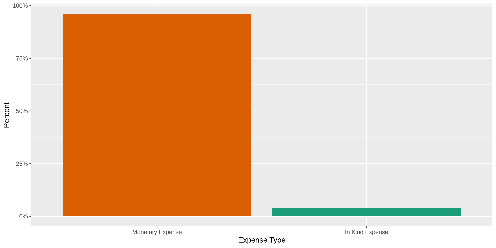
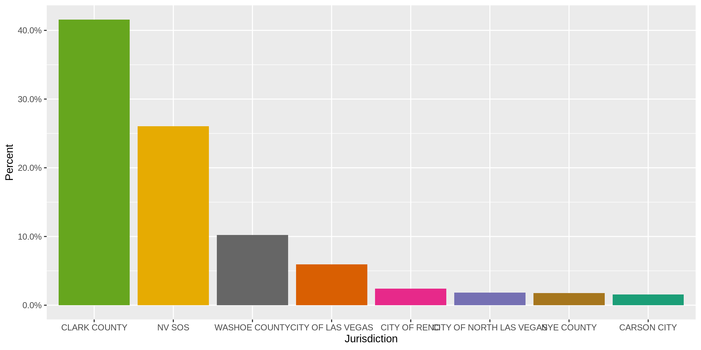
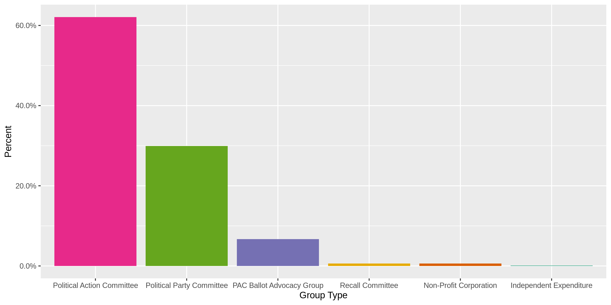
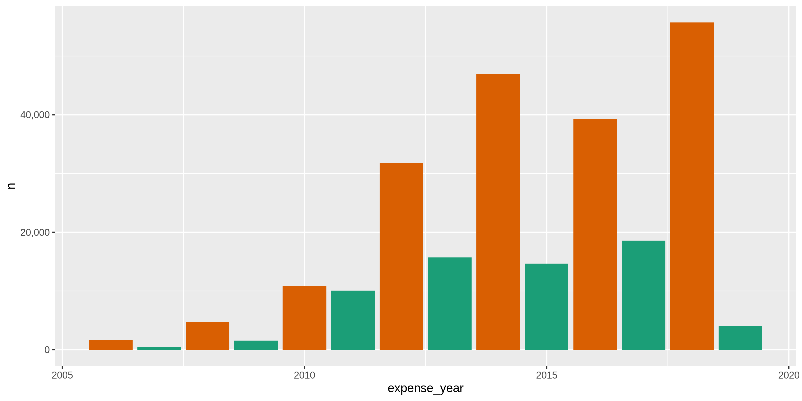

Nevada Expenditures
================
Kiernan Nicholls
2019-10-28 14:40:46

<!-- Place comments regarding knitting here -->

## Project

The Accountability Project is an effort to cut across data silos and
give journalists, policy professionals, activists, and the public at
large a simple way to search across huge volumes of public data about
people and organizations.

Our goal is to standardizing public data on a few key fields by thinking
of each dataset row as a transaction. For each transaction there should
be (at least) 3 variables:

1.  All **parties** to a transaction
2.  The **date** of the transaction
3.  The **amount** of money involved

## Objectives

This document describes the process used to complete the following
objectives:

1.  How many records are in the database?
2.  Check for duplicates
3.  Check ranges
4.  Is there anything blank or missing?
5.  Check for consistency issues
6.  Create a five-digit ZIP Code called `ZIP5`
7.  Create a `YEAR` field from the transaction date
8.  Make sure there is data on both parties to a transaction

## Packages

The following packages are needed to collect, manipulate, visualize,
analyze, and communicate these results. The `pacman` package will
facilitate their installation and attachment.

The IRW’s `campfin` package will also have to be installed from GitHub.
This package contains functions custom made to help facilitate the
processing of campaign finance data.

``` r
if (!require("pacman")) install.packages("pacman")
pacman::p_load_gh("irworkshop/campfin")
pacman::p_load(
  tidyverse, # data manipulation
  lubridate, # datetime strings
  magrittr, # pipe opperators
  janitor, # dataframe clean
  refinr, # cluster and merge
  scales, # format strings
  rvest, # read html files
  knitr, # knit documents
  vroom, # read files fast
  glue, # combine strings
  here, # relative storage
  fs # search storage 
)
```

This document should be run as part of the `R_campfin` project, which
lives as a sub-directory of the more general, language-agnostic
[`irworkshop/accountability_datacleaning`](https://github.com/irworkshop/accountability_datacleaning "TAP repo")
GitHub repository.

The `R_campfin` project uses the [RStudio
projects](https://support.rstudio.com/hc/en-us/articles/200526207-Using-Projects "Rproj")
feature and should be run as such. The project also uses the dynamic
`here::here()` tool for file paths relative to *your* machine.

``` r
# where does this document knit?
here::here()
#> [1] "/home/kiernan/R/accountability_datacleaning/R_campfin"
```

## Data

The Nevada Secretary of State (NVSOS) office requires that one register
for an account to access “[bulk data
download](https://www.nvsos.gov/sos/online-services/data-download)”
service page.

The process for downloaded a report is [outlined
here](https://www.nvsos.gov/SoSServices/AnonymousAccess/HelpGuides/DataDownloadUserGuide.aspx):

In brief, we will be downloading a “Full Unabridged Database Dump” of
“Campaign Finance” data.

> This report will expose Contributions and Expenses report data filed
> within our “Aurora” Campaign Financial Disclosure system. This would
> not include data filed in a Financial Disclosure report. This bulk
> data report tool here should be used to pull the entire database or
> slightly smaller subsets of data such as all contributions filed after
> 1/1/2016 by groups of type “PAC”…

The site allows users to define the format for their data download. The
site generated the following summary of our data format:

> Your report will generate 6 “~” delimited ASCII text file(s)
> compressed into one Zip file named in the format
> “CampaignFinance.43993.\<Today’s Date\>.zip”\*. Any field capable of
> containing a non-numeric character (data types char, varchar, or
> datetime), will be enclosed in double quotes (“) so that if the field
> contains your delimiter you may identify it as being contained within
> the field and not an actual delimiter. Any double quotes contained
> within these fields will be replaced by 2 consecutive double quotes
> (”") so that the end of the field’s data is not erroneously
> identified. Below you will find the format of each file:

The above information provides the information needed to correctly parse
each file using `vroom::vroom()`.

The report data is partitioned into multiple files, as explained on the
[NVSOS FAQ
page](https://www.nvsos.gov/SOSServices/AnonymousAccess/HelpGuides/FAQ.aspx#5):

> This is what is referred to as a normalized relational structure in
> the database world. Data items such as business entities and officers
> have a direct relation to one another. There can be any number of
> officers to one business entity. Because of this many to one
> relationship, the officers data is stored in a different data table
> (or file) than the business entities. Then we relate officer records
> to a business entity record by a common key data column, in this case
> the CorporationID… By separating officers and entities into separate
> records we can eliminate the redundancy and added size associated with
> putting the business entity data on each officer record or eliminate
> the complexity of allocating an undeterminable amount of officers on
> the one business entity record. This same many-to-one relationship is
> true of voter history records to voter records, UCC actions to UCC
> liens or Corporation Stocks to Corporations, to name a few.

The summary continues to provide individual structure summaries on each
of the six files included in the report along with an key to the file
name:

    #> $candidates
    #> # A tibble: 6 x 3
    #>   col          key         col_type   
    #>   <chr>        <chr>       <chr>      
    #> 1 CandidateID  Primary Key int        
    #> 2 First Name   <NA>        varchar(25)
    #> 3 Last Name    <NA>        varchar(25)
    #> 4 Party        <NA>        varchar(60)
    #> 5 Office       <NA>        varchar(60)
    #> 6 Jurisdiction <NA>        varchar(50)
    #> 
    #> $groups
    #> # A tibble: 6 x 3
    #>   col          key         col_type    
    #>   <chr>        <chr>       <chr>       
    #> 1 GroupID      Primary Key int         
    #> 2 Group Name   <NA>        varchar(120)
    #> 3 Group Type   <NA>        varchar(100)
    #> 4 Contact Name <NA>        varchar(35) 
    #> 5 Active       <NA>        bit         
    #> 6 City         <NA>        varchar(30) 
    #> 
    #> $reports
    #> # A tibble: 9 x 3
    #>   col             key                                    col_type    
    #>   <chr>           <chr>                                  <chr>       
    #> 1 ReportID        Primary Key                            int         
    #> 2 CandidateID     Foreign Key Ref Candidates.CandidateID int         
    #> 3 GroupID         Foreign Key Ref Groups.GroupID         int         
    #> 4 Report Name     <NA>                                   varchar(120)
    #> 5 Election Cycle  <NA>                                   varchar(4)  
    #> 6 Filing Due Date <NA>                                   datetime    
    #> 7 Filed Date      <NA>                                   datetime    
    #> 8 Amended         <NA>                                   bit         
    #> 9 Superseded      <NA>                                   bit         
    #> 
    #> $payees
    #> # A tibble: 4 x 3
    #>   col         key         col_type    
    #>   <chr>       <chr>       <chr>       
    #> 1 ContactID   Primary Key int         
    #> 2 First Name  <NA>        varchar(30) 
    #> 3 Middle Name <NA>        varchar(30) 
    #> 4 Last Name   <NA>        varchar(100)
    #> 
    #> $contributions
    #> # A tibble: 8 x 3
    #>   col                 key                                           col_type   
    #>   <chr>               <chr>                                         <chr>      
    #> 1 ContributionID      Primary Key                                   int        
    #> 2 ReportID            Foreign Key Ref Reports.ReportID              int        
    #> 3 CandidateID         Foreign Key Ref Candidates.CandidateID        int        
    #> 4 GroupID             Foreign Key Ref Groups.GroupID                int        
    #> 5 Contribution Date   <NA>                                          datetime   
    #> 6 Contribution Amount <NA>                                          money      
    #> 7 Contribution Type   <NA>                                          varchar(30)
    #> 8 ContributorID       Foreign Key Ref Contributors-Payees.ContactID int        
    #> 
    #> $expenses
    #> # A tibble: 8 x 3
    #>   col            key                                           col_type   
    #>   <chr>          <chr>                                         <chr>      
    #> 1 ExpenseID      Primary Key                                   int        
    #> 2 ReportID       Foreign Key Ref Reports.ReportID              int        
    #> 3 CandidateID    Foreign Key Ref Candidates.CandidateID        int        
    #> 4 GroupID        Foreign Key Ref Groups.GroupID                int        
    #> 5 Expense Date   <NA>                                          datetime   
    #> 6 Expense Amount <NA>                                          money      
    #> 7 Expense Type   <NA>                                          varchar(30)
    #> 8 Payee ID       Foreign Key Ref Contributors-Payees.ContactID int

NVSOS provides some further information on a few variables in the
“Result Field” tab of the report generator:

  - `Jurisdiction` =

> This will be name of the city or county for city/county offices
> currently held by the candidate (e.g. “CITY OF YERINGTON”, “DOUGLAS
> COUNTY”). This will be set to “NV SOS” for statewide offices such as
> Governor, State Controller or State assemblymen. An office assigned to
> a candidate could be updated by the NV SOS Elections staff as
> necessary when that candidate files for a new office.

  - `Contribution Type` =

> Use this column to differentiate which one of four contribution types
> this contribution record is: Monetary Contribution, In Kind
> Contribution, In Kind Written Commitment, or Written Commitment.

  - `Last Name` =

> When the contributor or payee is an organization as opposed to an
> individual, the entire organization name will be in the Last Name
> field only.

  - `Expense Type` =

> Use this column to differentiate which type of expense record this is:
> Monetary Expense or In Kind Expense.

  - `Active` =

> A value of F (False) indicates the group has been marked as inactive
> by the NV Secretary of State’s office Elections division due to
> submission of a “notice of inactivity” or for failure to renew annual
> registration.

  - `Amended` =

> A value of T (True) indicates this contributions and expense report
> has been marked as an amended report by the original filer implying
> this report supersedes a report for this same period, filed earlier.
> An amended report is to be full comprehensive for that report period
> and in essence replaces all contributions and expenses filed in the
> earlier report.

  - `Election Cycle` =

> The Election Cycle is the 4 digit filing or reporting year defining a
> filing period grouping together a collection of contribution and
> expenses reports…

  - `Superseded` =

> A report is Superseded when an amended report was filed later by the
> same filer for the same reporting period. In this case the Superseded
> field for the older report record will be set to T (True)…

## Read

The following link was sent via email and downloaded to the `data/`
directory:

    https://www.nvsos.gov/yourreports/CampaignFinance.43993.102819110351.zip

``` r
raw_dir <- here("nv", "expends", "data", "raw")
dir_create(raw_dir)
```

``` r
raw_url <- "https://www.nvsos.gov/yourreports/CampaignFinance.43993.102819110351.zip"
raw_file <- url2path(raw_url, raw_dir)
download.file(raw_url, destfile = raw_file)
```

The ZIP file contains the six individual files, as expected.

    #> # A tibble: 6 x 3
    #>   name                                               length date               
    #>   <chr>                                               <dbl> <dttm>             
    #> 1 CampaignFinance.Cnddt.43993.102819110351.txt       601083 2019-10-28 11:03:00
    #> 2 CampaignFinance.Cntrbt.43993.102819110351.txt    33058385 2019-10-28 11:04:00
    #> 3 CampaignFinance.Cntrbtrs-.43993.102819110351.txt  6416377 2019-10-28 11:03:00
    #> 4 CampaignFinance.Expn.43993.102819110351.txt      17121886 2019-10-28 11:04:00
    #> 5 CampaignFinance.Grp.43993.102819110351.txt         118376 2019-10-28 11:03:00
    #> 6 CampaignFinance.Rpr.43993.102819110351.txt        2454407 2019-10-28 11:03:00

The files will be unzipped into the `data/raw/` directory.

``` r
raw_dir %>% 
  dir_ls(glob = "*.zip") %>% 
  unzip(exdir = raw_dir)
```

Each file can be read using the `vroom::vroom()` function and the
parameters explained by NVSOS. Variable names will be make “clean”
(lowercase snake) using the `janitor::make_clean_names()` function.

``` r
nv_candidates <- vroom(
  file = dir_ls(raw_dir, glob = "*Cnddt*"),
  delim = "~",
  col_names = TRUE,
  na = "",
  quote = "\"",
  escape_double = TRUE,
  .name_repair = make_clean_names,
  col_types = cols(
    `CandidateID` = col_character(),
    `First Name` = col_character(),
    `Last Name` = col_character(),
    `Party` = col_character(),
    `Office` = col_character(),            
    `Jurisdiction` = col_character()
  )
)

print(nv_candidates)
#> # A tibble: 6,684 x 6
#>    candidate_id first_name last_name  party         office                          jurisdiction   
#>    <chr>        <chr>      <chr>      <chr>         <chr>                           <chr>          
#>  1 28           Michael    Douglas    Nonpartisan   Supreme Court Justice, Seat F   NV SOS         
#>  2 30           Richard    Ziser      Republican P… U.S. Senate                     NV SOS         
#>  3 31           Carlo      Poliak     Unspecified   City Council, Las Vegas         CITY OF LAS VE…
#>  4 32           Lynn       Hettrick   Republican P… State Assembly, District 39     NV SOS         
#>  5 33           James      Gibbons    Republican P… Governor                        NV SOS         
#>  6 34           Bonnie     Parnell    Democratic P… State Assembly, District 40     NV SOS         
#>  7 35           Marcia     Washington Nonpartisan   State Senate, District 4        CLARK COUNTY   
#>  8 36           Harry      Reid       Democratic P… U.S. Senate                     NV SOS         
#>  9 37           Kenneth    Wegner     Republican P… U.S. Senate                     NV SOS         
#> 10 38           Cynthia    Steel      Nonpartisan   District Court Judge, District… CLARK COUNTY   
#> # … with 6,674 more rows
```

``` r
nv_groups <- vroom(
  file = dir_ls(raw_dir, glob = "*Grp*"),
  delim = "~",
  col_names = TRUE,
  na = "",
  quote = "\"",
  escape_double = TRUE,
  .name_repair = make_clean_names,
  col_types = cols(
    `GroupID` = col_character(),
    `Group Name` = col_character(),
    `Group Type` = col_character(),
    `Contact Name` = col_character(),            
    `Active` = col_logical(),
    `City` = col_character()
  )
)

print(nv_groups)
#> # A tibble: 1,198 x 6
#>    group_id group_name                               group_type       contact_name  active city    
#>    <chr>    <chr>                                    <chr>            <chr>         <lgl>  <chr>   
#>  1 598      Allstate Insurance Company Political Ac… Political Actio… Shirlanda Wa… TRUE   Northbr…
#>  2 600      American Insurance Association PAC - Ne… Political Actio… James L. Wad… FALSE  Sacrame…
#>  3 601      Board of Realtors Political Action Comm… Political Actio… Wendy DiVecc… FALSE  Las Veg…
#>  4 603      Churchill County Education Association   Political Actio… Sue S Matuska TRUE   Fallon  
#>  5 607      Carriers Allied for Responsible Governm… Political Actio… Daryl E. Cap… FALSE  SPARKS  
#>  6 610      P.A.C. 357   (fka IBEW LOCAL 357 PAC)    Political Actio… James Halsey  TRUE   Las Veg…
#>  7 615      Southwest Regional Council of Carpenter… Political Actio… Frank Hawk    TRUE   Sacrame…
#>  8 616      Construction Industry Committee          Political Actio… Craig Madole  TRUE   Reno    
#>  9 617      Douglas County Professional Education A… Political Actio… Sue S Matuska TRUE   South L…
#> 10 621      International Union of Painters and All… Political Actio… Jason Lamber… TRUE   Hanover 
#> # … with 1,188 more rows
```

``` r
nv_reports <- vroom(
  file = dir_ls(raw_dir, glob = "*Rpr*"),
  delim = "~",
  col_names = TRUE,
  na = "",
  quote = "\"",
  escape_double = TRUE,
  .name_repair = make_clean_names,
  col_types = cols(
    `ReportID` = col_character(),
    `CandidateID` = col_character(),
    `GroupID` = col_character(),
    `Report Name` = col_character(),
    `Election Cycle` = col_number(),
    `Filing Due Date` = col_date("%m/%d/%Y"),
    `Filed Date` = col_date("%m/%d/%Y"),
    `Amended` = col_logical(),
    `Superseded` = col_logical()
  )
)

print(nv_reports)
#> # A tibble: 38,118 x 9
#>    report_id candidate_id group_id report_name election_cycle filing_due_date filed_date amended
#>    <chr>     <chr>        <chr>    <chr>                <dbl> <date>          <date>     <lgl>  
#>  1 6980      <NA>         1220     CE Report 1           2006 NA              2006-08-08 FALSE  
#>  2 6981      1988         <NA>     CE Report 1           2006 NA              2006-10-30 FALSE  
#>  3 6982      1988         <NA>     CE Report 1           2006 NA              2006-08-07 FALSE  
#>  4 6983      <NA>         1332     CE Report 1           2006 NA              2006-08-07 FALSE  
#>  5 6984      1992         <NA>     CE Report 1           2006 NA              2006-08-07 FALSE  
#>  6 6985      1165         <NA>     CE Report 1           2006 NA              2006-08-07 FALSE  
#>  7 6986      155          <NA>     CE Report 1           2006 NA              2006-08-07 FALSE  
#>  8 6987      <NA>         1364     CE Report 1           2006 NA              2006-08-08 FALSE  
#>  9 6990      2368         <NA>     CE Report 1           2006 NA              2006-08-08 FALSE  
#> 10 6991      2360         <NA>     CE Report 1           2006 NA              2006-08-08 FALSE  
#> # … with 38,108 more rows, and 1 more variable: superseded <lgl>
```

``` r
nv_payees <- vroom(
  file = dir_ls(raw_dir, glob = "*Cntrbtrs*"),
  delim = "~",
  col_names = TRUE,
  na = "",
  quote = "\"",
  escape_double = TRUE,
  .name_repair = make_clean_names,
  col_types = cols(
    `ContactID` = col_character(),
    `First Name` = col_character(),
    `Middle Name` = col_character(),
    `Last Name` = col_character()
  )
)

print(nv_payees)
#> # A tibble: 190,225 x 4
#>    contact_id first_name middle_name last_name               
#>    <chr>      <chr>      <chr>       <chr>                   
#>  1 3          <NA>       <NA>        UNITE HERE TIP          
#>  2 4          <NA>       <NA>        The Calvert Company     
#>  3 5          <NA>       <NA>        Paid Staff              
#>  4 6          <NA>       <NA>        Passkey Systems         
#>  5 7          <NA>       <NA>        Time Printing           
#>  6 8          Bonnie     B           Jacobs                  
#>  7 9          <NA>       <NA>        NONE                    
#>  8 10         <NA>       <NA>        Oriental Trading        
#>  9 11         <NA>       <NA>        V&S variety & True Value
#> 10 12         <NA>       <NA>        BuildASign.com          
#> # … with 190,215 more rows
```

``` r
nv_contributions <- vroom(
  file = dir_ls(raw_dir, glob = "*Cntrbt.*"),
  delim = "~",
  col_names = TRUE,
  na = "",
  quote = "\"",
  escape_double = TRUE,
  .name_repair = make_clean_names,
  col_types = cols(
    `ContributionID` = col_character(),
    `ReportID` = col_character(),
    `CandidateID` = col_character(),
    `GroupID` = col_character(),
    `Contribution Date` = col_date("%m/%d/%Y"),
    `Contribution Amount`   = col_number(),
    `Contribution Type` = col_character(),
    `ContributorID` = col_character()
  )
)

print(nv_contributions)
```

``` r
nv_expenses <- vroom(
  file = dir_ls(raw_dir, glob = "*Expn*"),
  delim = "~",
  col_names = TRUE,
  na = "",
  quote = "\"",
  escape_double = TRUE,
  .name_repair = make_clean_names,
  col_types = cols(
    .default = col_character(),
    `Expense Date` = col_date("%m/%d/%Y"),
    `Expense Amount`    = col_number(),
  )
)
```

## Join

We are primarily interested in the file containing data on
contributions. To make the data base more searchable on the
Accountability Project database, we will be joining together the various
normalized relational tables using their respective `*_id` variables.
The expenses table will not be added.

``` r
nv <- nv_expenses %>%
  # join with relational tables
  left_join(nv_reports, by = c("report_id", "candidate_id", "group_id")) %>%
  left_join(nv_candidates, by = "candidate_id") %>% 
  left_join(nv_groups, by = "group_id") %>%
  left_join(nv_payees, by = c("payee_id" = "contact_id")) %>% 
  # add origin table info to ambiguous variables
  rename(
    candidate_first = first_name.x,
    candidate_last = last_name.x,
    candidate_party = party,
    seeking_office = office,
    report_amended = amended, 
    report_superseded = superseded,
    group_contact = contact_name,
    group_active = active,
    group_city = city,
    payee_first = first_name.y,
    payee_middle = middle_name,
    payee_last = last_name.y
  )

# all rows preserved
nrow(nv) == nrow(nv_expenses)
#> [1] TRUE

# all cols includes
ncol(nv_expenses) %>% 
  add(ncol(nv_reports)) %>% 
  add(ncol(nv_candidates)) %>% 
  add(ncol(nv_groups)) %>% 
  add(ncol(nv_payees)) %>% 
  subtract(6) %>% # shared key cols
  equals(ncol(nv))
#> [1] TRUE
```

This expands our primary table from 8 variables to 27 without changing
the number or records included.

## Explore

Variables containing information on the contributor themselves seem to
be missing. While the `payee_id` variable from the “Expenses” database
is used to identify each contributor in the “Contributors-Payees” using
the `contact_id` variable, the later table contains only names.

This information is submitted by the filer of the report and can be
found using the [NVSOS AURORA search
portal](https://www.nvsos.gov/SoSCandidateServices/AnonymousAccess/CEFDSearchUU/Search.aspx),
so we know the data exists.

For example, in report \#6991, contributor \#17 (John Mueller) gave
money to candidate \#2360 (E Tiras). Searching for Mr. Tiras’ report
from 2006-08-08 on the AURORA portal, we can see that Mr. Mueller lives
at 308 Laura Court, Incline Village, NV 89451 (see
`nv_contribs/docs/nv_example_report`).

``` r
nv %>% 
  filter(report_id == "6991") %>% 
  select(
    report_id, 
    filed_date, 
    payee_last, 
    candidate_last
  )
#> # A tibble: 22 x 4
#>    report_id filed_date payee_last                                   candidate_last
#>    <chr>     <date>     <chr>                                        <chr>         
#>  1 6991      2006-08-08 Bonanza                                      Tiras         
#>  2 6991      2006-08-08 Tiras                                        Tiras         
#>  3 6991      2006-08-08 Adventures in Advertising                    Tiras         
#>  4 6991      2006-08-08 Creative Marketing and Design                Tiras         
#>  5 6991      2006-08-08 Adventures in Advertising Corp               Tiras         
#>  6 6991      2006-08-08 Adventures in Advertising                    Tiras         
#>  7 6991      2006-08-08 Bonanza                                      Tiras         
#>  8 6991      2006-08-08 Sierra Nevada Media Group                    Tiras         
#>  9 6991      2006-08-08 Incline Village General Improvement District Tiras         
#> 10 6991      2006-08-08 Bonanza                                      Tiras         
#> # … with 12 more rows
```

Below is the structure of the data arranged randomly by row. There are
255788 rows of 27 variables.

``` r
glimpse(sample_frac(nv))
#> Observations: 255,788
#> Variables: 27
#> $ expense_id        <chr> "139696", "22808", "228333", "62447", "87901", "208183", "214976", "96…
#> $ report_id         <chr> "50505", "27150", "68652", "36461", "42832", "64523", "63394", "43640"…
#> $ candidate_id      <chr> NA, "3883", NA, "4527", "4229", "5441", "5756", "6150", NA, "11246", "…
#> $ group_id          <chr> "1975", NA, "2509", NA, NA, NA, NA, NA, "1836", NA, NA, NA, NA, "2282"…
#> $ expense_date      <date> 2014-10-17, 2010-02-01, 2016-05-27, 2012-08-18, 2013-04-01, 2016-10-1…
#> $ expense_amount    <dbl> 125286.00, 1400.00, 145.00, 500.00, 1000.00, 507.96, 2000.00, 3.20, 50…
#> $ expense_type      <chr> "Monetary Expense", "Monetary Expense", "Monetary Expense", "Monetary …
#> $ payee_id          <chr> "167047", "12966", "221881", "39451", "135552", "172096", "209629", "5…
#> $ report_name       <chr> "CE Report 4", "2011 Annual CE Filing", "CE Report 2 (Amended)", "CE R…
#> $ election_cycle    <dbl> 2014, 2010, 2016, 2012, 2013, 2016, 2016, 2014, 2012, 2019, 2012, 2016…
#> $ filing_due_date   <date> 2014-10-31, NA, NA, 2012-10-16, NA, 2016-10-18, NA, NA, NA, NA, 2012-…
#> $ filed_date        <date> 2014-10-31, 2011-02-07, 2017-02-13, 2012-11-15, 2014-01-15, 2016-10-2…
#> $ report_amended    <lgl> FALSE, FALSE, TRUE, TRUE, FALSE, TRUE, FALSE, FALSE, FALSE, FALSE, FAL…
#> $ report_superseded <lgl> FALSE, FALSE, FALSE, FALSE, FALSE, FALSE, FALSE, FALSE, FALSE, FALSE, …
#> $ candidate_first   <chr> NA, "Patrick", NA, "Steven", "Scott", "Stephen", "Isaac", "Steve", NA,…
#> $ candidate_last    <chr> NA, "Matheson-Mcnaught", NA, "Corbett", "Hammond", "Silberkraus", "Bar…
#> $ candidate_party   <chr> NA, "Republican Party", NA, "Nonpartisan", "Republican Party", "Republ…
#> $ seeking_office    <chr> NA, "State Senate, Clark District 12", NA, "State Board of Education, …
#> $ jurisdiction      <chr> NA, "CLARK COUNTY", NA, "CLARK COUNTY", "CLARK COUNTY", "CLARK COUNTY"…
#> $ group_name        <chr> "Nevada Jobs Coalition", NA, "Alliance to Stop Taxes on the Sick and D…
#> $ group_type        <chr> "Political Action Committee", NA, "Political Action Committee", NA, NA…
#> $ group_contact     <chr> "Chrissie Hastie", NA, "Joshua J. Hicks", NA, NA, NA, NA, NA, "Brian N…
#> $ group_active      <lgl> TRUE, NA, FALSE, NA, NA, NA, NA, NA, FALSE, NA, NA, NA, NA, TRUE, NA, …
#> $ group_city        <chr> "Las Vegas", NA, "Reno", NA, NA, NA, NA, NA, "Washington", NA, NA, NA,…
#> $ payee_first       <chr> NA, NA, "Melinda", NA, "Tara", NA, NA, NA, NA, NA, NA, NA, NA, NA, NA,…
#> $ payee_middle      <chr> NA, NA, NA, NA, NA, NA, NA, NA, NA, NA, NA, NA, NA, NA, NA, NA, NA, NA…
#> $ payee_last        <chr> "Strategic Media Services", "Lamar Companies", "Monroe", "Nevada Youth…
```

### Distinct

The variables vary in their degree of distinctiveness.

The `expense_id` is 100% distinct and can be used to identify a unique
contribution.

``` r
glimpse_fun(nv, n_distinct)
#> # A tibble: 27 x 4
#>    col               type       n          p
#>    <chr>             <chr>  <dbl>      <dbl>
#>  1 expense_id        chr   255788 1         
#>  2 report_id         chr    15490 0.0606    
#>  3 candidate_id      chr     2180 0.00852   
#>  4 group_id          chr      724 0.00283   
#>  5 expense_date      date    4630 0.0181    
#>  6 expense_amount    dbl    51979 0.203     
#>  7 expense_type      chr        2 0.00000782
#>  8 payee_id          chr    52456 0.205     
#>  9 report_name       chr       76 0.000297  
#> 10 election_cycle    dbl       14 0.0000547 
#> 11 filing_due_date   date      12 0.0000469 
#> 12 filed_date        date    1394 0.00545   
#> 13 report_amended    lgl        2 0.00000782
#> 14 report_superseded lgl        2 0.00000782
#> 15 candidate_first   chr      867 0.00339   
#> 16 candidate_last    chr     1740 0.00680   
#> 17 candidate_party   chr        9 0.0000352 
#> 18 seeking_office    chr      638 0.00249   
#> 19 jurisdiction      chr       38 0.000149  
#> 20 group_name        chr      723 0.00283   
#> 21 group_type        chr        7 0.0000274 
#> 22 group_contact     chr      506 0.00198   
#> 23 group_active      lgl        3 0.0000117 
#> 24 group_city        chr      134 0.000524  
#> 25 payee_first       chr     2987 0.0117    
#> 26 payee_middle      chr      387 0.00151   
#> 27 payee_last        chr    32417 0.127
```

The `*_id` variables have as many distinct values as the length of their
respective tables.

``` r
n_distinct(nv_payees$contact_id)/nrow(nv_payees)
#> [1] 1
n_distinct(nv_groups$group_id)/nrow(nv_groups)
#> [1] 1
```

For the least distinct variables, we can explore the most common
values.

<!-- --><!-- --><!-- --><!-- --><!-- --><!-- --><!-- --><!-- --><!-- -->

### Ranges

For continuous variables, the ranges should be checked.

``` r
summary(nv$expense_date)
#>         Min.      1st Qu.       Median         Mean      3rd Qu.         Max. 
#> "2006-01-01" "2013-03-04" "2015-04-02" "2015-03-30" "2017-10-23" "2019-10-01"
summary(nv$expense_amount)
#>     Min.  1st Qu.   Median     Mean  3rd Qu.     Max. 
#>   -60000       98      321     3106     1132 19071790
summary(nv$filing_due_date)
#>         Min.      1st Qu.       Median         Mean      3rd Qu.         Max.         NA's 
#> "2006-10-31" "2012-10-16" "2014-10-31" "2015-06-19" "2018-10-16" "2019-10-15"     "186977"
summary(nv$filed_date)
#>         Min.      1st Qu.       Median         Mean      3rd Qu.         Max. 
#> "2006-08-07" "2014-01-12" "2016-01-15" "2015-07-13" "2018-01-16" "2019-10-22"
```

The date variables all seem to make sense. There are no dates before
2006-01-01 and none from the future (aside from the upcoming filing
dates).

The maximum contribution is for $19,071,790.

``` r
nv %>% 
  filter(expense_amount == max(expense_amount)) %>% 
  glimpse()
#> Observations: 1
#> Variables: 27
#> $ expense_id        <chr> "283456"
#> $ report_id         <chr> "80598"
#> $ candidate_id      <chr> NA
#> $ group_id          <chr> "3708"
#> $ expense_date      <date> 2018-09-21
#> $ expense_amount    <dbl> 19071790
#> $ expense_type      <chr> "Monetary Expense"
#> $ payee_id          <chr> "268320"
#> $ report_name       <chr> "CE Report 3"
#> $ election_cycle    <dbl> 2018
#> $ filing_due_date   <date> 2018-10-16
#> $ filed_date        <date> 2018-10-16
#> $ report_amended    <lgl> FALSE
#> $ report_superseded <lgl> FALSE
#> $ candidate_first   <chr> NA
#> $ candidate_last    <chr> NA
#> $ candidate_party   <chr> NA
#> $ seeking_office    <chr> NA
#> $ jurisdiction      <chr> NA
#> $ group_name        <chr> "Coalition to Defeat Question 3"
#> $ group_type        <chr> "Political Action Committee"
#> $ group_contact     <chr> "Daniel Bravo"
#> $ group_active      <lgl> TRUE
#> $ group_city        <chr> "Las Vegas"
#> $ payee_first       <chr> NA
#> $ payee_middle      <chr> NA
#> $ payee_last        <chr> "Winner & Mandabach Campaigns"
```

### Plot

Visualizations can be made to better understand the distributions of
continuous and distinct variables.

<!-- -->

<!-- -->

<!-- -->

### Missing

The variables also vary in their degree of values that are `NA` (empty).

Some variables are mutually exclusive. There cannot be, for example,
both `candidate_id` and `group_id` value for the same record, as these
two variables identify different kinds of contributions. These mutually
exclusive variables cover 100% of records.

In each of their respective original tables, there are no `NA` values.
When you join them together, any contribution to a candidate will have
`NA` in all variables from the “Groups” table and visa versa.

``` r
# prop NA each sum to 1
mean(is.na(nv$candidate_id)) + mean(is.na(nv$group_id))
#> [1] 1
mean(is.na(nv$candidate_last)) + mean(is.na(nv$group_name))
#> [1] 1
```

It’s notable that the important variables (e.g., `*_id`, `payee_last`,
`contribution_*`) contain zero missing values.

The full count of `NA` for each variable in the data frame can be found
below:

``` r
glimpse_fun(nv, count_na)
#> # A tibble: 27 x 4
#>    col               type       n     p
#>    <chr>             <chr>  <dbl> <dbl>
#>  1 expense_id        chr        0 0    
#>  2 report_id         chr        0 0    
#>  3 candidate_id      chr    68767 0.269
#>  4 group_id          chr   187021 0.731
#>  5 expense_date      date       0 0    
#>  6 expense_amount    dbl        0 0    
#>  7 expense_type      chr        0 0    
#>  8 payee_id          chr        0 0    
#>  9 report_name       chr        0 0    
#> 10 election_cycle    dbl        0 0    
#> 11 filing_due_date   date  186977 0.731
#> 12 filed_date        date       0 0    
#> 13 report_amended    lgl        0 0    
#> 14 report_superseded lgl        0 0    
#> 15 candidate_first   chr    68767 0.269
#> 16 candidate_last    chr    68767 0.269
#> 17 candidate_party   chr    68767 0.269
#> 18 seeking_office    chr    68767 0.269
#> 19 jurisdiction      chr    68767 0.269
#> 20 group_name        chr   187021 0.731
#> 21 group_type        chr   187021 0.731
#> 22 group_contact     chr   190534 0.745
#> 23 group_active      lgl   187021 0.731
#> 24 group_city        chr   187021 0.731
#> 25 payee_first       chr   209587 0.819
#> 26 payee_middle      chr   250868 0.981
#> 27 payee_last        chr        0 0
```

### Duplicates

There are no duplicate expenses in the database.

``` r
nrow(get_dupes(nv_expenses))
#> [1] 0
```

## Clean

For consistency sake, we can make all character columns uppercase.

``` r
nv <- mutate_if(nv, is.character, str_to_upper)
```

### Year

Since the `contribution_date` variable was parsed as an R date object
through `vroom::col_date()`, the `lubridate::year()` function makes it
easy to extract the contribution year from the contribution date.

``` r
nv <- mutate(nv, expense_year = year(expense_date))
```

``` r
nv %>% 
  count(expense_year) %>% 
  mutate(even = is_even(expense_year)) %>% 
  ggplot(aes(x = expense_year, n)) +
  geom_col(aes(fill = even)) +
  scale_fill_brewer(palette = "Dark2", guide = FALSE) +
  scale_y_continuous(labels = comma)
```

<!-- -->

### Jurisdiction

There are 38 `jurisdiction` values. Only one appears to be invalid.

``` r
nv$jurisdiction_clean <- na_if(nv$jurisdiction, "UNKNOWN")
```

## Conclusion

1.  There are 255788 records in the database
2.  There are no duplicate records
3.  All continous ranges make sense
4.  There are very few missing values where there shouldn’t be
5.  consistency issues among non-individual contributor names has been
    fixed
6.  There is no ZIP code variable
7.  The `expense_year` variable has been created from the `expense_date`
    variable
8.  Records missing any key information are flagged with the `na_flag`
    variable

## Write

We will write the final data set to disk to be uploaded to the
Accountability Project database. To save space, unclean columns will be
removed and `NA` values will be written as empty strings.

``` r
proc_dir <- here("nv", "expends", "data", "processed")
dir_create(proc_dir)
```

``` r
nv %>% 
  mutate_if(is.character, str_replace_all, "\"", "\'") %>% 
  write_csv(
    path = glue("{proc_dir}/nv_expends_clean.csv"),
    na = ""
  )
```
