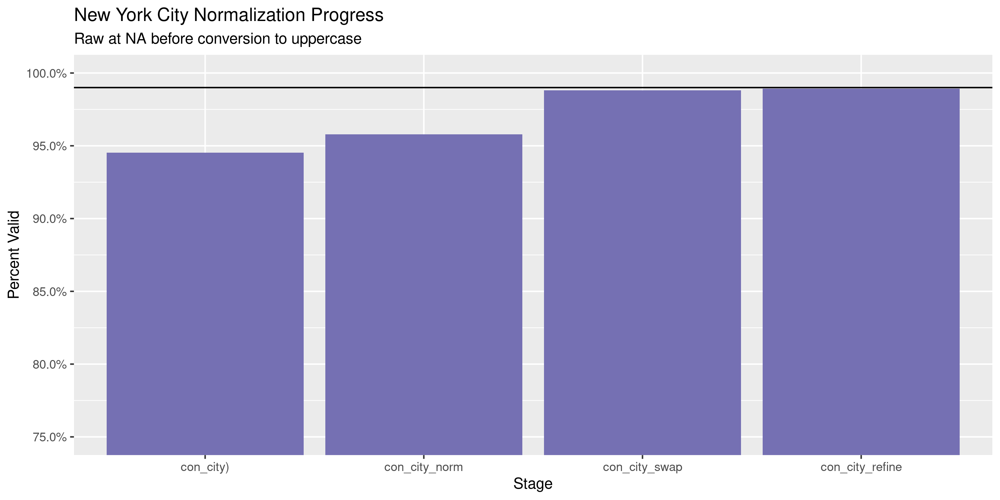

New York Contributions
================
Kiernan Nicholls
2020-04-17 19:43:42

  - [Project](#project)
  - [Objectives](#objectives)
  - [Packages](#packages)
  - [Data](#data)
  - [Import](#import)
  - [Explore](#explore)
  - [Wrangle](#wrangle)
  - [Conclude](#conclude)
  - [Export](#export)

<!-- Place comments regarding knitting here -->

## Project

The Accountability Project is an effort to cut across data silos and
give journalists, policy professionals, activists, and the public at
large a simple way to search across huge volumes of public data about
people and organizations.

Our goal is to standardizing public data on a few key fields by thinking
of each dataset row as a transaction. For each transaction there should
be (at least) 3 variables:

1.  All **parties** to a transaction.
2.  The **date** of the transaction.
3.  The **amount** of money involved.

## Objectives

This document describes the process used to complete the following
objectives:

1.  How many records are in the database?
2.  Check for entirely duplicated records.
3.  Check ranges of continuous variables.
4.  Is there anything blank or missing?
5.  Check for consistency issues.
6.  Create a five-digit ZIP Code called `zip`.
7.  Create a `year` field from the transaction date.
8.  Make sure there is data on both parties to a transaction.

## Packages

The following packages are needed to collect, manipulate, visualize,
analyze, and communicate these results. The `pacman` package will
facilitate their installation and attachment.

The IRW’s `campfin` package will also have to be installed from GitHub.
This package contains functions custom made to help facilitate the
processing of campaign finance data.

``` r
if (!require("pacman")) install.packages("pacman")
pacman::p_load_current_gh("irworkshop/campfin")
pacman::p_load(
  tidyverse, # data manipulation
  lubridate, # datetime strings
  magrittr, # pipe operators
  janitor, # dataframe clean
  refinr, # cluster and merge
  scales, # format strings
  knitr, # knit documents
  vroom, # read files fast
  glue, # combine strings
  here, # relative storage
  fs # search storage 
)
```

This document should be run as part of the `R_campfin` project, which
lives as a sub-directory of the more general, language-agnostic
[`irworkshop/accountability_datacleaning`](https://github.com/irworkshop/accountability_datacleaning)
GitHub repository.

The `R_campfin` project uses the [RStudio
projects](https://support.rstudio.com/hc/en-us/articles/200526207-Using-Projects)
feature and should be run as such. The project also uses the dynamic
`here::here()` tool for file paths relative to *your* machine.

``` r
# where does this document knit?
here::here()
#> [1] "/home/kiernan/Code/accountability_datacleaning/R_campfin"
```

## Data

The New York state campaign finance contributions data can be obtained
from the [New York State Board of Elections
(NYSBOE)](https://www.elections.ny.gov/INDEX.html).

From the NYSBOE’s [view reports
page](https://www.elections.ny.gov/CFViewReports.html) we can obtain the
raw database in ASCII files. The NYSBOE also provides disclaimers on the
data availability and accuracy.

> ##### Data Availability
> 
> This database contains all financial disclosure reports filed with
> NYSBOE from July of 1999 to the present. Financial disclosure reports
> filed prior to the 1999 July Periodic report are either on file with
> the New York State Archives or in storage with the New York State
> Board of Elections. For further information or to obtain copies of
> these archived or stored filings, please call 1-800-458-3453. Each
> page costs 25¢ plus postage and copy orders must be prepaid.
> 
> Electronically filed disclosure reports are generally available in the
> database on the day they are received. A small number of candidates
> and committees are either statutorily exempt or have applied for and
> obtained exemptions from electronic filing. These filers will continue
> filing on paper and their disclosure reports will become available as
> they are manually entered into the database by NYSBOE staff.

> ##### Data Accuracy
> 
> The majority of financial disclosure reports filed at NYSBOE are
> entered into the database directly from e-mail, diskette, CD or DVD
> filings submitted by committee treasurers or candidates. The
> information contained in paper filings will be entered into the
> database exactly as it appears on the forms. Because database searches
> retrieve information exactly the way it is reported and then entered
> into the database, search results may be inaccurate and/or incomplete.
> This will occur, for example, if filers do not adhere to the required
> format, do not use the proper codes, misspell words or leave items
> blank. Although NYSBOE carefully reviews disclosure reports and
> requires treasurers to submit amended reports as needed, there will
> necessarily be delays before the review process is completed and the
> information in the database is corrected.

## Import

To import the contributions data into R, we first have to download two
files: (1) the filer data and (2) the filings data. Together, these two
files can identify all parties to contributions.

> ##### Database Files in ASCII Delimited Format
> 
> Updated data files are uploaded during active filing periods after
> 4:00 P.M. daily until the filing is complete.
> 
> Note: To match the filing data files to Filer Names by filer ID you
> will need to [Download the Filer data
> file](https://cfapp.elections.ny.gov/NYSBOE/download/ZipDataFiles/commcand.zip).
> Commcand.zip is a zipped file containing the data file (commcand.asc)
> in ASCII delimited and two text files. (filerec.txt contains the data
> file layout - codes.txt explains the codes used in the data file).
> 
> All downloadable files are zipped files containing a data file in
> ASCII delimited format and two text files. (`efsrecb.txt` contains the
> data file layout - `efssched.txt` explains the different schedules as
> they apply to the database).
> 
> [Download Data file containing ALL
> filings](https://cfapp.elections.ny.gov/NYSBOE/download/ZipDataFiles/ALL_REPORTS.zip).
> Note: This file is a large file (238, 994 KB) that contains over 6
> million records. Do not attempt to download this file unless you have
> a database to download the file to.

### Download

``` r
sboe <- "https://cfapp.elections.ny.gov/NYSBOE/download/ZipDataFiles/"
con_url <- str_c(sboe, "ALL_REPORTS.zip")
url_file_size(con_url)
#> 362M
fil_url <- str_c(sboe, "commcand.zip")
url_file_size(fil_url)
#> 1.5M
```

``` r
raw_dir <- dir_create(here("ny", "contribs", "data", "raw"))
con_zip <- path(raw_dir, basename(con_url))
fil_zip <- path(raw_dir, basename(fil_url))
if (!this_file_new(con_zip)) {
  download.file(fil_url, fil_zip)
  download.file(con_url, con_zip)
}
```

``` r
if (length(dir_ls(raw_dir)) != 9) {
  unzip(con_zip, exdir = raw_dir)
  unzip(con_zip, exdir = raw_dir)
}
```

### Read

We will have to read the `EFSRECB.TXT` file to determine the column
names and formats for the `ALL_REPORTS.out` file, which has no header.
The file also describes the specifications needed to parse the file,
which can be passed as arguments to the `vroom::vroom()`.

    #> (RecordSeparator): CR-LF
    #> (FieldSeparator): ,
    #> (FieldStartDelimiter): "
    #> (FieldEndDelimiter): "
    #> (FieldDelimitStyle): all
    #> (StripLeadingBlanks): True
    #> (StripTrailingBlanks): True
    #> # A tibble: 30 x 5
    #>    field             location type    format                  efs_import
    #>    <chr>             <chr>    <chr>   <chr>                   <chr>     
    #>  1 filer_id          01       CHAR    <NA>                    REQUIRED  
    #>  2 freport_id        02       CHAR    <NA>                    REQUIRED  
    #>  3 transaction_code  03       CHAR    <NA>                    REQUIRED  
    #>  4 e_year            04       CHAR    <NA>                    REQUIRED  
    #>  5 t3_trid           05       INTEGER <NA>                    <NA>      
    #>  6 date1             06       DATE    'MM/DD/YYYY'            <NA>      
    #>  7 date2             07       DATE    'MM/DD/YYYY'            <NA>      
    #>  8 contrib_code      08       CHAR    <NA>                    <NA>      
    #>  9 contrib_type_code 09       CHAR    <NA>                    <NA>      
    #> 10 corp              10       CHAR    <NA>                    <NA>      
    #> 11 first_name        11       CHAR    <NA>                    <NA>      
    #> 12 mid_init          12       CHAR    <NA>                    <NA>      
    #> 13 last_name         13       CHAR    <NA>                    <NA>      
    #> 14 addr_1            14       CHAR    <NA>                    <NA>      
    #> 15 city              15       CHAR    <NA>                    <NA>      
    #> 16 state             16       CHAR    <NA>                    <NA>      
    #> 17 zip               17       CHAR    <NA>                    <NA>      
    #> 18 check_no          18       CHAR    <NA>                    <NA>      
    #> 19 check_date        19       DATE    'MM/DD/YYYY'            <NA>      
    #> 20 amount            20       FLOAT   <NA>                    <NA>      
    #> 21 amount2           21       FLOAT   <NA>                    <NA>      
    #> 22 description       22       CHAR    <NA>                    <NA>      
    #> 23 other_recpt_code  23       CHAR    <NA>                    <NA>      
    #> 24 purpose_code1     24       CHAR    <NA>                    <NA>      
    #> 25 purpose_code2     25       CHAR    <NA>                    <NA>      
    #> 26 explanation       26       CHAR    <NA>                    <NA>      
    #> 27 xfer_type         27       CHAR    <NA>                    <NA>      
    #> 28 chkbox            28       CHAR    <NA>                    <NA>      
    #> 29 crerec_uid        29       CHAR    <NA>                    <NA>      
    #> 30 crerec_date       30       DATE    'MM/DD/YYYY HH24:MI:SS' <NA>

``` r
con_file <- path(raw_dir, "ALL_REPORTS.out")
fix_file <- path(raw_dir, "FIX_REPORTS.out")
if (!file_exists(fix_file)) {
  read_lines(raw_file) %>% 
  str_conv(encoding = "ASCII") %>% 
  str_replace_all("(?<!\r)\n", " ") %>%
  str_remove_all(",(?!\")") %>% 
  str_replace_all("(?<!^|,|\r\n)\"(?!,|\r\n|$)", "\'") %>% 
  write_lines(fix_file)
}
```

``` r
nyc <- read_delim(
  file = fix_file,
  delim = ",",
  escape_double = FALSE,
  escape_backslash = FALSE,
  col_names = efsrecb$field,
  col_types = cols(
    .default = col_character(),
    date1 = col_date_usa(),
    date2 = col_date_usa(),
    check_date = col_date_usa(),
    amount = col_double(),
    amount2 = col_double(),
    crerec_date = col_datetime("%m/%d/%Y %H:%M:%S")
  )
)
```

To ensure the file was properly read, we can count the distinct values
of a discrete variable like `contrib_type_code`.

``` r
comma(nrow(nyc))
#> [1] "13,263,128"
count(nyc, freport_id)
#> # A tibble: 12 x 2
#>    freport_id       n
#>    <chr>        <int>
#>  1 A           638752
#>  2 B           481642
#>  3 C           565281
#>  4 D          1181554
#>  5 E           945982
#>  6 F          1220957
#>  7 G            51884
#>  8 H            63431
#>  9 I           103423
#> 10 J          2693621
#> 11 K          5163568
#> 12 L           153033
```

This file contains *all* campaign finance transactions. If we consult
`EFSSHCED.TXT`, we determine which record types correspond to
contributions.

    #> # A tibble: 19 x 3
    #>    chkbox report_type                                      contrib
    #>    <chr>  <chr>                                            <lgl>  
    #>  1 A      Monetary Contributions/Individual & Partnerships TRUE   
    #>  2 B      Monetary Contributions/Corporate                 TRUE   
    #>  3 C      Monetary Contributions/All Other                 TRUE   
    #>  4 D      In-Kind Contributions                            TRUE   
    #>  5 E      Other Receipts                                   FALSE  
    #>  6 F      Expenditure/Payments                             FALSE  
    #>  7 G      Transfers In                                     FALSE  
    #>  8 H      Transfers Out                                    FALSE  
    #>  9 I      Loans Received                                   FALSE  
    #> 10 J      Loan Repayments                                  FALSE  
    #> 11 K      Liabilities/Loans Forgiven                       FALSE  
    #> 12 L      Expenditure Refunds                              FALSE  
    #> 13 M      Contributions Refunded                           TRUE   
    #> 14 N      Outstanding Liabilities                          FALSE  
    #> 15 O      Partners / Subcontracts                          FALSE  
    #> 16 P      Non Campaign Housekeeping Receipts               FALSE  
    #> 17 Q      Non Campaign Housekeeping Expenses               FALSE  
    #> 18 X      A No Activity Statement Was Submitted            FALSE  
    #> 19 Y      A In-Lieu-Of Statement Was Submitted             FALSE

Then we can filter our data frame to include only those records using
the `transaction_code` variable.

``` r
nyc <- nyc %>% 
  filter(transaction_code %in% efssched$chkbox[efssched$contrib]) %>% 
  remove_empty("cols")
```

### Join

We will use the files in `commcand.zip` to build a useful data frame of
filer information, which can then be joined to our contributions.

    #> # A tibble: 13 x 3
    #>    FIELD            LOCATION TYPE   
    #>    <chr>            <chr>    <chr>  
    #>  1 FILER_ID         01       CHAR   
    #>  2 FILER_NAME       02       CHAR   
    #>  3 FILER_TYPE       03       CHAR   
    #>  4 STATUS           04       CHAR   
    #>  5 COMMITTEE_TYPE   05       CHAR   
    #>  6 OFFICE           06       INTEGER
    #>  7 DISTRICT         07       INTEGER
    #>  8 TREAS_FIRST_NAME 08       CHAR   
    #>  9 TREAS_LAST_NAME  09       CHAR   
    #> 10 ADDRESS          10       CHAR   
    #> 11 CITY             11       CHAR   
    #> 12 STATE            12       CHAR   
    #> 13 ZIP              13       CHAR

``` r
fil_path <- path(raw_dir, "COMMCAND.txt")
commcand <- read_delim(
  file = fil_path,
  delim = ",",
  escape_backslash = FALSE,
  escape_double = FALSE,
  col_names = str_to_lower(filerec$FIELD),
  col_types = cols(
    .default = col_character(),
    office = col_integer(),
    district = col_integer()
  )
)
```

``` r
prop_in(nyc$filer_id, commcand$filer_id)
#> [1] 1
nyc <- left_join(
  x = nyc,
  y = commcand,
  by = "filer_id",
  suffix = c("_con", "_rec")
)

nyc <- rename_prefix(
  df = nyc,
  suffix = c("_con", "_rec"),
  punct = TRUE
)
```

## Explore

``` r
head(nyc)
#> # A tibble: 6 x 31
#>   rec_id freport_id tran_code e_year t3_trid date       contrib_code con_corp con_first con_mid
#>   <chr>  <chr>      <chr>     <chr>  <chr>   <date>     <chr>        <chr>    <chr>     <chr>  
#> 1 A00052 K          A         2017   1       2017-03-27 IND          <NA>     BARRY     S      
#> 2 A00052 K          A         2017   2       2017-03-28 IND          <NA>     JANET     <NA>   
#> 3 A00052 K          A         2017   3       2017-03-30 IND          <NA>     ANTHONY   <NA>   
#> 4 A00052 J          M         2018   7       2017-07-18 <NA>         BARRY S… <NA>      <NA>   
#> 5 A00052 J          M         2018   8       2017-07-19 <NA>         JANET M… <NA>      <NA>   
#> 6 A00052 J          M         2018   9       2017-07-20 <NA>         ANTHONY… <NA>      <NA>   
#> # … with 21 more variables: con_last <chr>, con_addr <chr>, con_city <chr>, con_state <chr>,
#> #   con_zip <chr>, check_no <chr>, amount <dbl>, crerec_uid <chr>, crerec_date <dttm>,
#> #   rec_name <chr>, rec_type <chr>, status <chr>, comm_type <chr>, office <chr>, district <int>,
#> #   treas_first <chr>, treas_last <chr>, rec_addr <chr>, rec_city <chr>, rec_state <chr>,
#> #   rec_zip <chr>
tail(nyc)
#> # A tibble: 6 x 31
#>   rec_id freport_id tran_code e_year t3_trid date       contrib_code con_corp con_first con_mid
#>   <chr>  <chr>      <chr>     <chr>  <chr>   <date>     <chr>        <chr>    <chr>     <chr>  
#> 1 C99295 K          A         2017   49      2017-04-06 IND          <NA>     JAMES AN… <NA>   
#> 2 C99295 K          A         2017   50      2017-05-04 IND          <NA>     DR STEPH… <NA>   
#> 3 C99295 K          B         2017   51      2017-03-01 <NA>         SCALZO … <NA>      <NA>   
#> 4 C99295 K          B         2017   52      2017-03-09 <NA>         CHARLES… <NA>      <NA>   
#> 5 C99295 K          C         2017   53      2017-03-07 LLC          BENDERS… <NA>      <NA>   
#> 6 C99295 K          D         2017   54      2017-03-09 PART         CAVALLO… <NA>      <NA>   
#> # … with 21 more variables: con_last <chr>, con_addr <chr>, con_city <chr>, con_state <chr>,
#> #   con_zip <chr>, check_no <chr>, amount <dbl>, crerec_uid <chr>, crerec_date <dttm>,
#> #   rec_name <chr>, rec_type <chr>, status <chr>, comm_type <chr>, office <chr>, district <int>,
#> #   treas_first <chr>, treas_last <chr>, rec_addr <chr>, rec_city <chr>, rec_state <chr>,
#> #   rec_zip <chr>
glimpse(sample_n(nyc, 20))
#> Rows: 20
#> Columns: 31
#> $ rec_id       <chr> "A18860", "A07105", "C42635", "A12738", "A11559", "A01182", "A02531", "A305…
#> $ freport_id   <chr> "K", "K", "K", "B", "K", "C", "D", "D", "J", "K", "E", "E", "K", "K", "J", …
#> $ tran_code    <chr> "A", "A", "A", "B", "A", "A", "C", "A", "A", "A", "A", "B", "A", "A", "A", …
#> $ e_year       <chr> "2012", "2019", "2009", "2007", "2006", "2018", "2003", "2014", "2010", "20…
#> $ t3_trid      <chr> "401", "2623", "220", "5944", "5700", "20", "3164", "9093", "5921", "8", "3…
#> $ date         <date> 2012-02-29, 2019-07-09, 2009-05-08, 2007-08-14, 2006-05-27, 2018-09-07, 20…
#> $ contrib_code <chr> "IND", "IND", "IND", "CORP", "IND", "UNIT", NA, "IND", "PART", "IND", "IND"…
#> $ con_corp     <chr> NA, NA, NA, "BELIEVE MEDIA", NA, "UNITEMIZED", "CARPENTERS LOCAL 747 P.A.C.…
#> $ con_first    <chr> "APRIL", "RICHARD", "YVETTE", NA, "BRIAN", NA, NA, "MYRON", NA, "GREGORY", …
#> $ con_mid      <chr> "J", NA, NA, NA, NA, NA, NA, NA, NA, NA, NA, NA, NA, NA, NA, "R", "R", NA, …
#> $ con_last     <chr> "BRIGANDI", "NEUBAUER", "PEREZ", NA, "GRAYBOW", NA, NA, "BLUMENFELD", NA, "…
#> $ con_addr     <chr> "11 SHEFFIELD CT", "231 SOUTHAVEN AVENUE", "274 EVERGREEN AVENUE", "1040 N …
#> $ con_city     <chr> "NESCONSET", "MEDFORD", "BROOKLYN", "LOS ANGELES", "NEW CITY", NA, "SYRACUS…
#> $ con_state    <chr> "NY", "NY", "NY", "CA", "NY", NA, "NY", "NY", "NY", "NY", "NY", "NY", NA, "…
#> $ con_zip      <chr> "11767", "11763", "11221", "90038", "10956", NA, "13212", "11050", "13202",…
#> $ check_no     <chr> NA, "chk 1051", "CHK312", "XFER", "417", NA, "0517", "1294", "405557", "CHK…
#> $ amount       <dbl> 14.29, 3.20, 40.00, 16.20, 80.00, 850.00, 500.00, 50.00, 200.00, 99.00, 60.…
#> $ crerec_uid   <chr> "0", NA, "RTF", "SZW", "DMC", "KB", "SAM", "EA", "BW", "RDG", NA, "MH", "LL…
#> $ crerec_date  <dttm> 2012-07-11 10:01:42, 2019-07-15 14:21:53, 2016-03-30 00:23:21, 2007-09-07 …
#> $ rec_name     <chr> "METLIFE INC. EMPLOYEES' POLITICAL PARTICIPATION FUND A", "MASON TENDERS DI…
#> $ rec_type     <chr> "COMMITTEE", "COMMITTEE", "COMMITTEE", "COMMITTEE", "COMMITTEE", "COMMITTEE…
#> $ status       <chr> "INACTIVE", "ACTIVE", "ACTIVE", "ACTIVE", "ACTIVE", "ACTIVE", "INACTIVE", "…
#> $ comm_type    <chr> "PAC", "PAC", "AUTHORIZED", "PAC", "PAC", "PAC", "AUTHORIZED", "AUTHORIZED"…
#> $ office       <chr> NA, NA, "City Council", NA, NA, NA, "Member of Assembly", "Member of Assemb…
#> $ district     <int> NA, NA, 34, NA, NA, NA, 115, 16, NA, 60, NA, 1, NA, NA, NA, NA, NA, NA, NA,…
#> $ treas_first  <chr> "TIMOTHY", "MICHAEL", "RACHEL", "DAVID", "KEVIN", "NICHOLAS", "SALVATORE", …
#> $ treas_last   <chr> "RING", "PROHASKA", "FUENTES", "GOULD", "FREILE", "HENLEY", "DEMARIO", "AAR…
#> $ rec_addr     <chr> "1095 AVENUE OF THE AMERICAS", "266 W 37TH STREET - 7TH FLOOR", "1726 W HIG…
#> $ rec_city     <chr> "NEW YORK", "NEW YORK", "NEW MARKET", "LONG BEACH", "WHITESTONE", "RENSSELA…
#> $ rec_state    <chr> "NY", "NY", "TN", "CA", "NY", "NY", "NY", "NY", "NY", "NY", "NY", "NY", "NY…
#> $ rec_zip      <chr> "10036-6796", "10018", "37820", "90802", "11357", "12144", "13440", "11021"…
```

### Missing

``` r
col_stats(nyc, count_na)
#> # A tibble: 31 x 4
#>    col          class        n          p
#>    <chr>        <chr>    <int>      <dbl>
#>  1 rec_id       <chr>        0 0         
#>  2 freport_id   <chr>        0 0         
#>  3 tran_code    <chr>        0 0         
#>  4 e_year       <chr>        0 0         
#>  5 t3_trid      <chr>      611 0.0000669 
#>  6 date         <date>     169 0.0000185 
#>  7 contrib_code <chr>  1258606 0.138     
#>  8 con_corp     <chr>  7205866 0.789     
#>  9 con_first    <chr>  1985145 0.217     
#> 10 con_mid      <chr>  7128250 0.781     
#> 11 con_last     <chr>  1989088 0.218     
#> 12 con_addr     <chr>   400703 0.0439    
#> 13 con_city     <chr>   383521 0.0420    
#> 14 con_state    <chr>   378973 0.0415    
#> 15 con_zip      <chr>   406294 0.0445    
#> 16 check_no     <chr>  2318338 0.254     
#> 17 amount       <dbl>     4863 0.000533  
#> 18 crerec_uid   <chr>  2994581 0.328     
#> 19 crerec_date  <dttm>   67144 0.00735   
#> 20 rec_name     <chr>        0 0         
#> 21 rec_type     <chr>        0 0         
#> 22 status       <chr>        0 0         
#> 23 comm_type    <chr>    36722 0.00402   
#> 24 office       <chr>  5367080 0.588     
#> 25 district     <int>  7021784 0.769     
#> 26 treas_first  <chr>       90 0.00000986
#> 27 treas_last   <chr>       90 0.00000986
#> 28 rec_addr     <chr>     7362 0.000806  
#> 29 rec_city     <chr>      932 0.000102  
#> 30 rec_state    <chr>     1553 0.000170  
#> 31 rec_zip      <chr>      949 0.000104
```

*Very* few records are missing the date, amount, or the name of the
contributor or recipient. We can flag the few that are with
`campfin::flag_na()`.

``` r
nyc <- nyc %>% 
  unite(
    con_first, con_mid, con_last, con_corp,
    col = con_name,
    sep = " ",
    remove = FALSE,
    na.rm = TRUE
  ) %>% 
  flag_na(
    date, con_name, amount, rec_name
  )

percent(mean(nyc$na_flag), 0.01)
#> [1] "0.06%"
```

### Categorical

``` r
col_stats(nyc, n_distinct)
#> # A tibble: 33 x 4
#>    col          class        n           p
#>    <chr>        <chr>    <int>       <dbl>
#>  1 rec_id       <chr>    18502 0.00203    
#>  2 freport_id   <chr>       12 0.00000131 
#>  3 tran_code    <chr>        5 0.000000548
#>  4 e_year       <chr>       23 0.00000252 
#>  5 t3_trid      <chr>   641164 0.0702     
#>  6 date         <date>   10912 0.00119    
#>  7 contrib_code <chr>       99 0.0000108  
#>  8 con_name     <chr>  2109813 0.231      
#>  9 con_corp     <chr>   530342 0.0581     
#> 10 con_first    <chr>   154047 0.0169     
#> 11 con_mid      <chr>       54 0.00000591 
#> 12 con_last     <chr>   334943 0.0367     
#> 13 con_addr     <chr>  2116307 0.232      
#> 14 con_city     <chr>    42846 0.00469    
#> 15 con_state    <chr>      334 0.0000366  
#> 16 con_zip      <chr>    41732 0.00457    
#> 17 check_no     <chr>   380139 0.0416     
#> 18 amount       <dbl>    77656 0.00850    
#> 19 crerec_uid   <chr>    16743 0.00183    
#> 20 crerec_date  <dttm> 2734747 0.299      
#> 21 rec_name     <chr>    17860 0.00196    
#> 22 rec_type     <chr>        2 0.000000219
#> 23 status       <chr>        2 0.000000219
#> 24 comm_type    <chr>       21 0.00000230 
#> 25 office       <chr>       62 0.00000679 
#> 26 district     <int>      151 0.0000165  
#> 27 treas_first  <chr>     2445 0.000268   
#> 28 treas_last   <chr>     9537 0.00104    
#> 29 rec_addr     <chr>    15639 0.00171    
#> 30 rec_city     <chr>     1725 0.000189   
#> 31 rec_state    <chr>       36 0.00000394 
#> 32 rec_zip      <chr>     2142 0.000235   
#> 33 na_flag      <lgl>        2 0.000000219
```

### Continuous

#### Amounts

``` r
summary(nyc$amount)
#>     Min.  1st Qu.   Median     Mean  3rd Qu.     Max.     NA's 
#>  -178434       20       75      419      200 10000000     4863
mean(nyc$amount <= 0, na.rm = TRUE)
#> [1] 0.005376607
```

<!-- -->

#### Dates

``` r
nyc <- mutate(nyc, year = year(date))
```

``` r
nyc$year %>% 
  str_replace_all("^([0-9])$", "200\\1") %>% 
  str_replace_all("^(1[0-9])$", "20\\1") %>% 
  str_replace_all("^99$", "1999") %>% 
  str_replace_all("^999$", "1999") %>% 
  str_replace("^2(\\d{2})$", "20\\1") %>% 
  str_replace("^10(\\d{2})$", "20\\1") %>%
  str_replace("^190(\\d{1})$", "200\\1") %>%
  str_replace("^1899$", "1999") %>% 
  as.integer() -> nyc$year
```

``` r
nyc$year[!between(nyc$year, 1990, 2020)] <- NA
```

<!-- -->

## Wrangle

To improve the searchability of the database, we will perform some
consistent, confident string normalization. For geographic variables
like city names and ZIP codes, the corresponding `campfin::normal_*()`
functions are tailor made to facilitate this process.

### Address

For the street `addresss` variable, the `campfin::normal_address()`
function will force consistence case, remove punctuation, and abbreviate
official USPS suffixes.

``` r
nyc <- mutate_at(
  .tbl = nyc,
  .vars = vars(ends_with("addr")),
  .funs = list(norm = normal_address),
  abbs = usps_street,
  na_rep = TRUE
)
```

``` r
nyc %>% 
  select(contains("addr")) %>% 
  distinct() %>% 
  sample_n(10)
#> # A tibble: 10 x 4
#>    con_addr               rec_addr                   con_addr_norm         rec_addr_norm           
#>    <chr>                  <chr>                      <chr>                 <chr>                   
#>  1 56-44 HOLLIS COURT BL… 1 PALLISAR ROAD            5644 HOLLIS CT BLVD   1 PALLISAR RD           
#>  2 747 10TH AVE           434 HANCOCK ST. APT# 2     747 10 TH AVE         434 HANCOCK ST APT 2    
#>  3 460 E 79TH APT 4E      16 DANKER AVE.             460 E 79 TH APT 4 E   16 DANKER AVE           
#>  4 429 EAST 118TH STREET  2159 1ST AVE, 2B           429 E 118 TH ST       2159 1 ST AVE 2 B       
#>  5 24 BROOKFIELD AVENUE   266 W 37TH STREET - 7TH F… 24 BROOKFIELD AVE     266 W 37 TH ST 7 TH FL  
#>  6 164 POST AVENUE        164 POST AVENUE            164 POST AVE          164 POST AVE            
#>  7 6650 BLUE QUARTZ DRIVE 1201 F STREET NW, SUITE 6… 6650 BLUE QUARTZ DR   1201 F ST NW STE 675    
#>  8 20-30 MERLE PLACE APT… 107 WASHINGTON AVE., SUIT… 2030 MERLE PLACE APT… 107 WASHINGTON AVE STE …
#>  9 16 CHAMPLIN AVE        16 PLUM PLACE              16 CHAMPLIN AVE       16 PLUM PLACE           
#> 10 5212 67TH STREET       2692 BELCHER STREET        5212 67 TH ST         2692 BELCHER ST
```

### ZIP

For ZIP codes, the `campfin::normal_zip()` function will attempt to
create valid *five* digit codes by removing the ZIP+4 suffix and
returning leading zeroes dropped by other programs like Microsoft Excel.

``` r
nyc <- mutate_at(
  .tbl = nyc,
  .vars = vars(ends_with("zip")),
  .funs = list(norm = normal_zip),
  na_rep = TRUE
)
```

``` r
progress_table(
  nyc$rec_zip,
  nyc$rec_zip_norm,  
  nyc$con_zip,
  nyc$con_zip_norm,
  compare = valid_zip
)
#> # A tibble: 4 x 6
#>   stage        prop_in n_distinct  prop_na  n_out n_diff
#>   <chr>          <dbl>      <dbl>    <dbl>  <dbl>  <dbl>
#> 1 rec_zip        0.963       2142 0.000104 335048    507
#> 2 rec_zip_norm   1.00        1691 0.000107   1598     19
#> 3 con_zip        0.992      41732 0.0445    71641  20871
#> 4 con_zip_norm   0.997      25833 0.0451    29201   4754
```

### State

Valid two digit state abbreviations can be made using the
`campfin::normal_state()` function.

``` r
nyc <- mutate_at(
  .tbl = nyc,
  .vars = vars(ends_with("state")),
  .funs = list(norm = normal_state),
  na_rep = TRUE,
  valid = NULL
)
```

``` r
nyc %>% 
  filter(con_state != con_state_norm) %>% 
  count(con_state, con_state_norm, sort = TRUE)
#> # A tibble: 26 x 3
#>    con_state con_state_norm     n
#>    <chr>     <chr>          <int>
#>  1 "N/"      N                589
#>  2 "N."      N                512
#>  3 " N"      N                169
#>  4 "D."      D                 21
#>  5 "N7"      N                 17
#>  6 "#N"      N                 16
#>  7 "N6"      N                 10
#>  8 "Y."      Y                 10
#>  9 "1N"      N                  8
#> 10 "N;"      N                  6
#> # … with 16 more rows
```

``` r
one_let <- str_detect(nyc$con_state_norm, "^(N|Y)$")
zip_in <- nyc$con_zip_norm %in% zipcodes$zip[zipcodes$state == "NY"]
nyc$con_state_norm[which(one_let & zip_in)] <- "NY"
one_let <- str_detect(nyc$rec_state_norm, "^(N|Y)$")
zip_in <- nyc$rec_zip_norm %in% zipcodes$zip[zipcodes$state == "NY"]
nyc$rec_state_norm[which(one_let & zip_in)] <- "NY"
```

``` r
progress_table(
  nyc$con_state,
  nyc$con_state_norm,
  compare = valid_state
)
#> # A tibble: 2 x 6
#>   stage          prop_in n_distinct prop_na n_out n_diff
#>   <chr>            <dbl>      <dbl>   <dbl> <dbl>  <dbl>
#> 1 con_state        0.999        334  0.0415  6840    273
#> 2 con_state_norm   1.00         259  0.0417  3667    199
```

### City

Cities are the most difficult geographic variable to normalize, simply
due to the wide variety of valid cities and formats.

#### Normal

The `campfin::normal_city()` function is a good start, again converting
case, removing punctuation, but *expanding* USPS abbreviations. We can
also remove `invalid_city` values.

``` r
nyc <- mutate_at(
  .tbl = nyc,
  .vars = vars(ends_with("city")),
  .funs = list(norm = normal_city),
  abbs = usps_city,
  states = c("NY", "DC", "NEW YORK"),
  na = invalid_city,
  na_rep = TRUE
)
```

#### Swap

We can further improve normalization by comparing our normalized value
against the *expected* value for that record’s state abbreviation and
ZIP code. If the normalized value is either an abbreviation for or very
similar to the expected value, we can confidently swap those two.

``` r
nyc <- nyc %>% 
  left_join(
    y = zipcodes,
    by = c(
      "con_state_norm" = "state",
      "con_zip_norm" = "zip"
    )
  ) %>% 
  rename(city_match = city) %>% 
  mutate(
    match_abb = is_abbrev(con_city_norm, city_match),
    match_dist = str_dist(con_city_norm, city_match),
    con_city_swap = if_else(
      condition = !is.na(match_dist) & (match_abb | match_dist == 1),
      true = city_match,
      false = con_city_norm
    )
  ) %>% 
  select(
    -city_match,
    -match_dist,
    -match_abb
  )
```

``` r
nyc <- nyc %>% 
  left_join(
    y = zipcodes,
    by = c(
      "rec_state_norm" = "state",
      "rec_zip_norm" = "zip"
    )
  ) %>% 
  rename(city_match = city) %>% 
  mutate(
    match_abb = is_abbrev(rec_city_norm, city_match),
    match_dist = str_dist(rec_city_norm, city_match),
    rec_city_swap = if_else(
      condition = !is.na(match_dist) & (match_abb | match_dist == 1),
      true = city_match,
      false = rec_city_norm
    )
  ) %>% 
  select(
    -city_match,
    -match_dist,
    -match_abb
  )
```

#### Refine

The [OpenRefine](https://openrefine.org/) algorithms can be used to
group similar strings and replace the less common versions with their
most common counterpart. This can greatly reduce inconsistency, but with
low confidence; we will only keep any refined strings that have a valid
city/state/zip combination.

``` r
con_good_refine <- nyc %>% 
  mutate(
    con_city_refine = con_city_swap %>% 
      key_collision_merge() %>% 
      n_gram_merge(numgram = 1)
  ) %>% 
  filter(con_city_refine != con_city_swap) %>% 
  inner_join(
    y = zipcodes,
    by = c(
      "con_city_refine" = "city",
      "con_state_norm" = "state",
      "con_zip_norm" = "zip"
    )
  )
```

    #> # A tibble: 1,114 x 5
    #>    con_state_norm con_zip_norm con_city_swap         con_city_refine            n
    #>    <chr>          <chr>        <chr>                 <chr>                  <int>
    #>  1 NY             11733        SETAUKET              EAST SETAUKET           5415
    #>  2 NY             11776        POINT JEFFERSON SAINT PORT JEFFERSON STATION   166
    #>  3 NY             11746        HUNTINGTON SAINT      HUNTINGTON STATION       141
    #>  4 MI             48230        GROSSE POINTE P       GROSSE POINTE            117
    #>  5 IL             60010        NO BARRINGTON         BARRINGTON                75
    #>  6 NY             11968        SOUTH HAMPTON         SOUTHAMPTON               70
    #>  7 NY             11791        SYOSETT               SYOSSET                   42
    #>  8 NY             14845        HORSESHEAD            HORSEHEADS                39
    #>  9 NY             11733        SETUAKET              EAST SETAUKET             24
    #> 10 ME             04038        GORHAHAM              GORHAM                    23
    #> # … with 1,104 more rows

Then we can join the refined values back to the database.

``` r
nyc <- nyc %>% 
  left_join(con_good_refine) %>% 
  mutate(con_city_refine = coalesce(con_city_refine, con_city_swap))
```

Then repeat the process for recipient cities.

``` r
rec_good_refine <- nyc %>% 
  mutate(
    rec_city_refine = rec_city_swap %>% 
      key_collision_merge() %>% 
      n_gram_merge(numgram = 1)
  ) %>% 
  filter(rec_city_refine != rec_city_swap) %>% 
  inner_join(
    y = zipcodes,
    by = c(
      "rec_city_refine" = "city",
      "rec_state_norm" = "state",
      "rec_zip_norm" = "zip"
    )
  )
nyc <- nyc %>% 
  left_join(rec_good_refine) %>% 
  mutate(rec_city_refine = coalesce(rec_city_refine, rec_city_swap))
```

#### Check

We can use the `campfin::check_city()` function to pass the remaining
unknown `city_refine` values (and their `state_norm`) to the Google
Geocode API. The function returns the name of the city or locality which
most associated with those values.

This is an easy way to both check for typos and check whether an unknown
`city_refine` value is actually a completely acceptable neighborhood,
census designated place, or some other locality not found in our
`valid_city` vector from our `zipcodes` database.

First, we’ll filter out any known valid city and aggregate the remaining
records by their city and state. Then, we will only query those unknown
cities which appear at least ten times.

``` r
nyc_out <- nyc %>% 
  filter(con_city_refine %out% c(valid_city, extra_city)) %>% 
  count(con_city_refine, con_state_norm, sort = TRUE) %>% 
  drop_na() %>% 
  head(1000)
```

Passing these values to `campfin::check_city()` with `purrr::pmap_dfr()`
will return a single tibble of the rows returned by each city/state
combination.

First, we’ll check to see if the API query has already been done and a
file exist on disk. If such a file exists, we can read it using
`readr::read_csv()`. If not, the query will be sent and the file will be
written using `readr::write_csv()`.

``` r
check_file <- here("ny", "contribs", "data", "api_check.csv")
if (file_exists(check_file)) {
  check <- read_csv(
    file = check_file
  )
} else {
  check <- pmap_dfr(
    .l = list(
      nyc_out$con_city_refine, 
      nyc_out$con_state_norm
    ), 
    .f = check_city, 
    key = Sys.getenv("GEOCODE_KEY"), 
    guess = TRUE
  ) %>% 
    mutate(guess = coalesce(guess_city, guess_place)) %>% 
    select(-guess_city, -guess_place)
  write_csv(
    x = check,
    path = check_file
  )
}
```

Any city/state combination with a `check_city_flag` equal to `TRUE`
returned a matching city string from the API, indicating this
combination is valid enough to be ignored.

``` r
valid_locality <- check$guess[check$check_city_flag]
```

Then we can perform some simple comparisons between the queried city and
the returned city. If they are extremely similar, we can accept those
returned locality strings and add them to our list of accepted
additional localities.

``` r
valid_locality <- check %>% 
  filter(!check_city_flag) %>% 
  mutate(
    abb = is_abbrev(original_city, guess),
    dist = str_dist(original_city, guess)
  ) %>%
  filter(abb | dist <= 3) %>% 
  pull(guess) %>% 
  c(valid_locality)
```

#### Progress

``` r
many_city <- c(valid_city, extra_city, valid_locality)
nyc %>% 
  filter(con_city_refine %out% many_city) %>% 
  count(con_city_refine, sort = TRUE)
#> # A tibble: 10,638 x 2
#>    con_city_refine     n
#>    <chr>           <int>
#>  1 GREENWOOD VILLA 12779
#>  2 NORTH BELLMORE   5513
#>  3 SOUTH I          3989
#>  4 NYC              3737
#>  5 WORK AT HOME     2491
#>  6 NY               2327
#>  7 LONG ISLAND CIT  1709
#>  8 NEW YORK CITY    1621
#>  9 NORTH BALDWIN    1597
#> 10 HIGHLAND VILLAG  1306
#> # … with 10,628 more rows
```

``` r
nyc <- nyc %>% 
  mutate(
    con_city_refine = con_city_refine %>% 
      str_replace("^NY$", "NEW YORK") %>% 
      str_replace("^NYC$", "New York")
  )
```

| stage             | prop\_in | n\_distinct | prop\_na | n\_out | n\_diff |
| :---------------- | -------: | ----------: | -------: | -----: | ------: |
| con\_city)        |    0.945 |       42846 |    0.042 | 478970 |   32610 |
| con\_city\_norm   |    0.958 |       37403 |    0.042 | 368424 |   27075 |
| con\_city\_swap   |    0.988 |       21934 |    0.042 | 104912 |   11606 |
| con\_city\_refine |    0.989 |       20960 |    0.042 |  94619 |   10637 |

You can see how the percentage of valid values increased with each
stage.

<!-- -->

More importantly, the number of distinct values decreased each stage. We
were able to confidently change many distinct invalid values to their
valid equivalent.

<!-- -->

``` r
progress_table(
  str_to_upper(nyc$rec_city),
  nyc$rec_city_norm,
  nyc$rec_city_swap,
  nyc$rec_city_refine,
  compare = many_city
)
#> # A tibble: 4 x 6
#>   stage           prop_in n_distinct  prop_na  n_out n_diff
#>   <chr>             <dbl>      <dbl>    <dbl>  <dbl>  <dbl>
#> 1 rec_city)         0.971       1614 0.000102 263035    270
#> 2 rec_city_norm     0.985       1529 0.000102 141100    173
#> 3 rec_city_swap     0.988       1410 0.000102 108713     62
#> 4 rec_city_refine   0.989       1408 0.000102  99601     60
```

## Conclude

``` r
nyc <- nyc %>% 
  select(
    -ends_with("_city_norm"),
    -ends_with("_city_swap")
  ) %>% 
  rename_all(str_replace, "_refine", "_clean") %>% 
  rename_all(str_replace, "_norm", "_clean")
```

``` r
glimpse(sample_n(nyc, 20))
#> Rows: 20
#> Columns: 42
#> $ rec_id          <chr> "A01191", "C20518", "A13703", "C81475", "C21749", "A01195", "A18176", "A…
#> $ freport_id      <chr> "K", "J", "K", "J", "J", "F", "B", "F", "D", "D", "F", "J", "J", "J", "C…
#> $ tran_code       <chr> "A", "A", "A", "C", "B", "C", "A", "C", "B", "A", "A", "A", "A", "M", "A…
#> $ e_year          <chr> "2009", "2017", "2002", "2012", "2012", "2016", "2012", "2000", "2018", …
#> $ t3_trid         <chr> "9235", "58", "5638", "1873", "6721", "5885", "3694781", "3540", "93", "…
#> $ date            <date> 2009-04-14, 2016-10-31, 2002-06-26, 2011-12-12, 2011-10-28, 2016-11-02,…
#> $ contrib_code    <chr> "IND", "IND", "IND", NA, NA, NA, "IND", NA, NA, "IND", "IND", "IND", "IN…
#> $ con_name        <chr> "STEVE SLOBODSKY", "GAETANO MAURO", "BURTON JAFFA", "NEW YORK STATE LABO…
#> $ con_corp        <chr> NA, NA, NA, "NEW YORK STATE LABORERS PAC", "MONTILLI REALTY ASSOCIATES L…
#> $ con_first       <chr> "STEVE", "GAETANO", "BURTON", NA, NA, NA, "KURT", NA, NA, "WILLIAM", "PE…
#> $ con_mid         <chr> NA, NA, NA, NA, NA, NA, "D", NA, NA, NA, NA, NA, "S", NA, "A", NA, NA, "…
#> $ con_last        <chr> "SLOBODSKY", "MAURO", "JAFFA", NA, NA, NA, "WOELFFER", NA, NA, "BROWNING…
#> $ con_addr        <chr> "2102 BAYRIDGE PKWY", "179 LUCILLE AVENUE", "980 EAST 19TH STREET", "18 …
#> $ con_city        <chr> "BROOKLYN", "ELMONT", "BROOKLYN", "ALBANY", "OCEANSIDE", "SYRACUSE", "AP…
#> $ con_state       <chr> "NY", "NY", "NY", "NY", "NY", "NY", "WI", "MI", "NY", "NY", "IL", "NY", …
#> $ con_zip         <chr> "11204", "11003", "11230", "12211", "11572", "13205", "54915", "48326", …
#> $ check_no        <chr> "CC", "CHK6504", "5463", "CHK6147", "1783", "WIRE", "P/R-M", "44-10111",…
#> $ amount          <dbl> 100.00, 170.00, 250.00, 500.00, 200.00, 1019.97, 25.00, 400.00, 2000.00,…
#> $ crerec_uid      <chr> "BMW", "JYH", "A13703", "A", "JC", "LOUISE", "USERNAME", "JP", "KHG", "E…
#> $ crerec_date     <dttm> 2009-07-06 14:41:55, 2017-01-26 17:42:19, 2002-07-07 10:49:00, 2018-10-…
#> $ rec_name        <chr> "EMPIRE DENTAL POLITICAL ACTION COMMITTEE", "ELMONT NORTH REPUBLICAN COM…
#> $ rec_type        <chr> "COMMITTEE", "COMMITTEE", "COMMITTEE", "COMMITTEE", "COMMITTEE", "COMMIT…
#> $ status          <chr> "ACTIVE", "ACTIVE", "INACTIVE", "ACTIVE", "ACTIVE", "INACTIVE", "INACTIV…
#> $ comm_type       <chr> "PAC", "CONSTITUTED COUNTY", "AUTHORIZED", "AUTHORIZED", "CONSTITUTED CO…
#> $ office          <chr> NA, NA, "State Senator", "City Council", NA, NA, NA, "Member of Assembly…
#> $ district        <int> NA, NA, 21, 25, NA, NA, NA, 16, 99, NA, 5, NA, NA, 13, NA, 10, NA, 9, NA…
#> $ treas_first     <chr> "JOSEPH", "MICHAEL", "MOSHE", "ANDREW", "JO MARIE", "TRAVIS", "MEAGHAN",…
#> $ treas_last      <chr> "CARUSO, DDS", "ZAPPOLO", "DEAR", "RONAN", "CAPONE", "DIEZ", "KILLION", …
#> $ rec_addr        <chr> "43-11 193RD STREET", "101 EUSTON ROAD SOUTH", "1655 EAST 21ST.", "73-12…
#> $ rec_city        <chr> "AUBURNDALE", "W. HEMPSTEAD", "BROOKLYN", "JACKSON HEIGHTS", "CEDARHURST…
#> $ rec_state       <chr> "NY", "NY", "NY", "NY", "NY", "NY", "MD", "NY", "NY", "NY", "NY", "NY", …
#> $ rec_zip         <chr> "11358", "11552", "11210", "11372", "11516", "14131", "21230", "11021-",…
#> $ na_flag         <lgl> FALSE, FALSE, FALSE, FALSE, FALSE, FALSE, FALSE, FALSE, FALSE, FALSE, FA…
#> $ year            <int> 2009, 2016, 2002, 2011, 2011, 2016, 2012, 2000, 2018, 2017, 2018, 2005, …
#> $ con_addr_clean  <chr> "2102 BAYRIDGE PKWY", "179 LUCILLE AVE", "980 E 19 TH ST", "18 COORPORAT…
#> $ rec_addr_clean  <chr> "4311 193 RD ST", "101 EUSTON RD S", "1655 E 21 ST", "7312 35 TH AVE APT…
#> $ con_zip_clean   <chr> "11204", "11003", "11230", "12211", "11572", "13205", "54915", "48326", …
#> $ rec_zip_clean   <chr> "11358", "11552", "11210", "11372", "11516", "14131", "21230", "11021", …
#> $ con_state_clean <chr> "NY", "NY", "NY", "NY", "NY", "NY", "WI", "MI", "NY", "NY", "IL", "NY", …
#> $ rec_state_clean <chr> "NY", "NY", "NY", "NY", "NY", "NY", "MD", "NY", "NY", "NY", "NY", "NY", …
#> $ con_city_clean  <chr> "BROOKLYN", "ELMONT", "BROOKLYN", "ALBANY", "OCEANSIDE", "SYRACUSE", "AP…
#> $ rec_city_clean  <chr> "AUBURNDALE", "WEST HEMPSTEAD", "BROOKLYN", "JACKSON HEIGHTS", "CEDARHUR…
```

1.  There are 9,131,436 records in the database.
2.  There are 0 duplicate records in the database.
3.  The range and distribution of `amount` and `date` seem reasonable.
4.  There are 5,032 records missing ….
5.  Consistency in geographic data has been improved with
    `campfin::normal_*()`.
6.  The 4-digit `year` variable has been created with
    `lubridate::year()`.

## Export

``` r
clean_dir <- dir_create(here("ny", "contribs", "data", "clean"))
clean_path <- path(clean_dir, "ny_contribs_clean.csv")
write_csv(nyc, clean_path, na = "")
file_size(clean_path)
#> 2.96G
guess_encoding(clean_path)
#> # A tibble: 1 x 2
#>   encoding confidence
#>   <chr>         <dbl>
#> 1 ASCII             1
```
