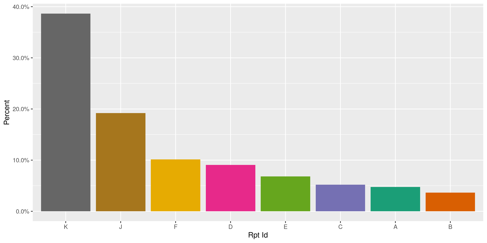
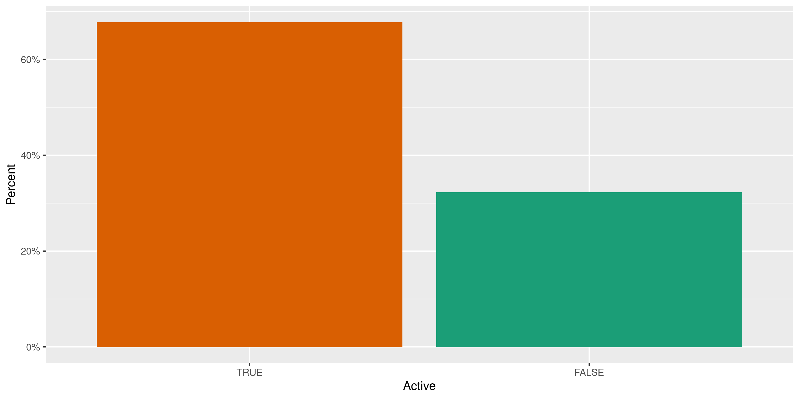
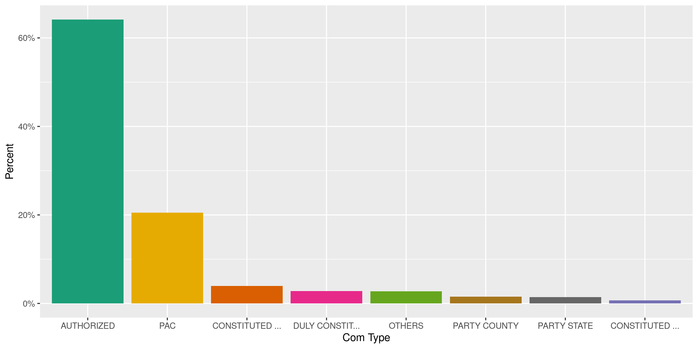
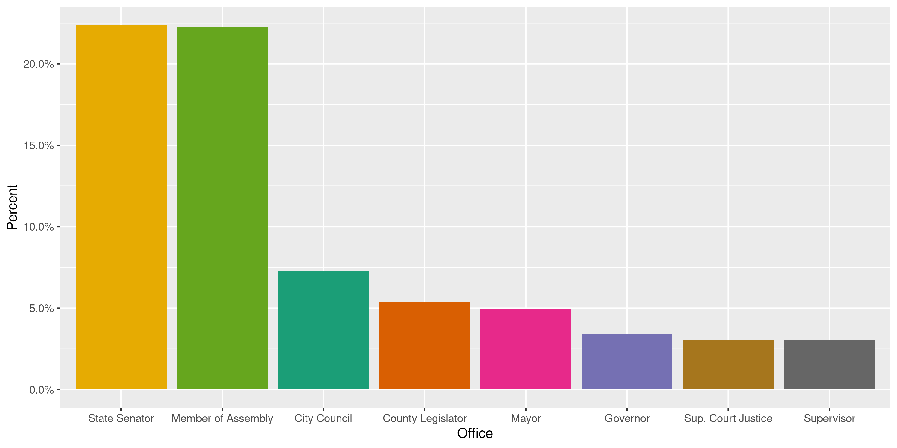
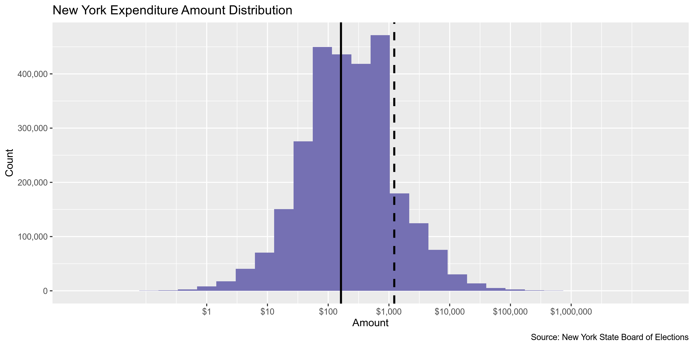
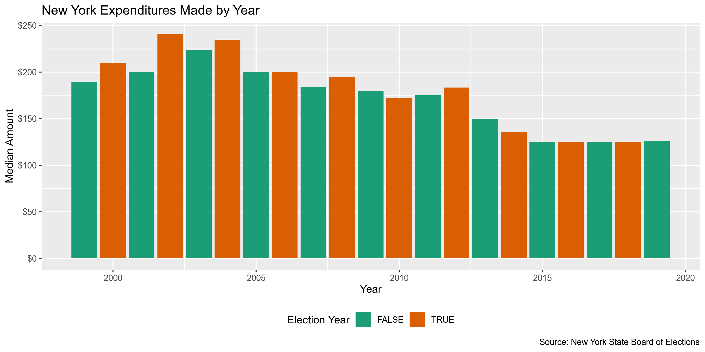
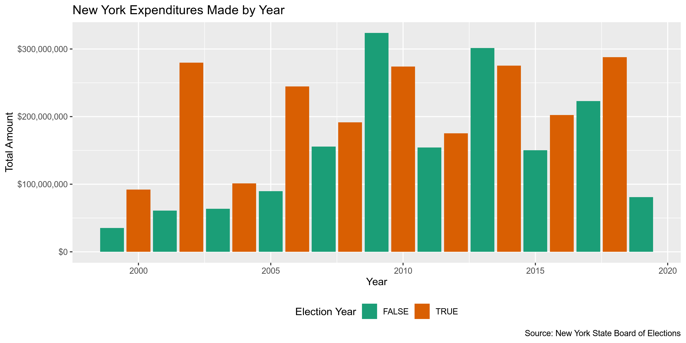
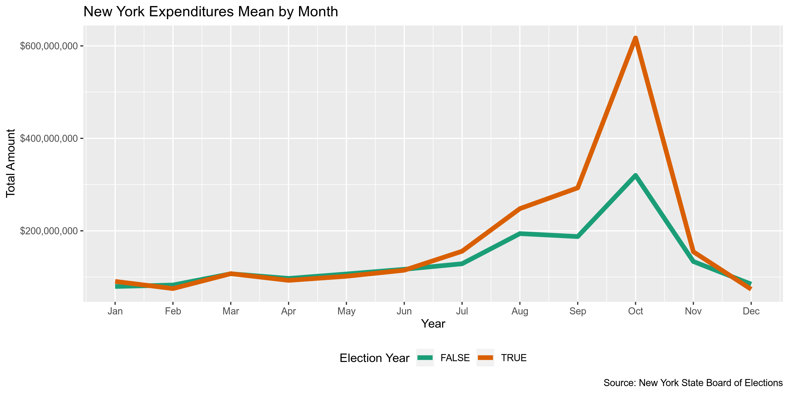
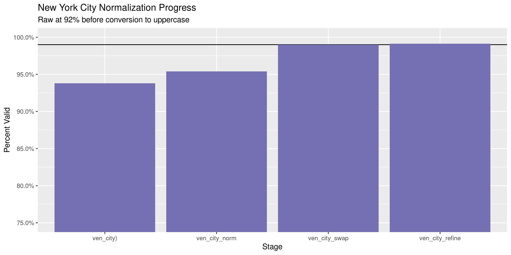
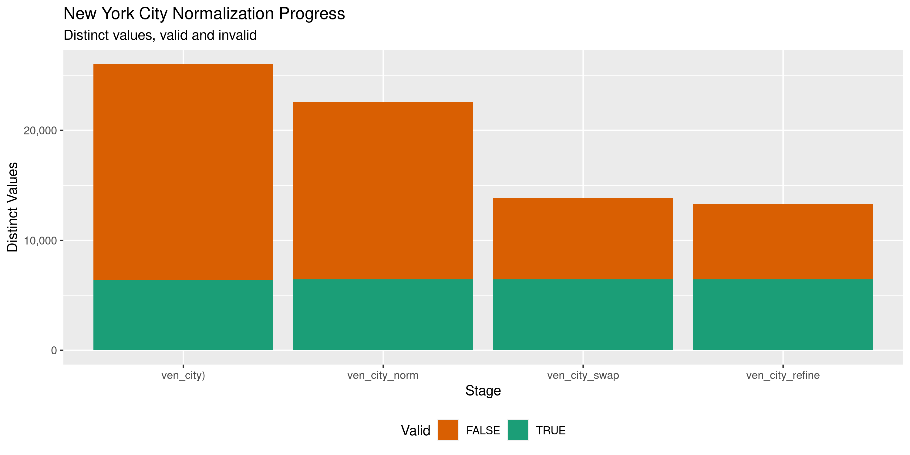

New York Expenditures
================
Kiernan Nicholls
2020-07-10 18:56:07

  - [Project](#project)
  - [Objectives](#objectives)
  - [Packages](#packages)
  - [Data](#data)
  - [Download](#download)
  - [Extract](#extract)
  - [About](#about)
  - [Fix](#fix)
  - [Read](#read)
  - [Join](#join)
  - [Explore](#explore)
  - [Wrangle](#wrangle)
  - [Conclude](#conclude)
  - [Export](#export)
  - [Upload](#upload)
  - [Dictionary](#dictionary)

<!-- Place comments regarding knitting here -->

## Project

The Accountability Project is an effort to cut across data silos and
give journalists, policy professionals, activists, and the public at
large a simple way to search across huge volumes of public data about
people and organizations.

Our goal is to standardizing public data on a few key fields by thinking
of each dataset row as a transaction. For each transaction there should
be (at least) 3 variables:

1.  All **parties** to a transaction.
2.  The **date** of the transaction.
3.  The **amount** of money involved.

## Objectives

This document describes the process used to complete the following
objectives:

1.  How many records are in the database?
2.  Check for entirely duplicated records.
3.  Check ranges of continuous variables.
4.  Is there anything blank or missing?
5.  Check for consistency issues.
6.  Create a five-digit ZIP Code called `zip`.
7.  Create a `year` field from the transaction date.
8.  Make sure there is data on both parties to a transaction.

## Packages

The following packages are needed to collect, manipulate, visualize,
analyze, and communicate these results. The `pacman` package will
facilitate their installation and attachment.

The IRW’s `campfin` package will also have to be installed from GitHub.
This package contains functions custom made to help facilitate the
processing of campaign finance data.

``` r
if (!require("pacman")) install.packages("pacman")
pacman::p_load_gh("irworkshop/campfin")
pacman::p_load(
  tidyverse, # data manipulation
  lubridate, # datetime strings
  gluedown, # printing markdown
  janitor, # clean data frames
  refinr, # cluster and merge
  scales, # format strings
  knitr, # knit documents
  vroom, # read files fast
  rvest, # html scraping
  glue, # combine strings
  here, # relative paths
  httr, # http requests
  fs # local storage 
)
```

This document should be run as part of the `R_campfin` project, which
lives as a sub-directory of the more general, language-agnostic
[`irworkshop/accountability_datacleaning`](https://github.com/irworkshop/accountability_datacleaning)
GitHub repository.

The `R_campfin` project uses the [RStudio
projects](https://support.rstudio.com/hc/en-us/articles/200526207-Using-Projects)
feature and should be run as such. The project also uses the dynamic
`here::here()` tool for file paths relative to *your* machine.

``` r
# where does this document knit?
here::here()
#> [1] "/home/kiernan/Code/tap/R_campfin"
```

## Data

Data is obtained from the [New York State Board of
Elections](https://www.elections.ny.gov/INDEX.html) (SBOE).

> The State Board of Elections was established in the Executive
> Department June 1, 1974 as a bipartisan agency vested with the
> responsibility for administration and enforcement of all laws relating
> to elections in New York State. The Board is also responsible for
> regulating disclosure and limitations of a Fair Campaign Code intended
> to govern campaign practices. In conducting these wide-ranging
> responsibilities, the Board offers assistance to local election boards
> and investigates complaints of possible statutory violations. In
> addition to the regulatory and enforcement responsibilities the board
> is charged with the preservation of citizen confidence in the
> democratic process and enhancement in voter participation in
> elections.

The NYSBOE database can be obtained from their Campaign Finance
[disclosure reports
page](https://www.elections.ny.gov/CFViewReports.html). On that page,
they elaborate on the availability and accuracy of the website.

> ### Data Availability
> 
> This database contains all financial disclosure reports filed with
> NYSBOE from July of 1999 to the present. Financial disclosure reports
> filed prior to the 1999 July Periodic report are either on file with
> the New York State Archives or in storage with the New York State
> Board of Elections. For further information or to obtain copies of
> these archived or stored filings, please call 1-800-458-3453. Each
> page costs 25¢ plus postage and copy orders must be prepaid.
> 
> Electronically filed disclosure reports are generally available in the
> database on the day they are received. A small number of candidates
> and committees are either statutorily exempt or have applied for and
> obtained exemptions from electronic filing. These filers will continue
> filing on paper and their disclosure reports will become available as
> they are manually entered into the database by NYSBOE staff.

> ### Data Accuracy
> 
> The majority of financial disclosure reports filed at NYSBOE are
> entered into the database directly from e-mail, diskette, CD or DVD
> filings submitted by committee treasurers or candidates. The
> information contained in paper filings will be entered into the
> database exactly as it appears on the forms. Because database searches
> retrieve information exactly the way it is reported and then entered
> into the database, search results may be inaccurate and/or incomplete.
> This will occur, for example, if filers do not adhere to the required
> format, do not use the proper codes, misspell words or leave items
> blank. Although NYSBOE carefully reviews disclosure reports and
> requires treasurers to submit amended reports as needed, there will
> necessarily be delays before the review process is completed and the
> information in the database is corrected.

The page also describes the format of their campaign finance database.

> ### Database Files in ASCII Delimited Format
> 
> **Updated data files are uploaded during active filing periods after
> 4:00 P.M. daily until the filing is complete.**
> 
> **Note:** To match the filing data files to Filer Names by filer ID
> you will need to [Download the Filer data
> file](https://cfapp.elections.ny.gov/NYSBOE/download/ZipDataFiles/commcand.zip).
> Commcand.zip is a zipped file containing the data file (commcand.asc)
> in ASCII delimited and two text files. (filerec.txt contains the data
> file layout - codes.txt explains the codes used in the data file).
> 
> **All downloadable files are zipped files containing a data file in
> ASCII delimited format and two text files. (efsrecb.txt contains the
> data file layout - efssched.txt explains the different schedules as
> they apply to the database).**
> 
> [Download Data file containing ALL
> filings](https://cfapp.elections.ny.gov/NYSBOE/download/ZipDataFiles/ALL_REPORTS.zip).
> **Note:** This file is a large file (238,994 KB) that contains over 6
> million records. Do not attempt to download this file unless you have
> a database to download the file to.

## Download

We can use the link above to download a copy of the NYSBOE database to
the `/data/raw` directory.

``` r
raw_dir <- dir_create(here("ny", "expends", "data", "raw"))
```

First, we will download the `ALL_REPORTS.zip` file.

``` r
sboe_url <- "https://cfapp.elections.ny.gov/NYSBOE/download/ZipDataFiles/"
zip_url <- str_c(sboe_url, "ALL_REPORTS.zip")
zip_path <- path(raw_dir, basename(zip_url))
```

Like they suggest, we will double check the size of the file before
downloading.

``` r
url_file_size(zip_url)
#> 366M
```

``` r
if (!file_exists(zip_path)) {
  download.file(
    url = zip_url,
    destfile = zip_path
  )
}
```

## Extract

If the `ALL_REPORTS.zip` file hasn’t yet been unziped, we can do so now
with `unzip()`. First, we will list the files in the ZIP archive.

``` r
(zip_content <- zip_path %>% 
  unzip(list = TRUE) %>% 
  as_tibble(.name_repair = make_clean_names) %>% 
  mutate(across(length, as_fs_bytes)))
#> # A tibble: 3 x 3
#>   name                 length date               
#>   <chr>           <fs::bytes> <dttm>             
#> 1 EFSRECB.TXT           2.56K 2020-07-07 22:13:00
#> 2 EFSSCHED.TXT         13.85K 2020-07-07 22:13:00
#> 3 ALL_REPORTS.out        2.5G 2020-07-07 22:13:00
```

``` r
if (length(dir_ls(raw_dir)) == 0) {
  unzip(
    zipfile = zip_path,
    exdir = raw_dir,
    overwrite = TRUE
  )
}
```

## About

We can use the `EFSRECB.TXT` file to understand the layout and format of
the raw data file. This will help us read it properly.

``` r
layout_file <- path(raw_dir, "EFSRECB.TXT")
efsrecb <- read_lines(
  file = layout_file, 
  skip_empty_rows = TRUE
)
```

First, we see the table describing the columns with their format and
type.

| FIELD               | LOCATION | TYPE    | FORMAT                  |
| :------------------ | :------- | :------ | :---------------------- |
| FILER\_ID           | 01       | CHAR    |                         |
| FREPORT\_ID         | 02       | CHAR    |                         |
| TRANSACTION\_CODE   | 03       | CHAR    |                         |
| E\_YEAR             | 04       | CHAR    |                         |
| T3\_TRID            | 05       | INTEGER |                         |
| DATE1               | 06       | DATE    | ‘MM/DD/YYYY’            |
| DATE2               | 07       | DATE    | ‘MM/DD/YYYY’            |
| CONTRIB\_CODE       | 08       | CHAR    |                         |
| CONTRIB\_TYPE\_CODE | 09       | CHAR    |                         |
| CORP                | 10       | CHAR    |                         |
| FIRST\_ME           | 11       | CHAR    |                         |
| MID\_INIT           | 12       | CHAR    |                         |
| LAST\_ME            | 13       | CHAR    |                         |
| ADDR\_50            | 14       | CHAR    |                         |
| CITY                | 15       | CHAR    |                         |
| STATE               | 16       | CHAR    |                         |
| ZIP                 | 17       | CHAR    |                         |
| CHECK\_NO           | 18       | CHAR    |                         |
| CHECK\_DATE         | 19       | DATE    | ‘MM/DD/YYYY’            |
| AMOUNT              | 20       | FLOAT   |                         |
| AMOUNT2             | 21       | FLOAT   |                         |
| DESCRIPTION         | 22       | CHAR    |                         |
| OTHER\_RECPT\_CODE  | 23       | CHAR    |                         |
| PURPOSE\_CODE1      | 24       | CHAR    |                         |
| PURPOSE\_CODE2      | 25       | CHAR    |                         |
| EXPLATION           | 26       | CHAR    |                         |
| XFER\_TYPE          | 27       | CHAR    |                         |
| CHKBOX              | 28       | CHAR    |                         |
| CREREC\_UID         | 29       | CHAR    |                         |
| CREREC\_DATE        | 30       | DATE    | ‘MM/DD/YYYY HH24:MI:SS’ |

    #> $field_separator
    #> [1] ,
    #> 
    #> $field_start_delimiter
    #> [1] "
    #> 
    #> $field_end_delimiter
    #> [1] "
    #> 
    #> $field_delimit_style
    #> [1] all
    #> 
    #> $strip_leading_blanks
    #> [1] TRUE
    #> 
    #> $strip_trailing_blanks
    #> [1] TRUE

From the `EFSSCHED.TXT` file, we know Schedule L records contain the
expenditures we are interested in.

``` r
sched_file <- path(raw_dir, "EFSSCHED.TXT")
efssched <- read_lines(sched_file, skip_empty_rows = TRUE)
```

| Schedule | Description                                      |
| :------- | :----------------------------------------------- |
| A        | Monetary Contributions/Individual & Partnerships |
| B        | Monetary Contributions/Corporate                 |
| C        | Monetary Contributions/All Other                 |
| D        | In-Kind Contributions                            |
| E        | Other Receipts                                   |
| F        | Expenditure/Payments                             |
| G        | Transfers In                                     |
| H        | Transfers Out                                    |
| I        | Loans Received                                   |
| J        | Loan Repayments                                  |
| K        | Liabilities/Loans Forgiven                       |
| L        | Expenditure Refunds                              |
| M        | Contributions Refunded                           |
| N        | Outstanding Liabilities                          |
| O        | Partners / Subcontracts                          |
| P        | Non Campaign Housekeeping Receipts               |
| Q        | Non Campaign Housekeeping Expenses               |
| X        | A No Activity Statement Was Submitted            |
| Y        | A In-Lieu-Of Statement Was Submitted             |

``` 
FIELD NAMES     A  B  C D  E  F  G  H  I  J K  L  M  N  O  P Q
--------------------------------------------------------------
DATE1           X  X  X X  X  X  X  X  X  X X  X  X  X     X X
DATE2                                       X  X  X
CONTRIB_CODE    X       X                               X  X
CONTRIB_TYPE            X
CORP            X  X  X X  X  X  X  X  X  X X  X  X  X  X  X X
FIRST_NAME      X       X                                  X
MID_INIT        X       X                                  X
LAST_NAME       X       X                                  X
ADDR            X  X  X X  X  X  X  X  X  X X  X  X  X     X X
CITY            X  X  X X  X  X  X  X  X  X X  X  X  X     X X
STATE           X  X  X X  X  X  X  X  X  X X  X  X  X     X X
ZIP             X  X  X X  X  X  X  X  X  X X  X  X  X     X X
CHECK_NO        X  X  X       X  X  X     X       X        X X
CHECK_DATE                                X
AMOUNT          X  X  X X  X  X  X  X  X  X X  X  X  X     X X
AMOUNT2                                     X        X  X
DESCRIPTION             X
OTHER_RECPT                X
PURPOSE_CODE1                 X                      X  X
PURPOSE_CODE2                                                X
EXPLANATION                   X                      X  X    X
XFER_TYPE                        X  X
CHKBOX                                 X                      
```

## Fix

``` r
out_file <- path(raw_dir, "ALL_REPORTS.out")
fix_file <- path(raw_dir, "FIX_REPORTS.out")
if (!file_exists(fix_file)) {
  read_lines(out_file) %>% 
    str_replace_all('"""(\\w+),"""', "\"\\1\"") %>%
    str_replace_all("(?<!,)\"\"(?!,)", "'") %>%
    str_replace_all("(?<=,)\"\"(?!,|$)", "\"") %>% 
    str_replace_all("(?<!,|^)\"\"(?=,)", "\"") %>% 
    str_replace_all("(?=!\",)\"\"\"(?=,\")", "\"\"") %>% 
    str_replace_all("(?=!\",)\"(?=,\")", "\"\"") %>% 
    str_replace_all("(?<!^|,)\"(?!,(?=\")|$)", "'") %>%
    write_lines(fix_file)
  Sys.sleep(10); flush_memory()
}
```

## Read

First, we’ll read the `ALL_REPORTS.out` text file containing, well, all
reports.

``` r
nye <- read_delim( # 12,037,086
  file = fix_file, 
  delim = ",", 
  col_names = ny_names,
  escape_double = TRUE,
  escape_backslash = FALSE,
  col_types = cols(
    .default = col_character(),
    eyear = col_integer(),
    date = col_date("%m/%d/%Y"),
    date2 = col_date("%m/%d/%Y"),
    amount = col_double(),
    amount2 = col_double(),
    crerec_date = col_datetime("%m/%d/%Y %H:%M:%S")
  )
)
```

``` r
# two problems left
# first encoding
# second one last quote
select(problems(nye), -file)
#> # A tibble: 4 x 4
#>       row col         expected                    actual                  
#>     <int> <chr>       <chr>                       <chr>                   
#> 1  414342 corp        delimiter or quote          "A"                     
#> 2  414342 <NA>        30 columns                  "39 columns"            
#> 3 2676684 crerec_date delimiter or quote          "0"                     
#> 4 2676684 crerec_date date like %m/%d/%Y %H:%M:%S ",\"07/20/2001 14:02:14"
```

The New York campaign finance database is a single data frame with
13,408,543 rows and 30 columns. This data frame contains data for *all*
campaign finance. We will filter out any transaction that is not an
expenditure.

``` r
# filter only expenditures
expend_sched <- out_scheds$sched[str_which(out_scheds$desc, "Expenditure")]
all_rows <- nrow(nye)
nye <- filter(nye, xfer_code %in% expend_sched)
percent(nrow(nye)/all_rows, 0.1)
#> [1] "24.3%"
flush_memory()
```

We can remove any columns not relevant to schedules F and L via
`EFSSCHED.TXT`.

``` r
(sched_cols <- which(out_cols$f == "X" | out_cols$l == "X"))
#>  [1]  1  2  5  9 10 11 12 13 15 19 21
nye <- select(nye, c(1:5, sched_cols + 5))
```

``` r
head(nye)
#> # A tibble: 6 x 16
#>   filer_id rpt_id xfer_code eyear t3_trid date       date2      corp  addr  city  state zip  
#>   <chr>    <chr>  <chr>     <int> <chr>   <date>     <date>     <chr> <chr> <chr> <chr> <chr>
#> 1 A00052   K      F          2008 5704    2003-05-01 NA         EMIG… 5 EA… NEW … NY    10017
#> 2 A00052   J      L          2009 5705    2008-08-08 2008-05-01 EMIG… 5 EA… NEW … NY    10017
#> 3 A00075   K      F          1999 5285    1999-04-09 NA         NY L… 6 CH… GUIL… NY    12084
#> 4 A00075   J      F          2000 1544    1999-11-16 NA         WOOD… 914 … BATO… LA    70806
#> 5 A00075   K      F          2003 1546    2003-02-11 NA         WEBS… 1747… WASH… DC    20006
#> 6 A00075   K      F          2003 1547    2003-03-10 NA         CITI… 16-1… GREE… CT    06830
#> # … with 4 more variables: check_no <chr>, amount <dbl>, purpose1 <chr>, explain <chr>
```

## Join

Now we must use the separate `commcand.zip` file to add information on
the *filers* of the expenditure reports. This file can similarly be
downloaded from the SBOE, extracted, and read as was done by with the
reports file.

``` r
com_url <- str_c(sboe_url, "commcand.zip")
com_zip <- path(raw_dir, basename(com_url))
if (!file_exists(com_zip)) {
  download.file(com_url, com_zip)
}
```

    #> # A tibble: 3 x 3
    #>   name              length date               
    #>   <chr>        <fs::bytes> <dttm>             
    #> 1 CODES.TXT          3.14K 2020-07-09 22:26:00
    #> 2 FILEREC.TXT        1.22K 2020-07-09 22:26:00
    #> 3 COMMCAND.txt       5.87M 2020-07-09 22:26:00

``` r
com_files <- unzip(
  zipfile = com_zip,
  exdir = raw_dir,
  overwrite = TRUE
)
```

First, we can read `FILEREC.TXT` which lists filers by their `filer_id`.

``` r
fil_path <- path(raw_dir, "FILEREC.TXT")
fil_layout <- read_lines(fil_path)
fil_layout <- clean_names(read_table(fil_layout[8:22]))
fil_layout$field <- make_clean_names(fil_layout$field)
kable(fil_layout)
```

| field              | location | type    |
| :----------------- | :------- | :------ |
| filer\_id          | 01       | CHAR    |
| filer\_name        | 02       | CHAR    |
| filer\_type        | 03       | CHAR    |
| status             | 04       | CHAR    |
| committee\_type    | 05       | CHAR    |
| office             | 06       | INTEGER |
| district           | 07       | INTEGER |
| treas\_first\_name | 08       | CHAR    |
| treas\_last\_name  | 09       | CHAR    |
| address            | 10       | CHAR    |
| city               | 11       | CHAR    |
| state              | 12       | CHAR    |
| zip                | 13       | CHAR    |

``` r
(commcand <- raw_dir %>% 
  path("COMMCAND.txt") %>% 
  read_lines() %>% 
  # fix quote issues
  str_replace_all("(?<!,|^)\"(?!,|$)", "'") %>% 
  read_delim(
    delim = ",",
    col_names = fil_layout$field,
    col_types = cols(
      .default = col_character(),
      district = col_integer(),
      office = col_integer()
    )
  ))
#> # A tibble: 46,027 x 13
#>    filer_id filer_name filer_type status committee_type office district treas_first_name
#>    <chr>    <chr>      <chr>      <chr>  <chr>           <int>    <int> <chr>           
#>  1 C99295   FRIENDS O… COMMITTEE  INACT… 1                  24       NA DANIEL          
#>  2 C99294   I. DANEEK… CANDIDATE  ACTIVE <NA>               32       27 I.              
#>  3 C99293   FRIENDS O… COMMITTEE  ACTIVE 1                  32       27 MARK            
#>  4 C99292   DEBRA LYN… CANDIDATE  INACT… <NA>               57       NA DEBRA           
#>  5 C99291   COMMITTEE… COMMITTEE  INACT… 1                  57       NA DAVID           
#>  6 C99290   DR. BOLA … CANDIDATE  ACTIVE <NA>               32       16 DR. BOLA        
#>  7 C99289   FRIENDS O… COMMITTEE  ACTIVE 1                  32       16 ANTHONY         
#>  8 C99287   ADAM SILV… CANDIDATE  INACT… <NA>               60        2 ADAM            
#>  9 C99286   FRIENDS O… COMMITTEE  INACT… 1                  60        2 PAUL            
#> 10 C99285   ARI KAGAN  CANDIDATE  INACT… <NA>               32       48 ARI             
#> # … with 46,017 more rows, and 5 more variables: treas_last_name <chr>, address <chr>, city <chr>,
#> #   state <chr>, zip <chr>
```

Then, we can read the various other files used to define the codes in
the `COMMCAND.txt` file.

``` r
code_file <- path(raw_dir, "CODES.TXT")
codes <- str_remove(read_lines(code_file), "^\t|\\s+")
```

``` r
off_codes <- read_tsv(
  file = str_replace(codes[9:83], "\\s", "\t"), 
  col_names = c("office_code", "office"),
  col_types = cols(
    office_code = col_integer()
  )
)
```

``` r
dis_codes <- codes[88:90] %>% 
  str_replace("\\s+(?=\\d)", "\t") %>% 
  read_tsv(col_names = c("district_type", "range")) %>% 
  # convert to long format
  separate(range, c("a", "b"), convert = TRUE) %>% 
  rowwise() %>% 
  mutate(district = list(seq(a, b))) %>% 
  unnest(district) %>% 
  select(district, district_type) %>% 
  mutate(across(district_type, str_remove, "\\s.*"))
```

``` r
com_codes <- read_tsv(
  file = codes[96:116], 
  col_names = c("committee_code", "com_type")
)
```

``` r
rpt_codes <- str_replace(codes[121:136], "\\s{4}", "\t")
rpt_codes <- read_tsv(rpt_codes, col_names = c("code", "report"))
```

Now these codes can be joined to the filers data frame and the column
names can be clarified for joining to the reports data.

``` r
commcand <- commcand %>% 
  left_join(off_codes, by = c("office" = "office_code")) %>% 
  select(-office, office = office.y) %>% 
  relocate(office, .before = district) %>% 
  rename(committee_code = committee_type) %>% 
  left_join(com_codes) %>% 
  relocate(com_type, .after = committee_code) %>% 
  select(-committee_code) %>% 
  rename_with(~str_c("fil_", .), 10:13) %>% 
  rename_with(~str_replace(., "filer_", "fil_")) %>% 
  rename_with(~str_remove(., "_name"), 8:9) %>% 
  mutate(active = status == "ACTIVE", .keep = "unused", .after = fil_type) %>%
  rename(fil_addr = fil_address) %>% 
  filter(fil_id %in% nye$filer_id)
```

Now that the `COMMCAND.txt` file is complete, we can join it onto the
reports data frame, clarifying which columns belong to filers and which
to vendors.

``` r
nye <- nye %>% 
  rename(ven_name = corp, fil_id = filer_id) %>% 
  rename_with(~str_c("ven_", .), 9:12) %>% 
  left_join(commcand, by = "fil_id")
```

## Explore

``` r
glimpse(nye)
#> Rows: 3,261,213
#> Columns: 28
#> $ fil_id      <chr> "A00052", "A00052", "A00075", "A00075", "A00075", "A00075", "A00075", "A0007…
#> $ rpt_id      <chr> "K", "J", "K", "J", "K", "K", "J", "K", "K", "K", "K", "K", "K", "K", "K", "…
#> $ xfer_code   <chr> "F", "L", "F", "F", "F", "F", "F", "F", "F", "F", "F", "F", "F", "F", "F", "…
#> $ eyear       <int> 2008, 2009, 1999, 2000, 2003, 2003, 2004, 1999, 1999, 1999, 1999, 1999, 1999…
#> $ t3_trid     <chr> "5704", "5705", "5285", "1544", "1546", "1547", "1549", "3086", "3087", "308…
#> $ date        <date> 2003-05-01, 2008-08-08, 1999-04-09, 1999-11-16, 2003-02-11, 2003-03-10, 200…
#> $ date2       <date> NA, 2008-05-01, NA, NA, NA, NA, NA, NA, NA, NA, NA, NA, NA, NA, NA, NA, NA,…
#> $ ven_name    <chr> "EMIGRANT BANK", "EMIGRANT BANK", "NY LEGAL PUBLISHING CORP", "WOODY JENKINS…
#> $ ven_addr    <chr> "5 EAST 42ND STREET", "5 EAST 42ND STREET", "6 CHARLES STREET", "914 NORTH F…
#> $ ven_city    <chr> "NEW YORK", "NEW YORK", "GUILDERLAND", "BATON ROUGE", "WASHINGTON", "GREENWI…
#> $ ven_state   <chr> "NY", "NY", "NY", "LA", "DC", "CT", "CT", "NY", "NY", "NY", "NY", "NY", "NY"…
#> $ ven_zip     <chr> "10017", "10017", "12084", "70806", "20006", "06830", "06830", "10014", "100…
#> $ check_no    <chr> NA, NA, "105", "106", "107", NA, NA, NA, NA, NA, NA, NA, "489", "485", "490"…
#> $ amount      <dbl> 2.00, 2.00, 40.00, 2000.00, 709.90, 99.30, 30.28, 16.49, 12.52, 20.15, 20.00…
#> $ purpose1    <chr> "SVC", NA, "OFFCE", "CNTRB", "OTHER", "OTHER", "OTHER", "OTHER", "OTHER", "O…
#> $ explain     <chr> "SERVICE CHARGE ON SAVINGS ACCOUNT", NA, "BYER'S ELECTION LAW", NA, "LEGAL F…
#> $ fil_name    <chr> "EMIGRANT BANK POLITICAL ACTION COMMITTEE (EMPAC)", "EMIGRANT BANK POLITICAL…
#> $ fil_type    <chr> "COMMITTEE", "COMMITTEE", "COMMITTEE", "COMMITTEE", "COMMITTEE", "COMMITTEE"…
#> $ active      <lgl> TRUE, TRUE, FALSE, FALSE, FALSE, FALSE, FALSE, FALSE, FALSE, FALSE, FALSE, F…
#> $ com_type    <chr> "PAC", "PAC", "OTHERS", "OTHERS", "OTHERS", "OTHERS", "OTHERS", "PAC", "PAC"…
#> $ office      <chr> NA, NA, NA, NA, NA, NA, NA, NA, NA, NA, NA, NA, NA, NA, NA, NA, NA, NA, NA, …
#> $ district    <int> NA, NA, NA, NA, NA, NA, NA, NA, NA, NA, NA, NA, NA, NA, NA, NA, NA, NA, NA, …
#> $ treas_first <chr> "DOUGLAS", "DOUGLAS", "STEPHEN", "STEPHEN", "STEPHEN", "STEPHEN", "STEPHEN",…
#> $ treas_last  <chr> "MCCLINTOCK", "MCCLINTOCK", "SZYMANSKI", "SZYMANSKI", "SZYMANSKI", "SZYMANSK…
#> $ fil_addr    <chr> "5 HAMILTON ROAD", "5 HAMILTON ROAD", "ONE FAWCETT PLACE, SUITE 130", "ONE F…
#> $ fil_city    <chr> "SCARSDALE", "SCARSDALE", "GREENWICH", "GREENWICH", "GREENWICH", "GREENWICH"…
#> $ fil_state   <chr> "NY", "NY", "CT", "CT", "CT", "CT", "CT", "CT", "CT", "CT", "CT", "CT", "CT"…
#> $ fil_zip     <chr> "10583", "10583", "06830-", "06830-", "06830-", "06830-", "06830-", "06830",…
tail(nye)
#> # A tibble: 6 x 28
#>   fil_id rpt_id xfer_code eyear t3_trid date       date2      ven_name ven_addr ven_city ven_state
#>   <chr>  <chr>  <chr>     <int> <chr>   <date>     <date>     <chr>    <chr>    <chr>    <chr>    
#> 1 C99295 K      F          2018 2       2018-06-04 NA         BRINDIS… PO BOX … UTICA    NY       
#> 2 C99295 K      F          2018 3       2018-06-11 NA         FRIENDS… PO BOX … ROME     NY       
#> 3 C99295 K      F          2018 4       2018-07-11 NA         FRIENDS… PO BOX … ROME     NY       
#> 4 C99295 K      F          2019 1       2019-04-12 NA         REPUB O… P.O. BO… UTICA    NY       
#> 5 C99295 K      F          2019 2       2019-05-08 NA         FRIENDS… 7 SANGE… NEW HAR… NY       
#> 6 C99295 K      F          2019 3       2019-05-08 NA         REPUBL.… P.O. BO… UTICA    NY       
#> # … with 17 more variables: ven_zip <chr>, check_no <chr>, amount <dbl>, purpose1 <chr>,
#> #   explain <chr>, fil_name <chr>, fil_type <chr>, active <lgl>, com_type <chr>, office <chr>,
#> #   district <int>, treas_first <chr>, treas_last <chr>, fil_addr <chr>, fil_city <chr>,
#> #   fil_state <chr>, fil_zip <chr>
```

### Missing

``` r
col_stats(nye, count_na)
#> # A tibble: 28 x 4
#>    col         class        n         p
#>    <chr>       <chr>    <int>     <dbl>
#>  1 fil_id      <chr>        0 0        
#>  2 rpt_id      <chr>        0 0        
#>  3 xfer_code   <chr>        0 0        
#>  4 eyear       <int>        0 0        
#>  5 t3_trid     <chr>      287 0.0000880
#>  6 date        <date>     243 0.0000745
#>  7 date2       <date> 3229855 0.990    
#>  8 ven_name    <chr>     2309 0.000708 
#>  9 ven_addr    <chr>   331590 0.102    
#> 10 ven_city    <chr>   256652 0.0787   
#> 11 ven_state   <chr>   247850 0.0760   
#> 12 ven_zip     <chr>   317002 0.0972   
#> 13 check_no    <chr>   191188 0.0586   
#> 14 amount      <dbl>    13666 0.00419  
#> 15 purpose1    <chr>    51927 0.0159   
#> 16 explain     <chr>  1424357 0.437    
#> 17 fil_name    <chr>        0 0        
#> 18 fil_type    <chr>        0 0        
#> 19 active      <lgl>        0 0        
#> 20 com_type    <chr>    32386 0.00993  
#> 21 office      <chr>  1206791 0.370    
#> 22 district    <int>  1945112 0.596    
#> 23 treas_first <chr>       74 0.0000227
#> 24 treas_last  <chr>       74 0.0000227
#> 25 fil_addr    <chr>     3624 0.00111  
#> 26 fil_city    <chr>      572 0.000175 
#> 27 fil_state   <chr>     1055 0.000323 
#> 28 fil_zip     <chr>      573 0.000176
```

``` r
key_vars <- c("ven_name", "fil_name", "amount", "date")
nye <- nye %>% flag_na(all_of(key_vars))
percent(mean(nye$na_flag), 0.01)
#> [1] "0.50%"
```

``` r
nye %>% 
  filter(na_flag) %>% 
  select(all_of(key_vars)) %>% 
  sample_frac()
#> # A tibble: 16,213 x 4
#>    ven_name                     fil_name                                  amount date      
#>    <chr>                        <chr>                                      <dbl> <date>    
#>  1 STAPLES                      TOWN OF KINDERHOOK DEMOCRATIC COMMITTEE       NA 2012-11-06
#>  2 LADAKINS                     FRIENDS OF JUDY PASCALE                       NA 2012-04-23
#>  3 ONTARIO REPUBLICAN GUIDE     REPUBLICAN TOWN COMMITTEE OF FARMINGTON       NA 2011-11-21
#>  4 PAESAN'S PIZZA               FRIENDS OF HELENE WEINSTEIN #7                NA 2012-02-28
#>  5 MENTAL HEALTH ASSOCIATION    FRIENDS OF PATRICIA RITCHIE                   NA 2012-05-25
#>  6 SOUTHBAY DINER               FRIENDS OF STEVE BELLONE                      NA 2011-10-20
#>  7 IL COLOSSEO                  ABBATE FOR ASSEMBLY                           NA 2013-03-02
#>  8 ASURION INSURANCE            FRIENDS OF STEVEN CYMBROWITZ                  NA 2013-08-19
#>  9 UNITED STATES POSTAL SERVICE TOWN OF SHAWANGUNK REPUBLICAN COMMITTEE       NA 2017-11-15
#> 10 AT&T                         WORKING FAMILIES PARTY CAMPAIGN COMMITTEE     NA 2012-09-14
#> # … with 16,203 more rows
```

### Duplicate

``` r
d1 <- duplicated(nye, fromLast = FALSE)
d2 <- duplicated(nye, fromLast = TRUE)
nye <- mutate(nye, dupe_flag = d1 | d2)
rm(d1, d2); flush_memory()
mean(nye$dupe_flag)
#> [1] 0.0001717152
```

``` r
nye %>% 
  filter(dupe_flag) %>% 
  select(all_of(key_vars))
#> # A tibble: 560 x 4
#>    ven_name                           fil_name                  amount date      
#>    <chr>                              <chr>                      <dbl> <date>    
#>  1 NY ACCESS TO ABORTION FUND         FRIENDS OF DICK GOTTFRIED    100 2004-07-28
#>  2 NY ACCESS TO ABORTION FUND         FRIENDS OF DICK GOTTFRIED    100 2004-07-28
#>  3 EMPIRE STATE PRIDE AGENDA          FRIENDS OF DICK GOTTFRIED    500 2004-08-04
#>  4 EMPIRE STATE PRIDE AGENDA          FRIENDS OF DICK GOTTFRIED    500 2004-08-04
#>  5 REZNICK MEDIA                      FRIENDS OF DICK GOTTFRIED    120 2004-08-11
#>  6 REZNICK MEDIA                      FRIENDS OF DICK GOTTFRIED    120 2004-08-11
#>  7 504 DEMOCRATIC CLUB                FRIENDS OF DICK GOTTFRIED    150 2004-08-11
#>  8 504 DEMOCRATIC CLUB                FRIENDS OF DICK GOTTFRIED    150 2004-08-11
#>  9 NY STATEWIDE SENIOR ACTION COUNCIL FRIENDS OF DICK GOTTFRIED    150 2004-08-11
#> 10 NY STATEWIDE SENIOR ACTION COUNCIL FRIENDS OF DICK GOTTFRIED    150 2004-08-11
#> # … with 550 more rows
```

### Categorical

``` r
col_stats(nye, n_distinct)
#> # A tibble: 30 x 4
#>    col         class       n           p
#>    <chr>       <chr>   <int>       <dbl>
#>  1 fil_id      <chr>   18877 0.00579    
#>  2 rpt_id      <chr>      12 0.00000368 
#>  3 xfer_code   <chr>       2 0.000000613
#>  4 eyear       <int>      23 0.00000705 
#>  5 t3_trid     <chr>  143800 0.0441     
#>  6 date        <date>  10439 0.00320    
#>  7 date2       <date>   6558 0.00201    
#>  8 ven_name    <chr>  627579 0.192      
#>  9 ven_addr    <chr>  600825 0.184      
#> 10 ven_city    <chr>   26015 0.00798    
#> 11 ven_state   <chr>     292 0.0000895  
#> 12 ven_zip     <chr>   20901 0.00641    
#> 13 check_no    <chr>  152986 0.0469     
#> 14 amount      <dbl>  216891 0.0665     
#> 15 purpose1    <chr>    1193 0.000366   
#> 16 explain     <chr>  615047 0.189      
#> 17 fil_name    <chr>   18203 0.00558    
#> 18 fil_type    <chr>       2 0.000000613
#> 19 active      <lgl>       2 0.000000613
#> 20 com_type    <chr>      21 0.00000644 
#> 21 office      <chr>      62 0.0000190  
#> 22 district    <int>     151 0.0000463  
#> 23 treas_first <chr>    2463 0.000755   
#> 24 treas_last  <chr>    9672 0.00297    
#> 25 fil_addr    <chr>   15915 0.00488    
#> 26 fil_city    <chr>    1744 0.000535   
#> 27 fil_state   <chr>      36 0.0000110  
#> 28 fil_zip     <chr>    2158 0.000662   
#> 29 na_flag     <lgl>       2 0.000000613
#> 30 dupe_flag   <lgl>       2 0.000000613
```

<!-- --><!-- --><!-- --><!-- -->

### Amount

``` r
summary(nye$amount)
#>     Min.  1st Qu.   Median     Mean  3rd Qu.     Max.     NA's 
#>  -100000       49      160     1217      500 16017780    13666
```

10% of `amount` values are zero.

``` r
mean(nye$amount <= 0, na.rm = TRUE)
#> [1] 0.09870373
```

The largest amount of $16,017,780 has an `explanation` of “Transfer.”

``` r
glimpse(nye[which.max(nye$amount), ])
#> Rows: 1
#> Columns: 30
#> $ fil_id      <chr> "A01578"
#> $ rpt_id      <chr> "L"
#> $ xfer_code   <chr> "F"
#> $ eyear       <int> 2014
#> $ t3_trid     <chr> "6510635"
#> $ date        <date> 2014-10-15
#> $ date2       <date> NA
#> $ ven_name    <chr> "INTERNATIONAL LONGSHOREMEN ASSOCIATION, AFL-CIO"
#> $ ven_addr    <chr> "815 16TH ST NW"
#> $ ven_city    <chr> "WASHINGTON"
#> $ ven_state   <chr> "DC"
#> $ ven_zip     <chr> "20006"
#> $ check_no    <chr> NA
#> $ amount      <dbl> 16017780
#> $ purpose1    <chr> "OTHER"
#> $ explain     <chr> "Transfer"
#> $ fil_name    <chr> "INTERNATIONAL LONGSHOREMEN'S ASSC, AFL-CIO COMMITTEE ON POLITICAL ED"
#> $ fil_type    <chr> "COMMITTEE"
#> $ active      <lgl> FALSE
#> $ com_type    <chr> "PAC"
#> $ office      <chr> NA
#> $ district    <int> NA
#> $ treas_first <chr> "ROBERT"
#> $ treas_last  <chr> "GLEASON"
#> $ fil_addr    <chr> "17 Battery Pl."
#> $ fil_city    <chr> "New York"
#> $ fil_state   <chr> "NY"
#> $ fil_zip     <chr> "10004"
#> $ na_flag     <lgl> FALSE
#> $ dupe_flag   <lgl> FALSE
```

<!-- -->

#### Date

We can add the calendar date of the expenditure with
`lubridate::year()`.

``` r
nye <- mutate(nye, year = year(date))
```

``` r
count_na(nye$year)
#> [1] 243
sum(nye$year < 1999, na.rm = TRUE)
#> [1] 4928
sum(nye$year > 2020, na.rm = TRUE)
#> [1] 29
```

``` r
nye <- nye %>% 
  mutate(
    date_flag = year < 1999 | year > 2020,
    date_clean = as_date(ifelse(date_flag, NA, date)),
    year_clean = year(date_clean)
  )
```

``` r
percent(mean(nye$date_flag, na.rm = TRUE), 0.01)
#> [1] "0.15%"
```

<!-- -->

<!-- -->

<!-- -->

``` r
nye %>% 
  filter(!date_flag) %>% 
  mutate(
    month = month(date_clean),
    even = is_even(year_clean)
  ) %>% 
  group_by(even, month) %>% 
  summarise(sum = sum(amount, na.rm = TRUE)) %>% 
  ggplot(aes(x = month, y = sum)) +
  geom_line(aes(color = even), size = 2) +
  scale_color_brewer(type = "qual", palette = "Dark2") +
  scale_y_continuous(labels = function(x) dollar(x/1e6)) +
  scale_x_continuous(breaks = 1:12, labels = month.abb) +
  theme(legend.position = "bottom") +
  labs(
    title = "New York Expenditures Mean by Month",
    x = "Year",
    y = "Total Amount (Million)",
    color = "Election Year",
    caption = "Source: New York State Board of Elections"
  )
```

<!-- -->

## Wrangle

To improve the searchability of the database, we will perform some
consistent, confident string normalization. For geographic variables
like city names and ZIP codes, the corresponding `campfin::normal_*()`
functions are tailor made to facilitate this process.

Each normalization will be applied to both `filer_*` and `vendor_*`
variables.

### Address

First, we will normalize the street address by removing punctuation and
abbreviating common USPS words.

``` r
nye <- mutate(
  .data = nye,
  across(
    .cols = ends_with("_addr"),
    .fns = list(norm = normal_address),
    abbs = usps_street,
    na_rep = TRUE
  )
)
```

We can see how this improves consistency across the address fields.

    #> # A tibble: 10 x 2
    #>    fil_addr                  fil_addr_norm         
    #>    <chr>                     <chr>                 
    #>  1 7 AMSTERSDAM DRIVE        7 AMSTERSDAM DR       
    #>  2 236 MAIN STREET           236 MAIN ST           
    #>  3 32 FREMONT ROAD           32 FREMONT RD         
    #>  4 5282 S. LIVONIA RD.       5282 S LIVONIA RD     
    #>  5 3822 CR 26                3822 CR 26            
    #>  6 2 VALEWOOD RUN            2 VALEWOOD RUN        
    #>  7 PO BOX 1093               PO BOX 1093           
    #>  8 C/O GELLER & COMPANY      CO GELLER AND COMPANY 
    #>  9 1505 LEXINGTON AVENUE #2C 1505 LEXINGTON AVE 2 C
    #> 10 25 OVERLOOK DRIVE         25 OVERLOOK DR

### ZIP

We can `*_zip` by lopping off the uncommon four-digit extensions and
removing common invalid codes like 00000 and 99999.

``` r
nye <- mutate(
  .data = nye,
  across(
    .cols = ends_with("zip"),
    .fns = list(norm = normal_zip),
    na_rep = TRUE
  )
)
```

This brings our valid percentage to 99.97%.

``` r
progress_table(
  nye$ven_zip,
  nye$ven_zip_norm,
  compare = valid_zip
)
#> # A tibble: 2 x 6
#>   stage        prop_in n_distinct prop_na n_out n_diff
#>   <chr>          <dbl>      <dbl>   <dbl> <dbl>  <dbl>
#> 1 ven_zip        0.990      20901  0.0972 28769   6080
#> 2 ven_zip_norm   0.995      18393  0.0986 13501   3361
```

### State

``` r
nye <- mutate(
  .data = nye,
  across(
    .cols = ends_with("state"),
    .fns = list(norm = normal_state),
    abbreviate = TRUE,
    na_rep = TRUE,
    valid = NULL
  )
)
```

We can also manually fix typos for NY.

``` r
state_ny_fix <- function(string) {
  string %>% 
    str_replace("^N$",  "NY") %>% 
    str_replace("^MY$", "NY") %>% 
    str_replace("^NT$", "NY") %>% 
    str_replace("^NU$", "NY") %>% 
    str_replace("^BY$", "NY")
}

nye <- mutate(nye, across(ends_with("state_norm"), state_ny_fix))
```

``` r
progress_table(
  nye$ven_state,
  nye$ven_state_norm,
  compare = valid_state
)
#> # A tibble: 2 x 6
#>   stage          prop_in n_distinct prop_na n_out n_diff
#>   <chr>            <dbl>      <dbl>   <dbl> <dbl>  <dbl>
#> 1 ven_state        0.998        292  0.0760  5450    233
#> 2 ven_state_norm   0.999        219  0.0763  2084    161
```

``` r
nye %>% 
  filter(ven_state != ven_state_norm) %>% 
  count(ven_state, ven_state_norm, sort = TRUE)
#> # A tibble: 34 x 3
#>    ven_state ven_state_norm     n
#>    <chr>     <chr>          <int>
#>  1 " N"      NY              1159
#>  2 "N"       NY               232
#>  3 "N."      NY               214
#>  4 "MY"      NY               195
#>  5 "NT"      NY               166
#>  6 "N/"      NY               132
#>  7 "NU"      NY                63
#>  8 "BY"      NY                51
#>  9 "N7"      NY                11
#> 10 " C"      C                  8
#> # … with 24 more rows
```

### City

The `city` value is the hardest to normalize. We can use a four-step
system to functionally improve the searchability of the database.

1.  **Normalize** raw values with `campfin::normal_city()`
2.  **Match** normal values with the *expected* value for that ZIP code
3.  **Swap** normal values with the expected value if they are *very*
    similar
4.  **Refine** swapped values the
    [OpenRefine](https://github.com/OpenRefine/OpenRefine/wiki/Clustering-In-Depth)
    and keep good changes

The raw `filer_city` values are fairly normal, with NA already in
`valid_city`. We will aim to get this number over 99% using the above
steps.

#### Normal

The `campfin::normal_city()` function is a good start, again converting
case, removing punctuation, but *expanding* USPS abbreviations. We can
also remove `invalid_city` values.

``` r
city_ny_fix <- function(string) {
  string %>% 
    str_replace("^nyc$",  "NEW YORK") %>% 
    str_replace("^NYC$", "NEW YORK") %>%  
    str_replace("^S\\.I\\.$", "SI")
}
nye <- mutate(nye, across(ends_with("city"), list(norm = city_ny_fix)))
```

``` r
nye <- mutate(
  .data = nye,
  across(
    .cols = ends_with("city_norm"),
    .fns = normal_city,
    abbs = usps_city,
    states = c("NY", "DC", "NEW YORK"),
    na = invalid_city,
    na_rep = TRUE
  )
)
```

    #> # A tibble: 166 x 3
    #>    ven_city      ven_city_norm     n
    #>    <chr>         <chr>         <int>
    #>  1 UNKNOWN       <NA>            747
    #>  2 N/A           <NA>            415
    #>  3 ONLINE        <NA>            276
    #>  4 NONE          <NA>            166
    #>  5 INTERNET      <NA>            124
    #>  6 .             <NA>            120
    #>  7 ..            <NA>            115
    #>  8 XXXX          <NA>            103
    #>  9 NO ADDRESS    <NA>             97
    #> 10 NOT AVAILABLE <NA>             61
    #> # … with 156 more rows

#### Swap

We can further improve normalization by comparing our normalized value
against the *expected* value for that record’s state abbreviation and
ZIP code. If the normalized value is either an abbreviation for or very
similar to the expected value, we can confidently swap those two.

``` r
nye <- nye %>% 
  left_join(
    y = zipcodes,
    by = c(
      "ven_state_norm" = "state",
      "ven_zip_norm" = "zip"
    )
  ) %>% 
  rename(city_match = city) %>% 
  mutate(
    match_abb = is_abbrev(ven_city_norm, city_match),
    match_dist = str_dist(ven_city_norm, city_match),
    ven_city_swap = if_else(
      condition = !is.na(match_dist) & (match_abb | match_dist == 1),
      true = city_match,
      false = ven_city_norm
    )
  )
```

This swap caught many small differences between city names.

``` r
nye %>% 
  filter(match_dist == 1) %>% 
  count(ven_city_norm, ven_city_swap, sort = TRUE)
#> # A tibble: 9,091 x 3
#>    ven_city_norm    ven_city_swap        n
#>    <chr>            <chr>            <int>
#>  1 SARATOGA SPRING  SARATOGA SPRINGS  6786
#>  2 LONG ISLAND CIT  LONG ISLAND CITY  4404
#>  3 ROCKVILLE CENTR  ROCKVILLE CENTRE  4063
#>  4 ROCKVILLE CENTER ROCKVILLE CENTRE  2046
#>  5 YORKTOWN HEIGHT  YORKTOWN HEIGHTS  1225
#>  6 WAPPINGERS FALL  WAPPINGERS FALLS  1200
#>  7 JEFFERSON VALLE  JEFFERSON VALLEY   756
#>  8 BAYSHORE         BAY SHORE          698
#>  9 MANSFIELD CENTE  MANSFIELD CENTER   615
#> 10 PITTSBURG        PITTSBURGH         548
#> # … with 9,081 more rows
```

We can also see how many abbreviations were found and replaced.

``` r
nye %>% 
  filter(match_abb) %>% 
  count(ven_city_norm, ven_city_swap, sort = TRUE)
#> # A tibble: 1,355 x 3
#>    ven_city_norm   ven_city_swap          n
#>    <chr>           <chr>              <int>
#>  1 NY              NEW YORK           12006
#>  2 BKLYN           BROOKLYN            3869
#>  3 NF              NIAGARA FALLS       2659
#>  4 SI              STATEN ISLAND       2131
#>  5 ROCH            ROCHESTER           1493
#>  6 HUNTINGTON STAT HUNTINGTON STATION  1408
#>  7 LIC             LONG ISLAND CITY    1299
#>  8 BUFF            BUFFALO             1212
#>  9 LKPT            LOCKPORT            1078
#> 10 BX              BRONX               1071
#> # … with 1,345 more rows
```

But others were missed if the city match by `zip_norm` was different.

``` r
nye %>% 
  filter(ven_city_norm == "LIC") %>% 
  count(ven_city_norm, city_match, ven_city_swap, sort = TRUE)
#> # A tibble: 12 x 4
#>    ven_city_norm city_match       ven_city_swap        n
#>    <chr>         <chr>            <chr>            <int>
#>  1 LIC           LONG ISLAND CITY LONG ISLAND CITY  1299
#>  2 LIC           ASTORIA          LIC                218
#>  3 LIC           <NA>             LIC                 77
#>  4 LIC           SUNNYSIDE        LIC                 25
#>  5 LIC           NEW YORK         LIC                  6
#>  6 LIC           BAY SHORE        LIC                  3
#>  7 LIC           FLORAL PARK      LIC                  3
#>  8 LIC           BAYSIDE          LIC                  1
#>  9 LIC           FRANKLIN SQUARE  LIC                  1
#> 10 LIC           FRESH MEADOWS    LIC                  1
#> 11 LIC           STATEN ISLAND    LIC                  1
#> 12 LIC           WOODHAVEN        LIC                  1
```

We can use the *successful* abbreviation swaps as a database to catch
others.

``` r
ny_city_abbs <- nye %>% 
  filter(match_abb) %>%
  count(ven_city_norm, ven_city_swap, sort = TRUE) %>% 
  select(ven_city_norm, ven_city_abb = ven_city_swap) %>% 
  head(20)
```

``` r
nye <- nye %>% 
  left_join(ny_city_abbs, by = "ven_city_norm") %>% 
  mutate(ven_city_swap = coalesce(ven_city_abb, ven_city_swap))
```

``` r
nye <- nye %>% 
  select(
    -city_match,
    -match_abb,
    -match_dist,
    -ven_city_abb
  )
```

``` r
nye <- nye %>% 
  left_join(
    y = zipcodes,
    by = c(
      "fil_state_norm" = "state",
      "fil_zip_norm" = "zip"
    )
  ) %>% 
  rename(city_match = city) %>% 
  mutate(
    match_abb = is_abbrev(fil_city_norm, city_match),
    match_dist = str_dist(fil_city_norm, city_match),
    fil_city_swap = if_else(
      condition = !is.na(match_dist) & (match_abb | match_dist == 1),
      true = city_match,
      false = fil_city_norm
    )
  ) %>% 
  select(
    -city_match,
    -match_abb,
    -match_dist
  )
```

#### Refine

The
[OpenRefine](https://github.com/OpenRefine/OpenRefine/wiki/Clustering-In-Depth)
algorithms can be used to group similar strings and replace the less
common versions with their most common counterpart. This can greatly
reduce inconsistency, but with low confidence; we will only keep any
refined strings that have a valid city/state/zip combination.

``` r
good_refine <- nye %>% 
  mutate(
    ven_city_refine = ven_city_swap %>% 
      key_collision_merge() %>% 
      n_gram_merge(numgram = 1)
  ) %>% 
  filter(ven_city_refine != ven_city_swap) %>% 
  inner_join(
    y = zipcodes,
    by = c(
      "ven_city_refine" = "city",
      "ven_state_norm" = "state",
      "ven_zip" = "zip"
    )
  )
```

    #> # A tibble: 676 x 5
    #>    ven_state_norm ven_zip_norm ven_city_norm         ven_city_refine            n
    #>    <chr>          <chr>        <chr>                 <chr>                  <int>
    #>  1 NY             11733        SETAUKET              EAST SETAUKET           1859
    #>  2 NY             12144        RENESSELAR            RENSSELAER               111
    #>  3 OH             45274        CINCINATTI            CINCINNATI                99
    #>  4 NY             11746        HUNTINGTON SAINT      HUNTINGTON STATION        47
    #>  5 NY             11776        POINT JEFFERSON SAINT PORT JEFFERSON STATION    42
    #>  6 CA             94025        MELANO PARK           MENLO PARK                33
    #>  7 IL             60197        CORAL STREAM          CAROL STREAM              33
    #>  8 NY             11791        SYOSETT               SYOSSET                   26
    #>  9 CA             94103        SAN FRANSICO          SAN FRANCISCO             21
    #> 10 NY             12866        SARATOGA SRPING       SARATOGA SPRINGS          20
    #> # … with 666 more rows

Then we can join the refined values back to the database.

``` r
nye <- nye %>% 
  left_join(good_refine) %>% 
  mutate(ven_city_refine = coalesce(ven_city_refine, ven_city_swap))
```

#### Progress

``` r
extra_city <- extra_city %>% 
  c(
    "WINNIPEG", 
    "LAKE SUCCESS", 
    "NORTH VALLEY STREAM",
    "NORTH BELLMORE",
    "SOLVAY",
    "PELHAM MANOR",
    "GREEN ISLAND"
  )
```

| stage             | prop\_in | n\_distinct | prop\_na | n\_out | n\_diff |
| :---------------- | -------: | ----------: | -------: | -----: | ------: |
| ven\_city)        |    0.938 |       26015 |    0.079 | 186761 |   19651 |
| ven\_city\_norm   |    0.954 |       22595 |    0.080 | 138097 |   16157 |
| ven\_city\_swap   |    0.990 |       13853 |    0.080 |  30141 |    7393 |
| ven\_city\_refine |    0.991 |       13277 |    0.080 |  26111 |    6820 |

``` r
progress_table(
  str_to_upper(nye$fil_city),
  nye$fil_city_norm,
  nye$fil_city_swap,
  compare = many_city
)
#> # A tibble: 3 x 6
#>   stage         prop_in n_distinct  prop_na  n_out n_diff
#>   <chr>           <dbl>      <dbl>    <dbl>  <dbl>  <dbl>
#> 1 fil_city)       0.960       1623 0.000175 131654    299
#> 2 fil_city_norm   0.980       1533 0.000175  63750    197
#> 3 fil_city_swap   0.989       1414 0.000175  36573     85
```

You can see how the percentage of valid values increased with each
stage.

<!-- -->

More importantly, the number of distinct values decreased each stage. We
were able to confidently change many distinct invalid values to their
valid equivalent.

<!-- -->

## Conclude

Before exporting, we can remove the intermediary normalization columns
and rename all added variables with the `_clean` suffix.

``` r
nye <- nye %>% 
  select(
    -ven_city_norm,
    -ven_city_swap,
    ven_city_clean = ven_city_refine,
    -fil_city_norm,
    fil_city_norm = fil_city_swap
  ) %>% 
  rename_all(~str_replace(., "_norm", "_clean")) %>% 
  rename_all(~str_remove(., "_raw"))
```

``` r
glimpse(sample_n(nye, 50))
#> Rows: 50
#> Columns: 42
#> $ fil_id          <chr> "C88196", "C85942", "C50895", "C83164", "A76157", "C47379", "C31371", "C…
#> $ rpt_id          <chr> "J", "F", "E", "E", "K", "K", "J", "D", "J", "F", "A", "D", "J", "K", "E…
#> $ xfer_code       <chr> "F", "F", "F", "F", "F", "F", "F", "F", "F", "F", "F", "F", "F", "F", "F…
#> $ eyear           <int> 2013, 2019, 2015, 2010, 2010, 2009, 2012, 2017, 2008, 2013, 2020, 2019, …
#> $ t3_trid         <chr> "6365", "12", "5719", "5970", "5827", "1232", "5634", "31", "12759", "17…
#> $ date            <date> 2012-12-13, 2019-10-25, 2015-03-07, 2010-10-16, 2010-06-14, 2009-07-06,…
#> $ date2           <date> NA, NA, NA, NA, NA, NA, NA, NA, NA, NA, NA, NA, NA, NA, NA, NA, NA, NA,…
#> $ ven_name        <chr> "EMPIRE NATIONAL BANK (DELUXE BUSN)", "UNITEMIZED", "CHRIS PFISTER", "TR…
#> $ ven_addr        <chr> "1044 WM FLOYD PKWY", NA, "16 MARKET ST.", "11 RED MAPLE DRIVE NORTH", "…
#> $ ven_city        <chr> "SHIRLEY", NA, "ATHENS", "WANTAGH", "ALBANY", "NEW YORK", "G. CITY", "OR…
#> $ ven_state       <chr> "NY", NA, "NY", "NY", "NY", "NY", "NY", "FL", "TN", "NY", NA, "NY", NA, …
#> $ ven_zip         <chr> "11967", NA, "12015", "11793", "12205", "10041", "11530", "32822", "3713…
#> $ check_no        <chr> "ACH", NA, "116", "1059", "D614", "DEBIT", "1018", "DCD", "4884", "2683"…
#> $ amount          <dbl> 42.49, 35.00, 1131.47, 2503.81, 140.18, 2.07, 384.00, 600.00, 500.00, 73…
#> $ purpose1        <chr> "OFFCE", "PRINT", "OTHER", "LITER", "LITER", "OTHER", "RENTO", "LITER", …
#> $ explain         <chr> "ENDORSEMENT STAMP", NA, "REIMBURSEMENT", NA, "CAMPAIGN PRINTED HANDOUTS…
#> $ fil_name        <chr> "MURATORE FOR HIGHWAY", "FRIENDS OF DANIEL FARFAGLIA", "FRIENDS OF CHRIS…
#> $ fil_type        <chr> "COMMITTEE", "COMMITTEE", "COMMITTEE", "COMMITTEE", "COMMITTEE", "COMMIT…
#> $ active          <lgl> FALSE, TRUE, FALSE, FALSE, FALSE, FALSE, FALSE, TRUE, TRUE, TRUE, TRUE, …
#> $ com_type        <chr> "AUTHORIZED", "AUTHORIZED", "AUTHORIZED", "AUTHORIZED", "AUTHORIZED", "A…
#> $ office          <chr> "Highway Superintendent", "Mayor", "Mayor", "District Court Judge", "Sta…
#> $ district        <int> NA, 24, 3, 2, 46, 51, NA, NA, NA, NA, 38, NA, 61, 68, 38, NA, NA, 43, NA…
#> $ treas_first     <chr> "NANCY", "JUDY", "CAROL", "KELLEE", "GAIL", "JENNIFER", "KEVIN", "KELLY"…
#> $ treas_last      <chr> "MARKS", "PROSSER", "PFISTER", "ROSS", "BENMOSCHE", "MATERNA", "CONROY",…
#> $ fil_addr        <chr> "47 FLINTLOCK DRIVE", "8493 STATE ROUTE 104", "16 MARKET ST.", "P.O. BOX…
#> $ fil_city        <chr> "SHIRLEY", "HANNIBAL", "ATHENS", "FREEPORT", "CLIFTON PARK", "STATEN ISL…
#> $ fil_state       <chr> "NY", "NY", "NY", "NY", "NY", "NY", "NY", "NY", "NY", "NY", "NY", "NY", …
#> $ fil_zip         <chr> "11967", "13074", "12015", "11520", "12065", "10309", "11566", "12553", …
#> $ na_flag         <lgl> FALSE, FALSE, FALSE, FALSE, FALSE, FALSE, FALSE, FALSE, FALSE, FALSE, FA…
#> $ dupe_flag       <lgl> FALSE, FALSE, FALSE, FALSE, FALSE, FALSE, FALSE, FALSE, FALSE, FALSE, FA…
#> $ year            <dbl> 2012, 2019, 2015, 2010, 2010, 2009, 2011, 2017, 2007, 2013, 2020, 2019, …
#> $ date_flag       <lgl> FALSE, FALSE, FALSE, FALSE, FALSE, FALSE, FALSE, FALSE, FALSE, FALSE, FA…
#> $ date_clean      <date> 2012-12-13, 2019-10-25, 2015-03-07, 2010-10-16, 2010-06-14, 2009-07-06,…
#> $ year_clean      <dbl> 2012, 2019, 2015, 2010, 2010, 2009, 2011, 2017, 2007, 2013, 2020, 2019, …
#> $ ven_addr_clean  <chr> "1044 WM FLOYD PKWY", NA, "16 MARKET ST", "11 RED MAPLE DR N", "110 WOLF…
#> $ fil_addr_clean  <chr> "47 FLINTLOCK DR", "8493 STATE RTE 104", "16 MARKET ST", "PO BOX 673", "…
#> $ ven_zip_clean   <chr> "11967", NA, "12015", "11793", "12205", "10041", "11530", "32822", "3713…
#> $ fil_zip_clean   <chr> "11967", "13074", "12015", "11520", "12065", "10309", "11566", "12553", …
#> $ ven_state_clean <chr> "NY", NA, "NY", "NY", "NY", "NY", "NY", "FL", "TN", "NY", NA, "NY", NA, …
#> $ fil_state_clean <chr> "NY", "NY", "NY", "NY", "NY", "NY", "NY", "NY", "NY", "NY", "NY", "NY", …
#> $ fil_city_clean  <chr> "SHIRLEY", "HANNIBAL", "ATHENS", "FREEPORT", "CLIFTON PARK", "STATEN ISL…
#> $ ven_city_clean  <chr> "SHIRLEY", NA, "ATHENS", "WANTAGH", "ALBANY", "NEW YORK", "GARDEN CITY",…
```

1.  There are 3,261,213 records in the database.
2.  There are 560 duplicate records in the database.
3.  The range and distribution of `amount` and `date` seem reasonable.
4.  There are 16,213 records missing key variables.
5.  Consistency in geographic data has been improved with
    `campfin::normal_*()`.
6.  The 4-digit `year` variable has been created with
    `lubridate::year()`.

## Export

Now the file can be saved on disk for upload to the Accountability
server. The data frame will be split into two files, the original file
types for loans over and under $150,000.

``` r
clean_dir <- dir_create(here("ny", "expends", "data", "clean"))
clean_path <- path(clean_dir, "ny_expends_clean.csv")
write_csv(nye, clean_path, na = "")
file_size(clean_path)
#> 1.04G
file_encoding(clean_path) %>% 
  mutate(across(path, path.abbrev))
#> # A tibble: 1 x 3
#>   path                                         mime            charset 
#>   <chr>                                        <chr>           <chr>   
#> 1 ~/ny/expends/data/clean/ny_expends_clean.csv application/csv us-ascii
```

## Upload

Using the [duckr](https://github.com/kiernann/duckr) R package, we can
wrap around the [duck](https://duck.sh/) command line tool to upload the
file to the IRW server.

``` r
# remotes::install_github("kiernann/duckr")
s3_dir <- "s3:/publicaccountability/csv/"
s3_path <- path(s3_dir, basename(clean_path))
if (require(duckr)) {
  duckr::duck_upload(clean_path, s3_path)
}
```

## Dictionary

The following table describes the variables in our final exported file:

| Column            | Type        | Definition                       |
| :---------------- | :---------- | :------------------------------- |
| `fil_id`          | `character` | Unique filer ID                  |
| `rpt_id`          | `character` | Report type code                 |
| `xfer_code`       | `character` | Transfer type code               |
| `eyear`           | `integer`   | Election year made               |
| `t3_trid`         | `character` | Semi-unqiue T3 ID                |
| `date`            | `double`    | Date expenditure made            |
| `date2`           | `double`    | Date expenditure refunded        |
| `ven_name`        | `character` | Payee vendor name                |
| `ven_addr`        | `character` | Payee vendor address             |
| `ven_city`        | `character` | Payee vendor city                |
| `ven_state`       | `character` | Payee vendor state               |
| `ven_zip`         | `character` | Payee vendor ZIP code            |
| `check_no`        | `character` | Check number                     |
| `amount`          | `double`    | Expenditure amount               |
| `purpose1`        | `character` | Expenditure primary purpose      |
| `explain`         | `character` | Expenditure explaination         |
| `fil_name`        | `character` | Filer committee name             |
| `fil_type`        | `character` | Filer committee type             |
| `active`          | `logical`   | Filer active (TRUE/FALSE)        |
| `com_type`        | `character` | Committee type                   |
| `office`          | `character` | Office candidate seeking         |
| `district`        | `integer`   | District candidate seeking       |
| `treas_first`     | `character` | Committee treasurer first name   |
| `treas_last`      | `character` | Committee treasurer last name    |
| `fil_addr`        | `character` | Filer committee address          |
| `fil_city`        | `character` | Filer committee city             |
| `fil_state`       | `character` | Filer committee state            |
| `fil_zip`         | `character` | Filer committee ZIP code         |
| `na_flag`         | `logical`   | Flag indicating missing variable |
| `dupe_flag`       | `logical`   | Flag indicating duplicate record |
| `year`            | `double`    | Calendar year expenditure made   |
| `date_flag`       | `logical`   | Flag indicating invalid date     |
| `date_clean`      | `double`    | Date with invalid values removed |
| `year_clean`      | `double`    | Year with invalid years removed  |
| `ven_addr_clean`  | `character` | Normalized vendor address        |
| `fil_addr_clean`  | `character` | Normalized filer address         |
| `ven_zip_clean`   | `character` | Normalized vendor ZIP code       |
| `fil_zip_clean`   | `character` | Normalized filer ZIP code        |
| `ven_state_clean` | `character` | Normalized vendor state          |
| `fil_state_clean` | `character` | Normalized filer state           |
| `fil_city_clean`  | `character` | Normalized vendor city           |
| `ven_city_clean`  | `character` | Normalized filer city            |
