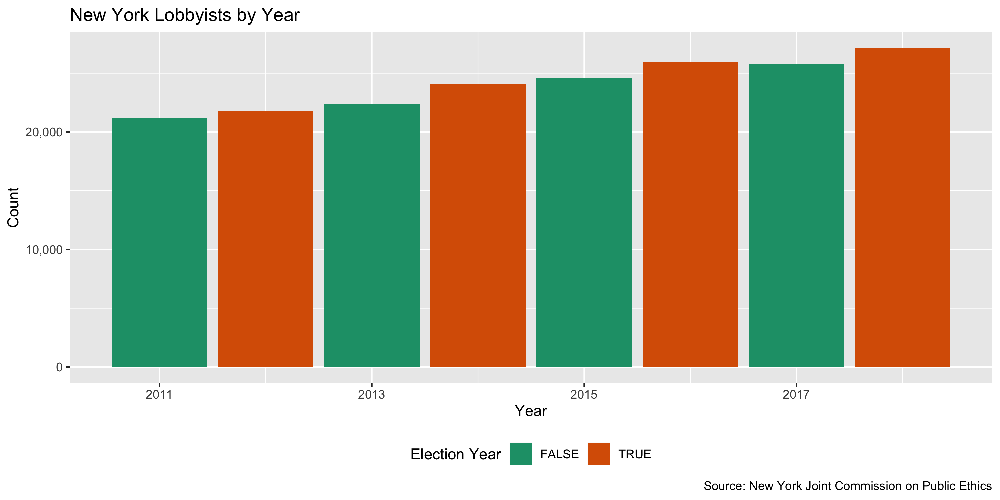
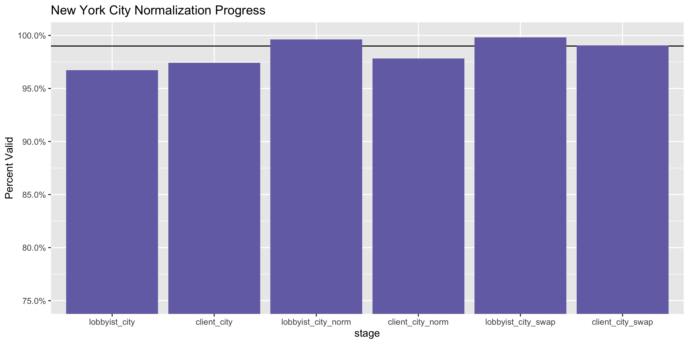
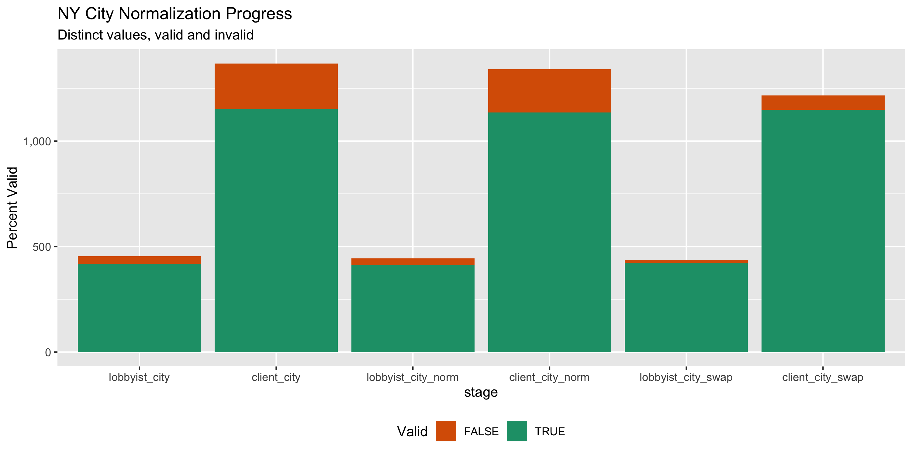

New York Lobbying Registration Diary
================
Yanqi Xu
2020-02-12 17:42:26

<!-- Place comments regarding knitting here -->

## Project

The Accountability Project is an effort to cut across data silos and
give journalists, policy professionals, activists, and the public at
large a simple way to search across huge volumes of public data about
people and organizations.

Our goal is to standardizing public data on a few key fields by thinking
of each dataset row as a transaction. For each transaction there should
be (at least) 3 variables:

1.  All **parties** to a transaction.
2.  The **date** of the transaction.
3.  The **amount** of money involved.

## Objectives

This document describes the process used to complete the following
objectives:

1.  How many records are in the database?
2.  Check for entirely duplicated records.
3.  Check ranges of continuous variables.
4.  Is there anything blank or missing?
5.  Check for consistency issues.
6.  Create a five-digit ZIP Code called `zip`.
7.  Create a `year` field from the transaction date.
8.  Make sure there is data on both parties to a transaction.

## Packages

The following packages are needed to collect, manipulate, visualize,
analyze, and communicate these results. The `pacman` package will
facilitate their installation and attachment.

The IRW’s `campfin` package will also have to be installed from GitHub.
This package contains functions custom made to help facilitate the
processing of campaign finance data.

``` r
if (!require("pacman")) install.packages("pacman")
pacman::p_load_gh("irworkshop/campfin")
pacman::p_load(
  readxl, #read excel files
  rvest, # used to scrape website and get html elements
  tidyverse, # data manipulation
  stringdist, # calculate distances between strings
  lubridate, # datetime strings
  magrittr, # pipe opperators
  janitor, # dataframe clean
  refinr, # cluster and merge
  scales, # format strings
  knitr, # knit documents
  vroom, # read files fast
  httr, # http queries
  glue, # combine strings
  here, # relative storage
  fs # search storage 
)
```

This document should be run as part of the `R_campfin` project, which
lives as a sub-directory of the more general, language-agnostic
[`irworkshop/accountability_datacleaning`](https://github.com/irworkshop/accountability_datacleaning)
GitHub repository.

The `R_campfin` project uses the [Rstudio
projects](https://support.rstudio.com/hc/en-us/articles/200526207-Using-Projects "Rproj")
feature and should be run as such. The project also uses the dynamic
`here::here()` tool for file paths relative to *your* machine.

``` r
# where does this document knit?
here::here()
#> [1] "/Users/yanqixu/code/accountability_datacleaning/R_campfin"
```

## Data

The [New York State Joint Commission on Public
Ethics](https://jcope.ny.gov/lobbying-datasets) makes Registered
Lobbyist Disclosures from 2011 to 2018 available for download. The 2018
data and prior year’s data exist in two separate files. \#\# Import

### Setting up Raw Data Directory

``` r
raw_dir <- dir_create(here("ny", "lobby", "data", "raw"))
```

### Read

Note that for years prior to 2018, data was originally stored as a
“xlsb” file, and we converted it to `xlsx` in
Excel.

``` r
ny_lob <- dir_ls(raw_dir, glob = "*.xlsx")  %>% map_dfr(read_xlsx) %>% clean_names()
```

## Explore

``` r
head(ny_lob)
#> # A tibble: 6 x 39
#>   reporting_year reporting_period lobbyist_name lobbyist_addres… lobbyist_addres… lobbyist_city
#>            <dbl> <chr>            <chr>         <chr>            <chr>            <chr>        
#> 1           2011 JA               1199 SEIU UN… 330 WEST 42ND S… 7TH FLOOR        NEW YORK     
#> 2           2011 JF               1199 SEIU UN… 330 WEST 42ND S… 7TH FLOOR        NEW YORK     
#> 3           2011 MA               1199 SEIU UN… 330 WEST 42ND S… 7TH FLOOR        NEW YORK     
#> 4           2011 MJ               1199 SEIU UN… 330 WEST 42ND S… 7TH FLOOR        NEW YORK     
#> 5           2011 SO               1199 SEIU UN… 330 WEST 42ND S… 7TH FLOOR        NEW YORK     
#> 6           2011 ND               1199 SEIU UN… 330 WEST 42ND S… 7TH FLOOR        NEW YORK     
#> # … with 33 more variables: lobbyist_state <chr>, lobbyist_zip <chr>, lobbyist_phone <chr>,
#> #   lobbyist_type <chr>, government_level <chr>, lobbyist_type2 <chr>,
#> #   additional_lobbyist_lr <chr>, additional_lobbyist_lbr <chr>, client_name <chr>,
#> #   client_addresss1 <chr>, client_address2 <chr>, client_city <chr>, client_state <chr>,
#> #   client_zip <chr>, client_phone <chr>, client_business_nature <chr>, lr_party_first_name <chr>,
#> #   lr_party_last_name <chr>, total_e_xpenses <dbl>, total_compensation <dbl>,
#> #   total_reimbrused <dbl>, bill_details_1 <chr>, bill_detqails_2 <chr>,
#> #   procurement_details_1 <chr>, procurement_details_2 <chr>, lobbyist_subjects_1 <chr>,
#> #   lobbyist_subjects_2 <chr>, person_1 <chr>, person_2 <chr>, procurement_number_1 <chr>,
#> #   procurement_number_2 <chr>, procurement_subjects_1 <chr>, procurement_subjects_2 <lgl>
tail(ny_lob)
#> # A tibble: 6 x 39
#>   reporting_year reporting_period lobbyist_name lobbyist_addres… lobbyist_addres… lobbyist_city
#>            <dbl> <chr>            <chr>         <chr>            <chr>            <chr>        
#> 1           2018 MA               ZGA, LLC (FK… 194 WASHINGTON … SUITE 610        ALBANY       
#> 2           2018 MJ               ZGA, LLC (FK… 194 WASHINGTON … SUITE 610        ALBANY       
#> 3           2018 JA               ZURICH NORTH… 7 FIELDS END DR… <NA>             GLENMONT     
#> 4           2018 SO               ZURICH NORTH… 7 FIELDS END DR… <NA>             GLENMONT     
#> 5           2018 MJ               ZURICH NORTH… 7 FIELDS END DR… <NA>             GLENMONT     
#> 6           2018 ND               ZURICH NORTH… 7 FIELDS END DR… <NA>             GLENMONT     
#> # … with 33 more variables: lobbyist_state <chr>, lobbyist_zip <chr>, lobbyist_phone <chr>,
#> #   lobbyist_type <chr>, government_level <chr>, lobbyist_type2 <chr>,
#> #   additional_lobbyist_lr <chr>, additional_lobbyist_lbr <chr>, client_name <chr>,
#> #   client_addresss1 <chr>, client_address2 <chr>, client_city <chr>, client_state <chr>,
#> #   client_zip <chr>, client_phone <chr>, client_business_nature <chr>, lr_party_first_name <chr>,
#> #   lr_party_last_name <chr>, total_e_xpenses <dbl>, total_compensation <dbl>,
#> #   total_reimbrused <dbl>, bill_details_1 <chr>, bill_detqails_2 <chr>,
#> #   procurement_details_1 <chr>, procurement_details_2 <chr>, lobbyist_subjects_1 <chr>,
#> #   lobbyist_subjects_2 <chr>, person_1 <chr>, person_2 <chr>, procurement_number_1 <chr>,
#> #   procurement_number_2 <chr>, procurement_subjects_1 <chr>, procurement_subjects_2 <lgl>
glimpse(sample_n(ny_lob, 20))
#> Observations: 20
#> Variables: 39
#> $ reporting_year          <dbl> 2015, 2011, 2018, 2013, 2014, 2017, 2018, 2014, 2013, 2013, 2017…
#> $ reporting_period        <chr> "MJ", "ND", "MJ", "JA", "MJ", "JF", "ND", "ND", "MA", "MJ", "JA"…
#> $ lobbyist_name           <chr> "SMYTH, A. ADVOCACY", "TLM ASSOCIATES LLC", "GETO & DE MILLY, IN…
#> $ lobbyist_address_1      <chr> "PO BOX 7124", "233 BROADWAY, SUITE 702", "276 FIFTH AVENUE", "1…
#> $ lobbyist_address_2      <chr> NA, NA, "SUITE 806", NA, NA, NA, "#11R", NA, "21ST FLOOR", NA, "…
#> $ lobbyist_city           <chr> "ALBANY", "NEW YORK", "NEW YORK", "ALBANY", "ALBANY", "ALBANY", …
#> $ lobbyist_state          <chr> "NY", "NY", "NY", "NY", "NY", "NY", "NY", "NY", "NY", "NY", "NY"…
#> $ lobbyist_zip            <chr> "12224", "10007", "10001", "12207-1693", "12207", "12207", "1137…
#> $ lobbyist_phone          <chr> "(518) 795-5270", "(646) 467-8536", "(212) 686-4551", "(518) 436…
#> $ lobbyist_type           <chr> "N", "N", "N", "N", "B", "B", "N", "N", "P", "N", "B", "N", "N",…
#> $ government_level        <chr> "S", "B", "B", "S", "B", "B", "L", "S", "B", "S", "S", "S", "S",…
#> $ lobbyist_type2          <chr> "R", "R", "R", "R", "R", "R", "R", "R", "R", "D", "E", "R", "E",…
#> $ additional_lobbyist_lr  <chr> "ANDREA SMYTH", "CHRISTIAN DIPALERMO,JEAN KIM,THOMAS  MCMAHON ,I…
#> $ additional_lobbyist_lbr <chr> "ANDREA SMYTH", "CHRISTIAN DIPALERMO,JEAN KIM,THOMAS  MCMAHON ,I…
#> $ client_name             <chr> "ASSOCIATION OF NEW YORK STATE YOUTH BUREAUS", "LILLY USA, LLC",…
#> $ client_addresss1        <chr> "194 WASHINGTON AVENUE, SUITE 415", "555 TWELFTH STREET, NW", "6…
#> $ client_address2         <chr> NA, "SUITE 650", NA, NA, NA, NA, NA, NA, NA, NA, NA, NA, NA, "SU…
#> $ client_city             <chr> "ALBANY", "WASHINGTON", "NEW YORK", "NEW YORK", "ALBANY", "ALBAN…
#> $ client_state            <chr> "NY", "DC", "NY", "NY", "NY", "NY", "CA", "MD", "IL", "NY", "NY"…
#> $ client_zip              <chr> "12210", "20004", "10013", "10018", "12207", "12207", "90291", "…
#> $ client_phone            <chr> "(518) 436-8712", "518-434-8435", "(212) 612-3261", "(212) 971-7…
#> $ client_business_nature  <chr> "Public, Community Interest", "Health & Mental Hygiene", "Real E…
#> $ lr_party_first_name     <chr> "ANDREA", "THOMAS L.", "MICHELE", "SEAN", "PATRICK", "CHRISTOPHE…
#> $ lr_party_last_name      <chr> "SMYTH", "MCMAHON", "DEMILLY", "DOOLAN", "MCHUGH", "DURYEA", "OR…
#> $ total_e_xpenses         <dbl> 40, 0, 94, 252, 216, 875, 0, 65, 0, 0, 0, 4064, 0, 350, 108, 0, …
#> $ total_compensation      <dbl> 2234, 9000, 30000, 8000, 11050, 2000, 7500, 8000, 15000, 2000, 0…
#> $ total_reimbrused        <dbl> 40, 0, 94, 137, 0, 0, 0, 50, 0, 0, 0, 0, 0, 0, 0, 0, 0, 0, 223, 0
#> $ bill_details_1          <chr> "A.6003; A.6006; S.4203; S.4206,A1616; S700; A6145; S779;,S.4343…
#> $ bill_detqails_2         <chr> NA, NA, NA, NA, NA, NA, NA, NA, NA, NA, NA, NA, NA, NA, NA, NA, …
#> $ procurement_details_1   <chr> NA, NA, NA, NA, NA, NA, NA, NA, NA, NA, NA, NA, NA, NA, NA, NA, …
#> $ procurement_details_2   <chr> NA, NA, NA, NA, NA, NA, NA, NA, NA, NA, NA, NA, NA, NA, NA, NA, …
#> $ lobbyist_subjects_1     <chr> "YOUTH DEVELOPMENT PROGRAM, RUNAWAY AND HOMELESS YOUTH ACT FUNDI…
#> $ lobbyist_subjects_2     <chr> NA, NA, NA, NA, NA, NA, NA, NA, NA, NA, NA, NA, NA, NA, NA, NA, …
#> $ person_1                <chr> "DIVISION OF THE BUDGET, OCFS, EXECUTIVE CHAMBERS, NYS ASSEMBLY,…
#> $ person_2                <chr> NA, NA, NA, NA, NA, NA, NA, NA, NA, NA, NA, NA, NA, NA, NA, NA, …
#> $ procurement_number_1    <chr> NA, NA, NA, NA, NA, NA, NA, NA, NA, NA, NA, NA, NA, NA, NA, NA, …
#> $ procurement_number_2    <chr> NA, NA, NA, NA, NA, NA, NA, NA, NA, NA, NA, NA, NA, NA, NA, NA, …
#> $ procurement_subjects_1  <chr> NA, NA, NA, NA, NA, NA, NA, NA, NA, NA, NA, NA, NA, NA, NA, NA, …
#> $ procurement_subjects_2  <lgl> NA, NA, NA, NA, NA, NA, NA, NA, NA, NA, NA, NA, NA, NA, NA, NA, …
```

### Missing

``` r
col_stats(ny_lob, count_na)
#> # A tibble: 39 x 4
#>    col                     class      n      p
#>    <chr>                   <chr>  <int>  <dbl>
#>  1 reporting_year          <dbl>      0 0     
#>  2 reporting_period        <chr>      0 0     
#>  3 lobbyist_name           <chr>      0 0     
#>  4 lobbyist_address_1      <chr>      0 0     
#>  5 lobbyist_address_2      <chr>  96664 0.501 
#>  6 lobbyist_city           <chr>      0 0     
#>  7 lobbyist_state          <chr>      0 0     
#>  8 lobbyist_zip            <chr>      0 0     
#>  9 lobbyist_phone          <chr>      0 0     
#> 10 lobbyist_type           <chr>      0 0     
#> 11 government_level        <chr>      0 0     
#> 12 lobbyist_type2          <chr>      0 0     
#> 13 additional_lobbyist_lr  <chr>  10335 0.0536
#> 14 additional_lobbyist_lbr <chr>  27326 0.142 
#> 15 client_name             <chr>      0 0     
#> 16 client_addresss1        <chr>      0 0     
#> 17 client_address2         <chr> 123703 0.641 
#> 18 client_city             <chr>      0 0     
#> 19 client_state            <chr>      0 0     
#> 20 client_zip              <chr>      0 0     
#> 21 client_phone            <chr>      0 0     
#> 22 client_business_nature  <chr>      0 0     
#> 23 lr_party_first_name     <chr>      0 0     
#> 24 lr_party_last_name      <chr>      0 0     
#> 25 total_e_xpenses         <dbl>      0 0     
#> 26 total_compensation      <dbl>      0 0     
#> 27 total_reimbrused        <dbl>      0 0     
#> 28 bill_details_1          <chr> 113435 0.588 
#> 29 bill_detqails_2         <chr> 191829 0.994 
#> 30 procurement_details_1   <chr> 188014 0.974 
#> 31 procurement_details_2   <chr> 192940 1.00  
#> 32 lobbyist_subjects_1     <chr>  41892 0.217 
#> 33 lobbyist_subjects_2     <chr> 192920 1.00  
#> 34 person_1                <chr>  43455 0.225 
#> 35 person_2                <chr> 192913 1.00  
#> 36 procurement_number_1    <chr> 189856 0.984 
#> 37 procurement_number_2    <chr> 192940 1.00  
#> 38 procurement_subjects_1  <chr> 190903 0.989 
#> 39 procurement_subjects_2  <lgl> 192941 1
```

There are many fields missing,m especially for fields in columns after
`total_reimbursed`.

### Duplicates

Running the following commands shows that there are over a thousand
entries with totally identical information. Since each of them contain
`total_compensation` and `total_reimbursed` for a certain period, there
should be only one such entry for each corresponding time period. We
will note that in the `dupe_flag` column.

``` r
ny_lob <- flag_dupes(ny_lob, dplyr::everything())
sum(ny_lob$dupe_flag)
#> [1] 1384
```

### Categorical

``` r
col_stats(ny_lob, n_distinct)
#> # A tibble: 40 x 4
#>    col                     class     n          p
#>    <chr>                   <chr> <int>      <dbl>
#>  1 reporting_year          <dbl>     8 0.0000415 
#>  2 reporting_period        <chr>     6 0.0000311 
#>  3 lobbyist_name           <chr>  2371 0.0123    
#>  4 lobbyist_address_1      <chr>  2149 0.0111    
#>  5 lobbyist_address_2      <chr>   716 0.00371   
#>  6 lobbyist_city           <chr>   454 0.00235   
#>  7 lobbyist_state          <chr>    38 0.000197  
#>  8 lobbyist_zip            <chr>   864 0.00448   
#>  9 lobbyist_phone          <chr>  2235 0.0116    
#> 10 lobbyist_type           <chr>     3 0.0000155 
#> 11 government_level        <chr>     3 0.0000155 
#> 12 lobbyist_type2          <chr>     3 0.0000155 
#> 13 additional_lobbyist_lr  <chr>  6762 0.0350    
#> 14 additional_lobbyist_lbr <chr> 24466 0.127     
#> 15 client_name             <chr> 10981 0.0569    
#> 16 client_addresss1        <chr>  8886 0.0461    
#> 17 client_address2         <chr>  1850 0.00959   
#> 18 client_city             <chr>  1367 0.00709   
#> 19 client_state            <chr>    52 0.000270  
#> 20 client_zip              <chr>  2460 0.0128    
#> 21 client_phone            <chr>  9459 0.0490    
#> 22 client_business_nature  <chr>    18 0.0000933 
#> 23 lr_party_first_name     <chr>   940 0.00487   
#> 24 lr_party_last_name      <chr>  1978 0.0103    
#> 25 total_e_xpenses         <dbl>  5872 0.0304    
#> 26 total_compensation      <dbl> 11109 0.0576    
#> 27 total_reimbrused        <dbl>  2004 0.0104    
#> 28 bill_details_1          <chr> 38938 0.202     
#> 29 bill_detqails_2         <chr>   759 0.00393   
#> 30 procurement_details_1   <chr>   923 0.00478   
#> 31 procurement_details_2   <chr>     2 0.0000104 
#> 32 lobbyist_subjects_1     <chr> 38808 0.201     
#> 33 lobbyist_subjects_2     <chr>    22 0.000114  
#> 34 person_1                <chr> 38729 0.201     
#> 35 person_2                <chr>    28 0.000145  
#> 36 procurement_number_1    <chr>   905 0.00469   
#> 37 procurement_number_2    <chr>     2 0.0000104 
#> 38 procurement_subjects_1  <chr>   416 0.00216   
#> 39 procurement_subjects_2  <lgl>     1 0.00000518
#> 40 dupe_flag               <lgl>     2 0.0000104
```

#### No. of registrations

Visualize number of lobbyists registered each year.
<!-- -->

#### Client Type

<!-- -->

<!-- -->

## Wrangle

To improve the searchability of the database, we will perform some
consistent, confident string normalization. For geographic variables
like city names and ZIP codes, the corresponding `campfin::normal_*()`
functions are taylor made to facilitate this process.

### Address

For the street `addresss` variable, the `campfin::normal_address()`
function will force consistence case, remove punctuation, and
abbreviation official USPS suffixes.

``` r
ny_lob <- ny_lob %>% 
    # combine street addr
  unite(
    col = lobbyist_address,
    starts_with("lobbyist_address"),
    sep = " ",
    remove = FALSE,
    na.rm = TRUE
  ) %>% 
    unite(
    col = client_address,
    starts_with("client_address"),
    sep = " ",
    remove = FALSE,
    na.rm = TRUE
  ) %>% 
  # normalize combined addr
    mutate_at(.vars = vars(ends_with('address')), .funs = list(norm = ~ normal_address(.,abbs = usps_street,
      na_rep = TRUE))) %>% 
  select(-ends_with("address"))
```

``` r
ny_lob %>% 
  select(contains("address")) %>% 
  distinct() %>% 
  sample_n(10) %>% 
  glimpse()
#> Observations: 10
#> Variables: 6
#> $ lobbyist_address_1    <chr> "12 SHERIDAN AVENUE", "111 WASHINGTON AVENUE", "THE WOOLWORTH BUIL…
#> $ lobbyist_address_2    <chr> NA, NA, "233 BROADWAY, SUITE 2310", "SUITE 302", "6TH FLOOR", "SUI…
#> $ client_addresss1      <chr> "1911 LORINGS CROSSING", "111 WASHINGTON AVENUE", "2928 41ST AVENU…
#> $ client_address2       <chr> NA, NA, NA, NA, NA, NA, NA, NA, "2ND FLOOR", "SUITE 455"
#> $ lobbyist_address_norm <chr> "12 SHERIDAN AVE", "111 WASHINGTON AVE", "THE WOOLWORTH BLDG 233 B…
#> $ client_address_norm   <chr> "1911 LORINGS XING", "111 WASHINGTON AVE", "2928 41 ST AVE", "PO B…
```

### ZIP

For ZIP codes, the `campfin::normal_zip()` function will attempt to
create valied *five* digit codes by removing the ZIP+4 suffix and
returning leading zeroes dropped by other programs like Microsoft Excel.

``` r
ny_lob <- ny_lob %>% 
    mutate_at(.vars = vars(ends_with('zip')), 
              .funs = list(norm = ~ normal_zip(.))) %>% 
  rename(lobbyist_zip5 = lobbyist_zip_norm,
         client_zip5 = client_zip_norm)
```

``` r
progress_table(
  ny_lob$lobbyist_zip,
  ny_lob$lobbyist_zip5,
  ny_lob$client_zip,
  ny_lob$client_zip5,
  compare = valid_zip
)
#> # A tibble: 4 x 6
#>   stage         prop_in n_distinct prop_na n_out n_diff
#>   <chr>           <dbl>      <dbl>   <dbl> <dbl>  <dbl>
#> 1 lobbyist_zip    0.900        864       0 19232    191
#> 2 lobbyist_zip5   0.997        714       0   487      5
#> 3 client_zip      0.921       2460       0 15198    481
#> 4 client_zip5     0.995       2081       0   915     39
```

### state

Valid two digit state abbreviations can be made using the
`campfin::normal_state()` function.

``` r
ny_lob <- ny_lob %>% 
   mutate_at(.vars = vars(ends_with('state')), .funs = list(norm = ~ normal_state(.,abbreviate = TRUE,
      na_rep = TRUE,
      valid = valid_state)))
```

``` r
ny_lob %>% 
  filter(lobbyist_state != lobbyist_state_norm) %>% 
  count(lobbyist_state, sort = TRUE)
#> # A tibble: 0 x 2
#> # … with 2 variables: lobbyist_state <chr>, n <int>
```

``` r
ny_lob %>% 
  filter(client_state != client_state_norm) %>% 
  count(client_state, sort = TRUE)
#> # A tibble: 0 x 2
#> # … with 2 variables: client_state <chr>, n <int>
```

``` r
progress_table(
  ny_lob$lobbyist_state,
  ny_lob$lobbyist_state_norm,
  ny_lob$client_state,
  ny_lob$client_state_norm,
  compare = valid_state
)
#> # A tibble: 4 x 6
#>   stage               prop_in n_distinct  prop_na n_out n_diff
#>   <chr>                 <dbl>      <dbl>    <dbl> <dbl>  <dbl>
#> 1 lobbyist_state        1.00          38 0           71      2
#> 2 lobbyist_state_norm   1             37 0.000368     0      1
#> 3 client_state          0.997         52 0          544      7
#> 4 client_state_norm     1             46 0.00282      0      1
```

### City

Cities are the most difficult geographic variable to normalize, simply
due to the wide variety of valid cities and formats. \#\#\#\# Normal

The `campfin::normal_city()` function is a good ny\_lobart, again
converting case, removing punctuation, but *expanding* USPS
abbreviations. We can also remove `invalid_city` values.

``` r
ny_lob <- ny_lob %>% 
      mutate_at(.vars = vars(ends_with('city')), .funs = list(norm = ~ normal_city(.,abbs = usps_city,
      states = usps_state,
      na = invalid_city,
      na_rep = TRUE)))

prop_in(ny_lob$lobbyist_city_norm, valid_city, na.rm = T)
#> [1] 0.9850472
prop_in(ny_lob$client_city_norm, valid_city, na.rm = T)
#> [1] 0.9557785
```

#### Swap

We can further improve normalization by comparing our normalized value
against the *expected* value for that record’s state abbreviation and
ZIP code. If the normalized value is either an abbreviation for or very
similar to the expected value, we can confidently swap those two.

``` r
ny_lob <- ny_lob %>% 
  left_join(
    y = zipcodes,
    by = c(
      "lobbyist_state_norm" = "state",
      "lobbyist_zip5" = "zip"
    )
  ) %>% 
  rename(lobbyist_city_match = city) %>% 
  mutate(
    match_abb = is_abbrev(lobbyist_city_norm, lobbyist_city_match),
    match_dist = str_dist(lobbyist_city_norm, lobbyist_city_match),
    lobbyist_city_swap = if_else(
      condition = !is.na(match_dist) & match_abb | match_dist == 1,
      true = lobbyist_city_match,
      false = lobbyist_city_norm
    )
  ) %>% 
  select(
    -lobbyist_city_match,
    -match_dist,
    -match_abb
  )
```

``` r
ny_lob <- ny_lob %>% 
  left_join(
    y = zipcodes,
    by = c(
      "client_state_norm" = "state",
      "client_zip5" = "zip"
    )
  ) %>% 
  rename(client_city_match = city) %>% 
  mutate(
    match_abb = is_abbrev(client_city_norm, client_city_match),
    match_dist = str_dist(client_city_norm, client_city_match),
    client_city_swap = if_else(
      condition = !is.na(match_dist) & match_abb | match_dist == 1,
      true = client_city_match,
      false = client_city_norm
    )
  ) %>% 
  select(
    -client_city_match,
    -match_dist,
    -match_abb
  )
```

After the two normalization steps, the percentage of valid cities is at
100%. \#\#\#\#
Progress

| stage                | prop\_in | n\_distinct | prop\_na | n\_out | n\_diff |
| :------------------- | -------: | ----------: | -------: | -----: | ------: |
| lobbyist\_city       |    0.967 |         454 |    0.000 |   6330 |      36 |
| client\_city         |    0.974 |        1367 |    0.000 |   4987 |     215 |
| lobbyist\_city\_norm |    0.992 |         444 |    0.000 |   1472 |      32 |
| client\_city\_norm   |    0.968 |        1340 |    0.000 |   6260 |     205 |
| lobbyist\_city\_swap |    0.998 |         437 |    0.014 |    373 |      14 |
| client\_city\_swap   |    0.990 |        1216 |    0.021 |   1857 |      67 |

You can see how the percentage of valid values increased with each
stage.

<!-- -->

More importantly, the number of distinct values decreased each stage. We
were able to confidently change many distinct invalid values to their
valid equivalent.

``` r
progress %>% 
  select(
    stage, 
    all = n_distinct,
    bad = n_diff
  ) %>% 
  mutate(good = all - bad) %>% 
  pivot_longer(c("good", "bad")) %>% 
  mutate(name = name == "good") %>% 
  ggplot(aes(x = stage, y = value)) +
  geom_col(aes(fill = name)) +
  scale_fill_brewer(palette = "Dark2", direction = -1) +
  scale_y_continuous(labels = comma) +
  theme(legend.position = "bottom") +
  labs(
    title = "NY City Normalization Progress",
    subtitle = "Distinct values, valid and invalid",
    x = "stage",
    y = "Percent Valid",
    fill = "Valid"
  )
```

<!-- -->

## Conclude

``` r
glimpse(sample_n(ny_lob, 20))
#> Observations: 20
#> Variables: 50
#> $ reporting_year          <dbl> 2011, 2013, 2017, 2018, 2016, 2015, 2011, 2018, 2016, 2015, 2012…
#> $ reporting_period        <chr> "ND", "ND", "SO", "MJ", "JA", "SO", "MJ", "ND", "JF", "MJ", "JA"…
#> $ lobbyist_name           <chr> "LYNCH, PATRICIA ASSOCIATES, INC.", "NORTHEAST GOVERNMENT CONSUL…
#> $ lobbyist_address_1      <chr> "677 BROADWAY", "501 ST DAVIDS LANE", "1100 NORTH KING STREET", …
#> $ lobbyist_address_2      <chr> "SUITE 1105", NA, "DE5-001-02-07", "NORTH TOWER, SUITE 347", NA,…
#> $ lobbyist_city           <chr> "ALBANY", "NISKAYUNA", "WILMINGTON", "MORRISTOWN", "ALBANY", "GL…
#> $ lobbyist_state          <chr> "NY", "NY", "DE", "NJ", "NY", "NY", "NY", "NY", "NY", "NY", "NY"…
#> $ lobbyist_zip            <chr> "12207", "12309", "19884", "07960", "12207-1693", "12088", "1220…
#> $ lobbyist_phone          <chr> "(518) 432-9220", "(518) 366-9017", "(302) 432-0956", "518-414-4…
#> $ lobbyist_type           <chr> "N", "P", "B", "N", "N", "N", "N", "P", "B", "N", "B", "B", "B",…
#> $ government_level        <chr> "S", "S", "B", "S", "S", "S", "S", "S", "B", "B", "S", "B", "B",…
#> $ lobbyist_type2          <chr> "R", "R", "E", "E", "R", "R", "R", "R", "R", "R", "E", "R", "E",…
#> $ additional_lobbyist_lr  <chr> "CHRISTOPHER BOMBARDIER,MICHELLE CUMMINGS,SAM GERRITY,CHRISTOPHE…
#> $ additional_lobbyist_lbr <chr> "CHRISTOPHER BOMBARDIER,MICHELLE CUMMINGS,SAM GERRITY,CHRISTOPHE…
#> $ client_name             <chr> "STONY BROOK FOUNDATION, INC.", "EMC CORPORATION (STATE PARTNERS…
#> $ client_addresss1        <chr> "230 ADMINISTRATION BUILDING", "1010 MOPAC CIRCLE SUITE 200", "1…
#> $ client_address2         <chr> "STONY BROOK UNIVERSITY", NA, "DE5-001-02-07", "EAST TOWER, 5TH …
#> $ client_city             <chr> "STONY BROOK", "AUSTIN", "WILMINGTON", "MORRISTOWN", "ALBANY", "…
#> $ client_state            <chr> "NY", "TX", "DE", "NJ", "NY", "DC", "NY", "CA", "NY", "NY", "NY"…
#> $ client_zip              <chr> "11794-1188", "78746", "19884", "07960", "12210", "20005", "1000…
#> $ client_phone            <chr> "(631) 632-4353", "(512) 589-7685", "(302) 432-0956", "973-936-6…
#> $ client_business_nature  <chr> "Education", "Marketing & Sales", "Banking & Financial Services"…
#> $ lr_party_first_name     <chr> "PATRICIA", "LEN", "WENDY", "LEE", "SEAN", "TRACY", "RICHARD C."…
#> $ lr_party_last_name      <chr> "LYNCH", "PRAZYCH", "JAMISON", "MARKS", "DOOLAN", "TRESS", "LAUR…
#> $ total_e_xpenses         <dbl> 181, 546, 0, 0, 120, 39, 848, 768, 597, 0, 16, 0, 0, 920, 0, 598…
#> $ total_compensation      <dbl> 20000, 8000, 240, 0, 0, 29166, 10000, 10000, 2000, 13000, 1066, …
#> $ total_reimbrused        <dbl> 0, 0, 0, 0, 0, 0, 0, 0, 0, 0, 0, 0, 0, 0, 0, 0, 0, 0, 0, 0
#> $ bill_details_1          <chr> NA, NA, NA, NA, "A307    A6355    A6732    A7609    S141A    S12…
#> $ bill_detqails_2         <chr> NA, NA, NA, NA, NA, NA, NA, NA, NA, NA, NA, NA, NA, NA, NA, NA, …
#> $ procurement_details_1   <chr> NA, NA, NA, NA, NA, NA, NA, NA, NA, NA, NA, NA, NA, NA, NA, NA, …
#> $ procurement_details_2   <chr> NA, NA, NA, NA, NA, NA, NA, NA, NA, NA, NA, NA, NA, NA, NA, NA, …
#> $ lobbyist_subjects_1     <chr> "ISSUES AFFECTING STONY BROOK FOUNDATION", "TECHNOLOGY", "MATTER…
#> $ lobbyist_subjects_2     <chr> NA, NA, NA, NA, NA, NA, NA, NA, NA, NA, NA, NA, NA, NA, NA, NA, …
#> $ person_1                <chr> "ADMINISTRATIVE, EXECUTIVE AND LEGISLATIVE BRANCHES OF GOVERNMEN…
#> $ person_2                <chr> NA, NA, NA, NA, NA, NA, NA, NA, NA, NA, NA, NA, NA, NA, NA, NA, …
#> $ procurement_number_1    <chr> NA, NA, NA, NA, NA, NA, NA, NA, NA, NA, NA, NA, NA, NA, NA, NA, …
#> $ procurement_number_2    <chr> NA, NA, NA, NA, NA, NA, NA, NA, NA, NA, NA, NA, NA, NA, NA, NA, …
#> $ procurement_subjects_1  <chr> NA, NA, NA, NA, NA, NA, NA, NA, NA, NA, NA, NA, NA, NA, NA, NA, …
#> $ procurement_subjects_2  <lgl> NA, NA, NA, NA, NA, NA, NA, NA, NA, NA, NA, NA, NA, NA, NA, NA, …
#> $ dupe_flag               <lgl> FALSE, FALSE, FALSE, FALSE, FALSE, FALSE, FALSE, FALSE, FALSE, F…
#> $ lobbyist_address_norm   <chr> "677 BROADWAY STE 1105", "501 ST DAVIDS LN", "1100 N KING ST DE …
#> $ client_address_norm     <chr> "230 ADMINISTRATION BLDG STONY BRK UNIVERSITY", "1010 MOPAC CIR …
#> $ lobbyist_zip5           <chr> "12207", "12309", "19884", "07960", "12207", "12088", "12207", "…
#> $ client_zip5             <chr> "11794", "78746", "19884", "07960", "12210", "20005", "10005", "…
#> $ lobbyist_state_norm     <chr> "NY", "NY", "DE", "NJ", "NY", "NY", "NY", "NY", "NY", "NY", "NY"…
#> $ client_state_norm       <chr> "NY", "TX", "DE", "NJ", "NY", "DC", "NY", "CA", "NY", "NY", "NY"…
#> $ lobbyist_city_norm      <chr> "ALBANY", "NISKAYUNA", "WILMINGTON", "MORRISTOWN", "ALBANY", "GL…
#> $ client_city_norm        <chr> "STONY BROOK", "AUSTIN", "WILMINGTON", "MORRISTOWN", "ALBANY", "…
#> $ lobbyist_city_swap      <chr> "ALBANY", "NISKAYUNA", "WILMINGTON", "MORRISTOWN", "ALBANY", NA,…
#> $ client_city_swap        <chr> "STONY BROOK", "AUSTIN", "WILMINGTON", "MORRISTOWN", "ALBANY", "…
```

1.  There are 192941 records in the database.
2.  There are 1384 duplicate records in the database.
3.  The range and distribution of `amount` and `date` seem reasonable.
4.  There are 0 records missing either recipient or date.
5.  Consistency in goegraphic data has been improved with
    `campfin::normal_*()`.
6.  The 4-digit `YEAR` variable has been created with
    `lubridate::year()`.

## Export

``` r
clean_dir <- dir_create(here("ny", "lobby", "data", "reg","clean"))
```

``` r
write_csv(
  x = ny_lob %>% rename(lobbyist_city_clean = lobbyist_city_swap) %>% rename( client_city_clean = client_city_swap),
  path = path(clean_dir, "ny_lob_clean.csv"),
  na = ""
)
```
