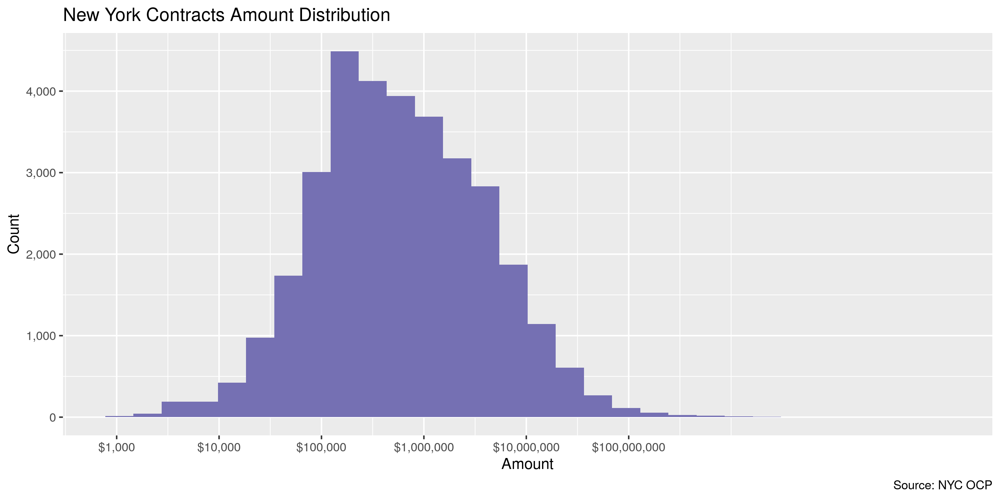
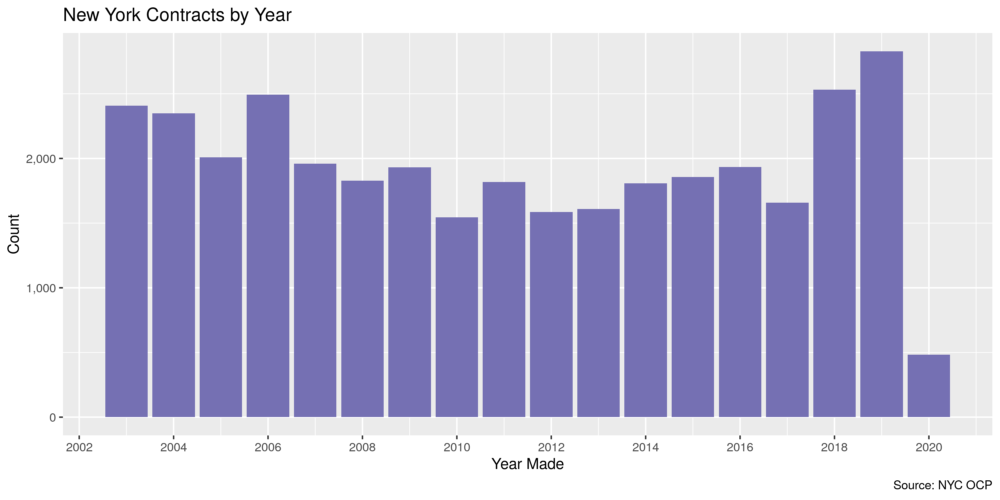

New York Contracts
================
Kiernan Nicholls
2020-04-03 14:02:11

  - [Project](#project)
  - [Objectives](#objectives)
  - [Software](#software)
  - [Data](#data)
  - [Import](#import)
  - [Wrangle](#wrangle)
  - [Explore](#explore)
  - [Export](#export)
  - [Encoding](#encoding)

<!-- Place comments regarding knitting here -->

## Project

The Accountability Project is an effort to cut across data silos and
give journalists, policy professionals, activists, and the public at
large a simple way to search across huge volumes of public data about
people and organizations.

Our goal is to standardizing public data on a few key fields by thinking
of each dataset row as a transaction. For each transaction there should
be (at least) 3 variables:

1.  All **parties** to a transaction.
2.  The **date** of the transaction.
3.  The **amount** of money involved.

## Objectives

This document describes the process used to complete the following
objectives:

1.  How many records are in the database?
2.  Check for entirely duplicated records.
3.  Check ranges of continuous variables.
4.  Is there anything blank or missing?
5.  Check for consistency issues.
6.  Create a five-digit ZIP Code called `zip`.
7.  Create a `year` field from the transaction date.
8.  Make sure there is data on both parties to a transaction.

## Software

This data is processed using the free, open-source statistical computing
language R, which can be [installed from
CRAN](https://cran.r-project.org/) for various opperating systems. For
example, R can be installed from the apt package repository on Ubuntu.

``` bash
sudo apt update
sudo apt -y upgrade
sudo apt -y install r-base
```

The following additional R packages are needed to collect, manipulate,
visualize, analyze, and communicate these results. The `pacman` package
will facilitate their installation and attachment.

The IRW’s `campfin` package will also have to be installed from GitHub.
This package contains functions custom made to help facilitate the
processing of campaign finance data.

``` r
if (!require("pacman")) install.packages("pacman")
pacman::p_load_gh("irworkshop/campfin")
pacman::p_load(
  tidyverse, # data manipulation
  lubridate, # datetime strings
  magrittr, # pipe operators
  gluedown, # print markdown
  janitor, # dataframe clean
  refinr, # cluster and merge
  scales, # format strings
  readxl, # read excel
  knitr, # knit documents
  vroom, # read files fast
  furrr, # parallel map
  glue, # combine strings
  here, # relative storage
  httr, # http requests
  pryr, # memory usage
  fs # search storage 
)
```

This document should be run as part of the `us_spending` project, which
lives as a sub-directory of the more general, language-agnostic
[`irworkshop/tap`](https://github.com/irworkshop/accountability_datacleaning)
GitHub repository.

The `us_spending` project uses the [RStudio
projects](https://support.rstudio.com/hc/en-us/articles/200526207-Using-Projects)
feature and should be run as such. The project also uses the dynamic
`here::here()` tool for file paths relative to *your* machine.

``` r
# where does this document knit?
here::here()
#> [1] "/home/kiernan/Code/accountability_datacleaning/us_spending"
```

## Data

Contracts data is obtained from the New York City [Office of Citywide
Purchasing
(OCP)](https://www1.nyc.gov/site/dcas/business/working-with-citywide-procurement.page)
via the city’s [OpenData portal](https://opendata.cityofnewyork.us/). In
light of the ongoing COVID-19 outbreak in New York City, our typical
efforts to ensure a portal contains all relevant data were not made.
While the number of records is fairly small, the amount of data seems
consitent year to year and up to date.

## Import

We can import [the
data](https://data.cityofnewyork.us/City-Government/Recent-Contract-Awards/qyyg-4tf5)
directly from the OpenData portal.

First, we simply download using an `httr::GET()` request to the portal
site.

``` r
raw_url <- "https://data.cityofnewyork.us/api/views/qyyg-4tf5/rows.csv"
raw_dir <- dir_create(here("nyc", "contracts", "data", "raw"))
raw_path <- path(raw_dir, "Recent_Contract_Awards.csv")
```

``` r
if (!file_exists(raw_path)) {
  GET(
    url = raw_url,
    write_disk(raw_path, overwrite = TRUE),
    query = list(accessType = "DOWNLOAD")
  )
}
```

Then the local raw text file can be read into memory with
`vroom::vroom()`.

``` r
nyc <- vroom(
  file = raw_path,
  .name_repair = make_clean_names,
  escape_double = FALSE,
  escape_backslash = FALSE,
  na = c("", "NA", "......"),
  col_types = cols(
    .default = col_character(),
    StartDate = col_date_usa(),
    EndDate = col_date_usa(),
    ContractAmount = col_double()
  )
)
```

A number of columns contain no informatio and can be removed.

``` r
nyc <- remove_empty(nyc, "cols")
```

## Wrangle

The `vendor_address` string contains both the street address, the city,
state, and ZIP code. We will have to extract the last two for their own
variables.

``` r
# copy address in new column
nyc <- mutate(nyc, addr = str_to_upper(vendor_address))
# remove periods in abbrevs
nyc$addr <- str_remove_all(nyc$addr, "\\.(?=\\S)")
# extract and remove zip from end
nyc <- mutate(nyc, zip = normal_zip(str_extract(addr, "\\d+(?:-\\d{4})?$")))
nyc$addr <- str_trim(str_remove(nyc$addr, "[:punct:]?\\s?\\d+(?:-\\d{4})?$"))
# abbrev full states at end of addr
rx_abbs <- valid_state
names(rx_abbs) <- glue("{valid_name}$")
nyc$addr <- str_replace_all(nyc$addr, rx_abbs)
# extract upper abbs from end
nyc <- mutate(nyc, state = str_extract(addr, "(?<=\\W)[:upper:]{2}$"))
# remove abbs and extra from end
nyc$addr <- str_remove(nyc$addr, "[:punct:]?\\s[:upper:]{2}$")
nyc <- relocate(nyc, state, zip, .after = addr)
nyc$addr <- nyc$addr %>% 
  # normalize remaining addr
  str_normal(punct = FALSE) %>% 
  # abbreviate street abbs
  abbrev_full(usps_street)
```

``` r
nyc %>% 
  select(vendor_address, addr, state, zip) %>% 
  distinct() %>% 
  sample_n(20)
#> # A tibble: 20 x 4
#>    vendor_address                               addr                                    state zip  
#>    <chr>                                        <chr>                                   <chr> <chr>
#>  1 1000 Marie-Victorin Blvd., Longueuil, Quebe… 1000 MARIE-VICTORIN BLVD, LONGUEUIL, Q… <NA>  <NA> 
#>  2 150-10 HILLSIDE AVENUE, JAMAICA, NY  11432   150-10 HILLSIDE AVE, JAMAICA            NY    11432
#>  3 110 Parkway Drive South, Ste A Hauppauge, N… 110 PKWY DR S, STE A HAUPPAUGE          NY    11788
#>  4 Two Penn Plaza, 26th Floor, New York, NY  1… TWO PENN PLZ, 26TH FL, NEW YORK         NY    10121
#>  5 416 WEST 127TH STREET, NEW YORK, NY  10027   416 W 127TH ST, NEW YORK                NY    10027
#>  6 105 Court Street, Brooklyn, NY 11201-5645    105 CT ST, BROOKLYN                     NY    11201
#>  7 1201 North Calvert Street, Baltimore MD 212… 1201 N CALVERT ST, BALTIMORE            MD    21202
#>  8 1641 McGaw Ave, Irvine, CA 92614             1641 MCGAW AVE, IRVINE                  CA    92614
#>  9 50 Gear Avenue, Lindenhurst,n.y. 11757       50 GEAR AVE, LINDENHURST,NY             NY    11757
#> 10 A - 1 Hunts Point Co - op Market, Bronx,  N… A - 1 HUNTS PT CO - OP MARKET, BRONX,   NY    10474
#> 11 555 WEST 57TH STREET, 15TH FLOOR, NY, NY  1… 555 W 57TH ST, 15TH FL, NY              NY    10019
#> 12 260 W 39th Street Room 302, New York, NY 10… 260 W 39TH ST RM 302, NEW YORK          NY    10018
#> 13 1170 Pennsylvania Ave, Suite 1B, Brooklyn, … 1170 PENNSYLVANIA AVE, STE 1B, BROOKLYN NY    11239
#> 14 652 W. 187th Street, New York, NY 10033-1350 652 W. 187TH ST, NEW YORK               NY    10033
#> 15 699 West Woodbine, Kirkwood, MO  63122       699 W WOODBINE, KIRKWOOD                MO    63122
#> 16 263 Herbert Avenue, Cluster, NJ 07624        263 HERBERT AVE, CLUSTER                NJ    07624
#> 17 450 7TH Avenue Ste 1106, New York 10123      450 7TH AVE STE 1106                    NY    10123
#> 18 145 Brook Avenue, Deer Park, N.Y. 11729      145 BRK AVE, DEER PARK                  NY    11729
#> 19 255 Washington Avenue Ext., Albany, NY 12205 255 WASHINGTON AVE EXT, ALBANY          NY    12205
#> 20 245 Park Avenue, 23rd Floor, New York, NY  … 245 PARK AVE, 23RD FL, NEW YORK         NY    10167
```

## Explore

``` r
head(nyc)
#> # A tibble: 6 x 25
#>   request_id start_date end_date   agency_name type_of_notice_… category_descri… short_title
#>   <chr>      <date>     <date>     <chr>       <chr>            <chr>            <chr>      
#> 1 202003260… 2020-04-02 2020-04-02 Housing Pr… Award            Human Services/… HOME EMERG…
#> 2 201406050… 2014-06-12 2014-06-12 Transporta… Award            Human Services/… NOTICE OF …
#> 3 200910070… 2009-10-14 2009-10-14 Transporta… Award            Services (other… OPERATION,…
#> 4 201302140… 2013-02-22 2013-02-22 Parks and … Award            Services (other… DEPARTMENT…
#> 5 201302140… 2013-02-22 2013-02-22 Parks and … Award            Services (other… DEPARTMENT…
#> 6 201406050… 2014-06-12 2014-06-12 Transporta… Award            Human Services/… NOTICE OF …
#> # … with 18 more variables: selection_method_description <chr>, section_name <chr>,
#> #   special_case_reason_description <chr>, pin <chr>, address_to_request <chr>,
#> #   contact_name <chr>, contact_phone <chr>, contract_amount <dbl>, additional_description1 <chr>,
#> #   other_info1 <chr>, vendor_name <chr>, vendor_address <chr>, printout1 <chr>, printout2 <chr>,
#> #   document_links <chr>, addr <chr>, state <chr>, zip <chr>
tail(nyc)
#> # A tibble: 6 x 25
#>   request_id start_date end_date   agency_name type_of_notice_… category_descri… short_title
#>   <chr>      <date>     <date>     <chr>       <chr>            <chr>            <chr>      
#> 1 201812310… 2019-01-08 2019-01-08 Sanitation  Award            Goods and Servi… SUZUKI AUT…
#> 2 201012020… 2010-12-09 2010-12-09 Citywide A… Award            Goods            CERVICAL E…
#> 3 201312180… 2013-12-27 2013-12-27 Citywide A… Award            Goods            TOTAL SOLU…
#> 4 201908270… 2019-09-04 2019-09-04 Design and… Award            Construction/Co… DCE-SM, RE…
#> 5 201512160… 2015-12-23 2015-12-23 Citywide A… Award            Goods            LIFEGUARD …
#> 6 201401080… 2014-01-15 2014-01-15 Informatio… Award            Services (other… EMERGENCY …
#> # … with 18 more variables: selection_method_description <chr>, section_name <chr>,
#> #   special_case_reason_description <chr>, pin <chr>, address_to_request <chr>,
#> #   contact_name <chr>, contact_phone <chr>, contract_amount <dbl>, additional_description1 <chr>,
#> #   other_info1 <chr>, vendor_name <chr>, vendor_address <chr>, printout1 <chr>, printout2 <chr>,
#> #   document_links <chr>, addr <chr>, state <chr>, zip <chr>
glimpse(sample_n(nyc, 20))
#> Rows: 20
#> Columns: 25
#> $ request_id                      <chr> "20130315021", "20090112009", "20191218001", "2017112401…
#> $ start_date                      <date> 2013-03-20, 2009-01-20, 2019-12-26, 2017-12-01, 2019-09…
#> $ end_date                        <date> 2013-03-20, 2009-01-20, 2019-12-26, 2017-12-01, 2019-09…
#> $ agency_name                     <chr> "Parks and Recreation", "Citywide Administrative Service…
#> $ type_of_notice_description      <chr> "Award", "Award", "Award", "Award", "Award", "Award", "A…
#> $ category_description            <chr> "Services (other than human services)", "Goods", "Human …
#> $ short_title                     <chr> "FLAGPOLE PAINTING AND REPAIR", "HYDRANT WRENCH/ SPANNER…
#> $ selection_method_description    <chr> "Competitive Sealed Bids", "Competitive Sealed Bids", "R…
#> $ section_name                    <chr> "Procurement", "Procurement", "Procurement", "Procuremen…
#> $ special_case_reason_description <chr> NA, NA, NA, NA, "Other (Describe below in Other Legally …
#> $ pin                             <chr> "84612B0142001", "857900129", "08PO076387R0X00", "18AO02…
#> $ address_to_request              <chr> NA, NA, NA, NA, NA, NA, NA, NA, NA, NA, NA, NA, NA, NA, …
#> $ contact_name                    <chr> NA, NA, NA, NA, NA, NA, NA, NA, NA, NA, NA, NA, NA, NA, …
#> $ contact_phone                   <chr> NA, NA, NA, NA, NA, NA, NA, NA, NA, NA, NA, NA, NA, NA, …
#> $ contract_amount                 <dbl> 320060.0, 18360.0, 10003110.0, 230769.0, 149131.5, 49573…
#> $ additional_description1         <chr> NA, NA, NA, NA, NA, NA, NA, NA, NA, NA, NA, NA, NA, NA, …
#> $ other_info1                     <chr> NA, NA, NA, NA, "OGS Contr PM20920 Suppliers wishing to …
#> $ vendor_name                     <chr> "Octagon Painting, Inc.", "Joseph G. Pollard Co. Inc DBA…
#> $ vendor_address                  <chr> "10 Highridge Road, West Harrison, NY 10604", "200 Atlan…
#> $ printout1                       <chr> "FLAGPOLE PAINTING AND REPAIR - Competitive Sealed Bids …
#> $ printout2                       <chr> NA, NA, NA, NA, NA, NA, NA, NA, NA, NA, NA, NA, NA, NA, …
#> $ document_links                  <chr> NA, NA, NA, NA, NA, NA, NA, NA, NA, NA, NA, NA, NA, NA, …
#> $ addr                            <chr> "10 HIGHRIDGE RD, W HARRISON", "200 ATLANTIC AVE, NEW HY…
#> $ state                           <chr> "NY", "NY", "NY", "NY", "NY", "NY", "NY", "NY", "NJ", "N…
#> $ zip                             <chr> "10604", "11040", "10014", "10001", "11530", "10549", "1…
```

A number of records are missing one or more key variables.

``` r
col_stats(nyc, count_na)
#> # A tibble: 25 x 4
#>    col                             class      n        p
#>    <chr>                           <chr>  <int>    <dbl>
#>  1 request_id                      <chr>      0 0       
#>  2 start_date                      <date>     0 0       
#>  3 end_date                        <date>     0 0       
#>  4 agency_name                     <chr>      0 0       
#>  5 type_of_notice_description      <chr>      0 0       
#>  6 category_description            <chr>      0 0       
#>  7 short_title                     <chr>      0 0       
#>  8 selection_method_description    <chr>      0 0       
#>  9 section_name                    <chr>      0 0       
#> 10 special_case_reason_description <chr>  22628 0.653   
#> 11 pin                             <chr>      8 0.000231
#> 12 address_to_request              <chr>  34326 0.991   
#> 13 contact_name                    <chr>  34350 0.992   
#> 14 contact_phone                   <chr>  34325 0.991   
#> 15 contract_amount                 <dbl>     30 0.000866
#> 16 additional_description1         <chr>  33765 0.975   
#> 17 other_info1                     <chr>  28047 0.810   
#> 18 vendor_name                     <chr>   1415 0.0409  
#> 19 vendor_address                  <chr>   1418 0.0409  
#> 20 printout1                       <chr>    309 0.00892 
#> 21 printout2                       <chr>  34629 1.00    
#> 22 document_links                  <chr>  34585 0.999   
#> 23 addr                            <chr>   1418 0.0409  
#> 24 state                           <chr>   3179 0.0918  
#> 25 zip                             <chr>   1917 0.0554
```

We can flag these records with `campfin::flag_na()`.

``` r
nyc <- flag_na(nyc, agency_name, vendor_name, start_date, contract_amount)
percent(mean(nyc$na_flag), 0.01)
#> [1] "4.09%"
```

We can also use `campfin::dupe_flag()` to flag duplicate records. In
this case, there are none\!

``` r
nyc <- flag_dupes(nyc, everything(), .check = TRUE)
#> Warning in flag_dupes(nyc, everything(), .check = TRUE): no duplicate rows, column not created
sum(nyc$dupe_flag)
#> Warning: Unknown or uninitialised column: `dupe_flag`.
#> [1] 0
```

We can also count and plot some of the categorical values.

``` r
col_stats(nyc, n_distinct)
#> # A tibble: 26 x 4
#>    col                             class      n         p
#>    <chr>                           <chr>  <int>     <dbl>
#>  1 request_id                      <chr>  34632 1        
#>  2 start_date                      <date>  4215 0.122    
#>  3 end_date                        <date>  4215 0.122    
#>  4 agency_name                     <chr>     72 0.00208  
#>  5 type_of_notice_description      <chr>      1 0.0000289
#>  6 category_description            <chr>      6 0.000173 
#>  7 short_title                     <chr>  21672 0.626    
#>  8 selection_method_description    <chr>     31 0.000895 
#>  9 section_name                    <chr>      1 0.0000289
#> 10 special_case_reason_description <chr>      6 0.000173 
#> 11 pin                             <chr>  30530 0.882    
#> 12 address_to_request              <chr>     48 0.00139  
#> 13 contact_name                    <chr>     48 0.00139  
#> 14 contact_phone                   <chr>     47 0.00136  
#> 15 contract_amount                 <dbl>  24558 0.709    
#> 16 additional_description1         <chr>    732 0.0211   
#> 17 other_info1                     <chr>   3789 0.109    
#> 18 vendor_name                     <chr>  18636 0.538    
#> 19 vendor_address                  <chr>  23292 0.673    
#> 20 printout1                       <chr>  34288 0.990    
#> 21 printout2                       <chr>      4 0.000116 
#> 22 document_links                  <chr>     48 0.00139  
#> 23 addr                            <chr>  16715 0.483    
#> 24 state                           <chr>     66 0.00191  
#> 25 zip                             <chr>   2699 0.0779   
#> 26 na_flag                         <lgl>      2 0.0000578
```

### Continuous

We should also check to ensure the amount and dates are the reasonable.

Only a few records of a `contract_amount` value less than or equal to
zero.

``` r
summary(nyc$contract_amount)
#>       Min.    1st Qu.     Median       Mean    3rd Qu.       Max.       NA's 
#> -4.000e+05  1.308e+05  4.717e+05  7.513e+06  2.017e+06  1.011e+11         30
mean(nyc$contract_amount <= 0, na.rm = TRUE) # less than zero
#> [1] 0.0450552
```

The amounts are logarithmically normal, as we’d expect with something
like this.

<!-- -->

Most of the `start_date` and `end_date` values are the same. We will use
the year of the `start_date` to create a new 4 digit `year` variable.

``` r
mean(nyc$start_date == nyc$end_date) # mostly same
#> [1] 0.995149
nyc <- mutate(nyc, year = year(start_date))
```

No records have bad dates in the distant past or future.

``` r
min(nyc$start_date)
#> [1] "2003-01-02"
sum(nyc$year < 2002)
#> [1] 0
max(nyc$end_date)
#> [1] "2020-04-02"
sum(nyc$end_date > today())
#> [1] 0
```

There are a fairly constant number of contracts per year.

<!-- -->

## Export

``` r
glimpse(sample_n(nyc, 20))
#> Rows: 20
#> Columns: 27
#> $ request_id                      <chr> "20050216013", "20101014023", "20110720002", "2007041901…
#> $ start_date                      <date> 2005-02-24, 2010-10-21, 2011-07-26, 2007-04-26, 2011-03…
#> $ end_date                        <date> 2005-02-24, 2010-10-21, 2011-07-26, 2007-04-26, 2011-03…
#> $ agency_name                     <chr> "Citywide Administrative Services", "Design and Construc…
#> $ type_of_notice_description      <chr> "Award", "Award", "Award", "Award", "Award", "Award", "A…
#> $ category_description            <chr> "Goods", "Construction/Construction Services", "Human Se…
#> $ short_title                     <chr> "WATERSHED HYDROLOGY EQUIPMENT: GRP  and  ACCESSORIES", …
#> $ selection_method_description    <chr> "Competitive Sealed Bids", "Competitive Sealed Proposals…
#> $ section_name                    <chr> "Procurement", "Procurement", "Procurement", "Procuremen…
#> $ special_case_reason_description <chr> NA, "Judgment required in evaluating proposals", NA, "Ot…
#> $ pin                             <chr> "857401092", "8502007VP0001P", "806110092001", "85770128…
#> $ address_to_request              <chr> NA, NA, NA, NA, NA, NA, NA, NA, NA, NA, NA, NA, NA, NA, …
#> $ contact_name                    <chr> NA, NA, NA, NA, NA, NA, NA, NA, NA, NA, NA, NA, NA, NA, …
#> $ contact_phone                   <chr> NA, NA, NA, NA, NA, NA, NA, NA, NA, NA, NA, NA, NA, NA, …
#> $ contract_amount                 <dbl> 225000.0, 350000.0, 153056.0, 190000.0, 5933227.0, 36605…
#> $ additional_description1         <chr> NA, "Award amount changed from $250,000 to $350,000.", N…
#> $ other_info1                     <chr> NA, NA, NA, "NYS Contract # PC 60290 Suppliers wishing t…
#> $ vendor_name                     <chr> "Hach Company dba Lachat Instruments", "The Gordian Grou…
#> $ vendor_address                  <chr> "5600 Lindbergh Drive, PO Box 389, Loveland, CO  8053903…
#> $ printout1                       <chr> "WATERSHED HYDROLOGY EQUIPMENT: GRP  AND  ACCESSORIES - …
#> $ printout2                       <chr> NA, NA, NA, NA, NA, NA, NA, NA, NA, NA, NA, NA, NA, NA, …
#> $ document_links                  <chr> NA, NA, NA, NA, NA, NA, NA, NA, NA, NA, NA, NA, NA, NA, …
#> $ addr                            <chr> "5600 LINDBERGH DR, PO BOX 389, LOVELAND", "140 BRIDGES …
#> $ state                           <chr> "CO", "SC", "NY", "CA", "NY", "CA", NA, NA, "NC", "NY", …
#> $ zip                             <chr> "80539", "29662", "10013", "94598", "10004", "95407", NA…
#> $ na_flag                         <lgl> FALSE, FALSE, FALSE, FALSE, FALSE, FALSE, TRUE, FALSE, F…
#> $ year                            <dbl> 2005, 2010, 2011, 2007, 2011, 2015, 2019, 2019, 2014, 20…
```

1.  There are 34,632 records in the database.
2.  There are 0 duplicate records in the database.
3.  The range and distribution of amount and dates seem mostly
    reasonable.
4.  The 4-digit `year` variable has been created with
    `lubridate::year()`.

<!-- end list -->

``` r
clean_dir <- dir_create(here("nyc", "contracts", "data", "clean"))
clean_path <- path(clean_dir, "nyc_contracts_clean.csv")
write_csv(nyc, path = clean_path, na = "")
```

## Encoding

``` r
file_size(clean_path)
#> 22.7M
guess_encoding(clean_path)
#> # A tibble: 3 x 2
#>   encoding   confidence
#>   <chr>           <dbl>
#> 1 UTF-8            1   
#> 2 ISO-8859-1       0.72
#> 3 ISO-8859-2       0.23
```
