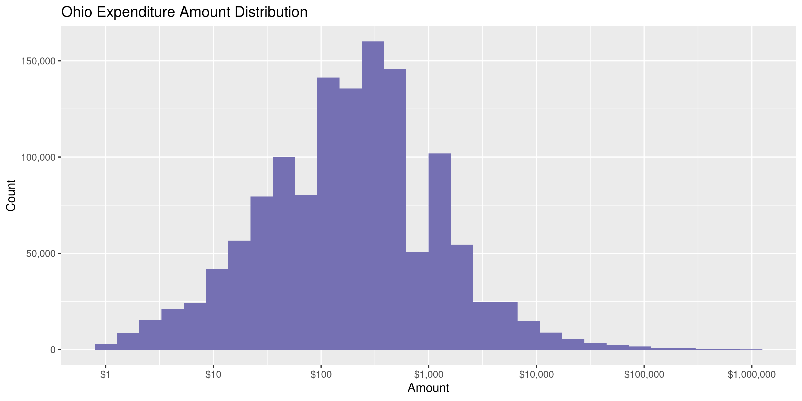
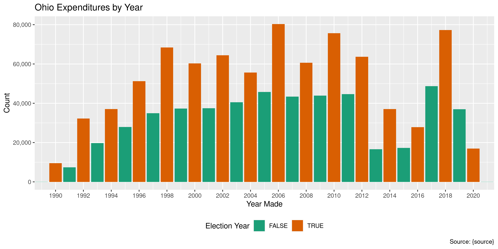
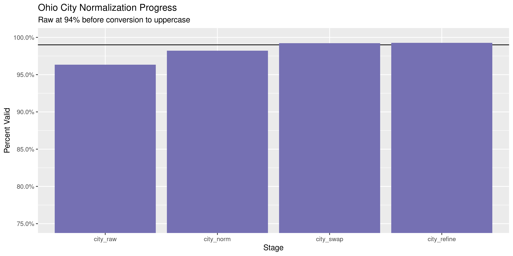
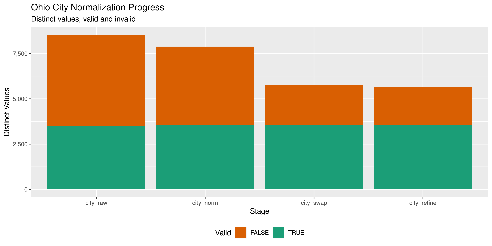

Ohio Expenditures
================
Kiernan Nicholls
2020-09-10 14:44:48

  - [Project](#project)
  - [Objectives](#objectives)
  - [Packages](#packages)
  - [Data](#data)
  - [Import](#import)
  - [Explore](#explore)
  - [Wrangle](#wrangle)
  - [Conclude](#conclude)
  - [Export](#export)
  - [Upload](#upload)
  - [Dictionary](#dictionary)

<!-- Place comments regarding knitting here -->

## Project

The Accountability Project is an effort to cut across data silos and
give journalists, policy professionals, activists, and the public at
large a simple way to search across huge volumes of public data about
people and organizations.

Our goal is to standardizing public data on a few key fields by thinking
of each dataset row as a transaction. For each transaction there should
be (at least) 3 variables:

1.  All **parties** to a transaction.
2.  The **date** of the transaction.
3.  The **amount** of money involved.

## Objectives

This document describes the process used to complete the following
objectives:

1.  How many records are in the database?
2.  Check for entirely duplicated records.
3.  Check ranges of continuous variables.
4.  Is there anything blank or missing?
5.  Check for consistency issues.
6.  Create a five-digit ZIP Code called `zip`.
7.  Create a `year` field from the transaction date.
8.  Make sure there is data on both parties to a transaction.

## Packages

The following packages are needed to collect, manipulate, visualize,
analyze, and communicate these results. The `pacman` package will
facilitate their installation and attachment.

The IRW’s `campfin` package will also have to be installed from GitHub.
This package contains functions custom made to help facilitate the
processing of campaign finance data.

``` r
if (!require("pacman")) install.packages("pacman")
pacman::p_load_gh("irworkshop/campfin")
pacman::p_load(
  tidyverse, # data manipulation
  lubridate, # datetime strings
  gluedown, # printing markdown
  magrittr, # pipe operators
  janitor, # clean data frames
  refinr, # cluster and merge
  scales, # format strings
  aws.s3, # upload to AWS
  knitr, # knit documents
  vroom, # read files fast
  rvest, # html scraping
  glue, # combine strings
  here, # relative paths
  httr, # http requests
  fs # local storage 
)
```

This document should be run as part of the `R_campfin` project, which
lives as a sub-directory of the more general, language-agnostic
[`irworkshop/accountability_datacleaning`](https://github.com/irworkshop/accountability_datacleaning)
GitHub repository.

The `R_campfin` project uses the [RStudio
projects](https://support.rstudio.com/hc/en-us/articles/200526207-Using-Projects)
feature and should be run as such. The project also uses the dynamic
`here::here()` tool for file paths relative to *your* machine.

``` r
# where does this document knit?
here::here()
#> [1] "/home/kiernan/Code/tap/R_campfin"
```

## Data

The data is obtained from the [Ohio Secretary of
State](https://www.ohiosos.gov/). The OH SOS offers a file transfer page
(FTP) to download data in bulk rather than via searches.

> Welcome to the Ohio Secretary of State’s Campaign Finance File
> Transfer Page. This page was developed to allow users to obtain large
> sets of data faster than the normal query process. At this page you
> can download files of pre-queried data, such as all candidate
> Expenditures for a particular year or a list of all active political
> action committees registered with the Secretary of State. In addition,
> campaign finance data filed prior to 2000 is available only on this
> site. These files contain all relevant and frequently requested
> information. If you are looking for smaller or very specific sets of
> data please use the regular Campaign Finance queries listed on the
> tabs above.

## Import

### Download

> On the FTP page, please decide which information you would like to
> download. Click “Download File” on the right hand side. The system
> will then proceed to download the file into Microsoft Excel or provide
> you will an opportunity to download the file to the location on your
> computer (the settings on your computer will dictate this). You may
> see a series of dialog boxes on your screen asking you if you want to
> run or save the zipped `.exe` file. Follow the dialog boxes for
> whichever you chose telling the computer where you want the files
> saved. The end result will be a `.csv` file that you can open in
> Microsoft Excel or some other database application.

We can download all the Expenditure files by reading the FTP website
itself and scraping each of the “Download” links in the table. This
process needs to be repeated for candidates, PACs, and parties.

``` r
ftp_base <- "https://www6.ohiosos.gov/ords/"
t <- c("CAN", "PAC", "PARTY")
ftp_url <- glue("f?p=CFDISCLOSURE:73:7027737052457:{t}:NO:RP:P73_TYPE:{t}:")
ftp_url <- str_c(ftp_base, ftp_url)
ftp_params <- character()
ftp_table <- rep(list(NA), length(t))
for (i in seq_along(t)) {
  ftp_page <- read_html(ftp_url[i])
  table_id <- paste0("#", str_extract(ftp_page, '(?<=id\\=")report_.*(?="\\s)'))
  ftp_table[[i]] <- ftp_page %>%
    html_node(table_id) %>%
    html_table() %>%
    as_tibble() %>%
    select(-last_col()) %>%
    set_names(c("file", "date", "size")) %>%
    mutate_at(vars(2), parse_date_time, "%m/%d/%Y %H:%M:%S %p")
  con_index <- str_which(ftp_table[[i]]$file, "Expenditures\\s-\\s\\d+")
  ftp_params <- ftp_page %>%
    html_node(table_id) %>%
    html_nodes("tr") %>%
    html_nodes("a") %>%
    html_attr("href") %>%
    str_subset("f\\?p") %>%
    extract(con_index) %>%
    append(ftp_params)
}
```

Then each link can be downloaded to the `/data/raw` directory.

``` r
wget <- function(url, dir) {
  system2(
    command = "wget",
    args = c(
      "--no-verbose", 
      "--content-disposition", 
      url, 
      paste("-P", raw_dir)
    )
  )
}
```

``` r
raw_dir <- dir_create(here("oh", "expends", "data", "raw"))
raw_urls <- paste0(ftp_base, ftp_params)
if (length(dir_ls(raw_dir)) < 84) {
  map(raw_urls, wget, raw_dir)
}
```

``` r
raw_info <- dir_info(raw_dir)
sum(raw_info$size)
#> 261M
(raw_files <- raw_info %>%
  select(file_path = path, size, modification_time) %>% 
  mutate(file_id = as.character(row_number()), .before = 1) %>% 
  mutate(across(file_path, basename)))
#> # A tibble: 84 x 4
#>    file_id file_path                   size modification_time  
#>    <chr>   <chr>                <fs::bytes> <dttm>             
#>  1 1       ALL_CAN_EXP_1994.CSV       1.44M 2020-09-10 10:19:18
#>  2 2       ALL_CAN_EXP_1995.CSV       2.01M 2020-09-10 10:19:18
#>  3 3       ALL_CAN_EXP_1996.CSV       4.67M 2020-09-10 10:19:17
#>  4 4       ALL_CAN_EXP_1997.CSV       3.24M 2020-09-10 10:19:17
#>  5 5       ALL_CAN_EXP_1998.CSV       7.41M 2020-09-10 10:19:16
#>  6 6       ALL_CAN_EXP_1999.CSV       3.52M 2020-09-10 10:19:15
#>  7 7       ALL_CAN_EXP_2000.CSV        6.1M 2020-09-10 10:19:15
#>  8 8       ALL_CAN_EXP_2001.CSV       3.03M 2020-09-10 10:19:14
#>  9 9       ALL_CAN_EXP_2002.CSV       6.67M 2020-09-10 10:19:13
#> 10 10      ALL_CAN_EXP_2003.CSV       3.55M 2020-09-10 10:19:13
#> # … with 74 more rows
```

### Read

> The data is in a “comma delimited” format that loads easily into
> Microsoft Excel or Access as well as many other spreadsheet or
> database programs. Many of the available files contain a significant
> quantity of data records. A spreadsheet program, such as Microsoft
> Excel, may not allow all of the data in a file to be loaded because of
> a limit on the number of available rows. For this reason, it is
> advised that a database application be utilized to load and work with
> the data available at this site…

We can read all 84 raw CSV files into a single data frame using
`purrr::map_df()` and `readr::read_csv()`. There are some columns that
only exist in the files containing contributions from a PAC, party, etc.
Most columns are shared across all files, so when we join them together
into a single data frame, empty rows will be created for those unique
columns.

``` r
ohe <- map_df(
  .x = raw_info$path,
  .f = read_csv,
  .id = "file_id",
  na = c("", "NA", "N/A"),
  col_types = cols(
    .default = col_character(),
    MASTER_KEY = col_integer(),
    RPT_YEAR = col_integer(),
    REPORT_KEY = col_integer(),
    EXPEND_DATE = col_date_usa(),
    AMOUNT = col_double(),
    EVENT_DATE = col_date_usa(),
    INKIND = col_logical(),
    DISTRICT = col_integer()
  )
)
```

## Explore

There are 1,323,045 rows of 26 columns.

``` r
glimpse(ohe)
#> Rows: 1,323,045
#> Columns: 26
#> $ com_name   <chr> "OHIOANS WITH SHERROD BROWN", "OHIOANS WITH SHERROD BROWN", "FRIENDS OF GOVER…
#> $ master_key <int> 1, 1, 2, 2, 2, 2, 2, 2, 2, 2, 2, 2, 2, 2, 2, 2, 2, 2, 2, 2, 2, 2, 2, 2, 2, 2,…
#> $ rpt_year   <int> 1994, 1994, 1994, 1994, 1994, 1994, 1994, 1994, 1994, 1994, 1994, 1994, 1994,…
#> $ rpt_key    <int> 126484, 126484, 133054, 133090, 133090, 133135, 133054, 133054, 133054, 13307…
#> $ rpt_desc   <chr> "ANNUAL   (JANUARY)", "ANNUAL   (JANUARY)", "PRE-PRIMARY", "PRE-GENERAL", "PR…
#> $ desc       <chr> "31-B  Stmt of Expenditures", "31-B  Stmt of Expenditures", "31-B  Stmt of Ex…
#> $ first      <chr> NA, NA, NA, NA, NA, "TIMOTHY", NA, NA, NA, NA, NA, NA, NA, NA, NA, NA, NA, NA…
#> $ middle     <chr> NA, NA, NA, NA, NA, NA, NA, NA, NA, NA, NA, NA, NA, NA, NA, NA, NA, NA, NA, N…
#> $ last       <chr> NA, NA, NA, NA, NA, "ALEXANDER", NA, NA, NA, NA, NA, NA, NA, NA, NA, NA, NA, …
#> $ suffix     <chr> NA, NA, NA, NA, NA, NA, NA, NA, NA, NA, NA, NA, NA, NA, NA, NA, NA, NA, NA, N…
#> $ non_ind    <chr> "DECISION RESEARCH CORP.", "MCTIGUE & BROOKS", "A.G. HAUCK CO.", "ABSOLUTE SC…
#> $ address    <chr> "1127 EUCLID AVE. #1100", "4921 DIERKER RD.", "9888 READING RD.", "762 S. FRO…
#> $ city       <chr> "CLEVELAND", "COLUMBUS", "CINCINNATI", "COLUMBUS", "AKRON", "MANSFIELD", "COL…
#> $ state      <chr> "OH", "OH", "OH", "OH", "OH", "OH", "OH", "OH", "OH", "OH", "OH", "OH", "OH",…
#> $ zip        <chr> "44115", "43220", "45241", "43206", "44309", "44903", "43218", "43218", "4321…
#> $ date       <date> 1994-01-27, 1994-01-27, 1994-01-26, 1994-08-30, 1994-09-30, 1994-10-20, 1994…
#> $ amount     <dbl> 1000.00, 874.30, 100.00, 634.50, 721.50, 75.00, 176.87, 221.87, 296.12, 280.3…
#> $ event      <date> NA, NA, NA, NA, 1994-10-10, 1994-10-13, NA, NA, NA, NA, NA, NA, NA, NA, NA, …
#> $ purpose    <chr> "LEGAL SERVICES", "LEGAL SERVICES", "REFUND CONTRIBUTION", "T-SHIRTS", "ADVER…
#> $ inkind     <lgl> FALSE, FALSE, FALSE, FALSE, FALSE, FALSE, FALSE, FALSE, FALSE, FALSE, FALSE, …
#> $ cand_first <chr> "SHERROD", "SHERROD", "BOB", "BOB", "BOB", "BOB", "BOB", "BOB", "BOB", "BOB",…
#> $ cand_last  <chr> "BROWN", "BROWN", "TAFT", "TAFT", "TAFT", "TAFT", "TAFT", "TAFT", "TAFT", "TA…
#> $ office     <chr> "SECRETARY OF STATE", "SECRETARY OF STATE", "SECRETARY OF STATE", "SECRETARY …
#> $ district   <int> 0, 0, 0, 0, 0, 0, 0, 0, 0, 0, 0, 0, 0, 0, 0, 0, 0, 0, 0, 0, 0, 0, 0, 0, 0, 0,…
#> $ party      <chr> "DEMOCRAT", "DEMOCRAT", "REPUBLICAN", "REPUBLICAN", "REPUBLICAN", "REPUBLICAN…
#> $ file_path  <chr> "ALL_CAN_EXP_1994.CSV", "ALL_CAN_EXP_1994.CSV", "ALL_CAN_EXP_1994.CSV", "ALL_…
tail(ohe)
#> # A tibble: 6 x 26
#>   com_name master_key rpt_year rpt_key rpt_desc desc  first middle last  suffix non_ind address
#>   <chr>         <int>    <int>   <int> <chr>    <chr> <chr> <chr>  <chr> <chr>  <chr>   <chr>  
#> 1 COLUMBI…      13710     2020  3.67e8 SEMIANN… 31-M… <NA>  <NA>   <NA>  <NA>   OHIO E… P. O. …
#> 2 COLUMBI…      13710     2020  3.67e8 SEMIANN… 31-M… <NA>  <NA>   <NA>  <NA>   OHIO E… P. O. …
#> 3 COLUMBI…      13710     2020  3.67e8 SEMIANN… 31-M… <NA>  <NA>   <NA>  <NA>   TIME W… P O BO…
#> 4 COLUMBI…      13710     2020  3.67e8 SEMIANN… 31-M… <NA>  <NA>   <NA>  <NA>   TIME W… P O BO…
#> 5 WARREN …      15222     2020  3.65e8 POST-PR… 31-B… <NA>  <NA>   <NA>  <NA>   ERIN R… 1379 W…
#> 6 WARREN …      15222     2020  3.65e8 POST-PR… 31-B… <NA>  <NA>   <NA>  <NA>   MORGAN… 2172 B…
#> # … with 14 more variables: city <chr>, state <chr>, zip <chr>, date <date>, amount <dbl>,
#> #   event <date>, purpose <chr>, inkind <lgl>, cand_first <chr>, cand_last <chr>, office <chr>,
#> #   district <int>, party <chr>, file_path <chr>
```

### Missing

Columns vary in their degree of missing values.

``` r
col_stats(ohe, count_na)
#> # A tibble: 26 x 4
#>    col        class        n        p
#>    <chr>      <chr>    <int>    <dbl>
#>  1 com_name   <chr>        0 0       
#>  2 master_key <int>        0 0       
#>  3 rpt_year   <int>        0 0       
#>  4 rpt_key    <int>        0 0       
#>  5 rpt_desc   <chr>        0 0       
#>  6 desc       <chr>        0 0       
#>  7 first      <chr>  1123558 0.849   
#>  8 middle     <chr>  1298217 0.981   
#>  9 last       <chr>  1122207 0.848   
#> 10 suffix     <chr>  1316851 0.995   
#> 11 non_ind    <chr>   203383 0.154   
#> 12 address    <chr>    71985 0.0544  
#> 13 city       <chr>    50928 0.0385  
#> 14 state      <chr>    48619 0.0367  
#> 15 zip        <chr>    58702 0.0444  
#> 16 date       <date>    1642 0.00124 
#> 17 amount     <dbl>      399 0.000302
#> 18 event      <date> 1276249 0.965   
#> 19 purpose    <chr>    49072 0.0371  
#> 20 inkind     <lgl>  1094444 0.827   
#> 21 cand_first <chr>   678846 0.513   
#> 22 cand_last  <chr>   678755 0.513   
#> 23 office     <chr>   678755 0.513   
#> 24 district   <int>   683117 0.516   
#> 25 party      <chr>   519090 0.392   
#> 26 file_path  <chr>        0 0
```

We can flag records missing a name, date, or amount after uniting the
multiple contributor name columns into a single variable.

``` r
ohe <- ohe %>% 
  unite(
    first, middle, last, suffix, non_ind,
    col = con_name,
    sep = " ",
    remove = FALSE,
    na.rm = TRUE
  ) %>% 
  mutate(across(where(is.character), na_if, "")) %>% 
  relocate(con_name, .after = last_col()) %>% 
  flag_na(date, con_name, amount, com_name)
```

0.30% of rows are missing a key variable.

``` r
sum(ohe$na_flag)
#> [1] 3910
ohe %>% 
  filter(na_flag) %>% 
  select(date, con_name, amount, com_name)
#> # A tibble: 3,910 x 4
#>    date       con_name   amount com_name                      
#>    <date>     <chr>       <dbl> <chr>                         
#>  1 1994-03-31 <NA>         0.6  KEST CAMPAIGN COMMITTEE       
#>  2 1994-11-02 <NA>        12.0  BYRNE FOR STATE SCHOOL BOARD  
#>  3 NA         PETTY CASH  57.2  LEIGH HERINGTON COMMITTEE     
#>  4 1995-02-17 <NA>         3    BERNS FOR STATE REPRESENTATIVE
#>  5 1995-03-17 <NA>         3    BERNS FOR STATE REPRESENTATIVE
#>  6 1995-06-17 <NA>        15    BERNS FOR STATE REPRESENTATIVE
#>  7 1995-06-17 <NA>         1.85 BERNS FOR STATE REPRESENTATIVE
#>  8 1995-09-30 <NA>        25    BURKE FOR SENATE              
#>  9 1995-03-09 <NA>         3.5  FRIENDS OF BOB HAGAN          
#> 10 1995-05-11 <NA>        40    BOB BOGGS LEGISLATIVE FUND    
#> # … with 3,900 more rows
```

### Duplicate

There are actually quite a few duplicate values in the data. While it’s
possible for the same person to contribute the same amount to the same
committee on the same day, we can flag these values anyway.

``` r
d1 <- duplicated(ohe, fromLast = FALSE)
d2 <- duplicated(ohe, fromLast = TRUE)
ohe <- mutate(ohe, dupe_flag = d1 | d2)
rm(d1, d2); flush_memory()
```

2.2% of rows are duplicated at least once.

``` r
ohe %>% 
  filter(dupe_flag) %>% 
  arrange(date, con_name) %>% 
  select(date, con_name, amount, com_name)
#> # A tibble: 28,577 x 4
#>    date       con_name                amount com_name                         
#>    <date>     <chr>                    <dbl> <chr>                            
#>  1 1990-01-02 DOLPHIN COMPUTER SYSTEM   64.2 VOINOVICH COMMITTEE  THE         
#>  2 1990-01-02 DOLPHIN COMPUTER SYSTEM   64.2 VOINOVICH COMMITTEE  THE         
#>  3 1990-02-06 GARICK & ASSOCITES        70   VOINOVICH COMMITTEE  THE         
#>  4 1990-02-06 GARICK & ASSOCITES        70   VOINOVICH COMMITTEE  THE         
#>  5 1990-02-06 GARICK & ASSOCITES        70   VOINOVICH COMMITTEE  THE         
#>  6 1990-02-22 ACE                      246.  VOINOVICH COMMITTEE  THE         
#>  7 1990-02-22 ACE                      246.  VOINOVICH COMMITTEE  THE         
#>  8 1990-03-01 MARGO ROTH              1000   FRIENDS OF FISHER COMMITTEE (LEE)
#>  9 1990-03-01 MARGO ROTH              1000   FRIENDS OF FISHER COMMITTEE (LEE)
#> 10 1990-03-19 FIFTH THIRD BANK          12.2 FRIENDS OF GOVERNOR TAFT         
#> # … with 28,567 more rows
```

### Amounts

``` r
summary(ohe$amount)
#>     Min.  1st Qu.   Median     Mean  3rd Qu.     Max.     NA's 
#>  -150000       50      200     1880      500 23916946      399
prop_na(ohe$amount)
#> [1] 0.000301577
mean(ohe$amount <= 0, na.rm = TRUE)
#> [1] 0.003094554
```

There are the smallest and largest transactions.

``` r
glimpse(ohe[c(which.min(ohe$amount), which.max(ohe$amount)), ])
#> Rows: 2
#> Columns: 29
#> $ com_name   <chr> "UNITED FOOD & COMMERCIAL WORKERS ACTIVE BALLOT CLUB", "REPUBLICAN NATIONAL S…
#> $ master_key <int> 1011, 5009
#> $ rpt_year   <int> 2008, 2000
#> $ rpt_key    <int> 984274, 450475
#> $ rpt_desc   <chr> "FEDERAL5", "PRE-GENERAL"
#> $ desc       <chr> "31-B  Stmt of Expenditures", "31-B  Stmt of Expenditures"
#> $ first      <chr> NA, NA
#> $ middle     <chr> NA, NA
#> $ last       <chr> NA, NA
#> $ suffix     <chr> NA, NA
#> $ non_ind    <chr> "OHIO DEMOCRATIC PARTY", "EXPENDITURES NET PERTAINING TO OHIO"
#> $ address    <chr> "340 E FULTON ST", NA
#> $ city       <chr> "COLUMBUS", NA
#> $ state      <chr> "OH", "OH"
#> $ zip        <chr> "43215", NA
#> $ date       <date> 2008-09-17, NA
#> $ amount     <dbl> -150000, 23916946
#> $ event      <date> NA, NA
#> $ purpose    <chr> "CONTRIBUTION", NA
#> $ inkind     <lgl> NA, NA
#> $ cand_first <chr> NA, NA
#> $ cand_last  <chr> NA, NA
#> $ office     <chr> NA, NA
#> $ district   <int> NA, NA
#> $ party      <chr> NA, "5"
#> $ file_path  <chr> "ALL_PAC_EXP_2008.CSV", "ALL_PAR_EXP_2000.CSV"
#> $ con_name   <chr> "OHIO DEMOCRATIC PARTY", "EXPENDITURES NET PERTAINING TO OHIO"
#> $ na_flag    <lgl> FALSE, TRUE
#> $ dupe_flag  <lgl> FALSE, FALSE
```

The `amount` values are logarithmically normally distributed.

<!-- -->

### Dates

We can create a new column with a 4-digit year from the `date`.

``` r
ohe <- mutate(ohe, year = year(date))
```

There are few `date` values with typos making them really small or
large.

``` r
min(ohe$date, na.rm = TRUE)
#> [1] "10-03-02"
sum(ohe$year < 1990, na.rm = TRUE)
#> [1] 354
max(ohe$date, na.rm = TRUE)
#> [1] "9898-08-21"
sum(ohe$date > today(), na.rm = TRUE)
#> [1] 330
```

<!-- -->

## Wrangle

To improve the searchability of the database, we will perform some
consistent, confident string normalization. For geographic variables
like city names and ZIP codes, the corresponding `campfin::normal_*()`
functions are tailor made to facilitate this process.

### Address

For the street `addresss` variable, the `campfin::normal_address()`
function will force consistence case, remove punctuation, and abbreviate
official USPS suffixes.

``` r
oh_addr_norm <- tibble(
  address = unique(ohe$address),
  address_norm = normal_address(
    address = address,
    abbs = usps_street,
    na_rep = TRUE
  )
)
```

``` r
ohe <- left_join(ohe, oh_addr_norm, by = "address")
```

    #> # A tibble: 243,177 x 2
    #>    address                address_norm        
    #>    <chr>                  <chr>               
    #>  1 1127 EUCLID AVE. #1100 1127 EUCLID AVE 1100
    #>  2 4921 DIERKER RD.       4921 DIERKER RD     
    #>  3 9888 READING RD.       9888 READING RD     
    #>  4 762 S. FRONT ST.       762 S FRNT ST       
    #>  5 PO BOX 610             PO BOX 610          
    #>  6 106 STURGES AVE.       106 STURGES AVE     
    #>  7 PO BOX 182375          PO BOX 182375       
    #>  8 P.O. BOX 182375        PO BOX 182375       
    #>  9 457 MORGAN ST.         457 MORGAN ST       
    #> 10 1638 TANGLEWOOD DR.    1638 TANGLEWOOD DR  
    #> # … with 243,167 more rows

### ZIP

For ZIP codes, the `campfin::normal_zip()` function will attempt to
create valid *five* digit codes by removing the ZIP+4 suffix and
returning leading zeroes dropped by other programs like Microsoft Excel.

``` r
ohe <- mutate(
  .data = ohe,
  zip_norm = normal_zip(
    zip = zip,
    na_rep = TRUE
  )
)
```

``` r
progress_table(
  ohe$zip,
  ohe$zip_norm,
  compare = valid_zip
)
#> # A tibble: 2 x 6
#>   stage    prop_in n_distinct prop_na n_out n_diff
#>   <chr>      <dbl>      <dbl>   <dbl> <dbl>  <dbl>
#> 1 zip        0.923      19060  0.0444 96935  11451
#> 2 zip_norm   0.992       9390  0.0613 10056   1359
```

### State

``` r
prop_in(ohe$state, valid_state)
#> [1] 0.9992946
ohe <- mutate(ohe, state_norm = state)
ohe$state_norm[which(ohe$state == "0H")] <- "OH"
ohe$state_norm[which(ohe$state == "IH")] <- "OH"
ohe$state_norm[which(ohe$state == "PH")] <- "OH"
ohe$state_norm[which(ohe$state == "O")]  <- "OH"
ohe$state_norm[str_which(ohe$state, "^O\\W$")]  <- "OH"
ohe$state_norm[str_which(ohe$state, "^\\WH$")]  <- "OH"
prop_in(ohe$state_norm, valid_state)
#> [1] 0.9994609
```

### City

Cities are the most difficult geographic variable to normalize, simply
due to the wide variety of valid cities and formats.

#### Normal

The `campfin::normal_city()` function is a good start, again converting
case, removing punctuation, but *expanding* USPS abbreviations. We can
also remove `invalid_city` values.

``` r
ohe <- mutate(
  .data = ohe,
  city_norm = normal_city(
    city = city, 
    abbs = usps_city,
    states = c("OH", "DC", "OHIO"),
    na = invalid_city,
    na_rep = TRUE
  )
)
```

#### Swap

We can further improve normalization by comparing our normalized value
against the *expected* value for that record’s state abbreviation and
ZIP code. If the normalized value is either an abbreviation for or very
similar to the expected value, we can confidently swap those two.

``` r
ohe <- ohe %>% 
  rename(city_raw = city) %>% 
  left_join(
    y = zipcodes,
    by = c(
      "state_norm" = "state",
      "zip_norm" = "zip"
    )
  ) %>% 
  rename(city_match = city) %>% 
  mutate(
    match_abb = is_abbrev(city_norm, city_match),
    match_dist = str_dist(city_norm, city_match),
    city_swap = if_else(
      condition = !is.na(match_dist) & (match_abb | match_dist == 1),
      true = city_match,
      false = city_norm
    )
  ) %>% 
  select(
    -city_match,
    -match_dist,
    -match_abb
  )
```

#### Refine

The \[OpenRefine\] algorithms can be used to group similar strings and
replace the less common versions with their most common counterpart.
This can greatly reduce inconsistency, but with low confidence; we will
only keep any refined strings that have a valid city/state/zip
combination.

``` r
good_refine <- ohe %>% 
  mutate(
    city_refine = city_swap %>% 
      key_collision_merge() %>% 
      n_gram_merge(numgram = 1)
  ) %>% 
  filter(city_refine != city_swap) %>% 
  inner_join(
    y = zipcodes,
    by = c(
      "city_refine" = "city",
      "state_norm" = "state",
      "zip_norm" = "zip"
    )
  )
```

    #> # A tibble: 137 x 5
    #>    state_norm zip_norm city_swap    city_refine       n
    #>    <chr>      <chr>    <chr>        <chr>         <int>
    #>  1 OH         45263    CINCINATTI   CINCINNATI       40
    #>  2 OH         45208    CINCINATTI   CINCINNATI       24
    #>  3 OH         45249    CINCINATTI   CINCINNATI       15
    #>  4 OH         45202    CINCINATTI   CINCINNATI       13
    #>  5 CA         94110    SAN FRANSICO SAN FRANCISCO    11
    #>  6 OH         45214    CINCINATTI   CINCINNATI       11
    #>  7 OH         45274    CINCINATTI   CINCINNATI       11
    #>  8 AZ         85072    PHONIEX      PHOENIX          10
    #>  9 GA         30101    ARCHWORTH    ACWORTH          10
    #> 10 OH         44320    AKRONAKRON   AKRON             9
    #> # … with 127 more rows

Then we can join the refined values back to the database.

``` r
ohe <- ohe %>% 
  left_join(good_refine, by = names(.)) %>% 
  mutate(city_refine = coalesce(city_refine, city_swap))
```

#### Progress

| stage        | prop\_in | n\_distinct | prop\_na | n\_out | n\_diff |
| :----------- | -------: | ----------: | -------: | -----: | ------: |
| city\_raw    |    0.963 |        8542 |    0.038 |  46667 |    5021 |
| city\_norm   |    0.982 |        7890 |    0.039 |  22672 |    4316 |
| city\_swap   |    0.992 |        5751 |    0.039 |   9781 |    2188 |
| city\_refine |    0.993 |        5663 |    0.039 |   9408 |    2101 |

You can see how the percentage of valid values increased with each
stage.

<!-- -->

More importantly, the number of distinct values decreased each stage. We
were able to confidently change many distinct invalid values to their
valid equivalent.

<!-- -->

## Conclude

``` r
ohe <- ohe %>% 
  select(
    -city_norm,
    -city_swap,
    city_clean = city_refine
  ) %>% 
  rename_all(~str_remove(., "_raw")) %>% 
  rename_all(~str_replace(., "_norm", "_clean"))
```

``` r
glimpse(sample_n(ohe, 20))
#> Rows: 20
#> Columns: 34
#> $ com_name      <chr> "CITIZENS FOR JIM PETRO", "OHIO ASSOCIATION OF AREA AGENCIES ON AGING PAC"…
#> $ master_key    <int> 30, 11763, 1500, 568, 14744, 10285, 344, 6541, 1814, 13702, 12721, 6089, 5…
#> $ rpt_year      <int> 2000, 2009, 2004, 2002, 2018, 2007, 2019, 2015, 2008, 2012, 2018, 2006, 20…
#> $ rpt_key       <int> 129166, 1064053, 800842, 169666, 318473689, 236806, 350974738, 185479105, …
#> $ rpt_desc      <chr> "ANNUAL   (JANUARY)", "PRE-PRIMARY", "PRE-GENERAL", "PRE-GENERAL", "PRE-PR…
#> $ desc          <chr> "31-F  FR Expenditures", "31-B  Stmt of Expenditures", "31-B  Stmt of Expe…
#> $ first         <chr> NA, NA, NA, NA, NA, NA, NA, NA, NA, NA, NA, NA, NA, NA, NA, NA, "RASHANDA"…
#> $ middle        <chr> NA, NA, NA, NA, NA, NA, NA, NA, NA, NA, NA, NA, NA, NA, NA, NA, NA, "D.", …
#> $ last          <chr> NA, NA, NA, NA, NA, NA, NA, NA, NA, NA, NA, NA, NA, NA, NA, NA, "LEE", "MO…
#> $ suffix        <chr> NA, NA, NA, NA, NA, NA, NA, NA, NA, NA, NA, NA, NA, NA, NA, NA, NA, NA, NA…
#> $ non_ind       <chr> "FRIENDS OF BILL BUNNING", "FRIENDS OF DALE MILLER", "PADGETT FOR OHIO", "…
#> $ address       <chr> "361 HILLTOP BLVD.", "4300 WEST 143 RD. ST", "871 WALNUT ST", "8187 TR 90"…
#> $ city          <chr> "CANFIELD", "CLEVELAND", "COSHOCTON", "ADA", "MASSILLON", "MADISON", "AKRO…
#> $ state         <chr> "OH", "OH", "OH", "OH", "OH", "WI", "OH", "OH", "OH", "OH", "OH", "OH", "O…
#> $ zip           <chr> "44406", "44135", "43812", "45810", "44646", "53707-1042", "44303", "43220…
#> $ date          <date> 2000-11-15, 2009-04-13, 2004-06-24, 2002-07-19, 2018-03-01, 2007-01-30, 2…
#> $ amount        <dbl> 75.00, 500.00, 500.00, 125.00, 1089.38, 16.43, 96.78, 250.00, 2500.00, 480…
#> $ event         <date> NA, NA, NA, NA, 2018-03-01, NA, NA, NA, NA, NA, NA, NA, NA, NA, NA, NA, N…
#> $ purpose       <chr> "TICKETS", "CAMPAIGN CONTRIBUTION", "CONTRIBUTION", "CENTURY CLUB DINNER",…
#> $ inkind        <lgl> NA, NA, NA, FALSE, NA, NA, NA, NA, NA, NA, NA, NA, NA, NA, FALSE, NA, NA, …
#> $ cand_first    <chr> "JIM", NA, NA, "JAMES", "JAMES", "TED", "RANDALL", "JON", NA, "LORI", "JOE…
#> $ cand_last     <chr> "PETRO", NA, NA, "HOOPS", "HAAVISTO", "STRICKLAND", "GARDNER", "HUSTED", N…
#> $ office        <chr> "AUDITOR", NA, NA, "HOUSE", "HOUSE", "GOVERNOR", "SENATE", "SECRETARY OF S…
#> $ district      <int> 0, NA, NA, 75, 49, 0, 2, 0, NA, 4, NA, NA, NA, NA, 0, NA, 38, 0, NA, 28
#> $ party         <chr> "REPUBLICAN", NA, NA, "REPUBLICAN", "REPUBLICAN", "DEMOCRAT", "REPUBLICAN"…
#> $ file_path     <chr> "ALL_CAN_EXP_2000.CSV", "ALL_PAC_EXP_2009.CSV", "ALL_PAC_EXP_2004.CSV", "A…
#> $ con_name      <chr> "FRIENDS OF BILL BUNNING", "FRIENDS OF DALE MILLER", "PADGETT FOR OHIO", "…
#> $ na_flag       <lgl> FALSE, FALSE, FALSE, FALSE, FALSE, FALSE, FALSE, FALSE, FALSE, FALSE, FALS…
#> $ dupe_flag     <lgl> FALSE, FALSE, FALSE, FALSE, FALSE, FALSE, FALSE, FALSE, FALSE, FALSE, FALS…
#> $ year          <dbl> 2000, 2009, 2004, 2002, 2018, 2007, 2019, 2015, 2008, 2012, 2018, 2006, 20…
#> $ address_clean <chr> "361 HILLTOP BLVD", "4300 W 143 RD ST", "871 WALNUT ST", "8187 TR 90", "12…
#> $ zip_clean     <chr> "44406", "44135", "43812", "45810", "44646", "53707", "44303", "43220", "4…
#> $ state_clean   <chr> "OH", "OH", "OH", "OH", "OH", "WI", "OH", "OH", "OH", "OH", "OH", "OH", "O…
#> $ city_clean    <chr> "CANFIELD", "CLEVELAND", "COSHOCTON", "ADA", "MASSILLON", "MADISON", "AKRO…
```

1.  There are 1,323,047 records in the database.
2.  The range and distribution of `amount` and `date` seem reasonable.
3.  There are 3,910 records missing a key variable.
4.  Consistency in geographic data has been improved with
    `campfin::normal_*()`.
5.  The 4-digit `year` variable has been created with
    `lubridate::year()`.

## Export

``` r
clean_dir <- dir_create(here("oh", "expends", "data", "clean"))
clean_path <- path(clean_dir, "oh_expends_clean.csv")
write_csv(ohe, clean_path, na = "")
file_size(clean_path)
#> 380M
file_encoding(clean_path) %>% 
  mutate(across(path, path.abbrev))
#> # A tibble: 1 x 3
#>   path                                         mime            charset 
#>   <chr>                                        <chr>           <chr>   
#> 1 ~/oh/expends/data/clean/oh_expends_clean.csv application/csv us-ascii
```

## Upload

We can use the `aws.s3::put_object()` to upload the text file to the IRW
server.

``` r
s3_path <- path("csv", basename(clean_path))
if (!object_exists(s3_path, "publicaccountability")) {
  put_object(
    file = clean_path,
    object = s3_path, 
    bucket = "publicaccountability",
    acl = "public-read",
    multipart = TRUE,
    show_progress = TRUE
  )
}
```

``` r
as_fs_bytes(object_size(s3_path, "publicaccountability"))
#> 380M
```

## Dictionary

The following table describes the variables in our final exported file:

| Column          | Original               | Type        | Definition                             |
| :-------------- | :--------------------- | :---------- | :------------------------------------- |
| `com_name`      | `COM_NAME`             | `character` | Spending committee name                |
| `master_key`    | `MASTER_KEY`           | `integer`   | Master key                             |
| `rpt_year`      | `RPT_YEAR`             | `integer`   | Year report filed                      |
| `rpt_key`       | `REPORT_KEY`           | `integer`   | Unique report key                      |
| `rpt_desc`      | `REPORT_DESCRIPTION`   | `character` | Type of report filed                   |
| `desc`          | `SHORT_DESCRIPTION`    | `character` | Description of report                  |
| `first`         | `FIRST_NAME`           | `character` | Full contributor name                  |
| `middle`        | `MIDDLE_NAME`          | `character` | Contributor first name                 |
| `last`          | `LAST_NAME`            | `character` | Contributor middle name                |
| `suffix`        | `SUFFIX_NAME`          | `character` | Contributor last name                  |
| `non_ind`       | `NON_INDIVIDUAL`       | `character` | Contributor name suffix                |
| `address`       | `ADDRESS`              | `character` | Contributor non-individual name        |
| `city`          | `CITY`                 | `character` | Contributor street address             |
| `state`         | `STATE`                | `character` | Contributor city name                  |
| `zip`           | `ZIP`                  | `character` | Contributor state abbreviation         |
| `date`          | `EXPEND_DATE`          | `double`    | Contributor ZIP+4 code                 |
| `amount`        | `AMOUNT`               | `double`    | Date contribution made                 |
| `event`         | `EVENT_DATE`           | `double`    | Contribution amount                    |
| `purpose`       | `PURPOSE`              | `character` | Date fundraising event hosted          |
| `inkind`        | `INKIND`               | `logical`   | Contribution purpose                   |
| `cand_first`    | `CANDIDATE FIRST NAME` | `character` | Flag indicating in-kind contribution   |
| `cand_last`     | `CANDIDATE LAST NAME`  | `character` | Receiving candidate first name         |
| `office`        | `OFFICE`               | `character` | Receiving candidate last name          |
| `district`      | `DISTRICT`             | `integer`   | Office sought by candidate             |
| `party`         | `PARTY`                | `character` | District sought by candidate           |
| `file_path`     |                        | `character` | Candidate political party              |
| `con_name`      |                        | `character` | Data source file name                  |
| `na_flag`       |                        | `logical`   | Flag for missing date, amount, or name |
| `dupe_flag`     |                        | `logical`   | Flag for completely duplicated record  |
| `year`          |                        | `double`    | Calendar year of contribution date     |
| `address_clean` |                        | `character` | Normalized combined street address     |
| `zip_clean`     |                        | `character` | Normalized 5-digit ZIP code            |
| `state_clean`   |                        | `character` | Normalized state abbreviation          |
| `city_clean`    |                        | `character` | Normalized city name                   |
