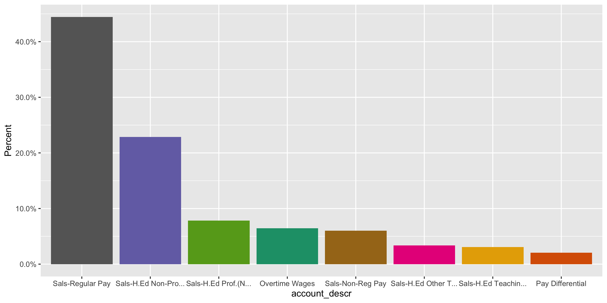
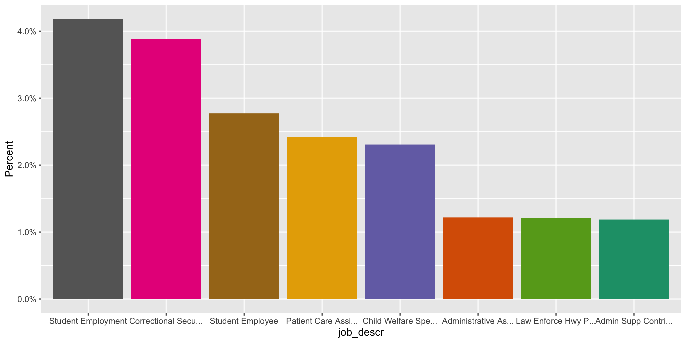
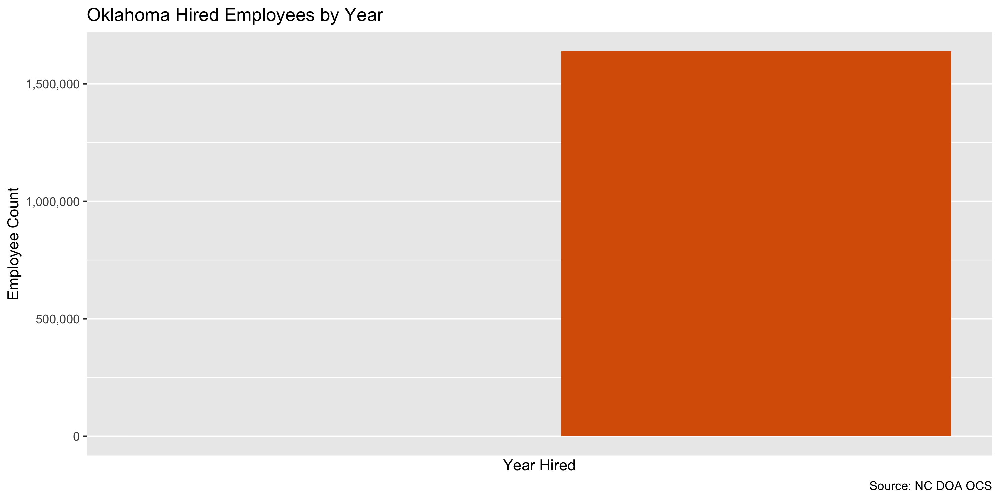

Oklahoma Salaries
================
Victor Brew
2020-11-19 12:19:51

  - [Project](#project)
  - [Objectives](#objectives)
  - [Packages](#packages)
  - [Data](#data)
  - [Extract](#extract)
  - [Read](#read)
  - [Explore](#explore)
  - [Wrangle](#wrangle)
  - [Conclude](#conclude)
  - [Export](#export)
  - [Upload](#upload)

<!-- Place comments regarding knitting here -->

## Project

The Accountability Project is an effort to cut across data silos and
give journalists, policy professionals, activists, and the public at
large a simple way to search across huge volumes of public data about
people and organizations.

Our goal is to standardize public data on a few key fields by thinking
of each dataset row as a transaction. For each transaction there should
be (at least) 3 variables:

1.  All **parties** to a transaction.
2.  The **date** of the transaction.
3.  The **amount** of money involved.

## Objectives

This document describes the process used to complete the following
objectives:

1.  How many records are in the database?
2.  Check for entirely duplicated records.
3.  Check ranges of continuous variables.
4.  Is there anything blank or missing?
5.  Check for consistency issues.
6.  Create a five-digit ZIP Code called `zip`.
7.  Create a `year` field from the transaction date.
8.  Make sure there is data on both parties to a transaction.

## Packages

The following packages are needed to collect, manipulate, visualize,
analyze, and communicate these results. The `pacman` package will
facilitate their installation and attachment.

The IRW’s `campfin` package will also have to be installed from GitHub.
This package contains functions custom made to help facilitate the
processing of campaign finance data.

``` r
if (!require("pacman")) install.packages("pacman")
pacman::p_load_gh("irworkshop/campfin")
pacman::p_load(
  tidyverse, # data manipulation
  lubridate, # datetime strings
  gluedown, # printing markdown
  magrittr, # pipe operators
  janitor, # clean data frames
  refinr, # cluster and merge
  readxl, # read excel files
  scales, # format strings
  knitr, # knit documents
  vroom, # read files fast
  rvest, # html scraping
  glue, # combine strings
  here, # relative paths
  httr, # http requests
  fs # local storage 
)
```

This document should be run as part of the `R_campfin` project, which
lives as a sub-directory of the more general, language-agnostic
[`irworkshop/accountability_datacleaning`](https://github.com/irworkshop/accountability_datacleaning)
GitHub repository.

The `R_campfin` project uses the [RStudio
projects](https://support.rstudio.com/hc/en-us/articles/200526207-Using-Projects)
feature and should be run as such. The project also uses the dynamic
`here::here()` tool for file paths relative to *your* machine.

``` r
# where does this document knit?
here::here()
#> [1] "/Users/vbrewski/Documents/American Schoolwork/Work/accountability_datacleaning/R_campfin"
```

## Data

Salary data for the state of Oklahoma was obtained via a download from
the state’s data portal from the \[Office of Management and Enterprise
Services\] (<https://data.ok.gov/tags/payroll/>).

## Extract

``` r
raw_dir <- dir_create(here("ok", "salary", "data", "raw"))
raw_zip <- path(raw_dir,"Oklahoma_salaries.zip")
```

The ZIP archive itself contains a number of subsequent ZIP archives.

``` r
(zip_files <- raw_zip %>% 
  unzip(list = TRUE) %>% 
  as_tibble(.name_repair = tolower) %>% 
  mutate(across(length, as_fs_bytes)) %>% 
  mutate(across(name, as_fs_path)))
#> # A tibble: 34 x 3
#>    name                                                       length date               
#>    <fs::path>                                            <fs::bytes> <dttm>             
#>  1 State of Oklahoma PY - Jul 2019 2.csv                       18.1M 2020-08-06 21:41:00
#>  2 __MACOSX/._State of Oklahoma PY - Jul 2019 2.csv              313 2020-08-06 21:41:00
#>  3 State of Oklahoma Payroll - Feb 2019 2.csv                  20.5M 2020-08-06 21:55:00
#>  4 __MACOSX/._State of Oklahoma Payroll - Feb 2019 2.csv         313 2020-08-06 21:55:00
#>  5 State of Oklahoma Payroll - Jan 2019 2.csv                  18.8M 2020-08-06 21:27:00
#>  6 __MACOSX/._State of Oklahoma Payroll - Jan 2019 2.csv         313 2020-08-06 21:27:00
#>  7 State of Oklahoma Payroll - Mar 2019 2.csv                  22.3M 2020-08-06 21:46:00
#>  8 __MACOSX/._State of Oklahoma Payroll - Mar 2019 2.csv         313 2020-08-06 21:46:00
#>  9 State of Oklahoma Payroll - Apr 2019 2.csv                  19.9M 2020-08-06 21:34:00
#> 10 __MACOSX/._State of Oklahoma Payroll - Apr 2019 2.csv         313 2020-08-06 21:34:00
#> # … with 24 more rows
```

We can extract only the file containing the latest salary data. \#There
might not be a flag in here for overwrite How do we incorporate a flag
to ovewrite? Overwrite argument

``` r
raw_path <- unzip(
  zipfile = raw_zip, 
  files = str_subset(zip_files$name,"^State"), 
  exdir = raw_dir,
  junkpaths = TRUE,
  overwrite = TRUE
)
```

``` r
length(raw_path) #Run this before code to see length before changes 
#> [1] 17
```

``` r
#
file_info(raw_path) %>% 
  group_by(size) %>% 
  slice(1)
#> # A tibble: 11 x 18
#>    path       type   size permissions modification_time   user  group device_id hard_links
#>    <fs::path> <fct> <fs:> <fs::perms> <dttm>              <chr> <chr>     <dbl>      <dbl>
#>  1 /Users/vb… file    18M rw-rw-rw-   2020-11-19 12:19:54 vbre… staff  16777220          1
#>  2 /Users/vb… file  18.1M rw-rw-rw-   2020-11-19 12:19:53 vbre… staff  16777220          1
#>  3 /Users/vb… file  18.8M rw-rw-rw-   2020-11-19 12:19:53 vbre… staff  16777220          1
#>  4 /Users/vb… file  19.6M rw-rw-rw-   2020-11-19 12:19:53 vbre… staff  16777220          1
#>  5 /Users/vb… file  19.9M rw-rw-rw-   2020-11-19 12:19:53 vbre… staff  16777220          1
#>  6 /Users/vb… file  20.4M rw-rw-rw-   2020-11-19 12:19:54 vbre… staff  16777220          1
#>  7 /Users/vb… file  20.5M rw-rw-rw-   2020-11-19 12:19:53 vbre… staff  16777220          1
#>  8 /Users/vb… file  21.2M rw-rw-rw-   2020-11-19 12:19:54 vbre… staff  16777220          1
#>  9 /Users/vb… file  22.3M rw-rw-rw-   2020-11-19 12:19:53 vbre… staff  16777220          1
#> 10 /Users/vb… file  23.7M rw-rw-rw-   2020-11-19 12:19:54 vbre… staff  16777220          1
#> 11 /Users/vb… file  23.9M rw-rw-rw-   2020-11-19 12:19:54 vbre… staff  16777220          1
#> # … with 9 more variables: special_device_id <dbl>, inode <dbl>, block_size <dbl>, blocks <dbl>,
#> #   flags <int>, generation <dbl>, access_time <dttm>, change_time <dttm>, birth_time <dttm>
```

``` r
file_info(raw_path) %>% # make table of file into
  group_by(size) %>% # group them by file size
  slice(1) %>% # keep only ONE of the same size
  pull(path) -> raw_path # pull the path column as vector
```

``` r
length(raw_path) #Run this after code to see if changes worked. 
#> [1] 11
```

## Read

The excel file containing salaries is a fixed-width file (FWF) with each
column found at unique line position. We can use the record layout Word
document provided by the OSC to define the columns and their positions.

We can use this information in `readr::read_fwf()` to parse the text
file as a data frame for exploration.

``` r
oks <- vroom(
  file = raw_path, 
  col_names = read_names(raw_path[1]),
  skip = 1,
  id = "source_file",
  .name_repair = make_clean_names,
  col_types = cols(
   # REPORTING_PERIOD = col_date("%m/%d/%y"),
    CHECK_DATE = col_date("%m/%d/%Y")
  )
  )
```

``` r
oks <- oks %>%
  mutate(
  across(reporting_period,
         mdy)
)
```

## Explore

Here we have the top and bottom of the data frame, it appears as though
the entire file has been properly read.

``` r
glimpse(oks)
#> Rows: 1,637,879
#> Columns: 16
#> $ source_file      <chr> "/Users/vbrewski/Documents/American Schoolwork/Work/accountability_data…
#> $ reporting_period <date> 2019-06-30, 2019-06-30, 2019-06-30, 2019-06-30, 2019-06-30, 2019-06-30…
#> $ company          <chr> "010", "010", "010", "010", "010", "010", "010", "010", "010", "010", "…
#> $ agency_name      <chr> "OKLAHOMA STATE UNIVERSITY", "OKLAHOMA STATE UNIVERSITY", "OKLAHOMA STA…
#> $ first_name       <chr> "Megan", "Michael", "Val", "Dustin", "Joshua", "Joshua", "Joshua", "Ton…
#> $ middle_initial   <chr> "M", "J", "G", "S", "C", "C", "C", "A", "A", "D", "D", "W", "W", "R", "…
#> $ last_name        <chr> "Ivanova", "Iven", "Iven", "Ivey", "Ivey", "Ivey", "Ivey", "Ivey", "Ive…
#> $ empl_class       <chr> "U", "U", "U", "U", "U", "U", "U", "U", "U", "U", "U", "U", "U", "U", "…
#> $ hours            <dbl> 77, 160, 160, 160, 62, 80, 94, 0, 42, 27, 30, 80, 80, 1, 81, 82, 1, 0, …
#> $ check_date       <date> 2019-06-28, 2019-06-28, 2019-06-28, 2019-06-28, 2019-06-14, 2019-06-28…
#> $ paycheck_nbr     <dbl> 210635395, 210636591, 210636592, 210637900, 210627418, 210631474, 21063…
#> $ gross_pay        <dbl> 1389.08, 4000.00, 15752.48, 4492.57, 738.00, 960.00, 846.00, 5823.34, 5…
#> $ account          <dbl> 511160, 511150, 511150, 511150, 511160, 511160, 511270, 511140, 511150,…
#> $ account_descr    <chr> "Sals-H.Ed Non-Prof. Pay", "Sals-H.Ed Prof.(Non-Teach) Pay", "Sals-H.Ed…
#> $ comp_frequency   <chr> "B", "M", "M", "M", "B", "B", "B", "M", "M", "B", "B", "B", "B", "B", "…
#> $ job_descr        <chr> "Technical Supp Contributor", "Admin Svcs Specialist", "Sr Admin Svcs C…
tail(oks)
#> # A tibble: 6 x 16
#>   source_file reporting_period company agency_name first_name middle_initial last_name empl_class
#>   <chr>       <date>           <chr>   <chr>       <chr>      <chr>          <chr>     <chr>     
#> 1 /Users/vbr… 2019-11-30       345     DEPARTMENT… JOSHUA     A              BARNES    C         
#> 2 /Users/vbr… 2019-11-30       566     DEPARTMENT… TRACY      D              GRUNDEN   U         
#> 3 /Users/vbr… 2019-11-30       400     OFFICE OF … CLINTON    W              ROBINSON  C         
#> 4 /Users/vbr… 2019-11-30       566     DEPARTMENT… BROOKLYN   V              STEED     U         
#> 5 /Users/vbr… 2019-11-30       650     DEPARTMENT… CHRISTINA  <NA>           WILKERSON C         
#> 6 /Users/vbr… 2019-11-30       619     PHYSICIAN … DANA       L              MORPHEW   C         
#> # … with 8 more variables: hours <dbl>, check_date <date>, paycheck_nbr <dbl>, gross_pay <dbl>,
#> #   account <dbl>, account_descr <chr>, comp_frequency <chr>, job_descr <chr>
```

### Missing

Most columns are missing some amount of values; we can flag any records
missing one of the key variables needed to identify a transaction.

``` r
#Go across every column, count the number of NA rows per column and then calculate the % of NA 
col_stats(oks, count_na)
#> # A tibble: 16 x 4
#>    col              class       n          p
#>    <chr>            <chr>   <int>      <dbl>
#>  1 source_file      <chr>       0 0         
#>  2 reporting_period <date>      0 0         
#>  3 company          <chr>       0 0         
#>  4 agency_name      <chr>       0 0         
#>  5 first_name       <chr>      12 0.00000733
#>  6 middle_initial   <chr>  174854 0.107     
#>  7 last_name        <chr>       0 0         
#>  8 empl_class       <chr>     167 0.000102  
#>  9 hours            <dbl>       0 0         
#> 10 check_date       <date>      0 0         
#> 11 paycheck_nbr     <dbl>       0 0         
#> 12 gross_pay        <dbl>       0 0         
#> 13 account          <dbl>       0 0         
#> 14 account_descr    <chr>       0 0         
#> 15 comp_frequency   <chr>       0 0         
#> 16 job_descr        <chr>    8807 0.00538
```

``` r
oks <- oks %>% flag_na(check_date, last_name, gross_pay, hours, agency_name, job_descr) #Creates a new column with trues and falses and puts a true on any row that's missing a variable ex. .5% of rows is missing one of those values. .5 is normal though
mean(oks$na_flag) %>% #change this to sum to count the rows vs find %
  percent(0.01)
#> [1] "0.54%"
```

``` r
oks %>% #Take all the salaries and keep only the columns where NA is true and recount the values 
  filter(na_flag) %>% 
  select(check_date, last_name, gross_pay, hours, agency_name, job_descr) %>%
  col_stats(count_na)
#> # A tibble: 6 x 4
#>   col         class      n     p
#>   <chr>       <chr>  <int> <dbl>
#> 1 check_date  <date>     0     0
#> 2 last_name   <chr>      0     0
#> 3 gross_pay   <dbl>      0     0
#> 4 hours       <dbl>      0     0
#> 5 agency_name <chr>      0     0
#> 6 job_descr   <chr>   8807     1
```

100% of these records missing a job description, but it’s not entirely
contained in a single employee type.

``` r
oks %>% #of the missing job descriptions 96% of them are the U class 
  filter(na_flag) %>% 
  count(empl_class, sort = TRUE) %>% 
  add_prop()
#> # A tibble: 2 x 3
#>   empl_class     n      p
#>   <chr>      <int>  <dbl>
#> 1 U           8529 0.968 
#> 2 C            278 0.0316
```

### Duplicates

There are only a handful of entirely duplicated records.

``` r
oks <- flag_dupes(oks,-source_file, .check = F) #create another logical column that puts true's next to each row with duplicates 
sum(oks$dupe_flag)
#> [1] 100
```

``` r
dups <- oks %>% 
  filter(dupe_flag) %>% 
  select(source_file, check_date, last_name, gross_pay, hours, agency_name, job_descr) %>% 
  arrange(check_date, last_name, gross_pay) %>%
  mutate(across(source_file, basename))
```

### Categorical

``` r
col_stats(oks, n_distinct)
#> # A tibble: 18 x 4
#>    col              class        n          p
#>    <chr>            <chr>    <int>      <dbl>
#>  1 source_file      <chr>       11 0.00000672
#>  2 reporting_period <date>      11 0.00000672
#>  3 company          <chr>      149 0.0000910 
#>  4 agency_name      <chr>      149 0.0000910 
#>  5 first_name       <chr>    19472 0.0119    
#>  6 middle_initial   <chr>       28 0.0000171 
#>  7 last_name        <chr>    36510 0.0223    
#>  8 empl_class       <chr>        4 0.00000244
#>  9 hours            <dbl>    12134 0.00741   
#> 10 check_date       <date>     253 0.000154  
#> 11 paycheck_nbr     <dbl>  1315966 0.803     
#> 12 gross_pay        <dbl>   207419 0.127     
#> 13 account          <dbl>       20 0.0000122 
#> 14 account_descr    <chr>       20 0.0000122 
#> 15 comp_frequency   <chr>        4 0.00000244
#> 16 job_descr        <chr>    11029 0.00673   
#> 17 na_flag          <lgl>        2 0.00000122
#> 18 dupe_flag        <lgl>        2 0.00000122
```

<!-- --><!-- -->

### Amounts

A significant amount of employees have a current salary less than or
equal to $1.

``` r
summary(oks$gross_pay)
#>    Min. 1st Qu.  Median    Mean 3rd Qu.    Max. 
#>  -44431     360    1396    2062    2732 1058333
mean(oks$gross_pay <= 1, na.rm = TRUE)
#> [1] 0.02719676
```

``` r
#take the data and filter 
oks %>% 
  filter(gross_pay <= 1) %>%
  count(agency_name, sort = T) %>%
  add_prop()
#> # A tibble: 115 x 3
#>    agency_name                                 n      p
#>    <chr>                                   <int>  <dbl>
#>  1 DEPARTMENT OF CORRECTIONS               21026 0.472 
#>  2 DEPARTMENT OF PUBLIC SAFETY              4593 0.103 
#>  3 DEPARTMENT OF HUMAN SERVICES             4588 0.103 
#>  4 OKLAHOMA TURNPIKE AUTHORITY              2138 0.0480
#>  5 MENTAL HEALTH AND SUBSTANCE ABUSE SERV.  2034 0.0457
#>  6 J.D. MCCARTY CENTER                      1367 0.0307
#>  7 DEPARTMENT OF REHABILITATION SERVICES    1010 0.0227
#>  8 OKLA. BUREAU OF NARCOTICS AND DANGEROUS   782 0.0176
#>  9 DEPT OF AGRICULTURE FOOD & FORESTRY       697 0.0156
#> 10 DEPARTMENT OF VETERANS AFFAIRS            559 0.0125
#> # … with 105 more rows
```

Here is the employee with the highest salary.

``` r
oks[which.max(oks$gross_pay), ] %>% 
  mutate(across(gross_pay, dollar)) %>% 
  glimpse()
#> Rows: 1
#> Columns: 18
#> $ source_file      <chr> "/Users/vbrewski/Documents/American Schoolwork/Work/accountability_data…
#> $ reporting_period <date> 2019-06-30
#> $ company          <chr> "760"
#> $ agency_name      <chr> "UNIVERSITY OF OKLAHOMA"
#> $ first_name       <chr> "LINCOLN"
#> $ middle_initial   <chr> NA
#> $ last_name        <chr> "RILEY"
#> $ empl_class       <chr> "U"
#> $ hours            <dbl> 160
#> $ check_date       <date> 2019-06-28
#> $ paycheck_nbr     <dbl> 3666063
#> $ gross_pay        <chr> "$1,058,333"
#> $ account          <dbl> 511150
#> $ account_descr    <chr> "Sals-H.Ed Prof.(Non-Teach) Pay"
#> $ comp_frequency   <chr> "M"
#> $ job_descr        <chr> "Coach/Sports Prof IV"
#> $ na_flag          <lgl> FALSE
#> $ dupe_flag        <lgl> FALSE
```

<!-- -->

### Dates

Over NA of all hire `date` values are missing. Again, most of these
missing values belong to members of the National Guard or temporary
employees,

We can add the calendar year from `date` with `lubridate::year()`

``` r
oks <- mutate(oks, year = year(check_date))
```

``` r
min(oks$check_date, na.rm = TRUE)
#> [1] "1019-07-31"
sum(oks$year < 2000, na.rm = TRUE)
#> [1] 2
max(oks$check_date, na.rm = TRUE)
#> [1] "9019-05-17"
sum(oks$check_date > today(), na.rm = TRUE)
#> [1] 1
```

State employees have hire dates going back to .

<!-- -->

## Wrangle

Before exporting, we will add the 2-letter state abbreviation.

``` r
mutate(oks, state = "OK", .before = "agency_name") -> oks
```

## Conclude

1.  There are 1,637,879 records in the database.
2.  There are 100 duplicate records in the database.
3.  The range and distribution of `gross_pay` and `date` seem
    reasonable, aside from the $1 salaries.
4.  There are 8,807 records missing key variables.
5.  There are no geographic variables in need of normalization.
6.  The 4-digit `year` variable has been created with
    `lubridate::year()`.

## Export

Now the file can be saved on disk for upload to the Accountability
server.

``` r
clean_dir <- dir_create(here("ok", "salary", "data", "clean"))
clean_path <- path(clean_dir, "ok_salary_clean.csv")
write_csv(oks, clean_path, na = "")
file_size(clean_path) 
#> 487M
```

## Upload

We can use the `aws.s3::put_object()` to upload the text file to the IRW
server.

``` r
aws_path <- path("csv", basename(clean_path))
if (!object_exists(aws_path, "publicaccountability")) {
  put_object(
    file = clean_path,
    object = aws_path, 
    bucket = "publicaccountability",
    acl = "public-read",
    show_progress = TRUE,
    multipart = TRUE
  )
}
aws_head <- head_object(aws_path, "publicaccountability")
(aws_size <- as_fs_bytes(attr(aws_head, "content-length")))
unname(aws_size == clean_size)
```
