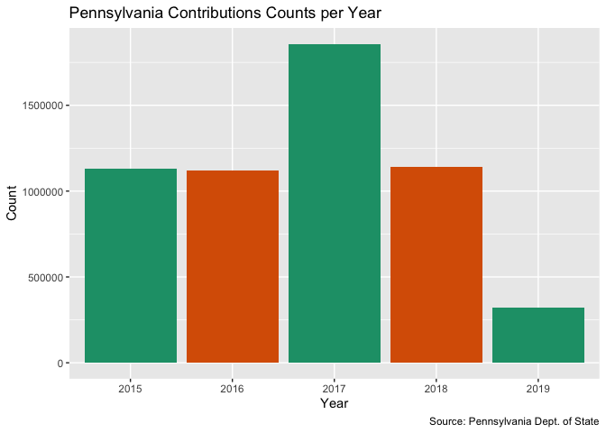
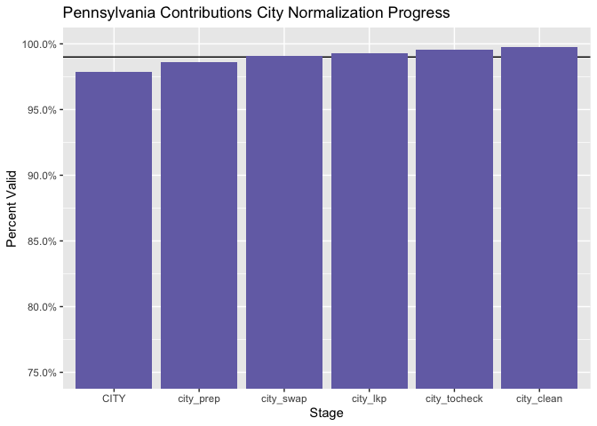
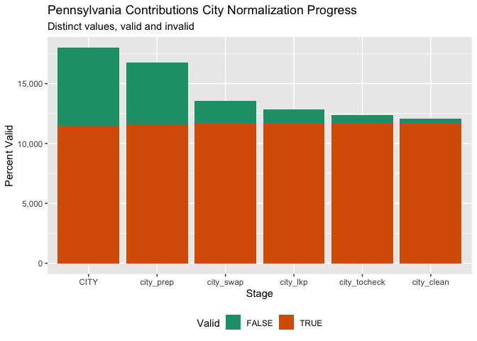

Data Diary
================
Yanqi Xu
2019-11-14 15:45:12

-   [Project](#project)
-   [Objectives](#objectives)
-   [Packages](#packages)
-   [Import](#import)
-   [Explore](#explore)
-   [Wrangle](#wrangle)
-   [Join with Filer](#join-with-filer)
-   [Conclude](#conclude)
-   [Export](#export)

Project
-------

The Accountability Project is an effort to cut across data silos and give journalists, policy professionals, activists, and the public at large a simple way to search across huge volumes of public data about people and organizations.

Our goal is to standardizing public data on a few key fields by thinking of each dataset row as a transaction. For each transaction there should be (at least) 3 variables:

1.  All **parties** to a transaction
2.  The **date** of the transaction
3.  The **amount** of money involved

Objectives
----------

This document describes the process used to complete the following objectives:

1.  How many records are in the database?
2.  Check for duplicates
3.  Check ranges
4.  Is there anything blank or missing?
5.  Check for consistency issues
6.  Create a five-digit ZIP Code called `ZIP5`
7.  Create a `YEAR` field from the transaction date
8.  Make sure there is data on both parties to a transaction

Packages
--------

The following packages are needed to collect, manipulate, visualize, analyze, and communicate these results. The `pacman` package will facilitate their installation and attachment.

``` r
if (!require("pacman")) install.packages("pacman")
pacman::p_load(
  stringdist, # levenshtein value
  tidyverse, # data manipulation
  lubridate, # datetime strings
  tidytext, # string analysis
  magrittr, # pipe opperators
  janitor, # dataframe clean
  refinr, # cluster and merge
  knitr, # knit documents
  glue, # combine strings
  scales, #format strings
  here, # relative storage
  fs, # search storage 
  vroom, #read deliminated files
  campfin #wrangle data for accountability project
)
```

This document should be run as part of the `R_campfin` project, which lives as a sub-directory of the more general, language-agnostic [`irworkshop/accountability_datacleaning`](https://github.com/irworkshop/accountability_datacleaning "TAP repo") GitHub repository.

The `R_campfin` project uses the [RStudio projects](https://support.rstudio.com/hc/en-us/articles/200526207-Using-Projects "Rproj") feature and should be run as such. The project also uses the dynamic `here::here()` tool for file paths relative to *your* machine.

``` r
# where dfs this document knit?
here::here()
## [1] "/Users/soc/accountability/accountability_datacleaning/R_campfin"
```

Import
------

[Link](https://www.dos.pa.gov/VotingElections/CandidatesCommittees/CampaignFinance/Resources/Pages/FullCampaignFinanceExport.aspx "source") to download

### Download

Download raw, **immutable** data file. Go to <https://www.dos.pa.gov/VotingElections/CandidatesCommittees/CampaignFinance/Resources/Pages/FullCampaignFinanceExport.aspx>. We'll download the files from 2015 to 2019 (file format: zip file) with the script.

``` r
# create a directory for the raw data
raw_dir <- here("pa", "contribs", "data", "raw")
dir_create(raw_dir)
```

Download all the file packages containing all campaign-finance-related files.

``` r
#download the files into the directory
pa_exp_urls <- glue("https://www.dos.pa.gov//VotingElections/CandidatesCommittees/CampaignFinance/Resources/Documents/{2015:2019}.zip")

if (!all_files_new(raw_dir)) {
  for (url in pa_exp_urls) {
    download.file(
      url = url,
      destfile = glue("{raw_dir}/{basename(url)}")
    )
  }
}
```

### Read

Read individual csv files from the downloaded zip files

``` r
zip_files <- dir_ls(raw_dir, glob = "*.zip")

if (all_files_new(path = raw_dir, glob = "*.txt")) {
  for (i in seq_along(zip_files)) {
    unzip(
      zipfile = zip_files[i],
      #Matches the csv files that starts with expense, and trim the "./ " from directory names
      files = grep("contrib.+", unzip(zip_files[i]), value = TRUE) %>% substring(3,),
      exdir = raw_dir
    )
  }
}
```

Read multiple csvs into R

``` r
#recursive set to true because 2016 and 2015 have subdirectories under "raw"
contrib_files <- list.files(raw_dir, pattern = ".txt", recursive = TRUE, full.names = TRUE)
#pa_lines <- list.files(raw_dir, pattern = ".txt", recursive = TRUE) %>% map(read_lines) %>% unlist()
pa_col_names <- c("FILERID", "EYEAR", "CYCLE", "SECTION", "CONTRIBUTOR", "ADDRESS1", "ADDRESS2", "CITY", "STATE", "ZIPCODE", "OCCUPATION", "ENAME", "EADDRESS1", "EADDRESS2", "ECITY", "ESTATE", "EZIPCODE", "CONTDATE1", "CONTAMT1", "CONTDATE2", "CONTAMT2", "CONTDATE3", "CONTAMT3", "CONTDESC")

pa <- contrib_files %>% 
  map(read_delim, delim = ",", escape_double = FALSE,
      escape_backslash = FALSE, col_names = pa_col_names, 
      col_types = cols(.default = col_character(),
                       EYEAR = col_integer(),
                       CYCLE = col_integer(),
                     CONTAMT1 = col_double())) %>% 
  bind_rows() %>% 
  mutate_if(is_character, str_to_upper)
```

### About

More information about the record layout can be found here <https://www.dos.pa.gov/VotingElections/CandidatesCommittees/CampaignFinance/Resources/Documents/readme.txt>.

### Encoding

``` r
for (i in c(5:10)) {
  pa[[i]] <- iconv(pa[[i]], 'UTF-8', 'ASCII') %>% 
    toupper() %>% 
   str_replace("&AMP;", "&") 
}
```

Some columns are not read properly due to extraneous and unescaped commas or double quotes. The following lines of code fix that. \#\#\# Indexing

``` r
pa <- tibble::rowid_to_column(pa, "index")
```

### Repositioning

``` r
to_reposit <- which(pa$CONTDATE2 != 0 & is.na(pa$CONTDATE2) == FALSE )

nudge <- function(df, index, cut_off_col) {
  for (i in index){
    col_posit <- match(cut_off_col, colnames(pa))
    df[i, col_posit] <- str_c(df[i, col_posit], df[i, col_posit+1], sep = " ")
      for (col in {col_posit+1}:{ncol(df)-1}) {
        df[i, col] <- df[i, col+1]
      } 
  }
  return(df)
}

pa <- nudge(pa, to_reposit[1:length(to_reposit)-1], "ENAME")
pa <- nudge(pa, to_reposit[length(to_reposit)], "CONTRIBUTOR")

pa$CONTAMT1 <- as.numeric(pa$CONTAMT1)
```

Explore
-------

There are `nrow(pa)` records of `length(pa)` variables in the full database.

``` r
head(pa)
tail(pa)
glimpse(pa)
```

### Distinct

The variables range in their degree of distinctness.`CONTDATE2`, `CONTDATE3`, only have one value 0.

``` r
pa %>% glimpse_fun(n_distinct)
```

    ## # A tibble: 24 x 4
    ##    col         type        n           p
    ##    <chr>       <chr>   <dbl>       <dbl>
    ##  1 FILERID     <chr>    3209 0.000576   
    ##  2 EYEAR       <chr>       5 0.000000898
    ##  3 CYCLE       <chr>       9 0.00000162 
    ##  4 SECTION     <chr>       8 0.00000144 
    ##  5 CONTRIBUTOR <chr>  530096 0.0952     
    ##  6 ADDRESS1    <chr>  446171 0.0801     
    ##  7 ADDRESS2    <chr>   16143 0.00290    
    ##  8 CITY        <chr>   18006 0.00323    
    ##  9 STATE       <chr>      57 0.0000102  
    ## 10 ZIPCODE     <chr>  185855 0.0334     
    ## 11 OCCUPATION  <chr>   62240 0.0112     
    ## 12 ENAME       <chr>   44791 0.00804    
    ## 13 EADDRESS1   <chr>   54553 0.00979    
    ## 14 EADDRESS2   <chr>    5398 0.000969   
    ## 15 ECITY       <chr>    5320 0.000955   
    ## 16 ESTATE      <chr>      56 0.0000101  
    ## 17 EZIPCODE    <chr>   21225 0.00381    
    ## 18 CONTDATE1   <date>   1904 0.000342   
    ## 19 CONTAMT1    <dbl>   66596 0.0120     
    ## 20 CONTDATE2   <chr>       1 0.000000180
    ## 21 CONTAMT2    <chr>       1 0.000000180
    ## 22 CONTDATE3   <chr>       1 0.000000180
    ## 23 CONTAMT3    <chr>       1 0.000000180
    ## 24 CONTDESC    <chr>   12675 0.00228

### Missing

The variables also vary in their degree of values that are `NA` (missing).

``` r
pa %>% glimpse_fun(count_na)
```

    ## # A tibble: 24 x 4
    ##    col         type         n           p
    ##    <chr>       <chr>    <dbl>       <dbl>
    ##  1 FILERID     <chr>        0 0          
    ##  2 EYEAR       <chr>        0 0          
    ##  3 CYCLE       <chr>        0 0          
    ##  4 SECTION     <chr>     1715 0.000308   
    ##  5 CONTRIBUTOR <chr>        3 0.000000539
    ##  6 ADDRESS1    <chr>    45297 0.00813    
    ##  7 ADDRESS2    <chr>  4987653 0.895      
    ##  8 CITY        <chr>    43682 0.00784    
    ##  9 STATE       <chr>    44363 0.00796    
    ## 10 ZIPCODE     <chr>    34634 0.00622    
    ## 11 OCCUPATION  <chr>  2891642 0.519      
    ## 12 ENAME       <chr>  3153617 0.566      
    ## 13 EADDRESS1   <chr>  3825218 0.687      
    ## 14 EADDRESS2   <chr>  5327033 0.956      
    ## 15 ECITY       <chr>  3856224 0.692      
    ## 16 ESTATE      <chr>  3860960 0.693      
    ## 17 EZIPCODE    <chr>  3810189 0.684      
    ## 18 CONTDATE1   <date>    4121 0.000740   
    ## 19 CONTAMT1    <dbl>        0 0          
    ## 20 CONTDATE2   <chr>        0 0          
    ## 21 CONTAMT2    <chr>        0 0          
    ## 22 CONTDATE3   <chr>        0 0          
    ## 23 CONTAMT3    <chr>        0 0          
    ## 24 CONTDESC    <chr>  5412685 0.972

We will flag any records with missing values in the key variables used to identify a contribution. There are 4124 records missing `CONTRIBUTOR`, `CONTAMT1` AND `CONTDATE1`

``` r
pa <- pa %>% flag_na(CONTRIBUTOR, CONTAMT1, CONTDATE1)
```

### Duplicates

``` r
pa <- flag_dupes(pa, dplyr::everything())
```

``` r
sum(pa$dupe_flag)
## [1] 0
```

### Ranges

#### Amounts

``` r
summary(pa$CONTRIBUTOR)
##    Length     Class      Mode 
##   5570805 character character
sum(pa$CONTAMT1 < 0 , na.rm = TRUE)
## [1] 871
```

See how the campaign contributions were distributed

``` r
pa %>% 
  ggplot(aes(x = CONTAMT1)) + 
  geom_histogram() +
  scale_x_continuous(
    trans = "log10", labels = dollar) +
  labs(title = "Pennsylvania Campaign Contribution Amount Distribution",
       caption = "Source: Pennsylvania Dept. of State")
```

    ## `stat_bin()` using `bins = 30`. Pick better value with `binwidth`.


#### Year

Add a `year` variable from `date` after `col_date()` using `lubridate::year()`.

``` r
pa$CONTDATE1 <- as.Date(pa$CONTDATE1, "%Y%m%d")
```

``` r
pa <- pa %>% mutate(year = year(CONTDATE1), on_year = is_even(year))
```

#### Dates

Records in the PA contribution datasets date back to 1900-01-16 till 9201-01-12

``` r
summary(pa$CONTDATE1)
```

    ##         Min.      1st Qu.       Median         Mean      3rd Qu.         Max.         NA's 
    ## "1900-01-16" "2016-04-07" "2017-04-20" "2017-03-22" "2018-01-26" "9201-01-12"       "4121"

The `CONTDATE2` and `CONTDATE3` variables should be blank

``` r
pa <- pa %>% mutate(date_flag = year < 2000 | year > format(Sys.Date(), "%Y"), 
                    year_clean = ifelse(
                    date_flag, NA, year))

pa <- pa %>% mutate(date_clean = CONTDATE1) 
pa$date_clean[pa$date_flag] <- NA

summary(pa$date_clean)
```



Wrangle
-------

In order to normalize column content and avoid irregular tabulation in the Accountability Project, we normalize column names with string functions from the `campfin` package.

``` r
pa <- pa %>% 
  mutate(contributor_clean = str_remove(CONTRIBUTOR, "^MRS\\s|^MR\\s|^MS\\s|^MISS\\s|^DR\\s"))
```

### State

View values in the STATE field is not a valid state abbreviation

``` r
{pa$STATE[pa$STATE %out% valid_state]}[!is.na(pa$STATE[pa$STATE %out% valid_state])]
## [1] "CN" "CN"
{pa$ESTATE[pa$ESTATE %out% valid_state]}[!is.na(pa$ESTATE[pa$ESTATE %out% valid_state])]
## [1] "CN"
```

These are contributions from people in Canada, which we can leave in. The state column is now pretty clean, as all non-NA columns have two characters.

### Zipcode

The Zipcode column can range from 1 to 13 columns.

``` r
table(nchar(pa$ZIPCODE))
## 
##       1       2       5       6       7       8       9      10 
##    9361      22 2248009     571      22    2044 3264595   11547
```

``` r
pa <- pa %>% 
  mutate(
    zip_clean = ZIPCODE %>% 
      normal_zip(na_rep = TRUE))
sample(pa$zip_clean, 10)
  
## Same as EZIPCODE
pa <- pa %>% 
  mutate(
    employer_zip_clean = EZIPCODE %>% 
      normal_zip(na_rep = TRUE)
  )
  sample(pa$employer_zip_clean, 10)
```

### City

Cleaning city values is the most complicated. This process involves the following steps:

1.  Prepare raw city values by removing invalid data and reducing inconsistencies
2.  Match prepared city values with the *actual* city name of that record's ZIP code
3.  swap prepared city values with the ZIP code match *if* only 1 edit is needed
4.  Refine swapped city values with key collision and n-gram fingerprints
5.  Use the lookup table (inspected by data editor at IRW) to join and replace values outside of `valid_place`
6.  Use a second swap to swap out cities that have the same zipcode as the corresponding valid city and whose string distance is no greater than 11. The process is also vetted by an IRW staff.

Our goal is to correct misspelled city names to the point where the majority of the city names are within the `valid_place` vector.

``` r
valid_place <- c(valid_city, extra_city) %>% unique()
```

#### Prep

5527123 distinct cities were in the original dataset in column

``` r
pa <- pa %>% mutate(city_prep = normal_city(city = CITY,
                                            geo_abbs = usps_city,
                                            st_abbs = c(valid_state),
                                            na = invalid_city,
                                            na_rep = TRUE))
pa <- pa %>% mutate(employer_city_prep = normal_city(city = ECITY,
                                            geo_abbs = usps_city,
                                            st_abbs = c(valid_state),
                                            na = invalid_city,
                                            na_rep = TRUE))
n_distinct(pa$city_prep)
n_distinct(pa$employer_city_prep)
```

#### Match

``` r
pa <- pa %>%
  left_join(
    y = zipcodes,
    by = c(
      "zip_clean" = "zip",
      "STATE" = "state"
    )
  ) %>% 
  rename(city_match = city)
```

#### Swap

To replace city names with expected city names from zipcode when the two variables are no more than two characters different

``` r
pa <- pa %>% 
  mutate(
    match_dist = stringdist(city_prep, city_match),
    city_swap = if_else(condition = is.na(city_match) == FALSE,
                        if_else(
      condition = match_dist <= 2,
      true = city_match,
      false = city_prep
    ),
      false = city_prep
  ))

summary(pa$match_dist)
sum(pa$match_dist == 1, na.rm = TRUE)
n_distinct(pa$city_swap)
```

#### Refine

Use the OpenRefine algorithms to cluster similar values and merge them together. This can be done using the refinr::key\_collision\_merge() and refinr::n\_gram\_merge() functions on our prepared and swapped city data.

``` r
pa_refined <- pa %>%
  filter(match_dist != 1) %>% 
  filter(STATE =="PA") %>% 
  mutate(
    city_refine = city_swap %>% 
      key_collision_merge(dict = valid_place) %>% 
      n_gram_merge(numgram = 2),
    refined = (city_swap != city_refine)
  ) %>% 
  filter(refined) %>% 
  select(
    index,
    FILERID, 
    CITY,
    city_prep,
    city_match,
    city_swap,
    match_dist,
    city_refine,
    STATE, 
    ZIPCODE,
    zip_clean
  )

pa_refined %>% 
  count(city_swap, city_refine) %>% 
  arrange(desc(n))
```

Manually change the city\_refine fields due to overcorrection.

``` r
pa_refined$city_refine <- pa_refined$city_refine %>% 
  str_replace("SHAWNEE\\sON\\sDELA$", "SHAWNEE ON DELAWARE") %>% 
  str_replace("^SPRINGBROOK$", "SPRING BROOK") %>% 
  str_replace("^ALBA$", "BALA CYNWYD") %>% 
  str_replace("^BRADFORDWOODS$", "BRADFORD WOODS") 

refined_table <-pa_refined %>% 
  select(index, city_refine)
```

#### Merge

``` r
pa <- pa %>% 
  left_join(refined_table, by ="index") %>% 
  mutate(city = coalesce(city_refine, city_swap)) 

pa$city <- pa$city %>% 
  str_replace("\\sTWP$|\\sTP$", " TOWNSHIP") %>% 
  str_replace("\\sSQ$", " SQUARE") 
```

``` r
pa_out <- pa %>% filter(city %out% valid_place)

pa_city_lookup <- read_csv(file = here("pa", "contribs", "data", "raw", "pa_city_lookup_contrib.csv"), skip =1, col_names = c("city", "city_lookup", "changed"))
```

    ## Parsed with column specification:
    ## cols(
    ##   city = col_character(),
    ##   city_lookup = col_character(),
    ##   changed = col_character()
    ## )

``` r
pa_out <- pa_out %>% select(index, CITY) %>% 
  inner_join(pa_city_lookup, by = c("CITY" = "city")) %>% 
  drop_na(CITY) %>% 
  select(index,city_lookup)

pa <- pa %>% left_join(pa_out, by = "index") %>% mutate(city_lkp = ifelse(pa$index %in% pa_out$index, city_lookup,city))

pa_match_table <- pa %>% 
  filter(str_sub(pa$city_swap, 1,1) == str_sub(pa$city_match, 1,1)) %>% 
  filter(city_lkp %out% valid_place)  %>% 
  mutate(string_dis = stringdist(city, city_match)) %>% 
  select (index, zip_clean, STATE, city, city_match, string_dis) %>% 
  distinct() %>% 
  add_count(city_match) %>% 
  rename("sec_city_match" = "city_match") %>% 
  filter(string_dis < 11) 

pa_match_table[pa_match_table$city == "HODGDON", "sec_city_match"] <- "HODGDON"
pa_match_table[pa_match_table$city == "WOLVERINE LAKE", "sec_city_match"] <- "WOLVERINE LAKE" 
pa_match_table[pa_match_table$city == "CROSS LANES", "sec_city_match"] <- "CROSS LANES"
pa_match_table[pa_match_table$city == "PONTE VEDRA", "sec_city_match"] <- "PONTE VEDRA BEACH"
pa_match_table[pa_match_table$city == "MOYLAN", "sec_city_match"] <- "MOYLAN"

pa_match_table[pa_match_table$city == "WYO", "sec_city_match"] <- "WYOMISSING"
pa_match_table[pa_match_table$city == "TEMPLE TERRACE", "sec_city_match"] <- "TEMPLE TERRACE"
pa_match_table[pa_match_table$city == "SPRINGTON", "sec_city_match"] <- "SPRINGTON"

pa <- pa_match_table %>% select(index, sec_city_match) %>% 
  right_join(pa, by = "index") %>% 
  mutate(city_tocheck = coalesce(sec_city_match, city_lkp))
```

#### Check

``` r
api_key <- Sys.getenv("GEOCODING_API")

pa_check <- pa %>% 
  filter(city_tocheck%out% valid_place) %>% 
  drop_na(city_tocheck,STATE) %>% 
  count(city_tocheck, STATE)

pa_check_result <- 
  pmap_dfr(.l = list(city = pa_check$city_tocheck, state = pa_check$STATE), .f = check_city, key = api_key, guess = T)


pa_check <- pa_check %>% 
  left_join(pa_check_result, by = c("city_tocheck" = "original_city", "STATE" = "original_state"))

pa_check <-  pa_check %>% select(-original_zip)

head(pa_check)
```

    ## Parsed with column specification:
    ## cols(
    ##   city_tocheck = col_character(),
    ##   STATE = col_character(),
    ##   n = col_double(),
    ##   check_city_flag = col_logical(),
    ##   guess_city = col_character(),
    ##   guess_place = col_character()
    ## )

    ## # A tibble: 6 x 6
    ##   city_tocheck STATE     n check_city_flag guess_city guess_place      
    ##   <chr>        <chr> <dbl> <lgl>           <chr>      <chr>            
    ## 1 ABBOT PARK   IL        1 FALSE           GREEN OAKS ABBOTT PARK      
    ## 2 ABBOTT PARL  IL        1 FALSE           GREEN OAKS ABBOTT PARK      
    ## 3 ABERDSON     NJ       45 FALSE           <NA>       ABERDEEN TOWNSHIP
    ## 4 ABOTT PARK   IL        3 FALSE           GREEN OAKS ABBOTT PARK      
    ## 5 ABU DHABI    DC        3 NA              WASHINGTON <NA>             
    ## 6 ABU DHABI    NE        8 NA              ABU DHABI  <NA>

Add the valid places to the `extra_city` spreadhseet.

``` r
extra_city <- gs_title("extra_city")

extra_city <- extra_city %>% 
  gs_add_row(ws = 1, input = pa_check %>% filter(check_city_flag) %>% select(city_tocheck))
```

``` r
pa_check <-  pa_check %>% 
  mutate(check_dist = stringdist(guess_place, city_tocheck),
    check_swap = if_else(condition = !is.na(guess_place),
                        if_else(
      condition = check_dist <= 2,
      true = guess_place,
      false = city_tocheck
    ),
      false = city_tocheck
  ))
```

Manually change the city\_refine fields due to overcorrection.

``` r
pa <- pa_check %>% select(city_tocheck, STATE, check_swap) %>% 
  right_join(pa, by = c("city_tocheck","STATE"))
  
pa <-  pa %>% mutate(city_clean = coalesce(check_swap,city_tocheck))

pa$city_clean <- pa$city_clean %>% 
  str_replace("^DOWNTOWN$", "DAWNSTOWN") %>% 
  str_replace("^RESEARCH TRIANGLE PARK$", "RESEARCH TRIANGLE") %>% 
  na_if("^VIRTUAL$") %>% 
  na_if("^PROXY$")
```

``` r
valid_place <-  c(valid_place,pa_check$city_tocheck[pa_check$check_city_flag]) %>% unique()

progress <- progress_table(
  pa$CITY,
  pa$city_prep,
  pa$city_swap,
  pa$city_lkp,
  pa$city_tocheck,
  pa$city_clean,
  compare = valid_place
) %>% mutate(stage = as_factor(stage))
```

| stage         |  prop\_in|  n\_distinct|  prop\_na|  n\_out|  n\_diff|
|:--------------|---------:|------------:|---------:|-------:|--------:|
| CITY          |     0.979|        18006|     0.008|  118640|     6501|
| city\_prep    |     0.986|        16740|     0.008|   76824|     5129|
| city\_swap    |     0.991|        13543|     0.008|   52262|     1895|
| city\_lkp     |     0.993|        12844|     0.008|   40431|     1188|
| city\_tocheck |     0.996|        12369|     0.008|   22953|      697|
| city\_clean   |     0.998|        12096|     0.008|   12745|      423|

You can see how the percentage of valid values increased with each stage.



More importantly, the number of distinct values decreased each stage. We were able to confidently change many distinct invalid values to their valid equivilent.

``` r
progress %>% 
  select(
    stage, 
    all = n_distinct,
    bad = n_diff
  ) %>% 
  mutate(good = all - bad) %>% 
  pivot_longer(c("good", "bad")) %>% 
  mutate(name = name == "good") %>% 
  ggplot(aes(x = stage, y = value)) +
  geom_col(aes(fill = name)) +
  scale_fill_brewer(palette = "Dark2") +
  scale_y_continuous(labels = comma) +
  theme(legend.position = "bottom") +
  labs(
    title = "Pennsylvania Contributions City Normalization Progress",
    subtitle = "Distinct values, valid and invalid",
    x = "Stage",
    y = "Percent Valid",
    fill = "Valid"
  )
```



Each step of the cleaning process reduces the number of distinct city values. There are 5527123 with 18006 distinct values, after the swap and refine processes, there are 5525943 entries with 12096 distinct values.

### Address

Finally, we will create a new variable named `address_clean` cleaned with the `normal_address` function. Make sure you're using a tidyr version that is greater than "0.8.3.9", where the na.rm argument of the `unite()` function is supported.

``` r
pa <- pa %>% unite(
    ADDRESS1, ADDRESS2,
    col = address_clean,
    sep = " ",
    remove = FALSE,
    na.rm = TRUE
  ) %>% 
  mutate(address_clean = normal_address(address = address_clean,
      add_abbs = usps_city,
      na_rep = TRUE))
```

Join with Filer
---------------

We also need to pull up the processed filer table to join back to the `FILERID`, `EYEAR` and `CYCLE` field.

``` r
filer_dir <- here("pa", "expends", "data", "processed")
pa_filer <- read_csv(glue("{filer_dir}/pa_filers_clean.csv"), 
                     col_types = cols(.default = col_character())) %>% 
  rename_at(vars(contains("clean")), list(~str_c("filer_",.))) %>% 
  select(
    FILERID,
    EYEAR,
    CYCLE,
    FILERNAME,
    FILERTYPE,
    filer_state,
    ends_with("clean")
  )
```

``` r
pa <- pa %>% left_join(pa_filer, by = c("FILERID", "EYEAR", "CYCLE"))
```

Conclude
--------

1.  There are 5644512 records in the database
2.  There are 0 records with suspected duplicate filerID, recipient, date, *and* amount (flagged with `dupe_flag`)
3.  The ranges for dates and amounts are reasonable
4.  Consistency has been improved with `stringr` package and custom `normal_*()` functions.
5.  The five-digit `zip_clean` variable has been created with `zipcode::clean.zipcode()`
6.  The `year` variable has been created with `lubridate::year()`
7.  There are 43707 records with missing `city` values and 0 records with missing `payee` values (both flagged with the `na_flag`).

Export
------

``` r
clean_dir <- here("pa", "contribs", "data", "processed")
dir_create(clean_dir)
pa %>% 
  select(
    -city_prep,
    -on_year,
    -match_dist,
    -city_swap,
    -city_refine,
    -city_match,
    -city,
    -city_lookup,
    -city_lkp,
    -sec_city_match,
    -check_swap,
    -CONTDATE2,
    -CONTDATE3
  ) %>% 
  rename(ZIP5 = zip_clean, employer_ZIP5 = employer_zip_clean) %>% 
  write_csv(
    path = glue("{clean_dir}/pa_contribs_clean.csv"),
    na = ""
  )
```
