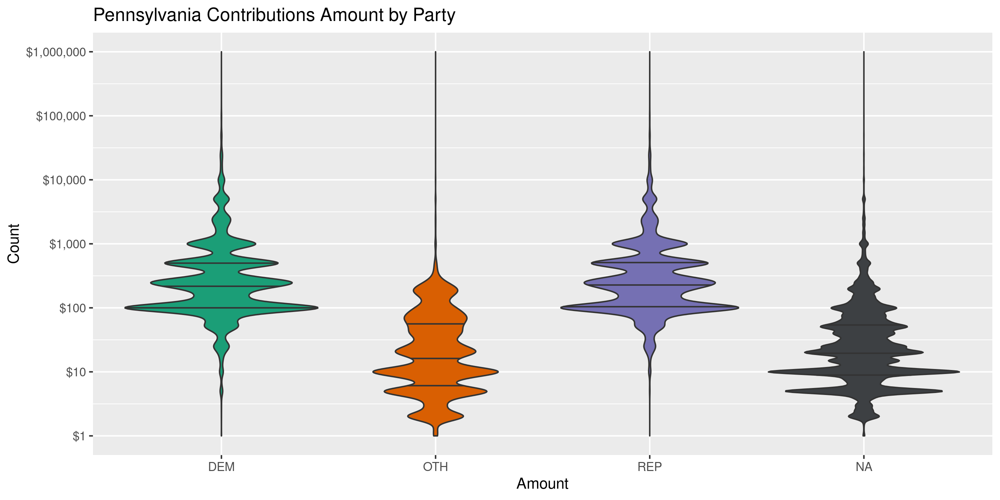

Pennsylvania Contributions
================
Kiernan Nicholls
2020-05-05 10:43:46

  - [Project](#project)
  - [Objectives](#objectives)
  - [Packages](#packages)
  - [Data](#data)
  - [Import](#import)
  - [Explore](#explore)
  - [Wrangle](#wrangle)
  - [Conclude](#conclude)
  - [Export](#export)
  - [Dictionary](#dictionary)

<!-- Place comments regarding knitting here -->

## Project

The Accountability Project is an effort to cut across data silos and
give journalists, policy professionals, activists, and the public at
large a simple way to search across huge volumes of public data about
people and organizations.

Our goal is to standardizing public data on a few key fields by thinking
of each dataset row as a transaction. For each transaction there should
be (at least) 3 variables:

1.  All **parties** to a transaction.
2.  The **date** of the transaction.
3.  The **amount** of money involved.

## Objectives

This document describes the process used to complete the following
objectives:

1.  How many records are in the database?
2.  Check for entirely duplicated records.
3.  Check ranges of continuous variables.
4.  Is there anything blank or missing?
5.  Check for consistency issues.
6.  Create a five-digit ZIP Code called `zip`.
7.  Create a `year` field from the transaction date.
8.  Make sure there is data on both parties to a transaction.

## Packages

The following packages are needed to collect, manipulate, visualize,
analyze, and communicate these results. The `pacman` package will
facilitate their installation and attachment.

The IRW’s `campfin` package will also have to be installed from GitHub.
This package contains functions custom made to help facilitate the
processing of campaign finance data.

``` r
if (!require("pacman")) install.packages("pacman")
pacman::p_load_gh("irworkshop/campfin")
pacman::p_load(
  tidyverse, # data manipulation
  lubridate, # datetime strings
  gluedown, # format markdown
  magrittr, # pipe operators
  janitor, # dataframe clean
  refinr, # cluster and merge
  scales, # format strings
  knitr, # knit documents
  vroom, # read files fast
  glue, # combine strings
  httr, # make http requests
  here, # relative storage
  fs # search storage 
)
```

This document should be run as part of the `R_campfin` project, which
lives as a sub-directory of the more general, language-agnostic
[`irworkshop/accountability_datacleaning`](https://github.com/irworkshop/accountability_datacleaning)
GitHub repository.

The `R_campfin` project uses the [RStudio
projects](https://support.rstudio.com/hc/en-us/articles/200526207-Using-Projects)
feature and should be run as such. The project also uses the dynamic
`here::here()` tool for file paths relative to *your* machine.

``` r
# where does this document knit?
here::here()
#> [1] "/home/kiernan/Code/accountability_datacleaning/R_campfin"
```

## Data

Data is from the [Pennsylvania Election and Campaign Finance System
(ECF)](https://www.dos.pa.gov/VotingElections/CandidatesCommittees/CampaignFinance/Pages/default.aspx).

The ECF provides a [Full Campaign Finance
Export](https://www.dos.pa.gov/VotingElections/CandidatesCommittees/CampaignFinance/Resources/Pages/FullCampaignFinanceExport.aspx).
From this page, files are organized as annual directories containing
files for contributions, debt, expenditures, filer information, and
receipts.

The ECF also provides a `readme.txt` file, which we can read to better
understand the data we will be downloading.

``` r
pa_host <- "https://www.dos.pa.gov/VotingElections"
pa_dir <- "CandidatesCommittees/CampaignFinance/Resources/Documents"
readme_file <- "readme.txt"
readme_url <- paste(pa_host, pa_dir, readme_file, sep = "/")
```

This text file provides the column names and types for the each of the
data files included in the raw download.

Here are the columns included in the contributions data set:

``` r
readme$contribs %>% 
  mutate(col = as.character(md_code(col))) %>% 
  kable(col.names = c("Columns", "Type"))
```

| Columns       | Type         |
| :------------ | :----------- |
| `filerid`     | VARCHAR(20)  |
| `eyear`       | INT          |
| `cycle`       | INT          |
| `section`     | VARCHAR(10)  |
| `contributor` | VARCHAR(255) |
| `address1`    | VARCHAR(50)  |
| `address2`    | VARCHAR(50)  |
| `city`        | VARCHAR(50)  |
| `state`       | VARCHAR(10)  |
| `zipcode`     | VARCHAR(15)  |
| `occupation`  | VARCHAR(255) |
| `ename`       | VARCHAR(255) |
| `eaddress1`   | VARCHAR(50)  |
| `eaddress2`   | VARCHAR(50)  |
| `ecity`       | VARCHAR(50)  |
| `estate`      | VARCHAR(10)  |
| `ezipcode`    | VARCHAR(15)  |
| `contdate1`   | VARCHAR(20)  |
| `contamt1`    | MONEY        |
| `contdate2`   | VARCHAR(20)  |
| `contamt2`    | MONEY        |
| `contdate3`   | VARCHAR(20)  |
| `contamt3`    | MONEY        |
| `contdesc`    | VARCHAR(500) |

There are no variables providing information on the recipients, those
committees which *filed* the reports containing each contribution. That
data is provided in a separate file.

``` r
readme$filer %>% 
  mutate(col = as.character(md_code(col))) %>% 
  kable(col.names = c("Columns", "Type"))
```

| Columns     | Type         |
| :---------- | :----------- |
| `filerid`   | VARCHAR(20)  |
| `eyear`     | INT          |
| `cycle`     | INT          |
| `ammend`    | VARCHAR(1)   |
| `terminate` | VARCHAR(1)   |
| `filertype` | VARCHAR(10)  |
| `filername` | VARCHAR(255) |
| `office`    | VARCHAR(15)  |
| `district`  | VARCHAR(15)  |
| `party`     | VARCHAR(15)  |
| `address1`  | VARCHAR(50)  |
| `address2`  | VARCHAR(50)  |
| `city`      | VARCHAR(50)  |
| `state`     | VARCHAR(10)  |
| `zipcode`   | VARCHAR(15)  |
| `county`    | VARCHAR(15)  |
| `phone`     | VARCHAR(15)  |
| `beginning` | MONEY        |
| `monetary`  | MONEY        |
| `inkind`    | MONEY        |

## Import

To import the files into R, we will have to first download the annual
ZIP archive file containing all campaign finance transactions. Then we
can extract the contributions file and read them all into a single file
for processing.

### Download

Each ZIP archive is simply named as the 4-digit year for the files
within. We can download each ZIP to the `/data/raw` directory.

``` r
zip_names <- paste(2000:2020, "zip", sep = ".")
zip_urls <- paste(pa_host, pa_dir, zip_names, sep = "/")
raw_dir <- dir_create(here("pa", "contribs", "data", "raw"))
zip_paths <- path(raw_dir, zip_names)
fix_check <- here("pa", "contribs", "data", "fixed.txt")
if (length(dir_ls(raw_dir, regexp = "zip")) < 10) {
  download.file(zip_urls, zip_paths)
  file_delete(fix_check)
}
```

Then we will unzip the annual directory from each archive.

``` r
if (all(dir_ls(raw_dir) %in% zip_paths)) {
  for (zip in zip_paths) {
    unzip(zip, exdir = raw_dir)
  }
}
```

For each year, there is a file for contribution and a file for the
information on the recipients of those contributions, who file the
reports containing the data. We will identify the path of each file type
in new vectors, which can then be read together.

``` r
con_paths <- dir_ls(
  path = raw_dir, 
  recurse = TRUE, 
  regexp = "contrib[\\.|_]"
)

fil_paths <- dir_ls(
  path = raw_dir, 
  recurse = TRUE, 
  regexp = "filer[\\.|_]"
)
```

The file names are a little different year to year, but they all have
the same format.

    #> * `~/pa/contribs/data/raw/2000/contrib_2000.txt`
    #> * `~/pa/contribs/data/raw/2001/contrib_2001.txt`
    #> * `~/pa/contribs/data/raw/2002/contrib_2002.txt`
    #> * `~/pa/contribs/data/raw/2003/contrib_2003.txt`
    #> * `~/pa/contribs/data/raw/2004/contrib_2004.txt`
    #> * `~/pa/contribs/data/raw/2005/contrib_2005.txt`
    #> * `~/pa/contribs/data/raw/2006/contrib_2006.txt`
    #> * `~/pa/contribs/data/raw/2007/contrib_2007.txt`
    #> * `~/pa/contribs/data/raw/2008/contrib_2008.txt`
    #> * `~/pa/contribs/data/raw/2009/contrib_2009.txt`
    #> * `~/pa/contribs/data/raw/2010/contrib_2010.txt`
    #> * `~/pa/contribs/data/raw/2011/contrib_2011.txt`
    #> * `~/pa/contribs/data/raw/2012/contrib_2012.txt`
    #> * `~/pa/contribs/data/raw/2013/contrib_2013.txt`
    #> * `~/pa/contribs/data/raw/2014/contrib_2014.txt`
    #> * `~/pa/contribs/data/raw/2015/contrib_2015.txt`
    #> * `~/pa/contribs/data/raw/2016/contrib_2016.txt`
    #> * `~/pa/contribs/data/raw/contrib.txt`
    #> * `~/pa/contribs/data/raw/contrib_2017.txt`
    #> * `~/pa/contribs/data/raw/contrib_2018_03042019.txt`
    #> * `~/pa/contribs/data/raw/contrib_2020_02112020.txt`
    #> * `~/pa/contribs/data/raw/contrib_2020_02122020.txt`

### Fix

To properly read so many records, we need to first perform some
manipulation of the text files. Each “cell” of character type columns
are surrounded in double quotation marks (`"`) to help prevent
misreading. However, some of the text in these cells itself contains
double quotes or newline characters (`\n`).

We need to read each file as a character string and use regular
expressions to identify these erroneous characters and remove or replace
them.

``` r
# do not repeat if done
if (!file_exists(fix_check)) {
  # for all contrib and filer files
  for (file in c(con_paths, fil_paths)) {
    # read raw file
    read_file(file) %>% 
      # force conversion to simple
      str_conv(encoding = "ASCII") %>% 
      # replace non-carriage newline
      str_replace_all("(?<!\r)\n", " ") %>%
      # replace not-field double quotes
      str_replace_all("(?<!^|,|\r\n)\"(?!,|\r\n|$)", "\'") %>% 
      # replace non-delim commas
      str_remove_all(",(?!\"|\\d|\\.\\d+|-(\\d|\\.))") %>% 
      # overwrite raw file
      write_file(file)
    # check progress
    message(paste(basename(file), "done"))
    # clean garbage memory
    flush_memory()
  }
  # note this has done
  file_create(fix_check)
}
```

### Read

Now that each text file has been cleaned of irregularities, they can
each be properly read into R.

If this has already been done, it’s easier to read the single file that
was written at the end of the initial process. If we read this single
file, we can skip the chunks below reading for the first time.

``` r
pac_files <- path(raw_dir, sprintf("pac%s.csv", 1:10))
no_pac <- !all(file_exists(pac_files))
if (!no_pac) {
  pac <- vroom(
    file = pac_files,
    delim = "|",
    escape_backslash = TRUE,
    col_names = TRUE,
    col_types = cols(
      filerid = col_double(),
      eyear = col_double(),
      cycle = col_double(),
      date = col_date(),
      amount = col_double(),
      fil_type = col_double(),
      district = col_integer(),
      fil_address2 = col_logical(),
      fil_phone = col_logical()
    )
  )
}
```

If there are no consolidated contribution files from cleaning, we will
have to read and join the files from scratch.

``` r
print(no_pac) # if TRUE must redo
#> [1] FALSE
```

First, we will read all the annual contribution files into a single data
frame using `vroom::vroom()`. We need to use the column names and types
listed in the `readme.txt` file we downloaded earlier.

``` r
pac <- map_df(
  .x = con_paths,
  .f = read_delim,
  delim = ",",
  escape_backslash = FALSE, 
  escape_double = FALSE,
  col_names = readme$contribs$col,
  col_types = cols(
    .default = col_skip(),
    filerid = col_character(),
    eyear = col_integer(),
    cycle = col_integer(),
    section = col_character(),
    contributor = col_character(),
    address1 = col_character(),
    address2 = col_character(),
    city = col_character(),
    state = col_character(),
    zipcode = col_character(),
    occupation = col_character(),
    ename = col_character(),
    contdate1 = col_date("%Y%m%d"),
    contamt1 = col_double()
  )
)
```

Then we can read the fixed filer files to describe the recipients.

``` r
filers <- map_df(
  .x = fil_paths,
  .f = read_delim,
  delim = ",",
  escape_backslash = FALSE, 
  escape_double = FALSE,
  col_names = readme$filer$col,
  col_types = cols(
    .default = col_skip(),
    eyear = col_integer(),
    filerid = col_character(),
    filertype = col_character(),
    filername = col_character(),
    office = col_character(),
    district = col_character(),
    party = col_character(),
    address1 = col_character(),
    address2 = col_character(),
    city = col_character(),
    state = col_character(),
    zipcode = col_character(),
    county = col_character(),
    phone = col_character(),
  )
)
```

We only want to join a single filer to each contribution listed in the
data. We can group by the unique filer ID and a filing year and select
only one copy of the data.

``` r
nrow(filers)
filers <- filers %>% 
  group_by(filerid, eyear) %>% 
  slice(1) %>% 
  ungroup()
nrow(filers)
```

Now the filer information can be added to the contribution data with a
`dplyr::left_join()` along the unique filer ID and election year.

``` r
# 13,135,695
pac <- left_join(
  x = pac,
  y = filers,
  by = c("filerid", "eyear"),
  suffix = c("_con", "_fil")
)

rm(filers)

pac <- rename_prefix(
  df = pac,
  suffix = c("_con", "_fil"),
  punct = TRUE
)
```

``` r
pac <- pac %>% 
  rename(
    con_zip = con_zipcode,
    date = contdate1,
    amount = contamt1,
    fil_type = filertype,
    filer = filername,
    fil_zip = fil_zipcode,
    fil_phone = phone
  )
```

We will save a copy of this new file to the disk that can easily be read
if needed. This is the step that is done above for the `no_pac` check.

``` r
n <- 10
x <- nrow(pac)/n
for (i in seq(1, n)) {
  write_delim(
    x = pac[1:x, ],
    path = path(raw_dir, sprintf("pac%s.csv", i)),
    delim = "|",
    quote_escape = "backslash"
  )
  pac <- pac[-(1:x), ]
  flush_memory()
  Sys.sleep(60)
  message(percent(i/n))
}
```

## Explore

We should first check the top and bottom of the read data frame to
ensure the file was read correctly. This view also helps simply
understand the format.

``` r
glimpse(pac)
#> Rows: 17,912,110
#> Columns: 26
#> $ filerid      <dbl> 2000006, 2000006, 2000006, 2000006, 2000006, 2000006, 2000006, 2000006, 200…
#> $ eyear        <dbl> 2000, 2000, 2000, 2000, 2000, 2000, 2000, 2000, 2000, 2000, 2000, 2000, 200…
#> $ cycle        <dbl> 5, 5, 5, 5, 5, 5, 5, 5, 5, 5, 5, 5, 5, 5, 6, 3, 2, 2, 2, 2, 2, 2, 2, 2, 2, …
#> $ section      <chr> "IB", "IB", "IB", "IB", "IB", "IB", "IB", "IB", "IB", "IB", "IB", "IB", "IB…
#> $ contributor  <chr> "JOSHUA CERVENAK", "LANCE CUNNINGHAM", "JASON HAROLD", "KEITH HILL", "CHIP …
#> $ con_address1 <chr> "290 LYNBROOK DR N", "3267 N GEORGE ST", NA, "240 ARCH ST", "700 LINDA LANE…
#> $ con_address2 <chr> NA, NA, NA, NA, NA, NA, NA, NA, NA, NA, NA, NA, NA, NA, NA, "BOX 3305", NA,…
#> $ con_city     <chr> "YORK", "EMIGSVILLE", NA, "YORK", "STEVENS", "YORK", "SPRING GROVE", "YORK"…
#> $ con_state    <chr> "PA", "PA", NA, "PA", "PA", "PA", "PA", "PA", "PA", "PA", "PA", "PA", "PA",…
#> $ con_zip      <chr> "17402", "17318", NA, "17404", "17578", "17403", "17362", "17403", "17403",…
#> $ occupation   <chr> NA, NA, NA, NA, NA, NA, NA, NA, NA, NA, NA, NA, NA, NA, NA, NA, NA, NA, NA,…
#> $ ename        <chr> NA, NA, NA, NA, NA, NA, NA, NA, NA, NA, NA, NA, NA, NA, NA, NA, NA, NA, NA,…
#> $ date         <date> 2000-07-21, 2000-07-21, 2000-07-21, 2000-07-21, 2000-07-21, 2000-07-21, 20…
#> $ amount       <dbl> 55, 55, 55, 55, 55, 55, 89, 200, 100, 100, 150, 100, 100, 100, 100, 100, 15…
#> $ fil_type     <dbl> 2, 2, 2, 2, 2, 2, 2, 2, 2, 2, 2, 2, 2, 2, 2, 2, 2, 2, 2, 2, 2, 2, 2, 2, 2, …
#> $ filer        <chr> "MACKERETH BEVERLY COM TO ELECT", "MACKERETH BEVERLY COM TO ELECT", "MACKER…
#> $ office       <chr> "STH", "STH", "STH", "STH", "STH", "STH", "STH", "STH", "STH", "STH", "STH"…
#> $ district     <int> NA, NA, NA, NA, NA, NA, NA, NA, NA, NA, NA, NA, NA, NA, NA, NA, NA, NA, NA,…
#> $ party        <chr> "REP", "REP", "REP", "REP", "REP", "REP", "REP", "REP", "REP", "REP", "REP"…
#> $ fil_address1 <chr> NA, NA, NA, NA, NA, NA, NA, NA, NA, NA, NA, NA, NA, NA, NA, NA, NA, NA, NA,…
#> $ fil_address2 <lgl> NA, NA, NA, NA, NA, NA, NA, NA, NA, NA, NA, NA, NA, NA, NA, NA, NA, NA, NA,…
#> $ fil_city     <chr> NA, NA, NA, NA, NA, NA, NA, NA, NA, NA, NA, NA, NA, NA, NA, NA, NA, NA, NA,…
#> $ fil_state    <chr> NA, NA, NA, NA, NA, NA, NA, NA, NA, NA, NA, NA, NA, NA, NA, NA, NA, NA, NA,…
#> $ fil_zip      <chr> NA, NA, NA, NA, NA, NA, NA, NA, NA, NA, NA, NA, NA, NA, NA, NA, NA, NA, NA,…
#> $ county       <chr> "67", "67", "67", "67", "67", "67", "67", "67", "67", "67", "67", "67", "67…
#> $ fil_phone    <lgl> NA, NA, NA, NA, NA, NA, NA, NA, NA, NA, NA, NA, NA, NA, NA, NA, NA, NA, NA,…
head(pac)
#> # A tibble: 6 x 26
#>   filerid eyear cycle section contributor con_address1 con_address2 con_city con_state con_zip
#>     <dbl> <dbl> <dbl> <chr>   <chr>       <chr>        <chr>        <chr>    <chr>     <chr>  
#> 1 2000006  2000     5 IB      JOSHUA CER… 290 LYNBROO… <NA>         YORK     PA        17402  
#> 2 2000006  2000     5 IB      LANCE CUNN… 3267 N GEOR… <NA>         EMIGSVI… PA        17318  
#> 3 2000006  2000     5 IB      JASON HARO… <NA>         <NA>         <NA>     <NA>      <NA>   
#> 4 2000006  2000     5 IB      KEITH HILL  240 ARCH ST  <NA>         YORK     PA        17404  
#> 5 2000006  2000     5 IB      CHIP PARKS  700 LINDA L… <NA>         STEVENS  PA        17578  
#> 6 2000006  2000     5 IB      BRIAN SINN… 201 E CLARK… <NA>         YORK     PA        17403  
#> # … with 16 more variables: occupation <chr>, ename <chr>, date <date>, amount <dbl>,
#> #   fil_type <dbl>, filer <chr>, office <chr>, district <int>, party <chr>, fil_address1 <chr>,
#> #   fil_address2 <lgl>, fil_city <chr>, fil_state <chr>, fil_zip <chr>, county <chr>,
#> #   fil_phone <lgl>
```

Checking the number of distinct values of a discrete variable is another
good way to ensure the file was read properly.

``` r
count(pac, fil_type)
#> # A tibble: 5 x 2
#>   fil_type        n
#>      <dbl>    <int>
#> 1        1    77723
#> 2        2 17812921
#> 3        3    11517
#> 4        4     4096
#> 5       NA     5853
```

### Missing

We should first check the number of missing values in each column.

``` r
col_stats(pac, count_na)
#> # A tibble: 26 x 4
#>    col          class         n         p
#>    <chr>        <chr>     <int>     <dbl>
#>  1 filerid      <dbl>         0 0        
#>  2 eyear        <dbl>         0 0        
#>  3 cycle        <dbl>         0 0        
#>  4 section      <chr>      2951 0.000165 
#>  5 contributor  <chr>       476 0.0000266
#>  6 con_address1 <chr>     95648 0.00534  
#>  7 con_address2 <chr>  16376104 0.914    
#>  8 con_city     <chr>     90999 0.00508  
#>  9 con_state    <chr>     96639 0.00540  
#> 10 con_zip      <chr>    131577 0.00735  
#> 11 occupation   <chr>   9196859 0.513    
#> 12 ename        <chr>  10623034 0.593    
#> 13 date         <date>    35472 0.00198  
#> 14 amount       <dbl>         0 0        
#> 15 fil_type     <dbl>      5853 0.000327 
#> 16 filer        <chr>      1036 0.0000578
#> 17 office       <chr>  16719208 0.933    
#> 18 district     <int>  17403715 0.972    
#> 19 party        <chr>  14928496 0.833    
#> 20 fil_address1 <chr>   1055425 0.0589   
#> 21 fil_address2 <lgl>  17912110 1        
#> 22 fil_city     <chr>   1055394 0.0589   
#> 23 fil_state    <chr>   1054965 0.0589   
#> 24 fil_zip      <chr>   1057838 0.0591   
#> 25 county       <chr>  15783825 0.881    
#> 26 fil_phone    <lgl>  17299520 0.966
```

Any record missing a date, name, or amount should be flagged. These
variables are key to identifying transactions.

``` r
pac <- pac %>% flag_na(date, contributor, amount, filer)
percent(mean(pac$na_flag), 0.01)
#> [1] "0.21%"
```

### Duplicates

We can check for records that are entirely duplicated across every
variable using `duplicated()`. This process is memory inefficient, so we
will split our data frame into a list of 100,000 row chunks and check
each chunk at a tinme, appending our duplicate rows to a local text
file.

``` r
dupe_file <- here("pa", "contribs", "dupes.txt")
if (!file_exists(dupe_file)) {
  file_create(dupe_file)
  n <- 1e5 # rows per chunk
  nr <- nrow(pac)
  # split file into chunks
  pas <- split(pac, rep(1:ceiling(nr/n), each = n, length.out = nr))
  pb <- txtProgressBar(min = 0, max = length(pas), style = 3)
  for (i in seq_along(pas)) {
    d1 <- duplicated(pas[[i]], fromLast = FALSE) # check from front
    # d2 <- duplicated(pas[[i]], fromLast = TRUE)
    write_lines(d1, dupe_file, append = TRUE) # append to disk
    rm(d1); pas[[i]] <- NA # remove for memory
    Sys.sleep(10)
    flush_memory()
    setTxtProgressBar(pb, i)
  }
  rm(pas, pb)
  flush_memory()
}
```

We can now read that file as a vector and add it as a new `dupe_flag`
variable.

``` r
dupes <- as.logical(read_lines(dupe_file))
length(dupes) == nrow(pac)
#> [1] TRUE
pac <- mutate(pac, dupe_flag = dupes)
percent(mean(pac$dupe_flag), 0.01)
#> [1] "0.90%"
```

To upload this duplicates text file to GitHub, we will convert it to an
string of binary integers and compress it.

``` r
write_lines(as.integer(dupes), dupe_file)
tar(
  tarfile = here("pa", "contribs", "dupes.tar.xz"),
  files = dupe_file,
  compression = "xz",
  tar = "tar"
)
file_delete(dupe_file)
rm(dupes)
```

### Amounts

The range and distribution of the contribution `amount` should be
checked. We also want to note what percentage of the values are zero or
below.

``` r
unlist(map(summary(pac$amount), dollar))
#>           Min.        1st Qu.         Median           Mean        3rd Qu.           Max. 
#>     "-$18,000"          "$10"          "$21"      "$202.49"          "$75" "$114,201,950"
mean(pac$amount <= 0)
#> [1] 0.0006837832
```

``` r
glimpse(pac[which.max(pac$amount), ])
#> Rows: 1
#> Columns: 28
#> $ filerid      <dbl> 20170217
#> $ eyear        <dbl> 2019
#> $ cycle        <dbl> 7
#> $ section      <chr> "IB"
#> $ contributor  <chr> "CHARLOTTE SWENSON"
#> $ con_address1 <chr> "212 IDRIS RD"
#> $ con_address2 <chr> "APT H1"
#> $ con_city     <chr> "MERION STATION"
#> $ con_state    <chr> "PA"
#> $ con_zip      <chr> "190661635"
#> $ occupation   <chr> NA
#> $ ename        <chr> NA
#> $ date         <date> 2019-11-14
#> $ amount       <dbl> 114201950
#> $ fil_type     <dbl> 2
#> $ filer        <chr> "FRIENDS OF JENNIFER O'MARA"
#> $ office       <chr> "STH"
#> $ district     <int> 165
#> $ party        <chr> "DEM"
#> $ fil_address1 <chr> "618 PROSPECT ROAD"
#> $ fil_address2 <lgl> NA
#> $ fil_city     <chr> "SPRINGFIELD"
#> $ fil_state    <chr> "PA"
#> $ fil_zip      <chr> "19064"
#> $ county       <chr> "23"
#> $ fil_phone    <lgl> NA
#> $ na_flag      <lgl> FALSE
#> $ dupe_flag    <lgl> FALSE
```

<!-- -->

<!-- --> \#\#\# Dates

We can add the calendar year a contribution was made using
`lubridate::year()`.

``` r
pac <- mutate(pac, year = year(date))
```

There are a handful of missing or irregular dates.

``` r
percent(prop_na(pac$date), 0.01)
#> [1] "0.20%"
min(pac$date, na.rm = TRUE)
#> [1] "1900-01-16"
sum(pac$year < 2000, na.rm = TRUE)
#> [1] 298
max(pac$date, na.rm = TRUE)
#> [1] "9201-01-12"
sum(pac$date > today(), na.rm = TRUE)
#> [1] 37
```

The bulk of transactions occur between 2000 and 2020.

<!-- -->

## Wrangle

To improve the searchability of the database, we will perform some
consistent, confident string normalization. For geographic variables
like city names and ZIP codes, the corresponding `campfin::normal_*()`
functions are tailor made to facilitate this process.

### Address

For the street `*_addresss` variables, the `campfin::normal_address()`
function will force consistence case, remove punctuation, and abbreviate
official USPS suffixes.

``` r
pac <- pac %>% 
  unite(
    col = con_address_full,
    starts_with("con_address"),
    sep = " ",
    remove = FALSE,
    na.rm = TRUE
  ) %>% 
  mutate(
    con_address_norm = normal_address(
      address = con_address_full,
      abbs = usps_street,
      na_rep = TRUE
    )
  ) %>% 
  select(-con_address_full)
```

``` r
pac %>% 
  select(contains("address")) %>% 
  distinct() %>% 
  sample_n(10)
#> # A tibble: 10 x 5
#>    con_address1          con_address2 fil_address1               fil_address2 con_address_norm 
#>    <chr>                 <chr>        <chr>                      <lgl>        <chr>            
#>  1 713 WINDSOR COURT     <NA>         434 LACKAWANNA AVE STE 300 NA           713 WINDSOR CT   
#>  2 10815 N. JUSTIN LANE  <NA>         55 GLENLAKE PARKWAY N.E.   NA           10815 N JUSTIN LN
#>  3 27 MINE HILL RD       <NA>         27 MINE HILL RD            NA           27 MINE HL RD    
#>  4 600 Deckers Point Rd  <NA>         157 GREENVIEW DR           NA           600 DECKERS PT RD
#>  5 136 S WADE AVE        <NA>         107 HAWTHORNE ST           NA           136 S WADE AVE   
#>  6 31 3rd St             <NA>         848 Main Street            NA           31 3 RD ST       
#>  7 7218 Hovingham        <NA>         9800 Fredericksburg Road   NA           7218 HOVINGHAM   
#>  8 P.O. BOX 381          <NA>         PO BOX 555                 NA           PO BOX 381       
#>  9 799 Denards Mill Road <NA>         1 Coca-Cola Plaza          NA           799 DENARDS ML RD
#> 10 700 West E Street     <NA>         6800 Cintas Boulevard      NA           700 W E ST
```

We will repeat the process for filer addresses.

``` r
pac <- pac %>% 
  unite(
    col = fil_address_full,
    starts_with("fil_address"),
    sep = " ",
    remove = FALSE,
    na.rm = TRUE
  ) %>% 
  mutate(
    fil_address_norm = normal_address(
      address = fil_address_full,
      abbs = usps_street,
      na_rep = TRUE
    )
  ) %>% 
  select(-fil_address_full)
```

### ZIP

For ZIP codes, the `campfin::normal_zip()` function will attempt to
create valid *five* digit codes by removing the ZIP+4 suffix and
returning leading zeroes dropped by other programs like Microsoft Excel.

``` r
pac <- mutate_at(
  .tbl = pac,
  .vars = vars(ends_with("zip")),
  .funs = list(norm = normal_zip),
  na_rep = TRUE
)
```

``` r
progress_table(
  pac$con_zip,
  pac$con_zip_norm,
  compare = valid_zip
)
#> # A tibble: 2 x 6
#>   stage        prop_in n_distinct prop_na   n_out n_diff
#>   <chr>          <dbl>      <dbl>   <dbl>   <dbl>  <dbl>
#> 1 con_zip        0.455     506905 0.00735 9684994 482333
#> 2 con_zip_norm   0.998      32245 0.00833   43277   4171
```

### State

Valid two digit state abbreviations can be made using the
`campfin::normal_state()` function.

``` r
pac <- mutate_at(
  .tbl = pac,
  .vars = vars(ends_with("state")),
  .funs = list(norm = normal_state),
  abbreviate = TRUE,
  na_rep = TRUE,
  valid = valid_state
)
```

``` r
pac %>% 
  filter(con_state != con_state_norm) %>% 
  count(con_state, con_state_norm, sort = TRUE)
#> # A tibble: 0 x 3
#> # … with 3 variables: con_state <chr>, con_state_norm <chr>, n <int>
```

``` r
progress_table(
  pac$con_state,
  pac$con_state_norm,
  compare = valid_state
)
#> # A tibble: 2 x 6
#>   stage          prop_in n_distinct prop_na n_out n_diff
#>   <chr>            <dbl>      <dbl>   <dbl> <dbl>  <dbl>
#> 1 con_state         1.00         76 0.00540    32     21
#> 2 con_state_norm    1            56 0.00540     0      1
```

### City

Cities are the most difficult geographic variable to normalize, simply
due to the wide variety of valid cities and formats.

#### Normal

The `campfin::normal_city()` function is a good start, again converting
case, removing punctuation, but *expanding* USPS abbreviations. We can
also remove `invalid_city` values.

``` r
pac <- mutate_at(
  .tbl = pac,
  .vars = vars(ends_with("city")),
  .funs = list(norm = normal_city),
  abbs = usps_city,
  states = c("PA", "DC", "PENNSYLVANIA"),
  na = invalid_city,
  na_rep = TRUE
)
```

#### Swap

We can further improve normalization by comparing our normalized value
against the *expected* value for that record’s state abbreviation and
ZIP code. If the normalized value is either an abbreviation for or very
similar to the expected value, we can confidently swap those two.

``` r
pac <- pac %>% 
  left_join(
    y = zipcodes,
    by = c(
      "con_state_norm" = "state",
      "con_zip_norm" = "zip"
    )
  ) %>% 
  rename(city_match = city) %>% 
  mutate(
    match_abb = is_abbrev(con_city_norm, city_match),
    match_dist = str_dist(con_city_norm, city_match),
    con_city_swap = if_else(
      condition = !is.na(match_dist) & (match_abb | match_dist == 1),
      true = city_match,
      false = con_city_norm
    )
  ) %>% 
  select(
    -city_match,
    -match_dist,
    -match_abb
  )
```

``` r
pac <- pac %>% 
  left_join(
    y = zipcodes,
    by = c(
      "fil_state_norm" = "state",
      "fil_zip_norm" = "zip"
    )
  ) %>% 
  rename(city_match = city) %>% 
  mutate(
    match_abb = is_abbrev(fil_city_norm, city_match),
    match_dist = str_dist(fil_city_norm, city_match),
    fil_city_swap = if_else(
      condition = !is.na(match_dist) & (match_abb | match_dist == 1),
      true = city_match,
      false = fil_city_norm
    )
  ) %>% 
  select(
    -city_match,
    -match_dist,
    -match_abb
  )
```

#### Refine

The [OpenRefine](https://openrefine.org/) algorithms can be used to
group similar strings and replace the less common versions with their
most common counterpart. This can greatly reduce inconsistency, but with
low confidence; we will only keep any refined strings that have a valid
city/state/zip combination.

``` r
good_refine <- pac %>% 
  mutate(
    con_city_refine = con_city_swap %>% 
      key_collision_merge() %>% 
      n_gram_merge(numgram = 1)
  ) %>% 
  filter(con_city_refine != con_city_swap) %>% 
  inner_join(
    y = zipcodes,
    by = c(
      "con_city_refine" = "city",
      "con_state_norm" = "state",
      "con_zip_norm" = "zip"
    )
  )
```

    #> # A tibble: 489 x 5
    #>    con_state_norm con_zip_norm con_city_swap    con_city_refine        n
    #>    <chr>          <chr>        <chr>            <chr>              <int>
    #>  1 MI             48094        WASHINGTON TW    WASHINGTON           164
    #>  2 IL             60429        EAST HAZEL CREST HAZEL CREST          116
    #>  3 OH             45202        CINNCINATI       CINCINNATI           112
    #>  4 MD             20772        UPPER MARLOBOR   UPPER MARLBORO       107
    #>  5 IN             46184        NEW WHITELAND    WHITELAND            106
    #>  6 SC             29406        NORTH CHARLESTON CHARLESTON            75
    #>  7 NY             11746        HUNTINGTON SAINT HUNTINGTON STATION    68
    #>  8 PA             17036        HUNNMELSTOWN     HUMMELSTOWN           50
    #>  9 IL             61853        MOHAMET          MAHOMET               48
    #> 10 MI             48095        WASHINGTON TN    WASHINGTON            48
    #> # … with 479 more rows

Then we can join the refined values back to the database.

``` r
pac <- pac %>% 
  left_join(good_refine) %>% 
  mutate(con_city_refine = coalesce(con_city_refine, con_city_swap))
```

#### Check

We can use the `campfin::check_city()` function to pass the remaining
unknown `city_refine` values (and their `state_norm`) to the Google
Geocode API. The function returns the name of the city or locality which
most associated with those values.

This is an easy way to both check for typos and check whether an unknown
`city_refine` value is actually a completely acceptable neighborhood,
census designated place, or some other locality not found in our
`valid_city` vector from our `zipcodes` database.

First, we’ll filter out any known valid city and aggregate the remaining
records by their city and state. Then, we will only query those unknown
cities which appear at least ten times.

``` r
pac_out <- pac %>% 
  filter(con_city_refine %out% c(valid_city, extra_city)) %>% 
  count(con_city_refine, con_state_norm, sort = TRUE) %>% 
  drop_na() %>% 
  head(1000)
```

Passing these values to `campfin::check_city()` with `purrr::pmap_dfr()`
will return a single tibble of the rows returned by each city/state
combination.

First, we’ll check to see if the API query has already been done and a
file exist on disk. If such a file exists, we can read it using
`readr::read_csv()`. If not, the query will be sent and the file will be
written using `readr::write_csv()`.

``` r
check_file <- here("pa", "contribs", "data", "api_check.csv")
if (file_exists(check_file)) {
  check <- read_csv(
    file = check_file
  )
} else {
  check <- pmap_dfr(
    .l = list(
      pac_out$con_city_refine, 
      pac_out$con_state_norm
    ), 
    .f = check_city, 
    key = Sys.getenv("GEOCODE_KEY"), 
    guess = TRUE
  ) %>% 
    mutate(guess = coalesce(guess_city, guess_place)) %>% 
    select(-guess_city, -guess_place)
  write_csv(
    x = check,
    path = check_file
  )
}
```

Any city/state combination with a `check_city_flag` equal to `TRUE`
returned a matching city string from the API, indicating this
combination is valid enough to be ignored.

``` r
valid_locality <- check$guess[check$check_city_flag]
```

Then we can perform some simple comparisons between the queried city and
the returned city. If they are extremely similar, we can accept those
returned locality strings and add them to our list of accepted
additional localities.

``` r
valid_locality <- check %>% 
  filter(!check_city_flag) %>% 
  mutate(
    abb = is_abbrev(original_city, guess),
    dist = str_dist(original_city, guess)
  ) %>%
  filter(abb | dist <= 3) %>% 
  pull(guess) %>% 
  c(valid_locality)
```

#### Progress

| stage             | prop\_in | n\_distinct | prop\_na |   n\_out | n\_diff |
| :---------------- | -------: | ----------: | -------: | -------: | ------: |
| con\_city         |    0.299 |       49871 |    0.005 | 12500384 |   37544 |
| con\_city\_norm   |    0.974 |       32313 |    0.005 |   465152 |   18305 |
| con\_city\_swap   |    0.985 |       22068 |    0.005 |   274206 |    8021 |
| con\_city\_refine |    0.985 |       21652 |    0.005 |   272101 |    7607 |

You can see how the percentage of valid values increased with each
stage.

``` r
prop_in(pac$con_city_refine, valid_city)
#> [1] 0.9510219
prop_in(pac$fil_city_swap, valid_city)
#> [1] 0.940917
```

<!-- -->

More importantly, the number of distinct values decreased each stage. We
were able to confidently change many distinct invalid values to their
valid equivalent.

<!-- -->

## Conclude

``` r
pac <- pac %>% 
  select(
    -con_city_norm,
    -con_city_swap,
    con_city_clean = con_city_refine
  ) %>% 
  select(
    -fil_city_norm,
    fil_city_clean = fil_city_swap
  ) %>% 
  rename_all(~str_replace(., "_norm", "_clean"))  
```

``` r
glimpse(sample_n(pac, 20))
#> Rows: 20
#> Columns: 37
#> $ filerid           <dbl> 2010393, 7900366, 2004206, 9800268, 20180327, 8600174, 2008282, 200008…
#> $ eyear             <dbl> 2017, 2013, 2011, 2001, 2019, 2010, 2013, 2007, 2008, 2001, 2011, 2003…
#> $ cycle             <dbl> 7, 4, 7, 5, 5, 4, 4, 4, 7, 7, 7, 9, 7, 7, 7, 6, 5, 5, 7, 4
#> $ section           <chr> "ID", "IB", "IB", "IB", "IB", "IB", "IB", "IB", "IB", "ID", "ID", "IC"…
#> $ contributor       <chr> "BARBARA CUNNINGHAM", "JACQUELYN L MCCALLA", "Ms Denise Gracik", "DOUG…
#> $ con_address1      <chr> "1306 LONGMAN DR", "245 SMALLWOOD CT", "14312 Stearns", "18645 BABLER …
#> $ con_address2      <chr> "APT 302", NA, NA, NA, NA, NA, NA, NA, NA, NA, NA, NA, NA, NA, NA, NA,…
#> $ con_city          <chr> "SHENANDOAH", "WEST CHESTER", "Overland Park", "WILDWOOD", "PHILADELPH…
#> $ con_state         <chr> "IA", "PA", "KS", "MO", "PA", "TN", "NJ", "PA", "VA", "GA", "CT", "PA"…
#> $ con_zip           <chr> "51601", "193801389", "662217544", "630381177", "19134", "37128-629", …
#> $ occupation        <chr> "EDUCATOR", "Teacher", NA, NA, NA, NA, "Treasury Services Adminis", NA…
#> $ ename             <chr> "RETIRED", NA, NA, NA, NA, NA, NA, NA, NA, "The Home Depot", "GE Energ…
#> $ date              <date> 2017-12-31, 2013-06-12, 2011-08-02, 2001-08-23, 2019-10-20, 2010-07-0…
#> $ amount            <dbl> 400.00, 5.00, 5.00, 2.00, 170.00, 6.50, 3.00, 10.00, 30.00, 20.00, 334…
#> $ fil_type          <dbl> 2, 2, 2, 2, 2, 2, 2, 2, 2, 2, 2, 2, 2, 2, 2, 2, 2, 2, 2, 2
#> $ filer             <chr> "NEA Fund for Children and Public Education NFI", "PSEA-PACE FOR STATE…
#> $ office            <chr> NA, NA, NA, NA, NA, NA, NA, NA, NA, NA, NA, "STS", NA, NA, NA, NA, NA,…
#> $ district          <int> NA, NA, NA, NA, NA, NA, NA, NA, NA, NA, NA, NA, NA, NA, NA, NA, NA, NA…
#> $ party             <chr> NA, NA, NA, NA, NA, NA, NA, NA, NA, NA, NA, "REP", NA, NA, NA, NA, NA,…
#> $ fil_address1      <chr> "1201 16th Street NW Suite 418", "400 N THIRD STREET", "601 13th Stree…
#> $ fil_address2      <lgl> NA, NA, NA, NA, NA, NA, NA, NA, NA, NA, NA, NA, NA, NA, NA, NA, NA, NA…
#> $ fil_city          <chr> "Washington", "HARRISBURG", "Washington", NA, "PHILADELPHIA", "WASHING…
#> $ fil_state         <chr> "DC", "PA", "DC", NA, "PA", "DC", "PA", "OH", "PA", "DC", "DC", "PA", …
#> $ fil_zip           <chr> "20036", "171051724", "20005", NA, "19116", "20001", "19103", "44308",…
#> $ county            <chr> NA, "22", NA, NA, "51", NA, NA, NA, NA, NA, NA, "32", NA, NA, NA, NA, …
#> $ fil_phone         <lgl> NA, NA, NA, NA, NA, NA, NA, NA, NA, NA, NA, NA, NA, NA, NA, NA, NA, FA…
#> $ na_flag           <lgl> FALSE, FALSE, FALSE, FALSE, FALSE, FALSE, FALSE, FALSE, FALSE, FALSE, …
#> $ dupe_flag         <lgl> FALSE, FALSE, FALSE, FALSE, FALSE, FALSE, FALSE, FALSE, FALSE, FALSE, …
#> $ year              <dbl> 2017, 2013, 2011, 2001, 2019, 2010, 2013, 2007, 2008, 2001, 2011, 2003…
#> $ con_address_clean <chr> "1306 LONGMAN DR APT 302", "245 SMALLWOOD CT", "14312 STEARNS", "18645…
#> $ fil_address_clean <chr> "1201 16 TH ST NW STE 418 NA", "400 N THIRD ST NA", "601 13 TH ST NW N…
#> $ con_zip_clean     <chr> "51601", "19380", "66221", "63038", "19134", "37128", "08003", "19608"…
#> $ fil_zip_clean     <chr> "20036", "17105", "20005", NA, "19116", "20001", "19103", "44308", "15…
#> $ con_state_clean   <chr> "IA", "PA", "KS", "MO", "PA", "TN", "NJ", "PA", "VA", "GA", "CT", "PA"…
#> $ fil_state_clean   <chr> "DC", "PA", "DC", NA, "PA", "DC", "PA", "OH", "PA", "DC", "DC", "PA", …
#> $ fil_city_clean    <chr> "WASHINGTON", "HARRISBURG", "WASHINGTON", NA, "PHILADELPHIA", "WASHING…
#> $ con_city_clean    <chr> "SHENANDOAH", "WEST CHESTER", "OVERLAND PARK", "WILDWOOD", "PHILADELPH…
```

1.  There are 17,912,168 records in the database.
2.  The range and distribution of `amount` and `date` seem reasonable.
3.  There are 0.21% records missing key variables.
4.  Consistency in geographic data has been improved with
    `campfin::normal_*()`.
5.  The 4-digit `year` variable has been created with
    `lubridate::year()`.

## Export

``` r
clean_dir <- dir_create(here("pa", "contribs", "data", "clean"))
clean_path <- path(clean_dir, "pa_contribs_clean.csv")
write_csv(pac, clean_path, na = "")
file_size(clean_path)
#> 4.95G
guess_encoding(clean_path)
#> # A tibble: 1 x 2
#>   encoding confidence
#>   <chr>         <dbl>
#> 1 ASCII             1
```

## Dictionary

| Column              | Type      | Definition                                |
| :------------------ | :-------- | :---------------------------------------- |
| `filerid`           | double    | Filer unique filer ID                     |
| `eyear`             | double    | Election year                             |
| `cycle`             | double    | Election cycle                            |
| `section`           | character | Election section                          |
| `contributor`       | character | Contributor full name                     |
| `con_address1`      | character | Contributor street address                |
| `con_address2`      | character | Contributor secondary address             |
| `con_city`          | character | Contributor city name                     |
| `con_state`         | character | Contributor state abbreviation            |
| `con_zip`           | character | Contributor ZIP+4 code                    |
| `occupation`        | character | Contributor occupation                    |
| `ename`             | character | Contributor employer name                 |
| `date`              | double    | Date contribution made                    |
| `amount`            | double    | Contribution amount or correction         |
| `fil_type`          | double    | Filer type                                |
| `filer`             | character | Filer committee name                      |
| `office`            | character | Filer office sought                       |
| `district`          | integer   | District election held                    |
| `party`             | character | Filer political party                     |
| `fil_address1`      | character | Filer street address                      |
| `fil_address2`      | logical   | Filer secondary address                   |
| `fil_city`          | character | Filer city name                           |
| `fil_state`         | character | Filer 2-digit state abbreviation          |
| `fil_zip`           | character | Filer ZIP+4 code                          |
| `county`            | character | County election held in                   |
| `fil_phone`         | logical   | Filer telephone number                    |
| `na_flag`           | logical   | Flag for missing date, amount, or name    |
| `dupe_flag`         | logical   | Flag for completely duplicated record     |
| `year`              | double    | Calendar year of contribution date        |
| `con_address_clean` | character | Normalized contributor street address     |
| `fil_address_clean` | character | Normalized Filer street address           |
| `con_zip_clean`     | character | Normalized contributor 5-digit ZIP code   |
| `fil_zip_clean`     | character | Normalized Filer 5-digit ZIP code         |
| `con_state_clean`   | character | Normalized contributor state abbreviation |
| `fil_state_clean`   | character | Normalized Filer state abbreviation       |
| `fil_city_clean`    | character | Normalized Filer city name                |
| `con_city_clean`    | character | Normalized contributor city name          |

``` r
write_lines(
  x = c("# Pennsylvania Contributions Data Dictionary\n", dict_md),
  path = here("pa", "contribs", "pa_contribs_dict.md"),
)
```
