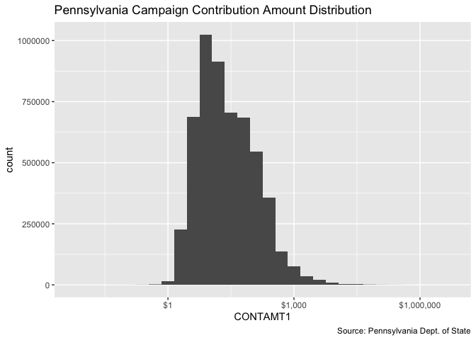

## Project


The Accountability Project is an effort to cut across data silos and give journalists, policy
professionals, activists, and the public at large a simple way to search across huge volumes of
public data about people and organizations.


Our goal is to standardizing public data on a few key fields by thinking of each dataset row as a
transaction. For each transaction there should be (at least) 3 variables:


1. All **parties** to a transaction
2. The **date** of the transaction
3. The **amount** of money involved


## Objectives


This document describes the process used to complete the following objectives:


1. How many records are in the database?
1. Check for duplicates
1. Check ranges
1. Is there anything blank or missing?
1. Check for consistency issues
1. Create a five-digit ZIP Code called `ZIP5`
1. Create a `YEAR` field from the transaction date
1. Make sure there is data on both parties to a transaction


## Packages


The following packages are needed to collect, manipulate, visualize, analyze, and communicate
these results. The `pacman` package will facilitate their installation and attachment.


```r
if (!require("pacman")) install.packages("pacman")
pacman::p_load_current_gh("kiernann/campfin")
pacman::p_load(
  stringdist, # levenshtein value
  tidyverse, # data manipulation
  lubridate, # datetime strings
  tidytext, # string analysis
  magrittr, # pipe opperators
  janitor, # dataframe clean
  refinr, # cluster and merge
  knitr, # knit documents
  glue, # combine strings
  scales, #format strings
  here, # relative storage
  fs, # search storage 
  vroom #read deliminated files
)
```


This document should be run as part of the `R_campfin` project, which lives as a sub-directory of
the more general, language-agnostic [`irworkshop/accountability_datacleaning`][01] GitHub
repository.


The `R_campfin` project uses the [RStudio projects][02] feature and should be run as such. The
project also uses the dynamic `here::here()` tool for file paths relative to _your_ machine.


```r
# where dfs this document knit?
here::here()
## [1] "/Users/soc/accountability/accountability_datacleaning/R_campfin"
```


[01]: https://github.com/irworkshop/accountability_datacleaning "TAP repo"
[02]: https://support.rstudio.com/hc/en-us/articles/200526207-Using-Projects "Rproj"


## Import


Link to download:
[03]: https://www.dos.pa.gov/VotingElections/CandidatesCommittees/CampaignFinance/Resources/Pages/FullCampaignFinanceExport.aspx "source"


### Download


Download raw, **immutable** data file. Go to https://www.dos.pa.gov/VotingElections/CandidatesCommittees/CampaignFinance/Resources/Pages/FullCampaignFinanceExport.aspx. We'll download the files from 2015 to 2019 (file format: zip file) with the script.


```r
# create a directory for the raw data
raw_dir <- here("pa", "contribs", "data", "raw")
dir_create(raw_dir)
```


Download all the file packages containing all campaign-finance-related files. 

```r
#download the files into the directory
pa_exp_urls <- glue("https://www.dos.pa.gov//VotingElections/CandidatesCommittees/CampaignFinance/Resources/Documents/{2015:2019}.zip")

if (!all_files_new(raw_dir)) {
  for (url in pa_exp_urls) {
    download.file(
      url = url,
      destfile = glue("{raw_dir}/{basename(url)}")
    )
  }
}
```


### Read
Read individual csv files from the downloaded zip files

```r
zip_files <- dir_ls(raw_dir, glob = "*.zip")

if (all_files_new(path = raw_dir, glob = "*.txt")) {
  for (i in seq_along(zip_files)) {
    unzip(
      zipfile = zip_files[i],
      #Matches the csv files that starts with expense, and trim the "./ " from directory names
      files = grep("contrib.+", unzip(zip_files[i]), value = TRUE) %>% substring(3,),
      exdir = raw_dir
    )
  }
}
```
Read multiple csvs into R

```r
#recursive set to true because 2016 and 2015 have subdirectories under "raw"
contrib_files <- list.files(raw_dir, pattern = ".txt", recursive = TRUE, full.names = TRUE)
#pa_lines <- list.files(raw_dir, pattern = ".txt", recursive = TRUE) %>% map(read_lines) %>% unlist()
pa_col_names <- c("FILERID", "EYEAR", "CYCLE", "SECTION", "CONTRIBUTOR", "ADDRESS1", "ADDRESS2", "CITY", "STATE", "ZIPCODE", "OCCUPATION", "ENAME", "EADDRESS1", "EADDRESS2", "ECITY", "ESTATE", "EZIPCODE", "CONTDATE1", "CONTAMT1", "CONTDATE2", "CONTAMT2", "CONTDATE3", "CONTAMT3", "CONTDESC")

pa <- contrib_files %>% 
  map(read_delim, delim = ",", escape_double = FALSE,
      escape_backslash = FALSE, col_names = pa_col_names, 
      col_types = cols(.default = col_character(),
                       EYEAR = col_integer(),
                       CYCLE = col_integer(),
                     CONTAMT1 = col_double())) %>% 
  bind_rows() %>% 
  mutate_if(is_character, str_to_upper)
```

### About

More information about the record layout can be found here https://www.dos.pa.gov/VotingElections/CandidatesCommittees/CampaignFinance/Resources/Documents/readme.txt.

### Encoding

```r
for (i in c(5:10)) {
  pa[[i]] <- iconv(pa[[i]], 'UTF-8', 'ASCII') %>% 
    toupper() %>% 
   str_replace("&AMP;", "&") 
}
```

Some columns are not read properly due to extraneous and unescaped commas or double quotes. The following lines of code fix that. 
### Indexing

```r
pa <- tibble::rowid_to_column(pa, "index")
```

### Repositioning

```r
to_reposit <- which(pa$CONTDATE2 != 0 & is.na(pa$CONTDATE2) == FALSE )

nudge <- function(df, index, cut_off_col) {
  for (i in index){
    col_posit <- match(cut_off_col, colnames(pa))
    df[i, col_posit] <- str_c(df[i, col_posit], df[i, col_posit+1], sep = " ")
      for (col in {col_posit+1}:{ncol(df)-1}) {
        df[i, col] <- df[i, col+1]
      } 
  }
  return(df)
}

pa <- nudge(pa, to_reposit[1:length(to_reposit)-1], "ENAME")
pa <- nudge(pa, to_reposit[length(to_reposit)], "CONTRIBUTOR")

pa$CONTAMT1 <- as.numeric(pa$CONTAMT1)
```

## Explore

There are `nrow(pa)` records of `length(pa)` variables in the full database.


```r
head(pa)
```

```
## # A tibble: 6 x 25
##   index FILERID EYEAR CYCLE SECTION CONTRIBUTOR ADDRESS1 ADDRESS2 CITY  STATE ZIPCODE OCCUPATION
##   <int> <chr>   <int> <int> <chr>   <chr>       <chr>    <chr>    <chr> <chr> <chr>   <chr>     
## 1     1 8600316  2015     7 IB      MS LISA A … 9914 VA… <NA>     BAKE… CA    933125… <NA>      
## 2     2 8600316  2015     7 IB      MRS KATHLE… LILLY C… <NA>     INDI… IN    462850… <NA>      
## 3     3 8600316  2015     7 IB      MR MITCHEL… 127 ASH… <NA>     CHAD… PA    193178… <NA>      
## 4     4 8600316  2015     7 IB      MRS YATI M… 40 PILL… <NA>     LYNN… MA    019401… <NA>      
## 5     5 8600316  2015     7 IB      MR BRENT A… 11 RAVE… <NA>     BLOO… IL    617048… <NA>      
## 6     6 8600316  2015     7 IB      LAURA LEE … 208 KAY… <NA>     CHES… SC    293238… <NA>      
## # … with 13 more variables: ENAME <chr>, EADDRESS1 <chr>, EADDRESS2 <chr>, ECITY <chr>,
## #   ESTATE <chr>, EZIPCODE <chr>, CONTDATE1 <chr>, CONTAMT1 <dbl>, CONTDATE2 <chr>,
## #   CONTAMT2 <chr>, CONTDATE3 <chr>, CONTAMT3 <chr>, CONTDESC <chr>
```

```r
tail(pa)
```

```
## # A tibble: 6 x 25
##    index FILERID EYEAR CYCLE SECTION CONTRIBUTOR ADDRESS1 ADDRESS2 CITY  STATE ZIPCODE OCCUPATION
##    <int> <chr>   <int> <int> <chr>   <chr>       <chr>    <chr>    <chr> <chr> <chr>   <chr>     
## 1 5.45e6 9900137  2019     1 IB      GREGORY FE… 10154 T… <NA>     TWIN… OH    44087   COMMERCIA…
## 2 5.45e6 9900137  2019     1 IB      SETH FIRQU… 4117 RO… <NA>     CHAR… NC    28226   BUSINESS …
## 3 5.45e6 9900137  2019     1 IB      THOMAS FIS… 1719 ST… <NA>     SEWI… PA    15143   DIR CRD R…
## 4 5.45e6 9900137  2019     1 IB      THOMAS FIS… 1719 ST… <NA>     SEWI… PA    15143   DIR CRD R…
## 5 5.45e6 9900137  2019     1 IB      THOMAS FIS… 1719 ST… <NA>     SEWI… PA    15143   DIR CRD R…
## 6 5.45e6 9900137  2019     1 IB      JOHN FRANKS 8721 TA… <NA>     HUNT… PA    16652   REGIONAL …
## # … with 13 more variables: ENAME <chr>, EADDRESS1 <chr>, EADDRESS2 <chr>, ECITY <chr>,
## #   ESTATE <chr>, EZIPCODE <chr>, CONTDATE1 <chr>, CONTAMT1 <dbl>, CONTDATE2 <chr>,
## #   CONTAMT2 <chr>, CONTDATE3 <chr>, CONTAMT3 <chr>, CONTDESC <chr>
```

```r
glimpse(pa)
```

```
## Observations: 5,454,802
## Variables: 25
## $ index       <int> 1, 2, 3, 4, 5, 6, 7, 8, 9, 10, 11, 12, 13, 14, 15, 16, 17, 18, 19, 20, 21, 2…
## $ FILERID     <chr> "8600316", "8600316", "8600316", "8600316", "8600316", "8600316", "8600316",…
## $ EYEAR       <int> 2015, 2015, 2015, 2015, 2015, 2015, 2015, 2015, 2015, 2015, 2015, 2015, 2015…
## $ CYCLE       <int> 7, 7, 7, 7, 7, 7, 7, 7, 7, 7, 7, 7, 7, 7, 7, 7, 7, 7, 7, 7, 7, 7, 7, 7, 7, 7…
## $ SECTION     <chr> "IB", "IB", "IB", "IB", "IB", "IB", "IB", "IB", "IB", "IB", "IB", "IB", "IB"…
## $ CONTRIBUTOR <chr> "MS LISA A COLLIE-PITTMAN", "MRS KATHLEEN C SOLOTKIN", "MR MITCHELL SILVERST…
## $ ADDRESS1    <chr> "9914 VALERIO COURT", "LILLY CORPORATE CENTER", "127 ASHFORD DRIVE", "40 PIL…
## $ ADDRESS2    <chr> NA, NA, NA, NA, NA, NA, NA, NA, NA, NA, "APT 1", NA, NA, NA, NA, NA, NA, NA,…
## $ CITY        <chr> "BAKERSFIELD", "INDIANAPOLIS", "CHADDS FORD", "LYNNFIELD", "BLOOMINGTON", "C…
## $ STATE       <chr> "CA", "IN", "PA", "MA", "IL", "SC", "IN", "MI", "TN", "MI", "MA", "MI", "IN"…
## $ ZIPCODE     <chr> "933125928", "462850001", "193178230", "019401355", "617048423", "293238656"…
## $ OCCUPATION  <chr> NA, NA, NA, NA, NA, NA, NA, NA, NA, NA, NA, NA, NA, NA, NA, NA, NA, NA, NA, …
## $ ENAME       <chr> NA, NA, NA, NA, NA, NA, NA, NA, NA, NA, NA, NA, NA, NA, NA, NA, NA, NA, NA, …
## $ EADDRESS1   <chr> NA, NA, NA, NA, NA, NA, NA, NA, NA, NA, NA, NA, NA, NA, NA, NA, NA, NA, NA, …
## $ EADDRESS2   <chr> NA, NA, NA, NA, NA, NA, NA, NA, NA, NA, NA, NA, NA, NA, NA, NA, NA, NA, NA, …
## $ ECITY       <chr> NA, NA, NA, NA, NA, NA, NA, NA, NA, NA, NA, NA, NA, NA, NA, NA, NA, NA, NA, …
## $ ESTATE      <chr> NA, NA, NA, NA, NA, NA, NA, NA, NA, NA, NA, NA, NA, NA, NA, NA, NA, NA, NA, …
## $ EZIPCODE    <chr> NA, NA, NA, NA, NA, NA, NA, NA, NA, NA, NA, NA, NA, NA, NA, NA, NA, NA, NA, …
## $ CONTDATE1   <chr> "20151201", "20151201", "20150901", "20150901", "20150901", "20150901", "201…
## $ CONTAMT1    <dbl> 21.22, 10.00, 20.00, 20.00, 10.00, 17.94, 10.00, 5.00, 10.00, 10.00, 5.00, 1…
## $ CONTDATE2   <chr> "0", "0", "0", "0", "0", "0", "0", "0", "0", "0", "0", "0", "0", "0", "0", "…
## $ CONTAMT2    <chr> "0", "0", "0", "0", "0", "0", "0", "0", "0", "0", "0", "0", "0", "0", "0", "…
## $ CONTDATE3   <chr> "0", "0", "0", "0", "0", "0", "0", "0", "0", "0", "0", "0", "0", "0", "0", "…
## $ CONTAMT3    <chr> "0", "0", "0", "0", "0", "0", "0", "0", "0", "0", "0", "0", "0", "0", "0", "…
## $ CONTDESC    <chr> NA, NA, NA, NA, NA, NA, NA, NA, NA, NA, NA, NA, NA, NA, NA, NA, NA, NA, NA, …
```

### Distinct


The variables range in their degree of distinctness.`CONTDATE2`, `CONTAMT2`, `CONTDATE3", "CONTAMT3` only have one value 0.


```r
pa %>% glimpse_fun(n_distinct)
```

```
## # A tibble: 25 x 4
##    col         type        n           p
##    <chr>       <chr>   <dbl>       <dbl>
##  1 index       int   5454802 1          
##  2 FILERID     chr      3195 0.000586   
##  3 EYEAR       int         5 0.000000917
##  4 CYCLE       int         9 0.00000165 
##  5 SECTION     chr         8 0.00000147 
##  6 CONTRIBUTOR chr    524815 0.0962     
##  7 ADDRESS1    chr    441799 0.0810     
##  8 ADDRESS2    chr     15999 0.00293    
##  9 CITY        chr     18065 0.00331    
## 10 STATE       chr        57 0.0000104  
## 11 ZIPCODE     chr    183643 0.0337     
## 12 OCCUPATION  chr     61957 0.0114     
## 13 ENAME       chr     44307 0.00812    
## 14 EADDRESS1   chr     54012 0.00990    
## 15 EADDRESS2   chr      5346 0.000980   
## 16 ECITY       chr      5298 0.000971   
## 17 ESTATE      chr        56 0.0000103  
## 18 EZIPCODE    chr     21009 0.00385    
## 19 CONTDATE1   chr      1819 0.000333   
## 20 CONTAMT1    dbl     65803 0.0121     
## 21 CONTDATE2   chr         1 0.000000183
## 22 CONTAMT2    chr         1 0.000000183
## 23 CONTDATE3   chr         1 0.000000183
## 24 CONTAMT3    chr         1 0.000000183
## 25 CONTDESC    chr     12612 0.00231
```

### Missing

The variables also vary in their degree of values that are `NA` (missing).


```r
pa %>% glimpse_fun(count_na)
```

```
## # A tibble: 25 x 4
##    col         type        n           p
##    <chr>       <chr>   <dbl>       <dbl>
##  1 index       int         0 0          
##  2 FILERID     chr         0 0          
##  3 EYEAR       int         0 0          
##  4 CYCLE       int         0 0          
##  5 SECTION     chr      1690 0.000310   
##  6 CONTRIBUTOR chr         3 0.000000550
##  7 ADDRESS1    chr     41457 0.00760    
##  8 ADDRESS2    chr   4758121 0.872      
##  9 CITY        chr     40809 0.00748    
## 10 STATE       chr     44325 0.00813    
## 11 ZIPCODE     chr     34606 0.00634    
## 12 OCCUPATION  chr   2844121 0.521      
## 13 ENAME       chr   3103683 0.569      
## 14 EADDRESS1   chr   3737616 0.685      
## 15 EADDRESS2   chr   5217531 0.957      
## 16 ECITY       chr   3766478 0.690      
## 17 ESTATE      chr   3770883 0.691      
## 18 EZIPCODE    chr   3720479 0.682      
## 19 CONTDATE1   chr      4065 0.000745   
## 20 CONTAMT1    dbl         0 0          
## 21 CONTDATE2   chr         0 0          
## 22 CONTAMT2    chr         0 0          
## 23 CONTDATE3   chr         0 0          
## 24 CONTAMT3    chr         0 0          
## 25 CONTDESC    chr   5299516 0.972
```


We will flag any records with missing values in the key variables used to identify a contribution.
There are 0 records missing `CONTRIBUTOR`, `CONTAMT1` AND `CONTDATE1`

```r
pa <- pa %>% flag_na(CONTRIBUTOR, CONTAMT1, CONTDATE1)
```


### Duplicates


```r
pa <- flag_dupes(pa, dplyr::everything())
sum(pa$dupe_flag)
## [1] 0
```

### Ranges

#### Amounts


```r
summary(pa$CONTRIBUTOR)
##    Length     Class      Mode 
##   5454802 character character
sum(pa$CONTAMT1 < 0 , na.rm = TRUE)
## [1] 870
```


See how the campaign contributions were distributed


```r
pa %>% 
  ggplot(aes(x = CONTAMT1)) + 
  geom_histogram() +
  scale_x_continuous(
    trans = "log10", labels = dollar) +
  labs(title = "Pennsylvania Campaign Contribution Amount Distribution",
       caption = "Source: Pennsylvania Dept. of State")
```

```
## `stat_bin()` using `bins = 30`. Pick better value with `binwidth`.
```

<!-- -->

#### Year

Add a `year` variable from `date` after `col_date()` using `lubridate::year()`.


```r
pa$CONTDATE1 <- as.Date(pa$CONTDATE1, "%Y%m%d")
```


```r
pa <- pa %>% mutate(year = year(CONTDATE1), on_year = is_even(year))
```

#### Dates

Records in the PA contribution datasets date back to 1900-01-16 till 9201-01-12 

```r
summary(pa$CONTDATE1)
```

```
##         Min.      1st Qu.       Median         Mean      3rd Qu.         Max.         NA's 
## "1900-01-16" "2016-03-27" "2017-04-07" "2017-03-04" "2017-12-31" "9201-01-12"       "4065"
```

The `CONTDATE2` and `CONTDATE3` variables should be blank

```r
pa <- pa %>% mutate(date_flag = year < 2000 | year > format(Sys.Date(), "%Y"), 
                    year_clean = ifelse(
                    date_flag, NA, year))

pa <- pa %>% mutate(date_clean = CONTDATE1) 
pa$date_clean[pa$date_flag] <- NA

summary(pa$date_clean)
```

```
##         Min.      1st Qu.       Median         Mean      3rd Qu.         Max.         NA's 
## "2000-06-07" "2016-03-27" "2017-04-07" "2017-03-03" "2017-12-31" "2019-10-19"       "4084"
```


## Wrangle
The state column is now pretty clean, as all non-NA columns have two characters.

### Zipcode
The Zipcode column can range from 1 to 13 columns.


```r
table(nchar(pa$ZIPCODE))
## 
##       1       5       6       7       8       9      10 
##    9358 2227221     587      22    2044 3170101   10863
```


```r
pa <- pa %>% 
  mutate(
    zip_clean = ZIPCODE %>% 
      normal_zip(na_rep = TRUE))
sample(pa$zip_clean, 10)
##  [1] "60532" "89131" "02903" "60048" "19103" "06828" "60064" "45840" "32246" "19406"
  
## Same with EZIPCODE
pa <- pa %>% 
  mutate(
    employer_zip_clean = EZIPCODE %>% 
      normal_zip(na_rep = TRUE)
  )
  sample(pa$employer_zip_clean, 10)
##  [1] "02110" NA      NA      NA      NA      NA      NA      NA      NA      "23510"
```

### State
View values in the STATE field is not a valid state abbreviation

```r
{pa$STATE[pa$STATE %out% valid_state]}[!is.na(pa$STATE[pa$STATE %out% valid_state])]
## [1] "CN" "CN"
{pa$ESTATE[pa$ESTATE %out% valid_state]}[!is.na(pa$ESTATE[pa$ESTATE %out% valid_state])]
## [1] "CN"
```
These are contributions from people in Canada, which we can leave in. 

### City
Cleaning city values is the most complicated. This process involves four steps:

1. Prepare raw city values by removing invalid data and reducing inconsistencies
1. Match prepared city values with the _actual_ city name of that record's ZIP code
1. swap prepared city values with the ZIP code match _if_ only 1 edit is needed
1. Refine swapped city values with key collision and n-gram fingerprints

#### Prep

5413993 distinct cities were in the original dataset in column 

```r
pa <- pa %>% mutate(city_prep = normal_city(city = CITY,
                                            geo_abbs = usps_city,
                                            st_abbs = c(valid_state),
                                            na = invalid_city,
                                            na_rep = TRUE))
pa <- pa %>% mutate(employer_city_prep = normal_city(city = ECITY,
                                            geo_abbs = usps_city,
                                            st_abbs = c(valid_state),
                                            na = invalid_city,
                                            na_rep = TRUE))
n_distinct(pa$city_prep)
## [1] 16783
n_distinct(pa$employer_city_prep)
## [1] 5069
```

#### Match


```r
pa <- pa %>%
  left_join(
    y = zipcodes,
    by = c(
      "zip_clean" = "zip",
      "STATE" = "state"
    )
  ) %>% 
  rename(city_match = city)
```

#### Swap

To replace city names with expected city names from zipcode when the two variables are no more than two characters different

```r
pa <- pa %>% 
  mutate(
    match_dist = stringdist(city_prep, city_match),
    city_swap = if_else(condition = is.na(city_match) == FALSE,
                        if_else(
      condition = match_dist <= 2,
      true = city_match,
      false = city_prep
    ),
      false = city_prep
  ))

summary(pa$match_dist)
```

```
##    Min. 1st Qu.  Median    Mean 3rd Qu.    Max.    NA's 
##    0.00    0.00    0.00    0.92    0.00   22.00   63588
```

```r
sum(pa$match_dist == 1, na.rm = TRUE)
```

```
## [1] 25100
```

```r
n_distinct(pa$city_swap)
```

```
## [1] 13622
```

#### Refine

Use the OpenRefine algorithms to cluster similar values and merge them together. This can be done using the refinr::key_collision_merge() and refinr::n_gram_merge() functions on our prepared and swapped city data.

```r
pa_refined <- pa %>%
  filter(match_dist != 1) %>% 
  filter(STATE =="PA") %>% 
  mutate(
    city_refine = city_swap %>% 
      key_collision_merge(dict = valid_city) %>% 
      n_gram_merge(numgram = 2),
    refined = (city_swap != city_refine)
  ) %>% 
  filter(refined) %>% 
  select(
    index,
    FILERID, 
    CITY,
    city_prep,
    city_match,
    city_swap,
    match_dist,
    city_refine,
    STATE, 
    ZIPCODE,
    zip_clean
  )

pa_refined %>% 
  count(city_swap, city_refine) %>% 
  arrange(desc(n))
```

```
## # A tibble: 156 x 3
##    city_swap             city_refine              n
##    <chr>                 <chr>                <int>
##  1 MC MURRAY             MCMURRAY               232
##  2 SINKING SPRINGS       SINKING SPRING          83
##  3 SPRING BROOK TOWNSHIP SPRINGBROOK TOWNSHIP    68
##  4 PENDEL                PENNDEL                 52
##  5 MAPLE GLENN           MAPLE GLEN              46
##  6 MEADOW BROOK          MEADOWBROOK             41
##  7 BRADFORD WOODS        BRADFORDWOODS           39
##  8 PLEASANT MOUNT        MOUNT PLEASANT          33
##  9 UPPER CHICHESTE       UPPER CHICHESTER        23
## 10 NORTH HUNTINGDO       NORTH HUNTINGDON        20
## # … with 146 more rows
```


Manually change the city_refine fields due to overcorrection.


```r
pa_refined$city_refine <- pa_refined$city_refine %>% 
  str_replace("SHAWNEE\\sON\\sDELA$", "SHAWNEE ON DELAWARE") %>% 
  str_replace("^SPRINGBROOK$", "SPRING BROOK") %>% 
  str_replace("^ALBA$", "BALA CYNWYD") %>% 
  str_replace("^BRADFORDWOODS$", "BRADFORD WOODS") 

refined_table <-pa_refined %>% 
  select(index, city_refine)
```

#### Merge 


```r
pa <- pa %>% 
  left_join(refined_table, by ="index") %>% 
  mutate(city = coalesce(city_refine, city_swap)) 

pa$city <- pa$city %>% 
  str_replace("\\sTWP$|\\sTP$", " TOWNSHIP") %>% 
  str_replace("\\sSQ$", " SQUARE") 
```


```r
pa_out <- pa %>% filter(city %out% valid_city) 

pa_city_lookup <- read_csv(file = here("pa", "contribs", "data", "raw", "pa_city_lookup_contrib.csv"), skip =1, col_names = c("city", "city_lookup", "changed"))
```

```
## Parsed with column specification:
## cols(
##   city = col_character(),
##   city_lookup = col_character(),
##   changed = col_character()
## )
```

```r
pa_out <- pa_out %>% select(index, CITY) %>% 
  inner_join(pa_city_lookup, by = c("CITY" = "city")) %>% 
  drop_na(CITY) %>% 
  select(index,city_lookup)

pa <- pa %>% left_join(pa_out, by = "index") %>% mutate(city_lkp = ifelse(pa$index %in% pa_out$index, city_lookup,city))

pa_match_table <- pa %>% 
  filter(str_sub(pa$city_swap, 1,1) == str_sub(pa$city_match, 1,1)) %>% 
  filter(city_lkp %out% valid_city)  %>% 
  mutate(string_dis = stringdist(city, city_match)) %>% 
  select (index, zip_clean, STATE, city, city_match, string_dis) %>% 
  distinct() %>% 
  add_count(city_match) %>% 
  rename("sec_city_match" = "city_match") %>% 
  filter(string_dis < 11) 

pa_match_table[pa_match_table$city == "HODGDON", "sec_city_match"] <- "HODGDON"
pa_match_table[pa_match_table$city == "WOLVERINE LAKE", "sec_city_match"] <- "WOLVERINE LAKE" 
pa_match_table[pa_match_table$city == "CROSS LANES", "sec_city_match"] <- "CROSS LANES"
pa_match_table[pa_match_table$city == "PONTE VEDRA", "sec_city_match"] <- "PONTE VEDRA BEACH"
pa_match_table[pa_match_table$city == "MOYLAN", "sec_city_match"] <- "MOYLAN"

pa_match_table[pa_match_table$city == "WYO", "sec_city_match"] <- "WYOMISSING"
pa_match_table[pa_match_table$city == "TEMPLE TERRACE", "sec_city_match"] <- "TEMPLE TERRACE"
pa_match_table[pa_match_table$city == "SPRINGTON", "sec_city_match"] <- "SPRINGTON"

pa <- pa_match_table %>% select(index, sec_city_match) %>% 
  right_join(pa, by = "index") %>% 
  mutate(city_clean = coalesce(sec_city_match, city_lkp))
```


```r
pa <- pa %>%   
  unite(
    ADDRESS1, ADDRESS2,
    col = address_clean,
    sep = " ",
    remove = FALSE,
    na.rm = TRUE
  ) %>% 
  mutate(address_clean = normal_address(
      address = address_clean,
      add_abbs = usps_city,
      na_rep = TRUE
    ))
```


```r
pa_filer <- read_csv(file = here("pa", "contribs", "data", "raw", "pa_filer_clean.csv"))
```

```
## Parsed with column specification:
## cols(
##   .default = col_character(),
##   index = col_double(),
##   EYEAR = col_double(),
##   CYCLE = col_double(),
##   FILERTYPE = col_double(),
##   DISTRICT = col_double(),
##   BEGINNING = col_double(),
##   MONETARY = col_double(),
##   INKIND = col_double()
## )
```

```
## See spec(...) for full column specifications.
```

```r
pa <- pa_filer %>% 
  select(FILERID, EYEAR, CYCLE, FILERNAME, filer_address_clean, filer_zip_clean, filer_city, filer_state, filer_zip_clean) %>% 
  right_join(pa, pa_filer, by = c("FILERID", "EYEAR", "CYCLE"))
```

Each process also increases the percent of valid city names.


```r
prop_in(pa$CITY, valid_city, na.rm = TRUE)
## [1] 0.9420609
prop_in(pa$city_prep, valid_city, na.rm = TRUE)
## [1] 0.947592
prop_in(pa$city_swap, valid_city, na.rm = TRUE)
## [1] 0.952064
prop_in(pa$city, valid_city, na.rm = TRUE)
## [1] 0.9519325
prop_in(pa$city_clean, valid_city, na.rm = TRUE)
## [1] 0.9592656
```

### Address
Finally, we will create a new variable named `address_clean` cleaned with the `normal_address` function. Make sure you're using a tidyr version that is greater than "0.8.3.9", where the na.rm argument of the `unite()` function is supported.

```r
pa <- pa %>% unite(
    ADDRESS1, ADDRESS2,
    col = address_clean,
    sep = " ",
    remove = FALSE,
    na.rm = TRUE
  ) %>% 
  mutate(address_clean = normal_address(address = address_clean,
      add_abbs = usps_city,
      na_rep = TRUE))
```


Each step of the cleaning process reduces the number of distinct city values.
There are 5484343 with 18065 distinct values, after the swap and refine processes, there are 5483199 entries with 12355 distinct values. 


## Conclude


1. There are 5525170 records in the database
1. There are 0 records with suspected duplicate filerID, recipient, date, _and_ amount
(flagged with `dupe_flag`)
1. The ranges for dates and amounts are reasonable
1. Consistency has been improved with `stringr` package and custom `normal_*()` functions.
1. The five-digit `zip_clean` variable has been created with `zipcode::clean.zipcode()`
1. The `year` variable has been created with `lubridate::year()`
1. There are 40827 records with missing `city` values and 0 records with missing `payee` values (both flagged with the `na_flag`).


## Export


```r
clean_dir <- here("pa", "contribs", "data", "processed")
dir_create(clean_dir)
pa %>% 
  select(
    -city_prep,
    -on_year,
    -match_dist,
    -city_swap,
    -city_refine,
    -city_match,
    -city,
    -city_lookup,
    -city_lkp,
    -sec_city_match
  ) %>% 
  rename(ZIP5 = zip_clean, employer_ZIP5 = employer_zip_clean) %>% 
  write_csv(
    path = glue("{clean_dir}/pa_contribs_clean.csv"),
    na = ""
  )
```
