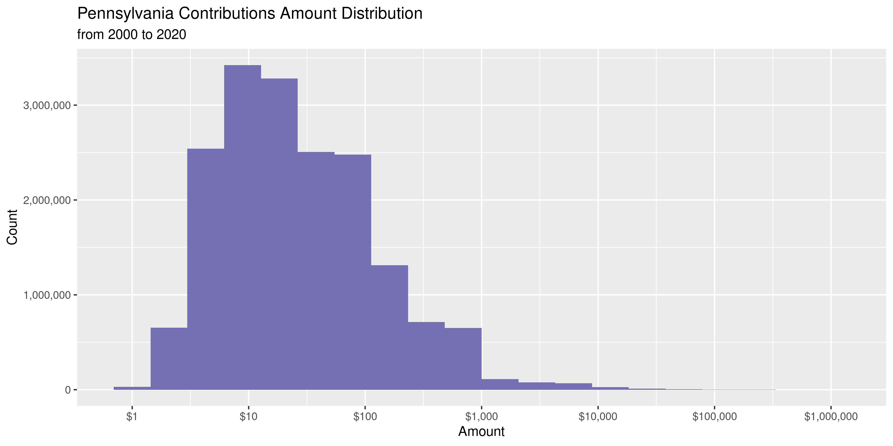
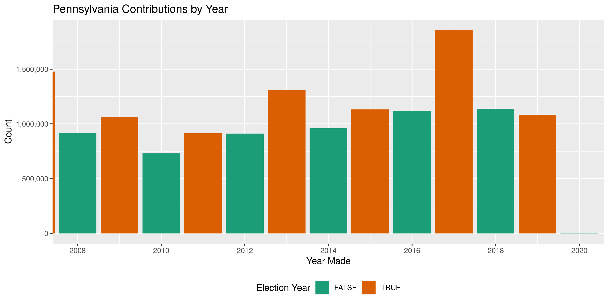
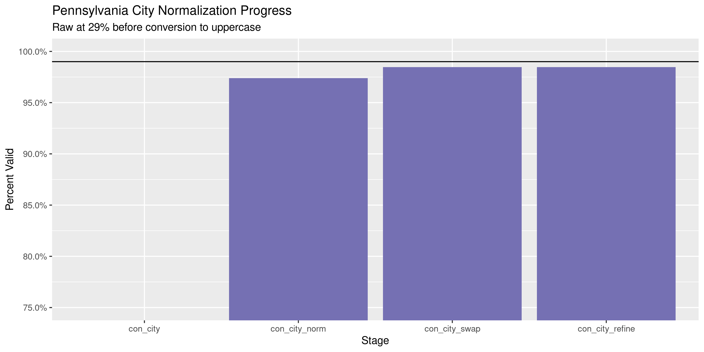
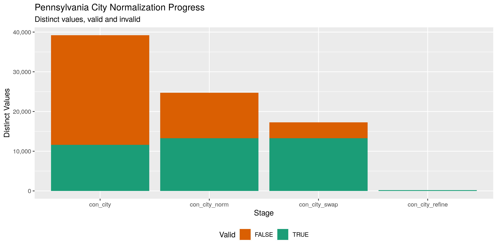

Pennsylvania Contributions
================
Kiernan Nicholls
2020-04-14 16:53:12

  - [Project](#project)
  - [Objectives](#objectives)
  - [Packages](#packages)
  - [Data](#data)
  - [Import](#import)
  - [Explore](#explore)
  - [Wrangle](#wrangle)
  - [Conclude](#conclude)
  - [Export](#export)

<!-- Place comments regarding knitting here -->

## Project

The Accountability Project is an effort to cut across data silos and
give journalists, policy professionals, activists, and the public at
large a simple way to search across huge volumes of public data about
people and organizations.

Our goal is to standardizing public data on a few key fields by thinking
of each dataset row as a transaction. For each transaction there should
be (at least) 3 variables:

1.  All **parties** to a transaction.
2.  The **date** of the transaction.
3.  The **amount** of money involved.

## Objectives

This document describes the process used to complete the following
objectives:

1.  How many records are in the database?
2.  Check for entirely duplicated records.
3.  Check ranges of continuous variables.
4.  Is there anything blank or missing?
5.  Check for consistency issues.
6.  Create a five-digit ZIP Code called `zip`.
7.  Create a `year` field from the transaction date.
8.  Make sure there is data on both parties to a transaction.

## Packages

The following packages are needed to collect, manipulate, visualize,
analyze, and communicate these results. The `pacman` package will
facilitate their installation and attachment.

The IRW’s `campfin` package will also have to be installed from GitHub.
This package contains functions custom made to help facilitate the
processing of campaign finance data.

``` r
if (!require("pacman")) install.packages("pacman")
pacman::p_load_gh("irworkshop/campfin")
pacman::p_load(
  tidyverse, # data manipulation
  lubridate, # datetime strings
  gluedown, # format markdown
  magrittr, # pipe operators
  janitor, # dataframe clean
  refinr, # cluster and merge
  scales, # format strings
  knitr, # knit documents
  vroom, # read files fast
  glue, # combine strings
  httr, # make http requests
  here, # relative storage
  fs # search storage 
)
```

This document should be run as part of the `R_campfin` project, which
lives as a sub-directory of the more general, language-agnostic
[`irworkshop/accountability_datacleaning`](https://github.com/irworkshop/accountability_datacleaning)
GitHub repository.

The `R_campfin` project uses the [RStudio
projects](https://support.rstudio.com/hc/en-us/articles/200526207-Using-Projects)
feature and should be run as such. The project also uses the dynamic
`here::here()` tool for file paths relative to *your* machine.

``` r
# where does this document knit?
here::here()
#> [1] "/home/kiernan/Code/accountability_datacleaning/R_campfin"
```

## Data

Data is from the [Pennsylvania Election and Campaign Finance System
(ECF)](https://www.dos.pa.gov/VotingElections/CandidatesCommittees/CampaignFinance/Pages/default.aspx).

The ECF provides a [Full Campaign Finance
Export](https://www.dos.pa.gov/VotingElections/CandidatesCommittees/CampaignFinance/Resources/Pages/FullCampaignFinanceExport.aspx).
From this page, files are organized as annual directories containing
files for contributions, debt, expenditures, filer information, and
receipts.

The ECF also provides a `readme.txt` file, which can be

``` r
pa_host <- "https://www.dos.pa.gov/VotingElections"
pa_dir <- "CandidatesCommittees/CampaignFinance/Resources/Documents"
readme_file <- "readme.txt"
readme_url <- paste(pa_host, pa_dir, readme_file, sep = "/")
```

| col           | type         |
| :------------ | :----------- |
| `filerid`     | VARCHAR(20)  |
| `eyear`       | INT          |
| `cycle`       | INT          |
| `section`     | VARCHAR(10)  |
| `contributor` | VARCHAR(255) |
| `address1`    | VARCHAR(50)  |
| `address2`    | VARCHAR(50)  |
| `city`        | VARCHAR(50)  |
| `state`       | VARCHAR(10)  |
| `zipcode`     | VARCHAR(15)  |
| `occupation`  | VARCHAR(255) |
| `ename`       | VARCHAR(255) |
| `eaddress1`   | VARCHAR(50)  |
| `eaddress2`   | VARCHAR(50)  |
| `ecity`       | VARCHAR(50)  |
| `estate`      | VARCHAR(10)  |
| `ezipcode`    | VARCHAR(15)  |
| `contdate1`   | VARCHAR(20)  |
| `contamt1`    | MONEY        |
| `contdate2`   | VARCHAR(20)  |
| `contamt2`    | MONEY        |
| `contdate3`   | VARCHAR(20)  |
| `contamt3`    | MONEY        |
| `contdesc`    | VARCHAR(500) |

| col         | type         |
| :---------- | :----------- |
| `filerid`   | VARCHAR(20)  |
| `eyear`     | INT          |
| `cycle`     | INT          |
| `ammend`    | VARCHAR(1)   |
| `terminate` | VARCHAR(1)   |
| `filertype` | VARCHAR(10)  |
| `filername` | VARCHAR(255) |
| `office`    | VARCHAR(15)  |
| `district`  | VARCHAR(15)  |
| `party`     | VARCHAR(15)  |
| `address1`  | VARCHAR(50)  |
| `address2`  | VARCHAR(50)  |
| `city`      | VARCHAR(50)  |
| `state`     | VARCHAR(10)  |
| `zipcode`   | VARCHAR(15)  |
| `county`    | VARCHAR(15)  |
| `phone`     | VARCHAR(15)  |
| `beginning` | MONEY        |
| `monetary`  | MONEY        |
| `inkind`    | MONEY        |

## Import

To import the files into R, we will have to first download the annual
ZIP archive file containing all campaign finance transactions. Then we
can extract the contributions file and read them all into a single file
for processing.

### Download

Each ZIP archive is simply named as the 4-digit year for the files
within. We can download each ZIP to the `/data/raw` directory.

``` r
zip_names <- paste(2000:2020, "zip", sep = ".")
zip_urls <- paste(pa_host, pa_dir, zip_names, sep = "/")
raw_dir <- dir_create(here("pa", "contribs", "data", "raw"))
zip_paths <- path(raw_dir, zip_names)
fix_check <- here("pa", "contribs", "data", "fixed.txt")
if (length(dir_ls(raw_dir, regexp = "zip")) < 10) {
  download.file(zip_urls, zip_paths)
  file_delete(fix_check)
}
```

Then we will unzip the annual directory from each archive.

``` r
if (all(dir_ls(raw_dir) %in% zip_paths)) {
  for (zip in zip_paths) {
    unzip(zip, exdir = raw_dir)
  }
}
```

For each year, there is a file for contribution and a file for the
information on the recipients of those contributions, who file the
reports containing the data. We will identify the path of each file type
in new vectors, which can then be read together.

``` r
con_paths <- dir_ls(
  path = raw_dir, 
  recurse = TRUE, 
  regexp = "contrib[\\.|_]"
)

fil_paths <- dir_ls(
  path = raw_dir, 
  recurse = TRUE, 
  regexp = "filer[\\.|_]"
)
```

### Fix

To properly read so many records, we need to first perform some
manipulation of the text files. Each “cell” of character type columns
are surrounded in double quotation marks (`"`) to help prevent
misreading. Howver, some of the text in these cells itself contains
double quotes or newline characters (`\n`).

We need to read each file as a character string and use regular
expressions to identify these erroneous characters and remove or replace
them.

``` r
# do not repeat if done
if (!file_exists(fix_check)) {
  # for all contrib and filer files
  for (file in c(con_paths, fil_paths)) {
    # read raw file
    read_file(file) %>% 
      # force conversion to simple
      str_conv(encoding = "ASCII") %>% 
      # replace non-carriage newline
      str_replace_all("(?<!\r)\n", " ") %>%
      # replace not-field double quotes
      str_replace_all("(?<!^|,|\r\n)\"(?!,|\r\n|$)", "\'") %>% 
      # replace non-delim commas
      str_remove_all(",(?!\"|\\d|\\.\\d+|-(\\d|\\.))") %>% 
      # overwrite raw file
      write_file(file)
    # check progress
    message(paste(basename(file), "done"))
    # clean garbage memory
    gc()
  }
  # note this has done
  file_create(fix_check)
}
```

### Read

Now that each text file has been cleaned of irregularies, they can each
be properly read into R.

If this has already beem done, it’s easier to read the single file that
was written at the end of the initial process. If we read this single
file, we can skip the chunks below reading for the first time.

``` r
pac_files <- path(raw_dir, sprintf("pac%s.csv", 1:10))
no_pac <- !all(file_exists(pac_files))
if (!no_pac) {
  pac <- vroom(
    file = pac_files,
    delim = "|",
    escape_backslash = TRUE, 
    col_names = TRUE,
    col_types = cols(
      filerid = col_double(),
      eyear = col_double(),
      cycle = col_double(),
      date = col_date(),
      amount = col_double(),
      fil_type = col_double(),
      district = col_integer(),
      fil_address2 = col_logical(),
      fil_phone = col_logical()
    )
  )
}
```

First, we will read all the annual contribution files into a single data
frame using `vroom::vroom()`. We need to use the column names and types
listed in the `readme.txt` file we downloaded earlier.

``` r
pac <- map_df(
  .x = con_paths,
  .f = read_delim,
  delim = ",",
  escape_backslash = FALSE, 
  escape_double = FALSE,
  col_names = readme$contribs$col,
  col_types = cols(
    .default = col_skip(),
    filerid = col_character(),
    eyear = col_integer(),
    cycle = col_integer(),
    section = col_character(),
    contributor = col_character(),
    address1 = col_character(),
    address2 = col_character(),
    city = col_character(),
    state = col_character(),
    zipcode = col_character(),
    occupation = col_character(),
    ename = col_character(),
    contdate1 = col_date("%Y%m%d"),
    contamt1 = col_double()
  )
)
```

Then we can read the fixed filers files.

``` r
filers <- map_df(
  .x = fil_paths,
  .f = read_delim,
  delim = ",",
  escape_backslash = FALSE, 
  escape_double = FALSE,
  col_names = readme$filer$col,
  col_types = cols(
    .default = col_skip(),
    eyear = col_integer(),
    filerid = col_character(),
    filertype = col_character(),
    filername = col_character(),
    office = col_character(),
    district = col_character(),
    party = col_character(),
    address1 = col_character(),
    address2 = col_character(),
    city = col_character(),
    state = col_character(),
    zipcode = col_character(),
    county = col_character(),
    phone = col_character(),
  )
)
```

``` r
filers <- filers %>% 
  group_by(filerid, eyear) %>% 
  slice(1) %>% 
  ungroup()
```

``` r
# 13,135,695
pac <- left_join(
  x = pac,
  y = filers,
  by = c("filerid", "eyear"),
  suffix = c("_con", "_fil")
)

rm(filers)

pac <- rename_prefix(
  df = pac,
  suffix = c("_con", "_fil"),
  punct = TRUE
)
```

``` r
pac <- pac %>% 
  rename(
    con_zip = con_zipcode,
    date = contdate1,
    amount = contamt1,
    fil_type = filertype,
    filer = filername,
    fil_zip = fil_zipcode,
    fil_phone = phone
  )
```

We will save a copy of this new file to the disk that can easily be read
if needed.

``` r
n <- 10
x <- nrow(pac)/n
for (i in seq(1, n)) {
  write_delim(
    x = pac[1:x, ],
    path = path(raw_dir, sprintf("pac%s.csv", i)),
    delim = "|",
    quote_escape = "backslash"
  )
  pac <- pac[-(1:x), ]
  gc(full = TRUE)
  Sys.sleep(60)
  message(percent(i/n))
}
```

## Explore

``` r
head(pac)
#> # A tibble: 6 x 26
#>   filerid eyear cycle section contributor con_address1 con_address2 con_city con_state con_zip
#>     <dbl> <dbl> <dbl> <chr>   <chr>       <chr>        <chr>        <chr>    <chr>     <chr>  
#> 1 2000006  2000     5 IB      JOSHUA CER… 290 LYNBROO… <NA>         YORK     PA        17402  
#> 2 2000006  2000     5 IB      LANCE CUNN… 3267 N GEOR… <NA>         EMIGSVI… PA        17318  
#> 3 2000006  2000     5 IB      JASON HARO… <NA>         <NA>         <NA>     <NA>      <NA>   
#> 4 2000006  2000     5 IB      KEITH HILL  240 ARCH ST  <NA>         YORK     PA        17404  
#> 5 2000006  2000     5 IB      CHIP PARKS  700 LINDA L… <NA>         STEVENS  PA        17578  
#> 6 2000006  2000     5 IB      BRIAN SINN… 201 E CLARK… <NA>         YORK     PA        17403  
#> # … with 16 more variables: occupation <chr>, ename <chr>, date <date>, amount <dbl>,
#> #   fil_type <dbl>, filer <chr>, office <chr>, district <int>, party <chr>, fil_address1 <chr>,
#> #   fil_address2 <lgl>, fil_city <chr>, fil_state <chr>, fil_zip <chr>, county <chr>,
#> #   fil_phone <lgl>
tail(pac)
#> # A tibble: 6 x 26
#>   filerid eyear cycle section contributor con_address1 con_address2 con_city con_state con_zip
#>     <dbl> <dbl> <dbl> <chr>   <chr>       <chr>        <chr>        <chr>    <chr>     <chr>  
#> 1 9600087  2020     9 IC      NISOURCE I… 290 W. NATI… <NA>         COLUMBUS OH        43215  
#> 2 9600087  2020     9 IC      MCNEES PAC  100 PINE ST… <NA>         HARRISB… PA        17108  
#> 3 9600087  2020     9 IC      UGI UTILIT… PO BOX 12677 <NA>         READING  PA        19612  
#> 4 9600087  2020     9 IC      PABAR PAC … PO BOX 186   <NA>         HARRISB… PA        17108  
#> 5 9600087  2020     9 IC      FOOD PAC (… PO BOX 870   <NA>         CAMP HI… PA        17001  
#> 6 9600087  2020     9 IC      PA AUTOMOT… 1925 N FRON… <NA>         HARRISB… PA        17105  
#> # … with 16 more variables: occupation <chr>, ename <chr>, date <date>, amount <dbl>,
#> #   fil_type <dbl>, filer <chr>, office <chr>, district <int>, party <chr>, fil_address1 <chr>,
#> #   fil_address2 <lgl>, fil_city <chr>, fil_state <chr>, fil_zip <chr>, county <chr>,
#> #   fil_phone <lgl>
glimpse(sample_n(pac, 20))
#> Rows: 20
#> Columns: 26
#> $ filerid      <dbl> 20140370, 20130163, 7900366, 2003124, 8600316, 9500123, 8600316, 2008178, 2…
#> $ eyear        <dbl> 2015, 2016, 2019, 2003, 2004, 2008, 2010, 2009, 2017, 2013, 2011, 2001, 201…
#> $ cycle        <dbl> 7, 7, 1, 3, 4, 2, 5, 4, 7, 4, 7, 5, 5, 4, 4, 4, 3, 7, 7, 9
#> $ section      <chr> "IB", "IB", "IB", "ID", "IB", "IB", "IB", "IB", "ID", "IB", "ID", "IB", NA,…
#> $ contributor  <chr> "JOSEPH D BEDNAR", "Momcilo  Vidakovic", "KELLY H COMPEAU", "JAMES E. WINNE…
#> $ con_address1 <chr> "40 GENERAL WARREN BLVD", "1 N Waukegan Rd", "100 ANDERSON ST APT 727", "WI…
#> $ con_address2 <chr> "STE 260", NA, NA, NA, NA, NA, NA, NA, NA, NA, NA, NA, NA, NA, NA, NA, NA, …
#> $ con_city     <chr> "MALVERN", "North Chicago", "PITTSBURGH", "SHARON", "Indianapolis", "IRVING…
#> $ con_state    <chr> "PA", "IL", "PA", "PA", "IN", "TX", "OH", "KS", "CA", "PA", "CA", "MO", "MO…
#> $ con_zip      <chr> "193551251", "600641802", "152125843", "16146", "46237", "75063-298", "4440…
#> $ occupation   <chr> NA, NA, "STAFF", "EXECUTIVE", NA, "ASSET EVALUATION MANAGER", NA, NA, "CLAS…
#> $ ename        <chr> NA, NA, NA, "WINNER INTERNATIONAL", NA, "CITICORP / CITIBANK", NA, NA, "WEE…
#> $ date         <date> 2015-11-13, 2016-11-03, 2019-01-08, 2003-05-06, 2004-06-10, 2008-04-07, 20…
#> $ amount       <dbl> 2.00, 5.00, 41.00, 500.00, 20.00, 132.45, 13.98, 24.00, 558.90, 50.00, 29.0…
#> $ fil_type     <dbl> 2, 2, 2, 2, 2, 2, 2, 2, 2, 2, 2, 2, 2, 2, 2, 2, 2, 2, 2, 2
#> $ filer        <chr> "THE WENDYS COMPANY POLITICAL ACTION COMMITTEE", "AbbVie Political Action C…
#> $ office       <chr> NA, NA, NA, "CPJ", NA, NA, NA, NA, NA, NA, NA, NA, NA, NA, NA, NA, NA, NA, …
#> $ district     <int> NA, NA, NA, 35, NA, NA, NA, NA, NA, NA, NA, NA, NA, NA, NA, NA, NA, NA, NA,…
#> $ party        <chr> NA, NA, NA, "REP", NA, NA, NA, NA, NA, NA, NA, NA, NA, NA, NA, NA, NA, NA, …
#> $ fil_address1 <chr> "PO BOX 15441", "1 N. Waukegan Road", "400 N THIRD STREET", NA, "LILLY CORP…
#> $ fil_address2 <lgl> NA, NA, NA, NA, NA, NA, NA, NA, NA, NA, NA, NA, NA, NA, NA, NA, NA, NA, NA,…
#> $ fil_city     <chr> "WASHINGTON", "North Chicago", "HARRISBURG", NA, "INDIANAPOLIS", "WASHINGTO…
#> $ fil_state    <chr> "DC", "IL", "PA", NA, "IN", "DC", "IN", "NC", "DC", "PA", "MO", NA, "PA", "…
#> $ fil_zip      <chr> "20003", "60064", "171051724", NA, "46285", "20004", "46285", "27601-1395",…
#> $ county       <chr> NA, NA, "22", "43", NA, NA, NA, NA, NA, "22", NA, NA, NA, NA, NA, NA, NA, N…
#> $ fil_phone    <lgl> NA, NA, NA, NA, NA, NA, NA, NA, NA, NA, NA, NA, NA, NA, NA, NA, NA, NA, NA,…
```

### Missing

``` r
col_stats(pac, count_na)
#> # A tibble: 26 x 4
#>    col          class         n         p
#>    <chr>        <chr>     <int>     <dbl>
#>  1 filerid      <dbl>         0 0        
#>  2 eyear        <dbl>         0 0        
#>  3 cycle        <dbl>         0 0        
#>  4 section      <chr>      2951 0.000165 
#>  5 contributor  <chr>       476 0.0000266
#>  6 con_address1 <chr>     95648 0.00534  
#>  7 con_address2 <chr>  16376104 0.914    
#>  8 con_city     <chr>     90999 0.00508  
#>  9 con_state    <chr>     96639 0.00540  
#> 10 con_zip      <chr>    131577 0.00735  
#> 11 occupation   <chr>   9196859 0.513    
#> 12 ename        <chr>  10623034 0.593    
#> 13 date         <date>    35472 0.00198  
#> 14 amount       <dbl>         0 0        
#> 15 fil_type     <dbl>      5853 0.000327 
#> 16 filer        <chr>      1036 0.0000578
#> 17 office       <chr>  16719208 0.933    
#> 18 district     <int>  17403715 0.972    
#> 19 party        <chr>  14928496 0.833    
#> 20 fil_address1 <chr>   1055425 0.0589   
#> 21 fil_address2 <lgl>  17912110 1        
#> 22 fil_city     <chr>   1055394 0.0589   
#> 23 fil_state    <chr>   1054965 0.0589   
#> 24 fil_zip      <chr>   1057838 0.0591   
#> 25 county       <chr>  15783825 0.881    
#> 26 fil_phone    <lgl>  17299520 0.966
```

``` r
pac <- pac %>% flag_na(date, contributor, amount, filer)
percent(mean(pac$na_flag), 0.01)
#> [1] "0.21%"
```

### Amounts

``` r
summary(pac$amount)
#>      Min.   1st Qu.    Median      Mean   3rd Qu.      Max. 
#>    -18000        10        21       202        75 114201950
mean(pac$amount <= 0)
#> [1] 0.0006837832
```

<!-- -->

### Dates

``` r
pac <- mutate(pac, year = year(date))
```

``` r
min(pac$date, na.rm = TRUE)
#> [1] "1900-01-16"
sum(pac$year < 2008, na.rm = TRUE)
#> [1] 4744308
max(pac$date, na.rm = TRUE)
#> [1] "9201-01-12"
sum(pac$date > today(), na.rm = TRUE)
#> [1] 37
```

<!-- -->

## Wrangle

To improve the searchability of the database, we will perform some
consistent, confident string normalization. For geographic variables
like city names and ZIP codes, the corresponding `campfin::normal_*()`
functions are tailor made to facilitate this process.

### Address

For the street `addresss` variable, the `campfin::normal_address()`
function will force consistence case, remove punctuation, and abbreviate
official USPS suffixes.

``` r
pac <- pac %>% 
  unite(
    col = con_address_full,
    starts_with("con_address"),
    sep = " ",
    remove = FALSE,
    na.rm = TRUE
  ) %>% 
  mutate(
    con_address_norm = normal_address(
      address = con_address_full,
      abbs = usps_street,
      na_rep = TRUE
    )
  ) %>% 
  select(-con_address_full)
```

``` r
pac %>% 
  select(contains("address")) %>% 
  distinct() %>% 
  sample_n(10)
#> # A tibble: 10 x 5
#>    con_address1         con_address2    fil_address1          fil_address2 con_address_norm        
#>    <chr>                <chr>           <chr>                 <lgl>        <chr>                   
#>  1 3710 Charleston Mar… <NA>            600 Corporate Park D… NA           3710 CHARLESTON MARKET …
#>  2 25 TEANECK RD APT 1… APARTMENT # 15… 25 LOUISIANA AVE NW   NA           25 TEANECK RD APT 15 A …
#>  3 138 KAUFMAN STREET   <NA>            701 PENNSYLVANIA AVE… NA           138 KAUFMAN ST          
#>  4 762 West Lancaster … <NA>            762 West Lancaster A… NA           762 W LANCASTER AVE     
#>  5 P.O. BOX 571         <NA>            P O BOX 133           NA           PO BOX 571              
#>  6 10 OVERLOOK DR.      <NA>            <NA>                  NA           10 OVERLOOK DR          
#>  7 1500 PINE ST         <NA>            150 FAYETTEVILLE ST … NA           1500 PNE ST             
#>  8 P.O. BOX 503         <NA>            <NA>                  NA           PO BOX 503              
#>  9 117 MEADOW HILL DR.  <NA>            214 PINE STREET       NA           117 MDW HL DR           
#> 10 276 SEASONS DR       <NA>            P O BOX 53044         NA           276 SEASONS DR
```

``` r
pac <- pac %>% 
  unite(
    col = fil_address_full,
    starts_with("fil_address"),
    sep = " ",
    remove = FALSE,
    na.rm = TRUE
  ) %>% 
  mutate(
    fil_address_norm = normal_address(
      address = fil_address_full,
      abbs = usps_street,
      na_rep = TRUE
    )
  ) %>% 
  select(-fil_address_full)
```

### ZIP

For ZIP codes, the `campfin::normal_zip()` function will attempt to
create valid *five* digit codes by removing the ZIP+4 suffix and
returning leading zeroes dropped by other programs like Microsoft Excel.

``` r
pac <- mutate_at(
  .tbl = pac,
  .vars = vars(ends_with("zip")),
  .funs = list(norm = normal_zip),
  na_rep = TRUE
)
```

``` r
progress_table(
  pac$con_zip,
  pac$con_zip_norm,
  compare = valid_zip
)
#> # A tibble: 2 x 6
#>   stage        prop_in n_distinct prop_na   n_out n_diff
#>   <chr>          <dbl>      <dbl>   <dbl>   <dbl>  <dbl>
#> 1 con_zip        0.455     506905 0.00735 9684994 482333
#> 2 con_zip_norm   0.998      32245 0.00833   43277   4171
```

### State

Valid two digit state abbreviations can be made using the
`campfin::normal_state()` function.

``` r
pac <- mutate_at(
  .tbl = pac,
  .vars = vars(ends_with("state")),
  .funs = list(norm = normal_state),
  abbreviate = TRUE,
  na_rep = TRUE,
  valid = valid_state
)
```

``` r
pac %>% 
  count(con_state, con_state_norm, sort = TRUE) %>% 
  filter(con_state != con_state_norm)
#> # A tibble: 0 x 3
#> # … with 3 variables: con_state <chr>, con_state_norm <chr>, n <int>
```

``` r
progress_table(
  pac$con_state,
  pac$con_state_norm,
  compare = valid_state
)
#> # A tibble: 2 x 6
#>   stage          prop_in n_distinct prop_na n_out n_diff
#>   <chr>            <dbl>      <dbl>   <dbl> <dbl>  <dbl>
#> 1 con_state         1.00         76 0.00540    32     21
#> 2 con_state_norm    1            56 0.00540     0      1
```

### City

Cities are the most difficult geographic variable to normalize, simply
due to the wide variety of valid cities and formats.

#### Normal

The `campfin::normal_city()` function is a good start, again converting
case, removing punctuation, but *expanding* USPS abbreviations. We can
also remove `invalid_city` values.

``` r
pac <- mutate_at(
  .tbl = pac,
  .vars = vars(ends_with("city")),
  .funs = list(norm = normal_city),
  abbs = usps_city,
  states = c("PA", "DC", "PENNSYLVANIA"),
  na = invalid_city,
  na_rep = TRUE
)
```

#### Swap

We can further improve normalization by comparing our normalized value
against the *expected* value for that record’s state abbreviation and
ZIP code. If the normalized value is either an abbreviation for or very
similar to the expected value, we can confidently swap those two.

``` r
pac <- pac %>% 
  left_join(
    y = zipcodes,
    by = c(
      "con_state_norm" = "state",
      "con_zip_norm" = "zip"
    )
  ) %>% 
  rename(city_match = city) %>% 
  mutate(
    match_abb = is_abbrev(con_city_norm, city_match),
    match_dist = str_dist(con_city_norm, city_match),
    con_city_swap = if_else(
      condition = !is.na(match_dist) & (match_abb | match_dist == 1),
      true = city_match,
      false = con_city_norm
    )
  ) %>% 
  select(
    -city_match,
    -match_dist,
    -match_abb
  )
```

``` r
pac <- pac %>% 
  left_join(
    y = zipcodes,
    by = c(
      "fil_state_norm" = "state",
      "fil_zip_norm" = "zip"
    )
  ) %>% 
  rename(city_match = city) %>% 
  mutate(
    match_abb = is_abbrev(fil_city_norm, city_match),
    match_dist = str_dist(fil_city_norm, city_match),
    fil_city_swap = if_else(
      condition = !is.na(match_dist) & (match_abb | match_dist == 1),
      true = city_match,
      false = fil_city_norm
    )
  ) %>% 
  select(
    -city_match,
    -match_dist,
    -match_abb
  )
```

#### Refine

The \[OpenRefine\] algorithms can be used to group similar strings and
replace the less common versions with their most common counterpart.
This can greatly reduce inconsistency, but with low confidence; we will
only keep any refined strings that have a valid city/state/zip
combination.

``` r
good_refine <- pac %>% 
  mutate(
    con_city_refine = con_city_swap %>% 
      key_collision_merge() %>% 
      n_gram_merge(numgram = 1)
  ) %>% 
  filter(con_city_refine != con_city_swap) %>% 
  inner_join(
    y = zipcodes,
    by = c(
      "con_city_refine" = "city",
      "con_state_norm" = "state",
      "con_zip_norm" = "zip"
    )
  )
```

    #> # A tibble: 489 x 5
    #>    con_state_norm con_zip_norm con_city_swap    con_city_refine        n
    #>    <chr>          <chr>        <chr>            <chr>              <int>
    #>  1 MI             48094        WASHINGTON TW    WASHINGTON           164
    #>  2 IL             60429        EAST HAZEL CREST HAZEL CREST          116
    #>  3 OH             45202        CINNCINATI       CINCINNATI           112
    #>  4 MD             20772        UPPER MARLOBOR   UPPER MARLBORO       107
    #>  5 IN             46184        NEW WHITELAND    WHITELAND            106
    #>  6 SC             29406        NORTH CHARLESTON CHARLESTON            75
    #>  7 NY             11746        HUNTINGTON SAINT HUNTINGTON STATION    68
    #>  8 PA             17036        HUNNMELSTOWN     HUMMELSTOWN           50
    #>  9 IL             61853        MOHAMET          MAHOMET               48
    #> 10 MI             48095        WASHINGTON TN    WASHINGTON            48
    #> # … with 479 more rows

Then we can join the refined values back to the database.

``` r
pac <- pac %>% 
  left_join(good_refine) %>% 
  mutate(con_city_refine = coalesce(con_city_refine, con_city_swap))
```

#### Check

We can use the `campfin::check_city()` function to pass the remaining
unknown `city_refine` values (and their `state_norm`) to the Google
Geocode API. The function returns the name of the city or locality which
most associated with those values.

This is an easy way to both check for typos and check whether an unknown
`city_refine` value is actually a completely acceptable neighborhood,
census designated place, or some other locality not found in our
`valid_city` vector from our `zipcodes` database.

First, we’ll filter out any known valid city and aggregate the remaining
records by their city and state. Then, we will only query those unknown
cities which appear at least ten times.

``` r
pac_out <- pac %>% 
  filter(con_city_refine %out% c(valid_city, extra_city)) %>% 
  count(con_city_refine, con_state_norm, sort = TRUE) %>% 
  drop_na() %>% 
  head(1000)
```

Passing these values to `campfin::check_city()` with `purrr::pmap_dfr()`
will return a single tibble of the rows returned by each city/state
combination.

First, we’ll check to see if the API query has already been done and a
file exist on disk. If such a file exists, we can read it using
`readr::read_csv()`. If not, the query will be sent and the file will be
written using `readr::write_csv()`.

``` r
check_file <- here("pa", "contribs", "data", "api_check.csv")
if (file_exists(check_file)) {
  check <- read_csv(
    file = check_file
  )
} else {
  check <- pmap_dfr(
    .l = list(
      pac_out$con_city_refine, 
      pac_out$con_state_norm
    ), 
    .f = check_city, 
    key = Sys.getenv("GEOCODE_KEY"), 
    guess = TRUE
  ) %>% 
    mutate(guess = coalesce(guess_city, guess_place)) %>% 
    select(-guess_city, -guess_place)
  write_csv(
    x = check,
    path = check_file
  )
}
```

Any city/state combination with a `check_city_flag` equal to `TRUE`
returned a matching city string from the API, indicating this
combination is valid enough to be ignored.

``` r
valid_locality <- check$guess[check$check_city_flag]
```

Then we can perform some simple comparisons between the queried city and
the returned city. If they are extremely similar, we can accept those
returned locality strings and add them to our list of accepted
additional localities.

``` r
valid_locality <- check %>% 
  filter(!check_city_flag) %>% 
  mutate(
    abb = is_abbrev(original_city, guess),
    dist = str_dist(original_city, guess)
  ) %>%
  filter(abb | dist <= 3) %>% 
  pull(guess) %>% 
  c(valid_locality)
```

#### Progress

| stage             | prop\_in | n\_distinct | prop\_na |   n\_out | n\_diff |
| :---------------- | -------: | ----------: | -------: | -------: | ------: |
| con\_city         |    0.299 |       49871 |    0.005 | 12500450 |   37544 |
| con\_city\_norm   |    0.974 |       32313 |    0.005 |   465218 |   18305 |
| con\_city\_swap   |    0.985 |       22068 |    0.005 |   274272 |    8021 |
| con\_city\_refine |    0.985 |       21652 |    0.005 |   272101 |    7607 |

You can see how the percentage of valid values increased with each
stage.

``` r
prop_in(pac$con_city_refine, valid_city)
#> [1] 0.951022
prop_in(pac$fil_city_swap, valid_city)
#> [1] 0.9409172
```

<!-- -->

More importantly, the number of distinct values decreased each stage. We
were able to confidently change many distinct invalid values to their
valid equivalent.

<!-- -->

## Conclude

``` r
pac <- pac %>% 
  select(
    -con_city_norm,
    -con_city_swap,
    con_city_clean = con_city_refine
  ) %>% 
  select(
    -fil_city_norm,
    fil_city_clean = fil_city_swap
  ) %>% 
  rename_all(~str_replace(., "_norm", "_clean"))
```

``` r
glimpse(sample_n(pac, 20))
#> Rows: 20
#> Columns: 36
#> $ filerid           <dbl> 9700200, 9800247, 2000083, 9000082, 9100286, 9900235, 2002403, 8200581…
#> $ eyear             <dbl> 2014, 2012, 2001, 2015, 2018, 2007, 2009, 2019, 2010, 2004, 2007, 2018…
#> $ cycle             <dbl> 4, 5, 7, 7, 4, 4, 7, 4, 2, 1, 7, 4, 4, 7, 7, 5, 2, 7, 3, 6
#> $ section           <chr> "IB", "IB", "IB", "ID", "IB", "IB", "IB", "ID", "IB", "IB", "IB", "IB"…
#> $ contributor       <chr> "Ryan R. Young", "Kyle  King", "Brian L DUBE", "THOMAS M M SKELLY", "R…
#> $ con_address1      <chr> "1634 Canyon Parke Drive", "515 NW Frances Dr", "12049 PORTER DR", "41…
#> $ con_address2      <chr> NA, NA, NA, NA, NA, NA, NA, NA, NA, NA, NA, NA, NA, NA, NA, NA, NA, NA…
#> $ con_city          <chr> "San Antonio", "Lees Summit", "CHAMPLIN", "ANN ARBOR", "Boston", "DENV…
#> $ con_state         <chr> "TX", "MO", "MN", "MI", "MA", "CO", "PA", "PA", "PA", "PA", "IN", "PA"…
#> $ con_zip           <chr> "782324759", "640631812", "553162100", "481088923", "02210", "80212-22…
#> $ occupation        <chr> NA, NA, NA, "ASSOCIATE COUNSEL", NA, "OPERATOR", NA, "Engineer", NA, "…
#> $ ename             <chr> NA, NA, NA, "FORD MOTOR COMPANY", NA, NA, NA, "Electricians Local 98",…
#> $ date              <date> 2014-06-19, 2012-06-15, 2001-03-26, 2015-12-31, 2018-06-22, 2007-08-2…
#> $ amount            <dbl> 18.33, 10.00, 10.00, 900.00, 25.00, 4.00, 5.00, 191.33, 100.00, 64.03,…
#> $ fil_type          <dbl> 2, 2, 2, 2, 2, 2, 2, 2, 2, 2, 2, 2, 2, 2, 2, 2, 2, 2, 2, 2
#> $ filer             <chr> "United Services Automobile Association Employee PAC - USAA EMPLOYEE P…
#> $ office            <chr> NA, NA, NA, NA, NA, NA, NA, NA, NA, NA, NA, NA, NA, NA, NA, NA, NA, NA…
#> $ district          <int> NA, NA, NA, NA, NA, NA, NA, NA, NA, NA, NA, NA, NA, NA, NA, NA, NA, NA…
#> $ party             <chr> NA, NA, NA, NA, NA, NA, NA, "OTH", NA, "OTH", NA, NA, NA, NA, NA, NA, …
#> $ fil_address1      <chr> "9800 Fredericksburg Road", "1155 F Street NW", "55 GLENLAKE PARKWAY N…
#> $ fil_address2      <lgl> NA, NA, NA, NA, NA, NA, NA, NA, NA, NA, NA, NA, NA, NA, NA, NA, NA, NA…
#> $ fil_city          <chr> "San Antonio", "Washington", "ATLANTA", "Detroit", "Washington", "WASH…
#> $ fil_state         <chr> "TX", "DC", "GA", "MI", "DC", "DC", "AR", "PA", "PA", "PA", NA, "PA", …
#> $ fil_zip           <chr> "78288", "20004", "30328", "48275", "20004", "20001-2797", "72716-0150…
#> $ county            <chr> NA, NA, NA, NA, NA, NA, NA, NA, NA, "51", NA, NA, NA, NA, NA, NA, NA, …
#> $ fil_phone         <lgl> NA, NA, NA, NA, NA, NA, NA, NA, NA, NA, NA, NA, NA, NA, NA, NA, NA, NA…
#> $ na_flag           <lgl> FALSE, FALSE, FALSE, FALSE, FALSE, FALSE, FALSE, FALSE, FALSE, FALSE, …
#> $ year              <dbl> 2014, 2012, 2001, 2015, 2018, 2007, 2009, 2019, 2010, 2004, 2007, 2018…
#> $ con_address_clean <chr> "1634 CYN PARKE DR", "515 NW FRANCES DR", "12049 PORTER DR", "4150 LK …
#> $ fil_address_clean <chr> "9800 FREDERICKSBURG RD NA", "1155 F ST NW NA", "55 GLENLAKE PKWY N E …
#> $ con_zip_clean     <chr> "78232", "64063", "55316", "48108", "02210", "80212", "15122", "19130"…
#> $ fil_zip_clean     <chr> "78288", "20004", "30328", "48275", "20004", "20001", "72716", "19130"…
#> $ con_state_clean   <chr> "TX", "MO", "MN", "MI", "MA", "CO", "PA", "PA", "PA", "PA", "IN", "PA"…
#> $ fil_state_clean   <chr> "TX", "DC", "GA", "MI", "DC", "DC", "AR", "PA", "PA", "PA", NA, "PA", …
#> $ fil_city_clean    <chr> "SAN ANTONIO", "WASHINGTON", "ATLANTA", "DETROIT", "WASHINGTON", "WASH…
#> $ con_city_clean    <chr> "SAN ANTONIO", "LEES SUMMIT", "CHAMPLIN", "ANN ARBOR", "BOSTON", "DENV…
```

1.  There are 17,912,234 records in the database.
2.  The range and distribution of `amount` and `date` seem reasonable.
3.  There are 0.21% records missing key variables.
4.  Consistency in geographic data has been improved with
    `campfin::normal_*()`.
5.  The 4-digit `year` variable has been created with
    `lubridate::year()`.

## Export

``` r
clean_dir <- dir_create(here("pa", "contribs", "data", "clean"))
clean_path <- path(clean_dir, "pa_contribs_clean.csv")
write_csv(pac, clean_path, na = "")
file_size(clean_path)
#> 4.85G
guess_encoding(clean_path)
#> # A tibble: 1 x 2
#>   encoding confidence
#>   <chr>         <dbl>
#> 1 ASCII             1
```
