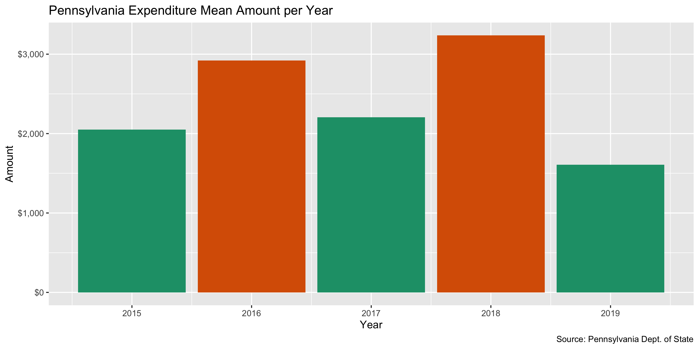
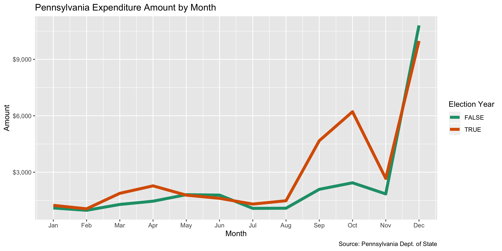
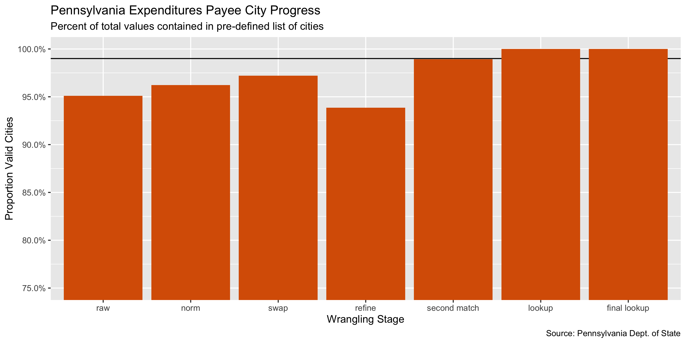

Pennsylvania Campaign Expenditures Data Diary
================
Yanqi Xu
2019-12-11 10:48:40

-   [Project](#project)
-   [Objectives](#objectives)
-   [Packages](#packages)
-   [Data](#data)
-   [Import](#import)
-   [Explore](#explore)
-   [Wrangle](#wrangle)
-   [Conclude](#conclude)
-   [Export](#export)

Project
-------

The Accountability Project is an effort to cut across data silos and give journalists, policy professionals, activists, and the public at large a simple way to search across huge volumes of public data about people and organizations.

Our goal is to standardizing public data on a few key fields by thinking of each dataset row as a transaction. For each transaction there should be (at least) 3 variables:

1.  All **parties** to a transaction
2.  The **date** of the transaction
3.  The **amount** of money involved

Objectives
----------

This document describes the process used to complete the following objectives:

1.  How many records are in the database?
2.  Check for duplicates
3.  Check ranges
4.  Is there anything blank or missing?
5.  Check for consistency issues
6.  Create a five-digit ZIP Code called `ZIP5`
7.  Create a `YEAR` field from the transaction date
8.  Make sure there is data on both parties to a transaction

Packages
--------

The following packages are needed to collect, manipulate, visualize, analyze, and communicate these results. The `pacman` package will facilitate their installation and attachment.

``` r
if (!require("pacman")) install.packages("pacman")
pacman::p_load_gh("irworkshop/campfin")
pacman::p_load(
  stringdist, # levenshtein value
  tidyverse, # data manipulation
  readxl, # read excel files
  lubridate, # datetime strings
  tidytext, # string analysis
  magrittr, # pipe opperators
  janitor, # dataframe clean
  refinr, # cluster and merge
  knitr, # knit documents
  glue, # combine strings
  scales, #format strings
  here, # relative storage
  fs, # search storage 
  vroom #read deliminated files
)
```

This document should be run as part of the `R_campfin` project, which lives as a sub-directory of the more general, language-agnostic [`irworkshop/accountability_datacleaning`](https://github.com/irworkshop/accountability_datacleaning "TAP repo") GitHub repository.

The `R_campfin` project uses the [RStudio projects](https://support.rstudio.com/hc/en-us/articles/200526207-Using-Projects "Rproj") feature and should be run as such. The project also uses the dynamic `here::here()` tool for file paths relative to *your* machine.

``` r
# where dfs this document knit?
here::here()
#> [1] "/Users/soc/accountability/accountability_datacleaning/R_campfin"
```

Data
----

### About

More information about the record layout can be found here <https://www.dos.pa.gov/VotingElections/CandidatesCommittees/CampaignFinance/Resources/Documents/readme.txt>.

Import
------

### Download

Download raw, **immutable** data file. Go to <https://www.dos.pa.gov/VotingElections/CandidatesCommittees/CampaignFinance/Resources/Pages/FullCampaignFinanceExport.aspx>. We'll download the files from 2015 to 2019 (file format: zip file) with the script.

``` r
# create a directory for the raw data
raw_dir <- here("pa", "expends", "data", "raw")
dir_create(raw_dir)
```

Download all the file packages containing all campaign-finance-related files.

``` r
#download the files into the directory
pa_exp_urls <- glue("https://www.dos.pa.gov//VotingElections/CandidatesCommittees/CampaignFinance/Resources/Documents/{2015:2019}.zip")

if (!all_files_new(raw_dir)) {
  for (url in pa_exp_urls) {
    download.file(
      url = url,
      destfile = glue("{raw_dir}/{basename(url)}")
    )
  }
}
```

### Read

Read individual csv files from the downloaded zip files

``` r
zip_files <- dir_ls(raw_dir, glob = "*.zip")

if (all_files_new(path = raw_dir, glob = "*.txt")) {
  for (i in seq_along(zip_files)) {
    unzip(
      zipfile = zip_files[i],
      #Matches the csv files that starts with expense, and trim the "./ " from directory names
      files = grep("expense.+", unzip(zip_files[i]), value = TRUE) %>% substring(3,),
      exdir = raw_dir
    )
  }
}
```

Read multiple csvs into R

``` r
#recursive set to true because 2016 and 2015 have subdirectories under "raw"
expense_files <- list.files(raw_dir, pattern = "expense.+", recursive = TRUE, full.names = TRUE)
#pa_lines <- list.files(raw_dir, pattern = ".txt", recursive = TRUE) %>% map(read_lines) %>% unlist()
pa_col_names <- c("FILERID","EYEAR","CYCLE","EXPNAME","ADDRESS1","ADDRESS2","CITY","STATE","ZIPCODE","EXPDATE","EXPAMT","EXPDESC")

pa <- expense_files %>% 
  map(read_delim, delim = ",", escape_double = FALSE,
      escape_backslash = FALSE, col_names = pa_col_names, 
      col_types = cols(.default = col_character())) %>% 
bind_rows()
```

There are 4 parsing failures. We'll move along the information in rows that were read incorrectly due to double quotes in the address column.

``` r
nudge <- which(nchar(pa$STATE) > 2)
# However, the information in the last column EXPDESC for these columns has been lost at the time of data import.
for (index in nudge) {
  for (column in c(7:11)){
    pa[[index, column]] <- pa[[index, column+1]]
  }
}
```

The text fields contain both lower-case and upper-case letters. The for loop converts them to all upper-case letters unifies the encoding to "UTF-8", replaces the "&", the HTML expression of "An ampersand". These strings are invalid and cannot be converted Converting the encoding may result in some NA values

``` r
col_stats(pa, count_na)
```

    #> # A tibble: 12 x 4
    #>    col      class      n        p
    #>    <chr>    <chr>  <int>    <dbl>
    #>  1 FILERID  <chr>      0 0       
    #>  2 EYEAR    <chr>      0 0       
    #>  3 CYCLE    <chr>      0 0       
    #>  4 EXPNAME  <chr>    112 0.000227
    #>  5 ADDRESS1 <chr>  14553 0.0295  
    #>  6 ADDRESS2 <chr> 457826 0.929   
    #>  7 CITY     <chr>  11556 0.0234  
    #>  8 STATE    <chr>  11015 0.0223  
    #>  9 ZIPCODE  <chr>  15654 0.0318  
    #> 10 EXPDATE  <chr>   1450 0.00294 
    #> 11 EXPAMT   <chr>      0 0       
    #> 12 EXPDESC  <chr>   9492 0.0193

``` r
pa <- pa %>% mutate_all(.funs = iconv, to = "UTF-8") %>% 
  mutate_all(.funs = str_replace,"&AMP;", "&") %>% 
  mutate_if(is.character, str_to_upper)
# After the encoding, we'll see how many entries have NA fields for each column.
col_stats(pa, count_na)
```

    #> # A tibble: 12 x 4
    #>    col      class      n        p
    #>    <chr>    <chr>  <int>    <dbl>
    #>  1 FILERID  <chr>      0 0       
    #>  2 EYEAR    <chr>      0 0       
    #>  3 CYCLE    <chr>      0 0       
    #>  4 EXPNAME  <chr>    124 0.000252
    #>  5 ADDRESS1 <chr>  14563 0.0295  
    #>  6 ADDRESS2 <chr> 457826 0.929   
    #>  7 CITY     <chr>  11556 0.0234  
    #>  8 STATE    <chr>  11015 0.0223  
    #>  9 ZIPCODE  <chr>  15654 0.0318  
    #> 10 EXPDATE  <chr>   1450 0.00294 
    #> 11 EXPAMT   <chr>      0 0       
    #> 12 EXPDESC  <chr>   9495 0.0193

``` r
#All the fields are converted to strings. Convert to date and double.
pa$EXPDATE <- as.Date(pa$EXPDATE, "%Y%m%d")
pa$EXPAMT <- as.double(pa$EXPAMT)
pa$ADDRESS1 <- normal_address(pa$ADDRESS1)
pa$ADDRESS2 <- normal_address(pa$ADDRESS2)
```

Explore
-------

There are `nrow(pa)` records of `length(pa)` variables in the full database.

``` r
head(pa)
```

    #> # A tibble: 6 x 12
    #>   FILERID  EYEAR CYCLE EXPNAME    ADDRESS1   ADDRESS2 CITY  STATE ZIPCODE EXPDATE    EXPAMT EXPDESC
    #>   <chr>    <chr> <chr> <chr>      <chr>      <chr>    <chr> <chr> <chr>   <date>      <dbl> <chr>  
    #> 1 20140199 2015  2     VALLEY DE… 1321 FREE… <NA>     CHES… PA    15024   2015-02-16  250   DONATI…
    #> 2 20140199 2015  2     OFFICE MAX 4080 WILA… <NA>     MONR… PA    15146   2015-02-18   16.6 OFFICE…
    #> 3 20140199 2015  2     GATEWAY C… PARKING    <NA>     PITT… PA    15222   2015-02-18   20   PARKING
    #> 4 20140199 2015  2     USPS       KILBUCK    <NA>     PITT… PA    15290   2015-02-18  980   POSTAGE
    #> 5 20140199 2015  2     EDDIE MER… GATEWAY C… <NA>     PITT… PA    15222   2015-02-18  102.  CAMPAI…
    #> 6 20140199 2015  2     CASTLE SH… C O EILEE… <NA>     PITT… PA    15234   2015-02-23  100   DONATI…

``` r
tail(pa)
```

    #> # A tibble: 6 x 12
    #>   FILERID  EYEAR CYCLE EXPNAME  ADDRESS1  ADDRESS2 CITY  STATE ZIPCODE EXPDATE    EXPAMT EXPDESC   
    #>   <chr>    <chr> <chr> <chr>    <chr>     <chr>    <chr> <chr> <chr>   <date>      <dbl> <chr>     
    #> 1 2019C02… 2019  2     VISTA P… 95 HAYDE… <NA>     LEXI… MA    02421   2019-03-17   36.0 PRINTING …
    #> 2 2019C02… 2019  2     VISTA P… 95 HAYDE… <NA>     LEXI… MA    02421   2019-03-28   36.3 PRINTED C…
    #> 3 20190018 2019  1     VISTA P… 95 HAYDE… <NA>     LEXI… MA    02421   2019-01-29  121.  CAMPAIGN …
    #> 4 2019C02… 2019  2     VISTA P… ONLINE    <NA>     <NA>  <NA>  <NA>    2019-04-30  604.  5.5 X 8.5…
    #> 5 2019C02… 2019  2     VISTA P… ONLINE    <NA>     <NA>  <NA>  <NA>    2019-05-01  165.  4X6 POSTC…
    #> 6 20170137 2019  2     VISTA P… ONLINE    <NA>     <NA>  <NA>  <NA>    2019-05-01  165.  4X6 POSTC…

``` r
glimpse(pa)
```

    #> Observations: 493,025
    #> Variables: 12
    #> $ FILERID  <chr> "20140199", "20140199", "20140199", "20140199", "20140199", "20140199", "201401…
    #> $ EYEAR    <chr> "2015", "2015", "2015", "2015", "2015", "2015", "2015", "2015", "2015", "2015",…
    #> $ CYCLE    <chr> "2", "2", "2", "2", "2", "2", "2", "2", "2", "2", "2", "2", "2", "2", "2", "2",…
    #> $ EXPNAME  <chr> "VALLEY DEMOCRATIC COMM", "OFFICE MAX", "GATEWAY CENTER", "USPS", "EDDIE MERIOT…
    #> $ ADDRESS1 <chr> "1321 FREEPORT RD", "4080 WILAM PENN HIGHWAY", "PARKING", "KILBUCK", "GATEWAY C…
    #> $ ADDRESS2 <chr> NA, NA, NA, NA, NA, NA, NA, NA, NA, NA, NA, NA, NA, NA, NA, NA, NA, NA, NA, NA,…
    #> $ CITY     <chr> "CHESWICK", "MONROEVILLE", "PITTSBURGH", "PITTSBURGH", "PITTSBURGH", "PITTSBURG…
    #> $ STATE    <chr> "PA", "PA", "PA", "PA", "PA", "PA", "PA", "PA", "PA", "PA", "PA", "PA", "PA", "…
    #> $ ZIPCODE  <chr> "15024", "15146", "15222", "15290", "15222", "15234", "15219", "15209", "15045"…
    #> $ EXPDATE  <date> 2015-02-16, 2015-02-18, 2015-02-18, 2015-02-18, 2015-02-18, 2015-02-23, 2015-0…
    #> $ EXPAMT   <dbl> 250.00, 16.63, 20.00, 980.00, 101.53, 100.00, 1000.00, 100.00, 100.00, 68.00, 6…
    #> $ EXPDESC  <chr> "DONATION", "OFFICE SUPPLIES", "PARKING", "POSTAGE", "CAMPAIGN - MEAL", "DONATI…

### Distinct

The variables range in their degree of distinctness.

``` r
pa %>% col_stats(n_distinct)
```

    #> # A tibble: 12 x 4
    #>    col      class       n         p
    #>    <chr>    <chr>   <int>     <dbl>
    #>  1 FILERID  <chr>    4133 0.00838  
    #>  2 EYEAR    <chr>       7 0.0000142
    #>  3 CYCLE    <chr>       9 0.0000183
    #>  4 EXPNAME  <chr>  101504 0.206    
    #>  5 ADDRESS1 <chr>   94245 0.191    
    #>  6 ADDRESS2 <chr>    4403 0.00893  
    #>  7 CITY     <chr>    6218 0.0126   
    #>  8 STATE    <chr>      56 0.000114 
    #>  9 ZIPCODE  <chr>   20786 0.0422   
    #> 10 EXPDATE  <date>   1820 0.00369  
    #> 11 EXPAMT   <dbl>   66564 0.135    
    #> 12 EXPDESC  <chr>   79859 0.162

### Missing

The variables also vary in their degree of values that are `NA` (missing).

``` r
pa %>% col_stats(count_na)
```

    #> # A tibble: 12 x 4
    #>    col      class       n        p
    #>    <chr>    <chr>   <int>    <dbl>
    #>  1 FILERID  <chr>       0 0       
    #>  2 EYEAR    <chr>       0 0       
    #>  3 CYCLE    <chr>       0 0       
    #>  4 EXPNAME  <chr>     124 0.000252
    #>  5 ADDRESS1 <chr>   14684 0.0298  
    #>  6 ADDRESS2 <chr>  457826 0.929   
    #>  7 CITY     <chr>   11556 0.0234  
    #>  8 STATE    <chr>   11015 0.0223  
    #>  9 ZIPCODE  <chr>   15654 0.0318  
    #> 10 EXPDATE  <date>   1450 0.00294 
    #> 11 EXPAMT   <dbl>       0 0       
    #> 12 EXPDESC  <chr>    9495 0.0193

We will flag any records with missing values in the key variables used to identify an expenditure. There are 0 elements that are flagged as missing at least one value.

``` r
pa <- pa %>% flag_na(EXPNAME, EXPDATE, EXPDESC, EXPAMT, CITY)
```

### Duplicates

``` r
pa <- flag_dupes(pa, dplyr::everything())
sum(pa$dupe_flag)
#> [1] 7000
```

### Ranges

#### Amounts

``` r
summary(pa$EXPAMT)
#>     Min.  1st Qu.   Median     Mean  3rd Qu.     Max. 
#>   -67500       60      250     2613      752 12147387
sum(pa$EXPAMT < 0 , na.rm = TRUE)
#> [1] 538
```

See how the campaign expenditures were distributed

``` r
pa %>% 
  ggplot(aes(x = EXPAMT)) + 
  geom_histogram() +
  scale_x_continuous(
    trans = "log10", labels = dollar)
```


Expenditures out of state

``` r
sum(pa$STATE != "PA", na.rm = TRUE)
```

    #> [1] 78926

Top spending purposes 

### Dates

Some of the dates are too far back and some are past the current dates.

``` r
summary(pa$EXPDATE)
```

    #>         Min.      1st Qu.       Median         Mean      3rd Qu.         Max.         NA's 
    #> "1825-04-20" "2016-03-01" "2017-04-08" "2017-04-02" "2018-05-15" "5018-09-15"       "1450"

### Year

Add a `year` variable from `date` after `col_date()` using `lubridate::year()`.

``` r
pa <- pa %>% mutate(year = year(EXPDATE), on_year = is_even(year))
```

Turn some year and date values to NAs.

``` r
pa <- pa %>% mutate(date_flag = year < 2000 | year > format(Sys.Date(), "%Y"), 
                    date_clean = ifelse(
                    date_flag, NA, EXPDATE),
                    year_clean = ifelse(
                    date_flag, NA, year))
```






``` r
pa %>% group_by(EXPDESC) %>% summarize(total = sum(EXPAMT)) %>% arrange(desc(total))
```

    #> # A tibble: 79,859 x 2
    #>    EXPDESC                                       total
    #>    <chr>                                         <dbl>
    #>  1 <NA>                                     266672875.
    #>  2 CONTRIBUTION                             185395743.
    #>  3 NON PA DISBURSEMENTS                      95018717.
    #>  4 DONATION                                  26623333.
    #>  5 MEDIA BUY                                 26199723.
    #>  6 NON-PENNSYLVANIA EXPENDITURES             21187323.
    #>  7 POLITICAL CONTRIBUTION                    15977415.
    #>  8 BALANCE OF DISBURSEMENTS FROM FEC REPORT  15574849.
    #>  9 AD BUY                                    15494933.
    #> 10 CAMPAIGN CONTRIBUTION                     14995155.
    #> # … with 79,849 more rows

Wrangle
-------

The state column is now pretty clean, as all non-NA columns have two characters.

### Indexing

``` r
pa <- tibble::rowid_to_column(pa, "index")
```

### Zipcode

The Zipcode column can range from 1 to 13 columns.

``` r
table(nchar(pa$ZIPCODE))
#> 
#>      1      2      3      4      5      6      7      8      9     10     13 
#>     11     33    114    309 389524    783     26    118  84633   1818      2
```

``` r
pa <- pa %>% 
  mutate(
    zip_clean = ZIPCODE %>% 
      normal_zip(na_rep = TRUE))
sample(pa$zip_clean, 10)
#>  [1] "19114" "19147" "18923" "17101" "40285" "17110" "19149" "84130" "19128" "18091"
```

### State

View values in the STATE field is not a valid state abbreviation

    #> [1] "CN" "CN" "CN" "CN"
    #> # A tibble: 4 x 21
    #>    index FILERID EYEAR CYCLE EXPNAME ADDRESS1 ADDRESS2 CITY  STATE ZIPCODE EXPDATE    EXPAMT
    #>    <int> <chr>   <chr> <chr> <chr>   <chr>    <chr>    <chr> <chr> <chr>   <date>      <dbl>
    #> 1   3445 7900257 2015  1     CSA BA… 1500 NO… <NA>     QUEB… CN    J4B 5H3 2015-03-18   5.11
    #> 2   3446 7900257 2015  1     CSA BA… 1500 NO… <NA>     QUEB… CN    J4B 5H3 2015-03-18 511.  
    #> 3 296601 201700… 2017  6     ISTOCK  1240 20… <NA>     CALG… CN    00000   2017-10-27  35.0 
    #> 4 400304 2009450 2018  6     HOOTSU… 5 EAST … <NA>     VANC… CN    V5T 1R6 2018-10-31  47.7 
    #> # … with 9 more variables: EXPDESC <chr>, na_flag <lgl>, dupe_flag <lgl>, year <dbl>,
    #> #   on_year <lgl>, date_flag <lgl>, date_clean <dbl>, year_clean <dbl>, zip_clean <chr>

These are expenditures in Canada, which we can leave in. \#\#\# City

Cleaning city values is the most complicated. This process involves four steps:

1.  Prepare raw city values by removing invalid data and reducing inconsistencies
2.  Match prepared city values with the *actual* city name of that record's ZIP code
3.  swap prepared city values with the ZIP code match *if* only 1 edit is needed
4.  Refine swapped city values with key collision and n-gram fingerprints

#### Prep

481469 distinct cities were in the original dataset in column

``` r
pa <- pa %>% mutate(city_prep = normal_city(city = CITY,
                                            abbs = usps_city,
                                            states = c(valid_state),
                                            na = invalid_city,
                                            na_rep = TRUE))
n_distinct(pa$city_prep)
#> [1] 5747
```

#### Match

``` r
pa <- pa %>%
  left_join(
    y = zipcodes,
    by = c(
      "zip_clean" = "zip",
      "STATE" = "state"
    )
  ) %>% 
  rename(city_match = city)
```

#### Swap

To replace city names with expected city names from zipcode when the two variables are no more than two characters different

``` r
pa <- pa %>% 
  mutate(
    match_dist = stringdist(city_prep, city_match),
    city_swap = if_else(condition = is.na(city_match) == FALSE,
                        if_else(
      condition = match_dist <= 2,
      true = city_match,
      false = city_prep
    ),
      false = city_prep
  ))


summary(pa$match_dist)
```

    #>    Min. 1st Qu.  Median    Mean 3rd Qu.    Max.    NA's 
    #>    0.00    0.00    0.00    0.61    0.00   22.00   20616

``` r
sum(pa$match_dist == 1, na.rm = TRUE)
```

    #> [1] 5424

``` r
n_distinct(pa$city_swap)
```

    #> [1] 4339

#### Refine

``` r
valid_city <- campfin::valid_city
```

Use the OpenRefine algorithms to cluster similar values and merge them together. This can be done using the refinr::key\_collision\_merge() and refinr::n\_gram\_merge() functions on our prepared and swapped city data.

``` r
pa_refined <- pa %>%
  filter(match_dist != 1) %>% 
  filter(STATE =="PA") %>% 
  mutate(
    city_refine = city_swap %>% 
      key_collision_merge(dict = valid_city) %>% 
      n_gram_merge(numgram = 2),
    refined = (city_swap != city_refine)
  ) %>% 
  filter(refined) %>% 
  select(
    index,
    FILERID, 
    CITY,
    city_prep,
    city_match,
    city_swap,
    match_dist,
    city_refine,
    STATE, 
    ZIPCODE,
    zip_clean
  )

pa_refined %>% 
  count(city_swap, city_refine) %>% 
  arrange(desc(n))
```

    #> # A tibble: 70 x 3
    #>    city_swap        city_refine        n
    #>    <chr>            <chr>          <int>
    #>  1 SINKING SPRINGS  SINKING SPRING    23
    #>  2 SOUTHERN EASTERN SOUTHEASTERN      18
    #>  3 MC MURRAY        MCMURRAY          15
    #>  4 MC BG            MCCBG             13
    #>  5 PLEASANT MOUNT   MOUNT PLEASANT    11
    #>  6 CLIFFORD         FORD CLIFF         8
    #>  7 WESCOESVILLE     WESCOSVILLE        8
    #>  8 EDDYSTON         EDDYSTONE          7
    #>  9 BROMALL          BROOMALL           4
    #> 10 CARSLISLE        CARLISLE           4
    #> # … with 60 more rows

``` r
refined_values <- unique(pa_refined$city_refine)
count_refined <- tibble(
  city_refine = refined_values, 
  refine_count = NA
)

for (i in seq_along(refined_values)) {
  count_refined$refine_count[i] <- sum(str_detect(pa$city_swap, refined_values[i]), na.rm = TRUE)
}

swap_values <- unique(pa_refined$city_swap)
count_swap <- tibble(
  city_swap = swap_values, 
  swap_count = NA
)

for (i in seq_along(swap_values)) {
  count_swap$swap_count[i] <- sum(str_detect(pa$city_swap, swap_values[i]), na.rm = TRUE)
}

pa_refined %>% 
  left_join(count_swap) %>% 
  left_join(count_refined) %>%
  select(
    FILERID,
    city_match,
    city_swap,
    city_refine,
    swap_count,
    refine_count
  ) %>% 
  mutate(diff_count = refine_count - swap_count) %>%
  mutate(refine_dist = stringdist(city_swap, city_refine)) %>%
  distinct() %>%
  arrange(city_refine) %>% 
  print_all()
```

    #> # A tibble: 111 x 8
    #>     FILERID  city_match   city_swap    city_refine   swap_count refine_count diff_count refine_dist
    #>     <chr>    <chr>        <chr>        <chr>              <int>        <int>      <int>       <dbl>
    #>   1 2002093  PITTSBURGH   ADDRESSON F… ADDRESS ON F…          1           26         25           1
    #>   2 9500250  BRIDGEVILLE  ALISON PARK  ALLISON PARK           1          321        320           1
    #>   3 7900321  PITTSTON     AVOCO        AVOCA                  1          501        500           1
    #>   4 20170352 WILKES BARRE BEARCREEK    BEAR CREEK             1           10          9           1
    #>   5 8100217  MARCUS HOOK  BOOTHWYNN    BOOTHWYN               1          184        183           1
    #>   6 2017C01… HARRISBURG   BRESLER      BRESSLER               1           63         62           1
    #>   7 20130207 NEWTOWN SQU… BROMALL      BROOMALL               4          407        403           1
    #>   8 20150282 NEWTOWN SQU… BROMALL      BROOMALL               4          407        403           1
    #>   9 20170314 SOUTH LONDO… CARSLISLE    CARLISLE               4          689        685           1
    #>  10 20150001 WAYNE        CHESTER BRO… CHESTERBROOK           1          104        103           1
    #>  11 8900208  BROCKWAY     DUBOIS       DU BOIS                7          430        423           1
    #>  12 20170387 SCRANTON     DUNMMORE     DUNMORE                1          454        453           1
    #>  13 9100189  NORRISTOWN   EAST NORRIT… EAST NORRIST…          1            2          1           1
    #>  14 7900243  CRUM LYNNE   EDDYSTON     EDDYSTONE             38           31         -7           1
    #>  15 2010095  LEVITTOWN    FALSINGTON   FALLSINGTON            1           57         56           1
    #>  16 20180378 LEVITTOWN    FALSSINGTON  FALLSINGTON            1           57         56           1
    #>  17 2015C00… CLIFFORD     CLIFFORD     FORD CLIFF             8           17          9           8
    #>  18 2002199  CLIFFORD     CLIFFORD     FORD CLIFF             8           17          9           8
    #>  19 8400100  CLIFFORD     CLIFFORD     FORD CLIFF             8           17          9           8
    #>  20 8400100  MOSCOW       CLIFFORD     FORD CLIFF             8           17          9           8
    #>  21 8400100  CARBONDALE   CLIFFORD     FORD CLIFF             8           17          9           8
    #>  22 8100217  KINGSTON     FORTY FORTY  FORTY FORT             1           30         29           1
    #>  23 8100217  GLEN LYON    GLEN OLDEN   GLENOLDEN              1          334        333           1
    #>  24 9600227  CARBONDALE   GREENFIELD … GREENFIELD T…          1           31         30           1
    #>  25 9500133  SOUTHAMPTON  HOLAND       HOLLAND                1          343        342           1
    #>  26 7900134  DUNCANSVILLE HOLIDAYSBURG HOLLIDAYSBURG          5          599        594           1
    #>  27 2002171  NORRISTOWN   JEFFERSONVI… JEFFERSONVIL…          2          310        308           1
    #>  28 2006168  NORRISTOWN   JEFFERSONVI… JEFFERSONVIL…          2          310        308           1
    #>  29 7900259  LANCASTER    LANCASTERTER LANCASTER              1         5607       5606           3
    #>  30 2006030  HAWLEY       LORDS VALEY  LORDS VALLEY           1           30         29           1
    #>  31 2002072  NEW KENSING… LOWER BURER… LOWER BURRELL          1           74         73           1
    #>  32 9600321  AMBLER       LOWER GWYNE… LOWER GWYNEDD          3          109        106           1
    #>  33 9800210  PITTSBURGH   MC CANDLESS  MCCANDLESS             1            8          7           1
    #>  34 8200038  MCCONNELLSB… MC CBG       MCCBG                  2           18         16           1
    #>  35 7900343  MCCONNELLSB… MC BG        MCCBG                 13           18          5           1
    #>  36 7900343  FORT LITTLE… MC BG        MCCBG                 13           18          5           1
    #>  37 7900343  MARION       MC BG        MCCBG                 13           18          5           1
    #>  38 7900343  NEEDMORE     MC CONNELLS… MCCONNELLSBU…          3          209        206           1
    #>  39 7900343  MARION       MC CONNELLS… MCCONNELLSBU…          3          209        206           1
    #>  40 7900343  SALTILLO     MC CONNELLS… MCCONNELLSBU…          3          209        206           1
    #>  41 2017C03… CANONSBURG   MC MURRAY    MCMURRAY              15          586        571           1
    #>  42 20180183 CANONSBURG   MC MURRAY    MCMURRAY              15          586        571           1
    #>  43 8000629  CANONSBURG   MC MURRAY    MCMURRAY              15          586        571           1
    #>  44 7900298  CANONSBURG   MC MURRAY    MCMURRAY              15          586        571           1
    #>  45 20170137 CANONSBURG   MC MURRAY    MCMURRAY              15          586        571           1
    #>  46 20120168 ELKINS PARK  MELROSE PAA… MELROSE PARK           1           25         24           1
    #>  47 8200637  ORVISTON     MILHEIM      MILLHEIM               1          135        134           1
    #>  48 8000474  FOLSOM       MILMONT      MILLMONT              76            9        -67           1
    #>  49 8100217  FOLSOM       MILMONT      MILLMONT              76            9        -67           1
    #>  50 2016C03… PITTSBURGH   MOUNT LEBAN… MOUNT LEBANON          1           64         63           1
    #>  51 2005279  PLEASANT MO… PLEASANT MO… MOUNT PLEASA…         11          489        478          12
    #>  52 8000616  PLEASANT MO… PLEASANT MO… MOUNT PLEASA…         11          489        478          12
    #>  53 20170074 PLEASANT MO… PLEASANT MO… MOUNT PLEASA…         11          489        478          12
    #>  54 2010296  PLEASANT MO… PLEASANT MO… MOUNT PLEASA…         11          489        478          12
    #>  55 9200410  MOUNT PLEAS… MOUNT PLEAS… MOUNT PLEASA…          1          489        488           3
    #>  56 8800087  WILKES BARRE MOUNTAINTOP  MOUNTAIN TOP           2          138        136           1
    #>  57 2010090  WILKES BARRE MOUNTAINTOP  MOUNTAIN TOP           2          138        136           1
    #>  58 20160056 ONO          ONO          NON                  606         3250       2644           2
    #>  59 2018C07… LOYSVILLE    ON           NON                55673         3250     -52423           1
    #>  60 20130205 IRWIN        NORTH UNTIN… NORTH HUNTIN…          1          129        128           1
    #>  61 2010095  LANGHORNE    PENDEL       PENNDEL                2           85         83           1
    #>  62 9500165  PHILADELPHIA PHIILA       PHILA                  1        83313      83312           1
    #>  63 2010025  PHILADELPHIA PHILLA       PHILA                  1        83313      83312           1
    #>  64 20180008 PHILADELPHIA PHILADEL     PHILADE            73984        73986          2           1
    #>  65 7900117  PITTSBURGH   PITT         PIT                33711        33761         50           1
    #>  66 2010389  PITTSBURGH   PLUMBORO     PLUM BORO              1            3          2           1
    #>  67 8100217  POTTSVILLE   POTTSGROVE   POTTS GROVE            1            2          1           1
    #>  68 2011150  NEW PROVIDE… QUARYVILLE   QUARRYVILLE            1          383        382           1
    #>  69 9400092  BANGOR       ROSETTO      ROSETO                 2           21         19           1
    #>  70 20120110 BELLE VERNON ROS TRAVER … ROSTRAVER TO…          1           45         44           1
    #>  71 7900366  BELLE VERNON ROOSTRAVER … ROSTRAVER TO…          1           45         44           1
    #>  72 2010427  RECTOR       RUFFSDALE    RUFFS DALE             1           23         22           1
    #>  73 8800271  READING      SINKING SPR… SINKING SPRI…         24          199        175           1
    #>  74 2007012  READING      SINKING SPR… SINKING SPRI…         24          199        175           1
    #>  75 2004017  READING      SINKING SPR… SINKING SPRI…         24          199        175           1
    #>  76 9700250  READING      SINKING SPR… SINKING SPRI…         24          199        175           1
    #>  77 9700144  READING      SINKING SPR… SINKING SPRI…         24          199        175           1
    #>  78 20120083 READING      SINKING SPR… SINKING SPRI…         24          199        175           1
    #>  79 7900443  READING      SINKING SPR… SINKING SPRI…         24          199        175           1
    #>  80 7900364  READING      SINKING SPR… SINKING SPRI…         24          199        175           1
    #>  81 7900302  READING      SINKING SPR… SINKING SPRI…         24          199        175           1
    #>  82 9200410  READING      SINKING SPR… SINKING SPRI…         24          199        175           1
    #>  83 8400128  READING      SINKING SPR… SINKING SPRI…         24          199        175           1
    #>  84 7900202  READING      SINKING SPR… SINKING SPRI…         24          199        175           1
    #>  85 9700178  READING      SINKING SPR… SINKING SPRI…         24          199        175           1
    #>  86 2000081  READING      SINKING SPR… SINKING SPRI…         24          199        175           1
    #>  87 2002336  READING      SINKING SPR… SINKING SPRI…         24          199        175           1
    #>  88 8600110  READING      SINKING SPR… SINKING SPRI…         24          199        175           1
    #>  89 7900491  SOUTHEASTERN SOUTHERN EA… SOUTHEASTERN          18         1599       1581           4
    #>  90 8300005  CHATHAM      SOUTH EASTE… SOUTHEASTERN           4         1599       1595           1
    #>  91 8300005  WESTTOWN     SOUTH EASTE… SOUTHEASTERN           4         1599       1595           1
    #>  92 7900434  MOSCOW       SPRINGBROOK… SPRING BROOK…          1            4          3           1
    #>  93 8000444  PHILADELPHIA SPRINGHOUSE  SPRING HOUSE           3          282        279           1
    #>  94 2010310  AMBLER       SPRINGHOUSE  SPRING HOUSE           3          282        279           1
    #>  95 20170091 SPRING HOUSE SPRINGMILL   SPRING MILLS           2           45         43           2
    #>  96 9700178  HARRISBURG   STEELLTON    STEELTON               2          660        658           1
    #>  97 9500250  HARRISBURG   STEELLTON    STEELTON               2          660        658           1
    #>  98 2000213  PITTSBURGH   SWISVALE     SWISSVALE              1           58         57           1
    #>  99 2004037  RUSSELL      TITTUSVILLE  TITUSVILLE             1           31         30           1
    #> 100 9500237  MARCUS HOOK  UPPER HICHE… UPPER CHICHE…          1          263        262           1
    #> 101 8100217  SPRINGFIELD  UPPERCHICHE… UPPER CHICHE…          1          263        262           1
    #> 102 7900444  ASTON        UPPER CHICH… UPPER CHICHE…        264          263         -1           1
    #> 103 9500250  PITTSBURGH   UPER SAINT … UPPER SAINT …          1          196        195           1
    #> 104 7900443  PITTSBURGH   UPPER SAINT… UPPER SAINT …          1          196        195           1
    #> 105 8300167  ALLENTOWN    WESCOESVILLE WESCOSVILLE            8           45         37           1
    #> 106 7900433  GREEN LANE   WESCOESVILLE WESCOSVILLE            8           45         37           1
    #> 107 20120381 ALLENTOWN    WESCOESVILLE WESCOSVILLE            8           45         37           1
    #> 108 7900433  CATASAUQUA   WESCOESVILLE WESCOSVILLE            8           45         37           1
    #> 109 9400092  ALLENTOWN    WESCOESVILLE WESCOSVILLE            8           45         37           1
    #> 110 20120022 WYOMING      WEST WEST    WEST                   1         6390       6389           5
    #> 111 9700250  PITTSBURGH   WILKES TOWN… WILKENS TOWN…          1            1          0           1

Manually change the city\_refine fields due to overcorrection.

``` r
st_pattern <- str_c("\\s",unique(zipcodes$state), "$", collapse = "|")


pa_refined$city_refine <- pa_refined$city_refine %>% 
  str_replace("^DU BOIS$", "DUBOIS") %>% 
  str_replace("^PIT$", "PITTSBURGH") %>% 
  str_replace("^MCCBG$", "MCCONNELLSBURG") %>% 
  str_replace("^PLUM BORO$", "PLUM") %>% 
  str_replace("^GREENVILLE$", "EAST GREENVILLE") %>% 
  str_replace("^NON$", "ONO") %>% 
  str_replace("^FORD CLIFF$", "CLIFFORD") %>% 
  str_replace("^W\\sB$", "WILKES BARRE") 

  

refined_table <-pa_refined %>% 
  select(index, city_refine)
```

#### Merge

``` r
pa <- pa %>% 
  left_join(refined_table, by ="index") %>% 
  mutate(city = coalesce(city_refine, city_swap)) 

pa$city <- pa$city %>% 
  str_replace("^MT PLEASANT$", "MOUNT PLEASANT") %>% 
  str_replace("^ST\\s", "SAINT ") %>% 
  str_replace("^MT\\s", "MOUNT ") %>%  
  str_replace("^FT\\s", "FORT ") %>% 
  str_replace("^W\\sB$|WB", "WILKES BARRE") %>% 
  str_replace("\\sHTS$|\\sHGTS$", " HEIGHTS") %>% 
  str_replace("\\sSQ$", " SQUARE") %>% 
  str_replace("\\sSPGS$|\\sSPR$|\\sSPRG$", "  SPRINGS") %>% 
  str_replace("\\sJCT$", " JUNCTION") %>% 
  str_replace("^E\\s", "EAST ") %>% 
  str_replace("^N\\s", "NORTH ") %>% 
  str_replace("^W\\s", "WEST ") %>% 
  str_remove(valid_state) %>% 
  str_remove("^X+$")
```

``` r
pa_match_table <- pa %>% 
  filter(str_sub(pa$city, 1,1) == str_sub(pa$city_match, 1,1)) %>% 
  filter(city %out% valid_city)  %>% 
  mutate(string_dis = stringdist(city, city_match)) %>% 
  select (index, zip_clean, STATE, city, city_match, string_dis) %>% 
  distinct() %>% 
  add_count(city_match) %>% 
  rename("sec_city_match" = "city_match")

# Manually change overcorrected city names to original 
pa_match_table$sec_city_match <- pa_match_table$sec_city_match %>% 
  str_replace("^ARLINGTON$", "ALEXANDRIA") %>% 
  str_replace("^BROWNSVILLE$", "BENTLEYVILLE") %>% 
  str_replace("^FEASTERVILLE\\sTREVOSE", "FEASTERVILLE") %>% 
  str_replace("LEES SUMMIT", "LAKE LOTAWANA") %>% 
  str_replace("HAZLETON", "HAZLE TOWNSHIP") %>% 
  str_replace("DANIA", "DANIA BEACH") %>% 
  str_replace("CRANBERRY TWP", "CRANBERRY TOWNSHIP")

pa_match_table[pa_match_table$city == "HOLLIDASBURG", "city_match"] <- "HOLLIDAYSBURG"
pa_match_table[pa_match_table$city == "PENN HELLE", "city_match"] <- "PENN HILLS"
pa_match_table[pa_match_table$city == "PHUM", "city_match"] <- "PLUM"
pa_match_table[pa_match_table$city == "CLARKSGREEN", "city_match"] <- "CLARKS GREEN"
pa_match_table[pa_match_table$city == "SANFRANCISCO", "city_match"] <- "SAN FRANCISCO"
pa_match_table[pa_match_table$city == "RIEFFTON", "city_match"] <- "REIFFTON"
pa_match_table[pa_match_table$city == "SHOREVILLE", "city_match"] <- "SHOREVIEW"
pa_match_table[pa_match_table$city == "PITTSBURGH PLUM", "city_match"] <- "PLUM"
pa_match_table[pa_match_table$city == "MOUNTVIEW", "city_match"] <- "MOUNT VIEW"
pa_match_table[pa_match_table$city == "PLUM BORO", "city_match"] <- "PLUM"
pa_match_table[pa_match_table$city == "HAZELTON CITY", "city_match"] <- "HAZLE TOWNSHIP"
pa_match_table[pa_match_table$city == "BARNSVILLE", "city_match"] <- "BARNESVILLE"

keep_original <- c( "SHOREVIEW" ,
   "CUYAHOGA" ,
   "MEDFORD LAKES" ,
   "WEST GOSHEN" ,
   "CLEVELAND HEIGHTS" ,
   "LAHORNE" ,
   "ROCHESTER HILLS" ,
   "PENLLYN" ,
   "SOUTHERN" ,
   "WEST DEPTFORD" ,
   "SEVEN FIELDS" ,
   "LORDS VALLEY" ,
   "WILDWOOD CREST" ,
   "BETHLEHEM TOWNSHIP" ,
   "MOON TOWNSHIP" ,
   "BELFONTE" ,
   "NEWPORT TOWNSHIP" , 
   "LINTHICUM" , 
   "WARRIOR RUN" ,
   "PRIMOS SECANE" ,
   "COOKPORT" , 
   "MANASSAS PARK" ,
   "MCMURRAY" ,
   "MOYLAN" ,
   "BELMONT HILLS" ,
   "THORNBURY" ,
   "HANOVER TOWNSHIP" ,
   "MIAMI SPRINGS" ,
   "BROOKLYN PARK" )

pa_match_table[pa_match_table$city %in% keep_original,"sec_city_match"] <-
  pa_match_table[pa_match_table$city %in% keep_original,"city"]


pa <-pa %>% 
  left_join(select(pa_match_table, index, sec_city_match), by = "index") %>% mutate(city_clean = coalesce(sec_city_match, city))

pa$city_clean <- pa$city_clean %>% str_replace("\\sTWP$", " TOWNSHIP")

n_distinct(pa$city_clean[pa$city_clean %out% valid_city])
```

    #> [1] 1502

``` r
valid_city <- unique(c(valid_city, extra_city))

pa_city_lookup <- read_csv(file = here("pa", "expends", "data", "raw", "pa_city_lookup.csv"), col_names = c("city", "city_lookup", "changed", "count"), skip = 1)

pa_out <- pa %>% 
  count( city_clean, sort = TRUE) %>% 
  filter(city_clean %out% valid_city) 

pa_out <- pa_out %>% left_join(pa_city_lookup, by = c("city_clean" = "city")) %>% filter(city_clean != city_lookup | is.na(city_lookup)) %>% drop_na(city_clean)

pa <- pa %>% left_join(pa_out, by = "city_clean") %>% mutate(city_after_lookup = ifelse(
  is.na(city_lookup) & city_clean %out% valid_city,
  NA,
  coalesce(city_lookup, city_clean))) 

pa$city_after_lookup <- pa$city_after_lookup %>% str_replace("^\\sTWP$", " TOWNSHIP")

pa[pa$index == which(pa$city_after_lookup == "MA"),8:9] <- c("LEXINGTON", "MA")
pa[pa$index == which(pa$city_after_lookup == "L"),8] <- c("LOS ANGELES")
pa[pa$index %in% which(pa$city_after_lookup %in% c("PA", "NJ")), 8] <- ""
pa[pa$index == "319505", 8] <- "HARRISBURG"

#pa_final_lookup <- read_excel(glue("{raw_dir}/pa_final_fixes.xlsx"))
pa_final_lookup <- read_excel(glue("{raw_dir}/pa_final_fixes.xlsx"), col_types = "text")


pa <- pa %>% left_join(pa_final_lookup, by = c("city_after_lookup" = "city_clean")) %>% 
mutate(city_output = if_else(condition = is.na(fix) & city_after_lookup %out% valid_city, NA_character_,
                               coalesce(fix,city_after_lookup)))
```

Each process also increases the percent of valid city names.

``` r
prop_in(pa$CITY, valid_city, na.rm = TRUE)
#> [1] 0.9510332
prop_in(pa$city_prep, valid_city, na.rm = TRUE)
#> [1] 0.9621608
prop_in(pa$city_swap, valid_city, na.rm = TRUE)
#> [1] 0.9720373
prop_in(pa$city, valid_city, na.rm = TRUE)
#> [1] 0.9386369
prop_in(pa$city_clean, valid_city, na.rm = TRUE)
#> [1] 0.9892286
prop_in(pa$city_after_lookup, valid_city, na.rm = TRUE)
#> [1] 0.9999454
prop_in(pa$city_output, valid_city, na.rm = TRUE)
#> [1] 0.9999727

progress_table <- tibble(
  stage = c("raw", "norm", "swap", "refine","second match", "lookup", "final lookup"),
  prop_good = c(
    prop_in(str_to_upper(pa$CITY), valid_city, na.rm = TRUE),
    prop_in(pa$city_prep, valid_city, na.rm = TRUE),
    prop_in(pa$city_swap, valid_city, na.rm = TRUE),
    prop_in(pa$city, valid_city, na.rm = TRUE),
    prop_in(pa$city_clean, valid_city, na.rm = TRUE),
    prop_in(pa$city_after_lookup, valid_city, na.rm = TRUE),
    prop_in(pa$city_output, valid_city, na.rm = TRUE)
  ),
  total_distinct = c(
    n_distinct(str_to_upper(pa$CITY)),
    n_distinct(pa$city_prep),
    n_distinct(pa$city_swap),
    n_distinct(pa$city),
    n_distinct(pa$city_clean),
    n_distinct(pa$city_after_lookup),
    n_distinct(pa$city_output)
  ),
  unique_bad = c(
    length(setdiff(str_to_upper(pa$CITY), valid_city)),
    length(setdiff(pa$city_prep, valid_city)),
    length(setdiff(pa$city_swap, valid_city)),
    length(setdiff(pa$city, valid_city)),
    length(setdiff(pa$city_clean, valid_city)),
    length(setdiff(pa$city_after_lookup, valid_city)),
    length(setdiff(pa$city_output, valid_city))
  )
)

diff_change <- progress_table$unique_bad[1]-progress_table$unique_bad[4]
prop_change <- diff_change/progress_table$unique_bad[1]
```

Each step of the cleaning process reduces the number of distinct city values. There are 481469 with 6218 distinct values, after the swap and refine processes, there are 476488 entries with 3408 distinct values.

| Normalization Stage |  Percent Valid|  Total Distinct|  Unique Invalid|
|:--------------------|--------------:|---------------:|---------------:|
| raw                 |         0.9510|            6218|            2822|
| norm                |         0.9622|            5747|            2327|
| swap                |         0.9720|            4339|             938|
| refine              |         0.9386|            5912|            2520|
| second match        |         0.9892|            4646|            1236|
| lookup              |         0.9999|            3422|              11|
| final lookup        |         1.0000|            3408|               2|



``` r
pa <- pa %>%   
  unite(
    ADDRESS1, ADDRESS2,
    col = address_clean,
    sep = " ",
    remove = FALSE,
    na.rm = TRUE
  ) %>% 
  mutate(address_clean = normal_address(
      address = address_clean,
      abbs = usps_city,
      na_rep = TRUE
    ))
```

We also need to pull up the processed filer table to join back to the `FILERID`, `EYEAR` and `CYCLE` field.

``` r
clean_dir <- here("pa", "expends", "data", "processed")
pa_filer <- read_csv(glue("{clean_dir}/pa_filers_clean.csv"), 
                     col_types = cols(.default = col_character())) %>% 
  rename_at(vars(contains("clean")), list(~str_c("filer_",.)))

pa_filer <- pa_filer %>% flag_dupes(FILERID,EYEAR,CYCLE)

pa_filer <-  pa_filer %>% 
  filter(!dupe_flag) %>% 
  select(
    FILERID,
    EYEAR,
    CYCLE,
    FILERNAME,
    FILERTYPE,
    filer_state,
    ends_with("clean")
  )
```

``` r
pa <- pa %>% left_join(pa_filer, by = c("FILERID", "EYEAR", "CYCLE"))
```

Conclude
--------

1.  There are 493025 records in the database
2.  There are 7000 records with suspected duplicate filerID, recipient, date, *and* amount (flagged with `dupe_flag`)
3.  The ranges for dates and amounts are reasonable
4.  Consistency has been improved with `stringr` package and custom `normal_*()` functions.
5.  The five-digit `zip_clean` variable has been created with `zipcode::clean.zipcode()`
6.  The `year` variable has been created with `lubridate::year()`
7.  There are 11556 records with missing `city` values and 124 records with missing `payee` values (both flagged with the `na_flag`).

Export
------

``` r
clean_dir <- here("pa", "expends", "data", "processed")
dir_create(clean_dir)
pa %>% 
  select(
    -index,
    -city_prep,
    -on_year,
    -city_match,
    -match_dist,
    -city_swap,
    -city_refine,
    -city_clean,
    -city_lookup,
    -city_after_lookup,
    -sec_city_match,
    -n,
    -fix,
    -changed,
    -city,
    -count
  ) %>% 
    rename (zip5 = zip_clean,
          filer_zip5 = filer_zip_clean,
          city_clean = city_output) %>% 
  write_csv(
    path = glue("{clean_dir}/pa_expends_clean.csv"),
    na = ""
  )
```
