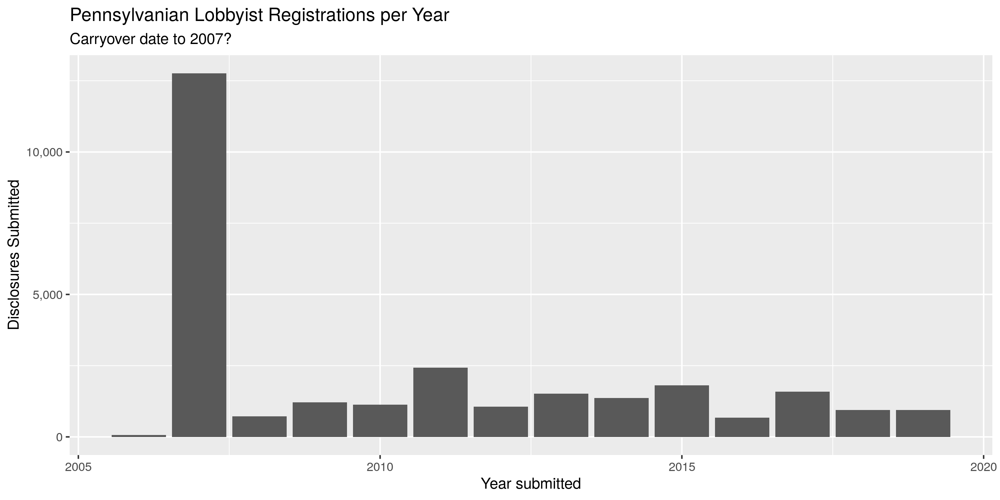

Pennsylvania Lobbyists
================
Kiernan Nicholls
2019-12-11 17:12:06

  - [Project](#project)
  - [Objectives](#objectives)
  - [Packages](#packages)
  - [Data](#data)
  - [Import](#import)
  - [Explore](#explore)
  - [Wrangle](#wrangle)

<!-- Place comments regarding knitting here -->

## Project

The Accountability Project is an effort to cut across data silos and
give journalists, policy professionals, activists, and the public at
large a simple way to search across huge volumes of public data about
people and organizations.

Our goal is to standardizing public data on a few key fields by thinking
of each dataset row as a transaction. For each transaction there should
be (at least) 3 variables:

1.  All **parties** to a transaction
2.  The **date** of the transaction
3.  The **amount** of money involved

## Objectives

This document describes the process used to complete the following
objectives:

1.  How many records are in the database?
2.  Check for duplicates
3.  Check ranges
4.  Is there anything blank or missing?
5.  Check for consistency issues
6.  Create a five-digit ZIP Code called `ZIP5`
7.  Create a `YEAR` field from the transaction date
8.  Make sure there is data on both parties to a transaction

## Packages

The following packages are needed to collect, manipulate, visualize,
analyze, and communicate these results. The `pacman` package will
facilitate their installation and attachment.

The IRW’s `campfin` package will also have to be installed from GitHub.
This package contains functions custom made to help facilitate the
processing of campaign finance data.

``` r
if (!require("pacman")) install.packages("pacman")
pacman::p_load_gh("irworkshop/campfin")
pacman::p_load(
  tidyverse, # data manipulation
  lubridate, # datetime strings
  magrittr, # pipe opperators
  janitor, # dataframe clean
  refinr, # cluster and merge
  scales, # format strings
  knitr, # knit documents
  vroom, # read files fast
  glue, # combine strings
  here, # relative storage
  fs # search storage 
)
```

This document should be run as part of the `R_campfin` project, which
lives as a sub-directory of the more general, language-agnostic
[`irworkshop/accountability_datacleaning`](https://github.com/irworkshop/accountability_datacleaning "TAP repo")
GitHub repository.

The `R_campfin` project uses the [RStudio
projects](https://support.rstudio.com/hc/en-us/articles/200526207-Using-Projects "Rproj")
feature and should be run as such. The project also uses the dynamic
`here::here()` tool for file paths relative to *your* machine.

``` r
# where does this document knit?
here::here()
#> [1] "/home/kiernan/R/accountability_datacleaning/R_campfin"
```

## Data

Data is obtained from the [Pennsylvania Department of
State](https://www.dos.pa.gov). From their [search
page](https://www.palobbyingservices.pa.gov/Public/wfSearch.aspx), we
can “Export All” from the advance search.

This provides an `Export.zip` archive file.

``` r
raw_dir <- here("pa", "lobby", "data", "raw")
dir_create(raw_dir)
raw_zip <- dir_ls(raw_dir, glob = "*.zip")
```

This file contains a single CSV.

``` r
unzip(raw_zip, list = TRUE)
#> # A tibble: 1 x 3
#>   Name                                                                Length Date               
#>   <chr>                                                                <dbl> <dttm>             
#> 1 RegistrationExportPublic_A70018B6-C2BA-47BF-966E-99BD031B8C4A.csv 32782146 2019-12-10 11:22:00
```

## Import

We can directly pass this ZIP file to `readr::read_csv()`.

``` r
export <- raw_zip %>% 
  read_lines() %>% 
  str_replace("\"I\"", "'I'") %>% 
  read_delim(
    delim = ",",
    escape_backslash = FALSE,
    escape_double = FALSE,
    col_types = cols(
      .default = col_character(),
      IsRelatedToPrincipal = col_logical(),
      IsRelatedToFirm = col_logical(),
      IsRelatedToLobbyist = col_logical(),
      IsRelatedToPAC = col_logical(),
      IsOfficerCandidatePAC = col_logical(),
      IsLicensedAttorney = col_logical(),
      IsLicensedInPA = col_logical(),
      DuePayingMembers = col_integer(),
      CalendarYear = col_integer(),
      IsLobbyingFirm = col_logical(),
      IsLawFirm = col_logical(),
      IsOtherFirm = col_logical(),
      LastUpdatedDate = col_date_usa(),
      SubmittedDate = col_date_usa(),
      RenewalDate = col_date_usa(),
      LobbyingCommencedDate = col_date_usa(),
      ExpirationDate = col_date_usa(),
      TerminatedDate = col_date_usa(),
      AffiliatedStartDate = col_date_usa(),
      AffiliatedEndDate = col_date_usa(),
      IsNeverAffiliated = col_logical(),
      IsRepresentThirdParty = col_logical(),
      AffirmedDate = col_date_usa()
    )
  )
```

This data frame contains 63,800 rows, with a separate record for each
relationship between a lobbyist, lobbying firm, or principal client.
That means a single relationship between a lobbyist and a principal is
listed twice, once with the lobbyist as the registrant and again with
the principal. We will restructure and filter this data frame so that
only lobbyists are listed as registrants, with a separate record for
each of their principals.

``` r
palr <- filter(export, RegistrationType == "Lobbyist") %>% clean_names("snake")
```

We can also remove all the columns associated with the affirmation of
the registration. As per the \[disclosure instructions\]\[05\]:

> **Affirmations and Acknowledgments:** The registration must include a
> typed or printed name of an individual, which, subject to 18 Pa.C.S. §
> 4904 (unsworn falsifications to authorities), states that the
> information provided is true and correct to the best of the filer’s
> knowledge, information and belief. The registration statement also
> contains an acknowledgment that the registrant or their designee has
> received, read and understands the Act.

``` r
palr <- select(palr, -starts_with("affirm"), -is_represent_third_party)
```

To make this data set a little easier to understand, we will prefix each
registrant column, now filtered to include only lobbyists, with `lob_`.

``` r
names(palr)[1:15] <- names(palr)[1:15] %>% 
  str_remove("^registration_") %>% 
  str_c("lob", ., sep = "_")
```

Then, we can abbreviate the other columns… This just makes things easier
to type.

``` r
names(palr) <- names(palr) %>% 
  str_replace("(?<=(_|^))affili.*?(?=($|_))", "pri") %>% 
  str_replace("(?<=(_|^))lobby.*?(?=($|_))", "lob") %>% 
  str_replace("(?<=(_|^))num.*?(?=($|_))", "id") %>% 
  str_replace("(?<=(_|^))regist.*?(?=($|_))", "reg") %>% 
  str_replace("business", "biz") %>% 
  str_replace("candidate", "cand") %>% 
  str_replace("calendar", "cal") %>% 
  str_replace("description", "desc") %>% 
  str_replace("expiration", "expire") %>% 
  str_replace("principal", "pri") %>% 
  str_replace("terminated", "term") %>% 
  str_replace("related", "rel") %>% 
  str_replace("submitted", "sub") %>% 
  str_replace("postal_code", "zip") %>% 
  str_remove("_name$")
```

## Explore

``` r
head(palr)
#> # A tibble: 6 x 51
#>   lob_id lob   lob_type lob_status lob_period lob_acronym lob_phone lob_phone_ext lob_fax lob_email
#>   <chr>  <chr> <chr>    <chr>      <chr>      <chr>       <chr>     <chr>         <chr>   <chr>    
#> 1 L43311 A, P… Lobbyist Completed  2019-2020  <NA>        610-373-… <NA>          <NA>    pwitmer@…
#> 2 L43311 A, P… Lobbyist Completed  2019-2020  <NA>        610-373-… <NA>          <NA>    pwitmer@…
#> 3 L43311 A, P… Lobbyist Completed  2019-2020  <NA>        610-373-… <NA>          <NA>    pwitmer@…
#> 4 L43311 A, P… Lobbyist Completed  2019-2020  <NA>        610-373-… <NA>          <NA>    pwitmer@…
#> 5 L10698 Aaro… Lobbyist Terminated 2013-2014  <NA>        717-232-… <NA>          <NA>    saaron@n…
#> 6 L10698 Aaro… Lobbyist Terminated 2013-2014  <NA>        717-232-… <NA>          <NA>    saaron@n…
#> # … with 41 more variables: lob_line1 <chr>, lob_line2 <chr>, lob_city <chr>, lob_state <chr>,
#> #   lob_zip <chr>, is_rel_to_pri <lgl>, is_rel_to_firm <lgl>, is_rel_to_lob <lgl>,
#> #   is_rel_to_pac <lgl>, is_officer_cand_pac <lgl>, biz_type <chr>, biz_desc <chr>,
#> #   is_licensed_attorney <lgl>, is_licensed_in_pa <lgl>, is_association <chr>,
#> #   due_paying_members <int>, cal_year <int>, is_lob_firm <lgl>, is_law_firm <lgl>,
#> #   is_other_firm <lgl>, last_updated_date <date>, sub_date <date>, renewal_date <date>,
#> #   lob_commenced_date <date>, expire_date <date>, term_date <date>, pri_reg_type <chr>,
#> #   pri_reg_id <chr>, pri_reg <chr>, pri_acronym <chr>, pri_phone <chr>, pri_phone_extn <chr>,
#> #   pri_fax <chr>, is_never_pri <lgl>, pri_start_date <date>, pri_end_date <date>,
#> #   pri_line1 <chr>, pri_line2 <chr>, pri_city <chr>, pri_state <chr>, pri_zip <chr>
tail(palr)
#> # A tibble: 6 x 51
#>   lob_id lob   lob_type lob_status lob_period lob_acronym lob_phone lob_phone_ext lob_fax lob_email
#>   <chr>  <chr> <chr>    <chr>      <chr>      <chr>       <chr>     <chr>         <chr>   <chr>    
#> 1 L43593 Zwal… Lobbyist Completed  2019-2020  <NA>        717-236-… <NA>          <NA>    andrewz@…
#> 2 L43593 Zwal… Lobbyist Completed  2019-2020  <NA>        717-236-… <NA>          <NA>    andrewz@…
#> 3 L43593 Zwal… Lobbyist Completed  2019-2020  <NA>        717-236-… <NA>          <NA>    andrewz@…
#> 4 L43593 Zwal… Lobbyist Completed  2019-2020  <NA>        717-236-… <NA>          <NA>    andrewz@…
#> 5 L00943 ZYLS… Lobbyist Expired    2007-2008  <NA>        412-918-… <NA>          412-68… SZYLSTRA…
#> 6 L00943 ZYLS… Lobbyist Expired    2007-2008  <NA>        412-918-… <NA>          412-68… SZYLSTRA…
#> # … with 41 more variables: lob_line1 <chr>, lob_line2 <chr>, lob_city <chr>, lob_state <chr>,
#> #   lob_zip <chr>, is_rel_to_pri <lgl>, is_rel_to_firm <lgl>, is_rel_to_lob <lgl>,
#> #   is_rel_to_pac <lgl>, is_officer_cand_pac <lgl>, biz_type <chr>, biz_desc <chr>,
#> #   is_licensed_attorney <lgl>, is_licensed_in_pa <lgl>, is_association <chr>,
#> #   due_paying_members <int>, cal_year <int>, is_lob_firm <lgl>, is_law_firm <lgl>,
#> #   is_other_firm <lgl>, last_updated_date <date>, sub_date <date>, renewal_date <date>,
#> #   lob_commenced_date <date>, expire_date <date>, term_date <date>, pri_reg_type <chr>,
#> #   pri_reg_id <chr>, pri_reg <chr>, pri_acronym <chr>, pri_phone <chr>, pri_phone_extn <chr>,
#> #   pri_fax <chr>, is_never_pri <lgl>, pri_start_date <date>, pri_end_date <date>,
#> #   pri_line1 <chr>, pri_line2 <chr>, pri_city <chr>, pri_state <chr>, pri_zip <chr>
glimpse(sample_frac(palr))
#> Observations: 28,262
#> Variables: 51
#> $ lob_id               <chr> "L02750", "L00577", "L01397", "L19994", "L02239", "L20339", "L42806…
#> $ lob                  <chr> "Crocco Matt", "Paese, Thomas", "TULLI, JR, FRANK", "Fein, David I"…
#> $ lob_type             <chr> "Lobbyist", "Lobbyist", "Lobbyist", "Lobbyist", "Lobbyist", "Lobbyi…
#> $ lob_status           <chr> "Terminated", "Expired", "Expired", "Terminated", "Expired", "Compl…
#> $ lob_period           <chr> "2007-2008", "2013-2014", "2017-2018", "2019-2020", "2009-2010", "2…
#> $ lob_acronym          <chr> NA, NA, NA, NA, NA, NA, NA, NA, NA, NA, NA, NA, NA, NA, NA, NA, NA,…
#> $ lob_phone            <chr> "717-214-2200", "717-237-4800", "717-236-0443", "312-394-2116", "71…
#> $ lob_phone_ext        <chr> NA, NA, NA, NA, NA, NA, NA, NA, NA, NA, NA, NA, NA, NA, NA, NA, NA,…
#> $ lob_fax              <chr> "717-214-2205", "717-233-0852", "717-236-8383", NA, "717-232-1544",…
#> $ lob_email            <chr> "crocco@thebravogroup.com", "thomas.paese@bipc.com", "CHICK@GREENLE…
#> $ lob_line1            <chr> "20 N. Market Square, Suite 800", "409 N. Second Street", "230 Stat…
#> $ lob_line2            <chr> NA, "Suite 500", NA, "47th Floor", NA, "Suite 5010", "Suite 800", "…
#> $ lob_city             <chr> "Harrisburg", "Harrisburg", "HARRISBURG", "Kennett Square", "Harris…
#> $ lob_state            <chr> "PA", "PA", "PA", "PA", "PA", "PA", "PA", "IL", "PA", "PA", "PA", "…
#> $ lob_zip              <chr> "17101", "17101", "17101", "19348", "17101", "15219", "17101", "606…
#> $ is_rel_to_pri        <lgl> TRUE, TRUE, TRUE, TRUE, TRUE, TRUE, TRUE, TRUE, TRUE, TRUE, TRUE, T…
#> $ is_rel_to_firm       <lgl> TRUE, TRUE, TRUE, FALSE, TRUE, TRUE, TRUE, FALSE, TRUE, TRUE, FALSE…
#> $ is_rel_to_lob        <lgl> FALSE, FALSE, FALSE, FALSE, FALSE, FALSE, FALSE, FALSE, FALSE, FALS…
#> $ is_rel_to_pac        <lgl> TRUE, FALSE, TRUE, TRUE, TRUE, FALSE, TRUE, FALSE, FALSE, FALSE, FA…
#> $ is_officer_cand_pac  <lgl> FALSE, FALSE, FALSE, FALSE, FALSE, FALSE, FALSE, FALSE, FALSE, FALS…
#> $ biz_type             <chr> NA, NA, NA, NA, NA, NA, NA, NA, NA, NA, NA, NA, NA, NA, NA, NA, NA,…
#> $ biz_desc             <chr> NA, NA, NA, NA, NA, NA, NA, NA, NA, NA, NA, NA, NA, NA, NA, NA, NA,…
#> $ is_licensed_attorney <lgl> FALSE, TRUE, FALSE, TRUE, FALSE, FALSE, FALSE, TRUE, FALSE, FALSE, …
#> $ is_licensed_in_pa    <lgl> FALSE, TRUE, FALSE, FALSE, TRUE, FALSE, FALSE, FALSE, FALSE, FALSE,…
#> $ is_association       <chr> "No", "No", "No", "No", "No", "No", "No", "No", "No", "No", "No", "…
#> $ due_paying_members   <int> NA, 0, 0, 0, NA, 0, 0, NA, 0, 0, 0, NA, 0, 0, 0, 0, NA, 0, 0, 0, 0,…
#> $ cal_year             <int> NA, NA, NA, NA, NA, NA, NA, NA, NA, NA, NA, NA, NA, NA, NA, NA, NA,…
#> $ is_lob_firm          <lgl> FALSE, FALSE, FALSE, FALSE, FALSE, FALSE, FALSE, FALSE, FALSE, FALS…
#> $ is_law_firm          <lgl> FALSE, FALSE, FALSE, FALSE, FALSE, FALSE, FALSE, FALSE, FALSE, FALS…
#> $ is_other_firm        <lgl> FALSE, FALSE, FALSE, FALSE, FALSE, FALSE, FALSE, FALSE, FALSE, FALS…
#> $ last_updated_date    <date> 2008-10-23, 2014-12-17, 2018-04-10, 2017-01-09, 2010-07-01, 2019-1…
#> $ sub_date             <date> 2007-04-20, 2007-01-12, 2007-01-12, 2010-01-05, 2007-01-05, 2010-0…
#> $ renewal_date         <date> NA, NA, 2017-01-04, 2018-12-17, NA, 2018-12-17, 2018-12-17, 2015-0…
#> $ lob_commenced_date   <date> 2007-04-20, 2007-01-12, 2007-01-02, 2010-01-01, 2007-01-01, 2010-0…
#> $ expire_date          <date> 2008-12-31, 2014-12-31, 2018-12-31, 2020-12-31, 2010-12-31, 2020-1…
#> $ term_date            <date> 2008-12-23, NA, NA, 2019-08-28, NA, NA, NA, NA, 2016-05-10, NA, NA…
#> $ pri_reg_type         <chr> "Affiliated Political Action Committee", "Principal", "Principal", …
#> $ pri_reg_id           <chr> "2004017", "P02284", "P15433", "P01429", NA, "P31361", "P37513", "P…
#> $ pri_reg              <chr> "Bravo PAC", "Buchart-Horn, Inc.", "PJM Interconnection", "EXELON G…
#> $ pri_acronym          <chr> NA, NA, NA, NA, NA, NA, NA, NA, NA, NA, NA, NA, NA, NA, NA, NA, NA,…
#> $ pri_phone            <chr> NA, "717-852-1446", "610-635-3080", "610-765-6920", "212-973-3070",…
#> $ pri_phone_extn       <chr> NA, NA, NA, NA, NA, NA, NA, NA, NA, NA, NA, NA, NA, NA, NA, NA, NA,…
#> $ pri_fax              <chr> NA, "717-852-1621", NA, "610-765-6921", NA, "412-687-5232", NA, NA,…
#> $ is_never_pri         <lgl> FALSE, FALSE, FALSE, FALSE, FALSE, FALSE, FALSE, FALSE, FALSE, FALS…
#> $ pri_start_date       <date> 2007-04-20, 2007-01-01, 2011-12-01, 2012-03-13, 2007-01-01, 2011-1…
#> $ pri_end_date         <date> NA, 2014-12-31, 2018-03-01, NA, NA, 2014-11-30, 2018-04-09, NA, 20…
#> $ pri_line1            <chr> NA, "The Industrial Plaza of York", "955 Jefferson Ave.", "300 EXEL…
#> $ pri_line2            <chr> NA, "445 West Philadelphia Street", NA, NA, NA, "Suite 100", "Ste. …
#> $ pri_city             <chr> NA, "York", "Norristown", "KENNETT SQUARE", "New York", "Pittsburgh…
#> $ pri_state            <chr> NA, "PA", "PA", "PA", "NY", "PA", "FL", "PA", "PA", "PA", "TN", "PA…
#> $ pri_zip              <chr> NA, "17405", "19403", "19348", "10158", "15219-3110", "33027", "191…
```

Having filtered 56% of the rows in the database, we can now remove some
of the columns which now contain no information.

``` r
col_stats(palr, count_na)
#> # A tibble: 51 x 4
#>    col                  class      n       p
#>    <chr>                <chr>  <int>   <dbl>
#>  1 lob_id               <chr>      0 0      
#>  2 lob                  <chr>      0 0      
#>  3 lob_type             <chr>      0 0      
#>  4 lob_status           <chr>      0 0      
#>  5 lob_period           <chr>      0 0      
#>  6 lob_acronym          <chr>  28262 1      
#>  7 lob_phone            <chr>    458 0.0162 
#>  8 lob_phone_ext        <chr>  27633 0.978  
#>  9 lob_fax              <chr>  10795 0.382  
#> 10 lob_email            <chr>    888 0.0314 
#> 11 lob_line1            <chr>      0 0      
#> 12 lob_line2            <chr>  14483 0.512  
#> 13 lob_city             <chr>      0 0      
#> 14 lob_state            <chr>      0 0      
#> 15 lob_zip              <chr>      0 0      
#> 16 is_rel_to_pri        <lgl>      0 0      
#> 17 is_rel_to_firm       <lgl>      0 0      
#> 18 is_rel_to_lob        <lgl>      0 0      
#> 19 is_rel_to_pac        <lgl>      0 0      
#> 20 is_officer_cand_pac  <lgl>      0 0      
#> 21 biz_type             <chr>  28262 1      
#> 22 biz_desc             <chr>  28262 1      
#> 23 is_licensed_attorney <lgl>      0 0      
#> 24 is_licensed_in_pa    <lgl>      0 0      
#> 25 is_association       <chr>      0 0      
#> 26 due_paying_members   <int>   4566 0.162  
#> 27 cal_year             <int>  28262 1      
#> 28 is_lob_firm          <lgl>      0 0      
#> 29 is_law_firm          <lgl>      0 0      
#> 30 is_other_firm        <lgl>      0 0      
#> 31 last_updated_date    <date>   276 0.00977
#> 32 sub_date             <date>    50 0.00177
#> 33 renewal_date         <date>  8146 0.288  
#> 34 lob_commenced_date   <date>     0 0      
#> 35 expire_date          <date>     0 0      
#> 36 term_date            <date> 20350 0.720  
#> 37 pri_reg_type         <chr>    392 0.0139 
#> 38 pri_reg_id           <chr>   2602 0.0921 
#> 39 pri_reg              <chr>    448 0.0159 
#> 40 pri_acronym          <chr>  27947 0.989  
#> 41 pri_phone            <chr>   2408 0.0852 
#> 42 pri_phone_extn       <chr>  26306 0.931  
#> 43 pri_fax              <chr>  13112 0.464  
#> 44 is_never_pri         <lgl>    392 0.0139 
#> 45 pri_start_date       <date>   392 0.0139 
#> 46 pri_end_date         <date> 16909 0.598  
#> 47 pri_line1            <chr>   1610 0.0570 
#> 48 pri_line2            <chr>  17490 0.619  
#> 49 pri_city             <chr>   1610 0.0570 
#> 50 pri_state            <chr>   1605 0.0568 
#> 51 pri_zip              <chr>   1610 0.0570
```

``` r
palr <- remove_empty(palr, which = "cols")
```

We can also check how many distinct values are present in each column.

``` r
col_stats(palr, n_distinct)
#> # A tibble: 47 x 4
#>    col                  class      n         p
#>    <chr>                <chr>  <int>     <dbl>
#>  1 lob_id               <chr>   3729 0.132    
#>  2 lob                  <chr>   3640 0.129    
#>  3 lob_type             <chr>      1 0.0000354
#>  4 lob_status           <chr>      3 0.000106 
#>  5 lob_period           <chr>      7 0.000248 
#>  6 lob_phone            <chr>   2363 0.0836   
#>  7 lob_phone_ext        <chr>    175 0.00619  
#>  8 lob_fax              <chr>   1076 0.0381   
#>  9 lob_email            <chr>   3238 0.115    
#> 10 lob_line1            <chr>   2330 0.0824   
#> 11 lob_line2            <chr>    817 0.0289   
#> 12 lob_city             <chr>    537 0.0190   
#> 13 lob_state            <chr>     39 0.00138  
#> 14 lob_zip              <chr>    840 0.0297   
#> 15 is_rel_to_pri        <lgl>      2 0.0000708
#> 16 is_rel_to_firm       <lgl>      2 0.0000708
#> 17 is_rel_to_lob        <lgl>      2 0.0000708
#> 18 is_rel_to_pac        <lgl>      2 0.0000708
#> 19 is_officer_cand_pac  <lgl>      2 0.0000708
#> 20 is_licensed_attorney <lgl>      2 0.0000708
#> 21 is_licensed_in_pa    <lgl>      2 0.0000708
#> 22 is_association       <chr>      1 0.0000354
#> 23 due_paying_members   <int>      2 0.0000708
#> 24 is_lob_firm          <lgl>      1 0.0000354
#> 25 is_law_firm          <lgl>      1 0.0000354
#> 26 is_other_firm        <lgl>      1 0.0000354
#> 27 last_updated_date    <date>  1551 0.0549   
#> 28 sub_date             <date>  1703 0.0603   
#> 29 renewal_date         <date>   278 0.00984  
#> 30 lob_commenced_date   <date>  1517 0.0537   
#> 31 expire_date          <date>     7 0.000248 
#> 32 term_date            <date>   764 0.0270   
#> 33 pri_reg_type         <chr>      6 0.000212 
#> 34 pri_reg_id           <chr>   3918 0.139    
#> 35 pri_reg              <chr>   5142 0.182    
#> 36 pri_acronym          <chr>    179 0.00633  
#> 37 pri_phone            <chr>   3691 0.131    
#> 38 pri_phone_extn       <chr>    229 0.00810  
#> 39 pri_fax              <chr>   1995 0.0706   
#> 40 is_never_pri         <lgl>      3 0.000106 
#> 41 pri_start_date       <date>  2369 0.0838   
#> 42 pri_end_date         <date>   696 0.0246   
#> 43 pri_line1            <chr>   5357 0.190    
#> 44 pri_line2            <chr>   1363 0.0482   
#> 45 pri_city             <chr>   1203 0.0426   
#> 46 pri_state            <chr>     46 0.00163  
#> 47 pri_zip              <chr>   1791 0.0634
```

To better understand the type of records in the database, we can create
a new variable indicating the year of the relationship registration.

``` r
select(palr, ends_with("date"))
#> # A tibble: 28,262 x 8
#>    last_updated_da… sub_date   renewal_date lob_commenced_d… expire_date term_date  pri_start_date
#>    <date>           <date>     <date>       <date>           <date>      <date>     <date>        
#>  1 2016-05-22       2016-05-12 2018-12-20   2016-05-09       2020-12-31  NA         2016-05-22    
#>  2 2016-05-22       2016-05-12 2018-12-20   2016-05-09       2020-12-31  NA         2016-05-12    
#>  3 2016-05-22       2016-05-12 2018-12-20   2016-05-09       2020-12-31  NA         2016-05-12    
#>  4 2016-05-22       2016-05-12 2018-12-20   2016-05-09       2020-12-31  NA         2016-05-22    
#>  5 2013-01-03       2008-07-16 NA           2008-06-01       2014-12-31  2014-03-04 2008-06-01    
#>  6 2013-01-03       2008-07-16 NA           2008-06-01       2014-12-31  2014-03-04 2009-07-01    
#>  7 2014-12-30       2011-06-16 2016-12-21   2011-06-16       2018-12-31  2017-05-05 2011-06-16    
#>  8 2019-05-31       2007-01-31 2019-01-02   2007-01-29       2020-12-31  2019-05-31 2007-01-01    
#>  9 2019-05-31       2007-01-31 2019-01-02   2007-01-29       2020-12-31  2019-05-31 2007-01-31    
#> 10 2019-05-31       2007-01-31 2019-01-02   2007-01-29       2020-12-31  2019-05-31 2007-01-31    
#> # … with 28,252 more rows, and 1 more variable: pri_end_date <date>
```

``` r
palr <- mutate(palr, sub_year = year(sub_date))
```

``` r
palr %>% 
  count(sub_year) %>% 
  ggplot(aes(x = sub_year, y = n)) +
  geom_col() +
  scale_y_continuous(labels = comma) +
  labs(
    title = "Pennsylvanian Lobbyist Registrations per Year",
    subtitle = "Carryover date to 2007?",
    x = "Year submitted",
    y = "Disclosures Submitted"
  )
```

<!-- -->

## Wrangle

### Phone

``` r
palr <- palr %>% 
  unite(
    starts_with("lob_phone"),
    col = lob_phone_full,
    sep = "x",
    remove = FALSE,
    na.rm = TRUE
  ) %>% 
  unite(
    starts_with("pri_phone"),
    col = pri_phone_full,
    sep = "x",
    remove = FALSE,
    na.rm = TRUE
  ) %>% 
  mutate(
    lob_phone_norm = normal_phone(lob_phone_full),
    pri_phone_norm = normal_phone(pri_phone_full)
  ) %>% 
  select(-ends_with("phone_full")) %>% 
  mutate_at(
    .vars = vars(ends_with("fax")),
    .funs = list(norm = normal_phone)
  )
```

    #> # A tibble: 13,017 x 6
    #>    lob_phone    lob_phone_ext pri_phone    pri_phone_extn lob_phone_norm pri_phone_norm
    #>    <chr>        <chr>         <chr>        <chr>          <chr>          <chr>         
    #>  1 717-486-3696 <NA>          502-719-8761 <NA>           (717) 486-3696 (502) 719-8761
    #>  2 724-859-5325 <NA>          <NA>         <NA>           (724) 859-5325 ""            
    #>  3 717-234-4441 <NA>          267-979-6583 <NA>           (717) 234-4441 (267) 979-6583
    #>  4 412-562-1243 <NA>          856-231-1000 <NA>           (412) 562-1243 (856) 231-1000
    #>  5 <NA>         <NA>          717-584-6025 <NA>           ""             (717) 584-6025
    #>  6 412-562-1559 <NA>          412-255-6611 <NA>           (412) 562-1559 (412) 255-6611
    #>  7 717-635-2320 <NA>          717-653-8009 <NA>           (717) 635-2320 (717) 653-8009
    #>  8 215-735-6660 <NA>          215-895-6038 <NA>           (215) 735-6660 (215) 895-6038
    #>  9 412-553-5700 <NA>          717-720-5300 <NA>           (412) 553-5700 (717) 720-5300
    #> 10 717-236-0443 <NA>          717-467-4186 <NA>           (717) 236-0443 (717) 467-4186
    #> # … with 13,007 more rows

### Address

``` r
palr <- palr %>% 
  unite(
    starts_with("lob_line"),
    col = lob_addr,
    sep = " ",
    remove = FALSE,
    na.rm = TRUE
  ) %>% 
  unite(
    starts_with("pri_line"),
    col = pri_addr,
    sep = " ",
    remove = FALSE,
    na.rm = TRUE
  ) %>% 
  mutate_at(
    .vars = vars(ends_with("addr")),
    .funs = list(norm = normal_address),
    abb = usps_street
  ) %>% 
  select(-ends_with("addr"))
```

    #> # A tibble: 2,592 x 3
    #>    lob_line1                 lob_line2                lob_addr_norm                                
    #>    <chr>                     <chr>                    <chr>                                        
    #>  1 200 NORTH THIRD STREET    Suite 1500               200 NORTH THIRD STREET SUITE 1500            
    #>  2 EQT Plaza, Suite 1700     625 Liberty Avenue       EQT PLAZA SUITE 1700 625 LIBERTY AVENUE      
    #>  3 Macquarie Capital (USA) … 1345 Avenue of the Amer… MACQUARIE CAPITAL USA INC 1345 AVENUE OF THE…
    #>  4 1332 Penn St              <NA>                     1332 PENN STREET                             
    #>  5 208 N. 3rd Street         Suite 202                208 NORTH 3RD STREET SUITE 202               
    #>  6 1140 Connecticut Avenue,… Suite 510                1140 CONNECTICUT AVENUE NORTHWEST SUITE 510  
    #>  7 1717 Arch Street          Suite 1310               1717 ARCH STREET SUITE 1310                  
    #>  8 1475 Phoenixville Pike    <NA>                     1475 PHOENIXVILLE PIKE                       
    #>  9 P O BOX 25                <NA>                     PO BOX 25                                    
    #> 10 4750 Lindle Road          <NA>                     4750 LINDLE ROAD                             
    #> # … with 2,582 more rows

### ZIP

``` r
palr <- mutate_at(
  .tbl = palr,
  .vars = vars(ends_with("zip")),
  .funs = list(norm = normal_zip),
  na_rep = TRUE
)
```

    #> # A tibble: 4 x 6
    #>   stage        prop_in n_distinct prop_na n_out n_diff
    #>   <chr>          <dbl>      <dbl>   <dbl> <dbl>  <dbl>
    #> 1 lob_zip        0.968        840  0        894    192
    #> 2 lob_zip_norm   1.000        686  0          9      5
    #> 3 pri_zip        0.886       1791  0.0570  3043    508
    #> 4 pri_zip_norm   0.998       1370  0.0577    42     20

### State

``` r
prop_in(palr$lob_state, valid_state)
#> [1] 1
prop_in(palr$pri_state, valid_state)
#> [1] 0.9995498
```

### City
