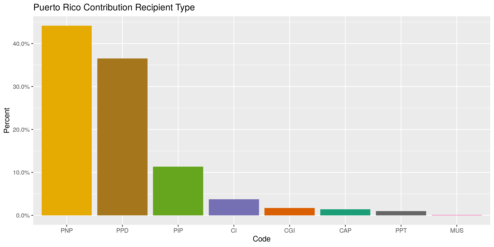
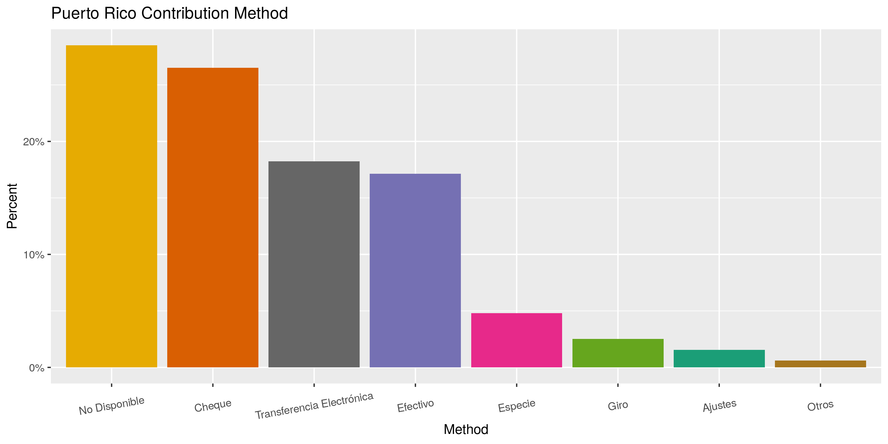
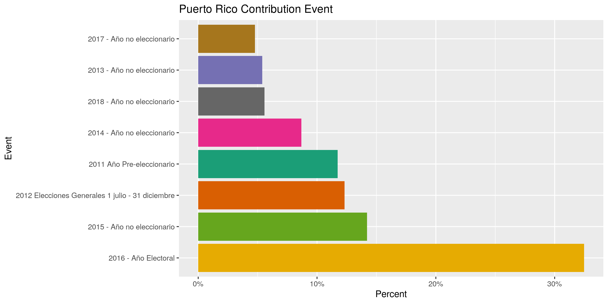
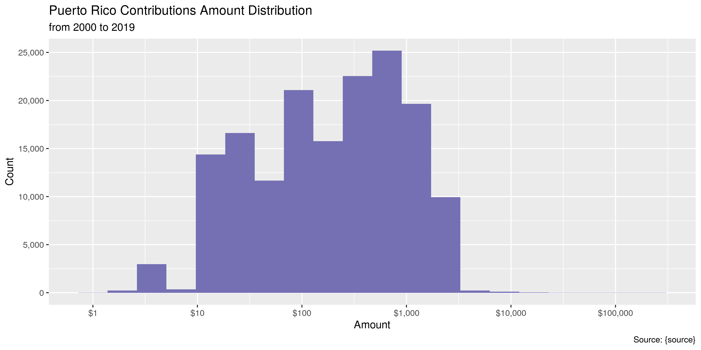
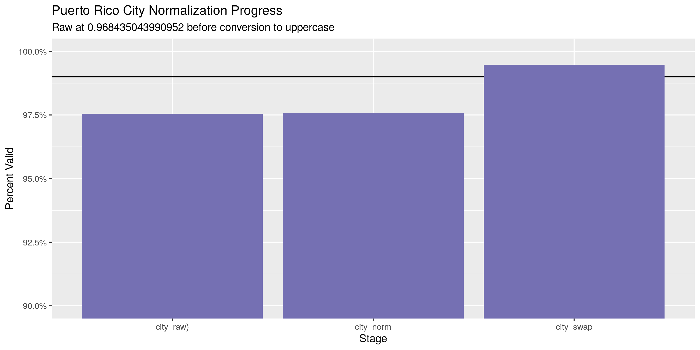
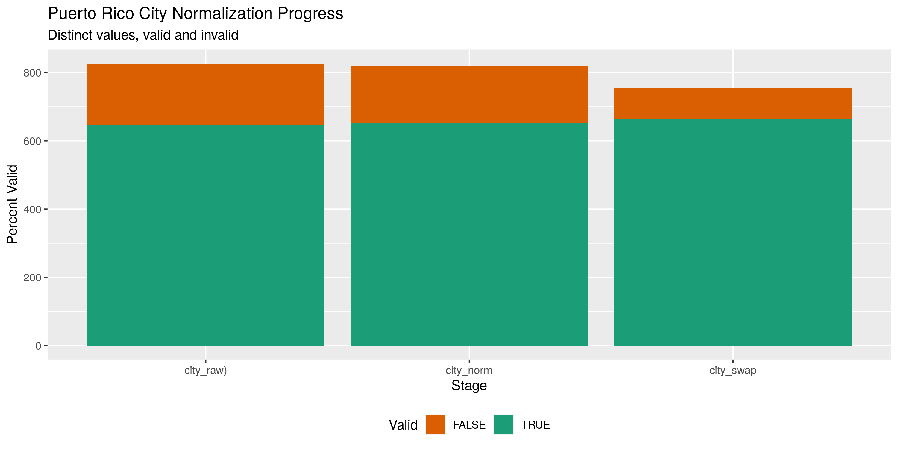

Puerto Rico Contributions
================
Kiernan Nicholls
2020-04-14 15:02:21

  - [Project](#project)
  - [Objectives](#objectives)
  - [Packages](#packages)
  - [Data](#data)
  - [Import](#import)
  - [Explore](#explore)
  - [Wrangle](#wrangle)
  - [Conclude](#conclude)
  - [Export](#export)

<!-- Place comments regarding knitting here -->

## Project

The Accountability Project is an effort to cut across data silos and
give journalists, policy professionals, activists, and the public at
large a simple way to search across huge volumes of public data about
people and organizations.

Our goal is to standardizing public data on a few key fields by thinking
of each dataset row as a transaction. For each transaction there should
be (at least) 3 variables:

1.  All **parties** to a transaction.
2.  The **date** of the transaction.
3.  The **amount** of money involved.

## Objectives

This document describes the process used to complete the following
objectives:

1.  How many records are in the database?
2.  Check for entirely duplicated records.
3.  Check ranges of continuous variables.
4.  Is there anything blank or missing?
5.  Check for consistency issues.
6.  Create a five-digit ZIP Code called `zip`.
7.  Create a `year` field from the transaction date.
8.  Make sure there is data on both parties to a transaction.

## Packages

The following packages are needed to collect, manipulate, visualize,
analyze, and communicate these results. The `pacman` package will
facilitate their installation and attachment.

The IRW’s `campfin` package will also have to be installed from GitHub.
This package contains functions custom made to help facilitate the
processing of campaign finance data.

``` r
if (!require("pacman")) install.packages("pacman")
pacman::p_load_gh("irworkshop/campfin")
pacman::p_load(
  tidyverse, # data manipulation
  lubridate, # datetime strings
  janitor, # dataframe clean
  refinr, # cluster and merge
  scales, # format strings
  knitr, # knit documents
  vroom, # read files fast
  glue, # combine strings
  here, # relative storage
  fs # search storage 
)
```

This document should be run as part of the `R_campfin` project, which
lives as a sub-directory of the more general, language-agnostic
[`irworkshop/accountability_datacleaning`](https://github.com/irworkshop/accountability_datacleaning)
GitHub repository.

The `R_campfin` project uses the [RStudio
projects](https://support.rstudio.com/hc/en-us/articles/200526207-Using-Projects)
feature and should be run as such. The project also uses the dynamic
`here::here()` tool for file paths relative to *your* machine.

``` r
# where does this document knit?
here::here()
#> [1] "/home/kiernan/Code/accountability_datacleaning/R_campfin"
```

## Data

Data is obtained from the Puerto Rico [Oficina del Contralor
Electoral](http://oce.pr.gov/), the Comptroller’s Office (OCE).

> Descripción: La Ley Núm. 222 de 18 de noviembre de 2011, según
> enmendada, mejor conocida como “Ley para la Fiscalización del
> Financiamiento de Campañas Políticas en Puerto Rico”, crea la Oficina
> del Contralor Electoral, a fin de establecer el marco legal y
> administrativo que regirá la legalidad, examen y evaluación de
> donativos y gastos para fines electorales.

Translation via Google Translate:

> *Description: Act No. 222 of November 18, 2011, as amended, better
> known as the “Law for the Control of Political Campaign Financing in
> Puerto Rico,” creates the Office of the Electoral Comptroller, in
> order to establish the legal framework and administrative that will
> govern the legality, examination and evaluation of donations and
> expenses for electoral purposes.*

The data is accessed through the [Puerto Rico OpenData
portal](https://data.oce.pr.gov). The data was first uploaded on
September 28, 2016 and last updated February 14, 2019.

There are 166,000 rows and 11 columns (translated):

  - `Candidate`: Name of the candidate, party or campaign committee.
  - `Candidature`: Description of the candidate, party or campaign
    committee.
  - `Acronym`: Acronym of the political party or type of committee:
      - “CI” = Independent Candidate
      - “CGI” = Independent Expenditure Committee
  - `Amount`: Amount of money contributed.
  - `Method`: Donation form.
  - `Donor`: Full name of the donor.
  - `City`: City where the donor resides.
  - `Date`: Date the donation was generated (day / month / year).
  - `Event`: Description of the election year or event.
  - `Zip Code`: Donor zip code.
  - `Location 1`: Donation coordinates based on the donor’s zip code.

## Import

The data can be imported from the OpenData portal as a flat text file or
via the SODA API.

### Read

``` r
raw_dir <- dir_create(here("pr", "contribs", "data", "raw"))
```

``` r
prc <- read_csv(
  file = "https://data.oce.pr.gov/api/views/kdwd-nb6g/rows.csv",
  skip = 1,
  col_names = c("cand", "type", "code", "amount", "method", "donor", 
                "city", "date", "event", "zip", "coord"),
  col_types = cols(
    .default = col_character(),
    amount = col_double(),
    date = col_date("%d/%m/%Y")
  )
)
```

``` r
prc <- prc %>% 
  extract(
    col = coord,
    into = c("lat", "long"),
    regex = "(\\d*\\.\\d*), (-\\d*\\.\\d*)",
    remove = TRUE,
    convert = TRUE
  )
```

## Explore

``` r
head(prc)
#> # A tibble: 6 x 12
#>   cand         type   code  amount method    donor    city   date       event     zip     lat  long
#>   <chr>        <chr>  <chr>  <dbl> <chr>     <chr>    <chr>  <date>     <chr>     <chr> <dbl> <dbl>
#> 1 PARTIDO IND… Parti… PIP      200 Cheque    DAMARIS… ARECI… 2018-03-31 2018 - A… 00612  18.4 -66.7
#> 2 PARTIDO IND… Parti… PIP      200 Transfer… ADRIAN … CAGUAS 2018-03-31 2018 - A… 00726  18.2 -66.1
#> 3 PARTIDO IND… Parti… PIP      200 Transfer… CARLOS … SAN J… 2018-03-31 2018 - A… 00919  18.4 -66.1
#> 4 PARTIDO IND… Parti… PIP      200 Transfer… CARLOS … SAN J… 2018-03-31 2018 - A… 00907  18.5 -66.1
#> 5 PARTIDO IND… Parti… PIP      400 Transfer… GILBERT… SAN J… 2018-03-31 2018 - A… 00975  18.4 -66.1
#> 6 PARTIDO IND… Parti… PIP      200 Transfer… JOSE CR… SAN S… 2018-03-31 2018 - A… 00685  18.3 -67.0
tail(prc)
#> # A tibble: 6 x 12
#>   cand       type      code  amount method  donor    city   date       event      zip     lat  long
#>   <chr>      <chr>     <chr>  <dbl> <chr>   <chr>    <chr>  <date>     <chr>      <chr> <dbl> <dbl>
#> 1 CARLOS LO… Alcalde … PPD     -500 Ajustes CESAR M… CAGUAS 2013-09-20 2013 - Añ… 00725  18.2 -66.0
#> 2 RAMON LUI… Senador … PPD     1000 Cheque  PRAXAIR… Otra … 2016-02-29 2016 - Añ… 06813  NA    NA  
#> 3 RAMON LUI… Senador … PPD     1000 Cheque  PRAXAIR… Otra … 2016-02-29 2016 - Añ… 06813  NA    NA  
#> 4 RAMON LUI… Senador … PPD     1000 Cheque  PRAXAIR… Otra … 2016-02-29 2016 - Añ… 06813  NA    NA  
#> 5 RAMON LUI… Senador … PPD     1000 Cheque  PRAXAIR… Otra … 2016-02-29 2016 - Añ… 06813  NA    NA  
#> 6 RAMON LUI… Senador … PPD     1000 Cheque  PRAXAIR… Otra … 2016-02-29 2016 - Añ… 06813  NA    NA
glimpse(sample_n(prc, 20))
#> Rows: 20
#> Columns: 12
#> $ cand   <chr> "LUIS FORTUÑO BURSET", "THOMAS RIVERA SCHATZ", "RICARDO ROSSELLO NEVARES", "ALEJA…
#> $ type   <chr> "Gobernador", "Senador por Acumulación", "Gobernador", "Gobernador", "Senador por…
#> $ code   <chr> "PNP", "PNP", "PNP", "PPD", "PPD", "PIP", "PIP", "PNP", "PNP", "PPD", "PPD", "PIP…
#> $ amount <dbl> 1000, 500, 125, 1000, 75, 600, 20, 1000, 500, 250, 1000, 30, 200, -500, 125, 25, …
#> $ method <chr> "No Disponible", "Cheque", "Cheque", "Cheque", "No Disponible", "Transferencia El…
#> $ donor  <chr> "AGENOL GONZALEZ CUBERO", "LUIS RIVERA MARIN", "LUINEL TORRES ACOSTA", "IRVING FA…
#> $ city   <chr> "ISABELA", "SAN JUAN", "GUAYANILLA", "GUAYNABO", "TOA BAJA", "CAGUAS", "BAYAMON",…
#> $ date   <date> 2012-09-24, 2016-10-14, 2016-03-15, 2015-08-08, 2011-08-31, 2015-03-30, 2016-01-…
#> $ event  <chr> "2012 Elecciones Generales 1 julio - 31 diciembre", "2016 - Año Electoral", "2016…
#> $ zip    <chr> "00662", "00926", "00656", "00966", "00951", "00726", "00959", "00983", "00727", …
#> $ lat    <dbl> 18.47885, 18.36136, 18.03887, 18.39851, 18.45776, 18.21297, 18.38706, 18.41441, N…
#> $ long   <dbl> -67.01973, -66.05620, -66.79168, -66.11522, -66.19650, -66.05803, -66.15943, -65.…
```

### Missing

``` r
col_stats(prc, count_na)
#> # A tibble: 12 x 4
#>    col    class      n       p
#>    <chr>  <chr>  <int>   <dbl>
#>  1 cand   <chr>      0 0      
#>  2 type   <chr>      0 0      
#>  3 code   <chr>      0 0      
#>  4 amount <dbl>      0 0      
#>  5 method <chr>      0 0      
#>  6 donor  <chr>   1244 0.00751
#>  7 city   <chr>   1606 0.00970
#>  8 date   <date>     0 0      
#>  9 event  <chr>      0 0      
#> 10 zip    <chr>   2094 0.0126 
#> 11 lat    <dbl>   9047 0.0546 
#> 12 long   <dbl>   9047 0.0546
```

``` r
prc <- prc %>% flag_na(date, donor, amount, cand)
mean(prc$na_flag)
#> [1] 0.007511306
```

``` r
prc %>% 
  filter(na_flag) %>% 
  select(date, donor, amount, cand) %>% 
  sample_frac()
#> # A tibble: 1,244 x 4
#>    date       donor amount cand                                
#>    <date>     <chr>  <dbl> <chr>                               
#>  1 2015-02-13 <NA>    160  "JONATHAN TOSSAS ORTIZ"             
#>  2 2015-05-09 <NA>    960  "ROLANDO CRESPO ARROYO"             
#>  3 2015-02-28 <NA>    219  "COMITE MUNICIPAL MAYAGUEZ PNP"     
#>  4 2015-03-22 <NA>    967. "LUIS \"ROLAN\" MALDONADO RODRIGUEZ"
#>  5 2015-03-01 <NA>   2914  "MARTIN VARGAS MORALES"             
#>  6 2015-05-01 <NA>    345  "ISANDER LOIZ DE LEON"              
#>  7 2015-04-06 <NA>    725  "PEDRO TORRES RIVERA"               
#>  8 2014-10-04 <NA>   3000  "RAMON CRUZ BURGOS"                 
#>  9 2015-03-22 <NA>      5  "COMITE MUNICIPAL JUNCOS PNP"       
#> 10 2014-11-13 <NA>    300  "REINALDO VARGAS RODRIGUEZ"         
#> # … with 1,234 more rows
```

### Duplicates

``` r
prc <- flag_dupes(prc, everything())
mean(prc$dupe_flag)
#> [1] 0.08786538
```

``` r
prc %>% 
  filter(dupe_flag) %>% 
  select(date, donor, amount, cand)
#> # A tibble: 14,552 x 4
#>    date       donor                   amount cand                       
#>    <date>     <chr>                    <dbl> <chr>                      
#>  1 2016-04-02 WILLIAM MORALES PENA       100 YARAMARY TORRES REYES      
#>  2 2016-08-30 RICARDO SOLA RODRIGUEZ     500 PARTIDO POPULAR DEMOCRATICO
#>  3 2015-09-24 RAFAEL DUENO PALMER       1000 ALEJANDRO GARCIA PADILLA   
#>  4 2016-11-01 CELESTE BENITEZ RIVERA     200 PARTIDO POPULAR DEMOCRATICO
#>  5 2016-08-05 SANDRA TORRES MARRERO     2500 PARTIDO POPULAR DEMOCRATICO
#>  6 2017-03-06 CESAR VARGAS VELAZQUEZ     500 THOMAS RIVERA SCHATZ       
#>  7 2016-07-02 JOSE MEDINA TOLLINCHE     1000 MARIA CHARBONIER LAUREANO  
#>  8 2018-03-18 JUDITH HERNANDEZ ARROYO     10 VICTOR PARES OTERO         
#>  9 2018-03-18 JUDITH HERNANDEZ ARROYO     10 VICTOR PARES OTERO         
#> 10 2018-03-18 MILAGROS LUGO NAZARIO       10 VICTOR PARES OTERO         
#> # … with 14,542 more rows
```

### Categorical

``` r
col_stats(prc, n_distinct)
#> # A tibble: 14 x 4
#>    col       class      n         p
#>    <chr>     <chr>  <int>     <dbl>
#>  1 cand      <chr>    869 0.00525  
#>  2 type      <chr>    138 0.000833 
#>  3 code      <chr>     11 0.0000664
#>  4 amount    <dbl>   3843 0.0232   
#>  5 method    <chr>     11 0.0000664
#>  6 donor     <chr>  49858 0.301    
#>  7 city      <chr>    988 0.00597  
#>  8 date      <date>  2757 0.0166   
#>  9 event     <chr>     19 0.000115 
#> 10 zip       <chr>   1616 0.00976  
#> 11 lat       <dbl>    151 0.000912 
#> 12 long      <dbl>    151 0.000912 
#> 13 na_flag   <lgl>      2 0.0000121
#> 14 dupe_flag <lgl>      2 0.0000121
```

<!-- -->

<!-- -->

<!-- -->

### Continuous

#### Amounts

``` r
summary(prc$amount)
#>     Min.  1st Qu.   Median     Mean  3rd Qu.     Max. 
#> -35300.0     40.0    200.0    437.2    500.0 250000.0
mean(prc$amount <= 0)
#> [1] 0.02772058
```

<!-- -->

#### Dates

``` r
prc <- mutate(prc, year = year(date))
```

``` r
min(prc$date)
#> [1] "2011-01-01"
sum(prc$year < 2000)
#> [1] 0
max(prc$date)
#> [1] "2018-12-31"
sum(prc$date > today())
#> [1] 0
```

<!-- -->

## Wrangle

To improve the searchability of the database, we will perform some
consistent, confident string normalization. For geographic variables
like city names and ZIP codes, the corresponding `campfin::normal_*()`
functions are tailor made to facilitate this process.

The database does not contain addresses or states. We can add the later
using the `zip` variable, once it is cleaned.

### ZIP

For ZIP codes, the `campfin::normal_zip()` function will attempt to
create valid *five* digit codes by removing the ZIP+4 suffix and
returning leading zeroes dropped by other programs like Microsoft Excel.

``` r
prc <- prc %>% 
  mutate(
    zip_norm = normal_zip(
      zip = zip,
      na_rep = TRUE
    )
  )
```

``` r
progress_table(
  prc$zip,
  prc$zip_norm,
  compare = valid_zip
)
#> # A tibble: 2 x 6
#>   stage    prop_in n_distinct prop_na n_out n_diff
#>   <chr>      <dbl>      <dbl>   <dbl> <dbl>  <dbl>
#> 1 zip        0.991       1616  0.0126  1450    249
#> 2 zip_norm   0.994       1532  0.0138   945    149
```

Now we can add the state for each ZIP code.

``` r
prc <- left_join(
  x = prc,
  y = select(zipcodes, -city), 
  by = c("zip_norm" = "zip")
)
prc %>% 
  select(zip, state) %>% 
  col_stats(count_na)
#> # A tibble: 2 x 4
#>   col   class     n      p
#>   <chr> <chr> <int>  <dbl>
#> 1 zip   <chr>  2094 0.0126
#> 2 state <chr>  3226 0.0195
```

### City

Cities are the most difficult geographic variable to normalize, simply
due to the wide variety of valid cities and formats.

#### Normal

The `campfin::normal_city()` function is a good start, again converting
case, removing punctuation, but *expanding* USPS abbreviations. We can
also remove `invalid_city` values.

``` r
prc <- prc %>% 
  mutate(
    city_norm = normal_city(
      city = city, 
      abbs = usps_city,
      states = c("PR", "DC", "PUERTO RICO"),
      na = invalid_city,
      na_rep = TRUE
    )
  )
```

#### Swap

We can further improve normalization by comparing our normalized value
against the *expected* value for that record’s state abbreviation and
ZIP code. If the normalized value is either an abbreviation for or very
similar to the expected value, we can confidently swap those two.

``` r
prc <- prc %>% 
  rename(city_raw = city) %>% 
  left_join(
    y = zipcodes,
    by = c("state", "zip_norm" = "zip")
  ) %>% 
  rename(city_match = city) %>% 
  mutate(
    match_abb = is_abbrev(city_norm, city_match),
    match_dist = str_dist(city_norm, city_match),
    city_swap = if_else(
      condition = !is.na(match_dist) & (match_abb | match_dist == 1),
      true = city_match,
      false = city_norm
    )
  ) %>% 
  select(
    -city_match,
    -match_dist,
    -match_abb
  )
```

#### Progress

| stage      | prop\_in | n\_distinct | prop\_na | n\_out | n\_diff |
| :--------- | -------: | ----------: | -------: | -----: | ------: |
| city\_raw) |    0.975 |         826 |     0.01 |   4021 |     179 |
| city\_norm |    0.976 |         820 |     0.01 |   3973 |     165 |
| city\_swap |    0.991 |         786 |     0.01 |   1522 |     106 |

You can see how the percentage of valid values increased with each
stage.

<!-- -->

More importantly, the number of distinct values decreased each stage. We
were able to confidently change many distinct invalid values to their
valid equivalent.

``` r
progress %>% 
  select(
    stage, 
    all = n_distinct,
    bad = n_diff
  ) %>% 
  mutate(good = all - bad) %>% 
  pivot_longer(c("good", "bad")) %>% 
  mutate(name = name == "good") %>% 
  ggplot(aes(x = stage, y = value)) +
  geom_col(aes(fill = name)) +
  scale_fill_brewer(palette = "Dark2", direction = -1) +
  scale_y_continuous(labels = comma) +
  theme(legend.position = "bottom") +
  labs(
    title = "Puerto Rico City Normalization Progress",
    subtitle = "Distinct values, valid and invalid",
    x = "Stage",
    y = "Percent Valid",
    fill = "Valid"
  )
```

<!-- -->

## Conclude

``` r
prc <- prc %>% 
  select(
    -city_norm,
    city = city_raw,
    city_clean = city_swap,
    state_match = state,
    zip_clean = zip_norm,
  )
```

``` r
glimpse(sample_n(prc, 20))
#> Rows: 20
#> Columns: 18
#> $ cand        <chr> "JOSE \"JOSIAN\" SANTIAGO RIVERA", "HECTOR O'NEILL GARCIA", "PARTIDO NUEVO P…
#> $ type        <chr> "Alcalde de Comerío", "Alcalde de Guaynabo", "Partido", "Alcalde de Carolina…
#> $ code        <chr> "PPD", "PNP", "PNP", "PPD", "PNP", "PNP", "PIP", "PIP", "PPD", "PPD", "PNP",…
#> $ amount      <dbl> 10.0, 20.0, 400.0, 200.0, 150.0, 112.5, 10.0, 75.0, 20.0, 200.0, 500.0, 250.…
#> $ method      <chr> "Transferencia Electrónica", "Efectivo", "No Disponible", "Efectivo", "No Di…
#> $ donor       <chr> "CARLOS CARRASQUILLO LOPEZ", "JUAN FUENTES CUBERO", "MELVIN DIAZ DIAZ", "RAM…
#> $ city        <chr> "COMERIO", "GUAYNABO", "SAN JUAN", "CAGUAS", "SAN SEBASTIAN", "COAMO", "CIAL…
#> $ date        <date> 2016-02-12, 2013-11-22, 2012-10-25, 2015-03-09, 2011-08-26, 2017-12-01, 201…
#> $ event       <chr> "2016 - Año Electoral", "2013 - Año no eleccionario", "2012 Elecciones Gener…
#> $ zip         <chr> "00782", "00971", "00926", "00725", "00685", "00769", "00638", "00795", "007…
#> $ lat         <dbl> 18.22335, 18.32969, 18.36136, 18.23393, 18.33260, 18.09281, 18.30814, 18.036…
#> $ long        <dbl> -66.22670, -66.11876, -66.05620, -66.04502, -66.98104, -66.36110, -66.49835,…
#> $ na_flag     <lgl> FALSE, FALSE, FALSE, FALSE, FALSE, FALSE, FALSE, FALSE, FALSE, FALSE, FALSE,…
#> $ dupe_flag   <lgl> FALSE, FALSE, FALSE, FALSE, FALSE, FALSE, FALSE, FALSE, FALSE, FALSE, FALSE,…
#> $ year        <dbl> 2016, 2013, 2012, 2015, 2011, 2017, 2016, 2014, 2014, 2018, 2012, 2015, 2015…
#> $ zip_clean   <chr> "00782", "00971", "00926", "00725", "00685", "00769", "00638", "00795", "007…
#> $ state_match <chr> "PR", "PR", "PR", "PR", "PR", "PR", "PR", "PR", "PR", "PR", "PR", "PR", "PR"…
#> $ city_clean  <chr> "COMERIO", "GUAYNABO", "SAN JUAN", "CAGUAS", "SAN SEBASTIAN", "COAMO", "CIAL…
```

1.  There are 165617 records in the database.
2.  There are 14552 duplicate records in the database.
3.  The range and distribution of `amount` and `date` seem reasonable.
4.  There are 1244 records missing either recipient or date.
5.  Consistency in geographic data has been improved with
    `campfin::normal_*()`.
6.  The 4-digit `year` variable has been created with
    `lubridate::year()`.

## Export

``` r
clean_dir <- dir_create(here("pr", "contribs", "data", "clean"))
clean_path <- path(clean_dir, "pr_contribs_clean.csv")
write_csv(prc, path = clean_path, na = "")
```
