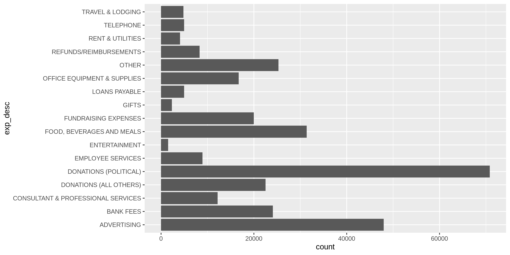
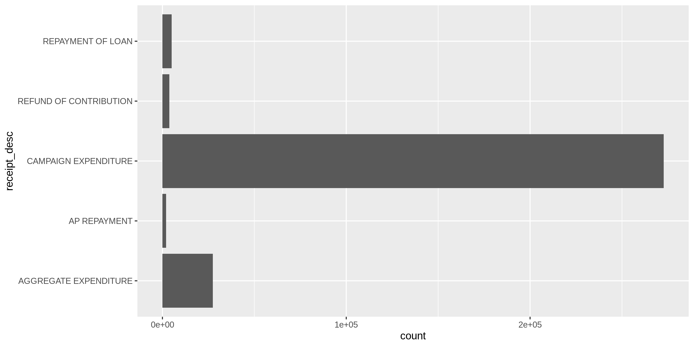
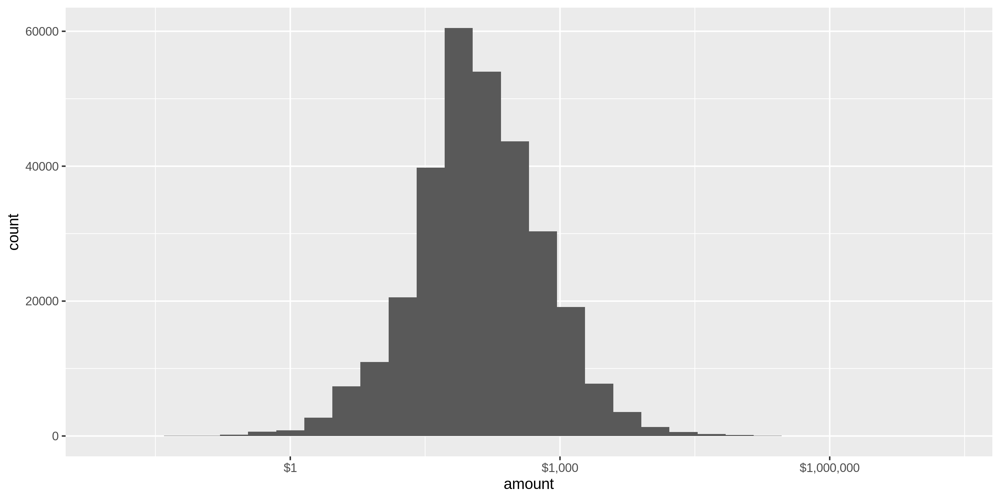
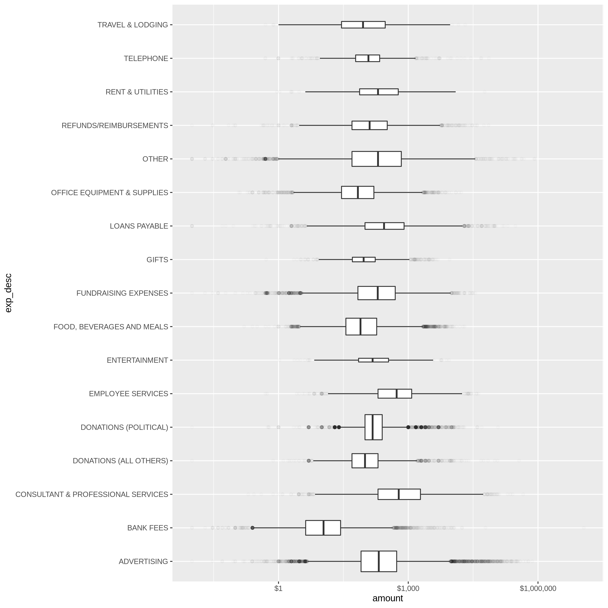
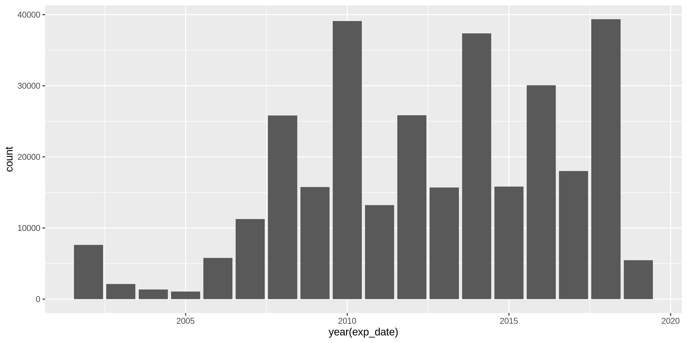
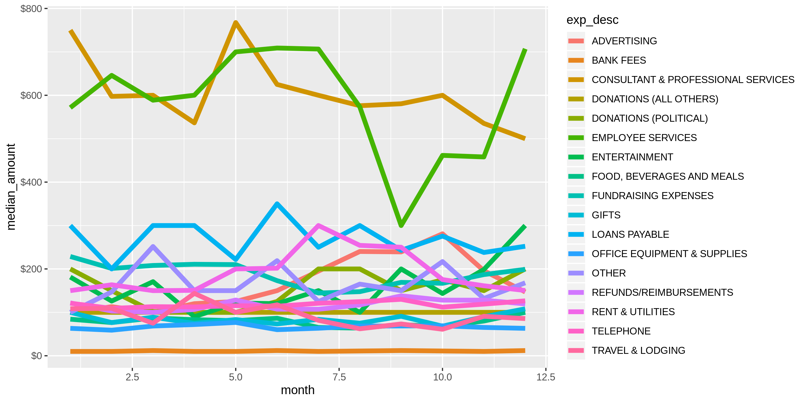

Rhode Island Expenditures
================
Kiernan Nicholls
2019-07-22 16:57:51

  - [Project](#project)
  - [Objectives](#objectives)
  - [Packages](#packages)
  - [Data](#data)
  - [Import](#import)
  - [Explore](#explore)
  - [Wrangle](#wrangle)
  - [Conclude](#conclude)
  - [Export](#export)

## Project

The Accountability Project is an effort to cut across data silos and
give journalists, policy professionals, activists, and the public at
large a simple way to search across huge volumes of public data about
people and organizations.

Our goal is to standardizing public data on a few key fields by thinking
of each dataset row as a transaction. For each transaction there should
be (at least) 3 variables:

1.  All **parties** to a transaction
2.  The **date** of the transaction
3.  The **amount** of money involved

## Objectives

This document describes the process used to complete the following
objectives:

1.  How many records are in the database?
2.  Check for duplicates
3.  Check ranges
4.  Is there anything blank or missing?
5.  Check for consistency issues
6.  Create a five-digit ZIP Code called `ZIP5`
7.  Create a `YEAR` field from the transaction date
8.  Make sure there is data on both parties to a transaction

## Packages

The following packages are needed to collect, manipulate, visualize,
analyze, and communicate these results. The `pacman` package will
facilitate their installation and attachment.

``` r
if (!require("pacman")) install.packages("pacman")
pacman::p_load(
  stringdist, # levenshtein value
  tidyverse, # data manipulation
  RSelenium, # remote browsing
  lubridate, # datetime strings
  magrittr, # pipe opperators
  janitor, # dataframe clean
  zipcode, # clean & database
  refinr, # cluster and merge
  scales, # number formatting
  knitr, # knit documents
  here, # relative storage
  glue, # combine strings
  fs # search storage 
)

# fix conflict
here <- here::here
```

The IRW’s `campfin` package will also have to be installed from GitHub.
This package contains functions custom made to help facilitate the
processing of campaign finance data.

``` r
pacman::p_load_current_gh("kiernann/campfin")
```

This document should be run as part of the `R_campfin` project, which
lives as a sub-directory of the more general, language-agnostic
[`irworkshop/accountability_datacleaning`](https://github.com/irworkshop/accountability_datacleaning "TAP repo")
GitHub repository.

The `R_campfin` project uses the [RStudio
projects](https://support.rstudio.com/hc/en-us/articles/200526207-Using-Projects "Rproj")
feature and should be run as such. The project also uses the dynamic
`here::here()` tool for file paths relative to *your* machine.

``` r
# where dfs this document knit?
here::here()
#> [1] "/home/ubuntu/R/accountability_datacleaning/R_campfin"
```

## Data

Data comes from the [Rhode Island Board of
Elections](http://www.elections.ri.gov/finance/publicinfo/ "ri_boe").
Each records tracks a single expenditure as reported by the campaign.

### About

> The Expenditures tab allows you to run ad-hoc reports on expenditures
> filed on Summary of Campaign Activity (CF-2) reports. The reports
> allow a certain degree of customization in that you are able to
> specify certain filters to limit what appears on the reports.

## Import

### Download

``` r
# create a directory for the raw data
raw_dir <- here("ri", "expends", "data", "raw")
dir_create(raw_dir)
```

To download the file, we can create our own URL and navigate to the page
using the `RSelenium` package.

``` r
url <- str_c(
  "http://ricampaignfinance.com/RIPublic/Reporting/ExpenditureReport.aspx?OrgID=0",
  "BeginDate=",
  "EndDate=",
  "LastName=",
  "FirstName=",
  "ContType=0",
  "State=",
  "City=",
  "ZIPCode=",
  "Amount=0",
  "ReportType=Expend",
  "CFStatus=F",
  "MPFStatus=F",
  "Level=S",
  "SumBy=Type",
  "Sort1=None",
  "Direct1=asc",
  "Sort2=None",
  "Direct2=asc",
  "Sort3=None",
  "Direct3=asc",
  "Site=Public",
  "Incomplete=A",
  "ContSource=CF",
  sep = "&"
)

# open the driver with auto download options
remote_driver <- rsDriver(
  port = 4444L,
  browser = "firefox",
  extraCapabilities = makeFirefoxProfile(
    list(
      browser.download.dir = raw_dir,
      browser.download.folderList = 2L,
      browser.helperApps.neverAsk.saveToDisk = "text/csv"
    )
  )
)

# navigate to the APOC download site
remote_browser <- remote_driver$client
remote_browser$navigate(url)

# click the export button
remote_browser$findElement("css", "#lnkExport")$clickElement()

# switch to pop up window
pop_up <- remote_driver$client$getWindowHandles()[[2]]
remote_driver$client$switchToWindow(windowId = pop_up)

# click the download option button
csv_button <- remote_browser$findElement("css", "#hypFileDownload")$clickElement()

# close the browser and driver
remote_browser$close()
remote_driver$server$stop()
```

### Read

``` r
ri <- read_csv(
  file = dir_ls(raw_dir),
  col_types = cols(
    .default = col_character(),
    ExpDate = col_date("%m/%d/%Y"),
    Amount = col_double(),
    OSAP =  col_double(),
    ZeroedByCF7 = col_logical()
  )
)

ri <- ri %>% 
  clean_names() %>% 
  mutate_if(is_character, str_to_upper) %>% 
  mutate_if(is_character, str_squish)
```

## Explore

There are 310,842 records of 21 variables in the full database.

``` r
glimpse(sample_frac(ri))
```

    #> Observations: 310,842
    #> Variables: 21
    #> $ organization_name   <chr> "KENNETH PARRILLA", "PEOPLE, RI COUNCIL 94, AFSCME AFL-CIO PAC", "JO…
    #> $ expenditure_id      <chr> "219397", "288270", "97135", "71381", "305665", "179798", "164823", …
    #> $ disb_desc           <chr> "CAMPAIGN EXPENDITURE", "CAMPAIGN EXPENDITURE", "CAMPAIGN EXPENDITUR…
    #> $ exp_desc            <chr> "ADVERTISING", "DONATIONS (POLITICAL)", "FUNDRAISING EXPENSES", "ENT…
    #> $ exp_pmt_desc        <chr> "CHECK", "CHECK", "CHECK", "CHECK", "CHECK", "CHECK", "CHECK", "CHEC…
    #> $ incomplete_desc     <chr> NA, NA, NA, NA, NA, NA, NA, NA, NA, NA, NA, NA, NA, NA, NA, NA, NA, …
    #> $ view_incomplete     <chr> "INCOMPLETE", "INCOMPLETE", "INCOMPLETE", "INCOMPLETE", "INCOMPLETE"…
    #> $ exp_date            <date> 2014-10-15, 2017-09-06, 2010-03-02, 2008-11-17, 2018-05-13, 2013-05…
    #> $ pmt_date            <chr> NA, NA, NA, NA, NA, NA, NA, NA, NA, NA, NA, NA, NA, NA, NA, NA, NA, …
    #> $ amount              <dbl> 196.00, 250.00, 95.00, 761.31, 3.00, 200.00, 38.50, 19.14, 10.00, 41…
    #> $ full_name           <chr> "WESTERLY POSTMASTER", "MARVIN L ABNEY", "PAYPAL", "AMERICAN EXPRESS…
    #> $ address             <chr> "HIGH ST", "12 SUMMER STREET", NA, NA, "ONE CITIZENS PLAZA", "P.O. B…
    #> $ city_st_zip         <chr> "WESTERLY, RI 02891", "NEWPORT, RI", NA, NA, "PROVIDENCE, RI 02903",…
    #> $ receipt_desc        <chr> "CAMPAIGN EXPENDITURE", "CAMPAIGN EXPENDITURE", "CAMPAIGN EXPENDITUR…
    #> $ expenditure_code_id <chr> "2", "7", "12", "9", "4", "7", "15", "4", "4", "2", "10", "4", "25",…
    #> $ begin_date          <chr> NA, NA, NA, NA, NA, NA, NA, NA, NA, NA, NA, NA, NA, NA, NA, NA, NA, …
    #> $ end_date            <chr> NA, NA, NA, NA, NA, NA, NA, NA, NA, NA, NA, NA, NA, NA, NA, NA, NA, …
    #> $ mpf_used            <chr> "-1", "-1", "-1", "-1", "-1", "-1", "-1", "-1", "-1", "-1", "-1", "-…
    #> $ osap                <dbl> 196.00, 250.00, 95.00, 761.31, 3.00, 200.00, 38.50, 19.14, 10.00, 41…
    #> $ zeroed_by_cf7       <lgl> FALSE, FALSE, FALSE, FALSE, FALSE, FALSE, FALSE, FALSE, FALSE, FALSE…
    #> $ ricf7filing_id      <chr> "0", "0", "0", "0", "0", "0", "0", "0", "0", "0", "0", "0", "0", "0"…

### Distinct

The variables range in their degree of distinctness.

``` r
ri %>% glimpse_fun(n_distinct)
```

    #> # A tibble: 21 x 4
    #>    var                 type       n          p
    #>    <chr>               <chr>  <int>      <dbl>
    #>  1 organization_name   chr     3567 0.0115    
    #>  2 expenditure_id      chr   310826 1.000     
    #>  3 disb_desc           chr        5 0.0000161 
    #>  4 exp_desc            chr       17 0.0000547 
    #>  5 exp_pmt_desc        chr        1 0.00000322
    #>  6 incomplete_desc     chr       21 0.0000676 
    #>  7 view_incomplete     chr        1 0.00000322
    #>  8 exp_date            date    5994 0.0193    
    #>  9 pmt_date            chr     1684 0.00542   
    #> 10 amount              dbl    52142 0.168     
    #> 11 full_name           chr    49222 0.158     
    #> 12 address             chr    39037 0.126     
    #> 13 city_st_zip         chr     6825 0.0220    
    #> 14 receipt_desc        chr        5 0.0000161 
    #> 15 expenditure_code_id chr       17 0.0000547 
    #> 16 begin_date          chr        1 0.00000322
    #> 17 end_date            chr        1 0.00000322
    #> 18 mpf_used            chr        1 0.00000322
    #> 19 osap                dbl    51624 0.166     
    #> 20 zeroed_by_cf7       lgl        2 0.00000643
    #> 21 ricf7filing_id      chr      960 0.00309

<!-- -->

<!-- -->

### Missing

The variables also vary in their degree of values that are `NA`
(missing).

``` r
ri %>% glimpse_fun(count_na)
```

    #> # A tibble: 21 x 4
    #>    var                 type       n      p
    #>    <chr>               <chr>  <int>  <dbl>
    #>  1 organization_name   chr        0 0     
    #>  2 expenditure_id      chr        0 0     
    #>  3 disb_desc           chr        0 0     
    #>  4 exp_desc            chr        0 0     
    #>  5 exp_pmt_desc        chr        0 0     
    #>  6 incomplete_desc     chr   306622 0.986 
    #>  7 view_incomplete     chr        0 0     
    #>  8 exp_date            date       0 0     
    #>  9 pmt_date            chr   301028 0.968 
    #> 10 amount              dbl        0 0     
    #> 11 full_name           chr    27374 0.0881
    #> 12 address             chr    74465 0.240 
    #> 13 city_st_zip         chr    59547 0.192 
    #> 14 receipt_desc        chr        0 0     
    #> 15 expenditure_code_id chr        0 0     
    #> 16 begin_date          chr   310842 1     
    #> 17 end_date            chr   310842 1     
    #> 18 mpf_used            chr        0 0     
    #> 19 osap                dbl        0 0     
    #> 20 zeroed_by_cf7       lgl        0 0     
    #> 21 ricf7filing_id      chr        0 0

We will flag any record missing a `full_name` or `address`.

``` r
ri <- ri %>% mutate(na_flag = is.na(full_name) | is.na(address) | is.na(city_st_zip))
```

### Duplicates

We can use `janitor::get_dupes()` to create a table of records
duplicated more than once.

``` r
ri_dupes <- distinct(get_dupes(ri))
nrow(ri_dupes)
#> [1] 12
sum(ri_dupes$dupe_count)
#> [1] 24
```

We can then join this table back with the full dataset, flagging any
duplicated rows with `dupe_flag()`.

``` r
ri <- ri %>%
  left_join(ri_dupes) %>% 
  mutate(dupe_flag = !is.na(dupe_count))

rm(ri_dupes)
```

### Ranges

#### amounts

There are 5767 records with `amount` values less than zero.

``` r
summary(ri$amount)
#>     Min.  1st Qu.   Median     Mean  3rd Qu.     Max. 
#>  -142000       50      123      638      324 11452454
sum(ri$amount < 0)
#> [1] 5767
```

``` r
ri %>% 
  ggplot(aes(amount)) +
  geom_histogram() +
  scale_x_continuous(trans = "log10", labels = dollar)
```

<!-- -->

``` r
ri %>% 
  ggplot(aes(exp_desc, amount)) +
  geom_boxplot(varwidth = TRUE, outlier.alpha = 0.01) +
  scale_y_continuous(trans = "log10", labels = dollar) +
  coord_flip()
```

<!-- -->

### Dates

There are 0 records with an `exp_date` past 2019-07-22.

``` r
summary(ri$exp_date)
#>         Min.      1st Qu.       Median         Mean      3rd Qu.         Max. 
#> "2002-01-06" "2010-04-07" "2013-05-24" "2013-02-12" "2016-08-25" "2019-07-08"
sum(ri$exp_date > today())
#> [1] 0
```

<!-- -->

<!-- -->

## Wrangle

Before wrangling the data, we need to separate the `city_st_zip`
variable into it’s respective parts.

``` r
ri <- ri %>% 
  separate(
    col = city_st_zip,
    into = c("city_sep", "state_zip"),
    sep = ",\\s",
    remove = FALSE
  ) %>% 
  separate(
    col = state_zip,
    into = c("state_sep", "zip_sep"),
    sep = "\\s",
    remove = TRUE
  )
```

### Year

We can create an `exp_year` variable from the `exp_date` using
`lubridate::year()` (after parsing the string with `readr::col_date()`).

``` r
ri <- mutate(ri, exp_year = year(exp_date))
```

### Address

The `address` variable should be minimally cleaned using the
`campfin::normal_address()` to simplify text and expand abbreviations.

``` r
ri <- ri %>% 
  mutate(
    address_clean = normal_address(
      address = address,
      add_abbs = usps,
      na_rep = TRUE,
    )
  )

ri %>% 
  filter(address_clean != address) %>% 
  select(address, address_clean) %>% 
  sample_n(10)
```

    #> # A tibble: 10 x 2
    #>    address           address_clean        
    #>    <chr>             <chr>                
    #>  1 HIGH ST           HIGH STREET          
    #>  2 MAIN ST           MAIN STREET          
    #>  3 P.O BOX 1270      PO BOX 1270          
    #>  4 65 BROOKRIDGE DR. 65 BROOKRIDGE DRIVE  
    #>  5 60 BELMONT AVE.   60 BELMONT AVENUE    
    #>  6 6 FAIR OAKS CT S  6 FAIR OAKS COURT S  
    #>  7 173 WASHINGTON ST 173 WASHINGTON STREET
    #>  8 268 PROSPECT ST.  268 PROSPECT STREET  
    #>  9 TAUNTON AVE       TAUNTON AVENUE       
    #> 10 8 LEDYARD ST., #1 8 LEDYARD STREET 1

### ZIP

We can do the same to ZIP codes using `campfin::normal_zip()`.

``` r
n_distinct(ri$zip_sep)
#> [1] 3455
mean(na.omit(ri$zip_sep) %in% geo$zip)
#> [1] 0.981967

ri <- ri %>% 
  mutate(
    zip_clean = normal_zip(
      zip = zip_sep, 
      na_rep = TRUE
    )
  )

mean(is.na(ri$zip_clean))
#> [1] 0.351632
n_distinct(ri$zip_clean)
#> [1] 2937
mean(na.omit(ri$zip_clean) %in% geo$zip)
#> [1] 0.9960851
n_distinct(ri$zip_clean[which(ri$zip_clean %out% geo$zip)])
#> [1] 198
```

### State

``` r
n_distinct(ri$state_sep)
#> [1] 109
mean(na.omit(ri$state_sep) %in% geo$state)
#> [1] 0.999636
setdiff(ri$state_sep, geo$state)
#>  [1] NA             "PAUL"         "02904"        "10006"        "00901"        "ALBERTA"     
#>  [7] "02886"        "TB"           "XX"           "IRELAND,"     "02"           "NA"          
#> [13] "CANADA"       "00979"        "GERMANY,"     "NOVA"         "QUEBEC"       "02816"       
#> [19] "WARWICK"      "D.C.,"        "NE,"          "PORTUGAL,"    "R"            "DC,"         
#> [25] "20006"        "02840"        "TAIWAN,"      "00"           "10000"        "02842"       
#> [31] "02920"        "DR"           "02903"        "02906"        "02905"        "CANADA,"     
#> [37] "T2G"          "02914"        "02919"        "BELGIUM,"     "02909"        "THE"         
#> [43] "PROVIDENCE"   "RH"           "NETHERLANDS," "04243"        "UK,"          "D.C."

ri <- ri %>% 
  mutate(
    state_clean = normal_state(
      state = state_sep,
      abbreviate = TRUE,
      na_rep = TRUE,
      valid = geo$state
    )
  )

n_distinct(ri$state_clean)
#> [1] 62
mean(na.omit(ri$state_clean) %in% geo$state)
#> [1] 1
setdiff(ri$state_clean, geo$state)
#> [1] NA
```

### City

Cleaning city values is the most complicated. This process involves four
steps:

1.  Prepare raw city values by removing invalid data and reducing
    inconsistencies
2.  Match prepared city values with the *actual* city name of that
    record’s ZIP code
3.  swap prepared city values with the ZIP code match *if* only 1 edit
    is needed
4.  Refine swapped city values with key collision and n-gram
    fingerprints

#### Prep

``` r
n_distinct(ri$city_sep)
#> [1] 2919
mean(ri$city_sep %in% geo$city)
#> [1] 0.768162
sum(unique(ri$city_sep) %out% geo$city)
#> [1] 1546
```

``` r
ri <- ri %>% 
  mutate(
    city_norm = normal_city(
      city = city_sep %>% str_replace("\\bPROV\\b", "PROVIDENCE"),
      geo_abbs = usps_city,
      st_abbs = unique(geo$state),
      na = na_city,
      na_rep = TRUE
    )
  )

n_distinct(ri$city_norm)
#> [1] 2664
mean(ri$city_norm %in% geo$city)
#> [1] 0.7745639
sum(unique(ri$city_norm) %out% geo$city)
#> [1] 1265
```

#### Match

``` r
ri <- ri %>%
  left_join(
    y = geo,
    by = c(
      "zip_clean" = "zip",
      "state_clean" = "state"
    )
  ) %>%
  rename(city_match = city) %>%
  mutate(match_dist = stringdist(city_norm, city_match))

summary(ri$match_dist)
#>    Min. 1st Qu.  Median    Mean 3rd Qu.    Max.    NA's 
#>     0.0     0.0     0.0     0.6     0.0    37.0  110931
```

#### Swap

``` r
ri <- ri %>% 
  mutate(
    city_swap = if_else(
      condition = match_dist == 1, 
      true = city_match, 
      false = city_norm
    )
  )

n_distinct(ri$city_swap)
#> [1] 1694
mean(ri$city_swap %in% geo$city)
#> [1] 0.628658
sum(unique(ri$city_swap) %out% geo$city)
#> [1] 412
```

``` r
ri %>% 
  filter(city_swap != city_norm) %>% 
  count(state_clean, city_sep, city_norm, city_swap) %>% 
  arrange(desc(n))
```

    #> # A tibble: 571 x 5
    #>    state_clean city_sep       city_norm      city_swap           n
    #>    <chr>       <chr>          <chr>          <chr>           <int>
    #>  1 GA          ALTLANTA       ALTLANTA       ATLANTA           126
    #>  2 RI          PROVIDNECE     PROVIDNECE     PROVIDENCE         90
    #>  3 RI          NORTH KINGSTON NORTH KINGSTON NORTH KINGSTOWN    75
    #>  4 RI          PROVIDENE      PROVIDENE      PROVIDENCE         67
    #>  5 MA          SOMMERVILLE    SOMMERVILLE    SOMERVILLE         51
    #>  6 CA          MENIO PARK     MENIO PARK     MENLO PARK         46
    #>  7 MA          WORCHESTER     WORCHESTER     WORCESTER          40
    #>  8 DE          WILMINTON      WILMINTON      WILMINGTON         32
    #>  9 TX          FORTH WORTH    FORTH WORTH    FORT WORTH         32
    #> 10 CA          SANJOSE        SANJOSE        SAN JOSE           30
    #> # … with 561 more rows

#### Refine

``` r
ri_refined <- ri %>%
  filter(state_clean == "RI") %>% 
  filter(match_dist != 1) %>% 
  mutate(
    city_refine = city_swap %>% 
      key_collision_merge(dict = geo$city[geo$state == "RI"]) %>% 
      n_gram_merge(numgram = 1)
  ) %>% 
  filter(city_swap != city_refine)
```

#### Merge

``` r
ri <- ri %>% 
  left_join(ri_refined) %>% 
  mutate(city_clean = coalesce(city_refine, city_swap))

n_distinct(ri$city_clean)
#> [1] 1619
mean(ri$city_clean %in% geo$city)
#> [1] 0.6324732
sum(unique(ri$city_clean) %out% geo$city)
#> [1] 337
```

Each step of the cleaning process reduces the number of distinct city
values.

``` r
n_distinct(ri$city_sep)
#> [1] 2919
n_distinct(ri$city_norm)
#> [1] 2664
n_distinct(ri$city_swap)
#> [1] 1694
n_distinct(ri$city_clean)
#> [1] 1619
```

## Conclude

1.  There are 310859 records in the database
2.  There are 24 records with duplicate values (flagged with
    `dupe_flag`)
3.  The ranges for dates and amounts are reasonable
4.  Consistency has been improved with `stringr` package and custom
    `campfin::normal_*()` functions
5.  The five-digit `zip_clean` variable has been created with
    `campfin::normal_zip()`
6.  The `year` variable has been created with `lubridate::year()`
7.  There are 74971 records with some missing key value, 24.1% of the
    total records.

## Export

``` r
proc_dir <- here("ri", "expends", "data", "processed")
dir_create(proc_dir)

write_csv(
  x = ri,
  na = "",
  path = glue("{proc_dir}/ri_expends_clean.csv")
)
```
