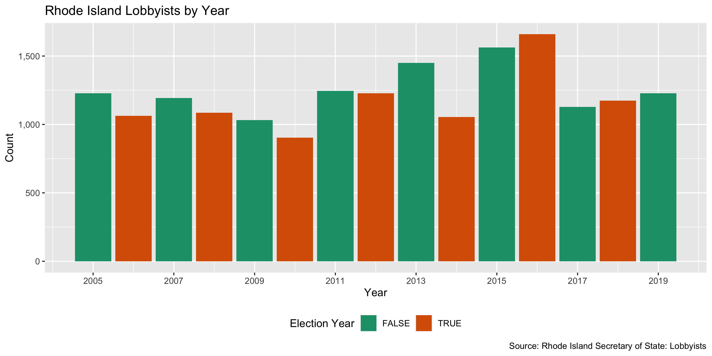

Rhode Island Lobbying Registration Diary
================
Yanqi Xu
2020-04-16 17:47:03

  - [Project](#project)
  - [Objectives](#objectives)
  - [Packages](#packages)
  - [Data](#data)
  - [Import](#import)
  - [Explore](#explore)
  - [Wrangle](#wrangle)
  - [Conclude](#conclude)
  - [Export](#export)

<!-- Place comments regarding knitting here -->

## Project

The Accountability Project is an effort to cut across data silos and
give journalists, policy professionals, activists, and the public at
large a simple way to search across huge volumes of public data about
people and organizations.

Our goal is to standardizing public data on a few key fields by thinking
of each dataset row as a transaction. For each transaction there should
be (at least) 3 variables:

1.  All **parties** to a transaction.
2.  The **date** of the transaction.
3.  The **amount** of money involved.

## Objectives

This document describes the process used to complete the following
objectives:

1.  How many records are in the database?
2.  Check for entirely duplicated records.
3.  Check ranges of continuous variables.
4.  Is there anything blank or missing?
5.  Check for consistency issues.
6.  Create a five-digit zip Code called `zip`.
7.  Create a `year` field from the transaction date.
8.  Make sure there is data on both parties to a transaction.

## Packages

The following packages are needed to collect, manipulate, visualize,
analyze, and communicate these results. The `pacman` package will
facilitate their installation and attachment.

The IRW’s `campfin` package will also have to be installed from GitHub.
This package contains functions custom made to help facilitate the
processing of campaign finance data.

``` r
if (!require("pacman")) install.packages("pacman")
pacman::p_load_gh("irworkshop/campfin")
pacman::p_load(
  readxl, # read excel files
  tidyverse, # data manipulation
  stringdist, # calculate distances between strings
  lubridate, # datetime strings
  magrittr, # pipe opperators
  janitor, # dataframe clean
  refinr, # cluster and merge
  scales, # format strings
  knitr, # knit documents
  vroom, # read files fast
  httr, # http queries
  glue, # combine strings
  here, # relative storage
  fs # search storage 
)
```

This document should be run as part of the `R_campfin` project, which
lives as a sub-directory of the more general, language-agnostic
[`irworkshop/accountability_datacleaning`](https://github.com/irworkshop/accountability_datacleaning)
GitHub repository.

The `R_campfin` project uses the [Rstudio
projects](https://support.rstudio.com/hc/en-us/articles/200526207-Using-Projects "Rproj")
feature and should be run as such. The project also uses the dynamic
`here::here()` tool for file paths relative to *your* machine.

``` r
# where does this document knit?
here::here()
#> [1] "/Users/yanqixu/code/accountability_datacleaning/R_campfin"
```

## Data

The [Rhode Island Secretary of State’s
office](https://www.sos.ri.gov/divisions/Open-Government/Transparency/lobbying)
makes the data available in web pages, but does not provide bulk
download options. The workshop filed a open records request and obtained
lobbying registration and expenditure data. The record layouts for both
datasets are slightly different. The request was filled on Feb. 27,
2020.

## Import

### Setting up Raw Data Directory

``` r
raw_dir <- dir_create(here("ri", "lobby", "data", "raw", "reg"))
```

### Read

We can see that the date is formatted in Excel and we need to use
`excel_numeric_to_date`

``` r
rilr_new <- read_xlsx(
  path = dir_ls(raw_dir) %>% str_subset("19")
) %>% clean_names()

rilr_old <- read_xlsx(
  path = dir_ls(raw_dir) %>% str_subset("16")
) %>% clean_names()
```

## Explore

``` r
head(rilr_new)
#> # A tibble: 6 x 19
#>    year lobbyistid lobbyist_name last_name first_name middle_name primary_email primary_phone
#>   <dbl>      <dbl> <chr>         <chr>     <chr>      <chr>       <chr>         <chr>        
#> 1  2019          2 ELIZABETH SU… SUEVER    ELIZABETH  <NA>        esuever@rcfp… 4015217000   
#> 2  2019          2 ELIZABETH SU… SUEVER    ELIZABETH  <NA>        esuever@rcfp… 4015217000   
#> 3  2019          2 ELIZABETH SU… SUEVER    ELIZABETH  <NA>        esuever@rcfp… 4015217000   
#> 4  2019          2 ELIZABETH SU… SUEVER    ELIZABETH  <NA>        esuever@rcfp… 4015217000   
#> 5  2019          2 ELIZABETH SU… SUEVER    ELIZABETH  <NA>        esuever@rcfp… 4015217000   
#> 6  2019          2 ELIZABETH SU… SUEVER    ELIZABETH  <NA>        esuever@rcfp… 4015217000   
#> # … with 11 more variables: address_line_1 <chr>, address_line_2 <chr>, city <chr>, state <chr>,
#> #   zip <chr>, country <chr>, entities <chr>, entity_id <dbl>, entity_type <chr>, firms <chr>,
#> #   firmid <dbl>
tail(rilr_new)
#> # A tibble: 6 x 19
#>    year lobbyistid lobbyist_name last_name first_name middle_name primary_email primary_phone
#>   <dbl>      <dbl> <chr>         <chr>     <chr>      <chr>       <chr>         <chr>        
#> 1  2019       2115 CHRISTOPHER … REED      CHRISTOPH… <NA>        christopher.… 2026617639   
#> 2  2019       1642 ERICH HASLEH… HASLEHUR… ERICH      <NA>        erich.hasleh… 4014511935   
#> 3  2019        426 WILLIAM A FA… FARRELL   WILLIAM    A           wfarrell@waf… 4012762615   
#> 4  2019        355 PATRICIA A. … OCTEAU    PATRICIA   A.          pocteau@wafa… 4014472497   
#> 5  2019        427 WILL FARRELL  FARRELL   WILL       <NA>        willfarrell@… 4019542148   
#> 6  2019       1721 MATTHEW T. J… JERZYK    MATTHEW    T.          mjerzyk@wafa… 4015567412   
#> # … with 11 more variables: address_line_1 <chr>, address_line_2 <chr>, city <chr>, state <chr>,
#> #   zip <chr>, country <chr>, entities <chr>, entity_id <dbl>, entity_type <chr>, firms <chr>,
#> #   firmid <dbl>
glimpse(sample_n(rilr_new, 20))
#> Rows: 20
#> Columns: 19
#> $ year           <dbl> 2018, 2018, 2017, 2018, 2017, 2017, 2018, 2018, 2017, 2019, 2019, 2019, 2…
#> $ lobbyistid     <dbl> 329, 1162, 810, 1182, 352, 596, 427, 1598, 511, 2065, 203, 324, 353, 319,…
#> $ lobbyist_name  <chr> "RICHARD BERETTA", "RICHARD J. FERRUCCIO", "RICHARD A. SINAPI", "CHRISTOP…
#> $ last_name      <chr> "BERETTA", "FERRUCCIO", "SINAPI", "GRIMM", "CHERRY", "WALSH", "FARRELL", …
#> $ first_name     <chr> "RICHARD", "RICHARD", "RICHARD", "CHRISTOPHER", "ANTHONY", "WILLIAM", "WI…
#> $ middle_name    <chr> NA, "J.", "A.", NA, "J", NA, NA, NA, NA, NA, "S.", NA, "M", NA, NA, "J.",…
#> $ primary_email  <chr> "rberetta@apslaw.com", "ribcorf@aol.com", "ras@sinapilaw.com", "complianc…
#> $ primary_phone  <chr> "4012747200", "4014621399", "4017399690", "2023398400", "4013311300", "40…
#> $ address_line_1 <chr> "1 Citizens Plz", "PO Box 8273", "2374 Post Rd Ste 201", "1152 15th St NW…
#> $ address_line_2 <chr> NA, NA, "Ste 201", NA, NA, "Bldg 4", NA, "Suite 510", "Ste 302", NA, NA, …
#> $ city           <chr> "Providence", "Cranston", "Warwick", "Washington", "Providence", "Warwick…
#> $ state          <chr> "RI", "RI", "RI", "DC", "RI", "RI", "RI", "MA", "RI", "MA", "RI", "RI", "…
#> $ zip            <chr> "02903", "02920", "02886", "20005", "02906", "02886", "02905", "02110", "…
#> $ country        <chr> "US", "US", "US", "US", "US", "US", "US", "US", "US", "US", "US", "US", "…
#> $ entities       <chr> "RI CONVENTION CENTER AUTHORITY", "RHODE ISLAND BROTHERHOOD OF CORRECTION…
#> $ entity_id      <dbl> 1228, 588, 1233, 1497, 463, 606, 1557, 1251, 624, 1596, 248, 325, 999, 10…
#> $ entity_type    <chr> "For-Profit", "Non-Profit", "For-Profit", "For-Profit", "Non-Profit", "No…
#> $ firms          <chr> "ADLER POLLOCK & SHEEHAN", NA, "SINAPI LAW ASSOCIATES, LTD.", "ORRICK, HE…
#> $ firmid         <dbl> 326, NA, 809, 1183, 348, 593, 354, NA, 510, 1412, 222, NA, 348, 322, 326,…

head(rilr_old)
#> # A tibble: 6 x 14
#>   relationship_id entity_name lobbyist_name lobby_firm_name status_code status business_type
#>             <dbl> <chr>       <chr>         <chr>           <chr>       <chr>  <chr>        
#> 1             200 Department… Meuse, Daniel <NA>            TR          Termi… Governmental 
#> 2             202 American C… Corrente, Ar… <NA>            TR          Termi… Legislative  
#> 3             203 RI Council… Earls, Eliza… <NA>            TR          Termi… Legislative  
#> 4             204 RI Council… Earls, Eliza… <NA>            TR          Termi… Executive    
#> 5             208 Entergy Co… Theobalds, K… <NA>            TR          Termi… Legislative  
#> 6             211 Miller Bre… Rosati, Rick… Rosati & Assoc… TR          Termi… Legislative  
#> # … with 7 more variables: relationship <chr>, compensation <chr>, start_date <dttm>,
#> #   end_date <dttm>, relationship_date <dttm>, session_id <dbl>, session_name <chr>
tail(rilr_old)
#> # A tibble: 6 x 14
#>   relationship_id entity_name lobbyist_name lobby_firm_name status_code status business_type
#>             <dbl> <chr>       <chr>         <chr>           <chr>       <chr>  <chr>        
#> 1           20606 RAI Servic… Rutte, Martin <NA>            AC          Active Executive    
#> 2           20607 RI Associa… Mollis, Ralph <NA>            AC          Active Legislative  
#> 3           20608 RI Associa… Feibelman, M… <NA>            AC          Active Legislative  
#> 4           20610 Securus Te… Hunter, Chri… Advocacy Solut… AC          Active Executive    
#> 5           20611 Securus Te… McMahon, Fra… Advocacy Solut… AC          Active Executive    
#> 6           20612 Securus Te… Connors, Dan… Advocacy Solut… AC          Active Executive    
#> # … with 7 more variables: relationship <chr>, compensation <chr>, start_date <dttm>,
#> #   end_date <dttm>, relationship_date <dttm>, session_id <dbl>, session_name <chr>
glimpse(sample_n(rilr_old, 20))
#> Rows: 20
#> Columns: 14
#> $ relationship_id   <dbl> 11917, 17481, 19890, 12074, 18953, 18081, 5535, 2518, 3101, 1607, 8481…
#> $ entity_name       <chr> "Verizon", "Rhode Island Automobile Insurers Coalition", "Rhode Island…
#> $ lobbyist_name     <chr> "Ryan, Mike", "Goldberg, Robert D.", "Staaf, Monica", "Allegretti, Dan…
#> $ lobby_firm_name   <chr> "Advocacy Solutions", NA, NA, NA, "Capitol City Group, Ltd.", NA, "Law…
#> $ status_code       <chr> "TR", "AC", "AC", "TR", "AC", "AC", "TR", "TR", "TR", "TR", "TR", "TR"…
#> $ status            <chr> "Terminated", "Active", "Active", "Terminated", "Active", "Active", "T…
#> $ business_type     <chr> "Legislative", "Legislative", "Executive", "Executive", "Legislative",…
#> $ relationship      <chr> "Mike Ryan (Legislative) Of Advocacy Solutions For Verizon", "Robert D…
#> $ compensation      <chr> "5000.00 Paid to lobby firm to firm", "$42,000.00 Retainer", "$500.00 …
#> $ start_date        <dttm> 2013-01-01, 2015-01-01, 2016-01-05, 2013-01-08, 2016-01-01, 2015-01-0…
#> $ end_date          <dttm> 2013-12-31, 2015-12-31, 2016-12-31, 2013-12-31, 2016-12-31, 2015-12-3…
#> $ relationship_date <dttm> 2013-01-07, 2015-02-12, 2016-02-03, 2013-01-08, 2016-01-21, 2015-03-2…
#> $ session_id        <dbl> 10, 12, 13, 10, 13, 12, 5, 3, 3, 2, 7, 8, 10, 10, 5, 6, 3, 12, 4, 2
#> $ session_name      <chr> "Legislative Session 2013", "Legislative Session 2015", "Legislative S…
```

### Missing

The important fields are almost complete.

``` r
col_stats(rilr_new, count_na)
#> # A tibble: 19 x 4
#>    col            class     n       p
#>    <chr>          <chr> <int>   <dbl>
#>  1 year           <dbl>     0 0      
#>  2 lobbyistid     <dbl>     0 0      
#>  3 lobbyist_name  <chr>     0 0      
#>  4 last_name      <chr>     0 0      
#>  5 first_name     <chr>     0 0      
#>  6 middle_name    <chr>  2301 0.652  
#>  7 primary_email  <chr>     0 0      
#>  8 primary_phone  <chr>     0 0      
#>  9 address_line_1 <chr>     0 0      
#> 10 address_line_2 <chr>  1934 0.548  
#> 11 city           <chr>     0 0      
#> 12 state          <chr>     0 0      
#> 13 zip            <chr>     0 0      
#> 14 country        <chr>     4 0.00113
#> 15 entities       <chr>     0 0      
#> 16 entity_id      <dbl>     0 0      
#> 17 entity_type    <chr>     0 0      
#> 18 firms          <chr>  1874 0.531  
#> 19 firmid         <dbl>  1874 0.531
col_stats(rilr_old, count_na)
#> # A tibble: 14 x 4
#>    col               class      n       p
#>    <chr>             <chr>  <int>   <dbl>
#>  1 relationship_id   <dbl>      0 0      
#>  2 entity_name       <chr>      0 0      
#>  3 lobbyist_name     <chr>      0 0      
#>  4 lobby_firm_name   <chr>   8053 0.548  
#>  5 status_code       <chr>      0 0      
#>  6 status            <chr>      0 0      
#>  7 business_type     <chr>     17 0.00116
#>  8 relationship      <chr>     17 0.00116
#>  9 compensation      <chr>    377 0.0256 
#> 10 start_date        <dttm>     0 0      
#> 11 end_date          <dttm>     0 0      
#> 12 relationship_date <dttm>     0 0      
#> 13 session_id        <dbl>      0 0      
#> 14 session_name      <chr>      0 0
```

In the old data, there’re some records missing fields `relationship` and
`business type`, which we will flag with `campfin::flag_dupe()`

``` r
rilr_old <- rilr_old %>% flag_na(business_type, relationship)
```

### Duplicates

There’re some duplicate records in the new dataset, and we will flag
them with `dupe_fla`. Note that if two entries are identical, both
entries are flagged. The old registration data doesn’t have any
duplicate rows.

``` r
rilr_new <- flag_dupes(rilr_new, dplyr::everything())
sum(rilr_new$dupe_flag)
#> [1] 8

rilr_old <- flag_dupes(rilr_old, dplyr::everything())
```

### Categorical

``` r
col_stats(rilr_new, n_distinct)
#> # A tibble: 20 x 4
#>    col            class     n        p
#>    <chr>          <chr> <int>    <dbl>
#>  1 year           <dbl>     3 0.000850
#>  2 lobbyistid     <dbl>   963 0.273   
#>  3 lobbyist_name  <chr>   957 0.271   
#>  4 last_name      <chr>   860 0.244   
#>  5 first_name     <chr>   440 0.125   
#>  6 middle_name    <chr>   100 0.0283  
#>  7 primary_email  <chr>   961 0.272   
#>  8 primary_phone  <chr>   737 0.209   
#>  9 address_line_1 <chr>   714 0.202   
#> 10 address_line_2 <chr>   205 0.0581  
#> 11 city           <chr>   175 0.0496  
#> 12 state          <chr>    34 0.00964 
#> 13 zip            <chr>   244 0.0692  
#> 14 country        <chr>     3 0.000850
#> 15 entities       <chr>   761 0.216   
#> 16 entity_id      <dbl>   763 0.216   
#> 17 entity_type    <chr>     3 0.000850
#> 18 firms          <chr>    70 0.0198  
#> 19 firmid         <dbl>    65 0.0184  
#> 20 dupe_flag      <lgl>     2 0.000567
col_stats(rilr_old, n_distinct)
#> # A tibble: 15 x 4
#>    col               class      n        p
#>    <chr>             <chr>  <int>    <dbl>
#>  1 relationship_id   <dbl>  14706 1       
#>  2 entity_name       <chr>   1323 0.0900  
#>  3 lobbyist_name     <chr>   2176 0.148   
#>  4 lobby_firm_name   <chr>    114 0.00775 
#>  5 status_code       <chr>     10 0.000680
#>  6 status            <chr>     10 0.000680
#>  7 business_type     <chr>      6 0.000408
#>  8 relationship      <chr>   6830 0.464   
#>  9 compensation      <chr>   3573 0.243   
#> 10 start_date        <dttm>  1385 0.0942  
#> 11 end_date          <dttm>   534 0.0363  
#> 12 relationship_date <dttm>  1599 0.109   
#> 13 session_id        <dbl>     12 0.000816
#> 14 session_name      <chr>     12 0.000816
#> 15 na_flag           <lgl>      2 0.000136
```

Visualize number of lobbyists registered each year. First, we will
create a `year` field from the relationship date.

``` r
rilr_old <- rilr_old %>% 
  mutate(year = year(relationship_date))
rilr_old$year %>% tabyl()
#> # A tibble: 13 x 3
#>        .     n   percent
#>    <dbl> <dbl>     <dbl>
#>  1  2005  1228 0.0835   
#>  2  2006  1063 0.0723   
#>  3  2007  1193 0.0811   
#>  4  2008  1086 0.0738   
#>  5  2009  1032 0.0702   
#>  6  2010   904 0.0615   
#>  7  2011  1246 0.0847   
#>  8  2012  1228 0.0835   
#>  9  2013  1450 0.0986   
#> 10  2014  1054 0.0717   
#> 11  2015  1562 0.106    
#> 12  2016  1659 0.113    
#> 13  2017     1 0.0000680

rilr_new$year %>% tabyl()
#> # A tibble: 3 x 3
#>       .     n percent
#>   <dbl> <dbl>   <dbl>
#> 1  2017  1127   0.319
#> 2  2018  1174   0.333
#> 3  2019  1227   0.348
```

#### Dates

Data from 2016 onward doesn’t have dates.

``` r
min(rilr_old$relationship_date)
#> [1] "2005-01-04 UTC"
max(rilr_old$relationship_date)
#> [1] "2017-01-10 UTC"
```

``` r
rilr_new %>% 
  count(year) %>% 
  rbind(rilr_old %>% count(year)) %>% 
  mutate(even = is_even(year)) %>% 
  ggplot(aes(x = year, y = n)) +
  geom_col(aes(fill = even)) + 
  scale_fill_brewer(palette = "Dark2") +
  scale_y_continuous(labels = comma) +
  scale_x_continuous(breaks = seq(2005, 2020, by = 2)) +
  theme(legend.position = "bottom") +
  labs(
    title = "Rhode Island Lobbyists by Year",
    caption = "Source: Rhode Island Secretary of State: Lobbyists",
    fill = "Election Year",
    x = "Year",
    y = "Count"
  )
```

<!-- -->

## Wrangle

To improve the searchability of the database, we will perform some
consistent, confident string normalization. For geographic variables
like city names and zip codes, the corresponding `campfin::normal_*()`
functions are taylor made to facilitate this process.

We will separate the compensation into a numeric field and a text field.

### Address

For the street `addresss` variable, the `campfin::normal_address()`
function will force consistence case, remove punctuation, and
abbreviation official USPS suffixes.

``` r
rilr_new <- rilr_new %>% 
  unite(starts_with("address"),col = "address_full", remove = F,na.rm = TRUE) %>% 
  # normalize combined addr
  mutate(
    address_norm = normal_address(
      address = address_full,
      abbs = usps_street,
      na_rep = TRUE
    ))
```

We can see sample records for addresses normalized before and after.

``` r
rilr_new %>% 
  select(contains("ADDR")) %>% 
  distinct() %>% 
  sample_n(10)
#> # A tibble: 10 x 4
#>    address_full                   address_line_1        address_line_2    address_norm             
#>    <chr>                          <chr>                 <chr>             <chr>                    
#>  1 29 Crafts St_Ste 100           29 Crafts St          Ste 100           29 CRAFTS STSTE 100      
#>  2 55 South Brow Street           55 South Brow Street  <NA>              55 S BROW ST             
#>  3 11 Almy St                     11 Almy St            <NA>              11 ALMY ST               
#>  4 260 W Exchange St Ste 100_Ste… 260 W Exchange St St… Ste 100           260 W EXCHANGE ST STE 10…
#>  5 50 W State St                  50 W State St         <NA>              50 W STATE ST            
#>  6 169 Congress Avenue_169 Congr… 169 Congress Avenue   169 Congress Ave… 169 CONGRESS AVE 169 CON…
#>  7 584 Thrall Ave                 584 Thrall Ave        <NA>              584 THRALL AVE           
#>  8 741 Westminster St_Apt 204     741 Westminster St    Apt 204           741 WESTMINSTER STAPT 204
#>  9 25 W 18th St Fl 5_Fl 5         25 W 18th St Fl 5     Fl 5              25 W 18 TH ST FL 5 FL 5  
#> 10 27 Farm Street                 27 Farm Street        <NA>              27 FARM ST
```

The old file didn’t have any address fields.

### zip

For zip codes, the `campfin::normal_zip()` function will attempt to
create valied *five* digit codes by removing the zip+4 suffix and
returning leading zeroes dropped by other programs like Microsoft Excel.

``` r
rilr_new <- rilr_new %>% 
  mutate(
    zip5 = normal_zip(
      zip = zip,
      na_rep = TRUE
    )
  )
```

``` r
progress_table(
  rilr_new$zip,
  rilr_new$zip5,
  compare = valid_zip
)
#> # A tibble: 2 x 6
#>   stage prop_in n_distinct prop_na n_out n_diff
#>   <chr>   <dbl>      <dbl>   <dbl> <dbl>  <dbl>
#> 1 zip     0.995        244       0    18      9
#> 2 zip5    0.997        238       0     9      3
```

### State

Valid two digit state abbreviations can be made using the
`campfin::normal_state()` function. The state field is almost clean. So
we’ll leave them as is.

``` r
prop_in(rilr_new$state, valid_state)
#> [1] 0.9988662
```

``` r
rilr_new <- rilr_new %>% 
  mutate(state_norm = normal_state(state,na_rep = TRUE))
```

### city

Cities are the most difficult geographic variable to normalize, simply
due to the wide variety of valid cities and formats.

#### Normal

The `campfin::normal_city()` function is a good rilr\_newart, again
converting case, removing punctuation, but *expanding* USPS
abbreviations. We can also remove `invalid_city` values.

``` r
rilr_new <- rilr_new %>% 
  mutate(
    city_norm = normal_city(
      city = city, 
      abbs = usps_city,
      states = usps_state,
      na = invalid_city,
      na_rep = TRUE
    )
  )
```

#### Swap

We can further improve normalization by comparing our normalized value
against the *expected* value for that record’s state abbreviation and
zip code. If the normalized value is either an abbreviation for or very
similar to the expected value, we can confidently swap those two.

``` r
rilr_new <- rilr_new %>% 
  rename(city_raw = city) %>% 
  left_join(
    y = zipcodes,
    by = c(
      "state" = "state",
      "zip5" = "zip"
    )
  ) %>% 
  rename(city_match = city) %>% 
  mutate(
    match_abb = is_abbrev(city_norm, city_match),
    match_dist = str_dist(city_norm, city_match),
    city_swap = if_else(
      condition = !is.na(match_dist) & (match_abb | match_dist) == 1,
      true = city_match,
      false = city_norm
    )
  ) %>% 
  select(
    -city_match,
    -match_dist,
    -match_abb
  )
```

``` r
rilr_new <- rilr_new %>% 
  left_join(
    y = zipcodes,
    by = c(
      "state_norm" = "state",
      "zip5" = "zip"
    )
  ) %>% 
  rename(city_match = city) %>% 
  mutate(
    match_abb = is_abbrev(city_norm, city_match),
    match_dist = str_dist(city_norm, city_match),
    city_swap = if_else(
      condition = !is.na(match_dist) & (match_abb | match_dist == 1),
      true = city_match,
      false =city_norm
    )
  ) %>% 
  select(
    -city_match,
    -match_dist,
    -match_abb
  )
```

After the two normalization steps, the percentage of valid cities is at
100%. \#\#\#\# Progress

| stage      | prop\_in | n\_distinct | prop\_na | n\_out | n\_diff |
| :--------- | -------: | ----------: | -------: | -----: | ------: |
| city\_raw  |    0.003 |         175 |        0 |   3517 |     172 |
| city\_norm |    0.997 |         168 |        0 |     10 |       6 |
| city\_swap |    0.998 |         168 |        0 |      8 |       5 |

You can see how the percentage of valid values increased with each
stage.

<!-- -->

## Conclude

``` r
glimpse(sample_n(rilr_new, 20))
#> Rows: 20
#> Columns: 26
#> $ year           <dbl> 2018, 2018, 2019, 2019, 2019, 2018, 2017, 2019, 2017, 2019, 2019, 2017, 2…
#> $ lobbyistid     <dbl> 265, 303, 1670, 1898, 1695, 401, 340, 733, 353, 391, 651, 708, 511, 511, …
#> $ lobbyist_name  <chr> "MATTHEW A LOPES", "WILLIAM J MURPHY", "R. DAVID CRUISE", "ROBERT WATSON"…
#> $ last_name      <chr> "LOPES", "MURPHY", "CRUISE", "WATSON", "LASSITER", "BEAUREGARD", "KISLAK"…
#> $ first_name     <chr> "MATTHEW", "WILLIAM", "R.", "ROBERT", "STEPHEN", "MICHAEL", "REBECCA", "S…
#> $ middle_name    <chr> "A", "J", "DAVID", NA, NA, NA, "M.", "L.", "M", NA, NA, NA, NA, NA, NA, N…
#> $ primary_email  <chr> "mlopes@pldolaw.com", "bill@murphyandfay.com", "dcruise33@me.com", "bwats…
#> $ primary_phone  <chr> "4018245100", "4014903200", "4017146779", "4019542148", "2026640488", "40…
#> $ address_full   <chr> "Northwoods Office Park_1301 Atwood Ave., Ste. 215 N", "127 Dorrance St_F…
#> $ address_line_1 <chr> "Northwoods Office Park", "127 Dorrance St", "50 Park Row West, Suite 100…
#> $ address_line_2 <chr> "1301 Atwood Ave., Ste. 215 N", "Fl 2", NA, NA, NA, "Ste 3A", NA, "Ste 10…
#> $ city_raw       <chr> "Johnston", "Providence", "Providence", "East Rutherford", "San Francisco…
#> $ state          <chr> "RI", "RI", "RI", "NJ", "CA", "RI", "RI", "RI", "RI", "RI", "RI", "NY", "…
#> $ zip            <chr> "02919", "02903", "02903", "07073", "94105", "02907", "02940", "02903", "…
#> $ country        <chr> "US", "US", "US", "US", "US", "US", "US", "US", "US", "US", "US", "US", "…
#> $ entities       <chr> "AMERICAN CHEMISTRY COUNCIL", "DELTA DENTAL OF RHODE ISLAND", "MUTUALINK,…
#> $ entity_id      <dbl> 685, 454, 199, 1897, 798, 400, 485, 1868, 489, 394, 711, 707, 1752, 1752,…
#> $ entity_type    <chr> "Non-Profit", "Non-Profit", "For-Profit", "For-Profit", "For-Profit", "No…
#> $ firms          <chr> "PANNONE LOPES DEVEREAUX & O’GARA LLC", "DOME CONSULTANTS, LLC", "NIXON P…
#> $ firmid         <dbl> 256, 306, 139, NA, NA, NA, NA, 731, 348, NA, 652, NA, 510, 510, NA, NA, N…
#> $ dupe_flag      <lgl> FALSE, FALSE, FALSE, FALSE, FALSE, FALSE, FALSE, FALSE, FALSE, FALSE, FAL…
#> $ address_norm   <chr> "NORTHWOODS OFC PARK 1301 ATWOOD AVE STE 215 N", "127 DORRANCE STFL 2", "…
#> $ zip5           <chr> "02919", "02903", "02903", "07073", "94105", "02907", "02940", "02903", "…
#> $ state_norm     <chr> "RI", "RI", "RI", "NJ", "CA", "RI", "RI", "RI", "RI", "RI", "RI", "NY", "…
#> $ city_norm      <chr> "JOHNSTON", "PROVIDENCE", "PROVIDENCE", "EAST RUTHERFORD", "SAN FRANCISCO…
#> $ city_swap      <chr> "JOHNSTON", "PROVIDENCE", "PROVIDENCE", "EAST RUTHERFORD", "SAN FRANCISCO…
```

1.  There are 3528 records in the newer database and 14706 in the old
    one.
2.  There are 8 duplicate records in the new database and none in the
    old one.
3.  The range and distribution of and `date` seem reasonable.
4.  There are 17 records missing relationship and business type in the
    old data.
5.  Consistency in goegraphic data has been improved with
    `campfin::normal_*()`.
6.  The 4-digit `YEAR` variable has been created with
    `lubridate::year()`.

## Export

``` r
clean_dir <- dir_create(here("ri", "lobby", "data", "reg","clean"))
```

``` r
write_csv(
  x = rilr_new %>% rename(city_clean = city_swap) %>% select(-c(address_full,city_norm)),
  path = path(clean_dir, "rilr_new_clean.csv"),
  na = ""
)

write_csv(
  x = rilr_old,
  path = path(clean_dir, "rilr_old_clean.csv"),
  na = ""
)
```
