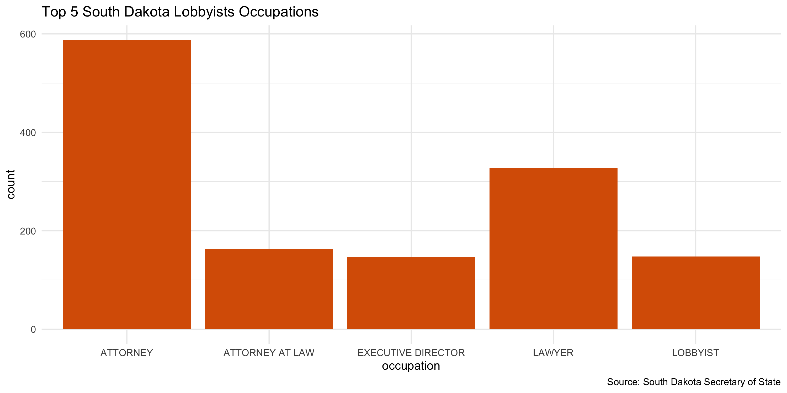
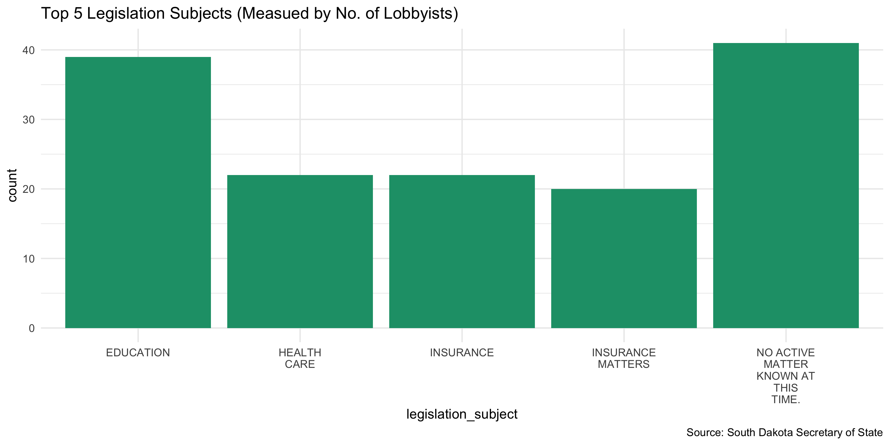

Nevada Lobbying Registration Data Diary
================
Yanqi Xu
2020-01-16 17:09:48

-   [Project](#project)
-   [Objectives](#objectives)
-   [Packages](#packages)
-   [Download](#download)
-   [Data](#data)
-   [Scrape](#scrape)
-   [Explore](#explore)
-   [Wrangle](#wrangle)
-   [Export](#export)

Project
-------

The Accountability Project is an effort to cut across data silos and give journalists, policy professionals, activists, and the public at large a simple way to search across huge volumes of public data about people and organizations.

Our goal is to standardizing public data on a few key fields by thinking of each dataset row as a transaction. For each transaction there should be (at least) 3 variables:

1.  All **parties** to a transaction
2.  The **date** of the transaction
3.  The **amount** of money involved

Objectives
----------

This document describes the process used to complete the following objectives:

1.  How many records are in the database?
2.  Check for duplicates
3.  Check ranges
4.  Is there anything blank or missing?
5.  Check for consistency issues
6.  Create a five-digit ZIP Code called `ZIP5`
7.  Create a `YEAR` field from the transaction date
8.  Make sure there is data on both parties to a transaction

Packages
--------

The following packages are needed to collect, manipulate, visualize, analyze, and communicate these results. The `pacman` package will facilitate their installation and attachment.

``` r
if (!require("pacman")) install.packages("pacman")
pacman::p_load_current_gh("irworkshop/campfin")
pacman::p_load(
  rvest, # read html tables
  httr, # interact with http requests
  stringdist, # levenshtein value
  tidyverse, # data manipulation
  lubridate, # datetime strings
  tidytext, # string analysis
  magrittr, # pipe opperators
  janitor, # dataframe clean
  refinr, # cluster and merge
  knitr, # knit documents
  glue, # combine strings
  scales, #format strings
  here, # relative storage
  fs, # search storage 
  vroom, #read deliminated files
  readxl, #read excel files
  pdftools #wrangle pdf texts
)
```

This document should be run as part of the `R_campfin` project, which lives as a sub-directory of the more general, language-agnostic \[`irworkshop/accountability_datacleaning`\]\[01\] GitHub repository.

The `R_campfin` project uses the \[RStudio projects\]\[02\] feature and should be run as such. The project also uses the dynamic `here::here()` tool for file paths relative to *your* machine.

Download
--------

Set the download directory first.

``` r
# create a directory for the raw data
doc_dir <- here("sd", "lobby", "docs")

raw_dir <- here("sd", "lobby", "data", "raw","reg")

dir_create(c(raw_dir, doc_dir))
```

Data
----

[South Dakota Statutes](http://sdlegislature.gov/statutes/Codified_laws/DisplayStatute.aspx?Statute=2-12&Type=StatuteChapter) regulate lobbyists, employer and lobbying activities as such. &gt; 2-12-1. Names of lobbyists to be registered with secretary of state--Termination of employment. Any person who employs any other person to act as a lobbyist to seek the introduction of legislation or to promote, oppose, or influence in any manner the passage by the Legislature of any legislation affecting the special interests of any agency, individual, association, or business, as distinct from those of the whole people of the state, or to act in any manner as a lobbyist in connection with any such legislation, shall register the name of the person so employed or agreed to be employed, with the secretary of state, to be included in a directory of registered lobbyists as hereinafter provided. The lobbyist shall also register with the secretary of state. Upon the termination of such employment prior to the adjournment sine die of a legislative session, such fact shall be entered opposite the name of any person so employed, either by the employer or employee. Source: SDC 1939, § 55.0701; SL 1977, ch 23, § 1; SL 1991, ch 23, § 1; SL 2017, ch 222 (Initiated Measure 22), § 64; SL 2017, ch 72, § 31, eff. Feb. 2, 2017.

> 2-12-4. Authorization to act as lobbyist for employer. Each lobbyist or employer shall file with the secretary of state, within ten days after the date of registration, a written or electronic authorization for a person to act as a lobbyist for an employer. The format for the authorization shall be prescribed by the secretary of state. Source: SDC 1939, § 55.0704; SL 1977, ch 23, § 4; SL 1991, ch 23, § 5; SL 2012, ch 21, § 1.

> 2-12-4. Authorization to act as lobbyist for employer. Each lobbyist or employer shall file with the secretary of state, within ten days after the date of registration, a written or electronic authorization for a person to act as a lobbyist for an employer. The format for the authorization shall be prescribed by the secretary of state. Source: SDC 1939, § 55.0704; SL 1977, ch 23, § 4; SL 1991, ch 23, § 5; SL 2012, ch 21, § 1.

> 2-12-7.1. Employees of executive branch, a constitutional office, or the judicial system representatives required to register as public employee lobbyists--Budgetary testimony before appropriations committees excepted. Any person employed in the executive branch of state government, a constitutional office, or the judicial system, who is not an elected official or who is not subject to confirmation by the senate, who is authorized to officially represent any department of the executive branch, constitutional office, Public Utilities Commission, or judicial system in any capacity before the Legislature or any of its several committees shall register as an executive or judicial agency representative for such department or office in the same manner and under the same provisions of this chapter as apply to all lobbyists, but need pay no fee. Every executive and judicial agency representative shall wear a badge which shall be visible at all times when engaged in representing the department. The badge shall be provided by the secretary of state and be of a color different from the color of lobbyist badges. The badge shall bear the identity of the agency the person has registered to represent and shall state the name of the person. The provisions of this chapter do not apply to employees of the executive branch testifying on budgetary matters before the appropriations committees of the Legislature. Source: SL 1977, ch 23, § 14; SL 1986, ch 25, § 1; SL 1991, ch 23, § 7.

Scrape
------

The [South Dakota SOS site](https://sosenterprise.sd.gov/BusinessServices/Lobbyist/LobbyistSearch.aspx) makes available all lobbyist and employer registrants from year 2016 to 2019. Since there's no way for us to export the data in a spreadsheet We will use `rvest` to scrape the website.

The underlying URLs for each year is generated by inspecting the network traffic tool.

``` r
sd_lob_url <- glue("https://sosenterprise.sd.gov/BusinessServices/Lobbyist/LobbyistSearch.aspx?__LASTFOCUS=&__EVENTTARGET=ctl00%24MainContent%24SearchButton&__EVENTARGUMENT=&__VIEWSTATE=QMUH%2F71bweLgBn%2BznQBR6rfE%2BXa%2F%2BStHPt1eZzPiGNdd6v4mDKH0DVVlNYfiG4oSt3BAIRCmyWlwoe6RrxZVMJOEYmejeDHzHkGw7j5PJerXmVLKXLbSWWipmGrNtmVvwUY0E3nmtXzmdF6ipkbBNVyVXEM2OPP8b4QTbOykcVPzkfhMxpyVqkuZCloJ7ek4xutnPgnMc5GuueAmZLHSo8UYe4xEagZxXfGvtOj6FOjORYsEE1fIVeLgbzrgqr8Sj0J8CX295pjHuDZclsdA7P%2FoB4VHrbq8HVNfL3bllAR%2Fkdf6Xx0z839EAoKOGfKyjzVCKFeV3Jc%2FX7DeEP1zc9LLNBuqkl1s4HsqwOA%2FLGGayjS8qwJcqOn4xt%2FyRnbm%2F4YWEFAVbeF2ANDzqKGl52VAja9dm8OFBL4R9cBTPrERqIAfQ4V5N92MpToQmEpCNmVk38titrJaxR%2BEZWNZN4qHxd3qU5qe8gj41oXIwfGEf6Hw6mLtVTQ31MxygpIwtjbGS08ojx9aEXenEYJ3Q7nciaoPzh%2B7KexvC5urZxZJryUV4oQbrYjYOSsZegGNo9AvPnDWb8kTQ5ZtkgpXj2owXRqCmy9PYjbRavJ78CoLZzev0GsF9Jrbs1J%2FyA5cPZX0uDt0ltopT207FyPoAqP5yqj1GGtOjrN6tM49muI6S9DMpEgqpgupGGvFj5W10BQBjcPf4dq3HHXXmc4%2FJuNaqr9FM0Dcglt%2FRrfOuapK9KYB09LEV40%2BqDwuA39U2zaFr%2FZxJZRgSIDHibV%2BJjlId56Br%2BFzu%2FqpnaNx7LBMU%2FhaGSeE%2BuKE%2BqRl6c7dhp6FeLakZf6UA1BRvkEMNeQIqqKyLyEws9QkW1cpCXvkxp0X9KwcEw2yjnJMnPwQVhOUa1XXjtqs%2FDHxl99%2BuX0UDUvSZx5CX8OreUgXxrDemvBLmDypFNj%2FRfzw7m2DTiApftHk83R4ncpL7OmAcvg%2FDvEhm%2Bbd9P4iKwLbGXiRLfbW&__VIEWSTATEGENERATOR=C5C1E4B2&__VIEWSTATEENCRYPTED=&__EVENTVALIDATION=lrPcPU9%2BUYIbTw9luMruEs9a93D61wh3%2FmT2MhlqL2WKQW1dDE7utJX6N1hlDGvdBrTXBlPwTaB0OG4Opc0aOwvcsVNsDyI1rQrkLDaeoYZ5O%2FB66lal9ya6149GgVoi9qjcY366%2BFySL10nVzziMsu3p2C05MVFpF5OQWz%2Bd95YACoUm%2B9m72Z4Lskw0XweIf%2BAqEszex3mllm066myEMFE6%2FRVMcmdjGSa2SXtk7dzrMxj7TT3BDKI4n5%2BAlyWDY0h80FPow61mkHk5d5P96Z82tgBO4fRej4x4w%2BnDoNCse%2BwcqEgTWO09PmP%2BT5klZZ9Ytfyy3p01KrujXgdyMg%2BfpKcgiEAlOIYSsdKVaFVy9fmkguKt9PCZgXA25MliNdtZjObTitOyJlxmgTwlmRnBNJlCAsyYvvFJfnyhYPON2DC&ctl00%24MainContent%24searchBy=chkSearchByPrivate&ctl00%24MainContent%24txtFirstName=&ctl00%24MainContent%24txtMiddleName=&ctl00%24MainContent%24txtLastName=&ctl00%24MainContent%24txtEmployerName=&ctl00%24MainContent%24txtSubject=&ctl00%24MainContent%24slctYears={2016:2020}")


parseweb <- function(lob_url){
  page <- GET(lob_url)
  
  table_content <- page %>% content() %>% html_nodes('table')

parsetb <- table_content[[1]] %>% html_table(header = T, fill = F) %>% distinct() %>% as_tibble()
# this line gets the relative paths of each lobbyist's individual page
  string <- 
  str_match_all(as.character(table_content[[1]]),'a href=(.+) class=')[[1]][,2] %>% 
    str_extract_all("L.+\\d") %>% unlist()

parsetb <- parsetb %>% mutate(ext_url = string %>% str_c("https://sosenterprise.sd.gov/BusinessServices/Lobbyist/",.))
  
return(parsetb)
}
```

Now we have a table that is identical to the table displayed on the SD SOS website. However, we can see that while the website does provide a table, it does not include lobbyist Employment Date, or client registration and authorization date. We'll scrape such information from every lobbyist's individual pages through the `registration_number` hyperlink.

``` r
sd_reg <- sd_lob_url %>% map_dfr(parseweb)
# function fetchspec goes into each link to the lobbyist ID and grab information.
fetchspec <- function(ext_url) {
  x <- GET(ext_url) 
  employment_date <- x %>% content() %>% html_node("#ctl00_MainContent_txtEmploymentDate") %>% html_text()
  employer_registration_date <- x %>% content() %>% html_node("#ctl00_MainContent_txtRegistrationDate") %>% html_text()
  authorization_date <- x %>% content() %>% html_node("#ctl00_MainContent_txtAuthorizationDate") %>% html_text()
  status <- x %>% content() %>% html_node("#ctl00_MainContent_txtStatus") %>% html_text()
  occupation <- x %>% content() %>% html_node("#ctl00_MainContent_txtOccupation") %>% html_text()
  legislation_subject <- x %>% content() %>% html_node("#ctl00_MainContent_txtSubject") %>% html_text()
  agent_name <- x %>% content() %>% html_node("#ctl00_MainContent_txtAgentName") %>% html_text()
  registration_number <- x %>% content() %>% html_node("#ctl00_MainContent_lblRegistrationNo") %>% html_text() %>% str_extract("\\d{6}")
  tib <- tibble(registration_number,ext_url,employment_date, occupation, status,employer_registration_date, authorization_date, legislation_subject)
  return(tib)
}

sd_reg <- sd_reg %>% clean_names()

start_time <- Sys.time()
sd_spec <- list(NA) %>% rep(nrow(sd_reg))
for (i in seq_along(sd_reg$ext_url)) {
  sd_spec[[i]] <- fetchspec(sd_reg$ext_url[i])
      loop_start <- Sys.time()
      loop_time <- Sys.time() - loop_start
    loop_time <- paste(round(loop_time, 2), attributes(loop_time)$units)
    total_time <- Sys.time() - start_time
    total_time <- paste(round(total_time, 2), attributes(total_time)$units)
    message(glue(
      "{i} done in {str_pad(loop_time, 2)}",
      "running for {str_pad(total_time, 2)}",
      "({percent(i/nrow(sd_reg))})", 
      .sep = "/"))
}
  
```

We can join the `sd_reg` dataframe with the scraped `sd_spec` dataframe

``` r
sd_reg_spec <- sd_spec %>% bind_rows() %>% 
  mutate(registration_number = as.integer(registration_number))

sd_reg <- sd_reg %>% 
  left_join(sd_reg_spec, 
            by = c('registration_number', 'ext_url'))
```

Now we have a structured dataframe to work with. We can now save it as raw.

``` r
raw_dir <- here("sd", "lobby", "data", "raw","reg")
dir_create(raw_dir)
sd_reg %>% 
  write_csv(
    path = glue("{raw_dir}/sd_lobby_reg.csv"),
    na = ""
  )
```

Explore
-------

``` r
head(sd_reg)
#> # A tibble: 6 x 15
#>   year  registration_nu… lobbyist lobbyist_city_s… lobbyist_phone_… employer employer_address
#>   <chr> <chr>            <chr>    <chr>            <chr>            <chr>    <chr>           
#> 1 2016  60707            MARCHAN… CAMBRIDGE , WI … (202) 309-1421   BRISTOL… 777 SCUDDERS MI…
#> 2 2016  60768            HOOD, J… SPEARFISH, SD 5… <NA>             SOUTH D… PO BOX 2110     
#> 3 2016  60769            HOOD, J… SPEARFISH, SD 5… <NA>             SOUTH D… PO BOX 582      
#> 4 2016  61690            HOOD, J… SPEARFISH, SD 5… <NA>             AMERICA… PO BOX 1140     
#> 5 2016  60840            HOOD, J… SPEARFISH, SD 5… <NA>             MISSOUR… PO BOX 88920    
#> 6 2016  60841            HOOD, J… SPEARFISH, SD 5… <NA>             SOUTH D… PO BOX 7137     
#> # … with 8 more variables: employer_city_state_zip <chr>, ext_url <chr>, employment_date <chr>,
#> #   occupation <chr>, status <chr>, employer_registration_date <chr>, authorization_date <chr>,
#> #   legislation_subject <chr>
tail(sd_reg)
#> # A tibble: 6 x 15
#>   year  registration_nu… lobbyist lobbyist_city_s… lobbyist_phone_… employer employer_address
#>   <chr> <chr>            <chr>    <chr>            <chr>            <chr>    <chr>           
#> 1 2020  103014           Underhi… PIERRE, SD 57501 curt.underhill@… South D… 19052 Hwy 1804  
#> 2 2020  103029           Booth, … Vermillion, SD … hannah.booth@co… Univers… 414 E Clark St  
#> 3 2020  103036           Pankrat… Sioux Falls, SD… ldpankratz49@gm… South D… 5000 S. Broadla…
#> 4 2020  103050           Pankrat… Sioux Falls, SD… ldpankratz49@gm… Deadwoo… 108 Sherman St. 
#> 5 2020  103051           Pankrat… Sioux Falls, SD… ldpankratz49@gm… South D… 4605 W. Homefie…
#> 6 2020  103040           Blau, R… Bayard, NE 69334 ryanne.blau@min… South D… 306 E Capitol A…
#> # … with 8 more variables: employer_city_state_zip <chr>, ext_url <chr>, employment_date <chr>,
#> #   occupation <chr>, status <chr>, employer_registration_date <chr>, authorization_date <chr>,
#> #   legislation_subject <chr>
glimpse(sample_frac(sd_reg))
#> Observations: 2,931
#> Variables: 15
#> $ year                       <chr> "2017", "2020", "2019", "2020", "2017", "2019", "2018", "2018…
#> $ registration_number        <chr> "62092", "102830", "100919", "102631", "62221", "100921", "10…
#> $ lobbyist                   <chr> "DIEGEL, JASPER", "Miller, Dianna", "Barranco, David C.", "Te…
#> $ lobbyist_city_state_zip    <chr> "PIERRE, SD 57501", "Sioux Falls, SD 57108", "Sioux Falls, SD…
#> $ lobbyist_phone_email       <chr> "(605) 929-8869carrelv@sdchamber.biz", "(605) 360-8108dianna.…
#> $ employer                   <chr> "SD CHAMBER OF COMMERCE & INDUSTRY", "South Dakota Counseling…
#> $ employer_address           <chr> "PO  BOX 190", "PO Box 95", "17 S Elkjer Circle", "330 South …
#> $ employer_city_state_zip    <chr> "PIERRE, SD 57501", "Aberdeen, SD 57402", "Sioux Falls, SD 57…
#> $ ext_url                    <chr> "https://sosenterprise.sd.gov/BusinessServices/Lobbyist/Lobby…
#> $ employment_date            <chr> "12/15/2016", "12/15/2019", "10/10/2018", "12/10/2019", "12/2…
#> $ occupation                 <chr> "YBA EXECUTIVE DIRECTOR", "Consultant", "Lawyer", "Executive …
#> $ status                     <chr> "Active", "Active", "Active", "Active", "Active", "Active", "…
#> $ employer_registration_date <chr> "12/15/2016", "1/6/2020", "11/21/2018", "12/12/2019", "12/21/…
#> $ authorization_date         <chr> "12/14/2016", "1/6/2020", "11/30/2018", "12/12/2019", "12/21/…
#> $ legislation_subject        <chr> NA, "education, counseling issues, budget, mental health", "L…
```

``` r
col_stats(sd_reg, count_na)
#> # A tibble: 15 x 4
#>    col                        class     n       p
#>    <chr>                      <chr> <int>   <dbl>
#>  1 year                       <chr>     0 0      
#>  2 registration_number        <chr>     0 0      
#>  3 lobbyist                   <chr>     0 0      
#>  4 lobbyist_city_state_zip    <chr>     0 0      
#>  5 lobbyist_phone_email       <chr>   245 0.0836 
#>  6 employer                   <chr>     0 0      
#>  7 employer_address           <chr>     0 0      
#>  8 employer_city_state_zip    <chr>     0 0      
#>  9 ext_url                    <chr>     0 0      
#> 10 employment_date            <chr>     0 0      
#> 11 occupation                 <chr>     5 0.00171
#> 12 status                     <chr>     0 0      
#> 13 employer_registration_date <chr>     0 0      
#> 14 authorization_date         <chr>    56 0.0191 
#> 15 legislation_subject        <chr>  1229 0.419
```

``` r
col_stats(sd_reg, n_distinct)
#> # A tibble: 15 x 4
#>    col                        class     n        p
#>    <chr>                      <chr> <int>    <dbl>
#>  1 year                       <chr>     5 0.00171 
#>  2 registration_number        <chr>  2931 1       
#>  3 lobbyist                   <chr>   995 0.339   
#>  4 lobbyist_city_state_zip    <chr>   409 0.140   
#>  5 lobbyist_phone_email       <chr>   937 0.320   
#>  6 employer                   <chr>   952 0.325   
#>  7 employer_address           <chr>   995 0.339   
#>  8 employer_city_state_zip    <chr>   389 0.133   
#>  9 ext_url                    <chr>  2931 1       
#> 10 employment_date            <chr>   482 0.164   
#> 11 occupation                 <chr>   640 0.218   
#> 12 status                     <chr>     2 0.000682
#> 13 employer_registration_date <chr>   370 0.126   
#> 14 authorization_date         <chr>   398 0.136   
#> 15 legislation_subject        <chr>  1023 0.349
```

``` r
sd_reg <-  sd_reg %>% 
  mutate_if(is.character, str_to_upper) %>% 
  mutate_if(is.character, na_if, "")
```

The dates columns are parsed as strings. Use `as.Date` to convert to datetime objects.

``` r
sd_reg <- sd_reg %>% 
  mutate_at(vars(ends_with('date')), as.Date, format = "%m/%d/%Y")
```


What are the most common occupations of lobbyists?

``` r
sd_reg %>% 
  count(occupation) %>% 
  arrange(desc(n)) %>% 
  head(5) %>% 
  ggplot(aes(x= occupation, y = n,)) +
  geom_col(fill = RColorBrewer::brewer.pal(3, "Dark2")[2]) +
  labs(
    title = "Top 5 South Dakota Lobbyists Occupations",
    caption = "Source: South Dakota Secretary of State",
    y = 'count'
  ) +
  theme_minimal()
```

 What are the top issues that have the largest numbers of lobbyists on?

``` r
sd_reg %>% 
  count(legislation_subject) %>% 
    arrange(desc(n)) %>% 
  na.omit() %>% 
  head(5) %>%
  ggplot(aes(x= legislation_subject, y = n,)) +
  geom_col(fill = RColorBrewer::brewer.pal(3, "Dark2")[1]) +
  labs(
    title = "Top 5 Legislation Subjects (Measued by No. of Lobbyists)",
    caption = "Source: South Dakota Secretary of State",
    y = 'count'
  ) +
  theme_minimal()
```



### Duplicates

We'll use the `flag_dupes()` function to see if there are records identical to one another and flag the duplicates. A new variable `dupe_flag` will be created.

``` r
sd_reg <- flag_dupes(sd_reg, dplyr::everything())
```

### Missing

We'll use the `flag_na()` function to flag rows where the lobbyist, employer and `authorization_date`

``` r
sd_reg <- flag_na(sd_reg, lobbyist, employer, authorization_date)
```

Wrangle
-------

### Separate

We can see that the lobbyist's email and phone numbers are sometimes jumbled together in one field. We will use regular expressions to separate them.

``` r
regex_phone <- "\\(\\d{3}\\)\\s\\d{3}-\\d{4}"
#clean lobbyist first
sd_reg <- sd_reg %>% 
  separate(lobbyist_city_state_zip, into = c('lobbyist_city','lobbyist_state_zip'), remove = FALSE, sep = ",\\s") %>% 
  separate(lobbyist_state_zip, into = c('lobbyist_state','lobbyist_zip'), remove = TRUE, sep = "\\s+")
#clean employer city_state_zip
# There are some entries with ", , ", replace with ", "
sd_reg <- sd_reg %>% 
  mutate(employer_city_state_zip = str_replace_all(employer_city_state_zip, ", MO, MO ",", MO ")) %>% 
  mutate(employer_city_state_zip = str_replace_all(employer_city_state_zip, ", , ",", ")) %>% 
  separate(employer_city_state_zip, into = c('employer_city','employer_state_zip'), remove = FALSE, sep = ",\\s") %>% 
  separate(employer_state_zip, into = c('employer_state','employer_zip'), remove = TRUE, sep = "\\s+")
```

Next we'll separate the city and zip for the lobbyist fields.

``` r
sd_reg <- sd_reg %>% 
  mutate(lobbyist_city_state_zip = str_extract(lobbyist_phone_email, regex_phone),
         lobbyist_email = str_remove(lobbyist_phone_email, regex_phone))
```

### ZIP

We can use `normal_zip` to normalize the ZIP column.

``` r
prop_in(sd_reg$lobbyist_zip, valid_zip, na.rm = TRUE) %>% percent()
#> [1] "98%"

sd_reg <- sd_reg %>% 
  mutate(lobbyist_zip5 = normal_zip(lobbyist_zip, na_rep = TRUE))

prop_in(sd_reg$lobbyist_zip5, valid_zip, na.rm = TRUE) %>% percent()
#> [1] "100%"
```

``` r
prop_in(sd_reg$employer_zip, valid_zip, na.rm = TRUE) %>% percent()
#> [1] "99%"

sd_reg <- sd_reg %>% 
  mutate(employer_zip5 = normal_zip(employer_zip, na_rep = TRUE))

prop_in(sd_reg$employer_zip5, valid_zip, na.rm = TRUE) %>% percent()
#> [1] "100%"
```

### State

The state field is clean and doesn't need additional cleaning.

``` r
prop_in(sd_reg$lobbyist_state, valid_state, na.rm = TRUE) %>% percent()
#> [1] "100%"
prop_in(sd_reg$employer_state, valid_state, na.rm = TRUE) %>% percent()
#> [1] "100%"
```

### City

#### Normalize

``` r
prop_in(sd_reg$lobbyist_city, valid_city, na.rm = TRUE) %>% percent()
#> [1] "95%"
prop_in(sd_reg$employer_city, valid_city, na.rm = TRUE) %>% percent()
#> [1] "94%"

sd_reg <- sd_reg %>% 
  mutate_at(.vars = vars(ends_with('city')),
            .funs = list(norm = normal_city),
                                            abbs = usps_city,
                                            states = c(valid_state),
                                            na = invalid_city,
                                            na_rep = TRUE)
prop_in(sd_reg$lobbyist_city_norm, valid_city, na.rm = TRUE) %>% percent()
#> [1] "98%"
prop_in(sd_reg$employer_city_norm, valid_city, na.rm = TRUE) %>% percent()
#> [1] "98%"
```

#### Swap

``` r
sd_reg <- sd_reg %>% 
  left_join(
    y = zipcodes,
    by = c(
      "lobbyist_state" = "state",
      "lobbyist_zip5" = "zip"
    )
  ) %>% 
  rename(lobbyist_city_match = city) %>% 
  mutate(
    lob_match_abb = is_abbrev(lobbyist_city_norm, lobbyist_city_match),
    lob_match_dist = str_dist(lobbyist_city_norm, lobbyist_city_match),
    lobbyist_city_swap = if_else(
      condition = lob_match_abb | lob_match_dist == 1,
      true = lobbyist_city_match,
      false = lobbyist_city_norm
    )
  ) %>% 
  select(
    -lobbyist_city_match,
    -lob_match_abb,
    -lob_match_dist
  )

prop_in(sd_reg$lobbyist_city_swap, valid_city, na.rm = TRUE) %>% percent()
#> [1] "100%"
```

``` r
sd_reg <- sd_reg %>% 
  left_join(
    y = zipcodes,
    by = c(
      "employer_state" = "state",
      "employer_zip5" = "zip"
    )
  ) %>% 
  rename(employer_city_match = city) %>% 
  mutate(
    emp_match_abb = is_abbrev(employer_city_norm, employer_city_match),
    emp_match_dist = str_dist(employer_city_norm, employer_city_match),
    employer_city_swap = if_else(
      condition = emp_match_abb | emp_match_dist == 1,
      true = employer_city_match,
      false = employer_city_norm
    )
  ) %>% 
  select(
    -employer_city_match,
    -emp_match_abb,
    -emp_match_dist
  )

prop_in(sd_reg$employer_city_swap, valid_city, na.rm = TRUE) %>% percent()
#> [1] "99%"
```

Besides the `valid_city` vector, there is another vector of `extra_city` that contains other locales. We'll incorporate that in our comparison.

    #> [1] 0.9965588
    #> [1] 0.9993113

| stage                |   prop\_in|  n\_distinct|   prop\_na|  n\_out|  n\_diff|
|:---------------------|----------:|------------:|----------:|-------:|--------:|
| lobbyist\_city       |  0.9549642|          237|  0.0000000|     132|       36|
| lobbyist\_city\_norm |  0.9860116|          221|  0.0000000|      41|       15|
| lobbyist\_city\_swap |  0.9993113|          205|  0.0092119|       2|        3|
| employer\_city\_swap |  0.9965588|          165|  0.0085295|      10|        4|
| employer\_city       |  0.9471170|          191|  0.0000000|     155|       33|
| employer\_city\_norm |  0.9901058|          171|  0.0000000|      29|       10|
| employer\_city\_swap |  0.9965588|          165|  0.0085295|      10|        4|

#### Address

``` r
sd_reg <- sd_reg %>%
  mutate(employer_address_clean = normal_address(
  address = employer_address,
  abbs = usps_city,
  na_rep = TRUE
  ))
```

Export
------

``` r
clean_dir <- here("sd", "lobby", "data", "processed","reg")
dir_create(clean_dir)
sd_reg %>% 
  select(-ext_url) %>% 
  rename(lobbyist_city_clean = lobbyist_city_swap,
         employer_city_clean = employer_city_swap) %>% 
  write_csv(
    path = glue("{clean_dir}/ut_lobby_reg.csv"),
    na = ""
  )
```
